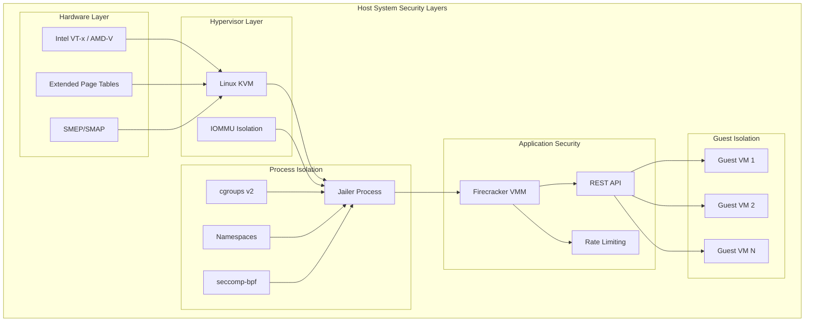

## Table of Contents

## Introduction

In multi-tenant serverless environments, security is paramount. Firecracker was architected from the ground up with a security-first approach, providing strong isolation guarantees while maintaining minimal overhead. This guide explores Firecracker's comprehensive security model, from hardware virtualization to process isolation and resource controls.

Firecracker's security architecture embodies the principle of defense-in-depth, layering multiple security mechanisms to create a robust barrier against potential threats. Understanding these mechanisms is crucial for deploying Firecracker in production environments where customer workloads must be isolated from each other and the host system.

## Security Architecture Overview



### Core Security Principles

Firecracker's security design follows these fundamental principles:

**Minimal Attack Surface**: Firecracker exposes only 5 emulated devices, significantly reducing potential attack vectors
**Memory Safety**: Written in Rust, eliminating entire classes of memory safety vulnerabilities
**Process Isolation**: Each microVM runs in a separate process with strict resource controls
**Hardware Virtualization**: Leverages CPU virtualization features for strong isolation
**Principle of Least Privilege**: Minimal required permissions and system call access

## Hardware-Level Security

### CPU Virtualization Features

```bash
# Check for hardware virtualization support
grep -E 'vmx|svm' /proc/cpuinfo

# Intel VT-x features
grep -E 'vmx|ept|vpid' /proc/cpuinfo

# AMD-V features  
grep -E 'svm|npt|nrip' /proc/cpuinfo

# Check for additional security features
grep -E 'smep|smap|pku|cet' /proc/cpuinfo
```

### Memory Protection

```python
#!/usr/bin/env python3
import subprocess
import re

def check_memory_security_features():
    """Check available memory security features"""
    
    features = {}
    
    # Check for SMEP (Supervisor Mode Execution Prevention)
    try:
        result = subprocess.run(['grep', 'smep', '/proc/cpuinfo'], 
                               capture_output=True, text=True)
        features['smep'] = 'smep' in result.stdout
    except:
        features['smep'] = False
    
    # Check for SMAP (Supervisor Mode Access Prevention)
    try:
        result = subprocess.run(['grep', 'smap', '/proc/cpuinfo'], 
                               capture_output=True, text=True)
        features['smap'] = 'smap' in result.stdout
    except:
        features['smap'] = False
    
    # Check for Intel MPX (Memory Protection Extensions)
    try:
        result = subprocess.run(['grep', 'mpx', '/proc/cpuinfo'], 
                               capture_output=True, text=True)
        features['mpx'] = 'mpx' in result.stdout
    except:
        features['mpx'] = False
    
    # Check for Intel CET (Control-flow Enforcement Technology)
    try:
        result = subprocess.run(['grep', 'cet', '/proc/cpuinfo'], 
                               capture_output=True, text=True)
        features['cet'] = 'cet' in result.stdout
    except:
        features['cet'] = False
    
    # Check kernel KASLR (Kernel Address Space Layout Randomization)
    try:
        with open('/proc/cmdline', 'r') as f:
            cmdline = f.read()
            features['kaslr'] = 'nokaslr' not in cmdline
    except:
        features['kaslr'] = False
    
    return features

# Check memory protection
features = check_memory_security_features()
print("Memory Security Features:")
for feature, available in features.items():
    status = "✓" if available else "✗"
    print(f"  {status} {feature.upper()}")
```

### IOMMU Configuration

```bash
# Enable IOMMU for additional isolation
# Intel IOMMU
echo 'GRUB_CMDLINE_LINUX_DEFAULT="intel_iommu=on iommu=pt"' >> /etc/default/grub

# AMD IOMMU
echo 'GRUB_CMDLINE_LINUX_DEFAULT="amd_iommu=on iommu=pt"' >> /etc/default/grub

# Update GRUB configuration
update-grub
reboot

# Verify IOMMU is enabled
dmesg | grep -i iommu
ls /sys/kernel/iommu_groups/
```

## Jailer: Process Isolation

The Jailer is Firecracker's security wrapper that provides comprehensive process isolation using Linux security primitives.

### Basic Jailer Usage

```bash
#!/bin/bash

# Create jailer workspace
sudo mkdir -p /srv/jailer
sudo chown -R 1000:1000 /srv/jailer

# Run Firecracker with jailer
sudo jailer \
  --id vm001 \
  --exec-file /usr/local/bin/firecracker \
  --uid 1000 \
  --gid 1000 \
  --chroot-base-dir /srv/jailer \
  --netns /proc/self/ns/net \
  --daemonize \
  --new-pid-ns \
  -- \
  --api-sock socket \
  --config-file vm_config.json
```

### Advanced Jailer Configuration

```python
#!/usr/bin/env python3
import json
import os
import subprocess
import tempfile
from pathlib import Path

class SecureJailer:
    def __init__(self, base_dir="/srv/jailer"):
        self.base_dir = Path(base_dir)
        self.instances = {}
    
    def create_secure_environment(self, vm_id, config):
        """Create a secure isolated environment for a microVM"""
        
        # Create VM-specific directories
        vm_dir = self.base_dir / vm_id
        vm_dir.mkdir(parents=True, exist_ok=True)
        
        # Create chroot structure
        chroot_dirs = ['bin', 'lib', 'lib64', 'dev', 'proc', 'sys', 'tmp']
        for dir_name in chroot_dirs:
            (vm_dir / dir_name).mkdir(exist_ok=True)
        
        # Copy required binaries and libraries
        self._setup_chroot_binaries(vm_dir)
        
        # Set up device nodes
        self._create_device_nodes(vm_dir / 'dev')
        
        # Configure resource limits
        cgroup_config = self._setup_cgroups(vm_id, config.get('resources', {}))
        
        # Generate jailer command
        jailer_cmd = self._build_jailer_command(vm_id, vm_dir, config)
        
        self.instances[vm_id] = {
            'directory': vm_dir,
            'cgroup': cgroup_config,
            'command': jailer_cmd
        }
        
        return jailer_cmd
    
    def _setup_chroot_binaries(self, chroot_dir):
        """Set up minimal binaries in chroot environment"""
        
        # Copy Firecracker binary
        firecracker_src = '/usr/local/bin/firecracker'
        firecracker_dst = chroot_dir / 'bin' / 'firecracker'
        
        os.makedirs(firecracker_dst.parent, exist_ok=True)
        subprocess.run(['cp', firecracker_src, firecracker_dst], check=True)
        
        # Copy required libraries using ldd
        ldd_output = subprocess.run(
            ['ldd', firecracker_src],
            capture_output=True, text=True
        ).stdout
        
        for line in ldd_output.split('\n'):
            if '=>' in line and '/' in line:
                lib_path = line.split('=>')[1].strip().split()[0]
                if lib_path.startswith('/'):
                    lib_dst = chroot_dir / lib_path.lstrip('/')
                    lib_dst.parent.mkdir(parents=True, exist_ok=True)
                    subprocess.run(['cp', lib_path, lib_dst], check=True)
    
    def _create_device_nodes(self, dev_dir):
        """Create necessary device nodes in chroot"""
        
        devices = [
            ('null', 'c', 1, 3, 0o666),
            ('zero', 'c', 1, 5, 0o666),
            ('random', 'c', 1, 8, 0o666),
            ('urandom', 'c', 1, 9, 0o666),
            ('kvm', 'c', 10, 232, 0o660)
        ]
        
        for name, type_char, major, minor, mode in devices:
            device_path = dev_dir / name
            subprocess.run([
                'sudo', 'mknod', str(device_path),
                type_char, str(major), str(minor)
            ], check=True)
            subprocess.run(['sudo', 'chmod', oct(mode), str(device_path)], check=True)
    
    def _setup_cgroups(self, vm_id, resources):
        """Set up cgroups v2 for resource isolation"""
        
        cgroup_path = f"/sys/fs/cgroup/firecracker/{vm_id}"
        os.makedirs(cgroup_path, exist_ok=True)
        
        # Memory limit
        if 'memory_mb' in resources:
            with open(f"{cgroup_path}/memory.max", 'w') as f:
                f.write(str(resources['memory_mb'] * 1024 * 1024))
        
        # CPU limit
        if 'cpu_quota' in resources:
            with open(f"{cgroup_path}/cpu.max", 'w') as f:
                f.write(f"{resources['cpu_quota']} 100000")
        
        # I/O limits
        if 'io_weight' in resources:
            with open(f"{cgroup_path}/io.weight", 'w') as f:
                f.write(str(resources['io_weight']))
        
        return cgroup_path
    
    def _build_jailer_command(self, vm_id, vm_dir, config):
        """Build the jailer command with security options"""
        
        cmd = [
            'sudo', 'jailer',
            '--id', vm_id,
            '--exec-file', '/usr/local/bin/firecracker',
            '--uid', str(config.get('uid', 1000)),
            '--gid', str(config.get('gid', 1000)),
            '--chroot-base-dir', str(vm_dir),
            '--daemonize'
        ]
        
        # Network namespace isolation
        if config.get('new_netns', True):
            cmd.extend(['--new-pid-ns'])
        
        # Additional namespaces
        if config.get('new_pid_ns', True):
            cmd.extend(['--new-pid-ns'])
        
        # Resource constraints
        if 'numa_node' in config:
            cmd.extend(['--numa-node', str(config['numa_node'])])
        
        # Firecracker arguments
        cmd.append('--')
        cmd.extend(['--api-sock', 'socket'])
        
        if config.get('config_file'):
            cmd.extend(['--config-file', config['config_file']])
        
        return cmd
    
    def cleanup_instance(self, vm_id):
        """Clean up instance resources"""
        
        if vm_id in self.instances:
            instance = self.instances[vm_id]
            
            # Remove cgroup
            cgroup_path = instance['cgroup']
            if os.path.exists(cgroup_path):
                subprocess.run(['sudo', 'rmdir', cgroup_path], check=False)
            
            # Remove instance directory
            subprocess.run(['sudo', 'rm', '-rf', str(instance['directory'])], check=False)
            
            del self.instances[vm_id]

# Usage example
if __name__ == '__main__':
    jailer = SecureJailer()
    
    config = {
        'uid': 1000,
        'gid': 1000,
        'new_netns': True,
        'new_pid_ns': True,
        'numa_node': 0,
        'resources': {
            'memory_mb': 512,
            'cpu_quota': 50000,  # 50% of one CPU
            'io_weight': 100
        }
    }
    
    cmd = jailer.create_secure_environment('test-vm', config)
    print("Jailer command:")
    print(' '.join(cmd))
```

## Seccomp-BPF Filtering

Firecracker uses seccomp-BPF (Berkeley Packet Filter) to restrict system calls, dramatically reducing the attack surface.

### Default Seccomp Profile

```json
{
  "seccomp": {
    "default_action": "kill_process",
    "filters": [
      {
        "syscalls": [
          "accept4",
          "brk",
          "clock_gettime",
          "close",
          "connect",
          "dup",
          "epoll_ctl",
          "epoll_pwait",
          "exit",
          "exit_group",
          "fcntl",
          "fstat",
          "futex",
          "getpid",
          "ioctl",
          "lseek",
          "mmap",
          "munmap",
          "open",
          "openat",
          "pipe",
          "prctl",
          "pread64",
          "pwrite64",
          "read",
          "readv",
          "recvfrom",
          "rt_sigaction",
          "rt_sigprocmask",
          "rt_sigreturn",
          "sendto",
          "sigaltstack",
          "socket",
          "stat",
          "timerfd_create",
          "timerfd_settime",
          "write",
          "writev"
        ],
        "action": "allow"
      },
      {
        "syscalls": ["tkill"],
        "action": "allow",
        "args": [
          {
            "index": 1,
            "type": "dword",
            "op": "eq",
            "val": 15,
            "comment": "SIGTERM"
          }
        ]
      }
    ]
  }
}
```

### Custom Seccomp Profiles

```python
#!/usr/bin/env python3
import json

class SeccompProfileGenerator:
    """Generate custom seccomp profiles for Firecracker"""
    
    # Base required syscalls for Firecracker
    BASE_SYSCALLS = [
        "accept4", "brk", "clock_gettime", "close", "connect",
        "dup", "epoll_ctl", "epoll_pwait", "exit", "exit_group",
        "fcntl", "fstat", "futex", "getpid", "ioctl", "lseek",
        "mmap", "munmap", "open", "openat", "pipe", "prctl",
        "pread64", "pwrite64", "read", "readv", "recvfrom",
        "rt_sigaction", "rt_sigprocmask", "rt_sigreturn",
        "sendto", "sigaltstack", "socket", "stat",
        "timerfd_create", "timerfd_settime", "write", "writev"
    ]
    
    # Additional syscalls for specific features
    FEATURE_SYSCALLS = {
        'networking': ['bind', 'listen', 'getsockopt', 'setsockopt'],
        'file_operations': ['ftruncate', 'fsync', 'unlink', 'rename'],
        'memory_advanced': ['madvise', 'mprotect', 'mremap'],
        'process_control': ['clone', 'fork', 'execve', 'wait4'],
        'time_operations': ['gettimeofday', 'nanosleep', 'clock_nanosleep']
    }
    
    # Dangerous syscalls to never allow
    BLOCKED_SYSCALLS = [
        'ptrace', 'kexec_load', 'create_module', 'init_module',
        'delete_module', 'ioperm', 'iopl', 'mount', 'umount2',
        'swapon', 'swapoff', 'reboot', 'sethostname', 'setdomainname',
        'acct', 'chroot', 'pivot_root'
    ]
    
    def generate_profile(self, features=None, custom_syscalls=None):
        """Generate a seccomp profile with specified features"""
        
        if features is None:
            features = []
        if custom_syscalls is None:
            custom_syscalls = []
        
        # Start with base syscalls
        allowed_syscalls = self.BASE_SYSCALLS.copy()
        
        # Add feature-specific syscalls
        for feature in features:
            if feature in self.FEATURE_SYSCALLS:
                allowed_syscalls.extend(self.FEATURE_SYSCALLS[feature])
        
        # Add custom syscalls
        allowed_syscalls.extend(custom_syscalls)
        
        # Remove duplicates and blocked syscalls
        allowed_syscalls = list(set(allowed_syscalls))
        allowed_syscalls = [sc for sc in allowed_syscalls if sc not in self.BLOCKED_SYSCALLS]
        allowed_syscalls.sort()
        
        profile = {
            "seccomp": {
                "default_action": "kill_process",
                "filters": [
                    {
                        "syscalls": allowed_syscalls,
                        "action": "allow"
                    }
                ]
            }
        }
        
        return profile
    
    def generate_conditional_profile(self, conditions):
        """Generate profile with conditional syscall permissions"""
        
        filters = []
        
        # Base allow filter
        filters.append({
            "syscalls": self.BASE_SYSCALLS,
            "action": "allow"
        })
        
        # Add conditional filters
        for condition in conditions:
            syscall = condition['syscall']
            args = condition.get('args', [])
            action = condition.get('action', 'allow')
            
            filter_entry = {
                "syscalls": [syscall],
                "action": action
            }
            
            if args:
                filter_entry['args'] = args
            
            filters.append(filter_entry)
        
        profile = {
            "seccomp": {
                "default_action": "kill_process",
                "filters": filters
            }
        }
        
        return profile
    
    def validate_profile(self, profile):
        """Validate seccomp profile structure"""
        
        required_keys = ['seccomp']
        seccomp_keys = ['default_action', 'filters']
        
        if not all(key in profile for key in required_keys):
            return False, "Missing required top-level keys"
        
        seccomp = profile['seccomp']
        if not all(key in seccomp for key in seccomp_keys):
            return False, "Missing required seccomp keys"
        
        # Check for dangerous syscalls
        all_syscalls = []
        for filter_entry in seccomp['filters']:
            if 'syscalls' in filter_entry:
                all_syscalls.extend(filter_entry['syscalls'])
        
        dangerous_found = [sc for sc in all_syscalls if sc in self.BLOCKED_SYSCALLS]
        if dangerous_found:
            return False, f"Dangerous syscalls found: {dangerous_found}"
        
        return True, "Profile is valid"

# Usage examples
if __name__ == '__main__':
    generator = SeccompProfileGenerator()
    
    # Generate basic profile
    basic_profile = generator.generate_profile()
    print("Basic Profile:")
    print(json.dumps(basic_profile, indent=2))
    
    # Generate profile with networking features
    network_profile = generator.generate_profile(features=['networking'])
    print("\nNetworking Profile:")
    print(json.dumps(network_profile, indent=2))
    
    # Generate conditional profile
    conditions = [
        {
            'syscall': 'tkill',
            'action': 'allow',
            'args': [
                {
                    'index': 1,
                    'type': 'dword',
                    'op': 'eq',
                    'val': 15,
                    'comment': 'SIGTERM'
                }
            ]
        }
    ]
    
    conditional_profile = generator.generate_conditional_profile(conditions)
    print("\nConditional Profile:")
    print(json.dumps(conditional_profile, indent=2))
    
    # Validate profile
    valid, message = generator.validate_profile(basic_profile)
    print(f"\nProfile validation: {valid} - {message}")
```

### Applying Custom Seccomp Profiles

```bash
#!/bin/bash

# Create custom seccomp profile
cat > custom_seccomp.json << 'EOF'
{
  "seccomp": {
    "default_action": "kill_process",
    "filters": [
      {
        "syscalls": [
          "accept4", "brk", "clock_gettime", "close", "connect",
          "dup", "epoll_ctl", "epoll_pwait", "exit", "exit_group",
          "fcntl", "fstat", "futex", "getpid", "ioctl", "lseek",
          "mmap", "munmap", "open", "openat", "pipe", "prctl",
          "pread64", "pwrite64", "read", "readv", "recvfrom",
          "rt_sigaction", "rt_sigprocmask", "rt_sigreturn",
          "sendto", "sigaltstack", "socket", "stat",
          "timerfd_create", "timerfd_settime", "write", "writev"
        ],
        "action": "allow"
      },
      {
        "syscalls": ["bind", "listen"],
        "action": "allow",
        "comment": "Allow networking syscalls"
      }
    ]
  }
}
EOF

# Run Firecracker with custom seccomp profile
firecracker \
  --api-sock /tmp/firecracker.socket \
  --seccomp-filter custom_seccomp.json \
  --config-file vm_config.json
```

## Resource Isolation with Cgroups

Cgroups provide fine-grained resource control and isolation for Firecracker processes.

### Cgroups v2 Configuration

```python
#!/usr/bin/env python3
import os
import subprocess
from pathlib import Path

class CgroupManager:
    """Manage cgroups v2 for Firecracker instances"""
    
    def __init__(self, base_path="/sys/fs/cgroup/firecracker"):
        self.base_path = Path(base_path)
        self.base_path.mkdir(parents=True, exist_ok=True)
        
        # Enable required controllers
        self._enable_controllers(['cpu', 'memory', 'io', 'pids'])
    
    def _enable_controllers(self, controllers):
        """Enable cgroup controllers"""
        
        try:
            # Enable controllers in parent cgroup
            parent_controllers = self.base_path.parent / "cgroup.subtree_control"
            if parent_controllers.exists():
                with open(parent_controllers, 'w') as f:
                    f.write(' '.join(f'+{c}' for c in controllers))
        except PermissionError:
            print(f"Warning: Cannot enable controllers. Run with sudo or check permissions.")
    
    def create_vm_cgroup(self, vm_id, limits):
        """Create cgroup for a specific VM with resource limits"""
        
        vm_cgroup = self.base_path / vm_id
        vm_cgroup.mkdir(exist_ok=True)
        
        # Set memory limits
        if 'memory_mb' in limits:
            self._set_memory_limit(vm_cgroup, limits['memory_mb'])
        
        # Set CPU limits
        if 'cpu_quota' in limits:
            self._set_cpu_limit(vm_cgroup, limits['cpu_quota'])
        
        # Set I/O limits
        if 'io_limits' in limits:
            self._set_io_limits(vm_cgroup, limits['io_limits'])
        
        # Set process limits
        if 'max_pids' in limits:
            self._set_pid_limit(vm_cgroup, limits['max_pids'])
        
        return str(vm_cgroup)
    
    def _set_memory_limit(self, cgroup_path, memory_mb):
        """Set memory limits for cgroup"""
        
        memory_bytes = memory_mb * 1024 * 1024
        
        # Hard memory limit
        memory_max = cgroup_path / "memory.max"
        with open(memory_max, 'w') as f:
            f.write(str(memory_bytes))
        
        # Soft memory limit (for memory pressure)
        memory_high = cgroup_path / "memory.high"
        with open(memory_high, 'w') as f:
            f.write(str(int(memory_bytes * 0.9)))  # 90% of max
        
        # Swap limit
        memory_swap_max = cgroup_path / "memory.swap.max"
        if memory_swap_max.exists():
            with open(memory_swap_max, 'w') as f:
                f.write(str(memory_bytes // 2))  # 50% of memory as swap
    
    def _set_cpu_limit(self, cgroup_path, cpu_quota_us):
        """Set CPU limits for cgroup"""
        
        # CPU quota in microseconds per 100ms period
        cpu_max = cgroup_path / "cpu.max"
        with open(cpu_max, 'w') as f:
            f.write(f"{cpu_quota_us} 100000")
        
        # CPU weight (relative priority)
        cpu_weight = cgroup_path / "cpu.weight"
        with open(cpu_weight, 'w') as f:
            f.write("100")  # Default weight
    
    def _set_io_limits(self, cgroup_path, io_limits):
        """Set I/O limits for cgroup"""
        
        # I/O weight
        if 'weight' in io_limits:
            io_weight = cgroup_path / "io.weight"
            with open(io_weight, 'w') as f:
                f.write(str(io_limits['weight']))
        
        # I/O bandwidth limits
        if 'bps_limits' in io_limits:
            io_max = cgroup_path / "io.max"
            with open(io_max, 'w') as f:
                for device, limits_dict in io_limits['bps_limits'].items():
                    rbps = limits_dict.get('rbps', 'max')
                    wbps = limits_dict.get('wbps', 'max')
                    riops = limits_dict.get('riops', 'max')
                    wiops = limits_dict.get('wiops', 'max')
                    f.write(f"{device} rbps={rbps} wbps={wbps} riops={riops} wiops={wiops}\n")
    
    def _set_pid_limit(self, cgroup_path, max_pids):
        """Set process limit for cgroup"""
        
        pids_max = cgroup_path / "pids.max"
        with open(pids_max, 'w') as f:
            f.write(str(max_pids))
    
    def add_process_to_cgroup(self, cgroup_path, pid):
        """Add process to cgroup"""
        
        procs_file = Path(cgroup_path) / "cgroup.procs"
        with open(procs_file, 'w') as f:
            f.write(str(pid))
    
    def get_cgroup_stats(self, cgroup_path):
        """Get cgroup resource usage statistics"""
        
        stats = {}
        cgroup_path = Path(cgroup_path)
        
        # Memory stats
        memory_current = cgroup_path / "memory.current"
        if memory_current.exists():
            with open(memory_current, 'r') as f:
                stats['memory_current'] = int(f.read().strip())
        
        memory_stat = cgroup_path / "memory.stat"
        if memory_stat.exists():
            memory_details = {}
            with open(memory_stat, 'r') as f:
                for line in f:
                    key, value = line.strip().split()
                    memory_details[key] = int(value)
            stats['memory_details'] = memory_details
        
        # CPU stats
        cpu_stat = cgroup_path / "cpu.stat"
        if cpu_stat.exists():
            cpu_details = {}
            with open(cpu_stat, 'r') as f:
                for line in f:
                    key, value = line.strip().split()
                    cpu_details[key] = int(value)
            stats['cpu_details'] = cpu_details
        
        # I/O stats
        io_stat = cgroup_path / "io.stat"
        if io_stat.exists():
            io_details = {}
            with open(io_stat, 'r') as f:
                for line in f:
                    parts = line.strip().split()
                    device = parts[0]
                    device_stats = {}
                    for stat in parts[1:]:
                        key, value = stat.split('=')
                        device_stats[key] = int(value)
                    io_details[device] = device_stats
            stats['io_details'] = io_details
        
        # PID stats
        pids_current = cgroup_path / "pids.current"
        if pids_current.exists():
            with open(pids_current, 'r') as f:
                stats['pids_current'] = int(f.read().strip())
        
        return stats
    
    def cleanup_cgroup(self, vm_id):
        """Remove VM cgroup"""
        
        vm_cgroup = self.base_path / vm_id
        if vm_cgroup.exists():
            try:
                # Kill all processes in cgroup first
                procs_file = vm_cgroup / "cgroup.procs"
                if procs_file.exists():
                    with open(procs_file, 'r') as f:
                        pids = f.read().strip().split('\n')
                    
                    for pid in pids:
                        if pid:
                            try:
                                os.kill(int(pid), 15)  # SIGTERM
                            except (ProcessLookupError, ValueError):
                                pass
                
                # Remove cgroup directory
                vm_cgroup.rmdir()
                
            except Exception as e:
                print(f"Error cleaning up cgroup {vm_id}: {e}")

# Usage example
if __name__ == '__main__':
    manager = CgroupManager()
    
    # Create cgroup with limits
    limits = {
        'memory_mb': 512,
        'cpu_quota': 50000,  # 50% of one CPU
        'io_limits': {
            'weight': 100,
            'bps_limits': {
                '8:0': {  # First SCSI disk
                    'rbps': 10485760,  # 10MB/s read
                    'wbps': 5242880,   # 5MB/s write
                    'riops': 1000,     # 1000 read IOPS
                    'wiops': 500       # 500 write IOPS
                }
            }
        },
        'max_pids': 100
    }
    
    cgroup_path = manager.create_vm_cgroup('test-vm', limits)
    print(f"Created cgroup: {cgroup_path}")
    
    # Simulate adding a process
    # manager.add_process_to_cgroup(cgroup_path, os.getpid())
    
    # Get stats
    stats = manager.get_cgroup_stats(cgroup_path)
    print(f"Cgroup stats: {stats}")
    
    # Cleanup
    # manager.cleanup_cgroup('test-vm')
```

## Network Security

### Network Namespace Isolation

```bash
#!/bin/bash

# Create network namespace for VM isolation
create_vm_network() {
    local vm_id=$1
    local vm_ip=$2
    
    # Create network namespace
    sudo ip netns add "fc-${vm_id}"
    
    # Create veth pair
    sudo ip link add "veth-${vm_id}" type veth peer name "veth-${vm_id}-peer"
    
    # Move peer to namespace
    sudo ip link set "veth-${vm_id}-peer" netns "fc-${vm_id}"
    
    # Configure host side
    sudo ip addr add "192.168.100.1/24" dev "veth-${vm_id}"
    sudo ip link set "veth-${vm_id}" up
    
    # Configure namespace side
    sudo ip netns exec "fc-${vm_id}" ip addr add "${vm_ip}/24" dev "veth-${vm_id}-peer"
    sudo ip netns exec "fc-${vm_id}" ip link set "veth-${vm_id}-peer" up
    sudo ip netns exec "fc-${vm_id}" ip link set lo up
    sudo ip netns exec "fc-${vm_id}" ip route add default via 192.168.100.1
    
    # Create TAP interface in namespace
    sudo ip netns exec "fc-${vm_id}" ip tuntap add "tap-${vm_id}" mode tap
    sudo ip netns exec "fc-${vm_id}" ip link set "tap-${vm_id}" up
    
    # Bridge TAP to veth
    sudo ip netns exec "fc-${vm_id}" brctl addbr "br-${vm_id}"
    sudo ip netns exec "fc-${vm_id}" brctl addif "br-${vm_id}" "tap-${vm_id}"
    sudo ip netns exec "fc-${vm_id}" brctl addif "br-${vm_id}" "veth-${vm_id}-peer"
    sudo ip netns exec "fc-${vm_id}" ip link set "br-${vm_id}" up
    
    echo "Created network namespace fc-${vm_id} with IP ${vm_ip}"
}

# Usage
create_vm_network "vm001" "192.168.100.10"
```

### Network Security Policies

```python
#!/usr/bin/env python3
import subprocess
import json
from dataclasses import dataclass
from typing import List, Dict, Optional

@dataclass
class NetworkRule:
    direction: str  # 'ingress' or 'egress'
    protocol: str   # 'tcp', 'udp', 'icmp'
    port_range: Optional[str] = None
    source_cidr: Optional[str] = None
    dest_cidr: Optional[str] = None
    action: str = 'ACCEPT'  # 'ACCEPT' or 'DROP'

class NetworkSecurityManager:
    """Manage network security for Firecracker VMs"""
    
    def __init__(self):
        self.vm_rules = {}
    
    def create_vm_network_policy(self, vm_id: str, rules: List[NetworkRule]):
        """Create iptables rules for VM network isolation"""
        
        self.vm_rules[vm_id] = rules
        
        # Create custom chains for this VM
        self._create_vm_chains(vm_id)
        
        # Apply rules
        for rule in rules:
            self._apply_rule(vm_id, rule)
        
        # Add jump rules to main chains
        self._add_jump_rules(vm_id)
    
    def _create_vm_chains(self, vm_id: str):
        """Create custom iptables chains for VM"""
        
        chains = [f'FC-{vm_id}-IN', f'FC-{vm_id}-OUT']
        
        for chain in chains:
            # Create chain
            subprocess.run(['sudo', 'iptables', '-t', 'filter', '-N', chain], 
                          check=False)
            
            # Flush existing rules
            subprocess.run(['sudo', 'iptables', '-t', 'filter', '-F', chain])
    
    def _apply_rule(self, vm_id: str, rule: NetworkRule):
        """Apply a single network rule"""
        
        chain = f'FC-{vm_id}-IN' if rule.direction == 'ingress' else f'FC-{vm_id}-OUT'
        
        cmd = ['sudo', 'iptables', '-t', 'filter', '-A', chain]
        
        # Protocol
        cmd.extend(['-p', rule.protocol])
        
        # Port range
        if rule.port_range:
            if rule.direction == 'ingress':
                cmd.extend(['--dport', rule.port_range])
            else:
                cmd.extend(['--sport', rule.port_range])
        
        # Source/destination CIDR
        if rule.source_cidr:
            cmd.extend(['-s', rule.source_cidr])
        
        if rule.dest_cidr:
            cmd.extend(['-d', rule.dest_cidr])
        
        # Action
        cmd.extend(['-j', rule.action])
        
        subprocess.run(cmd, check=True)
    
    def _add_jump_rules(self, vm_id: str):
        """Add jump rules to custom chains"""
        
        vm_interface = f'tap-{vm_id}'
        
        # Ingress traffic
        subprocess.run([
            'sudo', 'iptables', '-t', 'filter', '-I', 'FORWARD',
            '-i', vm_interface, '-j', f'FC-{vm_id}-IN'
        ], check=False)
        
        # Egress traffic
        subprocess.run([
            'sudo', 'iptables', '-t', 'filter', '-I', 'FORWARD',
            '-o', vm_interface, '-j', f'FC-{vm_id}-OUT'
        ], check=False)
    
    def create_default_security_policy(self, vm_id: str, 
                                     allowed_ports: List[int] = None,
                                     allowed_cidrs: List[str] = None):
        """Create a default security policy for a VM"""
        
        if allowed_ports is None:
            allowed_ports = [22, 80, 443]  # SSH, HTTP, HTTPS
        
        if allowed_cidrs is None:
            allowed_cidrs = ['10.0.0.0/8', '172.16.0.0/12', '192.168.0.0/16']
        
        rules = []
        
        # Allow established connections
        rules.append(NetworkRule(
            direction='ingress',
            protocol='tcp',
            action='ACCEPT'
        ))
        
        # Allow specific ports from allowed CIDRs
        for port in allowed_ports:
            for cidr in allowed_cidrs:
                rules.append(NetworkRule(
                    direction='ingress',
                    protocol='tcp',
                    port_range=str(port),
                    source_cidr=cidr,
                    action='ACCEPT'
                ))
        
        # Allow outgoing connections to allowed CIDRs
        for cidr in allowed_cidrs:
            rules.append(NetworkRule(
                direction='egress',
                protocol='tcp',
                dest_cidr=cidr,
                action='ACCEPT'
            ))
        
        # Allow DNS
        rules.extend([
            NetworkRule(
                direction='egress',
                protocol='udp',
                port_range='53',
                action='ACCEPT'
            ),
            NetworkRule(
                direction='egress',
                protocol='tcp',
                port_range='53',
                action='ACCEPT'
            )
        ])
        
        # Allow ICMP
        rules.append(NetworkRule(
            direction='ingress',
            protocol='icmp',
            action='ACCEPT'
        ))
        
        # Default deny
        rules.extend([
            NetworkRule(
                direction='ingress',
                protocol='all',
                action='DROP'
            ),
            NetworkRule(
                direction='egress',
                protocol='all',
                action='DROP'
            )
        ])
        
        self.create_vm_network_policy(vm_id, rules)
    
    def cleanup_vm_policy(self, vm_id: str):
        """Remove network policy for VM"""
        
        chains = [f'FC-{vm_id}-IN', f'FC-{vm_id}-OUT']
        
        # Remove jump rules
        vm_interface = f'tap-{vm_id}'
        subprocess.run([
            'sudo', 'iptables', '-t', 'filter', '-D', 'FORWARD',
            '-i', vm_interface, '-j', f'FC-{vm_id}-IN'
        ], check=False)
        
        subprocess.run([
            'sudo', 'iptables', '-t', 'filter', '-D', 'FORWARD',
            '-o', vm_interface, '-j', f'FC-{vm_id}-OUT'
        ], check=False)
        
        # Flush and delete chains
        for chain in chains:
            subprocess.run(['sudo', 'iptables', '-t', 'filter', '-F', chain], 
                          check=False)
            subprocess.run(['sudo', 'iptables', '-t', 'filter', '-X', chain], 
                          check=False)
        
        if vm_id in self.vm_rules:
            del self.vm_rules[vm_id]
    
    def get_policy_status(self, vm_id: str):
        """Get current policy status for VM"""
        
        result = subprocess.run([
            'sudo', 'iptables', '-t', 'filter', '-L', f'FC-{vm_id}-IN', '-n'
        ], capture_output=True, text=True, check=False)
        
        if result.returncode == 0:
            return {
                'status': 'active',
                'rules': result.stdout,
                'vm_id': vm_id
            }
        else:
            return {
                'status': 'not_found',
                'vm_id': vm_id
            }

# Usage example
if __name__ == '__main__':
    manager = NetworkSecurityManager()
    
    # Create default security policy
    manager.create_default_security_policy('vm001')
    
    # Check status
    status = manager.get_policy_status('vm001')
    print(f"Policy status: {status}")
    
    # Custom rules example
    custom_rules = [
        NetworkRule(
            direction='ingress',
            protocol='tcp',
            port_range='8080',
            source_cidr='192.168.1.0/24',
            action='ACCEPT'
        ),
        NetworkRule(
            direction='egress',
            protocol='tcp',
            port_range='443',
            dest_cidr='0.0.0.0/0',
            action='ACCEPT'
        )
    ]
    
    manager.create_vm_network_policy('vm002', custom_rules)
    
    # Cleanup
    # manager.cleanup_vm_policy('vm001')
    # manager.cleanup_vm_policy('vm002')
```

## Security Monitoring and Auditing

### Security Event Monitoring

```python
#!/usr/bin/env python3
import json
import time
import subprocess
import logging
from datetime import datetime
from pathlib import Path

class SecurityMonitor:
    """Monitor security events for Firecracker VMs"""
    
    def __init__(self, log_file='/var/log/firecracker-security.log'):
        self.log_file = log_file
        self.setup_logging()
        self.monitored_events = [
            'syscall_violations',
            'memory_violations', 
            'network_violations',
            'resource_violations',
            'process_violations'
        ]
    
    def setup_logging(self):
        """Set up security logging"""
        
        logging.basicConfig(
            level=logging.INFO,
            format='%(asctime)s - %(name)s - %(levelname)s - %(message)s',
            handlers=[
                logging.FileHandler(self.log_file),
                logging.StreamHandler()
            ]
        )
        
        self.logger = logging.getLogger('firecracker-security')
    
    def monitor_seccomp_violations(self, vm_id):
        """Monitor for seccomp violations"""
        
        try:
            # Monitor kernel messages for seccomp violations
            result = subprocess.run([
                'dmesg', '-T', '--follow'
            ], capture_output=True, text=True, timeout=1)
            
            for line in result.stdout.split('\n'):
                if 'seccomp' in line.lower() and 'SIGKILL' in line:
                    self.log_security_event(vm_id, 'seccomp_violation', {
                        'message': line,
                        'timestamp': datetime.now().isoformat(),
                        'severity': 'critical'
                    })
                    
        except subprocess.TimeoutExpired:
            pass
        except Exception as e:
            self.logger.error(f"Error monitoring seccomp: {e}")
    
    def monitor_memory_violations(self, vm_id, cgroup_path):
        """Monitor for memory violations"""
        
        try:
            memory_events = Path(cgroup_path) / "memory.events"
            if memory_events.exists():
                with open(memory_events, 'r') as f:
                    events = {}
                    for line in f:
                        key, value = line.strip().split()
                        events[key] = int(value)
                
                # Check for OOM events
                if events.get('oom', 0) > 0:
                    self.log_security_event(vm_id, 'memory_oom', {
                        'oom_count': events['oom'],
                        'oom_kill': events.get('oom_kill', 0),
                        'timestamp': datetime.now().isoformat(),
                        'severity': 'high'
                    })
                
                # Check for memory pressure
                if events.get('high', 0) > 0:
                    self.log_security_event(vm_id, 'memory_pressure', {
                        'high_events': events['high'],
                        'max_events': events.get('max', 0),
                        'timestamp': datetime.now().isoformat(),
                        'severity': 'medium'
                    })
                    
        except Exception as e:
            self.logger.error(f"Error monitoring memory: {e}")
    
    def monitor_network_violations(self, vm_id):
        """Monitor for network security violations"""
        
        try:
            # Check iptables logs for dropped packets
            result = subprocess.run([
                'journalctl', '-u', 'iptables', '-n', '10', '--no-pager'
            ], capture_output=True, text=True, check=False)
            
            for line in result.stdout.split('\n'):
                if f'FC-{vm_id}' in line and 'DROP' in line:
                    self.log_security_event(vm_id, 'network_violation', {
                        'message': line,
                        'timestamp': datetime.now().isoformat(),
                        'severity': 'medium'
                    })
                    
        except Exception as e:
            self.logger.error(f"Error monitoring network: {e}")
    
    def monitor_resource_violations(self, vm_id, cgroup_path):
        """Monitor for resource limit violations"""
        
        try:
            cgroup_path = Path(cgroup_path)
            
            # Check CPU throttling
            cpu_stat = cgroup_path / "cpu.stat"
            if cpu_stat.exists():
                with open(cpu_stat, 'r') as f:
                    cpu_stats = {}
                    for line in f:
                        key, value = line.strip().split()
                        cpu_stats[key] = int(value)
                
                if cpu_stats.get('throttled_time', 0) > 0:
                    self.log_security_event(vm_id, 'cpu_throttling', {
                        'throttled_time': cpu_stats['throttled_time'],
                        'throttled_periods': cpu_stats.get('throttled_periods', 0),
                        'timestamp': datetime.now().isoformat(),
                        'severity': 'low'
                    })
            
            # Check PID limits
            pids_events = cgroup_path / "pids.events"
            if pids_events.exists():
                with open(pids_events, 'r') as f:
                    for line in f:
                        key, value = line.strip().split()
                        if key == 'max' and int(value) > 0:
                            self.log_security_event(vm_id, 'pid_limit_hit', {
                                'max_events': int(value),
                                'timestamp': datetime.now().isoformat(),
                                'severity': 'medium'
                            })
                            
        except Exception as e:
            self.logger.error(f"Error monitoring resources: {e}")
    
    def log_security_event(self, vm_id, event_type, details):
        """Log a security event"""
        
        event = {
            'vm_id': vm_id,
            'event_type': event_type,
            'details': details,
            'logged_at': datetime.now().isoformat()
        }
        
        self.logger.warning(f"Security event: {json.dumps(event)}")
        
        # Store in structured format for analysis
        self.store_event(event)
    
    def store_event(self, event):
        """Store security event for analysis"""
        
        events_file = Path(self.log_file).parent / "security_events.jsonl"
        
        with open(events_file, 'a') as f:
            f.write(json.dumps(event) + '\n')
    
    def get_security_summary(self, vm_id, hours=24):
        """Get security event summary for VM"""
        
        events_file = Path(self.log_file).parent / "security_events.jsonl"
        
        if not events_file.exists():
            return {'vm_id': vm_id, 'events': [], 'summary': {}}
        
        cutoff_time = datetime.now().timestamp() - (hours * 3600)
        events = []
        summary = {}
        
        with open(events_file, 'r') as f:
            for line in f:
                try:
                    event = json.loads(line.strip())
                    
                    if event['vm_id'] != vm_id:
                        continue
                    
                    event_time = datetime.fromisoformat(event['logged_at']).timestamp()
                    if event_time < cutoff_time:
                        continue
                    
                    events.append(event)
                    
                    event_type = event['event_type']
                    if event_type not in summary:
                        summary[event_type] = 0
                    summary[event_type] += 1
                    
                except json.JSONDecodeError:
                    continue
        
        return {
            'vm_id': vm_id,
            'events': events,
            'summary': summary,
            'total_events': len(events)
        }
    
    def start_monitoring(self, vm_id, cgroup_path, interval=5):
        """Start continuous monitoring for a VM"""
        
        self.logger.info(f"Starting security monitoring for VM {vm_id}")
        
        while True:
            try:
                self.monitor_seccomp_violations(vm_id)
                self.monitor_memory_violations(vm_id, cgroup_path)
                self.monitor_network_violations(vm_id)
                self.monitor_resource_violations(vm_id, cgroup_path)
                
                time.sleep(interval)
                
            except KeyboardInterrupt:
                self.logger.info(f"Stopping monitoring for VM {vm_id}")
                break
            except Exception as e:
                self.logger.error(f"Error in monitoring loop: {e}")
                time.sleep(interval)

# Usage example
if __name__ == '__main__':
    monitor = SecurityMonitor()
    
    # Start monitoring for a VM
    vm_id = 'vm001'
    cgroup_path = f'/sys/fs/cgroup/firecracker/{vm_id}'
    
    try:
        monitor.start_monitoring(vm_id, cgroup_path, interval=5)
    except KeyboardInterrupt:
        print("Monitoring stopped")
    
    # Get security summary
    summary = monitor.get_security_summary(vm_id, hours=1)
    print(f"Security summary: {json.dumps(summary, indent=2)}")
```

## Security Best Practices

### Production Security Checklist

```bash
#!/bin/bash

# Firecracker Security Hardening Checklist

echo "=== Firecracker Security Hardening ==="

# 1. System-level security
echo "1. Checking system security..."

# Verify KVM permissions
if [ -c /dev/kvm ]; then
    echo "✓ /dev/kvm exists"
    ls -la /dev/kvm
else
    echo "✗ /dev/kvm not found"
fi

# Check kernel security features
echo "Checking kernel security features:"
grep -q smep /proc/cpuinfo && echo "✓ SMEP enabled" || echo "✗ SMEP not available"
grep -q smap /proc/cpuinfo && echo "✓ SMAP enabled" || echo "✗ SMAP not available"
grep -q pti /proc/cpuinfo && echo "✓ PTI available" || echo "✗ PTI not available"

# Check KASLR
grep -q nokaslr /proc/cmdline && echo "✗ KASLR disabled" || echo "✓ KASLR enabled"

# 2. Firecracker binary security
echo -e "\n2. Checking Firecracker binary..."

# Verify binary permissions
firecracker_bin=$(which firecracker)
if [ -f "$firecracker_bin" ]; then
    echo "✓ Firecracker binary found at $firecracker_bin"
    
    # Check file permissions
    perms=$(stat -c "%a" "$firecracker_bin")
    if [ "$perms" = "755" ]; then
        echo "✓ Correct permissions (755)"
    else
        echo "⚠ Permissions: $perms (should be 755)"
    fi
    
    # Check if PIE enabled
    if readelf -h "$firecracker_bin" | grep -q "DYN"; then
        echo "✓ PIE (Position Independent Executable) enabled"
    else
        echo "✗ PIE not enabled"
    fi
    
    # Check for stack canaries
    if readelf -s "$firecracker_bin" | grep -q "__stack_chk_fail"; then
        echo "✓ Stack canaries enabled"
    else
        echo "✗ Stack canaries not found"
    fi
else
    echo "✗ Firecracker binary not found"
fi

# 3. Directory security
echo -e "\n3. Checking directory security..."

# Check jailer workspace
jailer_dir="/srv/jailer"
if [ -d "$jailer_dir" ]; then
    echo "✓ Jailer directory exists: $jailer_dir"
    
    # Check ownership
    owner=$(stat -c "%U:%G" "$jailer_dir")
    echo "Directory owner: $owner"
    
    # Check permissions
    perms=$(stat -c "%a" "$jailer_dir")
    echo "Directory permissions: $perms"
else
    echo "✗ Jailer directory not found: $jailer_dir"
    echo "Creating jailer directory..."
    sudo mkdir -p "$jailer_dir"
    sudo chown root:root "$jailer_dir"
    sudo chmod 755 "$jailer_dir"
fi

# 4. Network security
echo -e "\n4. Checking network security..."

# Check IP forwarding
if sysctl net.ipv4.ip_forward | grep -q "= 1"; then
    echo "✓ IP forwarding enabled"
else
    echo "⚠ IP forwarding disabled (may need to enable)"
fi

# Check iptables
if iptables -L INPUT | grep -q "Chain INPUT"; then
    echo "✓ iptables is active"
else
    echo "✗ iptables not found"
fi

# 5. Resource limits
echo -e "\n5. Checking resource limits..."

# Check cgroups v2
if [ -d "/sys/fs/cgroup/cgroup.controllers" ]; then
    echo "✓ cgroups v2 available"
    available_controllers=$(cat /sys/fs/cgroup/cgroup.controllers)
    echo "Available controllers: $available_controllers"
else
    echo "✗ cgroups v2 not available"
fi

# Check ulimits
echo "Current ulimits:"
echo "  Max processes: $(ulimit -u)"
echo "  Max open files: $(ulimit -n)"
echo "  Max memory size: $(ulimit -m)"

# 6. Audit logging
echo -e "\n6. Checking audit configuration..."

# Check if auditd is running
if systemctl is-active --quiet auditd; then
    echo "✓ auditd is running"
    
    # Check if KVM syscalls are being audited
    if auditctl -l | grep -q kvm; then
        echo "✓ KVM syscalls are being audited"
    else
        echo "⚠ KVM syscalls not in audit rules"
        echo "Consider adding: auditctl -a always,exit -F arch=b64 -S ioctl -F path=/dev/kvm"
    fi
else
    echo "⚠ auditd is not running"
fi

echo -e "\n=== Security Hardening Complete ==="
```

### Automated Security Validation

```python
#!/usr/bin/env python3
import os
import subprocess
import json
import time
from typing import Dict, List, Tuple

class SecurityValidator:
    """Validate Firecracker security configuration"""
    
    def __init__(self):
        self.validation_results = {}
    
    def validate_all(self, vm_id: str, config: Dict) -> Dict:
        """Run all security validations"""
        
        results = {
            'vm_id': vm_id,
            'timestamp': time.time(),
            'validations': {}
        }
        
        # Run individual validations
        results['validations']['jailer'] = self.validate_jailer_config(config.get('jailer', {}))
        results['validations']['seccomp'] = self.validate_seccomp_config(config.get('seccomp', {}))
        results['validations']['cgroups'] = self.validate_cgroup_config(config.get('cgroups', {}))
        results['validations']['network'] = self.validate_network_security(config.get('network', {}))
        results['validations']['resources'] = self.validate_resource_limits(config.get('resources', {}))
        
        # Calculate overall score
        results['overall_score'] = self.calculate_security_score(results['validations'])
        
        return results
    
    def validate_jailer_config(self, jailer_config: Dict) -> Dict:
        """Validate jailer configuration"""
        
        validation = {
            'name': 'Jailer Configuration',
            'checks': [],
            'passed': 0,
            'total': 0
        }
        
        # Check if jailer is enabled
        check = {
            'name': 'Jailer enabled',
            'passed': jailer_config.get('enabled', False),
            'message': 'Jailer should be enabled for production'
        }
        validation['checks'].append(check)
        validation['total'] += 1
        if check['passed']:
            validation['passed'] += 1
        
        # Check UID/GID
        uid = jailer_config.get('uid', 0)
        check = {
            'name': 'Non-root UID',
            'passed': uid > 0,
            'message': f'UID should be > 0 (current: {uid})'
        }
        validation['checks'].append(check)
        validation['total'] += 1
        if check['passed']:
            validation['passed'] += 1
        
        # Check chroot
        chroot_enabled = jailer_config.get('chroot_base_dir') is not None
        check = {
            'name': 'Chroot enabled',
            'passed': chroot_enabled,
            'message': 'Chroot should be configured'
        }
        validation['checks'].append(check)
        validation['total'] += 1
        if check['passed']:
            validation['passed'] += 1
        
        # Check new PID namespace
        new_pid_ns = jailer_config.get('new_pid_ns', False)
        check = {
            'name': 'New PID namespace',
            'passed': new_pid_ns,
            'message': 'New PID namespace should be enabled'
        }
        validation['checks'].append(check)
        validation['total'] += 1
        if check['passed']:
            validation['passed'] += 1
        
        return validation
    
    def validate_seccomp_config(self, seccomp_config: Dict) -> Dict:
        """Validate seccomp configuration"""
        
        validation = {
            'name': 'Seccomp Configuration',
            'checks': [],
            'passed': 0,
            'total': 0
        }
        
        # Check if seccomp is enabled
        filters = seccomp_config.get('filters', [])
        check = {
            'name': 'Seccomp filters configured',
            'passed': len(filters) > 0,
            'message': 'Seccomp filters should be configured'
        }
        validation['checks'].append(check)
        validation['total'] += 1
        if check['passed']:
            validation['passed'] += 1
        
        # Check default action
        default_action = seccomp_config.get('default_action', '')
        check = {
            'name': 'Secure default action',
            'passed': default_action in ['kill_process', 'trap'],
            'message': f'Default action should be restrictive (current: {default_action})'
        }
        validation['checks'].append(check)
        validation['total'] += 1
        if check['passed']:
            validation['passed'] += 1
        
        # Check for dangerous syscalls
        dangerous_syscalls = ['ptrace', 'kexec_load', 'create_module', 'init_module']
        all_allowed_syscalls = []
        for filter_entry in filters:
            if filter_entry.get('action') == 'allow':
                all_allowed_syscalls.extend(filter_entry.get('syscalls', []))
        
        dangerous_found = [sc for sc in dangerous_syscalls if sc in all_allowed_syscalls]
        check = {
            'name': 'No dangerous syscalls allowed',
            'passed': len(dangerous_found) == 0,
            'message': f'Dangerous syscalls found: {dangerous_found}' if dangerous_found else 'No dangerous syscalls'
        }
        validation['checks'].append(check)
        validation['total'] += 1
        if check['passed']:
            validation['passed'] += 1
        
        return validation
    
    def validate_cgroup_config(self, cgroup_config: Dict) -> Dict:
        """Validate cgroup configuration"""
        
        validation = {
            'name': 'Cgroup Configuration',
            'checks': [],
            'passed': 0,
            'total': 0
        }
        
        # Check memory limit
        memory_mb = cgroup_config.get('memory_mb', 0)
        check = {
            'name': 'Memory limit configured',
            'passed': memory_mb > 0,
            'message': f'Memory limit should be > 0 (current: {memory_mb}MB)'
        }
        validation['checks'].append(check)
        validation['total'] += 1
        if check['passed']:
            validation['passed'] += 1
        
        # Check CPU limit
        cpu_quota = cgroup_config.get('cpu_quota', 0)
        check = {
            'name': 'CPU limit configured',
            'passed': cpu_quota > 0,
            'message': f'CPU quota should be > 0 (current: {cpu_quota})'
        }
        validation['checks'].append(check)
        validation['total'] += 1
        if check['passed']:
            validation['passed'] += 1
        
        # Check PID limit
        max_pids = cgroup_config.get('max_pids', 0)
        check = {
            'name': 'PID limit configured',
            'passed': max_pids > 0 and max_pids < 1000,
            'message': f'PID limit should be reasonable (current: {max_pids})'
        }
        validation['checks'].append(check)
        validation['total'] += 1
        if check['passed']:
            validation['passed'] += 1
        
        return validation
    
    def validate_network_security(self, network_config: Dict) -> Dict:
        """Validate network security configuration"""
        
        validation = {
            'name': 'Network Security',
            'checks': [],
            'passed': 0,
            'total': 0
        }
        
        # Check network isolation
        isolated = network_config.get('isolated', False)
        check = {
            'name': 'Network isolation enabled',
            'passed': isolated,
            'message': 'Network isolation should be enabled'
        }
        validation['checks'].append(check)
        validation['total'] += 1
        if check['passed']:
            validation['passed'] += 1
        
        # Check firewall rules
        firewall_rules = network_config.get('firewall_rules', [])
        check = {
            'name': 'Firewall rules configured',
            'passed': len(firewall_rules) > 0,
            'message': 'Firewall rules should be configured'
        }
        validation['checks'].append(check)
        validation['total'] += 1
        if check['passed']:
            validation['passed'] += 1
        
        # Check for default deny policy
        has_deny_all = any(
            rule.get('action') == 'DROP' and rule.get('source_cidr') == '0.0.0.0/0'
            for rule in firewall_rules
        )
        check = {
            'name': 'Default deny policy',
            'passed': has_deny_all,
            'message': 'Should have default deny-all rule'
        }
        validation['checks'].append(check)
        validation['total'] += 1
        if check['passed']:
            validation['passed'] += 1
        
        return validation
    
    def validate_resource_limits(self, resource_config: Dict) -> Dict:
        """Validate resource limit configuration"""
        
        validation = {
            'name': 'Resource Limits',
            'checks': [],
            'passed': 0,
            'total': 0
        }
        
        # Check memory limit is reasonable
        memory_mb = resource_config.get('memory_mb', 0)
        reasonable_memory = 64 <= memory_mb <= 4096  # 64MB to 4GB
        check = {
            'name': 'Reasonable memory limit',
            'passed': reasonable_memory,
            'message': f'Memory should be 64-4096MB (current: {memory_mb}MB)'
        }
        validation['checks'].append(check)
        validation['total'] += 1
        if check['passed']:
            validation['passed'] += 1
        
        # Check vCPU count
        vcpus = resource_config.get('vcpus', 0)
        reasonable_vcpus = 1 <= vcpus <= 8
        check = {
            'name': 'Reasonable vCPU count',
            'passed': reasonable_vcpus,
            'message': f'vCPUs should be 1-8 (current: {vcpus})'
        }
        validation['checks'].append(check)
        validation['total'] += 1
        if check['passed']:
            validation['passed'] += 1
        
        # Check disk size limit
        disk_mb = resource_config.get('disk_mb', 0)
        reasonable_disk = 100 <= disk_mb <= 10240  # 100MB to 10GB
        check = {
            'name': 'Reasonable disk limit',
            'passed': reasonable_disk,
            'message': f'Disk should be 100-10240MB (current: {disk_mb}MB)'
        }
        validation['checks'].append(check)
        validation['total'] += 1
        if check['passed']:
            validation['passed'] += 1
        
        return validation
    
    def calculate_security_score(self, validations: Dict) -> float:
        """Calculate overall security score"""
        
        total_checks = 0
        total_passed = 0
        
        for validation in validations.values():
            total_checks += validation['total']
            total_passed += validation['passed']
        
        if total_checks == 0:
            return 0.0
        
        return (total_passed / total_checks) * 100
    
    def generate_report(self, validation_results: Dict) -> str:
        """Generate human-readable security report"""
        
        report = []
        report.append(f"Security Validation Report for VM: {validation_results['vm_id']}")
        report.append("=" * 50)
        report.append(f"Overall Security Score: {validation_results['overall_score']:.1f}%")
        report.append("")
        
        for validation in validation_results['validations'].values():
            report.append(f"{validation['name']}:")
            report.append(f"  Passed: {validation['passed']}/{validation['total']} checks")
            
            for check in validation['checks']:
                status = "✓" if check['passed'] else "✗"
                report.append(f"    {status} {check['name']}: {check['message']}")
            
            report.append("")
        
        # Recommendations
        report.append("Recommendations:")
        for validation in validation_results['validations'].values():
            for check in validation['checks']:
                if not check['passed']:
                    report.append(f"  • Fix: {check['message']}")
        
        return "\n".join(report)

# Usage example
if __name__ == '__main__':
    validator = SecurityValidator()
    
    # Example configuration
    config = {
        'jailer': {
            'enabled': True,
            'uid': 1000,
            'gid': 1000,
            'chroot_base_dir': '/srv/jailer',
            'new_pid_ns': True
        },
        'seccomp': {
            'default_action': 'kill_process',
            'filters': [
                {
                    'syscalls': ['read', 'write', 'open', 'close'],
                    'action': 'allow'
                }
            ]
        },
        'cgroups': {
            'memory_mb': 512,
            'cpu_quota': 50000,
            'max_pids': 100
        },
        'network': {
            'isolated': True,
            'firewall_rules': [
                {'action': 'ACCEPT', 'port': 22, 'source_cidr': '192.168.1.0/24'},
                {'action': 'DROP', 'source_cidr': '0.0.0.0/0'}
            ]
        },
        'resources': {
            'memory_mb': 512,
            'vcpus': 2,
            'disk_mb': 1024
        }
    }
    
    # Run validation
    results = validator.validate_all('vm001', config)
    
    # Generate report
    report = validator.generate_report(results)
    print(report)
    
    # Save results
    with open('security_validation.json', 'w') as f:
        json.dump(results, f, indent=2)
```

## Conclusion

Firecracker's comprehensive security architecture provides multiple layers of protection, making it suitable for running untrusted workloads in multi-tenant environments. Key security features include:

- 🛡️ Hardware-assisted virtualization with KVM
- 🔒 Process isolation through jailer and Linux security primitives
- 🚫 Syscall filtering with seccomp-BPF
- 📊 Resource isolation and monitoring with cgroups
- 🌐 Network security and isolation
- 📋 Comprehensive auditing and monitoring capabilities

By implementing these security measures and following best practices, Firecracker provides enterprise-grade security for serverless computing platforms while maintaining exceptional performance and efficiency.

## Resources

- [Firecracker Security Model](https://github.com/firecracker-microvm/firecracker/blob/main/docs/design.md#security-model)
- [Jailer Documentation](https://github.com/firecracker-microvm/firecracker/blob/main/docs/jailer.md)
- [Linux Security Modules](https://www.kernel.org/doc/html/latest/admin-guide/LSM/)
- [Seccomp BPF Documentation](https://www.kernel.org/doc/Documentation/prctl/seccomp_filter.txt)
- [Cgroups v2 Documentation](https://www.kernel.org/doc/html/latest/admin-guide/cgroup-v2.html)
- [KVM Security](https://www.linux-kvm.org/page/Security)