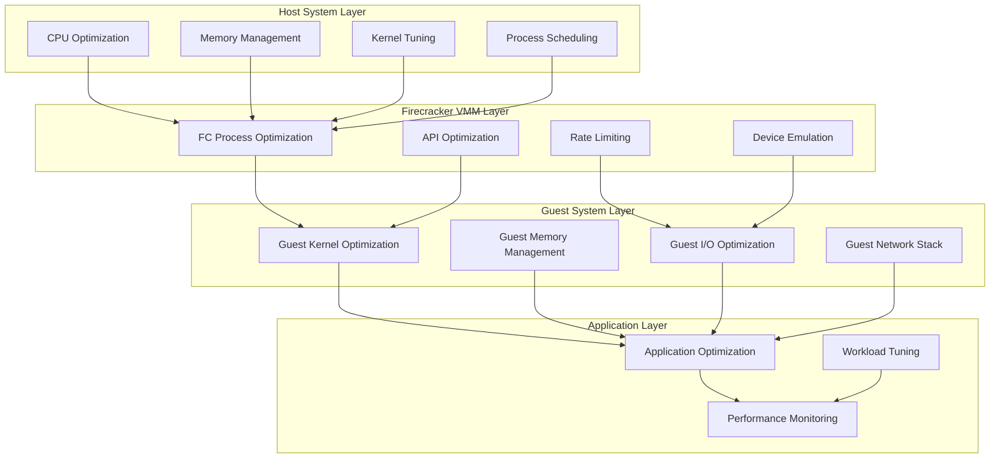

## Table of Contents

## Introduction

Firecracker's lightweight virtualization architecture provides excellent baseline performance, but production environments often require fine-tuning to achieve optimal efficiency. This comprehensive guide explores advanced performance optimization techniques for Firecracker microVMs, covering everything from kernel configuration to resource management.

Understanding performance optimization in Firecracker involves multiple layers: host system tuning, kernel optimization, memory management, I/O acceleration, and network performance. Each layer contributes to the overall efficiency of microVM workloads.

## Performance Architecture Overview



### Performance Optimization Principles

**Minimize Overhead**: Reduce unnecessary layers and processing
**Maximize Parallelism**: Leverage multi-core systems effectively  
**Optimize Memory Access**: Improve cache efficiency and reduce page faults
**Accelerate I/O**: Minimize storage and network latency
**Resource Isolation**: Prevent noisy neighbor effects

## Host System Optimization

### CPU Configuration and Tuning

```bash
#!/bin/bash

# Host CPU optimization for Firecracker
echo "=== CPU Optimization ==="

# Check CPU information
echo "CPU Information:"
lscpu | grep -E "(Architecture|CPU\(s\)|Thread|Core|Socket|Vendor|Model name|CPU MHz|Cache|Flags)"

# Enable CPU performance governor
echo "Setting CPU governor to performance..."
for cpu in /sys/devices/system/cpu/cpu*/cpufreq/scaling_governor; do
    [ -f "$cpu" ] && echo performance | sudo tee "$cpu" > /dev/null
done

# Disable CPU frequency scaling
echo "Disabling CPU frequency scaling..."
echo 1 | sudo tee /sys/devices/system/cpu/intel_pstate/no_turbo 2>/dev/null || echo "Intel P-State not available"

# Set CPU affinity for optimal performance
set_cpu_affinity() {
    local vm_id=$1
    local cpu_list=$2
    
    # Find Firecracker process
    fc_pid=$(pgrep -f "firecracker.*${vm_id}")
    
    if [ -n "$fc_pid" ]; then
        echo "Setting CPU affinity for VM $vm_id (PID: $fc_pid) to CPUs: $cpu_list"
        taskset -cp "$cpu_list" "$fc_pid"
        
        # Set high priority
        sudo renice -10 -p "$fc_pid"
        
        # Set real-time scheduling (use with caution)
        # sudo chrt -r -p 50 "$fc_pid"
    else
        echo "Firecracker process for VM $vm_id not found"
    fi
}

# Optimize interrupt handling
echo "Optimizing interrupt handling..."
# Distribute interrupts across CPUs
echo 2 | sudo tee /proc/irq/default_smp_affinity

# Disable unnecessary kernel features
echo "Disabling unnecessary kernel features..."
echo 0 | sudo tee /proc/sys/kernel/watchdog
echo 0 | sudo tee /proc/sys/kernel/nmi_watchdog

# Configure CPU isolation (add to kernel command line)
cat << 'EOF'
To isolate CPUs for Firecracker workloads, add to GRUB_CMDLINE_LINUX_DEFAULT:
isolcpus=2-7 nohz_full=2-7 rcu_nocbs=2-7

Then update GRUB and reboot:
sudo update-grub
sudo reboot
EOF

echo "CPU optimization complete!"
```

### Memory Optimization

```python
#!/usr/bin/env python3
import os
import subprocess
import mmap
from pathlib import Path

class MemoryOptimizer:
    """Optimize memory settings for Firecracker performance"""
    
    def __init__(self):
        self.hugepage_sizes = ['1048576', '2048']  # 1GB and 2MB hugepages
        self.transparent_hugepages = Path('/sys/kernel/mm/transparent_hugepage')
        
    def configure_hugepages(self, num_1gb_pages=4, num_2mb_pages=512):
        """Configure hugepages for better memory performance"""
        
        print("=== Configuring Hugepages ===")
        
        # Configure 1GB hugepages
        hugepages_1g = Path('/sys/kernel/mm/hugepages/hugepages-1048576kB/nr_hugepages')
        if hugepages_1g.exists():
            try:
                with open(hugepages_1g, 'w') as f:
                    f.write(str(num_1gb_pages))
                print(f"✓ Configured {num_1gb_pages} x 1GB hugepages")
            except PermissionError:
                print("✗ Need root permissions to configure 1GB hugepages")
        
        # Configure 2MB hugepages
        hugepages_2m = Path('/sys/kernel/mm/hugepages/hugepages-2048kB/nr_hugepages')
        if hugepages_2m.exists():
            try:
                with open(hugepages_2m, 'w') as f:
                    f.write(str(num_2mb_pages))
                print(f"✓ Configured {num_2mb_pages} x 2MB hugepages")
            except PermissionError:
                print("✗ Need root permissions to configure 2MB hugepages")
        
        # Mount hugepages filesystem
        self._mount_hugepages()
    
    def _mount_hugepages(self):
        """Mount hugepages filesystems"""
        
        mount_points = [
            ('/mnt/huge-1G', '1GB', 'pagesize=1G'),
            ('/mnt/huge-2M', '2MB', 'pagesize=2M')
        ]
        
        for mount_point, size, option in mount_points:
            os.makedirs(mount_point, exist_ok=True)
            
            # Check if already mounted
            result = subprocess.run(['mount'], capture_output=True, text=True)
            if mount_point not in result.stdout:
                try:
                    subprocess.run([
                        'sudo', 'mount', '-t', 'hugetlbfs',
                        '-o', option, 'none', mount_point
                    ], check=True)
                    print(f"✓ Mounted {size} hugepages at {mount_point}")
                except subprocess.CalledProcessError:
                    print(f"✗ Failed to mount {size} hugepages")
    
    def configure_transparent_hugepages(self):
        """Configure transparent hugepages"""
        
        print("=== Configuring Transparent Hugepages ===")
        
        # Disable transparent hugepages for consistent performance
        thp_enabled = self.transparent_hugepages / 'enabled'
        thp_defrag = self.transparent_hugepages / 'defrag'
        
        settings = [
            (thp_enabled, 'never', 'THP enabled'),
            (thp_defrag, 'never', 'THP defrag')
        ]
        
        for setting_file, value, description in settings:
            if setting_file.exists():
                try:
                    with open(setting_file, 'w') as f:
                        f.write(value)
                    print(f"✓ Set {description} to {value}")
                except PermissionError:
                    print(f"✗ Need root permissions to configure {description}")
    
    def configure_memory_overcommit(self):
        """Configure memory overcommit settings"""
        
        print("=== Configuring Memory Overcommit ===")
        
        # Conservative overcommit for predictable performance
        overcommit_settings = [
            ('/proc/sys/vm/overcommit_memory', '2', 'Strict overcommit'),
            ('/proc/sys/vm/overcommit_ratio', '80', 'Overcommit ratio'),
            ('/proc/sys/vm/swappiness', '1', 'Swappiness'),
            ('/proc/sys/vm/vfs_cache_pressure', '50', 'VFS cache pressure')
        ]
        
        for setting_file, value, description in overcommit_settings:
            try:
                with open(setting_file, 'w') as f:
                    f.write(value)
                print(f"✓ Set {description} to {value}")
            except PermissionError:
                print(f"✗ Need root permissions to configure {description}")
    
    def optimize_numa_settings(self):
        """Optimize NUMA settings for Firecracker"""
        
        print("=== Optimizing NUMA Settings ===")
        
        # Check NUMA topology
        try:
            result = subprocess.run(['numactl', '--hardware'], 
                                  capture_output=True, text=True, check=True)
            print("NUMA topology:")
            print(result.stdout)
        except (subprocess.CalledProcessError, FileNotFoundError):
            print("NUMA tools not available")
            return
        
        # Configure zone reclaim
        numa_settings = [
            ('/proc/sys/vm/zone_reclaim_mode', '0', 'Zone reclaim mode')
        ]
        
        for setting_file, value, description in numa_settings:
            try:
                with open(setting_file, 'w') as f:
                    f.write(value)
                print(f"✓ Set {description} to {value}")
            except PermissionError:
                print(f"✗ Need root permissions to configure {description}")
    
    def create_memory_pools(self, pool_size_mb=1024, num_pools=4):
        """Create pre-allocated memory pools for Firecracker VMs"""
        
        print(f"=== Creating Memory Pools ===")
        print(f"Creating {num_pools} memory pools of {pool_size_mb}MB each")
        
        pools = []
        pool_size = pool_size_mb * 1024 * 1024  # Convert to bytes
        
        for i in range(num_pools):
            try:
                # Create anonymous memory mapping
                pool = mmap.mmap(-1, pool_size, mmap.MAP_PRIVATE | mmap.MAP_ANONYMOUS)
                
                # Touch all pages to ensure allocation
                for offset in range(0, pool_size, 4096):
                    pool[offset] = 0
                
                pools.append(pool)
                print(f"✓ Created memory pool {i+1}")
                
            except Exception as e:
                print(f"✗ Failed to create memory pool {i+1}: {e}")
        
        return pools
    
    def run_optimization(self):
        """Run all memory optimizations"""
        
        self.configure_hugepages()
        self.configure_transparent_hugepages()
        self.configure_memory_overcommit()
        self.optimize_numa_settings()
        
        print("\n=== Memory Optimization Summary ===")
        self.print_memory_info()
    
    def print_memory_info(self):
        """Print current memory configuration"""
        
        # Memory information
        with open('/proc/meminfo', 'r') as f:
            meminfo = f.read()
        
        print("\nMemory Information:")
        for line in meminfo.split('\n'):
            if any(keyword in line for keyword in ['MemTotal', 'MemFree', 'HugePages', 'Hugepagesize']):
                print(f"  {line}")
        
        # Hugepages information
        hugepages_info = []
        hugepages_dir = Path('/sys/kernel/mm/hugepages')
        
        if hugepages_dir.exists():
            for size_dir in hugepages_dir.iterdir():
                if size_dir.is_dir():
                    try:
                        with open(size_dir / 'nr_hugepages', 'r') as f:
                            nr_pages = f.read().strip()
                        with open(size_dir / 'free_hugepages', 'r') as f:
                            free_pages = f.read().strip()
                        
                        size = size_dir.name.replace('hugepages-', '').replace('kB', '')
                        hugepages_info.append(f"  {size}: {nr_pages} total, {free_pages} free")
                    except:
                        pass
        
        if hugepages_info:
            print("\nHugepages:")
            for info in hugepages_info:
                print(info)

if __name__ == '__main__':
    optimizer = MemoryOptimizer()
    optimizer.run_optimization()
```

### Kernel Optimization

```bash
#!/bin/bash

# Kernel optimization for Firecracker
echo "=== Kernel Optimization ==="

# Disable unnecessary kernel features
echo "Disabling unnecessary kernel features..."
kernel_settings=(
    # Disable audit subsystem
    "kernel.audit=0"
    # Disable printk rate limiting
    "kernel.printk_ratelimit=0"
    # Optimize scheduling
    "kernel.sched_migration_cost_ns=5000000"
    "kernel.sched_autogroup_enabled=0"
    # Optimize memory management
    "vm.dirty_ratio=15"
    "vm.dirty_background_ratio=5"
    "vm.dirty_expire_centisecs=12000"
    "vm.dirty_writeback_centisecs=1200"
    # Optimize network stack
    "net.core.rmem_max=67108864"
    "net.core.wmem_max=67108864"
    "net.core.rmem_default=262144"
    "net.core.wmem_default=262144"
    "net.core.netdev_max_backlog=5000"
    # Optimize file system
    "fs.file-max=2097152"
    "fs.nr_open=1048576"
)

# Apply kernel settings
for setting in "${kernel_settings[@]}"; do
    key=$(echo "$setting" | cut -d'=' -f1)
    value=$(echo "$setting" | cut -d'=' -f2)
    
    echo "Setting $key = $value"
    echo "$value" | sudo tee "/proc/sys/${key//./\/}" > /dev/null 2>&1 || echo "Failed to set $key"
done

# Make settings persistent
sudo tee -a /etc/sysctl.conf << 'EOF'

# Firecracker optimizations
kernel.audit=0
kernel.printk_ratelimit=0
kernel.sched_migration_cost_ns=5000000
kernel.sched_autogroup_enabled=0
vm.dirty_ratio=15
vm.dirty_background_ratio=5
vm.dirty_expire_centisecs=12000
vm.dirty_writeback_centisecs=1200
net.core.rmem_max=67108864
net.core.wmem_max=67108864
net.core.rmem_default=262144
net.core.wmem_default=262144
net.core.netdev_max_backlog=5000
fs.file-max=2097152
fs.nr_open=1048576
EOF

echo "Kernel optimization complete!"

# Create optimized kernel configuration
create_optimized_kernel_config() {
    cat > /tmp/firecracker_kernel_config << 'EOF'
# Firecracker optimized kernel configuration

# Minimal required features
CONFIG_64BIT=y
CONFIG_X86_64=y
CONFIG_SMP=y
CONFIG_HYPERVISOR_GUEST=y

# Virtualization support
CONFIG_PARAVIRT=y
CONFIG_PARAVIRT_SPINLOCKS=y
CONFIG_KVM_GUEST=y

# Essential drivers
CONFIG_VIRTIO=y
CONFIG_VIRTIO_PCI=y
CONFIG_VIRTIO_BLK=y
CONFIG_VIRTIO_NET=y
CONFIG_VIRTIO_CONSOLE=y
CONFIG_VIRTIO_VSOCKETS=y

# Memory management
CONFIG_TRANSPARENT_HUGEPAGE=n
CONFIG_HUGETLBFS=y
CONFIG_HUGETLB_PAGE=y

# Scheduler optimizations
CONFIG_PREEMPT_NONE=y
CONFIG_NO_HZ=y
CONFIG_NO_HZ_IDLE=y
CONFIG_HIGH_RES_TIMERS=y

# Disable unnecessary features
CONFIG_SUSPEND=n
CONFIG_HIBERNATION=n
CONFIG_ACPI=n
CONFIG_PCI=n
CONFIG_USB=n
CONFIG_SOUND=n
CONFIG_DRM=n
CONFIG_WIRELESS=n
CONFIG_BLUETOOTH=n

# Security
CONFIG_SECURITY=y
CONFIG_SECCOMP=y
CONFIG_SECCOMP_FILTER=y

# Networking (minimal)
CONFIG_NET=y
CONFIG_INET=y
CONFIG_NETFILTER=y

# File systems
CONFIG_EXT4_FS=y
CONFIG_PROC_FS=y
CONFIG_SYSFS=y
CONFIG_TMPFS=y
CONFIG_9P_FS=y
CONFIG_9P_VIRTIO=y

# Disable debug features for performance
CONFIG_DEBUG_KERNEL=n
CONFIG_SLUB_DEBUG=n
CONFIG_DEBUG_INFO=n
CONFIG_FRAME_POINTER=n
CONFIG_STACK_TRACER=n
CONFIG_FUNCTION_TRACER=n
EOF

    echo "Optimized kernel config created at /tmp/firecracker_kernel_config"
}

create_optimized_kernel_config
```

## Firecracker VMM Optimization

### Process and Resource Configuration

```python
#!/usr/bin/env python3
import json
import psutil
import subprocess
from pathlib import Path

class FirecrackerVMMOptimizer:
    """Optimize Firecracker VMM process for performance"""
    
    def __init__(self):
        self.firecracker_processes = []
        self.optimization_configs = {}
    
    def find_firecracker_processes(self):
        """Find all running Firecracker processes"""
        
        processes = []
        for proc in psutil.process_iter(['pid', 'name', 'cmdline']):
            try:
                if proc.info['name'] == 'firecracker':
                    processes.append({
                        'pid': proc.info['pid'],
                        'cmdline': ' '.join(proc.info['cmdline'])
                    })
            except (psutil.NoSuchProcess, psutil.AccessDenied):
                continue
        
        self.firecracker_processes = processes
        return processes
    
    def optimize_process_scheduling(self, pid, priority=-10, scheduler='normal'):
        """Optimize process scheduling parameters"""
        
        try:
            proc = psutil.Process(pid)
            
            # Set process priority
            proc.nice(priority)
            print(f"✓ Set nice level to {priority} for PID {pid}")
            
            # Set I/O priority
            try:
                subprocess.run(['sudo', 'ionice', '-c', '1', '-n', '2', '-p', str(pid)], 
                             check=True)
                print(f"✓ Set I/O priority to real-time class for PID {pid}")
            except subprocess.CalledProcessError:
                print(f"⚠ Failed to set I/O priority for PID {pid}")
            
            # Set CPU affinity (optional)
            if scheduler == 'isolated':
                # Bind to specific CPUs (adjust based on your system)
                isolated_cpus = [2, 3, 4, 5]  # Example isolated CPUs
                proc.cpu_affinity(isolated_cpus)
                print(f"✓ Set CPU affinity to {isolated_cpus} for PID {pid}")
            
        except (psutil.NoSuchProcess, psutil.AccessDenied) as e:
            print(f"✗ Failed to optimize PID {pid}: {e}")
    
    def configure_firecracker_limits(self, vm_id):
        """Configure optimal resource limits for Firecracker VM"""
        
        config = {
            "machine-config": {
                "vcpu_count": 2,
                "mem_size_mib": 512,
                # Enable memory balloon for dynamic allocation
                "balloon": {
                    "amount_mib": 256,
                    "deflate_on_oom": True,
                    "stats_polling_interval_s": 1
                }
            },
            "cpu-config": {
                # Use CPU template for better performance
                "cpu_template": "T2"
            },
            # Configure rate limiters for predictable performance
            "network-interfaces": [
                {
                    "iface_id": "eth0",
                    "guest_mac": "AA:FC:00:00:00:01",
                    "host_dev_name": "tap0",
                    "rx_rate_limiter": {
                        "bandwidth": {
                            "size": 125000000,  # 1Gbps
                            "refill_time": 100
                        },
                        "ops": {
                            "size": 50000,
                            "refill_time": 100
                        }
                    },
                    "tx_rate_limiter": {
                        "bandwidth": {
                            "size": 125000000,  # 1Gbps
                            "refill_time": 100
                        },
                        "ops": {
                            "size": 50000,
                            "refill_time": 100
                        }
                    }
                }
            ],
            "drives": [
                {
                    "drive_id": "rootfs",
                    "path_on_host": f"/var/lib/firecracker/{vm_id}/rootfs.ext4",
                    "is_root_device": True,
                    "is_read_only": False,
                    "rate_limiter": {
                        "bandwidth": {
                            "size": 104857600,  # 100MB/s
                            "refill_time": 100
                        },
                        "ops": {
                            "size": 10000,
                            "refill_time": 100
                        }
                    }
                }
            ],
            # Enable metrics for monitoring
            "metrics": {
                "metrics_path": f"/tmp/firecracker-metrics-{vm_id}.json"
            },
            # Optimize logging
            "logger": {
                "level": "Warn",  # Reduce logging overhead
                "log_path": f"/var/log/firecracker-{vm_id}.log",
                "show_level": False,
                "show_log_origin": False
            }
        }
        
        self.optimization_configs[vm_id] = config
        return config
    
    def generate_optimized_config(self, vm_id, output_path=None):
        """Generate optimized Firecracker configuration file"""
        
        config = self.configure_firecracker_limits(vm_id)
        
        if output_path is None:
            output_path = f"/tmp/firecracker-optimized-{vm_id}.json"
        
        with open(output_path, 'w') as f:
            json.dump(config, f, indent=2)
        
        print(f"✓ Generated optimized config for VM {vm_id}: {output_path}")
        return output_path
    
    def apply_runtime_optimizations(self, socket_path, optimizations):
        """Apply runtime optimizations via Firecracker API"""
        
        import requests_unixsocket
        session = requests_unixsocket.Session()
        base_url = f'http+unix://{socket_path.replace("/", "%2F")}'
        
        # Apply CPU optimizations
        if 'cpu_template' in optimizations:
            response = session.put(
                f'{base_url}/cpu-config',
                json={'cpu_template': optimizations['cpu_template']}
            )
            if response.status_code == 204:
                print("✓ Applied CPU template optimization")
            else:
                print(f"✗ Failed to apply CPU template: {response.status_code}")
        
        # Apply memory balloon configuration
        if 'balloon' in optimizations:
            response = session.put(
                f'{base_url}/balloon',
                json=optimizations['balloon']
            )
            if response.status_code == 204:
                print("✓ Applied memory balloon optimization")
            else:
                print(f"✗ Failed to apply balloon config: {response.status_code}")
        
        # Configure rate limiters for existing interfaces
        if 'network_rate_limits' in optimizations:
            for iface_id, limits in optimizations['network_rate_limits'].items():
                response = session.patch(
                    f'{base_url}/network-interfaces/{iface_id}',
                    json=limits
                )
                if response.status_code == 204:
                    print(f"✓ Applied network rate limits for {iface_id}")
                else:
                    print(f"✗ Failed to apply network rate limits for {iface_id}")
    
    def monitor_performance_metrics(self, metrics_path, duration=60):
        """Monitor Firecracker performance metrics"""
        
        import time
        
        print(f"Monitoring performance for {duration} seconds...")
        
        start_time = time.time()
        metrics_history = []
        
        while time.time() - start_time < duration:
            try:
                if Path(metrics_path).exists():
                    with open(metrics_path, 'r') as f:
                        metrics = json.load(f)
                        metrics['timestamp'] = time.time()
                        metrics_history.append(metrics)
                
                time.sleep(1)
                
            except (json.JSONDecodeError, FileNotFoundError):
                time.sleep(1)
                continue
        
        # Analyze metrics
        self._analyze_metrics(metrics_history)
        return metrics_history
    
    def _analyze_metrics(self, metrics_history):
        """Analyze collected performance metrics"""
        
        if not metrics_history:
            print("No metrics collected")
            return
        
        print("\n=== Performance Analysis ===")
        
        # Network metrics
        if 'net' in metrics_history[-1]:
            net_metrics = metrics_history[-1]['net']
            print(f"Network Events: RX={net_metrics.get('rx_queue_event_count', 0)}, "
                  f"TX={net_metrics.get('tx_queue_event_count', 0)}")
        
        # Block I/O metrics
        if 'block' in metrics_history[-1]:
            block_metrics = metrics_history[-1]['block']
            print(f"Block I/O: Reads={block_metrics.get('read_count', 0)}, "
                  f"Writes={block_metrics.get('write_count', 0)}")
        
        # vCPU metrics
        if 'vcpu' in metrics_history[-1]:
            for vcpu_id, vcpu_data in metrics_history[-1]['vcpu'].items():
                exits = vcpu_data.get('exit_io_in', 0) + vcpu_data.get('exit_io_out', 0)
                print(f"{vcpu_id}: VM exits={exits}")
    
    def run_optimization_suite(self):
        """Run complete optimization suite"""
        
        print("=== Firecracker VMM Optimization Suite ===")
        
        # Find running Firecracker processes
        processes = self.find_firecracker_processes()
        print(f"Found {len(processes)} Firecracker processes")
        
        # Optimize each process
        for proc in processes:
            print(f"\nOptimizing PID {proc['pid']}...")
            self.optimize_process_scheduling(proc['pid'])
        
        # Generate optimized configurations
        for i in range(3):  # Generate configs for example VMs
            vm_id = f"vm{i:03d}"
            config_path = self.generate_optimized_config(vm_id)
            print(f"Generated config for {vm_id}: {config_path}")

if __name__ == '__main__':
    optimizer = FirecrackerVMMOptimizer()
    optimizer.run_optimization_suite()
```

## I/O Performance Optimization

### Storage Optimization

```bash
#!/bin/bash

# Storage I/O optimization for Firecracker
echo "=== Storage I/O Optimization ==="

# Configure I/O scheduler
configure_io_scheduler() {
    local device=$1
    local scheduler=${2:-mq-deadline}
    
    echo "Configuring I/O scheduler for $device to $scheduler"
    
    if [ -f "/sys/block/$device/queue/scheduler" ]; then
        echo "$scheduler" | sudo tee "/sys/block/$device/queue/scheduler"
        echo "✓ Set $device scheduler to $scheduler"
    else
        echo "✗ Device $device not found"
    fi
}

# Optimize block device settings
optimize_block_device() {
    local device=$1
    
    echo "Optimizing block device settings for $device"
    
    # Set queue depth
    echo 32 | sudo tee "/sys/block/$device/queue/nr_requests"
    
    # Enable NCQ (Native Command Queuing)
    echo 31 | sudo tee "/sys/block/$device/queue/nr_requests"
    
    # Optimize read-ahead
    echo 512 | sudo tee "/sys/block/$device/queue/read_ahead_kb"
    
    # Enable write caching (if safe)
    echo "write back" | sudo tee "/sys/block/$device/queue/write_cache" 2>/dev/null || true
    
    # Optimize rotational settings (for SSDs)
    echo 0 | sudo tee "/sys/block/$device/queue/rotational"
    
    echo "✓ Optimized $device settings"
}

# Configure storage devices
for device in sda sdb nvme0n1 nvme1n1; do
    if [ -d "/sys/block/$device" ]; then
        configure_io_scheduler "$device" "mq-deadline"
        optimize_block_device "$device"
    fi
done

echo "Storage optimization complete!"
```

### Advanced I/O Configuration

```python
#!/usr/bin/env python3
import os
import json
import subprocess
from pathlib import Path

class IOOptimizer:
    """Advanced I/O optimization for Firecracker"""
    
    def __init__(self):
        self.block_devices = self._discover_block_devices()
        self.nvme_devices = self._discover_nvme_devices()
    
    def _discover_block_devices(self):
        """Discover available block devices"""
        
        devices = []
        sys_block = Path('/sys/block')
        
        for device_path in sys_block.iterdir():
            if device_path.is_dir() and not device_path.name.startswith('loop'):
                devices.append(device_path.name)
        
        return devices
    
    def _discover_nvme_devices(self):
        """Discover NVMe devices"""
        
        devices = []
        for device in self.block_devices:
            if device.startswith('nvme'):
                devices.append(device)
        
        return devices
    
    def optimize_nvme_devices(self):
        """Optimize NVMe devices for Firecracker workloads"""
        
        print("=== NVMe Optimization ===")
        
        for device in self.nvme_devices:
            device_path = f'/dev/{device}'
            
            # Set optimal queue depth
            self._set_nvme_queue_depth(device, 32)
            
            # Configure interrupt coalescing
            self._configure_nvme_interrupts(device)
            
            # Enable write caching
            self._enable_write_cache(device_path)
            
            print(f"✓ Optimized NVMe device {device}")
    
    def _set_nvme_queue_depth(self, device, depth=32):
        """Set NVMe queue depth"""
        
        queue_file = f'/sys/block/{device}/queue/nr_requests'
        
        try:
            with open(queue_file, 'w') as f:
                f.write(str(depth))
            print(f"  ✓ Set queue depth to {depth} for {device}")
        except (IOError, OSError) as e:
            print(f"  ✗ Failed to set queue depth for {device}: {e}")
    
    def _configure_nvme_interrupts(self, device):
        """Configure NVMe interrupt settings"""
        
        # Find NVMe PCI device
        try:
            result = subprocess.run([
                'lspci', '-D', '-d', '::0108'  # NVMe controller class
            ], capture_output=True, text=True, check=True)
            
            for line in result.stdout.strip().split('\n'):
                if line:
                    pci_id = line.split()[0]
                    self._optimize_pci_device_interrupts(pci_id)
                    
        except subprocess.CalledProcessError:
            print(f"  ⚠ Could not find PCI info for {device}")
    
    def _optimize_pci_device_interrupts(self, pci_id):
        """Optimize PCI device interrupt settings"""
        
        # This is a simplified example - actual implementation would be more complex
        irq_path = f'/proc/irq'
        
        try:
            # Find device IRQs
            result = subprocess.run([
                'grep', '-l', pci_id.replace(':', ''), 
                f'{irq_path}/*/actions'
            ], capture_output=True, text=True, check=False)
            
            for irq_file in result.stdout.strip().split('\n'):
                if irq_file:
                    irq_num = irq_file.split('/')[3]
                    # Set interrupt affinity (simplified)
                    smp_affinity_file = f'{irq_path}/{irq_num}/smp_affinity'
                    if os.path.exists(smp_affinity_file):
                        with open(smp_affinity_file, 'w') as f:
                            f.write('f')  # Use all CPUs
                        print(f"  ✓ Set interrupt affinity for IRQ {irq_num}")
                        
        except Exception as e:
            print(f"  ⚠ Could not optimize interrupts for {pci_id}: {e}")
    
    def _enable_write_cache(self, device_path):
        """Enable write cache for device"""
        
        try:
            subprocess.run([
                'hdparm', '-W', '1', device_path
            ], check=True, capture_output=True)
            print(f"  ✓ Enabled write cache for {device_path}")
        except (subprocess.CalledProcessError, FileNotFoundError):
            print(f"  ⚠ Could not enable write cache for {device_path}")
    
    def create_optimized_filesystem(self, device_path, fs_type='ext4', mount_point=None):
        """Create optimized filesystem for Firecracker images"""
        
        print(f"Creating optimized {fs_type} filesystem on {device_path}")
        
        if fs_type == 'ext4':
            # Create ext4 with optimizations
            cmd = [
                'mkfs.ext4',
                '-F',  # Force creation
                '-O', '^has_journal',  # Disable journaling for performance
                '-E', 'lazy_itable_init=0,lazy_journal_init=0',
                '-m', '1',  # Reduce reserved blocks
                '-b', '4096',  # 4KB block size
                device_path
            ]
        elif fs_type == 'xfs':
            # Create XFS with optimizations
            cmd = [
                'mkfs.xfs',
                '-f',  # Force creation
                '-d', 'agcount=8',  # Allocation groups
                '-l', 'size=64m',  # Log size
                '-b', 'size=4096',  # Block size
                device_path
            ]
        else:
            print(f"Unsupported filesystem type: {fs_type}")
            return False
        
        try:
            subprocess.run(cmd, check=True, capture_output=True)
            print(f"✓ Created {fs_type} filesystem on {device_path}")
            
            if mount_point:
                self._mount_with_optimizations(device_path, mount_point, fs_type)
            
            return True
            
        except subprocess.CalledProcessError as e:
            print(f"✗ Failed to create filesystem: {e}")
            return False
    
    def _mount_with_optimizations(self, device_path, mount_point, fs_type):
        """Mount filesystem with performance optimizations"""
        
        os.makedirs(mount_point, exist_ok=True)
        
        if fs_type == 'ext4':
            mount_options = [
                'noatime',  # Don't update access times
                'nodiratime',  # Don't update directory access times
                'data=writeback',  # Fastest journaling mode
                'barrier=0',  # Disable barriers (use only with UPS/reliable power)
                'commit=60'  # Commit every 60 seconds
            ]
        elif fs_type == 'xfs':
            mount_options = [
                'noatime',
                'nodiratime',
                'allocsize=64m',  # Allocation size
                'largeio',  # Large I/O operations
                'inode64'  # 64-bit inodes
            ]
        else:
            mount_options = ['noatime', 'nodiratime']
        
        try:
            subprocess.run([
                'mount',
                '-o', ','.join(mount_options),
                device_path, mount_point
            ], check=True)
            print(f"✓ Mounted {device_path} at {mount_point} with optimizations")
        except subprocess.CalledProcessError as e:
            print(f"✗ Failed to mount {device_path}: {e}")
    
    def benchmark_storage(self, device_path, test_size='1G'):
        """Benchmark storage performance"""
        
        print(f"=== Benchmarking {device_path} ===")
        
        # Sequential write test
        print("Running sequential write test...")
        try:
            result = subprocess.run([
                'dd', 'if=/dev/zero', f'of={device_path}',
                f'bs=1M', f'count={test_size[:-1]}',
                'oflag=direct', 'conv=fdatasync'
            ], capture_output=True, text=True, check=True)
            
            # Parse dd output for throughput
            for line in result.stderr.split('\n'):
                if 'bytes' in line and 'copied' in line:
                    print(f"  Sequential write: {line}")
                    
        except subprocess.CalledProcessError as e:
            print(f"  ✗ Sequential write test failed: {e}")
        
        # Sequential read test
        print("Running sequential read test...")
        try:
            result = subprocess.run([
                'dd', f'if={device_path}', 'of=/dev/null',
                f'bs=1M', f'count={test_size[:-1]}',
                'iflag=direct'
            ], capture_output=True, text=True, check=True)
            
            for line in result.stderr.split('\n'):
                if 'bytes' in line and 'copied' in line:
                    print(f"  Sequential read: {line}")
                    
        except subprocess.CalledProcessError as e:
            print(f"  ✗ Sequential read test failed: {e}")
        
        # Random I/O test with fio (if available)
        self._run_fio_benchmark(device_path)
    
    def _run_fio_benchmark(self, device_path):
        """Run fio benchmark if available"""
        
        try:
            # Check if fio is available
            subprocess.run(['which', 'fio'], check=True, capture_output=True)
            
            # Create fio job file
            fio_job = f'''
[global]
ioengine=libaio
direct=1
group_reporting
time_based
runtime=30
filename={device_path}

[random-read]
stonewall
rw=randread
bs=4k
iodepth=32
numjobs=1

[random-write]
stonewall
rw=randwrite
bs=4k
iodepth=32
numjobs=1
'''
            
            with open('/tmp/firecracker_fio.job', 'w') as f:
                f.write(fio_job)
            
            print("Running fio benchmark...")
            result = subprocess.run([
                'fio', '/tmp/firecracker_fio.job'
            ], capture_output=True, text=True, check=True)
            
            # Parse fio output for IOPS and bandwidth
            for line in result.stdout.split('\n'):
                if 'IOPS=' in line or 'BW=' in line:
                    print(f"  {line.strip()}")
                    
        except (subprocess.CalledProcessError, FileNotFoundError):
            print("  ⚠ fio not available for detailed benchmarking")
    
    def run_io_optimization(self):
        """Run complete I/O optimization suite"""
        
        print("=== I/O Optimization Suite ===")
        
        # Optimize NVMe devices
        if self.nvme_devices:
            self.optimize_nvme_devices()
        else:
            print("No NVMe devices found")
        
        # Print optimization recommendations
        self._print_recommendations()
    
    def _print_recommendations(self):
        """Print I/O optimization recommendations"""
        
        print("\n=== I/O Optimization Recommendations ===")
        print("1. Use NVMe SSDs for best performance")
        print("2. Configure RAID 0 for multiple drives (if redundancy not required)")
        print("3. Use ext4 without journaling for maximum performance")
        print("4. Mount with noatime and nodiratime options")
        print("5. Use O_DIRECT for database workloads")
        print("6. Configure appropriate I/O scheduler (mq-deadline for SSDs)")
        print("7. Set optimal queue depth (32-128 for NVMe)")
        print("8. Align partitions to 4K boundaries")

if __name__ == '__main__':
    optimizer = IOOptimizer()
    optimizer.run_io_optimization()
```

## Network Performance Optimization

### Network Stack Tuning

```bash
#!/bin/bash

# Network performance optimization for Firecracker
echo "=== Network Performance Optimization ==="

# Configure network buffer sizes
echo "Configuring network buffers..."
sudo sysctl -w net.core.rmem_max=134217728
sudo sysctl -w net.core.wmem_max=134217728
sudo sysctl -w net.core.rmem_default=262144
sudo sysctl -w net.core.wmem_default=262144

# TCP buffer optimization
echo "Optimizing TCP buffers..."
sudo sysctl -w net.ipv4.tcp_rmem="4096 65536 134217728"
sudo sysctl -w net.ipv4.tcp_wmem="4096 65536 134217728"
sudo sysctl -w net.ipv4.tcp_mem="786432 1048576 134217728"

# Configure TCP congestion control
echo "Setting TCP congestion control..."
sudo sysctl -w net.ipv4.tcp_congestion_control=bbr
sudo sysctl -w net.core.default_qdisc=fq

# Network device queue optimization
echo "Optimizing network device queues..."
sudo sysctl -w net.core.netdev_max_backlog=30000
sudo sysctl -w net.core.netdev_budget=600

# Disable unnecessary network features
echo "Disabling unnecessary features..."
sudo sysctl -w net.ipv4.tcp_timestamps=0
sudo sysctl -w net.ipv4.tcp_sack=1
sudo sysctl -w net.ipv4.tcp_window_scaling=1

# Configure interrupt coalescing for network interfaces
configure_network_interrupts() {
    for interface in $(ls /sys/class/net/ | grep -v lo); do
        if [ -d "/sys/class/net/$interface/device" ]; then
            echo "Configuring interrupts for $interface"
            
            # Set interrupt coalescing (if supported)
            ethtool -C "$interface" rx-usecs 10 tx-usecs 10 2>/dev/null || true
            
            # Set ring buffer sizes (if supported)  
            ethtool -G "$interface" rx 4096 tx 4096 2>/dev/null || true
            
            # Enable receive hashing
            ethtool -K "$interface" rxhash on 2>/dev/null || true
            
            echo "  ✓ Configured $interface"
        fi
    done
}

configure_network_interrupts

echo "Network optimization complete!"
```

### Virtual Network Optimization

```python
#!/usr/bin/env python3
import subprocess
import json
from pathlib import Path

class NetworkOptimizer:
    """Optimize virtual networking for Firecracker"""
    
    def __init__(self):
        self.tap_interfaces = []
        self.bridge_interfaces = []
    
    def create_optimized_tap_interface(self, tap_name, mtu=9000):
        """Create optimized TAP interface"""
        
        print(f"Creating optimized TAP interface: {tap_name}")
        
        try:
            # Create TAP interface
            subprocess.run([
                'sudo', 'ip', 'tuntap', 'add',
                'dev', tap_name, 'mode', 'tap'
            ], check=True)
            
            # Set optimal MTU
            subprocess.run([
                'sudo', 'ip', 'link', 'set', 'dev', tap_name, 'mtu', str(mtu)
            ], check=True)
            
            # Enable multiqueue (if supported)
            subprocess.run([
                'sudo', 'ip', 'link', 'set', 'dev', tap_name,
                'type', 'tap', 'multi_queue'
            ], check=False)  # May not be supported
            
            # Optimize queue length
            subprocess.run([
                'sudo', 'ip', 'link', 'set', 'dev', tap_name, 'txqueuelen', '1000'
            ], check=True)
            
            # Bring interface up
            subprocess.run([
                'sudo', 'ip', 'link', 'set', 'dev', tap_name, 'up'
            ], check=True)
            
            print(f"✓ Created optimized TAP interface {tap_name}")
            self.tap_interfaces.append(tap_name)
            
            return True
            
        except subprocess.CalledProcessError as e:
            print(f"✗ Failed to create TAP interface {tap_name}: {e}")
            return False
    
    def create_optimized_bridge(self, bridge_name, interfaces=None):
        """Create optimized bridge interface"""
        
        print(f"Creating optimized bridge: {bridge_name}")
        
        try:
            # Create bridge
            subprocess.run([
                'sudo', 'ip', 'link', 'add', 'name', bridge_name, 'type', 'bridge'
            ], check=True)
            
            # Configure bridge parameters for performance
            bridge_settings = [
                ('stp_state', '0'),  # Disable STP
                ('forward_delay', '0'),  # No forwarding delay
                ('hello_time', '100'),  # Shorter hello time
                ('max_age', '1200'),  # Shorter max age
                ('ageing_time', '30000'),  # 5 minute aging
            ]
            
            bridge_path = f'/sys/class/net/{bridge_name}/bridge'
            for setting, value in bridge_settings:
                setting_file = f'{bridge_path}/{setting}'
                if Path(setting_file).exists():
                    with open(setting_file, 'w') as f:
                        f.write(value)
                    print(f"  ✓ Set {setting} = {value}")
            
            # Set optimal MTU
            subprocess.run([
                'sudo', 'ip', 'link', 'set', 'dev', bridge_name, 'mtu', '9000'
            ], check=True)
            
            # Add interfaces to bridge
            if interfaces:
                for interface in interfaces:
                    subprocess.run([
                        'sudo', 'ip', 'link', 'set', 'dev', interface, 'master', bridge_name
                    ], check=True)
                    print(f"  ✓ Added {interface} to bridge {bridge_name}")
            
            # Bring bridge up
            subprocess.run([
                'sudo', 'ip', 'link', 'set', 'dev', bridge_name, 'up'
            ], check=True)
            
            print(f"✓ Created optimized bridge {bridge_name}")
            self.bridge_interfaces.append(bridge_name)
            
            return True
            
        except subprocess.CalledProcessError as e:
            print(f"✗ Failed to create bridge {bridge_name}: {e}")
            return False
    
    def optimize_existing_interfaces(self):
        """Optimize existing network interfaces"""
        
        print("Optimizing existing network interfaces...")
        
        # Get all network interfaces
        result = subprocess.run(['ip', 'link', 'show'], 
                              capture_output=True, text=True, check=True)
        
        interfaces = []
        for line in result.stdout.split('\n'):
            if ': <' in line and not line.strip().startswith('lo:'):
                interface = line.split(':')[1].strip().split('@')[0]
                interfaces.append(interface)
        
        for interface in interfaces:
            self._optimize_interface(interface)
    
    def _optimize_interface(self, interface):
        """Optimize individual network interface"""
        
        print(f"Optimizing interface: {interface}")
        
        try:
            # Check if interface supports ethtool
            result = subprocess.run(['sudo', 'ethtool', interface], 
                                  capture_output=True, text=True, check=False)
            
            if result.returncode == 0:
                # Optimize interrupt coalescing
                subprocess.run([
                    'sudo', 'ethtool', '-C', interface,
                    'rx-usecs', '10', 'tx-usecs', '10'
                ], check=False)
                
                # Optimize ring buffers
                subprocess.run([
                    'sudo', 'ethtool', '-G', interface,
                    'rx', '4096', 'tx', '4096'
                ], check=False)
                
                # Enable offloading features
                offload_features = [
                    'rx', 'tx', 'sg', 'tso', 'gso', 'gro', 'lro'
                ]
                
                for feature in offload_features:
                    subprocess.run([
                        'sudo', 'ethtool', '-K', interface, feature, 'on'
                    ], check=False)
                
                print(f"  ✓ Optimized {interface}")
            else:
                print(f"  ⚠ Cannot optimize {interface} (ethtool not supported)")
                
        except Exception as e:
            print(f"  ✗ Failed to optimize {interface}: {e}")
    
    def configure_tc_qdisc(self, interface, bandwidth_mbps=1000):
        """Configure traffic control queuing discipline"""
        
        print(f"Configuring TC qdisc for {interface}")
        
        try:
            # Remove existing qdisc
            subprocess.run([
                'sudo', 'tc', 'qdisc', 'del', 'dev', interface, 'root'
            ], check=False)
            
            # Add FQ (Fair Queue) qdisc for better performance
            subprocess.run([
                'sudo', 'tc', 'qdisc', 'add', 'dev', interface, 'root',
                'handle', '1:', 'fq'
            ], check=True)
            
            # Add rate limiting (optional)
            if bandwidth_mbps:
                rate = f'{bandwidth_mbps}mbit'
                subprocess.run([
                    'sudo', 'tc', 'qdisc', 'add', 'dev', interface, 'parent', '1:',
                    'handle', '10:', 'tbf', 'rate', rate, 'burst', '32kbit', 'latency', '50ms'
                ], check=True)
            
            print(f"  ✓ Configured TC qdisc for {interface}")
            
        except subprocess.CalledProcessError as e:
            print(f"  ✗ Failed to configure TC qdisc for {interface}: {e}")
    
    def benchmark_network_performance(self, target_ip, duration=10):
        """Benchmark network performance"""
        
        print(f"=== Network Performance Benchmark ===")
        print(f"Target: {target_ip}, Duration: {duration}s")
        
        # Test with iperf3 (if available)
        try:
            subprocess.run(['which', 'iperf3'], check=True, capture_output=True)
            
            print("Running iperf3 TCP test...")
            result = subprocess.run([
                'iperf3', '-c', target_ip, '-t', str(duration), '-P', '4'
            ], capture_output=True, text=True, check=True)
            
            # Parse iperf3 output
            for line in result.stdout.split('\n'):
                if 'SUM' in line and 'Mbits/sec' in line:
                    print(f"  TCP throughput: {line.split()[-2]} Mbits/sec")
            
            print("Running iperf3 UDP test...")
            result = subprocess.run([
                'iperf3', '-c', target_ip, '-u', '-b', '1G', '-t', str(duration)
            ], capture_output=True, text=True, check=True)
            
            for line in result.stdout.split('\n'):
                if 'Mbits/sec' in line and 'datagrams' in line:
                    parts = line.split()
                    for i, part in enumerate(parts):
                        if 'Mbits/sec' in part:
                            print(f"  UDP throughput: {parts[i-1]} Mbits/sec")
                            break
                            
        except (subprocess.CalledProcessError, FileNotFoundError):
            print("  ⚠ iperf3 not available for benchmarking")
            
            # Fallback to ping test
            print("Running ping latency test...")
            result = subprocess.run([
                'ping', '-c', '10', target_ip
            ], capture_output=True, text=True, check=True)
            
            for line in result.stdout.split('\n'):
                if 'avg' in line and 'ms' in line:
                    print(f"  Ping latency: {line}")
    
    def generate_network_config(self, vm_id, tap_name=None, bridge_name=None):
        """Generate optimized network configuration for Firecracker"""
        
        if tap_name is None:
            tap_name = f'tap-{vm_id}'
        if bridge_name is None:
            bridge_name = f'br-{vm_id}'
        
        config = {
            "network-interfaces": [
                {
                    "iface_id": "eth0",
                    "guest_mac": f"AA:FC:{vm_id[-2:]:0>2}:00:00:01",
                    "host_dev_name": tap_name,
                    "rx_rate_limiter": {
                        "bandwidth": {
                            "size": 125000000,  # 1 Gbps
                            "refill_time": 100
                        },
                        "ops": {
                            "size": 100000,
                            "refill_time": 100
                        }
                    },
                    "tx_rate_limiter": {
                        "bandwidth": {
                            "size": 125000000,  # 1 Gbps
                            "refill_time": 100
                        },
                        "ops": {
                            "size": 100000,
                            "refill_time": 100
                        }
                    }
                }
            ]
        }
        
        return config
    
    def run_network_optimization(self):
        """Run complete network optimization suite"""
        
        print("=== Network Optimization Suite ===")
        
        # Optimize existing interfaces
        self.optimize_existing_interfaces()
        
        # Create test TAP interface
        self.create_optimized_tap_interface('tap-test', mtu=9000)
        
        # Create test bridge
        self.create_optimized_bridge('br-test', ['tap-test'])
        
        # Print recommendations
        self._print_recommendations()
    
    def _print_recommendations(self):
        """Print network optimization recommendations"""
        
        print("\n=== Network Optimization Recommendations ===")
        print("1. Use SR-IOV for best performance with physical NICs")
        print("2. Enable jumbo frames (MTU 9000) where possible")
        print("3. Use multiple queues for high-throughput workloads")
        print("4. Disable unnecessary protocol features (timestamps, SACK)")
        print("5. Use BBR congestion control for better throughput")
        print("6. Configure interrupt coalescing for lower CPU usage")
        print("7. Pin network interrupts to specific CPUs")
        print("8. Use DPDK for ultra-low latency applications")

if __name__ == '__main__':
    optimizer = NetworkOptimizer()
    optimizer.run_network_optimization()
```

## Guest System Optimization

### Guest Kernel Configuration

```bash
#!/bin/bash

# Guest kernel optimization for Firecracker
echo "=== Guest Kernel Optimization ==="

# Create optimized guest kernel config
cat > /tmp/guest_kernel_config << 'EOF'
# Minimal guest kernel configuration for Firecracker

# Basic architecture
CONFIG_64BIT=y
CONFIG_X86_64=y
CONFIG_SMP=y

# Virtualization features
CONFIG_PARAVIRT=y
CONFIG_PARAVIRT_SPINLOCKS=y
CONFIG_KVM_GUEST=y
CONFIG_HYPERVISOR_GUEST=y

# Essential virtio drivers
CONFIG_VIRTIO=y
CONFIG_VIRTIO_PCI=y
CONFIG_VIRTIO_BLK=y
CONFIG_VIRTIO_NET=y
CONFIG_VIRTIO_CONSOLE=y
CONFIG_VIRTIO_VSOCKETS=y

# Memory management optimizations
CONFIG_TRANSPARENT_HUGEPAGE=n
CONFIG_HUGETLBFS=y
CONFIG_HUGETLB_PAGE=y
CONFIG_MEMORY_HOTPLUG=y
CONFIG_MEMORY_HOTREMOVE=y

# CPU optimizations
CONFIG_PREEMPT_NONE=y
CONFIG_NO_HZ=y
CONFIG_NO_HZ_IDLE=y
CONFIG_HIGH_RES_TIMERS=y
CONFIG_GENERIC_CLOCKEVENTS=y

# I/O optimizations
CONFIG_BLOCK=y
CONFIG_BLK_DEV_LOOP=n
CONFIG_BLK_DEV_RAM=n

# Network optimizations
CONFIG_NET=y
CONFIG_INET=y
CONFIG_TCP_CONG_BBR=y
CONFIG_TCP_CONG_CUBIC=y
CONFIG_NET_SCH_FQ=y

# Security features (minimal)
CONFIG_SECURITY=y
CONFIG_SECCOMP=y
CONFIG_SECCOMP_FILTER=y

# Disable unnecessary features
CONFIG_SUSPEND=n
CONFIG_HIBERNATION=n
CONFIG_ACPI=n
CONFIG_PCI=n
CONFIG_USB=n
CONFIG_SOUND=n
CONFIG_DRM=n
CONFIG_WIRELESS=n
CONFIG_BLUETOOTH=n
CONFIG_MODULES=n

# Minimal debugging
CONFIG_DEBUG_KERNEL=n
CONFIG_SLUB_DEBUG=n
CONFIG_DEBUG_INFO=n
CONFIG_FRAME_POINTER=n
CONFIG_STACK_TRACER=n
CONFIG_FUNCTION_TRACER=n

# File systems (minimal)
CONFIG_EXT4_FS=y
CONFIG_EXT4_USE_FOR_EXT2=y
CONFIG_EXT4_FS_POSIX_ACL=n
CONFIG_EXT4_FS_SECURITY=n
CONFIG_PROC_FS=y
CONFIG_SYSFS=y
CONFIG_TMPFS=y
CONFIG_DEVTMPFS=y
CONFIG_DEVTMPFS_MOUNT=y

# 9P for virtio-fs
CONFIG_9P_FS=y
CONFIG_9P_VIRTIO=y

# Console support
CONFIG_TTY=y
CONFIG_SERIAL_8250=y
CONFIG_SERIAL_8250_CONSOLE=y
EOF

echo "Guest kernel config created at /tmp/guest_kernel_config"

# Create guest init script for optimization
cat > /tmp/guest_init_optimization.sh << 'EOF'
#!/bin/sh

# Guest system optimization script
echo "Running guest optimization..."

# Disable unnecessary services
for service in rsyslog cron anacron; do
    systemctl stop $service 2>/dev/null || true
    systemctl disable $service 2>/dev/null || true
done

# Optimize memory settings
echo 1 > /proc/sys/vm/swappiness
echo 10 > /proc/sys/vm/dirty_ratio
echo 5 > /proc/sys/vm/dirty_background_ratio

# Optimize network settings
echo 1 > /proc/sys/net/ipv4/tcp_window_scaling
echo 1 > /proc/sys/net/ipv4.tcp_timestamps
echo bbr > /proc/sys/net/ipv4/tcp_congestion_control

# Optimize I/O scheduler for virtio devices
for device in $(ls /sys/block/ | grep vd); do
    echo mq-deadline > /sys/block/$device/queue/scheduler
    echo 512 > /sys/block/$device/queue/read_ahead_kb
done

# Mount tmpfs for frequently accessed directories
mount -t tmpfs tmpfs /tmp -o size=256M,noatime
mount -t tmpfs tmpfs /var/tmp -o size=64M,noatime

echo "Guest optimization complete"
EOF

chmod +x /tmp/guest_init_optimization.sh
echo "Guest init optimization script created"
```

### Application-Level Optimization

```python
#!/usr/bin/env python3
import os
import json
import psutil
from pathlib import Path

class GuestApplicationOptimizer:
    """Optimize applications running in Firecracker guests"""
    
    def __init__(self):
        self.optimization_profiles = {
            'web_server': self._web_server_profile(),
            'database': self._database_profile(),
            'compute': self._compute_profile(),
            'microservice': self._microservice_profile()
        }
    
    def _web_server_profile(self):
        """Optimization profile for web servers"""
        return {
            'name': 'Web Server',
            'memory': {
                'limit_mb': 512,
                'balloon_size_mb': 256,
                'prealloc': True
            },
            'cpu': {
                'vcpus': 2,
                'shares': 1024,
                'quota_us': 100000  # 100% of 1 CPU
            },
            'network': {
                'bandwidth_mbps': 100,
                'burst_mb': 10,
                'latency_ms': 1
            },
            'io': {
                'read_iops': 5000,
                'write_iops': 2000,
                'read_bps': 104857600,  # 100 MB/s
                'write_bps': 52428800   # 50 MB/s
            },
            'applications': {
                'nginx': {
                    'worker_processes': 'auto',
                    'worker_connections': 1024,
                    'keepalive_timeout': 65,
                    'gzip': 'on',
                    'sendfile': 'on',
                    'tcp_nopush': 'on',
                    'tcp_nodelay': 'on'
                }
            }
        }
    
    def _database_profile(self):
        """Optimization profile for databases"""
        return {
            'name': 'Database',
            'memory': {
                'limit_mb': 1024,
                'balloon_size_mb': 512,
                'prealloc': True,
                'hugepages': True
            },
            'cpu': {
                'vcpus': 2,
                'shares': 2048,
                'quota_us': 200000  # 200% of 1 CPU
            },
            'network': {
                'bandwidth_mbps': 1000,
                'burst_mb': 50,
                'latency_ms': 0.5
            },
            'io': {
                'read_iops': 20000,
                'write_iops': 10000,
                'read_bps': 524288000,  # 500 MB/s
                'write_bps': 262144000  # 250 MB/s
            },
            'applications': {
                'postgresql': {
                    'shared_buffers': '256MB',
                    'effective_cache_size': '768MB',
                    'maintenance_work_mem': '64MB',
                    'checkpoint_completion_target': 0.9,
                    'wal_buffers': '16MB',
                    'default_statistics_target': 100,
                    'random_page_cost': 1.1,
                    'effective_io_concurrency': 200
                }
            }
        }
    
    def _compute_profile(self):
        """Optimization profile for compute workloads"""
        return {
            'name': 'Compute',
            'memory': {
                'limit_mb': 2048,
                'balloon_size_mb': 1024,
                'prealloc': True,
                'hugepages': True
            },
            'cpu': {
                'vcpus': 4,
                'shares': 4096,
                'quota_us': 400000  # 400% of 1 CPU
            },
            'network': {
                'bandwidth_mbps': 10,
                'burst_mb': 1,
                'latency_ms': 10
            },
            'io': {
                'read_iops': 1000,
                'write_iops': 500,
                'read_bps': 10485760,   # 10 MB/s
                'write_bps': 5242880    # 5 MB/s
            }
        }
    
    def _microservice_profile(self):
        """Optimization profile for microservices"""
        return {
            'name': 'Microservice',
            'memory': {
                'limit_mb': 256,
                'balloon_size_mb': 128,
                'prealloc': False
            },
            'cpu': {
                'vcpus': 1,
                'shares': 512,
                'quota_us': 50000   # 50% of 1 CPU
            },
            'network': {
                'bandwidth_mbps': 50,
                'burst_mb': 5,
                'latency_ms': 2
            },
            'io': {
                'read_iops': 2000,
                'write_iops': 1000,
                'read_bps': 20971520,   # 20 MB/s
                'write_bps': 10485760   # 10 MB/s
            }
        }
    
    def generate_firecracker_config(self, profile_name, vm_id):
        """Generate Firecracker configuration from profile"""
        
        if profile_name not in self.optimization_profiles:
            raise ValueError(f"Unknown profile: {profile_name}")
        
        profile = self.optimization_profiles[profile_name]
        
        config = {
            "boot-source": {
                "kernel_image_path": f"/var/lib/firecracker/{vm_id}/vmlinux.bin",
                "boot_args": "console=ttyS0 reboot=k panic=1 pci=off nomodules ro"
            },
            "drives": [
                {
                    "drive_id": "rootfs",
                    "path_on_host": f"/var/lib/firecracker/{vm_id}/rootfs.ext4",
                    "is_root_device": True,
                    "is_read_only": False,
                    "rate_limiter": {
                        "bandwidth": {
                            "size": profile['io']['read_bps'],
                            "refill_time": 100
                        },
                        "ops": {
                            "size": profile['io']['read_iops'],
                            "refill_time": 100
                        }
                    }
                }
            ],
            "network-interfaces": [
                {
                    "iface_id": "eth0",
                    "guest_mac": f"AA:FC:{vm_id[-2:]:0>2}:00:00:01",
                    "host_dev_name": f"tap-{vm_id}",
                    "rx_rate_limiter": {
                        "bandwidth": {
                            "size": profile['network']['bandwidth_mbps'] * 125000,  # Convert to bytes/s
                            "refill_time": 100
                        },
                        "ops": {
                            "size": 1000,
                            "refill_time": 100
                        }
                    },
                    "tx_rate_limiter": {
                        "bandwidth": {
                            "size": profile['network']['bandwidth_mbps'] * 125000,
                            "refill_time": 100
                        },
                        "ops": {
                            "size": 1000,
                            "refill_time": 100
                        }
                    }
                }
            ],
            "machine-config": {
                "vcpu_count": profile['cpu']['vcpus'],
                "mem_size_mib": profile['memory']['limit_mb']
            },
            "balloon": {
                "amount_mib": profile['memory']['balloon_size_mb'],
                "deflate_on_oom": True,
                "stats_polling_interval_s": 1
            },
            "cpu-config": {
                "cpu_template": "T2"
            },
            "logger": {
                "level": "Warn",
                "log_path": f"/var/log/firecracker-{vm_id}.log"
            },
            "metrics": {
                "metrics_path": f"/tmp/firecracker-metrics-{vm_id}.json"
            }
        }
        
        return config
    
    def generate_application_config(self, profile_name, app_name):
        """Generate application-specific configuration"""
        
        if profile_name not in self.optimization_profiles:
            raise ValueError(f"Unknown profile: {profile_name}")
        
        profile = self.optimization_profiles[profile_name]
        
        if app_name not in profile.get('applications', {}):
            return None
        
        app_config = profile['applications'][app_name]
        
        # Generate configuration based on application
        if app_name == 'nginx':
            return self._generate_nginx_config(app_config)
        elif app_name == 'postgresql':
            return self._generate_postgresql_config(app_config)
        else:
            return app_config
    
    def _generate_nginx_config(self, config):
        """Generate optimized nginx configuration"""
        
        nginx_conf = f"""
user nginx;
worker_processes {config['worker_processes']};
error_log /var/log/nginx/error.log warn;
pid /var/run/nginx.pid;

events {{
    worker_connections {config['worker_connections']};
    use epoll;
    multi_accept on;
}}

http {{
    include /etc/nginx/mime.types;
    default_type application/octet-stream;
    
    log_format main '$remote_addr - $remote_user [$time_local] "$request" '
                    '$status $body_bytes_sent "$http_referer" '
                    '"$http_user_agent" "$http_x_forwarded_for"';
                    
    access_log /var/log/nginx/access.log main;
    
    sendfile {config['sendfile']};
    tcp_nopush {config['tcp_nopush']};
    tcp_nodelay {config['tcp_nodelay']};
    keepalive_timeout {config['keepalive_timeout']};
    
    gzip {config['gzip']};
    gzip_vary on;
    gzip_proxied any;
    gzip_comp_level 6;
    gzip_types
        text/plain
        text/css
        text/xml
        text/javascript
        application/javascript
        application/xml+rss
        application/json;
    
    include /etc/nginx/conf.d/*.conf;
}}
"""
        return nginx_conf
    
    def _generate_postgresql_config(self, config):
        """Generate optimized PostgreSQL configuration"""
        
        pg_conf = f"""# PostgreSQL optimized configuration

# Memory settings
shared_buffers = {config['shared_buffers']}
effective_cache_size = {config['effective_cache_size']}
maintenance_work_mem = {config['maintenance_work_mem']}
work_mem = 4MB

# Checkpoint settings
checkpoint_completion_target = {config['checkpoint_completion_target']}
wal_buffers = {config['wal_buffers']}

# Query planner
default_statistics_target = {config['default_statistics_target']}
random_page_cost = {config['random_page_cost']}
effective_io_concurrency = {config['effective_io_concurrency']}

# Connection settings
max_connections = 100
shared_preload_libraries = 'pg_stat_statements'

# Logging
log_destination = 'stderr'
logging_collector = on
log_directory = 'pg_log'
log_filename = 'postgresql-%Y-%m-%d_%H%M%S.log'
log_statement = 'none'
log_min_duration_statement = 1000

# Performance monitoring
track_activities = on
track_counts = on
track_io_timing = on
track_functions = pl
"""
        return pg_conf
    
    def save_config(self, config, file_path):
        """Save configuration to file"""
        
        with open(file_path, 'w') as f:
            if isinstance(config, dict):
                json.dump(config, f, indent=2)
            else:
                f.write(config)
        
        print(f"✓ Saved configuration to {file_path}")
    
    def run_optimization_suite(self):
        """Run complete application optimization suite"""
        
        print("=== Application Optimization Suite ===")
        
        for profile_name in self.optimization_profiles:
            print(f"\nGenerating configuration for profile: {profile_name}")
            
            # Generate Firecracker config
            vm_id = f"{profile_name.replace('_', '-')}-001"
            fc_config = self.generate_firecracker_config(profile_name, vm_id)
            self.save_config(fc_config, f"/tmp/firecracker-{profile_name}.json")
            
            # Generate application configs
            profile = self.optimization_profiles[profile_name]
            for app_name in profile.get('applications', {}):
                app_config = self.generate_application_config(profile_name, app_name)
                if app_config:
                    if app_name == 'nginx':
                        self.save_config(app_config, f"/tmp/{app_name}-{profile_name}.conf")
                    elif app_name == 'postgresql':
                        self.save_config(app_config, f"/tmp/postgresql-{profile_name}.conf")
        
        print("\n=== Optimization Complete ===")
        print("Configuration files generated in /tmp/")

if __name__ == '__main__':
    optimizer = GuestApplicationOptimizer()
    optimizer.run_optimization_suite()
```

## Performance Monitoring and Analysis

### Comprehensive Monitoring System

```python
#!/usr/bin/env python3
import json
import time
import psutil
import subprocess
from datetime import datetime
from pathlib import Path
import threading
from collections import defaultdict, deque

class FirecrackerPerformanceMonitor:
    """Comprehensive performance monitoring for Firecracker"""
    
    def __init__(self, collection_interval=5):
        self.collection_interval = collection_interval
        self.monitoring = False
        self.metrics_history = defaultdict(lambda: deque(maxlen=1000))
        self.firecracker_processes = {}
        self.vm_metrics = defaultdict(dict)
        
    def discover_firecracker_processes(self):
        """Discover running Firecracker processes"""
        
        processes = {}
        for proc in psutil.process_iter(['pid', 'name', 'cmdline', 'create_time']):
            try:
                if proc.info['name'] == 'firecracker':
                    vm_id = self._extract_vm_id(proc.info['cmdline'])
                    processes[vm_id] = {
                        'pid': proc.info['pid'],
                        'process': proc,
                        'start_time': proc.info['create_time']
                    }
            except (psutil.NoSuchProcess, psutil.AccessDenied):
                continue
        
        self.firecracker_processes = processes
        return processes
    
    def _extract_vm_id(self, cmdline):
        """Extract VM ID from command line"""
        
        # Try to extract from socket path or config file
        for arg in cmdline:
            if 'socket' in arg or 'api-sock' in arg:
                # Extract from socket path
                parts = arg.split('/')
                for part in parts:
                    if 'vm' in part or 'firecracker' in part:
                        return part
        
        # Fallback to PID-based ID
        return f"vm-{cmdline[0].split('/')[-1]}"
    
    def collect_system_metrics(self):
        """Collect system-level performance metrics"""
        
        timestamp = time.time()
        
        # CPU metrics
        cpu_percent = psutil.cpu_percent(interval=None, percpu=True)
        cpu_freq = psutil.cpu_freq()
        
        # Memory metrics
        memory = psutil.virtual_memory()
        swap = psutil.swap_memory()
        
        # Disk I/O metrics
        disk_io = psutil.disk_io_counters()
        
        # Network I/O metrics
        net_io = psutil.net_io_counters()
        
        # Load averages
        load_avg = os.getloadavg() if hasattr(os, 'getloadavg') else (0, 0, 0)
        
        system_metrics = {
            'timestamp': timestamp,
            'cpu': {
                'percent_per_core': cpu_percent,
                'percent_total': sum(cpu_percent) / len(cpu_percent),
                'frequency_mhz': cpu_freq.current if cpu_freq else 0,
                'load_avg': load_avg
            },
            'memory': {
                'total_bytes': memory.total,
                'available_bytes': memory.available,
                'percent': memory.percent,
                'used_bytes': memory.used,
                'free_bytes': memory.free,
                'buffers_bytes': getattr(memory, 'buffers', 0),
                'cached_bytes': getattr(memory, 'cached', 0)
            },
            'swap': {
                'total_bytes': swap.total,
                'used_bytes': swap.used,
                'free_bytes': swap.free,
                'percent': swap.percent
            },
            'disk_io': {
                'read_bytes': disk_io.read_bytes if disk_io else 0,
                'write_bytes': disk_io.write_bytes if disk_io else 0,
                'read_count': disk_io.read_count if disk_io else 0,
                'write_count': disk_io.write_count if disk_io else 0,
                'read_time': disk_io.read_time if disk_io else 0,
                'write_time': disk_io.write_time if disk_io else 0
            },
            'network_io': {
                'bytes_sent': net_io.bytes_sent if net_io else 0,
                'bytes_recv': net_io.bytes_recv if net_io else 0,
                'packets_sent': net_io.packets_sent if net_io else 0,
                'packets_recv': net_io.packets_recv if net_io else 0,
                'errin': net_io.errin if net_io else 0,
                'errout': net_io.errout if net_io else 0,
                'dropin': net_io.dropin if net_io else 0,
                'dropout': net_io.dropout if net_io else 0
            }
        }
        
        self.metrics_history['system'].append(system_metrics)
        return system_metrics
    
    def collect_firecracker_metrics(self):
        """Collect Firecracker-specific metrics"""
        
        timestamp = time.time()
        
        for vm_id, proc_info in self.firecracker_processes.items():
            try:
                process = proc_info['process']
                
                # Process-level metrics
                cpu_percent = process.cpu_percent()
                memory_info = process.memory_info()
                io_counters = process.io_counters()
                num_fds = process.num_fds()
                
                vm_metrics = {
                    'timestamp': timestamp,
                    'vm_id': vm_id,
                    'pid': proc_info['pid'],
                    'cpu_percent': cpu_percent,
                    'memory': {
                        'rss_bytes': memory_info.rss,
                        'vms_bytes': memory_info.vms,
                        'shared_bytes': getattr(memory_info, 'shared', 0),
                        'text_bytes': getattr(memory_info, 'text', 0),
                        'data_bytes': getattr(memory_info, 'data', 0)
                    },
                    'io': {
                        'read_count': io_counters.read_count,
                        'write_count': io_counters.write_count,
                        'read_bytes': io_counters.read_bytes,
                        'write_bytes': io_counters.write_bytes
                    },
                    'file_descriptors': num_fds,
                    'uptime_seconds': time.time() - proc_info['start_time']
                }
                
                # Try to collect Firecracker-specific metrics from API
                api_metrics = self._collect_firecracker_api_metrics(vm_id)
                if api_metrics:
                    vm_metrics['firecracker_api'] = api_metrics
                
                self.metrics_history[vm_id].append(vm_metrics)
                
            except (psutil.NoSuchProcess, psutil.AccessDenied):
                # Process might have terminated
                continue
    
    def _collect_firecracker_api_metrics(self, vm_id):
        """Collect metrics from Firecracker API"""
        
        socket_path = f"/tmp/firecracker-{vm_id}.socket"
        if not Path(socket_path).exists():
            return None
        
        try:
            import requests_unixsocket
            session = requests_unixsocket.Session()
            base_url = f'http+unix://{socket_path.replace("/", "%2F")}'
            
            response = session.get(f'{base_url}/metrics')
            if response.status_code == 200:
                return response.json()
        except Exception:
            pass
        
        return None
    
    def calculate_performance_stats(self, vm_id, window_minutes=5):
        """Calculate performance statistics over time window"""
        
        if vm_id not in self.metrics_history:
            return None
        
        metrics = self.metrics_history[vm_id]
        if len(metrics) < 2:
            return None
        
        # Filter to time window
        current_time = time.time()
        window_start = current_time - (window_minutes * 60)
        
        windowed_metrics = [m for m in metrics if m['timestamp'] >= window_start]
        if len(windowed_metrics) < 2:
            return None
        
        # Calculate statistics
        cpu_values = [m['cpu_percent'] for m in windowed_metrics]
        memory_values = [m['memory']['rss_bytes'] for m in windowed_metrics]
        
        # I/O rates (calculate differences)
        io_read_rates = []
        io_write_rates = []
        
        for i in range(1, len(windowed_metrics)):
            prev = windowed_metrics[i-1]
            curr = windowed_metrics[i]
            time_diff = curr['timestamp'] - prev['timestamp']
            
            if time_diff > 0:
                read_rate = (curr['io']['read_bytes'] - prev['io']['read_bytes']) / time_diff
                write_rate = (curr['io']['write_bytes'] - prev['io']['write_bytes']) / time_diff
                io_read_rates.append(read_rate)
                io_write_rates.append(write_rate)
        
        stats = {
            'vm_id': vm_id,
            'window_minutes': window_minutes,
            'sample_count': len(windowed_metrics),
            'cpu': {
                'min_percent': min(cpu_values),
                'max_percent': max(cpu_values),
                'avg_percent': sum(cpu_values) / len(cpu_values),
                'current_percent': cpu_values[-1]
            },
            'memory': {
                'min_bytes': min(memory_values),
                'max_bytes': max(memory_values),
                'avg_bytes': sum(memory_values) / len(memory_values),
                'current_bytes': memory_values[-1]
            },
            'io': {
                'avg_read_bps': sum(io_read_rates) / len(io_read_rates) if io_read_rates else 0,
                'avg_write_bps': sum(io_write_rates) / len(io_write_rates) if io_write_rates else 0,
                'max_read_bps': max(io_read_rates) if io_read_rates else 0,
                'max_write_bps': max(io_write_rates) if io_write_rates else 0
            }
        }
        
        return stats
    
    def detect_performance_anomalies(self, vm_id, thresholds=None):
        """Detect performance anomalies"""
        
        if thresholds is None:
            thresholds = {
                'cpu_percent': 80,
                'memory_mb': 512,
                'io_read_mbps': 100,
                'io_write_mbps': 50
            }
        
        stats = self.calculate_performance_stats(vm_id, window_minutes=5)
        if not stats:
            return []
        
        anomalies = []
        
        # CPU anomalies
        if stats['cpu']['avg_percent'] > thresholds['cpu_percent']:
            anomalies.append({
                'type': 'high_cpu',
                'severity': 'warning' if stats['cpu']['avg_percent'] < 90 else 'critical',
                'value': stats['cpu']['avg_percent'],
                'threshold': thresholds['cpu_percent'],
                'message': f"High CPU usage: {stats['cpu']['avg_percent']:.1f}%"
            })
        
        # Memory anomalies
        memory_mb = stats['memory']['current_bytes'] / (1024 * 1024)
        if memory_mb > thresholds['memory_mb']:
            anomalies.append({
                'type': 'high_memory',
                'severity': 'warning',
                'value': memory_mb,
                'threshold': thresholds['memory_mb'],
                'message': f"High memory usage: {memory_mb:.1f}MB"
            })
        
        # I/O anomalies
        read_mbps = stats['io']['max_read_bps'] / (1024 * 1024)
        write_mbps = stats['io']['max_write_bps'] / (1024 * 1024)
        
        if read_mbps > thresholds['io_read_mbps']:
            anomalies.append({
                'type': 'high_io_read',
                'severity': 'info',
                'value': read_mbps,
                'threshold': thresholds['io_read_mbps'],
                'message': f"High I/O read rate: {read_mbps:.1f}MB/s"
            })
        
        if write_mbps > thresholds['io_write_mbps']:
            anomalies.append({
                'type': 'high_io_write',
                'severity': 'info',
                'value': write_mbps,
                'threshold': thresholds['io_write_mbps'],
                'message': f"High I/O write rate: {write_mbps:.1f}MB/s"
            })
        
        return anomalies
    
    def generate_performance_report(self, output_file=None):
        """Generate comprehensive performance report"""
        
        current_time = datetime.now()
        
        report = {
            'timestamp': current_time.isoformat(),
            'system_overview': {},
            'vm_summary': {},
            'performance_analysis': {},
            'anomalies': {},
            'recommendations': []
        }
        
        # System overview
        if self.metrics_history['system']:
            latest_system = self.metrics_history['system'][-1]
            report['system_overview'] = {
                'cpu_usage_percent': latest_system['cpu']['percent_total'],
                'memory_usage_percent': latest_system['memory']['percent'],
                'load_average': latest_system['cpu']['load_avg'],
                'total_vms': len(self.firecracker_processes)
            }
        
        # VM summary and analysis
        for vm_id in self.firecracker_processes:
            stats = self.calculate_performance_stats(vm_id)
            if stats:
                report['vm_summary'][vm_id] = stats
                
                # Detect anomalies
                anomalies = self.detect_performance_anomalies(vm_id)
                if anomalies:
                    report['anomalies'][vm_id] = anomalies
        
        # Generate recommendations
        report['recommendations'] = self._generate_recommendations(report)
        
        # Save report
        if output_file is None:
            output_file = f"firecracker_performance_report_{int(time.time())}.json"
        
        with open(output_file, 'w') as f:
            json.dump(report, f, indent=2)
        
        print(f"Performance report saved to {output_file}")
        return report
    
    def _generate_recommendations(self, report):
        """Generate performance optimization recommendations"""
        
        recommendations = []
        
        # System-level recommendations
        system = report['system_overview']
        if system.get('cpu_usage_percent', 0) > 80:
            recommendations.append({
                'category': 'system',
                'type': 'cpu',
                'priority': 'high',
                'message': 'High system CPU usage detected. Consider CPU isolation or reducing VM density.'
            })
        
        if system.get('memory_usage_percent', 0) > 85:
            recommendations.append({
                'category': 'system',
                'type': 'memory',
                'priority': 'high',
                'message': 'High system memory usage. Consider enabling memory ballooning or reducing VM memory allocation.'
            })
        
        # VM-specific recommendations
        for vm_id, anomalies in report['anomalies'].items():
            for anomaly in anomalies:
                if anomaly['type'] == 'high_cpu':
                    recommendations.append({
                        'category': 'vm',
                        'vm_id': vm_id,
                        'type': 'cpu',
                        'priority': 'medium',
                        'message': f'VM {vm_id} has high CPU usage. Consider CPU limits or optimization.'
                    })
                elif anomaly['type'] == 'high_memory':
                    recommendations.append({
                        'category': 'vm',
                        'vm_id': vm_id,
                        'type': 'memory',
                        'priority': 'medium',
                        'message': f'VM {vm_id} has high memory usage. Consider memory ballooning.'
                    })
        
        return recommendations
    
    def start_monitoring(self):
        """Start performance monitoring in background thread"""
        
        if self.monitoring:
            print("Monitoring already started")
            return
        
        self.monitoring = True
        
        def monitoring_loop():
            print(f"Started performance monitoring (interval: {self.collection_interval}s)")
            
            while self.monitoring:
                try:
                    # Discover processes
                    self.discover_firecracker_processes()
                    
                    # Collect metrics
                    self.collect_system_metrics()
                    self.collect_firecracker_metrics()
                    
                    time.sleep(self.collection_interval)
                    
                except Exception as e:
                    print(f"Error in monitoring loop: {e}")
                    time.sleep(self.collection_interval)
            
            print("Performance monitoring stopped")
        
        self.monitoring_thread = threading.Thread(target=monitoring_loop, daemon=True)
        self.monitoring_thread.start()
    
    def stop_monitoring(self):
        """Stop performance monitoring"""
        
        self.monitoring = False
        if hasattr(self, 'monitoring_thread'):
            self.monitoring_thread.join(timeout=10)
    
    def print_live_dashboard(self):
        """Print live performance dashboard"""
        
        os.system('clear')  # Clear screen
        
        print("=" * 80)
        print(f"Firecracker Performance Dashboard - {datetime.now().strftime('%Y-%m-%d %H:%M:%S')}")
        print("=" * 80)
        
        # System overview
        if self.metrics_history['system']:
            latest = self.metrics_history['system'][-1]
            print(f"System CPU: {latest['cpu']['percent_total']:.1f}% | "
                  f"Memory: {latest['memory']['percent']:.1f}% | "
                  f"Load: {latest['cpu']['load_avg'][0]:.2f}")
            print()
        
        # VM status
        print(f"Running VMs: {len(self.firecracker_processes)}")
        print("-" * 80)
        
        for vm_id in self.firecracker_processes:
            if vm_id in self.metrics_history and self.metrics_history[vm_id]:
                latest = self.metrics_history[vm_id][-1]
                memory_mb = latest['memory']['rss_bytes'] / (1024 * 1024)
                uptime = int(latest['uptime_seconds'])
                
                print(f"{vm_id:15} | CPU: {latest['cpu_percent']:5.1f}% | "
                      f"Memory: {memory_mb:6.1f}MB | Uptime: {uptime:5d}s")
        
        print("-" * 80)

if __name__ == '__main__':
    import os
    
    monitor = FirecrackerPerformanceMonitor(collection_interval=5)
    
    try:
        monitor.start_monitoring()
        
        # Live dashboard
        while True:
            monitor.print_live_dashboard()
            time.sleep(5)
            
    except KeyboardInterrupt:
        print("\nStopping monitoring...")
        monitor.stop_monitoring()
        
        # Generate final report
        report = monitor.generate_performance_report()
        print("Final performance report generated")
```

## Conclusion

Optimizing Firecracker performance requires a holistic approach spanning multiple layers of the stack. Key optimization areas include:

- 🖥️ **Host System**: CPU isolation, memory management, kernel tuning
- ⚙️ **Firecracker VMM**: Process optimization, resource configuration, API tuning
- 💾 **Storage**: NVMe optimization, filesystem tuning, I/O scheduling
- 🌐 **Network**: Buffer optimization, interrupt handling, congestion control
- 🔧 **Guest System**: Minimal kernels, application-specific tuning
- 📊 **Monitoring**: Comprehensive metrics, anomaly detection, performance analysis

By implementing these optimizations systematically and monitoring performance continuously, you can achieve maximum efficiency from your Firecracker deployment while maintaining security and isolation guarantees.

## Resources

- [Firecracker Performance Guide](https://github.com/firecracker-microvm/firecracker/blob/main/docs/design.md#performance)
- [Linux Performance Tools](http://www.brendangregg.com/linuxperf.html)
- [Kernel Tuning Guide](https://wiki.archlinux.org/title/Kernel_parameters)
- [TCP Tuning Guide](https://fasterdata.es.net/network-tuning/)
- [Storage Performance Tuning](https://wiki.archlinux.org/title/Improving_performance#Storage_devices)
- [NUMA Optimization](https://www.kernel.org/doc/html/latest/vm/numa.html)