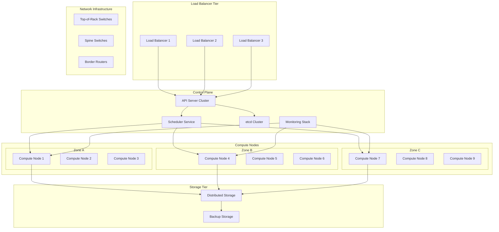

## Table of Contents

## Introduction

Deploying Firecracker microVMs in production requires careful planning, robust automation, and comprehensive operational practices. This guide provides a complete roadmap for building enterprise-ready Firecracker infrastructure, from initial setup through ongoing operations.

We'll cover infrastructure design patterns, deployment automation, monitoring strategies, disaster recovery, and operational procedures that have been proven in large-scale production environments. By following this guide, you'll build a resilient, scalable, and maintainable Firecracker platform.

## Production Architecture Overview



### Design Principles

**High Availability**: No single points of failure across all components
**Horizontal Scalability**: Linear scaling with additional compute nodes
**Security Isolation**: Multiple layers of isolation and access control
**Operational Simplicity**: Automated operations with minimal manual intervention
**Cost Optimization**: Efficient resource utilization and dynamic scaling

## Infrastructure Prerequisites

### Hardware Requirements

```yaml
# hardware-requirements.yaml
compute_nodes:
  minimum_configuration:
    cpu_cores: 16
    memory_gb: 64
    storage_gb: 1000
    network_interfaces: 2
    network_bandwidth_gbps: 10
  
  recommended_configuration:
    cpu_cores: 32
    memory_gb: 128
    storage_gb: 2000
    network_interfaces: 4
    network_bandwidth_gbps: 25
  
  optimal_configuration:
    cpu_cores: 64
    memory_gb: 256
    storage_gb: 4000
    network_interfaces: 4
    network_bandwidth_gbps: 100

control_plane:
  minimum_nodes: 3
  cpu_cores_per_node: 8
  memory_gb_per_node: 16
  storage_gb_per_node: 500

storage_requirements:
  min_iops_per_vm: 1000
  min_bandwidth_mbps_per_vm: 100
  replication_factor: 3
  backup_retention_days: 30
```

### Network Design

```bash
#!/bin/bash

# Network configuration for production Firecracker deployment
echo "=== Production Network Setup ==="

# VLAN configuration for multi-tenant isolation
configure_vlans() {
    # Management VLAN (VLAN 100)
    sudo vconfig add eth0 100
    sudo ip addr add 10.0.100.10/24 dev eth0.100
    sudo ip link set eth0.100 up
    
    # Compute VLAN (VLAN 200)
    sudo vconfig add eth0 200
    sudo ip addr add 10.0.200.10/24 dev eth0.200
    sudo ip link set eth0.200 up
    
    # Storage VLAN (VLAN 300)
    sudo vconfig add eth0 300
    sudo ip addr add 10.0.300.10/24 dev eth0.300
    sudo ip link set eth0.300 up
    
    # Tenant VLANs (VLAN 400-499)
    for vlan in {400..410}; do
        sudo vconfig add eth1 $vlan
        sudo ip addr add 10.0.$((vlan-300)).10/24 dev eth1.$vlan
        sudo ip link set eth1.$vlan up
    done
    
    echo "✓ VLAN configuration complete"
}

# Configure OpenVSwitch for advanced networking
setup_ovs() {
    # Install OpenVSwitch
    sudo apt update
    sudo apt install -y openvswitch-switch
    
    # Create management bridge
    sudo ovs-vsctl add-br br-mgmt
    sudo ovs-vsctl add-port br-mgmt eth0.100
    
    # Create compute bridge with VXLAN support
    sudo ovs-vsctl add-br br-compute
    sudo ovs-vsctl add-port br-compute eth0.200
    
    # Configure VXLAN for overlay networking
    sudo ovs-vsctl add-port br-compute vxlan1 -- set interface vxlan1 type=vxlan options:remote_ip=10.0.200.11
    
    # Create tenant bridges
    for tenant in {1..10}; do
        bridge_name="br-tenant-$tenant"
        sudo ovs-vsctl add-br $bridge_name
        sudo ovs-vsctl set bridge $bridge_name other_config:hwaddr=02:00:00:00:00:$(printf "%02x" $tenant)
    done
    
    echo "✓ OpenVSwitch configuration complete"
}

# Configure SR-IOV for high-performance networking
setup_sriov() {
    echo "Setting up SR-IOV..."
    
    # Enable SR-IOV (requires compatible NIC)
    echo 8 | sudo tee /sys/class/net/eth2/device/sriov_numvfs
    
    # Configure virtual functions
    for vf in {0..7}; do
        sudo ip link set eth2 vf $vf mac 02:00:00:00:01:$(printf "%02x" $vf)
        sudo ip link set eth2 vf $vf vlan $((400 + vf))
        sudo ip link set eth2 vf $vf spoofchk on
        sudo ip link set eth2 vf $vf trust off
    done
    
    echo "✓ SR-IOV configuration complete"
}

# Main network setup
configure_vlans
setup_ovs
setup_sriov

echo "Production network setup complete!"
```

## Deployment Automation

### Infrastructure as Code with Terraform

```hcl
# main.tf - Firecracker Infrastructure
terraform {
  required_version = ">= 1.0"
  required_providers {
    aws = {
      source  = "hashicorp/aws"
      version = "~> 5.0"
    }
  }
}

variable "environment" {
  description = "Environment name"
  type        = string
  default     = "production"
}

variable "cluster_name" {
  description = "Firecracker cluster name"
  type        = string
  default     = "firecracker-prod"
}

variable "compute_node_count" {
  description = "Number of compute nodes"
  type        = number
  default     = 9
}

# VPC and networking
resource "aws_vpc" "firecracker_vpc" {
  cidr_block           = "10.0.0.0/16"
  enable_dns_hostnames = true
  enable_dns_support   = true
  
  tags = {
    Name        = "${var.cluster_name}-vpc"
    Environment = var.environment
  }
}

resource "aws_subnet" "compute_subnets" {
  count = 3
  
  vpc_id                  = aws_vpc.firecracker_vpc.id
  cidr_block              = "10.0.${count.index + 1}.0/24"
  availability_zone       = data.aws_availability_zones.available.names[count.index]
  map_public_ip_on_launch = false
  
  tags = {
    Name        = "${var.cluster_name}-compute-subnet-${count.index + 1}"
    Environment = var.environment
    Type        = "compute"
  }
}

resource "aws_subnet" "control_subnets" {
  count = 3
  
  vpc_id                  = aws_vpc.firecracker_vpc.id
  cidr_block              = "10.0.${count.index + 10}.0/24"
  availability_zone       = data.aws_availability_zones.available.names[count.index]
  map_public_ip_on_launch = true
  
  tags = {
    Name        = "${var.cluster_name}-control-subnet-${count.index + 1}"
    Environment = var.environment
    Type        = "control"
  }
}

# Security Groups
resource "aws_security_group" "compute_nodes" {
  name_prefix = "${var.cluster_name}-compute-"
  vpc_id      = aws_vpc.firecracker_vpc.id
  
  # Firecracker API access
  ingress {
    from_port   = 8080
    to_port     = 8099
    protocol    = "tcp"
    cidr_blocks = [aws_vpc.firecracker_vpc.cidr_block]
  }
  
  # SSH access
  ingress {
    from_port   = 22
    to_port     = 22
    protocol    = "tcp"
    cidr_blocks = ["10.0.0.0/16"]
  }
  
  # VM networking
  ingress {
    from_port   = 0
    to_port     = 65535
    protocol    = "tcp"
    cidr_blocks = ["10.0.0.0/16"]
  }
  
  egress {
    from_port   = 0
    to_port     = 0
    protocol    = "-1"
    cidr_blocks = ["0.0.0.0/0"]
  }
  
  tags = {
    Name        = "${var.cluster_name}-compute-sg"
    Environment = var.environment
  }
}

# Launch template for compute nodes
resource "aws_launch_template" "compute_nodes" {
  name_prefix   = "${var.cluster_name}-compute-"
  image_id      = data.aws_ami.ubuntu.id
  instance_type = "m6i.4xlarge"
  key_name      = aws_key_pair.cluster_key.key_name
  
  vpc_security_group_ids = [aws_security_group.compute_nodes.id]
  
  user_data = base64encode(templatefile("${path.module}/user_data/compute_node.sh", {
    cluster_name = var.cluster_name
    environment  = var.environment
  }))
  
  block_device_mappings {
    device_name = "/dev/sda1"
    ebs {
      volume_size = 500
      volume_type = "gp3"
      iops        = 12000
      throughput  = 1000
      encrypted   = true
    }
  }
  
  # Additional EBS volume for VM storage
  block_device_mappings {
    device_name = "/dev/sdf"
    ebs {
      volume_size = 2000
      volume_type = "gp3"
      iops        = 16000
      throughput  = 1000
      encrypted   = true
    }
  }
  
  tag_specifications {
    resource_type = "instance"
    tags = {
      Name        = "${var.cluster_name}-compute"
      Environment = var.environment
      Role        = "compute"
    }
  }
  
  tags = {
    Name        = "${var.cluster_name}-compute-template"
    Environment = var.environment
  }
}

# Auto Scaling Group for compute nodes
resource "aws_autoscaling_group" "compute_nodes" {
  name                = "${var.cluster_name}-compute-asg"
  vpc_zone_identifier = aws_subnet.compute_subnets[*].id
  target_group_arns   = []
  health_check_type   = "EC2"
  
  min_size         = var.compute_node_count
  max_size         = var.compute_node_count * 2
  desired_capacity = var.compute_node_count
  
  launch_template {
    id      = aws_launch_template.compute_nodes.id
    version = "$Latest"
  }
  
  tag {
    key                 = "Name"
    value               = "${var.cluster_name}-compute-node"
    propagate_at_launch = true
  }
  
  tag {
    key                 = "Environment"
    value               = var.environment
    propagate_at_launch = true
  }
  
  tag {
    key                 = "Role"
    value               = "compute"
    propagate_at_launch = true
  }
}

# Application Load Balancer for API access
resource "aws_lb" "api_lb" {
  name               = "${var.cluster_name}-api-alb"
  internal           = true
  load_balancer_type = "application"
  security_groups    = [aws_security_group.api_lb.id]
  subnets            = aws_subnet.control_subnets[*].id
  
  enable_deletion_protection = false
  
  tags = {
    Name        = "${var.cluster_name}-api-alb"
    Environment = var.environment
  }
}

# RDS for metadata storage
resource "aws_rds_cluster" "metadata_db" {
  cluster_identifier      = "${var.cluster_name}-metadata"
  engine                  = "aurora-postgresql"
  engine_version          = "13.7"
  availability_zones      = data.aws_availability_zones.available.names
  database_name           = "firecracker_metadata"
  master_username         = "fcadmin"
  manage_master_user_password = true
  
  backup_retention_period = 30
  preferred_backup_window = "03:00-05:00"
  
  vpc_security_group_ids = [aws_security_group.database.id]
  db_subnet_group_name   = aws_db_subnet_group.metadata.name
  
  tags = {
    Name        = "${var.cluster_name}-metadata-db"
    Environment = var.environment
  }
}

# Outputs
output "vpc_id" {
  value = aws_vpc.firecracker_vpc.id
}

output "compute_subnets" {
  value = aws_subnet.compute_subnets[*].id
}

output "api_load_balancer_dns" {
  value = aws_lb.api_lb.dns_name
}

output "database_endpoint" {
  value = aws_rds_cluster.metadata_db.endpoint
}
```

### Configuration Management with Ansible

```yaml
# ansible/playbooks/deploy-firecracker.yml
---
- name: Deploy Firecracker Infrastructure
  hosts: compute_nodes
  become: yes
  vars:
    firecracker_version: "1.4.1"
    kata_version: "3.0.0"
    cluster_name: "{{ cluster_name }}"
    environment: "{{ environment }}"
  
  tasks:
    - name: Update system packages
      apt:
        update_cache: yes
        upgrade: dist
      
    - name: Install required packages
      apt:
        name:
          - curl
          - git
          - jq
          - bridge-utils
          - iptables-persistent
          - qemu-kvm
          - libvirt-daemon-system
          - libvirt-clients
          - cpu-checker
        state: present
    
    - name: Check KVM support
      command: kvm-ok
      register: kvm_check
      failed_when: "'KVM acceleration can be used' not in kvm_check.stdout"
    
    - name: Create firecracker user
      user:
        name: firecracker
        system: yes
        shell: /bin/bash
        home: /var/lib/firecracker
        create_home: yes
    
    - name: Add firecracker user to kvm group
      user:
        name: firecracker
        groups: kvm
        append: yes
    
    - name: Download Firecracker binary
      get_url:
        url: "https://github.com/firecracker-microvm/firecracker/releases/download/v{{ firecracker_version }}/firecracker-v{{ firecracker_version }}-x86_64.tgz"
        dest: /tmp/firecracker.tgz
        mode: '0644'
    
    - name: Extract Firecracker binary
      unarchive:
        src: /tmp/firecracker.tgz
        dest: /tmp
        remote_src: yes
    
    - name: Install Firecracker binary
      copy:
        src: "/tmp/release-v{{ firecracker_version }}-x86_64/firecracker-v{{ firecracker_version }}-x86_64"
        dest: /usr/local/bin/firecracker
        mode: '0755'
        remote_src: yes
        owner: root
        group: root
    
    - name: Install Jailer binary
      copy:
        src: "/tmp/release-v{{ firecracker_version }}-x86_64/jailer-v{{ firecracker_version }}-x86_64"
        dest: /usr/local/bin/jailer
        mode: '0755'
        remote_src: yes
        owner: root
        group: root
    
    - name: Create firecracker directories
      file:
        path: "{{ item }}"
        state: directory
        owner: firecracker
        group: firecracker
        mode: '0755'
      loop:
        - /var/lib/firecracker
        - /var/lib/firecracker/images
        - /var/lib/firecracker/kernels
        - /var/lib/firecracker/vms
        - /var/log/firecracker
        - /etc/firecracker
    
    - name: Configure system for Firecracker
      template:
        src: sysctl-firecracker.conf.j2
        dest: /etc/sysctl.d/99-firecracker.conf
        mode: '0644'
      notify: reload sysctl
    
    - name: Configure hugepages
      lineinfile:
        path: /etc/default/grub
        regexp: '^GRUB_CMDLINE_LINUX_DEFAULT='
        line: 'GRUB_CMDLINE_LINUX_DEFAULT="quiet splash hugepagesz=1G hugepages=4 hugepagesz=2M hugepages=1024 isolcpus=2-7 nohz_full=2-7 rcu_nocbs=2-7"'
      register: grub_config
    
    - name: Update GRUB
      command: update-grub
      when: grub_config.changed
    
    - name: Install Docker for container support
      apt:
        name: docker.io
        state: present
    
    - name: Install containerd
      apt:
        name: containerd
        state: present
    
    - name: Configure containerd for Kata
      template:
        src: containerd-config.toml.j2
        dest: /etc/containerd/config.toml
        mode: '0644'
      notify: restart containerd
    
    - name: Install Kata Containers
      block:
        - name: Add Kata repository
          apt_repository:
            repo: "deb http://download.opensuse.org/repositories/home:/katacontainers:/releases:/{{ ansible_distribution_release }}:/main/xUbuntu_{{ ansible_distribution_version }}/ /"
            state: present
        
        - name: Add Kata GPG key
          apt_key:
            url: "https://download.opensuse.org/repositories/home:katacontainers:releases:{{ ansible_distribution_release }}:main/xUbuntu_{{ ansible_distribution_version }}/Release.key"
            state: present
        
        - name: Install Kata Containers
          apt:
            name: kata-containers
            state: present
            update_cache: yes
    
    - name: Configure Kata for Firecracker
      template:
        src: kata-configuration.toml.j2
        dest: /etc/kata-containers/configuration-fc.toml
        mode: '0644'
    
    - name: Create VM management service
      template:
        src: firecracker-manager.service.j2
        dest: /etc/systemd/system/firecracker-manager.service
        mode: '0644'
      notify:
        - reload systemd
        - start firecracker-manager
    
    - name: Install monitoring agent
      template:
        src: firecracker-monitoring.py.j2
        dest: /usr/local/bin/firecracker-monitoring
        mode: '0755'
    
    - name: Create monitoring service
      template:
        src: firecracker-monitoring.service.j2
        dest: /etc/systemd/system/firecracker-monitoring.service
        mode: '0644'
      notify:
        - reload systemd
        - start firecracker-monitoring
    
    - name: Configure log rotation
      template:
        src: firecracker-logrotate.j2
        dest: /etc/logrotate.d/firecracker
        mode: '0644'
    
    - name: Install cleanup cron job
      cron:
        name: "Clean up old Firecracker logs"
        minute: "0"
        hour: "2"
        job: "/usr/local/bin/firecracker-cleanup"
        user: root

  handlers:
    - name: reload sysctl
      command: sysctl -p /etc/sysctl.d/99-firecracker.conf
    
    - name: restart containerd
      service:
        name: containerd
        state: restarted
    
    - name: reload systemd
      systemd:
        daemon_reload: yes
    
    - name: start firecracker-manager
      service:
        name: firecracker-manager
        state: started
        enabled: yes
    
    - name: start firecracker-monitoring
      service:
        name: firecracker-monitoring
        state: started
        enabled: yes
```

### CI/CD Pipeline

```yaml
# .github/workflows/deploy-firecracker.yml
name: Deploy Firecracker Infrastructure

on:
  push:
    branches: [main]
  pull_request:
    branches: [main]

env:
  AWS_REGION: us-west-2
  CLUSTER_NAME: firecracker-prod

jobs:
  validate:
    name: Validate Infrastructure Code
    runs-on: ubuntu-latest
    steps:
      - name: Checkout code
        uses: actions/checkout@v4
      
      - name: Setup Terraform
        uses: hashicorp/setup-terraform@v2
        with:
          terraform_version: 1.6.0
      
      - name: Terraform Format Check
        run: terraform fmt -check
      
      - name: Terraform Init
        run: terraform init -backend=false
      
      - name: Terraform Validate
        run: terraform validate
      
      - name: Setup Ansible
        run: |
          pip install ansible ansible-lint
      
      - name: Ansible Lint
        run: ansible-lint ansible/playbooks/

  security-scan:
    name: Security Scan
    runs-on: ubuntu-latest
    steps:
      - name: Checkout code
        uses: actions/checkout@v4
      
      - name: Run Checkov
        uses: bridgecrewio/checkov-action@master
        with:
          directory: .
          framework: terraform
          output_format: sarif
          output_file_path: reports/results.sarif
      
      - name: Upload SARIF file
        uses: github/codeql-action/upload-sarif@v2
        with:
          sarif_file: reports/results.sarif

  plan:
    name: Terraform Plan
    runs-on: ubuntu-latest
    needs: [validate, security-scan]
    if: github.event_name == 'pull_request'
    steps:
      - name: Checkout code
        uses: actions/checkout@v4
      
      - name: Configure AWS credentials
        uses: aws-actions/configure-aws-credentials@v2
        with:
          aws-access-key-id: ${{ secrets.AWS_ACCESS_KEY_ID }}
          aws-secret-access-key: ${{ secrets.AWS_SECRET_ACCESS_KEY }}
          aws-region: ${{ env.AWS_REGION }}
      
      - name: Setup Terraform
        uses: hashicorp/setup-terraform@v2
        with:
          terraform_version: 1.6.0
      
      - name: Terraform Init
        run: terraform init
      
      - name: Terraform Plan
        run: |
          terraform plan -out=tfplan \
            -var="cluster_name=${{ env.CLUSTER_NAME }}" \
            -var="environment=staging"
      
      - name: Upload plan
        uses: actions/upload-artifact@v3
        with:
          name: terraform-plan
          path: tfplan

  deploy-staging:
    name: Deploy to Staging
    runs-on: ubuntu-latest
    needs: [plan]
    if: github.event_name == 'pull_request'
    environment: staging
    steps:
      - name: Checkout code
        uses: actions/checkout@v4
      
      - name: Configure AWS credentials
        uses: aws-actions/configure-aws-credentials@v2
        with:
          aws-access-key-id: ${{ secrets.AWS_ACCESS_KEY_ID }}
          aws-secret-access-key: ${{ secrets.AWS_SECRET_ACCESS_KEY }}
          aws-region: ${{ env.AWS_REGION }}
      
      - name: Setup Terraform
        uses: hashicorp/setup-terraform@v2
        with:
          terraform_version: 1.6.0
      
      - name: Download plan
        uses: actions/download-artifact@v3
        with:
          name: terraform-plan
      
      - name: Terraform Apply
        run: terraform apply -auto-approve tfplan
      
      - name: Get infrastructure outputs
        id: tf-outputs
        run: |
          echo "vpc_id=$(terraform output -raw vpc_id)" >> $GITHUB_OUTPUT
          echo "api_lb_dns=$(terraform output -raw api_load_balancer_dns)" >> $GITHUB_OUTPUT
      
      - name: Setup Ansible
        run: |
          pip install ansible boto3 botocore
      
      - name: Generate Ansible inventory
        run: |
          ansible-playbook \
            -e vpc_id=${{ steps.tf-outputs.outputs.vpc_id }} \
            -e cluster_name=${{ env.CLUSTER_NAME }} \
            ansible/playbooks/generate-inventory.yml
      
      - name: Deploy Firecracker software
        run: |
          ansible-playbook \
            -i inventory/staging.ini \
            -e cluster_name=${{ env.CLUSTER_NAME }} \
            -e environment=staging \
            ansible/playbooks/deploy-firecracker.yml
      
      - name: Run integration tests
        run: |
          python tests/integration_tests.py \
            --api-endpoint ${{ steps.tf-outputs.outputs.api_lb_dns }} \
            --environment staging

  deploy-production:
    name: Deploy to Production
    runs-on: ubuntu-latest
    needs: [validate, security-scan]
    if: github.ref == 'refs/heads/main'
    environment: production
    steps:
      - name: Checkout code
        uses: actions/checkout@v4
      
      - name: Configure AWS credentials
        uses: aws-actions/configure-aws-credentials@v2
        with:
          aws-access-key-id: ${{ secrets.AWS_ACCESS_KEY_ID }}
          aws-secret-access-key: ${{ secrets.AWS_SECRET_ACCESS_KEY }}
          aws-region: ${{ env.AWS_REGION }}
      
      - name: Setup Terraform
        uses: hashicorp/setup-terraform@v2
        with:
          terraform_version: 1.6.0
      
      - name: Terraform Init
        run: terraform init
      
      - name: Terraform Plan
        run: |
          terraform plan -out=tfplan \
            -var="cluster_name=${{ env.CLUSTER_NAME }}" \
            -var="environment=production" \
            -var="compute_node_count=15"
      
      - name: Terraform Apply
        run: terraform apply -auto-approve tfplan
      
      - name: Get infrastructure outputs
        id: tf-outputs
        run: |
          echo "vpc_id=$(terraform output -raw vpc_id)" >> $GITHUB_OUTPUT
          echo "api_lb_dns=$(terraform output -raw api_load_balancer_dns)" >> $GITHUB_OUTPUT
      
      - name: Setup Ansible
        run: |
          pip install ansible boto3 botocore
      
      - name: Deploy Firecracker software
        run: |
          ansible-playbook \
            -i inventory/production.ini \
            -e cluster_name=${{ env.CLUSTER_NAME }} \
            -e environment=production \
            ansible/playbooks/deploy-firecracker.yml
      
      - name: Run smoke tests
        run: |
          python tests/smoke_tests.py \
            --api-endpoint ${{ steps.tf-outputs.outputs.api_lb_dns }} \
            --environment production
      
      - name: Notify deployment
        uses: 8398a7/action-slack@v3
        with:
          status: ${{ job.status }}
          channel: '#deployments'
          text: |
            Firecracker production deployment completed!
            Environment: production
            API Endpoint: ${{ steps.tf-outputs.outputs.api_lb_dns }}
        env:
          SLACK_WEBHOOK_URL: ${{ secrets.SLACK_WEBHOOK }}
```

## VM Lifecycle Management

### VM Manager Service

```python
#!/usr/bin/env python3
"""
Firecracker VM Lifecycle Manager
Manages VM creation, monitoring, and cleanup in production environments
"""

import json
import time
import uuid
import logging
import threading
import subprocess
from pathlib import Path
from datetime import datetime, timedelta
from typing import Dict, List, Optional, Tuple
from dataclasses import dataclass, asdict
from enum import Enum

import psutil
import requests

# Configure logging
logging.basicConfig(
    level=logging.INFO,
    format='%(asctime)s - %(name)s - %(levelname)s - %(message)s',
    handlers=[
        logging.FileHandler('/var/log/firecracker/vm-manager.log'),
        logging.StreamHandler()
    ]
)
logger = logging.getLogger('vm-manager')

class VMState(Enum):
    CREATING = "creating"
    RUNNING = "running" 
    STOPPING = "stopping"
    STOPPED = "stopped"
    ERROR = "error"

@dataclass
class VMConfiguration:
    vm_id: str
    vcpus: int
    memory_mb: int
    kernel_path: str
    rootfs_path: str
    network_config: Dict
    storage_config: List[Dict]
    metadata: Dict
    created_at: datetime
    ttl_hours: Optional[int] = None

@dataclass
class VMInstance:
    config: VMConfiguration
    state: VMState
    pid: Optional[int]
    api_socket: str
    metrics_path: str
    log_path: str
    last_health_check: datetime
    resource_usage: Dict = None

class FirecrackerVMManager:
    """Production-grade Firecracker VM lifecycle manager"""
    
    def __init__(self, config_path: str = '/etc/firecracker/manager.conf'):
        self.config = self._load_config(config_path)
        self.vms: Dict[str, VMInstance] = {}
        self.running = False
        self.health_check_interval = 30
        self.cleanup_interval = 300
        
        # Initialize directories
        self.base_dir = Path(self.config['base_directory'])
        self.vm_dir = self.base_dir / 'vms'
        self.image_dir = self.base_dir / 'images'
        self.kernel_dir = self.base_dir / 'kernels'
        self.log_dir = Path('/var/log/firecracker')
        
        for directory in [self.vm_dir, self.image_dir, self.kernel_dir, self.log_dir]:
            directory.mkdir(parents=True, exist_ok=True)
        
        # Load existing VMs
        self._discover_existing_vms()
    
    def _load_config(self, config_path: str) -> Dict:
        """Load manager configuration"""
        default_config = {
            'base_directory': '/var/lib/firecracker',
            'max_vms_per_node': 50,
            'default_vm_ttl_hours': 24,
            'health_check_enabled': True,
            'metrics_enabled': True,
            'auto_cleanup_enabled': True,
            'resource_limits': {
                'max_memory_mb': 8192,
                'max_vcpus': 8
            },
            'network': {
                'bridge_name': 'br0',
                'subnet': '172.16.0.0/16',
                'dhcp_range_start': '172.16.1.100',
                'dhcp_range_end': '172.16.1.200'
            }
        }
        
        try:
            with open(config_path, 'r') as f:
                user_config = json.load(f)
                default_config.update(user_config)
        except FileNotFoundError:
            logger.warning(f"Config file {config_path} not found, using defaults")
        
        return default_config
    
    def _discover_existing_vms(self):
        """Discover VMs that are already running"""
        logger.info("Discovering existing VMs...")
        
        for proc in psutil.process_iter(['pid', 'name', 'cmdline']):
            try:
                if proc.info['name'] == 'firecracker':
                    vm_id = self._extract_vm_id_from_cmdline(proc.info['cmdline'])
                    if vm_id:
                        vm_dir = self.vm_dir / vm_id
                        config_file = vm_dir / 'config.json'
                        
                        if config_file.exists():
                            config = self._load_vm_config(config_file)
                            instance = VMInstance(
                                config=config,
                                state=VMState.RUNNING,
                                pid=proc.info['pid'],
                                api_socket=str(vm_dir / 'api.sock'),
                                metrics_path=str(vm_dir / 'metrics.json'),
                                log_path=str(self.log_dir / f'{vm_id}.log'),
                                last_health_check=datetime.now()
                            )
                            self.vms[vm_id] = instance
                            logger.info(f"Discovered existing VM: {vm_id}")
            except (psutil.NoSuchProcess, psutil.AccessDenied):
                continue
        
        logger.info(f"Discovered {len(self.vms)} existing VMs")
    
    def _extract_vm_id_from_cmdline(self, cmdline: List[str]) -> Optional[str]:
        """Extract VM ID from Firecracker command line"""
        for i, arg in enumerate(cmdline):
            if '--api-sock' in arg and i + 1 < len(cmdline):
                socket_path = cmdline[i + 1]
                return Path(socket_path).parent.name
        return None
    
    def _load_vm_config(self, config_file: Path) -> VMConfiguration:
        """Load VM configuration from file"""
        with open(config_file, 'r') as f:
            data = json.load(f)
            return VMConfiguration(**data)
    
    def create_vm(self, vm_spec: Dict) -> Tuple[str, bool]:
        """Create a new VM instance"""
        vm_id = vm_spec.get('vm_id', str(uuid.uuid4())[:8])
        
        # Validate resource limits
        if not self._validate_resources(vm_spec):
            return vm_id, False
        
        # Check capacity
        if len(self.vms) >= self.config['max_vms_per_node']:
            logger.error(f"Maximum VM capacity reached: {self.config['max_vms_per_node']}")
            return vm_id, False
        
        try:
            # Create VM configuration
            config = VMConfiguration(
                vm_id=vm_id,
                vcpus=vm_spec.get('vcpus', 1),
                memory_mb=vm_spec.get('memory_mb', 512),
                kernel_path=vm_spec.get('kernel_path', str(self.kernel_dir / 'vmlinux.bin')),
                rootfs_path=vm_spec.get('rootfs_path', str(self.image_dir / 'rootfs.ext4')),
                network_config=vm_spec.get('network_config', {}),
                storage_config=vm_spec.get('storage_config', []),
                metadata=vm_spec.get('metadata', {}),
                created_at=datetime.now(),
                ttl_hours=vm_spec.get('ttl_hours', self.config['default_vm_ttl_hours'])
            )
            
            # Create VM directory structure
            vm_dir = self.vm_dir / vm_id
            vm_dir.mkdir(exist_ok=True)
            
            # Save configuration
            config_file = vm_dir / 'config.json'
            with open(config_file, 'w') as f:
                json.dump(asdict(config), f, indent=2, default=str)
            
            # Prepare VM files
            if not self._prepare_vm_files(config, vm_dir):
                return vm_id, False
            
            # Start Firecracker process
            if not self._start_firecracker(config, vm_dir):
                return vm_id, False
            
            # Create VM instance
            instance = VMInstance(
                config=config,
                state=VMState.CREATING,
                pid=None,
                api_socket=str(vm_dir / 'api.sock'),
                metrics_path=str(vm_dir / 'metrics.json'),
                log_path=str(self.log_dir / f'{vm_id}.log'),
                last_health_check=datetime.now()
            )
            
            # Wait for Firecracker to start
            if self._wait_for_api(instance.api_socket, timeout=30):
                # Configure and start VM
                if self._configure_and_start_vm(instance):
                    instance.state = VMState.RUNNING
                    self.vms[vm_id] = instance
                    logger.info(f"Successfully created VM: {vm_id}")
                    return vm_id, True
            
            instance.state = VMState.ERROR
            logger.error(f"Failed to start VM: {vm_id}")
            return vm_id, False
            
        except Exception as e:
            logger.error(f"Error creating VM {vm_id}: {e}")
            return vm_id, False
    
    def _validate_resources(self, vm_spec: Dict) -> bool:
        """Validate VM resource requirements"""
        limits = self.config['resource_limits']
        
        vcpus = vm_spec.get('vcpus', 1)
        memory_mb = vm_spec.get('memory_mb', 512)
        
        if vcpus > limits['max_vcpus']:
            logger.error(f"vCPU count {vcpus} exceeds limit {limits['max_vcpus']}")
            return False
        
        if memory_mb > limits['max_memory_mb']:
            logger.error(f"Memory {memory_mb}MB exceeds limit {limits['max_memory_mb']}MB")
            return False
        
        # Check available system resources
        system_memory = psutil.virtual_memory()
        used_memory = sum(vm.config.memory_mb for vm in self.vms.values() 
                         if vm.state == VMState.RUNNING)
        
        if used_memory + memory_mb > system_memory.available // (1024 * 1024) * 0.8:
            logger.error("Insufficient system memory for new VM")
            return False
        
        return True
    
    def _prepare_vm_files(self, config: VMConfiguration, vm_dir: Path) -> bool:
        """Prepare VM filesystem and kernel images"""
        try:
            # Copy/create rootfs if needed
            rootfs_source = Path(config.rootfs_path)
            rootfs_dest = vm_dir / 'rootfs.ext4'
            
            if not rootfs_dest.exists() and rootfs_source.exists():
                subprocess.run(['cp', str(rootfs_source), str(rootfs_dest)], check=True)
                logger.info(f"Copied rootfs for VM {config.vm_id}")
            
            # Kernel should already exist
            if not Path(config.kernel_path).exists():
                logger.error(f"Kernel not found: {config.kernel_path}")
                return False
            
            return True
            
        except Exception as e:
            logger.error(f"Error preparing VM files: {e}")
            return False
    
    def _start_firecracker(self, config: VMConfiguration, vm_dir: Path) -> bool:
        """Start Firecracker process"""
        try:
            api_socket = vm_dir / 'api.sock'
            log_file = self.log_dir / f'{config.vm_id}.log'
            
            cmd = [
                'firecracker',
                '--api-sock', str(api_socket),
                '--config-file', str(vm_dir / 'fc_config.json')
            ]
            
            # Create Firecracker configuration
            fc_config = self._generate_firecracker_config(config, vm_dir)
            with open(vm_dir / 'fc_config.json', 'w') as f:
                json.dump(fc_config, f, indent=2)
            
            # Start process
            with open(log_file, 'w') as log:
                process = subprocess.Popen(
                    cmd,
                    stdout=log,
                    stderr=subprocess.STDOUT,
                    cwd=str(vm_dir)
                )
            
            # Update VM with PID
            if config.vm_id in self.vms:
                self.vms[config.vm_id].pid = process.pid
            
            logger.info(f"Started Firecracker process for VM {config.vm_id} (PID: {process.pid})")
            return True
            
        except Exception as e:
            logger.error(f"Error starting Firecracker: {e}")
            return False
    
    def _generate_firecracker_config(self, config: VMConfiguration, vm_dir: Path) -> Dict:
        """Generate Firecracker configuration file"""
        
        rootfs_path = vm_dir / 'rootfs.ext4'
        
        fc_config = {
            "boot-source": {
                "kernel_image_path": config.kernel_path,
                "boot_args": "console=ttyS0 reboot=k panic=1 pci=off nomodules ro"
            },
            "drives": [
                {
                    "drive_id": "rootfs",
                    "path_on_host": str(rootfs_path),
                    "is_root_device": True,
                    "is_read_only": False
                }
            ],
            "machine-config": {
                "vcpu_count": config.vcpus,
                "mem_size_mib": config.memory_mb
            },
            "logger": {
                "level": "Info",
                "log_path": str(self.log_dir / f'{config.vm_id}-vmm.log')
            },
            "metrics": {
                "metrics_path": str(vm_dir / 'metrics.json')
            }
        }
        
        # Add network configuration if provided
        if config.network_config:
            fc_config["network-interfaces"] = [config.network_config]
        
        # Add additional storage if provided
        for i, storage in enumerate(config.storage_config):
            drive_config = {
                "drive_id": f"storage_{i}",
                "path_on_host": storage["path"],
                "is_root_device": False,
                "is_read_only": storage.get("read_only", False)
            }
            fc_config["drives"].append(drive_config)
        
        return fc_config
    
    def _wait_for_api(self, api_socket: str, timeout: int = 30) -> bool:
        """Wait for Firecracker API to become available"""
        start_time = time.time()
        
        while time.time() - start_time < timeout:
            if Path(api_socket).exists():
                try:
                    import requests_unixsocket
                    session = requests_unixsocket.Session()
                    base_url = f'http+unix://{api_socket.replace("/", "%2F")}'
                    
                    response = session.get(f'{base_url}/', timeout=5)
                    if response.status_code == 200:
                        return True
                except Exception:
                    pass
            
            time.sleep(1)
        
        return False
    
    def _configure_and_start_vm(self, instance: VMInstance) -> bool:
        """Configure and start the VM via Firecracker API"""
        try:
            import requests_unixsocket
            session = requests_unixsocket.Session()
            base_url = f'http+unix://{instance.api_socket.replace("/", "%2F")}'
            
            # Start the VM
            response = session.put(
                f'{base_url}/actions',
                json={'action_type': 'InstanceStart'},
                timeout=10
            )
            
            if response.status_code == 204:
                logger.info(f"Successfully started VM {instance.config.vm_id}")
                return True
            else:
                logger.error(f"Failed to start VM {instance.config.vm_id}: {response.status_code}")
                return False
                
        except Exception as e:
            logger.error(f"Error configuring VM {instance.config.vm_id}: {e}")
            return False
    
    def stop_vm(self, vm_id: str, force: bool = False) -> bool:
        """Stop a running VM"""
        if vm_id not in self.vms:
            logger.error(f"VM not found: {vm_id}")
            return False
        
        instance = self.vms[vm_id]
        
        try:
            if not force:
                # Try graceful shutdown first
                if self._graceful_shutdown(instance):
                    instance.state = VMState.STOPPED
                    logger.info(f"Gracefully stopped VM: {vm_id}")
                    return True
            
            # Force stop
            if instance.pid and psutil.pid_exists(instance.pid):
                proc = psutil.Process(instance.pid)
                proc.terminate()
                
                # Wait for process to exit
                try:
                    proc.wait(timeout=10)
                except psutil.TimeoutExpired:
                    proc.kill()
                    proc.wait(timeout=5)
                
                instance.state = VMState.STOPPED
                logger.info(f"Force stopped VM: {vm_id}")
                return True
            
            return False
            
        except Exception as e:
            logger.error(f"Error stopping VM {vm_id}: {e}")
            return False
    
    def _graceful_shutdown(self, instance: VMInstance) -> bool:
        """Attempt graceful VM shutdown"""
        try:
            import requests_unixsocket
            session = requests_unixsocket.Session()
            base_url = f'http+unix://{instance.api_socket.replace("/", "%2F")}'
            
            # Send shutdown action
            response = session.put(
                f'{base_url}/actions',
                json={'action_type': 'SendCtrlAltDel'},
                timeout=5
            )
            
            if response.status_code == 204:
                # Wait for shutdown
                time.sleep(5)
                return not psutil.pid_exists(instance.pid)
            
            return False
            
        except Exception:
            return False
    
    def delete_vm(self, vm_id: str) -> bool:
        """Delete a VM and clean up its resources"""
        if vm_id not in self.vms:
            logger.error(f"VM not found: {vm_id}")
            return False
        
        instance = self.vms[vm_id]
        
        # Stop VM first
        if instance.state == VMState.RUNNING:
            if not self.stop_vm(vm_id, force=True):
                logger.error(f"Failed to stop VM before deletion: {vm_id}")
                return False
        
        try:
            # Clean up VM directory
            vm_dir = self.vm_dir / vm_id
            if vm_dir.exists():
                subprocess.run(['rm', '-rf', str(vm_dir)], check=True)
            
            # Clean up logs
            log_file = Path(instance.log_path)
            if log_file.exists():
                log_file.unlink()
            
            # Remove from tracking
            del self.vms[vm_id]
            
            logger.info(f"Deleted VM: {vm_id}")
            return True
            
        except Exception as e:
            logger.error(f"Error deleting VM {vm_id}: {e}")
            return False
    
    def get_vm_status(self, vm_id: str) -> Optional[Dict]:
        """Get VM status and metrics"""
        if vm_id not in self.vms:
            return None
        
        instance = self.vms[vm_id]
        
        status = {
            'vm_id': vm_id,
            'state': instance.state.value,
            'config': asdict(instance.config),
            'pid': instance.pid,
            'uptime_seconds': (datetime.now() - instance.config.created_at).total_seconds(),
            'last_health_check': instance.last_health_check.isoformat()
        }
        
        # Add resource usage if available
        if instance.resource_usage:
            status['resource_usage'] = instance.resource_usage
        
        # Add Firecracker metrics if available
        metrics_file = Path(instance.metrics_path)
        if metrics_file.exists():
            try:
                with open(metrics_file, 'r') as f:
                    status['firecracker_metrics'] = json.load(f)
            except Exception:
                pass
        
        return status
    
    def list_vms(self) -> List[Dict]:
        """List all VMs"""
        return [self.get_vm_status(vm_id) for vm_id in self.vms.keys()]
    
    def health_check(self):
        """Perform health checks on all VMs"""
        logger.debug("Performing health checks...")
        
        for vm_id, instance in list(self.vms.items()):
            try:
                if instance.state == VMState.RUNNING:
                    # Check if process is still running
                    if instance.pid and not psutil.pid_exists(instance.pid):
                        logger.warning(f"VM process died: {vm_id}")
                        instance.state = VMState.ERROR
                        continue
                    
                    # Update resource usage
                    if instance.pid:
                        proc = psutil.Process(instance.pid)
                        instance.resource_usage = {
                            'cpu_percent': proc.cpu_percent(),
                            'memory_info': proc.memory_info()._asdict(),
                            'io_counters': proc.io_counters()._asdict() if hasattr(proc, 'io_counters') else {}
                        }
                    
                    instance.last_health_check = datetime.now()
                
            except Exception as e:
                logger.error(f"Health check failed for VM {vm_id}: {e}")
                instance.state = VMState.ERROR
    
    def cleanup_expired_vms(self):
        """Clean up expired VMs based on TTL"""
        if not self.config['auto_cleanup_enabled']:
            return
        
        logger.debug("Checking for expired VMs...")
        
        current_time = datetime.now()
        expired_vms = []
        
        for vm_id, instance in self.vms.items():
            if instance.config.ttl_hours:
                expiry_time = instance.config.created_at + timedelta(hours=instance.config.ttl_hours)
                if current_time > expiry_time:
                    expired_vms.append(vm_id)
        
        for vm_id in expired_vms:
            logger.info(f"Cleaning up expired VM: {vm_id}")
            self.delete_vm(vm_id)
    
    def start_background_tasks(self):
        """Start background maintenance tasks"""
        self.running = True
        
        def health_check_loop():
            while self.running:
                try:
                    self.health_check()
                    time.sleep(self.health_check_interval)
                except Exception as e:
                    logger.error(f"Error in health check loop: {e}")
                    time.sleep(self.health_check_interval)
        
        def cleanup_loop():
            while self.running:
                try:
                    self.cleanup_expired_vms()
                    time.sleep(self.cleanup_interval)
                except Exception as e:
                    logger.error(f"Error in cleanup loop: {e}")
                    time.sleep(self.cleanup_interval)
        
        # Start background threads
        self.health_check_thread = threading.Thread(target=health_check_loop, daemon=True)
        self.cleanup_thread = threading.Thread(target=cleanup_loop, daemon=True)
        
        self.health_check_thread.start()
        self.cleanup_thread.start()
        
        logger.info("Background tasks started")
    
    def stop_background_tasks(self):
        """Stop background maintenance tasks"""
        self.running = False
        logger.info("Background tasks stopped")

# REST API server for VM management
from flask import Flask, request, jsonify
from flask_limiter import Limiter
from flask_limiter.util import get_remote_address

app = Flask(__name__)
limiter = Limiter(
    app,
    key_func=get_remote_address,
    default_limits=["100 per hour"]
)

vm_manager = FirecrackerVMManager()

@app.route('/health', methods=['GET'])
def health_check():
    return jsonify({'status': 'healthy', 'timestamp': datetime.now().isoformat()})

@app.route('/vms', methods=['GET'])
@limiter.limit("10 per minute")
def list_vms():
    return jsonify({'vms': vm_manager.list_vms()})

@app.route('/vms', methods=['POST'])
@limiter.limit("5 per minute")
def create_vm():
    vm_spec = request.get_json()
    if not vm_spec:
        return jsonify({'error': 'Invalid JSON'}), 400
    
    vm_id, success = vm_manager.create_vm(vm_spec)
    
    if success:
        return jsonify({'vm_id': vm_id, 'status': 'created'}), 201
    else:
        return jsonify({'vm_id': vm_id, 'status': 'failed'}), 500

@app.route('/vms/<vm_id>', methods=['GET'])
def get_vm_status(vm_id):
    status = vm_manager.get_vm_status(vm_id)
    if status:
        return jsonify(status)
    else:
        return jsonify({'error': 'VM not found'}), 404

@app.route('/vms/<vm_id>', methods=['DELETE'])
@limiter.limit("5 per minute")
def delete_vm(vm_id):
    if vm_manager.delete_vm(vm_id):
        return jsonify({'status': 'deleted'})
    else:
        return jsonify({'error': 'Failed to delete VM'}), 500

@app.route('/vms/<vm_id>/stop', methods=['POST'])
@limiter.limit("5 per minute")
def stop_vm(vm_id):
    force = request.get_json().get('force', False) if request.get_json() else False
    
    if vm_manager.stop_vm(vm_id, force=force):
        return jsonify({'status': 'stopped'})
    else:
        return jsonify({'error': 'Failed to stop VM'}), 500

if __name__ == '__main__':
    # Start background tasks
    vm_manager.start_background_tasks()
    
    try:
        # Start API server
        app.run(host='0.0.0.0', port=8080, debug=False)
    except KeyboardInterrupt:
        logger.info("Shutting down VM manager...")
        vm_manager.stop_background_tasks()
```

### VM Templates and Images

```bash
#!/bin/bash

# VM image and template management
echo "=== VM Image Management ==="

# Base paths
IMAGE_DIR="/var/lib/firecracker/images"
KERNEL_DIR="/var/lib/firecracker/kernels"
TEMPLATE_DIR="/var/lib/firecracker/templates"

# Create directory structure
sudo mkdir -p "$IMAGE_DIR" "$KERNEL_DIR" "$TEMPLATE_DIR"

# Build optimized kernel
build_optimized_kernel() {
    local kernel_version="6.1.0"
    local build_dir="/tmp/kernel-build"
    
    echo "Building optimized kernel v$kernel_version..."
    
    # Download kernel source
    mkdir -p "$build_dir"
    cd "$build_dir"
    
    wget "https://cdn.kernel.org/pub/linux/kernel/v6.x/linux-${kernel_version}.tar.xz"
    tar -xf "linux-${kernel_version}.tar.xz"
    cd "linux-${kernel_version}"
    
    # Apply Firecracker-optimized config
    cat > .config << 'EOF'
# Firecracker optimized kernel configuration
CONFIG_64BIT=y
CONFIG_X86_64=y
CONFIG_SMP=y
CONFIG_HYPERVISOR_GUEST=y
CONFIG_PARAVIRT=y
CONFIG_KVM_GUEST=y
CONFIG_VIRTIO=y
CONFIG_VIRTIO_PCI=y
CONFIG_VIRTIO_BLK=y
CONFIG_VIRTIO_NET=y
CONFIG_VIRTIO_CONSOLE=y
CONFIG_VIRTIO_VSOCKETS=y
CONFIG_EXT4_FS=y
CONFIG_PROC_FS=y
CONFIG_SYSFS=y
CONFIG_TMPFS=y
CONFIG_DEVTMPFS=y
CONFIG_SERIAL_8250=y
CONFIG_SERIAL_8250_CONSOLE=y
CONFIG_NET=y
CONFIG_INET=y
CONFIG_TCP_CONG_BBR=y
CONFIG_PREEMPT_NONE=y
CONFIG_NO_HZ_IDLE=y
CONFIG_HIGH_RES_TIMERS=y
# Disable unnecessary features
CONFIG_MODULES=n
CONFIG_DEBUG_KERNEL=n
CONFIG_SUSPEND=n
CONFIG_HIBERNATION=n
CONFIG_ACPI=n
CONFIG_PCI=n
CONFIG_USB=n
CONFIG_SOUND=n
CONFIG_DRM=n
EOF
    
    # Build kernel
    make -j$(nproc) vmlinux
    
    # Copy to kernel directory
    sudo cp vmlinux "$KERNEL_DIR/vmlinux-optimized.bin"
    
    echo "✓ Optimized kernel built and installed"
    
    # Cleanup
    cd /
    rm -rf "$build_dir"
}

# Create base Ubuntu rootfs
create_ubuntu_rootfs() {
    local image_name="ubuntu-22.04-base.ext4"
    local image_path="$IMAGE_DIR/$image_name"
    local mount_point="/tmp/rootfs-build"
    local image_size="2G"
    
    echo "Creating Ubuntu 22.04 base image..."
    
    # Create ext4 image
    sudo dd if=/dev/zero of="$image_path" bs=1M count=2048
    sudo mkfs.ext4 "$image_path"
    
    # Mount image
    sudo mkdir -p "$mount_point"
    sudo mount -o loop "$image_path" "$mount_point"
    
    # Install Ubuntu base system
    sudo debootstrap --arch=amd64 --variant=minbase jammy "$mount_point" http://archive.ubuntu.com/ubuntu/
    
    # Chroot and configure system
    sudo chroot "$mount_point" bash << 'CHROOT_SCRIPT'
# Update package list
apt-get update

# Install essential packages
apt-get install -y \
    systemd \
    systemd-sysv \
    dbus \
    openssh-server \
    cloud-init \
    curl \
    wget \
    vim \
    htop \
    net-tools \
    iproute2 \
    iptables \
    ca-certificates

# Configure SSH
systemctl enable ssh
mkdir -p /root/.ssh
chmod 700 /root/.ssh

# Configure cloud-init
cat > /etc/cloud/cloud.cfg << 'EOF'
cloud_init_modules:
 - bootcmd
 - write-files
 - resizefs
 - set_hostname
 - update_hostname
 - update_etc_hosts
 - ca-certs
 - rsyslog
 - users-groups
 - ssh

cloud_config_modules:
 - ssh-import-id
 - locale
 - set-passwords
 - package-update-upgrade-install
 - timezone
 - puppet
 - chef
 - salt-minion
 - mcollective
 - disable-ec2-metadata
 - runcmd
 - byobu

cloud_final_modules:
 - rightscale_userdata
 - scripts-vendor
 - scripts-per-once
 - scripts-per-boot
 - scripts-per-instance
 - scripts-user
 - ssh-authkey-fingerprints
 - keys-to-console
 - phone-home
 - final-message
 - power-state-change

system_info:
  default_user:
    name: ubuntu
    lock_passwd: True
    gecos: Ubuntu
    groups: [adm, audio, cdrom, dialout, dip, floppy, lxd, netdev, plugdev, sudo, video]
    sudo: ["ALL=(ALL) NOPASSWD:ALL"]
    shell: /bin/bash

datasource_list: [ NoCloud, None ]

EOF

# Configure networking
cat > /etc/systemd/network/10-virtio.network << 'EOF'
[Match]
Name=eth0

[Network]
DHCP=yes
EOF

systemctl enable systemd-networkd
systemctl enable systemd-resolved

# Configure console
systemctl enable getty@ttyS0

# Create fstab
cat > /etc/fstab << 'EOF'
/dev/vda1 / ext4 defaults 1 1
EOF

# Clean up
apt-get clean
rm -rf /var/lib/apt/lists/*
rm -rf /tmp/*
rm -rf /var/tmp/*

CHROOT_SCRIPT
    
    # Unmount
    sudo umount "$mount_point"
    sudo rmdir "$mount_point"
    
    echo "✓ Ubuntu base image created: $image_path"
}

# Create specialized images
create_web_server_image() {
    local base_image="$IMAGE_DIR/ubuntu-22.04-base.ext4"
    local web_image="$IMAGE_DIR/ubuntu-22.04-webserver.ext4"
    local mount_point="/tmp/web-rootfs"
    
    echo "Creating web server image..."
    
    # Copy base image
    sudo cp "$base_image" "$web_image"
    
    # Mount and customize
    sudo mkdir -p "$mount_point"
    sudo mount -o loop "$web_image" "$mount_point"
    
    sudo chroot "$mount_point" bash << 'CHROOT_SCRIPT'
# Update packages
apt-get update

# Install web server stack
apt-get install -y \
    nginx \
    php8.1-fpm \
    php8.1-mysql \
    php8.1-curl \
    php8.1-json \
    php8.1-zip \
    mysql-client \
    redis-tools \
    supervisor

# Configure nginx
cat > /etc/nginx/nginx.conf << 'EOF'
user www-data;
worker_processes auto;
pid /run/nginx.pid;
include /etc/nginx/modules-enabled/*.conf;

events {
    worker_connections 1024;
    use epoll;
    multi_accept on;
}

http {
    sendfile on;
    tcp_nopush on;
    tcp_nodelay on;
    keepalive_timeout 65;
    types_hash_max_size 2048;
    
    include /etc/nginx/mime.types;
    default_type application/octet-stream;
    
    gzip on;
    gzip_vary on;
    gzip_proxied any;
    gzip_comp_level 6;
    
    include /etc/nginx/conf.d/*.conf;
    include /etc/nginx/sites-enabled/*;
}
EOF

# Enable services
systemctl enable nginx
systemctl enable php8.1-fpm
systemctl enable supervisor

# Clean up
apt-get clean
rm -rf /var/lib/apt/lists/*

CHROOT_SCRIPT
    
    sudo umount "$mount_point"
    sudo rmdir "$mount_point"
    
    echo "✓ Web server image created: $web_image"
}

create_database_image() {
    local base_image="$IMAGE_DIR/ubuntu-22.04-base.ext4"
    local db_image="$IMAGE_DIR/ubuntu-22.04-database.ext4"
    local mount_point="/tmp/db-rootfs"
    
    echo "Creating database image..."
    
    # Copy base image
    sudo cp "$base_image" "$db_image"
    
    # Mount and customize
    sudo mkdir -p "$mount_point"
    sudo mount -o loop "$db_image" "$mount_point"
    
    sudo chroot "$mount_point" bash << 'CHROOT_SCRIPT'
# Update packages
apt-get update

# Install PostgreSQL
apt-get install -y \
    postgresql-14 \
    postgresql-client-14 \
    postgresql-contrib-14 \
    redis-server \
    htop \
    iotop \
    sysstat

# Configure PostgreSQL
sudo -u postgres createdb template_postfirecracker

# Configure Redis
systemctl enable redis-server

# Enable services
systemctl enable postgresql

# Clean up
apt-get clean
rm -rf /var/lib/apt/lists/*

CHROOT_SCRIPT
    
    sudo umount "$mount_point"
    sudo rmdir "$mount_point"
    
    echo "✓ Database image created: $db_image"
}

# Create VM templates
create_vm_templates() {
    echo "Creating VM templates..."
    
    # Web server template
    cat > "$TEMPLATE_DIR/webserver.json" << 'EOF'
{
  "name": "Ubuntu Web Server",
  "description": "Ubuntu 22.04 with Nginx, PHP, and common web server tools",
  "vcpus": 2,
  "memory_mb": 1024,
  "kernel_path": "/var/lib/firecracker/kernels/vmlinux-optimized.bin",
  "rootfs_path": "/var/lib/firecracker/images/ubuntu-22.04-webserver.ext4",
  "network_config": {
    "iface_id": "eth0",
    "guest_mac": "AA:FC:00:00:00:01",
    "host_dev_name": "tap-{{vm_id}}"
  },
  "metadata": {
    "category": "web",
    "os": "ubuntu",
    "version": "22.04"
  },
  "ttl_hours": 24
}
EOF
    
    # Database template
    cat > "$TEMPLATE_DIR/database.json" << 'EOF'
{
  "name": "Ubuntu Database Server",
  "description": "Ubuntu 22.04 with PostgreSQL and Redis",
  "vcpus": 2,
  "memory_mb": 2048,
  "kernel_path": "/var/lib/firecracker/kernels/vmlinux-optimized.bin",
  "rootfs_path": "/var/lib/firecracker/images/ubuntu-22.04-database.ext4",
  "network_config": {
    "iface_id": "eth0",
    "guest_mac": "AA:FC:00:00:00:01",
    "host_dev_name": "tap-{{vm_id}}"
  },
  "storage_config": [
    {
      "path": "/var/lib/firecracker/storage/{{vm_id}}-data.ext4",
      "size_gb": 20,
      "read_only": false
    }
  ],
  "metadata": {
    "category": "database",
    "os": "ubuntu",
    "version": "22.04"
  },
  "ttl_hours": 48
}
EOF
    
    # Microservice template
    cat > "$TEMPLATE_DIR/microservice.json" << 'EOF'
{
  "name": "Ubuntu Microservice",
  "description": "Minimal Ubuntu 22.04 for microservice workloads",
  "vcpus": 1,
  "memory_mb": 512,
  "kernel_path": "/var/lib/firecracker/kernels/vmlinux-optimized.bin",
  "rootfs_path": "/var/lib/firecracker/images/ubuntu-22.04-base.ext4",
  "network_config": {
    "iface_id": "eth0",
    "guest_mac": "AA:FC:00:00:00:01",
    "host_dev_name": "tap-{{vm_id}}"
  },
  "metadata": {
    "category": "microservice",
    "os": "ubuntu",
    "version": "22.04"
  },
  "ttl_hours": 12
}
EOF
    
    echo "✓ VM templates created in $TEMPLATE_DIR"
}

# Main execution
echo "Building Firecracker VM images and templates..."

# Build optimized kernel
build_optimized_kernel

# Create base image
create_ubuntu_rootfs

# Create specialized images
create_web_server_image
create_database_image

# Create templates
create_vm_templates

echo "VM image management setup complete!"
echo "Available images:"
ls -la "$IMAGE_DIR"
echo ""
echo "Available templates:"
ls -la "$TEMPLATE_DIR"
```

## Monitoring and Observability

### Comprehensive Monitoring Stack

```yaml
# monitoring/docker-compose.yml
version: '3.8'

services:
  prometheus:
    image: prom/prometheus:latest
    container_name: firecracker-prometheus
    command:
      - '--config.file=/etc/prometheus/prometheus.yml'
      - '--storage.tsdb.path=/prometheus'
      - '--storage.tsdb.retention.time=30d'
      - '--web.console.libraries=/etc/prometheus/console_libraries'
      - '--web.console.templates=/etc/prometheus/consoles'
      - '--web.enable-lifecycle'
      - '--web.enable-admin-api'
    ports:
      - "9090:9090"
    volumes:
      - ./prometheus/prometheus.yml:/etc/prometheus/prometheus.yml
      - ./prometheus/rules:/etc/prometheus/rules
      - prometheus_data:/prometheus
    restart: unless-stopped
    networks:
      - monitoring

  grafana:
    image: grafana/grafana:latest
    container_name: firecracker-grafana
    environment:
      - GF_SECURITY_ADMIN_PASSWORD=admin123
      - GF_USERS_ALLOW_SIGN_UP=false
      - GF_INSTALL_PLUGINS=grafana-clock-panel,grafana-simple-json-datasource
    ports:
      - "3000:3000"
    volumes:
      - ./grafana/provisioning:/etc/grafana/provisioning
      - ./grafana/dashboards:/var/lib/grafana/dashboards
      - grafana_data:/var/lib/grafana
    restart: unless-stopped
    networks:
      - monitoring
    depends_on:
      - prometheus

  alertmanager:
    image: prom/alertmanager:latest
    container_name: firecracker-alertmanager
    command:
      - '--config.file=/etc/alertmanager/config.yml'
      - '--storage.path=/alertmanager'
    ports:
      - "9093:9093"
    volumes:
      - ./alertmanager/config.yml:/etc/alertmanager/config.yml
      - alertmanager_data:/alertmanager
    restart: unless-stopped
    networks:
      - monitoring

  node-exporter:
    image: prom/node-exporter:latest
    container_name: firecracker-node-exporter
    command:
      - '--path.rootfs=/host'
      - '--collector.filesystem.mount-points-exclude=^/(sys|proc|dev|host|etc)($$|/)'
    ports:
      - "9100:9100"
    volumes:
      - '/:/host:ro,rslave'
    restart: unless-stopped
    networks:
      - monitoring

  firecracker-exporter:
    build: ./firecracker-exporter
    container_name: firecracker-exporter
    command: 
      - '--config.file=/etc/firecracker-exporter/config.yml'
      - '--web.listen-address=0.0.0.0:9200'
    ports:
      - "9200:9200"
    volumes:
      - ./firecracker-exporter/config.yml:/etc/firecracker-exporter/config.yml
      - /var/lib/firecracker:/var/lib/firecracker:ro
      - /var/run:/var/run:ro
    restart: unless-stopped
    networks:
      - monitoring
    privileged: true

  loki:
    image: grafana/loki:latest
    container_name: firecracker-loki
    command: -config.file=/etc/loki/local-config.yaml
    ports:
      - "3100:3100"
    volumes:
      - ./loki/config.yml:/etc/loki/local-config.yaml
      - loki_data:/loki
    restart: unless-stopped
    networks:
      - monitoring

  promtail:
    image: grafana/promtail:latest
    container_name: firecracker-promtail
    command: -config.file=/etc/promtail/config.yml
    volumes:
      - ./promtail/config.yml:/etc/promtail/config.yml
      - /var/log:/var/log:ro
      - /var/lib/firecracker:/var/lib/firecracker:ro
    restart: unless-stopped
    networks:
      - monitoring
    depends_on:
      - loki

volumes:
  prometheus_data:
  grafana_data:
  alertmanager_data:
  loki_data:

networks:
  monitoring:
    driver: bridge
```

### Custom Firecracker Exporter

```python
#!/usr/bin/env python3
"""
Firecracker Prometheus Exporter
Collects metrics from Firecracker VMs and exposes them for Prometheus
"""

import json
import time
import logging
import argparse
from pathlib import Path
from typing import Dict, List, Optional
from dataclasses import dataclass

import psutil
from prometheus_client import start_http_server, Gauge, Counter, Histogram, Info

# Configure logging
logging.basicConfig(level=logging.INFO)
logger = logging.getLogger('firecracker-exporter')

class FirecrackerExporter:
    """Prometheus exporter for Firecracker metrics"""
    
    def __init__(self, config_path: str = '/etc/firecracker-exporter/config.yml'):
        self.config = self._load_config(config_path)
        self.setup_metrics()
        self.vm_processes = {}
        
    def _load_config(self, config_path: str) -> Dict:
        """Load exporter configuration"""
        default_config = {
            'firecracker_base_dir': '/var/lib/firecracker',
            'collection_interval': 15,
            'metrics_port': 9200,
            'log_level': 'INFO'
        }
        
        try:
            import yaml
            with open(config_path, 'r') as f:
                user_config = yaml.safe_load(f)
                default_config.update(user_config)
        except (FileNotFoundError, ImportError):
            logger.warning(f"Config file {config_path} not found, using defaults")
        
        return default_config
    
    def setup_metrics(self):
        """Setup Prometheus metrics"""
        
        # System metrics
        self.system_cpu_usage = Gauge('firecracker_host_cpu_usage_percent', 'Host CPU usage percentage')
        self.system_memory_usage = Gauge('firecracker_host_memory_usage_percent', 'Host memory usage percentage')
        self.system_load_avg = Gauge('firecracker_host_load_average', 'Host load average', ['period'])
        
        # VM count metrics
        self.total_vms = Gauge('firecracker_vms_total', 'Total number of Firecracker VMs')
        self.vms_by_state = Gauge('firecracker_vms_by_state', 'Number of VMs by state', ['state'])
        
        # VM resource metrics
        self.vm_cpu_usage = Gauge('firecracker_vm_cpu_usage_percent', 'VM CPU usage percentage', ['vm_id', 'vm_name'])
        self.vm_memory_usage = Gauge('firecracker_vm_memory_usage_bytes', 'VM memory usage in bytes', ['vm_id', 'vm_name', 'type'])
        self.vm_uptime = Gauge('firecracker_vm_uptime_seconds', 'VM uptime in seconds', ['vm_id', 'vm_name'])
        
        # VM I/O metrics
        self.vm_io_read_bytes = Counter('firecracker_vm_io_read_bytes_total', 'VM I/O read bytes', ['vm_id', 'vm_name'])
        self.vm_io_write_bytes = Counter('firecracker_vm_io_write_bytes_total', 'VM I/O write bytes', ['vm_id', 'vm_name'])
        self.vm_io_read_ops = Counter('firecracker_vm_io_read_ops_total', 'VM I/O read operations', ['vm_id', 'vm_name'])
        self.vm_io_write_ops = Counter('firecracker_vm_io_write_ops_total', 'VM I/O write operations', ['vm_id', 'vm_name'])
        
        # VM network metrics (from Firecracker API)
        self.vm_network_rx_bytes = Counter('firecracker_vm_network_rx_bytes_total', 'VM network RX bytes', ['vm_id', 'vm_name', 'interface'])
        self.vm_network_tx_bytes = Counter('firecracker_vm_network_tx_bytes_total', 'VM network TX bytes', ['vm_id', 'vm_name', 'interface'])
        self.vm_network_rx_packets = Counter('firecracker_vm_network_rx_packets_total', 'VM network RX packets', ['vm_id', 'vm_name', 'interface'])
        self.vm_network_tx_packets = Counter('firecracker_vm_network_tx_packets_total', 'VM network TX packets', ['vm_id', 'vm_name', 'interface'])
        
        # VM block device metrics
        self.vm_block_read_bytes = Counter('firecracker_vm_block_read_bytes_total', 'VM block device read bytes', ['vm_id', 'vm_name', 'device'])
        self.vm_block_write_bytes = Counter('firecracker_vm_block_write_bytes_total', 'VM block device write bytes', ['vm_id', 'vm_name', 'device'])
        self.vm_block_read_ops = Counter('firecracker_vm_block_read_ops_total', 'VM block device read operations', ['vm_id', 'vm_name', 'device'])
        self.vm_block_write_ops = Counter('firecracker_vm_block_write_ops_total', 'VM block device write operations', ['vm_id', 'vm_name', 'device'])
        
        # vCPU metrics
        self.vm_vcpu_exits = Counter('firecracker_vm_vcpu_exits_total', 'VM vCPU exits', ['vm_id', 'vm_name', 'vcpu', 'exit_type'])
        
        # Exporter metrics
        self.collection_duration = Histogram('firecracker_exporter_collection_duration_seconds', 'Time spent collecting metrics')
        self.collection_errors = Counter('firecracker_exporter_collection_errors_total', 'Number of collection errors', ['type'])
        
        # VM info
        self.vm_info = Info('firecracker_vm_info', 'VM information', ['vm_id', 'vm_name'])
    
    def discover_vms(self) -> Dict[str, Dict]:
        """Discover running Firecracker VMs"""
        
        vms = {}
        base_dir = Path(self.config['firecracker_base_dir'])
        vm_dir = base_dir / 'vms'
        
        if not vm_dir.exists():
            return vms
        
        # Find VM processes
        firecracker_procs = {}
        for proc in psutil.process_iter(['pid', 'name', 'cmdline', 'create_time']):
            try:
                if proc.info['name'] == 'firecracker':
                    # Extract VM ID from command line
                    vm_id = self._extract_vm_id(proc.info['cmdline'])
                    if vm_id:
                        firecracker_procs[vm_id] = {
                            'process': proc,
                            'pid': proc.info['pid'],
                            'start_time': proc.info['create_time']
                        }
            except (psutil.NoSuchProcess, psutil.AccessDenied):
                continue
        
        # Match with VM directories
        for vm_path in vm_dir.iterdir():
            if vm_path.is_dir():
                vm_id = vm_path.name
                config_file = vm_path / 'config.json'
                
                vm_info = {
                    'vm_id': vm_id,
                    'vm_name': vm_id,  # Default name
                    'config_file': config_file,
                    'api_socket': vm_path / 'api.sock',
                    'metrics_file': vm_path / 'metrics.json',
                    'state': 'unknown',
                    'process': None
                }
                
                # Load VM configuration
                if config_file.exists():
                    try:
                        with open(config_file, 'r') as f:
                            config_data = json.load(f)
                            vm_info['vm_name'] = config_data.get('metadata', {}).get('name', vm_id)
                            vm_info['config'] = config_data
                    except Exception as e:
                        logger.warning(f"Failed to load config for VM {vm_id}: {e}")
                
                # Match with running process
                if vm_id in firecracker_procs:
                    vm_info['process'] = firecracker_procs[vm_id]['process']
                    vm_info['pid'] = firecracker_procs[vm_id]['pid']
                    vm_info['start_time'] = firecracker_procs[vm_id]['start_time']
                    vm_info['state'] = 'running'
                else:
                    vm_info['state'] = 'stopped'
                
                vms[vm_id] = vm_info
        
        return vms
    
    def _extract_vm_id(self, cmdline: List[str]) -> Optional[str]:
        """Extract VM ID from Firecracker command line"""
        
        for i, arg in enumerate(cmdline):
            if '--api-sock' in arg and i + 1 < len(cmdline):
                socket_path = cmdline[i + 1]
                # Extract VM ID from socket path
                path_parts = Path(socket_path).parts
                for part in path_parts:
                    if part != 'api.sock' and not part.startswith('/'):
                        return part
        
        return None
    
    def collect_system_metrics(self):
        """Collect host system metrics"""
        
        try:
            # CPU usage
            cpu_percent = psutil.cpu_percent(interval=1)
            self.system_cpu_usage.set(cpu_percent)
            
            # Memory usage
            memory = psutil.virtual_memory()
            self.system_memory_usage.set(memory.percent)
            
            # Load averages
            if hasattr(psutil, 'getloadavg'):
                load_avg = psutil.getloadavg()
                self.system_load_avg.labels(period='1m').set(load_avg[0])
                self.system_load_avg.labels(period='5m').set(load_avg[1])
                self.system_load_avg.labels(period='15m').set(load_avg[2])
            
        except Exception as e:
            logger.error(f"Error collecting system metrics: {e}")
            self.collection_errors.labels(type='system').inc()
    
    def collect_vm_metrics(self, vms: Dict[str, Dict]):
        """Collect VM-specific metrics"""
        
        # Update VM counts
        self.total_vms.set(len(vms))
        
        # Count VMs by state
        state_counts = {}
        for vm_info in vms.values():
            state = vm_info['state']
            state_counts[state] = state_counts.get(state, 0) + 1
        
        for state, count in state_counts.items():
            self.vms_by_state.labels(state=state).set(count)
        
        # Collect metrics for each VM
        for vm_id, vm_info in vms.items():
            vm_name = vm_info['vm_name']
            
            try:
                # VM info
                if 'config' in vm_info:
                    config = vm_info['config']
                    info_labels = {
                        'vm_id': vm_id,
                        'vm_name': vm_name,
                        'vcpus': str(config.get('vcpus', 'unknown')),
                        'memory_mb': str(config.get('memory_mb', 'unknown')),
                        'kernel_path': config.get('kernel_path', 'unknown'),
                        'created_at': config.get('created_at', 'unknown')
                    }
                    self.vm_info.labels(**{k: v for k, v in info_labels.items() if k in ['vm_id', 'vm_name']}).info(info_labels)
                
                if vm_info['state'] == 'running' and vm_info['process']:
                    self._collect_process_metrics(vm_id, vm_name, vm_info['process'])
                    
                    # VM uptime
                    if 'start_time' in vm_info:
                        uptime = time.time() - vm_info['start_time']
                        self.vm_uptime.labels(vm_id=vm_id, vm_name=vm_name).set(uptime)
                
                # Collect Firecracker API metrics
                self._collect_firecracker_api_metrics(vm_id, vm_name, vm_info)
                
            except Exception as e:
                logger.error(f"Error collecting metrics for VM {vm_id}: {e}")
                self.collection_errors.labels(type='vm').inc()
    
    def _collect_process_metrics(self, vm_id: str, vm_name: str, process):
        """Collect process-level metrics for a VM"""
        
        try:
            # CPU usage
            cpu_percent = process.cpu_percent()
            self.vm_cpu_usage.labels(vm_id=vm_id, vm_name=vm_name).set(cpu_percent)
            
            # Memory usage
            memory_info = process.memory_info()
            self.vm_memory_usage.labels(vm_id=vm_id, vm_name=vm_name, type='rss').set(memory_info.rss)
            self.vm_memory_usage.labels(vm_id=vm_id, vm_name=vm_name, type='vms').set(memory_info.vms)
            
            if hasattr(memory_info, 'shared'):
                self.vm_memory_usage.labels(vm_id=vm_id, vm_name=vm_name, type='shared').set(memory_info.shared)
            
            # I/O counters
            if hasattr(process, 'io_counters'):
                io_counters = process.io_counters()
                self.vm_io_read_bytes.labels(vm_id=vm_id, vm_name=vm_name)._value._value = io_counters.read_bytes
                self.vm_io_write_bytes.labels(vm_id=vm_id, vm_name=vm_name)._value._value = io_counters.write_bytes
                self.vm_io_read_ops.labels(vm_id=vm_id, vm_name=vm_name)._value._value = io_counters.read_count
                self.vm_io_write_ops.labels(vm_id=vm_id, vm_name=vm_name)._value._value = io_counters.write_count
            
        except (psutil.NoSuchProcess, psutil.AccessDenied) as e:
            logger.warning(f"Process access error for VM {vm_id}: {e}")
        except Exception as e:
            logger.error(f"Error collecting process metrics for VM {vm_id}: {e}")
    
    def _collect_firecracker_api_metrics(self, vm_id: str, vm_name: str, vm_info: Dict):
        """Collect metrics from Firecracker API"""
        
        try:
            metrics_file = vm_info['metrics_file']
            if Path(metrics_file).exists():
                with open(metrics_file, 'r') as f:
                    api_metrics = json.load(f)
                    
                    # Network metrics
                    if 'net' in api_metrics:
                        net_metrics = api_metrics['net']
                        interface = 'eth0'  # Default interface
                        
                        # Update counter values directly (Firecracker provides cumulative values)
                        if 'rx_queue_event_count' in net_metrics:
                            self.vm_network_rx_packets.labels(vm_id=vm_id, vm_name=vm_name, interface=interface)._value._value = net_metrics['rx_queue_event_count']
                        
                        if 'tx_queue_event_count' in net_metrics:
                            self.vm_network_tx_packets.labels(vm_id=vm_id, vm_name=vm_name, interface=interface)._value._value = net_metrics['tx_queue_event_count']
                    
                    # Block device metrics
                    if 'block' in api_metrics:
                        block_metrics = api_metrics['block']
                        device = 'rootfs'  # Default device
                        
                        if 'read_count' in block_metrics:
                            self.vm_block_read_ops.labels(vm_id=vm_id, vm_name=vm_name, device=device)._value._value = block_metrics['read_count']
                        
                        if 'write_count' in block_metrics:
                            self.vm_block_write_ops.labels(vm_id=vm_id, vm_name=vm_name, device=device)._value._value = block_metrics['write_count']
                        
                        if 'read_bytes' in block_metrics:
                            self.vm_block_read_bytes.labels(vm_id=vm_id, vm_name=vm_name, device=device)._value._value = block_metrics['read_bytes']
                        
                        if 'write_bytes' in block_metrics:
                            self.vm_block_write_bytes.labels(vm_id=vm_id, vm_name=vm_name, device=device)._value._value = block_metrics['write_bytes']
                    
                    # vCPU metrics
                    if 'vcpu' in api_metrics:
                        for vcpu_id, vcpu_metrics in api_metrics['vcpu'].items():
                            for exit_type, count in vcpu_metrics.items():
                                if exit_type.startswith('exit_'):
                                    exit_name = exit_type.replace('exit_', '')
                                    self.vm_vcpu_exits.labels(vm_id=vm_id, vm_name=vm_name, vcpu=vcpu_id, exit_type=exit_name)._value._value = count
        
        except Exception as e:
            logger.debug(f"API metrics not available for VM {vm_id}: {e}")
    
    def collect_all_metrics(self):
        """Collect all metrics"""
        
        with self.collection_duration.time():
            try:
                # Collect system metrics
                self.collect_system_metrics()
                
                # Discover and collect VM metrics
                vms = self.discover_vms()
                self.collect_vm_metrics(vms)
                
                logger.debug(f"Collected metrics for {len(vms)} VMs")
                
            except Exception as e:
                logger.error(f"Error during metric collection: {e}")
                self.collection_errors.labels(type='collection').inc()
    
    def run(self):
        """Main exporter loop"""
        
        logger.info(f"Starting Firecracker exporter on port {self.config['metrics_port']}")
        
        # Start Prometheus metrics server
        start_http_server(self.config['metrics_port'])
        
        # Collection loop
        collection_interval = self.config['collection_interval']
        logger.info(f"Collecting metrics every {collection_interval} seconds")
        
        while True:
            try:
                self.collect_all_metrics()
                time.sleep(collection_interval)
            except KeyboardInterrupt:
                logger.info("Exporter stopped by user")
                break
            except Exception as e:
                logger.error(f"Unexpected error: {e}")
                time.sleep(collection_interval)

if __name__ == '__main__':
    parser = argparse.ArgumentParser(description='Firecracker Prometheus Exporter')
    parser.add_argument('--config.file', dest='config_file', 
                       default='/etc/firecracker-exporter/config.yml',
                       help='Path to configuration file')
    parser.add_argument('--web.listen-address', dest='listen_address',
                       default='0.0.0.0:9200',
                       help='Address to listen on for web interface')
    
    args = parser.parse_args()
    
    # Override config with command line args
    config = {}
    if hasattr(args, 'listen_address'):
        host, port = args.listen_address.split(':')
        config['metrics_port'] = int(port)
    
    exporter = FirecrackerExporter(args.config_file)
    if config:
        exporter.config.update(config)
    
    exporter.run()
```

## Disaster Recovery and Backup

### Backup Strategy

```python
#!/usr/bin/env python3
"""
Firecracker Backup and Disaster Recovery System
"""

import json
import time
import logging
import subprocess
import threading
from datetime import datetime, timedelta
from pathlib import Path
from typing import Dict, List, Optional
import boto3
from dataclasses import dataclass

logging.basicConfig(level=logging.INFO)
logger = logging.getLogger('firecracker-backup')

@dataclass
class BackupJob:
    vm_id: str
    backup_type: str  # 'snapshot', 'full', 'incremental'
    schedule: str     # cron-like schedule
    retention_days: int
    storage_backend: str  # 's3', 'local', 'nfs'
    compression: bool = True
    encryption: bool = True

class FirecrackerBackupManager:
    """Manage backups and disaster recovery for Firecracker VMs"""
    
    def __init__(self, config_path: str = '/etc/firecracker/backup.conf'):
        self.config = self._load_config(config_path)
        self.base_dir = Path(self.config['firecracker_base_dir'])
        self.backup_dir = Path(self.config['local_backup_dir'])
        self.backup_dir.mkdir(parents=True, exist_ok=True)
        
        # Initialize storage backends
        self.storage_backends = {}
        if 's3' in self.config.get('storage_backends', {}):
            self._init_s3_backend()
        
        # Track running backup jobs
        self.active_jobs = {}
        self.job_history = []
    
    def _load_config(self, config_path: str) -> Dict:
        """Load backup configuration"""
        default_config = {
            'firecracker_base_dir': '/var/lib/firecracker',
            'local_backup_dir': '/var/backups/firecracker',
            'max_concurrent_backups': 3,
            'default_retention_days': 30,
            'compression_level': 6,
            'storage_backends': {
                's3': {
                    'bucket': 'firecracker-backups',
                    'region': 'us-west-2',
                    'storage_class': 'STANDARD_IA'
                }
            },
            'encryption': {
                'enabled': True,
                'key_id': 'alias/firecracker-backup'
            }
        }
        
        try:
            with open(config_path, 'r') as f:
                user_config = json.load(f)
                default_config.update(user_config)
        except FileNotFoundError:
            logger.warning(f"Config file {config_path} not found, using defaults")
        
        return default_config
    
    def _init_s3_backend(self):
        """Initialize S3 storage backend"""
        s3_config = self.config['storage_backends']['s3']
        
        try:
            self.storage_backends['s3'] = {
                'client': boto3.client('s3', region_name=s3_config['region']),
                'bucket': s3_config['bucket'],
                'config': s3_config
            }
            logger.info(f"Initialized S3 backend: {s3_config['bucket']}")
        except Exception as e:
            logger.error(f"Failed to initialize S3 backend: {e}")
    
    def create_vm_snapshot(self, vm_id: str, snapshot_type: str = 'full') -> Dict:
        """Create a snapshot of a running VM"""
        
        logger.info(f"Creating {snapshot_type} snapshot for VM {vm_id}")
        
        vm_dir = self.base_dir / 'vms' / vm_id
        if not vm_dir.exists():
            raise ValueError(f"VM directory not found: {vm_dir}")
        
        # Create snapshot directory
        timestamp = datetime.now().strftime('%Y%m%d_%H%M%S')
        snapshot_name = f"{vm_id}_{snapshot_type}_{timestamp}"
        snapshot_dir = self.backup_dir / 'snapshots' / snapshot_name
        snapshot_dir.mkdir(parents=True, exist_ok=True)
        
        job_info = {
            'job_id': snapshot_name,
            'vm_id': vm_id,
            'type': snapshot_type,
            'started_at': datetime.now(),
            'status': 'running',
            'snapshot_dir': str(snapshot_dir)
        }
        
        try:
            # Pause VM for consistent snapshot (if running)
            api_socket = vm_dir / 'api.sock'
            vm_paused = False
            
            if api_socket.exists():
                if self._pause_vm(str(api_socket)):
                    vm_paused = True
                    logger.info(f"Paused VM {vm_id} for snapshot")
            
            # Copy VM files
            files_copied = []
            
            # Copy rootfs
            rootfs_path = vm_dir / 'rootfs.ext4'
            if rootfs_path.exists():
                snapshot_rootfs = snapshot_dir / 'rootfs.ext4'
                if self.config['compression']:
                    self._copy_and_compress(rootfs_path, f"{snapshot_rootfs}.gz")
                    files_copied.append(f"rootfs.ext4.gz")
                else:
                    subprocess.run(['cp', str(rootfs_path), str(snapshot_rootfs)], check=True)
                    files_copied.append('rootfs.ext4')
            
            # Copy additional storage
            for storage_file in vm_dir.glob('storage_*.ext4'):
                snapshot_storage = snapshot_dir / storage_file.name
                if self.config['compression']:
                    self._copy_and_compress(storage_file, f"{snapshot_storage}.gz")
                    files_copied.append(f"{storage_file.name}.gz")
                else:
                    subprocess.run(['cp', str(storage_file), str(snapshot_storage)], check=True)
                    files_copied.append(storage_file.name)
            
            # Copy configuration
            config_file = vm_dir / 'config.json'
            if config_file.exists():
                subprocess.run(['cp', str(config_file), str(snapshot_dir / 'config.json')], check=True)
                files_copied.append('config.json')
            
            # Create snapshot metadata
            metadata = {
                'vm_id': vm_id,
                'snapshot_name': snapshot_name,
                'snapshot_type': snapshot_type,
                'created_at': datetime.now().isoformat(),
                'files': files_copied,
                'compression': self.config['compression'],
                'vm_config': self._get_vm_config(vm_dir)
            }
            
            with open(snapshot_dir / 'metadata.json', 'w') as f:
                json.dump(metadata, f, indent=2)
            
            # Resume VM if it was paused
            if vm_paused:
                self._resume_vm(str(api_socket))
                logger.info(f"Resumed VM {vm_id}")
            
            # Calculate snapshot size
            snapshot_size = sum(f.stat().st_size for f in snapshot_dir.rglob('*') if f.is_file())
            
            job_info.update({
                'status': 'completed',
                'completed_at': datetime.now(),
                'files_copied': files_copied,
                'snapshot_size_bytes': snapshot_size
            })
            
            logger.info(f"Snapshot created successfully: {snapshot_name} ({snapshot_size // (1024*1024)}MB)")
            
            return job_info
            
        except Exception as e:
            job_info.update({
                'status': 'failed',
                'error': str(e),
                'completed_at': datetime.now()
            })
            
            logger.error(f"Snapshot creation failed for VM {vm_id}: {e}")
            
            # Resume VM if it was paused
            if vm_paused:
                self._resume_vm(str(api_socket))
            
            raise
        
        finally:
            self.job_history.append(job_info)
    
    def _copy_and_compress(self, source: Path, dest: str):
        """Copy and compress file using gzip"""
        cmd = ['gzip', '-c', str(source)]
        with open(dest, 'wb') as f:
            subprocess.run(cmd, stdout=f, check=True)
    
    def _pause_vm(self, api_socket: str) -> bool:
        """Pause VM via Firecracker API"""
        try:
            import requests_unixsocket
            session = requests_unixsocket.Session()
            base_url = f'http+unix://{api_socket.replace("/", "%2F")}'
            
            response = session.patch(
                f'{base_url}/vm',
                json={'state': 'Paused'},
                timeout=10
            )
            
            return response.status_code == 204
        except Exception as e:
            logger.warning(f"Failed to pause VM: {e}")
            return False
    
    def _resume_vm(self, api_socket: str) -> bool:
        """Resume VM via Firecracker API"""
        try:
            import requests_unixsocket
            session = requests_unixsocket.Session()
            base_url = f'http+unix://{api_socket.replace("/", "%2F")}'
            
            response = session.patch(
                f'{base_url}/vm',
                json={'state': 'Resumed'},
                timeout=10
            )
            
            return response.status_code == 204
        except Exception as e:
            logger.warning(f"Failed to resume VM: {e}")
            return False
    
    def _get_vm_config(self, vm_dir: Path) -> Dict:
        """Get VM configuration"""
        config_file = vm_dir / 'config.json'
        if config_file.exists():
            with open(config_file, 'r') as f:
                return json.load(f)
        return {}
    
    def upload_to_s3(self, snapshot_dir: Path, snapshot_name: str) -> bool:
        """Upload snapshot to S3"""
        if 's3' not in self.storage_backends:
            logger.error("S3 backend not configured")
            return False
        
        s3_client = self.storage_backends['s3']['client']
        bucket = self.storage_backends['s3']['bucket']
        
        try:
            for file_path in snapshot_dir.rglob('*'):
                if file_path.is_file():
                    relative_path = file_path.relative_to(snapshot_dir)
                    s3_key = f"snapshots/{snapshot_name}/{relative_path}"
                    
                    logger.info(f"Uploading {file_path.name} to S3...")
                    
                    extra_args = {}
                    if self.config['encryption']['enabled']:
                        extra_args['ServerSideEncryption'] = 'aws:kms'
                        extra_args['SSEKMSKeyId'] = self.config['encryption']['key_id']
                    
                    s3_client.upload_file(
                        str(file_path),
                        bucket,
                        s3_key,
                        ExtraArgs=extra_args
                    )
            
            logger.info(f"Successfully uploaded snapshot {snapshot_name} to S3")
            return True
            
        except Exception as e:
            logger.error(f"Failed to upload snapshot to S3: {e}")
            return False
    
    def restore_vm_from_snapshot(self, snapshot_name: str, target_vm_id: str = None) -> bool:
        """Restore VM from snapshot"""
        
        logger.info(f"Restoring VM from snapshot: {snapshot_name}")
        
        # Find snapshot
        snapshot_dir = self.backup_dir / 'snapshots' / snapshot_name
        if not snapshot_dir.exists():
            # Try to download from S3
            if not self._download_snapshot_from_s3(snapshot_name):
                raise ValueError(f"Snapshot not found: {snapshot_name}")
        
        # Load snapshot metadata
        metadata_file = snapshot_dir / 'metadata.json'
        if not metadata_file.exists():
            raise ValueError(f"Snapshot metadata not found: {metadata_file}")
        
        with open(metadata_file, 'r') as f:
            metadata = json.load(f)
        
        # Determine target VM ID
        original_vm_id = metadata['vm_id']
        if target_vm_id is None:
            target_vm_id = f"{original_vm_id}_restored_{int(time.time())}"
        
        logger.info(f"Restoring as VM: {target_vm_id}")
        
        try:
            # Create target VM directory
            target_vm_dir = self.base_dir / 'vms' / target_vm_id
            target_vm_dir.mkdir(parents=True, exist_ok=True)
            
            # Restore files
            for file_name in metadata['files']:
                if file_name.endswith('.gz'):
                    # Decompress
                    source_file = snapshot_dir / file_name
                    target_file = target_vm_dir / file_name[:-3]  # Remove .gz
                    
                    with open(source_file, 'rb') as src, open(target_file, 'wb') as tgt:
                        subprocess.run(['gunzip', '-c'], stdin=src, stdout=tgt, check=True)
                else:
                    # Direct copy
                    source_file = snapshot_dir / file_name
                    target_file = target_vm_dir / file_name
                    subprocess.run(['cp', str(source_file), str(target_file)], check=True)
                
                logger.info(f"Restored file: {file_name}")
            
            # Update VM configuration with new ID
            vm_config = metadata['vm_config'].copy()
            vm_config['vm_id'] = target_vm_id
            vm_config['restored_from'] = snapshot_name
            vm_config['restored_at'] = datetime.now().isoformat()
            
            with open(target_vm_dir / 'config.json', 'w') as f:
                json.dump(vm_config, f, indent=2)
            
            logger.info(f"VM restored successfully: {target_vm_id}")
            return True
            
        except Exception as e:
            logger.error(f"Failed to restore VM from snapshot: {e}")
            # Clean up partial restore
            if target_vm_dir.exists():
                subprocess.run(['rm', '-rf', str(target_vm_dir)], check=False)
            return False
    
    def _download_snapshot_from_s3(self, snapshot_name: str) -> bool:
        """Download snapshot from S3"""
        if 's3' not in self.storage_backends:
            return False
        
        s3_client = self.storage_backends['s3']['client']
        bucket = self.storage_backends['s3']['bucket']
        
        try:
            # List objects in snapshot
            prefix = f"snapshots/{snapshot_name}/"
            response = s3_client.list_objects_v2(Bucket=bucket, Prefix=prefix)
            
            if 'Contents' not in response:
                logger.error(f"Snapshot not found in S3: {snapshot_name}")
                return False
            
            # Create local directory
            snapshot_dir = self.backup_dir / 'snapshots' / snapshot_name
            snapshot_dir.mkdir(parents=True, exist_ok=True)
            
            # Download files
            for obj in response['Contents']:
                s3_key = obj['Key']
                file_path = snapshot_dir / Path(s3_key).relative_to(prefix)
                file_path.parent.mkdir(parents=True, exist_ok=True)
                
                logger.info(f"Downloading {Path(s3_key).name} from S3...")
                s3_client.download_file(bucket, s3_key, str(file_path))
            
            logger.info(f"Downloaded snapshot {snapshot_name} from S3")
            return True
            
        except Exception as e:
            logger.error(f"Failed to download snapshot from S3: {e}")
            return False
    
    def cleanup_old_snapshots(self, retention_days: int = None):
        """Clean up old snapshots based on retention policy"""
        
        if retention_days is None:
            retention_days = self.config['default_retention_days']
        
        cutoff_date = datetime.now() - timedelta(days=retention_days)
        logger.info(f"Cleaning up snapshots older than {retention_days} days")
        
        snapshots_dir = self.backup_dir / 'snapshots'
        if not snapshots_dir.exists():
            return
        
        cleaned_count = 0
        for snapshot_dir in snapshots_dir.iterdir():
            if snapshot_dir.is_dir():
                metadata_file = snapshot_dir / 'metadata.json'
                if metadata_file.exists():
                    try:
                        with open(metadata_file, 'r') as f:
                            metadata = json.load(f)
                        
                        created_at = datetime.fromisoformat(metadata['created_at'])
                        if created_at < cutoff_date:
                            logger.info(f"Removing old snapshot: {snapshot_dir.name}")
                            subprocess.run(['rm', '-rf', str(snapshot_dir)], check=True)
                            cleaned_count += 1
                            
                    except Exception as e:
                        logger.warning(f"Error processing snapshot {snapshot_dir.name}: {e}")
        
        logger.info(f"Cleaned up {cleaned_count} old snapshots")
    
    def schedule_backup(self, backup_job: BackupJob):
        """Schedule a backup job"""
        # This would integrate with a scheduler like cron or a job queue
        logger.info(f"Scheduled backup job for VM {backup_job.vm_id}")
        # Implementation would depend on chosen scheduling system
    
    def get_backup_status(self) -> Dict:
        """Get backup system status"""
        
        snapshots_dir = self.backup_dir / 'snapshots'
        snapshot_count = len(list(snapshots_dir.iterdir())) if snapshots_dir.exists() else 0
        
        # Calculate total backup size
        total_size = 0
        if snapshots_dir.exists():
            for snapshot_dir in snapshots_dir.iterdir():
                if snapshot_dir.is_dir():
                    total_size += sum(f.stat().st_size for f in snapshot_dir.rglob('*') if f.is_file())
        
        status = {
            'total_snapshots': snapshot_count,
            'total_backup_size_gb': total_size / (1024**3),
            'active_jobs': len(self.active_jobs),
            'recent_jobs': self.job_history[-10:],  # Last 10 jobs
            'storage_backends': list(self.storage_backends.keys())
        }
        
        return status

if __name__ == '__main__':
    backup_manager = FirecrackerBackupManager()
    
    # Example: Create snapshot
    # backup_manager.create_vm_snapshot('vm001', 'full')
    
    # Example: Restore from snapshot
    # backup_manager.restore_vm_from_snapshot('vm001_full_20250117_120000')
    
    # Example: Cleanup old snapshots
    # backup_manager.cleanup_old_snapshots(retention_days=30)
    
    # Show status
    status = backup_manager.get_backup_status()
    print(json.dumps(status, indent=2))
```

## Conclusion

This comprehensive production deployment guide provides a complete blueprint for building enterprise-ready Firecracker infrastructure. Key areas covered include:

- 🏗️ **Infrastructure Design**: Multi-tier architecture with high availability and scalability
- 🤖 **Automation**: Infrastructure as Code, configuration management, and CI/CD pipelines  
- 🔧 **Operations**: VM lifecycle management, templates, and image building
- 📊 **Monitoring**: Comprehensive observability stack with custom metrics
- 🛡️ **Disaster Recovery**: Backup strategies, snapshots, and restoration procedures

By following this guide, organizations can deploy Firecracker microVMs at scale while maintaining security, reliability, and operational efficiency. The modular approach allows teams to adopt components incrementally and customize them for specific requirements.

## Resources

- [Firecracker Production Best Practices](https://github.com/firecracker-microvm/firecracker/blob/main/docs/prod-host-setup.md)
- [Terraform AWS Provider](https://registry.terraform.io/providers/hashicorp/aws/latest)
- [Ansible Documentation](https://docs.ansible.com/)
- [Prometheus Monitoring](https://prometheus.io/docs/)
- [Grafana Dashboards](https://grafana.com/grafana/dashboards/)
- [AWS Backup Services](https://aws.amazon.com/backup/)