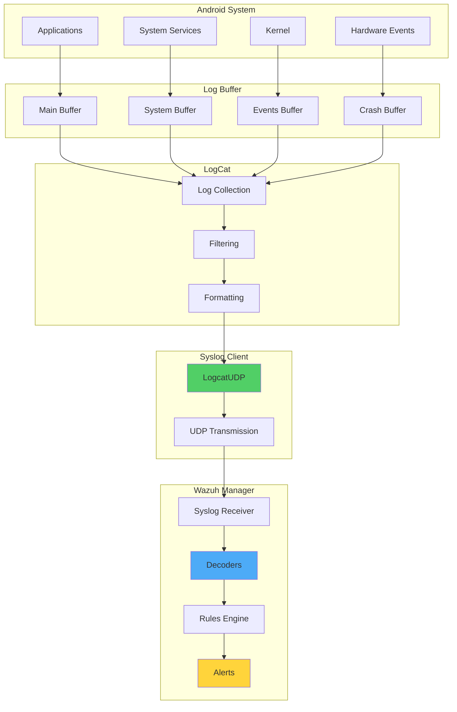

# How to Forward Android Syslog to Wazuh

## Introduction

Android devices have become integral to modern business operations, whether as corporate-owned devices or through BYOD (Bring Your Own Device) programs. Monitoring these devices for security events and compliance is crucial for maintaining organizational security posture.

Every Android device generates system logs similar to any other operating system. By forwarding these logs to Wazuh, organizations can:

- 🔍 **Monitor Security Events**: Track authentication attempts, app installations, and system changes
- 📱 **Ensure Compliance**: Verify devices meet organizational policies
- 🚨 **Detect Threats**: Identify malicious activities and unauthorized modifications
- 📊 **Centralize Management**: Monitor thousands of devices from a single platform
- 🛡️ **Respond to Incidents**: Take action on security events in real-time

## Android Logging Architecture

### Understanding Android Logs



### Log Types and Priorities

Android uses a priority-based logging system:

- **V (Verbose)**: Detailed debugging information
- **D (Debug)**: Debug messages
- **I (Info)**: Informational messages
- **W (Warning)**: Warning messages
- **E (Error)**: Error messages
- **F (Fatal)**: Fatal errors
- **S (Silent)**: Special priority to suppress all output

## Implementation Guide

### Requirements

- **Android Device**: Any Android device (phone/tablet)
- **Syslog Client**: LogcatUDP or similar app
- **Permissions**: READ_LOGS permission for the syslog client
- **Wazuh Manager**: Configured to receive syslog
- **Network**: Android device must reach Wazuh manager
- **Optional**: ADB CLI for one-time permission setup

### Phase 1: Configure Wazuh Manager

Edit `/var/ossec/etc/ossec.conf` to enable syslog reception:

```xml
<ossec_config>
  <remote>
    <connection>syslog</connection>
    <port>514</port>
    <protocol>udp</protocol>
    <allowed-ips>192.168.0.0/24</allowed-ips>
    <local_ip>192.168.0.200</local_ip>
  </remote>
</ossec_config>
```

Configuration explained:
- **connection**: Set to "syslog" for syslog reception
- **port**: Standard syslog port (514)
- **protocol**: UDP for Android syslog
- **allowed-ips**: Network range for Android devices
- **local_ip**: Wazuh manager's IP address

Restart Wazuh manager:

```bash
sudo systemctl restart wazuh-manager
```

### Phase 2: Install and Configure Android Syslog Client

#### Install LogcatUDP

1. Open Google Play Store
2. Search for "LogcatUDP"
3. Install the free app

#### Grant Permissions Using ADB

The easiest method is using ADB from a computer:

1. Enable USB debugging on Android device
2. Connect device to computer
3. Run command:

```bash
adb shell pm grant sk.madzik.android.logcatudp android.permission.READ_LOGS
```

#### Alternative: Grant Permissions via Shell

On the Android device:

```bash
# Using terminal emulator on device
su
pm grant sk.madzik.android.logcatudp android.permission.READ_LOGS
```

#### Configure LogcatUDP

1. Open LogcatUDP app
2. Set server address: `192.168.0.200`
3. Set port: `514`
4. Press "Save"
5. Press "(re)start"

### Phase 3: Verify Log Reception

Enable verbose logging on Wazuh manager:

```xml
<ossec_config>
  <global>
    <logall_json>yes</logall_json>
  </global>
</ossec_config>
```

Check incoming logs:

```bash
tail -f /var/ossec/logs/archives/archives.json
```

Example output:
```json
{
  "timestamp":"2019-07-26T12:01:28.130+0000",
  "agent":{"id":"000","name":"master"},
  "manager":{"name":"master"},
  "id":"1564142488.2661882",
  "cluster":{"name":"wazuh","node":"node01"},
  "full_log":"07-26 14:01:27.025 991 1009 D : DpmQmiMgr areAllIfaceActive ",
  "decoder":{},
  "location":"192.168.0.139"
}
```

## Custom Decoders and Rules

### App Installation Detection

#### Decoder Configuration

Add to `/var/ossec/etc/decoders/local_decoder.xml`:

```xml
<!-- Base Android decoder -->
<decoder name="android">
  <prematch>^\d+-\d+ \d+:\d+:\d+.\d+ \d+ \d+ </prematch>
</decoder>

<!-- App installation decoder -->
<decoder name="android-app-install">
  <parent>android</parent>
  <prematch>\.+Finsky</prematch>
  <regex>\.+Successful (install) of (\.+) \(</regex>
  <order>action_name,package_name</order>
</decoder>

<!-- App removal decoder -->
<decoder name="android-app-remove">
  <parent>android</parent>
  <prematch>\.+PackageManager</prematch>
  <regex>\.+Package (\.+) (\w+) removed</regex>
  <order>package_name,action_name</order>
</decoder>

<!-- Screen unlock decoder -->
<decoder name="android-screen-unlock">
  <parent>android</parent>
  <prematch>\.+KeyguardViewMediator</prematch>
  <regex>\.+handleKeyguardDone: (\w+)</regex>
  <order>unlock_status</order>
</decoder>

<!-- Call activity decoder -->
<decoder name="android-call">
  <parent>android</parent>
  <prematch>\.+InCallUI</prematch>
  <regex>\.+(IncomingCall|OutgoingCall) from (\.+)</regex>
  <order>call_type,phone_number</order>
</decoder>
```

#### Rule Configuration

Add to `/var/ossec/etc/rules/local_rules.xml`:

```xml
<group name="android,">
  <!-- App installation -->
  <rule id="100003" level="5">
    <decoded_as>android-app-install</decoded_as>
    <description>Android app installed: $(package_name)</description>
    <field name="action_name">install</field>
    <group>android_install,</group>
  </rule>

  <!-- App removal -->
  <rule id="100004" level="4">
    <decoded_as>android-app-remove</decoded_as>
    <description>Android app removed: $(package_name)</description>
    <group>android_remove,</group>
  </rule>

  <!-- Multiple app installations -->
  <rule id="100005" level="8" frequency="5" timeframe="300">
    <if_matched_sid>100003</if_matched_sid>
    <description>Multiple Android apps installed</description>
    <group>android_install,</group>
  </rule>

  <!-- Suspicious app installation -->
  <rule id="100006" level="10">
    <if_sid>100003</if_sid>
    <match>com.suspicious|hack|root|spy</match>
    <description>Suspicious Android app installed</description>
    <group>android_malware,</group>
  </rule>

  <!-- Screen unlock -->
  <rule id="100007" level="3">
    <decoded_as>android-screen-unlock</decoded_as>
    <description>Android device unlocked</description>
    <group>android_authentication,</group>
  </rule>

  <!-- Failed unlock attempts -->
  <rule id="100008" level="7" frequency="5" timeframe="60">
    <if_sid>100007</if_sid>
    <match>failed</match>
    <description>Multiple failed unlock attempts</description>
    <group>android_authentication_failed,</group>
  </rule>
</group>
```

### Test Decoder and Rules

Use `ossec-logtest`:

```bash
/var/ossec/bin/ossec-logtest
```

Test with sample log:
```
07-26 12:40:28.938 16091 16091 I Finsky : [2] lex.c(48): Successful install of com.airbnb.android (isid: c0whUj4AQ5C5HvBUpKinxg)
```

Expected output:
```
** Alert 1564143288.1: - android,android_install,
2019 Jul 26 12:14:48 master->stdin
Rule: 100003 (level 5) -> 'Android app installed: com.airbnb.android'
action_name: install
package_name: com.airbnb.android
```

## Advanced Monitoring Use Cases

### 1. Security Event Monitoring

```xml
<!-- Root detection -->
<decoder name="android-root-detection">
  <parent>android</parent>
  <prematch>\.+su|SuperSU|Magisk</prematch>
  <regex>\.+(granted|denied) root access to (\.+)</regex>
  <order>root_action,requesting_app</order>
</decoder>

<rule id="100010" level="12">
  <decoded_as>android-root-detection</decoded_as>
  <field name="root_action">granted</field>
  <description>Root access granted to $(requesting_app)</description>
  <options>alert_by_email</options>
  <group>android_root,</group>
</rule>

<!-- ADB connection -->
<decoder name="android-adb">
  <parent>android</parent>
  <prematch>\.+adbd</prematch>
  <regex>\.+connection from (\.+)</regex>
  <order>adb_source</order>
</decoder>

<rule id="100011" level="8">
  <decoded_as>android-adb</decoded_as>
  <description>ADB connection from $(adb_source)</description>
  <group>android_debug,</group>
</rule>

<!-- USB debugging -->
<decoder name="android-usb-debug">
  <parent>android</parent>
  <prematch>\.+UsbDebuggingManager</prematch>
  <regex>\.+USB debugging (enabled|disabled)</regex>
  <order>usb_debug_status</order>
</decoder>

<rule id="100012" level="9">
  <decoded_as>android-usb-debug</decoded_as>
  <field name="usb_debug_status">enabled</field>
  <description>USB debugging enabled on device</description>
  <group>android_security,</group>
</rule>
```

### 2. Network Activity Monitoring

```xml
<!-- WiFi connection -->
<decoder name="android-wifi">
  <parent>android</parent>
  <prematch>\.+WifiStateMachine</prematch>
  <regex>\.+Connected to (\.+) with IP (\.+)</regex>
  <order>wifi_ssid,ip_address</order>
</decoder>

<rule id="100020" level="3">
  <decoded_as>android-wifi</decoded_as>
  <description>Connected to WiFi: $(wifi_ssid)</description>
  <group>android_network,</group>
</rule>

<!-- VPN connection -->
<decoder name="android-vpn">
  <parent>android</parent>
  <prematch>\.+Vpn</prematch>
  <regex>\.+VPN (connected|disconnected): (\.+)</regex>
  <order>vpn_status,vpn_name</order>
</decoder>

<rule id="100021" level="5">
  <decoded_as>android-vpn</decoded_as>
  <description>VPN $(vpn_status): $(vpn_name)</description>
  <group>android_network,</group>
</rule>

<!-- Data usage alert -->
<decoder name="android-data-usage">
  <parent>android</parent>
  <prematch>\.+NetworkStats</prematch>
  <regex>\.+Data usage alert: (\.+) used (\.+) MB</regex>
  <order>app_name,data_mb</order>
</decoder>

<rule id="100022" level="6">
  <decoded_as>android-data-usage</decoded_as>
  <description>High data usage: $(app_name) used $(data_mb) MB</description>
  <group>android_network,</group>
</rule>
```

### 3. Hardware Event Monitoring

```xml
<!-- Battery events -->
<decoder name="android-battery">
  <parent>android</parent>
  <prematch>\.+BatteryService</prematch>
  <regex>\.+Battery level: (\d+)%, status: (\w+)</regex>
  <order>battery_level,battery_status</order>
</decoder>

<rule id="100030" level="4">
  <decoded_as>android-battery</decoded_as>
  <field name="battery_level" type="pcre2">^[0-9]$|^1[0-9]$</field>
  <description>Low battery: $(battery_level)%</description>
  <group>android_hardware,</group>
</rule>

<!-- Camera access -->
<decoder name="android-camera">
  <parent>android</parent>
  <prematch>\.+CameraService</prematch>
  <regex>\.+Camera access by (\.+): (\w+)</regex>
  <order>app_name,camera_action</order>
</decoder>

<rule id="100031" level="5">
  <decoded_as>android-camera</decoded_as>
  <description>Camera accessed by $(app_name)</description>
  <group>android_privacy,</group>
</rule>

<!-- Location access -->
<decoder name="android-location">
  <parent>android</parent>
  <prematch>\.+LocationManagerService</prematch>
  <regex>\.+Location request by (\.+) with accuracy (\w+)</regex>
  <order>app_name,accuracy</order>
</decoder>

<rule id="100032" level="5">
  <decoded_as>android-location</decoded_as>
  <description>Location requested by $(app_name)</description>
  <group>android_privacy,</group>
</rule>
```

## Log Filtering and Optimization

### Avoiding Log Flooding

LogcatUDP can generate thousands of events per second. Use filters to reduce noise:

#### Tag:Priority Filtering

Configure filters in LogcatUDP:
```
ActivityManager:W
PackageManager:I
SecurityLog:*
System.err:E
```

#### Wazuh-side Filtering

```xml
<!-- Ignore verbose logs -->
<rule id="100100" level="0">
  <program_name>android</program_name>
  <match>DpmQmiMgr|ANDR-PERF-MPCTL|GF_HAL</match>
  <description>Ignored: High-frequency Android log</description>
</rule>

<!-- Ignore specific apps -->
<rule id="100101" level="0">
  <program_name>android</program_name>
  <match>com.facebook|com.instagram|com.snapchat</match>
  <description>Ignored: Social media app logs</description>
</rule>
```

### Performance Optimization

```xml
<!-- Rate limiting for specific events -->
<rule id="100110" level="3" maxsize="100" frequency="10" timeframe="60">
  <if_sid>100007</if_sid>
  <same_field>location</same_field>
  <description>Android unlock events (rate limited)</description>
</rule>

<!-- Aggregate similar events -->
<rule id="100111" level="5" frequency="20" timeframe="300">
  <if_sid>100003</if_sid>
  <same_field>location</same_field>
  <description>Mass app installation detected</description>
  <group>android_suspicious,</group>
</rule>
```

## Enterprise Deployment

### 1. Mass Deployment Script

```bash
#!/bin/bash
# deploy_android_monitoring.sh - Deploy monitoring to multiple devices

DEVICES_FILE="android_devices.txt"
WAZUH_SERVER="192.168.0.200"
WAZUH_PORT="514"
APK_PATH="LogcatUDP.apk"

while IFS= read -r device_ip; do
    echo "Deploying to device: $device_ip"
    
    # Connect via ADB over network
    adb connect "$device_ip:5555"
    
    # Install LogcatUDP
    adb -s "$device_ip:5555" install "$APK_PATH"
    
    # Grant permissions
    adb -s "$device_ip:5555" shell pm grant \
        sk.madzik.android.logcatudp android.permission.READ_LOGS
    
    # Configure via intent (if app supports it)
    adb -s "$device_ip:5555" shell am broadcast \
        -a sk.madzik.android.logcatudp.CONFIGURE \
        --es server "$WAZUH_SERVER" \
        --ei port "$WAZUH_PORT"
    
    # Start service
    adb -s "$device_ip:5555" shell am startservice \
        sk.madzik.android.logcatudp/.LogcatService
    
    # Disconnect
    adb disconnect "$device_ip:5555"
    
done < "$DEVICES_FILE"
```

### 2. MDM Integration

```python
#!/usr/bin/env python3
# mdm_android_monitoring.py - Deploy via MDM

import requests
import json

class MDMAndroidMonitoring:
    def __init__(self, mdm_api_url, api_key):
        self.mdm_api_url = mdm_api_url
        self.headers = {'Authorization': f'Bearer {api_key}'}
    
    def deploy_monitoring_profile(self, device_group):
        """Deploy Android monitoring configuration via MDM"""
        
        profile = {
            "name": "Wazuh Android Monitoring",
            "type": "android_configuration",
            "settings": {
                "apps": [{
                    "package": "sk.madzik.android.logcatudp",
                    "install_type": "force_installed",
                    "permissions": ["android.permission.READ_LOGS"],
                    "configuration": {
                        "server": "192.168.0.200",
                        "port": 514,
                        "auto_start": True
                    }
                }],
                "restrictions": {
                    "allow_usb_debugging": False,
                    "allow_unknown_sources": False
                }
            }
        }
        
        # Deploy profile
        response = requests.post(
            f"{self.mdm_api_url}/profiles",
            json=profile,
            headers=self.headers
        )
        
        # Assign to device group
        if response.status_code == 201:
            profile_id = response.json()['id']
            self.assign_profile_to_group(profile_id, device_group)
    
    def monitor_compliance(self):
        """Check if devices are sending logs"""
        
        # Get all managed devices
        devices = self.get_managed_devices()
        
        # Check Wazuh for each device
        non_compliant = []
        for device in devices:
            if not self.check_device_logs(device['id']):
                non_compliant.append(device)
        
        return non_compliant
```

### 3. Custom Dashboard

```python
#!/usr/bin/env python3
# android_dashboard.py - Create Android monitoring dashboard

import json
import requests
from datetime import datetime, timedelta

def create_android_dashboard():
    """Create Kibana dashboard for Android monitoring"""
    
    dashboard = {
        "version": "7.10.2",
        "objects": [{
            "id": "android-monitoring-dashboard",
            "type": "dashboard",
            "attributes": {
                "title": "Android Device Monitoring",
                "panels": [
                    {
                        "id": "android-app-installs",
                        "type": "visualization",
                        "gridData": {
                            "x": 0,
                            "y": 0,
                            "w": 24,
                            "h": 15
                        }
                    },
                    {
                        "id": "android-security-events",
                        "type": "visualization",
                        "gridData": {
                            "x": 24,
                            "y": 0,
                            "w": 24,
                            "h": 15
                        }
                    },
                    {
                        "id": "android-device-map",
                        "type": "visualization",
                        "gridData": {
                            "x": 0,
                            "y": 15,
                            "w": 48,
                            "h": 20
                        }
                    }
                ]
            }
        }]
    }
    
    # Create visualizations
    visualizations = [
        create_app_install_viz(),
        create_security_events_viz(),
        create_device_map_viz()
    ]
    
    # Upload to Kibana
    for viz in visualizations:
        upload_to_kibana(viz)
    
    # Upload dashboard
    upload_to_kibana(dashboard)

def create_app_install_viz():
    """Visualization for app installations"""
    
    return {
        "id": "android-app-installs",
        "type": "visualization",
        "attributes": {
            "title": "Android App Installations",
            "visState": {
                "type": "line",
                "params": {
                    "grid": {"categoryLines": False},
                    "categoryAxes": [{
                        "id": "CategoryAxis-1",
                        "type": "category",
                        "position": "bottom",
                        "show": True,
                        "style": {},
                        "scale": {"type": "linear"},
                        "labels": {"show": True, "truncate": 100},
                        "title": {}
                    }],
                    "valueAxes": [{
                        "id": "ValueAxis-1",
                        "name": "LeftAxis-1",
                        "type": "value",
                        "position": "left",
                        "show": True,
                        "style": {},
                        "scale": {"type": "linear", "mode": "normal"},
                        "labels": {"show": True, "rotate": 0},
                        "title": {"text": "App Install Count"}
                    }]
                },
                "aggs": [{
                    "id": "1",
                    "enabled": True,
                    "type": "count",
                    "schema": "metric",
                    "params": {}
                }, {
                    "id": "2",
                    "enabled": True,
                    "type": "date_histogram",
                    "schema": "segment",
                    "params": {
                        "field": "timestamp",
                        "interval": "auto",
                        "customInterval": "2h",
                        "min_doc_count": 1,
                        "extended_bounds": {}
                    }
                }]
            },
            "kibanaSavedObjectMeta": {
                "searchSourceJSON": {
                    "index": "wazuh-alerts-*",
                    "query": {"match": {"rule.groups": "android_install"}},
                    "filter": []
                }
            }
        }
    }
```

## Security Considerations

### 1. Secure Communication

```python
#!/usr/bin/env python3
# secure_android_syslog.py - Implement secure syslog forwarding

import ssl
import socket
import hashlib
import hmac

class SecureAndroidSyslog:
    def __init__(self, server, port, shared_key):
        self.server = server
        self.port = port
        self.shared_key = shared_key.encode()
        
    def create_secure_connection(self):
        """Create TLS-encrypted syslog connection"""
        
        # Create SSL context
        context = ssl.create_default_context()
        context.check_hostname = False
        context.verify_mode = ssl.CERT_NONE  # Use proper certs in production
        
        # Create socket
        sock = socket.socket(socket.AF_INET, socket.SOCK_STREAM)
        secure_sock = context.wrap_socket(sock)
        secure_sock.connect((self.server, self.port))
        
        return secure_sock
    
    def send_authenticated_log(self, log_message):
        """Send HMAC-authenticated log message"""
        
        # Create HMAC
        timestamp = str(int(time.time()))
        message = f"{timestamp}:{log_message}"
        signature = hmac.new(
            self.shared_key,
            message.encode(),
            hashlib.sha256
        ).hexdigest()
        
        # Send authenticated message
        authenticated_message = f"{signature}:{message}"
        return authenticated_message
```

### 2. Privacy Protection

```xml
<!-- Sanitize sensitive data -->
<rule id="100200" level="0">
  <program_name>android</program_name>
  <regex>password|pin|token|key</regex>
  <description>Dropped: Log contains sensitive data</description>
</rule>

<!-- Anonymize phone numbers -->
<decoder name="android-call-sanitized">
  <parent>android</parent>
  <prematch>\.+InCallUI</prematch>
  <regex>\.+(IncomingCall|OutgoingCall) from</regex>
  <order>call_type</order>
  <use_own_name>yes</use_own_name>
  <plugin>sanitize_phone.so</plugin>
</decoder>
```

### 3. Access Control

```bash
#!/bin/bash
# android_device_whitelist.sh - Maintain device whitelist

WHITELIST="/var/ossec/etc/lists/android_devices"
ALLOWED_NETWORKS="192.168.0.0/24,10.0.0.0/24"

# Create device whitelist
cat > "$WHITELIST" << EOF
# Authorized Android devices
# Format: IP:Device_ID:User
192.168.0.101:SM-G950F:john.doe
192.168.0.102:Pixel-4:jane.smith
192.168.0.103:OnePlus-8:bob.jones
EOF

# Update Wazuh configuration
cat >> /var/ossec/etc/rules/local_rules.xml << EOF
<rule id="100300" level="10">
  <program_name>android</program_name>
  <list field="srcip" lookup="not_address_match_key">etc/lists/android_devices</list>
  <description>Unauthorized Android device detected</description>
  <group>android_unauthorized,</group>
</rule>
EOF
```

## Troubleshooting

### Common Issues and Solutions

#### Issue 1: No Logs Received

```bash
# Check network connectivity
nc -zv 192.168.0.200 514

# Verify Wazuh is listening
netstat -an | grep :514

# Check firewall rules
iptables -L -n | grep 514

# Test with manual syslog
echo "<14>Test Android syslog" | nc -u 192.168.0.200 514
```

#### Issue 2: Permission Denied

```bash
# Check app permissions
adb shell dumpsys package sk.madzik.android.logcatudp | grep -i permission

# Verify SELinux status
adb shell getenforce

# Check for permission errors
adb logcat | grep -i "permission denied"
```

#### Issue 3: High Log Volume

```python
#!/usr/bin/env python3
# analyze_android_logs.py - Analyze log volume

import json
from collections import Counter
from datetime import datetime

def analyze_log_volume(log_file):
    """Analyze Android log patterns to optimize filtering"""
    
    tag_counter = Counter()
    app_counter = Counter()
    level_counter = Counter()
    
    with open(log_file) as f:
        for line in f:
            try:
                log = json.loads(line)
                if 'full_log' in log:
                    # Extract tag, app, level
                    parts = log['full_log'].split()
                    if len(parts) > 5:
                        level = parts[4]
                        tag = parts[5].rstrip(':')
                        
                        tag_counter[tag] += 1
                        level_counter[level] += 1
            except:
                continue
    
    # Report top talkers
    print("Top 10 Tags by Volume:")
    for tag, count in tag_counter.most_common(10):
        print(f"  {tag}: {count}")
    
    print("\nLog Level Distribution:")
    for level, count in level_counter.items():
        print(f"  {level}: {count}")
    
    # Recommend filters
    print("\nRecommended Filters:")
    for tag, count in tag_counter.most_common(20):
        if count > 1000:
            print(f"  {tag}:W  # High volume, filter to warnings+")
```

## Best Practices

### 1. Device Management

```yaml
Android Monitoring Strategy:
  Device Groups:
    Corporate:
      - Full logging enabled
      - Real-time alerts
      - Strict compliance
    
    BYOD:
      - Privacy-focused logging
      - Critical events only
      - User consent required
    
    Test:
      - Verbose logging
      - All events captured
      - Performance testing
```

### 2. Log Retention

```python
#!/usr/bin/env python3
# android_log_retention.py - Manage Android log retention

def configure_retention_policy():
    """Configure different retention for Android logs"""
    
    retention_policies = {
        "android_security": {
            "days": 365,
            "compress": True,
            "archive": "glacier"
        },
        "android_app_usage": {
            "days": 90,
            "compress": True,
            "archive": "standard"
        },
        "android_debug": {
            "days": 7,
            "compress": False,
            "archive": None
        }
    }
    
    # Apply policies
    for group, policy in retention_policies.items():
        apply_retention_policy(group, policy)
```

### 3. Alert Tuning

```xml
<!-- Production-ready Android rules -->
<group name="android_production,">
  <!-- Critical: Malware detection -->
  <rule id="100400" level="14">
    <if_sid>100003</if_sid>
    <list field="package_name" lookup="match_key">
      etc/lists/known_malware_packages
    </list>
    <description>Known malware installed: $(package_name)</description>
    <options>alert_by_email</options>
  </rule>

  <!-- High: Rooting attempt -->
  <rule id="100401" level="12">
    <program_name>android</program_name>
    <match>su binary|Superuser.apk|magisk</match>
    <description>Android rooting attempt detected</description>
  </rule>

  <!-- Medium: Policy violation -->
  <rule id="100402" level="8">
    <if_sid>100003</if_sid>
    <list field="package_name" lookup="not_match_key">
      etc/lists/approved_apps
    </list>
    <description>Unapproved app installed: $(package_name)</description>
  </rule>
</group>
```

## Integration Examples

### 1. Mobile Device Management (MDM)

```python
#!/usr/bin/env python3
# mdm_integration.py - Integrate Android monitoring with MDM

class MDMIntegration:
    def handle_security_event(self, alert):
        """Handle security events from Wazuh"""
        
        device_id = self.extract_device_id(alert['location'])
        
        if alert['rule']['groups'] == ['android_malware']:
            # Quarantine device
            self.mdm_api.quarantine_device(device_id)
            
        elif alert['rule']['groups'] == ['android_root']:
            # Remove corporate access
            self.mdm_api.remove_corporate_profile(device_id)
            
        elif alert['rule']['groups'] == ['android_unauthorized']:
            # Block device
            self.mdm_api.block_device(device_id)
```

### 2. Automated Response

```python
#!/usr/bin/env python3
# android_active_response.py - Automated response to Android events

def respond_to_android_alert(alert):
    """Automated response to Android security events"""
    
    responses = {
        'android_malware': remote_wipe,
        'android_root': revoke_certificates,
        'android_data_theft': lock_device,
        'android_suspicious': increase_monitoring
    }
    
    for group in alert['rule']['groups']:
        if group in responses:
            responses[group](alert)
```

### 3. Compliance Reporting

```python
#!/usr/bin/env python3
# android_compliance_report.py - Generate compliance reports

def generate_android_compliance_report():
    """Generate Android device compliance report"""
    
    report = {
        'date': datetime.now().isoformat(),
        'total_devices': 0,
        'compliant_devices': 0,
        'violations': [],
        'metrics': {}
    }
    
    # Check each device
    for device in get_android_devices():
        report['total_devices'] += 1
        
        violations = check_device_compliance(device)
        if not violations:
            report['compliant_devices'] += 1
        else:
            report['violations'].append({
                'device': device,
                'issues': violations
            })
    
    # Calculate metrics
    report['metrics']['compliance_rate'] = (
        report['compliant_devices'] / report['total_devices'] * 100
    )
    
    return report
```

## Conclusion

Forwarding Android syslog to Wazuh provides organizations with comprehensive visibility into their mobile device fleet. This integration enables:

- 📱 **Complete Visibility**: Monitor all Android device activities centrally
- 🛡️ **Enhanced Security**: Detect threats and policy violations in real-time
- 📊 **Compliance Tracking**: Ensure devices meet organizational standards
- 🚨 **Rapid Response**: React quickly to security incidents
- 📈 **Trend Analysis**: Understand device usage patterns and behaviors

By implementing custom decoders and rules, organizations can tailor Android monitoring to their specific security requirements and use cases.

## Key Takeaways

1. **Start Small**: Begin with critical events like app installations
2. **Filter Wisely**: Prevent log flooding with smart filtering
3. **Respect Privacy**: Balance security with user privacy
4. **Automate Responses**: Implement active responses for critical events
5. **Regular Reviews**: Update rules based on emerging threats

## Resources

- [Wazuh Remote Syslog Documentation](https://documentation.wazuh.com/current/user-manual/manager/remote-service.html)
- [Android Logging System](https://developer.android.com/studio/command-line/logcat)
- [LogcatUDP GitHub](https://github.com/madzik/LogcatUDP)
- [Android Security Best Practices](https://developer.android.com/topic/security/best-practices)

---

*Monitor your Android fleet with Wazuh - Complete visibility, enhanced security! 📱🛡️*