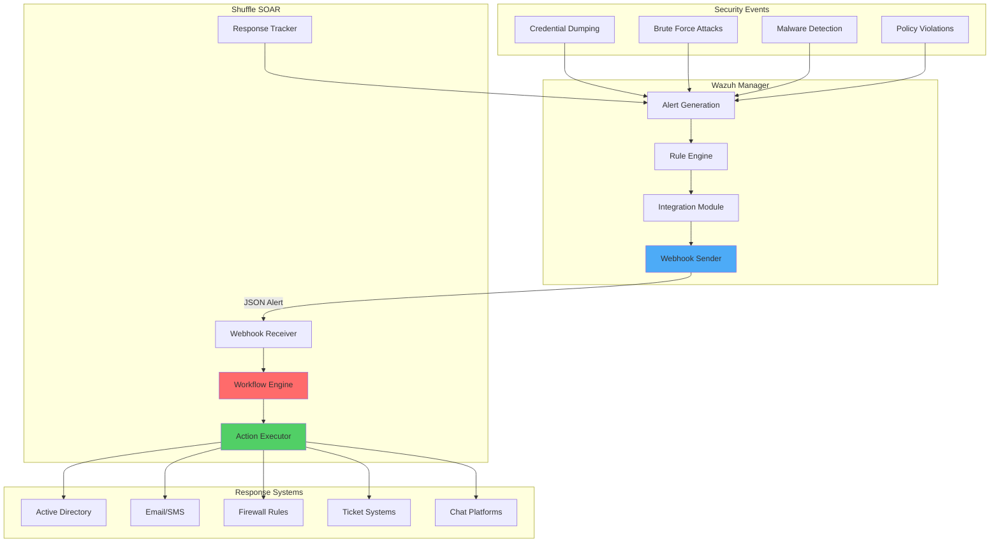

# Integrating Wazuh with Shuffle SOAR for Security Orchestration

## Introduction

Security Orchestration, Automation, and Response (SOAR) platforms have become essential components of modern security operations. Shuffle is a general-purpose security automation platform that extends Wazuh's capabilities by enabling automated responses across any device or technology that Shuffle integrates with.

The Wazuh-Shuffle integration, introduced in Wazuh 4.4, provides:

- 🔄 **Automated Response**: Execute complex response workflows automatically
- 🎯 **Multi-platform Integration**: Respond using any technology Shuffle supports
- 📊 **Advanced Orchestration**: Chain multiple actions in sophisticated workflows
- ⚡ **Real-time Processing**: Immediate response to security events
- 🛠️ **Flexible Configuration**: Customize responses based on alert criteria

## Architecture Overview

### Integration Flow



### Key Components

1. **Webhook Integration**: JSON-based communication between Wazuh and Shuffle
2. **Workflow Engine**: Orchestrates multi-step response processes
3. **Action Modules**: Execute specific responses (AD, email, firewall, etc.)
4. **Correlation Engine**: Link related events across different systems

## Basic Configuration

### Phase 1: Shuffle Setup

#### Deploy Shuffle Instance

**Option 1: Docker Deployment**
```bash
# Clone Shuffle repository
git clone https://github.com/Shuffle/Shuffle
cd Shuffle

# Start Shuffle with Docker Compose
docker-compose up -d

# Access Shuffle at http://localhost:3001
```

**Option 2: Shuffle Cloud (SaaS)**
- Visit [shuffler.io](https://shuffler.io)
- Create an account
- Access dashboard directly

#### Create Basic Workflow

1. **Create New Workflow**:
   - Navigate to Shuffle dashboard
   - Click "Create Workflow"
   - Name: "Wazuh Integration Test"

2. **Add Webhook Trigger**:
   - Click "Triggers" tab
   - Drag "Webhook" to workspace
   - Rename to "Wazuh Alerts"
   - Copy the webhook URI (format: `https://YOUR_SHUFFLE_URL/api/v1/hooks/webhook_ID`)
   - Start the webhook

3. **Add Response Action**:
   - Drag "Shuffle Tools" app to workspace
   - Rename to "Receive_Wazuh_alerts"
   - Set call option to "$exec"
   - Connect webhook to this action
   - Save workflow

### Phase 2: Wazuh Server Configuration

Add integration configuration to `/var/ossec/etc/ossec.conf`:

```xml
<ossec_config>
  <integration>
    <name>shuffle</name>
    <hook_url>https://YOUR_SHUFFLE_URL/api/v1/hooks/HOOK_ID</hook_url>
    <level>3</level>
    <alert_format>json</alert_format>
  </integration>
</ossec_config>
```

**Configuration Options**:
- `<name>`: Integration identifier (must be "shuffle")
- `<hook_url>`: Webhook URI from Shuffle
- `<level>`: Minimum alert level to forward
- `<alert_format>`: Format for alert data (json/xml)

**Alternative Filtering Options**:
```xml
<!-- Forward specific rule ID -->
<rule_id>92026</rule_id>

<!-- Forward specific rule group -->
<group>authentication_failed</group>

<!-- Forward from specific location -->
<event_location>server1</event_location>
```

### Phase 3: Test Integration

1. **Restart Wazuh Manager**:
   ```bash
   sudo systemctl restart wazuh-manager
   ```

2. **Generate Test Alert**:
   ```bash
   # Create test events
   sudo systemctl restart wazuh-manager
   ```

3. **Verify in Shuffle**:
   - Click "Show executions" in Shuffle
   - Select any execution to view Wazuh alert data
   - Confirm JSON payload contains expected fields

## Advanced Use Case: SAM Credential Dumping Response

### Scenario Overview

When Wazuh detects Windows SAM database credential dumping, we want to automatically:
1. Disable the compromised user account in Active Directory
2. Send notification to security team
3. Create incident ticket
4. Block the source IP

### Infrastructure Requirements

| Component | Purpose |
|-----------|---------|
| **Windows Server 2022** | Domain controller with Active Directory |
| **Windows 11 Endpoint** | Monitored system with Sysmon |
| **Wazuh Agents** | Installed on both systems |
| **Shuffle SOAR** | Orchestration platform |

### Phase 1: Windows Endpoint Configuration

#### Install and Configure Sysmon

```powershell
# Download Sysmon
Invoke-WebRequest -Uri "https://download.sysinternals.com/files/Sysmon.zip" -OutFile "Sysmon.zip"
Expand-Archive -Path "Sysmon.zip" -DestinationPath "."

# Download Sysmon configuration
Invoke-WebRequest -Uri "https://raw.githubusercontent.com/SwiftOnSecurity/sysmon-config/master/sysmonconfig-export.xml" -OutFile "sysmonconfig.xml"

# Install Sysmon
.\sysmon64.exe -accepteula -i .\sysmonconfig.xml
```

#### Configure Wazuh Agent

Add to `C:\Program Files (x86)\ossec-agent\ossec.conf`:

```xml
<localfile>
  <location>Microsoft-Windows-Sysmon/Operational</location>
  <log_format>eventchannel</log_format>
</localfile>
```

Restart Wazuh agent:
```powershell
Restart-Service -Name wazuh
```

### Phase 2: Advanced Shuffle Workflow

#### Create Enhanced Workflow

1. **Create Workflow**: "Registry SAM Dump Response"

2. **Add Webhook Trigger**: Copy URI for Wazuh configuration

3. **Add Username Extraction Tool**:
   ```bash
   # Extract username from Wazuh alert
   echo '$exec.all_fields.data.win.eventdata.user' | rev | cut -d'\' -f1 | rev
   ```

4. **Add Active Directory Integration**:
   - Drag "Active Directory" app to workspace
   - Click "AUTHENTICATE ACTIVE DIRECTORY"
   - Configure connection:
     - **Server**: Your DC IP/hostname
     - **Username**: Domain admin account
     - **Password**: Domain admin password
     - **Base DN**: `CN=Users,DC=yourdomain,DC=local`
   - Select "Disable user" action
   - Set Samaccountname to `$extract_username`

5. **Add Notification Actions**:
   
   **Email Notification**:
   ```json
   {
     "to": "security@company.com",
     "subject": "CRITICAL: Credential Dumping Detected",
     "body": "User $extract_username attempted credential dumping. Account disabled."
   }
   ```

   **Slack Integration**:
   ```json
   {
     "channel": "#security-alerts",
     "message": "🚨 CREDENTIAL DUMP ALERT 🚨\nUser: $extract_username\nHost: $exec.all_fields.agent.name\nTime: $exec.all_fields.timestamp\nAction: Account disabled automatically"
   }
   ```

6. **Add Incident Creation**:
   ```json
   {
     "title": "Credential Dumping Incident",
     "description": "SAM database dump detected",
     "severity": "Critical",
     "assignee": "security-team",
     "tags": ["credential-dumping", "sam", "windows"]
   }
   ```

#### Advanced Workflow Logic

```python
# Pseudo-code for enhanced workflow
def process_sam_dump_alert(alert):
    # Extract user information
    username = extract_username(alert.user_field)
    hostname = alert.agent.name
    timestamp = alert.timestamp
    
    # Skip if user is in exclusion list
    excluded_users = ["domain_admin", "service_account"]
    if username in excluded_users:
        return "User excluded from automatic response"
    
    # Disable Active Directory account
    try:
        ad_result = disable_ad_user(username)
        if ad_result.success:
            log_action("Account disabled successfully", username)
        else:
            log_error("Failed to disable account", username)
            escalate_to_admin(username, "Disable failed")
    except Exception as e:
        log_error(f"AD operation failed: {str(e)}", username)
    
    # Create incident ticket
    incident = create_incident({
        "title": f"Credential Dumping by {username}",
        "description": f"SAM dump detected on {hostname}",
        "severity": "Critical",
        "details": {
            "username": username,
            "hostname": hostname,
            "timestamp": timestamp,
            "action_taken": "Account disabled"
        }
    })
    
    # Send notifications
    send_email_alert(username, hostname, incident.id)
    send_slack_notification(username, hostname)
    
    # Additional security actions
    if is_persistent_attack(alert.src_ip):
        block_ip_address(alert.src_ip)
        quarantine_host(hostname)
    
    return "Response completed successfully"
```

### Phase 3: Wazuh Server Configuration

Configure specific rule forwarding to Shuffle:

```xml
<ossec_config>
  <integration>
    <name>shuffle</name>
    <hook_url>https://YOUR_SHUFFLE_URL/api/v1/hooks/HOOK_ID</hook_url>
    <rule_id>92026</rule_id>
    <alert_format>json</alert_format>
  </integration>
</ossec_config>
```

**Rule 92026**: Built-in Wazuh rule for Windows registry SAM dump detection

### Phase 4: Testing the Complete Workflow

#### Simulate SAM Dump Attack

```powershell
# Run as administrator on Windows 11 endpoint
# This triggers Wazuh rule 92026
reg save hklm\sam c:\temp\sam
```

#### Verify Response Chain

1. **Wazuh Detection**: Check alerts.log for rule 92026
2. **Shuffle Execution**: Verify workflow execution in Shuffle dashboard
3. **AD Account Status**: Confirm user account is disabled
4. **Notifications**: Check email and Slack for alerts
5. **Incident Creation**: Verify ticket was created

#### Expected Alert Flow

```json
{
  "rule": {
    "id": "92026",
    "level": 12,
    "description": "Windows registry hive was saved to file"
  },
  "data": {
    "win": {
      "eventdata": {
        "user": "DOMAIN\\wazuhuser",
        "processName": "reg.exe"
      }
    }
  },
  "agent": {
    "name": "WIN11-ENDPOINT"
  }
}
```

## Multi-Platform Response Workflows

### Brute Force Attack Response

```yaml
Workflow: "Brute Force Response"
Trigger: "rule.groups:authentication_failed AND frequency>=5"
Actions:
  1. Extract source IP
  2. Check IP reputation (VirusTotal/AbuseIPDB)
  3. If malicious:
     - Block IP on firewall
     - Add to threat intel feeds
  4. If internal IP:
     - Disable user account
     - Quarantine host
     - Alert security team
  5. Create incident with timeline
```

### Malware Detection Response

```yaml
Workflow: "Malware Response"
Trigger: "rule.groups:malware"
Actions:
  1. Isolate infected host
  2. Collect forensic artifacts
  3. Scan other hosts for same IoCs
  4. Update antivirus signatures
  5. Create incident report
  6. Notify stakeholders
```

### Data Exfiltration Response

```yaml
Workflow: "Data Exfiltration Response" 
Trigger: "rule.groups:data_loss"
Actions:
  1. Block outbound connections
  2. Identify affected data
  3. Revoke user credentials
  4. Notify legal/compliance team
  5. Initiate breach procedures
  6. Document timeline
```

## Advanced Integration Techniques

### Conditional Workflows

```json
{
  "workflow": "Conditional Response",
  "conditions": {
    "if": "$exec.all_fields.rule.level >= 10",
    "then": "execute_critical_response",
    "else": "execute_standard_response"
  },
  "actions": {
    "critical_response": [
      "disable_user_account",
      "isolate_host",
      "notify_ciso"
    ],
    "standard_response": [
      "log_incident",
      "notify_analyst"
    ]
  }
}
```

### Multi-Stage Orchestration

```python
# Orchestration example
class SecurityOrchestrator:
    def handle_alert(self, alert):
        # Stage 1: Immediate containment
        containment_result = self.contain_threat(alert)
        
        # Stage 2: Investigation
        if containment_result.success:
            investigation = self.investigate_threat(alert)
            
            # Stage 3: Response escalation
            if investigation.severity == "Critical":
                self.escalate_response(alert, investigation)
        
        # Stage 4: Recovery
        recovery_plan = self.create_recovery_plan(alert)
        self.execute_recovery(recovery_plan)
        
        # Stage 5: Lessons learned
        self.update_playbooks(alert, investigation)
```

### API Integration Examples

#### ServiceNow Integration

```python
def create_servicenow_incident(alert_data):
    """Create incident in ServiceNow"""
    
    payload = {
        "short_description": f"Security Alert: {alert_data['rule']['description']}",
        "description": f"Wazuh alert triggered at {alert_data['timestamp']}",
        "urgency": map_alert_level_to_urgency(alert_data['rule']['level']),
        "category": "Security",
        "subcategory": "Intrusion",
        "u_alert_source": "Wazuh",
        "u_rule_id": alert_data['rule']['id']
    }
    
    response = requests.post(
        f"{servicenow_url}/api/now/table/incident",
        auth=(username, password),
        headers={"Content-Type": "application/json"},
        json=payload
    )
    
    return response.json()
```

#### Splunk Integration

```python
def send_to_splunk(alert_data):
    """Send alert data to Splunk for correlation"""
    
    splunk_payload = {
        "event": alert_data,
        "source": "wazuh",
        "sourcetype": "wazuh_alert",
        "index": "security"
    }
    
    response = requests.post(
        f"{splunk_url}/services/collector/event",
        headers={
            "Authorization": f"Splunk {splunk_token}",
            "Content-Type": "application/json"
        },
        json=splunk_payload
    )
    
    return response.status_code == 200
```

## Monitoring and Metrics

### Workflow Performance Tracking

```python
def track_workflow_metrics():
    """Track SOAR workflow performance"""
    
    metrics = {
        "total_workflows_executed": 0,
        "successful_executions": 0,
        "failed_executions": 0,
        "average_execution_time": 0,
        "most_triggered_workflows": [],
        "error_patterns": []
    }
    
    # Collect from Shuffle API
    workflows = shuffle_client.get_workflow_executions()
    
    for workflow in workflows:
        metrics["total_workflows_executed"] += 1
        
        if workflow.status == "SUCCESS":
            metrics["successful_executions"] += 1
        else:
            metrics["failed_executions"] += 1
            metrics["error_patterns"].append(workflow.error)
    
    # Calculate success rate
    success_rate = (metrics["successful_executions"] / 
                   metrics["total_workflows_executed"]) * 100
    
    return metrics, success_rate
```

### Alert Processing Statistics

```python
def generate_soar_report():
    """Generate SOAR effectiveness report"""
    
    report = {
        "period": "Last 30 days",
        "total_alerts_processed": 0,
        "automated_responses": 0,
        "manual_interventions": 0,
        "response_times": {
            "avg_containment_time": 0,
            "avg_investigation_time": 0,
            "avg_recovery_time": 0
        },
        "top_response_actions": [],
        "effectiveness_metrics": {
            "false_positive_rate": 0,
            "containment_success_rate": 0,
            "mttr": 0  # Mean Time to Resolution
        }
    }
    
    return report
```

## Security Considerations

### Secure Integration

1. **API Authentication**:
   ```bash
   # Use strong API keys
   export SHUFFLE_API_KEY="strong-random-key-here"
   
   # Rotate keys regularly
   shuffle_client.rotate_api_key()
   ```

2. **Network Security**:
   ```bash
   # Restrict network access
   iptables -A OUTPUT -p tcp -d shuffle.company.com --dport 443 -j ACCEPT
   iptables -A OUTPUT -p tcp --dport 443 -j DROP
   ```

3. **Credential Management**:
   ```yaml
   # Use secure credential storage
   credentials:
     active_directory:
       username: ${AD_USERNAME}
       password: ${AD_PASSWORD}
     email:
       api_key: ${EMAIL_API_KEY}
   ```

### Audit and Compliance

```python
def audit_soar_actions():
    """Audit all SOAR actions for compliance"""
    
    audit_log = {
        "timestamp": datetime.now().isoformat(),
        "action": "user_account_disabled",
        "performer": "shuffle_automation",
        "target": "user@company.com",
        "reason": "credential_dumping_detected",
        "authorization": "auto_policy_violation",
        "success": True
    }
    
    # Send to audit system
    send_to_audit_log(audit_log)
    
    # Compliance reporting
    generate_compliance_report(audit_log)
```

## Troubleshooting Guide

### Common Integration Issues

#### Webhook Not Receiving Alerts

```bash
# Check Wazuh integration status
grep "shuffle" /var/ossec/logs/ossec.log

# Test webhook connectivity
curl -X POST -H "Content-Type: application/json" \
     -d '{"test": "data"}' \
     https://YOUR_SHUFFLE_URL/api/v1/hooks/HOOK_ID
```

#### Workflow Execution Failures

```python
# Debug Shuffle workflow
def debug_workflow_execution(execution_id):
    """Debug failed workflow execution"""
    
    execution = shuffle_client.get_execution(execution_id)
    
    print(f"Execution ID: {execution.id}")
    print(f"Status: {execution.status}")
    print(f"Error: {execution.error}")
    print(f"Steps: {len(execution.steps)}")
    
    for step in execution.steps:
        if step.status == "FAILURE":
            print(f"Failed Step: {step.name}")
            print(f"Error: {step.error}")
```

#### Authentication Issues

```bash
# Test Active Directory connection
ldapsearch -x -H ldap://your-dc.company.com \
           -D "username@domain.com" \
           -W -b "DC=company,DC=com"

# Verify permissions
net user testuser /domain
```

### Performance Optimization

1. **Workflow Optimization**:
   ```yaml
   optimization_tips:
     - Use parallel execution where possible
     - Cache frequent API calls
     - Implement error handling
     - Use appropriate timeouts
     - Monitor resource usage
   ```

2. **Alert Filtering**:
   ```xml
   <!-- Only forward high-priority alerts -->
   <integration>
     <name>shuffle</name>
     <hook_url>https://shuffle.company.com/api/v1/hooks/hook_id</hook_url>
     <level>8</level>
     <group>authentication_failed,malware,data_loss</group>
   </integration>
   ```

## Best Practices

### Workflow Design

1. **Modular Design**: Create reusable workflow components
2. **Error Handling**: Implement proper error handling and rollback procedures
3. **Testing**: Test workflows in staging environment first
4. **Documentation**: Document workflow logic and dependencies
5. **Version Control**: Track workflow changes and versions

### Security Operations

1. **Graduated Response**: Implement escalating response levels
2. **Human Oversight**: Include manual approval for critical actions
3. **Audit Trail**: Log all automated actions for compliance
4. **Rollback Procedures**: Plan for reversing automated actions
5. **Regular Reviews**: Periodically review and update workflows

### Performance Management

1. **Resource Monitoring**: Track CPU, memory, and network usage
2. **Execution Time**: Monitor workflow completion times
3. **Success Rates**: Track workflow success/failure ratios
4. **Alert Volume**: Monitor and tune alert forwarding rules
5. **Capacity Planning**: Plan for scaling as environment grows

## Conclusion

Integrating Wazuh with Shuffle SOAR creates a powerful security automation platform that:

- 🚀 **Accelerates Response**: Automate immediate responses to security threats
- 📈 **Improves Efficiency**: Handle more alerts with fewer resources
- 🎯 **Reduces Human Error**: Consistent, automated response procedures
- 📊 **Enhances Visibility**: Comprehensive audit trail of all actions
- 🔄 **Enables Scalability**: Handle growing security event volumes

This integration represents the evolution of security operations from reactive to proactive, enabling security teams to respond at machine speed while maintaining human oversight and control.

## Key Takeaways

1. **Start Simple**: Begin with basic workflows and add complexity gradually
2. **Test Thoroughly**: Validate workflows in safe environments before production
3. **Monitor Continuously**: Track performance and effectiveness metrics
4. **Maintain Security**: Protect credentials and audit all actions
5. **Iterate and Improve**: Regularly review and enhance workflows based on results

## Resources

- [Shuffle Documentation](https://shuffler.io/docs)
- [Wazuh Integration Guide](https://documentation.wazuh.com/current/user-manual/manager/integration.html)
- [Shuffle GitHub Repository](https://github.com/Shuffle/Shuffle)
- [SOAR Best Practices Guide](https://www.nist.gov/cybersecurity)

---

*Automate your security operations with Wazuh and Shuffle SOAR! 🔄🛡️*