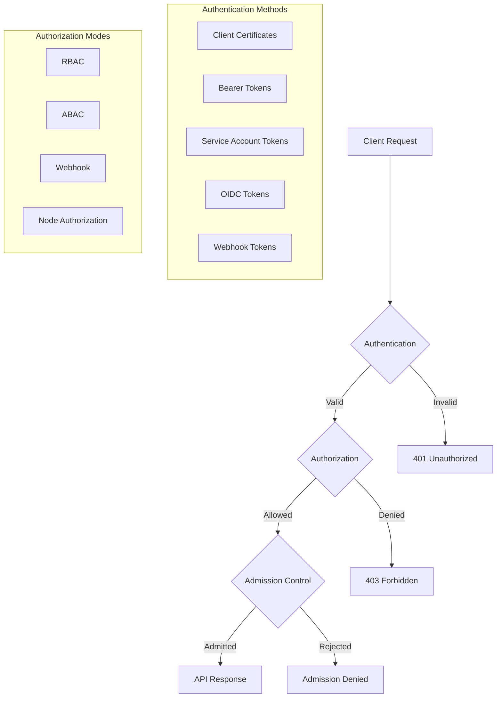

# Kubernetes API Authentication & RBAC: Production-Ready Security Guide

## Introduction

Kubernetes API security forms the foundation of cluster protection. This comprehensive guide covers authentication mechanisms, service accounts, RBAC implementation, and production security patterns with practical examples you can deploy immediately.

### Why API Security Matters

- 🔐 **Zero Trust Architecture**: Every API request must be authenticated and authorized
- 🛡️ **Defense in Depth**: Multiple security layers protect your cluster
- 📊 **Audit Trail**: Track who did what and when
- 🚀 **Automation Security**: Secure machine-to-machine communication
- 🔄 **GitOps Ready**: Version-controlled security policies

## Table of Contents

1. [Authentication Architecture](#authentication-architecture)
2. [Service Accounts Deep Dive](#service-accounts-deep-dive)
3. [RBAC Implementation](#rbac-implementation)
4. [Production Security Patterns](#production-security-patterns)
5. [Advanced Authentication Methods](#advanced-authentication-methods)
6. [Monitoring and Auditing](#monitoring-and-auditing)
7. [Troubleshooting Guide](#troubleshooting-guide)

## Authentication Architecture

### Request Flow Diagram



### Authentication Methods Comparison

| Method | Use Case | Security Level | Complexity | Management |
|--------|----------|---------------|------------|------------|
| **Client Certificates** | Admin access | High | Medium | Manual |
| **Service Accounts** | Pod/App access | High | Low | Automatic |
| **OIDC** | User SSO | Very High | High | Centralized |
| **Static Tokens** | Legacy systems | Low | Low | Manual |
| **Webhook** | Custom auth | Variable | High | Custom |

## Service Accounts Deep Dive

### Creating Secure Service Accounts

```yaml
# service-account.yaml
apiVersion: v1
kind: ServiceAccount
metadata:
  name: app-service-account
  namespace: production
  annotations:
    # Disable automatic token mounting for enhanced security
    automountServiceAccountToken: "false"
    # Add custom annotations for tracking
    purpose: "application-api-access"
    owner: "platform-team"
---
# secret.yaml - Manual token creation (K8s 1.24+)
apiVersion: v1
kind: Secret
metadata:
  name: app-sa-token
  namespace: production
  annotations:
    kubernetes.io/service-account.name: app-service-account
type: kubernetes.io/service-account-token
```

### Programmatic Authentication with Service Accounts

```go
package main

import (
    "context"
    "fmt"
    "log"
    
    "k8s.io/client-go/kubernetes"
    "k8s.io/client-go/rest"
    metav1 "k8s.io/apimachinery/pkg/apis/meta/v1"
)

func main() {
    // In-cluster configuration (for pods)
    config, err := rest.InClusterConfig()
    if err != nil {
        log.Fatal(err)
    }
    
    // Create clientset
    clientset, err := kubernetes.NewForConfig(config)
    if err != nil {
        log.Fatal(err)
    }
    
    // List pods with proper error handling
    pods, err := clientset.CoreV1().Pods("default").List(
        context.TODO(),
        metav1.ListOptions{
            LabelSelector: "app=myapp",
            Limit: 100,
        },
    )
    
    if err != nil {
        log.Fatalf("Failed to list pods: %v", err)
    }
    
    for _, pod := range pods.Items {
        fmt.Printf("Pod: %s, Status: %s\n", 
            pod.Name, 
            pod.Status.Phase)
    }
}
```

### Python Client Authentication

```python
from kubernetes import client, config
from kubernetes.client.rest import ApiException
import base64

def authenticate_with_service_account():
    """Authenticate using service account token"""
    
    # Load in-cluster config for pods
    try:
        config.load_incluster_config()
    except config.ConfigException:
        # Fallback to kubeconfig for local development
        config.load_kube_config()
    
    v1 = client.CoreV1Api()
    
    try:
        # List pods with field selector
        pods = v1.list_namespaced_pod(
            namespace="default",
            label_selector="app=myapp",
            field_selector="status.phase=Running",
            limit=100
        )
        
        for pod in pods.items:
            print(f"Pod: {pod.metadata.name}")
            print(f"  Status: {pod.status.phase}")
            print(f"  Node: {pod.spec.node_name}")
            
    except ApiException as e:
        print(f"Exception when calling API: {e}")

def create_token_review(token):
    """Validate a bearer token using TokenReview API"""
    
    config.load_kube_config()
    auth_v1 = client.AuthenticationV1Api()
    
    token_review = client.V1TokenReview(
        spec=client.V1TokenReviewSpec(
            token=token
        )
    )
    
    try:
        response = auth_v1.create_token_review(token_review)
        
        if response.status.authenticated:
            print(f"Token valid for user: {response.status.user.username}")
            print(f"Groups: {response.status.user.groups}")
        else:
            print("Token authentication failed")
            
    except ApiException as e:
        print(f"Token review failed: {e}")

if __name__ == "__main__":
    authenticate_with_service_account()
```

## RBAC Implementation

### Production RBAC Architecture

```yaml
# namespace-setup.yaml
apiVersion: v1
kind: Namespace
metadata:
  name: production
  labels:
    environment: production
    compliance: pci-dss
---
# role-definitions.yaml
apiVersion: rbac.authorization.k8s.io/v1
kind: Role
metadata:
  namespace: production
  name: app-reader
rules:
- apiGroups: [""]
  resources: ["pods", "services"]
  verbs: ["get", "list", "watch"]
- apiGroups: ["apps"]
  resources: ["deployments", "replicasets"]
  verbs: ["get", "list"]
- apiGroups: [""]
  resources: ["configmaps"]
  resourceNames: ["app-config"]
  verbs: ["get"]
---
apiVersion: rbac.authorization.k8s.io/v1
kind: Role
metadata:
  namespace: production
  name: app-writer
rules:
- apiGroups: [""]
  resources: ["pods"]
  verbs: ["get", "list", "create", "update", "patch", "delete"]
- apiGroups: ["apps"]
  resources: ["deployments"]
  verbs: ["get", "list", "create", "update", "patch"]
- apiGroups: ["autoscaling"]
  resources: ["horizontalpodautoscalers"]
  verbs: ["get", "list", "create", "update", "patch"]
---
# role-bindings.yaml
apiVersion: rbac.authorization.k8s.io/v1
kind: RoleBinding
metadata:
  name: read-pods-services
  namespace: production
subjects:
- kind: ServiceAccount
  name: app-service-account
  namespace: production
- kind: Group
  name: "developers"
  apiGroup: rbac.authorization.k8s.io
roleRef:
  kind: Role
  name: app-reader
  apiGroup: rbac.authorization.k8s.io
```

### ClusterRole for Cross-Namespace Access

```yaml
# cluster-role.yaml
apiVersion: rbac.authorization.k8s.io/v1
kind: ClusterRole
metadata:
  name: monitoring-reader
rules:
- apiGroups: [""]
  resources: ["pods", "nodes", "namespaces"]
  verbs: ["get", "list"]
- apiGroups: ["metrics.k8s.io"]
  resources: ["pods", "nodes"]
  verbs: ["get", "list"]
- apiGroups: [""]
  resources: ["events"]
  verbs: ["get", "list", "watch"]
---
apiVersion: rbac.authorization.k8s.io/v1
kind: ClusterRoleBinding
metadata:
  name: monitoring-reader-binding
roleRef:
  apiGroup: rbac.authorization.k8s.io
  kind: ClusterRole
  name: monitoring-reader
subjects:
- kind: ServiceAccount
  name: prometheus
  namespace: monitoring
```

### Advanced RBAC Patterns

```yaml
# aggregated-roles.yaml
apiVersion: rbac.authorization.k8s.io/v1
kind: ClusterRole
metadata:
  name: custom-view
  labels:
    # Aggregate to default view role
    rbac.authorization.k8s.io/aggregate-to-view: "true"
rules:
- apiGroups: ["custom.io"]
  resources: ["customresources"]
  verbs: ["get", "list", "watch"]
---
# conditional-rbac.yaml
apiVersion: rbac.authorization.k8s.io/v1
kind: Role
metadata:
  namespace: production
  name: deployment-manager
rules:
# Allow scaling but not deletion
- apiGroups: ["apps"]
  resources: ["deployments/scale"]
  verbs: ["update", "patch"]
# Read-only for statefulsets
- apiGroups: ["apps"]
  resources: ["statefulsets"]
  verbs: ["get", "list", "watch"]
# Full access to specific deployment
- apiGroups: ["apps"]
  resources: ["deployments"]
  resourceNames: ["frontend", "backend"]
  verbs: ["*"]
```

## Production Security Patterns

### 1. Least Privilege Service Accounts

```bash
#!/bin/bash
# audit-service-accounts.sh

echo "=== Service Account Audit ==="
echo

# List all service accounts with their tokens
for ns in $(kubectl get ns -o jsonpath='{.items[*].metadata.name}'); do
    echo "Namespace: $ns"
    kubectl get sa -n $ns -o json | jq -r '.items[] | 
        select(.metadata.name != "default") | 
        "\(.metadata.name): Tokens=\(.secrets | length)"'
    echo
done

# Find service accounts with cluster-admin
echo "=== Service Accounts with cluster-admin ==="
kubectl get clusterrolebindings -o json | jq -r '
    .items[] | 
    select(.roleRef.name == "cluster-admin") | 
    .subjects[]? | 
    select(.kind == "ServiceAccount") | 
    "\(.namespace)/\(.name)"'

# Check for wildcard permissions
echo -e "\n=== Roles with Wildcard Permissions ==="
kubectl get roles,clusterroles -A -o json | jq -r '
    .items[] | 
    select(.rules[]? | 
        (.verbs | contains(["*"])) or 
        (.resources | contains(["*"])) or 
        (.apiGroups | contains(["*"]))) | 
    "\(.kind)/\(.metadata.namespace // "cluster")/\(.metadata.name)"'
```

### 2. Token Rotation Strategy

```yaml
# token-rotation-cronjob.yaml
apiVersion: batch/v1
kind: CronJob
metadata:
  name: token-rotator
  namespace: security
spec:
  schedule: "0 2 * * 0"  # Weekly on Sunday at 2 AM
  jobTemplate:
    spec:
      template:
        spec:
          serviceAccountName: token-manager
          containers:
          - name: rotator
            image: bitnami/kubectl:latest
            command:
            - /bin/bash
            - -c
            - |
              # List all service account tokens older than 30 days
              for ns in $(kubectl get ns -o name | cut -d/ -f2); do
                for secret in $(kubectl get secrets -n $ns -o json | \
                  jq -r '.items[] | 
                  select(.type == "kubernetes.io/service-account-token") | 
                  select(.metadata.creationTimestamp | fromdateiso8601 < (now - 2592000)) | 
                  .metadata.name'); do
                  
                  echo "Rotating token: $ns/$secret"
                  # Delete old token (will be auto-recreated)
                  kubectl delete secret $secret -n $ns
                done
              done
          restartPolicy: OnFailure
```

### 3. OIDC Integration with Keycloak

```yaml
# kube-apiserver-config.yaml
apiVersion: v1
kind: ConfigMap
metadata:
  name: kube-apiserver-config
  namespace: kube-system
data:
  config.yaml: |
    apiVersion: kubeadm.k8s.io/v1beta3
    kind: ClusterConfiguration
    apiServer:
      extraArgs:
        oidc-issuer-url: "https://keycloak.example.com/auth/realms/kubernetes"
        oidc-client-id: "kubernetes"
        oidc-username-claim: "preferred_username"
        oidc-username-prefix: "oidc:"
        oidc-groups-claim: "groups"
        oidc-groups-prefix: "oidc:"
        oidc-ca-file: "/etc/kubernetes/pki/oidc-ca.crt"
```

### 4. Webhook Authentication Implementation

```go
// webhook-authenticator.go
package main

import (
    "encoding/json"
    "fmt"
    "net/http"
    "strings"
    
    authv1 "k8s.io/api/authentication/v1"
    metav1 "k8s.io/apimachinery/pkg/apis/meta/v1"
)

type TokenValidator struct {
    // Your token validation logic
}

func (tv *TokenValidator) Validate(token string) (*authv1.UserInfo, error) {
    // Implement your custom validation
    // Example: validate against external IdP
    
    if !strings.HasPrefix(token, "Bearer ") {
        return nil, fmt.Errorf("invalid token format")
    }
    
    // Extract and validate token
    actualToken := strings.TrimPrefix(token, "Bearer ")
    
    // Mock validation - replace with real logic
    if actualToken == "valid-token-123" {
        return &authv1.UserInfo{
            Username: "john.doe",
            UID:      "123456",
            Groups:   []string{"developers", "qa"},
            Extra: map[string]authv1.ExtraValue{
                "department": []string{"engineering"},
            },
        }, nil
    }
    
    return nil, fmt.Errorf("invalid token")
}

func webhookHandler(w http.ResponseWriter, r *http.Request) {
    var tokenReview authv1.TokenReview
    
    if err := json.NewDecoder(r.Body).Decode(&tokenReview); err != nil {
        http.Error(w, err.Error(), http.StatusBadRequest)
        return
    }
    
    validator := &TokenValidator{}
    userInfo, err := validator.Validate(tokenReview.Spec.Token)
    
    response := &authv1.TokenReview{
        TypeMeta: metav1.TypeMeta{
            APIVersion: "authentication.k8s.io/v1",
            Kind:       "TokenReview",
        },
        Status: authv1.TokenReviewStatus{
            Authenticated: err == nil,
        },
    }
    
    if err == nil {
        response.Status.User = *userInfo
    } else {
        response.Status.Error = err.Error()
    }
    
    w.Header().Set("Content-Type", "application/json")
    json.NewEncoder(w).Encode(response)
}

func main() {
    http.HandleFunc("/authenticate", webhookHandler)
    
    fmt.Println("Webhook authenticator listening on :3000")
    if err := http.ListenAndServeTLS(":3000", "cert.pem", "key.pem", nil); err != nil {
        panic(err)
    }
}
```

## Advanced Authentication Methods

### 1. Certificate-Based Authentication

```bash
#!/bin/bash
# generate-user-cert.sh

USER="developer-jane"
GROUP="developers"

# Generate private key
openssl genrsa -out ${USER}.key 2048

# Generate CSR
cat <<EOF | openssl req -new -key ${USER}.key -out ${USER}.csr -config -
[req]
distinguished_name = req_distinguished_name
[req_distinguished_name]
[v3_req]
keyUsage = critical, digitalSignature, keyEncipherment
extendedKeyUsage = clientAuth
EOF

# Create CSR in Kubernetes
cat <<EOF | kubectl apply -f -
apiVersion: certificates.k8s.io/v1
kind: CertificateSigningRequest
metadata:
  name: ${USER}
spec:
  request: $(cat ${USER}.csr | base64 | tr -d '\n')
  signerName: kubernetes.io/kube-apiserver-client
  usages:
  - client auth
EOF

# Approve CSR
kubectl certificate approve ${USER}

# Get certificate
kubectl get csr ${USER} -o jsonpath='{.status.certificate}' | base64 -d > ${USER}.crt

# Create kubeconfig
kubectl config set-credentials ${USER} \
    --client-certificate=${USER}.crt \
    --client-key=${USER}.key

kubectl config set-context ${USER}-context \
    --cluster=kubernetes \
    --user=${USER}
```

### 2. External JWT Validation

```python
# jwt_validator.py
import jwt
import json
from flask import Flask, request, jsonify
from datetime import datetime, timezone

app = Flask(__name__)

# Your JWT secret or public key
JWT_SECRET = "your-secret-key"
JWT_ALGORITHM = "HS256"  # or RS256 for RSA

@app.route('/validate', methods=['POST'])
def validate_token():
    """Validate JWT token for Kubernetes webhook authentication"""
    
    token_review = request.get_json()
    token = token_review.get('spec', {}).get('token', '')
    
    try:
        # Decode and validate JWT
        payload = jwt.decode(
            token, 
            JWT_SECRET, 
            algorithms=[JWT_ALGORITHM],
            options={"verify_exp": True}
        )
        
        # Build response
        response = {
            "apiVersion": "authentication.k8s.io/v1",
            "kind": "TokenReview",
            "status": {
                "authenticated": True,
                "user": {
                    "username": payload.get('sub'),
                    "uid": payload.get('uid'),
                    "groups": payload.get('groups', []),
                    "extra": {
                        "email": [payload.get('email', '')],
                        "department": [payload.get('department', '')]
                    }
                },
                "audiences": payload.get('aud', [])
            }
        }
        
    except jwt.ExpiredSignatureError:
        response = {
            "apiVersion": "authentication.k8s.io/v1",
            "kind": "TokenReview",
            "status": {
                "authenticated": False,
                "error": "Token has expired"
            }
        }
    except jwt.InvalidTokenError as e:
        response = {
            "apiVersion": "authentication.k8s.io/v1",
            "kind": "TokenReview",
            "status": {
                "authenticated": False,
                "error": str(e)
            }
        }
    
    return jsonify(response)

if __name__ == '__main__':
    app.run(host='0.0.0.0', port=3000, ssl_context='adhoc')
```

## Monitoring and Auditing

### 1. Audit Policy Configuration

```yaml
# audit-policy.yaml
apiVersion: audit.k8s.io/v1
kind: Policy
rules:
  # Don't log read-only requests to common resources
  - level: None
    users: ["system:kube-proxy"]
    verbs: ["watch"]
    resources:
    - group: ""
      resources: ["endpoints", "services"]
      
  # Don't log these read-only URLs
  - level: None
    nonResourceURLs:
    - /healthz*
    - /version
    - /swagger*
    
  # Log service account token creation at Metadata level
  - level: Metadata
    omitStages:
    - RequestReceived
    resources:
    - group: ""
      resources: ["secrets"]
    namespaces: ["kube-system", "kube-public"]
    
  # Log all changes to pods at RequestResponse level
  - level: RequestResponse
    verbs: ["create", "update", "patch", "delete"]
    resources:
    - group: ""
      resources: ["pods"]
      
  # Log all RBAC changes at RequestResponse level
  - level: RequestResponse
    resources:
    - group: "rbac.authorization.k8s.io"
      resources: ["roles", "rolebindings", "clusterroles", "clusterrolebindings"]
      
  # Catch all other requests at Metadata level
  - level: Metadata
    omitStages:
    - RequestReceived
```

### 2. Authentication Metrics Dashboard

```yaml
# prometheus-rules.yaml
apiVersion: monitoring.coreos.com/v1
kind: PrometheusRule
metadata:
  name: auth-monitoring
  namespace: monitoring
spec:
  groups:
  - name: authentication.rules
    interval: 30s
    rules:
    - alert: HighAuthenticationFailureRate
      expr: |
        rate(apiserver_authentication_attempts{result="error"}[5m]) > 0.1
      for: 10m
      labels:
        severity: warning
      annotations:
        summary: "High authentication failure rate detected"
        description: "Authentication failure rate is {{ $value }} errors per second"
        
    - alert: ServiceAccountTokenExpiry
      expr: |
        (kube_secret_created{type="kubernetes.io/service-account-token"} 
        + 30 * 24 * 60 * 60) < time()
      for: 1h
      labels:
        severity: info
      annotations:
        summary: "Service account token older than 30 days"
        description: "Token {{ $labels.secret }} in namespace {{ $labels.namespace }} is old"
        
    - alert: UnauthorizedAPIAccess
      expr: |
        rate(apiserver_authorization_decisions{decision="deny"}[5m]) > 0.05
      for: 10m
      labels:
        severity: warning
      annotations:
        summary: "High rate of unauthorized API access attempts"
        description: "{{ $value }} denials per second detected"
```

### 3. Audit Log Analysis Script

```python
#!/usr/bin/env python3
# analyze-audit-logs.py

import json
import sys
from collections import defaultdict
from datetime import datetime

def analyze_audit_logs(log_file):
    """Analyze Kubernetes audit logs for security insights"""
    
    stats = {
        'total_events': 0,
        'auth_failures': 0,
        'rbac_changes': 0,
        'secret_access': 0,
        'users': defaultdict(int),
        'verbs': defaultdict(int),
        'denied_requests': []
    }
    
    with open(log_file, 'r') as f:
        for line in f:
            try:
                event = json.loads(line)
                stats['total_events'] += 1
                
                # Track users
                user = event.get('user', {}).get('username', 'unknown')
                stats['users'][user] += 1
                
                # Track verbs
                verb = event.get('verb', 'unknown')
                stats['verbs'][verb] += 1
                
                # Check for authentication failures
                if event.get('responseStatus', {}).get('code', 200) == 401:
                    stats['auth_failures'] += 1
                
                # Check for authorization failures
                if event.get('responseStatus', {}).get('code', 200) == 403:
                    stats['denied_requests'].append({
                        'user': user,
                        'verb': verb,
                        'resource': event.get('objectRef', {}).get('resource', 'unknown'),
                        'time': event.get('requestReceivedTimestamp', 'unknown')
                    })
                
                # Check for RBAC changes
                if event.get('objectRef', {}).get('apiGroup') == 'rbac.authorization.k8s.io':
                    stats['rbac_changes'] += 1
                
                # Check for secret access
                if event.get('objectRef', {}).get('resource') == 'secrets':
                    stats['secret_access'] += 1
                    
            except json.JSONDecodeError:
                continue
    
    # Print analysis
    print("=== Audit Log Analysis ===")
    print(f"Total Events: {stats['total_events']}")
    print(f"Auth Failures: {stats['auth_failures']}")
    print(f"RBAC Changes: {stats['rbac_changes']}")
    print(f"Secret Access: {stats['secret_access']}")
    
    print("\n=== Top Users ===")
    for user, count in sorted(stats['users'].items(), 
                              key=lambda x: x[1], 
                              reverse=True)[:10]:
        print(f"{user}: {count}")
    
    print("\n=== Verb Distribution ===")
    for verb, count in sorted(stats['verbs'].items(), 
                              key=lambda x: x[1], 
                              reverse=True):
        print(f"{verb}: {count}")
    
    if stats['denied_requests']:
        print("\n=== Recent Denied Requests ===")
        for req in stats['denied_requests'][:10]:
            print(f"User: {req['user']}, Verb: {req['verb']}, "
                  f"Resource: {req['resource']}, Time: {req['time']}")

if __name__ == "__main__":
    if len(sys.argv) != 2:
        print("Usage: python analyze-audit-logs.py <audit-log-file>")
        sys.exit(1)
    
    analyze_audit_logs(sys.argv[1])
```

## Troubleshooting Guide

### Common Authentication Issues

```bash
#!/bin/bash
# debug-auth.sh

echo "=== Authentication Debugging Tool ==="

# 1. Check current context and user
echo -e "\n1. Current Context:"
kubectl config current-context
kubectl config view --minify -o jsonpath='{.users[0].name}'

# 2. Test authentication
echo -e "\n2. Testing Authentication:"
kubectl auth whoami

# 3. Check if token is valid
echo -e "\n3. Token Validation:"
TOKEN=$(kubectl config view --raw -o jsonpath='{.users[0].user.token}')
if [ ! -z "$TOKEN" ]; then
    kubectl create -f - <<EOF
apiVersion: authentication.k8s.io/v1
kind: TokenReview
spec:
  token: $TOKEN
EOF
fi

# 4. Check RBAC permissions
echo -e "\n4. Can-I Checks:"
kubectl auth can-i --list

# 5. Test specific permissions
echo -e "\n5. Specific Permission Tests:"
resources=("pods" "services" "deployments" "secrets" "configmaps")
verbs=("get" "list" "create" "update" "delete")

for resource in "${resources[@]}"; do
    for verb in "${verbs[@]}"; do
        if kubectl auth can-i $verb $resource &>/dev/null; then
            echo "✓ Can $verb $resource"
        else
            echo "✗ Cannot $verb $resource"
        fi
    done
    echo
done

# 6. Check service account permissions
echo -e "\n6. Service Account Permissions:"
SA_NAME=${1:-default}
SA_NAMESPACE=${2:-default}

kubectl auth can-i --list --as=system:serviceaccount:$SA_NAMESPACE:$SA_NAME
```

### RBAC Troubleshooting Matrix

| Symptom | Possible Cause | Solution |
|---------|---------------|----------|
| 403 Forbidden | Missing RoleBinding | Create appropriate RoleBinding |
| 401 Unauthorized | Invalid token | Regenerate token or check expiry |
| Can list but not get | Incomplete permissions | Add "get" verb to Role |
| Works in one namespace, not another | Namespace-specific Role | Use ClusterRole for cross-namespace |
| Intermittent failures | Token expiry | Implement token rotation |
| Can't access CRDs | Missing API group | Add CRD's API group to Role |

## Security Best Practices Checklist

- [ ] Disable anonymous authentication
- [ ] Remove default service account permissions
- [ ] Implement least privilege for all service accounts
- [ ] Enable audit logging with appropriate policy
- [ ] Rotate service account tokens regularly
- [ ] Use separate service accounts per application
- [ ] Implement OIDC for human users
- [ ] Disable basic authentication
- [ ] Use NetworkPolicies to restrict pod communication
- [ ] Regularly audit RBAC permissions
- [ ] Monitor authentication/authorization metrics
- [ ] Implement admission controllers (PSP/PSA)
- [ ] Use external secret management (Vault, Sealed Secrets)
- [ ] Enable mTLS for all communications
- [ ] Implement resource quotas and limits

## Production Deployment Example

```yaml
# production-app-deployment.yaml
apiVersion: v1
kind: Namespace
metadata:
  name: production-app
  labels:
    pod-security.kubernetes.io/enforce: restricted
---
apiVersion: v1
kind: ServiceAccount
metadata:
  name: app-sa
  namespace: production-app
automountServiceAccountToken: false
---
apiVersion: rbac.authorization.k8s.io/v1
kind: Role
metadata:
  namespace: production-app
  name: app-role
rules:
- apiGroups: [""]
  resources: ["configmaps"]
  resourceNames: ["app-config"]
  verbs: ["get"]
- apiGroups: [""]
  resources: ["secrets"]
  resourceNames: ["app-secret"]
  verbs: ["get"]
---
apiVersion: rbac.authorization.k8s.io/v1
kind: RoleBinding
metadata:
  name: app-rolebinding
  namespace: production-app
subjects:
- kind: ServiceAccount
  name: app-sa
  namespace: production-app
roleRef:
  kind: Role
  name: app-role
  apiGroup: rbac.authorization.k8s.io
---
apiVersion: apps/v1
kind: Deployment
metadata:
  name: secure-app
  namespace: production-app
spec:
  replicas: 3
  selector:
    matchLabels:
      app: secure-app
  template:
    metadata:
      labels:
        app: secure-app
    spec:
      serviceAccountName: app-sa
      automountServiceAccountToken: true
      securityContext:
        runAsNonRoot: true
        runAsUser: 1000
        fsGroup: 2000
        seccompProfile:
          type: RuntimeDefault
      containers:
      - name: app
        image: myapp:latest
        securityContext:
          allowPrivilegeEscalation: false
          readOnlyRootFilesystem: true
          capabilities:
            drop:
            - ALL
        resources:
          requests:
            memory: "128Mi"
            cpu: "100m"
          limits:
            memory: "256Mi"
            cpu: "200m"
        volumeMounts:
        - name: tmp
          mountPath: /tmp
        - name: cache
          mountPath: /app/cache
      volumes:
      - name: tmp
        emptyDir: {}
      - name: cache
        emptyDir: {}
```

## Conclusion

Kubernetes API authentication and RBAC form the foundation of cluster security. By implementing these patterns and regularly auditing your configuration, you can maintain a secure, compliant, and well-managed Kubernetes environment.

### Next Steps

1. Implement comprehensive audit logging
2. Set up automated RBAC testing in CI/CD
3. Deploy monitoring for authentication metrics
4. Create runbooks for common auth issues
5. Plan regular security reviews and token rotation

### Additional Resources

- [Kubernetes Authentication Documentation](https://kubernetes.io/docs/reference/access-authn-authz/authentication/)
- [RBAC Good Practices](https://kubernetes.io/docs/concepts/security/rbac-good-practices/)
- [CIS Kubernetes Benchmark](https://www.cisecurity.org/benchmark/kubernetes)
- [NIST Cybersecurity Framework for Kubernetes](https://nvlpubs.nist.gov/nistpubs/SpecialPublications/NIST.SP.800-190.pdf)