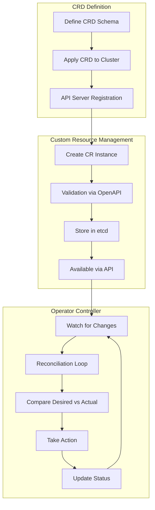

# Kubernetes CRDs & Operators: Building Cloud-Native Applications

## Introduction

Custom Resource Definitions (CRDs) and Operators represent the pinnacle of Kubernetes extensibility. This comprehensive guide teaches you how to extend the Kubernetes API, build production-ready operators, and implement sophisticated application management patterns.

### Why CRDs and Operators?

- 🎯 **API Extension**: Add domain-specific resources to Kubernetes
- 🤖 **Automation**: Encode operational knowledge into software
- 🔄 **Reconciliation**: Maintain desired state automatically
- 📈 **Scalability**: Manage complex applications declaratively
- 🛠️ **Standardization**: Use Kubernetes patterns for custom resources

## Table of Contents

1. [CRD Architecture & Design](#crd-architecture--design)
2. [Building Your First CRD](#building-your-first-crd)
3. [Operator Development with Kubebuilder](#operator-development-with-kubebuilder)
4. [Advanced Controller Patterns](#advanced-controller-patterns)
5. [Production Best Practices](#production-best-practices)
6. [Testing and Validation](#testing-and-validation)
7. [Real-World Examples](#real-world-examples)

## CRD Architecture & Design

### CRD Lifecycle Flow



### CRD Components Overview

| Component | Purpose | Example |
|-----------|---------|---------|
| **Group** | API grouping | `apps.example.com` |
| **Version** | API version | `v1alpha1`, `v1beta1`, `v1` |
| **Kind** | Resource type | `Database`, `Application` |
| **Resource** | Plural name | `databases`, `applications` |
| **Scope** | Namespaced/Cluster | `Namespaced` |
| **Schema** | OpenAPI validation | JSON Schema |
| **Subresources** | Status, Scale | `/status`, `/scale` |

## Building Your First CRD

### 1. Database CRD Definition

```yaml
# database-crd.yaml
apiVersion: apiextensions.k8s.io/v1
kind: CustomResourceDefinition
metadata:
  name: databases.apps.example.com
spec:
  group: apps.example.com
  versions:
  - name: v1
    served: true
    storage: true
    schema:
      openAPIV3Schema:
        type: object
        properties:
          spec:
            type: object
            required:
            - engine
            - version
            - size
            properties:
              engine:
                type: string
                enum:
                - postgres
                - mysql
                - mongodb
                description: "Database engine type"
              version:
                type: string
                pattern: '^[0-9]+\.[0-9]+(\.[0-9]+)?$'
                description: "Database version (e.g., 14.5)"
              size:
                type: string
                enum:
                - small
                - medium
                - large
                description: "Database size tier"
              replicas:
                type: integer
                minimum: 1
                maximum: 9
                default: 1
                description: "Number of replicas"
              backup:
                type: object
                properties:
                  enabled:
                    type: boolean
                    default: true
                  schedule:
                    type: string
                    pattern: '^(\*|([0-9]|1[0-9]|2[0-9]|3[0-9]|4[0-9]|5[0-9])|\*\/([0-9]|1[0-9]|2[0-9]|3[0-9]|4[0-9]|5[0-9])) (\*|([0-9]|1[0-9]|2[0-3])|\*\/([0-9]|1[0-9]|2[0-3])) (\*|([1-9]|1[0-9]|2[0-9]|3[0-1])|\*\/([1-9]|1[0-9]|2[0-9]|3[0-1])) (\*|([1-9]|1[0-2])|\*\/([1-9]|1[0-2])) (\*|([0-6])|\*\/([0-6]))$'
                    default: "0 2 * * *"
                  retention:
                    type: integer
                    minimum: 1
                    maximum: 365
                    default: 30
              storage:
                type: object
                properties:
                  size:
                    type: string
                    pattern: '^[0-9]+[GM]i$'
                    default: "10Gi"
                  class:
                    type: string
                    default: "standard"
              monitoring:
                type: object
                properties:
                  enabled:
                    type: boolean
                    default: true
                  interval:
                    type: string
                    default: "30s"
          status:
            type: object
            properties:
              phase:
                type: string
                enum:
                - Pending
                - Creating
                - Running
                - Failed
                - Terminating
              message:
                type: string
              endpoint:
                type: string
              conditions:
                type: array
                items:
                  type: object
                  properties:
                    type:
                      type: string
                    status:
                      type: string
                    lastTransitionTime:
                      type: string
                    reason:
                      type: string
                    message:
                      type: string
    subresources:
      status: {}
      scale:
        specReplicasPath: .spec.replicas
        statusReplicasPath: .status.replicas
    additionalPrinterColumns:
    - name: Engine
      type: string
      jsonPath: .spec.engine
    - name: Version
      type: string
      jsonPath: .spec.version
    - name: Status
      type: string
      jsonPath: .status.phase
    - name: Endpoint
      type: string
      jsonPath: .status.endpoint
    - name: Age
      type: date
      jsonPath: .metadata.creationTimestamp
  scope: Namespaced
  names:
    plural: databases
    singular: database
    kind: Database
    shortNames:
    - db
```

### 2. Creating a Custom Resource

```yaml
# postgres-database.yaml
apiVersion: apps.example.com/v1
kind: Database
metadata:
  name: postgres-production
  namespace: production
spec:
  engine: postgres
  version: "14.5"
  size: large
  replicas: 3
  backup:
    enabled: true
    schedule: "0 2 * * *"
    retention: 30
  storage:
    size: "100Gi"
    class: "fast-ssd"
  monitoring:
    enabled: true
    interval: "30s"
```

### 3. CRD Versioning Strategy

```yaml
# database-crd-v2.yaml
apiVersion: apiextensions.k8s.io/v1
kind: CustomResourceDefinition
metadata:
  name: databases.apps.example.com
spec:
  group: apps.example.com
  versions:
  # v1 - stable version
  - name: v1
    served: true
    storage: true
    schema:
      openAPIV3Schema:
        # ... v1 schema
  # v1beta1 - deprecated version
  - name: v1beta1
    served: true
    storage: false
    deprecated: true
    deprecationWarning: "apps.example.com/v1beta1 Database is deprecated; use apps.example.com/v1"
    schema:
      openAPIV3Schema:
        # ... v1beta1 schema
  # v2alpha1 - experimental version
  - name: v2alpha1
    served: true
    storage: false
    schema:
      openAPIV3Schema:
        # ... v2alpha1 schema with new features
  conversion:
    strategy: Webhook
    webhook:
      clientConfig:
        service:
          namespace: system
          name: webhook-service
          path: /convert
      conversionReviewVersions:
      - v1
      - v1beta1
```

## Operator Development with Kubebuilder

### 1. Initialize Operator Project

```bash
#!/bin/bash
# init-operator.sh

# Install Kubebuilder
curl -L -o kubebuilder https://go.kubebuilder.io/dl/latest/$(go env GOOS)/$(go env GOARCH)
chmod +x kubebuilder && sudo mv kubebuilder /usr/local/bin/

# Create new operator project
mkdir database-operator && cd database-operator
kubebuilder init --domain example.com --repo github.com/example/database-operator

# Create API
kubebuilder create api --group apps --version v1 --kind Database

# Generate manifests
make manifests
```

### 2. Implement Controller Logic

```go
// controllers/database_controller.go
package controllers

import (
    "context"
    "fmt"
    "time"
    
    appsv1 "k8s.io/api/apps/v1"
    corev1 "k8s.io/api/core/v1"
    "k8s.io/apimachinery/pkg/api/errors"
    "k8s.io/apimachinery/pkg/api/resource"
    metav1 "k8s.io/apimachinery/pkg/apis/meta/v1"
    "k8s.io/apimachinery/pkg/runtime"
    "k8s.io/apimachinery/pkg/types"
    ctrl "sigs.k8s.io/controller-runtime"
    "sigs.k8s.io/controller-runtime/pkg/client"
    "sigs.k8s.io/controller-runtime/pkg/controller/controllerutil"
    "sigs.k8s.io/controller-runtime/pkg/log"
    
    appsv1alpha1 "github.com/example/database-operator/api/v1"
)

type DatabaseReconciler struct {
    client.Client
    Scheme *runtime.Scheme
}

//+kubebuilder:rbac:groups=apps.example.com,resources=databases,verbs=get;list;watch;create;update;patch;delete
//+kubebuilder:rbac:groups=apps.example.com,resources=databases/status,verbs=get;update;patch
//+kubebuilder:rbac:groups=apps.example.com,resources=databases/finalizers,verbs=update
//+kubebuilder:rbac:groups=apps,resources=statefulsets,verbs=get;list;watch;create;update;patch;delete
//+kubebuilder:rbac:groups=core,resources=services;persistentvolumeclaims;configmaps;secrets,verbs=get;list;watch;create;update;patch;delete

func (r *DatabaseReconciler) Reconcile(ctx context.Context, req ctrl.Request) (ctrl.Result, error) {
    log := log.FromContext(ctx)
    
    // Fetch the Database instance
    database := &appsv1alpha1.Database{}
    err := r.Get(ctx, req.NamespacedName, database)
    if err != nil {
        if errors.IsNotFound(err) {
            log.Info("Database resource not found. Ignoring since object must be deleted")
            return ctrl.Result{}, nil
        }
        log.Error(err, "Failed to get Database")
        return ctrl.Result{}, err
    }
    
    // Add finalizer for cleanup
    finalizerName := "database.apps.example.com/finalizer"
    if database.ObjectMeta.DeletionTimestamp.IsZero() {
        if !controllerutil.ContainsFinalizer(database, finalizerName) {
            controllerutil.AddFinalizer(database, finalizerName)
            if err := r.Update(ctx, database); err != nil {
                return ctrl.Result{}, err
            }
        }
    } else {
        // Database is being deleted
        if controllerutil.ContainsFinalizer(database, finalizerName) {
            // Perform cleanup
            if err := r.cleanupDatabase(ctx, database); err != nil {
                return ctrl.Result{}, err
            }
            
            // Remove finalizer
            controllerutil.RemoveFinalizer(database, finalizerName)
            if err := r.Update(ctx, database); err != nil {
                return ctrl.Result{}, err
            }
        }
        return ctrl.Result{}, nil
    }
    
    // Reconcile Database resources
    if err := r.reconcileSecret(ctx, database); err != nil {
        return ctrl.Result{}, err
    }
    
    if err := r.reconcileConfigMap(ctx, database); err != nil {
        return ctrl.Result{}, err
    }
    
    if err := r.reconcileService(ctx, database); err != nil {
        return ctrl.Result{}, err
    }
    
    if err := r.reconcileStatefulSet(ctx, database); err != nil {
        return ctrl.Result{}, err
    }
    
    if err := r.reconcileBackupCronJob(ctx, database); err != nil {
        return ctrl.Result{}, err
    }
    
    // Update status
    if err := r.updateStatus(ctx, database); err != nil {
        return ctrl.Result{}, err
    }
    
    // Requeue after 1 minute for status checks
    return ctrl.Result{RequeueAfter: time.Minute}, nil
}

func (r *DatabaseReconciler) reconcileStatefulSet(ctx context.Context, db *appsv1alpha1.Database) error {
    log := log.FromContext(ctx)
    
    statefulSet := &appsv1.StatefulSet{}
    err := r.Get(ctx, types.NamespacedName{
        Name:      db.Name + "-sts",
        Namespace: db.Namespace,
    }, statefulSet)
    
    if err != nil && errors.IsNotFound(err) {
        // Create new StatefulSet
        sts := r.constructStatefulSet(db)
        if err := controllerutil.SetControllerReference(db, sts, r.Scheme); err != nil {
            return err
        }
        
        log.Info("Creating StatefulSet", "name", sts.Name)
        if err := r.Create(ctx, sts); err != nil {
            return err
        }
        return nil
    } else if err != nil {
        return err
    }
    
    // Update existing StatefulSet if needed
    desired := r.constructStatefulSet(db)
    if !r.isStatefulSetEqual(statefulSet, desired) {
        statefulSet.Spec = desired.Spec
        log.Info("Updating StatefulSet", "name", statefulSet.Name)
        if err := r.Update(ctx, statefulSet); err != nil {
            return err
        }
    }
    
    return nil
}

func (r *DatabaseReconciler) constructStatefulSet(db *appsv1alpha1.Database) *appsv1.StatefulSet {
    labels := map[string]string{
        "app":      "database",
        "database": db.Name,
        "engine":   db.Spec.Engine,
    }
    
    replicas := int32(1)
    if db.Spec.Replicas != nil {
        replicas = *db.Spec.Replicas
    }
    
    // Determine image based on engine and version
    image := r.getDatabaseImage(db.Spec.Engine, db.Spec.Version)
    
    // Determine resources based on size
    resources := r.getResourceRequirements(db.Spec.Size)
    
    return &appsv1.StatefulSet{
        ObjectMeta: metav1.ObjectMeta{
            Name:      db.Name + "-sts",
            Namespace: db.Namespace,
            Labels:    labels,
        },
        Spec: appsv1.StatefulSetSpec{
            Replicas:    &replicas,
            ServiceName: db.Name + "-svc",
            Selector: &metav1.LabelSelector{
                MatchLabels: labels,
            },
            Template: corev1.PodTemplateSpec{
                ObjectMeta: metav1.ObjectMeta{
                    Labels: labels,
                },
                Spec: corev1.PodSpec{
                    Containers: []corev1.Container{
                        {
                            Name:            "database",
                            Image:           image,
                            ImagePullPolicy: corev1.PullIfNotPresent,
                            Ports: []corev1.ContainerPort{
                                {
                                    Name:          "db",
                                    ContainerPort: r.getDatabasePort(db.Spec.Engine),
                                    Protocol:      corev1.ProtocolTCP,
                                },
                            },
                            EnvFrom: []corev1.EnvFromSource{
                                {
                                    SecretRef: &corev1.SecretEnvSource{
                                        LocalObjectReference: corev1.LocalObjectReference{
                                            Name: db.Name + "-secret",
                                        },
                                    },
                                },
                                {
                                    ConfigMapRef: &corev1.ConfigMapEnvSource{
                                        LocalObjectReference: corev1.LocalObjectReference{
                                            Name: db.Name + "-config",
                                        },
                                    },
                                },
                            },
                            Resources: resources,
                            VolumeMounts: []corev1.VolumeMount{
                                {
                                    Name:      "data",
                                    MountPath: "/var/lib/database",
                                },
                            },
                            LivenessProbe: &corev1.Probe{
                                ProbeHandler: corev1.ProbeHandler{
                                    TCPSocket: &corev1.TCPSocketAction{
                                        Port: intstr.FromString("db"),
                                    },
                                },
                                InitialDelaySeconds: 30,
                                PeriodSeconds:       10,
                            },
                            ReadinessProbe: &corev1.Probe{
                                ProbeHandler: corev1.ProbeHandler{
                                    TCPSocket: &corev1.TCPSocketAction{
                                        Port: intstr.FromString("db"),
                                    },
                                },
                                InitialDelaySeconds: 5,
                                PeriodSeconds:       5,
                            },
                        },
                    },
                },
            },
            VolumeClaimTemplates: []corev1.PersistentVolumeClaim{
                {
                    ObjectMeta: metav1.ObjectMeta{
                        Name: "data",
                    },
                    Spec: corev1.PersistentVolumeClaimSpec{
                        AccessModes: []corev1.PersistentVolumeAccessMode{
                            corev1.ReadWriteOnce,
                        },
                        StorageClassName: &db.Spec.Storage.Class,
                        Resources: corev1.ResourceRequirements{
                            Requests: corev1.ResourceList{
                                corev1.ResourceStorage: resource.MustParse(db.Spec.Storage.Size),
                            },
                        },
                    },
                },
            },
        },
    }
}

func (r *DatabaseReconciler) getDatabaseImage(engine, version string) string {
    imageMap := map[string]string{
        "postgres": fmt.Sprintf("postgres:%s", version),
        "mysql":    fmt.Sprintf("mysql:%s", version),
        "mongodb":  fmt.Sprintf("mongo:%s", version),
    }
    return imageMap[engine]
}

func (r *DatabaseReconciler) getResourceRequirements(size string) corev1.ResourceRequirements {
    sizeMap := map[string]corev1.ResourceRequirements{
        "small": {
            Requests: corev1.ResourceList{
                corev1.ResourceCPU:    resource.MustParse("500m"),
                corev1.ResourceMemory: resource.MustParse("1Gi"),
            },
            Limits: corev1.ResourceList{
                corev1.ResourceCPU:    resource.MustParse("1"),
                corev1.ResourceMemory: resource.MustParse("2Gi"),
            },
        },
        "medium": {
            Requests: corev1.ResourceList{
                corev1.ResourceCPU:    resource.MustParse("1"),
                corev1.ResourceMemory: resource.MustParse("4Gi"),
            },
            Limits: corev1.ResourceList{
                corev1.ResourceCPU:    resource.MustParse("2"),
                corev1.ResourceMemory: resource.MustParse("8Gi"),
            },
        },
        "large": {
            Requests: corev1.ResourceList{
                corev1.ResourceCPU:    resource.MustParse("2"),
                corev1.ResourceMemory: resource.MustParse("8Gi"),
            },
            Limits: corev1.ResourceList{
                corev1.ResourceCPU:    resource.MustParse("4"),
                corev1.ResourceMemory: resource.MustParse("16Gi"),
            },
        },
    }
    return sizeMap[size]
}

func (r *DatabaseReconciler) updateStatus(ctx context.Context, db *appsv1alpha1.Database) error {
    log := log.FromContext(ctx)
    
    // Get StatefulSet to check status
    sts := &appsv1.StatefulSet{}
    err := r.Get(ctx, types.NamespacedName{
        Name:      db.Name + "-sts",
        Namespace: db.Namespace,
    }, sts)
    
    if err != nil {
        db.Status.Phase = "Failed"
        db.Status.Message = fmt.Sprintf("StatefulSet not found: %v", err)
    } else {
        if sts.Status.ReadyReplicas == *sts.Spec.Replicas {
            db.Status.Phase = "Running"
            db.Status.Message = "All database replicas are running"
            db.Status.Endpoint = fmt.Sprintf("%s-svc.%s.svc.cluster.local:%d",
                db.Name, db.Namespace, r.getDatabasePort(db.Spec.Engine))
        } else {
            db.Status.Phase = "Creating"
            db.Status.Message = fmt.Sprintf("Waiting for replicas: %d/%d ready",
                sts.Status.ReadyReplicas, *sts.Spec.Replicas)
        }
    }
    
    // Update conditions
    db.Status.Conditions = []appsv1alpha1.Condition{
        {
            Type:               "Available",
            Status:             metav1.ConditionTrue,
            LastTransitionTime: metav1.Now(),
            Reason:             "DatabaseReady",
            Message:            "Database is available",
        },
    }
    
    log.Info("Updating Database status", "phase", db.Status.Phase)
    if err := r.Status().Update(ctx, db); err != nil {
        log.Error(err, "Failed to update Database status")
        return err
    }
    
    return nil
}

func (r *DatabaseReconciler) SetupWithManager(mgr ctrl.Manager) error {
    return ctrl.NewControllerManagedBy(mgr).
        For(&appsv1alpha1.Database{}).
        Owns(&appsv1.StatefulSet{}).
        Owns(&corev1.Service{}).
        Owns(&corev1.Secret{}).
        Owns(&corev1.ConfigMap{}).
        Complete(r)
}
```

## Advanced Controller Patterns

### 1. Leader Election for HA

```go
// main.go - Leader election setup
package main

import (
    "flag"
    "os"
    
    "k8s.io/apimachinery/pkg/runtime"
    utilruntime "k8s.io/apimachinery/pkg/util/runtime"
    clientgoscheme "k8s.io/client-go/kubernetes/scheme"
    ctrl "sigs.k8s.io/controller-runtime"
    "sigs.k8s.io/controller-runtime/pkg/healthz"
    "sigs.k8s.io/controller-runtime/pkg/log/zap"
    
    appsv1 "github.com/example/database-operator/api/v1"
    "github.com/example/database-operator/controllers"
)

var (
    scheme   = runtime.NewScheme()
    setupLog = ctrl.Log.WithName("setup")
)

func init() {
    utilruntime.Must(clientgoscheme.AddToScheme(scheme))
    utilruntime.Must(appsv1.AddToScheme(scheme))
}

func main() {
    var metricsAddr string
    var enableLeaderElection bool
    var probeAddr string
    
    flag.StringVar(&metricsAddr, "metrics-bind-address", ":8080", "The address the metric endpoint binds to.")
    flag.StringVar(&probeAddr, "health-probe-bind-address", ":8081", "The address the probe endpoint binds to.")
    flag.BoolVar(&enableLeaderElection, "leader-elect", false,
        "Enable leader election for controller manager. "+
        "Enabling this will ensure there is only one active controller manager.")
    flag.Parse()
    
    ctrl.SetLogger(zap.New(zap.UseDevMode(true)))
    
    mgr, err := ctrl.NewManager(ctrl.GetConfigOrDie(), ctrl.Options{
        Scheme:                 scheme,
        MetricsBindAddress:     metricsAddr,
        Port:                   9443,
        HealthProbeBindAddress: probeAddr,
        LeaderElection:         enableLeaderElection,
        LeaderElectionID:       "database-operator-leader-election",
        // LeaderElectionReleaseOnCancel defines if the leader should step down voluntarily
        // when the Manager ends. This requires the binary to immediately end when the
        // Manager is stopped, otherwise, this setting is unsafe. Setting this significantly
        // speeds up voluntary leader transitions as the new leader don't have to wait
        // LeaseDuration time first.
        LeaderElectionReleaseOnCancel: true,
    })
    
    if err != nil {
        setupLog.Error(err, "unable to start manager")
        os.Exit(1)
    }
    
    if err = (&controllers.DatabaseReconciler{
        Client: mgr.GetClient(),
        Scheme: mgr.GetScheme(),
    }).SetupWithManager(mgr); err != nil {
        setupLog.Error(err, "unable to create controller", "controller", "Database")
        os.Exit(1)
    }
    
    if err := mgr.AddHealthzCheck("healthz", healthz.Ping); err != nil {
        setupLog.Error(err, "unable to set up health check")
        os.Exit(1)
    }
    if err := mgr.AddReadyzCheck("readyz", healthz.Ping); err != nil {
        setupLog.Error(err, "unable to set up ready check")
        os.Exit(1)
    }
    
    setupLog.Info("starting manager")
    if err := mgr.Start(ctrl.SetupSignalHandler()); err != nil {
        setupLog.Error(err, "problem running manager")
        os.Exit(1)
    }
}
```

### 2. Event Recording and Metrics

```go
// controllers/metrics.go
package controllers

import (
    "github.com/prometheus/client_golang/prometheus"
    "sigs.k8s.io/controller-runtime/pkg/metrics"
)

var (
    reconciliationTotal = prometheus.NewCounterVec(
        prometheus.CounterOpts{
            Name: "database_operator_reconciliations_total",
            Help: "Total number of reconciliations per database",
        },
        []string{"database", "namespace"},
    )
    
    reconciliationErrors = prometheus.NewCounterVec(
        prometheus.CounterOpts{
            Name: "database_operator_reconciliation_errors_total",
            Help: "Total number of reconciliation errors per database",
        },
        []string{"database", "namespace", "error"},
    )
    
    databasePhase = prometheus.NewGaugeVec(
        prometheus.GaugeOpts{
            Name: "database_operator_database_phase",
            Help: "Current phase of the database",
        },
        []string{"database", "namespace", "phase"},
    )
)

func init() {
    // Register custom metrics
    metrics.Registry.MustRegister(
        reconciliationTotal,
        reconciliationErrors,
        databasePhase,
    )
}

// RecordMetrics records controller metrics
func RecordMetrics(database, namespace, phase string, err error) {
    reconciliationTotal.WithLabelValues(database, namespace).Inc()
    
    if err != nil {
        reconciliationErrors.WithLabelValues(database, namespace, err.Error()).Inc()
    }
    
    // Reset all phases to 0
    for _, p := range []string{"Pending", "Creating", "Running", "Failed", "Terminating"} {
        databasePhase.WithLabelValues(database, namespace, p).Set(0)
    }
    // Set current phase to 1
    databasePhase.WithLabelValues(database, namespace, phase).Set(1)
}
```

### 3. Webhook Validation

```go
// api/v1/database_webhook.go
package v1

import (
    "fmt"
    "k8s.io/apimachinery/pkg/runtime"
    ctrl "sigs.k8s.io/controller-runtime"
    logf "sigs.k8s.io/controller-runtime/pkg/log"
    "sigs.k8s.io/controller-runtime/pkg/webhook"
)

var databaselog = logf.Log.WithName("database-resource")

func (r *Database) SetupWebhookWithManager(mgr ctrl.Manager) error {
    return ctrl.NewWebhookManagedBy(mgr).
        For(r).
        Complete()
}

//+kubebuilder:webhook:path=/validate-apps-example-com-v1-database,mutating=false,failurePolicy=fail,sideEffects=None,groups=apps.example.com,resources=databases,verbs=create;update,versions=v1,name=vdatabase.kb.io,admissionReviewVersions=v1

var _ webhook.Validator = &Database{}

// ValidateCreate implements webhook.Validator
func (r *Database) ValidateCreate() error {
    databaselog.Info("validate create", "name", r.Name)
    
    // Validate engine-specific requirements
    switch r.Spec.Engine {
    case "postgres":
        if r.Spec.Replicas != nil && *r.Spec.Replicas > 1 && !r.hasReplicationConfig() {
            return fmt.Errorf("postgres with replicas > 1 requires replication configuration")
        }
    case "mysql":
        if r.Spec.Version < "5.7" {
            return fmt.Errorf("mysql version must be >= 5.7")
        }
    case "mongodb":
        if r.Spec.Replicas != nil && *r.Spec.Replicas%2 == 0 {
            return fmt.Errorf("mongodb replicas must be odd number for proper quorum")
        }
    }
    
    // Validate backup configuration
    if r.Spec.Backup.Enabled && r.Spec.Backup.Schedule == "" {
        return fmt.Errorf("backup schedule must be specified when backup is enabled")
    }
    
    return nil
}

// ValidateUpdate implements webhook.Validator
func (r *Database) ValidateUpdate(old runtime.Object) error {
    databaselog.Info("validate update", "name", r.Name)
    
    oldDB := old.(*Database)
    
    // Prevent engine changes
    if oldDB.Spec.Engine != r.Spec.Engine {
        return fmt.Errorf("database engine cannot be changed")
    }
    
    // Prevent major version downgrades
    if r.Spec.Version < oldDB.Spec.Version {
        return fmt.Errorf("database version downgrade is not allowed")
    }
    
    // Prevent storage size reduction
    oldSize := resource.MustParse(oldDB.Spec.Storage.Size)
    newSize := resource.MustParse(r.Spec.Storage.Size)
    if newSize.Cmp(oldSize) < 0 {
        return fmt.Errorf("storage size cannot be reduced")
    }
    
    return nil
}

// ValidateDelete implements webhook.Validator
func (r *Database) ValidateDelete() error {
    databaselog.Info("validate delete", "name", r.Name)
    
    // Add any cleanup validation here
    // For example, check if there are any dependent resources
    
    return nil
}

//+kubebuilder:webhook:path=/mutate-apps-example-com-v1-database,mutating=true,failurePolicy=fail,sideEffects=None,groups=apps.example.com,resources=databases,verbs=create;update,versions=v1,name=mdatabase.kb.io,admissionReviewVersions=v1

var _ webhook.Defaulter = &Database{}

// Default implements webhook.Defaulter
func (r *Database) Default() {
    databaselog.Info("default", "name", r.Name)
    
    // Set default replicas
    if r.Spec.Replicas == nil {
        replicas := int32(1)
        r.Spec.Replicas = &replicas
    }
    
    // Set default storage size based on database size
    if r.Spec.Storage.Size == "" {
        sizeMap := map[string]string{
            "small":  "10Gi",
            "medium": "50Gi",
            "large":  "100Gi",
        }
        r.Spec.Storage.Size = sizeMap[r.Spec.Size]
    }
    
    // Set default backup retention
    if r.Spec.Backup.Enabled && r.Spec.Backup.Retention == 0 {
        r.Spec.Backup.Retention = 30
    }
}
```

## Production Best Practices

### 1. Operator Deployment

```yaml
# operator-deployment.yaml
apiVersion: v1
kind: Namespace
metadata:
  name: database-operator-system
---
apiVersion: apps/v1
kind: Deployment
metadata:
  name: database-operator-controller-manager
  namespace: database-operator-system
spec:
  replicas: 3  # HA setup
  selector:
    matchLabels:
      control-plane: controller-manager
  template:
    metadata:
      labels:
        control-plane: controller-manager
    spec:
      serviceAccountName: database-operator-controller-manager
      containers:
      - name: manager
        image: example.com/database-operator:latest
        args:
        - --leader-elect
        - --metrics-bind-address=:8080
        - --health-probe-bind-address=:8081
        env:
        - name: WATCH_NAMESPACE
          value: ""  # Watch all namespaces
        ports:
        - containerPort: 9443
          name: webhook-server
          protocol: TCP
        - containerPort: 8080
          name: metrics
          protocol: TCP
        - containerPort: 8081
          name: health
          protocol: TCP
        livenessProbe:
          httpGet:
            path: /healthz
            port: 8081
          initialDelaySeconds: 15
          periodSeconds: 20
        readinessProbe:
          httpGet:
            path: /readyz
            port: 8081
          initialDelaySeconds: 5
          periodSeconds: 10
        resources:
          limits:
            cpu: 500m
            memory: 128Mi
          requests:
            cpu: 100m
            memory: 64Mi
        securityContext:
          allowPrivilegeEscalation: false
          capabilities:
            drop:
            - ALL
          readOnlyRootFilesystem: true
          runAsNonRoot: true
          runAsUser: 65532
      terminationGracePeriodSeconds: 10
      affinity:
        podAntiAffinity:
          preferredDuringSchedulingIgnoredDuringExecution:
          - weight: 100
            podAffinityTerm:
              labelSelector:
                matchExpressions:
                - key: control-plane
                  operator: In
                  values:
                  - controller-manager
              topologyKey: kubernetes.io/hostname
```

### 2. RBAC Configuration

```yaml
# operator-rbac.yaml
apiVersion: v1
kind: ServiceAccount
metadata:
  name: database-operator-controller-manager
  namespace: database-operator-system
---
apiVersion: rbac.authorization.k8s.io/v1
kind: ClusterRole
metadata:
  name: database-operator-manager-role
rules:
- apiGroups:
  - apps.example.com
  resources:
  - databases
  verbs:
  - create
  - delete
  - get
  - list
  - patch
  - update
  - watch
- apiGroups:
  - apps.example.com
  resources:
  - databases/finalizers
  verbs:
  - update
- apiGroups:
  - apps.example.com
  resources:
  - databases/status
  verbs:
  - get
  - patch
  - update
- apiGroups:
  - apps
  resources:
  - statefulsets
  verbs:
  - create
  - delete
  - get
  - list
  - patch
  - update
  - watch
- apiGroups:
  - ""
  resources:
  - configmaps
  - persistentvolumeclaims
  - secrets
  - services
  verbs:
  - create
  - delete
  - get
  - list
  - patch
  - update
  - watch
- apiGroups:
  - ""
  resources:
  - events
  verbs:
  - create
  - patch
- apiGroups:
  - batch
  resources:
  - cronjobs
  - jobs
  verbs:
  - create
  - delete
  - get
  - list
  - patch
  - update
  - watch
---
apiVersion: rbac.authorization.k8s.io/v1
kind: ClusterRoleBinding
metadata:
  name: database-operator-manager-rolebinding
roleRef:
  apiGroup: rbac.authorization.k8s.io
  kind: ClusterRole
  name: database-operator-manager-role
subjects:
- kind: ServiceAccount
  name: database-operator-controller-manager
  namespace: database-operator-system
```

## Testing and Validation

### 1. Unit Testing Controllers

```go
// controllers/database_controller_test.go
package controllers

import (
    "context"
    "testing"
    "time"
    
    . "github.com/onsi/ginkgo"
    . "github.com/onsi/gomega"
    appsv1 "k8s.io/api/apps/v1"
    corev1 "k8s.io/api/core/v1"
    metav1 "k8s.io/apimachinery/pkg/apis/meta/v1"
    "k8s.io/apimachinery/pkg/types"
    "sigs.k8s.io/controller-runtime/pkg/client"
    
    appsv1alpha1 "github.com/example/database-operator/api/v1"
)

func TestDatabaseController(t *testing.T) {
    RegisterFailHandler(Fail)
    RunSpecs(t, "Controller Suite")
}

var _ = Describe("Database Controller", func() {
    const (
        DatabaseName      = "test-database"
        DatabaseNamespace = "default"
        timeout           = time.Second * 10
        interval          = time.Millisecond * 250
    )
    
    Context("When creating Database", func() {
        It("Should create StatefulSet", func() {
            ctx := context.Background()
            database := &appsv1alpha1.Database{
                TypeMeta: metav1.TypeMeta{
                    APIVersion: "apps.example.com/v1",
                    Kind:       "Database",
                },
                ObjectMeta: metav1.ObjectMeta{
                    Name:      DatabaseName,
                    Namespace: DatabaseNamespace,
                },
                Spec: appsv1alpha1.DatabaseSpec{
                    Engine:  "postgres",
                    Version: "14.5",
                    Size:    "small",
                },
            }
            
            Expect(k8sClient.Create(ctx, database)).Should(Succeed())
            
            // Check if StatefulSet is created
            statefulSet := &appsv1.StatefulSet{}
            Eventually(func() bool {
                err := k8sClient.Get(ctx, types.NamespacedName{
                    Name:      DatabaseName + "-sts",
                    Namespace: DatabaseNamespace,
                }, statefulSet)
                return err == nil
            }, timeout, interval).Should(BeTrue())
            
            Expect(statefulSet.Spec.Replicas).Should(Equal(int32Ptr(1)))
            Expect(statefulSet.Spec.Template.Spec.Containers[0].Image).Should(Equal("postgres:14.5"))
        })
        
        It("Should create Service", func() {
            ctx := context.Background()
            
            service := &corev1.Service{}
            Eventually(func() bool {
                err := k8sClient.Get(ctx, types.NamespacedName{
                    Name:      DatabaseName + "-svc",
                    Namespace: DatabaseNamespace,
                }, service)
                return err == nil
            }, timeout, interval).Should(BeTrue())
            
            Expect(service.Spec.Type).Should(Equal(corev1.ServiceTypeClusterIP))
        })
        
        It("Should update Database status", func() {
            ctx := context.Background()
            
            database := &appsv1alpha1.Database{}
            Eventually(func() string {
                err := k8sClient.Get(ctx, types.NamespacedName{
                    Name:      DatabaseName,
                    Namespace: DatabaseNamespace,
                }, database)
                if err != nil {
                    return ""
                }
                return database.Status.Phase
            }, timeout, interval).Should(Equal("Creating"))
        })
    })
})

func int32Ptr(i int32) *int32 {
    return &i
}
```

### 2. Integration Testing

```bash
#!/bin/bash
# test-operator.sh

# Install CRDs
kubectl apply -f config/crd/bases/

# Deploy operator
kubectl apply -f config/manager/

# Create test database
cat <<EOF | kubectl apply -f -
apiVersion: apps.example.com/v1
kind: Database
metadata:
  name: test-postgres
  namespace: default
spec:
  engine: postgres
  version: "14.5"
  size: small
  replicas: 1
EOF

# Wait for database to be ready
kubectl wait --for=condition=Available database/test-postgres --timeout=300s

# Verify resources
echo "Checking created resources..."
kubectl get database test-postgres -o yaml
kubectl get sts test-postgres-sts
kubectl get svc test-postgres-svc
kubectl get secret test-postgres-secret
kubectl get cm test-postgres-config

# Test scaling
kubectl patch database test-postgres --type='json' \
  -p='[{"op": "replace", "path": "/spec/replicas", "value": 3}]'

# Wait for scaling
sleep 30
kubectl get sts test-postgres-sts

# Cleanup
kubectl delete database test-postgres
```

## Real-World Examples

### 1. Multi-Tenant Database Operator

```yaml
# multi-tenant-database.yaml
apiVersion: apps.example.com/v1
kind: Database
metadata:
  name: tenant-db-prod
  namespace: tenant-a
  labels:
    tenant: tenant-a
    environment: production
    compliance: pci-dss
spec:
  engine: postgres
  version: "14.5"
  size: large
  replicas: 3
  multiTenant:
    enabled: true
    isolation: strict
    resourceQuota:
      maxConnections: 100
      maxStorage: "500Gi"
  encryption:
    atRest: true
    inTransit: true
    keyProvider: vault
  backup:
    enabled: true
    schedule: "0 */6 * * *"
    retention: 90
    destination: s3://backups/tenant-a/
  monitoring:
    enabled: true
    interval: "15s"
    exporters:
    - postgres_exporter
    alerts:
    - name: HighConnections
      threshold: 80
    - name: LowDiskSpace
      threshold: 20
  maintenance:
    window: "SUN 02:00-06:00 UTC"
    autoUpgrade: true
    autoBackup: true
```

### 2. GitOps-Managed CRDs

```yaml
# argocd-application.yaml
apiVersion: argoproj.io/v1alpha1
kind: Application
metadata:
  name: database-operator
  namespace: argocd
spec:
  project: default
  source:
    repoURL: https://github.com/example/database-operator
    targetRevision: HEAD
    path: config/
  destination:
    server: https://kubernetes.default.svc
    namespace: database-operator-system
  syncPolicy:
    automated:
      prune: true
      selfHeal: true
    syncOptions:
    - CreateNamespace=true
    retry:
      limit: 5
      backoff:
        duration: 5s
        factor: 2
        maxDuration: 3m
---
apiVersion: argoproj.io/v1alpha1
kind: Application
metadata:
  name: databases
  namespace: argocd
spec:
  project: default
  source:
    repoURL: https://github.com/example/databases
    targetRevision: HEAD
    path: manifests/
  destination:
    server: https://kubernetes.default.svc
  syncPolicy:
    automated:
      prune: false  # Don't delete databases automatically
      selfHeal: true
```

## Monitoring and Observability

### 1. Prometheus ServiceMonitor

```yaml
# servicemonitor.yaml
apiVersion: monitoring.coreos.com/v1
kind: ServiceMonitor
metadata:
  name: database-operator-metrics
  namespace: database-operator-system
spec:
  endpoints:
  - interval: 30s
    path: /metrics
    port: metrics
  selector:
    matchLabels:
      control-plane: controller-manager
---
apiVersion: monitoring.coreos.com/v1
kind: PrometheusRule
metadata:
  name: database-operator-alerts
  namespace: database-operator-system
spec:
  groups:
  - name: database-operator.rules
    interval: 30s
    rules:
    - alert: DatabaseOperatorDown
      expr: up{job="database-operator-metrics"} == 0
      for: 5m
      labels:
        severity: critical
      annotations:
        summary: "Database Operator is down"
        description: "Database Operator has been down for more than 5 minutes"
    
    - alert: HighReconciliationErrors
      expr: |
        rate(database_operator_reconciliation_errors_total[5m]) > 0.1
      for: 10m
      labels:
        severity: warning
      annotations:
        summary: "High reconciliation error rate"
        description: "Database {{ $labels.database }} has error rate of {{ $value }}"
    
    - alert: DatabaseNotReady
      expr: |
        database_operator_database_phase{phase="Failed"} == 1
      for: 15m
      labels:
        severity: warning
      annotations:
        summary: "Database in failed state"
        description: "Database {{ $labels.database }} has been in failed state for 15 minutes"
```

### 2. Grafana Dashboard

```json
{
  "dashboard": {
    "title": "Database Operator Metrics",
    "panels": [
      {
        "title": "Reconciliations per Second",
        "targets": [
          {
            "expr": "rate(database_operator_reconciliations_total[5m])"
          }
        ]
      },
      {
        "title": "Error Rate",
        "targets": [
          {
            "expr": "rate(database_operator_reconciliation_errors_total[5m])"
          }
        ]
      },
      {
        "title": "Database Status",
        "targets": [
          {
            "expr": "database_operator_database_phase"
          }
        ]
      },
      {
        "title": "Controller Memory Usage",
        "targets": [
          {
            "expr": "container_memory_usage_bytes{pod=~\"database-operator-.*\"}"
          }
        ]
      }
    ]
  }
}
```

## Conclusion

Building Kubernetes CRDs and Operators enables you to extend the platform with domain-specific functionality. By following these patterns and best practices, you can create robust, production-ready operators that automate complex application management.

### Key Takeaways

1. Design CRDs with comprehensive validation and versioning
2. Implement idempotent reconciliation logic
3. Use proper error handling and retry mechanisms
4. Enable high availability with leader election
5. Implement comprehensive testing strategies
6. Monitor operator performance and resource health

### Next Steps

1. Explore advanced operator patterns (state machines, finalizers)
2. Implement operator upgrades and migrations
3. Build multi-cluster operator management
4. Integrate with service mesh and observability tools
5. Develop operator certification strategies

### Additional Resources

- [Kubebuilder Book](https://book.kubebuilder.io/)
- [Operator SDK Documentation](https://sdk.operatorframework.io/)
- [Kubernetes API Conventions](https://github.com/kubernetes/community/blob/master/contributors/devel/sig-architecture/api-conventions.md)
- [Operator Best Practices](https://github.com/operator-framework/community-operators/blob/master/docs/best-practices.md)