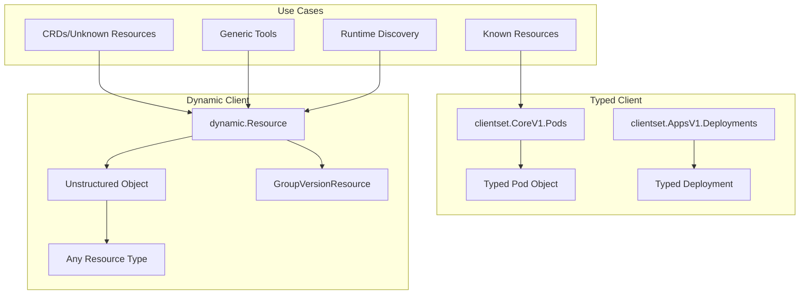

# Kubernetes Dynamic Client in Go: Building Flexible Controllers

## Introduction

The Kubernetes dynamic client provides a powerful way to interact with any Kubernetes resource without compile-time type dependencies. This comprehensive guide explores advanced patterns for building flexible controllers, generic operators, and tools that work with custom resources dynamically.

### Why Use Dynamic Client?

- 🔄 **Runtime Flexibility**: Work with any resource discovered at runtime
- 📦 **Zero Dependencies**: No need to import CRD packages
- 🎯 **Generic Operations**: Build tools that work with any resource
- 🚀 **Version Independence**: Decouple from specific API versions
- 🔧 **Discovery-Based**: Leverage API discovery for dynamic behavior

## Table of Contents

1. [Dynamic Client Architecture](#dynamic-client-architecture)
2. [Basic Operations](#basic-operations)
3. [Building Generic Controllers](#building-generic-controllers)
4. [Advanced Patterns](#advanced-patterns)
5. [Working with Custom Resources](#working-with-custom-resources)
6. [Performance Optimization](#performance-optimization)
7. [Real-World Examples](#real-world-examples)

## Dynamic Client Architecture

### Client Comparison



### Architecture Components

| Component | Purpose | Example |
|-----------|---------|---------|
| **GVR** | Resource identifier | `apps/v1/deployments` |
| **Unstructured** | Generic data container | `map[string]interface{}` |
| **Discovery** | API exploration | List available resources |
| **RESTMapper** | GVK to GVR mapping | Kind to Resource conversion |
| **Informer** | Event watching | Dynamic informer factory |

## Basic Operations

### 1. Setting Up Dynamic Client

```go
package main

import (
    "context"
    "fmt"
    "log"
    "path/filepath"
    
    "k8s.io/apimachinery/pkg/api/meta"
    metav1 "k8s.io/apimachinery/pkg/apis/meta/v1"
    "k8s.io/apimachinery/pkg/apis/meta/v1/unstructured"
    "k8s.io/apimachinery/pkg/runtime/schema"
    "k8s.io/client-go/discovery"
    "k8s.io/client-go/discovery/cached/memory"
    "k8s.io/client-go/dynamic"
    "k8s.io/client-go/restmapper"
    "k8s.io/client-go/tools/clientcmd"
    "k8s.io/client-go/util/homedir"
)

// DynamicClient wraps the Kubernetes dynamic client with helper methods
type DynamicClient struct {
    client    dynamic.Interface
    discovery discovery.DiscoveryInterface
    mapper    meta.RESTMapper
}

// NewDynamicClient creates a new dynamic client with discovery
func NewDynamicClient() (*DynamicClient, error) {
    // Build config
    var kubeconfig string
    if home := homedir.HomeDir(); home != "" {
        kubeconfig = filepath.Join(home, ".kube", "config")
    }
    
    config, err := clientcmd.BuildConfigFromFlags("", kubeconfig)
    if err != nil {
        // Try in-cluster config
        config, err = clientcmd.BuildConfigFromFlags("", "")
        if err != nil {
            return nil, err
        }
    }
    
    // Create dynamic client
    dynamicClient, err := dynamic.NewForConfig(config)
    if err != nil {
        return nil, err
    }
    
    // Create discovery client
    discoveryClient, err := discovery.NewDiscoveryClientForConfig(config)
    if err != nil {
        return nil, err
    }
    
    // Create REST mapper for resource discovery
    mapper := restmapper.NewDeferredDiscoveryRESTMapper(
        memory.NewMemCacheClient(discoveryClient),
    )
    
    return &DynamicClient{
        client:    dynamicClient,
        discovery: discoveryClient,
        mapper:    mapper,
    }, nil
}

// GetGVR converts a resource kind to GroupVersionResource
func (dc *DynamicClient) GetGVR(apiVersion, kind string) (schema.GroupVersionResource, error) {
    gv, err := schema.ParseGroupVersion(apiVersion)
    if err != nil {
        return schema.GroupVersionResource{}, err
    }
    
    gvk := gv.WithKind(kind)
    mapping, err := dc.mapper.RESTMapping(gvk.GroupKind(), gv.Version)
    if err != nil {
        return schema.GroupVersionResource{}, err
    }
    
    return mapping.Resource, nil
}
```

### 2. CRUD Operations

```go
// ResourceInterface provides CRUD operations for any resource
type ResourceInterface struct {
    dc        *DynamicClient
    gvr       schema.GroupVersionResource
    namespace string
}

// Resource returns an interface for the specified resource
func (dc *DynamicClient) Resource(gvr schema.GroupVersionResource) *ResourceInterface {
    return &ResourceInterface{
        dc:  dc,
        gvr: gvr,
    }
}

// Namespace sets the namespace for the resource operations
func (ri *ResourceInterface) Namespace(ns string) *ResourceInterface {
    ri.namespace = ns
    return ri
}

// Get retrieves a resource by name
func (ri *ResourceInterface) Get(ctx context.Context, name string) (*unstructured.Unstructured, error) {
    var resourceInterface dynamic.ResourceInterface
    
    if ri.namespace != "" {
        resourceInterface = ri.dc.client.Resource(ri.gvr).Namespace(ri.namespace)
    } else {
        resourceInterface = ri.dc.client.Resource(ri.gvr)
    }
    
    return resourceInterface.Get(ctx, name, metav1.GetOptions{})
}

// List retrieves all resources matching the label selector
func (ri *ResourceInterface) List(ctx context.Context, labelSelector string) (*unstructured.UnstructuredList, error) {
    var resourceInterface dynamic.ResourceInterface
    
    if ri.namespace != "" {
        resourceInterface = ri.dc.client.Resource(ri.gvr).Namespace(ri.namespace)
    } else {
        resourceInterface = ri.dc.client.Resource(ri.gvr)
    }
    
    return resourceInterface.List(ctx, metav1.ListOptions{
        LabelSelector: labelSelector,
    })
}

// Create creates a new resource
func (ri *ResourceInterface) Create(ctx context.Context, obj *unstructured.Unstructured) (*unstructured.Unstructured, error) {
    var resourceInterface dynamic.ResourceInterface
    
    if ri.namespace != "" {
        resourceInterface = ri.dc.client.Resource(ri.gvr).Namespace(ri.namespace)
    } else {
        resourceInterface = ri.dc.client.Resource(ri.gvr)
    }
    
    return resourceInterface.Create(ctx, obj, metav1.CreateOptions{})
}

// Update updates an existing resource
func (ri *ResourceInterface) Update(ctx context.Context, obj *unstructured.Unstructured) (*unstructured.Unstructured, error) {
    var resourceInterface dynamic.ResourceInterface
    
    if ri.namespace != "" {
        resourceInterface = ri.dc.client.Resource(ri.gvr).Namespace(ri.namespace)
    } else {
        resourceInterface = ri.dc.client.Resource(ri.gvr)
    }
    
    return resourceInterface.Update(ctx, obj, metav1.UpdateOptions{})
}

// Patch applies a patch to a resource
func (ri *ResourceInterface) Patch(ctx context.Context, name string, patchData []byte) (*unstructured.Unstructured, error) {
    var resourceInterface dynamic.ResourceInterface
    
    if ri.namespace != "" {
        resourceInterface = ri.dc.client.Resource(ri.gvr).Namespace(ri.namespace)
    } else {
        resourceInterface = ri.dc.client.Resource(ri.gvr)
    }
    
    return resourceInterface.Patch(ctx, name, types.MergePatchType, patchData, metav1.PatchOptions{})
}

// Delete removes a resource
func (ri *ResourceInterface) Delete(ctx context.Context, name string) error {
    var resourceInterface dynamic.ResourceInterface
    
    if ri.namespace != "" {
        resourceInterface = ri.dc.client.Resource(ri.gvr).Namespace(ri.namespace)
    } else {
        resourceInterface = ri.dc.client.Resource(ri.gvr)
    }
    
    return resourceInterface.Delete(ctx, name, metav1.DeleteOptions{})
}
```

### 3. Working with Unstructured Objects

```go
// UnstructuredHelper provides utilities for working with unstructured objects
type UnstructuredHelper struct{}

// GetString retrieves a string field from an unstructured object
func (uh *UnstructuredHelper) GetString(obj *unstructured.Unstructured, fields ...string) (string, error) {
    val, found, err := unstructured.NestedString(obj.Object, fields...)
    if err != nil {
        return "", err
    }
    if !found {
        return "", fmt.Errorf("field %v not found", fields)
    }
    return val, nil
}

// GetInt64 retrieves an int64 field from an unstructured object
func (uh *UnstructuredHelper) GetInt64(obj *unstructured.Unstructured, fields ...string) (int64, error) {
    val, found, err := unstructured.NestedInt64(obj.Object, fields...)
    if err != nil {
        return 0, err
    }
    if !found {
        return 0, fmt.Errorf("field %v not found", fields)
    }
    return val, nil
}

// GetSlice retrieves a slice field from an unstructured object
func (uh *UnstructuredHelper) GetSlice(obj *unstructured.Unstructured, fields ...string) ([]interface{}, error) {
    val, found, err := unstructured.NestedSlice(obj.Object, fields...)
    if err != nil {
        return nil, err
    }
    if !found {
        return nil, fmt.Errorf("field %v not found", fields)
    }
    return val, nil
}

// SetField sets a field in an unstructured object
func (uh *UnstructuredHelper) SetField(obj *unstructured.Unstructured, value interface{}, fields ...string) error {
    return unstructured.SetNestedField(obj.Object, value, fields...)
}

// Example: Creating a deployment using unstructured
func createDeploymentUnstructured() *unstructured.Unstructured {
    deployment := &unstructured.Unstructured{
        Object: map[string]interface{}{
            "apiVersion": "apps/v1",
            "kind":       "Deployment",
            "metadata": map[string]interface{}{
                "name":      "nginx-deployment",
                "namespace": "default",
                "labels": map[string]interface{}{
                    "app": "nginx",
                },
            },
            "spec": map[string]interface{}{
                "replicas": int64(3),
                "selector": map[string]interface{}{
                    "matchLabels": map[string]interface{}{
                        "app": "nginx",
                    },
                },
                "template": map[string]interface{}{
                    "metadata": map[string]interface{}{
                        "labels": map[string]interface{}{
                            "app": "nginx",
                        },
                    },
                    "spec": map[string]interface{}{
                        "containers": []interface{}{
                            map[string]interface{}{
                                "name":  "nginx",
                                "image": "nginx:1.21",
                                "ports": []interface{}{
                                    map[string]interface{}{
                                        "containerPort": int64(80),
                                    },
                                },
                            },
                        },
                    },
                },
            },
        },
    }
    return deployment
}
```

## Building Generic Controllers

### 1. Generic Resource Controller

```go
package controller

import (
    "context"
    "fmt"
    "time"
    
    "k8s.io/apimachinery/pkg/apis/meta/v1/unstructured"
    "k8s.io/apimachinery/pkg/runtime/schema"
    "k8s.io/apimachinery/pkg/util/runtime"
    "k8s.io/apimachinery/pkg/util/wait"
    "k8s.io/client-go/dynamic"
    "k8s.io/client-go/dynamic/dynamicinformer"
    "k8s.io/client-go/tools/cache"
    "k8s.io/client-go/util/workqueue"
)

// GenericController watches and processes any Kubernetes resource
type GenericController struct {
    dynamicClient   dynamic.Interface
    informerFactory dynamicinformer.DynamicSharedInformerFactory
    informer        cache.SharedIndexInformer
    queue           workqueue.RateLimitingInterface
    gvr             schema.GroupVersionResource
    handler         ResourceHandler
}

// ResourceHandler defines the interface for handling resource events
type ResourceHandler interface {
    OnAdd(obj *unstructured.Unstructured) error
    OnUpdate(oldObj, newObj *unstructured.Unstructured) error
    OnDelete(obj *unstructured.Unstructured) error
}

// NewGenericController creates a controller for any resource type
func NewGenericController(
    dynamicClient dynamic.Interface,
    gvr schema.GroupVersionResource,
    handler ResourceHandler,
    resyncPeriod time.Duration,
) *GenericController {
    
    informerFactory := dynamicinformer.NewDynamicSharedInformerFactory(
        dynamicClient,
        resyncPeriod,
    )
    
    informer := informerFactory.ForResource(gvr).Informer()
    
    queue := workqueue.NewRateLimitingQueue(
        workqueue.DefaultControllerRateLimiter(),
    )
    
    controller := &GenericController{
        dynamicClient:   dynamicClient,
        informerFactory: informerFactory,
        informer:        informer,
        queue:           queue,
        gvr:             gvr,
        handler:         handler,
    }
    
    // Set up event handlers
    informer.AddEventHandler(cache.ResourceEventHandlerFuncs{
        AddFunc: func(obj interface{}) {
            controller.enqueue(obj)
        },
        UpdateFunc: func(oldObj, newObj interface{}) {
            controller.enqueue(newObj)
        },
        DeleteFunc: func(obj interface{}) {
            controller.enqueue(obj)
        },
    })
    
    return controller
}

// enqueue adds an object to the workqueue
func (gc *GenericController) enqueue(obj interface{}) {
    key, err := cache.MetaNamespaceKeyFunc(obj)
    if err != nil {
        runtime.HandleError(err)
        return
    }
    gc.queue.Add(key)
}

// Run starts the controller
func (gc *GenericController) Run(ctx context.Context, workers int) error {
    defer runtime.HandleCrash()
    defer gc.queue.ShutDown()
    
    // Start the informer
    gc.informerFactory.Start(ctx.Done())
    
    // Wait for cache sync
    if !cache.WaitForCacheSync(ctx.Done(), gc.informer.HasSynced) {
        return fmt.Errorf("failed to sync cache")
    }
    
    // Start workers
    for i := 0; i < workers; i++ {
        go wait.UntilWithContext(ctx, gc.runWorker, time.Second)
    }
    
    <-ctx.Done()
    return nil
}

// runWorker processes items from the queue
func (gc *GenericController) runWorker(ctx context.Context) {
    for gc.processNextItem(ctx) {
    }
}

// processNextItem handles a single item from the queue
func (gc *GenericController) processNextItem(ctx context.Context) bool {
    item, shutdown := gc.queue.Get()
    if shutdown {
        return false
    }
    defer gc.queue.Done(item)
    
    key, ok := item.(string)
    if !ok {
        gc.queue.Forget(item)
        runtime.HandleError(fmt.Errorf("expected string in queue but got %T", item))
        return true
    }
    
    if err := gc.syncHandler(ctx, key); err != nil {
        gc.queue.AddRateLimited(key)
        runtime.HandleError(fmt.Errorf("sync %q failed: %v", key, err))
        return true
    }
    
    gc.queue.Forget(item)
    return true
}

// syncHandler processes a single resource
func (gc *GenericController) syncHandler(ctx context.Context, key string) error {
    namespace, name, err := cache.SplitMetaNamespaceKey(key)
    if err != nil {
        return err
    }
    
    // Get the resource from the informer cache
    obj, exists, err := gc.informer.GetIndexer().GetByKey(key)
    if err != nil {
        return err
    }
    
    if !exists {
        // Resource was deleted
        return gc.handler.OnDelete(&unstructured.Unstructured{
            Object: map[string]interface{}{
                "metadata": map[string]interface{}{
                    "name":      name,
                    "namespace": namespace,
                },
            },
        })
    }
    
    // Convert to unstructured
    unstructuredObj, ok := obj.(*unstructured.Unstructured)
    if !ok {
        return fmt.Errorf("object is not unstructured: %T", obj)
    }
    
    // For simplicity, always call OnUpdate
    return gc.handler.OnUpdate(unstructuredObj, unstructuredObj)
}
```

### 2. Multi-Resource Controller

```go
// MultiResourceController manages multiple resource types
type MultiResourceController struct {
    controllers map[schema.GroupVersionResource]*GenericController
    client      dynamic.Interface
}

// NewMultiResourceController creates a controller that watches multiple resources
func NewMultiResourceController(client dynamic.Interface) *MultiResourceController {
    return &MultiResourceController{
        controllers: make(map[schema.GroupVersionResource]*GenericController),
        client:      client,
    }
}

// AddResource adds a resource type to watch
func (mrc *MultiResourceController) AddResource(
    gvr schema.GroupVersionResource,
    handler ResourceHandler,
) {
    controller := NewGenericController(
        mrc.client,
        gvr,
        handler,
        30*time.Second,
    )
    mrc.controllers[gvr] = controller
}

// Run starts all controllers
func (mrc *MultiResourceController) Run(ctx context.Context, workers int) error {
    errChan := make(chan error, len(mrc.controllers))
    
    for gvr, controller := range mrc.controllers {
        go func(g schema.GroupVersionResource, c *GenericController) {
            if err := c.Run(ctx, workers); err != nil {
                errChan <- fmt.Errorf("controller for %v failed: %w", g, err)
            }
        }(gvr, controller)
    }
    
    select {
    case err := <-errChan:
        return err
    case <-ctx.Done():
        return nil
    }
}

// Example handler implementation
type LoggingHandler struct {
    logger *log.Logger
}

func (lh *LoggingHandler) OnAdd(obj *unstructured.Unstructured) error {
    lh.logger.Printf("Resource added: %s/%s", 
        obj.GetNamespace(), obj.GetName())
    return nil
}

func (lh *LoggingHandler) OnUpdate(oldObj, newObj *unstructured.Unstructured) error {
    if oldObj.GetResourceVersion() != newObj.GetResourceVersion() {
        lh.logger.Printf("Resource updated: %s/%s (version %s -> %s)",
            newObj.GetNamespace(), newObj.GetName(),
            oldObj.GetResourceVersion(), newObj.GetResourceVersion())
    }
    return nil
}

func (lh *LoggingHandler) OnDelete(obj *unstructured.Unstructured) error {
    lh.logger.Printf("Resource deleted: %s/%s",
        obj.GetNamespace(), obj.GetName())
    return nil
}
```

## Advanced Patterns

### 1. Resource Discovery and Introspection

```go
// ResourceDiscovery provides resource discovery capabilities
type ResourceDiscovery struct {
    discovery discovery.DiscoveryInterface
}

// NewResourceDiscovery creates a new resource discovery client
func NewResourceDiscovery(discovery discovery.DiscoveryInterface) *ResourceDiscovery {
    return &ResourceDiscovery{discovery: discovery}
}

// ListAllResources discovers all available resources in the cluster
func (rd *ResourceDiscovery) ListAllResources() ([]schema.GroupVersionResource, error) {
    _, apiResourceLists, err := rd.discovery.ServerGroupsAndResources()
    if err != nil {
        return nil, err
    }
    
    var resources []schema.GroupVersionResource
    
    for _, apiResourceList := range apiResourceLists {
        gv, err := schema.ParseGroupVersion(apiResourceList.GroupVersion)
        if err != nil {
            continue
        }
        
        for _, apiResource := range apiResourceList.APIResources {
            // Skip subresources
            if strings.Contains(apiResource.Name, "/") {
                continue
            }
            
            resources = append(resources, schema.GroupVersionResource{
                Group:    gv.Group,
                Version:  gv.Version,
                Resource: apiResource.Name,
            })
        }
    }
    
    return resources, nil
}

// GetResourceDetails returns detailed information about a resource
func (rd *ResourceDiscovery) GetResourceDetails(gvr schema.GroupVersionResource) (*metav1.APIResource, error) {
    resources, err := rd.discovery.ServerResourcesForGroupVersion(
        gvr.GroupVersion().String(),
    )
    if err != nil {
        return nil, err
    }
    
    for _, resource := range resources.APIResources {
        if resource.Name == gvr.Resource {
            return &resource, nil
        }
    }
    
    return nil, fmt.Errorf("resource %v not found", gvr)
}

// IsNamespaced checks if a resource is namespaced
func (rd *ResourceDiscovery) IsNamespaced(gvr schema.GroupVersionResource) (bool, error) {
    resource, err := rd.GetResourceDetails(gvr)
    if err != nil {
        return false, err
    }
    return resource.Namespaced, nil
}

// SupportsVerb checks if a resource supports a specific verb
func (rd *ResourceDiscovery) SupportsVerb(gvr schema.GroupVersionResource, verb string) (bool, error) {
    resource, err := rd.GetResourceDetails(gvr)
    if err != nil {
        return false, err
    }
    
    for _, v := range resource.Verbs {
        if v == verb {
            return true, nil
        }
    }
    return false, nil
}
```

### 2. Field Selectors and Advanced Queries

```go
// QueryBuilder builds complex queries for dynamic resources
type QueryBuilder struct {
    labelSelector string
    fieldSelector string
    limit         int64
    continueToken string
}

// NewQueryBuilder creates a new query builder
func NewQueryBuilder() *QueryBuilder {
    return &QueryBuilder{}
}

// WithLabelSelector adds a label selector
func (qb *QueryBuilder) WithLabelSelector(selector string) *QueryBuilder {
    qb.labelSelector = selector
    return qb
}

// WithFieldSelector adds a field selector
func (qb *QueryBuilder) WithFieldSelector(selector string) *QueryBuilder {
    qb.fieldSelector = selector
    return qb
}

// WithLimit sets the result limit
func (qb *QueryBuilder) WithLimit(limit int64) *QueryBuilder {
    qb.limit = limit
    return qb
}

// WithContinue sets the continue token for pagination
func (qb *QueryBuilder) WithContinue(token string) *QueryBuilder {
    qb.continueToken = token
    return qb
}

// Build creates ListOptions from the query
func (qb *QueryBuilder) Build() metav1.ListOptions {
    return metav1.ListOptions{
        LabelSelector: qb.labelSelector,
        FieldSelector: qb.fieldSelector,
        Limit:         qb.limit,
        Continue:      qb.continueToken,
    }
}

// ResourceQuery performs advanced queries on resources
type ResourceQuery struct {
    client dynamic.Interface
}

// FindResourcesByLabel finds all resources matching a label across namespaces
func (rq *ResourceQuery) FindResourcesByLabel(
    ctx context.Context,
    gvr schema.GroupVersionResource,
    labelKey, labelValue string,
) ([]*unstructured.Unstructured, error) {
    
    query := NewQueryBuilder().
        WithLabelSelector(fmt.Sprintf("%s=%s", labelKey, labelValue)).
        Build()
    
    list, err := rq.client.Resource(gvr).
        List(ctx, query)
    if err != nil {
        return nil, err
    }
    
    var results []*unstructured.Unstructured
    for i := range list.Items {
        results = append(results, &list.Items[i])
    }
    
    return results, nil
}

// FindResourcesByFieldPath finds resources by a field path value
func (rq *ResourceQuery) FindResourcesByFieldPath(
    ctx context.Context,
    gvr schema.GroupVersionResource,
    namespace string,
    fieldPath string,
    fieldValue interface{},
) ([]*unstructured.Unstructured, error) {
    
    list, err := rq.client.Resource(gvr).
        Namespace(namespace).
        List(ctx, metav1.ListOptions{})
    if err != nil {
        return nil, err
    }
    
    var results []*unstructured.Unstructured
    fields := strings.Split(fieldPath, ".")
    
    for i := range list.Items {
        val, found, err := unstructured.NestedFieldNoCopy(
            list.Items[i].Object,
            fields...,
        )
        if err != nil || !found {
            continue
        }
        
        if val == fieldValue {
            results = append(results, &list.Items[i])
        }
    }
    
    return results, nil
}
```

## Working with Custom Resources

### 1. CRD Client without Dependencies

```go
// CRDClient provides operations for custom resources without importing their packages
type CRDClient struct {
    dynamic   dynamic.Interface
    discovery discovery.DiscoveryInterface
    mapper    meta.RESTMapper
}

// NewCRDClient creates a client for working with CRDs
func NewCRDClient(config *rest.Config) (*CRDClient, error) {
    dynamic, err := dynamic.NewForConfig(config)
    if err != nil {
        return nil, err
    }
    
    discovery, err := discovery.NewDiscoveryClientForConfig(config)
    if err != nil {
        return nil, err
    }
    
    mapper := restmapper.NewDeferredDiscoveryRESTMapper(
        memory.NewMemCacheClient(discovery),
    )
    
    return &CRDClient{
        dynamic:   dynamic,
        discovery: discovery,
        mapper:    mapper,
    }, nil
}

// GetCRD retrieves a custom resource
func (cc *CRDClient) GetCRD(
    ctx context.Context,
    apiVersion, kind, namespace, name string,
) (*unstructured.Unstructured, error) {
    
    gv, err := schema.ParseGroupVersion(apiVersion)
    if err != nil {
        return nil, err
    }
    
    gvk := gv.WithKind(kind)
    mapping, err := cc.mapper.RESTMapping(gvk.GroupKind(), gv.Version)
    if err != nil {
        return nil, err
    }
    
    var dr dynamic.ResourceInterface
    if mapping.Scope.Name() == meta.RESTScopeNameNamespace {
        dr = cc.dynamic.Resource(mapping.Resource).Namespace(namespace)
    } else {
        dr = cc.dynamic.Resource(mapping.Resource)
    }
    
    return dr.Get(ctx, name, metav1.GetOptions{})
}

// Example: Working with Prometheus ServiceMonitor CRD
func (cc *CRDClient) CreateServiceMonitor(ctx context.Context) error {
    serviceMonitor := &unstructured.Unstructured{
        Object: map[string]interface{}{
            "apiVersion": "monitoring.coreos.com/v1",
            "kind":       "ServiceMonitor",
            "metadata": map[string]interface{}{
                "name":      "app-metrics",
                "namespace": "monitoring",
                "labels": map[string]interface{}{
                    "app": "my-app",
                },
            },
            "spec": map[string]interface{}{
                "selector": map[string]interface{}{
                    "matchLabels": map[string]interface{}{
                        "app": "my-app",
                    },
                },
                "endpoints": []interface{}{
                    map[string]interface{}{
                        "port":     "metrics",
                        "interval": "30s",
                        "path":     "/metrics",
                    },
                },
            },
        },
    }
    
    gvr := schema.GroupVersionResource{
        Group:    "monitoring.coreos.com",
        Version:  "v1",
        Resource: "servicemonitors",
    }
    
    _, err := cc.dynamic.Resource(gvr).
        Namespace("monitoring").
        Create(ctx, serviceMonitor, metav1.CreateOptions{})
    
    return err
}
```

### 2. Generic CRD Watcher

```go
// CRDWatcher watches for changes to any CRD type
type CRDWatcher struct {
    client    dynamic.Interface
    gvr       schema.GroupVersionResource
    namespace string
    handler   func(*unstructured.Unstructured, watch.EventType)
}

// NewCRDWatcher creates a watcher for a CRD type
func NewCRDWatcher(
    client dynamic.Interface,
    gvr schema.GroupVersionResource,
    namespace string,
    handler func(*unstructured.Unstructured, watch.EventType),
) *CRDWatcher {
    return &CRDWatcher{
        client:    client,
        gvr:       gvr,
        namespace: namespace,
        handler:   handler,
    }
}

// Watch starts watching for CRD changes
func (cw *CRDWatcher) Watch(ctx context.Context) error {
    var resourceInterface dynamic.ResourceInterface
    
    if cw.namespace != "" {
        resourceInterface = cw.client.Resource(cw.gvr).Namespace(cw.namespace)
    } else {
        resourceInterface = cw.client.Resource(cw.gvr)
    }
    
    watcher, err := resourceInterface.Watch(ctx, metav1.ListOptions{})
    if err != nil {
        return err
    }
    defer watcher.Stop()
    
    for {
        select {
        case event, ok := <-watcher.ResultChan():
            if !ok {
                return fmt.Errorf("watch channel closed")
            }
            
            unstructuredObj, ok := event.Object.(*unstructured.Unstructured)
            if !ok {
                continue
            }
            
            cw.handler(unstructuredObj, event.Type)
            
        case <-ctx.Done():
            return ctx.Err()
        }
    }
}
```

## Performance Optimization

### 1. Batch Operations

```go
// BatchProcessor processes resources in batches for better performance
type BatchProcessor struct {
    client    dynamic.Interface
    batchSize int
    workers   int
}

// NewBatchProcessor creates a batch processor
func NewBatchProcessor(client dynamic.Interface, batchSize, workers int) *BatchProcessor {
    return &BatchProcessor{
        client:    client,
        batchSize: batchSize,
        workers:   workers,
    }
}

// ProcessResources processes resources in parallel batches
func (bp *BatchProcessor) ProcessResources(
    ctx context.Context,
    gvr schema.GroupVersionResource,
    processor func(*unstructured.Unstructured) error,
) error {
    
    // Create work channel
    workChan := make(chan *unstructured.Unstructured, bp.batchSize)
    errChan := make(chan error, bp.workers)
    
    // Start workers
    var wg sync.WaitGroup
    for i := 0; i < bp.workers; i++ {
        wg.Add(1)
        go func() {
            defer wg.Done()
            for obj := range workChan {
                if err := processor(obj); err != nil {
                    errChan <- err
                    return
                }
            }
        }()
    }
    
    // List and process resources
    continueToken := ""
    for {
        list, err := bp.client.Resource(gvr).List(ctx, metav1.ListOptions{
            Limit:    int64(bp.batchSize),
            Continue: continueToken,
        })
        if err != nil {
            close(workChan)
            return err
        }
        
        for i := range list.Items {
            select {
            case workChan <- &list.Items[i]:
            case err := <-errChan:
                close(workChan)
                return err
            case <-ctx.Done():
                close(workChan)
                return ctx.Err()
            }
        }
        
        continueToken = list.GetContinue()
        if continueToken == "" {
            break
        }
    }
    
    close(workChan)
    wg.Wait()
    
    select {
    case err := <-errChan:
        return err
    default:
        return nil
    }
}
```

### 2. Caching Layer

```go
// CachedDynamicClient adds caching to dynamic client operations
type CachedDynamicClient struct {
    client dynamic.Interface
    cache  *cache.LRU
    ttl    time.Duration
}

// CacheEntry represents a cached resource
type CacheEntry struct {
    Object    *unstructured.Unstructured
    ExpiresAt time.Time
}

// NewCachedDynamicClient creates a cached dynamic client
func NewCachedDynamicClient(client dynamic.Interface, cacheSize int, ttl time.Duration) *CachedDynamicClient {
    return &CachedDynamicClient{
        client: client,
        cache:  cache.NewLRU(cacheSize),
        ttl:    ttl,
    }
}

// Get retrieves a resource with caching
func (cdc *CachedDynamicClient) Get(
    ctx context.Context,
    gvr schema.GroupVersionResource,
    namespace, name string,
) (*unstructured.Unstructured, error) {
    
    // Build cache key
    key := fmt.Sprintf("%s/%s/%s/%s", gvr.String(), namespace, name, "get")
    
    // Check cache
    if cached, ok := cdc.cache.Get(key); ok {
        entry := cached.(*CacheEntry)
        if time.Now().Before(entry.ExpiresAt) {
            return entry.Object.DeepCopy(), nil
        }
        cdc.cache.Remove(key)
    }
    
    // Fetch from API
    var dr dynamic.ResourceInterface
    if namespace != "" {
        dr = cdc.client.Resource(gvr).Namespace(namespace)
    } else {
        dr = cdc.client.Resource(gvr)
    }
    
    obj, err := dr.Get(ctx, name, metav1.GetOptions{})
    if err != nil {
        return nil, err
    }
    
    // Store in cache
    cdc.cache.Add(key, &CacheEntry{
        Object:    obj,
        ExpiresAt: time.Now().Add(cdc.ttl),
    })
    
    return obj, nil
}

// InvalidateCache removes entries from cache
func (cdc *CachedDynamicClient) InvalidateCache(gvr schema.GroupVersionResource, namespace, name string) {
    pattern := fmt.Sprintf("%s/%s/%s/", gvr.String(), namespace, name)
    
    for _, key := range cdc.cache.Keys() {
        if strings.HasPrefix(key.(string), pattern) {
            cdc.cache.Remove(key)
        }
    }
}
```

## Real-World Examples

### 1. Resource Migration Tool

```go
// ResourceMigrator migrates resources between clusters or namespaces
type ResourceMigrator struct {
    sourceClient dynamic.Interface
    targetClient dynamic.Interface
    discovery    discovery.DiscoveryInterface
}

// MigrateResources migrates resources based on criteria
func (rm *ResourceMigrator) MigrateResources(
    ctx context.Context,
    gvr schema.GroupVersionResource,
    sourceNamespace, targetNamespace string,
    transformer func(*unstructured.Unstructured) error,
) error {
    
    // List resources from source
    list, err := rm.sourceClient.Resource(gvr).
        Namespace(sourceNamespace).
        List(ctx, metav1.ListOptions{})
    if err != nil {
        return fmt.Errorf("failed to list resources: %w", err)
    }
    
    log.Printf("Found %d resources to migrate", len(list.Items))
    
    for i := range list.Items {
        obj := list.Items[i].DeepCopy()
        
        // Clean metadata
        unstructured.RemoveNestedField(obj.Object, "metadata", "uid")
        unstructured.RemoveNestedField(obj.Object, "metadata", "resourceVersion")
        unstructured.RemoveNestedField(obj.Object, "metadata", "selfLink")
        unstructured.RemoveNestedField(obj.Object, "metadata", "creationTimestamp")
        unstructured.RemoveNestedField(obj.Object, "metadata", "generation")
        
        // Update namespace
        obj.SetNamespace(targetNamespace)
        
        // Apply transformation
        if transformer != nil {
            if err := transformer(obj); err != nil {
                log.Printf("Failed to transform %s: %v", obj.GetName(), err)
                continue
            }
        }
        
        // Create in target
        _, err := rm.targetClient.Resource(gvr).
            Namespace(targetNamespace).
            Create(ctx, obj, metav1.CreateOptions{})
        
        if err != nil {
            if errors.IsAlreadyExists(err) {
                log.Printf("Resource %s already exists in target", obj.GetName())
            } else {
                log.Printf("Failed to create %s: %v", obj.GetName(), err)
            }
        } else {
            log.Printf("Successfully migrated %s", obj.GetName())
        }
    }
    
    return nil
}
```

### 2. Resource Relationship Mapper

```go
// ResourceRelationshipMapper maps relationships between resources
type ResourceRelationshipMapper struct {
    client    dynamic.Interface
    discovery discovery.DiscoveryInterface
}

// Relationship represents a relationship between resources
type Relationship struct {
    Source ResourceRef
    Target ResourceRef
    Type   string // "owns", "references", "uses"
}

// ResourceRef identifies a resource
type ResourceRef struct {
    GVR       schema.GroupVersionResource
    Namespace string
    Name      string
}

// MapRelationships discovers relationships for a resource
func (rrm *ResourceRelationshipMapper) MapRelationships(
    ctx context.Context,
    ref ResourceRef,
) ([]Relationship, error) {
    
    var relationships []Relationship
    
    // Get the source resource
    var dr dynamic.ResourceInterface
    if ref.Namespace != "" {
        dr = rrm.client.Resource(ref.GVR).Namespace(ref.Namespace)
    } else {
        dr = rrm.client.Resource(ref.GVR)
    }
    
    obj, err := dr.Get(ctx, ref.Name, metav1.GetOptions{})
    if err != nil {
        return nil, err
    }
    
    // Check owner references
    for _, owner := range obj.GetOwnerReferences() {
        gv, _ := schema.ParseGroupVersion(owner.APIVersion)
        relationships = append(relationships, Relationship{
            Source: ref,
            Target: ResourceRef{
                GVR: schema.GroupVersionResource{
                    Group:    gv.Group,
                    Version:  gv.Version,
                    Resource: strings.ToLower(owner.Kind) + "s", // Simple pluralization
                },
                Namespace: ref.Namespace,
                Name:      owner.Name,
            },
            Type: "owns",
        })
    }
    
    // Check for ConfigMap/Secret references in Pod specs
    if ref.GVR.Resource == "pods" {
        relationships = append(relationships, 
            rrm.extractPodReferences(obj)...)
    }
    
    // Check for Service selectors
    if ref.GVR.Resource == "services" {
        relationships = append(relationships,
            rrm.findMatchingPods(ctx, obj)...)
    }
    
    return relationships, nil
}

// extractPodReferences finds ConfigMap and Secret references in a Pod
func (rrm *ResourceRelationshipMapper) extractPodReferences(
    pod *unstructured.Unstructured,
) []Relationship {
    
    var relationships []Relationship
    namespace := pod.GetNamespace()
    
    // Extract containers
    containers, found, _ := unstructured.NestedSlice(
        pod.Object, "spec", "containers")
    if !found {
        return relationships
    }
    
    for _, container := range containers {
        containerMap, ok := container.(map[string]interface{})
        if !ok {
            continue
        }
        
        // Check envFrom
        envFromList, found, _ := unstructured.NestedSlice(
            containerMap, "envFrom")
        if found {
            for _, envFrom := range envFromList {
                envFromMap, ok := envFrom.(map[string]interface{})
                if !ok {
                    continue
                }
                
                // ConfigMapRef
                if cmRef, found, _ := unstructured.NestedMap(
                    envFromMap, "configMapRef"); found {
                    if name, ok := cmRef["name"].(string); ok {
                        relationships = append(relationships, Relationship{
                            Source: ResourceRef{
                                GVR:       schema.GroupVersionResource{Version: "v1", Resource: "pods"},
                                Namespace: namespace,
                                Name:      pod.GetName(),
                            },
                            Target: ResourceRef{
                                GVR:       schema.GroupVersionResource{Version: "v1", Resource: "configmaps"},
                                Namespace: namespace,
                                Name:      name,
                            },
                            Type: "references",
                        })
                    }
                }
                
                // SecretRef
                if secretRef, found, _ := unstructured.NestedMap(
                    envFromMap, "secretRef"); found {
                    if name, ok := secretRef["name"].(string); ok {
                        relationships = append(relationships, Relationship{
                            Source: ResourceRef{
                                GVR:       schema.GroupVersionResource{Version: "v1", Resource: "pods"},
                                Namespace: namespace,
                                Name:      pod.GetName(),
                            },
                            Target: ResourceRef{
                                GVR:       schema.GroupVersionResource{Version: "v1", Resource: "secrets"},
                                Namespace: namespace,
                                Name:      name,
                            },
                            Type: "references",
                        })
                    }
                }
            }
        }
    }
    
    return relationships
}
```

### 3. Resource Compliance Checker

```go
// ComplianceChecker checks resources against policies
type ComplianceChecker struct {
    client dynamic.Interface
    rules  []ComplianceRule
}

// ComplianceRule defines a compliance check
type ComplianceRule struct {
    Name        string
    Description string
    GVR         schema.GroupVersionResource
    Check       func(*unstructured.Unstructured) (bool, string)
}

// CheckCompliance runs compliance checks on resources
func (cc *ComplianceChecker) CheckCompliance(ctx context.Context) ([]ComplianceResult, error) {
    var results []ComplianceResult
    
    for _, rule := range cc.rules {
        list, err := cc.client.Resource(rule.GVR).
            List(ctx, metav1.ListOptions{})
        if err != nil {
            log.Printf("Failed to list %v: %v", rule.GVR, err)
            continue
        }
        
        for i := range list.Items {
            compliant, reason := rule.Check(&list.Items[i])
            
            results = append(results, ComplianceResult{
                Rule:      rule.Name,
                Resource:  fmt.Sprintf("%s/%s", list.Items[i].GetNamespace(), list.Items[i].GetName()),
                Compliant: compliant,
                Reason:    reason,
            })
        }
    }
    
    return results, nil
}

// ComplianceResult represents the result of a compliance check
type ComplianceResult struct {
    Rule      string
    Resource  string
    Compliant bool
    Reason    string
}

// Example compliance rules
func GetDefaultComplianceRules() []ComplianceRule {
    return []ComplianceRule{
        {
            Name:        "pod-security-context",
            Description: "Pods must have security context",
            GVR:         schema.GroupVersionResource{Version: "v1", Resource: "pods"},
            Check: func(obj *unstructured.Unstructured) (bool, string) {
                secContext, found, _ := unstructured.NestedMap(
                    obj.Object, "spec", "securityContext")
                if !found || secContext == nil {
                    return false, "Missing security context"
                }
                
                runAsNonRoot, found, _ := unstructured.NestedBool(
                    secContext, "runAsNonRoot")
                if !found || !runAsNonRoot {
                    return false, "Must run as non-root"
                }
                
                return true, "Compliant"
            },
        },
        {
            Name:        "resource-limits",
            Description: "Containers must have resource limits",
            GVR:         schema.GroupVersionResource{Version: "v1", Resource: "pods"},
            Check: func(obj *unstructured.Unstructured) (bool, string) {
                containers, found, _ := unstructured.NestedSlice(
                    obj.Object, "spec", "containers")
                if !found {
                    return false, "No containers found"
                }
                
                for _, container := range containers {
                    containerMap, ok := container.(map[string]interface{})
                    if !ok {
                        continue
                    }
                    
                    limits, found, _ := unstructured.NestedMap(
                        containerMap, "resources", "limits")
                    if !found || limits == nil {
                        return false, "Missing resource limits"
                    }
                    
                    if _, ok := limits["memory"]; !ok {
                        return false, "Missing memory limit"
                    }
                    if _, ok := limits["cpu"]; !ok {
                        return false, "Missing CPU limit"
                    }
                }
                
                return true, "All containers have limits"
            },
        },
        {
            Name:        "required-labels",
            Description: "Resources must have required labels",
            GVR:         schema.GroupVersionResource{Group: "apps", Version: "v1", Resource: "deployments"},
            Check: func(obj *unstructured.Unstructured) (bool, string) {
                labels := obj.GetLabels()
                requiredLabels := []string{"team", "environment", "app"}
                
                for _, required := range requiredLabels {
                    if _, ok := labels[required]; !ok {
                        return false, fmt.Sprintf("Missing label: %s", required)
                    }
                }
                
                return true, "Has all required labels"
            },
        },
    }
}
```

## Testing Dynamic Client Code

### Unit Testing with Fake Client

```go
// Example unit test for dynamic client operations
func TestDynamicClientOperations(t *testing.T) {
    // Create fake dynamic client
    scheme := runtime.NewScheme()
    _ = corev1.AddToScheme(scheme)
    
    pod := &unstructured.Unstructured{
        Object: map[string]interface{}{
            "apiVersion": "v1",
            "kind":       "Pod",
            "metadata": map[string]interface{}{
                "name":      "test-pod",
                "namespace": "default",
            },
            "spec": map[string]interface{}{
                "containers": []interface{}{
                    map[string]interface{}{
                        "name":  "nginx",
                        "image": "nginx:latest",
                    },
                },
            },
        },
    }
    
    client := fake.NewSimpleDynamicClient(scheme, pod)
    
    // Test Get operation
    gvr := schema.GroupVersionResource{
        Version:  "v1",
        Resource: "pods",
    }
    
    result, err := client.Resource(gvr).
        Namespace("default").
        Get(context.TODO(), "test-pod", metav1.GetOptions{})
    
    assert.NoError(t, err)
    assert.Equal(t, "test-pod", result.GetName())
    
    // Test Update operation
    result.SetLabels(map[string]string{"test": "label"})
    updated, err := client.Resource(gvr).
        Namespace("default").
        Update(context.TODO(), result, metav1.UpdateOptions{})
    
    assert.NoError(t, err)
    assert.Equal(t, "label", updated.GetLabels()["test"])
}
```

## Conclusion

The Kubernetes dynamic client provides unparalleled flexibility for building generic tools and operators. By mastering these patterns, you can create powerful controllers that work with any resource type, adapt to schema changes, and operate across different Kubernetes distributions.

### Key Takeaways

1. Use dynamic client for runtime resource discovery
2. Leverage unstructured objects for flexible data handling
3. Implement proper error handling and retries
4. Cache aggressively to improve performance
5. Use discovery for resource introspection
6. Build generic tools that work with any CRD

### Next Steps

1. Explore dynamic informers for efficient watching
2. Implement admission webhooks with dynamic validation
3. Build multi-cluster controllers with dynamic client
4. Create resource migration and backup tools
5. Develop compliance and policy engines

### Additional Resources

- [client-go Documentation](https://pkg.go.dev/k8s.io/client-go)
- [Dynamic Client Examples](https://github.com/kubernetes/client-go/tree/master/examples/dynamic)
- [Kubernetes API Conventions](https://github.com/kubernetes/community/blob/master/contributors/devel/sig-architecture/api-conventions.md)
- [Unstructured Guide](https://pkg.go.dev/k8s.io/apimachinery/pkg/apis/meta/v1/unstructured)