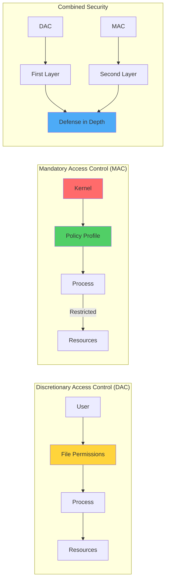
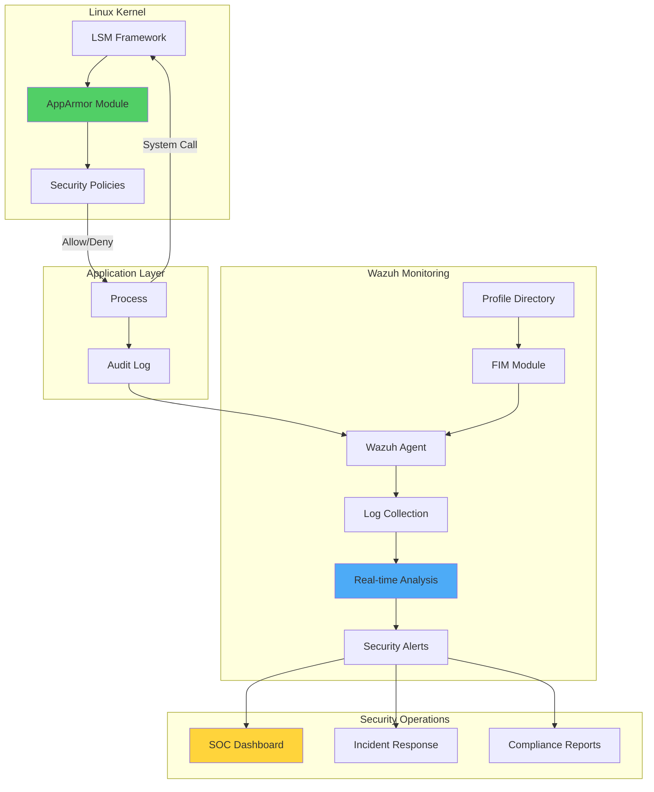
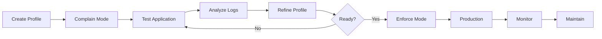

# Enhancing Linux Security with AppArmor and Wazuh: Mandatory Access Control with Real-Time Monitoring

## Introduction

Linux systems face increasingly sophisticated threats, from privilege escalation attacks to unauthorized data access. While traditional Discretionary Access Control (DAC) provides basic security, it has a critical weakness: compromised processes inherit their user's permissions, potentially accessing sensitive resources.

This guide demonstrates how to implement **Mandatory Access Control (MAC)** using AppArmor and monitor violations in real-time with Wazuh. By combining kernel-enforced security policies with centralized monitoring, we create a robust defense system that:

- 🛡️ Enforces strict process restrictions at the kernel level
- 🔍 Detects policy violations in real-time
- 📊 Provides centralized visibility across your infrastructure
- 🚨 Enables automated incident response

## Understanding Linux Security Models

### DAC vs MAC: Why You Need Both



**DAC Limitations**:
- User-controlled permissions
- Inherited privileges in compromised processes
- No protection against insider threats
- Limited audit capabilities

**MAC Advantages**:
- Kernel-enforced policies
- Granular process restrictions
- Protection even from root
- Comprehensive audit trail

## Architecture Overview



## Infrastructure Setup

### Prerequisites

1. **Wazuh Server** (OVA 4.12.0):
   - Wazuh manager, indexer, and dashboard
   - Minimum 8GB RAM, 4 CPUs

2. **Ubuntu 24.04 Endpoint**:
   - Wazuh agent 4.12.0 installed
   - AppArmor utilities
   - GCC compiler for demo app

## Implementation Guide

### Step 1: Configure Wazuh File Integrity Monitoring

Monitor AppArmor profiles for unauthorized changes:

```xml
<!-- Add to /var/ossec/etc/ossec.conf -->
<ossec_config>
  <syscheck>
    <directories realtime="yes" report_changes="yes">/etc/apparmor.d</directories>
  </syscheck>
</ossec_config>
```

Restart the Wazuh agent:
```bash
sudo systemctl restart wazuh-agent
```

### Step 2: Create Custom Detection Rules

Add to Wazuh rules (`apparmor_fim_rules.xml`):

```xml
<group name="syscheck,apparmor">
  <!-- Profile Addition -->
  <rule id="100601" level="3">
    <if_sid>554</if_sid>
    <field name="file">/etc/apparmor.d/</field>
    <description>AppArmor profile added: $(file)</description>
    <group>apparmor_change,</group>
  </rule>

  <!-- Profile Modification -->
  <rule id="100602" level="5">
    <if_sid>550</if_sid>
    <field name="file">/etc/apparmor.d/</field>
    <description>AppArmor profile modified: $(file)</description>
    <mitre>
      <id>T1562.001</id>
    </mitre>
    <group>apparmor_change,defense_evasion,</group>
  </rule>

  <!-- Profile Deletion -->
  <rule id="100603" level="7">
    <if_sid>553</if_sid>
    <field name="file">/etc/apparmor.d/</field>
    <description>AppArmor profile deleted: $(file)</description>
    <mitre>
      <id>T1562.001</id>
    </mitre>
    <group>apparmor_change,defense_evasion,</group>
  </rule>
</group>
```

### Step 3: Create Demo Application

Create a test application that attempts various security-sensitive operations:

```c
// Save as ~/test-app.c
#include <stdio.h>
#include <stdlib.h>
#include <unistd.h>
#include <fcntl.h>
#include <sys/syscall.h>
#include <sys/ptrace.h>
#include <netinet/in.h>
#include <string.h>
#include <arpa/inet.h>

// Attempt file write
void write_to_file() {
    FILE *fp = fopen("/tmp/demo_output.txt", "w");
    if (fp) {
        fprintf(fp, "This is a sample output.\n");
        fclose(fp);
        printf("[+] write_to_file - Wrote to /tmp/demo_output.txt\n");
    } else {
        perror("[-] write_to_file - Failed to write to file");
    }
}

// Attempt to read sensitive file
void read_sensitive_file() {
    FILE *fp = fopen("/etc/shadow", "r");
    if (fp) {
        printf("[+] read_sensitive_file - Able to read /etc/shadow\n");
        fclose(fp);
    } else {
        perror("[-] read_sensitive_file - Failed to read /etc/shadow");
    }
}

// Make system call
void make_syscall() {
    pid_t pid = syscall(SYS_getpid);
    printf("[+] make_syscall - Syscall SYS_getpid returned: %d\n", pid);
}

// Attempt network connection
void use_network() {
    int sock = socket(AF_INET, SOCK_STREAM, 0);
    if (sock < 0) {
        perror("[-] use_network - Socket creation failed");
        return;
    }

    struct sockaddr_in target;
    target.sin_family = AF_INET;
    target.sin_port = htons(80);
    inet_pton(AF_INET, "1.1.1.1", &target.sin_addr);

    if (connect(sock, (struct sockaddr *)&target, sizeof(target)) == 0) {
        printf("[+] use_network - Network connection established to 1.1.1.1:80\n");
    } else {
        perror("[-] use_network - Network connection failed");
    }
    close(sock);
}

// Attempt ptrace
void use_ptrace() {
    long ret = ptrace(PTRACE_TRACEME, 0, NULL, NULL);
    if (ret == 0) {
        printf("[+] use_ptrace - ptrace(PTRACE_TRACEME) succeeded\n");
    } else {
        perror("[-] use_ptrace - ptrace failed");
    }
}

int main() {
    printf("=== Demo App Starting ===\n");
    write_to_file();
    read_sensitive_file();
    make_syscall();
    use_network();
    use_ptrace();
    printf("=== Demo App Completed ===\n");
    return 0;
}
```

Compile and install:
```bash
# Install compiler
sudo apt install gcc

# Compile application
gcc ~/test-app.c -o /usr/local/bin/test-app

# Make executable
sudo chmod +x /usr/local/bin/test-app
```

### Step 4: Install and Configure AppArmor

```bash
# Install AppArmor
sudo apt install apparmor apparmor-utils

# Create initial profile in complain mode
sudo aa-autodep /usr/local/bin/test-app

# Load profile
sudo apparmor_parser -r /etc/apparmor.d/usr.local.bin.test-app
```

### Step 5: Test Application Behavior

#### Complain Mode (Learning)

```bash
# Check profile status
sudo aa-status

# Run application - all actions allowed but logged
/usr/local/bin/test-app
```

Expected output:
```
=== Demo App Starting ===
[+] write_to_file - Wrote to /tmp/demo_output.txt
[+] read_sensitive_file - Able to read /etc/shadow
[+] make_syscall - Syscall SYS_getpid returned: 4467
[+] use_network - Network connection established to 1.1.1.1:80
[+] use_ptrace - ptrace(PTRACE_TRACEME) succeeded
=== Demo App Completed ===
```

#### Enforce Mode (Restricted)

```bash
# Switch to enforce mode
sudo aa-enforce /usr/local/bin/test-app

# Run application - unauthorized actions blocked
/usr/local/bin/test-app
```

Expected output:
```
=== Demo App Starting ===
[-] write_to_file - Failed to write to file: Permission denied
[-] read_sensitive_file - Failed to read /etc/shadow: Permission denied
[+] make_syscall - Syscall SYS_getpid returned: 4500
[-] use_network - Socket creation failed: Permission denied
[+] use_ptrace - ptrace(PTRACE_TRACEME) succeeded
=== Demo App Completed ===
```

### Step 6: Fine-Tune AppArmor Profile

Edit `/etc/apparmor.d/usr.local.bin.test-app`:

```apparmor
#include <tunables/global>

/usr/local/bin/test-app {
  #include <abstractions/base>

  # Binary execution
  /usr/local/bin/test-app mr,

  # Allow specific file write
  owner /tmp/demo_output.txt w,

  # Allow network access (TCP over IPv4)
  network inet tcp,

  # Deny sensitive file access (implicit)
  # deny /etc/shadow r,
}
```

Reload profile:
```bash
sudo apparmor_parser -r /etc/apparmor.d/usr.local.bin.test-app
```

## Advanced AppArmor Profiles

### Web Application Profile

```apparmor
#include <tunables/global>

/usr/local/bin/webapp {
  #include <abstractions/base>
  #include <abstractions/nameservice>

  # Binary and libraries
  /usr/local/bin/webapp mr,
  /usr/lib/x86_64-linux-gnu/** mr,

  # Web root access
  /var/www/html/** r,
  /var/www/html/uploads/** rw,

  # Logs
  /var/log/webapp/** rw,

  # Network
  network inet tcp,
  network inet6 tcp,

  # Capabilities
  capability setuid,
  capability setgid,

  # Deny system access
  deny /etc/shadow r,
  deny /etc/gshadow r,
  deny /boot/** rwx,
  deny /sys/** w,
}
```

### Database Service Profile

```apparmor
#include <tunables/global>

/usr/sbin/database-server {
  #include <abstractions/base>
  #include <abstractions/mysql>

  # Binary
  /usr/sbin/database-server mr,

  # Data directory
  /var/lib/database/** rwk,

  # Configuration
  /etc/database/my.cnf r,

  # Sockets
  /var/run/database/mysqld.sock rw,

  # Network - local only
  network inet tcp,
  bind 127.0.0.1,

  # Capabilities
  capability dac_override,
  capability sys_resource,

  # Deny outbound connections
  deny network inet tcp connect,
}
```

## Monitoring with Wazuh

### Real-Time Violation Detection

Configure Wazuh to parse AppArmor logs:

```xml
<!-- Add to /var/ossec/etc/rules/local_rules.xml -->
<group name="apparmor,">
  <!-- AppArmor denial detection -->
  <rule id="100700" level="7">
    <decoded_as>apparmor</decoded_as>
    <match>DENIED</match>
    <description>AppArmor denied operation: $(apparmor.operation) on $(apparmor.name)</description>
    <group>access_denied,</group>
  </rule>

  <!-- Critical file access attempts -->
  <rule id="100701" level="10">
    <if_sid>100700</if_sid>
    <field name="apparmor.name">/etc/shadow|/etc/passwd|/etc/sudoers</field>
    <description>AppArmor blocked access to critical file: $(apparmor.name)</description>
    <mitre>
      <id>T1003.008</id>
    </mitre>
    <group>credential_access,</group>
  </rule>

  <!-- Network violation -->
  <rule id="100702" level="8">
    <if_sid>100700</if_sid>
    <field name="apparmor.operation">connect|bind|listen</field>
    <description>AppArmor blocked network operation: $(apparmor.operation)</description>
    <mitre>
      <id>T1071</id>
    </mitre>
    <group>network_violation,</group>
  </rule>

  <!-- Capability violation -->
  <rule id="100703" level="9">
    <if_sid>100700</if_sid>
    <field name="apparmor.capability">^cap_</field>
    <description>AppArmor blocked capability: $(apparmor.capability)</description>
    <mitre>
      <id>T1548</id>
    </mitre>
    <group>privilege_escalation,</group>
  </rule>
</group>
```

### Dashboard Visualization

Create custom Wazuh dashboards to monitor:

1. **AppArmor Violations Overview**
   - Total denials by profile
   - Top denied operations
   - Violation trends

2. **Profile Change Monitoring**
   - Profile modifications
   - New profiles added
   - Deleted profiles

3. **Security Metrics**
   - Blocked privilege escalations
   - Prevented data access
   - Network restriction effectiveness

### Query Examples

```kql
# All AppArmor denials
rule.groups: apparmor AND data.audit.type: "APPARMOR_DENIED"

# Profile modifications
rule.id: (100601 OR 100602 OR 100603)

# Critical file access attempts
rule.id: 100701

# Network violations by process
rule.id: 100702 | stats count by data.audit.exe
```

## Best Practices

### 1. Profile Development Workflow



### 2. Security Hardening Checklist

- [ ] Enable AppArmor for all network-facing services
- [ ] Create profiles for custom applications
- [ ] Monitor profile changes with FIM
- [ ] Set up real-time alerting for violations
- [ ] Regular profile audits and updates
- [ ] Document all profile exceptions

### 3. Profile Templates

```bash
# Generate profile template
sudo aa-genprof /path/to/application

# Use existing abstractions
#include <abstractions/apache2-common>
#include <abstractions/php>
#include <abstractions/ssl_keys>
```

### 4. Testing Strategy

```bash
#!/bin/bash
# AppArmor profile testing script

APP="/usr/local/bin/test-app"
PROFILE="/etc/apparmor.d/usr.local.bin.test-app"

echo "1. Setting profile to complain mode..."
aa-complain $APP

echo "2. Running application tests..."
$APP > /tmp/app-test.log 2>&1

echo "3. Checking for denials..."
dmesg | grep -i apparmor | grep -i denied

echo "4. Generating profile suggestions..."
aa-logprof

echo "5. Enforcing profile..."
aa-enforce $APP

echo "6. Final validation..."
$APP
```

## Troubleshooting

### Common Issues and Solutions

#### 1. Application Fails After Enforcement

```bash
# Check denials
sudo dmesg | grep -i apparmor

# Review audit log
sudo ausearch -m AVC -ts recent

# Temporarily disable
sudo aa-disable /path/to/profile
```

#### 2. Profile Not Loading

```bash
# Check syntax
sudo apparmor_parser -d /etc/apparmor.d/profile

# Verify includes
ls -la /etc/apparmor.d/abstractions/

# Force reload
sudo systemctl restart apparmor
```

#### 3. Missing Capabilities

```bash
# Identify required capabilities
sudo aa-logprof

# Add to profile
capability sys_admin,
capability net_admin,
```

## Advanced Integration

### Automated Response

```python
#!/usr/bin/env python3
import subprocess
import json
from datetime import datetime

def analyze_violations():
    """Analyze AppArmor violations and take action"""

    # Get recent violations
    cmd = "journalctl -u apparmor -n 100 --output=json"
    result = subprocess.run(cmd.split(), capture_output=True, text=True)

    violations = []
    for line in result.stdout.strip().split('\n'):
        if line:
            log = json.loads(line)
            if 'DENIED' in log.get('MESSAGE', ''):
                violations.append(log)

    # Process violations
    for violation in violations:
        if '/etc/shadow' in violation['MESSAGE']:
            # Critical violation - immediate action
            alert_security_team(violation)
            block_process(violation)
        elif 'network' in violation['MESSAGE']:
            # Network violation - investigate
            log_suspicious_activity(violation)

    return violations

def block_process(violation):
    """Block process with suspicious behavior"""
    # Extract process info and take action
    # Implementation depends on your security policies
    pass

def alert_security_team(violation):
    """Send immediate alert to security team"""
    alert = {
        'severity': 'CRITICAL',
        'timestamp': datetime.now().isoformat(),
        'violation': violation,
        'action_required': 'Immediate investigation'
    }
    # Send to SIEM, Slack, PagerDuty, etc.
    print(f"SECURITY ALERT: {json.dumps(alert, indent=2)}")

if __name__ == "__main__":
    violations = analyze_violations()
    print(f"Processed {len(violations)} violations")
```

### CI/CD Integration

```yaml
# .gitlab-ci.yml - AppArmor profile validation
apparmor_validate:
  stage: security
  script:
    - apparmor_parser -Q -d profiles/
    - aa-logprof --json profiles/ > profile_report.json
  artifacts:
    reports:
      junit: profile_report.json
```

## Performance Considerations

### Profile Optimization

```apparmor
# Efficient file matching
/var/log/app-*.log rw,          # Good - uses glob
/var/log/** rw,                 # Bad - too broad

# Minimize regex usage
owner /home/*/.config/app/** r, # Good - simple glob
owner /home/[^/]+/.config/app/** r, # Bad - regex overhead
```

### Monitoring Impact

```bash
# Check AppArmor overhead
time for i in {1..1000}; do
    /usr/local/bin/test-app > /dev/null 2>&1
done

# Compare with profile disabled
aa-disable /usr/local/bin/test-app
time for i in {1..1000}; do
    /usr/local/bin/test-app > /dev/null 2>&1
done
```

## Compliance and Reporting

### Generate Compliance Reports

```sql
-- Wazuh database query for compliance report
SELECT
    agent.name as hostname,
    rule.description,
    COUNT(*) as violation_count,
    DATE(timestamp) as date
FROM
    alerts
WHERE
    rule.groups LIKE '%apparmor%'
    AND timestamp > DATE_SUB(NOW(), INTERVAL 30 DAY)
GROUP BY
    hostname, rule.description, date
ORDER BY
    violation_count DESC;
```

### Audit Trail

```bash
#!/bin/bash
# Generate AppArmor audit report

echo "AppArmor Security Audit Report"
echo "Generated: $(date)"
echo "================================"

echo -e "\nActive Profiles:"
aa-status | grep "profiles are in enforce mode" -A 20

echo -e "\nRecent Violations (Last 24h):"
journalctl -u apparmor --since="24 hours ago" | grep DENIED | tail -20

echo -e "\nProfile Changes (Last 7 days):"
find /etc/apparmor.d -type f -mtime -7 -ls

echo -e "\nHigh Severity Alerts:"
grep "level=\"10\"" /var/ossec/logs/alerts/alerts.json | tail -10
```

## Conclusion

Combining AppArmor's Mandatory Access Control with Wazuh's real-time monitoring creates a powerful security framework that:

- ✅ Enforces least-privilege at the kernel level
- 📊 Provides comprehensive visibility into security violations
- 🚨 Enables rapid incident response
- 📝 Maintains compliance audit trails

This integration transforms Linux security from reactive to proactive, catching threats before they can cause damage while maintaining operational visibility.

## Next Steps

1. **Phase 1**: Deploy AppArmor profiles for critical services
2. **Phase 2**: Integrate Wazuh monitoring
3. **Phase 3**: Tune profiles based on violation data
4. **Phase 4**: Automate response procedures
5. **Phase 5**: Expand to entire infrastructure

## Resources

- [AppArmor Documentation](https://gitlab.com/apparmor/apparmor/-/wikis/Documentation)
- [Wazuh Documentation](https://documentation.wazuh.com/)
- [Linux Security Modules](https://www.kernel.org/doc/html/latest/admin-guide/LSM/index.html)
- [MITRE ATT&CK - Defense Evasion](https://attack.mitre.org/tactics/TA0005/)

---

*Enforcing security at the kernel level, monitoring it in real-time. Defense in depth! 🛡️*
