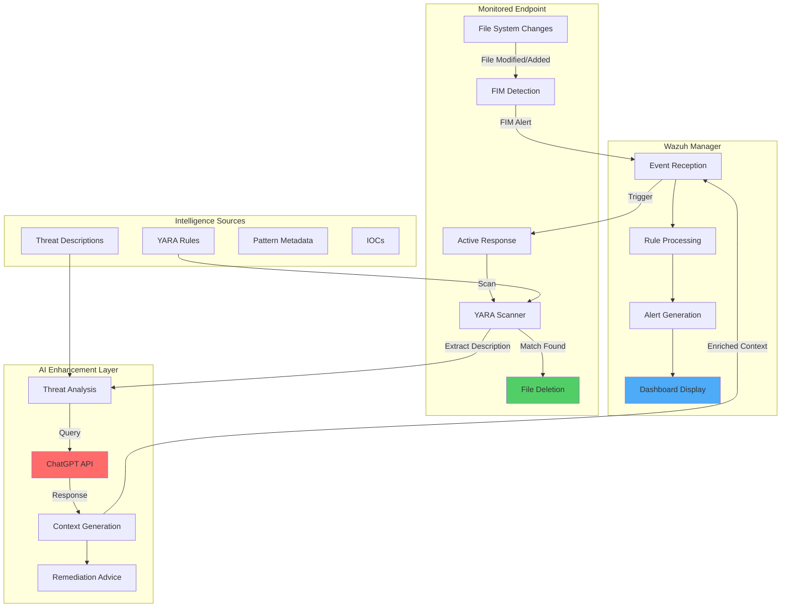

# Leveraging LLMs for Alert Enrichment with Wazuh and YARA

## Introduction

Large Language Models (LLMs) have revolutionized how we process and analyze security data. By integrating AI capabilities like ChatGPT with traditional security tools, we can automatically enrich security alerts with human-like intelligence and contextual information that helps security teams understand threats better and respond more effectively.

This integration combines the pattern-matching power of YARA with the analytical capabilities of ChatGPT to provide:

- 🧠 **Intelligent Analysis**: AI-powered threat interpretation and context
- 📝 **Detailed Descriptions**: Comprehensive explanations of malware behavior
- 🎯 **Impact Assessment**: Understand potential damage and attack vectors
- 🛠️ **Remediation Guidance**: Actionable steps for threat mitigation
- 🚀 **Automated Enrichment**: No manual research required
- 📊 **Enhanced Reporting**: Rich, contextual security reports

## Architecture Overview

### Enhanced YARA-ChatGPT Integration



### Key Enhancement Components

1. **YARA Pattern Detection**: Identifies malware using signature-based rules
2. **Metadata Extraction**: Pulls threat descriptions from YARA rule metadata
3. **LLM Integration**: Queries ChatGPT for detailed threat analysis
4. **Automated Response**: Removes detected malware files
5. **Alert Enrichment**: Combines technical detection with AI-generated insights

## Prerequisites and Setup

### Infrastructure Requirements

| Component | Requirements |
|-----------|-------------|
| **Ubuntu 22.04** | YARA integration with ChatGPT log enrichment |
| **Windows 11** | YARA integration with ChatGPT log enrichment |
| **ChatGPT API** | OpenAI API key with sufficient credits |
| **Wazuh Version** | 4.5.0 or higher |
| **YARA Version** | 4.5.1 or higher |

### API Configuration

Before starting, obtain your ChatGPT API key:

1. Visit [OpenAI Platform](https://platform.openai.com/)
2. Create an account or sign in
3. Navigate to API Keys section
4. Generate a new API key
5. Choose your preferred model (e.g., `gpt-4-turbo`)

## Ubuntu 22.04 Configuration

### Phase 1: Install YARA with Enhanced Features

```bash
# Install dependencies
sudo apt update
sudo apt install -y make gcc autoconf libtool libssl-dev pkg-config jq curl

# Download and compile YARA 4.5.1
sudo curl -LO https://github.com/VirusTotal/yara/archive/v4.5.1.tar.gz
sudo tar -xvzf v4.5.1.tar.gz -C /usr/local/bin/ && rm -f v4.5.1.tar.gz
cd /usr/local/bin/yara-4.5.1/
sudo ./bootstrap.sh && sudo ./configure && sudo make && sudo make install && sudo make check
sudo ldconfig

# Verify installation
yara --version
```

### Phase 2: Download Enhanced YARA Rules

```bash
# Create rules directory
sudo mkdir -p /var/ossec/active-response/yara/rules

# Download Valhalla rules with metadata
sudo curl 'https://valhalla.nextron-systems.com/api/v1/get' \
-H 'Accept: text/html,application/xhtml+xml,application/xml;q=0.9,*/*;q=0.8' \
-H 'Accept-Language: en-US,en;q=0.5' \
--compressed \
-H 'Referer: https://valhalla.nextron-systems.com/' \
-H 'Content-Type: application/x-www-form-urlencoded' \
-H 'DNT: 1' -H 'Connection: keep-alive' -H 'Upgrade-Insecure-Requests: 1' \
--data 'demo=demo&apikey=1111111111111111111111111111111111111111111111111111111111111111&format=text' \
-o /var/ossec/active-response/yara/rules/yara_rules.yar

# Set proper permissions
sudo chown root:wazuh /var/ossec/active-response/yara/rules/yara_rules.yar
sudo chmod 750 /var/ossec/active-response/yara/rules/yara_rules.yar
```

### Phase 3: Create Enhanced Active Response Script

Create `/var/ossec/active-response/bin/yara.sh` with ChatGPT integration:

```bash
#!/bin/bash
# Wazuh - YARA active response with ChatGPT enrichment
# Copyright (C) 2015-2024, Wazuh Inc.
#
# This program is free software; you can redistribute it
# and/or modify it under the terms of the GNU General Public
# License (version 2) as published by the FSF - Free Software
# Foundation.

#------------------------- Configuration -------------------------#

# ChatGPT API Configuration
API_KEY="<YOUR_API_KEY>"
OPENAI_MODEL="<YOUR_MODEL>" # e.g., gpt-4-turbo

# Set LOG_FILE path
LOG_FILE="logs/active-responses.log"

#------------------------- Gather parameters -------------------------#

# Extra arguments
read INPUT_JSON
YARA_PATH=$(echo $INPUT_JSON | jq -r .parameters.extra_args[1])
YARA_RULES=$(echo $INPUT_JSON | jq -r .parameters.extra_args[3])
FILENAME=$(echo $INPUT_JSON | jq -r .parameters.alert.syscheck.path)

# Wait for file to be completely written
size=0
actual_size=$(stat -c %s ${FILENAME})
while [ ${size} -ne ${actual_size} ]; do
    sleep 1
    size=${actual_size}
    actual_size=$(stat -c %s ${FILENAME})
done

#----------------------- Analyze parameters -----------------------#

if [[ ! $YARA_PATH ]] || [[ ! $YARA_RULES ]]
then
    echo "wazuh-YARA: ERROR - YARA active response error. YARA path and rules parameters are mandatory." >> ${LOG_FILE}
    exit 1
fi

#------------------------- Main workflow --------------------------#

# Execute YARA scan with metadata
YARA_output="$("${YARA_PATH}"/yara -w -r -m "$YARA_RULES" "$FILENAME")"

if [[ $YARA_output != "" ]]
then
    # Attempt to delete the malicious file
    if rm -rf "$FILENAME"; then
        echo "wazuh-YARA: INFO - Successfully deleted $FILENAME" >> ${LOG_FILE}
    else
        echo "wazuh-YARA: INFO - Unable to delete $FILENAME" >> ${LOG_FILE}
    fi

    # Flag to check if API key is invalid
    api_key_invalid=false

    # Process each detected rule
    while read -r line; do
        # Extract the description from YARA metadata
        description=$(echo "$line" | grep -oP '(?<=description=").*?(?=")')
        
        if [[ $description != "" ]]; then
            # Prepare ChatGPT API request
            payload=$(jq -n \
                --arg desc "$description" \
                --arg model "$OPENAI_MODEL" \
                '{
                    model: $model,
                    messages: [
                        {
                            role: "system",
                            content: "In one paragraph, tell me about the impact and how to mitigate \($desc)"
                        }
                    ],
                    temperature: 1,
                    max_tokens: 256,
                    top_p: 1,
                    frequency_penalty: 0,
                    presence_penalty: 0
                }')

            # Query ChatGPT for threat analysis
            chatgpt_response=$(curl -s -X POST "https://api.openai.com/v1/chat/completions" \
                -H "Content-Type: application/json" \
                -H "Authorization: Bearer $API_KEY" \
                -d "$payload")

            # Check for API errors
            if echo "$chatgpt_response" | grep -q "invalid_request_error"; then
                api_key_invalid=true
                echo "wazuh-YARA: ERROR - Invalid ChatGPT API key" >> ${LOG_FILE}
                echo "wazuh-YARA: INFO - Scan result: $line | chatgpt_response: none" >> ${LOG_FILE}
            else
                # Extract the AI response
                response_text=$(echo "$chatgpt_response" | jq -r '.choices[0].message.content')

                if [[ $response_text == "null" ]]; then
                    echo "wazuh-YARA: ERROR - ChatGPT API returned null response: $chatgpt_response" >> ${LOG_FILE}
                else
                    # Combine YARA detection with AI enrichment
                    combined_output="wazuh-YARA: INFO - Scan result: $line | chatgpt_response: $response_text"
                    echo "$combined_output" >> ${LOG_FILE}
                fi
            fi
        else
            # No description found, log without enrichment
            echo "wazuh-YARA: INFO - Scan result: $line" >> ${LOG_FILE}
        fi
    done <<< "$YARA_output"

    # Log API key status if invalid
    if $api_key_invalid; then
        echo "wazuh-YARA: INFO - API key is invalid. ChatGPT response omitted." >> ${LOG_FILE}
    fi
else
    echo "wazuh-YARA: INFO - No YARA rule matched." >> ${LOG_FILE}
fi

exit 0;
```

**Important**: Replace `<YOUR_API_KEY>` and `<YOUR_MODEL>` with your actual OpenAI credentials.

Set proper permissions:

```bash
sudo chown root:wazuh /var/ossec/active-response/bin/yara.sh
sudo chmod 750 /var/ossec/active-response/bin/yara.sh
```

### Phase 4: Configure FIM Monitoring

Add to `/var/ossec/etc/ossec.conf`:

```xml
<syscheck>
  <directories realtime="yes">/home</directories>
</syscheck>
```

Restart the agent:

```bash
sudo systemctl restart wazuh-agent
```

## Windows 11 Configuration

### Phase 1: Install Dependencies

```powershell
# Install Python from python.org
# During installation, ensure:
# - "Install launcher for all users" is checked
# - "Add python.exe to PATH" is checked

# Install Visual C++ Redistributable from Microsoft

# Download and extract YARA
Invoke-WebRequest -Uri https://github.com/VirusTotal/yara/releases/download/v4.5.1/yara-v4.5.1-2298-win64.zip -OutFile yara-v4.5.1-2298-win64.zip
Expand-Archive yara-v4.5.1-2298-win64.zip; Remove-Item yara-v4.5.1-2298-win64.zip

# Create YARA directory
mkdir 'C:\Program Files (x86)\ossec-agent\active-response\bin\yara\'
cp .\yara64.exe 'C:\Program Files (x86)\ossec-agent\active-response\bin\yara\'
```

### Phase 2: Download YARA Rules

```powershell
# Install valhallaAPI
python -m pip install valhallaAPI

# Download rules
python -c "from valhallaAPI.valhalla import ValhallaAPI; v = ValhallaAPI(api_key='1111111111111111111111111111111111111111111111111111111111111111'); response = v.get_rules_text(); open('yara_rules.yar', 'w').write(response)"

# Create rules directory and copy
mkdir 'C:\Program Files (x86)\ossec-agent\active-response\bin\yara\rules\'
cp yara_rules.yar 'C:\Program Files (x86)\ossec-agent\active-response\bin\yara\rules\'
```

### Phase 3: Create Enhanced Python Script

Create `C:\Program Files (x86)\ossec-agent\active-response\bin\yara.py`:

```python
import os
import subprocess
import json
import re
import requests
import time

# Configuration
API_KEY = '<YOUR_API_KEY>'
OPENAI_MODEL = '<YOUR_MODEL>'  # e.g., gpt-4-turbo

# Determine log file path based on architecture
if os.environ['PROCESSOR_ARCHITECTURE'].endswith('86'):
    log_file_path = os.path.join(os.environ['ProgramFiles'], 'ossec-agent', 'active-response', 'active-responses.log')
else:
    log_file_path = os.path.join(os.environ['ProgramFiles(x86)'], 'ossec-agent', 'active-response', 'active-responses.log')

def log_message(message):
    """Log message to Wazuh active response log"""
    with open(log_file_path, 'a') as log_file:
        log_file.write(message + '\n')

def read_input():
    """Read JSON input from stdin"""
    return input()

def get_syscheck_file_path(json_file_path):
    """Extract file path from Wazuh alert JSON"""
    with open(json_file_path, 'r') as json_file:
        data = json.load(json_file)
        return data['parameters']['alert']['syscheck']['path']

def run_yara_scan(yara_exe_path, yara_rules_path, syscheck_file_path):
    """Execute YARA scan with metadata extraction"""
    try:
        result = subprocess.run([yara_exe_path, '-m', yara_rules_path, syscheck_file_path], 
                              capture_output=True, text=True, timeout=30)
        return result.stdout.strip()
    except subprocess.TimeoutExpired:
        log_message("wazuh-YARA: ERROR - YARA scan timed out")
        return None
    except Exception as e:
        log_message(f"wazuh-YARA: ERROR - Error running YARA scan: {str(e)}")
        return None

def extract_description(yara_output):
    """Extract threat description from YARA metadata"""
    match = re.search(r'description="([^"]+)"', yara_output)
    if match:
        return match.group(1)
    else:
        return None

def query_chatgpt(description):
    """Query ChatGPT for threat analysis and mitigation advice"""
    headers = {
        'Authorization': f'Bearer {API_KEY}',
        'Content-Type': 'application/json'
    }
    
    data = {
        'model': OPENAI_MODEL,
        'messages': [
            {
                'role': 'system', 
                'content': f'In one paragraph, tell me about the impact and how to mitigate {description}'
            }
        ],
        'temperature': 1,
        'max_tokens': 256,
        'top_p': 1,
        'frequency_penalty': 0,
        'presence_penalty': 0
    }
    
    try:
        response = requests.post('https://api.openai.com/v1/chat/completions', 
                               headers=headers, json=data, timeout=30)
        
        if response.status_code == 200:
            return response.json()['choices'][0]['message']['content']
        elif response.status_code == 401:  # Unauthorized (invalid API key)
            log_message("wazuh-YARA: ERROR - Invalid ChatGPT API key")
            return None
        else:
            log_message(f"wazuh-YARA: ERROR - ChatGPT API error: {response.status_code} {response.text}")
            return None
    except requests.exceptions.Timeout:
        log_message("wazuh-YARA: ERROR - ChatGPT API request timed out")
        return None
    except Exception as e:
        log_message(f"wazuh-YARA: ERROR - Error querying ChatGPT: {str(e)}")
        return None

def delete_file(file_path):
    """Attempt to delete the malicious file"""
    try:
        os.remove(file_path)
        if not os.path.exists(file_path):
            log_message(f"wazuh-YARA: INFO - Successfully deleted {file_path}")
            return True
        else:
            log_message(f"wazuh-YARA: INFO - Unable to delete {file_path}")
            return False
    except Exception as e:
        log_message(f"wazuh-YARA: ERROR - Error deleting file: {str(e)}")
        return False

def main():
    """Main execution flow"""
    json_file_path = r"C:\Program Files (x86)\ossec-agent\active-response\stdin.txt"
    yara_exe_path = r"C:\Program Files (x86)\ossec-agent\active-response\bin\yara\yara64.exe"
    yara_rules_path = r"C:\Program Files (x86)\ossec-agent\active-response\bin\yara\rules\yara_rules.yar"

    try:
        # Read input and parse file path
        input_data = read_input()
        
        with open(json_file_path, 'w') as json_file:
            json_file.write(input_data)

        syscheck_file_path = get_syscheck_file_path(json_file_path)

        # Run YARA scan
        yara_output = run_yara_scan(yara_exe_path, yara_rules_path, syscheck_file_path)
        
        if yara_output:
            description = extract_description(yara_output)

            if description:
                # Query ChatGPT for analysis
                chatgpt_response = query_chatgpt(description)
                
                if chatgpt_response:
                    combined_output = f"wazuh-YARA: INFO - Scan result: {yara_output} | chatgpt_response: {chatgpt_response}"
                else:
                    combined_output = f"wazuh-YARA: INFO - Scan result: {yara_output} | chatgpt_response: None"
                
                log_message(combined_output)
                
                # Delete the malicious file
                delete_file(syscheck_file_path)
            else:
                log_message(f"wazuh-YARA: INFO - Scan result: {yara_output}")
                log_message("wazuh-YARA: WARNING - No description found in YARA rule metadata")
        else:
            log_message("wazuh-YARA: INFO - YARA scan returned no output or failed")
    
    except Exception as e:
        log_message(f"wazuh-YARA: ERROR - Main execution error: {str(e)}")

if __name__ == "__main__":
    main()
```

**Important**: Replace `<YOUR_API_KEY>` and `<YOUR_MODEL>` with your actual OpenAI credentials.

### Phase 4: Create Executable

```powershell
# Install PyInstaller
pip install pyinstaller

# Create executable
pyinstaller -F "C:\Program Files (x86)\ossec-agent\active-response\bin\yara.py"

# Copy executable to proper location
cp dist\yara.exe 'C:\Program Files (x86)\ossec-agent\active-response\bin\'
```

### Phase 5: Configure FIM Monitoring

Add to `C:\Program Files (x86)\ossec-agent\ossec.conf`:

```xml
<syscheck>
  <directories realtime="yes">C:\Users\*\Downloads</directories>
</syscheck>
```

Restart the agent:

```powershell
Restart-Service -Name wazuh
```

## Wazuh Server Configuration

### Phase 1: Enhanced Decoders

Add to `/var/ossec/etc/decoders/local_decoder.xml`:

```xml
<!-- Enhanced YARA Decoder with ChatGPT fields -->

<decoder name="YARA_decoder">
  <prematch>wazuh-YARA:</prematch>
</decoder>

<decoder name="YARA_child">
  <parent>YARA_decoder</parent>
  <regex type="pcre2">wazuh-YARA: (\S+)</regex>
  <order>YARA.log_type</order>
</decoder>

<decoder name="YARA_child">
  <parent>YARA_decoder</parent>
  <regex type="pcre2">Scan result: (\S+)\s+</regex>
  <order>YARA.rule_name</order>
</decoder>

<decoder name="YARA_child">
  <parent>YARA_decoder</parent>
  <regex type="pcre2">\[description="([^"]+)",</regex>
  <order>YARA.rule_description</order>
</decoder>

<decoder name="YARA_child">
  <parent>YARA_decoder</parent>
  <regex type="pcre2">author="([^"]+)",</regex>
  <order>YARA.rule_author</order>
</decoder>

<decoder name="YARA_child">
  <parent>YARA_decoder</parent>
  <regex type="pcre2">reference="([^"]+)",</regex>
  <order>YARA.reference</order>
</decoder>

<decoder name="YARA_child">
  <parent>YARA_decoder</parent>
  <regex type="pcre2">date="([^"]+)",</regex>
  <order>YARA.published_date</order>
</decoder>

<decoder name="YARA_child">
  <parent>YARA_decoder</parent>
  <regex type="pcre2">score =(\d+),</regex>
  <order>YARA.threat_score</order>
</decoder>

<decoder name="YARA_child">
  <parent>YARA_decoder</parent>
  <regex type="pcre2">customer="([^"]+)",</regex>
  <order>YARA.api_customer</order>
</decoder>

<decoder name="YARA_child">
  <parent>YARA_decoder</parent>
  <regex type="pcre2">hash1="([^"]+)",</regex>
  <order>YARA.file_hash</order>
</decoder>

<decoder name="YARA_child">
  <parent>YARA_decoder</parent>
  <regex type="pcre2">tags="([^"]+)",</regex>
  <order>YARA.tags</order>
</decoder>

<decoder name="YARA_child">
  <parent>YARA_decoder</parent>
  <regex type="pcre2">minimum_YARA="([^"]+)"\]</regex>
  <order>YARA.minimum_YARA_version</order>
</decoder>

<decoder name="YARA_child">
  <parent>YARA_decoder</parent>
  <regex type="pcre2">\] (.*) \|</regex>
  <order>YARA.scanned_file</order>
</decoder>

<!-- ChatGPT enrichment fields -->
<decoder name="YARA_child">
  <parent>YARA_decoder</parent>
  <regex type="pcre2">chatgpt_response: (.*)</regex>
  <order>YARA.chatgpt_response</order>
</decoder>

<decoder name="YARA_child">
  <parent>YARA_decoder</parent>
  <regex type="pcre2">Successfully deleted (.*)</regex>
  <order>YARA.file_deleted</order>
</decoder>

<decoder name="YARA_child">
  <parent>YARA_decoder</parent>
  <regex type="pcre2">Unable to delete (.*)</regex>
  <order>YARA.file_not_deleted</order>
</decoder>
```

### Phase 2: Enhanced Rules

Add to `/var/ossec/etc/rules/local_rules.xml`:

```xml
<group name="syscheck,">
  <!-- Linux FIM Rules -->
  <rule id="100300" level="5">
    <if_sid>550</if_sid>
    <field name="file">/home</field>
    <description>File modified in /home directory.</description>
  </rule>

  <rule id="100301" level="5">
    <if_sid>554</if_sid>
    <field name="file">/home</field>
    <description>File added to /home directory.</description>
  </rule>
  
  <!-- Windows FIM Rules -->
  <rule id="100302" level="5">
    <if_sid>550</if_sid>
    <field name="file" type="pcre2">(?i)C:\\Users.+Downloads</field>
    <description>File modified in the downloads directory.</description>
  </rule>

  <rule id="100303" level="5">
    <if_sid>554</if_sid>
    <field name="file" type="pcre2">(?i)C:\\Users.+Downloads</field>
    <description>File added to the downloads directory.</description>
  </rule>
</group>

<group name="yara,">
  <!-- Base YARA Rules -->
  <rule id="108000" level="0">
    <decoded_as>YARA_decoder</decoded_as>
    <description>YARA grouping rule</description>
  </rule>
  
  <!-- Malware Detection with AI Enrichment -->
  <rule id="108001" level="10">
    <if_sid>108000</if_sid>
    <match>wazuh-YARA: INFO - Scan result: </match>
    <description>File "$(YARA.scanned_file)" is a positive match for YARA rule: $(YARA.rule_name)</description>
  </rule>

  <!-- Successful File Removal -->
  <rule id="108002" level="5">
    <if_sid>108000</if_sid>
    <field name="YARA.file_deleted">\.</field>
    <description>Active response successfully removed malicious file "$(YARA.file_deleted)"</description>
  </rule>

  <!-- Failed File Removal (Critical) -->
  <rule id="108003" level="12">
    <if_sid>108000</if_sid>
    <field name="YARA.file_not_deleted">\.</field>
    <description>Active response unable to delete malicious file "$(YARA.file_not_deleted)"</description>
  </rule>
  
  <!-- High-severity threats -->
  <rule id="108004" level="12">
    <if_sid>108001</if_sid>
    <field name="YARA.threat_score" type="pcre2">^[8-9]\d|^100$</field>
    <description>High-severity malware detected: $(YARA.rule_name) (Score: $(YARA.threat_score))</description>
    <group>high_severity,malware,</group>
  </rule>
  
  <!-- Ransomware detection -->
  <rule id="108005" level="14">
    <if_sid>108001</if_sid>
    <field name="YARA.tags" type="pcre2">ransomware|crypto|locker</field>
    <description>Ransomware detected: $(YARA.rule_name)</description>
    <group>ransomware,critical,</group>
  </rule>
  
  <!-- APT malware detection -->
  <rule id="108006" level="13">
    <if_sid>108001</if_sid>
    <field name="YARA.tags" type="pcre2">apt|nation|state</field>
    <description>APT malware detected: $(YARA.rule_name)</description>
    <group>apt,targeted_attack,</group>
  </rule>
  
  <!-- Banking trojan detection -->
  <rule id="108007" level="12">
    <if_sid>108001</if_sid>
    <field name="YARA.tags" type="pcre2">banking|trojan|stealer</field>
    <description>Banking trojan detected: $(YARA.rule_name)</description>
    <group>banking_trojan,credential_theft,</group>
  </rule>
</group>
```

### Phase 3: Active Response Configuration

Add to `/var/ossec/etc/ossec.conf`:

```xml
<ossec_config>
  <!-- Linux YARA with ChatGPT -->
  <command>
    <name>yara_linux</name>
    <executable>yara.sh</executable>
    <extra_args>-yara_path /usr/local/bin -yara_rules /var/ossec/active-response/yara/rules/yara_rules.yar</extra_args>
    <timeout_allowed>no</timeout_allowed>
  </command>

  <!-- Windows YARA with ChatGPT -->
  <command>
    <name>yara_windows</name>
    <executable>yara.exe</executable>
    <timeout_allowed>no</timeout_allowed>
  </command>

  <!-- Active Response Triggers -->
  <active-response>
    <disabled>no</disabled>
    <command>yara_linux</command>
    <location>local</location>
    <rules_id>100300,100301</rules_id>
  </active-response>

  <active-response>
    <disabled>no</disabled>
    <command>yara_windows</command>
    <location>local</location>
    <rules_id>100302,100303</rules_id>
  </active-response>
</ossec_config>
```

Restart Wazuh manager:

```bash
sudo systemctl restart wazuh-manager
```

## Testing the Integration

### Ubuntu Testing

Download test malware samples:

```bash
# Download known malware samples for testing
curl "https://wazuh-demo.s3-us-west-1.amazonaws.com/mirai" > /home/mirai
curl "https://wazuh-demo.s3-us-west-1.amazonaws.com/xbash" > /home/xbash  
curl "https://wazuh-demo.s3-us-west-1.amazonaws.com/webshell" > /home/webshell
```

### Windows Testing

```powershell
# Download test samples
curl "https://wazuh-demo.s3-us-west-1.amazonaws.com/mirai" -o $env:USERPROFILE\Downloads\mirai
curl "https://wazuh-demo.s3-us-west-1.amazonaws.com/xbash" -o $env:USERPROFILE\Downloads\xbash
curl "https://wazuh-demo.s3-us-west-1.amazonaws.com/webshell" -o $env:USERPROFILE\Downloads\webshell
```

## Alert Analysis and Interpretation

### Enhanced Alert Fields

The integration provides enriched alerts with the following fields:

| Field | Description | Example |
|-------|-------------|---------|
| `YARA.rule_name` | YARA rule that matched | `Mirai_Botnet_Generic` |
| `YARA.rule_description` | Threat description from rule | `Mirai IoT botnet malware` |
| `YARA.chatgpt_response` | AI-generated analysis | `Mirai is an IoT botnet that infects...` |
| `YARA.threat_score` | Threat severity score | `85` |
| `YARA.tags` | Threat classification tags | `botnet,iot,ddos` |
| `YARA.file_deleted` | Status of file removal | `/home/user/mirai` |

### Sample Enriched Alert

```json
{
  "timestamp": "2024-01-22T10:30:15.123Z",
  "agent": {
    "id": "001",
    "name": "ubuntu-endpoint"
  },
  "rule": {
    "id": "108001",
    "level": 10,
    "description": "File \"/home/user/mirai\" is a positive match for YARA rule: Mirai_Botnet_Generic"
  },
  "data": {
    "YARA": {
      "rule_name": "Mirai_Botnet_Generic",
      "rule_description": "Mirai IoT botnet malware targeting Linux systems",
      "chatgpt_response": "Mirai is a self-propagating botnet that primarily targets IoT devices running Linux. It spreads by brute-forcing default credentials and can launch devastating DDoS attacks. To mitigate: immediately isolate infected devices, change default credentials across all IoT devices, implement network segmentation, and deploy proper access controls.",
      "threat_score": "85",
      "tags": "botnet,iot,ddos,linux",
      "scanned_file": "/home/user/mirai",
      "file_deleted": "/home/user/mirai"
    }
  }
}
```

## Dashboard Visualization

### Custom Wazuh Visualizations

To view enriched alerts in Wazuh dashboard:

1. **Navigate to Security Events**
2. **Add filter**: `rule.groups:yara`
3. **Create custom visualizations** for:
   - Threat severity distribution
   - Top malware families detected
   - AI-enriched threat intelligence
   - Remediation success rates

### Sample Dashboard Queries

```json
{
  "query": {
    "bool": {
      "must": [
        {"match": {"rule.groups": "yara"}},
        {"exists": {"field": "data.YARA.chatgpt_response"}}
      ],
      "filter": [
        {
          "range": {
            "@timestamp": {
              "gte": "now-24h"
            }
          }
        }
      ]
    }
  },
  "aggs": {
    "threat_scores": {
      "histogram": {
        "field": "data.YARA.threat_score",
        "interval": 10
      }
    }
  }
}
```

## Advanced Configuration

### Custom ChatGPT Prompts

Enhance the ChatGPT prompt for more specific analysis:

```python
def create_enhanced_prompt(description, file_path, yara_metadata):
    """Create context-aware prompt for ChatGPT"""
    
    prompt = f"""
    Analyze this malware detection:
    
    Threat: {description}
    File Path: {file_path}
    Detection Metadata: {yara_metadata}
    
    Please provide:
    1. Technical analysis of the threat
    2. Potential impact and attack vectors
    3. Specific mitigation steps
    4. Recommended preventive measures
    
    Format the response as a structured analysis suitable for security operations.
    """
    
    return prompt
```

### Multi-Model Analysis

Use different AI models for different analysis types:

```python
def query_multiple_models(description):
    """Query multiple AI models for comprehensive analysis"""
    
    models = {
        'gpt-4-turbo': 'technical_analysis',
        'gpt-3.5-turbo': 'quick_assessment',
        'claude-2': 'detailed_writeup'
    }
    
    responses = {}
    for model, purpose in models.items():
        response = query_ai_model(model, description, purpose)
        responses[purpose] = response
    
    return responses
```

### Cost Optimization

Implement smart caching and cost controls:

```python
import hashlib
import json
from datetime import datetime, timedelta

class ChatGPTCache:
    def __init__(self, cache_file='/tmp/chatgpt_cache.json', ttl_hours=24):
        self.cache_file = cache_file
        self.ttl = timedelta(hours=ttl_hours)
        self.cache = self.load_cache()
    
    def get_cache_key(self, description):
        """Generate cache key for description"""
        return hashlib.md5(description.encode()).hexdigest()
    
    def get_cached_response(self, description):
        """Get cached response if available and not expired"""
        key = self.get_cache_key(description)
        
        if key in self.cache:
            entry = self.cache[key]
            created = datetime.fromisoformat(entry['timestamp'])
            
            if datetime.now() - created < self.ttl:
                return entry['response']
        
        return None
    
    def cache_response(self, description, response):
        """Cache AI response"""
        key = self.get_cache_key(description)
        self.cache[key] = {
            'response': response,
            'timestamp': datetime.now().isoformat()
        }
        self.save_cache()
    
    def load_cache(self):
        """Load cache from file"""
        try:
            with open(self.cache_file, 'r') as f:
                return json.load(f)
        except (FileNotFoundError, json.JSONDecodeError):
            return {}
    
    def save_cache(self):
        """Save cache to file"""
        with open(self.cache_file, 'w') as f:
            json.dump(self.cache, f)
```

## Monitoring and Metrics

### Track AI Enhancement Performance

```python
def track_enrichment_metrics():
    """Track ChatGPT enrichment metrics"""
    
    metrics = {
        'total_scans': 0,
        'enriched_alerts': 0,
        'api_failures': 0,
        'cache_hits': 0,
        'avg_response_time': 0,
        'cost_estimate': 0
    }
    
    # Calculate metrics from logs
    # Send to monitoring system
    return metrics
```

### Alert Quality Assessment

```python
def assess_alert_quality(alert):
    """Assess the quality of AI-enriched alerts"""
    
    quality_score = 0
    
    # Check for AI response presence
    if 'chatgpt_response' in alert['data']['YARA']:
        quality_score += 40
    
    # Check response length and detail
    response = alert['data']['YARA'].get('chatgpt_response', '')
    if len(response) > 100:
        quality_score += 30
    
    # Check for actionable information
    actionable_terms = ['mitigate', 'prevent', 'isolate', 'remove', 'update']
    if any(term in response.lower() for term in actionable_terms):
        quality_score += 30
    
    return quality_score
```

## Troubleshooting

### Common Issues

#### API Key Problems
```bash
# Check API key validity
curl -H "Authorization: Bearer $API_KEY" https://api.openai.com/v1/models

# Monitor API usage
tail -f /var/ossec/logs/active-responses.log | grep "API key"
```

#### Rate Limiting
```python
def handle_rate_limiting(func):
    """Decorator to handle API rate limiting"""
    import time
    import random
    
    def wrapper(*args, **kwargs):
        max_retries = 3
        base_delay = 1
        
        for attempt in range(max_retries):
            try:
                return func(*args, **kwargs)
            except RateLimitError:
                if attempt < max_retries - 1:
                    delay = base_delay * (2 ** attempt) + random.uniform(0, 1)
                    time.sleep(delay)
                else:
                    raise
        
    return wrapper
```

#### Performance Issues
```bash
# Monitor response times
grep "chatgpt_response" /var/ossec/logs/active-responses.log | \
awk '{print $1 $2}' | \
xargs -I {} sh -c 'echo "Response time: $(date -d "{}" +%s)"'

# Check system resources
top -p $(pgrep -f yara)
```

## Security Considerations

### API Key Protection

1. **Use Environment Variables**:
   ```bash
   export OPENAI_API_KEY="your-key-here"
   ```

2. **Restrict File Permissions**:
   ```bash
   chmod 600 /var/ossec/active-response/bin/yara.sh
   chown root:wazuh /var/ossec/active-response/bin/yara.sh
   ```

3. **Network Security**:
   - Use HTTPS for all API calls
   - Consider using a proxy for outbound requests
   - Implement request signing if available

### Data Privacy

Ensure sensitive information is not sent to external APIs:

```python
def sanitize_for_ai(description):
    """Remove sensitive information from AI queries"""
    
    # Remove IP addresses
    description = re.sub(r'\b\d{1,3}\.\d{1,3}\.\d{1,3}\.\d{1,3}\b', '[IP]', description)
    
    # Remove file paths
    description = re.sub(r'[A-Za-z]:\\[^\s]*', '[PATH]', description)
    description = re.sub(r'/[^\s]*', '[PATH]', description)
    
    # Remove potential usernames
    description = re.sub(r'user[_-]?\w+', '[USER]', description, flags=re.IGNORECASE)
    
    return description
```

## Conclusion

Integrating LLMs like ChatGPT with YARA and Wazuh creates a powerful AI-enhanced security monitoring system that provides:

- 🧠 **Intelligent Analysis**: AI-powered threat interpretation
- 📈 **Enhanced Context**: Rich, actionable security insights  
- ⚡ **Automated Response**: Immediate threat containment
- 📊 **Better Reporting**: Context-rich security reports
- 🎯 **Improved Decisions**: Data-driven security operations

This integration represents the future of security operations where human expertise is augmented by AI capabilities, enabling security teams to respond faster and more effectively to emerging threats.

## Key Takeaways

1. **AI Augmentation**: Use AI to enhance, not replace, security analysis
2. **Cost Management**: Implement caching and smart querying strategies
3. **Quality Control**: Validate AI responses for accuracy and relevance
4. **Security First**: Protect API keys and sanitize sensitive data
5. **Continuous Improvement**: Monitor and refine AI prompts based on results

## Resources

- [OpenAI API Documentation](https://platform.openai.com/docs)
- [YARA Documentation](https://yara.readthedocs.io/)
- [Wazuh Active Response Guide](https://documentation.wazuh.com/current/user-manual/capabilities/active-response/)
- [ChatGPT Best Practices](https://platform.openai.com/docs/guides/gpt-best-practices)

---

*Revolutionize your security operations with AI-powered threat analysis! 🤖🛡️*