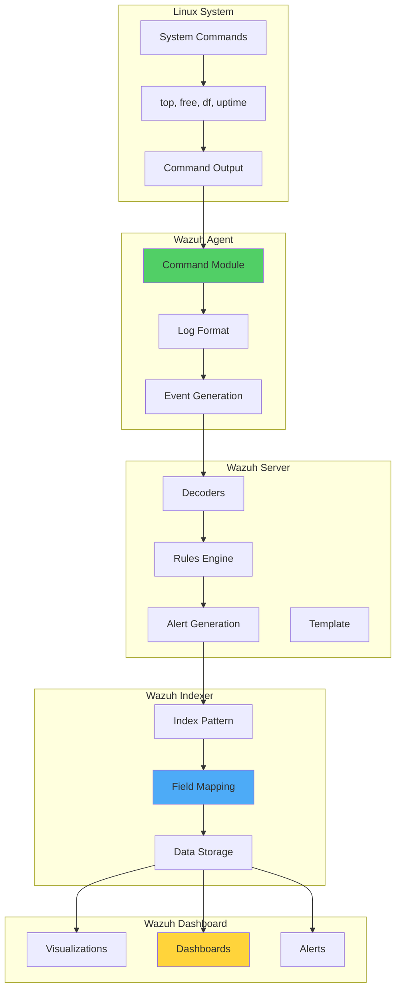

# Monitoring Linux Resource Usage with Wazuh

## Introduction

Monitoring Linux resources is crucial for optimizing performance and securing an organization's infrastructure. By maintaining comprehensive visibility into system resource utilization, organizations can proactively identify performance bottlenecks, detect potential security threats, and ensure reliable service delivery. Abnormal resource usage patterns often indicate ongoing malicious activities, making resource monitoring an essential component of security operations.

Wazuh, an open source security platform, provides powerful capabilities for monitoring Linux system resources through its command monitoring module. This integration enables:

- 🔍 **Real-time Metrics Collection**: Track CPU, memory, disk, and network usage
- 📊 **Custom Visualizations**: Build interactive dashboards for performance analysis
- 🚨 **Proactive Alerting**: Detect resource anomalies before they impact services
- 📈 **Historical Analysis**: Identify trends and patterns in resource consumption
- 🛡️ **Security Insights**: Correlate resource usage with potential threats

## Linux Performance Metrics

### Understanding Key Metrics

#### 1. CPU Usage

CPU usage represents the percentage of time the processor spends on non-idle tasks. Linux categorizes CPU time into several components:

```bash
top -bn1 | grep Cpu
# Output: %Cpu(s):  6.6 us,  2.0 sy,  0.0 ni, 91.3 id,  0.0 wa,  0.0 hi,  0.0 si,  0.0 st
```

**Components**:
- **us (user)**: Time running user processes
- **sy (system)**: Time running kernel operations
- **ni (nice)**: Time running nice priority processes
- **id (idle)**: Time spent idle
- **wa (iowait)**: Time waiting for I/O operations
- **hi (hardware interrupts)**: Time handling hardware interrupts
- **si (software interrupts)**: Time handling software interrupts
- **st (steal)**: Time stolen by hypervisor (virtualization)

**Calculation**:
```
Idle = idle + iowait
NonIdle = user + system + nice + hardirq + softirq + steal
Total = Idle + NonIdle
CPU Utilization (%) = (NonIdle / Total) * 100
```

#### 2. CPU Load

CPU load measures the average number of processes in the run queue:

```bash
uptime
# Output: 10:31:03 up  8:42,  2 users,  load average: 2.53, 2.61, 2.84
```

Where:
- 2.53 = 1-minute load average
- 2.61 = 5-minute load average
- 2.84 = 15-minute load average

#### 3. Memory Utilization

Memory usage shows the percentage of RAM currently in use:

```bash
free
#           total     used      free     shared     buff/cache     available
# Mem:      15Gi      7.1Gi     6.1Gi    940Mi      2.2Gi          7.0Gi
# Swap:     2.0Gi     945Mi     1.1Gi
```

**Calculation**:
```
Memory Utilization (%) = 100 - (((MemFree + Buffers + Cached) * 100) / TotalMemory)
```

#### 4. Disk Usage

Disk usage indicates the percentage of storage space occupied:

```bash
df -h /
# Filesystem       Size    Used    Avail   Use%   Mounted on
# /dev/nvme0n1p2   528G    390G    112G    78%    /
```

**Calculation**:
```
Disk Utilization (%) = (DiskUsed / DiskTotal) * 100
```

## Architecture Overview



## Implementation Guide

### Prerequisites

- **Wazuh Server**: Pre-built OVA 4.12 with all components
- **Ubuntu Endpoint**: Ubuntu 24.04 with Wazuh agent installed
- **Permissions**: Root access for configuration changes

### Phase 1: Configure Command Monitoring

Edit `/var/ossec/etc/ossec.conf` on the Ubuntu endpoint and add within the `<ossec_config>` block:

```xml
<!-- CPU, memory, disk metric -->
<localfile>
  <log_format>full_command</log_format>
  <command>echo $(top -bn1 | grep Cpu | awk '{print $2+$4+$6+$12+$14+$16}' ; free -m | awk 'NR==2{printf "%.2f\t\t\n", $3*100/$2 }' ; df -h | awk '$NF=="/"{print $5}'|sed 's/%//g')</command>
  <alias>general_health_metrics</alias>
  <out_format>$(timestamp) $(hostname) general_health_check: $(log)</out_format>
  <frequency>30</frequency>
</localfile>

<!-- load average metrics -->
<localfile>
  <log_format>full_command</log_format>
  <command>uptime | grep load | awk '{print $(NF-2),$(NF-1),$NF}' | sed 's/\,\([0-9]\{1,2\}\)/.\1/g'</command>
  <alias>load_average_metrics</alias>
  <out_format>$(timestamp) $(hostname) load_average_check: $(log)</out_format>
  <frequency>30</frequency>
</localfile>

<!-- memory metrics -->
<localfile>
  <log_format>full_command</log_format>
  <command>free --bytes| awk 'NR==2{print $3,$7}'</command>
  <alias>memory_metrics</alias>
  <out_format>$(timestamp) $(hostname) memory_check: $(log)</out_format>
  <frequency>30</frequency>
</localfile>

<!-- disk metrics -->
<localfile>
  <log_format>full_command</log_format>
  <command>df -B1 | awk '$NF=="/"{print $3,$4}'</command>
  <alias>disk_metrics</alias>
  <out_format>$(timestamp) $(hostname) disk_check: $(log)</out_format>
  <frequency>30</frequency>
</localfile>
```

Enable remote commands (required for centralized configuration):

```bash
echo "logcollector.remote_commands=1" >> /var/ossec/etc/local_internal_options.conf
sudo systemctl restart wazuh-agent
```

### Phase 2: Configure Wazuh Server

#### Add Custom Decoders

Create or update `/var/ossec/etc/decoders/local_decoder.xml`:

```xml
<!-- CPU, memory, disk metric -->
<decoder name="general_health_check">
  <program_name>general_health_check</program_name>
</decoder>

<decoder name="general_health_check1">
  <parent>general_health_check</parent>
  <prematch>ossec: output: 'general_health_metrics':\.</prematch>
  <regex offset="after_prematch">(\S+) (\S+) (\S+)</regex>
  <order>cpu_usage_%, memory_usage_%, disk_usage_%</order>
</decoder>

<!-- load average metric -->
<decoder name="load_average_check">
  <program_name>load_average_check</program_name>
</decoder>

<decoder name="load_average_check1">
  <parent>load_average_check</parent>
  <prematch>ossec: output: 'load_average_metrics':\.</prematch>
  <regex offset="after_prematch">(\S+), (\S+), (\S+)</regex>
  <order>1min_loadAverage, 5mins_loadAverage, 15mins_loadAverage</order>
</decoder>

<!-- Memory metric -->
<decoder name="memory_check">
  <program_name>memory_check</program_name>
</decoder>

<decoder name="memory_check1">
  <parent>memory_check</parent>
  <prematch>ossec: output: 'memory_metrics':\.</prematch>
  <regex offset="after_prematch">(\S+) (\S+)</regex>
  <order>memory_used_bytes, memory_available_bytes</order>
</decoder>

<!-- Disk metric -->
<decoder name="disk_check">
  <program_name>disk_check</program_name>
</decoder>

<decoder name="disk_check1">
  <parent>disk_check</parent>
  <prematch>ossec: output: 'disk_metrics':\.</prematch>
  <regex offset="after_prematch">(\S+) (\S+)</regex>
  <order>disk_used_bytes, disk_free_bytes</order>
</decoder>
```

#### Add Detection Rules

Create or update `/var/ossec/etc/rules/local_rules.xml`:

```xml
<group name="performance_metric,">
  <!-- CPU, Memory and Disk usage -->
  <rule id="100054" level="3">
    <decoded_as>general_health_check</decoded_as>
    <description>CPU | MEMORY | DISK usage metrics</description>
  </rule>

  <!-- High memory usage -->
  <rule id="100055" level="12">
    <if_sid>100054</if_sid>
    <field name="memory_usage_%" type="pcre2">^[8-9]\d|100</field>
    <description>Memory usage is high: $(memory_usage_%)%</description>
    <options>no_full_log</options>
  </rule>

  <!-- High CPU usage -->
  <rule id="100056" level="12">
    <if_sid>100054</if_sid>
    <field name="cpu_usage_%" type="pcre2">^[8-9]\d|100</field>
    <description>CPU usage is high: $(cpu_usage_%)%</description>
    <options>no_full_log</options>
  </rule>

  <!-- High disk usage -->
  <rule id="100057" level="12">
    <if_sid>100054</if_sid>
    <field name="disk_usage_%" type="pcre2">[7-9]\d|100</field>
    <description>Disk space is running low: $(disk_usage_%)%</description>
    <options>no_full_log</options>
  </rule>

  <!-- Load average check -->
  <rule id="100058" level="3">
    <decoded_as>load_average_check</decoded_as>
    <description>load average metrics</description>
  </rule>

  <!-- memory check -->
  <rule id="100059" level="3">
    <decoded_as>memory_check</decoded_as>
    <description>Memory metrics</description>
  </rule>

  <!-- Disk check -->
  <rule id="100060" level="3">
    <decoded_as>disk_check</decoded_as>
    <description>Disk metrics</description>
  </rule>
</group>
```

Restart Wazuh manager:

```bash
sudo systemctl restart wazuh-manager
```

### Phase 3: Update Wazuh Template

#### Modify Field Types

Edit `/etc/filebeat/wazuh-template.json` and add custom fields to the data properties section:

```json
{
  "order": 0,
  "index_patterns": [
    "wazuh-alerts-4.x-*",
    "wazuh-archives-4.x-*"
  ],
  "mappings": {
    "properties": {
      "data": {
        "properties": {
          "1min_loadAverage": {
            "type": "double"
          },
          "5mins_loadAverage": { 
            "type": "double"
          },
          "15mins_loadAverage": {
            "type": "double"
          },
          "cpu_usage_%": { 
            "type": "double"
          },
          "memory_usage_%": {
            "type": "double"
          },
          "memory_available_bytes": { 
            "type": "double"
          },
          "memory_used_bytes": {
            "type": "double"
          },
          "disk_used_bytes": {
            "type": "double"
          },
          "disk_free_bytes": { 
            "type": "double"
          },
          "disk_usage_%": {
            "type": "double"
          }
        }
      }
    }
  }
}
```

Apply template changes:

```bash
sudo filebeat setup -index-management
```

### Phase 4: Re-index Existing Data

Access Wazuh dashboard Dev Tools:

```bash
# Check existing indices
GET _cat/indices

# Re-index to backup
POST _reindex
{
  "source": {
    "index": "wazuh-alerts-4.x-2025.07.12"  # Replace with your index
  },
  "dest": {
    "index": "wazuh-alerts-4.x-backup"
  }
}

# Delete old index
DELETE /wazuh-alerts-4.x-2025.07.12

# Re-index with new mapping
POST _reindex
{
  "source": {
    "index": "wazuh-alerts-4.x-backup"
  },
  "dest": {
    "index": "wazuh-alerts-4.x-2025.07.12"
  }
}

# Clean up
DELETE /wazuh-alerts-4.x-backup
```

### Phase 5: Configure Field Formats

In Wazuh Dashboard:

1. Navigate to **Stack Management → Index Patterns → wazuh-alerts-***
2. Search for fields: `data.memory_available_bytes`, `data.memory_used_bytes`, `data.disk_free_bytes`, `data.disk_used_bytes`
3. Click edit icon for each field
4. Change format from Number to Bytes
5. Save changes

## Creating Custom Visualizations

### CPU Usage Visualization

1. Navigate to **Visualize → Create new visualization**
2. Select **Line** chart type
3. Choose **wazuh-alerts-*** index pattern

**Y-axis (Metrics)**:
- Aggregation: Max
- Field: data.cpu_usage_%
- Custom label: CPU Usage %

**X-axis (Buckets)**:
- Aggregation: Date Histogram
- Field: timestamp
- Minimum interval: Minute

### Load Average Visualization

**Y-axis (Metrics)** - Add 3 metrics:
- Metric 1: Max of data.1min_loadAverage (Label: 1 min load average)
- Metric 2: Max of data.5min_loadAverage (Label: 5 min load average)
- Metric 3: Max of data.15min_loadAverage (Label: 15 min load average)

**X-axis (Buckets)**:
- Same as CPU visualization

### Memory Usage Visualization

Create two visualizations:

**Memory Percentage (Line Chart)**:
- Y-axis: Max of data.memory_usage_%
- X-axis: Date Histogram on timestamp

**Memory Size (Area Chart)**:
- Y-axis Metric 1: Max of data.memory_available_bytes (Label: Memory Available)
- Y-axis Metric 2: Max of data.memory_used_bytes (Label: Memory Used)
- X-axis: Date Histogram on timestamp

### Disk Visualizations

**Disk Usage Percentage (Line Chart)**:
- Y-axis: Max of data.disk_usage_%
- X-axis: Date Histogram on timestamp

**Disk Space Table**:
- Metric 1: Max of data.disk_free_bytes (Label: Disk Free)
- Metric 2: Max of data.disk_used_bytes (Label: Disk Used)

## Advanced Monitoring

### Process-Specific Monitoring

```xml
<!-- Monitor specific process CPU usage -->
<localfile>
  <log_format>full_command</log_format>
  <command>ps aux | grep -E 'nginx|apache2' | awk '{sum+=$3} END {print sum}'</command>
  <alias>webserver_cpu</alias>
  <out_format>$(timestamp) $(hostname) webserver_cpu_usage: $(log)</out_format>
  <frequency>60</frequency>
</localfile>

<!-- Monitor Docker containers -->
<localfile>
  <log_format>full_command</log_format>
  <command>docker stats --no-stream --format "{{.Container}}:{{.CPUPerc}}:{{.MemPerc}}" 2>/dev/null || echo "No Docker"</command>
  <alias>docker_stats</alias>
  <out_format>$(timestamp) $(hostname) docker_stats: $(log)</out_format>
  <frequency>60</frequency>
</localfile>
```

### Network Monitoring

```xml
<!-- Network interface statistics -->
<localfile>
  <log_format>full_command</log_format>
  <command>cat /proc/net/dev | grep -E 'eth0|ens' | awk '{print $1,$2,$10}'</command>
  <alias>network_stats</alias>
  <out_format>$(timestamp) $(hostname) network_stats: $(log)</out_format>
  <frequency>30</frequency>
</localfile>

<!-- Active connections -->
<localfile>
  <log_format>full_command</log_format>
  <command>ss -s | grep -E 'TCP:|UDP:' | awk '{print $1,$2}'</command>
  <alias>connection_stats</alias>
  <out_format>$(timestamp) $(hostname) connection_stats: $(log)</out_format>
  <frequency>60</frequency>
</localfile>
```

### Advanced Rules

```xml
<!-- Sustained high CPU usage -->
<rule id="100061" level="14" frequency="5" timeframe="300">
  <if_sid>100056</if_sid>
  <description>Sustained high CPU usage detected</description>
  <options>alert_by_email</options>
</rule>

<!-- Rapid disk usage increase -->
<rule id="100062" level="12" frequency="3" timeframe="300">
  <if_sid>100057</if_sid>
  <description>Rapid disk usage increase - possible log flooding</description>
</rule>

<!-- Memory leak detection -->
<rule id="100063" level="10">
  <if_sid>100059</if_sid>
  <match>memory_available_bytes: 0</match>
  <description>System out of memory</description>
</rule>

<!-- High load with low CPU (I/O bottleneck) -->
<rule id="100064" level="10">
  <if_sid>100058</if_sid>
  <regex>^([5-9]\.|[1-9]\d+\.)</regex>
  <description>High system load detected: $(1min_loadAverage)</description>
</rule>
```

## Creating Dashboards

### Performance Dashboard Layout

```json
{
  "version": "7.14.2",
  "objects": [{
    "id": "linux-performance-dashboard",
    "type": "dashboard",
    "attributes": {
      "title": "Linux Performance Monitoring",
      "hits": 0,
      "description": "Comprehensive Linux resource monitoring dashboard",
      "panelsJSON": "[{\"gridData\":{\"x\":0,\"y\":0,\"w\":24,\"h\":15},\"panelIndex\":\"1\",\"embeddableConfig\":{\"title\":\"CPU Usage Over Time\"},\"panelRefName\":\"panel_cpu_usage\"},{\"gridData\":{\"x\":24,\"y\":0,\"w\":24,\"h\":15},\"panelIndex\":\"2\",\"embeddableConfig\":{\"title\":\"Memory Usage Over Time\"},\"panelRefName\":\"panel_memory_usage\"},{\"gridData\":{\"x\":0,\"y\":15,\"w\":24,\"h\":15},\"panelIndex\":\"3\",\"embeddableConfig\":{\"title\":\"Load Average Trends\"},\"panelRefName\":\"panel_load_average\"},{\"gridData\":{\"x\":24,\"y\":15,\"w\":24,\"h\":15},\"panelIndex\":\"4\",\"embeddableConfig\":{\"title\":\"Disk Usage\"},\"panelRefName\":\"panel_disk_usage\"}]",
      "timeRestore": true,
      "timeTo": "now",
      "timeFrom": "now-24h",
      "refreshInterval": {
        "pause": false,
        "value": 30000
      }
    }
  }]
}
```

### Alert Summary Dashboard

Key components:
- Top 10 hosts by CPU usage
- Top 10 hosts by memory usage
- Alert frequency heatmap
- Resource usage distribution
- Critical alerts timeline

## Best Practices

### 1. Monitoring Strategy

```yaml
Collection Intervals:
  Critical Metrics:
    - CPU, Memory: 30 seconds
    - Disk: 60 seconds
    - Network: 30 seconds
  
  Non-Critical Metrics:
    - Process stats: 300 seconds
    - System info: 3600 seconds
  
Alert Thresholds:
  CPU:
    - Warning: 70%
    - Critical: 85%
    - Sustained: 80% for 5 minutes
  
  Memory:
    - Warning: 75%
    - Critical: 90%
    - OOM Risk: 95%
  
  Disk:
    - Warning: 70%
    - Critical: 85%
    - Emergency: 95%
```

### 2. Performance Optimization

```bash
#!/bin/bash
# Optimize monitoring performance

# Use efficient commands
# Bad: ps aux | grep process | awk '{print $3}'
# Good: pidstat -p $(pgrep process) 1 1 | tail -1 | awk '{print $7}'

# Cache static information
TOTAL_MEM=$(free -b | awk 'NR==2{print $2}')
CPU_COUNT=$(nproc)

# Batch multiple metrics
echo "$(date +%s):$(cat /proc/loadavg | cut -d' ' -f1-3):$(free -m | awk 'NR==2{print $3}'):$(df -BG / | awk 'NR==2{print $5}')"
```

### 3. Security Correlation

```xml
<!-- Correlate high CPU with security events -->
<rule id="100065" level="13">
  <if_sid>100056</if_sid>
  <if_matched_sid>5503</if_matched_sid>
  <same_source_ip />
  <description>High CPU usage coinciding with authentication failures</description>
  <mitre>
    <id>T1110</id>
  </mitre>
</rule>

<!-- Detect crypto mining -->
<rule id="100066" level="14">
  <if_sid>100056</if_sid>
  <time>1:00 am - 6:00 am</time>
  <description>Suspicious high CPU usage during off-hours - possible crypto mining</description>
  <mitre>
    <id>T1496</id>
  </mitre>
</rule>
```

## Troubleshooting

### Common Issues

#### Issue 1: Commands Not Executing

```bash
# Check agent configuration
grep -A 5 "localfile" /var/ossec/etc/ossec.conf

# Verify command execution
sudo -u wazuh-user /bin/bash -c "top -bn1 | grep Cpu"

# Check logs
tail -f /var/ossec/logs/ossec.log | grep -E "ERROR|WARNING"
```

#### Issue 2: Custom Fields Not Appearing

```bash
# Refresh index pattern
curl -X POST "localhost:9200/wazuh-alerts-*/_refresh"

# Verify field mapping
curl -X GET "localhost:9200/wazuh-alerts-*/_mapping/field/data.cpu_usage_%?pretty"
```

#### Issue 3: High Resource Usage by Monitoring

```xml
<!-- Reduce frequency for non-critical systems -->
<localfile>
  <log_format>full_command</log_format>
  <command>YOUR_COMMAND</command>
  <alias>YOUR_ALIAS</alias>
  <frequency>120</frequency>  <!-- Increase from 30 to 120 seconds -->
</localfile>
```

## Integration Examples

### 1. Automated Remediation

```python
#!/usr/bin/env python3
import json
import subprocess
import sys

def handle_alert(alert_file):
    with open(alert_file, 'r') as f:
        alert = json.load(f)
    
    rule_id = alert['rule']['id']
    
    if rule_id == '100055':  # High memory
        clear_cache()
    elif rule_id == '100057':  # Low disk space
        clean_logs()
    elif rule_id == '100061':  # Sustained high CPU
        identify_culprit()

def clear_cache():
    subprocess.run(['sync'])
    subprocess.run(['echo', '3'], stdout=open('/proc/sys/vm/drop_caches', 'w'))
    print("Memory cache cleared")

def clean_logs():
    subprocess.run(['find', '/var/log', '-name', '*.log', '-mtime', '+30', '-delete'])
    subprocess.run(['journalctl', '--vacuum-time=7d'])
    print("Old logs cleaned")

def identify_culprit():
    result = subprocess.run(['ps', 'aux', '--sort=-pcpu'], capture_output=True, text=True)
    print("Top CPU consumers:")
    print(result.stdout.split('\n')[:10])

if __name__ == "__main__":
    handle_alert(sys.argv[1])
```

### 2. Performance Reports

```bash
#!/bin/bash
# Generate daily performance report

REPORT_FILE="/tmp/performance_report_$(date +%Y%m%d).html"

cat > "$REPORT_FILE" << EOF
<!DOCTYPE html>
<html>
<head>
    <title>Daily Performance Report - $(date)</title>
    <style>
        body { font-family: Arial, sans-serif; }
        table { border-collapse: collapse; width: 100%; }
        th, td { border: 1px solid #ddd; padding: 8px; text-align: left; }
        th { background-color: #4CAF50; color: white; }
        .warning { background-color: #fff3cd; }
        .critical { background-color: #f8d7da; }
    </style>
</head>
<body>
    <h1>Linux Performance Report</h1>
    <h2>Date: $(date)</h2>
    
    <h3>System Summary</h3>
    <table>
        <tr>
            <th>Metric</th>
            <th>Current Value</th>
            <th>24h Average</th>
            <th>Status</th>
        </tr>
EOF

# Add metrics to report
# Query Wazuh API for statistics

echo "</table></body></html>" >> "$REPORT_FILE"

# Email report
mail -s "Daily Performance Report" -a "$REPORT_FILE" admin@company.com < /dev/null
```

## Conclusion

Monitoring Linux resource usage with Wazuh provides organizations with critical insights into system performance and potential security threats. By implementing comprehensive monitoring, custom visualizations, and intelligent alerting, you can:

- ✅ **Proactively identify** performance issues before they impact services
- 📊 **Visualize trends** to optimize resource allocation
- 🚨 **Detect anomalies** that may indicate security incidents
- 📈 **Maintain compliance** with performance monitoring requirements
- 🛡️ **Correlate resource usage** with security events for better threat detection

The flexibility of Wazuh's command monitoring and visualization capabilities enables tailored solutions for any Linux environment.

## Key Takeaways

1. **Start Simple**: Begin with basic metrics and expand gradually
2. **Optimize Commands**: Use efficient commands to minimize overhead
3. **Set Realistic Thresholds**: Base alerts on your environment's baseline
4. **Correlate Events**: Link resource usage with security events
5. **Automate Responses**: Implement remediation scripts for common issues

## Resources

- [Wazuh Command Monitoring Documentation](https://documentation.wazuh.com/current/user-manual/capabilities/command-monitoring.html)
- [Linux Performance Analysis Tools](https://www.brendangregg.com/linuxperf.html)
- [Wazuh API Reference](https://documentation.wazuh.com/current/user-manual/api/reference.html)
- [Elasticsearch Query DSL](https://www.elastic.co/guide/en/elasticsearch/reference/current/query-dsl.html)

---

*Monitor your Linux infrastructure effectively with Wazuh. Visualize, analyze, optimize! 🐧📊*