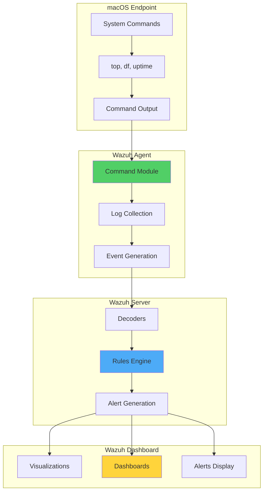

# Monitoring macOS Resources with Wazuh

## Introduction

Monitoring macOS resources provides organizations with critical insights into endpoint performance and potential security issues. By tracking system resource utilization, IT teams can identify performance bottlenecks, detect anomalous behavior that may indicate security threats, and optimize resource allocation across their macOS fleet.

Wazuh, an open source XDR platform, enables comprehensive monitoring of macOS endpoints through its command monitoring capabilities and customizable alerting system. This integration provides:

- 🔍 **Real-time Resource Tracking**: Monitor CPU, memory, disk, and network usage
- 📊 **Performance Metrics**: Collect and analyze detailed system performance data
- 🚨 **Proactive Alerting**: Get notified when resources exceed defined thresholds
- 📈 **Historical Analysis**: Track resource usage trends over time
- 🛡️ **Security Insights**: Detect resource anomalies that may indicate threats

## macOS Performance Metrics

### Key Metrics to Monitor

Understanding macOS performance requires tracking several critical metrics:

#### 1. CPU Usage

CPU usage represents the percentage of processor capacity being utilized. macOS categorizes CPU usage into:

- **User**: Time spent running user processes
- **System**: Time spent running kernel operations
- **Idle**: Unused CPU capacity

```bash
top -l 1 | grep 'CPU usage'
# Output: CPU usage: 23.33% user, 75.0% sys, 1.66% idle
```

**Calculation**:
```
Total CPU (%) = user + sys + idle
Total CPU usage (%) = ((user + sys) * 100) / Total CPU
```

#### 2. CPU Load

CPU load measures the number of processes using or waiting for processor time:

```bash
top -l 1 | grep 'Load Avg'
# Output: Load Avg: 1.84, 1.75, 1.80
```

Where:
- 1.84 = 1-minute average
- 1.75 = 5-minute average
- 1.80 = 15-minute average

#### 3. Memory Utilization

Memory usage shows the percentage of RAM currently in use:

```bash
top -l 1 | grep PhysMem
# Output: PhysMem: 3027M used (588M wired, 13M compressor), 1068M unused.
```

**Calculation**:
```
MemUsed = app memory + wired memory + compressed
Memory utilization (%) = (MemUsed * 100) / (MemUsed + MemUnused)
```

#### 4. Disk Usage

Disk usage indicates the percentage of storage space occupied:

```bash
df -h /
# Output: /dev/disk1s5s1   80Gi  8.4Gi   63Gi    12%   /
```

**Calculation**:
```
Total usable (Gi) = DiskUsed + DiskAvailable
Disk usage (%) = (DiskUsed * 100) / Total usable
```

#### 5. Network Utilization

Network utilization measures bandwidth usage:

```bash
top -l 1 | grep Networks
# Output: Networks: packets: 13108/2660K in, 12579/2722K out.
```

## Architecture Overview



## Implementation Guide

### Prerequisites

- **Wazuh Server**: Version 4.4.4+ with all components
- **macOS Endpoint**: macOS 13.4+ with Wazuh agent 4.4.4 installed
- **Permissions**: Administrative access on macOS endpoint

### Phase 1: Configure Command Monitoring on macOS

Edit `/Library/Ossec/etc/ossec.conf` and add the following configurations within the `<ossec_config>` block:

```xml
<!-- CPU usage: percentage -->
<localfile>
  <log_format>full_command</log_format>
  <command>top -l 1 | grep 'CPU usage' | awk '{print ($3+$5)*100/($3+$5+$7)}'</command>
  <alias>CPU_health</alias>
  <out_format>$(timestamp) $(hostname) CPU_health: $(log)</out_format>
  <frequency>30</frequency>
</localfile>

<!-- memory usage: percentage -->
<localfile>
  <log_format>full_command</log_format>
  <command>top -l 1 | grep PhysMem | awk '$NF=="unused."{print ($2*100)/($2+$(NF-1))}'</command>
  <alias>memory_health</alias>
  <out_format>$(timestamp) $(hostname) memory_health: $(log)</out_format>
  <frequency>30</frequency>
</localfile>

<!-- disk usage: percentage -->
<localfile>
  <log_format>full_command</log_format>
  <command>df -h | awk '$NF=="/"{print $3*100/($3+$4)}'</command>
  <alias>disk_health</alias>
  <out_format>$(timestamp) $(hostname) disk_health: $(log)</out_format>
  <frequency>30</frequency>
</localfile>

<!-- CPU usage metrics -->
<localfile>
  <log_format>full_command</log_format>
  <command>top -l 1 | grep 'CPU usage' | awk '{print $3, $5, ($3+$5)*100/($3+$5+$7)"%", $7}'</command>
  <alias>cpu_metrics</alias>
  <out_format>$(timestamp) $(hostname) cpu_usage_check: $(log)</out_format>
  <frequency>30</frequency>
</localfile>

<!-- load average metrics -->
<localfile>
  <log_format>full_command</log_format>
  <command>top -l 1 | grep 'Load Avg' | awk '{print $3, $4, $5}'</command>
  <alias>load_average_metrics</alias>
  <out_format>$(timestamp) $(hostname) load_average_check: $(log)</out_format>
  <frequency>30</frequency>
</localfile>

<!-- memory metrics -->
<localfile>
  <log_format>full_command</log_format>
  <command>top -l 1 | grep PhysMem | awk '$NF=="unused."{print $2,$(NF-1)}'</command>
  <alias>memory_metrics</alias>
  <out_format>$(timestamp) $(hostname) memory_check: $(log)</out_format>
  <frequency>30</frequency>
</localfile>

<!-- disk metrics -->
<localfile>
  <log_format>full_command</log_format>
  <command>df -h | awk '$NF=="/"{print $2,$3,$4,$3+$4"Gi"}'</command>
  <alias>disk_metrics</alias>
  <out_format>$(timestamp) $(hostname) disk_check: $(log)</out_format>
  <frequency>30</frequency>
</localfile>

<!-- network metrics -->
<localfile>
  <log_format>full_command</log_format>
  <command>top -l 1 | grep Networks | awk '$NF=="out."{print $3,$5}'</command>
  <alias>network_metrics</alias>
  <out_format>$(timestamp) $(hostname) network_check: $(log)</out_format>
  <frequency>30</frequency>
</localfile>
```

Restart the Wazuh agent:

```bash
sudo /Library/Ossec/bin/wazuh-control restart
```

### Phase 2: Configure Wazuh Server

#### Add Custom Decoders

Add to `/var/ossec/etc/decoders/local_decoder.xml`:

```xml
<!-- CPU health check -->
<decoder name="CPU_health">
    <program_name>CPU_health</program_name>
</decoder>

<decoder name="CPU_health_sub">
  <parent>CPU_health</parent>
  <prematch>ossec: output: 'CPU_health':\.</prematch>
  <regex offset="after_prematch">(\S+)</regex>
  <order>cpu_usage_%</order>
</decoder>

<!-- Memory health check -->
<decoder name="memory_health">
    <program_name>memory_health</program_name>
</decoder>

<decoder name="memory_health_sub">
  <parent>memory_health</parent>
  <prematch>ossec: output: 'memory_health':\.</prematch>
  <regex offset="after_prematch">(\S+)</regex>
  <order>memory_usage_%</order>
</decoder>

<!-- Disk health check -->
<decoder name="disk_health">
    <program_name>disk_health</program_name>
</decoder>

<decoder name="disk_health_sub">
  <parent>disk_health</parent>
  <prematch>ossec: output: 'disk_health':\.</prematch>
  <regex offset="after_prematch">(\S+)</regex>
  <order>disk_usage_%</order>
</decoder>

<!-- CPU usage metrics -->
<decoder name="cpu_usage_check">
    <program_name>cpu_usage_check</program_name>
</decoder>

<decoder name="cpu_usage_check_sub">
  <parent>cpu_usage_check</parent>
  <prematch>ossec: output: 'cpu_metrics':\.</prematch>
  <regex offset="after_prematch">(\S+%) (\S+%) (\S+) (\S+%)</regex>
  <order>userCPU_usage_%, sysCPU_usage_%, totalCPU_used_%, idleCPU_%</order>
</decoder>

<!-- Load average metrics -->
<decoder name="load_average_check">
    <program_name>load_average_check</program_name>
</decoder>

<decoder name="load_average_check_sub">
  <parent>load_average_check</parent>
  <prematch>ossec: output: 'load_average_metrics':\.</prematch>
  <regex offset="after_prematch">(\S+), (\S+), (\S+)</regex>
  <order>1min_loadAverage, 5mins_loadAverage, 15mins_loadAverage</order>
</decoder>

<!-- Memory metrics -->
<decoder name="memory_check">
    <program_name>memory_check</program_name>
</decoder>

<decoder name="memory_check_sub">
  <parent>memory_check</parent>
  <prematch>ossec: output: 'memory_metrics':\.</prematch>
  <regex offset="after_prematch">(\S+) (\S+)</regex>
  <order>memory_used_bytes, memory_available_bytes</order>
</decoder>

<!-- Disk metrics -->
<decoder name="disk_check">
    <program_name>disk_check</program_name>
</decoder>

<decoder name="disk_check_sub">
  <parent>disk_check</parent>
  <prematch>ossec: output: 'disk_metrics':\.</prematch>
  <regex offset="after_prematch">(\S+) (\S+) (\S+) (\S+)</regex>
  <order>total_disk_size, disk_used, disk_free, total_usable</order>
</decoder>

<!-- Network metrics -->
<decoder name="network_check">
    <program_name>network_check</program_name>
</decoder>

<decoder name="network_check_sub">
  <parent>network_check</parent>
  <prematch>ossec: output: 'network_metrics':\.</prematch>
  <regex offset="after_prematch">(\S+) (\S+)</regex>
  <order>network_in, network_out</order>
</decoder>
```

#### Add Detection Rules

Add to `/var/ossec/etc/rules/local_rules.xml`:

```xml
<group name="performance_metric,">
  <!-- High memory usage -->
  <rule id="100101" level="12">
    <decoded_as>memory_health</decoded_as>
    <field type="pcre2" name="memory_usage_%">^(0*[8-9]\d|0*[1-9]\d{2,})</field>
    <description>Memory usage is high: $(memory_usage_%)%</description>
    <options>no_full_log</options>
  </rule>

  <!-- High CPU usage -->
  <rule id="100102" level="12">
    <decoded_as>CPU_health</decoded_as>
    <field type="pcre2" name="cpu_usage_%">^(0*[8-9]\d|0*[1-9]\d{2,})</field>
    <description>CPU usage is high: $(cpu_usage_%)%</description>
    <options>no_full_log</options>
  </rule>

  <!-- High disk usage -->
  <rule id="100103" level="12">
    <decoded_as>disk_health</decoded_as>
    <field type="pcre2" name="disk_usage_%">^(0*[7-9]\d|0*[1-9]\d{2,})</field>
    <description>Disk space is running low: $(disk_usage_%)%</description>
    <options>no_full_log</options>
  </rule>

  <!-- CPU usage check -->
  <rule id="100104" level="3">
    <decoded_as>cpu_usage_check</decoded_as>
    <description>CPU usage metrics: $(totalCPU_used_%) of CPU is in use</description>
  </rule>
    
  <!-- Load average check -->
  <rule id="100105" level="3">
    <decoded_as>load_average_check</decoded_as>
    <description>Load average metrics: $(1min_loadAverage) for last 1 minute</description>
  </rule>

  <!-- Memory check -->
  <rule id="100106" level="3">
    <decoded_as>memory_check</decoded_as>
    <description>Memory metrics: $(memory_used_bytes) of memory is in use</description>
  </rule>

  <!-- Disk check -->
  <rule id="100107" level="3">
    <decoded_as>disk_check</decoded_as>
    <description>Disk metrics: $(disk_used) of storage is in use</description>
  </rule>

  <!-- Network check -->
  <rule id="100108" level="3">
    <decoded_as>network_check</decoded_as>
    <description>Network metrics: $(network_in) inbound | $(network_out) outbound</description>
  </rule>    
</group>
```

Restart the Wazuh manager:

```bash
sudo systemctl restart wazuh-manager
```

### Phase 3: Configure Wazuh Dashboard

#### Refresh Index Pattern

The new custom fields may appear as unknown. To fix this:

1. Navigate to **Stack Management → Index Patterns → wazuh-alerts-***
2. Click the refresh button to update the index pattern
3. Verify that custom fields are now recognized

#### Create Event Queries

**CPU Usage Query**:
1. Enter filter: `rule.id:100104`
2. Select fields: `data.userCPU_usage_%`, `data.sysCPU_usage_%`, `data.totalCPU_used_%`, `data.idleCPU_%`

**CPU Load Query**:
1. Enter filter: `rule.id:100105`
2. Select fields: `data.1min_loadAverage`, `data.5min_loadAverage`, `data.15mins_loadAverage`

**Memory Utilization Query**:
1. Enter filter: `rule.id:100106`
2. Select fields: `data.memory_used_bytes`, `data.memory_available_bytes`

**Disk Usage Query**:
1. Enter filter: `rule.id:100107`
2. Select fields: `data.disk_used`, `data.disk_free`, `data.total_usable`, `data.total_disk_size`

**Network Utilization Query**:
1. Enter filter: `rule.id:100108`
2. Select fields: `data.network_in`, `data.network_out`

## Advanced Configuration

### Custom Thresholds by Time

```xml
<!-- Alert on high CPU during business hours -->
<rule id="100109" level="10">
  <decoded_as>CPU_health</decoded_as>
  <field type="pcre2" name="cpu_usage_%">^(0*[6-9]\d|0*[1-9]\d{2,})</field>
  <time>8:00 am - 6:00 pm</time>
  <weekday>monday,tuesday,wednesday,thursday,friday</weekday>
  <description>High CPU usage during business hours: $(cpu_usage_%)%</description>
</rule>

<!-- Critical memory usage -->
<rule id="100110" level="14">
  <decoded_as>memory_health</decoded_as>
  <field type="pcre2" name="memory_usage_%">^(0*9[5-9]|0*100)</field>
  <description>Critical memory usage: $(memory_usage_%)%</description>
  <options>alert_by_email</options>
</rule>
```

### Performance Baseline Monitoring

```xml
<!-- Detect unusual load patterns -->
<rule id="100111" level="8">
  <decoded_as>load_average_check</decoded_as>
  <field type="pcre2" name="1min_loadAverage">^([5-9]\.|[1-9]\d+\.)</field>
  <description>Unusual system load detected: $(1min_loadAverage)</description>
</rule>

<!-- Rapid disk usage increase -->
<rule id="100112" level="10" frequency="3" timeframe="300">
  <if_sid>100107</if_sid>
  <description>Rapid disk usage increase detected</description>
</rule>
```

### Application-Specific Monitoring

```xml
<!-- Monitor specific processes -->
<localfile>
  <log_format>full_command</log_format>
  <command>ps aux | grep -E 'Chrome|Safari|Firefox' | awk '{sum+=$3} END {print sum}'</command>
  <alias>browser_cpu_usage</alias>
  <out_format>$(timestamp) $(hostname) browser_cpu: $(log)</out_format>
  <frequency>60</frequency>
</localfile>

<!-- Monitor Docker resources -->
<localfile>
  <log_format>full_command</log_format>
  <command>docker stats --no-stream --format "table {{.Container}}\t{{.CPUPerc}}\t{{.MemUsage}}" 2>/dev/null || echo "No Docker"</command>
  <alias>docker_stats</alias>
  <out_format>$(timestamp) $(hostname) docker_stats: $(log)</out_format>
  <frequency>60</frequency>
</localfile>
```

## Creating Custom Visualizations

### Performance Dashboard Components

```json
{
  "visualization": {
    "title": "macOS Resource Usage Timeline",
    "visState": {
      "type": "line",
      "params": {
        "grid": {
          "categoryLines": false,
          "style": {
            "color": "#eee"
          }
        },
        "categoryAxes": [{
          "id": "CategoryAxis-1",
          "type": "category",
          "position": "bottom",
          "show": true,
          "style": {},
          "scale": {
            "type": "linear"
          },
          "labels": {
            "show": true,
            "truncate": 100
          },
          "title": {}
        }],
        "valueAxes": [{
          "id": "ValueAxis-1",
          "name": "LeftAxis-1",
          "type": "value",
          "position": "left",
          "show": true,
          "style": {},
          "scale": {
            "type": "linear",
            "mode": "normal"
          },
          "labels": {
            "show": true,
            "rotate": 0,
            "filter": false,
            "truncate": 100
          },
          "title": {
            "text": "Usage %"
          }
        }],
        "seriesParams": [{
          "show": true,
          "type": "line",
          "mode": "normal",
          "data": {
            "label": "CPU Usage",
            "id": "1"
          },
          "valueAxis": "ValueAxis-1",
          "drawLinesBetweenPoints": true,
          "showCircles": true
        },
        {
          "show": true,
          "type": "line",
          "mode": "normal",
          "data": {
            "label": "Memory Usage",
            "id": "2"
          },
          "valueAxis": "ValueAxis-1",
          "drawLinesBetweenPoints": true,
          "showCircles": true
        }]
      }
    }
  }
}
```

### Resource Heatmap

```json
{
  "visualization": {
    "title": "Resource Usage Heatmap",
    "visState": {
      "type": "heatmap",
      "params": {
        "type": "heatmap",
        "addTooltip": true,
        "addLegend": true,
        "enableHover": false,
        "legendPosition": "right",
        "times": [],
        "colorsNumber": 5,
        "colorSchema": "Reds",
        "setColorRange": false,
        "colorsRange": [],
        "invertColors": false,
        "percentageMode": false,
        "valueAxes": [{
          "show": false,
          "id": "ValueAxis-1",
          "type": "value",
          "scale": {
            "type": "linear",
            "defaultYExtents": false
          },
          "labels": {
            "show": false,
            "rotate": 0,
            "overwriteColor": false,
            "color": "#555"
          }
        }]
      }
    }
  }
}
```

## Monitoring Best Practices

### 1. Baseline Establishment

```bash
#!/bin/bash
# Collect baseline metrics for 24 hours

LOG_FILE="/tmp/macos_baseline_$(date +%Y%m%d).log"

echo "Starting baseline collection..."
for i in {1..2880}; do  # 24 hours at 30-second intervals
    echo "$(date): $(top -l 1 | grep -E 'CPU usage|PhysMem|Load Avg')" >> "$LOG_FILE"
    sleep 30
done

# Analyze baseline
echo "Baseline Statistics:"
awk '/CPU usage/ {
    gsub(/%/, "", $3); gsub(/%/, "", $5); gsub(/%/, "", $7)
    cpu_user += $3; cpu_sys += $5; cpu_idle += $7; count++
} END {
    print "Average CPU User:", cpu_user/count"%"
    print "Average CPU System:", cpu_sys/count"%"
    print "Average CPU Idle:", cpu_idle/count"%"
}' "$LOG_FILE"
```

### 2. Alert Tuning

```xml
<!-- Dynamic thresholds based on time and day -->
<rule id="100113" level="8">
  <decoded_as>CPU_health</decoded_as>
  <field type="pcre2" name="cpu_usage_%">^(0*[4-9]\d|0*[1-9]\d{2,})</field>
  <time>2:00 am - 6:00 am</time>
  <description>Unusual CPU activity during quiet hours: $(cpu_usage_%)%</description>
</rule>

<!-- Correlate multiple resource issues -->
<rule id="100114" level="12" frequency="2" timeframe="300">
  <if_sid>100101,100102</if_sid>
  <description>Multiple resource constraints detected</description>
</rule>
```

### 3. Performance Optimization

```yaml
Optimization Strategies:
  Command Frequency:
    - Critical metrics: 30 seconds
    - Standard metrics: 60 seconds
    - Historical data: 300 seconds
  
  Data Retention:
    - Real-time alerts: 7 days
    - Performance metrics: 30 days
    - Aggregated data: 90 days
  
  Resource Impact:
    - Use lightweight commands
    - Avoid complex calculations
    - Implement command result caching
```

## Troubleshooting

### Common Issues and Solutions

#### Issue 1: Commands Not Executing

```bash
# Verify command execution
sudo -u _wazuh /Library/Ossec/bin/wazuh-control info

# Check command permissions
ls -la /Library/Ossec/etc/ossec.conf

# Test command manually
sudo -u _wazuh top -l 1 | grep 'CPU usage'
```

#### Issue 2: High Resource Consumption by Monitoring

```xml
<!-- Reduce monitoring frequency -->
<localfile>
  <log_format>full_command</log_format>
  <command>top -l 1 | grep 'CPU usage' | awk '{print ($3+$5)*100/($3+$5+$7)}'</command>
  <alias>CPU_health</alias>
  <out_format>$(timestamp) $(hostname) CPU_health: $(log)</out_format>
  <frequency>120</frequency>  <!-- Increased from 30 to 120 seconds -->
</localfile>
```

#### Issue 3: Custom Fields Not Appearing

```bash
# Force index pattern refresh
curl -X POST "localhost:9200/wazuh-alerts-*/_refresh"

# Verify field mapping
curl -X GET "localhost:9200/wazuh-alerts-*/_mapping/field/data.cpu_usage_%"
```

## Integration Examples

### 1. Slack Notifications

```python
#!/usr/bin/env python3
import requests
import json

def send_slack_alert(webhook_url, alert_data):
    """Send resource alerts to Slack"""
    
    # Determine severity color
    if alert_data['rule']['level'] >= 12:
        color = "danger"
    elif alert_data['rule']['level'] >= 8:
        color = "warning"
    else:
        color = "good"
    
    message = {
        "attachments": [{
            "color": color,
            "title": f"macOS Resource Alert - {alert_data['agent']['name']}",
            "fields": [
                {
                    "title": "Alert",
                    "value": alert_data['rule']['description'],
                    "short": False
                },
                {
                    "title": "Hostname",
                    "value": alert_data['agent']['name'],
                    "short": True
                },
                {
                    "title": "Time",
                    "value": alert_data['timestamp'],
                    "short": True
                }
            ]
        }]
    }
    
    requests.post(webhook_url, json=message)
```

### 2. Automated Response

```bash
#!/bin/bash
# Auto-remediation script for high resource usage

ALERT_FILE="$1"
RULE_ID=$(jq -r '.rule.id' "$ALERT_FILE")

case "$RULE_ID" in
    "100101")  # High memory
        echo "Clearing caches..."
        sudo purge
        ;;
    "100102")  # High CPU
        echo "Identifying top CPU consumers..."
        ps aux | sort -nrk 3,3 | head -10
        ;;
    "100103")  # Low disk space
        echo "Cleaning up disk space..."
        rm -rf ~/Library/Caches/*
        rm -rf /private/var/log/asl/*.asl
        ;;
esac
```

## Performance Metrics Analysis

### Resource Correlation

```python
#!/usr/bin/env python3
import json
from datetime import datetime, timedelta

def analyze_resource_correlation(log_file):
    """Analyze correlation between different resource metrics"""
    
    metrics = {
        'cpu': [],
        'memory': [],
        'disk': [],
        'timestamps': []
    }
    
    with open(log_file, 'r') as f:
        for line in f:
            try:
                data = json.loads(line)
                if data['rule']['id'] == '100104':
                    metrics['cpu'].append(float(data['data']['totalCPU_used_%'].rstrip('%')))
                    metrics['timestamps'].append(data['timestamp'])
                elif data['rule']['id'] == '100106':
                    metrics['memory'].append(float(data['data']['memory_usage_%']))
            except:
                continue
    
    # Calculate correlation
    if len(metrics['cpu']) > 0 and len(metrics['memory']) > 0:
        from scipy.stats import pearsonr
        correlation, p_value = pearsonr(metrics['cpu'], metrics['memory'])
        print(f"CPU-Memory Correlation: {correlation:.2f} (p-value: {p_value:.4f})")
```

### Trend Analysis

```sql
-- Query for resource usage trends
SELECT
  date_trunc('hour', timestamp) as hour,
  AVG(CAST(data.cpu_usage_% AS FLOAT)) as avg_cpu,
  AVG(CAST(data.memory_usage_% AS FLOAT)) as avg_memory,
  AVG(CAST(data.disk_usage_% AS FLOAT)) as avg_disk
FROM
  wazuh-alerts-*
WHERE
  rule.id IN ('100101', '100102', '100103')
  AND timestamp > NOW() - INTERVAL '7 days'
GROUP BY
  hour
ORDER BY
  hour DESC;
```

## Use Cases

### 1. Application Performance Monitoring

```xml
<!-- Monitor specific application resource usage -->
<localfile>
  <log_format>full_command</log_format>
  <command>ps aux | grep -i "Visual Studio Code" | awk '{print $3,$4}' | head -1</command>
  <alias>vscode_resources</alias>
  <out_format>$(timestamp) $(hostname) vscode_usage: CPU=$(log)</out_format>
  <frequency>60</frequency>
</localfile>

<rule id="100115" level="7">
  <decoded_as>vscode_resources</decoded_as>
  <regex>CPU=([5-9]\d|[1-9]\d{2,})</regex>
  <description>VS Code high CPU usage detected</description>
</rule>
```

### 2. Development Environment Monitoring

```bash
#!/bin/bash
# Monitor development tools resource usage

TOOLS=("node" "python" "java" "docker" "postgres")

for tool in "${TOOLS[@]}"; do
    CPU=$(ps aux | grep -i "$tool" | awk '{sum+=$3} END {print sum}')
    MEM=$(ps aux | grep -i "$tool" | awk '{sum+=$4} END {print sum}')
    echo "$(date) - $tool: CPU=$CPU%, MEM=$MEM%"
done
```

### 3. Security Monitoring

```xml
<!-- Detect crypto mining activity -->
<rule id="100116" level="14">
  <decoded_as>CPU_health</decoded_as>
  <field type="pcre2" name="cpu_usage_%">^(0*9[5-9]|0*100)</field>
  <time>1:00 am - 5:00 am</time>
  <description>Possible crypto mining: Sustained high CPU at night</description>
  <options>alert_by_email</options>
</rule>

<!-- Detect memory-based attacks -->
<rule id="100117" level="12" frequency="5" timeframe="300">
  <if_sid>100106</if_sid>
  <regex>memory_used_bytes.*[5-9]\d{9}</regex>
  <description>Rapid memory consumption - possible memory exhaustion attack</description>
</rule>
```

## Conclusion

Monitoring macOS resources with Wazuh provides organizations with comprehensive visibility into endpoint performance and potential security issues. By implementing the configurations and best practices outlined in this guide, you can:

- ✅ **Proactively identify** performance bottlenecks before they impact users
- 📊 **Track resource trends** to optimize capacity planning
- 🚨 **Detect anomalies** that may indicate security threats
- 📈 **Maintain compliance** with performance monitoring requirements
- 🛡️ **Enhance security posture** through resource-based threat detection

The flexibility of Wazuh's command monitoring and alerting capabilities enables customized monitoring solutions tailored to your specific macOS environment needs.

## Key Takeaways

1. **Start with Baselines**: Establish normal resource usage patterns before setting thresholds
2. **Tune Alert Levels**: Adjust thresholds based on your environment's specific needs
3. **Monitor Holistically**: Correlate multiple metrics for better insights
4. **Automate Responses**: Implement remediation scripts for common issues
5. **Regular Review**: Periodically review and adjust monitoring configurations

## Resources

- [Wazuh Command Monitoring Documentation](https://documentation.wazuh.com/current/user-manual/capabilities/command-monitoring.html)
- [macOS Activity Monitor User Guide](https://support.apple.com/guide/activity-monitor/welcome/mac)
- [macOS Performance Tools](https://developer.apple.com/documentation/os/performance)
- [Wazuh Custom Rules Guide](https://documentation.wazuh.com/current/user-manual/ruleset/custom.html)

---

*Monitor your macOS fleet effectively with Wazuh. Detect, analyze, optimize! 🍎📊*