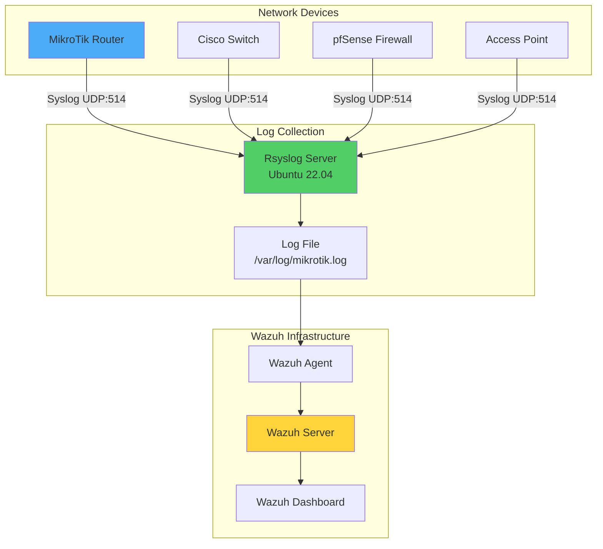
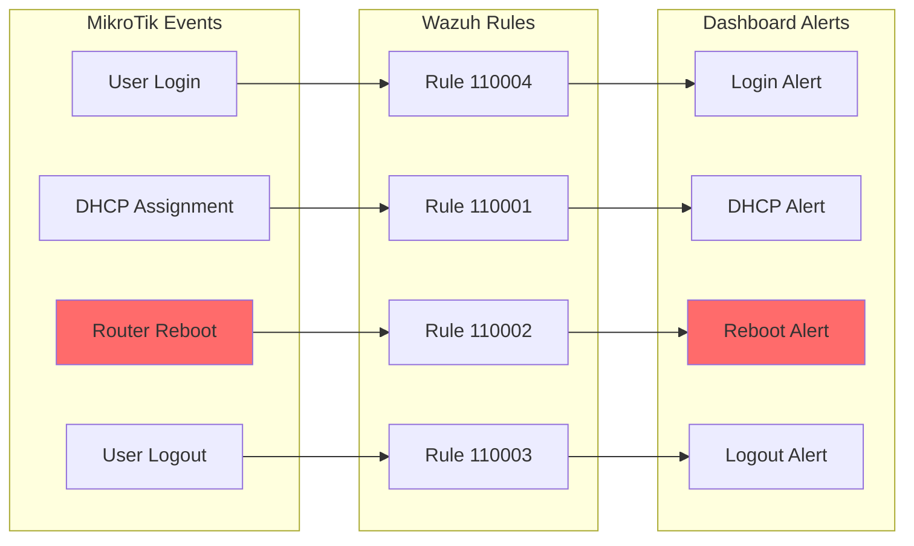
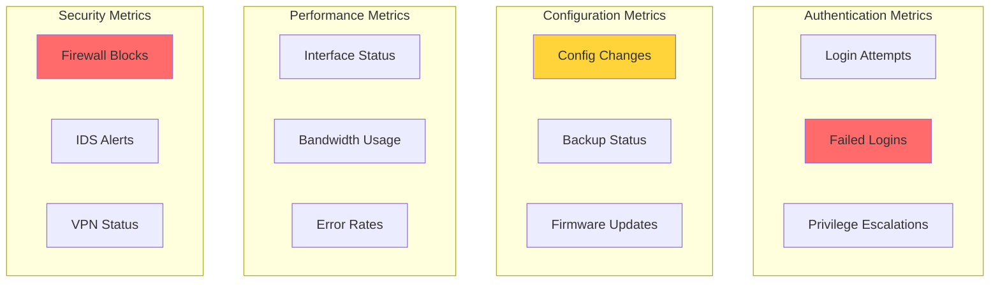

# Monitoring Network Devices with Wazuh

## Introduction

Network devices are the backbone of modern IT infrastructure, facilitating data transfer between nodes and ensuring connectivity across organizations. However, these critical components - including routers, switches, firewalls, and access points - often become prime targets for cyber attacks. Without proper monitoring, they can serve as entry points for unauthorized access, data breaches, or network disruptions.

Wazuh provides comprehensive network device monitoring capabilities:

- 🌐 **Multi-vendor Support**: Monitor devices from Cisco, Juniper, Checkpoint, pfSense, and more
- 📊 **Real-time Analysis**: Process syslog events as they occur
- 🔍 **Custom Detection**: Create tailored rules for specific device behaviors
- 🚨 **Security Alerts**: Detect unauthorized access and configuration changes
- 📈 **Compliance Support**: Meet regulatory requirements for network monitoring

## Supported Network Devices

Wazuh provides out-of-the-box support for numerous network devices:

### Firewalls & Security Devices
- Cisco PIX, ASA, and FWSM (all versions)
- Checkpoint firewall (all versions)
- SonicWall firewall (all versions)
- pfSense
- Huawei USG

### Routers & Switches
- Cisco IOS routers (all versions)
- Juniper Netscreen (all versions)
- Junos devices
- MikroTik RouterOS

### IDS/IPS Systems
- Cisco IOS IDS/IPS module (all versions)
- Sourcefire (Snort) IDS/IPS (all versions)
- Dragon NIDS (all versions)
- Checkpoint Smart Defense (all versions)

### Other Devices
- Bluecoat proxy (all versions)
- Cisco VPN concentrators (all versions)
- VMWare ESXi 4.x

## Architecture Overview



## Infrastructure Requirements

For this demonstration:

- **Wazuh Server**: Pre-built OVA 4.7.2 with all components
- **Ubuntu Endpoint**: Ubuntu 22.04 with Wazuh agent 4.7.2 (syslog collector)
- **Network Device**: MikroTik router with RouterOS 7.13
- **Network**: Connectivity between all components

## Implementation Guide: MikroTik Router Monitoring

### Phase 1: Configure Ubuntu Syslog Receiver

#### Enable Rsyslog

Edit `/etc/rsyslog.conf`:

```bash
# Enable UDP syslog reception
$ModLoad imudp
$UDPServerRun 514

# Store MikroTik messages in dedicated file
if $fromhost-ip startswith '<YOUR_MIKROTIK_IP_ADDRESS>' then /var/log/mikrotik.log
& ~
```

Replace `<YOUR_MIKROTIK_IP_ADDRESS>` with your MikroTik device IP.

#### Prepare Log File

```bash
# Create log file
touch /var/log/mikrotik.log

# Set proper permissions
chown syslog:adm /var/log/mikrotik.log

# Restart rsyslog
systemctl restart rsyslog
```

#### Configure Wazuh Agent

Add to `/var/ossec/etc/ossec.conf`:

```xml
<ossec_config>
  <localfile>
    <log_format>syslog</log_format>
    <location>/var/log/mikrotik.log</location>
    <out_format>RouterOS7.1-logs: $(log)</out_format>
  </localfile>
</ossec_config>
```

Restart the agent:
```bash
systemctl restart wazuh-agent
```

### Phase 2: Configure MikroTik Router

#### Using WinBox or WebUI

1. **Log into your router** using WinBox utility or WebUI

2. **Configure logging topics**:
   - Navigate to: System → Logging → Rules
   - Create rules for topics: `system`, `error`, `info`, `warning`
   - Set Action: `remote`

3. **Configure remote action**:
   - Navigate to: System → Logging → Actions
   - Edit `remote` action:
     - Remote Address: `<WAZUH_AGENT_IP>`
     - Remote Port: `514`
     - BSD Syslog: `Enabled`
     - Syslog Facility: `daemon`
     - Syslog Severity: `emergency`

4. **Set router identity**:
   - Navigate to: System → Identity
   - Set Identity: `MikroTik`

### Phase 3: Create Custom Decoders

Create `/var/ossec/etc/decoders/mikrotik_decoders.xml`:

```xml
<decoder name="mikrotik">
  <prematch>^RouterOS7.1-logs: </prematch>
</decoder>

<decoder name="mikrotik1">
  <parent>mikrotik</parent>
  <regex type="pcre2">\S+ (\w+ \d+ \d+:\d+:\d+) MikroTik user (\S+) (.*?) from (\d+.\d+.\d+.\d+) via (\w+)</regex>
  <order>logtimestamp, logged_user, action, ip_address, protocol</order>
</decoder>

<decoder name="mikrotik1">
  <parent>mikrotik</parent>
  <regex type="pcre2">\S+ (\w+ \d+ \d+:\d+:\d+) MikroTik dhcp-client on (\S+) (.*?) address (\d+.\d+.\d+.\d+)</regex>
  <order>logtimestamp, interface, action, ip_address</order>
</decoder>

<decoder name="mikrotik1">
  <parent>mikrotik</parent>
  <regex type="pcre2">\S+ (\w+ \d+ \d+:\d+:\d+) MikroTik router (\S+)</regex>
  <order>logtimestamp, action</order>
</decoder>
```

### Phase 4: Create Detection Rules

Create `/var/ossec/etc/rules/mikrotik_rules.xml`:

```xml
<group name="Mikrotik,">
  <rule id="110000" level="0">
    <decoded_as>mikrotik</decoded_as>
    <description>Mikrotik-Event</description>
  </rule>

  <rule id="110001" level="5">
    <if_sid>110000</if_sid>
    <match>dhcp-client on ether</match>
    <description>MikroTik dhcp-client received an IP address $(ip_address)</description>
  </rule>

  <rule id="110002" level="5">
    <if_sid>110000</if_sid>
    <match>rebooted</match>
    <description>MikroTik router rebooted</description>
  </rule>

  <rule id="110003" level="5">
    <if_sid>110000</if_sid>
    <match>logged out from</match>
    <description>MikroTik user logged out via $(protocol)</description>
  </rule>

  <rule id="110004" level="5">
    <if_sid>110000</if_sid>
    <match>logged in from</match>
    <description>MikroTik user logged in from $(ip_address) via $(protocol)</description>
  </rule>
</group>
```

Restart Wazuh manager:
```bash
systemctl restart wazuh-manager
```

## Testing the Configuration

### Generate Test Events

```bash
# SSH into MikroTik and reboot
ssh <MIKROTIK_USER>@<MIKROTIK_IP_ADDRESS>
> /system/reboot
```

### Expected Alerts



## Advanced Configuration

### Comprehensive MikroTik Rules

```xml
<group name="Mikrotik,">
  <!-- Base rule -->
  <rule id="110000" level="0">
    <decoded_as>mikrotik</decoded_as>
    <description>Mikrotik-Event</description>
  </rule>

  <!-- Authentication -->
  <rule id="110004" level="5">
    <if_sid>110000</if_sid>
    <match>logged in from</match>
    <description>MikroTik user $(logged_user) logged in from $(ip_address) via $(protocol)</description>
  </rule>

  <rule id="110005" level="7" frequency="3" timeframe="60">
    <if_sid>110004</if_sid>
    <description>Multiple MikroTik login attempts from $(ip_address)</description>
  </rule>

  <rule id="110006" level="8">
    <if_sid>110004</if_sid>
    <time>10:00 pm - 6:00 am</time>
    <description>MikroTik login outside business hours from $(ip_address)</description>
  </rule>

  <!-- Configuration Changes -->
  <rule id="110007" level="7">
    <if_sid>110000</if_sid>
    <match>configuration changed</match>
    <description>MikroTik configuration modified by $(logged_user)</description>
  </rule>

  <!-- Interface Status -->
  <rule id="110008" level="6">
    <if_sid>110000</if_sid>
    <match>interface.*down</match>
    <description>MikroTik interface down: $(interface)</description>
  </rule>

  <rule id="110009" level="5">
    <if_sid>110000</if_sid>
    <match>interface.*up</match>
    <description>MikroTik interface up: $(interface)</description>
  </rule>

  <!-- Security Events -->
  <rule id="110010" level="9">
    <if_sid>110000</if_sid>
    <match>firewall.*drop</match>
    <description>MikroTik firewall dropped packet from $(src_ip)</description>
  </rule>

  <rule id="110011" level="10" frequency="50" timeframe="60">
    <if_sid>110010</if_sid>
    <description>MikroTik DDoS attack detected - high drop rate</description>
  </rule>

  <!-- VPN Events -->
  <rule id="110012" level="5">
    <if_sid>110000</if_sid>
    <match>ipsec.*established</match>
    <description>MikroTik IPSec VPN established with $(peer_ip)</description>
  </rule>

  <rule id="110013" level="7">
    <if_sid>110000</if_sid>
    <match>ipsec.*failed</match>
    <description>MikroTik IPSec VPN failed with $(peer_ip)</description>
  </rule>
</group>
```

### Enhanced Decoders for Multiple Event Types

```xml
<!-- Enhanced MikroTik decoders -->
<decoder name="mikrotik-firewall">
  <parent>mikrotik</parent>
  <regex type="pcre2">firewall,info.* input: in:(\S+) out:(\S+), src-mac (\S+), proto (\S+), (\d+.\d+.\d+.\d+):(\d+)->(\d+.\d+.\d+.\d+):(\d+)</regex>
  <order>in_interface, out_interface, src_mac, protocol, src_ip, src_port, dst_ip, dst_port</order>
</decoder>

<decoder name="mikrotik-system">
  <parent>mikrotik</parent>
  <regex type="pcre2">system,info.* (.*?) by (\S+)</regex>
  <order>system_action, username</order>
</decoder>

<decoder name="mikrotik-wireless">
  <parent>mikrotik</parent>
  <regex type="pcre2">wireless,info.* (\S+): (.*?) (\S+), signal strength (\S+)</regex>
  <order>interface, action, mac_address, signal_strength</order>
</decoder>
```

## Monitoring Other Network Devices

### Cisco Router Configuration

```xml
<!-- Cisco IOS decoders -->
<decoder name="cisco-ios">
  <prematch>%\w+-\d-\w+: </prematch>
</decoder>

<decoder name="cisco-ios-login">
  <parent>cisco-ios</parent>
  <regex type="pcre2">%SEC_LOGIN-5-LOGIN_SUCCESS: Login Success \[user: (\S+)\] \[Source: (\d+.\d+.\d+.\d+)\]</regex>
  <order>user, src_ip</order>
</decoder>

<!-- Cisco IOS rules -->
<rule id="111000" level="5">
  <decoded_as>cisco-ios-login</decoded_as>
  <description>Cisco IOS: Successful login by $(user) from $(src_ip)</description>
</rule>

<rule id="111001" level="8">
  <if_sid>111000</if_sid>
  <match>admin|root</match>
  <description>Cisco IOS: Administrative login by $(user) from $(src_ip)</description>
</rule>
```

### pfSense Firewall Configuration

```xml
<!-- pfSense decoders -->
<decoder name="pfsense">
  <prematch>filterlog:</prematch>
</decoder>

<decoder name="pfsense-filterlog">
  <parent>pfsense</parent>
  <regex type="pcre2">(\d+),,,(\w+),(\w+),(\w+),(\w+),(\w+),(\d+.\d+.\d+.\d+),(\d+.\d+.\d+.\d+)</regex>
  <order>rule_number, interface, reason, action, direction, protocol, src_ip, dst_ip</order>
</decoder>

<!-- pfSense rules -->
<rule id="112000" level="5">
  <decoded_as>pfsense-filterlog</decoded_as>
  <field name="action">block</field>
  <description>pfSense: Blocked connection from $(src_ip) to $(dst_ip)</description>
</rule>

<rule id="112001" level="9" frequency="100" timeframe="60">
  <if_sid>112000</if_sid>
  <description>pfSense: Possible port scan from $(src_ip)</description>
</rule>
```

## Best Practices

### 1. Centralized Syslog Architecture

```yaml
Syslog Architecture:
  Collection Points:
    - Primary: Main datacenter syslog server
    - Secondary: Backup syslog server
    - Regional: Local syslog collectors

  Redundancy:
    - Multiple syslog targets per device
    - Failover configuration
    - Buffer during network outages

  Security:
    - TLS encryption for syslog (where supported)
    - Dedicated management VLAN
    - Access control lists
```

### 2. Log Retention and Rotation

```bash
# /etc/logrotate.d/network-devices
/var/log/mikrotik.log
/var/log/cisco.log
/var/log/pfsense.log
{
    daily
    rotate 90
    compress
    delaycompress
    missingok
    notifempty
    create 640 syslog adm
    postrotate
        /bin/kill -HUP `cat /var/run/rsyslogd.pid 2>/dev/null` 2>/dev/null || true
    endscript
}
```

### 3. Performance Optimization

```bash
# Rsyslog configuration for high-volume environments
# /etc/rsyslog.d/10-network-devices.conf

# Set high precision timestamps
$ActionFileDefaultTemplate RSYSLOG_TraditionalFileFormat

# Buffer configuration
$ActionQueueType LinkedList
$ActionQueueFileName networkq
$ActionResumeRetryCount -1
$ActionQueueSaveOnShutdown on

# Rate limiting
$SystemLogRateLimitInterval 1
$SystemLogRateLimitBurst 5000

# Separate queues per device type
if $fromhost-ip startswith '10.0.1.' then {
    action(type="omfile" file="/var/log/routers.log" queue.type="linkedlist")
}

if $fromhost-ip startswith '10.0.2.' then {
    action(type="omfile" file="/var/log/switches.log" queue.type="linkedlist")
}
```

## Monitoring Dashboard

### Custom Visualization

```json
{
  "visualization": {
    "title": "Network Device Activity",
    "visState": {
      "type": "line",
      "params": {
        "grid": {
          "categoryLines": false,
          "style": {
            "color": "#eee"
          }
        },
        "categoryAxes": [{
          "id": "CategoryAxis-1",
          "type": "category",
          "position": "bottom",
          "show": true,
          "style": {},
          "scale": {
            "type": "linear"
          },
          "labels": {
            "show": true,
            "truncate": 100
          },
          "title": {}
        }],
        "valueAxes": [{
          "id": "ValueAxis-1",
          "name": "LeftAxis-1",
          "type": "value",
          "position": "left",
          "show": true,
          "style": {},
          "scale": {
            "type": "linear",
            "mode": "normal"
          },
          "labels": {
            "show": true,
            "rotate": 0,
            "filter": false,
            "truncate": 100
          },
          "title": {
            "text": "Event Count"
          }
        }],
        "seriesParams": [{
          "show": true,
          "type": "line",
          "mode": "normal",
          "data": {
            "label": "Network Events",
            "id": "1"
          },
          "valueAxis": "ValueAxis-1",
          "drawLinesBetweenPoints": true,
          "showCircles": true
        }]
      }
    }
  }
}
```

### Key Metrics to Monitor



## Troubleshooting

### Common Issues and Solutions

#### Issue 1: No Logs Received

```bash
# Check if rsyslog is receiving data
tcpdump -i any -n port 514

# Verify rsyslog is listening
netstat -ulnp | grep 514

# Check rsyslog errors
tail -f /var/log/syslog | grep rsyslog
```

#### Issue 2: Decoder Not Matching

```bash
# Test decoder with sample log
echo 'RouterOS7.1-logs: Jan 19 10:15:30 MikroTik user admin logged in from 192.168.1.100 via winbox' | \
  /var/ossec/bin/wazuh-logtest -v

# Debug regex patterns
/var/ossec/bin/wazuh-regex 'your_pattern' < sample.log
```

#### Issue 3: Time Synchronization

```bash
# Ensure NTP is configured on all devices
# On MikroTik:
/system ntp client set enabled=yes servers=pool.ntp.org

# On Ubuntu:
timedatectl status
systemctl status ntp
```

## Security Considerations

### 1. Secure Syslog Transport

```bash
# Configure TLS for rsyslog (where supported)
# /etc/rsyslog.d/tls.conf

# Certificate settings
$DefaultNetstreamDriverCAFile /etc/ssl/certs/ca.pem
$DefaultNetstreamDriverCertFile /etc/ssl/certs/syslog-cert.pem
$DefaultNetstreamDriverKeyFile /etc/ssl/private/syslog-key.pem

# Enable TLS
$ActionSendStreamDriver gtls
$ActionSendStreamDriverMode 1
$ActionSendStreamDriverAuthMode x509/name
```

### 2. Access Control

```bash
# Limit syslog sources with iptables
iptables -A INPUT -p udp --dport 514 -s 10.0.0.0/8 -j ACCEPT
iptables -A INPUT -p udp --dport 514 -j DROP

# Configure device ACLs
# MikroTik example:
/ip firewall filter add chain=output dst-address=<SYSLOG_SERVER> \
  dst-port=514 protocol=udp action=accept
```

### 3. Log Integrity

```python
#!/usr/bin/env python3
# verify_log_integrity.py

import hashlib
import json
from datetime import datetime

def calculate_hash(log_entry):
    """Calculate hash of log entry for integrity verification"""
    return hashlib.sha256(log_entry.encode()).hexdigest()

def verify_logs(log_file):
    """Verify log integrity"""
    with open(log_file, 'r') as f:
        for line in f:
            try:
                # Calculate and store hash
                hash_value = calculate_hash(line.strip())
                # Store in integrity database
                store_integrity_record(line, hash_value)
            except Exception as e:
                print(f"Integrity check failed: {e}")

def store_integrity_record(log_entry, hash_value):
    """Store integrity record"""
    record = {
        "timestamp": datetime.now().isoformat(),
        "log_hash": hash_value,
        "log_sample": log_entry[:50]  # Store sample only
    }
    # Store in integrity database
    with open("/var/log/integrity.json", "a") as f:
        json.dump(record, f)
        f.write("\n")
```

## Use Cases

### 1. Configuration Change Tracking

```xml
<rule id="110020" level="8">
  <if_sid>110000</if_sid>
  <match>configuration changed|config modified|settings updated</match>
  <description>Network device configuration changed on $(hostname)</description>
  <options>alert_by_email</options>
</rule>
```

### 2. Network Attack Detection

```xml
<rule id="110021" level="10" frequency="100" timeframe="60">
  <if_sid>110010</if_sid>
  <same_source_ip />
  <description>Network scan detected from $(src_ip) - high connection rate</description>
</rule>

<rule id="110022" level="12" frequency="1000" timeframe="60">
  <if_sid>110010</if_sid>
  <description>DDoS attack detected - excessive connection attempts</description>
  <options>alert_by_email</options>
</rule>
```

### 3. Compliance Monitoring

```bash
#!/bin/bash
# Generate compliance report for network devices

echo "=== Network Device Compliance Report ==="
echo "Generated: $(date)"
echo ""

# Check configuration backups
echo "Configuration Backup Status:"
for device in $(cat /etc/network-devices.list); do
    last_backup=$(grep "backup completed" /var/log/mikrotik.log | \
                  grep $device | tail -1 | cut -d' ' -f1-3)
    echo "$device: Last backup $last_backup"
done

# Check failed login attempts
echo -e "\nFailed Login Attempts (Last 24h):"
grep -E "login failed|authentication failure" /var/log/mikrotik.log | \
    grep -v "Last 24h" | wc -l

# Check configuration changes
echo -e "\nConfiguration Changes (Last 7 days):"
grep "configuration changed" /var/log/mikrotik.log | \
    awk -v d="$(date -d '7 days ago' '+%b %d')" '$0 >= d'
```

## Integration Examples

### 1. SNMP Integration

```python
#!/usr/bin/env python3
# snmp_enrichment.py

from pysnmp.hlapi import *
import json

def get_device_info(ip_address):
    """Get device information via SNMP"""
    device_info = {}

    # System description
    errorIndication, errorStatus, errorIndex, varBinds = next(
        getCmd(SnmpEngine(),
               CommunityData('public', mpModel=0),
               UdpTransportTarget((ip_address, 161)),
               ContextData(),
               ObjectType(ObjectIdentity('SNMPv2-MIB', 'sysDescr', 0)))
    )

    if not errorIndication:
        device_info['description'] = str(varBinds[0][1])

    # System uptime
    errorIndication, errorStatus, errorIndex, varBinds = next(
        getCmd(SnmpEngine(),
               CommunityData('public', mpModel=0),
               UdpTransportTarget((ip_address, 161)),
               ContextData(),
               ObjectType(ObjectIdentity('SNMPv2-MIB', 'sysUpTime', 0)))
    )

    if not errorIndication:
        device_info['uptime'] = str(varBinds[0][1])

    return device_info

# Enrich Wazuh alerts with SNMP data
def enrich_alert(alert):
    if 'src_ip' in alert:
        snmp_data = get_device_info(alert['src_ip'])
        alert['device_info'] = snmp_data
    return alert
```

### 2. Automated Response

```python
#!/usr/bin/env python3
# auto_block_attacker.py

import subprocess
import json
from datetime import datetime

def block_on_mikrotik(attacker_ip, router_ip, username, password):
    """Block attacker IP on MikroTik router"""

    commands = [
        f'/ip firewall address-list add list=blocked address={attacker_ip} '
        f'comment="Auto-blocked by Wazuh {datetime.now()}"',
        f'/ip firewall filter add chain=forward src-address-list=blocked '
        f'action=drop comment="Drop traffic from blocked IPs" '
        f'place-before=0'
    ]

    for cmd in commands:
        ssh_command = f'ssh {username}@{router_ip} "{cmd}"'
        subprocess.run(ssh_command, shell=True)

    print(f"Blocked {attacker_ip} on MikroTik router")

# Process Wazuh alert
def process_alert(alert_file):
    with open(alert_file, 'r') as f:
        alert = json.load(f)

    if alert['rule']['id'] == '110022':  # DDoS detection rule
        attacker_ip = alert['data']['src_ip']
        block_on_mikrotik(attacker_ip, '192.168.1.1', 'admin', 'password')
```

## Performance Metrics

### Monitoring Dashboard Queries

```sql
-- Top talkers by device
SELECT
    agent.name as device,
    COUNT(*) as event_count,
    rule.groups as event_type
FROM
    wazuh-alerts-*
WHERE
    rule.groups CONTAINS 'mikrotik'
    AND timestamp > NOW() - INTERVAL '1 hour'
GROUP BY
    agent.name, rule.groups
ORDER BY
    event_count DESC
LIMIT 10;

-- Configuration changes timeline
SELECT
    timestamp,
    agent.name as device,
    data.logged_user as user,
    data.system_action as action
FROM
    wazuh-alerts-*
WHERE
    rule.id = '110007'
    AND timestamp > NOW() - INTERVAL '7 days'
ORDER BY
    timestamp DESC;
```

## Conclusion

Monitoring network devices with Wazuh provides organizations with:

- ✅ **Comprehensive visibility** into network infrastructure
- 🔒 **Enhanced security** through real-time threat detection
- 📊 **Centralized logging** from diverse device types
- 🚀 **Scalable architecture** supporting any network size
- 🛡️ **Protection against** unauthorized access and attacks

By implementing proper network device monitoring, organizations can detect and respond to security incidents faster while maintaining compliance with regulatory requirements.

## Key Takeaways

1. **Centralize Logging**: Use syslog for unified log collection
2. **Custom Rules**: Create device-specific detection rules
3. **Regular Updates**: Keep decoders and rules current
4. **Secure Transport**: Implement TLS where possible
5. **Automate Response**: Integrate with device APIs for remediation

## Resources

- [Wazuh Network Device Monitoring](https://documentation.wazuh.com/current/user-manual/capabilities/log-data-collection/monitoring-network-devices.html)
- [Rsyslog Documentation](https://www.rsyslog.com/doc/)
- [MikroTik RouterOS Documentation](https://help.mikrotik.com/docs/display/ROS/RouterOS)
- [Network Device Security Best Practices](https://www.cisecurity.org/insights/white-papers/network-devices)

---

*Secure your network infrastructure with Wazuh. Monitor, detect, protect! 🌐🛡️*
