# Using Wazuh to Monitor Sysmon Events

## Introduction

Being a system security administrator is increasingly challenging with new vulnerabilities emerging daily. Sysmon, developed by Mark Russinovich (CTO of Microsoft Azure), is a powerful Windows system service and device driver that provides detailed information about process creations, network connections, and changes to file creation time.

Sysmon is part of the Sysinternals suite and serves as an advanced security monitoring tool that logs system activity to the Windows event log. When integrated with Wazuh, it provides:

- 🔍 **Process Monitoring**: Track all process creation with full command lines
- 🌐 **Network Tracking**: Monitor network connections with source and destination
- 📁 **File Monitoring**: Detect file creation time changes (timestomping)
- 🛡️ **Malware Detection**: Identify suspicious behaviors and techniques
- 📊 **Forensic Analysis**: Detailed logging for incident investigation

## Understanding Sysmon

### Sysmon Event Types

```mermaid
flowchart TB
    subgraph "Sysmon Events"
        E1[Event ID 1: Process Creation]
        E2[Event ID 2: File Creation Time]
        E3[Event ID 3: Network Connection]
        E4[Event ID 4: Sysmon State Change]
        E5[Event ID 5: Process Termination]
        E6[Event ID 6: Driver Loaded]
        E7[Event ID 7: Image Loaded]
        E8[Event ID 8: CreateRemoteThread]
        E9[Event ID 9: RawAccessRead]
        E10[Event ID 10: ProcessAccess]
        E11[Event ID 11: FileCreate]
        E12[Event ID 12-14: Registry Events]
        E15[Event ID 15: FileCreateStreamHash]
        E16[Event ID 16: Sysmon Config Change]
        E17[Event ID 17-18: Pipe Events]
        E19[Event ID 19-21: WMI Events]
        E22[Event ID 22: DNS Query]
        E23[Event ID 23: FileDelete]
    end

    subgraph "Security Use Cases"
        U1[Process Monitoring]
        U2[Network Analysis]
        U3[Persistence Detection]
        U4[Lateral Movement]
        U5[Data Exfiltration]
    end

    E1 --> U1
    E3 --> U2
    E11 --> U3
    E8 --> U4
    E22 --> U5

    style E1 fill:#ff6b6b
    style E3 fill:#4dabf7
    style U1 fill:#51cf66
```



### Key Sysmon Capabilities

1. **Process Creation (Event 1)**: Full command line, hashes, parent process
2. **Network Connections (Event 3)**: Source/destination IPs and ports
3. **Registry Monitoring (Events 12-14)**: Track registry modifications
4. **File Creation (Event 11)**: Monitor file system changes
5. **DNS Queries (Event 22)**: Track DNS resolution requests

## Implementation Guide

### Prerequisites

- **Wazuh Manager**: Version 1.1+ (Native JSON support in 4.0+)
- **Windows Agent**: Windows 7 or higher with Wazuh agent
- **Sysmon**: Latest version from Microsoft
- **Permissions**: Administrator access on Windows systems

### Phase 1: Install and Configure Sysmon

#### Download Sysmon

Download from [Microsoft Sysinternals](https://docs.microsoft.com/en-us/sysinternals/downloads/sysmon)

#### Create Sysmon Configuration

Create `sysconfig.xml` for monitoring PowerShell execution:

```xml
<Sysmon schemaversion="4.22">
  <HashAlgorithms>md5,sha256,IMPHASH</HashAlgorithms>
  <EventFiltering>
    <!--SYSMON EVENT ID 1 : PROCESS CREATION-->
    <ProcessCreate onmatch="include">
      <Image condition="contains">powershell.exe</Image>
      <Image condition="contains">pwsh.exe</Image>
      <CommandLine condition="contains">-enc</CommandLine>
      <CommandLine condition="contains">-encoded</CommandLine>
      <CommandLine condition="contains">bypass</CommandLine>
      <CommandLine condition="contains">hidden</CommandLine>
      <CommandLine condition="contains">invoke-expression</CommandLine>
      <CommandLine condition="contains">downloadstring</CommandLine>
    </ProcessCreate>
    
    <!--SYSMON EVENT ID 2 : FILE CREATION TIME RETROACTIVELY CHANGED-->
    <FileCreateTime onmatch="include"/>
    
    <!--SYSMON EVENT ID 3 : NETWORK CONNECTION INITIATED-->
    <NetworkConnect onmatch="include">
      <Image condition="contains">powershell.exe</Image>
      <Image condition="contains">cmd.exe</Image>
      <DestinationPort condition="is">445</DestinationPort>
      <DestinationPort condition="is">135</DestinationPort>
      <DestinationPort condition="is">3389</DestinationPort>
    </NetworkConnect>
    
    <!--SYSMON EVENT ID 5 : PROCESS ENDED-->
    <ProcessTerminate onmatch="include"/>
    
    <!--SYSMON EVENT ID 6 : DRIVER LOADED INTO KERNEL-->
    <DriverLoad onmatch="include"/>
    
    <!--SYSMON EVENT ID 7 : DLL LOADED BY PROCESS-->
    <ImageLoad onmatch="include">
      <Image condition="contains">powershell.exe</Image>
      <ImageLoaded condition="contains">system.management.automation</ImageLoaded>
    </ImageLoad>
    
    <!--SYSMON EVENT ID 8 : REMOTE THREAD CREATED-->
    <CreateRemoteThread onmatch="include"/>
    
    <!--SYSMON EVENT ID 9 : RAW DISK ACCESS-->
    <RawAccessRead onmatch="include"/>
    
    <!--SYSMON EVENT ID 10 : INTER-PROCESS ACCESS-->
    <ProcessAccess onmatch="include">
      <TargetImage condition="contains">lsass.exe</TargetImage>
      <TargetImage condition="contains">services.exe</TargetImage>
      <TargetImage condition="contains">winlogon.exe</TargetImage>
    </ProcessAccess>
    
    <!--SYSMON EVENT ID 11 : FILE CREATED-->
    <FileCreate onmatch="include">
      <TargetFilename condition="contains">\AppData\</TargetFilename>
      <TargetFilename condition="contains">\Temp\</TargetFilename>
      <TargetFilename condition="end with">.ps1</TargetFilename>
      <TargetFilename condition="end with">.exe</TargetFilename>
      <TargetFilename condition="end with">.dll</TargetFilename>
    </FileCreate>
    
    <!--SYSMON EVENT ID 12 & 13 & 14 : REGISTRY MODIFICATION-->
    <RegistryEvent onmatch="include">
      <TargetObject condition="contains">CurrentVersion\Run</TargetObject>
      <TargetObject condition="contains">Classes\exefile</TargetObject>
      <TargetObject condition="contains">Classes\dllfile</TargetObject>
    </RegistryEvent>
    
    <!--SYSMON EVENT ID 15 : ALTERNATE DATA STREAM CREATED-->
    <FileCreateStreamHash onmatch="include"/>
    
    <!--SYSMON EVENT ID 17 & 18 : PIPE CREATED / CONNECTED-->
    <PipeEvent onmatch="include"/>
    
    <!--SYSMON EVENT ID 19 & 20 & 21 : WMI EVENTS-->
    <WmiEvent onmatch="include"/>
    
    <!--SYSMON EVENT ID 22 : DNS QUERY-->
    <DnsQuery onmatch="include">
      <Image condition="contains">powershell.exe</Image>
      <Image condition="contains">cmd.exe</Image>
    </DnsQuery>
  </EventFiltering>
</Sysmon>
```

#### Install Sysmon

Run as Administrator:

```cmd
Sysmon64.exe -accepteula -i sysconfig.xml
```

#### Verify Installation

Check Event Viewer: Applications and Services Logs → Microsoft → Windows → Sysmon → Operational

### Phase 2: Configure Wazuh Agent

Edit `C:\Program Files (x86)\ossec-agent\ossec.conf`:

```xml
<ossec_config>
  <localfile>
    <location>Microsoft-Windows-Sysmon/Operational</location>
    <log_format>eventchannel</log_format>
  </localfile>
</ossec_config>
```

For Wazuh 4.0+ with native JSON support:

```xml
<ossec_config>
  <localfile>
    <location>Microsoft-Windows-Sysmon/Operational</location>
    <log_format>eventchannel</log_format>
    <only-future-events>yes</only-future-events>
    <query>
      <QueryList>
        <Query Id="0" Path="Microsoft-Windows-Sysmon/Operational">
          <Select Path="Microsoft-Windows-Sysmon/Operational">*</Select>
        </Query>
      </QueryList>
    </query>
  </localfile>
</ossec_config>
```

Restart the Wazuh agent:

```cmd
net stop wazuh
net start wazuh
```

### Phase 3: Configure Wazuh Manager Rules

Add to `/var/ossec/etc/rules/local_rules.xml`:

```xml
<group name="sysmon,">
  <!-- PowerShell execution detection -->
  <rule id="255000" level="12">
    <if_group>sysmon_event1</if_group>
    <field name="win.eventdata.image" type="pcre2">(?i)\\powershell\.exe|\\pwsh\.exe</field>
    <description>Sysmon - Event 1: PowerShell execution detected: $(win.eventdata.image)</description>
    <mitre>
      <id>T1059.001</id>
    </mitre>
    <group>sysmon_event1,powershell_execution,</group>
  </rule>

  <!-- Encoded PowerShell command -->
  <rule id="255001" level="14">
    <if_sid>255000</if_sid>
    <field name="win.eventdata.commandLine" type="pcre2">(?i)-enc|-encoded</field>
    <description>Sysmon - Encoded PowerShell command detected</description>
    <mitre>
      <id>T1027</id>
    </mitre>
    <group>powershell_encoded,</group>
  </rule>

  <!-- PowerShell download activity -->
  <rule id="255002" level="13">
    <if_sid>255000</if_sid>
    <field name="win.eventdata.commandLine" type="pcre2">(?i)downloadstring|downloadfile|invoke-webrequest|iwr|wget|curl</field>
    <description>Sysmon - PowerShell download activity detected</description>
    <mitre>
      <id>T1105</id>
    </mitre>
    <group>powershell_download,</group>
  </rule>

  <!-- Suspicious network connection -->
  <rule id="255003" level="10">
    <if_group>sysmon_event3</if_group>
    <field name="win.eventdata.image" type="pcre2">(?i)\\powershell\.exe|\\cmd\.exe</field>
    <field name="win.eventdata.destinationPort">^(445|135|3389)$</field>
    <description>Sysmon - Suspicious network connection from $(win.eventdata.image) to port $(win.eventdata.destinationPort)</description>
    <mitre>
      <id>T1021</id>
    </mitre>
    <group>lateral_movement,</group>
  </rule>

  <!-- Process accessing LSASS -->
  <rule id="255004" level="14">
    <if_group>sysmon_event10</if_group>
    <field name="win.eventdata.targetImage" type="pcre2">(?i)\\lsass\.exe</field>
    <description>Sysmon - Process $(win.eventdata.sourceImage) accessing LSASS - possible credential dumping</description>
    <mitre>
      <id>T1003.001</id>
    </mitre>
    <group>credential_access,</group>
  </rule>

  <!-- Registry persistence -->
  <rule id="255005" level="12">
    <if_group>sysmon_event_12-13-14</if_group>
    <field name="win.eventdata.targetObject" type="pcre2">(?i)\\CurrentVersion\\Run</field>
    <description>Sysmon - Registry modification for persistence: $(win.eventdata.targetObject)</description>
    <mitre>
      <id>T1547.001</id>
    </mitre>
    <group>persistence,</group>
  </rule>

  <!-- File creation in suspicious location -->
  <rule id="255006" level="11">
    <if_group>sysmon_event11</if_group>
    <field name="win.eventdata.targetFilename" type="pcre2">(?i)\\AppData\\|\\Temp\\</field>
    <field name="win.eventdata.targetFilename" type="pcre2">(?i)\.(exe|dll|ps1|bat|cmd)$</field>
    <description>Sysmon - Suspicious file created: $(win.eventdata.targetFilename)</description>
    <mitre>
      <id>T1105</id>
    </mitre>
    <group>file_creation,</group>
  </rule>

  <!-- DNS query from suspicious process -->
  <rule id="255007" level="10">
    <if_group>sysmon_event22</if_group>
    <field name="win.eventdata.image" type="pcre2">(?i)\\powershell\.exe|\\cmd\.exe</field>
    <description>Sysmon - DNS query from $(win.eventdata.image) to $(win.eventdata.queryName)</description>
    <mitre>
      <id>T1071</id>
    </mitre>
    <group>dns_activity,</group>
  </rule>
</group>
```

## Advanced Sysmon Configurations

### 1. Threat Hunting Configuration

```xml
<Sysmon schemaversion="4.22">
  <HashAlgorithms>md5,sha256,IMPHASH</HashAlgorithms>
  <EventFiltering>
    <!-- Living off the Land Binaries (LOLBins) -->
    <ProcessCreate onmatch="include">
      <Image condition="end with">regsvr32.exe</Image>
      <Image condition="end with">rundll32.exe</Image>
      <Image condition="end with">certutil.exe</Image>
      <Image condition="end with">bitsadmin.exe</Image>
      <Image condition="end with">mshta.exe</Image>
      <Image condition="end with">wmic.exe</Image>
      <Image condition="end with">cscript.exe</Image>
      <Image condition="end with">wscript.exe</Image>
      <ParentImage condition="end with">winword.exe</ParentImage>
      <ParentImage condition="end with">excel.exe</ParentImage>
      <ParentImage condition="end with">powerpnt.exe</ParentImage>
      <ParentImage condition="end with">outlook.exe</ParentImage>
    </ProcessCreate>

    <!-- Suspicious Command Line Arguments -->
    <ProcessCreate onmatch="include">
      <CommandLine condition="contains">-nop -w hidden -c</CommandLine>
      <CommandLine condition="contains">IEX (New-Object</CommandLine>
      <CommandLine condition="contains">DownloadString</CommandLine>
      <CommandLine condition="contains">FromBase64String</CommandLine>
      <CommandLine condition="contains">invoke-mimikatz</CommandLine>
      <CommandLine condition="contains">invoke-empire</CommandLine>
      <CommandLine condition="contains">invoke-powerdump</CommandLine>
      <CommandLine condition="contains">out-minidump</CommandLine>
    </ProcessCreate>

    <!-- Lateral Movement Detection -->
    <NetworkConnect onmatch="include">
      <Image condition="end with">wmiprvse.exe</Image>
      <Image condition="end with">mmc.exe</Image>
      <Image condition="end with">psexec.exe</Image>
      <DestinationPort condition="is">445</DestinationPort>
      <DestinationPort condition="is">135</DestinationPort>
      <DestinationPort condition="is">139</DestinationPort>
      <DestinationPort condition="is">5985</DestinationPort>
      <DestinationPort condition="is">5986</DestinationPort>
    </NetworkConnect>

    <!-- Credential Dumping -->
    <ProcessAccess onmatch="include">
      <TargetImage condition="is">C:\Windows\system32\lsass.exe</TargetImage>
      <GrantedAccess condition="contains">0x1010</GrantedAccess>
      <GrantedAccess condition="contains">0x1410</GrantedAccess>
      <GrantedAccess condition="contains">0x1438</GrantedAccess>
      <GrantedAccess condition="contains">0x143a</GrantedAccess>
      <GrantedAccess condition="contains">0x1418</GrantedAccess>
    </ProcessAccess>

    <!-- Persistence Mechanisms -->
    <RegistryEvent onmatch="include">
      <TargetObject condition="contains">Microsoft\Windows\CurrentVersion\Run</TargetObject>
      <TargetObject condition="contains">Microsoft\Windows\CurrentVersion\RunOnce</TargetObject>
      <TargetObject condition="contains">Microsoft\Windows\CurrentVersion\Explorer\StartupApproved</TargetObject>
      <TargetObject condition="contains">Microsoft\Windows\CurrentVersion\Explorer\Shell Folders</TargetObject>
      <TargetObject condition="contains">Microsoft\Windows\CurrentVersion\Explorer\User Shell Folders</TargetObject>
      <TargetObject condition="contains">Microsoft\Windows NT\CurrentVersion\Winlogon</TargetObject>
      <TargetObject condition="contains">Control\Session Manager\BootExecute</TargetObject>
    </RegistryEvent>
  </EventFiltering>
</Sysmon>
```

### 2. Minimal Noise Configuration

```xml
<Sysmon schemaversion="4.22">
  <HashAlgorithms>md5,sha256</HashAlgorithms>
  <EventFiltering>
    <!-- Focus on critical events only -->
    <ProcessCreate onmatch="exclude">
      <Image condition="begin with">C:\Program Files\</Image>
      <Image condition="begin with">C:\Program Files (x86)\</Image>
      <Image condition="begin with">C:\Windows\System32\</Image>
      <Image condition="begin with">C:\Windows\SysWOW64\</Image>
    </ProcessCreate>
    <ProcessCreate onmatch="include">
      <IntegrityLevel condition="is">Low</IntegrityLevel>
      <IntegrityLevel condition="is">Untrusted</IntegrityLevel>
      <Image condition="begin with">C:\Users\</Image>
      <Image condition="contains">\AppData\</Image>
      <Image condition="contains">\Temp\</Image>
      <Image condition="contains">\Downloads\</Image>
    </ProcessCreate>
  </EventFiltering>
</Sysmon>
```

## Custom Wazuh Rules for Advanced Detection

### 1. MITRE ATT&CK Mapped Rules

```xml
<group name="sysmon,mitre,">
  <!-- T1055 - Process Injection -->
  <rule id="255100" level="14">
    <if_group>sysmon_event8</if_group>
    <field name="win.eventdata.sourceImage" type="pcre2">(?i)\\powershell\.exe|\\cmd\.exe|\\rundll32\.exe</field>
    <description>Sysmon - Process injection detected: $(win.eventdata.sourceImage) -> $(win.eventdata.targetImage)</description>
    <mitre>
      <id>T1055</id>
      <tactic>Defense Evasion</tactic>
      <technique>Process Injection</technique>
    </mitre>
    <group>process_injection,</group>
  </rule>

  <!-- T1053 - Scheduled Task/Job -->
  <rule id="255101" level="12">
    <if_group>sysmon_event1</if_group>
    <field name="win.eventdata.image" type="pcre2">(?i)\\schtasks\.exe|\\at\.exe</field>
    <field name="win.eventdata.commandLine" type="pcre2">(?i)/create|/sc</field>
    <description>Sysmon - Scheduled task creation: $(win.eventdata.commandLine)</description>
    <mitre>
      <id>T1053</id>
      <tactic>Persistence</tactic>
      <technique>Scheduled Task/Job</technique>
    </mitre>
    <group>scheduled_task,</group>
  </rule>

  <!-- T1218 - Signed Binary Proxy Execution -->
  <rule id="255102" level="13">
    <if_group>sysmon_event1</if_group>
    <field name="win.eventdata.image" type="pcre2">(?i)\\rundll32\.exe|\\regsvr32\.exe|\\mshta\.exe</field>
    <field name="win.eventdata.commandLine" type="pcre2">(?i)http://|https://|ftp://</field>
    <description>Sysmon - LOLBin downloading from internet: $(win.eventdata.image)</description>
    <mitre>
      <id>T1218</id>
      <tactic>Defense Evasion</tactic>
      <technique>Signed Binary Proxy Execution</technique>
    </mitre>
    <group>lolbin_download,</group>
  </rule>

  <!-- T1574 - DLL Side-Loading -->
  <rule id="255103" level="12">
    <if_group>sysmon_event7</if_group>
    <field name="win.eventdata.imageLoaded" type="pcre2">(?i)\\Temp\\|\\AppData\\|\\ProgramData\\</field>
    <field name="win.eventdata.signed">false</field>
    <description>Sysmon - Unsigned DLL loaded from suspicious location</description>
    <mitre>
      <id>T1574</id>
      <tactic>Persistence</tactic>
      <technique>DLL Side-Loading</technique>
    </mitre>
    <group>dll_sideloading,</group>
  </rule>

  <!-- T1003.003 - NTDS Dumping -->
  <rule id="255104" level="15">
    <if_group>sysmon_event1</if_group>
    <field name="win.eventdata.commandLine" type="pcre2">(?i)ntdsutil|ifm|create full</field>
    <description>Sysmon - Possible NTDS.dit dumping attempt</description>
    <mitre>
      <id>T1003.003</id>
      <tactic>Credential Access</tactic>
      <technique>NTDS</technique>
    </mitre>
    <group>credential_dumping,</group>
  </rule>
</group>
```

### 2. Ransomware Detection Rules

```xml
<group name="sysmon,ransomware,">
  <!-- Mass file deletion -->
  <rule id="255200" level="14" frequency="20" timeframe="60">
    <if_group>sysmon_event23</if_group>
    <same_field>win.eventdata.user</same_field>
    <description>Sysmon - Mass file deletion detected - possible ransomware</description>
    <mitre>
      <id>T1485</id>
    </mitre>
    <group>ransomware,</group>
  </rule>

  <!-- Shadow copy deletion -->
  <rule id="255201" level="15">
    <if_group>sysmon_event1</if_group>
    <field name="win.eventdata.commandLine" type="pcre2">(?i)vssadmin.*delete.*shadows|wmic.*shadowcopy.*delete</field>
    <description>Sysmon - Shadow copy deletion - possible ransomware preparation</description>
    <mitre>
      <id>T1490</id>
    </mitre>
    <group>ransomware,</group>
  </rule>

  <!-- BCDEdit manipulation -->
  <rule id="255202" level="14">
    <if_group>sysmon_event1</if_group>
    <field name="win.eventdata.image" type="pcre2">(?i)\\bcdedit\.exe</field>
    <field name="win.eventdata.commandLine" type="pcre2">(?i)recoveryenabled no|bootstatuspolicy ignoreallfailures</field>
    <description>Sysmon - Boot recovery disabled - possible ransomware</description>
    <mitre>
      <id>T1490</id>
    </mitre>
    <group>ransomware,</group>
  </rule>
</group>
```

## Dashboard Integration

### Kibana Visualization Examples

```json
{
  "version": "7.10.0",
  "objects": [
    {
      "id": "sysmon-process-creation",
      "type": "visualization",
      "attributes": {
        "title": "Sysmon - Process Creation Timeline",
        "visState": {
          "type": "line",
          "params": {
            "grid": {
              "categoryLines": false,
              "style": {
                "color": "#eee"
              }
            },
            "categoryAxes": [{
              "id": "CategoryAxis-1",
              "type": "category",
              "position": "bottom",
              "show": true,
              "style": {},
              "scale": {
                "type": "linear"
              },
              "labels": {
                "show": true,
                "truncate": 100
              },
              "title": {}
            }],
            "valueAxes": [{
              "id": "ValueAxis-1",
              "name": "LeftAxis-1",
              "type": "value",
              "position": "left",
              "show": true,
              "style": {},
              "scale": {
                "type": "linear",
                "mode": "normal"
              },
              "labels": {
                "show": true,
                "rotate": 0,
                "filter": false,
                "truncate": 100
              },
              "title": {
                "text": "Event Count"
              }
            }],
            "seriesParams": [{
              "show": true,
              "type": "line",
              "mode": "normal",
              "data": {
                "label": "Process Creation Events",
                "id": "1"
              },
              "valueAxis": "ValueAxis-1",
              "drawLinesBetweenPoints": true,
              "showCircles": true
            }]
          },
          "aggs": [{
            "id": "1",
            "enabled": true,
            "type": "count",
            "schema": "metric",
            "params": {}
          }, {
            "id": "2",
            "enabled": true,
            "type": "date_histogram",
            "schema": "segment",
            "params": {
              "field": "timestamp",
              "interval": "auto",
              "customInterval": "2h",
              "min_doc_count": 1,
              "extended_bounds": {}
            }
          }]
        }
      }
    },
    {
      "id": "sysmon-network-connections",
      "type": "visualization",
      "attributes": {
        "title": "Sysmon - Network Connections by Port",
        "visState": {
          "type": "pie",
          "params": {
            "addTooltip": true,
            "addLegend": true,
            "legendPosition": "right",
            "isDonut": true
          },
          "aggs": [{
            "id": "1",
            "enabled": true,
            "type": "count",
            "schema": "metric",
            "params": {}
          }, {
            "id": "2",
            "enabled": true,
            "type": "terms",
            "schema": "segment",
            "params": {
              "field": "data.win.eventdata.destinationPort",
              "size": 10,
              "order": "desc",
              "orderBy": "1"
            }
          }]
        }
      }
    }
  ]
}
```

### Custom Dashboard for Sysmon Events

Create a comprehensive dashboard showing:

1. **Process Creation Timeline**: Track process launches over time
2. **Network Connection Map**: Visualize connections by port and destination
3. **Top Processes**: Most frequently executed processes
4. **User Activity**: Process execution by user
5. **Suspicious Activity Alerts**: High-priority security events

## Performance Optimization

### 1. Sysmon Configuration Optimization

```xml
<!-- Exclude high-volume, low-value events -->
<Sysmon schemaversion="4.22">
  <EventFiltering>
    <ProcessCreate onmatch="exclude">
      <!-- Exclude Windows system processes -->
      <Image condition="is">C:\Windows\System32\svchost.exe</Image>
      <Image condition="is">C:\Windows\System32\wbem\WmiPrvSE.exe</Image>
      <Image condition="is">C:\Windows\System32\SearchIndexer.exe</Image>
      <!-- Exclude trusted applications -->
      <Image condition="begin with">C:\Program Files\Microsoft Office\</Image>
      <Image condition="begin with">C:\Program Files (x86)\Microsoft Office\</Image>
    </ProcessCreate>
    
    <NetworkConnect onmatch="exclude">
      <!-- Exclude local connections -->
      <DestinationIp condition="is">127.0.0.1</DestinationIp>
      <DestinationIp condition="is">::1</DestinationIp>
      <!-- Exclude trusted destinations -->
      <DestinationHostname condition="end with">.microsoft.com</DestinationHostname>
      <DestinationHostname condition="end with">.windows.com</DestinationHostname>
    </NetworkConnect>
  </EventFiltering>
</Sysmon>
```

### 2. Wazuh Performance Tuning

```xml
<!-- Limit event processing rate -->
<ossec_config>
  <global>
    <limits>
      <eps>
        <maximum>1000</maximum>
        <timeframe>60</timeframe>
      </eps>
    </limits>
  </global>

  <!-- Archive only high-value events -->
  <global>
    <logall>no</logall>
    <logall_json>no</logall_json>
  </global>
</ossec_config>
```

## Integration Examples

### 1. Active Response for Sysmon Events

```python
#!/usr/bin/env python3
# sysmon_active_response.py - React to critical Sysmon events

import json
import sys
import subprocess
import os

def block_malicious_process(alert):
    """Block execution of malicious processes"""
    
    process_name = alert['data']['win']['eventdata']['image']
    process_hash = alert['data']['win']['eventdata']['hashes']
    
    # Add to Windows Defender exclusions
    subprocess.run([
        'powershell.exe',
        '-Command',
        f'Add-MpPreference -ExclusionProcess "{process_name}"'
    ])
    
    # Create AppLocker rule
    create_applocker_rule(process_name, process_hash)
    
    # Kill the process
    process_id = alert['data']['win']['eventdata']['processId']
    subprocess.run(['taskkill', '/F', '/PID', process_id])

def isolate_compromised_host(alert):
    """Isolate host showing signs of compromise"""
    
    # Disable network adapters
    subprocess.run([
        'powershell.exe',
        '-Command',
        'Get-NetAdapter | Disable-NetAdapter -Confirm:$false'
    ])
    
    # Log the action
    log_isolation(alert)

def main():
    # Read alert from stdin
    alert = json.load(sys.stdin)
    
    # Determine action based on rule
    rule_id = alert['rule']['id']
    
    if rule_id in ['255001', '255002']:  # Encoded PowerShell
        block_malicious_process(alert)
    elif rule_id == '255004':  # LSASS access
        isolate_compromised_host(alert)

if __name__ == "__main__":
    main()
```

### 2. Threat Intelligence Integration

```python
#!/usr/bin/env python3
# sysmon_threat_intel.py - Enrich Sysmon events with threat intelligence

import requests
import hashlib
import json

class ThreatIntelligence:
    def __init__(self, api_key):
        self.vt_api_key = api_key
        self.misp_url = "https://misp.company.com"
        
    def check_hash(self, file_hash):
        """Check file hash against VirusTotal"""
        
        url = f"https://www.virustotal.com/api/v3/files/{file_hash}"
        headers = {"x-apikey": self.vt_api_key}
        
        try:
            response = requests.get(url, headers=headers)
            if response.status_code == 200:
                data = response.json()
                return {
                    'malicious': data['data']['attributes']['last_analysis_stats']['malicious'] > 0,
                    'score': data['data']['attributes']['last_analysis_stats']['malicious'],
                    'vendors': data['data']['attributes']['last_analysis_results']
                }
        except:
            pass
        
        return None
    
    def check_ip(self, ip_address):
        """Check IP against threat feeds"""
        
        # Check against MISP
        misp_result = self.check_misp_ioc(ip_address, 'ip-dst')
        
        # Check against other feeds
        feeds = {
            'AbuseIPDB': self.check_abuseipdb(ip_address),
            'AlienVault': self.check_alienvault(ip_address),
            'ThreatFox': self.check_threatfox(ip_address)
        }
        
        return {
            'ip': ip_address,
            'misp': misp_result,
            'feeds': feeds
        }
    
    def enrich_sysmon_event(self, event):
        """Add threat intelligence to Sysmon event"""
        
        enriched = event.copy()
        
        # Check file hashes
        if 'hashes' in event.get('data', {}).get('win', {}).get('eventdata', {}):
            hashes = event['data']['win']['eventdata']['hashes']
            # Extract SHA256
            sha256 = None
            for hash_entry in hashes.split(','):
                if 'SHA256=' in hash_entry:
                    sha256 = hash_entry.split('=')[1]
                    break
            
            if sha256:
                hash_intel = self.check_hash(sha256)
                if hash_intel:
                    enriched['threat_intel'] = {'hash': hash_intel}
        
        # Check network connections
        if 'destinationIp' in event.get('data', {}).get('win', {}).get('eventdata', {}):
            ip = event['data']['win']['eventdata']['destinationIp']
            ip_intel = self.check_ip(ip)
            if ip_intel:
                enriched['threat_intel'] = enriched.get('threat_intel', {})
                enriched['threat_intel']['ip'] = ip_intel
        
        return enriched
```

### 3. Automated Forensics Collection

```powershell
# collect_forensics.ps1 - Automated forensics collection on Sysmon alerts

param(
    [string]$AlertFile,
    [string]$OutputPath = "C:\Forensics"
)

# Parse alert
$alert = Get-Content $AlertFile | ConvertFrom-Json

# Create output directory
$timestamp = Get-Date -Format "yyyyMMdd_HHmmss"
$casePath = Join-Path $OutputPath "case_$timestamp"
New-Item -ItemType Directory -Path $casePath -Force

# Collect process information
$processId = $alert.data.win.eventdata.processId
$processInfo = Get-Process -Id $processId -ErrorAction SilentlyContinue

if ($processInfo) {
    # Dump process memory
    & "C:\Tools\procdump.exe" -ma $processId "$casePath\memory_dump.dmp"
    
    # Get loaded modules
    $processInfo.Modules | Export-Csv "$casePath\loaded_modules.csv"
    
    # Get open handles
    & "C:\Tools\handle.exe" -p $processId > "$casePath\handles.txt"
}

# Collect network connections
netstat -anob > "$casePath\network_connections.txt"

# Collect recent event logs
wevtutil epl Microsoft-Windows-Sysmon/Operational "$casePath\sysmon_events.evtx"
wevtutil epl Security "$casePath\security_events.evtx"

# Create case report
$report = @{
    Alert = $alert
    ProcessInfo = $processInfo
    CollectionTime = Get-Date
    SystemInfo = Get-ComputerInfo
}

$report | ConvertTo-Json -Depth 10 | Out-File "$casePath\case_report.json"

Write-Output "Forensics collected at: $casePath"
```

## Troubleshooting

### Common Issues and Solutions

#### Issue 1: Sysmon Events Not Appearing

```powershell
# Check Sysmon service
Get-Service Sysmon64

# Verify Sysmon is logging
Get-WinEvent -LogName "Microsoft-Windows-Sysmon/Operational" -MaxEvents 10

# Check Sysmon configuration
Sysmon64.exe -c

# Reinstall with configuration
Sysmon64.exe -u
Sysmon64.exe -accepteula -i sysconfig.xml
```

#### Issue 2: High Event Volume

```powershell
# Check event rate
Get-WinEvent -LogName "Microsoft-Windows-Sysmon/Operational" | 
    Group-Object -Property Id | 
    Sort-Object Count -Descending

# Update configuration to exclude noisy events
Sysmon64.exe -c updated_config.xml
```

#### Issue 3: Wazuh Not Processing Events

```bash
# Check agent configuration
grep -A 5 "Sysmon" /var/ossec/etc/ossec.conf

# Test log processing
/var/ossec/bin/wazuh-logtest

# Check for decoder matches
grep -i sysmon /var/ossec/logs/alerts/alerts.log
```

## Best Practices

### 1. Sysmon Deployment Strategy

```yaml
Deployment Phases:
  Phase 1 - Pilot:
    - Deploy to security team workstations
    - Use verbose configuration
    - Tune based on findings
    
  Phase 2 - Critical Systems:
    - Deploy to servers and critical workstations
    - Use balanced configuration
    - Monitor performance impact
    
  Phase 3 - Enterprise:
    - Deploy to all endpoints
    - Use optimized configuration
    - Implement automated response
```

### 2. Configuration Management

```powershell
# Centralized Sysmon configuration update
$computers = Get-ADComputer -Filter {OperatingSystem -like "*Windows*"}

foreach ($computer in $computers) {
    $session = New-PSSession -ComputerName $computer.Name
    
    # Copy new configuration
    Copy-Item -Path "\\fileserver\sysmon\sysconfig.xml` -Destination "C:\Windows\" -ToSession $session
    
    # Update Sysmon
    Invoke-Command -Session $session -ScriptBlock {
        & "C:\Windows\Sysmon64.exe" -c "C:\Windows\sysconfig.xml"
    }
    
    Remove-PSSession $session
}
```

### 3. Alert Tuning Process

```python
#!/usr/bin/env python3
# sysmon_alert_tuning.py - Analyze and tune Sysmon alerts

import json
from collections import Counter, defaultdict
from datetime import datetime, timedelta

def analyze_sysmon_alerts(alert_file, days=7):
    """Analyze Sysmon alerts for tuning opportunities"""
    
    # Metrics storage
    event_counts = Counter()
    process_frequency = Counter()
    network_destinations = Counter()
    false_positives = []
    
    # Time threshold
    cutoff_date = datetime.now() - timedelta(days=days)
    
    with open(alert_file, 'r') as f:
        for line in f:
            try:
                alert = json.loads(line)
                
                # Filter by time
                alert_time = datetime.fromisoformat(alert['timestamp'])
                if alert_time < cutoff_date:
                    continue
                
                # Count event types
                rule_id = alert['rule']['id']
                event_counts[rule_id] += 1
                
                # Track processes
                if 'win' in alert.get('data', {}):
                    process = alert['data']['win']['eventdata'].get('image', '')
                    process_frequency[process] += 1
                    
                    # Track network destinations
                    if 'destinationIp' in alert['data']['win']['eventdata']:
                        dest = alert['data']['win']['eventdata']['destinationIp']
                        network_destinations[dest] += 1
                
                # Identify potential false positives
                if alert['rule']['level'] < 10 and event_counts[rule_id] > 100:
                    false_positives.append({
                        'rule_id': rule_id,
                        'count': event_counts[rule_id],
                        'description': alert['rule']['description']
                    })
                    
            except:
                continue
    
    # Generate tuning recommendations
    recommendations = {
        'high_volume_rules': [
            {'rule_id': rule, 'count': count}
            for rule, count in event_counts.most_common(10)
        ],
        'noisy_processes': [
            {'process': proc, 'count': count}
            for proc, count in process_frequency.most_common(10)
            if count > 50
        ],
        'frequent_destinations': [
            {'ip': ip, 'count': count}
            for ip, count in network_destinations.most_common(10)
        ],
        'potential_false_positives': false_positives
    }
    
    return recommendations

# Generate tuning report
recommendations = analyze_sysmon_alerts('/var/ossec/logs/alerts/alerts.json')
print(json.dumps(recommendations, indent=2))
```

## Conclusion

Integrating Sysmon with Wazuh provides organizations with powerful Windows security monitoring capabilities. This combination enables:

- 🔍 **Deep Visibility**: Monitor process creation, network connections, and system changes
- 🛡️ **Advanced Detection**: Identify sophisticated threats and attack techniques
- 📊 **Rich Context**: Collect detailed information for incident investigation
- 🚨 **Real-time Alerting**: Detect and respond to threats as they occur
- 📈 **Compliance Support**: Meet regulatory requirements for security monitoring

By properly configuring Sysmon and creating targeted Wazuh rules, security teams can detect everything from PowerShell-based attacks to advanced persistent threats.

## Key Takeaways

1. **Start with Basics**: Begin monitoring high-risk processes like PowerShell
2. **Tune Gradually**: Refine configurations based on your environment
3. **Map to MITRE**: Align detection rules with ATT&CK framework
4. **Balance Coverage**: Find the right balance between visibility and performance
5. **Automate Response**: Implement active responses for critical alerts

## Resources

- [Sysmon Documentation](https://docs.microsoft.com/en-us/sysinternals/downloads/sysmon)
- [Wazuh Sysmon Integration](https://documentation.wazuh.com/current/learning-wazuh/detect-remove-malware.html)
- [MITRE ATT&CK Framework](https://attack.mitre.org/)
- [Sysmon Configuration Repository](https://github.com/SwiftOnSecurity/sysmon-config)
- [Wazuh Rules Reference](https://documentation.wazuh.com/current/user-manual/ruleset/index.html)

---

*Enhance your Windows security monitoring with Sysmon and Wazuh! 🛡️🔍*