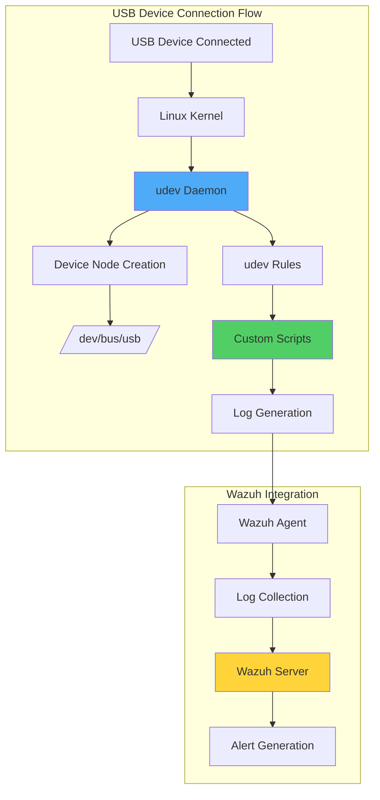

# Monitoring USB Drives in Linux Using Wazuh

## Introduction

USB drives remain one of the most common vectors for malware introduction and data exfiltration in Linux environments. While convenient for legitimate data transfer, these devices can pose significant security risks if left unmonitored. Organizations need comprehensive visibility into USB device usage to maintain security compliance and prevent data breaches.

Wazuh provides powerful capabilities for monitoring USB activities on Linux endpoints:

- 🔍 **Real-time Detection**: Track USB device connections and disconnections
- 📊 **Enhanced Logging**: Capture detailed device information using udev rules
- 🚨 **Unauthorized Device Alerts**: Identify non-approved USB devices
- 🛡️ **Policy Enforcement**: Implement USB security policies across endpoints
- 📈 **Compliance Support**: Maintain audit trails for regulatory requirements

## Understanding Linux USB Architecture

### How Linux Handles USB Devices



### Default vs Enhanced Monitoring

While Wazuh provides out-of-the-box USB monitoring, the default logs are limited:

```log
# Default USB detection (limited information)
2023-12-13T10:15:30.123Z kernel: usb 2-1: new high-speed USB device
```

With udev rules, we can capture comprehensive device information:

```json
{
  "hostname": "ubuntu-server",
  "vendor": "SanDisk",
  "model": "Ultra",
  "serial": "4C530001260524115055",
  "device": "/dev/sdb",
  "type": "usb_device"
}
```

## Infrastructure Requirements

- **Wazuh Server**: Pre-built OVA 4.7.0 with all components
- **Linux Endpoint**: Ubuntu 22.04 LTS with Wazuh agent 4.7.0
- **Prerequisites**:
  - udev utility (included by default in Linux)
  - Root access for configuration
  - Network connectivity to Wazuh server

## Implementation Guide

### Phase 1: Configure udev Rules on Linux Endpoint

#### Create USB Detection Script

Create `/var/ossec/bin/usb_detect.sh`:

```bash
#!/bin/bash
# USB detection script for Wazuh

log_file="/var/log/usb_detect.json"
vendor="$ID_VENDOR"
model="$ID_MODEL"
serial="$ID_SERIAL_SHORT"
device="$DEVNAME"
devtype="$DEVTYPE"
hostname=$(hostname)

# Create JSON log entry
json="{\"hostname\":\"$hostname\",\"vendor\":\"$vendor\",\"model\":\"$model\",\"serial\":\"$serial\",\"device\":\"$device\",\"type\":\"$devtype\"}"

# Append to log file
echo "$json" >> "$log_file"
```

Set proper permissions:
```bash
chmod 700 /var/ossec/bin/usb_detect.sh
```

#### Create udev Rule

Create `/etc/udev/rules.d/usb-detect.rules`:

```bash
# Trigger script when USB device is added
ACTION=="add", SUBSYSTEMS=="usb", RUN+="/var/ossec/bin/usb_detect.sh"
```

Reload udev rules:
```bash
udevadm control --reload
```

#### Configure Wazuh Agent

Add to `/var/ossec/etc/ossec.conf`:

```xml
<ossec_config>
  <!-- Logcollector for udev USB detected Logs -->
  <localfile>
    <log_format>json</log_format>
    <location>/var/log/usb_detect.json</location>
  </localfile>
</ossec_config>
```

Restart the agent:
```bash
systemctl restart wazuh-agent
```

### Phase 2: Configure Wazuh Server

#### Basic USB Detection Rules

Add to `/var/ossec/etc/rules/local_rules.xml`:

```xml
<!-- Rule for USB monitoring in Linux-->
<group name="Linux,usb,">
  <rule id="111010" level="7">
    <field name="serial">\w+</field>
    <field name="type">usb_device</field>
    <description>A PNP device $(vendor) $(model) was connected to $(hostname).</description>
  </rule>
</group>
```

#### Create CDB List for Authorized Devices

Create `/var/ossec/etc/lists/usb-drives`:

```
4C530001260524115055:
8C5300012605241ABC12:
1D530001260524115DEF:
```

Update `/var/ossec/etc/ossec.conf`:

```xml
<ruleset>
  <!-- Default ruleset -->
  <decoder_dir>ruleset/decoders</decoder_dir>
  <rule_dir>ruleset/rules</rule_dir>
  <rule_exclude>0215-policy_rules.xml</rule_exclude>
  <list>etc/lists/audit-keys</list>
  <list>etc/lists/amazon/aws-eventnames</list>
  <list>etc/lists/security-eventchannel</list>

  <!-- User-defined ruleset -->
  <decoder_dir>etc/decoders</decoder_dir>
  <rule_dir>etc/rules</rule_dir>
  <list>etc/lists/usb-drives</list>
</ruleset>
```

#### Enhanced Detection Rules

Update `/var/ossec/etc/rules/local_rules.xml`:

```xml
<!-- Rule for USB monitoring in Linux-->
<group name="Linux,usb,">
  <rule id="111010" level="7">
    <field name="serial">\w+</field>
    <field name="type">usb_device</field>
    <description>A PNP device $(vendor) $(model) was connected to $(hostname).</description>
  </rule>

  <rule id="111011" level="8">
    <if_sid>111010</if_sid>
    <list field="serial" lookup="not_match_key">etc/lists/usb-drives</list>
    <description>Unauthorized PNP device $(vendor) $(model) was connected to $(hostname).</description>
  </rule>
</group>
```

Restart Wazuh manager:
```bash
systemctl restart wazuh-manager
```

## Advanced Configuration

### Enhanced udev Script with More Details

Create an enhanced `/var/ossec/bin/usb_detect_advanced.sh`:

```bash
#!/bin/bash
# Enhanced USB detection script

log_file="/var/log/usb_detect.json"
timestamp=$(date -u +"%Y-%m-%dT%H:%M:%S.%3NZ")

# Extract comprehensive device information
vendor="$ID_VENDOR"
vendor_id="$ID_VENDOR_ID"
model="$ID_MODEL"
model_id="$ID_MODEL_ID"
serial="$ID_SERIAL_SHORT"
device="$DEVNAME"
devtype="$DEVTYPE"
bus="$ID_BUS"
usb_version="$ID_USB_INTERFACES"
path="$DEVPATH"
hostname=$(hostname)
user=$(who | grep -E "(:0|tty7)" | cut -d' ' -f1 | head -n1)

# Check if device is mass storage
is_storage="false"
if [[ "$ID_USB_INTERFACES" == *":080650:"* ]]; then
    is_storage="true"
fi

# Get device capacity if it's storage
capacity="unknown"
if [[ "$is_storage" == "true" ]] && [[ -b "$device" ]]; then
    capacity=$(lsblk -b "$device" 2>/dev/null | grep -E "^${device##*/}" | awk '{print $4}')
fi

# Create detailed JSON log
json=$(cat <<EOF
{
  "timestamp": "$timestamp",
  "hostname": "$hostname",
  "user": "$user",
  "vendor": "$vendor",
  "vendor_id": "$vendor_id",
  "model": "$model",
  "model_id": "$model_id",
  "serial": "$serial",
  "device": "$device",
  "type": "$devtype",
  "bus": "$bus",
  "path": "$path",
  "is_storage": $is_storage,
  "capacity_bytes": "$capacity",
  "interfaces": "$usb_version"
}
EOF
)

echo "$json" >> "$log_file"

# Optional: Send notification to system log
logger -t USB_MONITOR "USB device connected: $vendor $model (Serial: $serial)"
```

### Monitoring USB Removal

Create `/etc/udev/rules.d/usb-remove.rules`:

```bash
# Monitor USB device removal
ACTION=="remove", SUBSYSTEMS=="usb", RUN+="/var/ossec/bin/usb_remove.sh"
```

Create `/var/ossec/bin/usb_remove.sh`:

```bash
#!/bin/bash
log_file="/var/log/usb_detect.json"
timestamp=$(date -u +"%Y-%m-%dT%H:%M:%S.%3NZ")
hostname=$(hostname)

json="{\"timestamp\":\"$timestamp\",\"hostname\":\"$hostname\",\"event\":\"usb_removed\",\"device\":\"$DEVNAME\",\"vendor\":\"$ID_VENDOR\",\"model\":\"$ID_MODEL\",\"serial\":\"$ID_SERIAL_SHORT\"}"
echo "$json" >> "$log_file"
```

### Advanced Detection Rules

```xml
<group name="Linux,usb,">
  <!-- Basic USB detection -->
  <rule id="111010" level="7">
    <field name="serial">\w+</field>
    <field name="type">usb_device</field>
    <description>USB device $(vendor) $(model) connected to $(hostname)</description>
  </rule>

  <!-- Unauthorized device -->
  <rule id="111011" level="8">
    <if_sid>111010</if_sid>
    <list field="serial" lookup="not_match_key">etc/lists/usb-drives</list>
    <description>Unauthorized USB device $(vendor) $(model) connected to $(hostname)</description>
  </rule>

  <!-- Mass storage device -->
  <rule id="111012" level="8">
    <if_sid>111010</if_sid>
    <field name="is_storage">true</field>
    <description>USB mass storage device $(vendor) $(model) connected to $(hostname)</description>
  </rule>

  <!-- Large capacity device -->
  <rule id="111013" level="9">
    <if_sid>111012</if_sid>
    <regex>capacity_bytes":\s*"(\d{11,})"</regex>
    <description>Large USB storage device (>10GB) connected to $(hostname)</description>
  </rule>

  <!-- USB device removal -->
  <rule id="111014" level="5">
    <field name="event">usb_removed</field>
    <description>USB device $(vendor) $(model) removed from $(hostname)</description>
  </rule>

  <!-- Multiple USB connections -->
  <rule id="111015" level="9" frequency="3" timeframe="60">
    <if_sid>111010</if_sid>
    <description>Multiple USB devices connected to $(hostname) in short time</description>
  </rule>
</group>
```

## Monitoring and Response

### Real-time Monitoring Script

Create `/usr/local/bin/usb_monitor.sh`:

```bash
#!/bin/bash
# Real-time USB monitoring script

echo "=== USB Device Monitor ==="
echo "Monitoring USB events on $(hostname)..."
echo ""

# Monitor udev events
udevadm monitor --udev --subsystem-match=usb | while read -r line; do
    if [[ "$line" == *"add"* ]] || [[ "$line" == *"remove"* ]]; then
        timestamp=$(date "+%Y-%m-%d %H:%M:%S")
        echo "[$timestamp] $line"

        # Get current USB devices
        echo "Current USB devices:"
        lsusb | grep -v "hub"
        echo "---"
    fi
done
```

### Automated Response Script

Create `/var/ossec/active-response/bin/usb-block.sh`:

```bash
#!/bin/bash
# Block unauthorized USB devices

ACTION=$1
USER=$2
IP=$3
ALERTID=$4
RULEID=$5

if [ "$ACTION" = "add" ] && [ "$RULEID" = "111011" ]; then
    # Log the action
    echo "$(date) - Blocking USB access due to unauthorized device" >> /var/log/usb_block.log

    # Create udev rule to block USB storage
    cat > /etc/udev/rules.d/99-usb-block.rules << EOF
# Block USB storage devices
SUBSYSTEMS=="usb", DRIVERS=="usb-storage", ATTR{authorized}="0"
EOF

    # Reload udev rules
    udevadm control --reload-rules

    # Eject currently connected unauthorized devices
    for device in $(ls /dev/disk/by-id/ | grep -i usb); do
        udisksctl unmount -b "/dev/disk/by-id/$device" 2>/dev/null
        udisksctl power-off -b "/dev/disk/by-id/$device" 2>/dev/null
    done
fi

if [ "$ACTION" = "delete" ]; then
    # Remove blocking rule
    rm -f /etc/udev/rules.d/99-usb-block.rules
    udevadm control --reload-rules
    echo "$(date) - USB access restored" >> /var/log/usb_block.log
fi
```

## Troubleshooting

### Common Issues and Solutions

#### Issue 1: udev Rules Not Triggering

```bash
# Test udev rules
udevadm test /sys/class/block/sdb

# Monitor udev events
udevadm monitor --environment --udev

# Check rule syntax
udevadm control --reload-rules && udevadm trigger
```

#### Issue 2: JSON Parsing Errors

```bash
# Validate JSON format
tail -n 1 /var/log/usb_detect.json | jq .

# Fix permissions
chmod 640 /var/log/usb_detect.json
chown root:ossec /var/log/usb_detect.json
```

#### Issue 3: Missing Device Information

```bash
# Get complete device information
udevadm info --query=all --name=/dev/sdb

# List environment variables available to udev
udevadm info --export-db | grep -A10 "P: /devices/.*usb"
```

### Debug Mode for udev Rules

Create `/etc/udev/rules.d/00-usb-debug.rules`:

```bash
# Debug USB events
ACTION=="add|remove", SUBSYSTEMS=="usb", RUN+="/bin/sh -c 'echo USB_DEBUG: $env{ACTION} $env{DEVPATH} $env{ID_VENDOR} $env{ID_MODEL} >> /tmp/usb_debug.log'"
```

## Best Practices

### 1. USB Security Policy Implementation

```yaml
USB Security Policy:
  Allowed Devices:
    - Corporate-issued USB drives only
    - Devices must be encrypted
    - Serial numbers registered in CDB

  Monitoring Requirements:
    - All USB connections logged
    - Unauthorized devices blocked
    - Alerts sent to security team

  Response Procedures:
    - Immediate blocking of unauthorized devices
    - Investigation of all violations
    - User education on first offense
```

### 2. Regular Audits

Create `/usr/local/bin/usb_audit.sh`:

```bash
#!/bin/bash
# USB device audit script

echo "=== USB Device Audit Report ==="
echo "Generated: $(date)"
echo ""

# Check authorized devices
echo "Authorized USB Devices:"
cat /var/ossec/etc/lists/usb-drives | grep -v "^#" | grep -v "^$"
echo ""

# Recent USB activity
echo "Recent USB Activity (Last 24 hours):"
grep "$(date -d '1 day ago' +%Y-%m-%d)" /var/log/usb_detect.json | \
    jq -r '.timestamp + " - " + .vendor + " " + .model + " (Serial: " + .serial + ")"'
echo ""

# Unauthorized attempts
echo "Unauthorized USB Attempts:"
grep "Unauthorized" /var/ossec/logs/alerts/alerts.json | \
    jq -r 'select(.rule.id == "111011") | .timestamp + " - " + .data.vendor + " " + .data.model'
```

### 3. Integration with Asset Management

```python
#!/usr/bin/env python3
# sync_usb_whitelist.py - Sync USB whitelist with asset management

import json
import requests

# Get authorized devices from asset management system
def get_authorized_devices():
    response = requests.get("https://assets.company.com/api/usb-devices")
    return response.json()

# Update Wazuh CDB list
def update_cdb_list(devices):
    with open("/var/ossec/etc/lists/usb-drives", "w") as f:
        f.write("# Auto-generated USB whitelist\n")
        f.write("# Last updated: " + datetime.now().isoformat() + "\n")
        for device in devices:
            f.write(f"{device['serial']}:\n")

    # Restart Wazuh manager
    os.system("systemctl restart wazuh-manager")

if __name__ == "__main__":
    devices = get_authorized_devices()
    update_cdb_list(devices)
```

## Performance Optimization

### 1. Log Rotation

Configure logrotate for USB logs:

```bash
# /etc/logrotate.d/usb-detect
/var/log/usb_detect.json {
    daily
    rotate 30
    compress
    delaycompress
    missingok
    notifempty
    create 640 root ossec
    postrotate
        # Signal Wazuh to reopen log file
        /var/ossec/bin/wazuh-control reload
    endscript
}
```

### 2. Efficient udev Rules

```bash
# Optimized udev rules with conditions
# Only monitor removable USB storage devices
ACTION=="add", SUBSYSTEMS=="usb", ATTRS{removable}=="1", \
    ENV{ID_USB_DRIVER}=="usb-storage", \
    RUN+="/var/ossec/bin/usb_detect.sh"
```

## Use Cases

### 1. Data Loss Prevention

```xml
<rule id="111016" level="10">
  <if_sid>111012</if_sid>
  <time>8:00 pm - 6:00 am</time>
  <description>USB storage connected after hours on $(hostname)</description>
  <options>alert_by_email</options>
</rule>
```

### 2. Compliance Monitoring

```bash
#!/bin/bash
# Generate PCI DSS compliance report for USB usage

echo "PCI DSS USB Compliance Report"
echo "============================="
echo ""
echo "Requirement 2.3 - Encrypt all non-console administrative access"
echo "USB devices with encryption capability:"
grep "LUKS\\|BitLocker\\|FileVault" /var/log/usb_detect.json | wc -l
echo ""
echo "Requirement 9.7 - Maintain strict control over storage media"
echo "Unauthorized USB attempts in last 30 days:"
grep -c "111011" /var/ossec/logs/alerts/alerts.json
```

### 3. Forensic Investigation

```bash
#!/bin/bash
# USB forensics script

TIMEFRAME="$1"  # e.g., "2023-12-01"

echo "USB Forensic Timeline for $TIMEFRAME"
echo "===================================="

# Extract all USB events
grep "$TIMEFRAME" /var/log/usb_detect.json | \
    jq -r '.timestamp + " | " + .hostname + " | " + .user + " | " + .vendor + " " + .model + " | " + .serial' | \
    sort

# Correlate with file access logs
echo -e "\nCorrelated File Access:"
for serial in $(grep "$TIMEFRAME" /var/log/usb_detect.json | jq -r .serial | sort -u); do
    echo "Serial: $serial"
    ausearch -ts "$TIMEFRAME" -m PATH | grep -i "removable\|media\|mnt" | head -5
done
```

## Integration Examples

### 1. SIEM Integration

```python
#!/usr/bin/env python3
# Forward USB events to external SIEM

import json
import requests
from datetime import datetime

def forward_to_siem(event):
    siem_endpoint = "https://siem.company.com/api/events"
    headers = {"Authorization": "Bearer YOUR_API_KEY"}

    # Enrich event data
    event["severity"] = "high" if event.get("unauthorized") else "medium"
    event["category"] = "hardware.usb"
    event["source"] = "wazuh"

    response = requests.post(siem_endpoint, json=event, headers=headers)
    return response.status_code == 200

# Monitor Wazuh alerts
with open("/var/ossec/logs/alerts/alerts.json", "r") as f:
    for line in f:
        try:
            alert = json.loads(line)
            if "111010" <= alert["rule"]["id"] <= "111015":
                forward_to_siem(alert)
        except:
            continue
```

### 2. Ticketing System Integration

```bash
#!/bin/bash
# Create ticket for unauthorized USB

ALERT_FILE="$1"
TICKET_API="https://tickets.company.com/api/v2/tickets"

# Extract alert details
HOSTNAME=$(jq -r .agent.name "$ALERT_FILE")
USB_INFO=$(jq -r '.data | "\(.vendor) \(.model) (Serial: \(.serial))"' "$ALERT_FILE")
USER=$(jq -r .data.user "$ALERT_FILE")

# Create ticket
curl -X POST "$TICKET_API" \
    -H "Content-Type: application/json" \
    -d "{
        \"title\": \"Unauthorized USB Device Detected\",
        \"description\": \"An unauthorized USB device was connected to $HOSTNAME by user $USER.\nDevice: $USB_INFO\",
        \"priority\": \"high\",
        \"category\": \"security_incident\"
    }"
```

## Conclusion

Implementing comprehensive USB monitoring on Linux systems with Wazuh provides organizations with:

- ✅ **Complete visibility** into USB device usage across all endpoints
- 🔒 **Enhanced security** through real-time threat detection
- 📊 **Detailed forensics** with comprehensive device information
- 🚀 **Automated response** capabilities for policy violations
- 🛡️ **Protection against** data exfiltration and malware introduction

By leveraging Linux's powerful udev subsystem combined with Wazuh's robust SIEM capabilities, organizations can maintain strict control over USB device usage while enabling legitimate business needs.

## Key Takeaways

1. **udev Rules**: Leverage Linux's device management for detailed logging
2. **JSON Logging**: Structure logs for easy parsing and analysis
3. **CDB Lists**: Maintain centralized control of authorized devices
4. **Custom Rules**: Create targeted detection for your environment
5. **Automation**: Implement automated responses to security violations

## Resources

- [Wazuh Linux Agent Documentation](https://documentation.wazuh.com/current/installation-guide/wazuh-agent/linux.html)
- [udev Rules Documentation](https://www.freedesktop.org/software/systemd/man/udev.html)
- [Linux USB Subsystem Guide](https://www.kernel.org/doc/html/latest/driver-api/usb/index.html)
- [Wazuh CDB Lists Guide](https://documentation.wazuh.com/current/user-manual/ruleset/cdb-list.html)

---

*Secure your Linux infrastructure against USB threats. Monitor, detect, respond! 🐧🛡️*
