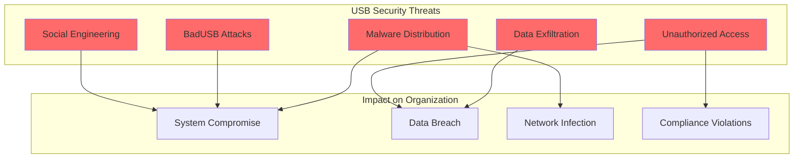
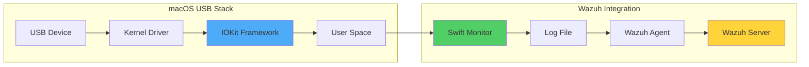
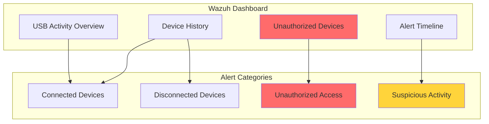

# Monitoring USB Drives in macOS Using Wazuh

## Introduction

USB drives are essential tools for transferring files on macOS systems, providing a quick and simple way to share documents, photos, and more between devices. Their plug-and-play nature makes them incredibly convenient for users. However, this convenience comes with significant security risks. USB drives can carry malware, potentially compromising your macOS systems and spreading threats across your network.

Organizations must proactively implement real-time tracking and analysis of USB drive activities to effectively address these security concerns. Wazuh provides a robust solution for enhancing macOS security by:

- 🔍 **Real-time USB Monitoring**: Track all USB device connections and disconnections
- 🚨 **Anomaly Detection**: Identify unauthorized or suspicious USB activities
- 📊 **Detailed Event Logging**: Capture comprehensive device information
- 🛡️ **Policy Enforcement**: Implement and monitor USB security policies
- 📈 **Centralized Visibility**: Monitor USB activities across all macOS endpoints

## Understanding the Challenge

### Security Risks of USB Drives



### macOS USB Architecture



## Infrastructure Requirements

For this implementation, you'll need:

- **Wazuh Server**: Pre-built OVA 4.7.2 with all core components
- **macOS Endpoint**: macOS Sonoma 14.3 with Wazuh agent 4.7.2 installed
- **Development Tools**: Xcode command line tools for Swift compilation
- **Network**: Connectivity between macOS endpoints and Wazuh server

## Implementation Guide

### Phase 1: Configure Swift USB Monitor

#### Install Development Tools

```bash
# Install Xcode command line tools
xcode-select --install

# Verify Swift compiler installation
swiftc --version
```

Expected output:
```
Apple Swift version 5.9.2 (swiftlang-5.9.2.2.56 clang-1500.1.0.2.5)
Target: x86_64-apple-darwin23.3.0
```

#### Prepare Logging Infrastructure

```bash
# Create USB monitor log file
touch /var/log/usb_monitor.log

# Set appropriate permissions
chmod 640 /var/log/usb_monitor.log

# Download USB vendor/product database
curl http://www.linux-usb.org/usb.ids -o /Library/Ossec/etc/usb.ids

# Fix potential encoding issues
iconv -f iso-8859-1 -t utf-8 /Library/Ossec/etc/usb.ids > usb-utf8.ids && \
mv usb-utf8.ids /Library/Ossec/etc/usb.ids
```

#### Create USB Monitor Script

Create `/Library/Ossec/etc/USBMonitor.swift`:

```swift
import Foundation
import IOKit
import IOKit.usb

// USB Event structure for JSON logging
struct USBEvent: Codable {
    var eventType: String
    var timestamp: String
    var deviceInfo: [String: String]
    
    init(eventType: String, deviceInfo: [String: String]) {
        self.eventType = eventType
        self.deviceInfo = deviceInfo
        self.timestamp = USBEvent.currentLocalTimestamp()
    }
    
    private static func currentLocalTimestamp() -> String {
        let formatter = DateFormatter()
        formatter.dateFormat = "yyyy-MM-dd'T'HH:mm:ss.SSSZZZZZ"
        formatter.timeZone = TimeZone.current
        return formatter.string(from: Date())
    }
}

// Vendor/Product mapping
var usbVendorProductMap = [String: [String: String]]()

// Parse USB IDs database
func parseUSBIDs(from filePath: String) {
    do {
        let content = try String(contentsOfFile: filePath, encoding: .utf8)
        var currentVendorID: String?
        
        for line in content.split(whereSeparator: \.isNewline) {
            let trimmedLine = line.trimmingCharacters(in: .whitespaces)
            if trimmedLine.isEmpty || trimmedLine.hasPrefix("#") { continue }
            
            if line.first!.isNumber {
                let components = trimmedLine.split(separator: " ", maxSplits: 1)
                if components.count == 2 {
                    currentVendorID = String(components[0])
                    let vendorName = String(components[1])
                    usbVendorProductMap[currentVendorID!] = ["": vendorName]
                }
            } else if line.first == "\t", let vendorID = currentVendorID {
                let components = trimmedLine.split(separator: " ", maxSplits: 1)
                if components.count == 2 {
                    let productID = String(components[0])
                    let productName = String(components[1])
                    usbVendorProductMap[vendorID]?[productID] = productName
                }
            }
        }
    } catch {
        print("Failed to read or parse USB IDs file: \(error)")
    }
}

// Log USB events to file
func logUSBEvent(event: USBEvent, to filePath: String) {
    let encoder = JSONEncoder()
    if let jsonData = try? encoder.encode(event), 
       let jsonString = String(data: jsonData, encoding: .utf8) {
        do {
            try jsonString.appendLineToURL(fileURL: URL(fileURLWithPath: filePath))
        } catch {
            print("Failed to write to log file: \(error)")
        }
    }
}

// File writing extensions
extension String {
    func appendLineToURL(fileURL: URL) throws {
        try (self + "\n").appendToFile(fileURL: fileURL)
    }
    
    func appendToFile(fileURL: URL) throws {
        let data = self.data(using: .utf8)!
        try data.append(fileURL: fileURL)
    }
}

extension Data {
    func append(fileURL: URL) throws {
        if let fileHandle = FileHandle(forWritingAtPath: fileURL.path) {
            defer { fileHandle.closeFile() }
            fileHandle.seekToEndOfFile()
            fileHandle.write(self)
        } else {
            try write(to: fileURL, options: .atomic)
        }
    }
}

// Extract device information using IOKit
func extractDeviceInfo(device: io_object_t) -> [String: String] {
    var deviceInfo = [String: String]()
    
    let vendorIDKey = kUSBVendorID as String
    let productIDKey = kUSBProductID as String
    let serialNumberKey = kUSBSerialNumberString as String
    
    // Extract Vendor ID
    if let vendorIDRef = IORegistryEntrySearchCFProperty(
        device, kIOServicePlane, vendorIDKey as CFString, 
        kCFAllocatorDefault, 
        IOOptionBits(kIORegistryIterateRecursively | kIORegistryIterateParents)
    ), CFGetTypeID(vendorIDRef) == CFNumberGetTypeID() {
        var vendorID: Int = 0
        CFNumberGetValue((vendorIDRef as! CFNumber), CFNumberType.intType, &vendorID)
        let hexVendorID = String(format: "%04x", vendorID)
        deviceInfo[vendorIDKey] = hexVendorID
        
        if let vendorName = usbVendorProductMap[hexVendorID]?[""] {
            deviceInfo["vendorName"] = vendorName
        }
    }
    
    // Extract Product ID
    if let productIDRef = IORegistryEntrySearchCFProperty(
        device, kIOServicePlane, productIDKey as CFString,
        kCFAllocatorDefault,
        IOOptionBits(kIORegistryIterateRecursively | kIORegistryIterateParents)
    ), CFGetTypeID(productIDRef) == CFNumberGetTypeID() {
        var productID: Int = 0
        CFNumberGetValue((productIDRef as! CFNumber), CFNumberType.intType, &productID)
        let hexProductID = String(format: "%04x", productID)
        deviceInfo[productIDKey] = hexProductID
        
        if let vendorID = deviceInfo[vendorIDKey],
           let productName = usbVendorProductMap[vendorID]?[hexProductID] {
            deviceInfo["productName"] = productName
        }
    }
    
    // Extract Serial Number
    if let serialNumberRef = IORegistryEntrySearchCFProperty(
        device, kIOServicePlane, serialNumberKey as CFString,
        kCFAllocatorDefault,
        IOOptionBits(kIORegistryIterateRecursively | kIORegistryIterateParents)
    ) as? String {
        deviceInfo[serialNumberKey] = serialNumberRef
    }
    
    return deviceInfo
}

// USB device callback
func usbDeviceCallback(context: UnsafeMutableRawPointer?, 
                      iterator: io_iterator_t, 
                      eventType: String) {
    var device: io_object_t
    repeat {
        device = IOIteratorNext(iterator)
        if device != 0 {
            let deviceInfo = extractDeviceInfo(device: device)
            let event = USBEvent(eventType: eventType, deviceInfo: deviceInfo)
            logUSBEvent(event: event, to: "/var/log/usb_monitor.log")
            IOObjectRelease(device)
        }
    } while device != 0
}

// Main monitoring setup
let notifyPort = IONotificationPortCreate(kIOMainPortDefault)
let runLoopSource = IONotificationPortGetRunLoopSource(notifyPort).takeRetainedValue()
CFRunLoopAddSource(CFRunLoopGetCurrent(), runLoopSource, CFRunLoopMode.defaultMode)

// Parse USB IDs database
parseUSBIDs(from: "/Library/Ossec/etc/usb.ids")

// Setup device notifications
var deviceAddedIter = io_iterator_t()
var deviceRemovedIter = io_iterator_t()
let matchingDict = IOServiceMatching(kIOUSBDeviceClassName) as NSMutableDictionary

// Monitor device connections
IOServiceAddMatchingNotification(notifyPort, kIOFirstMatchNotification, matchingDict, 
    { (context, iterator) in
        usbDeviceCallback(context: context, iterator: iterator, eventType: "USBConnected")
    }, nil, &deviceAddedIter)
usbDeviceCallback(context: nil, iterator: deviceAddedIter, eventType: "USBConnected")

// Monitor device disconnections
IOServiceAddMatchingNotification(notifyPort, kIOTerminatedNotification, matchingDict,
    { (context, iterator) in
        usbDeviceCallback(context: context, iterator: iterator, eventType: "USBDisconnected")
    }, nil, &deviceRemovedIter)
usbDeviceCallback(context: nil, iterator: deviceRemovedIter, eventType: "USBDisconnected")

// Run the monitoring loop
CFRunLoopRun()
```

**Note**: For macOS 11 and earlier, replace `kIOMainPortDefault` with `kIOMasterPortDefault`.

#### Compile and Test

```bash
# Compile the Swift script
swiftc /Library/Ossec/etc/USBMonitor.swift -o /Library/Ossec/etc/USBMonitor

# Test the executable
/Library/Ossec/etc/USBMonitor
```

### Phase 2: Configure Wazuh Agent

#### Forward USB Logs

Add to `/Library/Ossec/etc/ossec.conf`:

```xml
<ossec_config>
  <localfile>
    <log_format>json</log_format>
    <location>/var/log/usb_monitor.log</location>
  </localfile>
</ossec_config>
```

Restart the agent:
```bash
/Library/Ossec/bin/wazuh-control restart
```

### Phase 3: Automate with LaunchDaemon

#### Create Launch Configuration

Create `/Library/LaunchDaemons/com.user.usbmonitor.plist`:

```xml
<?xml version="1.0" encoding="UTF-8"?>
<!DOCTYPE plist PUBLIC "-//Apple//DTD PLIST 1.0//EN" 
  "http://www.apple.com/DTDs/PropertyList-1.0.dtd">
<plist version="1.0">
<dict>
    <key>Label</key>
    <string>com.user.usbmonitor</string>
    <key>ProgramArguments</key>
    <array>
        <string>/Library/Ossec/etc/USBMonitor</string>
    </array>
    <key>RunAtLoad</key>
    <true/>
    <key>KeepAlive</key>
    <true/>
</dict>
</plist>
```

Load the daemon:
```bash
launchctl load /Library/LaunchDaemons/com.user.usbmonitor.plist
```

### Phase 4: Configure Wazuh Server

#### Create Detection Rules

Create `/var/ossec/etc/rules/macos_usb_rules.xml`:

```xml
<!-- rules for USB drives in macOS -->
<group name="macOS,usb-detect,">
  <!-- rule for connected USB drives -->
  <rule id="111060" level="7">
    <decoded_as>json</decoded_as>
    <field name="eventType">^USBConnected$</field>
    <description>macOS: USB drive $(deviceInfo.productName) was connected.</description>
  </rule>
  
  <!-- rule for disconnected USB drives -->
  <rule id="111062" level="7">
    <decoded_as>json</decoded_as>
    <field name="eventType">^USBDisconnected$</field>
    <description>macOS: USB drive $(deviceInfo.productName) was disconnected.</description>
  </rule>
</group>
```

Restart Wazuh manager:
```bash
systemctl restart wazuh-manager
```

## Advanced Configuration

### Filtering Authorized vs Unauthorized USB Drives

#### Create CDB List

Create `/var/ossec/etc/lists/usb-drives` with authorized serial numbers:

```
234567890126:
345678901237:
456789012348:
```

#### Update Configuration

Add to `/var/ossec/etc/ossec.conf`:

```xml
<ruleset>
  <!-- Existing configuration -->
  <list>etc/lists/usb-drives</list>
</ruleset>
```

#### Enhanced Detection Rules

Update `/var/ossec/etc/rules/macos_usb_rules.xml`:

```xml
<!-- rules for USB drives in macOS -->
<group name="macOS,usb-detect,">
  <!-- rule for connected USB drives -->
  <rule id="111060" level="5">
    <decoded_as>json</decoded_as>
    <field name="eventType">^USBConnected$</field>
    <description>macOS: USB drive $(deviceInfo.productName) was connected.</description>
  </rule>
  
  <!-- rule for connected unauthorized USB drives -->
  <rule id="111061" level="8">
    <if_sid>111060</if_sid>
    <list field="deviceInfo.kUSBSerialNumberString" lookup="not_match_key">
      etc/lists/usb-drives
    </list>
    <description>macOS: Unauthorized USB drive $(deviceInfo.productName) was connected.</description>
  </rule>
  
  <!-- rule for disconnected USB drives -->
  <rule id="111062" level="5">
    <decoded_as>json</decoded_as>
    <field name="eventType">^USBDisconnected$</field>
    <description>macOS: USB drive $(deviceInfo.productName) was disconnected.</description>
  </rule>
  
  <!-- rule for disconnected unauthorized USB drives -->
  <rule id="111063" level="8">
    <if_sid>111062</if_sid>
    <list field="deviceInfo.kUSBSerialNumberString" lookup="not_match_key">
      etc/lists/usb-drives
    </list>
    <description>macOS: Unauthorized USB drive $(deviceInfo.productName) was disconnected.</description>
  </rule>
</group>
```

### Additional Security Rules

```xml
<!-- Advanced USB monitoring rules -->
<group name="macOS,usb-detect,">
  <!-- Detect specific vendor devices -->
  <rule id="111064" level="9">
    <if_sid>111060</if_sid>
    <field name="deviceInfo.vendorName">^(Unknown|Suspicious)$</field>
    <description>macOS: Suspicious USB vendor detected: $(deviceInfo.vendorName)</description>
  </rule>
  
  <!-- Detect devices without serial numbers -->
  <rule id="111065" level="7">
    <if_sid>111060</if_sid>
    <field name="deviceInfo.kUSBSerialNumberString">^$</field>
    <description>macOS: USB device without serial number connected</description>
  </rule>
  
  <!-- Multiple USB connections alert -->
  <rule id="111066" level="8" frequency="5" timeframe="60">
    <if_sid>111060</if_sid>
    <description>macOS: Multiple USB devices connected in short time</description>
  </rule>
</group>
```

## Monitoring and Response

### Real-time Dashboard Monitoring



### Alert Examples

#### Authorized USB Connection
```json
{
  "eventType": "USBConnected",
  "timestamp": "2024-02-02T10:15:30.123+00:00",
  "deviceInfo": {
    "kUSBVendorID": "0781",
    "vendorName": "SanDisk Corp.",
    "kUSBProductID": "5581",
    "productName": "Ultra",
    "kUSBSerialNumberString": "234567890126"
  }
}
```

#### Unauthorized USB Detection
```json
{
  "eventType": "USBConnected",
  "timestamp": "2024-02-02T10:20:45.456+00:00",
  "deviceInfo": {
    "kUSBVendorID": "abcd",
    "vendorName": "Unknown",
    "kUSBProductID": "1234",
    "productName": "Mass Storage",
    "kUSBSerialNumberString": "999888777666"
  }
}
```

## Troubleshooting

### Common Issues and Solutions

#### Issue 1: Swift Compilation Errors

```bash
# Check Swift version
swiftc --version

# For older macOS versions, update IOKit references
# Replace: kIOMainPortDefault
# With: kIOMasterPortDefault
```

#### Issue 2: USB IDs File Encoding

```bash
# Fix encoding issues
iconv -f iso-8859-1 -t utf-8 /Library/Ossec/etc/usb.ids > usb-utf8.ids
mv usb-utf8.ids /Library/Ossec/etc/usb.ids
```

#### Issue 3: Permission Denied

```bash
# Fix log file permissions
sudo chmod 640 /var/log/usb_monitor.log
sudo chown root:wheel /var/log/usb_monitor.log

# Fix executable permissions
sudo chmod 755 /Library/Ossec/etc/USBMonitor
```

#### Issue 4: LaunchDaemon Not Running

```bash
# Check daemon status
launchctl list | grep usbmonitor

# Reload if needed
launchctl unload /Library/LaunchDaemons/com.user.usbmonitor.plist
launchctl load /Library/LaunchDaemons/com.user.usbmonitor.plist

# Check logs
tail -f /var/log/system.log | grep USBMonitor
```

## Best Practices

### 1. USB Security Policy

```yaml
USB Security Policy:
  Authorized Devices:
    - Maintain whitelist of serial numbers
    - Regular audit of authorized devices
    - Document business justification
    
  Monitoring:
    - Real-time alerts for all connections
    - Daily reports of USB activity
    - Weekly review of unauthorized attempts
    
  Response:
    - Immediate alert for unauthorized devices
    - Automatic incident ticket creation
    - User notification and education
```

### 2. Integration with SOAR

```python
# Example: Wazuh to SOAR integration for USB alerts
def process_usb_alert(alert):
    if alert['rule']['id'] == '111061':  # Unauthorized USB
        # Create security incident
        incident = {
            'title': f"Unauthorized USB: {alert['data']['deviceInfo']['productName']}",
            'severity': 'high',
            'host': alert['agent']['name'],
            'serial': alert['data']['deviceInfo']['kUSBSerialNumberString']
        }
        
        # Trigger automated response
        if is_critical_system(alert['agent']['name']):
            disable_usb_ports(alert['agent']['ip'])
            notify_security_team(incident)
```

### 3. Compliance Reporting

Generate compliance reports for USB activity:

```bash
#!/bin/bash
# Generate monthly USB activity report

echo "=== Monthly USB Activity Report ==="
echo "Generated: $(date)"
echo ""

# Authorized USB connections
echo "Authorized USB Connections:"
curl -k -u admin:admin \
  "https://wazuh-server:55000/security/events?rule.id=111060&time_frame=30d" | \
  jq '.data.affected_items[] | select(.data.deviceInfo.kUSBSerialNumberString as $s | 
    ["234567890126", "345678901237"] | index($s))'

# Unauthorized attempts
echo -e "\nUnauthorized USB Attempts:"
curl -k -u admin:admin \
  "https://wazuh-server:55000/security/events?rule.id=111061&time_frame=30d" | \
  jq '.data.affected_items[]'
```

## Performance Optimization

### 1. Log Rotation

Configure log rotation for USB monitor logs:

```bash
# /etc/newsyslog.d/usb_monitor.conf
/var/log/usb_monitor.log    640  5  1000  *  J
```

### 2. Memory Management

Monitor Swift process memory usage:

```bash
# Check memory usage
ps aux | grep USBMonitor

# Add memory limits to plist if needed
<key>HardResourceLimits</key>
<dict>
    <key>AS</key>
    <integer>104857600</integer>  <!-- 100MB limit -->
</dict>
```

## Use Cases

### 1. Data Loss Prevention

```xml
<rule id="111067" level="10">
  <if_sid>111060</if_sid>
  <field name="deviceInfo.productName">~(External|Portable|Backup)</field>
  <time>8:00-18:00</time>
  <description>macOS: High-capacity storage device connected during business hours</description>
  <options>alert_by_email</options>
</rule>
```

### 2. Forensic Investigation

```sql
-- Query USB activity for specific timeframe
SELECT 
    timestamp,
    agent.name as hostname,
    data.deviceInfo.productName as device,
    data.deviceInfo.kUSBSerialNumberString as serial,
    rule.description
FROM 
    wazuh-alerts-*
WHERE 
    rule.groups CONTAINS 'usb-detect'
    AND timestamp >= '2024-02-01'
    AND timestamp <= '2024-02-02'
ORDER BY 
    timestamp DESC;
```

### 3. Insider Threat Detection

```python
# Detect unusual USB activity patterns
def detect_usb_anomalies(agent_id, timeframe='7d'):
    # Get baseline USB activity
    baseline = get_usb_baseline(agent_id)
    
    # Get current activity
    current = get_current_usb_activity(agent_id, timeframe)
    
    # Detect anomalies
    if current['unique_devices'] > baseline['avg_devices'] * 2:
        alert("Unusual number of USB devices detected")
    
    if current['after_hours_connections'] > baseline['after_hours_avg']:
        alert("Suspicious after-hours USB activity")
```

## Conclusion

Implementing USB monitoring on macOS with Wazuh provides organizations with:

- ✅ **Complete visibility** into USB device usage
- 🔒 **Enhanced security** through real-time threat detection
- 📊 **Compliance support** with detailed audit trails
- 🚀 **Automated response** capabilities
- 🛡️ **Protection against** data exfiltration and malware

By combining macOS's IOKit framework with Wazuh's powerful SIEM capabilities, organizations can maintain a robust security posture against USB-based threats while enabling legitimate business use of removable media.

## Key Takeaways

1. **Swift Integration**: Leverage macOS native frameworks for deep system integration
2. **Real-time Monitoring**: Capture all USB events as they occur
3. **Policy Enforcement**: Implement whitelist/blacklist controls
4. **Automated Response**: React immediately to security violations
5. **Comprehensive Logging**: Maintain detailed forensic evidence

## Resources

- [Wazuh macOS Agent Documentation](https://documentation.wazuh.com/current/installation-guide/wazuh-agent/macos.html)
- [Apple IOKit Framework Reference](https://developer.apple.com/documentation/iokit)
- [USB.org Vendor ID Repository](http://www.linux-usb.org/usb-ids.html)
- [Swift Programming Guide](https://docs.swift.org/swift-book/)
- [macOS Security Guide](https://support.apple.com/guide/security/welcome/web)

---

*Secure your Mac fleet against USB threats. Monitor, detect, respond! 🍎🛡️*