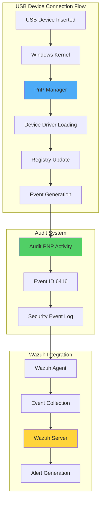

# Monitoring USB Drives in Windows Using Wazuh

## Introduction

USB drives are ubiquitous in modern workplaces, offering convenient data transfer capabilities. However, they also represent one of the most significant security risks to Windows environments. From malware introduction to data exfiltration, unmonitored USB devices can compromise entire networks. Organizations must implement comprehensive USB monitoring to maintain security and compliance.

Wazuh provides robust USB monitoring capabilities for Windows environments:

- 🔍 **Real-time Detection**: Track all USB device connections
- 📊 **Detailed Event Logging**: Capture comprehensive device information
- 🚨 **Policy Enforcement**: Identify authorized vs unauthorized devices
- 🛡️ **Automated Response**: Block or alert on policy violations
- 📈 **Compliance Support**: Meet regulatory requirements for device control

## Understanding Windows USB Architecture

### Windows Plug and Play (PnP) System



### Event ID 6416 Details

When Audit PNP Activity is enabled, Windows generates Event ID 6416 for external device connections:

```xml
<Event xmlns="http://schemas.microsoft.com/win/2004/08/events/event">
  <System>
    <EventID>6416</EventID>
    <Computer>DESKTOP-ABC123</Computer>
  </System>
  <EventData>
    <Data Name="DeviceId">USBSTOR\Disk&amp;Ven_SanDisk&amp;Prod_Ultra&amp;Rev_1.00\4C530001260524115055&amp;0</Data>
    <Data Name="DeviceDescription">USB Mass Storage Device</Data>
    <Data Name="ClassName">DiskDrive</Data>
  </EventData>
</Event>
```

## Infrastructure Requirements

- **Wazuh Server**: Pre-built OVA 4.3.10 with all components
- **Windows Endpoint**: Windows 10/11 or Server 2016+ with Wazuh agent
- **Prerequisites**:
  - Administrative privileges for configuration
  - Local Security Policy access
  - Network connectivity to Wazuh server

## Implementation Guide

### Phase 1: Enable Audit PNP Activity on Windows

#### Configure Local Security Policy

1. **Open Local Security Policy**:
   - Press `Windows + R`
   - Type `secpol.msc` and press Enter

2. **Navigate to Audit Settings**:
   ```
   Local Security Policy
   └── Advanced Audit Policy Configuration
       └── System Audit Policies - Local Group Policy Object
           └── Detailed Tracking
               └── Audit PNP Activity
   ```

3. **Enable PNP Auditing**:
   - Double-click "Audit PNP Activity"
   - Select "Configure the following audit events"
   - Check "Success"
   - Click "OK"

#### Alternative: Configure via Command Line

```powershell
# Enable Audit PNP Activity via PowerShell
auditpol /set /subcategory:"Plug and Play Events" /success:enable

# Verify configuration
auditpol /get /subcategory:"Plug and Play Events"
```

#### Group Policy Configuration (Domain-wide)

```powershell
# For domain-wide deployment
# Edit Default Domain Policy or create new GPO
# Computer Configuration > Policies > Windows Settings >
# Security Settings > Advanced Audit Policy Configuration >
# Audit Policies > Detailed Tracking > Audit PNP Activity
```

### Phase 2: Configure Wazuh Server

#### Basic USB Detection Rule

Add to `/var/ossec/etc/rules/local_rules.xml`:

```xml
<group name="windows-usb-detect,">
  <rule id="111000" level="7">
    <if_sid>60103</if_sid>
    <field name="win.system.eventID">^6416$</field>
    <match>USBSTOR\\Disk</match>
    <options>no_full_log</options>
    <description>Windows: A PNP device $(win.eventdata.deviceDescription) was connected to $(win.system.computer)</description>
  </rule>
</group>
```

Restart Wazuh manager:
```bash
systemctl restart wazuh-manager
```

### Phase 3: Implement USB Filtering

#### Create CDB List for Authorized Devices

1. **Extract Device ID from Alerts**:
   - Connect a USB device
   - View alert in Wazuh dashboard
   - Extract `win.eventdata.deviceId` field

Example Device ID:
```
USBSTOR\\Disk&amp;Ven_ADATA&amp;Prod_USB_Flash_Drive&amp;Rev_1100\\273170825011004C&amp;0
```

2. **Create CDB List**:

Create `/var/ossec/etc/lists/usb-drives`:
```
USBSTOR\\Disk&amp;Ven_ADATA&amp;Prod_USB_Flash_Drive&amp;Rev_1100\\273170825011004C&amp;0:
USBSTOR\\Disk&amp;Ven_SanDisk&amp;Prod_Ultra&amp;Rev_1.00\\4C530001260524115055&amp;0:
USBSTOR\\Disk&amp;Ven_Kingston&amp;Prod_DataTraveler&amp;Rev_1.00\\001372998765432&amp;0:
```

3. **Update Configuration**:

Add to `/var/ossec/etc/ossec.conf`:
```xml
<ruleset>
  <!-- Default ruleset -->
  <decoder_dir>ruleset/decoders</decoder_dir>
  <rule_dir>ruleset/rules</rule_dir>
  <rule_exclude>0215-policy_rules.xml</rule_exclude>
  <list>etc/lists/audit-keys</list>
  <list>etc/lists/amazon/aws-eventnames</list>
  <list>etc/lists/security-eventchannel</list>

  <!-- User-defined ruleset -->
  <decoder_dir>etc/decoders</decoder_dir>
  <rule_dir>etc/rules</rule_dir>
  <list>etc/lists/usb-drives</list>
</ruleset>
```

#### Enhanced Detection Rules

Update `/var/ossec/etc/rules/local_rules.xml`:

```xml
<group name="windows-usb-detect,">
  <!-- Base USB detection -->
  <rule id="111000" level="5">
    <if_sid>60103</if_sid>
    <field name="win.system.eventID">^6416$</field>
    <match>USBSTOR\\Disk</match>
    <options>no_full_log</options>
    <description>Windows: USB device $(win.eventdata.deviceDescription) connected to $(win.system.computer)</description>
  </rule>

  <!-- Authorized USB device -->
  <rule id="111001" level="5">
    <if_sid>111000</if_sid>
    <options>no_full_log</options>
    <description>Windows: Authorized USB device $(win.eventdata.deviceDescription) connected to $(win.system.computer)</description>
  </rule>

  <!-- Unauthorized USB device -->
  <rule id="111002" level="8">
    <if_sid>111000</if_sid>
    <list field="win.eventdata.deviceId" lookup="not_match_key">etc/lists/usb-drives</list>
    <options>no_full_log</options>
    <description>Windows: Unauthorized USB device $(win.eventdata.deviceDescription) connected to $(win.system.computer)</description>
  </rule>
</group>
```

## Advanced Configuration

### Comprehensive USB Monitoring Rules

```xml
<group name="windows-usb-detect,">
  <!-- USB Storage Device -->
  <rule id="111000" level="5">
    <if_sid>60103</if_sid>
    <field name="win.system.eventID">^6416$</field>
    <match>USBSTOR\\Disk</match>
    <options>no_full_log</options>
    <description>Windows: USB storage device connected to $(win.system.computer)</description>
  </rule>

  <!-- USB Keyboard/Mouse (potential BadUSB) -->
  <rule id="111003" level="7">
    <if_sid>60103</if_sid>
    <field name="win.system.eventID">^6416$</field>
    <match>USB\\Class_03</match>
    <description>Windows: USB HID device connected - potential BadUSB on $(win.system.computer)</description>
  </rule>

  <!-- USB Network Adapter -->
  <rule id="111004" level="8">
    <if_sid>60103</if_sid>
    <field name="win.system.eventID">^6416$</field>
    <match>USB\\Class_02</match>
    <description>Windows: USB network adapter connected to $(win.system.computer)</description>
  </rule>

  <!-- Multiple USB Connections -->
  <rule id="111005" level="9" frequency="3" timeframe="60">
    <if_sid>111000</if_sid>
    <description>Windows: Multiple USB devices connected to $(win.system.computer)</description>
  </rule>

  <!-- After Hours USB Activity -->
  <rule id="111006" level="9">
    <if_sid>111000</if_sid>
    <time>6:00 pm - 8:00 am</time>
    <description>Windows: USB device connected after hours on $(win.system.computer)</description>
  </rule>

  <!-- Specific Vendor Detection -->
  <rule id="111007" level="10">
    <if_sid>111000</if_sid>
    <match>Ven_Unknown|Ven_Generic</match>
    <description>Windows: Suspicious USB vendor detected on $(win.system.computer)</description>
  </rule>
</group>
```

### PowerShell Scripts for Enhanced Monitoring

Create `C:\Program Files\Wazuh\scripts\usb_monitor.ps1`:

```powershell
# Enhanced USB monitoring script for Windows
param(
    [string]$Action = "monitor"
)

# Function to get detailed USB information
function Get-USBDeviceInfo {
    $usbDevices = Get-WmiObject Win32_USBControllerDevice | ForEach-Object {
        [wmi]($_.Dependent)
    } | Where-Object {
        $_.Description -like "*Mass Storage*" -or
        $_.Description -like "*USB Device*"
    }

    $deviceInfo = @()

    foreach ($device in $usbDevices) {
        $info = @{
            DeviceID = $device.DeviceID
            Description = $device.Description
            Manufacturer = $device.Manufacturer
            Status = $device.Status
            PNPDeviceID = $device.PNPDeviceID
            Caption = $device.Caption
            Timestamp = (Get-Date).ToString("yyyy-MM-dd HH:mm:ss")
            ComputerName = $env:COMPUTERNAME
            Username = $env:USERNAME
        }

        # Get additional storage information if available
        if ($device.Description -like "*Mass Storage*") {
            $diskDrives = Get-WmiObject Win32_DiskDrive | Where-Object {
                $_.PNPDeviceID -eq $device.PNPDeviceID
            }

            foreach ($disk in $diskDrives) {
                $info.Size = [math]::Round($disk.Size / 1GB, 2)
                $info.Model = $disk.Model
                $info.SerialNumber = $disk.SerialNumber
            }
        }

        $deviceInfo += $info
    }

    return $deviceInfo
}

# Function to log USB events
function Write-USBEventLog {
    param(
        [hashtable]$DeviceInfo
    )

    $logPath = "C:\ProgramData\Wazuh\usb_events.json"
    $json = $DeviceInfo | ConvertTo-Json -Compress

    # Append to log file
    Add-Content -Path $logPath -Value $json

    # Also write to Windows Event Log
    $eventParams = @{
        LogName = "Application"
        Source = "WazuhUSBMonitor"
        EventId = 1001
        EntryType = "Information"
        Message = "USB Device Connected: $($DeviceInfo.Description) - Serial: $($DeviceInfo.SerialNumber)"
    }

    Write-EventLog @eventParams
}

# Main monitoring logic
switch ($Action) {
    "monitor" {
        $devices = Get-USBDeviceInfo
        foreach ($device in $devices) {
            Write-USBEventLog -DeviceInfo $device
        }
    }

    "block" {
        # Block USB storage devices
        Set-ItemProperty -Path "HKLM:\SYSTEM\CurrentControlSet\Services\USBSTOR" -Name "Start" -Value 4
        Write-Output "USB storage devices blocked"
    }

    "unblock" {
        # Unblock USB storage devices
        Set-ItemProperty -Path "HKLM:\SYSTEM\CurrentControlSet\Services\USBSTOR" -Name "Start" -Value 3
        Write-Output "USB storage devices unblocked"
    }
}
```

### Scheduled Task for Continuous Monitoring

```powershell
# Create scheduled task for USB monitoring
$action = New-ScheduledTaskAction -Execute "PowerShell.exe" `
    -Argument "-NoProfile -ExecutionPolicy Bypass -File 'C:\Program Files\Wazuh\scripts\usb_monitor.ps1' -Action monitor"

$trigger = New-ScheduledTaskTrigger -AtStartup -RepetitionInterval (New-TimeSpan -Minutes 5)

$principal = New-ScheduledTaskPrincipal -UserId "SYSTEM" -LogonType ServiceAccount

Register-ScheduledTask -TaskName "WazuhUSBMonitor" `
    -Action $action `
    -Trigger $trigger `
    -Principal $principal `
    -Description "Monitor USB device connections for Wazuh"
```

## Custom Visualizations

### Dashboard Configuration

Import this visualization to Wazuh dashboard:

```json
{
  "version": "7.14.2",
  "objects": [
    {
      "id": "windows-usb-monitoring",
      "type": "dashboard",
      "attributes": {
        "title": "Windows USB Drive Monitoring",
        "hits": 0,
        "description": "Monitor authorized and unauthorized USB devices on Windows endpoints",
        "panelsJSON": "[{\"version\":\"7.14.2\",\"gridData\":{\"x\":0,\"y\":0,\"w\":24,\"h\":15},\"panelIndex\":\"1\",\"embeddableConfig\":{},\"panelRefName\":\"panel_1\"},{\"version\":\"7.14.2\",\"gridData\":{\"x\":24,\"y\":0,\"w\":24,\"h\":15},\"panelIndex\":\"2\",\"embeddableConfig\":{},\"panelRefName\":\"panel_2\"},{\"version\":\"7.14.2\",\"gridData\":{\"x\":0,\"y\":15,\"w\":48,\"h\":20},\"panelIndex\":\"3\",\"embeddableConfig\":{},\"panelRefName\":\"panel_3\"}]",
        "timeRestore": false,
        "kibanaSavedObjectMeta": {
          "searchSourceJSON": "{\"query\":{\"language\":\"kuery\",\"query\":\"\"},\"filter\":[]}"
        }
      }
    }
  ]
}
```

### PowerShell Script for Visualization Data

```powershell
# Generate USB activity report for visualization
function Get-USBActivityReport {
    param(
        [DateTime]$StartDate = (Get-Date).AddDays(-7),
        [DateTime]$EndDate = (Get-Date)
    )

    $events = Get-WinEvent -FilterHashtable @{
        LogName = 'Security'
        ID = 6416
        StartTime = $StartDate
        EndTime = $EndDate
    } -ErrorAction SilentlyContinue

    $report = @{
        TotalConnections = $events.Count
        UniqueDevices = @()
        TimeDistribution = @{}
        UnauthorizedAttempts = 0
    }

    foreach ($event in $events) {
        $xml = [xml]$event.ToXml()
        $deviceId = $xml.Event.EventData.Data | Where-Object {$_.Name -eq 'DeviceId'} | Select-Object -ExpandProperty '#text'

        # Track unique devices
        if ($deviceId -notin $report.UniqueDevices) {
            $report.UniqueDevices += $deviceId
        }

        # Time distribution
        $hour = $event.TimeCreated.Hour
        if ($report.TimeDistribution.ContainsKey($hour)) {
            $report.TimeDistribution[$hour]++
        } else {
            $report.TimeDistribution[$hour] = 1
        }
    }

    return $report | ConvertTo-Json
}
```

## Active Response Configuration

### Automated USB Blocking

Create `/var/ossec/etc/shared/ar.conf` on Wazuh server:

```xml
<ossec_config>
  <active-response>
    <command>block-usb</command>
    <location>local</location>
    <rules_id>111002</rules_id>
    <timeout>300</timeout>
  </active-response>

  <command>
    <name>block-usb</name>
    <executable>block-usb.cmd</executable>
    <expect>srcip</expect>
    <timeout_allowed>yes</timeout_allowed>
  </command>
</ossec_config>
```

Create `C:\Program Files\ossec-agent\active-response\bin\block-usb.cmd`:

```batch
@echo off
setlocal EnableDelayedExpansion

set ACTION=%1
set USER=%2
set IP=%3
set ALERTID=%4
set RULEID=%5

if "%ACTION%"=="add" (
    :: Block USB storage
    reg add "HKLM\SYSTEM\CurrentControlSet\Services\USBSTOR" /v Start /t REG_DWORD /d 4 /f

    :: Log the action
    echo %date% %time% - USB storage blocked due to rule %RULEID% >> "C:\ProgramData\ossec\logs\active-responses.log"

    :: Notify user
    msg * /TIME:30 "SECURITY ALERT: Unauthorized USB device detected. USB ports have been disabled. Contact IT support."
)

if "%ACTION%"=="delete" (
    :: Unblock USB storage
    reg add "HKLM\SYSTEM\CurrentControlSet\Services\USBSTOR" /v Start /t REG_DWORD /d 3 /f

    :: Log the action
    echo %date% %time% - USB storage unblocked >> "C:\ProgramData\ossec\logs\active-responses.log"
)
```

## Monitoring and Reporting

### Daily USB Activity Report

Create `C:\Program Files\Wazuh\scripts\daily_usb_report.ps1`:

```powershell
# Daily USB Activity Report Script
param(
    [string]$SmtpServer = "smtp.company.com",
    [string]$From = "wazuh@company.com",
    [string[]]$To = @("security@company.com"),
    [string]$WazuhServer = "https://wazuh.company.com:55000",
    [string]$ApiUser = "reporting",
    [string]$ApiPass = "SecurePassword123!"
)

# Function to get USB events from Wazuh API
function Get-WazuhUSBEvents {
    $base64Auth = [Convert]::ToBase64String([Text.Encoding]::ASCII.GetBytes("$ApiUser`:$ApiPass"))
    $headers = @{
        "Authorization" = "Basic $base64Auth"
        "Content-Type" = "application/json"
    }

    $body = @{
        "query" = @{
            "bool" = @{
                "must" = @(
                    @{ "match" = @{ "rule.groups" = "windows-usb-detect" } }
                    @{ "range" = @{ "timestamp" = @{ "gte" = "now-24h" } } }
                )
            }
        }
    } | ConvertTo-Json -Depth 10

    $response = Invoke-RestMethod -Uri "$WazuhServer/security/events" `
        -Method Post -Headers $headers -Body $body -SkipCertificateCheck

    return $response.data.affected_items
}

# Generate report
$events = Get-WazuhUSBEvents
$date = Get-Date -Format "yyyy-MM-dd"

$authorizedCount = ($events | Where-Object { $_.rule.id -eq "111001" }).Count
$unauthorizedCount = ($events | Where-Object { $_.rule.id -eq "111002" }).Count
$uniqueEndpoints = ($events | Select-Object -ExpandProperty agent.name -Unique).Count

# Create HTML report
$html = @"
<!DOCTYPE html>
<html>
<head>
    <title>Daily USB Activity Report - $date</title>
    <style>
        body { font-family: Arial, sans-serif; }
        table { border-collapse: collapse; width: 100%; }
        th, td { border: 1px solid #ddd; padding: 8px; text-align: left; }
        th { background-color: #4CAF50; color: white; }
        .unauthorized { background-color: #ffcccc; }
        .summary { background-color: #f0f0f0; padding: 10px; margin-bottom: 20px; }
    </style>
</head>
<body>
    <h1>Daily USB Activity Report</h1>
    <div class="summary">
        <h2>Summary for $date</h2>
        <ul>
            <li>Total USB Connections: $($events.Count)</li>
            <li>Authorized Devices: $authorizedCount</li>
            <li>Unauthorized Attempts: $unauthorizedCount</li>
            <li>Affected Endpoints: $uniqueEndpoints</li>
        </ul>
    </div>

    <h2>Unauthorized USB Attempts</h2>
    <table>
        <tr>
            <th>Time</th>
            <th>Computer</th>
            <th>Device</th>
            <th>User</th>
        </tr>
"@

foreach ($event in $events | Where-Object { $_.rule.id -eq "111002" }) {
    $html += @"
        <tr class="unauthorized">
            <td>$($event.timestamp)</td>
            <td>$($event.agent.name)</td>
            <td>$($event.data.win.eventdata.deviceDescription)</td>
            <td>$($event.data.win.system.computer)\$($event.data.win.eventdata.subjectUserName)</td>
        </tr>
"@
}

$html += @"
    </table>

    <h2>All USB Activity</h2>
    <table>
        <tr>
            <th>Time</th>
            <th>Computer</th>
            <th>Device</th>
            <th>Status</th>
        </tr>
"@

foreach ($event in $events) {
    $status = if ($event.rule.id -eq "111001") { "Authorized" } else { "Unauthorized" }
    $html += @"
        <tr>
            <td>$($event.timestamp)</td>
            <td>$($event.agent.name)</td>
            <td>$($event.data.win.eventdata.deviceDescription)</td>
            <td>$status</td>
        </tr>
"@
}

$html += @"
    </table>
</body>
</html>
"@

# Send email
Send-MailMessage -SmtpServer $SmtpServer -From $From -To $To `
    -Subject "Daily USB Activity Report - $date" `
    -Body $html -BodyAsHtml
```

## Best Practices

### 1. USB Security Policy

```yaml
USB Security Policy for Windows:
  Device Categories:
    Authorized:
      - Company-issued encrypted USB drives
      - Specific vendor/model combinations
      - Devices with registered serial numbers

    Prohibited:
      - Personal USB drives
      - Unknown manufacturers
      - Devices without serial numbers

  Monitoring Requirements:
    - Real-time alerts for all connections
    - Daily reports to security team
    - Weekly compliance audits

  Response Procedures:
    - Immediate blocking of unauthorized devices
    - User notification and education
    - Incident ticket creation
```

### 2. Group Policy Templates

```ini
; USB Device Control GPO Template
[Computer\Administrative Templates\System\Device Installation\Device Installation Restrictions]

; Prevent installation of devices not described by other policy settings
PreventInstallationOfDevicesNotDescribedByOtherPolicySettings=1

; Allow administrators to override Device Installation Restriction policies
AllowAdministratorsToOverrideDeviceInstallationRestrictionPolicies=1

; Display a custom message when installation is prevented by a policy setting
DisplayACustomMessageWhenInstallationIsPreventedByAPolicySetting=1
CustomMessage="Unauthorized USB device detected. Please contact IT support."

; Device IDs for allowed devices
AllowInstallationOfDevicesMatchingAnyOfTheseDeviceIDs=1
DeviceIds="USBSTOR\Disk&Ven_Approved&Prod_Device"
```

### 3. Compliance Reporting

```powershell
# PCI DSS Compliance Check for USB Controls
function Test-USBCompliance {
    $results = @{
        "2.3_Encrypted_Admin_Access" = $false
        "7.1_Access_Control" = $false
        "9.7_Media_Control" = $false
        "10.6_Log_Review" = $false
    }

    # Check if USB blocking is configured
    $usbStorStart = Get-ItemProperty -Path "HKLM:\SYSTEM\CurrentControlSet\Services\USBSTOR" -Name Start
    if ($usbStorStart.Start -eq 4) {
        $results["9.7_Media_Control"] = $true
    }

    # Check if auditing is enabled
    $auditPolicy = auditpol /get /subcategory:"Plug and Play Events" | Select-String "Success"
    if ($auditPolicy) {
        $results["10.6_Log_Review"] = $true
    }

    # Generate compliance report
    $results | ConvertTo-Json | Out-File "C:\Compliance\USB_PCI_DSS_Report.json"
}
```

## Troubleshooting

### Common Issues and Solutions

#### Issue 1: No USB Events Generated

```powershell
# Verify Audit PNP Activity is enabled
auditpol /get /category:"Detailed Tracking"

# Check if events are being generated
Get-WinEvent -FilterHashtable @{LogName='Security'; ID=6416} -MaxEvents 10

# Force policy update
gpupdate /force
```

#### Issue 2: Device ID Extraction Problems

```powershell
# Script to extract and decode Device IDs
$events = Get-WinEvent -FilterHashtable @{LogName='Security'; ID=6416} -MaxEvents 50

foreach ($event in $events) {
    $xml = [xml]$event.ToXml()
    $deviceId = $xml.Event.EventData.Data |
        Where-Object {$_.Name -eq 'DeviceId'} |
        Select-Object -ExpandProperty '#text'

    # Decode HTML entities
    $decodedId = [System.Web.HttpUtility]::HtmlDecode($deviceId)
    Write-Output "Original: $deviceId"
    Write-Output "Decoded: $decodedId"
    Write-Output "---"
}
```

#### Issue 3: CDB List Not Matching

```bash
# Debug CDB list matching on Wazuh server
# Test the device ID format
echo "USBSTOR\\Disk&amp;Ven_Test&amp;Prod_Device&amp;Rev_1.0\\12345&amp;0" | \
  /var/ossec/bin/wazuh-regex '/var/ossec/etc/lists/usb-drives'

# Check CDB list compilation
/var/ossec/bin/wazuh-logtest -v
```

## Integration Examples

### 1. ServiceNow Integration

```powershell
# Create ServiceNow incident for unauthorized USB
function New-ServiceNowUSBIncident {
    param(
        [hashtable]$AlertData
    )

    $incident = @{
        short_description = "Unauthorized USB Device Detected"
        description = @"
An unauthorized USB device was connected to a monitored endpoint.

Computer: $($AlertData.agent.name)
Device: $($AlertData.data.win.eventdata.deviceDescription)
Device ID: $($AlertData.data.win.eventdata.deviceId)
Time: $($AlertData.timestamp)
Rule: $($AlertData.rule.description)
"@
        category = "Security"
        subcategory = "Policy Violation"
        priority = "2"
        impact = "2"
    }

    $json = $incident | ConvertTo-Json
    $credential = Get-Credential -UserName "api_user"

    Invoke-RestMethod -Uri "https://company.service-now.com/api/now/table/incident" `
        -Method Post -Body $json -ContentType "application/json" -Credential $credential
}
```

### 2. Teams/Slack Notification

```powershell
# Send Teams notification for USB alerts
function Send-TeamsUSBAlert {
    param(
        [hashtable]$AlertData
    )

    $webhookUrl = "https://outlook.office.com/webhook/YOUR-WEBHOOK-URL"

    $color = if ($AlertData.rule.id -eq "111002") { "FF0000" } else { "00FF00" }
    $title = if ($AlertData.rule.id -eq "111002") { "⚠️ Unauthorized USB Device" } else { "✅ Authorized USB Device" }

    $message = @{
        "@type" = "MessageCard"
        "@context" = "https://schema.org/extensions"
        "summary" = $title
        "themeColor" = $color
        "sections" = @(
            @{
                "activityTitle" = $title
                "facts" = @(
                    @{ "name" = "Computer"; "value" = $AlertData.agent.name }
                    @{ "name" = "Device"; "value" = $AlertData.data.win.eventdata.deviceDescription }
                    @{ "name" = "Time"; "value" = $AlertData.timestamp }
                    @{ "name" = "User"; "value" = $AlertData.data.win.eventdata.subjectUserName }
                )
            }
        )
        "potentialAction" = @(
            @{
                "@type" = "OpenUri"
                "name" = "View in Wazuh"
                "targets" = @(
                    @{ "os" = "default"; "uri" = "https://wazuh.company.com/app/wazuh" }
                )
            }
        )
    }

    Invoke-RestMethod -Uri $webhookUrl -Method Post -Body ($message | ConvertTo-Json -Depth 10) -ContentType "application/json"
}
```

## Performance Optimization

### 1. Event Log Management

```powershell
# Configure event log size for security log
wevtutil sl Security /ms:2147483648  # 2GB max size

# Archive old USB events
$archivePath = "C:\SecurityArchive\USB_Events_$(Get-Date -Format 'yyyyMMdd').evtx"
wevtutil epl Security $archivePath "/q:*[System[EventID=6416]]"
```

### 2. Wazuh Agent Optimization

```xml
<!-- Optimize ossec.conf for USB monitoring -->
<ossec_config>
  <localfile>
    <location>Security</location>
    <log_format>eventchannel</log_format>
    <query>Event[System[EventID=6416]]</query>
    <reconnect_time>60</reconnect_time>
  </localfile>

  <!-- Buffer settings for high-volume environments -->
  <client_buffer>
    <disabled>no</disabled>
    <queue_size>5000</queue_size>
    <events_per_second>500</events_per_second>
  </client_buffer>
</ossec_config>
```

## Use Cases

### 1. Data Loss Prevention

```xml
<rule id="111008" level="10">
  <if_sid>111000</if_sid>
  <match>Rev_32GB|Rev_64GB|Rev_128GB|Rev_256GB|Rev_512GB|Rev_1TB</match>
  <description>Windows: High-capacity USB storage device connected to $(win.system.computer)</description>
  <options>alert_by_email</options>
</rule>
```

### 2. Forensic Timeline

```powershell
# Generate USB forensic timeline
function Get-USBForensicTimeline {
    param(
        [DateTime]$StartDate,
        [DateTime]$EndDate,
        [string]$ComputerName = $env:COMPUTERNAME
    )

    $events = Get-WinEvent -ComputerName $ComputerName -FilterHashtable @{
        LogName = 'Security'
        ID = 6416
        StartTime = $StartDate
        EndTime = $EndDate
    }

    $timeline = foreach ($event in $events) {
        $xml = [xml]$event.ToXml()
        $eventData = @{}

        $xml.Event.EventData.Data | ForEach-Object {
            $eventData[$_.Name] = $_.'#text'
        }

        [PSCustomObject]@{
            Timestamp = $event.TimeCreated
            EventID = $event.Id
            Computer = $event.MachineName
            DeviceId = $eventData.DeviceId
            DeviceDescription = $eventData.DeviceDescription
            ClassName = $eventData.ClassName
            User = $eventData.SubjectUserName
            UserSID = $eventData.SubjectUserSid
            Message = $event.Message
        }
    }

    $timeline | Export-Csv -Path "USB_Forensic_Timeline_$ComputerName.csv" -NoTypeInformation
    return $timeline
}
```

### 3. Executive Dashboard Data

```powershell
# Generate executive dashboard metrics
function Get-USBDashboardMetrics {
    $metrics = @{
        DailyStats = @{
            TotalConnections = 0
            UnauthorizedAttempts = 0
            UniqueEndpoints = 0
            ComplianceRate = 0
        }
        WeeklyTrend = @()
        TopViolators = @()
        DeviceInventory = @()
    }

    # Gather metrics from Wazuh API
    # ... (API calls here)

    # Calculate compliance rate
    $metrics.DailyStats.ComplianceRate =
        ($metrics.DailyStats.TotalConnections - $metrics.DailyStats.UnauthorizedAttempts) /
        $metrics.DailyStats.TotalConnections * 100

    # Output for Power BI or other visualization tools
    $metrics | ConvertTo-Json -Depth 10 |
        Out-File "\\dashboard\usb_metrics_$(Get-Date -Format 'yyyyMMdd').json"
}
```

## Conclusion

Implementing comprehensive USB monitoring on Windows with Wazuh provides organizations with:

- ✅ **Complete visibility** into USB device usage across all Windows endpoints
- 🔒 **Policy enforcement** through automated detection and response
- 📊 **Compliance support** with detailed audit trails and reporting
- 🚀 **Scalable architecture** supporting thousands of endpoints
- 🛡️ **Protection against** malware, data theft, and policy violations

By leveraging Windows' native auditing capabilities combined with Wazuh's powerful SIEM features, organizations can maintain strict control over USB device usage while supporting legitimate business needs.

## Key Takeaways

1. **Enable Audit PNP Activity**: Essential for capturing USB events
2. **Use CDB Lists**: Centralize control of authorized devices
3. **Implement Active Response**: Automate security policy enforcement
4. **Monitor Continuously**: Real-time visibility is crucial
5. **Regular Audits**: Maintain compliance and security posture

## Resources

- [Wazuh Windows Agent Documentation](https://documentation.wazuh.com/current/installation-guide/wazuh-agent/windows.html)
- [Windows Security Auditing](https://docs.microsoft.com/en-us/windows/security/threat-protection/auditing/audit-pnp-activity)
- [Wazuh CDB Lists Guide](https://documentation.wazuh.com/current/user-manual/ruleset/cdb-list.html)
- [USB Device Class Codes](https://www.usb.org/defined-class-codes)

---

*Secure your Windows infrastructure against USB threats. Monitor, detect, respond! 🪟🛡️*
