# How Anthropic Built Their Multi-Agent Research System: Architecture, Engineering Challenges, and Lessons Learned

*Published: August 23, 2025*

Anthropic recently unveiled the architecture behind Claude's Research capabilities—a sophisticated multi-agent system that can search across the web, Google Workspace, and various integrations to accomplish complex research tasks. This post provides a comprehensive analysis of their system design, engineering decisions, and hard-won lessons from building production-ready multi-agent architectures.

## Table of Contents
1. [Introduction: Why Multi-Agent Systems Matter](#introduction)
2. [System Architecture Overview](#architecture-overview)
3. [The Orchestrator-Worker Pattern](#orchestrator-worker-pattern)
4. [Prompt Engineering for Agent Coordination](#prompt-engineering)
5. [Evaluation Strategies for Multi-Agent Systems](#evaluation-strategies)
6. [Production Engineering Challenges](#production-challenges)
7. [Performance Metrics and Token Economics](#performance-metrics)
8. [Lessons Learned and Best Practices](#lessons-learned)
9. [Future Directions](#future-directions)
10. [Conclusion](#conclusion)

## Introduction: Why Multi-Agent Systems Matter {#introduction}

The evolution from single-agent to multi-agent AI systems represents a fundamental shift in how we approach complex, open-ended problems. Just as human societies achieved exponential capabilities through collective intelligence and coordination, AI systems can transcend individual agent limitations through orchestrated collaboration.

Research tasks exemplify why multi-agent architectures are essential. Unlike deterministic workflows with predictable steps, research demands:
- **Dynamic exploration**: The ability to pivot based on discoveries
- **Parallel investigation**: Exploring multiple aspects simultaneously
- **Adaptive depth**: Adjusting effort based on query complexity
- **Context management**: Handling information that exceeds single context windows

Anthropic's internal evaluations reveal striking performance gains: their multi-agent system with Claude Opus 4 as the lead agent and Claude Sonnet 4 subagents outperformed single-agent Claude Opus 4 by **90.2%** on research tasks. This isn't just incremental improvement—it's a paradigm shift in capability.

## System Architecture Overview {#architecture-overview}

The Research system employs an orchestrator-worker pattern where a lead agent coordinates the research process while delegating to specialized subagents operating in parallel. This architecture balances centralized coordination with distributed execution.

### High-Level Architecture

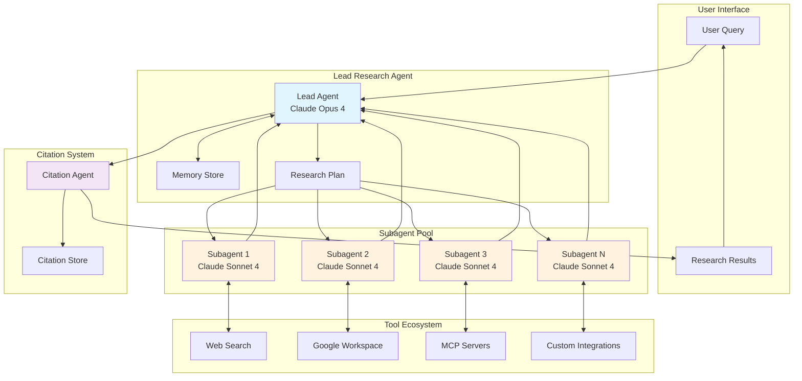

### Key Architectural Components

1. **Lead Research Agent**: The orchestrator that decomposes queries, creates execution plans, and synthesizes results
2. **Subagent Pool**: Specialized workers that execute parallel searches with independent context windows
3. **Memory Store**: Persistent context management for long-running research sessions
4. **Tool Ecosystem**: Diverse information sources accessed through standardized interfaces
5. **Citation System**: Ensures all claims are properly attributed to sources

## The Orchestrator-Worker Pattern {#orchestrator-worker-pattern}

The orchestrator-worker pattern enables sophisticated coordination while maintaining separation of concerns. Here's how the research workflow unfolds:

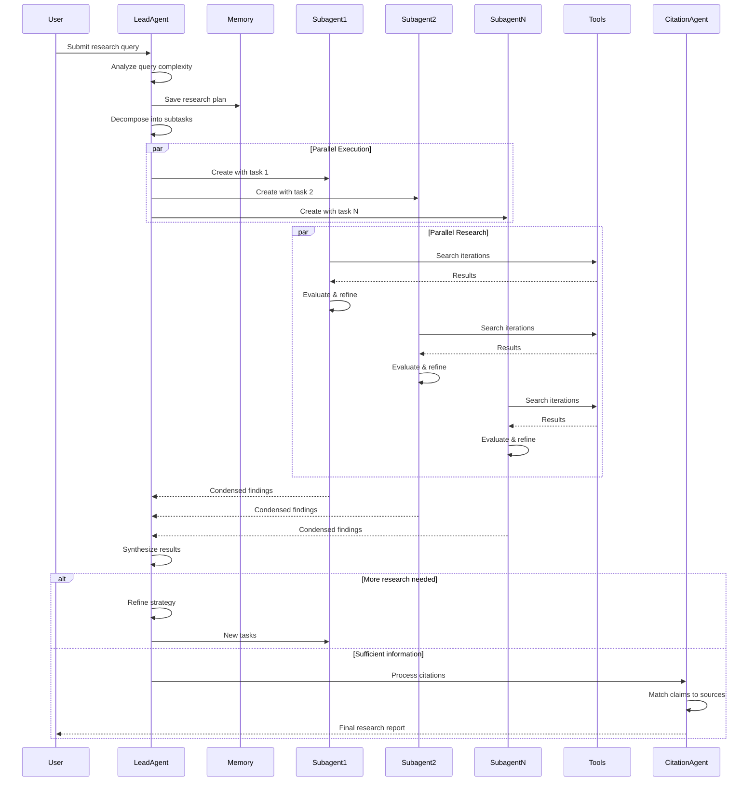

### Workflow Stages

1. **Query Analysis**: The lead agent evaluates query complexity and required effort
2. **Task Decomposition**: Complex queries are broken into parallelizable subtasks
3. **Subagent Creation**: Specialized agents are spawned with specific objectives
4. **Parallel Execution**: Subagents independently explore their assigned aspects
5. **Result Synthesis**: The lead agent combines findings into coherent insights
6. **Citation Processing**: A dedicated agent ensures proper source attribution

## Prompt Engineering for Agent Coordination {#prompt-engineering}

Prompt engineering for multi-agent systems differs fundamentally from single-agent prompting. The challenge isn't just instructing individual agents—it's orchestrating collaborative behavior across a distributed system.

### Key Prompting Principles

#### 1. Teaching Effective Delegation

The lead agent must provide subagents with:
- **Clear objectives**: Specific, measurable goals
- **Output formats**: Structured response requirements
- **Tool guidance**: Which tools to prioritize
- **Task boundaries**: What's in and out of scope

Example delegation pattern:
```
Subagent Task:
- Objective: Identify the top 5 AI companies by market cap in 2025
- Output: JSON list with {company, market_cap, source, date}
- Tools: Use web search, prioritize financial sites
- Boundaries: Focus only on pure-play AI companies, exclude conglomerates
```

#### 2. Scaling Effort to Complexity

Anthropic embedded explicit scaling rules in their prompts:

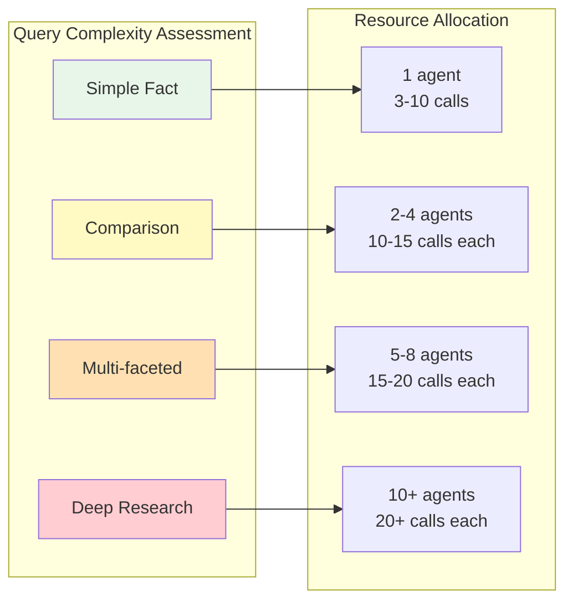

#### 3. Extended Thinking as a Controllable Scratchpad

The system leverages Claude's extended thinking mode for planning and evaluation:

```mermaid
flowchart TD
    subgraph "Lead Agent Thinking"
        T1[Assess query complexity]
        T2[Identify required tools]
        T3[Determine agent count]
        T4[Define subtask boundaries]
        T5[Plan synthesis approach]
    end
    
    subgraph "Subagent Thinking"
        S1[Evaluate search results]
        S2[Identify information gaps]
        S3[Refine query strategy]
        S4[Judge source quality]
        S5[Decide completion]
    end
    
    T1 --> T2 --> T3 --> T4 --> T5
    S1 --> S2 --> S3 --> S4 --> S5
```

#### 4. Tool Selection Heuristics

Agents receive explicit guidance for tool selection:
1. Examine all available tools first
2. Match tools to user intent
3. Prefer specialized tools over generic ones
4. Use web search for broad exploration
5. Validate tool descriptions match capabilities

### Parallel Execution Patterns

The system achieves dramatic speed improvements through two levels of parallelization:

1. **Lead agent parallelization**: Spawning 3-5 subagents simultaneously
2. **Subagent parallelization**: Each subagent using 3+ tools in parallel

This reduced research time by up to **90%** for complex queries.

## Evaluation Strategies for Multi-Agent Systems {#evaluation-strategies}

Evaluating multi-agent systems presents unique challenges due to their emergent behaviors and non-deterministic execution paths. Anthropic developed a multi-layered evaluation approach:

### Evaluation Framework

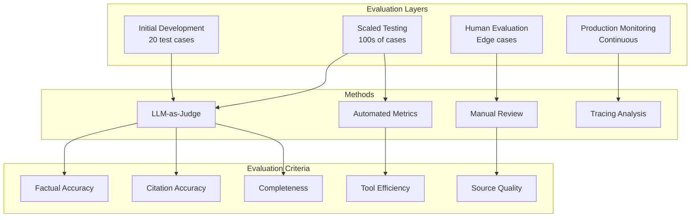

### Key Evaluation Insights

1. **Start Small, Iterate Fast**: With effect sizes often exceeding 50%, even 20 test cases can reveal significant improvements

2. **LLM-as-Judge Scaling**: A single LLM judge with comprehensive rubrics outperformed multiple specialized judges

3. **Human Evaluation Remains Critical**: Humans caught biases like preference for SEO-optimized content over authoritative sources

4. **End-State vs. Process Evaluation**: Focus on outcomes rather than prescribing specific paths

## Production Engineering Challenges {#production-challenges}

Moving from prototype to production revealed several critical engineering challenges unique to multi-agent systems:

### State Management and Error Handling

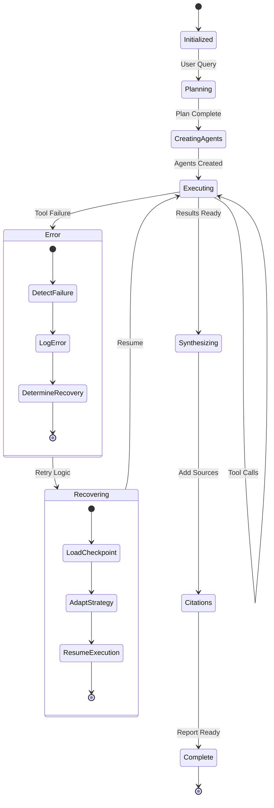

### Key Production Challenges

1. **Error Compounding**: Minor failures cascade into major behavioral changes
   - Solution: Checkpoint systems and intelligent error recovery

2. **Debugging Complexity**: Non-deterministic execution makes reproduction difficult
   - Solution: Comprehensive tracing and decision pattern monitoring

3. **Deployment Coordination**: Stateful agents can't be updated mid-execution
   - Solution: Rainbow deployments with gradual traffic shifting

4. **Context Window Management**: Extended conversations exceed limits
   - Solution: Intelligent compression and memory mechanisms

### Observability Architecture

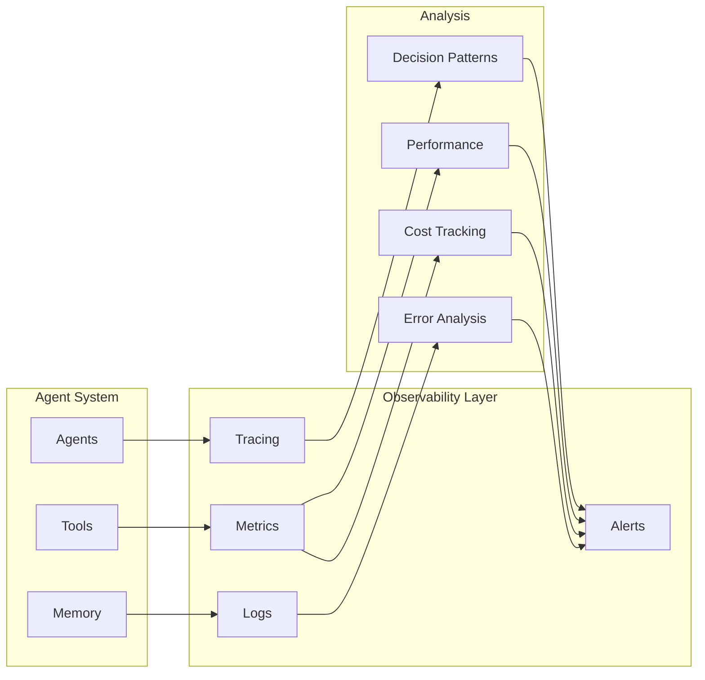

## Performance Metrics and Token Economics {#performance-metrics}

Understanding the economics of multi-agent systems is crucial for production deployment:

### Token Usage Analysis

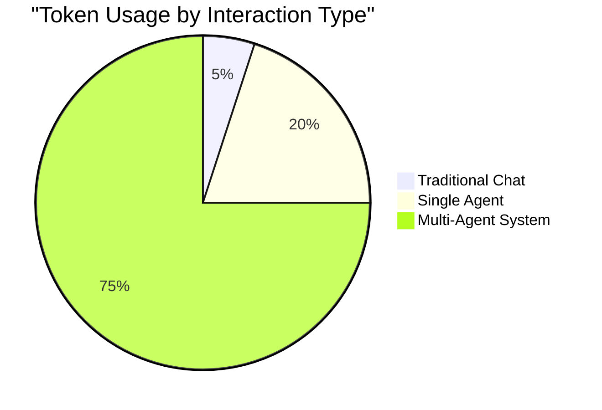

Key findings from Anthropic's analysis:
- **Token usage explains 80% of performance variance**
- **Number of tool calls adds 10% variance**
- **Model choice contributes 5% variance**
- **Other factors account for 5%**

### Performance Scaling

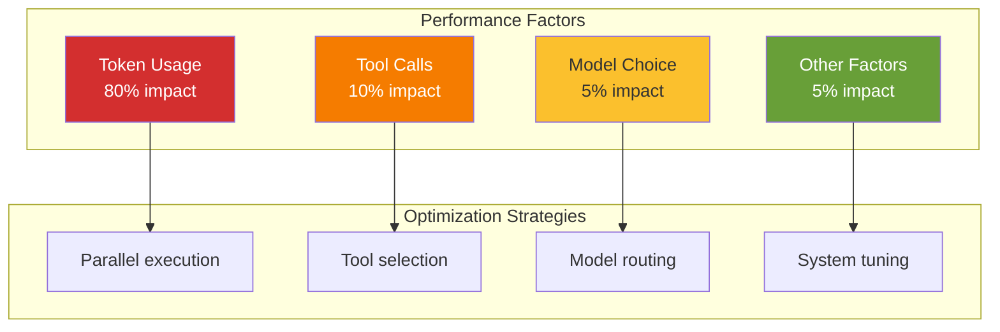

### Cost-Benefit Analysis

Multi-agent systems are economically viable when:
- Task value exceeds 15× chat interaction cost
- Heavy parallelization is possible
- Information exceeds single context windows
- Complex tool orchestration is required

## Lessons Learned and Best Practices {#lessons-learned}

### Architecture Patterns That Work

1. **Separation of Concerns**: Each agent should have a distinct, well-defined role
2. **Hierarchical Coordination**: Clear delegation chains prevent coordination chaos
3. **Parallel by Default**: Design for concurrent execution from the start
4. **Graceful Degradation**: Systems should handle partial failures intelligently

### Tool Design Principles

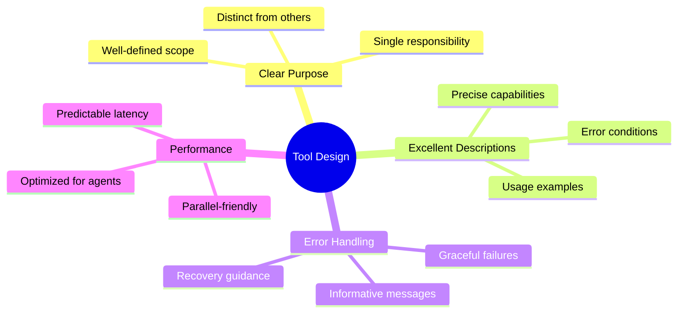

### Prompt Engineering Best Practices

1. **Think Like Your Agents**: Use simulations to understand prompt effects
2. **Encode Human Heuristics**: Study expert approaches and encode them
3. **Start Broad, Then Narrow**: Mirror human research patterns
4. **Let Agents Improve Themselves**: Use Claude to optimize prompts

### Evaluation Strategy

1. **Start Immediately**: Even 20 test cases provide valuable signal
2. **Combine Methods**: LLM judges + human review + automated metrics
3. **Focus on Outcomes**: Evaluate end states, not prescribed paths
4. **Monitor Emergent Behaviors**: Watch for unexpected interaction patterns

## Future Directions {#future-directions}

### Asynchronous Execution

The current synchronous execution model creates bottlenecks. Future iterations will likely implement:

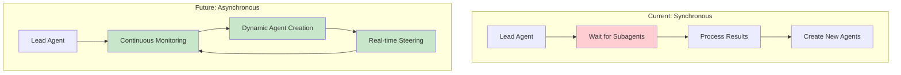

### Enhanced Coordination Mechanisms

Future systems may implement:
- **Inter-agent communication**: Direct subagent coordination
- **Dynamic task redistribution**: Load balancing across agents
- **Adaptive resource allocation**: Scaling based on task complexity
- **Learned coordination patterns**: ML-optimized delegation strategies

### Domain Specialization

While research tasks benefit enormously from multi-agent systems, other domains present opportunities:

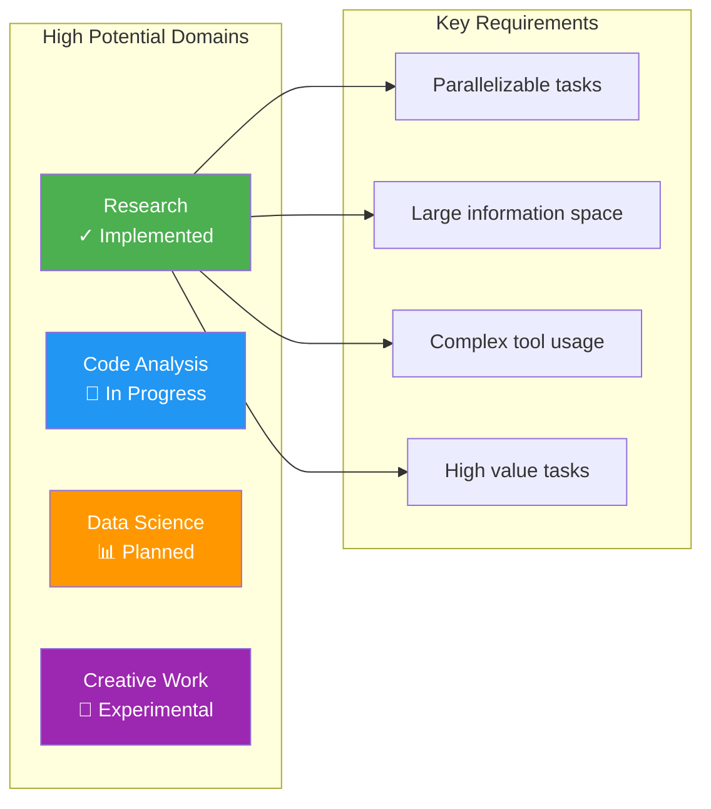

## Common Use Cases in Production

Based on Anthropic's analysis, the top use cases for their Research feature include:

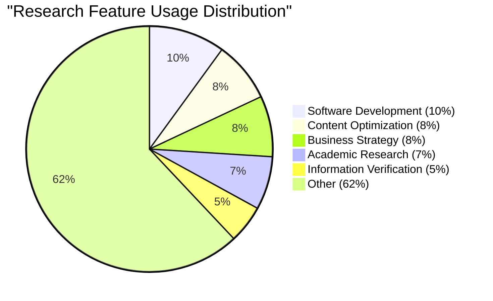

Users report saving days of work by:
- Finding business opportunities they hadn't considered
- Navigating complex healthcare options
- Resolving technical bugs through comprehensive searches
- Uncovering research connections across disciplines

## Implementation Considerations

### When to Use Multi-Agent Systems

✅ **Good Fit:**
- Open-ended research tasks
- Problems requiring broad exploration
- Tasks exceeding single context windows
- Workflows with parallelizable subtasks
- High-value outputs justifying token costs

❌ **Poor Fit:**
- Simple, deterministic workflows
- Tasks requiring shared context
- Real-time coordination needs
- Low-value or high-frequency operations

### Getting Started

For teams considering multi-agent architectures:

1. **Start with a clear use case**: Identify tasks with natural parallelization
2. **Build incrementally**: Begin with 2-3 agents before scaling
3. **Invest in observability early**: You'll need it for debugging
4. **Create small evaluation sets**: 20 good test cases beat 200 mediocre ones
5. **Expect iteration**: The gap between prototype and production is wide

## Conclusion {#conclusion}

Anthropic's multi-agent research system demonstrates that the future of AI isn't just about more capable individual models—it's about orchestrating multiple agents to achieve collective intelligence. The 90.2% performance improvement over single-agent systems isn't just a benchmark; it represents a fundamental shift in how we approach complex, open-ended problems.

The journey from prototype to production revealed critical insights:
- **Architecture matters**: The orchestrator-worker pattern provides the right balance of coordination and autonomy
- **Prompt engineering is system design**: In multi-agent systems, prompts define collaborative behavior
- **Evaluation requires new approaches**: Traditional methods don't capture emergent behaviors
- **Production readiness is hard**: Error compounding and state management require robust engineering

As we move forward, multi-agent systems will likely become the standard for tackling complex tasks that require:
- Exploring vast information spaces
- Coordinating diverse tools and APIs
- Maintaining state across extended interactions
- Scaling beyond single context windows

The lessons from Anthropic's Research feature provide a roadmap for teams building the next generation of AI systems. While challenges remain—particularly around asynchronous execution and inter-agent coordination—the potential is clear: multi-agent systems can transform how we solve complex problems, from scientific research to business strategy to creative endeavors.

The key takeaway? When individual intelligence reaches a threshold, collective intelligence becomes the multiplier. Just as human civilization advanced through cooperation and specialization, AI systems are beginning their own journey toward collaborative problem-solving. The future isn't just smarter agents—it's smarter systems of agents working together.

---

## Appendix: Additional Implementation Tips

### Long-Horizon Conversation Management
- Implement checkpoint systems for conversations spanning hundreds of turns
- Use external memory stores to persist critical information
- Spawn fresh subagents with clean contexts when approaching limits
- Design handoff protocols for context continuity

### Subagent Output Optimization
- Allow direct filesystem writes to minimize information loss
- Use artifact systems for structured outputs (code, reports, visualizations)
- Pass lightweight references instead of copying large outputs
- Implement specialized output formats for different agent types

### Memory Architecture Patterns

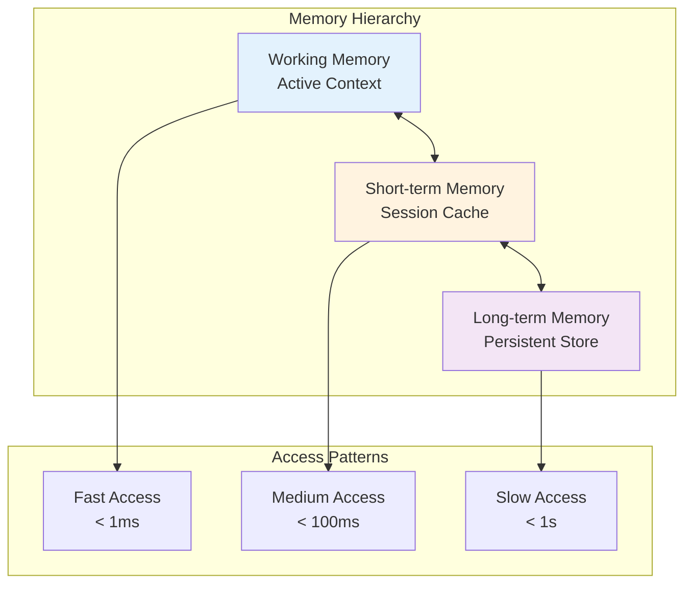

### State Management Strategies
- Focus on end-state evaluation for state-mutating agents
- Break complex workflows into discrete checkpoints
- Implement rollback mechanisms for critical operations
- Design idempotent operations where possible

The multi-agent revolution is just beginning. As these systems mature and new patterns emerge, we'll continue discovering better ways to orchestrate collective AI intelligence. The journey from individual to collective intelligence—whether human or artificial—remains one of the most fascinating challenges in computer science.

---

*This analysis is based on Anthropic's engineering blog post about their multi-agent research system, with additional architectural insights and implementation patterns drawn from production experience with multi-agent systems.*