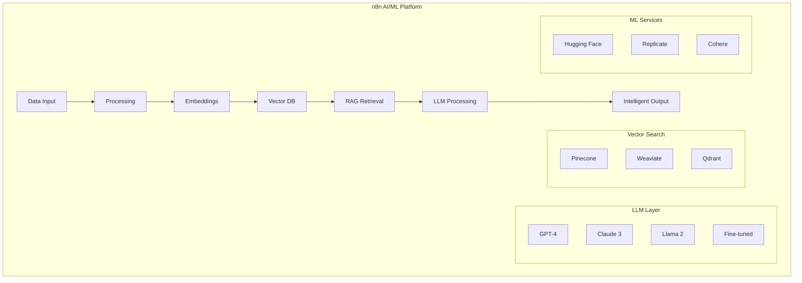

# n8n AI/ML Workflows: Building Intelligent Automation with LLMs & Vector Databases

## Introduction

n8n's AI/ML capabilities transform traditional automation into intelligent, adaptive systems. By integrating cutting-edge LLMs, vector databases, and machine learning services, n8n enables you to build sophisticated AI workflows that learn, reason, and make decisions autonomously.

### AI Integration Capabilities

- 🤖 **10+ LLM Integrations**: GPT-4, Claude, Llama, Mistral
- 🔍 **Vector Databases**: Pinecone, Weaviate, Qdrant, Chroma
- 🧠 **ML Platforms**: Hugging Face, Replicate, Cohere
- 📊 **Embeddings**: OpenAI, Cohere, Sentence Transformers
- 🔄 **RAG Systems**: Retrieval-Augmented Generation
- 🎯 **Fine-tuning**: Custom model training automation

## AI/ML Architecture in n8n



## Building RAG (Retrieval-Augmented Generation) Systems

### 1. Complete RAG Implementation

```javascript
// RAG system with vector search and LLM
class RAGSystem {
  constructor(config) {
    this.vectorDB = this.initVectorDB(config.vectorDB);
    this.llm = this.initLLM(config.llm);
    this.embedder = this.initEmbedder(config.embedder);
    this.chunkSize = config.chunkSize || 1000;
    this.overlapSize = config.overlapSize || 200;
  }
  
  async ingestDocuments(documents) {
    const processedDocs = [];
    
    for (const doc of documents) {
      // Extract and clean text
      const text = await this.extractText(doc);
      
      // Chunk document
      const chunks = this.chunkText(text, this.chunkSize, this.overlapSize);
      
      // Generate embeddings for each chunk
      for (const chunk of chunks) {
        const embedding = await this.embedder.embed(chunk.text);
        
        // Store in vector database
        await this.vectorDB.upsert({
          id: generateId(),
          values: embedding,
          metadata: {
            source: doc.source,
            chunk: chunk.index,
            text: chunk.text,
            timestamp: new Date().toISOString()
          }
        });
        
        processedDocs.push({
          docId: doc.id,
          chunkId: chunk.id,
          status: 'indexed'
        });
      }
    }
    
    return processedDocs;
  }
  
  async query(question, context = {}) {
    // Generate query embedding
    const queryEmbedding = await this.embedder.embed(question);
    
    // Search vector database
    const searchResults = await this.vectorDB.query({
      vector: queryEmbedding,
      topK: context.topK || 5,
      filter: context.filter || {},
      includeMetadata: true
    });
    
    // Prepare context from search results
    const retrievedContext = searchResults.matches
      .map(match => match.metadata.text)
      .join('\n\n');
    
    // Generate response with LLM
    const response = await this.generateResponse(
      question,
      retrievedContext,
      context
    );
    
    return {
      answer: response.text,
      sources: searchResults.matches.map(m => ({
        source: m.metadata.source,
        relevance: m.score,
        text: m.metadata.text.substring(0, 200) + '...'
      })),
      confidence: this.calculateConfidence(searchResults, response)
    };
  }
  
  async generateResponse(question, context, options = {}) {
    const prompt = `
      You are an AI assistant with access to specific context information.
      Use the following context to answer the question accurately.
      If the answer cannot be found in the context, say so.
      
      Context:
      ${context}
      
      Question: ${question}
      
      Instructions:
      - Be concise and accurate
      - Cite sources when possible
      - Explain your reasoning
      ${options.additionalInstructions || ''}
    `;
    
    const response = await this.llm.complete({
      prompt: prompt,
      maxTokens: options.maxTokens || 500,
      temperature: options.temperature || 0.7,
      stream: options.stream || false
    });
    
    return response;
  }
  
  chunkText(text, chunkSize, overlapSize) {
    const chunks = [];
    const sentences = this.splitIntoSentences(text);
    let currentChunk = [];
    let currentSize = 0;
    
    for (let i = 0; i < sentences.length; i++) {
      const sentence = sentences[i];
      currentChunk.push(sentence);
      currentSize += sentence.length;
      
      if (currentSize >= chunkSize) {
        chunks.push({
          index: chunks.length,
          text: currentChunk.join(' '),
          start: Math.max(0, i - currentChunk.length + 1),
          end: i
        });
        
        // Keep overlap
        const overlapSentences = [];
        let overlapLength = 0;
        
        for (let j = currentChunk.length - 1; j >= 0; j--) {
          overlapLength += currentChunk[j].length;
          if (overlapLength <= overlapSize) {
            overlapSentences.unshift(currentChunk[j]);
          } else {
            break;
          }
        }
        
        currentChunk = overlapSentences;
        currentSize = overlapLength;
      }
    }
    
    // Add remaining chunk
    if (currentChunk.length > 0) {
      chunks.push({
        index: chunks.length,
        text: currentChunk.join(' ')
      });
    }
    
    return chunks;
  }
}
```

### 2. Semantic Search Implementation

```javascript
// Advanced semantic search with re-ranking
class SemanticSearch {
  constructor(vectorDB, embedder) {
    this.vectorDB = vectorDB;
    this.embedder = embedder;
    this.reranker = new Reranker();
  }
  
  async hybridSearch(query, options = {}) {
    // Parallel search strategies
    const searches = await Promise.all([
      this.vectorSearch(query, options),
      this.keywordSearch(query, options),
      this.conceptSearch(query, options)
    ]);
    
    // Merge and deduplicate results
    const merged = this.mergeResults(searches);
    
    // Re-rank using cross-encoder
    const reranked = await this.reranker.rerank(query, merged);
    
    // Apply filters and limits
    const filtered = this.applyFilters(reranked, options.filters);
    
    return filtered.slice(0, options.limit || 10);
  }
  
  async vectorSearch(query, options) {
    // Generate multiple embeddings for query expansion
    const embeddings = await this.generateQueryEmbeddings(query);
    
    const results = [];
    
    for (const embedding of embeddings) {
      const searchResults = await this.vectorDB.query({
        vector: embedding.vector,
        topK: options.topK || 20,
        filter: options.filter,
        includeMetadata: true
      });
      
      results.push(...searchResults.matches.map(match => ({
        ...match,
        method: 'vector',
        weight: embedding.weight
      })));
    }
    
    return results;
  }
  
  async generateQueryEmbeddings(query) {
    const embeddings = [];
    
    // Original query
    embeddings.push({
      vector: await this.embedder.embed(query),
      weight: 1.0
    });
    
    // Query expansion with synonyms
    const expanded = await this.expandQuery(query);
    if (expanded) {
      embeddings.push({
        vector: await this.embedder.embed(expanded),
        weight: 0.7
      });
    }
    
    // Hypothetical answer embedding
    const hypothetical = await this.generateHypotheticalAnswer(query);
    if (hypothetical) {
      embeddings.push({
        vector: await this.embedder.embed(hypothetical),
        weight: 0.5
      });
    }
    
    return embeddings;
  }
  
  async generateHypotheticalAnswer(query) {
    const prompt = `
      Generate a hypothetical perfect answer to this question:
      "${query}"
      
      The answer should be factual and comprehensive.
    `;
    
    const response = await this.llm.complete({
      prompt: prompt,
      maxTokens: 200,
      temperature: 0.7
    });
    
    return response.text;
  }
}
```

## AI Agent Workflows

### 1. Autonomous AI Agent System

```javascript
// Multi-agent AI system
class AIAgentSystem {
  constructor() {
    this.agents = new Map();
    this.memory = new AgentMemory();
    this.toolRegistry = new ToolRegistry();
  }
  
  createAgent(config) {
    const agent = new AIAgent({
      id: config.id,
      role: config.role,
      llm: config.llm,
      tools: this.toolRegistry.getTools(config.tools),
      memory: this.memory.createNamespace(config.id),
      personality: config.personality,
      constraints: config.constraints
    });
    
    this.agents.set(config.id, agent);
    return agent;
  }
  
  async executeTask(task, options = {}) {
    // Select appropriate agent(s)
    const agents = this.selectAgents(task);
    
    // Plan execution strategy
    const plan = await this.planExecution(task, agents);
    
    // Execute plan
    const results = [];
    
    for (const step of plan.steps) {
      const agent = this.agents.get(step.agentId);
      
      // Provide context from previous steps
      const context = this.buildContext(results, step);
      
      // Execute step
      const result = await agent.execute(step.task, context);
      
      results.push({
        step: step.id,
        agent: step.agentId,
        result: result,
        timestamp: new Date()
      });
      
      // Check if we should continue
      if (result.status === 'failed' && !step.optional) {
        break;
      }
    }
    
    // Synthesize final result
    return this.synthesizeResults(results, task);
  }
  
  async planExecution(task, agents) {
    const planner = this.agents.get('planner') || agents[0];
    
    const prompt = `
      Task: ${task.description}
      Available Agents: ${agents.map(a => `${a.id}: ${a.role}`).join(', ')}
      
      Create an execution plan that:
      1. Breaks down the task into steps
      2. Assigns each step to the most appropriate agent
      3. Defines dependencies between steps
      4. Identifies which steps can be parallel
      
      Output format: JSON array of steps
    `;
    
    const plan = await planner.think(prompt);
    return this.parsePlan(plan);
  }
}

// Individual AI Agent
class AIAgent {
  constructor(config) {
    this.id = config.id;
    this.role = config.role;
    this.llm = config.llm;
    this.tools = config.tools;
    this.memory = config.memory;
    this.personality = config.personality;
  }
  
  async execute(task, context) {
    // Retrieve relevant memories
    const memories = await this.memory.retrieve(task);
    
    // Build prompt with personality and context
    const prompt = this.buildPrompt(task, context, memories);
    
    // Think step by step
    const thoughts = await this.think(prompt);
    
    // Decide on actions
    const actions = await this.decideActions(thoughts, task);
    
    // Execute actions
    const results = await this.executeActions(actions);
    
    // Store in memory
    await this.memory.store({
      task: task,
      thoughts: thoughts,
      actions: actions,
      results: results
    });
    
    return results;
  }
  
  async think(prompt) {
    const systemPrompt = `
      You are ${this.role}.
      Personality: ${this.personality}
      
      Think step by step about the task.
      Consider all available tools and information.
      Be thorough but efficient.
    `;
    
    const response = await this.llm.complete({
      systemPrompt: systemPrompt,
      prompt: prompt,
      temperature: 0.7
    });
    
    return response;
  }
  
  async executeActions(actions) {
    const results = [];
    
    for (const action of actions) {
      const tool = this.tools.get(action.tool);
      
      if (tool) {
        try {
          const result = await tool.execute(action.params);
          results.push({
            action: action.name,
            status: 'success',
            result: result
          });
        } catch (error) {
          results.push({
            action: action.name,
            status: 'failed',
            error: error.message
          });
        }
      }
    }
    
    return results;
  }
}
```

### 2. Chain-of-Thought Reasoning

```javascript
// Advanced reasoning with Chain-of-Thought
class ChainOfThoughtReasoning {
  async reason(problem, options = {}) {
    const steps = [];
    
    // Initial problem decomposition
    const decomposition = await this.decomposeProblem(problem);
    steps.push({ type: 'decomposition', content: decomposition });
    
    // Reasoning for each sub-problem
    for (const subProblem of decomposition.subProblems) {
      const reasoning = await this.reasonStep(subProblem);
      steps.push({
        type: 'reasoning',
        problem: subProblem,
        reasoning: reasoning
      });
    }
    
    // Synthesis
    const synthesis = await this.synthesize(steps);
    steps.push({ type: 'synthesis', content: synthesis });
    
    // Verification
    const verification = await this.verify(synthesis, problem);
    steps.push({ type: 'verification', content: verification });
    
    // Self-critique
    if (options.critique) {
      const critique = await this.selfCritique(steps);
      steps.push({ type: 'critique', content: critique });
      
      // Refinement if needed
      if (critique.needsRefinement) {
        const refined = await this.refine(steps, critique);
        steps.push({ type: 'refinement', content: refined });
      }
    }
    
    return {
      solution: synthesis.solution,
      confidence: verification.confidence,
      reasoning: steps,
      explanation: this.generateExplanation(steps)
    };
  }
  
  async decomposeProblem(problem) {
    const prompt = `
      Decompose this problem into smaller, manageable sub-problems:
      
      ${problem}
      
      For each sub-problem:
      1. Clearly define what needs to be solved
      2. Identify dependencies on other sub-problems
      3. Estimate complexity
      
      Think step by step.
    `;
    
    const response = await this.llm.complete({ prompt });
    return this.parseDecomposition(response);
  }
  
  async reasonStep(subProblem) {
    const prompt = `
      Solve this sub-problem step by step:
      
      ${subProblem.description}
      
      Show your reasoning:
      1. What do we know?
      2. What approach should we take?
      3. Work through the solution
      4. Check the result
    `;
    
    const response = await this.llm.complete({
      prompt,
      temperature: 0.3 // Lower temperature for logical reasoning
    });
    
    return response;
  }
  
  async selfCritique(steps) {
    const prompt = `
      Critically evaluate this reasoning process:
      
      ${JSON.stringify(steps, null, 2)}
      
      Identify:
      1. Logical flaws or inconsistencies
      2. Missing considerations
      3. Stronger alternative approaches
      4. Confidence level in the solution
      
      Be thorough and honest.
    `;
    
    const response = await this.llm.complete({ prompt });
    return this.parseCritique(response);
  }
}
```

## Model Training & Fine-tuning Automation

### 1. Automated Model Training Pipeline

```javascript
// ML model training automation
class ModelTrainingPipeline {
  async trainModel(config) {
    const pipeline = {
      dataPrep: await this.prepareData(config.data),
      training: await this.train(config),
      evaluation: await this.evaluate(config),
      deployment: await this.deploy(config)
    };
    
    return pipeline;
  }
  
  async prepareData(dataConfig) {
    // Load data from various sources
    const rawData = await this.loadData(dataConfig.sources);
    
    // Clean and preprocess
    const cleaned = await this.cleanData(rawData);
    
    // Feature engineering
    const features = await this.engineerFeatures(cleaned);
    
    // Split data
    const splits = this.splitData(features, {
      train: 0.7,
      validation: 0.15,
      test: 0.15
    });
    
    // Generate statistics
    const stats = await this.generateStatistics(splits);
    
    return {
      splits: splits,
      stats: stats,
      features: features.columns
    };
  }
  
  async train(config) {
    // Initialize training
    const trainer = new ModelTrainer({
      model: config.model,
      hyperparameters: config.hyperparameters,
      hardware: config.hardware || 'auto'
    });
    
    // Training loop with monitoring
    const history = [];
    
    for (let epoch = 0; epoch < config.epochs; epoch++) {
      const metrics = await trainer.trainEpoch(epoch);
      history.push(metrics);
      
      // Early stopping check
      if (this.shouldStop(history)) {
        break;
      }
      
      // Learning rate scheduling
      trainer.adjustLearningRate(epoch, metrics);
      
      // Checkpoint saving
      if (epoch % config.checkpointFreq === 0) {
        await trainer.saveCheckpoint(epoch);
      }
    }
    
    return {
      model: trainer.model,
      history: history,
      bestEpoch: this.findBestEpoch(history)
    };
  }
  
  async evaluate(config) {
    const evaluator = new ModelEvaluator(config.model);
    
    // Run evaluation on test set
    const testMetrics = await evaluator.evaluate(config.testData);
    
    // Generate visualizations
    const visualizations = await this.generateVisualizations(testMetrics);
    
    // Error analysis
    const errorAnalysis = await this.analyzeErrors(
      config.model,
      config.testData
    );
    
    // Generate report
    const report = await this.generateReport({
      metrics: testMetrics,
      visualizations: visualizations,
      errorAnalysis: errorAnalysis
    });
    
    return report;
  }
  
  async deploy(config) {
    // Model optimization
    const optimized = await this.optimizeModel(config.model);
    
    // Create API endpoint
    const endpoint = await this.createEndpoint(optimized);
    
    // Set up monitoring
    const monitoring = await this.setupMonitoring(endpoint);
    
    // A/B testing setup
    if (config.abTesting) {
      await this.setupABTesting(endpoint, config.abTesting);
    }
    
    return {
      endpoint: endpoint,
      monitoring: monitoring,
      status: 'deployed'
    };
  }
}
```

### 2. Fine-tuning Automation

```javascript
// LLM fine-tuning automation
class FineTuningAutomation {
  async fineTuneLLM(baseModel, dataset, config) {
    // Prepare training data
    const trainingData = await this.prepareTrainingData(dataset);
    
    // Validate data format
    const validation = await this.validateData(trainingData);
    if (!validation.valid) {
      throw new Error(`Data validation failed: ${validation.errors}`);
    }
    
    // Create fine-tuning job
    const job = await this.createFineTuningJob({
      model: baseModel,
      trainingFile: trainingData.fileId,
      validationFile: trainingData.validationFileId,
      hyperparameters: {
        nEpochs: config.epochs || 4,
        batchSize: config.batchSize || 4,
        learningRateMultiplier: config.learningRate || 1.0,
        promptLossWeight: config.promptLossWeight || 0.01
      }
    });
    
    // Monitor training
    const status = await this.monitorTraining(job.id);
    
    // Evaluate fine-tuned model
    const evaluation = await this.evaluateModel(status.fineTunedModel);
    
    return {
      modelId: status.fineTunedModel,
      job: job,
      evaluation: evaluation
    };
  }
  
  async prepareTrainingData(dataset) {
    const formatted = [];
    
    for (const example of dataset) {
      // Format for fine-tuning
      const formatted Example = {
        messages: [
          {
            role: 'system',
            content: example.system || 'You are a helpful assistant.'
          },
          {
            role: 'user',
            content: example.prompt
          },
          {
            role: 'assistant',
            content: example.completion
          }
        ]
      };
      
      formatted.push(formattedExample);
    }
    
    // Upload to provider
    const fileId = await this.uploadTrainingFile(formatted);
    
    return {
      fileId: fileId,
      examples: formatted.length
    };
  }
  
  async monitorTraining(jobId) {
    let status;
    
    do {
      status = await this.getJobStatus(jobId);
      
      // Log progress
      console.log(`Training progress: ${status.progress}%`);
      
      // Check for errors
      if (status.status === 'failed') {
        throw new Error(`Training failed: ${status.error}`);
      }
      
      // Wait before next check
      await new Promise(resolve => setTimeout(resolve, 30000)); // 30 seconds
      
    } while (status.status !== 'succeeded');
    
    return status;
  }
}
```

## Computer Vision Workflows

### 1. Image Analysis Pipeline

```javascript
// Computer vision automation
class ComputerVisionPipeline {
  async analyzeImage(image, tasks = ['all']) {
    const results = {};
    
    if (tasks.includes('all') || tasks.includes('classification')) {
      results.classification = await this.classifyImage(image);
    }
    
    if (tasks.includes('all') || tasks.includes('detection')) {
      results.detection = await this.detectObjects(image);
    }
    
    if (tasks.includes('all') || tasks.includes('segmentation')) {
      results.segmentation = await this.segmentImage(image);
    }
    
    if (tasks.includes('all') || tasks.includes('ocr')) {
      results.text = await this.extractText(image);
    }
    
    if (tasks.includes('all') || tasks.includes('face')) {
      results.faces = await this.detectFaces(image);
    }
    
    // Generate description
    results.description = await this.generateDescription(results);
    
    return results;
  }
  
  async detectObjects(image) {
    // Use YOLO or similar model
    const model = await this.loadModel('yolov8');
    const detections = await model.detect(image);
    
    return detections.map(det => ({
      class: det.class,
      confidence: det.confidence,
      bbox: det.bbox,
      mask: det.mask
    }));
  }
  
  async generateDescription(analysis) {
    const prompt = `
      Generate a natural language description of this image based on the analysis:
      
      Classification: ${JSON.stringify(analysis.classification)}
      Objects: ${JSON.stringify(analysis.detection)}
      Text found: ${analysis.text}
      
      Provide a coherent, human-readable description.
    `;
    
    const description = await this.llm.complete({ prompt });
    return description.text;
  }
}
```

### 2. Video Processing Automation

```javascript
// Video analysis and processing
class VideoProcessingAutomation {
  async processVideo(video, config) {
    // Extract frames
    const frames = await this.extractFrames(video, config.frameRate);
    
    // Analyze each frame
    const frameAnalysis = [];
    for (const frame of frames) {
      const analysis = await this.analyzeFrame(frame);
      frameAnalysis.push(analysis);
    }
    
    // Detect scenes
    const scenes = await this.detectScenes(frameAnalysis);
    
    // Extract audio
    const audio = await this.extractAudio(video);
    
    // Transcribe audio
    const transcript = await this.transcribeAudio(audio);
    
    // Generate summary
    const summary = await this.generateVideoSummary({
      frames: frameAnalysis,
      scenes: scenes,
      transcript: transcript
    });
    
    return {
      duration: video.duration,
      frames: frameAnalysis.length,
      scenes: scenes,
      transcript: transcript,
      summary: summary
    };
  }
  
  async detectScenes(frameAnalysis) {
    const scenes = [];
    let currentScene = { start: 0, frames: [] };
    
    for (let i = 0; i < frameAnalysis.length; i++) {
      const frame = frameAnalysis[i];
      
      // Check for scene change
      if (i > 0) {
        const similarity = this.calculateSimilarity(
          frameAnalysis[i - 1],
          frame
        );
        
        if (similarity < 0.7) {
          // Scene change detected
          currentScene.end = i - 1;
          scenes.push(currentScene);
          currentScene = { start: i, frames: [] };
        }
      }
      
      currentScene.frames.push(frame);
    }
    
    // Add last scene
    currentScene.end = frameAnalysis.length - 1;
    scenes.push(currentScene);
    
    // Analyze each scene
    for (const scene of scenes) {
      scene.description = await this.describeScene(scene);
      scene.keyFrame = this.selectKeyFrame(scene);
    }
    
    return scenes;
  }
}
```

## Natural Language Processing

### 1. Advanced NLP Pipeline

```javascript
// NLP processing automation
class NLPPipeline {
  async processText(text, tasks = ['all']) {
    const results = {};
    
    // Tokenization and basic processing
    const processed = await this.preprocessText(text);
    
    if (tasks.includes('all') || tasks.includes('entities')) {
      results.entities = await this.extractEntities(processed);
    }
    
    if (tasks.includes('all') || tasks.includes('sentiment')) {
      results.sentiment = await this.analyzeSentiment(processed);
    }
    
    if (tasks.includes('all') || tasks.includes('summary')) {
      results.summary = await this.summarize(text);
    }
    
    if (tasks.includes('all') || tasks.includes('classification')) {
      results.classification = await this.classifyText(processed);
    }
    
    if (tasks.includes('all') || tasks.includes('keywords')) {
      results.keywords = await this.extractKeywords(processed);
    }
    
    if (tasks.includes('all') || tasks.includes('translation')) {
      results.translations = await this.translateText(text);
    }
    
    return results;
  }
  
  async extractEntities(text) {
    // Named Entity Recognition
    const entities = await this.ner.extract(text);
    
    // Entity linking
    const linked = await this.linkEntities(entities);
    
    // Relationship extraction
    const relationships = await this.extractRelationships(entities);
    
    return {
      entities: linked,
      relationships: relationships,
      graph: this.buildKnowledgeGraph(linked, relationships)
    };
  }
  
  async summarize(text) {
    // Multiple summarization strategies
    const strategies = {
      extractive: await this.extractiveSummarize(text),
      abstractive: await this.abstractiveSummarize(text),
      bullets: await this.bulletPointSummarize(text)
    };
    
    // Generate final summary
    const finalSummary = await this.combineSummaries(strategies);
    
    return {
      summary: finalSummary,
      strategies: strategies,
      compression: finalSummary.length / text.length
    };
  }
}
```

## Production Examples

### 1. Customer Support AI

```javascript
// AI-powered customer support system
const customerSupportWorkflow = {
  name: 'AI Customer Support',
  
  nodes: [
    {
      type: 'webhook',
      name: 'Receive Message',
      config: { path: '/support/message' }
    },
    {
      type: 'function',
      name: 'Classify Intent',
      code: async (message) => {
        const intent = await classifyIntent(message);
        return { intent, confidence: intent.confidence };
      }
    },
    {
      type: 'switch',
      name: 'Route by Intent',
      rules: [
        { case: 'technical', output: 'technical_support' },
        { case: 'billing', output: 'billing_support' },
        { case: 'general', output: 'general_support' }
      ]
    },
    {
      type: 'rag',
      name: 'Search Knowledge Base',
      config: {
        vectorDB: 'pinecone',
        namespace: 'support_docs',
        topK: 5
      }
    },
    {
      type: 'llm',
      name: 'Generate Response',
      config: {
        model: 'gpt-4',
        systemPrompt: 'You are a helpful customer support agent.',
        temperature: 0.7
      }
    },
    {
      type: 'function',
      name: 'Check Response Quality',
      code: async (response) => {
        const quality = await assessResponseQuality(response);
        if (quality.score < 0.8) {
          return { escalate: true };
        }
        return { response, quality };
      }
    }
  ]
};
```

### 2. Document Intelligence System

```javascript
// Document processing and analysis
const documentIntelligenceWorkflow = {
  name: 'Document Intelligence',
  
  nodes: [
    {
      type: 'trigger',
      name: 'New Document',
      config: { source: 's3', bucket: 'documents' }
    },
    {
      type: 'ocr',
      name: 'Extract Text',
      config: { service: 'tesseract', language: 'auto' }
    },
    {
      type: 'nlp',
      name: 'Process Text',
      operations: ['entities', 'classification', 'summary']
    },
    {
      type: 'embedding',
      name: 'Generate Embeddings',
      config: { model: 'text-embedding-3-large' }
    },
    {
      type: 'vectorDB',
      name: 'Store in Vector DB',
      config: { 
        database: 'weaviate',
        collection: 'documents'
      }
    },
    {
      type: 'llm',
      name: 'Generate Insights',
      config: {
        model: 'claude-3-opus',
        prompt: 'Analyze this document and provide key insights'
      }
    }
  ]
};
```

## Best Practices

### 1. Prompt Engineering

```javascript
// Advanced prompt engineering
class PromptEngineering {
  generatePrompt(task, context) {
    const components = {
      role: this.defineRole(task),
      context: this.formatContext(context),
      instructions: this.createInstructions(task),
      examples: this.selectExamples(task),
      constraints: this.defineConstraints(task),
      output: this.specifyOutput(task)
    };
    
    return this.assemblePrompt(components);
  }
  
  assemblePrompt(components) {
    return `
      ${components.role}
      
      Context:
      ${components.context}
      
      Instructions:
      ${components.instructions}
      
      Examples:
      ${components.examples}
      
      Constraints:
      ${components.constraints}
      
      Output Format:
      ${components.output}
    `;
  }
}
```

### 2. Cost Optimization

```javascript
// AI/ML cost optimization
class CostOptimization {
  async optimizeWorkflow(workflow) {
    // Cache frequently used embeddings
    workflow.caching = {
      embeddings: true,
      ttl: 86400 // 24 hours
    };
    
    // Use appropriate models for each task
    workflow.modelSelection = {
      simple: 'gpt-3.5-turbo',
      complex: 'gpt-4',
      embedding: 'text-embedding-3-small'
    };
    
    // Batch operations
    workflow.batching = {
      enabled: true,
      size: 100
    };
    
    return workflow;
  }
}
```

## Conclusion

n8n's AI/ML capabilities enable you to build sophisticated intelligent automation systems that leverage the latest in artificial intelligence. From RAG systems to autonomous agents, from computer vision to NLP pipelines, n8n provides the tools and flexibility to implement cutting-edge AI solutions that learn, adapt, and deliver real business value.
