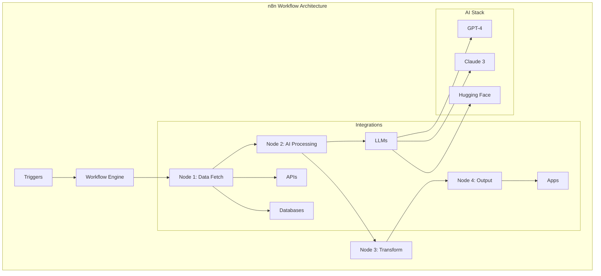
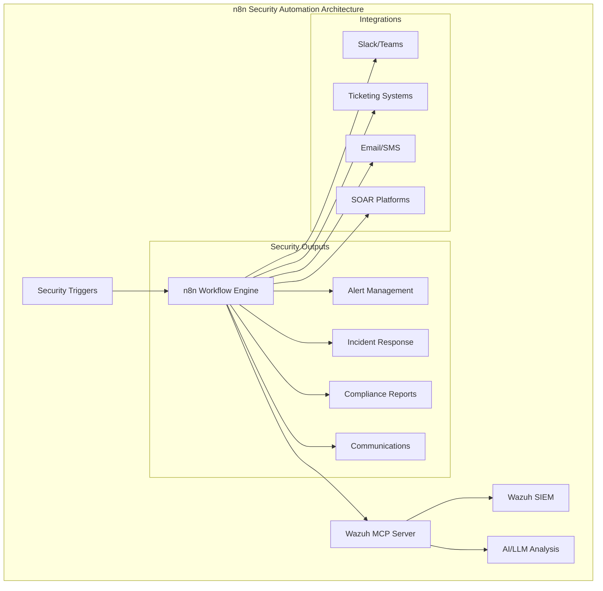

# n8n Automation: Complete Guide to Building 200+ Workflow Templates

## Introduction

n8n is a powerful, open-source workflow automation platform that combines traditional automation with modern AI capabilities. With over 400+ integrations and a visual workflow builder, n8n enables you to create sophisticated automations without extensive coding knowledge.

### Why n8n Stands Out

- 🌐 **Self-Hosted**: Complete data control and privacy
- 🔌 **400+ Integrations**: Connect virtually any service
- 🤖 **AI-Native**: Built-in AI capabilities with LLMs
- 🎨 **Visual Workflow Builder**: Intuitive drag-and-drop interface
- 💻 **Code When Needed**: JavaScript/Python support for complex logic
- 🔄 **Real-time Execution**: Instant workflow testing
- 📊 **Advanced Data Processing**: Transform and manipulate data easily
- 🚀 **Scalable**: From personal automation to enterprise workflows

## Architecture Overview



## Core Concepts

### 1. Nodes
Building blocks of workflows that perform specific actions:
- **Trigger Nodes**: Start workflows (webhooks, schedules, events)
- **Action Nodes**: Perform operations (API calls, data processing)
- **Logic Nodes**: Control flow (if/else, loops, merge)
- **AI Nodes**: AI operations (chat, embeddings, vector stores)

### 2. Connections
Data flows between nodes through connections, carrying:
- JSON data structures
- Binary data (files, images)
- Error information
- Execution metadata

### 3. Expressions
Dynamic data access using JavaScript expressions:
```javascript
// Access previous node data
{{ $json.customerName }}

// Transform data
{{ $json.price * 1.2 }}

// Complex logic
{{ $json.status === 'active' ? 'Process' : 'Skip' }}
```

## Real-World Implementation: E-Commerce Order Processing

Let's build a complete e-commerce automation workflow:

### Workflow Components

```yaml
name: E-Commerce Order Automation
trigger: Webhook (Shopify/WooCommerce)
nodes:
  - Order Validation
  - Inventory Check
  - Payment Processing
  - AI Customer Categorization
  - Email Notification
  - Shipping Integration
  - Analytics Update
```

### Step-by-Step Implementation

#### 1. Webhook Trigger Setup
```json
{
  "webhook": {
    "path": "/orders/new",
    "method": "POST",
    "authentication": "Bearer Token"
  }
}
```

#### 2. Order Validation Node
```javascript
// Custom JavaScript code in n8n
const order = $input.all()[0].json;

// Validate required fields
const requiredFields = ['email', 'items', 'shipping_address'];
const missingFields = requiredFields.filter(field => !order[field]);

if (missingFields.length > 0) {
  throw new Error(`Missing fields: ${missingFields.join(', ')}`);
}

// Validate items
const invalidItems = order.items.filter(item => 
  !item.sku || !item.quantity || item.quantity <= 0
);

if (invalidItems.length > 0) {
  throw new Error('Invalid items in order');
}

return {
  json: {
    ...order,
    validated: true,
    validatedAt: new Date().toISOString()
  }
};
```

#### 3. AI Customer Categorization
```javascript
// Using GPT-4 to categorize customer
const prompt = `
Analyze this customer order and categorize them:
- Order Value: $${order.total}
- Items: ${order.items.length}
- Previous Orders: ${order.customerHistory.orderCount}
- Total Spent: $${order.customerHistory.totalSpent}

Categories: VIP, Regular, New, At-Risk
Provide reasoning and recommendations.
`;

// AI node configuration
{
  "model": "gpt-4",
  "temperature": 0.3,
  "maxTokens": 200
}
```

#### 4. Dynamic Email Template
```html
<!-- Personalized email based on AI categorization -->
<html>
  <body>
    <h2>{{ $json.category === 'VIP' ? 'Thank you for being a valued customer!' : 'Thank you for your order!' }}</h2>
    
    <p>Hi {{ $json.customerName }},</p>
    
    <p>Your order #{{ $json.orderId }} has been confirmed.</p>
    
    {{ $json.category === 'VIP' ? '<p>As a VIP customer, enjoy free express shipping!</p>' : '' }}
    
    <h3>Order Details:</h3>
    <ul>
      {{ $json.items.map(item => `<li>${item.name} - Qty: ${item.quantity}</li>`).join('') }}
    </ul>
    
    <p>Total: ${{ $json.total }}</p>
    
    {{ $json.aiRecommendations ? `<h3>Recommended for you:</h3><p>${$json.aiRecommendations}</p>` : '' }}
  </body>
</html>
```

## Advanced Patterns

### 1. Error Handling & Retry Logic
```javascript
// Error handler node
try {
  // Main workflow logic
  const result = await processOrder($json);
  return { json: result };
} catch (error) {
  // Log to monitoring system
  await logError({
    workflow: 'order-processing',
    error: error.message,
    orderData: $json,
    timestamp: new Date()
  });
  
  // Retry logic
  if ($json.retryCount < 3) {
    return {
      json: {
        ...$json,
        retryCount: ($json.retryCount || 0) + 1,
        retry: true
      }
    };
  }
  
  // Send to dead letter queue
  throw error;
}
```

### 2. Parallel Processing
```yaml
Split Node:
  - Branch 1: Update Inventory
  - Branch 2: Process Payment
  - Branch 3: Generate Invoice
  - Branch 4: Notify Warehouse
  
Merge Node:
  - Wait for all branches
  - Combine results
  - Continue workflow
```

### 3. Conditional Routing
```javascript
// Router node logic
const routingRules = {
  'high-value': order => order.total > 1000,
  'international': order => order.shipping.country !== 'US',
  'express': order => order.shipping.type === 'express',
  'subscription': order => order.type === 'subscription'
};

const routes = Object.entries(routingRules)
  .filter(([key, rule]) => rule($json))
  .map(([key]) => key);

return {
  json: {
    ...$json,
    routes,
    primaryRoute: routes[0] || 'standard'
  }
};
```

## Integration Examples

### 1. CRM Integration (Salesforce/HubSpot)
```javascript
// Update customer record in CRM
const crmUpdate = {
  customerId: $json.customerId,
  lastOrderDate: new Date(),
  totalOrders: $json.customerHistory.orderCount + 1,
  lifetimeValue: $json.customerHistory.totalSpent + $json.total,
  category: $json.aiCategory,
  tags: ['active', $json.category.toLowerCase()],
  customFields: {
    preferredProducts: $json.frequentlyBought,
    communicationPreference: $json.emailPreference
  }
};
```

### 2. Analytics Pipeline
```javascript
// Send to data warehouse
const analyticsEvent = {
  eventType: 'order.completed',
  timestamp: Date.now(),
  userId: $json.customerId,
  properties: {
    orderId: $json.orderId,
    revenue: $json.total,
    products: $json.items.map(i => i.sku),
    category: $json.aiCategory,
    channel: $json.source,
    campaign: $json.utmParams
  },
  context: {
    ip: $json.ipAddress,
    userAgent: $json.userAgent,
    sessionId: $json.sessionId
  }
};

// Send to multiple analytics platforms
// Google Analytics, Mixpanel, Segment, etc.
```

### 3. Inventory Management
```javascript
// Real-time inventory update
const inventoryUpdates = $json.items.map(item => ({
  sku: item.sku,
  quantity: -item.quantity,
  warehouse: determineWarehouse($json.shipping.address),
  reservationId: $json.orderId,
  timestamp: new Date()
}));

// Check for low stock alerts
const lowStockItems = inventoryUpdates.filter(update => {
  const currentStock = getInventoryLevel(update.sku);
  return (currentStock + update.quantity) < REORDER_THRESHOLD;
});

if (lowStockItems.length > 0) {
  // Trigger reorder workflow
  return {
    json: {
      triggerReorder: true,
      items: lowStockItems
    }
  };
}
```

## Performance Optimization

### 1. Batch Processing
```javascript
// Batch multiple operations
const BATCH_SIZE = 100;
const items = $input.all();
const batches = [];

for (let i = 0; i < items.length; i += BATCH_SIZE) {
  batches.push(items.slice(i, i + BATCH_SIZE));
}

// Process batches in parallel
const results = await Promise.all(
  batches.map(batch => processBatch(batch))
);

return results.flat();
```

### 2. Caching Strategy
```javascript
// Implement caching for expensive operations
const cacheKey = `product_${$json.productId}`;
let productData = await getFromCache(cacheKey);

if (!productData) {
  productData = await fetchProductData($json.productId);
  await setCache(cacheKey, productData, 3600); // 1 hour TTL
}

return { json: productData };
```

### 3. Rate Limiting
```javascript
// Respect API rate limits
const RATE_LIMIT = 10; // requests per second
const delay = 1000 / RATE_LIMIT;

for (const item of $input.all()) {
  await processItem(item);
  await new Promise(resolve => setTimeout(resolve, delay));
}
```

## Monitoring & Observability

### 1. Workflow Metrics
```javascript
// Track workflow performance
const metrics = {
  workflowId: $workflow.id,
  executionId: $execution.id,
  startTime: $workflow.startTime,
  duration: Date.now() - $workflow.startTime,
  nodesExecuted: $workflow.nodesExecuted,
  status: 'success',
  itemsProcessed: $input.all().length
};

// Send to monitoring system
await sendToDatadog(metrics);
```

### 2. Error Tracking
```javascript
// Comprehensive error logging
const errorLog = {
  error: {
    message: error.message,
    stack: error.stack,
    code: error.code
  },
  workflow: {
    id: $workflow.id,
    name: $workflow.name,
    node: $node.name
  },
  input: $json,
  environment: $env.NODE_ENV,
  timestamp: new Date().toISOString()
};

// Send to error tracking service
await sendToSentry(errorLog);
```

## Security Best Practices

### 1. Credential Management
```javascript
// Use n8n's built-in credential system
// Never hardcode sensitive data
const apiKey = $credential.apiKey;
const dbConnection = $credential.database;
```

### 2. Input Validation
```javascript
// Sanitize and validate all inputs
const sanitizeInput = (input) => {
  // Remove potential SQL injection attempts
  const cleaned = input.replace(/[;'"\\]/g, '');
  
  // Validate against schema
  const schema = {
    type: 'object',
    properties: {
      email: { type: 'string', format: 'email' },
      amount: { type: 'number', minimum: 0 }
    },
    required: ['email', 'amount']
  };
  
  if (!validateSchema(cleaned, schema)) {
    throw new Error('Invalid input');
  }
  
  return cleaned;
};
```

### 3. Rate Limiting & Throttling
```javascript
// Implement rate limiting for webhooks
const rateLimiter = {
  windowMs: 60000, // 1 minute
  maxRequests: 100,
  identifier: $json.clientId || $json.ipAddress
};

if (!checkRateLimit(rateLimiter)) {
  throw new Error('Rate limit exceeded');
}
```

## Deployment Strategies

### 1. Docker Deployment
```dockerfile
# n8n with custom nodes
FROM n8nio/n8n:latest

# Install custom dependencies
RUN npm install custom-node-package

# Copy custom nodes
COPY ./custom-nodes /home/node/packages/nodes

# Environment configuration
ENV N8N_BASIC_AUTH_ACTIVE=true
ENV N8N_METRICS=true
ENV N8N_LOG_LEVEL=info

EXPOSE 5678
```

### 2. Kubernetes Deployment
```yaml
apiVersion: apps/v1
kind: Deployment
metadata:
  name: n8n-deployment
spec:
  replicas: 3
  selector:
    matchLabels:
      app: n8n
  template:
    metadata:
      labels:
        app: n8n
    spec:
      containers:
      - name: n8n
        image: n8nio/n8n:latest
        ports:
        - containerPort: 5678
        env:
        - name: N8N_WEBHOOK_URL
          value: "https://n8n.example.com"
        - name: DB_TYPE
          value: "postgresdb"
        volumeMounts:
        - name: n8n-data
          mountPath: /home/node/.n8n
      volumes:
      - name: n8n-data
        persistentVolumeClaim:
          claimName: n8n-pvc
```

## Security Automation with MCP Integration

n8n's powerful workflow capabilities extend beautifully into security automation when integrated with Model Context Protocol (MCP) servers. This section demonstrates how to build AI-powered security operations using n8n workflows with Wazuh MCP Server integration.

### What is MCP in Security Context?

Model Context Protocol (MCP) enables natural language interactions with security tools. The Wazuh MCP Server bridges traditional SIEM capabilities with modern AI, allowing security workflows to be orchestrated through n8n with intelligent automation.



### Setting Up n8n with Wazuh MCP Server

#### 1. Custom MCP Node for n8n

Create a custom n8n node to interact with Wazuh MCP Server:

```javascript
// n8n-nodes-wazuh-mcp/nodes/WazuhMCP/WazuhMCP.node.ts
import { IExecuteFunctions } from 'n8n-workflow';
import {
    INodeExecutionData,
    INodeType,
    INodeTypeDescription,
    IDataObject,
} from 'n8n-workflow';

export class WazuhMCP implements INodeType {
    description: INodeTypeDescription = {
        displayName: 'Wazuh MCP',
        name: 'wazuhMcp',
        group: ['security'],
        version: 1,
        description: 'Interact with Wazuh via MCP Server',
        defaults: {
            name: 'Wazuh MCP',
        },
        inputs: ['main'],
        outputs: ['main'],
        credentials: [
            {
                name: 'wazuhMcpApi',
                required: true,
            },
        ],
        properties: [
            {
                displayName: 'Operation',
                name: 'operation',
                type: 'options',
                options: [
                    {
                        name: 'Query with AI',
                        value: 'query',
                        description: 'Send natural language query to Wazuh via AI',
                    },
                    {
                        name: 'Get Agents',
                        value: 'getAgents',
                        description: 'Get list of Wazuh agents',
                    },
                    {
                        name: 'Analyze Threat',
                        value: 'analyzeThreat',
                        description: 'Analyze threat with AI assistance',
                    },
                    {
                        name: 'Generate Report',
                        value: 'generateReport',
                        description: 'Generate security report',
                    },
                ],
                default: 'query',
            },
            {
                displayName: 'Query',
                name: 'query',
                type: 'string',
                default: '',
                placeholder: 'Find all agents with suspicious activity',
                description: 'Natural language query for Wazuh',
                displayOptions: {
                    show: {
                        operation: ['query'],
                    },
                },
            },
            {
                displayName: 'Agent Filter',
                name: 'agentFilter',
                type: 'string',
                default: '',
                placeholder: 'status:active',
                description: 'Filter criteria for agents',
                displayOptions: {
                    show: {
                        operation: ['getAgents'],
                    },
                },
            },
        ],
    };

    async execute(this: IExecuteFunctions): Promise<INodeExecutionData[][]> {
        const items = this.getInputData();
        const returnData: IDataObject[] = [];
        
        for (let i = 0; i < items.length; i++) {
            const operation = this.getNodeParameter('operation', i) as string;
            const credentials = await this.getCredentials('wazuhMcpApi', i);
            
            let responseData: IDataObject = {};
            
            switch (operation) {
                case 'query':
                    const query = this.getNodeParameter('query', i) as string;
                    responseData = await this.queryWazuhMCP(credentials, query);
                    break;
                    
                case 'getAgents':
                    const filter = this.getNodeParameter('agentFilter', i) as string;
                    responseData = await this.getAgents(credentials, filter);
                    break;
                    
                case 'analyzeThreat':
                    const alertData = items[i].json;
                    responseData = await this.analyzeThreat(credentials, alertData);
                    break;
                    
                default:
                    throw new Error(`Unknown operation: ${operation}`);
            }
            
            returnData.push(responseData);
        }
        
        return [this.helpers.returnJsonArray(returnData)];
    }
    
    private async queryWazuhMCP(credentials: IDataObject, query: string) {
        // Implementation for MCP query
        const response = await this.helpers.httpRequest({
            method: 'POST',
            url: `${credentials.url}/ai/query`,
            body: { query },
            headers: {
                'Authorization': `Bearer ${credentials.token}`,
                'Content-Type': 'application/json',
            },
        });
        
        return response;
    }
    
    private async getAgents(credentials: IDataObject, filter: string) {
        // Implementation for getting agents
        const response = await this.helpers.httpRequest({
            method: 'POST',
            url: `${credentials.url}/agents/list`,
            body: { filter },
            headers: {
                'Authorization': `Bearer ${credentials.token}`,
                'Content-Type': 'application/json',
            },
        });
        
        return response;
    }
    
    private async analyzeThreat(credentials: IDataObject, alertData: IDataObject) {
        // Implementation for threat analysis
        const response = await this.helpers.httpRequest({
            method: 'POST',
            url: `${credentials.url}/threats/analyze`,
            body: { alert: alertData },
            headers: {
                'Authorization': `Bearer ${credentials.token}`,
                'Content-Type': 'application/json',
            },
        });
        
        return response;
    }
}
```

### Real-World Security Automation Workflows

#### 1. Intelligent Alert Triage Workflow

```json
{
  "name": "Intelligent Alert Triage",
  "nodes": [
    {
      "name": "Webhook Alert",
      "type": "n8n-nodes-base.webhook",
      "parameters": {
        "path": "/security/alert",
        "httpMethod": "POST"
      }
    },
    {
      "name": "Wazuh MCP Analysis",
      "type": "wazuhMcp",
      "parameters": {
        "operation": "analyzeThreat",
        "query": "Analyze this security alert and provide:\n1. Threat severity (1-10)\n2. MITRE ATT&CK classification\n3. Affected systems\n4. Recommended response actions\n5. Similar historical incidents"
      }
    },
    {
      "name": "Priority Router",
      "type": "n8n-nodes-base.if",
      "parameters": {
        "conditions": {
          "number": [
            {
              "value1": "={{ $json.severity }}",
              "operation": "larger",
              "value2": 7
            }
          ]
        }
      }
    },
    {
      "name": "Critical Alert Handler",
      "type": "n8n-nodes-base.function",
      "parameters": {
        "functionCode": "// Handle critical alerts\nconst alert = $input.all()[0].json;\n\n// Create incident ticket\nconst incident = {\n  title: `CRITICAL: ${alert.rule.description}`,\n  description: `AI Analysis: ${alert.aiAnalysis.summary}`,\n  priority: 'P1',\n  assignee: 'security-team',\n  labels: ['security', 'critical', alert.aiAnalysis.category]\n};\n\n// Escalate to management\nconst escalation = {\n  recipients: ['ciso@company.com', 'security-lead@company.com'],\n  subject: `Security Incident - ${alert.rule.description}`,\n  urgency: 'high'\n};\n\nreturn [{\n  json: {\n    alert,\n    incident,\n    escalation,\n    actions: ['create_ticket', 'notify_management', 'isolate_agent']\n  }\n}];"
      }
    },
    {
      "name": "Standard Alert Handler",
      "type": "n8n-nodes-base.function",
      "parameters": {
        "functionCode": "// Handle standard alerts\nconst alert = $input.all()[0].json;\n\n// Create standard ticket\nconst ticket = {\n  title: alert.rule.description,\n  description: `AI Analysis: ${alert.aiAnalysis.summary}`,\n  priority: alert.aiAnalysis.severity > 5 ? 'P2' : 'P3',\n  assignee: 'security-analyst',\n  labels: ['security', alert.aiAnalysis.category]\n};\n\nreturn [{\n  json: {\n    alert,\n    ticket,\n    actions: ['create_ticket', 'add_to_queue']\n  }\n}];"
      }
    }
  ]
}
```

#### 2. Automated Incident Response Workflow

```json
{
  "name": "Automated Incident Response",
  "nodes": [
    {
      "name": "Critical Alert Trigger",
      "type": "n8n-nodes-base.webhook"
    },
    {
      "name": "AI Incident Analysis",
      "type": "wazuhMcp",
      "parameters": {
        "operation": "query",
        "query": "Perform comprehensive incident response analysis:\n1. Identify attack vector and timeline\n2. Map affected systems and data\n3. Assess lateral movement risk\n4. Generate containment strategy\n5. Create forensic preservation plan"
      }
    },
    {
      "name": "Auto-Containment Check",
      "type": "n8n-nodes-base.if",
      "parameters": {
        "conditions": {
          "boolean": [
            {
              "value1": "={{ $json.autoContainmentRecommended }}",
              "value2": true
            }
          ]
        }
      }
    },
    {
      "name": "Execute Containment",
      "type": "n8n-nodes-base.function",
      "parameters": {
        "functionCode": "// Execute automated containment\nconst incident = $input.all()[0].json;\n\nconst containmentActions = [];\n\n// Isolate affected agents\nif (incident.affectedAgents) {\n  for (const agent of incident.affectedAgents) {\n    containmentActions.push({\n      action: 'isolate_agent',\n      target: agent.id,\n      reason: 'Automated incident response'\n    });\n  }\n}\n\n// Block malicious IPs\nif (incident.maliciousIPs) {\n  for (const ip of incident.maliciousIPs) {\n    containmentActions.push({\n      action: 'block_ip',\n      target: ip,\n      duration: '24h'\n    });\n  }\n}\n\n// Kill malicious processes\nif (incident.maliciousProcesses) {\n  for (const process of incident.maliciousProcesses) {\n    containmentActions.push({\n      action: 'terminate_process',\n      agent: process.agent,\n      pid: process.pid\n    });\n  }\n}\n\nreturn [{\n  json: {\n    incident,\n    containmentActions,\n    timestamp: new Date().toISOString()\n  }\n}];"
      }
    },
    {
      "name": "Notify War Room",
      "type": "n8n-nodes-base.slack",
      "parameters": {
        "channel": "#security-war-room",
        "text": "🚨 SECURITY INCIDENT - Automated Response Initiated\\n\\n*Incident:* {{ $json.incident.summary }}\\n*Severity:* {{ $json.incident.severity }}/10\\n*Affected Systems:* {{ $json.incident.affectedAgents.length }}\\n*Containment Actions:* {{ $json.containmentActions.length }}\\n\\n*AI Analysis:*\\n{{ $json.incident.aiAnalysis }}\\n\\n*Next Steps:*\\n• War room activation\\n• Forensic investigation\\n• Stakeholder notification"
      }
    }
  ]
}
```

#### 3. Compliance Monitoring Workflow

```json
{
  "name": "Daily Compliance Check",
  "nodes": [
    {
      "name": "Schedule Trigger",
      "type": "n8n-nodes-base.cron",
      "parameters": {
        "trigger": "0 6 * * *"
      }
    },
    {
      "name": "PCI DSS Compliance Check",
      "type": "wazuhMcp",
      "parameters": {
        "operation": "query",
        "query": "Perform PCI DSS compliance assessment:\n1. Check encryption status for cardholder data\n2. Validate access controls on payment systems\n3. Review firewall configurations\n4. Audit user access logs\n5. Generate compliance score and recommendations"
      }
    },
    {
      "name": "HIPAA Compliance Check",
      "type": "wazuhMcp",
      "parameters": {
        "operation": "query",
        "query": "Assess HIPAA compliance:\n1. PHI access monitoring\n2. Audit trail completeness\n3. Encryption verification\n4. User authentication validation\n5. Risk assessment update"
      }
    },
    {
      "name": "Generate Report",
      "type": "n8n-nodes-base.function",
      "parameters": {
        "functionCode": "// Compile compliance reports\nconst pci = $input.all()[0].json;\nconst hipaa = $input.all()[1].json;\n\nconst report = {\n  date: new Date().toISOString().split('T')[0],\n  frameworks: {\n    'PCI-DSS': {\n      score: pci.complianceScore,\n      status: pci.complianceScore >= 80 ? 'Compliant' : 'Non-Compliant',\n      gaps: pci.gaps || [],\n      recommendations: pci.recommendations || []\n    },\n    'HIPAA': {\n      score: hipaa.complianceScore,\n      status: hipaa.complianceScore >= 85 ? 'Compliant' : 'Non-Compliant',\n      gaps: hipaa.gaps || [],\n      recommendations: hipaa.recommendations || []\n    }\n  },\n  overallStatus: (pci.complianceScore >= 80 && hipaa.complianceScore >= 85) ? 'Compliant' : 'Action Required'\n};\n\nreturn [{ json: report }];"
      }
    },
    {
      "name": "Email Report",
      "type": "n8n-nodes-base.emailSend",
      "parameters": {
        "to": "compliance@company.com,ciso@company.com",
        "subject": "Daily Compliance Report - {{ $json.date }}",
        "html": "<h2>Daily Compliance Report</h2>\\n<p><strong>Date:</strong> {{ $json.date }}</p>\\n<p><strong>Overall Status:</strong> {{ $json.overallStatus }}</p>\\n\\n<h3>PCI DSS Compliance</h3>\\n<p><strong>Score:</strong> {{ $json.frameworks['PCI-DSS'].score }}%</p>\\n<p><strong>Status:</strong> {{ $json.frameworks['PCI-DSS'].status }}</p>\\n\\n<h3>HIPAA Compliance</h3>\\n<p><strong>Score:</strong> {{ $json.frameworks['HIPAA'].score }}%</p>\\n<p><strong>Status:</strong> {{ $json.frameworks['HIPAA'].status }}</p>\\n\\n{{ $json.overallStatus === 'Action Required' ? '<p style=\"color: red;\"><strong>Action Required:</strong> Review compliance gaps and implement recommendations.</p>' : '' }}"
      }
    }
  ]
}
```

#### 4. Threat Hunting Automation

```json
{
  "name": "Continuous Threat Hunting",
  "nodes": [
    {
      "name": "Hourly Hunt Trigger",
      "type": "n8n-nodes-base.cron",
      "parameters": {
        "trigger": "0 * * * *"
      }
    },
    {
      "name": "AI Threat Hunt",
      "type": "wazuhMcp",
      "parameters": {
        "operation": "query",
        "query": "Execute threat hunting queries:\n1. Search for living-off-the-land techniques\n2. Identify anomalous network connections\n3. Hunt for privilege escalation attempts\n4. Detect lateral movement patterns\n5. Find data exfiltration indicators\n\nPrioritize findings by risk score and provide hunting recommendations."
      }
    },
    {
      "name": "Process Findings",
      "type": "n8n-nodes-base.function",
      "parameters": {
        "functionCode": "// Process threat hunting findings\nconst huntResults = $input.all()[0].json;\n\nconst findings = [];\n\n// Process each hunt result\nif (huntResults.findings && huntResults.findings.length > 0) {\n  for (const finding of huntResults.findings) {\n    if (finding.riskScore >= 7) {\n      findings.push({\n        type: 'threat',\n        severity: 'high',\n        finding: finding,\n        action: 'investigate',\n        assignee: 'threat-hunter-team'\n      });\n    } else if (finding.riskScore >= 4) {\n      findings.push({\n        type: 'suspicious',\n        severity: 'medium',\n        finding: finding,\n        action: 'monitor',\n        assignee: 'security-analyst'\n      });\n    }\n  }\n}\n\nreturn findings.length > 0 ? findings.map(f => ({ json: f })) : [{ json: { message: 'No significant findings' } }];"
      }
    },
    {
      "name": "Create Investigation Tasks",
      "type": "n8n-nodes-base.jira",
      "parameters": {
        "operation": "create",
        "project": "SEC",
        "issueType": "Task",
        "summary": "Threat Hunt Finding: {{ $json.finding.description }}",
        "description": "Risk Score: {{ $json.finding.riskScore }}/10\\n\\nDetails:\\n{{ $json.finding.details }}\\n\\nRecommended Actions:\\n{{ $json.finding.recommendations }}",
        "priority": "{{ $json.severity === 'high' ? 'High' : 'Medium' }}",
        "assignee": "{{ $json.assignee }}"
      }
    }
  ]
}
```

### Advanced MCP Security Patterns

#### 1. Multi-Stage Security Analysis

```javascript
// n8n Function Node: Multi-stage analysis
const stages = [
  {
    name: 'initial_triage',
    query: 'Perform initial security event triage and classification'
  },
  {
    name: 'deep_analysis',
    query: 'Conduct deep forensic analysis of security event'
  },
  {
    name: 'threat_context',
    query: 'Provide threat intelligence context and attribution'
  },
  {
    name: 'response_plan',
    query: 'Generate comprehensive incident response plan'
  }
];

const results = [];

for (const stage of stages) {
  const response = await this.helpers.httpRequest({
    method: 'POST',
    url: `${$credential.wazuhMcpApi.url}/ai/query`,
    body: {
      query: stage.query,
      context: results.length > 0 ? results : undefined
    },
    headers: {
      'Authorization': `Bearer ${$credential.wazuhMcpApi.token}`,
      'Content-Type': 'application/json',
    },
  });
  
  results.push({
    stage: stage.name,
    result: response,
    timestamp: new Date().toISOString()
  });
}

return [{ json: { analysis: results, final_recommendation: results[results.length - 1] } }];
```

#### 2. Collaborative Security Workflows

```javascript
// n8n Function Node: Multi-agent security collaboration
const securityAgents = [
  {
    role: 'threat_hunter',
    query: 'Hunt for advanced persistent threats in the environment'
  },
  {
    role: 'incident_responder',
    query: 'Provide incident response recommendations'
  },
  {
    role: 'forensic_analyst',
    query: 'Conduct forensic analysis of security artifacts'
  },
  {
    role: 'compliance_auditor',
    query: 'Assess compliance implications of security event'
  }
];

const collaborationResults = [];

// Execute agents in parallel
const promises = securityAgents.map(async (agent) => {
  const response = await this.helpers.httpRequest({
    method: 'POST',
    url: `${$credential.wazuhMcpApi.url}/agents/${agent.role}/analyze`,
    body: {
      query: agent.query,
      alert: $json.securityAlert
    },
    headers: {
      'Authorization': `Bearer ${$credential.wazuhMcpApi.token}`,
      'Content-Type': 'application/json',
    },
  });
  
  return {
    agent: agent.role,
    analysis: response,
    timestamp: new Date().toISOString()
  };
});

const results = await Promise.all(promises);

// Synthesize findings
const synthesis = await this.helpers.httpRequest({
  method: 'POST',
  url: `${$credential.wazuhMcpApi.url}/ai/synthesize`,
  body: {
    query: 'Synthesize multi-agent security analysis into unified recommendations',
    agentResults: results
  },
  headers: {
    'Authorization': `Bearer ${$credential.wazuhMcpApi.token}`,
    'Content-Type': 'application/json',
  },
});

return [{ json: { agentResults: results, synthesis } }];
```

#### 3. Adaptive Security Workflows

```javascript
// n8n Function Node: Adaptive workflow based on threat intelligence
const alertData = $json;

// Get current threat landscape
const threatContext = await this.helpers.httpRequest({
  method: 'POST',
  url: `${$credential.wazuhMcpApi.url}/threat-intel/context`,
  body: { alert: alertData },
  headers: {
    'Authorization': `Bearer ${$credential.wazuhMcpApi.token}`,
    'Content-Type': 'application/json',
  },
});

// Adapt workflow based on context
let workflowPath = 'standard';

if (threatContext.activeCampaign) {
  workflowPath = 'campaign_response';
} else if (threatContext.criticalVulnerability) {
  workflowPath = 'vulnerability_response';
} else if (threatContext.insiderThreat) {
  workflowPath = 'insider_investigation';
}

// Execute adaptive analysis
const adaptiveQuery = {
  'standard': 'Perform standard security analysis',
  'campaign_response': 'Analyze in context of active threat campaign',
  'vulnerability_response': 'Focus on vulnerability exploitation patterns',
  'insider_investigation': 'Investigate potential insider threat activity'
}[workflowPath];

const analysis = await this.helpers.httpRequest({
  method: 'POST',
  url: `${$credential.wazuhMcpApi.url}/ai/analyze`,
  body: {
    query: adaptiveQuery,
    alert: alertData,
    context: threatContext
  },
  headers: {
    'Authorization': `Bearer ${$credential.wazuhMcpApi.token}`,
    'Content-Type': 'application/json',
  },
});

return [{ 
  json: { 
    workflowPath,
    threatContext,
    analysis,
    adaptiveRecommendations: analysis.recommendations
  } 
}];
```

### Performance and Scaling

#### 1. Batch Processing for High-Volume Alerts

```javascript
// n8n Function Node: Batch alert processing
const BATCH_SIZE = 50;
const alerts = $input.all();
const batches = [];

// Create batches
for (let i = 0; i < alerts.length; i += BATCH_SIZE) {
  batches.push(alerts.slice(i, i + BATCH_SIZE));
}

// Process batches in parallel
const processPromises = batches.map(async (batch, index) => {
  const batchAnalysis = await this.helpers.httpRequest({
    method: 'POST',
    url: `${$credential.wazuhMcpApi.url}/ai/batch-analyze`,
    body: {
      alerts: batch.map(item => item.json),
      batchId: index
    },
    headers: {
      'Authorization': `Bearer ${$credential.wazuhMcpApi.token}`,
      'Content-Type': 'application/json',
    },
  });
  
  return batchAnalysis;
});

const batchResults = await Promise.all(processPromises);

// Combine results
const combinedResults = batchResults.flat();

return combinedResults.map(result => ({ json: result }));
```

#### 2. Intelligent Caching

```javascript
// n8n Function Node: Intelligent caching for frequent queries
const cacheKey = `mcp_analysis_${$json.ruleId}_${$json.agentId}`;
const cacheTTL = 300; // 5 minutes

// Check cache first
let cachedResult = await this.helpers.httpRequest({
  method: 'GET',
  url: `${$credential.redis.url}/get/${cacheKey}`,
  headers: { 'Authorization': `Bearer ${$credential.redis.token}` },
});

if (cachedResult && cachedResult.value) {
  // Return cached result
  return [{ json: JSON.parse(cachedResult.value) }];
}

// No cache hit, query MCP
const mcpResult = await this.helpers.httpRequest({
  method: 'POST',
  url: `${$credential.wazuhMcpApi.url}/ai/query`,
  body: {
    query: $json.query,
    alert: $json.alert
  },
  headers: {
    'Authorization': `Bearer ${$credential.wazuhMcpApi.token}`,
    'Content-Type': 'application/json',
  },
});

// Cache the result
await this.helpers.httpRequest({
  method: 'POST',
  url: `${$credential.redis.url}/set`,
  body: {
    key: cacheKey,
    value: JSON.stringify(mcpResult),
    ttl: cacheTTL
  },
  headers: {
    'Authorization': `Bearer ${$credential.redis.token}`,
    'Content-Type': 'application/json',
  },
});

return [{ json: mcpResult }];
```

## Conclusion

n8n provides a powerful platform for building sophisticated automation workflows that combine traditional integration patterns with modern AI capabilities. By leveraging its 400+ integrations, visual workflow builder, and flexible architecture, you can automate complex business processes while maintaining full control over your data and logic.

The combination of no-code simplicity and code-level flexibility makes n8n ideal for teams ranging from small startups to large enterprises, enabling them to build, deploy, and scale automation workflows that drive real business value.