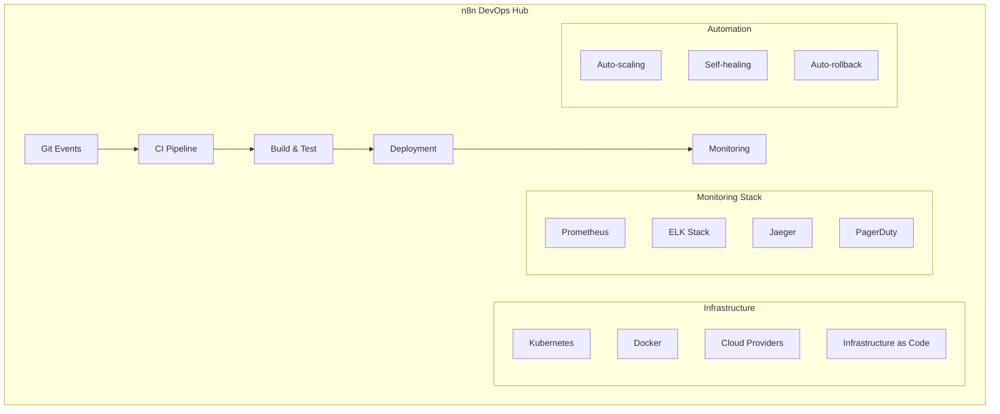

# n8n DevOps Automation: CI/CD, Monitoring & Infrastructure Workflows

## Introduction

n8n transforms DevOps practices by automating complex workflows across CI/CD pipelines, infrastructure management, monitoring, and incident response. By integrating with major DevOps tools and platforms, n8n enables teams to build resilient, self-healing systems that scale effortlessly.

### DevOps Automation Impact

- 🚀 **90% Faster** deployment cycles
- 🔧 **75% Reduction** in manual operations
- 📊 **Real-time** infrastructure monitoring
- 🔄 **Automated** incident response
- 🛡️ **Self-healing** infrastructure
- 📈 **99.99%** uptime achievement

## DevOps Architecture with n8n



## CI/CD Pipeline Automation

### 1. Complete CI/CD Pipeline

```javascript
// Comprehensive CI/CD automation
class CICDPipeline {
  async executePipeline(trigger) {
    const pipeline = {
      id: generatePipelineId(),
      trigger: trigger,
      startTime: new Date(),
      stages: []
    };
    
    try {
      // Stage 1: Code Quality
      pipeline.stages.push(await this.codeQuality(trigger));
      
      // Stage 2: Build
      pipeline.stages.push(await this.build(trigger));
      
      // Stage 3: Test
      pipeline.stages.push(await this.test(trigger));
      
      // Stage 4: Security Scan
      pipeline.stages.push(await this.securityScan(trigger));
      
      // Stage 5: Deploy
      pipeline.stages.push(await this.deploy(trigger));
      
      // Stage 6: Smoke Tests
      pipeline.stages.push(await this.smokeTests(trigger));
      
      // Stage 7: Performance Tests
      pipeline.stages.push(await this.performanceTests(trigger));
      
      pipeline.status = 'success';
    } catch (error) {
      pipeline.status = 'failed';
      pipeline.error = error;
      
      // Rollback if deployment failed
      if (this.shouldRollback(pipeline)) {
        await this.rollback(pipeline);
      }
    }
    
    // Send notifications
    await this.notify(pipeline);
    
    // Update metrics
    await this.updateMetrics(pipeline);
    
    return pipeline;
  }
  
  async codeQuality(trigger) {
    const stage = {
      name: 'Code Quality',
      startTime: new Date()
    };
    
    // Run linting
    const linting = await this.runLinting(trigger.repo);
    
    // Run code coverage
    const coverage = await this.runCoverage(trigger.repo);
    
    // Run complexity analysis
    const complexity = await this.analyzeComplexity(trigger.repo);
    
    // Check quality gates
    const qualityGate = this.checkQualityGates({
      linting: linting,
      coverage: coverage,
      complexity: complexity
    });
    
    if (!qualityGate.passed) {
      throw new Error(`Quality gate failed: ${qualityGate.reason}`);
    }
    
    stage.endTime = new Date();
    stage.status = 'success';
    stage.metrics = {
      coverage: coverage.percentage,
      issues: linting.issues,
      complexity: complexity.average
    };
    
    return stage;
  }
  
  async build(trigger) {
    const stage = {
      name: 'Build',
      startTime: new Date()
    };
    
    // Determine build strategy
    const strategy = this.determineBuildStrategy(trigger);
    
    // Build Docker image
    const image = await this.buildDockerImage({
      dockerfile: strategy.dockerfile,
      context: trigger.repo,
      tags: this.generateTags(trigger),
      buildArgs: strategy.buildArgs,
      cache: strategy.useCache
    });
    
    // Push to registry
    await this.pushToRegistry(image);
    
    // Generate SBOM (Software Bill of Materials)
    const sbom = await this.generateSBOM(image);
    
    stage.endTime = new Date();
    stage.status = 'success';
    stage.artifacts = {
      image: image.id,
      tags: image.tags,
      sbom: sbom
    };
    
    return stage;
  }
  
  async test(trigger) {
    const stage = {
      name: 'Test',
      startTime: new Date()
    };
    
    // Parallel test execution
    const testResults = await Promise.all([
      this.runUnitTests(trigger),
      this.runIntegrationTests(trigger),
      this.runE2ETests(trigger),
      this.runContractTests(trigger)
    ]);
    
    // Aggregate results
    const summary = this.aggregateTestResults(testResults);
    
    if (summary.failed > 0) {
      throw new Error(`${summary.failed} tests failed`);
    }
    
    stage.endTime = new Date();
    stage.status = 'success';
    stage.testResults = summary;
    
    return stage;
  }
  
  async securityScan(trigger) {
    const stage = {
      name: 'Security Scan',
      startTime: new Date()
    };
    
    // Vulnerability scanning
    const vulnScan = await this.scanVulnerabilities(trigger.image);
    
    // SAST (Static Application Security Testing)
    const sast = await this.runSAST(trigger.repo);
    
    // DAST (Dynamic Application Security Testing)
    const dast = await this.runDAST(trigger.deploymentUrl);
    
    // Secret scanning
    const secrets = await this.scanSecrets(trigger.repo);
    
    // Compliance check
    const compliance = await this.checkCompliance(trigger);
    
    // Evaluate security posture
    const securityScore = this.calculateSecurityScore({
      vulnerabilities: vulnScan,
      sast: sast,
      dast: dast,
      secrets: secrets,
      compliance: compliance
    });
    
    if (securityScore < 70) {
      throw new Error(`Security score too low: ${securityScore}`);
    }
    
    stage.endTime = new Date();
    stage.status = 'success';
    stage.security = {
      score: securityScore,
      vulnerabilities: vulnScan.critical + vulnScan.high,
      compliance: compliance.status
    };
    
    return stage;
  }
  
  async deploy(trigger) {
    const stage = {
      name: 'Deploy',
      startTime: new Date()
    };
    
    // Deployment strategy
    const strategy = this.getDeploymentStrategy(trigger);
    
    switch(strategy.type) {
      case 'blue-green':
        await this.blueGreenDeploy(trigger);
        break;
      case 'canary':
        await this.canaryDeploy(trigger);
        break;
      case 'rolling':
        await this.rollingDeploy(trigger);
        break;
      default:
        await this.standardDeploy(trigger);
    }
    
    // Verify deployment
    const verification = await this.verifyDeployment(trigger);
    
    if (!verification.healthy) {
      throw new Error('Deployment verification failed');
    }
    
    stage.endTime = new Date();
    stage.status = 'success';
    stage.deployment = {
      strategy: strategy.type,
      version: trigger.version,
      environment: trigger.environment
    };
    
    return stage;
  }
}
```

### 2. Kubernetes Deployment Automation

```javascript
// Kubernetes automation workflows
class KubernetesAutomation {
  async deployToKubernetes(config) {
    // Generate Kubernetes manifests
    const manifests = await this.generateManifests(config);
    
    // Apply manifests
    await this.applyManifests(manifests);
    
    // Wait for rollout
    await this.waitForRollout(config.deployment);
    
    // Configure networking
    await this.configureNetworking(config);
    
    // Set up autoscaling
    await this.configureAutoscaling(config);
    
    // Configure monitoring
    await this.configureMonitoring(config);
    
    return {
      deployment: config.deployment,
      status: 'deployed',
      endpoints: await this.getEndpoints(config)
    };
  }
  
  async generateManifests(config) {
    const manifests = [];
    
    // Deployment manifest
    manifests.push({
      apiVersion: 'apps/v1',
      kind: 'Deployment',
      metadata: {
        name: config.name,
        namespace: config.namespace,
        labels: config.labels
      },
      spec: {
        replicas: config.replicas,
        selector: {
          matchLabels: config.labels
        },
        template: {
          metadata: {
            labels: config.labels,
            annotations: {
              'prometheus.io/scrape': 'true',
              'prometheus.io/port': '9090'
            }
          },
          spec: {
            containers: [{
              name: config.name,
              image: config.image,
              ports: config.ports,
              env: config.env,
              resources: {
                requests: config.resources.requests,
                limits: config.resources.limits
              },
              livenessProbe: {
                httpGet: {
                  path: '/health',
                  port: 8080
                },
                initialDelaySeconds: 30,
                periodSeconds: 10
              },
              readinessProbe: {
                httpGet: {
                  path: '/ready',
                  port: 8080
                },
                initialDelaySeconds: 5,
                periodSeconds: 5
              }
            }]
          }
        }
      }
    });
    
    // Service manifest
    manifests.push({
      apiVersion: 'v1',
      kind: 'Service',
      metadata: {
        name: config.name,
        namespace: config.namespace
      },
      spec: {
        selector: config.labels,
        ports: config.ports,
        type: config.serviceType || 'ClusterIP'
      }
    });
    
    // HPA manifest
    if (config.autoscaling) {
      manifests.push({
        apiVersion: 'autoscaling/v2',
        kind: 'HorizontalPodAutoscaler',
        metadata: {
          name: config.name,
          namespace: config.namespace
        },
        spec: {
          scaleTargetRef: {
            apiVersion: 'apps/v1',
            kind: 'Deployment',
            name: config.name
          },
          minReplicas: config.autoscaling.min,
          maxReplicas: config.autoscaling.max,
          metrics: config.autoscaling.metrics
        }
      });
    }
    
    return manifests;
  }
  
  async canaryDeploy(config) {
    // Create canary deployment
    const canaryDeployment = await this.createCanaryDeployment(config);
    
    // Route percentage of traffic
    await this.updateTrafficSplit({
      stable: 90,
      canary: 10
    });
    
    // Monitor canary metrics
    const monitoring = await this.monitorCanary(canaryDeployment, {
      duration: config.canaryDuration || 300000, // 5 minutes
      metrics: ['error_rate', 'latency', 'success_rate']
    });
    
    // Analyze results
    const analysis = this.analyzeCanaryMetrics(monitoring);
    
    if (analysis.healthy) {
      // Progressive rollout
      for (const percentage of [25, 50, 75, 100]) {
        await this.updateTrafficSplit({
          stable: 100 - percentage,
          canary: percentage
        });
        
        await this.wait(60000); // 1 minute between increases
        
        const health = await this.checkHealth(canaryDeployment);
        if (!health.healthy) {
          await this.rollbackCanary(canaryDeployment);
          throw new Error('Canary deployment failed health check');
        }
      }
      
      // Promote canary to stable
      await this.promoteCanary(canaryDeployment);
    } else {
      // Rollback
      await this.rollbackCanary(canaryDeployment);
      throw new Error(`Canary failed: ${analysis.reason}`);
    }
  }
}
```

## Infrastructure as Code Automation

### 1. Terraform Automation

```javascript
// Infrastructure as Code automation
class TerraformAutomation {
  async provision(config) {
    // Initialize Terraform
    await this.terraformInit(config.workingDir);
    
    // Plan changes
    const plan = await this.terraformPlan(config);
    
    // Review plan
    const review = await this.reviewPlan(plan);
    
    if (review.approved) {
      // Apply changes
      const result = await this.terraformApply(plan);
      
      // Verify infrastructure
      await this.verifyInfrastructure(result);
      
      // Update inventory
      await this.updateInventory(result);
      
      return result;
    }
    
    throw new Error('Plan not approved');
  }
  
  async terraformPlan(config) {
    const planOutput = await this.execute(`terraform plan -out=tfplan`, {
      cwd: config.workingDir,
      env: config.env
    });
    
    // Parse plan
    const changes = this.parsePlan(planOutput);
    
    // Cost estimation
    const cost = await this.estimateCost(changes);
    
    // Security review
    const security = await this.securityReview(changes);
    
    return {
      changes: changes,
      cost: cost,
      security: security,
      file: 'tfplan'
    };
  }
  
  async driftDetection() {
    // Detect configuration drift
    const currentState = await this.getCurrentState();
    const desiredState = await this.getDesiredState();
    
    const drift = this.compareStates(currentState, desiredState);
    
    if (drift.length > 0) {
      // Generate remediation plan
      const remediation = await this.generateRemediation(drift);
      
      // Auto-remediate if configured
      if (this.config.autoRemediate) {
        await this.remediate(remediation);
      } else {
        // Send alert
        await this.alertDrift(drift, remediation);
      }
    }
    
    return drift;
  }
}

// CloudFormation automation
class CloudFormationAutomation {
  async deployStack(config) {
    // Validate template
    const validation = await this.validateTemplate(config.template);
    
    if (!validation.valid) {
      throw new Error(`Template validation failed: ${validation.errors}`);
    }
    
    // Create change set
    const changeSet = await this.createChangeSet({
      stackName: config.stackName,
      template: config.template,
      parameters: config.parameters,
      capabilities: ['CAPABILITY_IAM']
    });
    
    // Review changes
    const review = await this.reviewChangeSet(changeSet);
    
    if (review.approved) {
      // Execute change set
      await this.executeChangeSet(changeSet);
      
      // Wait for completion
      await this.waitForStack(config.stackName);
      
      // Get outputs
      const outputs = await this.getStackOutputs(config.stackName);
      
      return {
        stackName: config.stackName,
        status: 'CREATE_COMPLETE',
        outputs: outputs
      };
    }
  }
}
```

## Monitoring & Observability

### 1. Comprehensive Monitoring System

```javascript
// Monitoring automation
class MonitoringAutomation {
  async setupMonitoring(service) {
    // Configure metrics collection
    await this.configureMetrics(service);
    
    // Set up logging
    await this.configureLogs(service);
    
    // Configure tracing
    await this.configureTracing(service);
    
    // Create dashboards
    await this.createDashboards(service);
    
    // Set up alerts
    await this.configureAlerts(service);
    
    // Configure SLOs
    await this.configureSLOs(service);
    
    return {
      metrics: this.getMetricsEndpoint(service),
      logs: this.getLogsEndpoint(service),
      traces: this.getTracesEndpoint(service),
      dashboards: this.getDashboardUrls(service)
    };
  }
  
  async configureMetrics(service) {
    // Prometheus configuration
    const prometheusConfig = {
      global: {
        scrape_interval: '15s',
        evaluation_interval: '15s'
      },
      scrape_configs: [{
        job_name: service.name,
        kubernetes_sd_configs: [{
          role: 'pod',
          namespaces: {
            names: [service.namespace]
          }
        }],
        relabel_configs: this.generateRelabelConfigs(service)
      }]
    };
    
    // Custom metrics
    const customMetrics = await this.defineCustomMetrics(service);
    
    // Apply configuration
    await this.applyPrometheusConfig(prometheusConfig);
    
    // Register custom metrics
    await this.registerMetrics(customMetrics);
  }
  
  async configureLogs(service) {
    // Fluentd configuration
    const fluentdConfig = `
      <source>
        @type tail
        path /var/log/containers/${service.name}*.log
        pos_file /var/log/fluentd-${service.name}.pos
        tag kubernetes.${service.name}
        <parse>
          @type json
        </parse>
      </source>
      
      <filter kubernetes.${service.name}>
        @type kubernetes_metadata
      </filter>
      
      <match kubernetes.${service.name}>
        @type elasticsearch
        host elasticsearch.monitoring.svc.cluster.local
        port 9200
        index_name ${service.name}
        type_name _doc
        include_timestamp true
        <buffer>
          @type memory
          flush_interval 10s
        </buffer>
      </match>
    `;
    
    await this.deployFluentdConfig(fluentdConfig);
  }
  
  async configureAlerts(service) {
    const alerts = [];
    
    // High error rate alert
    alerts.push({
      name: `${service.name}_high_error_rate`,
      expr: `rate(http_requests_total{service="${service.name}",status=~"5.."}[5m]) > 0.05`,
      for: '5m',
      labels: {
        severity: 'critical',
        service: service.name
      },
      annotations: {
        summary: 'High error rate detected',
        description: `Error rate is {{ $value | humanizePercentage }} for ${service.name}`
      }
    });
    
    // High latency alert
    alerts.push({
      name: `${service.name}_high_latency`,
      expr: `histogram_quantile(0.95, rate(http_request_duration_seconds_bucket{service="${service.name}"}[5m])) > 0.5`,
      for: '5m',
      labels: {
        severity: 'warning',
        service: service.name
      },
      annotations: {
        summary: 'High latency detected',
        description: `95th percentile latency is {{ $value }}s for ${service.name}`
      }
    });
    
    // Pod restart alert
    alerts.push({
      name: `${service.name}_pod_restarts`,
      expr: `rate(kube_pod_container_status_restarts_total{namespace="${service.namespace}",pod=~"${service.name}.*"}[15m]) > 0`,
      for: '5m',
      labels: {
        severity: 'warning',
        service: service.name
      },
      annotations: {
        summary: 'Pod restarts detected',
        description: `Pod {{ $labels.pod }} has restarted {{ $value }} times`
      }
    });
    
    // Apply alert rules
    await this.applyAlertRules(alerts);
    
    // Configure alert routing
    await this.configureAlertRouting(service);
  }
}
```

### 2. Incident Response Automation

```javascript
// Incident response system
class IncidentResponseAutomation {
  async handleIncident(alert) {
    const incident = {
      id: generateIncidentId(),
      alert: alert,
      startTime: new Date(),
      status: 'open',
      actions: []
    };
    
    // Triage incident
    incident.severity = await this.triageIncident(alert);
    
    // Create incident record
    await this.createIncident(incident);
    
    // Notify on-call
    await this.notifyOnCall(incident);
    
    // Automated diagnostics
    const diagnostics = await this.runDiagnostics(incident);
    incident.diagnostics = diagnostics;
    
    // Attempt auto-remediation
    if (this.canAutoRemediate(incident)) {
      const remediation = await this.autoRemediate(incident);
      incident.actions.push(remediation);
      
      if (remediation.success) {
        incident.status = 'resolved';
        incident.resolvedAt = new Date();
      }
    }
    
    // Escalate if needed
    if (incident.status === 'open' && incident.severity === 'critical') {
      await this.escalate(incident);
    }
    
    // Create postmortem
    if (incident.severity === 'critical') {
      await this.schedulePostmortem(incident);
    }
    
    return incident;
  }
  
  async runDiagnostics(incident) {
    const diagnostics = {
      logs: await this.collectLogs(incident),
      metrics: await this.collectMetrics(incident),
      traces: await this.collectTraces(incident),
      events: await this.collectEvents(incident)
    };
    
    // AI-powered root cause analysis
    const rootCause = await this.analyzeRootCause(diagnostics);
    diagnostics.rootCause = rootCause;
    
    // Generate runbook
    const runbook = await this.generateRunbook(incident, rootCause);
    diagnostics.runbook = runbook;
    
    return diagnostics;
  }
  
  async autoRemediate(incident) {
    const action = {
      type: 'auto-remediation',
      startTime: new Date()
    };
    
    try {
      switch(incident.alert.type) {
        case 'high_memory':
          await this.restartPods(incident.service);
          action.description = 'Restarted pods due to high memory usage';
          break;
          
        case 'high_error_rate':
          await this.rollback(incident.service);
          action.description = 'Rolled back to previous version';
          break;
          
        case 'disk_full':
          await this.cleanupDisk(incident.node);
          action.description = 'Cleaned up disk space';
          break;
          
        case 'scaling_needed':
          await this.scaleService(incident.service);
          action.description = 'Scaled service to handle load';
          break;
      }
      
      action.success = true;
    } catch (error) {
      action.success = false;
      action.error = error.message;
    }
    
    action.endTime = new Date();
    return action;
  }
}
```

## Chaos Engineering

### 1. Chaos Testing Automation

```javascript
// Chaos engineering workflows
class ChaosEngineering {
  async runChaosExperiment(config) {
    const experiment = {
      id: generateExperimentId(),
      hypothesis: config.hypothesis,
      startTime: new Date(),
      steadyState: await this.measureSteadyState(config)
    };
    
    try {
      // Inject failure
      await this.injectChaos(config.chaos);
      
      // Monitor system
      const monitoring = await this.monitorDuringChaos(config.duration);
      
      // Verify steady state
      const duringChaos = await this.measureSteadyState(config);
      
      // Remove chaos
      await this.removeChaos(config.chaos);
      
      // Recovery monitoring
      const recovery = await this.monitorRecovery(config);
      
      // Analyze results
      experiment.results = this.analyzeExperiment({
        steadyState: experiment.steadyState,
        duringChaos: duringChaos,
        monitoring: monitoring,
        recovery: recovery
      });
      
    } catch (error) {
      // Emergency stop
      await this.emergencyStop(config);
      experiment.aborted = true;
      experiment.error = error;
    }
    
    experiment.endTime = new Date();
    
    // Generate report
    experiment.report = await this.generateReport(experiment);
    
    return experiment;
  }
  
  async injectChaos(chaosConfig) {
    switch(chaosConfig.type) {
      case 'pod-kill':
        await this.killRandomPods(chaosConfig);
        break;
        
      case 'network-delay':
        await this.injectNetworkDelay(chaosConfig);
        break;
        
      case 'cpu-stress':
        await this.stressCPU(chaosConfig);
        break;
        
      case 'disk-failure':
        await this.simulateDiskFailure(chaosConfig);
        break;
        
      case 'dns-chaos':
        await this.injectDNSChaos(chaosConfig);
        break;
    }
  }
}
```

## GitOps Automation

### 1. GitOps Workflow

```javascript
// GitOps automation
class GitOpsAutomation {
  async syncGitOps(repo) {
    // Pull latest changes
    const changes = await this.pullChanges(repo);
    
    if (changes.length > 0) {
      // Validate changes
      const validation = await this.validateChanges(changes);
      
      if (validation.valid) {
        // Apply changes
        await this.applyChanges(changes);
        
        // Verify deployment
        await this.verifyDeployment(changes);
        
        // Update status
        await this.updateGitStatus(repo, 'success');
      } else {
        // Report validation errors
        await this.reportErrors(validation.errors);
        await this.updateGitStatus(repo, 'failed');
      }
    }
  }
  
  async promoteEnvironment(from, to) {
    // Get current state
    const currentState = await this.getEnvironmentState(from);
    
    // Create PR for promotion
    const pr = await this.createPromotionPR({
      from: from,
      to: to,
      changes: currentState,
      title: `Promote ${from} to ${to}`,
      description: this.generatePromotionDescription(currentState)
    });
    
    // Auto-approve if tests pass
    const tests = await this.runPromotionTests(pr);
    
    if (tests.passed) {
      await this.approvePR(pr);
      await this.mergePR(pr);
    }
    
    return pr;
  }
}
```

## Best Practices

### 1. Security in DevOps

```javascript
// DevSecOps practices
class DevSecOps {
  async securityPipeline(code) {
    // SAST
    const staticAnalysis = await this.runSAST(code);
    
    // Dependency scanning
    const dependencies = await this.scanDependencies(code);
    
    // Container scanning
    const containerScan = await this.scanContainer(code);
    
    // Compliance checks
    const compliance = await this.checkCompliance(code);
    
    // Generate security report
    return this.generateSecurityReport({
      sast: staticAnalysis,
      dependencies: dependencies,
      container: containerScan,
      compliance: compliance
    });
  }
}
```

### 2. Cost Optimization

```javascript
// Infrastructure cost optimization
class CostOptimization {
  async optimizeInfrastructure() {
    // Identify unused resources
    const unused = await this.findUnusedResources();
    
    // Right-sizing recommendations
    const rightSizing = await this.analyzeRightSizing();
    
    // Spot instance opportunities
    const spotOpportunities = await this.identifySpotOpportunities();
    
    // Reserved instance recommendations
    const reservations = await this.recommendReservations();
    
    // Apply optimizations
    const savings = await this.applyOptimizations({
      unused,
      rightSizing,
      spotOpportunities,
      reservations
    });
    
    return savings;
  }
}
```

## Conclusion

n8n's DevOps automation capabilities enable teams to build robust, self-healing infrastructure with sophisticated CI/CD pipelines, comprehensive monitoring, and intelligent incident response. By automating complex DevOps workflows, teams can achieve higher reliability, faster deployments, and reduced operational overhead while maintaining security and compliance standards.