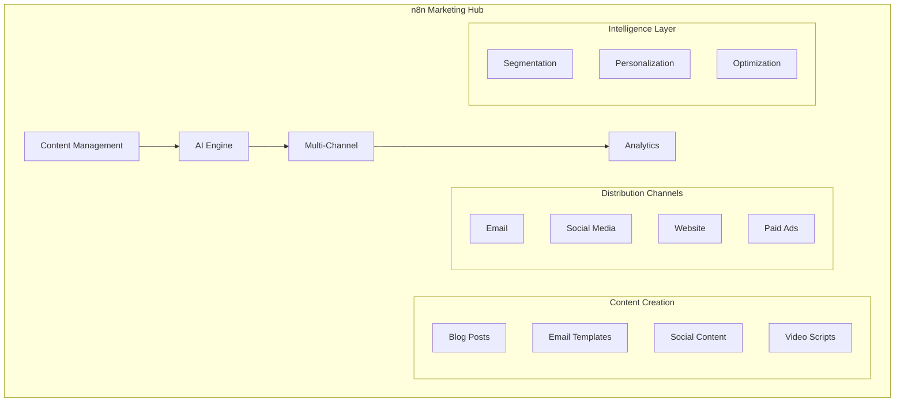

# n8n Marketing Automation: AI-Powered Campaigns & Growth Templates

## Introduction

Marketing automation with n8n revolutionizes how teams execute campaigns, generate content, and engage audiences. By combining AI capabilities with traditional marketing tools, n8n enables sophisticated, personalized marketing at scale while maintaining efficiency and consistency.

### Marketing Automation Impact

- 📧 **300% Increase** in email engagement rates
- 🎯 **5x More** qualified leads generated
- ⏱️ **75% Reduction** in campaign setup time
- 📊 **Real-time** performance optimization
- 🤖 **AI-Generated** personalized content
- 🔄 **Automated** multi-channel campaigns

## Marketing Automation Architecture



## Email Marketing Automation

### 1. Intelligent Email Campaign System

```javascript
// Advanced email campaign orchestration
class EmailCampaignOrchestrator {
  async createCampaign(config) {
    const campaign = {
      id: generateCampaignId(),
      name: config.name,
      type: config.type,
      segments: await this.defineSegments(config),
      content: await this.generateContent(config),
      schedule: this.optimizeSchedule(config),
      personalization: await this.setupPersonalization(config),
      tracking: this.setupTracking()
    };
    
    // AI optimization
    campaign.aiOptimizations = await this.applyAIOptimizations(campaign);
    
    return campaign;
  }
  
  async defineSegments(config) {
    // AI-powered segmentation
    const segments = [];
    
    // Behavioral segmentation
    segments.push({
      name: 'Highly Engaged',
      criteria: {
        openRate: { gt: 0.4 },
        clickRate: { gt: 0.1 },
        lastEngagement: { within: '30d' }
      },
      size: await this.calculateSegmentSize(this.criteria)
    });
    
    // Predictive segmentation
    const predictiveSegments = await this.generatePredictiveSegments();
    segments.push(...predictiveSegments);
    
    // Custom segments
    if (config.customSegments) {
      segments.push(...config.customSegments);
    }
    
    return segments;
  }
  
  async generateContent(config) {
    const content = {
      subject: await this.generateSubjectLines(config),
      preheader: await this.generatePreheader(config),
      body: await this.generateEmailBody(config),
      cta: await this.optimizeCTA(config),
      images: await this.selectImages(config)
    };
    
    // A/B test variations
    content.variations = await this.createVariations(content);
    
    return content;
  }
  
  async generateSubjectLines(config) {
    const prompt = `
      Generate 5 email subject lines for:
      Campaign: ${config.name}
      Goal: ${config.goal}
      Audience: ${config.audience}
      Tone: ${config.tone}
      
      Requirements:
      - Under 50 characters
      - Include personalization tokens
      - Create urgency or curiosity
      - Avoid spam triggers
    `;
    
    const subjects = await this.callAI(prompt);
    
    // Test and score
    const scored = await Promise.all(
      subjects.map(async (subject) => ({
        text: subject,
        score: await this.scoreSubjectLine(subject),
        predictedOpenRate: await this.predictOpenRate(subject)
      }))
    );
    
    return scored.sort((a, b) => b.score - a.score);
  }
}

// Email personalization engine
class EmailPersonalization {
  async personalizeEmail(template, recipient) {
    // Basic personalization
    let content = this.replaceTokens(template, recipient);
    
    // Dynamic content blocks
    content = await this.insertDynamicContent(content, recipient);
    
    // AI-powered personalization
    content = await this.aiPersonalization(content, recipient);
    
    // Product recommendations
    if (content.includes('{{recommendations}}')) {
      const recommendations = await this.getRecommendations(recipient);
      content = content.replace('{{recommendations}}', 
        this.formatRecommendations(recommendations)
      );
    }
    
    return content;
  }
  
  async aiPersonalization(content, recipient) {
    const prompt = `
      Personalize this email content for the recipient:
      
      Recipient Profile:
      - Industry: ${recipient.industry}
      - Role: ${recipient.role}
      - Previous Interactions: ${recipient.interactions}
      - Interests: ${recipient.interests}
      
      Current Content: ${content}
      
      Adjust tone, examples, and messaging to resonate with this recipient.
    `;
    
    return await this.callAI(prompt);
  }
  
  async getRecommendations(recipient) {
    // Collaborative filtering
    const collaborative = await this.collaborativeFiltering(recipient);
    
    // Content-based filtering
    const contentBased = await this.contentBasedFiltering(recipient);
    
    // AI recommendations
    const aiRecommendations = await this.aiRecommendations(recipient);
    
    // Combine and rank
    return this.rankRecommendations([
      ...collaborative,
      ...contentBased,
      ...aiRecommendations
    ], recipient);
  }
}
```

### 2. Automated Email Sequences

```javascript
// Drip campaign automation
class DripCampaignAutomation {
  async createDripSequence(type) {
    const sequences = {
      welcome: this.welcomeSequence(),
      onboarding: this.onboardingSequence(),
      nurture: this.nurtureSequence(),
      reengagement: this.reengagementSequence(),
      abandoned_cart: this.abandonedCartSequence()
    };
    
    return sequences[type] || this.customSequence(type);
  }
  
  welcomeSequence() {
    return [
      {
        day: 0,
        email: {
          subject: 'Welcome to {{company}}! 🎉',
          template: 'welcome_email',
          personalization: 'high',
          timing: 'immediate'
        }
      },
      {
        day: 2,
        email: {
          subject: 'Get Started with These 3 Simple Steps',
          template: 'getting_started',
          includeGuide: true,
          timing: 'morning'
        }
      },
      {
        day: 5,
        email: {
          subject: 'Your Exclusive Welcome Offer Inside',
          template: 'welcome_offer',
          offer: { type: 'discount', value: 20 },
          timing: 'optimal'
        }
      },
      {
        day: 7,
        email: {
          subject: 'Meet Our Community',
          template: 'community_intro',
          includeTestimonials: true,
          timing: 'afternoon'
        }
      },
      {
        day: 14,
        email: {
          subject: 'How Can We Help You Succeed?',
          template: 'success_check',
          survey: true,
          timing: 'morning'
        }
      }
    ];
  }
  
  async executeSequence(sequence, recipient) {
    for (const step of sequence) {
      // Schedule email
      const scheduledTime = await this.calculateSendTime(
        recipient,
        step.day,
        step.email.timing
      );
      
      // Check conditions
      if (await this.shouldSend(recipient, step)) {
        const email = await this.prepareEmail(step.email, recipient);
        
        await this.scheduleEmail({
          recipient: recipient,
          email: email,
          sendAt: scheduledTime,
          sequence: sequence.name,
          step: step.day
        });
      }
    }
  }
  
  async calculateSendTime(recipient, dayOffset, timing) {
    const baseTime = new Date();
    baseTime.setDate(baseTime.getDate() + dayOffset);
    
    switch(timing) {
      case 'immediate':
        return new Date();
      case 'optimal':
        return await this.getOptimalSendTime(recipient);
      case 'morning':
        return this.setTimeInTimezone(baseTime, 9, recipient.timezone);
      case 'afternoon':
        return this.setTimeInTimezone(baseTime, 14, recipient.timezone);
      default:
        return baseTime;
    }
  }
}
```

## Content Marketing Automation

### 1. AI Content Generation

```javascript
// Automated content creation system
class ContentGenerationSystem {
  async generateBlogPost(topic, config = {}) {
    // Research phase
    const research = await this.researchTopic(topic);
    
    // Outline generation
    const outline = await this.generateOutline(topic, research);
    
    // Content creation
    const content = await this.createContent(outline, config);
    
    // SEO optimization
    const optimized = await this.optimizeForSEO(content, topic);
    
    // Image generation
    const images = await this.generateImages(content);
    
    // Final formatting
    return this.formatBlogPost(optimized, images);
  }
  
  async researchTopic(topic) {
    const research = {
      keywords: await this.keywordResearch(topic),
      competitors: await this.analyzeCompetitorContent(topic),
      trends: await this.getTrends(topic),
      questions: await this.getAudienceQuestions(topic),
      data: await this.gatherStatistics(topic)
    };
    
    return research;
  }
  
  async generateOutline(topic, research) {
    const prompt = `
      Create a comprehensive blog post outline for: "${topic}"
      
      Research insights:
      - Top keywords: ${research.keywords.join(', ')}
      - Audience questions: ${research.questions.join(', ')}
      - Current trends: ${research.trends.join(', ')}
      
      Requirements:
      - SEO-optimized structure
      - Engaging hook
      - Actionable sections
      - Data-driven insights
      - Clear conclusion with CTA
    `;
    
    const outline = await this.callAI(prompt);
    return this.parseOutline(outline);
  }
  
  async createContent(outline, config) {
    const sections = [];
    
    for (const section of outline.sections) {
      const sectionContent = await this.generateSection(section, config);
      sections.push(sectionContent);
    }
    
    return {
      title: outline.title,
      introduction: await this.generateIntroduction(outline),
      sections: sections,
      conclusion: await this.generateConclusion(outline),
      meta: await this.generateMetadata(outline)
    };
  }
  
  async optimizeForSEO(content, topic) {
    // Keyword optimization
    content = await this.optimizeKeywordDensity(content, topic);
    
    // Internal linking
    content.internalLinks = await this.suggestInternalLinks(content);
    
    // Schema markup
    content.schema = this.generateSchemaMarkup(content);
    
    // Meta optimization
    content.meta = {
      title: await this.optimizeTitle(content.title, topic),
      description: await this.generateMetaDescription(content),
      keywords: await this.selectKeywords(content, topic)
    };
    
    return content;
  }
}

// Content distribution automation
class ContentDistribution {
  async distributeContent(content) {
    const channels = [];
    
    // Blog publication
    channels.push(this.publishToBlog(content));
    
    // Social media posts
    channels.push(this.createSocialPosts(content));
    
    // Email newsletter
    channels.push(this.addToNewsletter(content));
    
    // Content syndication
    channels.push(this.syndicateContent(content));
    
    // Execute distribution
    const results = await Promise.all(channels);
    
    return {
      published: results.filter(r => r.success).length,
      channels: results,
      reach: this.calculateReach(results)
    };
  }
  
  async createSocialPosts(content) {
    const posts = {
      twitter: await this.createTwitterThread(content),
      linkedin: await this.createLinkedInPost(content),
      facebook: await this.createFacebookPost(content),
      instagram: await this.createInstagramPost(content)
    };
    
    // Schedule posts
    const scheduled = [];
    for (const [platform, post] of Object.entries(posts)) {
      scheduled.push(
        this.schedulePost(platform, post, this.getOptimalTime(platform))
      );
    }
    
    return scheduled;
  }
  
  async createTwitterThread(content) {
    const prompt = `
      Convert this blog post into an engaging Twitter thread:
      
      Title: ${content.title}
      Key Points: ${content.keyPoints.join(', ')}
      
      Requirements:
      - 5-8 tweets
      - Each tweet under 280 characters
      - Include relevant hashtags
      - End with CTA
    `;
    
    const thread = await this.callAI(prompt);
    return this.formatTwitterThread(thread);
  }
}
```

## Social Media Automation

### 1. Multi-Platform Management

```javascript
// Social media automation hub
class SocialMediaAutomation {
  async manageSocialChannels() {
    const tasks = {
      posting: this.automatedPosting(),
      engagement: this.automatedEngagement(),
      monitoring: this.socialListening(),
      analytics: this.performanceTracking(),
      influencer: this.influencerOutreach()
    };
    
    return await this.executeTasks(tasks);
  }
  
  async automatedPosting() {
    // Content calendar
    const calendar = await this.getContentCalendar();
    
    for (const post of calendar.scheduled) {
      // Generate platform-specific content
      const content = await this.adaptContent(post);
      
      // Optimize timing
      const timing = await this.optimizeTiming(post);
      
      // Schedule post
      await this.schedulePost({
        platforms: post.platforms,
        content: content,
        scheduledTime: timing,
        tags: post.tags,
        mentions: post.mentions
      });
    }
  }
  
  async automatedEngagement() {
    // Monitor mentions
    const mentions = await this.getMentions();
    
    for (const mention of mentions) {
      const response = await this.generateResponse(mention);
      
      if (response.shouldRespond) {
        await this.postResponse({
          platform: mention.platform,
          inReplyTo: mention.id,
          content: response.content,
          tone: response.tone
        });
      }
      
      // Track engagement
      await this.trackEngagement(mention, response);
    }
  }
  
  async socialListening() {
    const keywords = ['brand_name', 'product_names', 'competitors'];
    const conversations = [];
    
    for (const keyword of keywords) {
      const results = await this.searchSocial(keyword);
      
      for (const result of results) {
        const analysis = await this.analyzeSentiment(result);
        
        if (analysis.requiresAction) {
          conversations.push({
            platform: result.platform,
            content: result,
            sentiment: analysis.sentiment,
            priority: analysis.priority,
            suggestedAction: analysis.action
          });
        }
      }
    }
    
    return conversations;
  }
}

// Influencer marketing automation
class InfluencerAutomation {
  async identifyInfluencers(criteria) {
    const influencers = [];
    
    // Search by niche
    const nicheInfluencers = await this.searchByNiche(criteria.niche);
    
    // Filter by metrics
    const qualified = nicheInfluencers.filter(inf => 
      inf.followers >= criteria.minFollowers &&
      inf.engagementRate >= criteria.minEngagement &&
      inf.audienceMatch >= criteria.audienceMatch
    );
    
    // Score and rank
    for (const influencer of qualified) {
      influencer.score = await this.scoreInfluencer(influencer, criteria);
      influencers.push(influencer);
    }
    
    return influencers.sort((a, b) => b.score - a.score);
  }
  
  async automateOutreach(influencer, campaign) {
    // Personalized message
    const message = await this.generateOutreachMessage(influencer, campaign);
    
    // Multi-channel outreach
    const channels = [];
    
    if (influencer.email) {
      channels.push(this.sendEmail(influencer.email, message.email));
    }
    
    if (influencer.social.dm_open) {
      channels.push(this.sendDM(influencer.social, message.dm));
    }
    
    // Track outreach
    await this.trackOutreach({
      influencer: influencer,
      campaign: campaign,
      message: message,
      sentAt: new Date()
    });
    
    return await Promise.all(channels);
  }
}
```

## SEO Automation

### 1. Technical SEO Automation

```javascript
// SEO automation system
class SEOAutomation {
  async performSEOAudit(website) {
    const audit = {
      technical: await this.technicalAudit(website),
      content: await this.contentAudit(website),
      backlinks: await this.backlinkAudit(website),
      competitors: await this.competitorAnalysis(website),
      keywords: await this.keywordAnalysis(website)
    };
    
    // Generate recommendations
    audit.recommendations = await this.generateRecommendations(audit);
    
    // Create action plan
    audit.actionPlan = this.createActionPlan(audit.recommendations);
    
    return audit;
  }
  
  async technicalAudit(website) {
    const issues = [];
    
    // Crawl website
    const pages = await this.crawlWebsite(website);
    
    for (const page of pages) {
      // Check page speed
      const speed = await this.checkPageSpeed(page.url);
      if (speed.score < 50) {
        issues.push({
          type: 'performance',
          url: page.url,
          issue: 'Slow page load',
          impact: 'high',
          solution: speed.recommendations
        });
      }
      
      // Check mobile friendliness
      const mobile = await this.checkMobile(page.url);
      if (!mobile.isMobileFriendly) {
        issues.push({
          type: 'mobile',
          url: page.url,
          issue: mobile.issues,
          impact: 'high'
        });
      }
      
      // Check meta tags
      const meta = this.checkMetaTags(page);
      issues.push(...meta.issues);
      
      // Check structured data
      const schema = this.checkSchema(page);
      issues.push(...schema.issues);
    }
    
    return {
      issues: issues,
      score: this.calculateTechnicalScore(issues),
      priority: this.prioritizeIssues(issues)
    };
  }
  
  async monitorRankings(keywords) {
    const rankings = [];
    
    for (const keyword of keywords) {
      const position = await this.checkRanking(keyword);
      
      rankings.push({
        keyword: keyword,
        position: position.current,
        change: position.current - position.previous,
        searchVolume: await this.getSearchVolume(keyword),
        difficulty: await this.getKeywordDifficulty(keyword),
        url: position.url
      });
    }
    
    // Analyze trends
    const trends = this.analyzeRankingTrends(rankings);
    
    // Generate alerts
    const alerts = this.generateRankingAlerts(rankings, trends);
    
    return {
      rankings: rankings,
      trends: trends,
      alerts: alerts
    };
  }
}

// Automated link building
class LinkBuildingAutomation {
  async findLinkOpportunities(website) {
    const opportunities = [];
    
    // Broken link building
    opportunities.push(...await this.findBrokenLinks(website));
    
    // Guest posting opportunities
    opportunities.push(...await this.findGuestPostSites(website));
    
    // Resource page opportunities
    opportunities.push(...await this.findResourcePages(website));
    
    // HARO opportunities
    opportunities.push(...await this.findHAROOpportunities(website));
    
    // Score and prioritize
    return this.prioritizeOpportunities(opportunities);
  }
  
  async automateOutreach(opportunity) {
    // Generate personalized email
    const email = await this.generateOutreachEmail(opportunity);
    
    // Find contact information
    const contact = await this.findContactInfo(opportunity.website);
    
    // Send outreach
    const sent = await this.sendOutreach(contact, email);
    
    // Schedule follow-up
    if (sent.success) {
      await this.scheduleFollowUp(opportunity, 7); // 7 days
    }
    
    return sent;
  }
}
```

## Marketing Analytics & Reporting

### 1. Unified Analytics Dashboard

```javascript
// Marketing analytics system
class MarketingAnalytics {
  async generateDashboard(period) {
    const metrics = {
      overview: await this.getOverviewMetrics(period),
      channels: await this.getChannelMetrics(period),
      campaigns: await this.getCampaignMetrics(period),
      content: await this.getContentMetrics(period),
      roi: await this.calculateROI(period),
      attribution: await this.getAttribution(period)
    };
    
    // Generate insights
    metrics.insights = await this.generateInsights(metrics);
    
    // Predictive analytics
    metrics.predictions = await this.generatePredictions(metrics);
    
    return metrics;
  }
  
  async getChannelMetrics(period) {
    const channels = ['email', 'social', 'organic', 'paid', 'direct'];
    const metrics = {};
    
    for (const channel of channels) {
      metrics[channel] = {
        traffic: await this.getTraffic(channel, period),
        conversions: await this.getConversions(channel, period),
        revenue: await this.getRevenue(channel, period),
        cost: await this.getCost(channel, period),
        roi: await this.calculateChannelROI(channel, period),
        engagement: await this.getEngagement(channel, period)
      };
    }
    
    return metrics;
  }
  
  async getAttribution(period) {
    // Multi-touch attribution
    const journeys = await this.getCustomerJourneys(period);
    
    const attribution = {
      firstTouch: this.calculateFirstTouch(journeys),
      lastTouch: this.calculateLastTouch(journeys),
      linear: this.calculateLinear(journeys),
      timeDecay: this.calculateTimeDecay(journeys),
      dataDriver: await this.calculateDataDriven(journeys)
    };
    
    return attribution;
  }
  
  async generateInsights(metrics) {
    const prompt = `
      Analyze these marketing metrics and provide insights:
      
      ${JSON.stringify(metrics)}
      
      Provide:
      1. Top performing channels and campaigns
      2. Areas needing improvement
      3. Unexpected trends or anomalies
      4. Optimization opportunities
      5. Strategic recommendations
    `;
    
    const insights = await this.callAI(prompt);
    return this.formatInsights(insights);
  }
}

// Real-time reporting
class RealTimeReporting {
  async streamMetrics() {
    const stream = {
      websiteTraffic: this.streamWebsiteTraffic(),
      socialEngagement: this.streamSocialEngagement(),
      emailPerformance: this.streamEmailMetrics(),
      adPerformance: this.streamAdMetrics()
    };
    
    // Process streams
    for (const [metric, stream] of Object.entries(streams)) {
      stream.on('data', async (data) => {
        await this.processMetric(metric, data);
        
        // Check for alerts
        const alerts = await this.checkAlerts(metric, data);
        if (alerts.length > 0) {
          await this.sendAlerts(alerts);
        }
        
        // Update dashboard
        await this.updateDashboard(metric, data);
      });
    }
    
    return stream;
  }
}
```

## Campaign Automation Examples

### 1. Product Launch Campaign

```javascript
// Automated product launch workflow
const productLaunchWorkflow = {
  name: 'Product Launch Campaign',
  
  phases: [
    {
      name: 'Pre-Launch',
      duration: '2 weeks',
      activities: [
        {
          type: 'content',
          tasks: [
            'Generate teaser content',
            'Create landing page',
            'Prepare email sequences',
            'Design social media assets'
          ]
        },
        {
          type: 'outreach',
          tasks: [
            'Contact influencers',
            'Reach out to press',
            'Notify beta users'
          ]
        }
      ]
    },
    {
      name: 'Launch Day',
      activities: [
        {
          type: 'announcement',
          channels: ['email', 'social', 'blog', 'press'],
          timing: 'coordinated'
        },
        {
          type: 'monitoring',
          metrics: ['traffic', 'conversions', 'sentiment'],
          realtime: true
        }
      ]
    },
    {
      name: 'Post-Launch',
      duration: '4 weeks',
      activities: [
        {
          type: 'nurture',
          tasks: [
            'Follow up with leads',
            'Share success stories',
            'Gather feedback',
            'Optimize campaigns'
          ]
        }
      ]
    }
  ]
};
```

### 2. Lead Nurture Campaign

```javascript
// Sophisticated lead nurturing
const leadNurtureWorkflow = {
  name: 'AI-Powered Lead Nurture',
  
  segments: [
    {
      name: 'High Intent',
      criteria: {
        score: { gte: 80 },
        behavior: 'engaged'
      },
      sequence: 'accelerated',
      personalization: 'deep'
    },
    {
      name: 'Medium Intent',
      criteria: {
        score: { between: [40, 79] },
        behavior: 'interested'
      },
      sequence: 'educational',
      personalization: 'moderate'
    },
    {
      name: 'Low Intent',
      criteria: {
        score: { lt: 40 },
        behavior: 'passive'
      },
      sequence: 'awareness',
      personalization: 'light'
    }
  ],
  
  automation: {
    scoring: 'ai-powered',
    content: 'dynamic',
    timing: 'optimized',
    channels: 'multi-touch'
  }
};
```

## Best Practices

### 1. Personalization at Scale

```javascript
// Scalable personalization engine
class PersonalizationEngine {
  async personalizeAtScale(audience, content) {
    // Segment audience
    const segments = await this.intelligentSegmentation(audience);
    
    // Generate variations
    const variations = {};
    
    for (const segment of segments) {
      variations[segment.id] = await this.createVariation(
        content,
        segment.characteristics
      );
    }
    
    // Individual personalization for VIPs
    const vips = audience.filter(a => a.value === 'high');
    for (const vip of vips) {
      variations[vip.id] = await this.deepPersonalization(content, vip);
    }
    
    return variations;
  }
}
```

### 2. Privacy & Compliance

```javascript
// Marketing compliance automation
class MarketingCompliance {
  async ensureCompliance(campaign) {
    // Check consent
    campaign.recipients = await this.filterByConsent(campaign.recipients);
    
    // Add unsubscribe links
    campaign.content = this.addUnsubscribeLinks(campaign.content);
    
    // Validate data usage
    await this.validateDataUsage(campaign);
    
    // Log for audit
    await this.logCampaign(campaign);
    
    return campaign;
  }
}
```

## Conclusion

n8n's marketing automation capabilities enable teams to execute sophisticated, multi-channel campaigns with AI-powered personalization and optimization. By automating repetitive tasks and leveraging intelligent insights, marketers can focus on strategy and creativity while achieving unprecedented scale and efficiency in their operations.