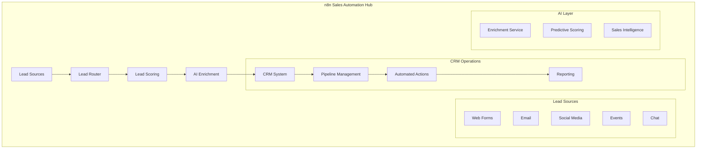

# n8n Sales & CRM Automation: 50+ Templates for Revenue Growth

## Introduction

Sales and CRM automation with n8n revolutionizes how teams manage leads, nurture prospects, and close deals. By integrating with major CRM platforms and leveraging AI capabilities, n8n enables you to build intelligent sales workflows that drive revenue growth and improve team efficiency.

### Impact Metrics

- 📈 **40% Increase** in lead conversion rates
- ⏰ **60% Reduction** in manual data entry
- 🎯 **3x Improvement** in lead response time
- 💰 **25% Growth** in average deal size
- 🔄 **80% Automation** of repetitive tasks
- 🤖 **AI-Powered** lead scoring and insights

## Sales Automation Architecture



## Complete Lead Management System

### 1. Multi-Channel Lead Capture

```javascript
// Unified lead capture from multiple sources
const leadSources = {
  webform: {
    webhook: '/api/leads/webform',
    fields: ['name', 'email', 'company', 'phone', 'message'],
    validation: true
  },
  linkedin: {
    integration: 'LinkedIn Sales Navigator',
    trigger: 'new_connection',
    enrichment: true
  },
  email: {
    parser: 'email_parser_node',
    patterns: ['inquiry', 'demo_request', 'pricing'],
    autoReply: true
  },
  chatbot: {
    platform: 'Intercom',
    qualification: ['budget', 'timeline', 'decision_maker'],
    handoff: 'qualified_leads'
  }
};

// Lead normalization
function normalizeLead(source, rawData) {
  const lead = {
    id: generateLeadId(),
    source: source,
    capturedAt: new Date().toISOString(),
    data: {},
    metadata: {}
  };
  
  // Map fields based on source
  switch(source) {
    case 'webform':
      lead.data = {
        firstName: rawData.name.split(' ')[0],
        lastName: rawData.name.split(' ').slice(1).join(' '),
        email: rawData.email.toLowerCase(),
        company: rawData.company,
        phone: formatPhoneNumber(rawData.phone)
      };
      break;
    case 'linkedin':
      lead.data = extractLinkedInData(rawData);
      break;
    // ... other sources
  }
  
  return lead;
}
```

### 2. AI-Powered Lead Enrichment

```javascript
// Comprehensive lead enrichment workflow
async function enrichLead(lead) {
  const enrichmentTasks = [];
  
  // 1. Company data enrichment
  enrichmentTasks.push(
    enrichCompanyData(lead.data.company || lead.data.domain)
  );
  
  // 2. Contact enrichment
  enrichmentTasks.push(
    enrichContactData(lead.data.email)
  );
  
  // 3. Social media profiles
  enrichmentTasks.push(
    findSocialProfiles(lead.data.email, lead.data.name)
  );
  
  // 4. Technographic data
  if (lead.data.domain) {
    enrichmentTasks.push(
      getTechnographics(lead.data.domain)
    );
  }
  
  // Execute all enrichment tasks in parallel
  const results = await Promise.all(enrichmentTasks);
  
  // Merge enriched data
  const enrichedLead = {
    ...lead,
    enrichment: {
      company: results[0],
      contact: results[1],
      social: results[2],
      technographics: results[3],
      enrichedAt: new Date().toISOString()
    }
  };
  
  // AI analysis for insights
  const aiInsights = await generateAIInsights(enrichedLead);
  enrichedLead.aiInsights = aiInsights;
  
  return enrichedLead;
}

// AI insights generation
async function generateAIInsights(lead) {
  const prompt = `
    Analyze this lead and provide insights:
    
    Company: ${lead.enrichment.company.name}
    Industry: ${lead.enrichment.company.industry}
    Size: ${lead.enrichment.company.employees}
    Revenue: ${lead.enrichment.company.revenue}
    Technologies: ${lead.enrichment.technographics.join(', ')}
    Recent News: ${lead.enrichment.company.recentNews}
    
    Provide:
    1. Buying propensity score (0-100)
    2. Best engagement approach
    3. Potential pain points
    4. Recommended products/services
    5. Optimal outreach timing
  `;
  
  const insights = await callGPT4(prompt);
  return parseAIResponse(insights);
}
```

### 3. Intelligent Lead Scoring

```javascript
// Multi-factor lead scoring system
class LeadScoringEngine {
  constructor() {
    this.weights = {
      demographic: 0.25,
      firmographic: 0.30,
      behavioral: 0.25,
      engagement: 0.20
    };
  }
  
  calculateScore(lead) {
    const scores = {
      demographic: this.scoreDemographic(lead),
      firmographic: this.scoreFirmographic(lead),
      behavioral: this.scoreBehavioral(lead),
      engagement: this.scoreEngagement(lead)
    };
    
    // Calculate weighted score
    let totalScore = 0;
    for (const [category, weight] of Object.entries(this.weights)) {
      totalScore += scores[category] * weight;
    }
    
    // Apply AI adjustment
    const aiAdjustment = this.getAIAdjustment(lead);
    totalScore = totalScore * (1 + aiAdjustment);
    
    return {
      totalScore: Math.min(100, Math.round(totalScore)),
      breakdown: scores,
      grade: this.getGrade(totalScore),
      recommendation: this.getRecommendation(totalScore, lead)
    };
  }
  
  scoreDemographic(lead) {
    let score = 0;
    
    // Job title scoring
    const titleScore = {
      'C-Level': 30,
      'VP': 25,
      'Director': 20,
      'Manager': 15,
      'Other': 5
    };
    score += titleScore[this.classifyTitle(lead.jobTitle)] || 5;
    
    // Department scoring
    if (lead.department === 'target_department') score += 20;
    
    // Location scoring
    if (this.isTargetLocation(lead.location)) score += 10;
    
    return score;
  }
  
  scoreFirmographic(lead) {
    let score = 0;
    
    // Company size
    if (lead.company.employees >= 100 && lead.company.employees <= 1000) {
      score += 25;
    } else if (lead.company.employees > 1000) {
      score += 20;
    }
    
    // Revenue
    if (lead.company.revenue >= 10000000) score += 25;
    
    // Industry
    if (this.targetIndustries.includes(lead.company.industry)) {
      score += 20;
    }
    
    // Technology stack match
    const techMatch = this.calculateTechMatch(lead.technographics);
    score += techMatch * 10;
    
    return score;
  }
  
  scoreBehavioral(lead) {
    let score = 0;
    
    // Website activity
    score += Math.min(20, lead.websiteVisits * 2);
    score += Math.min(15, lead.pagesViewed * 0.5);
    score += lead.downloadedContent ? 15 : 0;
    score += lead.watchedDemo ? 20 : 0;
    
    // Form submissions
    score += Math.min(15, lead.formsSubmitted * 5);
    
    return score;
  }
  
  scoreEngagement(lead) {
    let score = 0;
    
    // Email engagement
    score += lead.emailsOpened * 2;
    score += lead.emailsClicked * 5;
    
    // Meeting engagement
    score += lead.meetingsScheduled * 20;
    score += lead.meetingsAttended * 25;
    
    // Response time
    if (lead.avgResponseTime < 3600) score += 10; // Less than 1 hour
    
    return Math.min(100, score);
  }
}
```

### 4. Automated Lead Assignment & Routing

```javascript
// Intelligent lead routing system
class LeadRouter {
  constructor(salesTeam) {
    this.salesTeam = salesTeam;
    this.routingRules = this.initializeRules();
  }
  
  async routeLead(lead, score) {
    // Determine routing strategy
    const strategy = this.determineStrategy(lead, score);
    
    switch(strategy) {
      case 'round-robin':
        return await this.roundRobinAssignment(lead);
      case 'territory-based':
        return await this.territoryAssignment(lead);
      case 'skill-based':
        return await this.skillBasedAssignment(lead);
      case 'ai-optimized':
        return await this.aiOptimizedAssignment(lead, score);
      default:
        return await this.defaultAssignment(lead);
    }
  }
  
  async aiOptimizedAssignment(lead, score) {
    // Get rep performance data
    const repPerformance = await this.getRepPerformance();
    
    // Calculate match scores for each rep
    const matchScores = await Promise.all(
      this.salesTeam.map(async (rep) => {
        const score = await this.calculateRepMatch(rep, lead);
        return { rep, score };
      })
    );
    
    // Sort by match score and availability
    matchScores.sort((a, b) => {
      const scoreA = a.score * a.rep.availability;
      const scoreB = b.score * b.rep.availability;
      return scoreB - scoreA;
    });
    
    // Assign to best match
    const assignedRep = matchScores[0].rep;
    
    // Create assignment record
    const assignment = {
      leadId: lead.id,
      repId: assignedRep.id,
      assignedAt: new Date().toISOString(),
      strategy: 'ai-optimized',
      matchScore: matchScores[0].score,
      reason: this.generateAssignmentReason(lead, assignedRep)
    };
    
    // Notify rep
    await this.notifyRep(assignedRep, lead, assignment);
    
    return assignment;
  }
  
  async calculateRepMatch(rep, lead) {
    // Multiple factors for matching
    let matchScore = 0;
    
    // Industry expertise
    if (rep.expertise.includes(lead.company.industry)) {
      matchScore += 30;
    }
    
    // Company size experience
    if (rep.dealSizePreference === lead.company.size) {
      matchScore += 20;
    }
    
    // Geographic match
    if (rep.territory.includes(lead.location)) {
      matchScore += 15;
    }
    
    // Language match
    if (rep.languages.includes(lead.preferredLanguage)) {
      matchScore += 10;
    }
    
    // Workload balance
    const workloadScore = (1 - (rep.currentLeads / rep.maxLeads)) * 25;
    matchScore += workloadScore;
    
    // Historical success rate with similar leads
    const historicalSuccess = await this.getHistoricalSuccess(rep, lead);
    matchScore += historicalSuccess * 20;
    
    return matchScore;
  }
}
```

## Pipeline Management Automation

### 1. Deal Stage Automation

```javascript
// Automated deal progression
class DealPipeline {
  constructor() {
    this.stages = [
      'Qualification',
      'Discovery',
      'Demo/Meeting',
      'Proposal',
      'Negotiation',
      'Closed Won',
      'Closed Lost'
    ];
    
    this.stageActions = {
      'Qualification': this.qualificationActions,
      'Discovery': this.discoveryActions,
      'Demo/Meeting': this.demoActions,
      'Proposal': this.proposalActions,
      'Negotiation': this.negotiationActions
    };
  }
  
  async progressDeal(deal, trigger) {
    const currentStage = deal.stage;
    const nextStage = this.determineNextStage(deal, trigger);
    
    if (nextStage && nextStage !== currentStage) {
      // Update deal stage
      deal.stage = nextStage;
      deal.stageChangedAt = new Date().toISOString();
      
      // Execute stage-specific actions
      await this.executeStageActions(deal, nextStage);
      
      // Update probability
      deal.probability = this.calculateProbability(deal);
      
      // Send notifications
      await this.notifyStakeholders(deal, currentStage, nextStage);
      
      // Log activity
      await this.logStageChange(deal, currentStage, nextStage, trigger);
    }
    
    return deal;
  }
  
  async executeStageActions(deal, stage) {
    const actions = this.stageActions[stage];
    if (actions) {
      await actions.call(this, deal);
    }
  }
  
  async proposalActions(deal) {
    // Generate proposal document
    const proposal = await this.generateProposal(deal);
    
    // Create approval workflow if needed
    if (deal.value > 50000) {
      await this.createApprovalWorkflow(deal, proposal);
    }
    
    // Schedule follow-up
    await this.scheduleFollowUp(deal, 3); // 3 days
    
    // Update forecast
    await this.updateForecast(deal);
  }
  
  async generateProposal(deal) {
    // AI-powered proposal generation
    const template = await this.getProposalTemplate(deal.product);
    
    const proposalData = {
      client: deal.company,
      products: deal.products,
      pricing: await this.calculatePricing(deal),
      terms: await this.getTerms(deal),
      customization: await this.generateCustomContent(deal)
    };
    
    // Generate with AI
    const aiContent = await this.generateAIContent(deal);
    proposalData.executiveSummary = aiContent.summary;
    proposalData.valueProposition = aiContent.value;
    
    return await this.createDocument(template, proposalData);
  }
}
```

### 2. Sales Activity Automation

```javascript
// Automated sales activities and follow-ups
class SalesActivityAutomation {
  constructor() {
    this.activities = {
      email: this.sendEmail,
      call: this.scheduleCall,
      meeting: this.scheduleMeeting,
      task: this.createTask,
      linkedin: this.linkedInOutreach
    };
  }
  
  async createActivitySequence(lead, type = 'standard') {
    const sequences = {
      standard: [
        { day: 0, activity: 'email', template: 'welcome' },
        { day: 2, activity: 'linkedin', action: 'connect' },
        { day: 3, activity: 'call', priority: 'high' },
        { day: 5, activity: 'email', template: 'follow_up_1' },
        { day: 8, activity: 'call', priority: 'medium' },
        { day: 10, activity: 'email', template: 'value_prop' },
        { day: 14, activity: 'task', type: 'personal_outreach' }
      ],
      accelerated: [
        { day: 0, activity: 'call', priority: 'urgent' },
        { day: 0, activity: 'email', template: 'urgent_response' },
        { day: 1, activity: 'meeting', type: 'demo' },
        { day: 2, activity: 'email', template: 'proposal' }
      ],
      nurture: [
        { day: 0, activity: 'email', template: 'nurture_1' },
        { day: 14, activity: 'email', template: 'nurture_2' },
        { day: 30, activity: 'email', template: 'nurture_3' },
        { day: 45, activity: 'linkedin', action: 'share_content' },
        { day: 60, activity: 'email', template: 'check_in' }
      ]
    };
    
    const sequence = sequences[type];
    const scheduledActivities = [];
    
    for (const step of sequence) {
      const scheduledDate = this.addBusinessDays(new Date(), step.day);
      
      const activity = {
        leadId: lead.id,
        type: step.activity,
        scheduledDate: scheduledDate,
        status: 'scheduled',
        details: step,
        sequenceType: type
      };
      
      scheduledActivities.push(activity);
      
      // Create in CRM
      await this.createCRMActivity(activity);
    }
    
    return scheduledActivities;
  }
  
  async executeActivity(activity) {
    const handler = this.activities[activity.type];
    if (handler) {
      try {
        const result = await handler.call(this, activity);
        
        // Update activity status
        activity.status = 'completed';
        activity.completedAt = new Date().toISOString();
        activity.result = result;
        
        // Trigger next action based on result
        await this.handleActivityResult(activity, result);
        
      } catch (error) {
        activity.status = 'failed';
        activity.error = error.message;
        
        // Retry logic
        if (activity.retryCount < 3) {
          activity.retryCount = (activity.retryCount || 0) + 1;
          activity.status = 'scheduled';
          activity.scheduledDate = this.addHours(new Date(), 2);
        }
      }
    }
    
    return activity;
  }
  
  async sendEmail(activity) {
    // Get email template
    const template = await this.getEmailTemplate(activity.details.template);
    
    // Personalize content with AI
    const personalizedContent = await this.personalizeWithAI(
      template,
      activity.lead
    );
    
    // Add tracking
    const trackedContent = this.addEmailTracking(
      personalizedContent,
      activity.id
    );
    
    // Send email
    const result = await this.emailService.send({
      to: activity.lead.email,
      subject: personalizedContent.subject,
      html: trackedContent.html,
      trackingId: activity.id
    });
    
    return result;
  }
}
```

## AI-Powered Sales Intelligence

### 1. Conversation Intelligence

```javascript
// Call and meeting analysis
class ConversationIntelligence {
  async analyzeCall(callRecording) {
    // Transcribe call
    const transcript = await this.transcribeAudio(callRecording);
    
    // Analyze with AI
    const analysis = await this.analyzeTranscript(transcript);
    
    return {
      transcript: transcript,
      summary: analysis.summary,
      sentiment: analysis.sentiment,
      keyPoints: analysis.keyPoints,
      nextSteps: analysis.nextSteps,
      competitorMentions: analysis.competitors,
      objections: analysis.objections,
      painPoints: analysis.painPoints,
      coachingOpportunities: analysis.coaching
    };
  }
  
  async analyzeTranscript(transcript) {
    const prompt = `
      Analyze this sales call transcript and provide:
      
      1. Executive Summary (2-3 sentences)
      2. Overall Sentiment (positive/neutral/negative with score)
      3. Key Discussion Points (bullet list)
      4. Identified Next Steps
      5. Competitor Mentions (company and context)
      6. Customer Objections
      7. Pain Points Discussed
      8. Coaching Opportunities for the sales rep
      
      Transcript: ${transcript}
    `;
    
    const analysis = await this.callAI(prompt);
    return this.parseAnalysis(analysis);
  }
  
  async generateFollowUpEmail(callAnalysis) {
    const prompt = `
      Based on this call analysis, generate a follow-up email:
      
      Key Points: ${callAnalysis.keyPoints.join(', ')}
      Next Steps: ${callAnalysis.nextSteps.join(', ')}
      Pain Points: ${callAnalysis.painPoints.join(', ')}
      
      The email should:
      1. Thank them for their time
      2. Summarize key discussion points
      3. Address any objections raised
      4. Outline clear next steps
      5. Provide value/resources related to their pain points
    `;
    
    return await this.generateContent(prompt);
  }
}
```

### 2. Predictive Analytics

```javascript
// Deal prediction and forecasting
class SalesPrediction {
  async predictDealOutcome(deal) {
    // Collect historical data
    const historicalDeals = await this.getHistoricalDeals({
      similar: true,
      to: deal
    });
    
    // Extract features
    const features = this.extractFeatures(deal);
    const historicalFeatures = historicalDeals.map(d => 
      this.extractFeatures(d)
    );
    
    // Run prediction model
    const prediction = await this.runPredictionModel(
      features,
      historicalFeatures
    );
    
    // Generate insights
    const insights = await this.generateInsights(deal, prediction);
    
    return {
      winProbability: prediction.probability,
      expectedCloseDate: prediction.closeDate,
      expectedValue: prediction.value,
      riskFactors: prediction.risks,
      recommendations: insights.recommendations,
      similarDeals: insights.similarDeals
    };
  }
  
  extractFeatures(deal) {
    return {
      // Deal characteristics
      dealSize: deal.value,
      dealAge: this.daysSinceCreation(deal),
      stage: deal.stage,
      stageVelocity: this.calculateVelocity(deal),
      
      // Engagement metrics
      emailsSent: deal.activities.emails,
      callsMade: deal.activities.calls,
      meetingsHeld: deal.activities.meetings,
      lastContactDays: this.daysSinceLastContact(deal),
      
      // Company characteristics
      companySize: deal.company.employees,
      industry: deal.company.industry,
      revenue: deal.company.revenue,
      
      // Relationship metrics
      stakeholderCount: deal.stakeholders.length,
      championIdentified: deal.champion !== null,
      decisionMakerEngaged: deal.decisionMakerEngaged,
      
      // Competitive landscape
      competitorsInvolved: deal.competitors.length,
      incumbentVendor: deal.incumbent !== null
    };
  }
  
  async generateInsights(deal, prediction) {
    const prompt = `
      Based on this deal analysis, provide strategic insights:
      
      Deal: ${JSON.stringify(deal)}
      Prediction: ${JSON.stringify(prediction)}
      
      Provide:
      1. Top 3 actions to increase win probability
      2. Main risks and mitigation strategies
      3. Optimal engagement strategy
      4. Resource allocation recommendations
    `;
    
    const insights = await this.callAI(prompt);
    return this.parseInsights(insights);
  }
}
```

## Revenue Operations Automation

### 1. Commission Calculation

```javascript
// Automated commission calculation
class CommissionEngine {
  calculateCommission(rep, period) {
    const deals = this.getClosedDeals(rep, period);
    
    let commission = 0;
    
    for (const deal of deals) {
      const rate = this.getCommissionRate(rep, deal);
      const accelerators = this.getAccelerators(rep, deal);
      const spiffs = this.getSpiffs(deal);
      
      const baseCommission = deal.value * rate;
      const acceleratedCommission = baseCommission * accelerators;
      const totalDealCommission = acceleratedCommission + spiffs;
      
      commission += totalDealCommission;
      
      // Track for reporting
      this.trackCommission({
        rep: rep,
        deal: deal,
        base: baseCommission,
        accelerated: acceleratedCommission,
        spiffs: spiffs,
        total: totalDealCommission
      });
    }
    
    // Apply tier bonuses
    const tierBonus = this.calculateTierBonus(rep, commission);
    commission += tierBonus;
    
    return {
      total: commission,
      deals: deals.length,
      breakdown: this.getBreakdown(rep, period),
      tierBonus: tierBonus
    };
  }
  
  getCommissionRate(rep, deal) {
    // Base rates by product
    const baseRates = {
      'enterprise': 0.10,
      'professional': 0.08,
      'starter': 0.06
    };
    
    let rate = baseRates[deal.product] || 0.07;
    
    // Adjust for deal characteristics
    if (deal.multiYear) rate += 0.02;
    if (deal.isUpsell) rate -= 0.01;
    if (deal.value > 100000) rate += 0.01;
    
    return rate;
  }
  
  getAccelerators(rep, deal) {
    let accelerator = 1.0;
    
    // Quota attainment accelerator
    const quotaAttainment = rep.currentAttainment / rep.quota;
    if (quotaAttainment > 1.5) accelerator = 1.5;
    else if (quotaAttainment > 1.25) accelerator = 1.3;
    else if (quotaAttainment > 1.0) accelerator = 1.2;
    
    // New business accelerator
    if (deal.type === 'new_business') accelerator *= 1.1;
    
    // Strategic account accelerator
    if (deal.isStrategic) accelerator *= 1.15;
    
    return accelerator;
  }
}
```

### 2. Sales Performance Dashboard

```javascript
// Real-time sales metrics and KPIs
class SalesDashboard {
  async generateMetrics(period = 'current_quarter') {
    const metrics = {
      revenue: await this.getRevenueMetrics(period),
      pipeline: await this.getPipelineMetrics(period),
      activity: await this.getActivityMetrics(period),
      conversion: await this.getConversionMetrics(period),
      forecast: await this.getForecastMetrics(period),
      team: await this.getTeamMetrics(period)
    };
    
    // Generate insights
    metrics.insights = await this.generateInsights(metrics);
    
    // Create alerts
    metrics.alerts = this.generateAlerts(metrics);
    
    return metrics;
  }
  
  async getRevenueMetrics(period) {
    return {
      closed: await this.getClosedRevenue(period),
      target: await this.getTarget(period),
      attainment: await this.getAttainment(period),
      avgDealSize: await this.getAvgDealSize(period),
      growthRate: await this.getGrowthRate(period),
      byProduct: await this.getRevenueByProduct(period),
      byRep: await this.getRevenueByRep(period),
      trend: await this.getRevenueTrend(period)
    };
  }
  
  async getPipelineMetrics(period) {
    const pipeline = await this.getPipeline(period);
    
    return {
      totalValue: pipeline.reduce((sum, deal) => sum + deal.value, 0),
      dealCount: pipeline.length,
      byStage: this.groupByStage(pipeline),
      velocity: await this.calculateVelocity(pipeline),
      coverage: await this.calculateCoverage(pipeline),
      health: await this.assessPipelineHealth(pipeline),
      atRisk: await this.identifyAtRiskDeals(pipeline),
      weighted: await this.calculateWeightedPipeline(pipeline)
    };
  }
  
  async generateInsights(metrics) {
    const prompt = `
      Analyze these sales metrics and provide insights:
      
      ${JSON.stringify(metrics)}
      
      Provide:
      1. Key performance highlights
      2. Areas of concern
      3. Recommended actions
      4. Forecast accuracy assessment
      5. Team performance insights
    `;
    
    const insights = await this.callAI(prompt);
    return this.parseInsights(insights);
  }
}
```

## Integration Examples

### 1. Salesforce Integration

```javascript
// Complete Salesforce automation
const salesforceWorkflow = {
  name: 'Salesforce Complete Automation',
  
  nodes: [
    {
      type: 'webhook',
      name: 'Lead Webhook',
      config: {
        path: '/salesforce/lead',
        method: 'POST'
      }
    },
    {
      type: 'salesforce',
      name: 'Check Duplicate',
      operation: 'search',
      query: 'SELECT Id FROM Lead WHERE Email = :email'
    },
    {
      type: 'if',
      name: 'Is New Lead',
      condition: '{{ $node["Check Duplicate"].json.totalSize === 0 }}'
    },
    {
      type: 'salesforce',
      name: 'Create Lead',
      operation: 'create',
      object: 'Lead',
      fields: {
        FirstName: '{{ $json.firstName }}',
        LastName: '{{ $json.lastName }}',
        Email: '{{ $json.email }}',
        Company: '{{ $json.company }}',
        LeadSource: '{{ $json.source }}',
        Status: 'New'
      }
    },
    {
      type: 'salesforce',
      name: 'Create Task',
      operation: 'create',
      object: 'Task',
      fields: {
        WhoId: '{{ $node["Create Lead"].json.id }}',
        Subject: 'Follow up with new lead',
        Priority: 'High',
        ActivityDate: '{{ $now.plus(1, "day").toISO() }}'
      }
    }
  ]
};
```

### 2. HubSpot Integration

```javascript
// HubSpot CRM automation
const hubspotWorkflow = {
  name: 'HubSpot Deal Automation',
  
  nodes: [
    {
      type: 'hubspot',
      name: 'Get Deals',
      operation: 'search',
      filters: {
        propertyName: 'dealstage',
        operator: 'EQ',
        value: 'qualifiedtobuy'
      }
    },
    {
      type: 'loop',
      name: 'Process Each Deal'
    },
    {
      type: 'hubspot',
      name: 'Get Contact',
      operation: 'get',
      resource: 'contact',
      id: '{{ $json.properties.associatedContactIds[0] }}'
    },
    {
      type: 'openai',
      name: 'Generate Proposal',
      prompt: 'Generate a proposal for {{ $json.properties.dealname }}'
    },
    {
      type: 'hubspot',
      name: 'Update Deal',
      operation: 'update',
      resource: 'deal',
      properties: {
        dealstage: 'proposalsent',
        proposal_generated: true,
        proposal_date: '{{ $now.toISO() }}'
      }
    }
  ]
};
```

## Best Practices

### 1. Data Quality Management

```javascript
// Ensure data quality in CRM
class DataQualityManager {
  async validateAndClean(record) {
    const issues = [];
    const cleaned = { ...record };
    
    // Email validation
    if (record.email && !this.isValidEmail(record.email)) {
      issues.push({ field: 'email', issue: 'invalid_format' });
      cleaned.email = this.cleanEmail(record.email);
    }
    
    // Phone number formatting
    if (record.phone) {
      cleaned.phone = this.formatPhone(record.phone);
    }
    
    // Duplicate detection
    const duplicates = await this.findDuplicates(record);
    if (duplicates.length > 0) {
      issues.push({ 
        field: 'record', 
        issue: 'potential_duplicate',
        duplicates: duplicates
      });
    }
    
    // Completeness check
    const completeness = this.calculateCompleteness(record);
    if (completeness < 0.7) {
      issues.push({ 
        field: 'record', 
        issue: 'incomplete',
        completeness: completeness
      });
    }
    
    return {
      cleaned: cleaned,
      issues: issues,
      quality_score: this.calculateQualityScore(record, issues)
    };
  }
}
```

### 2. Compliance & Privacy

```javascript
// GDPR and compliance automation
class ComplianceManager {
  async handleDataRequest(request) {
    switch(request.type) {
      case 'access':
        return await this.handleAccessRequest(request);
      case 'deletion':
        return await this.handleDeletionRequest(request);
      case 'portability':
        return await this.handlePortabilityRequest(request);
      case 'opt-out':
        return await this.handleOptOut(request);
    }
  }
  
  async handleDeletionRequest(request) {
    // Verify request
    await this.verifyIdentity(request);
    
    // Find all records
    const records = await this.findAllRecords(request.email);
    
    // Archive before deletion
    await this.archiveRecords(records);
    
    // Delete from all systems
    for (const system of this.systems) {
      await system.deleteRecords(request.email);
    }
    
    // Log compliance action
    await this.logComplianceAction({
      type: 'deletion',
      requestId: request.id,
      timestamp: new Date(),
      recordsAffected: records.length
    });
    
    // Send confirmation
    await this.sendConfirmation(request);
  }
}
```

## Conclusion

n8n's sales and CRM automation capabilities transform how teams manage their revenue operations. By combining traditional CRM functions with AI-powered intelligence, teams can automate complex workflows, improve lead conversion, and drive sustainable revenue growth. The platform's flexibility and extensive integration options make it ideal for sales teams of all sizes looking to modernize their operations.