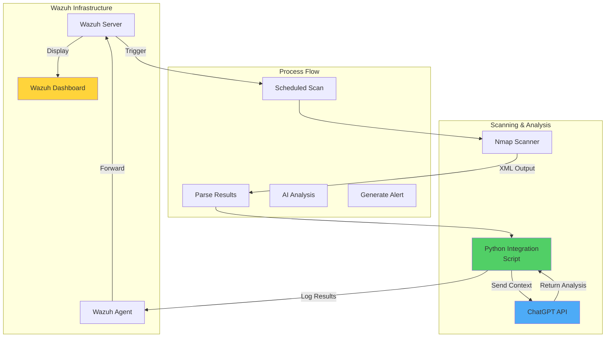

# Nmap and ChatGPT Security Auditing with Wazuh

## Introduction

The integration of traditional security tools with artificial intelligence opens new possibilities for automated security analysis. By combining Nmap's powerful network scanning capabilities with ChatGPT's natural language processing and Wazuh's security orchestration, organizations can create an intelligent security auditing system that not only detects vulnerabilities but also provides contextual analysis and remediation recommendations.

This integration enables:

- 🔍 **Automated Network Discovery**: Schedule and execute Nmap scans through Wazuh
- 🤖 **AI-Powered Analysis**: Leverage ChatGPT to interpret scan results
- 📊 **Contextual Insights**: Get detailed explanations of findings
- 🚨 **Intelligent Alerting**: Prioritize issues based on AI analysis
- 📈 **Continuous Learning**: Improve detection accuracy over time

## Architecture Overview



## Infrastructure Requirements

- **Wazuh Server**: Version 4.7+ with all components
- **Wazuh Agent**: Installed on scanning host
- **Nmap**: Version 7.94+ installed
- **Python**: Version 3.8+ with required libraries
- **ChatGPT API**: OpenAI API key with GPT-4 access
- **System Requirements**:
  - Minimum 4GB RAM for scanning host
  - Network access to target systems
  - Internet connectivity for API calls

## Implementation Guide

### Phase 1: Install Required Components

#### Install Nmap

```bash
# On Ubuntu/Debian
sudo apt update
sudo apt install nmap python3-nmap

# On RHEL/CentOS
sudo yum install epel-release
sudo yum install nmap python3-nmap

# Verify installation
nmap --version
```

#### Install Python Dependencies

```bash
# Create virtual environment
python3 -m venv /opt/wazuh-nmap-ai
source /opt/wazuh-nmap-ai/bin/activate

# Install required packages
pip install openai python-nmap xmltodict requests
```

### Phase 2: Create Integration Script

Create `/var/ossec/integrations/nmap-chatgpt.py`:

```python
#!/opt/wazuh-nmap-ai/bin/python
import os
import sys
import json
import nmap
import openai
import xmltodict
from datetime import datetime
import logging

# Configure logging
logging.basicConfig(
    level=logging.INFO,
    format='%(asctime)s - %(levelname)s - %(message)s',
    filename='/var/ossec/logs/nmap-chatgpt.log'
)

# Configuration
OPENAI_API_KEY = os.environ.get('OPENAI_API_KEY', 'your-api-key-here')
SCAN_OUTPUT_DIR = '/var/ossec/logs/nmap-scans'
ALERT_FILE = '/var/ossec/logs/nmap-ai-alerts.json'

# Initialize OpenAI
openai.api_key = OPENAI_API_KEY

class NmapChatGPTIntegration:
    def __init__(self):
        self.nm = nmap.PortScanner()
        
    def perform_scan(self, target, scan_type='comprehensive'):
        """Perform Nmap scan based on type"""
        scan_args = {
            'basic': '-sV -sC',
            'comprehensive': '-sV -sC -O -A',
            'vulnerability': '-sV --script vuln',
            'stealth': '-sS -sV -T2 -f',
            'quick': '-F -T4'
        }
        
        try:
            logging.info(f"Starting {scan_type} scan on {target}")
            self.nm.scan(hosts=target, arguments=scan_args.get(scan_type, '-sV'))
            return self.nm
        except Exception as e:
            logging.error(f"Scan failed: {str(e)}")
            return None
    
    def parse_scan_results(self, scan_result):
        """Parse Nmap results into structured format"""
        findings = []
        
        for host in scan_result.all_hosts():
            host_info = {
                'ip': host,
                'hostname': scan_result[host].hostname(),
                'state': scan_result[host].state(),
                'os': self._extract_os_info(scan_result[host]),
                'ports': [],
                'vulnerabilities': []
            }
            
            # Extract port information
            for proto in scan_result[host].all_protocols():
                ports = scan_result[host][proto].keys()
                for port in ports:
                    port_info = scan_result[host][proto][port]
                    host_info['ports'].append({
                        'port': port,
                        'protocol': proto,
                        'state': port_info['state'],
                        'service': port_info.get('name', 'unknown'),
                        'version': port_info.get('version', ''),
                        'product': port_info.get('product', '')
                    })
            
            # Extract vulnerability scripts results
            if 'script' in scan_result[host]:
                for script_name, script_output in scan_result[host]['script'].items():
                    if 'vuln' in script_name:
                        host_info['vulnerabilities'].append({
                            'script': script_name,
                            'output': script_output
                        })
            
            findings.append(host_info)
        
        return findings
    
    def _extract_os_info(self, host_data):
        """Extract OS detection information"""
        if 'osmatch' in host_data:
            os_matches = []
            for os_match in host_data['osmatch']:
                os_matches.append({
                    'name': os_match['name'],
                    'accuracy': os_match['accuracy']
                })
            return os_matches
        return []
    
    def analyze_with_chatgpt(self, findings):
        """Send findings to ChatGPT for analysis"""
        # Prepare context for ChatGPT
        context = self._prepare_context(findings)
        
        try:
            response = openai.ChatCompletion.create(
                model="gpt-4",
                messages=[
                    {
                        "role": "system",
                        "content": """You are a cybersecurity expert analyzing Nmap scan results. 
                        Provide detailed analysis including:
                        1. Security risk assessment (Critical/High/Medium/Low)
                        2. Potential vulnerabilities identified
                        3. Specific remediation recommendations
                        4. Priority order for addressing issues
                        5. Additional security considerations
                        Format your response as structured JSON."""
                    },
                    {
                        "role": "user",
                        "content": f"Analyze these Nmap scan findings:\n{json.dumps(context, indent=2)}"
                    }
                ],
                temperature=0.3,
                max_tokens=2000
            )
            
            analysis = json.loads(response.choices[0].message.content)
            return analysis
            
        except Exception as e:
            logging.error(f"ChatGPT analysis failed: {str(e)}")
            return None
    
    def _prepare_context(self, findings):
        """Prepare findings for ChatGPT analysis"""
        context = {
            'scan_timestamp': datetime.now().isoformat(),
            'total_hosts': len(findings),
            'findings': []
        }
        
        for host in findings:
            host_context = {
                'ip': host['ip'],
                'hostname': host['hostname'],
                'open_ports': len(host['ports']),
                'services': [],
                'potential_issues': []
            }
            
            # Summarize services
            for port in host['ports']:
                service_info = f"{port['service']} ({port['version']})" if port['version'] else port['service']
                host_context['services'].append({
                    'port': port['port'],
                    'service': service_info,
                    'state': port['state']
                })
            
            # Add vulnerabilities if found
            if host['vulnerabilities']:
                host_context['vulnerabilities'] = host['vulnerabilities']
            
            # Flag potential issues
            for port in host['ports']:
                if port['port'] in [21, 23, 445, 3389]:  # Known risky ports
                    host_context['potential_issues'].append(
                        f"Risky service {port['service']} on port {port['port']}"
                    )
            
            context['findings'].append(host_context)
        
        return context
    
    def generate_wazuh_alert(self, findings, ai_analysis):
        """Generate Wazuh-compatible alert"""
        alert = {
            'timestamp': datetime.now().isoformat(),
            'rule': {
                'level': self._determine_alert_level(ai_analysis),
                'description': 'Nmap scan with AI analysis completed',
                'id': '100100',
                'groups': ['network_scan', 'ai_analysis']
            },
            'data': {
                'scan_summary': {
                    'hosts_scanned': len(findings),
                    'open_ports_total': sum(len(h['ports']) for h in findings),
                    'vulnerabilities_found': sum(len(h['vulnerabilities']) for h in findings)
                },
                'ai_analysis': ai_analysis,
                'detailed_findings': findings
            }
        }
        
        # Write alert to file for Wazuh to pick up
        with open(ALERT_FILE, 'a') as f:
            f.write(json.dumps(alert) + '\n')
        
        return alert
    
    def _determine_alert_level(self, ai_analysis):
        """Determine Wazuh alert level based on AI analysis"""
        if not ai_analysis:
            return 5
        
        risk_level = ai_analysis.get('overall_risk', 'medium').lower()
        level_mapping = {
            'critical': 12,
            'high': 10,
            'medium': 7,
            'low': 5
        }
        
        return level_mapping.get(risk_level, 7)

def main():
    """Main execution function"""
    if len(sys.argv) < 2:
        print("Usage: nmap-chatgpt.py <target> [scan_type]")
        sys.exit(1)
    
    target = sys.argv[1]
    scan_type = sys.argv[2] if len(sys.argv) > 2 else 'comprehensive'
    
    # Initialize integration
    integration = NmapChatGPTIntegration()
    
    # Perform scan
    scan_result = integration.perform_scan(target, scan_type)
    if not scan_result:
        logging.error("Scan failed to complete")
        sys.exit(1)
    
    # Parse results
    findings = integration.parse_scan_results(scan_result)
    logging.info(f"Scan completed. Found {len(findings)} hosts")
    
    # Analyze with ChatGPT
    ai_analysis = integration.analyze_with_chatgpt(findings)
    if ai_analysis:
        logging.info("AI analysis completed successfully")
    else:
        logging.warning("AI analysis failed, proceeding with basic alert")
    
    # Generate Wazuh alert
    alert = integration.generate_wazuh_alert(findings, ai_analysis)
    logging.info(f"Alert generated with level {alert['rule']['level']}")
    
    # Output summary
    print(json.dumps({
        'status': 'success',
        'hosts_scanned': len(findings),
        'alert_level': alert['rule']['level'],
        'ai_analysis_available': ai_analysis is not None
    }, indent=2))

if __name__ == '__main__':
    main()
```

### Phase 3: Configure Wazuh Integration

#### Create Custom Decoder

Add to `/var/ossec/etc/decoders/local_decoder.xml`:

```xml
<decoder name="nmap-ai">
  <prematch>^{.*"rule".*"groups".*"network_scan".*"ai_analysis".*}$</prematch>
  <plugin_decoder>JSON_Decoder</plugin_decoder>
</decoder>

<decoder name="nmap-ai-extract">
  <parent>nmap-ai</parent>
  <regex>.*"overall_risk":\s*"(\w+)".*"hosts_scanned":\s*(\d+).*"open_ports_total":\s*(\d+)</regex>
  <order>risk_level, hosts_scanned, open_ports</order>
</decoder>
```

#### Create Detection Rules

Add to `/var/ossec/etc/rules/local_rules.xml`:

```xml
<group name="network_scan,ai_analysis,">
  <!-- Base rule for Nmap AI scans -->
  <rule id="100100" level="5">
    <decoded_as>nmap-ai</decoded_as>
    <description>Nmap scan with AI analysis completed</description>
  </rule>

  <!-- Critical risk findings -->
  <rule id="100101" level="12">
    <if_sid>100100</if_sid>
    <field name="risk_level">critical</field>
    <description>Critical security risks identified by AI analysis</description>
    <options>alert_by_email</options>
  </rule>

  <!-- High risk findings -->
  <rule id="100102" level="10">
    <if_sid>100100</if_sid>
    <field name="risk_level">high</field>
    <description>High security risks identified by AI analysis</description>
  </rule>

  <!-- Multiple open ports -->
  <rule id="100103" level="8">
    <if_sid>100100</if_sid>
    <field name="open_ports">^([2-9]\d|[1-9]\d{2,})$</field>
    <description>Multiple open ports detected ($(open_ports) ports)</description>
  </rule>

  <!-- Vulnerability detection -->
  <rule id="100104" level="11">
    <if_sid>100100</if_sid>
    <match>vulnerabilities_found":\s*[1-9]</match>
    <description>Vulnerabilities detected during network scan</description>
  </rule>
</group>
```

#### Configure Log Collection

Add to `/var/ossec/etc/ossec.conf`:

```xml
<ossec_config>
  <localfile>
    <log_format>json</log_format>
    <location>/var/ossec/logs/nmap-ai-alerts.json</location>
  </localfile>

  <!-- Command for manual scans -->
  <command>
    <name>nmap-ai-scan</name>
    <executable>nmap-chatgpt.py</executable>
    <timeout_allowed>yes</timeout_allowed>
  </command>
</ossec_config>
```

### Phase 4: Create Scheduled Scanning

#### Automated Scanning Script

Create `/var/ossec/integrations/scheduled-scan.sh`:

```bash
#!/bin/bash
# Scheduled network scanning with AI analysis

# Configuration
TARGETS_FILE="/var/ossec/etc/scan-targets.txt"
SCAN_LOG="/var/ossec/logs/scheduled-scans.log"
PYTHON_ENV="/opt/wazuh-nmap-ai/bin/python"
SCRIPT_PATH="/var/ossec/integrations/nmap-chatgpt.py"

# Export API key
export OPENAI_API_KEY="your-api-key-here"

echo "[$(date)] Starting scheduled network scan" >> "$SCAN_LOG"

# Read targets and scan
while IFS= read -r target; do
    if [[ ! -z "$target" && ! "$target" =~ ^# ]]; then
        echo "[$(date)] Scanning target: $target" >> "$SCAN_LOG"
        $PYTHON_ENV "$SCRIPT_PATH" "$target" "comprehensive" >> "$SCAN_LOG" 2>&1
        
        # Delay between scans to avoid overwhelming the API
        sleep 30
    fi
done < "$TARGETS_FILE"

echo "[$(date)] Scheduled scan completed" >> "$SCAN_LOG"
```

#### Create Target List

Create `/var/ossec/etc/scan-targets.txt`:

```
# Network scan targets
# Add IP addresses or CIDR ranges

192.168.1.0/24
10.0.0.0/24
# Critical servers
192.168.1.10
192.168.1.20
```

#### Schedule with Cron

```bash
# Add to root's crontab
# Daily scan at 2 AM
0 2 * * * /var/ossec/integrations/scheduled-scan.sh

# Weekly comprehensive scan on Sunday
0 3 * * 0 /var/ossec/integrations/scheduled-scan.sh
```

## Advanced Features

### Enhanced AI Analysis Prompts

Create `/var/ossec/integrations/ai-prompts.py`:

```python
class SecurityPrompts:
    """Advanced prompts for different security contexts"""
    
    @staticmethod
    def vulnerability_assessment():
        return """You are a vulnerability assessment expert. Analyze the scan results and provide:
        1. CVE identification for discovered services
        2. CVSS score estimation
        3. Exploitation difficulty assessment
        4. Potential attack vectors
        5. Detailed remediation steps with commands/configurations
        6. Compensating controls if immediate patching isn't possible
        
        Structure your response as JSON with these sections:
        - vulnerabilities: array of identified vulnerabilities
        - risk_matrix: risk assessment for each finding
        - remediation_plan: prioritized action items
        - quick_wins: immediate actions that can be taken
        """
    
    @staticmethod
    def compliance_check():
        return """You are a compliance auditor. Analyze the scan results against common frameworks:
        1. PCI DSS requirements
        2. HIPAA technical safeguards
        3. NIST 800-53 controls
        4. CIS benchmarks
        
        For each applicable framework, identify:
        - Compliance gaps
        - Required configurations
        - Evidence of controls
        - Remediation priorities
        
        Format as JSON with framework-specific findings."""
    
    @staticmethod
    def threat_intelligence():
        return """You are a threat intelligence analyst. Based on the scan results:
        1. Identify services commonly targeted by threat actors
        2. Map findings to MITRE ATT&CK techniques
        3. Assess likelihood of compromise
        4. Recommend threat hunting queries
        5. Suggest defensive measures
        
        Include IoCs to monitor and detection rules to implement."""
```

### Interactive Dashboard Integration

Create `/var/ossec/integrations/dashboard-api.py`:

```python
from flask import Flask, jsonify, request
import json
import subprocess

app = Flask(__name__)

@app.route('/api/scan/trigger', methods=['POST'])
def trigger_scan():
    """API endpoint to trigger on-demand scans"""
    data = request.json
    target = data.get('target')
    scan_type = data.get('scan_type', 'basic')
    
    # Validate input
    if not target:
        return jsonify({'error': 'Target required'}), 400
    
    # Execute scan
    result = subprocess.run(
        ['/opt/wazuh-nmap-ai/bin/python', '/var/ossec/integrations/nmap-chatgpt.py', target, scan_type],
        capture_output=True,
        text=True
    )
    
    return jsonify({
        'status': 'success' if result.returncode == 0 else 'failed',
        'output': result.stdout,
        'error': result.stderr
    })

@app.route('/api/scan/history', methods=['GET'])
def scan_history():
    """Get recent scan results"""
    limit = request.args.get('limit', 10, type=int)
    
    # Read recent alerts
    alerts = []
    with open('/var/ossec/logs/nmap-ai-alerts.json', 'r') as f:
        for line in f:
            alerts.append(json.loads(line))
            if len(alerts) >= limit:
                break
    
    return jsonify(alerts)

@app.route('/api/scan/analysis/<scan_id>', methods=['GET'])
def get_analysis(scan_id):
    """Get detailed AI analysis for a specific scan"""
    # Implementation to retrieve specific scan analysis
    pass

if __name__ == '__main__':
    app.run(host='0.0.0.0', port=5000)
```

### Custom Visualization for Wazuh Dashboard

```json
{
  "visualization": {
    "title": "AI-Enhanced Network Security Overview",
    "visState": {
      "type": "vega",
      "params": {
        "spec": {
          "$schema": "https://vega.github.io/schema/vega-lite/v5.json",
          "data": {
            "url": {
              "index": "wazuh-alerts-*",
              "body": {
                "query": {
                  "bool": {
                    "must": [
                      {"term": {"rule.groups": "ai_analysis"}},
                      {"range": {"timestamp": {"gte": "now-7d"}}}
                    ]
                  }
                },
                "aggs": {
                  "risk_distribution": {
                    "terms": {
                      "field": "data.ai_analysis.overall_risk.keyword"
                    }
                  },
                  "timeline": {
                    "date_histogram": {
                      "field": "timestamp",
                      "interval": "1d"
                    },
                    "aggs": {
                      "risk_levels": {
                        "terms": {
                          "field": "data.ai_analysis.overall_risk.keyword"
                        }
                      }
                    }
                  }
                }
              }
            }
          },
          "layer": [
            {
              "mark": "bar",
              "encoding": {
                "x": {"field": "key", "type": "temporal"},
                "y": {"field": "doc_count", "type": "quantitative"},
                "color": {"field": "risk_levels.buckets.key", "type": "nominal"}
              }
            }
          ]
        }
      }
    }
  }
}
```

## Security Best Practices

### 1. API Key Management

```python
# Secure API key storage
import keyring
from cryptography.fernet import Fernet

class SecureConfig:
    def __init__(self):
        self.key = self._get_or_create_key()
        self.cipher = Fernet(self.key)
    
    def _get_or_create_key(self):
        """Get or create encryption key"""
        key = keyring.get_password("wazuh-nmap-ai", "encryption_key")
        if not key:
            key = Fernet.generate_key().decode()
            keyring.set_password("wazuh-nmap-ai", "encryption_key", key)
        return key.encode()
    
    def store_api_key(self, api_key):
        """Securely store API key"""
        encrypted = self.cipher.encrypt(api_key.encode())
        keyring.set_password("wazuh-nmap-ai", "openai_api_key", encrypted.decode())
    
    def get_api_key(self):
        """Retrieve API key"""
        encrypted = keyring.get_password("wazuh-nmap-ai", "openai_api_key")
        if encrypted:
            return self.cipher.decrypt(encrypted.encode()).decode()
        return None
```

### 2. Rate Limiting and Cost Control

```python
class RateLimiter:
    def __init__(self, max_requests_per_hour=10):
        self.max_requests = max_requests_per_hour
        self.requests = []
    
    def can_make_request(self):
        """Check if request can be made within rate limits"""
        now = datetime.now()
        # Remove requests older than 1 hour
        self.requests = [r for r in self.requests if (now - r).seconds < 3600]
        
        if len(self.requests) < self.max_requests:
            self.requests.append(now)
            return True
        return False
    
    def estimate_cost(self, tokens_used):
        """Estimate API cost"""
        # GPT-4 pricing (example)
        cost_per_1k_tokens = 0.03
        return (tokens_used / 1000) * cost_per_1k_tokens
```

### 3. Input Validation and Sanitization

```python
import ipaddress
import re

def validate_scan_target(target):
    """Validate scan target is safe"""
    # Check if it's a valid IP or CIDR
    try:
        ipaddress.ip_network(target, strict=False)
    except ValueError:
        # Check if it's a valid hostname
        hostname_regex = re.compile(
            r'^(?!-)(?:[a-zA-Z0-9-]{1,63}(?<!-)\.)*[a-zA-Z]{2,}$'
        )
        if not hostname_regex.match(target):
            raise ValueError(f"Invalid target: {target}")
    
    # Check against blocked ranges
    blocked_ranges = [
        '127.0.0.0/8',  # Loopback
        '169.254.0.0/16',  # Link-local
        '224.0.0.0/4'  # Multicast
    ]
    
    for blocked in blocked_ranges:
        if ipaddress.ip_network(target, strict=False).overlaps(
            ipaddress.ip_network(blocked)
        ):
            raise ValueError(f"Target in blocked range: {target}")
    
    return True
```

## Monitoring and Troubleshooting

### Performance Monitoring

```bash
#!/bin/bash
# Monitor integration performance

echo "=== Nmap-ChatGPT Integration Monitor ==="
echo "Timestamp: $(date)"
echo ""

# Check API usage
echo "API Requests (Last 24h):"
grep "ChatGPT analysis completed" /var/ossec/logs/nmap-chatgpt.log | \
    grep "$(date -d '1 day ago' +%Y-%m-%d)" | wc -l

# Average scan time
echo -e "\nAverage Scan Duration:"
grep "Scan completed" /var/ossec/logs/nmap-chatgpt.log | \
    tail -10 | awk '{print $1}' | \
    while read timestamp; do
        date -d "$timestamp" +%s
    done | awk '{if(NR>1)print $1-prev; prev=$1}' | \
    awk '{sum+=$1; count++} END {print sum/count " seconds"}'

# Error rate
echo -e "\nError Rate:"
total=$(grep -c "Starting" /var/ossec/logs/nmap-chatgpt.log)
errors=$(grep -c "ERROR" /var/ossec/logs/nmap-chatgpt.log)
echo "$errors errors out of $total scans"

# Wazuh alerts generated
echo -e "\nAlerts Generated:"
wc -l /var/ossec/logs/nmap-ai-alerts.json
```

### Common Issues and Solutions

#### Issue 1: API Rate Limiting

```python
# Implement exponential backoff
import time

def retry_with_backoff(func, max_retries=3):
    """Retry function with exponential backoff"""
    for attempt in range(max_retries):
        try:
            return func()
        except openai.error.RateLimitError:
            wait_time = (2 ** attempt) + random.uniform(0, 1)
            logging.warning(f"Rate limited, waiting {wait_time}s")
            time.sleep(wait_time)
    raise Exception("Max retries exceeded")
```

#### Issue 2: Large Network Scans

```python
# Implement chunking for large networks
def chunk_network(network_cidr, chunk_size=256):
    """Split large network into smaller chunks"""
    network = ipaddress.ip_network(network_cidr, strict=False)
    
    chunks = []
    for subnet in network.subnets(new_prefix=32 - int(math.log2(chunk_size))):
        chunks.append(str(subnet))
    
    return chunks
```

#### Issue 3: Memory Management

```python
# Stream processing for large results
def process_scan_streaming(target):
    """Process scan results in streaming fashion"""
    nm = nmap.PortScanner()
    
    # Use callback for streaming
    def callback_result(host, scan_result):
        # Process each host as it completes
        findings = parse_single_host(host, scan_result)
        analyze_and_alert(findings)
    
    nm.scan(hosts=target, arguments='-sV', callback=callback_result)
```

## Use Cases

### 1. Automated Vulnerability Assessment

```python
def vulnerability_focused_scan(target):
    """Specialized scan for vulnerability assessment"""
    scan_args = """
    -sV --script=vuln,exploit,auth,default 
    --script-args=unsafe=1
    -p-
    """
    
    # Custom AI prompt for vulnerability analysis
    vuln_prompt = """
    Focus on identifying:
    1. Known CVEs for detected services
    2. Default credentials
    3. Misconfigurations
    4. Outdated software versions
    5. Weak encryption settings
    
    Provide specific exploitation steps and patches.
    """
    
    return enhanced_scan(target, scan_args, vuln_prompt)
```

### 2. Compliance Scanning

```python
def compliance_scan(target, framework='pci'):
    """Scan for compliance framework requirements"""
    frameworks = {
        'pci': {
            'ports': '21,22,23,25,80,443,445,1433,3306,3389',
            'scripts': 'ssl-cert,ssl-enum-ciphers,http-security-headers'
        },
        'hipaa': {
            'ports': '22,443,3389,5432,27017',
            'scripts': 'ssl-*,http-security-headers,smb-security-mode'
        }
    }
    
    config = frameworks.get(framework, frameworks['pci'])
    scan_args = f"-sV -p{config['ports']} --script={config['scripts']}"
    
    return targeted_scan(target, scan_args, framework)
```

### 3. Continuous Security Monitoring

```python
def differential_scan(target, baseline_file):
    """Compare current state with baseline"""
    current_scan = perform_scan(target)
    
    # Load baseline
    with open(baseline_file, 'r') as f:
        baseline = json.load(f)
    
    # Identify changes
    changes = {
        'new_ports': [],
        'closed_ports': [],
        'service_changes': [],
        'new_vulnerabilities': []
    }
    
    # Compare and analyze changes
    for host in current_scan['hosts']:
        baseline_host = find_host_in_baseline(host['ip'], baseline)
        if baseline_host:
            changes['new_ports'].extend(
                find_new_ports(host['ports'], baseline_host['ports'])
            )
    
    # Get AI analysis of changes
    change_analysis = analyze_changes_with_ai(changes)
    
    return changes, change_analysis
```

## Integration Examples

### 1. Slack Notifications

```python
import requests

def send_slack_alert(webhook_url, alert_data):
    """Send critical alerts to Slack"""
    if alert_data['risk_level'] in ['critical', 'high']:
        message = {
            "text": f"🚨 Security Alert: {alert_data['risk_level'].upper()}",
            "attachments": [{
                "color": "danger" if alert_data['risk_level'] == 'critical' else "warning",
                "fields": [
                    {
                        "title": "Target",
                        "value": alert_data['target'],
                        "short": True
                    },
                    {
                        "title": "Open Ports",
                        "value": str(alert_data['open_ports']),
                        "short": True
                    },
                    {
                        "title": "AI Summary",
                        "value": alert_data['ai_summary'],
                        "short": False
                    },
                    {
                        "title": "Top Recommendations",
                        "value": "\n".join(alert_data['recommendations'][:3]),
                        "short": False
                    }
                ]
            }]
        }
        
        requests.post(webhook_url, json=message)
```

### 2. JIRA Ticket Creation

```python
from jira import JIRA

def create_jira_issue(findings, ai_analysis):
    """Create JIRA tickets for findings"""
    jira = JIRA(
        server='https://your-instance.atlassian.net',
        basic_auth=('email@example.com', 'api_token')
    )
    
    for finding in findings['critical_issues']:
        issue_dict = {
            'project': 'SEC',
            'summary': f"Security Finding: {finding['title']}",
            'description': f"""
                *AI Risk Assessment:* {finding['risk_level']}
                
                *Description:* {finding['description']}
                
                *Affected System:* {finding['target']}
                
                *Remediation Steps:*
                {finding['remediation']}
                
                *AI Recommendations:*
                {ai_analysis['recommendations']}
            """,
            'issuetype': {'name': 'Security'},
            'priority': {'name': 'High' if finding['risk_level'] == 'critical' else 'Medium'}
        }
        
        jira.create_issue(fields=issue_dict)
```

## Performance Optimization

### 1. Caching AI Responses

```python
import hashlib
import pickle

class AICache:
    def __init__(self, cache_dir='/var/ossec/cache/ai'):
        self.cache_dir = cache_dir
        os.makedirs(cache_dir, exist_ok=True)
    
    def get_cache_key(self, findings):
        """Generate cache key from findings"""
        # Create hash of relevant findings data
        cache_data = {
            'services': sorted([p['service'] for h in findings for p in h['ports']]),
            'port_count': sum(len(h['ports']) for h in findings),
            'os_matches': [os['name'] for h in findings for os in h.get('os', [])]
        }
        
        return hashlib.sha256(
            json.dumps(cache_data, sort_keys=True).encode()
        ).hexdigest()
    
    def get(self, findings):
        """Retrieve cached analysis"""
        cache_key = self.get_cache_key(findings)
        cache_file = os.path.join(self.cache_dir, f"{cache_key}.pkl")
        
        if os.path.exists(cache_file):
            # Check if cache is still valid (24 hours)
            if time.time() - os.path.getmtime(cache_file) < 86400:
                with open(cache_file, 'rb') as f:
                    return pickle.load(f)
        
        return None
    
    def set(self, findings, analysis):
        """Cache analysis results"""
        cache_key = self.get_cache_key(findings)
        cache_file = os.path.join(self.cache_dir, f"{cache_key}.pkl")
        
        with open(cache_file, 'wb') as f:
            pickle.dump(analysis, f)
```

### 2. Parallel Scanning

```python
from concurrent.futures import ThreadPoolExecutor, as_completed

def parallel_scan(targets, max_workers=5):
    """Scan multiple targets in parallel"""
    results = []
    
    with ThreadPoolExecutor(max_workers=max_workers) as executor:
        # Submit scan tasks
        future_to_target = {
            executor.submit(perform_scan, target): target 
            for target in targets
        }
        
        # Process completed scans
        for future in as_completed(future_to_target):
            target = future_to_target[future]
            try:
                scan_result = future.result()
                # Process with AI in batches to optimize API usage
                results.append((target, scan_result))
            except Exception as e:
                logging.error(f"Scan failed for {target}: {str(e)}")
    
    # Batch AI analysis
    if results:
        batch_analyze_with_ai(results)
    
    return results
```

## Conclusion

The integration of Nmap network scanning with ChatGPT AI analysis within Wazuh creates a powerful, intelligent security auditing system that:

- ✅ **Automates vulnerability discovery** with comprehensive network scanning
- 🤖 **Provides intelligent analysis** through AI-powered insights
- 📊 **Delivers actionable recommendations** with prioritized remediation
- 🚀 **Scales security operations** through automation
- 🔍 **Enhances threat detection** with contextual understanding

This integration represents the future of security operations, where traditional tools are enhanced with artificial intelligence to provide deeper insights and more effective security measures.

## Key Takeaways

1. **API Management**: Secure and monitor API key usage carefully
2. **Cost Control**: Implement rate limiting and caching strategies
3. **Scope Management**: Start with small, targeted scans before scaling
4. **Human Oversight**: Always validate AI recommendations
5. **Continuous Improvement**: Refine prompts based on results

## Resources

- [Nmap Documentation](https://nmap.org/docs.html)
- [OpenAI API Documentation](https://platform.openai.com/docs/api-reference)
- [Wazuh Integration Guide](https://documentation.wazuh.com/current/user-manual/capabilities/integration.html)
- [Python-Nmap Library](https://pypi.org/project/python-nmap/)

---

*Enhance your security auditing with AI-powered network scanning! 🤖🔍*