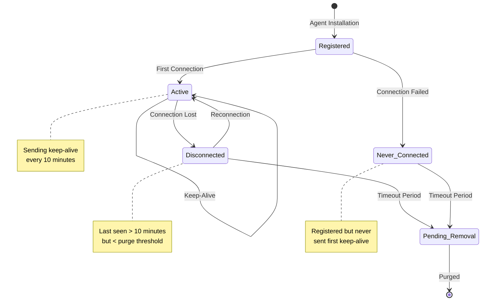

# How to Purge Non-Active Agents in Wazuh

## Introduction

In dynamic infrastructure environments, Wazuh agents move through various stages of their lifecycle. Servers are provisioned and decommissioned, instances are terminated, and sometimes agents fail to connect due to network issues. This natural churn can leave your Wazuh manager cluttered with permanently disconnected or never-connected agents.

Managing agent inventory is crucial for:

- 📊 **Accurate Metrics**: Maintain true visibility of active infrastructure
- 🎯 **Efficient Management**: Focus on agents that matter
- 💾 **Resource Optimization**: Reduce database size and improve performance
- 📈 **Compliance Reporting**: Generate accurate coverage reports
- 🔍 **Security Posture**: Identify gaps in monitoring coverage

This guide demonstrates how to use the Wazuh API to automatically purge non-active agents, keeping your agent list clean and current.

## Understanding Agent States

### Agent Lifecycle



### Key Agent Dates

When querying agents via the API, two critical date fields help determine agent status:

1. **dateAdd**: Agent registration date
2. **lastKeepAlive**: Last time agent sent a keep-alive signal

Understanding these dates is crucial:
- **Disconnected agents**: Use `lastKeepAlive` to determine how long they've been offline
- **Never connected agents**: Use `dateAdd` since they have no `lastKeepAlive`

## Implementation Guide

### Prerequisites

- **Wazuh Manager**: Version 3.8+ with API enabled
- **API Access**: Valid credentials for API authentication
- **Network Access**: Ability to reach API endpoint (default: port 55000)
- **Authorization**: Permissions to delete agents

### Understanding the API

#### Get Agent Information

```bash
# Get all agents with relevant fields
curl -u foo:bar -k -X GET \
  'https://localhost:55000/agents?select=name,status,dateAdd,lastKeepAlive&pretty'
```

Example response:
```json
{
  "error": 0,
  "data": {
    "totalItems": 4,
    "items": [
      {
        "status": "Active",
        "dateAdd": "2019-01-01 00:00:00",
        "name": "Springfield",
        "lastKeepAlive": "9999-12-31 23:59:59",
        "id": "000"
      },
      {
        "status": "Active",
        "dateAdd": "2019-04-11 12:00:00",
        "name": "Homer-01",
        "lastKeepAlive": "2019-04-11 13:00:00",
        "id": "001"
      },
      {
        "status": "Never connected",
        "dateAdd": "2019-03-01 12:00:00",
        "name": "Maggie-01",
        "id": "002"
      },
      {
        "status": "Disconnected",
        "dateAdd": "2019-03-01 12:00:01",
        "name": "Bart-01",
        "lastKeepAlive": "2019-03-11 10:00:00",
        "id": "003"
      }
    ]
  }
}
```

### Purging Agents Using the API

The DELETE `/agents` endpoint accepts these parameters:

- **status**: Filter by agent status (active, disconnected, neverconnected)
- **older_than**: Time threshold for purging

#### Example 1: Purge Never Connected Agents

Remove agents registered more than 21 days ago that never connected:

```bash
curl -u foo:bar -k -X DELETE \
  'https://localhost:55000/agents?status=neverconnected&older_than=21d&pretty'
```

Response:
```json
{
  "error": 0,
  "data": {
    "msg": "All selected agents were removed",
    "older_than": "21d",
    "affected_agents": ["002"],
    "total_affected_agents": 1
  }
}
```

#### Example 2: Purge Disconnected Agents

Remove agents that haven't reported in 21 days:

```bash
curl -u foo:bar -k -X DELETE \
  'https://localhost:55000/agents?status=disconnected&older_than=21d&pretty'
```

Response:
```json
{
  "error": 0,
  "data": {
    "msg": "All selected agents were removed",
    "older_than": "21d",
    "affected_agents": ["003"],
    "total_affected_agents": 1
  }
}
```

## Automation Scripts

### 1. Basic Purge Script

```python
#!/usr/bin/env python3
"""
purge_inactive_agents.py - Automatically purge inactive Wazuh agents
"""

import requests
import json
from datetime import datetime
import urllib3

# Disable SSL warnings for self-signed certificates
urllib3.disable_warnings(urllib3.exceptions.InsecureRequestWarning)

class WazuhAgentPurger:
    def __init__(self, api_url, username, password):
        self.api_url = api_url
        self.auth = (username, password)
        self.verify_ssl = False
    
    def get_agents(self, status=None):
        """Get list of agents with optional status filter"""
        
        params = {
            'select': 'id,name,status,dateAdd,lastKeepAlive,ip,version',
            'limit': 500
        }
        
        if status:
            params['status'] = status
        
        response = requests.get(
            f"{self.api_url}/agents",
            auth=self.auth,
            params=params,
            verify=self.verify_ssl
        )
        
        if response.status_code == 200:
            return response.json()['data']['items']
        else:
            raise Exception(f"API Error: {response.status_code}")
    
    def purge_agents(self, status, older_than, dry_run=True):
        """Purge agents based on status and age"""
        
        # First, get list of agents that would be affected
        print(f"\nChecking for {status} agents older than {older_than}...")
        
        if dry_run:
            print("DRY RUN MODE - No agents will be deleted")
        
        # Get count of affected agents
        response = requests.get(
            f"{self.api_url}/agents",
            auth=self.auth,
            params={
                'status': status,
                'older_than': older_than,
                'select': 'id,name,dateAdd,lastKeepAlive'
            },
            verify=self.verify_ssl
        )
        
        if response.status_code == 200:
            agents = response.json()['data']['items']
            
            if not agents:
                print(f"No {status} agents found older than {older_than}")
                return
            
            print(f"\nFound {len(agents)} agents to purge:")
            for agent in agents:
                last_seen = agent.get('lastKeepAlive', agent.get('dateAdd', 'Unknown'))
                print(f"  - {agent['id']}: {agent['name']} (Last seen: {last_seen})")
            
            if not dry_run:
                # Perform actual deletion
                response = requests.delete(
                    f"{self.api_url}/agents",
                    auth=self.auth,
                    params={
                        'status': status,
                        'older_than': older_than
                    },
                    verify=self.verify_ssl
                )
                
                if response.status_code == 200:
                    result = response.json()['data']
                    print(f"\nSuccessfully purged {result['total_affected_agents']} agents")
                else:
                    print(f"\nError purging agents: {response.status_code}")
    
    def generate_report(self):
        """Generate agent status report"""
        
        all_agents = self.get_agents()
        
        status_count = {
            'Active': 0,
            'Disconnected': 0,
            'Never connected': 0,
            'Pending': 0
        }
        
        for agent in all_agents:
            status = agent.get('status', 'Unknown')
            if status in status_count:
                status_count[status] += 1
        
        print("\n=== Wazuh Agent Status Report ===")
        print(f"Generated: {datetime.now().strftime('%Y-%m-%d %H:%M:%S')}")
        print(f"\nTotal Agents: {len(all_agents)}")
        print("\nStatus Breakdown:")
        for status, count in status_count.items():
            percentage = (count / len(all_agents) * 100) if all_agents else 0
            print(f"  {status}: {count} ({percentage:.1f}%)")
        
        return status_count

def main():
    # Configuration
    API_URL = "https://localhost:55000"
    USERNAME = "foo"
    PASSWORD = "bar"
    
    # Purge thresholds
    DISCONNECTED_THRESHOLD = "30d"  # 30 days
    NEVER_CONNECTED_THRESHOLD = "7d"  # 7 days
    
    # Initialize purger
    purger = WazuhAgentPurger(API_URL, USERNAME, PASSWORD)
    
    # Generate initial report
    purger.generate_report()
    
    # Purge never connected agents
    purger.purge_agents(
        status="neverconnected",
        older_than=NEVER_CONNECTED_THRESHOLD,
        dry_run=False
    )
    
    # Purge disconnected agents
    purger.purge_agents(
        status="disconnected",
        older_than=DISCONNECTED_THRESHOLD,
        dry_run=False
    )
    
    # Generate final report
    print("\n" + "="*50)
    purger.generate_report()

if __name__ == "__main__":
    main()
```

### 2. Advanced Purge Script with Exclusions

```python
#!/usr/bin/env python3
"""
advanced_agent_purge.py - Advanced agent purging with exclusions and notifications
"""

import requests
import json
import logging
import smtplib
from email.mime.text import MIMEText
from datetime import datetime, timedelta
import yaml
import argparse

class AdvancedAgentPurger:
    def __init__(self, config_file):
        with open(config_file, 'r') as f:
            self.config = yaml.safe_load(f)
        
        self.api_url = self.config['wazuh']['api_url']
        self.auth = (
            self.config['wazuh']['username'],
            self.config['wazuh']['password']
        )
        
        # Setup logging
        logging.basicConfig(
            level=logging.INFO,
            format='%(asctime)s - %(levelname)s - %(message)s'
        )
        self.logger = logging.getLogger(__name__)
    
    def load_exclusions(self):
        """Load agent exclusion list"""
        
        exclusions = {
            'agent_names': [],
            'agent_ids': [],
            'ip_ranges': []
        }
        
        if 'exclusions' in self.config:
            exclusions.update(self.config['exclusions'])
        
        return exclusions
    
    def should_exclude_agent(self, agent, exclusions):
        """Check if agent should be excluded from purging"""
        
        # Check agent ID
        if agent['id'] in exclusions['agent_ids']:
            return True
        
        # Check agent name patterns
        for pattern in exclusions['agent_names']:
            if pattern in agent['name']:
                return True
        
        # Check IP ranges
        agent_ip = agent.get('ip', '')
        for ip_range in exclusions['ip_ranges']:
            if self.ip_in_range(agent_ip, ip_range):
                return True
        
        return False
    
    def get_purgeable_agents(self, status, older_than):
        """Get list of agents eligible for purging"""
        
        response = requests.get(
            f"{self.api_url}/agents",
            auth=self.auth,
            params={
                'status': status,
                'older_than': older_than,
                'limit': 500
            },
            verify=False
        )
        
        if response.status_code != 200:
            self.logger.error(f"Failed to get agents: {response.status_code}")
            return []
        
        agents = response.json()['data']['items']
        exclusions = self.load_exclusions()
        
        # Filter out excluded agents
        purgeable = []
        excluded = []
        
        for agent in agents:
            if self.should_exclude_agent(agent, exclusions):
                excluded.append(agent)
            else:
                purgeable.append(agent)
        
        if excluded:
            self.logger.info(f"Excluded {len(excluded)} agents from purging")
            for agent in excluded:
                self.logger.debug(f"  Excluded: {agent['id']} - {agent['name']}")
        
        return purgeable
    
    def purge_with_backup(self, agents):
        """Purge agents with backup of agent information"""
        
        if not agents:
            return
        
        # Backup agent information
        backup_file = f"purged_agents_{datetime.now().strftime('%Y%m%d_%H%M%S')}.json"
        with open(backup_file, 'w') as f:
            json.dump(agents, f, indent=2)
        
        self.logger.info(f"Backed up {len(agents)} agents to {backup_file}")
        
        # Purge agents individually to handle errors
        success_count = 0
        failed_agents = []
        
        for agent in agents:
            try:
                response = requests.delete(
                    f"{self.api_url}/agents/{agent['id']}",
                    auth=self.auth,
                    verify=False
                )
                
                if response.status_code == 200:
                    success_count += 1
                    self.logger.info(f"Purged agent: {agent['id']} - {agent['name']}")
                else:
                    failed_agents.append(agent)
                    self.logger.error(
                        f"Failed to purge {agent['id']}: {response.status_code}"
                    )
            
            except Exception as e:
                failed_agents.append(agent)
                self.logger.error(f"Error purging {agent['id']}: {str(e)}")
        
        return success_count, failed_agents
    
    def send_notification(self, report):
        """Send email notification with purge report"""
        
        if 'email' not in self.config or not self.config['email']['enabled']:
            return
        
        msg = MIMEText(report)
        msg['Subject'] = f"Wazuh Agent Purge Report - {datetime.now().strftime('%Y-%m-%d')}"
        msg['From'] = self.config['email']['from']
        msg['To'] = ', '.join(self.config['email']['to'])
        
        try:
            smtp = smtplib.SMTP(
                self.config['email']['smtp_server'],
                self.config['email']['smtp_port']
            )
            smtp.send_message(msg)
            smtp.quit()
            self.logger.info("Email notification sent")
        except Exception as e:
            self.logger.error(f"Failed to send email: {str(e)}")
    
    def generate_detailed_report(self, purge_results):
        """Generate detailed purge report"""
        
        report = []
        report.append("=== Wazuh Agent Purge Report ===")
        report.append(f"Date: {datetime.now().strftime('%Y-%m-%d %H:%M:%S')}")
        report.append(f"Server: {self.api_url}")
        report.append("")
        
        for result in purge_results:
            report.append(f"\n{result['status'].upper()} Agents:")
            report.append(f"  Threshold: {result['threshold']}")
            report.append(f"  Found: {result['found']}")
            report.append(f"  Excluded: {result['excluded']}")
            report.append(f"  Purged: {result['purged']}")
            report.append(f"  Failed: {result['failed']}")
            
            if result['failed_agents']:
                report.append("\n  Failed Agents:")
                for agent in result['failed_agents']:
                    report.append(f"    - {agent['id']}: {agent['name']}")
        
        return '\n'.join(report)
    
    def run(self, dry_run=False):
        """Execute purge process"""
        
        self.logger.info("Starting Wazuh agent purge process")
        
        purge_configs = [
            {
                'status': 'neverconnected',
                'threshold': self.config['purge']['never_connected_days'] + 'd'
            },
            {
                'status': 'disconnected',
                'threshold': self.config['purge']['disconnected_days'] + 'd'
            }
        ]
        
        results = []
        
        for config in purge_configs:
            self.logger.info(
                f"\nProcessing {config['status']} agents "
                f"older than {config['threshold']}"
            )
            
            # Get purgeable agents
            agents = self.get_purgeable_agents(
                config['status'],
                config['threshold']
            )
            
            result = {
                'status': config['status'],
                'threshold': config['threshold'],
                'found': len(agents),
                'excluded': 0,  # Will be calculated
                'purged': 0,
                'failed': 0,
                'failed_agents': []
            }
            
            if agents:
                if dry_run:
                    self.logger.info(f"DRY RUN: Would purge {len(agents)} agents")
                    result['purged'] = len(agents)
                else:
                    success, failed = self.purge_with_backup(agents)
                    result['purged'] = success
                    result['failed'] = len(failed)
                    result['failed_agents'] = failed
            else:
                self.logger.info("No agents to purge")
            
            results.append(result)
        
        # Generate and send report
        report = self.generate_detailed_report(results)
        self.logger.info("\n" + report)
        
        if not dry_run:
            self.send_notification(report)
        
        return results

# Configuration file example (config.yaml)
"""
wazuh:
  api_url: https://localhost:55000
  username: foo
  password: bar

purge:
  never_connected_days: 7
  disconnected_days: 30

exclusions:
  agent_ids:
    - "010"
    - "011"
  agent_names:
    - "critical-server"
    - "production-"
  ip_ranges:
    - "10.0.1.0/24"
    - "192.168.100.0/24"

email:
  enabled: true
  smtp_server: localhost
  smtp_port: 25
  from: wazuh@company.com
  to:
    - security@company.com
    - ops@company.com
"""

def main():
    parser = argparse.ArgumentParser(description='Purge inactive Wazuh agents')
    parser.add_argument(
        '-c', '--config',
        default='config.yaml',
        help='Configuration file path'
    )
    parser.add_argument(
        '--dry-run',
        action='store_true',
        help='Perform dry run without deleting agents'
    )
    
    args = parser.parse_args()
    
    purger = AdvancedAgentPurger(args.config)
    purger.run(dry_run=args.dry_run)

if __name__ == "__main__":
    main()
```

### 3. Scheduled Purge with Cron

```bash
#!/bin/bash
# wazuh_agent_maintenance.sh - Scheduled agent maintenance script

# Configuration
WAZUH_API="https://localhost:55000"
WAZUH_USER="foo"
WAZUH_PASS="bar"
LOG_DIR="/var/log/wazuh-maintenance"
RETENTION_DAYS=90

# Create log directory
mkdir -p "$LOG_DIR"

# Log file with timestamp
LOG_FILE="$LOG_DIR/agent_purge_$(date +%Y%m%d_%H%M%S).log"

# Function to log messages
log() {
    echo "[$(date +'%Y-%m-%d %H:%M:%S')] $1" | tee -a "$LOG_FILE"
}

# Function to get agent statistics
get_agent_stats() {
    curl -s -u "$WAZUH_USER:$WAZUH_PASS" -k \
        "$WAZUH_API/agents/summary/status" | \
        jq -r '.data'
}

# Function to purge agents
purge_agents() {
    local status=$1
    local older_than=$2
    
    log "Purging $status agents older than $older_than"
    
    response=$(curl -s -u "$WAZUH_USER:$WAZUH_PASS" -k -X DELETE \
        "$WAZUH_API/agents?status=$status&older_than=$older_than")
    
    if [ $? -eq 0 ]; then
        affected=$(echo "$response" | jq -r '.data.total_affected_agents // 0')
        log "Successfully purged $affected $status agents"
    else
        log "ERROR: Failed to purge $status agents"
    fi
}

# Start maintenance
log "===== Starting Wazuh Agent Maintenance ====="

# Get initial statistics
log "Initial agent statistics:"
get_agent_stats | tee -a "$LOG_FILE"

# Purge never connected agents (7 days)
purge_agents "neverconnected" "7d"

# Purge disconnected agents (30 days)
purge_agents "disconnected" "30d"

# Get final statistics
log "Final agent statistics:"
get_agent_stats | tee -a "$LOG_FILE"

# Clean up old logs
log "Cleaning up logs older than $RETENTION_DAYS days"
find "$LOG_DIR" -name "*.log" -mtime +$RETENTION_DAYS -delete

log "===== Maintenance Complete ====="

# Add to crontab:
# 0 2 * * * /opt/wazuh-maintenance/wazuh_agent_maintenance.sh
```

## Best Practices

### 1. Purge Strategy

```yaml
Recommended Thresholds:
  Production Environment:
    Never Connected: 3-7 days
    Disconnected: 30-90 days
    
  Development Environment:
    Never Connected: 1-3 days
    Disconnected: 7-14 days
    
  Dynamic/Cloud Environment:
    Never Connected: 1 day
    Disconnected: 3-7 days

Exclusion Criteria:
  - Critical infrastructure agents
  - Agents with intermittent connectivity
  - Backup/DR system agents
  - Agents under maintenance
```

### 2. Monitoring and Alerting

```python
#!/usr/bin/env python3
# agent_coverage_monitor.py - Monitor agent coverage and alert on issues

class AgentCoverageMonitor:
    def __init__(self, wazuh_api, thresholds):
        self.api = wazuh_api
        self.thresholds = thresholds
    
    def check_coverage(self):
        """Check agent coverage against thresholds"""
        
        alerts = []
        
        # Get total servers from inventory
        total_servers = self.get_inventory_count()
        
        # Get active agents
        active_agents = self.get_active_agent_count()
        
        # Calculate coverage
        coverage = (active_agents / total_servers * 100) if total_servers > 0 else 0
        
        # Check thresholds
        if coverage < self.thresholds['critical']:
            alerts.append({
                'severity': 'critical',
                'message': f'Agent coverage critically low: {coverage:.1f}%',
                'metrics': {
                    'total_servers': total_servers,
                    'active_agents': active_agents,
                    'coverage': coverage
                }
            })
        elif coverage < self.thresholds['warning']:
            alerts.append({
                'severity': 'warning',
                'message': f'Agent coverage below threshold: {coverage:.1f}%',
                'metrics': {
                    'total_servers': total_servers,
                    'active_agents': active_agents,
                    'coverage': coverage
                }
            })
        
        return alerts
    
    def check_stale_agents(self):
        """Check for agents about to be purged"""
        
        alerts = []
        
        # Check agents close to purge threshold
        warning_threshold = self.thresholds['disconnected_days'] - 7
        
        response = requests.get(
            f"{self.api.url}/agents",
            auth=self.api.auth,
            params={
                'status': 'disconnected',
                'older_than': f'{warning_threshold}d',
                'select': 'id,name,lastKeepAlive'
            }
        )
        
        if response.status_code == 200:
            agents = response.json()['data']['items']
            
            if agents:
                alerts.append({
                    'severity': 'warning',
                    'message': f'{len(agents)} agents will be purged soon',
                    'agents': agents
                })
        
        return alerts
```

### 3. Audit Trail

```python
#!/usr/bin/env python3
# agent_audit_trail.py - Maintain audit trail of agent operations

import sqlite3
from datetime import datetime

class AgentAuditTrail:
    def __init__(self, db_path='/var/lib/wazuh/agent_audit.db'):
        self.conn = sqlite3.connect(db_path)
        self.create_tables()
    
    def create_tables(self):
        """Create audit tables"""
        
        self.conn.execute('''
            CREATE TABLE IF NOT EXISTS agent_operations (
                id INTEGER PRIMARY KEY AUTOINCREMENT,
                timestamp DATETIME DEFAULT CURRENT_TIMESTAMP,
                operation TEXT NOT NULL,
                agent_id TEXT NOT NULL,
                agent_name TEXT,
                agent_ip TEXT,
                status TEXT,
                reason TEXT,
                performed_by TEXT,
                details TEXT
            )
        ''')
        
        self.conn.execute('''
            CREATE TABLE IF NOT EXISTS purge_summary (
                id INTEGER PRIMARY KEY AUTOINCREMENT,
                timestamp DATETIME DEFAULT CURRENT_TIMESTAMP,
                total_purged INTEGER,
                never_connected INTEGER,
                disconnected INTEGER,
                excluded INTEGER,
                failed INTEGER,
                duration_seconds REAL
            )
        ''')
        
        self.conn.commit()
    
    def log_agent_purge(self, agent, reason, performed_by='system'):
        """Log individual agent purge"""
        
        self.conn.execute('''
            INSERT INTO agent_operations 
            (operation, agent_id, agent_name, agent_ip, status, reason, performed_by)
            VALUES (?, ?, ?, ?, ?, ?, ?)
        ''', (
            'purge',
            agent['id'],
            agent['name'],
            agent.get('ip', ''),
            agent['status'],
            reason,
            performed_by
        ))
        self.conn.commit()
    
    def log_purge_summary(self, summary):
        """Log purge operation summary"""
        
        self.conn.execute('''
            INSERT INTO purge_summary 
            (total_purged, never_connected, disconnected, excluded, failed, duration_seconds)
            VALUES (?, ?, ?, ?, ?, ?)
        ''', (
            summary['total_purged'],
            summary['never_connected'],
            summary['disconnected'],
            summary['excluded'],
            summary['failed'],
            summary['duration']
        ))
        self.conn.commit()
    
    def generate_audit_report(self, days=30):
        """Generate audit report for the last N days"""
        
        cursor = self.conn.execute('''
            SELECT 
                DATE(timestamp) as date,
                COUNT(*) as agents_purged,
                SUM(CASE WHEN reason LIKE '%never connected%' THEN 1 ELSE 0 END) as never_connected,
                SUM(CASE WHEN reason LIKE '%disconnected%' THEN 1 ELSE 0 END) as disconnected
            FROM agent_operations
            WHERE operation = 'purge'
                AND timestamp >= datetime('now', '-' || ? || ' days')
            GROUP BY DATE(timestamp)
            ORDER BY date DESC
        ''', (days,))
        
        return cursor.fetchall()
```

## Integration Examples

### 1. ServiceNow Integration

```python
#!/usr/bin/env python3
# servicenow_integration.py - Update ServiceNow CMDB when agents are purged

class ServiceNowIntegration:
    def __init__(self, instance_url, username, password):
        self.base_url = f"{instance_url}/api/now/table"
        self.auth = (username, password)
    
    def update_cmdb_on_purge(self, agent):
        """Update CMDB when agent is purged"""
        
        # Find CI by hostname
        response = requests.get(
            f"{self.base_url}/cmdb_ci_server",
            auth=self.auth,
            params={
                'sysparm_query': f'name={agent["name"]}',
                'sysparm_fields': 'sys_id,name,operational_status'
            }
        )
        
        if response.status_code == 200:
            results = response.json()['result']
            
            if results:
                ci_sys_id = results[0]['sys_id']
                
                # Update monitoring status
                update_data = {
                    'u_wazuh_agent_status': 'Purged',
                    'u_wazuh_last_seen': agent.get('lastKeepAlive', ''),
                    'u_monitoring_notes': f'Agent purged on {datetime.now()}'
                }
                
                requests.patch(
                    f"{self.base_url}/cmdb_ci_server/{ci_sys_id}",
                    auth=self.auth,
                    json=update_data
                )
```

### 2. Terraform State Sync

```python
#!/usr/bin/env python3
# terraform_sync.py - Sync Wazuh agents with Terraform state

import subprocess
import json

class TerraformSync:
    def __init__(self, terraform_dir):
        self.terraform_dir = terraform_dir
    
    def get_terraform_instances(self):
        """Get instances from Terraform state"""
        
        cmd = ['terraform', 'show', '-json']
        result = subprocess.run(
            cmd,
            cwd=self.terraform_dir,
            capture_output=True,
            text=True
        )
        
        if result.returncode == 0:
            state = json.loads(result.stdout)
            instances = []
            
            # Extract instances from state
            for resource in state.get('values', {}).get('root_module', {}).get('resources', []):
                if resource['type'] == 'aws_instance':
                    instances.append({
                        'id': resource['values']['id'],
                        'name': resource['values']['tags'].get('Name', ''),
                        'private_ip': resource['values']['private_ip'],
                        'state': resource['values']['instance_state']
                    })
            
            return instances
        
        return []
    
    def sync_with_wazuh(self, wazuh_api):
        """Sync Terraform instances with Wazuh agents"""
        
        terraform_instances = self.get_terraform_instances()
        wazuh_agents = wazuh_api.get_all_agents()
        
        # Find agents for terminated instances
        terminated_instances = [i for i in terraform_instances if i['state'] == 'terminated']
        
        agents_to_purge = []
        for instance in terminated_instances:
            for agent in wazuh_agents:
                if (agent['ip'] == instance['private_ip'] or 
                    instance['id'] in agent['name']):
                    agents_to_purge.append(agent)
        
        return agents_to_purge
```

### 3. Slack Notifications

```python
#!/usr/bin/env python3
# slack_notifications.py - Send purge notifications to Slack

import requests
import json

class SlackNotifier:
    def __init__(self, webhook_url):
        self.webhook_url = webhook_url
    
    def send_purge_summary(self, summary):
        """Send purge summary to Slack"""
        
        # Build message
        message = {
            "attachments": [{
                "color": "good" if summary['failed'] == 0 else "warning",
                "title": "Wazuh Agent Purge Summary",
                "fields": [
                    {
                        "title": "Total Purged",
                        "value": str(summary['total_purged']),
                        "short": True
                    },
                    {
                        "title": "Never Connected",
                        "value": str(summary['never_connected']),
                        "short": True
                    },
                    {
                        "title": "Disconnected",
                        "value": str(summary['disconnected']),
                        "short": True
                    },
                    {
                        "title": "Failed",
                        "value": str(summary['failed']),
                        "short": True
                    }
                ],
                "footer": "Wazuh Agent Management",
                "ts": int(datetime.now().timestamp())
            }]
        }
        
        # Add details if there were failures
        if summary['failed'] > 0:
            message['attachments'][0]['fields'].append({
                "title": "Failed Agents",
                "value": '\n'.join([f"• {a['id']}: {a['name']}" for a in summary['failed_agents']]),
                "short": False
            })
        
        # Send to Slack
        response = requests.post(self.webhook_url, json=message)
        return response.status_code == 200
```

## Monitoring and Metrics

### Agent Lifecycle Dashboard

```python
#!/usr/bin/env python3
# agent_lifecycle_dashboard.py - Generate agent lifecycle metrics

class AgentLifecycleMetrics:
    def __init__(self, wazuh_api):
        self.api = wazuh_api
    
    def generate_metrics(self):
        """Generate comprehensive agent lifecycle metrics"""
        
        metrics = {
            'timestamp': datetime.now().isoformat(),
            'total_agents': 0,
            'status_breakdown': {},
            'age_distribution': {},
            'purge_candidates': {},
            'health_score': 0
        }
        
        # Get all agents
        agents = self.api.get_all_agents()
        metrics['total_agents'] = len(agents)
        
        # Status breakdown
        for agent in agents:
            status = agent['status']
            metrics['status_breakdown'][status] = \
                metrics['status_breakdown'].get(status, 0) + 1
        
        # Age distribution
        now = datetime.now()
        for agent in agents:
            if agent['status'] == 'Disconnected':
                last_seen = datetime.strptime(
                    agent['lastKeepAlive'],
                    '%Y-%m-%d %H:%M:%S'
                )
                days_offline = (now - last_seen).days
                
                if days_offline < 7:
                    bucket = '<7d'
                elif days_offline < 30:
                    bucket = '7-30d'
                elif days_offline < 90:
                    bucket = '30-90d'
                else:
                    bucket = '>90d'
                
                metrics['age_distribution'][bucket] = \
                    metrics['age_distribution'].get(bucket, 0) + 1
        
        # Calculate health score
        active_ratio = metrics['status_breakdown'].get('Active', 0) / metrics['total_agents']
        metrics['health_score'] = round(active_ratio * 100, 2)
        
        return metrics
```

### Grafana Dashboard Configuration

```json
{
  "dashboard": {
    "title": "Wazuh Agent Lifecycle Management",
    "panels": [
      {
        "title": "Agent Status Distribution",
        "type": "piechart",
        "targets": [
          {
            "query": "SELECT status, count(*) FROM wazuh_agents GROUP BY status"
          }
        ]
      },
      {
        "title": "Disconnected Agent Age",
        "type": "graph",
        "targets": [
          {
            "query": "SELECT date_bin('1 day', last_keepalive) as day, count(*) FROM wazuh_agents WHERE status='Disconnected' GROUP BY day"
          }
        ]
      },
      {
        "title": "Purge Activity",
        "type": "table",
        "targets": [
          {
            "query": "SELECT timestamp, total_purged, never_connected, disconnected FROM purge_summary ORDER BY timestamp DESC LIMIT 10"
          }
        ]
      },
      {
        "title": "Agent Coverage Trend",
        "type": "graph",
        "targets": [
          {
            "query": "SELECT timestamp, (active_agents::float / total_servers * 100) as coverage FROM agent_metrics"
          }
        ]
      }
    ]
  }
}
```

## Troubleshooting

### Common Issues and Solutions

#### Issue 1: API Authentication Failures

```bash
# Test API credentials
curl -u username:password -k https://localhost:55000/

# Check API configuration
grep -A 5 "<api>" /var/ossec/etc/ossec.conf

# Verify API service status
systemctl status wazuh-api
```

#### Issue 2: Agents Not Being Purged

```python
# Debug script to investigate why agents aren't being purged
def debug_agent_purge(api, agent_id):
    """Debug why a specific agent isn't being purged"""
    
    # Get agent details
    agent = api.get_agent(agent_id)
    print(f"Agent Details: {json.dumps(agent, indent=2)}")
    
    # Check dates
    if 'lastKeepAlive' in agent:
        last_seen = datetime.strptime(agent['lastKeepAlive'], '%Y-%m-%d %H:%M:%S')
        days_offline = (datetime.now() - last_seen).days
        print(f"Days offline: {days_offline}")
    
    # Check exclusions
    if is_excluded(agent):
        print("Agent is in exclusion list")
    
    # Try manual purge
    response = api.delete_agent(agent_id)
    print(f"Manual purge result: {response}")
```

#### Issue 3: Performance Issues with Large Agent Counts

```python
# Batch processing for large environments
def purge_agents_batch(api, status, older_than, batch_size=100):
    """Purge agents in batches to avoid timeouts"""
    
    offset = 0
    total_purged = 0
    
    while True:
        # Get batch of agents
        agents = api.get_agents(
            status=status,
            older_than=older_than,
            limit=batch_size,
            offset=offset
        )
        
        if not agents:
            break
        
        # Purge batch
        agent_ids = [a['id'] for a in agents]
        result = api.delete_agents(agent_ids)
        
        total_purged += result['affected_agents']
        offset += batch_size
        
        # Rate limiting
        time.sleep(1)
    
    return total_purged
```

## Conclusion

Maintaining a clean and accurate agent inventory is essential for effective security monitoring with Wazuh. By implementing automated purging of non-active agents, organizations can:

- 📊 **Maintain Accurate Metrics**: Know exactly what's being monitored
- 🎯 **Improve Performance**: Reduce database size and query times
- 📈 **Track Coverage**: Identify gaps in monitoring coverage
- 🔧 **Automate Maintenance**: Save time with scheduled cleanups
- 📋 **Meet Compliance**: Maintain accurate audit trails

The combination of Wazuh's powerful API and custom automation scripts enables organizations to implement sophisticated agent lifecycle management tailored to their specific needs.

## Key Takeaways

1. **Define Clear Policies**: Establish thresholds based on your environment
2. **Implement Exclusions**: Protect critical agents from accidental purging
3. **Automate Carefully**: Start with dry runs and monitor results
4. **Maintain Audit Trails**: Keep records of all purge operations
5. **Monitor Coverage**: Track agent coverage as a key metric

## Resources

- [Wazuh API Documentation](https://documentation.wazuh.com/current/user-manual/api/index.html)
- [Agent Management Guide](https://documentation.wazuh.com/current/user-manual/agents/index.html)
- [Wazuh GitHub Repository](https://github.com/wazuh/wazuh)
- [API Reference - DELETE /agents](https://documentation.wazuh.com/current/user-manual/api/reference.html#delete-agents)

---

*Keep your Wazuh deployment clean and efficient with automated agent management! 🧹🤖*