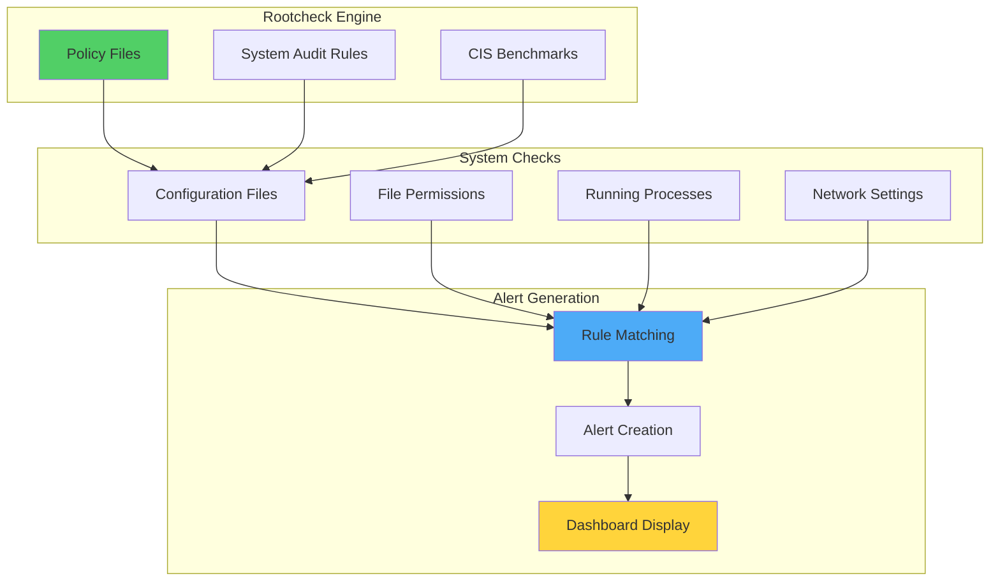

# Root User Access Monitoring with OSSEC/Wazuh

## Introduction

OSSEC can be used to monitor whether the SSH configuration file allows root user access. This is particularly useful for ensuring that systems are configured according to security best practices and compliance requirements. By using OSSEC's rootcheck component, we can verify that critical security configurations are properly set across multiple systems.

The rootcheck component performs policy monitoring, which is invaluable when managing large numbers of hosts that need to comply with security baselines such as CIS hardening guidelines or PCI DSS requirements. This capability enables:

- 🔍 **Configuration Verification**: Ensure SSH settings match security policies
- 🛡️ **Compliance Monitoring**: Verify adherence to standards like PCI DSS
- 📊 **Centralized Reporting**: Monitor multiple systems from a single point
- 🚨 **Real-time Alerting**: Get notified when configurations drift from baseline
- 📋 **Audit Trail**: Maintain records for compliance audits

## Understanding Rootcheck

### How Rootcheck Works



### Policy Monitoring Components

1. **System Audit Files**: Define what to check
2. **Rootcheck Rules**: Specify compliance requirements
3. **Alert Rules**: Determine severity and notifications
4. **Reporting**: Visualize compliance status

## Implementation Guide

### Prerequisites

- **Wazuh Manager**: Installed and running (our OSSEC fork)
- **Linux Agents**: Ubuntu/CentOS with Wazuh agents
- **Access**: Administrative privileges on all systems
- **Network**: Agents can communicate with manager

### Phase 1: Create Rootcheck Rule for SSH Configuration

Create a custom system audit file on the manager:

```bash
sudo vim /var/ossec/etc/shared/system_audit_test.txt
```

Add the following rootcheck rule:

```bash
# PermitRootLogin no allowed
# PermitRootLogin indicate if the user root can log in by ssh.
$sshd_file=/etc/ssh/sshd_config;

[SSH Configuration - 1: Root can log in] [any] [1]
f:$sshd_file -> !r:^# && r:PermitRootLogin\.+yes;
f:$sshd_file -> r:^#\s*PermitRootLogin;
```

This rule checks:
- If PermitRootLogin is set to "yes" (not desirable)
- If PermitRootLogin is commented out (uses default, which may allow root)

### Phase 2: Configure Agent Policy Monitoring

#### Option 1: Local Configuration (Manager Only)

Edit `/var/ossec/etc/ossec.conf`:

```xml
<ossec_config>
  <rootcheck>
    <system_audit>/var/ossec/etc/shared/system_audit_test.txt</system_audit>
  </rootcheck>
</ossec_config>
```

#### Option 2: Centralized Configuration (All Linux Agents)

Edit `/var/ossec/etc/shared/agent.conf`:

```xml
<agent_config os="Linux">
  <rootcheck>
    <system_audit>/var/ossec/etc/shared/system_audit_test.txt</system_audit>
  </rootcheck>
</agent_config>
```

Restart the manager:

```bash
sudo /var/ossec/bin/ossec-control restart
```

### Phase 3: Testing the Configuration

#### Enable Detailed Logging

To see rootcheck results in real-time, enable logall:

```xml
<ossec_config>
  <global>
    <logall>yes</logall>
  </global>
</ossec_config>
```

#### Modify SSH Configuration (Test Only)

On a test agent, temporarily allow root login:

```bash
sudo vim /etc/ssh/sshd_config
```

Change or add:
```
PermitRootLogin yes
```

Restart SSH service:

```bash
sudo service ssh restart
```

#### Trigger Rootcheck Scan

From the manager, force a rootcheck scan:

```bash
sudo /var/ossec/bin/agent_control -r -u <agent-id>
```

#### Monitor Results

Check archives.log:

```bash
tail -f /var/ossec/logs/archives/archives.log
```

Expected output:
```
2016 Apr 07 13:40:26 (ubuntu) 10.0.0.144->rootcheck Starting rootcheck scan.
2016 Apr 07 13:40:28 (ubuntu) 10.0.0.144->rootcheck System Audit: SSH Configuration - 1: Root can log in. File: /etc/ssh/sshd_config. Reference: 1 .
```

## Alert Configuration

### Default Alert Rule

The default rule for system audit events:

```xml
<rule id="516" level="3">
  <if_sid>510</if_sid>
  <match>^System Audit</match>
  <description>System Audit event.</description>
  <group>rootcheck</group>
</rule>
```

### Custom High-Priority Alert

To increase alert severity for email notifications, add to `/var/ossec/etc/rules/local_rules.xml`:

```xml
<rule id="100002" level="9">
  <if_sid>516</if_sid>
  <match>Root can log in</match>
  <description>Critical: SSH allows root login</description>
  <group>rootcheck,ssh_security,</group>
</rule>
```

## Use Cases

### Use Case 1: PCI DSS Compliance

#### PCI Requirement 2.2.4

"Configure system security parameters to prevent misuse."

Wazuh includes comprehensive SSH security checks in `system_audit_ssh.txt`:

```bash
# Some key checks from system_audit_ssh.txt
[SSH Configuration - Protocol version 1 enabled] [any] [1]
f:$sshd_file -> !r:^# && r:Protocol\.+1;

[SSH Configuration - Root login allowed] [any] [1]
f:$sshd_file -> !r:^# && r:PermitRootLogin\.+yes;

[SSH Configuration - Empty passwords permitted] [any] [1]
f:$sshd_file -> !r:^# && r:^PermitEmptyPasswords\.+yes;

[SSH Configuration - Host based authentication enabled] [any] [1]
f:$sshd_file -> !r:^# && r:HostbasedAuthentication\.+yes;
```

Enable these checks:

```xml
<agent_config os="Linux">
  <rootcheck>
    <system_audit>/var/ossec/etc/shared/system_audit_ssh.txt</system_audit>
  </rootcheck>
</agent_config>
```

### Use Case 2: CIS Benchmark Compliance

#### Custom CIS Checks

Create `/var/ossec/etc/shared/cis_sshd_hardening.txt`:

```bash
# CIS 5.2.1 Ensure permissions on /etc/ssh/sshd_config are configured
[CIS - SSH Configuration - 5.2.1: Incorrect permissions] [any] [1]
f:/etc/ssh/sshd_config -> !r:^-rw-------.*;

# CIS 5.2.2 Ensure SSH Protocol is set to 2
[CIS - SSH Configuration - 5.2.2: Protocol not set to 2] [any] [1]
f:$sshd_file -> !r:^# && !r:Protocol\.+2;

# CIS 5.2.3 Ensure SSH LogLevel is set to INFO
[CIS - SSH Configuration - 5.2.3: LogLevel not INFO] [any] [1]
f:$sshd_file -> !r:^# && !r:LogLevel\.+INFO;

# CIS 5.2.4 Ensure SSH X11 forwarding is disabled
[CIS - SSH Configuration - 5.2.4: X11 forwarding enabled] [any] [1]
f:$sshd_file -> !r:^# && r:X11Forwarding\.+yes;

# CIS 5.2.5 Ensure SSH MaxAuthTries is set to 4 or less
[CIS - SSH Configuration - 5.2.5: MaxAuthTries too high] [any] [1]
f:$sshd_file -> !r:^# && r:MaxAuthTries\.+[5-9];
```

### Use Case 3: Multi-Environment Monitoring

#### Development Environment

```xml
<agent_config os="Linux" profile="development">
  <rootcheck>
    <system_audit>/var/ossec/etc/shared/ssh_audit_dev.txt</system_audit>
    <frequency>86400</frequency> <!-- Daily -->
  </rootcheck>
</agent_config>
```

#### Production Environment

```xml
<agent_config os="Linux" profile="production">
  <rootcheck>
    <system_audit>/var/ossec/etc/shared/ssh_audit_prod.txt</system_audit>
    <frequency>3600</frequency> <!-- Hourly -->
  </rootcheck>
</agent_config>
```

## Advanced Configuration

### Comprehensive SSH Security Monitoring

```bash
# /var/ossec/etc/shared/ssh_security_audit.txt

# Authentication Settings
[SSH - Password authentication enabled] [any] [1]
f:$sshd_file -> !r:^# && r:PasswordAuthentication\.+yes;

[SSH - Challenge response authentication enabled] [any] [1]
f:$sshd_file -> !r:^# && r:ChallengeResponseAuthentication\.+yes;

[SSH - Public key authentication disabled] [any] [1]
f:$sshd_file -> !r:^# && r:PubkeyAuthentication\.+no;

# Access Controls
[SSH - AllowUsers not configured] [any] [1]
f:$sshd_file -> !r:^# && !r:AllowUsers;

[SSH - DenyUsers not configured] [any] [1]
f:$sshd_file -> !r:^# && !r:DenyUsers;

# Security Features
[SSH - StrictModes disabled] [any] [1]
f:$sshd_file -> !r:^# && r:StrictModes\.+no;

[SSH - IgnoreRhosts disabled] [any] [1]
f:$sshd_file -> !r:^# && r:IgnoreRhosts\.+no;

# Timeout Settings
[SSH - ClientAliveInterval not set] [any] [1]
f:$sshd_file -> !r:^# && !r:ClientAliveInterval;

[SSH - ClientAliveCountMax not set] [any] [1]
f:$sshd_file -> !r:^# && !r:ClientAliveCountMax;
```

### Custom Alert Rules with Context

```xml
<group name="ssh_policy,">
  <!-- Critical: Root access misconfiguration -->
  <rule id="100010" level="10">
    <if_sid>516</if_sid>
    <match>Root can log in</match>
    <description>SSH configuration allows root login - Critical security risk</description>
    <options>alert_by_email</options>
    <group>pci_dss_2.2.4,cis_5.2.8,</group>
  </rule>

  <!-- High: Weak authentication methods -->
  <rule id="100011" level="8">
    <if_sid>516</if_sid>
    <match>Empty passwords permitted|Password authentication enabled</match>
    <description>Weak SSH authentication method detected</description>
    <group>authentication_failed,pci_dss_2.2.4,</group>
  </rule>

  <!-- Medium: Missing security controls -->
  <rule id="100012" level="6">
    <if_sid>516</if_sid>
    <match>AllowUsers not configured|DenyUsers not configured</match>
    <description>SSH access controls not properly configured</description>
    <group>access_control,</group>
  </rule>

  <!-- Correlation: Multiple SSH misconfigurations -->
  <rule id="100013" level="12" frequency="3" timeframe="120">
    <if_matched_sid>100010,100011,100012</if_matched_sid>
    <description>Multiple SSH security misconfigurations detected</description>
    <options>alert_by_email</options>
  </rule>
</group>
```

## Dashboard Integration

### Kibana Visualization

Create custom visualizations for SSH compliance:

```json
{
  "visualization": {
    "title": "SSH Configuration Compliance",
    "visState": {
      "type": "pie",
      "params": {
        "addTooltip": true,
        "addLegend": true,
        "legendPosition": "right",
        "isDonut": true
      },
      "aggs": [
        {
          "id": "1",
          "enabled": true,
          "type": "count",
          "schema": "metric",
          "params": {}
        },
        {
          "id": "2",
          "enabled": true,
          "type": "terms",
          "schema": "segment",
          "params": {
            "field": "rule.pci_dss",
            "size": 10,
            "order": "desc",
            "orderBy": "1"
          }
        }
      ]
    }
  }
}
```

### Compliance Dashboard Components

1. **SSH Security Status**: Overall compliance percentage
2. **Failed Checks by Host**: Which systems have issues
3. **Trending Compliance**: Historical compliance data
4. **Critical Findings**: High-priority misconfigurations

## Automation and Remediation

### Automated Response Script

```bash
#!/bin/bash
# ssh_remediation.sh - Automatically fix SSH misconfigurations

SSHD_CONFIG="/etc/ssh/sshd_config"
BACKUP_DIR="/etc/ssh/backups"
TIMESTAMP=$(date +%Y%m%d_%H%M%S)

# Create backup
mkdir -p "$BACKUP_DIR"
cp "$SSHD_CONFIG" "$BACKUP_DIR/sshd_config.$TIMESTAMP"

# Function to update SSH setting
update_ssh_setting() {
    local setting=$1
    local value=$2
    
    if grep -q "^#*${setting}" "$SSHD_CONFIG"; then
        sed -i "s/^#*${setting}.*/${setting} ${value}/" "$SSHD_CONFIG"
    else
        echo "${setting} ${value}" >> "$SSHD_CONFIG"
    fi
}

# Apply security settings
update_ssh_setting "PermitRootLogin" "no"
update_ssh_setting "PasswordAuthentication" "no"
update_ssh_setting "PermitEmptyPasswords" "no"
update_ssh_setting "Protocol" "2"
update_ssh_setting "X11Forwarding" "no"
update_ssh_setting "MaxAuthTries" "3"
update_ssh_setting "ClientAliveInterval" "300"
update_ssh_setting "ClientAliveCountMax" "0"

# Validate configuration
if sshd -t; then
    echo "SSH configuration valid, restarting service..."
    systemctl restart sshd
    echo "SSH hardening completed successfully"
else
    echo "ERROR: Invalid SSH configuration, restoring backup..."
    cp "$BACKUP_DIR/sshd_config.$TIMESTAMP" "$SSHD_CONFIG"
    exit 1
fi
```

### Active Response Configuration

```xml
<ossec_config>
  <command>
    <name>ssh-hardening</name>
    <executable>ssh_remediation.sh</executable>
    <expect></expect>
    <timeout_allowed>yes</timeout_allowed>
  </command>

  <active-response>
    <command>ssh-hardening</command>
    <location>local</location>
    <rules_id>100010</rules_id>
    <timeout>300</timeout>
  </active-response>
</ossec_config>
```

## Troubleshooting

### Common Issues

#### Issue 1: Rootcheck Not Running

```bash
# Check if rootcheck is enabled
grep -A5 "<rootcheck>" /var/ossec/etc/ossec.conf

# Verify rootcheck database
ls -la /var/ossec/queue/rootcheck/

# Force rootcheck execution
/var/ossec/bin/rootcheck_control -u all
```

#### Issue 2: Alerts Not Generating

```bash
# Test rule matching
echo "System Audit: SSH Configuration - 1: Root can log in" | \
  /var/ossec/bin/ossec-logtest

# Check alert log
tail -f /var/ossec/logs/alerts/alerts.log | grep rootcheck
```

#### Issue 3: Agent Not Receiving Configuration

```bash
# Verify shared configuration
ls -la /var/ossec/etc/shared/

# Check agent configuration
/var/ossec/bin/agent_control -i <agent-id>

# Force configuration sync
/var/ossec/bin/agent_control -R <agent-id>
```

## Best Practices

### 1. Policy Development

```yaml
SSH Security Policy:
  Mandatory Settings:
    - PermitRootLogin: no
    - Protocol: 2
    - PasswordAuthentication: no
    - PermitEmptyPasswords: no
    
  Recommended Settings:
    - MaxAuthTries: 3
    - ClientAliveInterval: 300
    - X11Forwarding: no
    - AllowUsers: [specific users]
    
  Monitoring:
    - Daily compliance checks
    - Real-time alerts for changes
    - Monthly compliance reports
```

### 2. Deployment Strategy

```yaml
Rollout Phases:
  Phase 1 - Assessment:
    - Deploy monitoring only
    - Identify non-compliant systems
    - Document exceptions
    
  Phase 2 - Remediation:
    - Fix non-critical systems
    - Test automated responses
    - Update documentation
    
  Phase 3 - Enforcement:
    - Enable auto-remediation
    - Monitor compliance metrics
    - Regular audits
```

### 3. Exception Management

```bash
# Create exception list
cat > /var/ossec/etc/lists/ssh_exceptions << EOF
# Systems allowed to have root login
legacy-server1.example.com
backup-server.example.com
EOF

# Update rules to check exceptions
<rule id="100020" level="3">
  <if_sid>100010</if_sid>
  <list field="hostname" lookup="match_key">etc/lists/ssh_exceptions</list>
  <description>SSH root login allowed (exception granted)</description>
  <options>no_email_alert</options>
</rule>
```

## Integration Examples

### 1. Compliance Reporting

```python
#!/usr/bin/env python3
import requests
import json
from datetime import datetime

def generate_ssh_compliance_report():
    """Generate SSH compliance report from Wazuh API"""
    
    # API configuration
    api_url = "https://localhost:55000"
    api_user = "wazuh"
    api_pass = "wazuh"
    
    # Get rootcheck findings
    response = requests.get(
        f"{api_url}/rootcheck/000",
        auth=(api_user, api_pass),
        verify=False
    )
    
    findings = response.json()['data']['items']
    
    # Generate report
    report = {
        'timestamp': datetime.now().isoformat(),
        'total_checks': len(findings),
        'failed_checks': sum(1 for f in findings if 'SSH' in f['event']),
        'compliance_rate': 0,
        'critical_findings': []
    }
    
    # Calculate compliance rate
    if report['total_checks'] > 0:
        report['compliance_rate'] = (
            (report['total_checks'] - report['failed_checks']) / 
            report['total_checks'] * 100
        )
    
    # Identify critical findings
    for finding in findings:
        if 'Root can log in' in finding['event']:
            report['critical_findings'].append({
                'host': finding['agent_id'],
                'issue': finding['event'],
                'file': finding.get('file', 'Unknown')
            })
    
    return report

if __name__ == "__main__":
    report = generate_ssh_compliance_report()
    print(json.dumps(report, indent=2))
```

### 2. Slack Notifications

```python
#!/usr/bin/env python3
import json
import sys
import requests

def send_slack_alert(alert_file):
    """Send SSH compliance alerts to Slack"""
    
    webhook_url = "https://hooks.slack.com/services/YOUR/WEBHOOK/URL"
    
    with open(alert_file) as f:
        alert = json.load(f)
    
    if 'SSH' in alert.get('rule', {}).get('description', ''):
        message = {
            "attachments": [{
                "color": "danger",
                "title": "SSH Security Alert",
                "fields": [
                    {
                        "title": "Host",
                        "value": alert['agent']['name'],
                        "short": True
                    },
                    {
                        "title": "Issue",
                        "value": alert['rule']['description'],
                        "short": True
                    },
                    {
                        "title": "Details",
                        "value": alert.get('full_log', 'No details'),
                        "short": False
                    }
                ],
                "footer": "Wazuh Security",
                "ts": alert['timestamp']
            }]
        }
        
        requests.post(webhook_url, json=message)

if __name__ == "__main__":
    send_slack_alert(sys.argv[1])
```

## Conclusion

Monitoring SSH configuration with OSSEC/Wazuh rootcheck provides organizations with a powerful tool for ensuring security compliance across their infrastructure. By implementing policy monitoring, you can:

- ✅ **Enforce Security Standards**: Ensure SSH configurations meet security requirements
- 🛡️ **Maintain Compliance**: Meet PCI DSS, CIS, and other regulatory requirements
- 📊 **Centralize Monitoring**: Track compliance across all systems from one location
- 🚨 **Rapid Detection**: Identify configuration drift immediately
- 🔧 **Automate Remediation**: Fix misconfigurations automatically

The flexibility of rootcheck allows organizations to customize checks according to their specific security policies and compliance requirements.

## Key Takeaways

1. **Start with Basics**: Monitor critical settings like root login first
2. **Expand Gradually**: Add more checks as your program matures
3. **Automate Responses**: Implement remediation for common issues
4. **Document Exceptions**: Maintain clear records of approved deviations
5. **Regular Reviews**: Update policies based on threat landscape

## Resources

- [Wazuh Rootcheck Documentation](https://documentation.wazuh.com/current/user-manual/capabilities/policy-monitoring/rootcheck/index.html)
- [CIS Benchmarks](https://www.cisecurity.org/cis-benchmarks/)
- [PCI DSS Requirements](https://www.pcisecuritystandards.org/)
- [SSH Hardening Guide](https://www.ssh.com/ssh/sshd_config/)

---

*Secure your SSH configurations with OSSEC/Wazuh policy monitoring! 🔐🛡️*