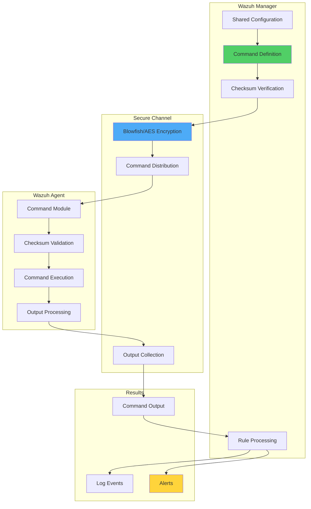

# Scheduling Remote Commands for Wazuh Agents

## Introduction

Since Wazuh v3.1.0, the Command module provides a powerful capability to run external commands and scripts on agents remotely. This feature enables system administrators to automate tasks, monitor custom metrics, and respond to security events programmatically across their entire infrastructure.

The Command module enables:

- 🔧 **Automated Maintenance**: Schedule system maintenance tasks remotely
- 📊 **Custom Monitoring**: Collect metrics not available through standard methods
- 🚨 **Dynamic Response**: Execute scripts based on specific conditions
- 🔄 **Continuous Processes**: Run long-running daemons and services
- 📈 **Output Analysis**: Process command outputs and trigger alerts

## Understanding the Command Module

### Architecture Overview



### Security Features

1. **Checksum Verification**: Validates binaries with MD5, SHA1, and SHA256 hashes
2. **Encrypted Communication**: All data transmitted using Blowfish/AES encryption
3. **Explicit Consent**: Agents must opt-in to accept remote commands
4. **Secure Channel**: Leverages existing Wazuh secure communication

## Implementation Guide

### Prerequisites

- **Wazuh Manager**: Version 3.1.0+ (3.6.0+ for checksum verification)
- **Wazuh Agents**: Compatible version with manager
- **Permissions**: Administrative access to configure agents
- **Network**: Established manager-agent communication

### Phase 1: Enable Remote Commands on Agents

Remote commands must be explicitly enabled on each agent. This security measure prevents unauthorized command execution.

On each agent, add to `/var/ossec/etc/local_internal_options.conf`:

```bash
echo "wazuh_command.remote_commands=1" >> /var/ossec/etc/local_internal_options.conf
```

Restart the agent:

```bash
# Linux
systemctl restart wazuh-agent

# Windows
net stop wazuh
net start wazuh
```

### Phase 2: Configure Command Module

#### Basic Command Configuration

Add to manager's `agent.conf` for the appropriate agent group:

```xml
<agent_config>
  <wodle name="command">
    <disabled>no</disabled>
    <tag>test-command</tag>
    <command>/bin/echo "Hello from Wazuh"</command>
    <interval>1h</interval>
    <ignore_output>no</ignore_output>
    <run_on_start>yes</run_on_start>
    <timeout>30</timeout>
  </wodle>
</agent_config>
```

#### Command with Checksum Verification

For enhanced security, verify binary checksums:

```xml
<wodle name="command">
  <disabled>no</disabled>
  <tag>secure-command</tag>
  <command>/bin/bash /var/ossec/scripts/custom_check.sh</command>
  <interval>1d</interval>
  <ignore_output>no</ignore_output>
  <run_on_start>yes</run_on_start>
  <timeout>0</timeout>
  <verify_md5>450d8f0ce1271aa72529ad58af2ed150</verify_md5>
  <verify_sha1>97cc6260454a7243b55c46f1e39758f2419e6d38</verify_sha1>
  <verify_sha256>724a10acf512747b3cc0657ec40d54708edf4bdd15b5115dd63c9a049efd1bc3</verify_sha256>
</wodle>
```

### Phase 3: Command Configuration Options

| Field | Description | Required |
|-------|-------------|----------|
| `tag` | Unique identifier for the command | Yes |
| `command` | Command or script to execute | Yes |
| `interval` | Execution frequency (s/m/h/d/w/M) | Yes |
| `ignore_output` | Whether to forward output to manager | No (default: yes) |
| `run_on_start` | Execute immediately on start | No (default: no) |
| `timeout` | Maximum execution time (0 = unlimited) | No (default: 0) |
| `verify_md5` | MD5 checksum of binary | No |
| `verify_sha1` | SHA1 checksum of binary | No |
| `verify_sha256` | SHA256 checksum of binary | No |

## Use Case: Monitoring Disk Usage

Let's implement a practical example that monitors disk usage across all agents and generates alerts when thresholds are exceeded.

### Step 1: Create Monitoring Script

Create `/var/ossec/etc/shared/disk-usage.sh`:

```bash
#!/bin/bash
# disk-usage.sh - Monitor disk usage and format output for Wazuh

df -h | while IFS= read -r line;
do
  echo "disk-usage: $line"
done
```

Make it executable:

```bash
chmod +x /var/ossec/etc/shared/disk-usage.sh
```

### Step 2: Get Binary Checksums

Calculate checksums for security verification:

```bash
# Get checksums for /bin/bash
md5sum /bin/bash
# Output: 450d8f0ce1271aa72529ad58af2ed150  /bin/bash

sha1sum /bin/bash
# Output: 97cc6260454a7243b55c46f1e39758f2419e6d38  /bin/bash

sha256sum /bin/bash
# Output: 724a10acf512747b3cc0657ec40d54708edf4bdd15b5115dd63c9a049efd1bc3  /bin/bash
```

### Step 3: Configure Command Module

Add to `/var/ossec/etc/shared/agent.conf`:

```xml
<agent_config os="Linux">
  <wodle name="command">
    <disabled>no</disabled>
    <tag>disk-usage</tag>
    <command>/bin/bash /var/ossec/etc/shared/disk-usage.sh</command>
    <interval>1h</interval>
    <run_on_start>yes</run_on_start>
    <timeout>10</timeout>
    <verify_md5>450d8f0ce1271aa72529ad58af2ed150</verify_md5>
    <verify_sha1>97cc6260454a7243b55c46f1e39758f2419e6d38</verify_sha1>
    <verify_sha256>724a10acf512747b3cc0657ec40d54708edf4bdd15b5115dd63c9a049efd1bc3</verify_sha256>
  </wodle>
</agent_config>
```

### Step 4: Create Custom Decoder

Add to `/var/ossec/etc/decoders/local_decoder.xml`:

```xml
<decoder name="disk-usage">
  <prematch>^disk-usage: </prematch>
  <regex offset="after_prematch">(\S+)\s*\t*(\S+)\s*\t*(\S+)\s*\t*(\S+)\s*\t*(\S+)%\s*\t*(\S+)</regex>
  <order>filesystem, size, used, available, usage, mnt</order>
</decoder>
```

### Step 5: Create Alert Rules

Add to `/var/ossec/etc/rules/local_rules.xml`:

```xml
<group name="local,monitor,stats">
  <!-- Base rule for disk usage -->
  <rule id="100001" level="0">
    <decoded_as>disk-usage</decoded_as>
    <description>Disk-usage monitoring rules.</description>
  </rule>
  
  <!-- Disk usage over 50% -->
  <rule id="100002" level="3">
    <if_sid>100001</if_sid>
    <field name="usage">^6\d|^5\d</field>
    <description>Filesystem $(filesystem) over 50% ($(usage)%).</description>
  </rule>
  
  <!-- Disk usage over 70% -->
  <rule id="100003" level="5">
    <if_sid>100001</if_sid>
    <field name="usage">^7\d</field>
    <description>Filesystem $(filesystem) over 70% ($(usage)%).</description>
  </rule>
  
  <!-- Disk usage over 80% -->
  <rule id="100004" level="7">
    <if_sid>100001</if_sid>
    <field name="usage">^9\d|^8\d</field>
    <description>Filesystem $(filesystem) over 80% ($(usage)%).</description>
  </rule>
  
  <!-- Disk full -->
  <rule id="100005" level="9">
    <if_sid>100001</if_sid>
    <field name="usage">100</field>
    <description>No space left at filesystem $(filesystem).</description>
    <options>alert_by_email</options>
  </rule>
</group>
```

### Step 6: Restart Services

```bash
# Restart manager to apply changes
systemctl restart wazuh-manager

# Agents will restart automatically when receiving new configuration
```

## Advanced Use Cases

### 1. Security Compliance Checks

```bash
#!/bin/bash
# security-compliance.sh - Check security configurations

echo "security-check: SSH_CONFIG"
grep -E "^PermitRootLogin|^PasswordAuthentication" /etc/ssh/sshd_config

echo "security-check: SUDO_USERS"
grep -v '^#' /etc/sudoers | grep -v '^$'

echo "security-check: OPEN_PORTS"
ss -tlnp | grep LISTEN

echo "security-check: FAILED_LOGINS"
lastb | head -5
```

Configuration:

```xml
<wodle name="command">
  <disabled>no</disabled>
  <tag>security-compliance</tag>
  <command>/bin/bash /var/ossec/etc/shared/security-compliance.sh</command>
  <interval>6h</interval>
  <run_on_start>yes</run_on_start>
  <timeout>30</timeout>
</wodle>
```

### 2. Application Health Monitoring

```python
#!/usr/bin/env python3
# app-health.py - Monitor application health

import requests
import json
import sys

def check_app_health():
    """Check application health endpoints"""
    
    endpoints = [
        {'name': 'web-app', 'url': 'http://localhost:8080/health'},
        {'name': 'api', 'url': 'http://localhost:3000/health'},
        {'name': 'database', 'url': 'http://localhost:5432/health'}
    ]
    
    for endpoint in endpoints:
        try:
            response = requests.get(endpoint['url'], timeout=5)
            status = 'UP' if response.status_code == 200 else 'DOWN'
            print(f"app-health: {endpoint['name']} {status} {response.status_code}")
        except:
            print(f"app-health: {endpoint['name']} DOWN 0")

if __name__ == "__main__":
    check_app_health()
```

### 3. Log Analysis and Alerting

```bash
#!/bin/bash
# log-analysis.sh - Analyze logs for specific patterns

# Check for error patterns in application logs
echo "log-analysis: ERROR_COUNT"
grep -c "ERROR\|FATAL" /var/log/app/application.log || echo "0"

# Check for specific security events
echo "log-analysis: AUTH_FAILURES"
grep -c "authentication failed" /var/log/app/security.log || echo "0"

# Check for performance issues
echo "log-analysis: SLOW_QUERIES"
grep -c "slow query" /var/log/app/database.log || echo "0"
```

### 4. System Resource Monitoring

```python
#!/usr/bin/env python3
# resource-monitor.py - Monitor system resources

import psutil
import json

def get_system_metrics():
    """Collect system resource metrics"""
    
    # CPU metrics
    cpu_percent = psutil.cpu_percent(interval=1)
    cpu_count = psutil.cpu_count()
    
    # Memory metrics
    memory = psutil.virtual_memory()
    
    # Disk metrics
    disk = psutil.disk_usage('/')
    
    # Network metrics
    network = psutil.net_io_counters()
    
    # Format output for Wazuh
    print(f"resource-monitor: CPU {cpu_percent}% {cpu_count}")
    print(f"resource-monitor: MEMORY {memory.percent}% {memory.used} {memory.total}")
    print(f"resource-monitor: DISK {disk.percent}% {disk.used} {disk.total}")
    print(f"resource-monitor: NETWORK {network.bytes_sent} {network.bytes_recv}")

if __name__ == "__main__":
    get_system_metrics()
```

## Windows Command Examples

### Windows System Information

```xml
<agent_config os="Windows">
  <wodle name="command">
    <disabled>no</disabled>
    <tag>windows-info</tag>
    <command>powershell.exe -ExecutionPolicy Bypass -File C:\Program Files (x86)\ossec-agent\shared\system-info.ps1</command>
    <interval>1d</interval>
    <run_on_start>yes</run_on_start>
    <timeout>60</timeout>
  </wodle>
</agent_config>
```

PowerShell script (`system-info.ps1`):

```powershell
# System information collection
Write-Output "windows-info: HOSTNAME $env:COMPUTERNAME"
Write-Output "windows-info: OS $(Get-WmiObject -Class Win32_OperatingSystem | Select-Object -ExpandProperty Caption)"
Write-Output "windows-info: UPTIME $((Get-Date) - (Get-CimInstance Win32_OperatingSystem).LastBootUpTime)"

# Security updates
$updates = Get-HotFix | Where-Object {$_.Description -eq "Security Update"}
Write-Output "windows-info: SECURITY_UPDATES $($updates.Count)"

# Antivirus status
$av = Get-MpComputerStatus
Write-Output "windows-info: AV_ENABLED $($av.RealTimeProtectionEnabled)"
Write-Output "windows-info: AV_UPDATED $($av.AntivirusSignatureLastUpdated)"
```

## Best Practices

### 1. Security Considerations

```yaml
Security Guidelines:
  Command Validation:
    - Always use checksum verification
    - Limit command paths to specific directories
    - Avoid running commands as root when possible
    
  Output Handling:
    - Sanitize sensitive information
    - Limit output size to prevent flooding
    - Use structured output formats
    
  Access Control:
    - Enable remote commands only on trusted agents
    - Use agent groups for targeted deployment
    - Regularly audit command configurations
```

### 2. Performance Optimization

```python
#!/usr/bin/env python3
# optimized-command.py - Efficient command execution

import subprocess
import time
import os

def run_with_timeout(command, timeout=30):
    """Run command with timeout and resource limits"""
    
    try:
        # Set resource limits
        env = os.environ.copy()
        env['TIMEOUT'] = str(timeout)
        
        # Run command with timeout
        result = subprocess.run(
            command,
            shell=True,
            capture_output=True,
            text=True,
            timeout=timeout,
            env=env
        )
        
        return result.stdout
    except subprocess.TimeoutExpired:
        return f"ERROR: Command timed out after {timeout} seconds"
    except Exception as e:
        return f"ERROR: {str(e)}"
```

### 3. Error Handling

```bash
#!/bin/bash
# robust-command.sh - Command with error handling

set -euo pipefail

# Trap errors
trap 'echo "command-error: Script failed at line $LINENO"' ERR

# Check prerequisites
command -v df >/dev/null 2>&1 || { echo "command-error: df command not found"; exit 1; }

# Execute with error handling
if output=$(df -h 2>&1); then
    echo "$output" | while IFS= read -r line; do
        echo "disk-check: $line"
    done
else
    echo "command-error: Failed to get disk usage"
    exit 1
fi
```

## Integration Examples

### 1. Dashboard Visualization

Create custom visualizations in Kibana for command outputs:

```json
{
  "visualization": {
    "title": "Command Module - Disk Usage",
    "visState": {
      "type": "line",
      "params": {
        "grid": {
          "categoryLines": false,
          "style": {
            "color": "#eee"
          }
        },
        "categoryAxes": [{
          "id": "CategoryAxis-1",
          "type": "category",
          "position": "bottom",
          "show": true,
          "style": {},
          "scale": {
            "type": "linear"
          },
          "labels": {
            "show": true,
            "truncate": 100
          },
          "title": {}
        }],
        "valueAxes": [{
          "id": "ValueAxis-1",
          "name": "LeftAxis-1",
          "type": "value",
          "position": "left",
          "show": true,
          "style": {},
          "scale": {
            "type": "linear",
            "mode": "normal"
          },
          "labels": {
            "show": true,
            "rotate": 0,
            "filter": false,
            "truncate": 100
          },
          "title": {
            "text": "Disk Usage %"
          }
        }],
        "seriesParams": [{
          "show": true,
          "type": "line",
          "mode": "normal",
          "data": {
            "label": "Disk Usage",
            "id": "1"
          },
          "valueAxis": "ValueAxis-1",
          "drawLinesBetweenPoints": true,
          "showCircles": true
        }]
      }
    }
  }
}
```

### 2. Alert Correlation

```xml
<!-- Correlate multiple command outputs -->
<rule id="100010" level="10" frequency="2" timeframe="300">
  <if_sid>100004</if_sid>
  <same_field>agent.id</same_field>
  <description>Multiple filesystems with high disk usage</description>
  <options>alert_by_email</options>
</rule>

<!-- Correlate with system events -->
<rule id="100011" level="12">
  <if_group>syscheck</if_group>
  <if_sid>100005</if_sid>
  <same_field>agent.id</same_field>
  <description>File changes detected on full filesystem</description>
</rule>
```

### 3. Active Response Integration

```python
#!/usr/bin/env python3
# command-active-response.py - React to command module alerts

import json
import sys
import subprocess

def handle_disk_full(alert):
    """Handle disk full alerts from command module"""
    
    filesystem = alert['data']['filesystem']
    usage = alert['data']['usage']
    agent = alert['agent']['name']
    
    # Clean up old logs
    if filesystem == '/var/log':
        cleanup_commands = [
            'find /var/log -name "*.log.*" -mtime +7 -delete',
            'journalctl --vacuum-time=3d'
        ]
        
        for cmd in cleanup_commands:
            subprocess.run(cmd, shell=True)
    
    # Notify administrators
    send_notification(f"Disk full on {agent}: {filesystem} at {usage}%")

def main():
    # Read alert from stdin
    alert = json.load(sys.stdin)
    
    if alert['rule']['groups'] == ['local', 'monitor', 'stats']:
        if alert['rule']['id'] == '100005':
            handle_disk_full(alert)

if __name__ == "__main__":
    main()
```

## Troubleshooting

### Common Issues and Solutions

#### Issue 1: Commands Not Executing

```bash
# Check if remote commands are enabled
grep "wazuh_command.remote_commands" /var/ossec/etc/local_internal_options.conf

# Verify command module in agent log
tail -f /var/ossec/logs/ossec.log | grep -i command

# Check shared configuration
ls -la /var/ossec/etc/shared/
```

#### Issue 2: Checksum Verification Failures

```bash
# Recalculate checksums
md5sum $(which bash)
sha1sum $(which bash)
sha256sum $(which bash)

# Verify binary hasn't changed
ls -la $(which bash)
file $(which bash)
```

#### Issue 3: Output Not Reaching Manager

```bash
# Check if output is being ignored
grep -A 10 "tag>disk-usage" /var/ossec/etc/shared/agent.conf

# Verify decoder is working
echo 'disk-usage: /dev/sda1 50G 25G 25G 50% /' | /var/ossec/bin/wazuh-logtest

# Check agent queue
ls -la /var/ossec/queue/diff/
```

## Advanced Configuration

### 1. Conditional Execution

```bash
#!/bin/bash
# conditional-command.sh - Execute based on conditions

# Only run during business hours
hour=$(date +%H)
if [ $hour -ge 8 ] && [ $hour -le 18 ]; then
    echo "business-hours: CHECK_RUNNING"
    # Your commands here
else
    echo "business-hours: SKIPPED"
fi

# Only run on specific days
day=$(date +%u)
if [ $day -le 5 ]; then  # Monday to Friday
    echo "weekday-check: RUNNING"
    # Your commands here
fi
```

### 2. Multi-Stage Commands

```xml
<!-- Run commands in sequence -->
<wodle name="command">
  <disabled>no</disabled>
  <tag>backup-check</tag>
  <command>/bin/bash -c '/var/ossec/scripts/pre-backup.sh && /var/ossec/scripts/backup.sh && /var/ossec/scripts/post-backup.sh'</command>
  <interval>1d</interval>
  <timeout>3600</timeout>
</wodle>
```

### 3. Dynamic Command Generation

```python
#!/usr/bin/env python3
# dynamic-command.py - Generate commands based on system state

import os
import json

def generate_commands():
    """Generate commands based on current system state"""
    
    commands = []
    
    # Check which services are running
    services = ['nginx', 'mysql', 'redis', 'elasticsearch']
    
    for service in services:
        if os.system(f'systemctl is-active {service} >/dev/null 2>&1') == 0:
            commands.append(f'systemctl status {service}')
    
    # Execute generated commands
    for cmd in commands:
        print(f"dynamic-check: Executing {cmd}")
        os.system(cmd)

if __name__ == "__main__":
    generate_commands()
```

## Security Monitoring Examples

### 1. Configuration Drift Detection

```bash
#!/bin/bash
# config-drift.sh - Detect configuration changes

# Generate current configuration hash
current_hash=$(find /etc -name "*.conf" -type f -exec md5sum {} \; | sort | md5sum)
echo "config-drift: CURRENT_HASH $current_hash"

# Compare with baseline
if [ -f /var/ossec/baseline/config.hash ]; then
    baseline_hash=$(cat /var/ossec/baseline/config.hash)
    if [ "$current_hash" != "$baseline_hash" ]; then
        echo "config-drift: CHANGE_DETECTED"
        # List changed files
        diff <(cat /var/ossec/baseline/config.list) \
             <(find /etc -name "*.conf" -type f -exec md5sum {} \; | sort)
    else
        echo "config-drift: NO_CHANGES"
    fi
else
    # Create baseline
    echo "$current_hash" > /var/ossec/baseline/config.hash
    find /etc -name "*.conf" -type f -exec md5sum {} \; | sort > /var/ossec/baseline/config.list
    echo "config-drift: BASELINE_CREATED"
fi
```

### 2. User Activity Monitoring

```python
#!/usr/bin/env python3
# user-activity.py - Monitor user activities

import subprocess
import pwd
import datetime

def monitor_user_activity():
    """Monitor and report user activities"""
    
    # Get logged in users
    result = subprocess.run(['who'], capture_output=True, text=True)
    users = result.stdout.strip().split('\n')
    
    print(f"user-activity: LOGGED_IN_USERS {len(users)}")
    
    for user_line in users:
        if user_line:
            parts = user_line.split()
            username = parts[0]
            terminal = parts[1]
            login_time = ' '.join(parts[2:4])
            print(f"user-activity: USER {username} {terminal} {login_time}")
    
    # Check sudo usage
    try:
        with open('/var/log/auth.log', 'r') as f:
            lines = f.readlines()[-100:]  # Last 100 lines
            sudo_count = sum(1 for line in lines if 'sudo:' in line)
            print(f"user-activity: RECENT_SUDO_COMMANDS {sudo_count}")
    except:
        pass

if __name__ == "__main__":
    monitor_user_activity()
```

## Conclusion

The Wazuh Command module provides a powerful and secure way to extend monitoring capabilities beyond traditional log analysis. By scheduling remote commands, organizations can:

- 🔧 **Automate Operations**: Schedule maintenance and monitoring tasks
- 📊 **Custom Metrics**: Collect any metric available through command line
- 🛡️ **Enhanced Security**: Monitor configurations and system state
- 🚨 **Proactive Monitoring**: Detect issues before they become critical
- 📈 **Flexible Integration**: Process outputs with custom rules and alerts

The combination of security features like checksum verification and encrypted communication ensures that this powerful capability doesn't introduce additional risks.

## Key Takeaways

1. **Security First**: Always enable checksum verification for binaries
2. **Explicit Consent**: Remote commands require opt-in on each agent
3. **Structured Output**: Use consistent formats for easier parsing
4. **Error Handling**: Include proper error handling in scripts
5. **Performance**: Consider execution frequency and timeout settings

## Resources

- [Wazuh Command Module Documentation](https://documentation.wazuh.com/current/user-manual/reference/ossec-conf/wodle-command.html)
- [Wazuh Rules Documentation](https://documentation.wazuh.com/current/user-manual/ruleset/index.html)
- [Wazuh Decoders Guide](https://documentation.wazuh.com/current/user-manual/ruleset/custom-rules-decoders.html)
- [Security Best Practices](https://documentation.wazuh.com/current/user-manual/reference/tools/index.html)

---

*Automate and monitor your infrastructure with Wazuh Command module! 🚀🔧*