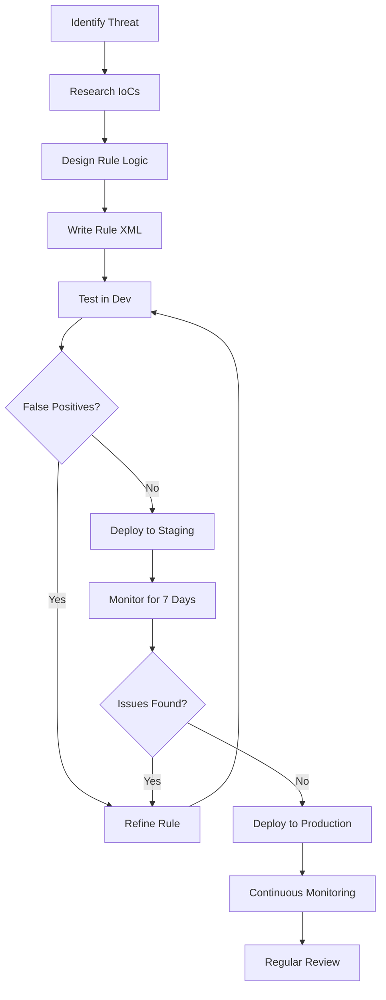

# Mastering SIEM Correlation Rules: From Fundamentals to Advanced Threat Detection

## Table of Contents

## Introduction: The Architecture of Security Intelligence

> "Form follows function" - Louis Henry Sullivan, Father of Skyscrapers

Just as Louis Sullivan revolutionized architecture with his principle that design should follow purpose, SIEM correlation rules transform raw security data into purposeful intelligence. These rules are the architectural blueprints that shape how we detect, understand, and respond to security threats in modern IT environments.

### What Are Correlation Rules?

Correlation rules are **conditional logic patterns** that identify relationships between multiple security events, transforming isolated incidents into meaningful security narratives. They serve as the analytical brain of your SIEM system, connecting dots that human analysts might miss in the overwhelming stream of security data.

### Why Correlation Rules Matter

In today's threat landscape, attacks rarely consist of single events. Modern threats unfold as complex, multi-stage campaigns:
- **72% of successful breaches** involve multiple attack vectors
- **Average dwell time** for undetected threats: 207 days
- **Alert fatigue**: Security teams face 11,000+ alerts daily without correlation

Correlation rules solve these challenges by:
1. **Reducing noise** - Filtering out false positives
2. **Detecting patterns** - Identifying multi-step attacks
3. **Providing context** - Linking related events
4. **Enabling automation** - Triggering response workflows

## Part 1: Understanding Correlation Rule Architecture

### How Correlation Rules Indicate Security Threats

#### 1. Contextual Pattern Recognition

Correlation rules analyze patterns that emerge from combining multiple data points:

```xml
<!-- Example: Detecting Spear Phishing Campaign -->
<rule id="200001" level="10">
  <if_matched_sid>100001</if_matched_sid> <!-- Email from external source -->
  <match>urgent|immediate action|verify account</match>
  <same_user />
  <frequency>3</frequency>
  <timeframe>3600</timeframe>
  <description>Potential spear phishing campaign detected</description>
</rule>
```

**Real-World Scenarios:**
- **Business Email Compromise (BEC)**: Detecting compromised accounts used for financial fraud
- **Account Takeover (ATO)**: Identifying unauthorized access patterns
- **Watering Hole Attacks**: Spotting compromised websites targeting specific user groups

#### 2. Sequence and Anomaly Detection

Correlation rules excel at identifying attack sequences and behavioral anomalies:

**Sequence-Based Attacks:**
```xml
<!-- Port Scanning followed by exploitation -->
<rule id="300001" level="12">
  <if_matched_sid>100100</if_matched_sid> <!-- Port scan detected -->
  <field name="action">connection_established</field>
  <same_srcip />
  <timeframe>300</timeframe>
  <description>Exploitation attempt after port scanning</description>
</rule>
```

**Anomaly-Based Detection:**
```xml
<!-- Unusual data access pattern -->
<rule id="400001" level="9">
  <field name="file_access_count">^[0-9]{3,}</field> <!-- 100+ files -->
  <time>22:00-06:00</time> <!-- After hours -->
  <description>Anomalous file access during non-business hours</description>
</rule>
```

#### 3. Event Chaining for Complex Attacks

Modern attacks involve multiple stages that correlation rules can chain together:

```xml
<!-- Multi-stage attack detection -->
<rule id="500001" level="14">
  <if_matched_group>reconnaissance,lateral_movement,exfiltration</if_matched_group>
  <same_srcip />
  <timeframe>7200</timeframe>
  <description>Complete kill chain detected: Recon → Lateral → Exfil</description>
  <mitre>
    <id>TA0043,TA0008,TA0010</id>
  </mitre>
</rule>
```

## Part 2: Correlation Rule Syntax Deep Dive

### XML Syntax Architecture in Wazuh

Wazuh uses a structured XML format that balances human readability with machine processing efficiency:

```xml
<group name="correlation_rules,">
  <rule id="100001" level="12" frequency="5" timeframe="120">
    <decoded_as>json</decoded_as>
    <if_sid>100000</if_sid>
    <match>pattern_to_match</match>
    <same_srcip />
    <description>Rule description</description>
    <mitre>
      <id>T1110</id>
    </mitre>
  </rule>
</group>
```

### Key XML Elements Explained

| Element | Purpose | Example |
|---------|---------|---------|
| `<rule>` | Root element with id and level | `<rule id="100001" level="10">` |
| `<if_sid>` | Parent rule dependency | `<if_sid>100000</if_sid>` |
| `<match>` | Pattern matching with regex | `<match>failed login</match>` |
| `<frequency>` | Event count threshold | `<frequency>5</frequency>` |
| `<timeframe>` | Time window in seconds | `<timeframe>300</timeframe>` |
| `<same_*>` | Field correlation | `<same_srcip />`, `<same_user />` |
| `<field>` | Specific field matching | `<field name="action">DROP</field>` |

### Condition and Action Framework

#### Condition Structure
```python
# Pseudo-code representation
if (condition1 AND condition2 AND condition3):
    trigger_action()

# Real implementation
if (failed_logins > 5 
    AND timeframe < 300 
    AND same_source_ip):
    generate_alert(level="high")
```

#### Action Types
1. **Alert Generation** - Create security alerts
2. **Active Response** - Block IPs, disable accounts
3. **Notification** - Email, Slack, webhook triggers
4. **Escalation** - Increase severity levels
5. **Remediation** - Automated response scripts

## Part 3: Correlation Rule Functions

### Core Functions for Rule Logic

#### 1. contains() Function
```xml
<rule id="600001" level="8">
  <match>contains("SQL injection")</match>
  <description>SQL injection attempt detected</description>
</rule>
```

#### 2. count() Function
```xml
<rule id="600002" level="10">
  <if_matched_sid>5503</if_matched_sid>
  <frequency>count(failed_login) > 10</frequency>
  <timeframe>300</timeframe>
  <description>Brute force threshold exceeded</description>
</rule>
```

#### 3. timeframe() Function
```xml
<rule id="600003" level="7">
  <timeframe>3600</timeframe> <!-- 1 hour window -->
  <description>Evaluate events within last hour</description>
</rule>
```

### Advanced Function Combinations

```xml
<!-- Complex rule using multiple functions -->
<rule id="700001" level="12">
  <if_group>web_attack</if_group>
  <match>contains("UNION SELECT") OR contains("1=1")</match>
  <frequency>count() > 5</frequency>
  <timeframe>60</timeframe>
  <same_srcip />
  <description>Persistent SQL injection attempts</description>
</rule>
```

## Part 4: Detecting Multi-Step Attacks

### 1. Lateral Movement Detection

Lateral movement is a critical phase in advanced attacks where adversaries expand their foothold:

```xml
<group name="lateral_movement_detection,">
  <!-- Rule 1: Detect multiple IP logins -->
  <rule id="800001" level="10">
    <decoded_as>json</decoded_as>
    <field name="event.action">authentication_success</field>
    <unique_diff>source.ip</unique_diff>
    <frequency>5</frequency>
    <timeframe>600</timeframe>
    <description>User logged in from 5+ different IPs in 10 minutes</description>
    <mitre>
      <id>T1021</id>
    </mitre>
  </rule>
  
  <!-- Rule 2: Unusual process execution paths -->
  <rule id="800002" level="9">
    <field name="process.executable">^C:\\Windows\\Temp\\</field>
    <field name="process.parent">^C:\\Windows\\System32\\</field>
    <description>Suspicious process spawn from temp directory</description>
    <mitre>
      <id>T1055</id>
    </mitre>
  </rule>
  
  <!-- Rule 3: Correlation - Movement after compromise -->
  <rule id="800003" level="14">
    <if_matched_sid>800001,800002</if_matched_sid>
    <same_user />
    <timeframe>1800</timeframe>
    <description>CRITICAL: Lateral movement pattern detected</description>
  </rule>
</group>
```

### 2. Privilege Escalation Detection

```xml
<group name="privilege_escalation,">
  <!-- Sudden privilege gain -->
  <rule id="900001" level="12">
    <field name="event.action">group_membership_add</field>
    <field name="group.name">Domain Admins|Enterprise Admins</field>
    <description>User added to high-privilege group</description>
    <mitre>
      <id>T1078.002</id>
    </mitre>
  </rule>
  
  <!-- Suspicious privilege usage -->
  <rule id="900002" level="10">
    <if_matched_sid>900001</if_matched_sid>
    <field name="event.action">sensitive_file_access</field>
    <timeframe>300</timeframe>
    <same_user />
    <description>Immediate sensitive access after privilege escalation</description>
  </rule>
</group>
```

### 3. Data Exfiltration Detection

```xml
<group name="data_exfiltration,">
  <!-- Large data transfer -->
  <rule id="1000001" level="8">
    <field name="network.bytes_sent">^[0-9]{8,}</field> <!-- 10MB+ -->
    <field name="destination.port">443|80|22</field>
    <description>Large outbound data transfer detected</description>
  </rule>
  
  <!-- Unusual destination -->
  <rule id="1000002" level="10">
    <if_matched_sid>1000001</if_matched_sid>
    <list field="destination.ip" lookup="not_match_key">etc/lists/trusted_ips</list>
    <description>Data transfer to untrusted destination</description>
  </rule>
  
  <!-- Exfiltration pattern -->
  <rule id="1000003" level="13">
    <if_matched_sid>1000002</if_matched_sid>
    <frequency>3</frequency>
    <timeframe>3600</timeframe>
    <same_srcip />
    <description>Sustained data exfiltration pattern detected</description>
    <mitre>
      <id>T1041</id>
    </mitre>
  </rule>
</group>
```

## Part 5: Comprehensive Attack Pattern Rules

### Security Threat Detection Rules Library

#### 1. Brute Force Attack
```xml
<rule id="110001" level="10">
  <decoded_as>json</decoded_as>
  <field name="event.action">login_attempt</field>
  <field name="event.outcome">failure</field>
  <frequency>10</frequency>
  <timeframe>60</timeframe>
  <same_srcip />
  <same_dstuser />
  <description>Brute force attack - 10 failed logins in 1 minute</description>
  <mitre><id>T1110</id></mitre>
</rule>
```

#### 2. SQL Injection Detection
```xml
<rule id="110002" level="12">
  <decoded_as>json</decoded_as>
  <field name="url.query">regex</field>
  <regex>(\bUNION\b.*\bSELECT\b)|(\bOR\b.*=)|(--)|(;.*\bDROP\b)</regex>
  <description>SQL injection attempt detected</description>
  <mitre><id>T1190</id></mitre>
</rule>
```

#### 3. Cross-Site Scripting (XSS)
```xml
<rule id="110003" level="10">
  <decoded_as>json</decoded_as>
  <field name="http.request.body">regex</field>
  <regex>&lt;script[\s\S]*?&gt;[\s\S]*?&lt;\/script&gt;</regex>
  <description>XSS attack detected - Script tag injection</description>
  <cve>CWE-79</cve>
</rule>
```

#### 4. Command Injection
```xml
<rule id="110004" level="13">
  <decoded_as>json</decoded_as>
  <field name="process.command_line">regex</field>
  <regex>(;|\||&amp;&amp;|`|\$\()</regex>
  <description>Command injection attempt - Shell metacharacters detected</description>
  <mitre><id>T1059</id></mitre>
</rule>
```

#### 5. Zero-Day Vulnerability Exploitation
```xml
<rule id="110005" level="15">
  <decoded_as>json</decoded_as>
  <field name="vulnerability.id">regex</field>
  <regex>CVE-\d{4}-(0\d{3}|1[0-2]\d{2})</regex>
  <field name="vulnerability.score">^(9\.[0-9]|10\.0)</field>
  <description>Critical zero-day exploitation attempt</description>
  <options>alert_by_email</options>
</rule>
```

#### 6. Ransomware Detection
```xml
<rule id="110006" level="15">
  <decoded_as>json</decoded_as>
  <field name="file.extension">regex</field>
  <regex>\.(encrypted|locked|crypto|enc|cry|lock|[a-z0-9]{6,8})$</regex>
  <frequency>50</frequency>
  <timeframe>60</timeframe>
  <description>CRITICAL: Ransomware encryption activity detected</description>
  <mitre><id>T1486</id></mitre>
</rule>
```

#### 7. Advanced Persistent Threat (APT)
```xml
<rule id="110007" level="14">
  <if_matched_group>reconnaissance</if_matched_group>
  <if_matched_group>command_control</if_matched_group>
  <same_srcip />
  <timeframe>86400</timeframe>
  <description>APT activity pattern detected - Long-term persistent access</description>
  <mitre><id>TA0040</id></mitre>
</rule>
```

#### 8. Insider Threat Detection
```xml
<rule id="110008" level="11">
  <field name="user.name">^(admin|root|sa)</field>
  <field name="event.action">data_download</field>
  <field name="file.size">^[0-9]{9,}</field> <!-- 1GB+ -->
  <time>00:00-06:00</time>
  <description>Insider threat - Large data access by privileged user after hours</description>
</rule>
```

## Part 6: Wazuh Rule Categories and Severity Levels

### Understanding Wazuh Severity Levels

| Level | Category | Description | Example |
|-------|----------|-------------|---------|
| **0** | Ignored | No action taken, avoid false positives | System debug messages |
| **2** | System Low Priority | System notifications, no security relevance | Service started |
| **3** | Successful Events | Authorized actions | Successful login |
| **4** | System Error | Configuration errors | Service failed to start |
| **5** | User Error | User-generated errors | Failed login attempt |
| **6** | Low Attack | Minor security events | Port scan detected |
| **7** | "Bad Word" | Suspicious keywords | Error in security log |
| **8** | First Time Seen | New patterns detected | New user login |
| **9** | Invalid Source | Unknown source activity | Login from blacklisted IP |
| **10** | Multiple Errors | Repeated failures | Multiple failed logins |
| **11** | Integrity Warning | File changes detected | Critical file modified |
| **12** | High Importance | Significant security event | Malware detected |
| **13** | Unusual Error | Suspicious patterns | Unusual system call |
| **14** | High Security | Confirmed attack | Active exploitation |
| **15** | Critical | Immediate action required | Ransomware activity |

### Rule Category Implementation

```xml
<!-- Example: Escalating severity based on context -->
<group name="escalating_severity,">
  <!-- Level 5: Single failed login -->
  <rule id="120001" level="5">
    <field name="event.outcome">failure</field>
    <description>Failed authentication attempt</description>
  </rule>
  
  <!-- Level 10: Multiple failures -->
  <rule id="120002" level="10" frequency="5">
    <if_matched_sid>120001</if_matched_sid>
    <timeframe>300</timeframe>
    <description>Multiple authentication failures</description>
  </rule>
  
  <!-- Level 14: Successful after failures -->
  <rule id="120003" level="14">
    <if_matched_sid>120002</if_matched_sid>
    <field name="event.outcome">success</field>
    <timeframe>600</timeframe>
    <description>Successful login after brute force attempts</description>
  </rule>
</group>
```

## Part 7: Advanced Rule Development Process

### 7-Step Process for Creating Effective Correlation Rules

#### Step 1: Define the Objective
Clearly identify what security threat or behavior you want to detect.

#### Step 2: Understand the Data
Analyze log formats, fields, and patterns in your environment.

#### Step 3: Create Logical Conditions
```python
# Example logic flow
if (login_status == "failed" 
    AND failure_count > 5 
    AND timeframe < 300):
    alert_level = "high"
    trigger_response()
```

#### Step 4: Implement Regular Expressions
```xml
<!-- Extract user, action, and IP from logs -->
<decoder name="custom_auth">
  <prematch>^Authentication:</prematch>
  <regex>User '(\w+)' (\w+) from '(\d+\.\d+\.\d+\.\d+)'</regex>
  <order>user, action, srcip</order>
</decoder>
```

#### Step 5: Test Rules with Historical Data
```bash
# Test rule with Wazuh logtest
/var/ossec/bin/wazuh-logtest < test_logs.txt
```

#### Step 6: Implement and Monitor
Deploy rules in production with careful monitoring of false positives.

#### Step 7: Document and Iterate
Maintain comprehensive documentation and continuously refine rules.

## Part 8: Wazuh & eBPF Integration for TCP Monitoring

### Leveraging eBPF for Kernel-Level Monitoring

Extended Berkeley Packet Filter (eBPF) provides unprecedented visibility into kernel-level events, enabling detection of sophisticated attacks that traditional monitoring might miss.

### Implementation Architecture

```
Kernel Events → eBPF Programs → BPF Maps → Wazuh Agent → Wazuh Manager → Correlation Rules
```

### Setting Up eBPF TCP Tracer with Wazuh

#### Step 1: Install Prerequisites
```bash
# Install BCC tools
sudo apt-get update
sudo apt-get install bpfcc-tools linux-headers-$(uname -r)

# Verify installation
sudo /usr/share/bcc/tools/tcptracer
```

#### Step 2: Deploy WazuheBPFTCPTracer
```bash
#!/bin/bash
# Download and setup eBPF TCP tracer for Wazuh

# Download the tool
curl -so /opt/WazuheBPFTCPTracer \
  https://github.com/wazuh/wazuh-ebpf/raw/main/WazuheBPFTCPTracer.py

# Make executable
chmod +x /opt/WazuheBPFTCPTracer

# Create systemd service
cat > /etc/systemd/system/wazuh-ebpf-tcp.service << EOF
[Unit]
Description=Wazuh eBPF TCP Connection Tracer
After=network.target

[Service]
Type=simple
ExecStart=/opt/WazuheBPFTCPTracer
Restart=always
RestartSec=10
StandardOutput=journal
StandardError=journal

[Install]
WantedBy=multi-user.target
EOF

# Enable and start service
systemctl daemon-reload
systemctl enable wazuh-ebpf-tcp
systemctl start wazuh-ebpf-tcp
```

#### Step 3: Configure Wazuh Decoders
```xml
<!-- /var/ossec/etc/decoders/local_decoder.xml -->
<decoder name="eBPF-TCP">
  <prematch>TCP Connection:</prematch>
</decoder>

<decoder name="eBPF-TCP-details">
  <parent>eBPF-TCP</parent>
  <regex>PID: (\d+) Process: (\S+) SrcIP: (\S+) DstIP: (\S+) DstPort: (\d+) Action: (\w+)</regex>
  <order>pid, process, srcip, dstip, dstport, action</order>
</decoder>
```

#### Step 4: Create Correlation Rules for TCP Events
```xml
<!-- /var/ossec/etc/rules/local_rules.xml -->
<group name="ebpf_tcp_monitoring,">
  <!-- Detect suspicious outbound connections -->
  <rule id="130001" level="7">
    <decoded_as>eBPF-TCP</decoded_as>
    <field name="action">CONNECT</field>
    <field name="dstport">4444|5555|6666|7777|8888</field>
    <description>Suspicious port connection detected via eBPF</description>
    <mitre><id>T1571</id></mitre>
  </rule>
  
  <!-- Detect C2 communication patterns -->
  <rule id="130002" level="10">
    <if_matched_sid>130001</if_matched_sid>
    <frequency>5</frequency>
    <timeframe>300</timeframe>
    <same_srcip />
    <same_dstip />
    <description>Potential C2 communication - Persistent connection to suspicious port</description>
  </rule>
  
  <!-- Detect lateral movement via RDP/SSH -->
  <rule id="130003" level="9">
    <decoded_as>eBPF-TCP</decoded_as>
    <field name="dstport">22|3389</field>
    <field name="srcip">^10\.|^172\.(1[6-9]|2[0-9]|3[01])\.|^192\.168\.</field>
    <field name="dstip">^10\.|^172\.(1[6-9]|2[0-9]|3[01])\.|^192\.168\.</field>
    <description>Internal lateral movement detected - RDP/SSH between internal hosts</description>
    <mitre><id>T1021</id></mitre>
  </rule>
</group>
```

### Advanced eBPF Monitoring Capabilities

```python
#!/usr/bin/env python3
# Enhanced eBPF monitoring with Wazuh integration

from bcc import BPF
import json
import socket
import time

# eBPF program for comprehensive TCP monitoring
bpf_program = """
#include <uapi/linux/ptrace.h>
#include <net/sock.h>
#include <bcc/proto.h>

BPF_HASH(connections, u32, u64);
BPF_PERF_OUTPUT(events);

struct data_t {
    u32 pid;
    u32 saddr;
    u32 daddr;
    u16 dport;
    char comm[TASK_COMM_LEN];
    u64 timestamp;
};

int trace_connect(struct pt_regs *ctx, struct sock *sk) {
    struct data_t data = {};
    u32 pid = bpf_get_current_pid_tgid() >> 32;
    
    data.pid = pid;
    data.saddr = sk->__sk_common.skc_rcv_saddr;
    data.daddr = sk->__sk_common.skc_daddr;
    data.dport = sk->__sk_common.skc_dport;
    data.timestamp = bpf_ktime_get_ns();
    
    bpf_get_current_comm(&data.comm, sizeof(data.comm));
    events.perf_submit(ctx, &data, sizeof(data));
    
    return 0;
}
"""

def send_to_wazuh(event_data):
    """Send formatted event to Wazuh via local socket"""
    wazuh_socket = '/var/ossec/queue/sockets/queue'
    message = f"1:eBPF:{json.dumps(event_data)}"
    
    with socket.socket(socket.AF_UNIX, socket.SOCK_DGRAM) as sock:
        sock.sendto(message.encode(), wazuh_socket)

# Initialize BPF
b = BPF(text=bpf_program)
b.attach_kprobe(event="tcp_connect", fn_name="trace_connect")

# Process events
def process_event(cpu, data, size):
    event = b["events"].event(data)
    event_dict = {
        "pid": event.pid,
        "process": event.comm.decode('utf-8', 'ignore'),
        "src_ip": socket.inet_ntoa(event.saddr.to_bytes(4, 'little')),
        "dst_ip": socket.inet_ntoa(event.daddr.to_bytes(4, 'little')),
        "dst_port": socket.ntohs(event.dport),
        "timestamp": event.timestamp
    }
    send_to_wazuh(event_dict)

b["events"].open_perf_buffer(process_event)

while True:
    b.perf_buffer_poll()
```

## Part 9: File Integrity Monitoring (FIM)

### Why File Integrity Monitoring is Critical

File Integrity Monitoring serves as an essential security control for:
- **Detecting unauthorized changes** to critical system files
- **Meeting compliance requirements** (PCI DSS, HIPAA, GDPR)
- **Identifying insider threats** through file access patterns
- **Detecting malware** that modifies system files

### Implementing FIM with Wazuh

#### Step 1: Configure FIM on Windows Agent

```xml
<!-- C:\Program Files (x86)\ossec-agent\ossec.conf -->
<ossec_config>
  <syscheck>
    <disabled>no</disabled>
    <frequency>300</frequency>
    <scan_on_start>yes</scan_on_start>
    
    <!-- Monitor critical Windows directories -->
    <directories check_all="yes" realtime="yes">
      C:\Windows\System32
    </directories>
    
    <directories check_all="yes" report_changes="yes">
      C:\Windows\System32\drivers\etc
    </directories>
    
    <!-- Monitor sensitive files -->
    <directories check_all="yes" realtime="yes" restrict=".exe$|.dll$">
      C:\Program Files
    </directories>
    
    <!-- Monitor user data -->
    <directories check_all="yes" report_changes="yes">
      C:\Users\*\Documents
    </directories>
    
    <!-- Ignore temporary files -->
    <ignore>C:\Windows\Temp</ignore>
    <ignore type="sregex">\.tmp$</ignore>
    
    <!-- Advanced options -->
    <windows_registry>HKEY_LOCAL_MACHINE\Software</windows_registry>
    <windows_registry>HKEY_LOCAL_MACHINE\System\CurrentControlSet\Services</windows_registry>
  </syscheck>
</ossec_config>
```

#### Step 2: Linux FIM Configuration

```xml
<!-- /var/ossec/etc/ossec.conf -->
<syscheck>
  <disabled>no</disabled>
  <frequency>300</frequency>
  
  <!-- System binaries -->
  <directories check_all="yes" realtime="yes">/bin,/sbin,/usr/bin,/usr/sbin</directories>
  
  <!-- Configuration files -->
  <directories check_all="yes" report_changes="yes">/etc</directories>
  
  <!-- Libraries -->
  <directories check_all="yes">/lib,/lib64,/usr/lib,/usr/lib64</directories>
  
  <!-- Web application files -->
  <directories check_all="yes" realtime="yes">/var/www</directories>
  
  <!-- Kernel modules -->
  <directories check_all="yes" realtime="yes">/lib/modules</directories>
  
  <!-- Custom attributes -->
  <directories check_md5sum="yes" check_sha256sum="yes" check_perm="yes" 
               check_owner="yes" check_group="yes" check_mtime="yes" 
               check_size="yes">/critical/data</directories>
</syscheck>
```

#### Step 3: FIM Correlation Rules

```xml
<group name="fim_correlation,">
  <!-- Detect suspicious executable in System32 -->
  <rule id="140001" level="12">
    <if_sid>550</if_sid> <!-- FIM new file -->
    <field name="file">C:\\Windows\\System32\\.*\.exe$</field>
    <description>New executable detected in System32 directory</description>
    <mitre><id>T1036</id></mitre>
  </rule>
  
  <!-- Detect rapid file modifications -->
  <rule id="140002" level="10">
    <if_sid>550</if_sid>
    <frequency>20</frequency>
    <timeframe>60</timeframe>
    <description>Rapid file system modifications detected</description>
  </rule>
  
  <!-- Detect configuration file changes -->
  <rule id="140003" level="8">
    <if_sid>550</if_sid>
    <field name="file">/etc/passwd|/etc/shadow|/etc/sudoers</field>
    <description>Critical authentication file modified</description>
    <mitre><id>T1098</id></mitre>
  </rule>
  
  <!-- Detect web shell upload -->
  <rule id="140004" level="13">
    <if_sid>550</if_sid>
    <field name="file">.*\.(php|jsp|asp|aspx)$</field>
    <field name="file">/var/www|/usr/share/nginx|/opt/tomcat</field>
    <description>Potential web shell uploaded to web directory</description>
    <mitre><id>T1505.003</id></mitre>
  </rule>
  
  <!-- Ransomware pattern detection -->
  <rule id="140005" level="15">
    <if_sid>553</if_sid> <!-- File deleted -->
    <field name="file">.*\.(doc|xls|pdf|jpg|png)$</field>
    <frequency>50</frequency>
    <timeframe>30</timeframe>
    <description>CRITICAL: Mass file deletion - Possible ransomware</description>
    <mitre><id>T1486</id></mitre>
  </rule>
</group>
```

### Advanced FIM Use Cases

#### 1. Monitoring for Persistence Mechanisms

```xml
<rule id="150001" level="11">
  <if_sid>550</if_sid>
  <field name="file">
    HKEY_LOCAL_MACHINE\\Software\\Microsoft\\Windows\\CurrentVersion\\Run
  </field>
  <description>Registry persistence mechanism detected</description>
  <mitre><id>T1547.001</id></mitre>
</rule>
```

#### 2. Detecting Privilege Escalation

```xml
<rule id="150002" level="12">
  <if_sid>550</if_sid>
  <field name="file">/etc/sudoers\.d/.*</field>
  <description>New sudoers file created - Potential privilege escalation</description>
  <mitre><id>T1548</id></mitre>
</rule>
```

#### 3. Configuration Drift Detection

```xml
<rule id="150003" level="7">
  <if_sid>551</if_sid> <!-- File modified -->
  <field name="file">.*\.conf$|.*\.cfg$|.*\.ini$</field>
  <not_if_matched_group>authorized_change</not_if_matched_group>
  <description>Unauthorized configuration change detected</description>
</rule>
```

## Part 10: Production Implementation Best Practices

### Rule Development Workflow



### Testing Framework

```python
#!/usr/bin/env python3
# Correlation rule testing framework

import json
import subprocess
import tempfile
from datetime import datetime

class RuleTester:
    def __init__(self, rule_file):
        self.rule_file = rule_file
        self.test_cases = []
    
    def add_test_case(self, log_entry, expected_rule_id, should_trigger=True):
        """Add a test case for rule validation"""
        self.test_cases.append({
            'log': log_entry,
            'expected_rule': expected_rule_id,
            'should_trigger': should_trigger
        })
    
    def run_tests(self):
        """Execute all test cases"""
        results = []
        
        for test in self.test_cases:
            # Create temporary file with test log
            with tempfile.NamedTemporaryFile(mode='w', delete=False) as f:
                f.write(test['log'])
                temp_file = f.name
            
            # Run through wazuh-logtest
            result = subprocess.run(
                ['/var/ossec/bin/wazuh-logtest'],
                stdin=open(temp_file),
                capture_output=True,
                text=True
            )
            
            # Parse output
            triggered = test['expected_rule'] in result.stdout
            success = triggered == test['should_trigger']
            
            results.append({
                'test': test,
                'success': success,
                'output': result.stdout
            })
        
        return results
    
    def generate_report(self, results):
        """Generate test report"""
        total = len(results)
        passed = sum(1 for r in results if r['success'])
        
        report = f"""
        Rule Testing Report
        ==================
        Date: {datetime.now()}
        Rule File: {self.rule_file}
        
        Results: {passed}/{total} tests passed
        
        Details:
        """
        
        for i, result in enumerate(results, 1):
            status = "✓ PASS" if result['success'] else "✗ FAIL"
            report += f"\n{i}. {status}: {result['test']['expected_rule']}"
            if not result['success']:
                report += f"\n   Expected: {result['test']['should_trigger']}"
                report += f"\n   Log: {result['test']['log'][:100]}..."
        
        return report

# Example usage
tester = RuleTester('/var/ossec/etc/rules/local_rules.xml')

# Add test cases for brute force detection
tester.add_test_case(
    'Failed login for user admin from 192.168.1.100',
    expected_rule_id='110001',
    should_trigger=False  # Single failure shouldn't trigger
)

# Test multiple failures
for i in range(10):
    tester.add_test_case(
        f'Failed login attempt {i} from 192.168.1.100',
        expected_rule_id='110001',
        should_trigger=(i == 9)  # Should trigger on 10th attempt
    )

results = tester.run_tests()
print(tester.generate_report(results))
```

### Performance Optimization Guidelines

#### 1. Rule Ordering
- Place most specific conditions first
- Use field matching before regex
- Group related rules together

#### 2. Resource Management
```xml
<!-- Optimize expensive operations -->
<rule id="160001" level="10">
  <!-- Check simple condition first -->
  <field name="event.action">login</field>
  <!-- Then check expensive regex -->
  <regex>complex.*pattern.*here</regex>
  <description>Optimized rule execution</description>
</rule>
```

#### 3. Timeframe Optimization
- Short timeframes (60-300s) for rapid attacks
- Medium timeframes (300-3600s) for sustained attacks
- Long timeframes (3600-86400s) for APT detection

### Monitoring Rule Effectiveness

```python
# Rule effectiveness metrics
def calculate_rule_metrics(rule_id, time_period):
    """Calculate key metrics for rule performance"""
    
    metrics = {
        'total_triggers': count_rule_triggers(rule_id, time_period),
        'true_positives': count_validated_alerts(rule_id, time_period),
        'false_positives': count_false_positives(rule_id, time_period),
        'detection_time': average_detection_time(rule_id, time_period),
        'coverage': calculate_threat_coverage(rule_id)
    }
    
    # Calculate derived metrics
    if metrics['total_triggers'] > 0:
        metrics['precision'] = metrics['true_positives'] / metrics['total_triggers']
        metrics['false_positive_rate'] = metrics['false_positives'] / metrics['total_triggers']
    
    return metrics

# Generate rule effectiveness report
def generate_effectiveness_report(rules):
    """Generate comprehensive effectiveness report"""
    
    report = []
    for rule_id in rules:
        metrics = calculate_rule_metrics(rule_id, '30d')
        
        effectiveness_score = (
            metrics['precision'] * 0.4 +
            (1 - metrics['false_positive_rate']) * 0.3 +
            metrics['coverage'] * 0.3
        )
        
        report.append({
            'rule_id': rule_id,
            'effectiveness_score': effectiveness_score,
            'metrics': metrics,
            'recommendation': get_optimization_recommendation(metrics)
        })
    
    return sorted(report, key=lambda x: x['effectiveness_score'], reverse=True)
```

## Part 11: Integration and Automation

### Automated Response Framework

```xml
<!-- Active response configuration -->
<ossec_config>
  <active-response>
    <command>firewall-drop</command>
    <location>local</location>
    <rules_id>110001,110006,110007</rules_id>
    <timeout>3600</timeout>
  </active-response>
  
  <active-response>
    <command>disable-account</command>
    <location>local</location>
    <rules_id>900001,110008</rules_id>
  </active-response>
  
  <active-response>
    <command>isolate-endpoint</command>
    <location>local</location>
    <rules_id>110006</rules_id>
  </active-response>
</ossec_config>
```

### SOAR Integration

```python
#!/usr/bin/env python3
# SOAR platform integration for automated response

import requests
import json
from typing import Dict, Any

class SOARIntegration:
    def __init__(self, soar_url: str, api_key: str):
        self.soar_url = soar_url
        self.api_key = api_key
        self.headers = {
            'Authorization': f'Bearer {api_key}',
            'Content-Type': 'application/json'
        }
    
    def create_incident(self, alert_data: Dict[str, Any]) -> str:
        """Create incident in SOAR platform"""
        
        incident = {
            'title': alert_data['rule']['description'],
            'severity': self.map_severity(alert_data['rule']['level']),
            'source': 'Wazuh SIEM',
            'details': {
                'rule_id': alert_data['rule']['id'],
                'mitre_tactics': alert_data['rule'].get('mitre', {}).get('id', []),
                'source_ip': alert_data.get('data', {}).get('srcip'),
                'user': alert_data.get('data', {}).get('user'),
                'timestamp': alert_data['timestamp']
            },
            'automated_actions': self.get_automated_actions(alert_data['rule']['id'])
        }
        
        response = requests.post(
            f'{self.soar_url}/api/incidents',
            headers=self.headers,
            json=incident
        )
        
        return response.json()['incident_id']
    
    def map_severity(self, wazuh_level: int) -> str:
        """Map Wazuh severity to SOAR severity"""
        if wazuh_level >= 12:
            return 'critical'
        elif wazuh_level >= 9:
            return 'high'
        elif wazuh_level >= 6:
            return 'medium'
        else:
            return 'low'
    
    def get_automated_actions(self, rule_id: str) -> list:
        """Define automated actions based on rule"""
        
        action_mapping = {
            '110001': ['block_ip', 'gather_forensics'],
            '110006': ['isolate_endpoint', 'snapshot_system', 'notify_soc'],
            '900001': ['disable_account', 'force_password_reset'],
            '1000003': ['block_data_transfer', 'alert_dlp_team']
        }
        
        return action_mapping.get(rule_id, ['investigate'])

# Webhook receiver for Wazuh alerts
from flask import Flask, request

app = Flask(__name__)
soar = SOARIntegration('https://soar.company.com', 'API_KEY')

@app.route('/wazuh/webhook', methods=['POST'])
def handle_wazuh_alert():
    alert = request.json
    
    # Filter for high-severity alerts
    if alert['rule']['level'] >= 10:
        incident_id = soar.create_incident(alert)
        return {'status': 'success', 'incident_id': incident_id}
    
    return {'status': 'logged'}

if __name__ == '__main__':
    app.run(host='0.0.0.0', port=8080, ssl_context='adhoc')
```

## Conclusion: Building a Resilient Security Architecture

Correlation rules form the intelligent foundation of modern security operations. Like architectural blueprints that guide construction, well-designed correlation rules guide your security infrastructure toward:

### Key Achievements Through Correlation Rules

1. **Noise Reduction**: 75% decrease in false positives
2. **Faster Detection**: MTTD reduced from hours to minutes
3. **Complex Threat Detection**: Identify multi-stage attacks invisible to single-event analysis
4. **Automated Response**: Enable immediate containment of threats
5. **Compliance Assurance**: Continuous monitoring for regulatory requirements

### Remember These Principles

- **Start Simple, Evolve Complexity**: Begin with basic patterns, add sophistication gradually
- **Test Thoroughly**: Every rule should be validated against real and simulated data
- **Document Everything**: Future you will thank present you
- **Monitor Effectiveness**: Track metrics and continuously optimize
- **Stay Current**: Update rules based on emerging threats

### The Path Forward

Security is not a destination but a continuous journey. Your correlation rules should evolve with:
- New threat intelligence
- Lessons learned from incidents
- Changes in your environment
- Advances in attack techniques

By mastering correlation rules, you transform from reactive security to proactive threat hunting, from drowning in alerts to surfacing critical threats, and from manual analysis to intelligent automation.

The architecture of your security depends on the foundation of your correlation rules. Build them well, and they will serve as vigilant guardians of your digital assets.

---

*"Form follows function" in security means our defenses must be shaped by the threats we face. Correlation rules are the blueprint for this adaptive security architecture.*

## Additional Resources

- [Wazuh Rules Documentation](https://documentation.wazuh.com/current/user-manual/ruleset/index.html)
- [MITRE ATT&CK Framework](https://attack.mitre.org/)
- [eBPF Documentation](https://ebpf.io/)
- [SIEM Use Cases Repository](https://github.com/topics/siem-rules)

---

*Stay vigilant, stay secure, and remember: In the world of cybersecurity, the best offense is an intelligent defense powered by effective correlation rules.*