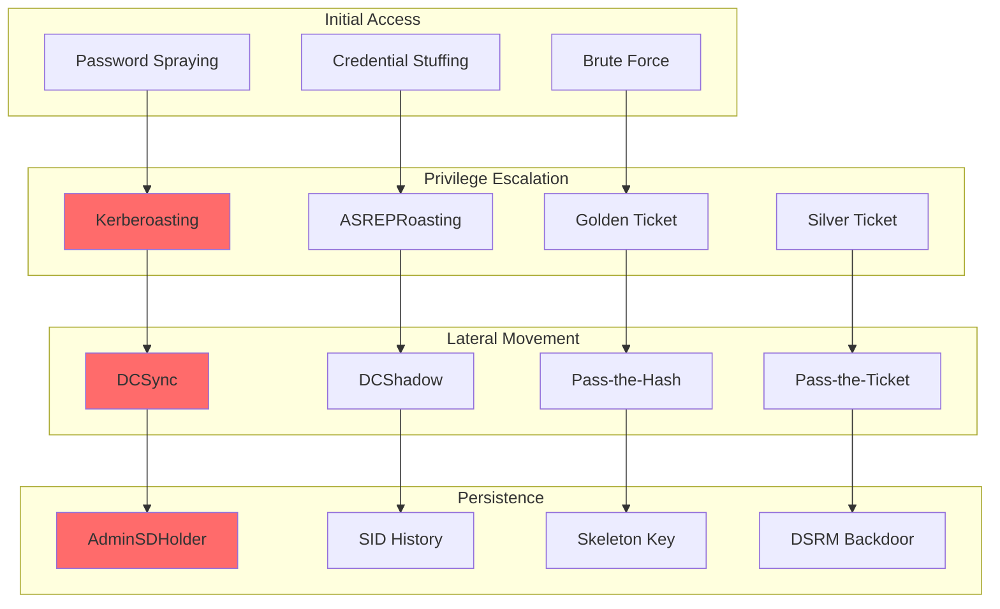

# Advanced Active Directory Security Monitoring with Wazuh: Detection and Forensics

## Introduction

Active Directory (AD) is the backbone of most enterprise Windows environments, making it a prime target for attackers. With over 95% of Fortune 500 companies using Active Directory, securing AD infrastructure is critical for organizational security.

Wazuh provides comprehensive Active Directory monitoring capabilities that enable:

- 🛡️ **Real-time Attack Detection**: Identify advanced AD attacks as they occur
- 🔍 **Forensic Analysis**: Detailed investigation of authentication events
- 📊 **Behavioral Analytics**: Detect anomalous user and system behavior  
- ⚡ **Automated Response**: Block suspicious activities instantly
- 📈 **Compliance Reporting**: Meet regulatory requirements for access monitoring

## Common Active Directory Attack Vectors

### Attack Landscape Overview



## Infrastructure Setup

### Domain Controller Configuration

#### Enable Advanced Auditing

Configure comprehensive audit policies on Domain Controllers:

```powershell
# Enable advanced audit policies
auditpol /set /subcategory:"Credential Validation" /success:enable /failure:enable
auditpol /set /subcategory:"Kerberos Authentication Service" /success:enable /failure:enable
auditpol /set /subcategory:"Kerberos Service Ticket Operations" /success:enable /failure:enable
auditpol /set /subcategory:"Account Lockout" /success:enable /failure:enable
auditpol /set /subcategory:"User Account Management" /success:enable /failure:enable
auditpol /set /subcategory:"Security Group Management" /success:enable /failure:enable
auditpol /set /subcategory:"Directory Service Changes" /success:enable /failure:enable
auditpol /set /subcategory:"Directory Service Replication" /success:enable /failure:enable
auditpol /set /subcategory:"Detailed Directory Service Replication" /success:enable /failure:enable

# Enable Object Access auditing for SYSVOL
auditpol /set /subcategory:"File System" /success:enable /failure:enable

# Enable logon auditing  
auditpol /set /subcategory:"Logon" /success:enable /failure:enable
auditpol /set /subcategory:"Logoff" /success:enable /failure:enable
auditpol /set /subcategory:"Special Logon" /success:enable /failure:enable
```

#### Configure Security Event Log

Increase security log size and retention:

```powershell
# Configure Security event log
wevtutil sl Security /ms:1073741824  # 1GB
wevtutil sl Security /rt:false       # Disable overwrite

# Configure System event log  
wevtutil sl System /ms:536870912     # 512MB
wevtutil sl System /rt:false

# Enable PowerShell logging
reg add "HKLM\SOFTWARE\Policies\Microsoft\Windows\PowerShell\ModuleLogging" /v EnableModuleLogging /t REG_DWORD /d 1 /f
reg add "HKLM\SOFTWARE\Policies\Microsoft\Windows\PowerShell\ScriptBlockLogging" /v EnableScriptBlockLogging /t REG_DWORD /d 1 /f
reg add "HKLM\SOFTWARE\Policies\Microsoft\Windows\PowerShell\Transcription" /v EnableTranscription /t REG_DWORD /d 1 /f
```

### Wazuh Agent Configuration

#### Domain Controller Agent Setup

Configure `ossec.conf` on Domain Controllers:

```xml
<ossec_config>
  <!-- Security Event Log -->
  <localfile>
    <location>Security</location>
    <log_format>eventchannel</log_format>
  </localfile>

  <!-- System Event Log -->
  <localfile>
    <location>System</location>
    <log_format>eventchannel</log_format>
  </localfile>

  <!-- PowerShell Event Logs -->
  <localfile>
    <location>Microsoft-Windows-PowerShell/Operational</location>
    <log_format>eventchannel</log_format>
  </localfile>

  <!-- DNS Server Logs -->
  <localfile>
    <location>DNS Server</location>
    <log_format>eventchannel</log_format>
  </localfile>

  <!-- AD Web Services -->
  <localfile>
    <location>Microsoft-Windows-ActiveDirectory_DomainService/Operational</location>
    <log_format>eventchannel</log_format>
  </localfile>

  <!-- File Integrity Monitoring for SYSVOL -->
  <syscheck>
    <directories check_all="yes" realtime="yes">C:\Windows\SYSVOL</directories>
    <directories check_all="yes" realtime="yes">C:\Windows\System32\config</directories>
  </syscheck>

  <!-- Registry monitoring -->
  <syscheck>
    <windows_registry>HKEY_LOCAL_MACHINE\SYSTEM\CurrentControlSet\Services\NTDS</windows_registry>
    <windows_registry>HKEY_LOCAL_MACHINE\SYSTEM\CurrentControlSet\Control\SecurityProviders</windows_registry>
    <windows_registry>HKEY_LOCAL_MACHINE\SOFTWARE\Microsoft\Windows NT\CurrentVersion\Winlogon</windows_registry>
  </syscheck>

  <!-- Active Response -->
  <active-response>
    <disabled>no</disabled>
    <ca_store>etc/wpk_root.pem</ca_store>
    <ca_verification>yes</ca_verification>
  </active-response>
</ossec_config>
```

#### Workstation Agent Configuration

For domain-joined workstations:

```xml
<ossec_config>
  <!-- Security Event Log -->
  <localfile>
    <location>Security</location>
    <log_format>eventchannel</log_format>
  </localfile>

  <!-- Sysmon Integration -->
  <localfile>
    <location>Microsoft-Windows-Sysmon/Operational</location>
    <log_format>eventchannel</log_format>
  </localfile>

  <!-- PowerShell Logs -->
  <localfile>
    <location>Microsoft-Windows-PowerShell/Operational</location>
    <log_format>eventchannel</log_format>
  </localfile>

  <!-- Process monitoring -->
  <syscheck>
    <directories check_all="yes" realtime="yes">C:\Windows\System32\drivers</directories>
    <directories check_all="yes" realtime="yes">C:\Users\%USERNAME%\AppData\Roaming\Microsoft\Windows\Start Menu\Programs\Startup</directories>
  </syscheck>
</ossec_config>
```

## Advanced Detection Rules

### Custom Rule Set for AD Attacks

Create `/var/ossec/etc/rules/local_ad_rules.xml`:

```xml
<group name="active_directory,authentication,">

  <!-- Kerberoasting Detection -->
  <rule id="100001" level="10">
    <if_sid>60106</if_sid>
    <field name="win.eventdata.serviceName">^[^$]*\$.*</field>
    <field name="win.eventdata.ticketEncryptionType">0x17</field>
    <description>Possible Kerberoasting attack detected - Service ticket requested with RC4 encryption</description>
    <mitre>
      <id>T1208</id>
    </mitre>
  </rule>

  <!-- Golden Ticket Detection -->
  <rule id="100002" level="12">
    <if_sid>60106</if_sid>
    <field name="win.eventdata.ticketEncryptionType">0x17|0x18</field>
    <field name="win.eventdata.serviceName">krbtgt</field>
    <description>Potential Golden Ticket attack - TGT requested for krbtgt account</description>
    <mitre>
      <id>T1558.001</id>
    </mitre>
  </rule>

  <!-- DCSync Detection -->
  <rule id="100003" level="12">
    <if_sid>60002</if_sid>
    <field name="win.eventdata.properties">.*1131f6aa-9c07-11d1-f79f-00c04fc2dcd2.*</field>
    <field name="win.eventdata.properties">.*1131f6ad-9c07-11d1-f79f-00c04fc2dcd2.*</field>
    <description>DCSync attack detected - DS-Replication-Get-Changes-All permission requested</description>
    <mitre>
      <id>T1003.006</id>
    </mitre>
  </rule>

  <!-- ASREPRoasting Detection -->
  <rule id="100004" level="10">
    <if_sid>60107</if_sid>
    <field name="win.eventdata.preAuthType">0</field>
    <description>ASREPRoasting attack detected - Authentication without pre-authentication</description>
    <mitre>
      <id>T1558.004</id>
    </mitre>
  </rule>

  <!-- Suspicious Service Account Activity -->
  <rule id="100005" level="8">
    <if_sid>60106</if_sid>
    <field name="win.eventdata.serviceName">.*HTTP/.*|.*LDAP/.*|.*CIFS/.*</field>
    <field name="win.eventdata.ticketEncryptionType">0x17</field>
    <description>Service account targeted for Kerberoasting</description>
    <mitre>
      <id>T1208</id>
    </mitre>
  </rule>

  <!-- Password Spraying Detection -->
  <rule id="100006" level="8" frequency="5" timeframe="300">
    <if_sid>60122</if_sid>
    <same_source_ip />
    <description>Password spraying attack detected - Multiple failed logon attempts from same IP</description>
    <mitre>
      <id>T1110.003</id>
    </mitre>
  </rule>

  <!-- AdminSDHolder Tampering -->
  <rule id="100007" level="10">
    <if_sid>60002</if_sid>
    <field name="win.eventdata.objectDN">.*AdminSDHolder.*</field>
    <description>AdminSDHolder object modified - Potential persistence mechanism</description>
    <mitre>
      <id>T1546</id>
    </mitre>
  </rule>

  <!-- Unusual Logon Hours -->
  <rule id="100008" level="6">
    <if_sid>60106</if_sid>
    <time>02:00-05:00</time>
    <description>Unusual logon time detected - User authenticated outside business hours</description>
  </rule>

  <!-- High-Privilege Group Modifications -->
  <rule id="100009" level="12">
    <if_sid>60132,60133</if_sid>
    <field name="win.eventdata.targetUserName">Domain Admins|Enterprise Admins|Schema Admins|Administrators</field>
    <description>Critical group membership modified</description>
    <mitre>
      <id>T1098</id>
    </mitre>
  </rule>

  <!-- DSRM Account Usage -->
  <rule id="100010" level="12">
    <if_sid>60106</if_sid>
    <field name="win.eventdata.targetUserName">Administrator</field>
    <field name="win.eventdata.logonType">2</field>
    <description>DSRM Administrator account used for interactive logon</description>
    <mitre>
      <id>T1078.002</id>
    </mitre>
  </rule>

</group>
```

### Advanced Correlation Rules

```xml
<group name="correlation,active_directory">

  <!-- Correlated Kerberoasting Campaign -->
  <rule id="100020" level="12" frequency="3" timeframe="3600">
    <if_matched_sid>100001</if_matched_sid>
    <same_source_ip />
    <description>Coordinated Kerberoasting campaign detected - Multiple service accounts targeted</description>
  </rule>

  <!-- Privilege Escalation Chain -->
  <rule id="100021" level="14">
    <if_matched_sid>100001</if_matched_sid>
    <if_matched_sid>100009</if_matched_sid>
    <same_user />
    <timeframe>7200</timeframe>
    <description>Privilege escalation chain detected - Kerberoasting followed by group modification</description>
  </rule>

  <!-- Lateral Movement Pattern -->
  <rule id="100022" level="12" frequency="5" timeframe="1800">
    <if_matched_sid>60106</if_matched_sid>
    <field name="win.eventdata.logonType">3</field>
    <same_user />
    <description>Rapid lateral movement detected - Same user authenticating to multiple systems</description>
  </rule>

</group>
```

## Attack Detection Scenarios

### Scenario 1: Kerberoasting Attack Detection

#### Attack Simulation

```powershell
# Simulate Kerberoasting using PowerShell
# This should trigger Wazuh rule 100001

Import-Module ActiveDirectory

# Request service tickets for all SPNs
$SPNs = Get-ADUser -Filter {ServicePrincipalName -ne "$null"} -Properties ServicePrincipalName

foreach ($user in $SPNs) {
    foreach ($spn in $user.ServicePrincipalName) {
        try {
            Add-Type -AssemblyName System.IdentityModel
            $ticket = New-Object System.IdentityModel.Tokens.KerberosRequestorSecurityToken -ArgumentList $spn
            Write-Output "Requested ticket for $spn"
        }
        catch {
            Write-Output "Failed to request ticket for $spn"
        }
    }
}
```

#### Detection Analysis Script

```python
#!/usr/bin/env python3
"""
Kerberoasting Detection Analysis
Analyzes Wazuh alerts for Kerberoasting patterns
"""

import json
import requests
from datetime import datetime, timedelta
import pandas as pd
import matplotlib.pyplot as plt

class KerberoastingAnalyzer:
    def __init__(self, wazuh_manager_url, auth_token):
        self.base_url = wazuh_manager_url
        self.headers = {
            'Authorization': f'Bearer {auth_token}',
            'Content-Type': 'application/json'
        }
    
    def get_kerberoasting_alerts(self, hours=24):
        """Retrieve Kerberoasting alerts from last N hours"""
        
        end_time = datetime.now()
        start_time = end_time - timedelta(hours=hours)
        
        query = {
            "query": {
                "bool": {
                    "must": [
                        {"match": {"rule.id": "100001"}},
                        {"range": {
                            "timestamp": {
                                "gte": start_time.isoformat(),
                                "lte": end_time.isoformat()
                            }
                        }}
                    ]
                }
            }
        }
        
        response = requests.post(
            f"{self.base_url}/alerts/_search",
            headers=self.headers,
            json=query
        )
        
        return response.json()
    
    def analyze_attack_pattern(self, alerts):
        """Analyze Kerberoasting attack patterns"""
        
        analysis = {
            'total_alerts': len(alerts),
            'unique_sources': set(),
            'targeted_services': {},
            'encryption_types': {},
            'timeline': []
        }
        
        for alert in alerts:
            data = alert['_source']
            
            # Extract source information
            source_ip = data.get('data', {}).get('srcip', 'unknown')
            analysis['unique_sources'].add(source_ip)
            
            # Extract service information
            service_name = data.get('data', {}).get('win', {}).get('eventdata', {}).get('serviceName', 'unknown')
            analysis['targeted_services'][service_name] = analysis['targeted_services'].get(service_name, 0) + 1
            
            # Extract encryption type
            enc_type = data.get('data', {}).get('win', {}).get('eventdata', {}).get('ticketEncryptionType', 'unknown')
            analysis['encryption_types'][enc_type] = analysis['encryption_types'].get(enc_type, 0) + 1
            
            # Timeline
            timestamp = data.get('timestamp', '')
            analysis['timeline'].append({
                'timestamp': timestamp,
                'service': service_name,
                'source': source_ip
            })
        
        return analysis
    
    def generate_report(self, analysis):
        """Generate comprehensive attack report"""
        
        report = f"""
=== KERBEROASTING ATTACK ANALYSIS REPORT ===
Generated: {datetime.now().strftime('%Y-%m-%d %H:%M:%S')}

SUMMARY:
- Total alerts: {analysis['total_alerts']}
- Unique source IPs: {len(analysis['unique_sources'])}
- Services targeted: {len(analysis['targeted_services'])}

TOP TARGETED SERVICES:
"""
        
        # Sort services by frequency
        sorted_services = sorted(analysis['targeted_services'].items(), 
                               key=lambda x: x[1], reverse=True)
        
        for service, count in sorted_services[:10]:
            report += f"  - {service}: {count} requests\n"
        
        report += f"""
ENCRYPTION TYPES:
"""
        
        for enc_type, count in analysis['encryption_types'].items():
            enc_name = {
                '0x17': 'RC4-HMAC (Weak)',
                '0x12': 'AES128-CTS-HMAC-SHA1-96',
                '0x11': 'AES256-CTS-HMAC-SHA1-96'
            }.get(enc_type, enc_type)
            
            report += f"  - {enc_name}: {count} tickets\n"
        
        report += f"""
SOURCE IPs:
"""
        for ip in analysis['unique_sources']:
            report += f"  - {ip}\n"
        
        report += f"""
RECOMMENDATIONS:
1. Investigate source IPs for compromise indicators
2. Review service account configurations
3. Consider disabling RC4 encryption if possible
4. Implement service account password rotation
5. Monitor for lateral movement from identified sources
"""
        
        return report
    
    def create_timeline_visualization(self, analysis):
        """Create attack timeline visualization"""
        
        if not analysis['timeline']:
            return None
        
        df = pd.DataFrame(analysis['timeline'])
        df['timestamp'] = pd.to_datetime(df['timestamp'])
        df = df.sort_values('timestamp')
        
        plt.figure(figsize=(15, 8))
        
        # Timeline plot
        plt.subplot(2, 1, 1)
        plt.scatter(df['timestamp'], df['service'], alpha=0.6)
        plt.title('Kerberoasting Attack Timeline')
        plt.xlabel('Time')
        plt.ylabel('Service Targeted')
        plt.xticks(rotation=45)
        
        # Service frequency
        plt.subplot(2, 1, 2)
        service_counts = df['service'].value_counts()
        plt.bar(service_counts.index[:10], service_counts.values[:10])
        plt.title('Most Targeted Services')
        plt.xlabel('Service')
        plt.ylabel('Request Count')
        plt.xticks(rotation=45)
        
        plt.tight_layout()
        plt.savefig('kerberoasting_analysis.png', dpi=300, bbox_inches='tight')
        return 'kerberoasting_analysis.png'

# Usage example
if __name__ == "__main__":
    analyzer = KerberoastingAnalyzer(
        wazuh_manager_url="https://wazuh-manager:55000",
        auth_token="your_wazuh_api_token"
    )
    
    # Get alerts
    alerts_response = analyzer.get_kerberoasting_alerts(hours=24)
    alerts = alerts_response.get('hits', {}).get('hits', [])
    
    # Analyze patterns
    analysis = analyzer.analyze_attack_pattern(alerts)
    
    # Generate report
    report = analyzer.generate_report(analysis)
    print(report)
    
    # Save report
    with open('kerberoasting_report.txt', 'w') as f:
        f.write(report)
    
    # Create visualization
    chart_file = analyzer.create_timeline_visualization(analysis)
    if chart_file:
        print(f"Timeline visualization saved as {chart_file}")
```

### Scenario 2: Golden Ticket Attack Detection

#### Detection Workflow

```python
#!/usr/bin/env python3
"""
Golden Ticket Detection and Analysis
Monitors for Golden Ticket attacks and persistence
"""

import re
import json
import hashlib
from datetime import datetime, timedelta

class GoldenTicketDetector:
    def __init__(self, wazuh_api):
        self.wazuh_api = wazuh_api
        self.known_krbtgt_hashes = set()
        self.baseline_tgt_requests = {}
    
    def detect_golden_ticket_indicators(self, event):
        """Detect Golden Ticket attack indicators"""
        
        indicators = {
            'suspicious_tgt_requests': False,
            'unusual_encryption': False,
            'krbtgt_targeting': False,
            'timing_anomalies': False,
            'impossible_travel': False
        }
        
        # Check for TGT requests to krbtgt
        if event.get('win', {}).get('eventdata', {}).get('serviceName') == 'krbtgt':
            indicators['krbtgt_targeting'] = True
            
            # Check encryption type (RC4 often used in Golden Tickets)
            enc_type = event.get('win', {}).get('eventdata', {}).get('ticketEncryptionType')
            if enc_type == '0x17':  # RC4
                indicators['unusual_encryption'] = True
        
        # Check for impossible travel (same user, different locations)
        user = event.get('win', {}).get('eventdata', {}).get('targetUserName')
        source_ip = event.get('srcip')
        timestamp = event.get('timestamp')
        
        if user and source_ip:
            last_location = self.get_user_last_location(user)
            if last_location and self.is_impossible_travel(last_location, source_ip, timestamp):
                indicators['impossible_travel'] = True
        
        # Check timing patterns
        if self.is_unusual_timing(event):
            indicators['timing_anomalies'] = True
        
        return indicators
    
    def analyze_krbtgt_account(self):
        """Analyze krbtgt account for compromise indicators"""
        
        analysis = {
            'password_last_changed': None,
            'unusual_activity': False,
            'multiple_krbtgt_accounts': False,
            'recommendations': []
        }
        
        # Query for krbtgt password changes
        query = {
            "query": {
                "bool": {
                    "must": [
                        {"match": {"rule.id": "60135"}},  # Password change
                        {"match": {"data.win.eventdata.targetUserName": "krbtgt"}}
                    ]
                }
            },
            "sort": [{"timestamp": {"order": "desc"}}],
            "size": 1
        }
        
        result = self.wazuh_api.search_alerts(query)
        
        if result['hits']['total']['value'] > 0:
            last_change = result['hits']['hits'][0]['_source']['timestamp']
            analysis['password_last_changed'] = last_change
            
            # Check if password was changed recently (potential response to compromise)
            change_time = datetime.fromisoformat(last_change.replace('Z', '+00:00'))
            if datetime.now() - change_time < timedelta(hours=48):
                analysis['unusual_activity'] = True
                analysis['recommendations'].append("Recent krbtgt password change detected - investigate if this was planned")
        else:
            analysis['recommendations'].append("krbtgt password has not been changed recently - consider regular rotation")
        
        return analysis
    
    def create_golden_ticket_response(self, indicators):
        """Create automated response for Golden Ticket detection"""
        
        response_actions = []
        
        if indicators['krbtgt_targeting'] and indicators['unusual_encryption']:
            response_actions.extend([
                "CRITICAL: Potential Golden Ticket attack detected",
                "Action: Immediately reset krbtgt password (twice, 10 hours apart)",
                "Action: Force re-authentication of all users",
                "Action: Audit all recent administrative actions",
                "Action: Check for persistence mechanisms"
            ])
        
        if indicators['impossible_travel']:
            response_actions.extend([
                "WARNING: Impossible travel detected",
                "Action: Disable affected user account",
                "Action: Investigate source IP addresses",
                "Action: Review authentication logs for timeline"
            ])
        
        return response_actions
    
    def generate_golden_ticket_playbook(self):
        """Generate response playbook for Golden Ticket attacks"""
        
        playbook = """
=== GOLDEN TICKET ATTACK RESPONSE PLAYBOOK ===

IMMEDIATE ACTIONS (0-30 minutes):
1. Isolate affected systems from network
2. Capture memory dumps from suspect systems
3. Document all IOCs and timeline
4. Notify incident response team

SHORT-TERM ACTIONS (30 minutes - 4 hours):
1. Reset krbtgt password (TWICE, 10 hours apart)
   - This invalidates all existing Kerberos tickets
   - First reset invalidates current tickets
   - Second reset (after 10 hours) invalidates tickets created between resets

2. Force user re-authentication
   - Group Policy: "Interactive logon: Require smart card"
   - Clear cached credentials on all systems

3. Audit administrative accounts
   - Review all privileged account activity
   - Check for unauthorized privilege escalation

MEDIUM-TERM ACTIONS (4-24 hours):
1. Forensic analysis
   - Analyze Domain Controller logs
   - Check for lateral movement indicators
   - Review authentication patterns

2. Hunt for persistence
   - Check AdminSDHolder modifications
   - Review scheduled tasks and services
   - Audit group policy changes

LONG-TERM ACTIONS (1-7 days):
1. Implement monitoring improvements
   - Enhanced Kerberos logging
   - Behavioral analytics for authentication
   - Privileged account monitoring

2. Security hardening
   - Disable RC4 encryption
   - Implement PAW (Privileged Access Workstations)
   - Enhanced domain controller security

DETECTION QUERIES:

Golden Ticket Creation:
- Event ID 4769 with Service Name: krbtgt
- Encryption Type: RC4 (0x17)
- Unusual ticket lifetimes

Golden Ticket Usage:
- Successful authentications with suspicious timing
- Cross-domain authentication anomalies
- Service access without corresponding TGT requests

PREVENTION MEASURES:
1. Regular krbtgt password rotation (every 180 days)
2. Disable RC4 encryption where possible
3. Implement Just-in-Time (JIT) admin access
4. Use Privileged Identity Management (PIM)
5. Monitor for unusual Kerberos activity
"""
        
        return playbook

# Integration with Wazuh rules
golden_ticket_rules = """
<!-- Golden Ticket Detection Rules -->
<group name="golden_ticket,kerberos">

  <!-- Suspicious TGT Request Pattern -->
  <rule id="100030" level="12">
    <if_sid>60106</if_sid>
    <field name="win.eventdata.serviceName">krbtgt</field>
    <field name="win.eventdata.ticketEncryptionType">0x17</field>
    <field name="win.eventdata.ticketOptions">0x40810010</field>
    <description>Potential Golden Ticket attack - Suspicious TGT request pattern</description>
    <mitre>
      <id>T1558.001</id>
    </mitre>
  </rule>

  <!-- Unusual TGT Lifetime -->
  <rule id="100031" level="10">
    <if_sid>60106</if_sid>
    <field name="win.eventdata.serviceName">krbtgt</field>
    <field name="win.eventdata.ticketLifetime">^(?!.*[0-6][0-9]{3}$).*</field>
    <description>Suspicious TGT with unusual lifetime detected</description>
  </rule>

  <!-- Cross-Domain Golden Ticket -->
  <rule id="100032" level="12">
    <if_sid>60106</if_sid>
    <field name="win.eventdata.serviceName">krbtgt</field>
    <field name="win.eventdata.clientAddress">^(?!192\.168\.|10\.|172\.1[6-9]\.|172\.2[0-9]\.|172\.3[0-1]\.).*</field>
    <description>Potential Golden Ticket from external domain</description>
  </rule>

</group>
"""
```

### Scenario 3: DCSync Attack Detection

#### Real-time Monitoring Script

```python
#!/usr/bin/env python3
"""
DCSync Attack Detection and Response
Monitors for DCSync attacks and unauthorized replication requests
"""

import json
import requests
import time
from datetime import datetime, timedelta

class DCSyncMonitor:
    def __init__(self, wazuh_manager, api_token):
        self.wazuh_manager = wazuh_manager
        self.api_token = api_token
        self.headers = {
            'Authorization': f'Bearer {api_token}',
            'Content-Type': 'application/json'
        }
        
        # DCSync-related object GUIDs
        self.dcsync_guids = {
            '1131f6aa-9c07-11d1-f79f-00c04fc2dcd2': 'DS-Replication-Get-Changes',
            '1131f6ad-9c07-11d1-f79f-00c04fc2dcd2': 'DS-Replication-Get-Changes-All',
            '89e95b76-444d-4c62-991a-0facbeda640c': 'DS-Replication-Get-Changes-In-Filtered-Set'
        }
    
    def monitor_dcsync_activities(self):
        """Monitor for DCSync attack indicators"""
        
        while True:
            try:
                # Query for recent replication events
                query = {
                    "query": {
                        "bool": {
                            "must": [
                                {"match": {"rule.id": "100003"}},
                                {"range": {
                                    "timestamp": {
                                        "gte": (datetime.now() - timedelta(minutes=5)).isoformat()
                                    }
                                }}
                            ]
                        }
                    },
                    "sort": [{"timestamp": {"order": "desc"}}]
                }
                
                response = requests.post(
                    f"{self.wazuh_manager}/alerts/_search",
                    headers=self.headers,
                    json=query
                )
                
                alerts = response.json().get('hits', {}).get('hits', [])
                
                for alert in alerts:
                    self.analyze_dcsync_alert(alert['_source'])
                
                time.sleep(30)  # Check every 30 seconds
                
            except Exception as e:
                print(f"Error monitoring DCSync activities: {e}")
                time.sleep(60)
    
    def analyze_dcsync_alert(self, alert):
        """Analyze DCSync alert for threat indicators"""
        
        analysis = {
            'severity': 'HIGH',
            'user': alert.get('data', {}).get('win', {}).get('eventdata', {}).get('subjectUserName', 'unknown'),
            'source_ip': alert.get('data', {}).get('srcip', 'unknown'),
            'timestamp': alert.get('timestamp', ''),
            'properties': alert.get('data', {}).get('win', {}).get('eventdata', {}).get('properties', ''),
            'object_dn': alert.get('data', {}).get('win', {}).get('eventdata', {}).get('objectDN', ''),
            'indicators': []
        }
        
        # Analyze replication properties
        for guid, permission in self.dcsync_guids.items():
            if guid in analysis['properties']:
                analysis['indicators'].append(f"Requested {permission} permission")
        
        # Check if user is authorized for replication
        authorized_users = ['DOMAIN$', 'Administrator', 'krbtgt']
        if not any(auth_user in analysis['user'] for auth_user in authorized_users):
            analysis['indicators'].append("Unauthorized user performing replication")
            analysis['severity'] = 'CRITICAL'
        
        # Check for suspicious timing
        alert_time = datetime.fromisoformat(analysis['timestamp'].replace('Z', '+00:00'))
        if alert_time.hour < 6 or alert_time.hour > 22:  # Outside business hours
            analysis['indicators'].append("Replication outside business hours")
        
        # Generate alert if suspicious
        if analysis['indicators']:
            self.generate_dcsync_alert(analysis)
    
    def generate_dcsync_alert(self, analysis):
        """Generate detailed DCSync attack alert"""
        
        alert_message = f"""
=== DCSYNC ATTACK DETECTED ===
Severity: {analysis['severity']}
Timestamp: {analysis['timestamp']}
User: {analysis['user']}
Source IP: {analysis['source_ip']}
Object DN: {analysis['object_dn']}

INDICATORS:
"""
        
        for indicator in analysis['indicators']:
            alert_message += f"- {indicator}\n"
        
        alert_message += """
IMMEDIATE ACTIONS REQUIRED:
1. Disable the compromised user account immediately
2. Reset passwords for all privileged accounts
3. Check for lateral movement from source IP
4. Audit recent administrative actions
5. Verify integrity of domain database

FORENSIC STEPS:
1. Capture network traffic from source IP
2. Review authentication logs for user
3. Check for credential dumping artifacts
4. Analyze other systems accessed by this user
"""
        
        # Send to security team (implement your notification method)
        self.send_security_alert(alert_message)
        
        # Log to file
        with open(f"dcsync_alert_{datetime.now().strftime('%Y%m%d_%H%M%S')}.txt", 'w') as f:
            f.write(alert_message)
    
    def send_security_alert(self, message):
        """Send alert to security team"""
        # Implement your notification system
        # Examples: Email, Slack, Teams, PagerDuty, etc.
        print(message)
        
        # Example: Send to Slack
        # webhook_url = "https://hooks.slack.com/services/YOUR/SLACK/WEBHOOK"
        # payload = {"text": f"🚨 DCSync Attack Detected!\n```{message}```"}
        # requests.post(webhook_url, json=payload)

# DCSync detection rule for Wazuh
dcsync_rule = """
<group name="dcsync,active_directory">

  <!-- DCSync Attack Detection -->
  <rule id="100003" level="12">
    <if_sid>60002</if_sid>
    <field name="win.eventdata.properties">.*1131f6aa-9c07-11d1-f79f-00c04fc2dcd2.*</field>
    <description>DCSync attack detected - DS-Replication-Get-Changes permission requested</description>
    <mitre>
      <id>T1003.006</id>
    </mitre>
  </rule>

  <!-- DCSync All Changes -->
  <rule id="100040" level="14">
    <if_sid>60002</if_sid>
    <field name="win.eventdata.properties">.*1131f6ad-9c07-11d1-f79f-00c04fc2dcd2.*</field>
    <description>Critical DCSync attack - DS-Replication-Get-Changes-All requested</description>
    <mitre>
      <id>T1003.006</id>
    </mitre>
  </rule>

  <!-- Filtered Set Replication -->
  <rule id="100041" level="12">
    <if_sid>60002</if_sid>
    <field name="win.eventdata.properties">.*89e95b76-444d-4c62-991a-0facbeda640c.*</field>
    <description>DCSync filtered replication detected</description>
    <mitre>
      <id>T1003.006</id>
    </mitre>
  </rule>

</group>
"""

if __name__ == "__main__":
    monitor = DCSyncMonitor(
        wazuh_manager="https://wazuh-manager:55000",
        api_token="your_api_token"
    )
    
    print("Starting DCSync monitoring...")
    monitor.monitor_dcsync_activities()
```

## Forensic Analysis Tools

### Authentication Timeline Builder

```python
#!/usr/bin/env python3
"""
Active Directory Authentication Timeline Builder
Creates detailed timeline of authentication events for forensic analysis
"""

import json
import pandas as pd
import matplotlib.pyplot as plt
import seaborn as sns
from datetime import datetime, timedelta
import networkx as nx

class ADForensicAnalyzer:
    def __init__(self, wazuh_api):
        self.wazuh_api = wazuh_api
        self.event_types = {
            '4624': 'Successful Logon',
            '4625': 'Failed Logon',
            '4634': 'Logoff',
            '4648': 'Explicit Credentials Used',
            '4768': 'Kerberos TGT Requested',
            '4769': 'Kerberos Service Ticket Requested',
            '4771': 'Kerberos Pre-auth Failed',
            '4776': 'NTLM Authentication',
            '4778': 'Session Reconnected',
            '4779': 'Session Disconnected'
        }
    
    def build_authentication_timeline(self, user, start_time, end_time):
        """Build comprehensive authentication timeline for user"""
        
        timeline_events = []
        
        # Query for authentication events
        for event_id in self.event_types.keys():
            query = {
                "query": {
                    "bool": {
                        "must": [
                            {"match": {"data.win.system.eventID": event_id}},
                            {"match": {"data.win.eventdata.targetUserName": user}},
                            {"range": {
                                "timestamp": {
                                    "gte": start_time.isoformat(),
                                    "lte": end_time.isoformat()
                                }
                            }}
                        ]
                    }
                },
                "sort": [{"timestamp": {"order": "asc"}}],
                "size": 10000
            }
            
            result = self.wazuh_api.search_alerts(query)
            
            for hit in result['hits']['hits']:
                event = hit['_source']
                timeline_events.append({
                    'timestamp': event['timestamp'],
                    'event_id': event_id,
                    'event_type': self.event_types[event_id],
                    'user': user,
                    'source_ip': event.get('data', {}).get('win', {}).get('eventdata', {}).get('ipAddress', ''),
                    'workstation': event.get('data', {}).get('win', {}).get('eventdata', {}).get('workstationName', ''),
                    'logon_type': event.get('data', {}).get('win', {}).get('eventdata', {}).get('logonType', ''),
                    'process_name': event.get('data', {}).get('win', {}).get('eventdata', {}).get('processName', ''),
                    'target_server': event.get('data', {}).get('win', {}).get('eventdata', {}).get('targetServerName', ''),
                    'service_name': event.get('data', {}).get('win', {}).get('eventdata', {}).get('serviceName', '')
                })
        
        return sorted(timeline_events, key=lambda x: x['timestamp'])
    
    def analyze_authentication_patterns(self, timeline):
        """Analyze authentication patterns for anomalies"""
        
        df = pd.DataFrame(timeline)
        df['timestamp'] = pd.to_datetime(df['timestamp'])
        
        analysis = {
            'total_events': len(df),
            'unique_sources': df['source_ip'].nunique(),
            'unique_workstations': df['workstation'].nunique(),
            'logon_types': df['logon_type'].value_counts().to_dict(),
            'hourly_distribution': df.groupby(df['timestamp'].dt.hour).size().to_dict(),
            'failed_attempts': len(df[df['event_id'] == '4625']),
            'successful_logons': len(df[df['event_id'] == '4624']),
            'suspicious_indicators': []
        }
        
        # Detect suspicious patterns
        
        # Multiple failed logons
        if analysis['failed_attempts'] > 10:
            analysis['suspicious_indicators'].append(f"High number of failed logons: {analysis['failed_attempts']}")
        
        # Logons from multiple IPs
        if analysis['unique_sources'] > 3:
            analysis['suspicious_indicators'].append(f"Logons from {analysis['unique_sources']} different IP addresses")
        
        # Unusual hours
        night_logons = sum(count for hour, count in analysis['hourly_distribution'].items() if hour < 6 or hour > 22)
        if night_logons > 0:
            analysis['suspicious_indicators'].append(f"Logons outside business hours: {night_logons}")
        
        # Rapid logon/logoff pattern
        rapid_events = df[df['timestamp'].diff().dt.total_seconds() < 5]
        if len(rapid_events) > 5:
            analysis['suspicious_indicators'].append("Rapid logon/logoff patterns detected")
        
        return analysis
    
    def create_visual_timeline(self, timeline, user):
        """Create visual timeline of authentication events"""
        
        df = pd.DataFrame(timeline)
        df['timestamp'] = pd.to_datetime(df['timestamp'])
        
        fig, axes = plt.subplots(3, 1, figsize=(15, 12))
        
        # Timeline plot
        for event_type in df['event_type'].unique():
            event_data = df[df['event_type'] == event_type]
            axes[0].scatter(event_data['timestamp'], 
                          [event_type] * len(event_data), 
                          alpha=0.7, s=50, label=event_type)
        
        axes[0].set_title(f'Authentication Timeline for {user}')
        axes[0].set_xlabel('Time')
        axes[0].set_ylabel('Event Type')
        axes[0].legend(bbox_to_anchor=(1.05, 1), loc='upper left')
        axes[0].tick_params(axis='x', rotation=45)
        
        # Hourly distribution
        hourly_dist = df.groupby(df['timestamp'].dt.hour).size()
        axes[1].bar(hourly_dist.index, hourly_dist.values)
        axes[1].set_title('Authentication Events by Hour')
        axes[1].set_xlabel('Hour of Day')
        axes[1].set_ylabel('Event Count')
        axes[1].set_xticks(range(24))
        
        # Source IP distribution
        ip_dist = df['source_ip'].value_counts().head(10)
        axes[2].barh(range(len(ip_dist)), ip_dist.values)
        axes[2].set_yticks(range(len(ip_dist)))
        axes[2].set_yticklabels(ip_dist.index)
        axes[2].set_title('Top Source IP Addresses')
        axes[2].set_xlabel('Event Count')
        
        plt.tight_layout()
        plt.savefig(f'auth_timeline_{user}_{datetime.now().strftime("%Y%m%d")}.png', 
                   dpi=300, bbox_inches='tight')
        
        return f'auth_timeline_{user}_{datetime.now().strftime("%Y%m%d")}.png'
    
    def generate_forensic_report(self, user, timeline, analysis):
        """Generate comprehensive forensic report"""
        
        report = f"""
=== ACTIVE DIRECTORY FORENSIC ANALYSIS REPORT ===
User: {user}
Generated: {datetime.now().strftime('%Y-%m-%d %H:%M:%S')}
Analysis Period: {timeline[0]['timestamp'] if timeline else 'N/A'} to {timeline[-1]['timestamp'] if timeline else 'N/A'}

EXECUTIVE SUMMARY:
- Total authentication events: {analysis['total_events']}
- Unique source IPs: {analysis['unique_sources']}
- Unique workstations: {analysis['unique_workstations']}
- Failed logon attempts: {analysis['failed_attempts']}
- Successful logons: {analysis['successful_logons']}

SUSPICIOUS INDICATORS:
"""
        
        if analysis['suspicious_indicators']:
            for indicator in analysis['suspicious_indicators']:
                report += f"⚠️  {indicator}\n"
        else:
            report += "✅ No suspicious patterns detected\n"
        
        report += f"""
LOGON TYPE DISTRIBUTION:
"""
        
        logon_type_names = {
            '2': 'Interactive (Console)',
            '3': 'Network',
            '4': 'Batch',
            '5': 'Service',
            '7': 'Unlock',
            '8': 'NetworkCleartext',
            '9': 'NewCredentials',
            '10': 'RemoteInteractive (RDP)',
            '11': 'CachedInteractive'
        }
        
        for logon_type, count in analysis['logon_types'].items():
            type_name = logon_type_names.get(str(logon_type), f"Type {logon_type}")
            report += f"  - {type_name}: {count} events\n"
        
        report += f"""
HOURLY ACTIVITY DISTRIBUTION:
"""
        for hour, count in sorted(analysis['hourly_distribution'].items()):
            report += f"  - {hour:02d}:00-{hour:02d}:59: {count} events\n"
        
        report += f"""
DETAILED EVENT TIMELINE:
"""
        
        for event in timeline[-20:]:  # Last 20 events
            report += f"""
Time: {event['timestamp']}
Event: {event['event_type']} (ID: {event['event_id']})
Source IP: {event['source_ip']}
Workstation: {event['workstation']}
Logon Type: {event['logon_type']}
{'='*50}"""
        
        report += f"""

RECOMMENDATIONS:
1. Review source IP addresses for known threats
2. Correlate with other security events during timeframe
3. Check for privilege escalation attempts
4. Verify legitimacy of off-hours access
5. Review network traffic from identified source IPs
6. Consider additional monitoring for this user

INVESTIGATION QUERIES:
- Network connections from source IPs
- Process execution on workstations
- File access patterns during authentication periods
- Registry modifications on target systems
- PowerShell command history
"""
        
        return report

# Usage example
if __name__ == "__main__":
    # Initialize forensic analyzer
    analyzer = ADForensicAnalyzer(wazuh_api_client)
    
    # Analyze specific user
    target_user = "suspicious_user"
    start_time = datetime.now() - timedelta(days=7)
    end_time = datetime.now()
    
    # Build timeline
    timeline = analyzer.build_authentication_timeline(target_user, start_time, end_time)
    
    # Analyze patterns
    analysis = analyzer.analyze_authentication_patterns(timeline)
    
    # Generate visualizations
    chart_file = analyzer.create_visual_timeline(timeline, target_user)
    
    # Generate report
    report = analyzer.generate_forensic_report(target_user, timeline, analysis)
    
    # Save report
    report_filename = f"forensic_report_{target_user}_{datetime.now().strftime('%Y%m%d')}.txt"
    with open(report_filename, 'w') as f:
        f.write(report)
    
    print(f"Forensic analysis complete:")
    print(f"- Report saved as: {report_filename}")
    print(f"- Timeline chart: {chart_file}")
    print(f"- Suspicious indicators: {len(analysis['suspicious_indicators'])}")
```

## Performance Optimization

### Efficient Log Collection

```xml
<!-- Optimized Windows event collection -->
<ossec_config>
  <!-- Collect only security-relevant events -->
  <localfile>
    <location>Security</location>
    <log_format>eventchannel</log_format>
    <query>Event/System[EventID=4624 or EventID=4625 or EventID=4648 or EventID=4768 or EventID=4769 or EventID=4771 or EventID=4776]</query>
  </localfile>

  <!-- Filter out noise -->
  <localfile>
    <location>System</location>
    <log_format>eventchannel</log_format>
    <query>Event/System[Level=1 or Level=2 or Level=3]</query>
  </localfile>

  <!-- Critical AD events only -->
  <localfile>
    <location>Microsoft-Windows-ActiveDirectory_DomainService/Operational</location>
    <log_format>eventchannel</log_format>
    <query>Event/System[EventID=1644 or EventID=2889 or EventID=5136 or EventID=5137 or EventID=5138 or EventID=5139 or EventID=5141]</query>
  </localfile>
</ossec_config>
```

### Rule Optimization

```xml
<group name="optimized_ad_rules">
  
  <!-- Use frequency-based detection to reduce false positives -->
  <rule id="100100" level="6" frequency="3" timeframe="300">
    <if_sid>60122</if_sid>
    <same_source_ip />
    <description>Multiple authentication failures from same source</description>
  </rule>
  
  <!-- Composite rules for complex attacks -->
  <rule id="100101" level="12">
    <if_sid>100001,100009</if_sid>
    <same_user />
    <timeframe>3600</timeframe>
    <description>Kerberoasting followed by privilege escalation</description>
  </rule>
  
</group>
```

## Compliance and Reporting

### Automated Compliance Reporting

```python
#!/usr/bin/env python3
"""
Active Directory Compliance Reporting
Generates compliance reports for various frameworks
"""

import json
import pandas as pd
from datetime import datetime, timedelta

class ADComplianceReporter:
    def __init__(self, wazuh_api):
        self.wazuh_api = wazuh_api
        
        # Compliance framework mappings
        self.frameworks = {
            'NIST_800_53': {
                'AC-2': 'Account Management',
                'AC-3': 'Access Enforcement', 
                'AC-6': 'Least Privilege',
                'AU-2': 'Event Logging',
                'AU-3': 'Content of Audit Records',
                'AU-12': 'Audit Generation'
            },
            'ISO_27001': {
                'A.9.2.1': 'User registration and de-registration',
                'A.9.2.2': 'User access provisioning',
                'A.9.2.3': 'Management of privileged access rights',
                'A.9.2.4': 'Management of secret authentication information of users',
                'A.9.2.5': 'Review of user access rights',
                'A.9.2.6': 'Removal or adjustment of access rights'
            },
            'SOX': {
                'User_Access': 'User access controls and monitoring',
                'Privileged_Access': 'Privileged user monitoring',
                'Change_Management': 'Changes to user access rights'
            }
        }
    
    def generate_nist_compliance_report(self, days=30):
        """Generate NIST 800-53 compliance report"""
        
        end_time = datetime.now()
        start_time = end_time - timedelta(days=days)
        
        report = {
            'period': f"{start_time.strftime('%Y-%m-%d')} to {end_time.strftime('%Y-%m-%d')}",
            'controls': {}
        }
        
        # AC-2: Account Management
        account_mgmt_query = {
            "query": {
                "bool": {
                    "should": [
                        {"match": {"data.win.system.eventID": "4720"}},  # Account created
                        {"match": {"data.win.system.eventID": "4722"}},  # Account enabled
                        {"match": {"data.win.system.eventID": "4723"}},  # Password change attempt
                        {"match": {"data.win.system.eventID": "4724"}},  # Password reset attempt
                        {"match": {"data.win.system.eventID": "4725"}},  # Account disabled
                        {"match": {"data.win.system.eventID": "4726"}}   # Account deleted
                    ],
                    "must": [
                        {"range": {
                            "timestamp": {
                                "gte": start_time.isoformat(),
                                "lte": end_time.isoformat()
                            }
                        }}
                    ]
                }
            }
        }
        
        account_events = self.wazuh_api.search_alerts(account_mgmt_query)
        report['controls']['AC-2'] = {
            'description': 'Account Management',
            'total_events': account_events['hits']['total']['value'],
            'compliance_status': 'COMPLIANT' if account_events['hits']['total']['value'] > 0 else 'NON_COMPLIANT',
            'details': 'Account management events are being logged and monitored'
        }
        
        # AU-2: Event Logging
        auth_events_query = {
            "query": {
                "bool": {
                    "should": [
                        {"match": {"data.win.system.eventID": "4624"}},  # Successful logon
                        {"match": {"data.win.system.eventID": "4625"}},  # Failed logon
                        {"match": {"data.win.system.eventID": "4634"}},  # Logoff
                        {"match": {"data.win.system.eventID": "4648"}}   # Explicit credentials
                    ],
                    "must": [
                        {"range": {
                            "timestamp": {
                                "gte": start_time.isoformat(),
                                "lte": end_time.isoformat()
                            }
                        }}
                    ]
                }
            }
        }
        
        auth_events = self.wazuh_api.search_alerts(auth_events_query)
        report['controls']['AU-2'] = {
            'description': 'Event Logging',
            'total_events': auth_events['hits']['total']['value'],
            'compliance_status': 'COMPLIANT' if auth_events['hits']['total']['value'] > 0 else 'NON_COMPLIANT',
            'details': 'Authentication events are being comprehensively logged'
        }
        
        return report
    
    def generate_privileged_access_report(self, days=30):
        """Generate privileged access monitoring report"""
        
        end_time = datetime.now()
        start_time = end_time - timedelta(days=days)
        
        # Query for privileged group modifications
        privgroup_query = {
            "query": {
                "bool": {
                    "must": [
                        {"match": {"data.win.system.eventID": "4728"}},  # Member added to group
                        {"bool": {
                            "should": [
                                {"match": {"data.win.eventdata.targetUserName": "Domain Admins"}},
                                {"match": {"data.win.eventdata.targetUserName": "Enterprise Admins"}},
                                {"match": {"data.win.eventdata.targetUserName": "Schema Admins"}},
                                {"match": {"data.win.eventdata.targetUserName": "Administrators"}}
                            ]
                        }},
                        {"range": {
                            "timestamp": {
                                "gte": start_time.isoformat(),
                                "lte": end_time.isoformat()
                            }
                        }}
                    ]
                }
            }
        }
        
        privgroup_events = self.wazuh_api.search_alerts(privgroup_query)
        
        report = {
            'period': f"{start_time.strftime('%Y-%m-%d')} to {end_time.strftime('%Y-%m-%d')}",
            'privileged_group_changes': privgroup_events['hits']['total']['value'],
            'details': []
        }
        
        # Analyze each event
        for hit in privgroup_events['hits']['hits']:
            event = hit['_source']
            report['details'].append({
                'timestamp': event['timestamp'],
                'group': event.get('data', {}).get('win', {}).get('eventdata', {}).get('targetUserName', ''),
                'member_added': event.get('data', {}).get('win', {}).get('eventdata', {}).get('memberName', ''),
                'performed_by': event.get('data', {}).get('win', {}).get('eventdata', {}).get('subjectUserName', '')
            })
        
        return report

# Generate compliance reports
if __name__ == "__main__":
    reporter = ADComplianceReporter(wazuh_api_client)
    
    # Generate NIST compliance report
    nist_report = reporter.generate_nist_compliance_report(days=30)
    
    with open('nist_compliance_report.json', 'w') as f:
        json.dump(nist_report, f, indent=2, default=str)
    
    # Generate privileged access report
    priv_report = reporter.generate_privileged_access_report(days=30)
    
    with open('privileged_access_report.json', 'w') as f:
        json.dump(priv_report, f, indent=2, default=str)
    
    print("Compliance reports generated:")
    print(f"- NIST 800-53 Report: {len(nist_report['controls'])} controls evaluated")
    print(f"- Privileged Access Report: {priv_report['privileged_group_changes']} changes detected")
```

## Best Practices and Recommendations

### Security Hardening Checklist

1. **Domain Controller Security**:
   - Enable advanced audit policies
   - Implement LAPS for local admin passwords
   - Use Read-Only Domain Controllers where appropriate
   - Regular vulnerability scanning and patching

2. **Monitoring Configuration**:
   - Centralized log collection from all DCs
   - Real-time alerting for critical events
   - Regular rule tuning to reduce false positives
   - Performance monitoring and capacity planning

3. **Incident Response**:
   - Documented playbooks for common attacks
   - Automated containment procedures
   - Regular tabletop exercises
   - Integration with SOAR platforms

4. **Compliance Management**:
   - Regular compliance assessments
   - Automated reporting for audits
   - Evidence collection and retention
   - Continuous monitoring improvements

## Conclusion

Comprehensive Active Directory monitoring with Wazuh provides:

- 🛡️ **Advanced Threat Detection**: Real-time identification of sophisticated AD attacks
- 🔍 **Forensic Capabilities**: Detailed investigation tools for security incidents  
- 📊 **Compliance Reporting**: Automated compliance monitoring and reporting
- ⚡ **Rapid Response**: Immediate containment and remediation capabilities
- 📈 **Continuous Improvement**: Ongoing optimization based on threat landscape

This monitoring approach transforms Active Directory from a security blind spot into a comprehensive security monitoring platform, enabling organizations to detect, investigate, and respond to threats at the heart of their IT infrastructure.

## Resources

- [Microsoft Active Directory Security Best Practices](https://docs.microsoft.com/en-us/windows-server/identity/ad-ds/plan/security-best-practices/)
- [Wazuh Windows Agent Documentation](https://documentation.wazuh.com/current/installation-guide/wazuh-agent/wazuh-agent-package-windows.html)
- [NIST Cybersecurity Framework](https://www.nist.gov/cybersecurity/framework)
- [MITRE ATT&CK Active Directory Techniques](https://attack.mitre.org/tactics/TA0006/)

---

*Secure your Active Directory with comprehensive Wazuh monitoring! 🛡️🔍*