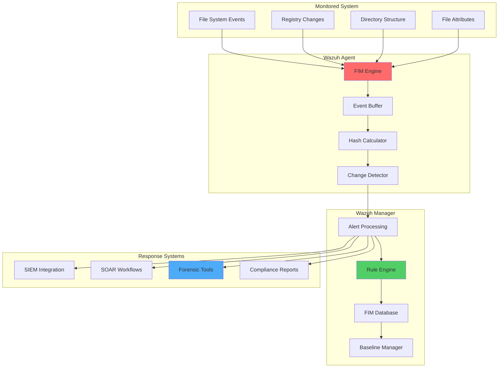

# Advanced File Integrity Monitoring with Wazuh: Configuration and Forensic Analysis

## Introduction

File Integrity Monitoring (FIM) is a critical security control that detects unauthorized changes to files and directories. It serves as both a compliance requirement and a powerful forensic tool for incident response.

Wazuh's FIM capabilities provide:

- 🔍 **Real-time Monitoring**: Instant detection of file system changes
- 🛡️ **Comprehensive Coverage**: Files, directories, registry keys, and attributes
- 📊 **Detailed Analytics**: Rich metadata about file modifications
- ⚡ **Automated Response**: Immediate reaction to suspicious changes
- 📈 **Compliance Reporting**: Automated compliance documentation
- 🔎 **Forensic Analysis**: Timeline reconstruction and evidence collection

## FIM Architecture and Components

### Core FIM Components



### FIM Event Types

| Event Type | Description | Use Case |
|------------|-------------|----------|
| **Added** | New file created | Malware deployment detection |
| **Modified** | File content changed | Configuration tampering |
| **Deleted** | File removed | Evidence destruction |
| **Attributes** | Permissions/ownership changed | Privilege escalation |
| **Registry** | Windows registry modified | System persistence |

## Enterprise FIM Configuration

### Linux Systems Configuration

#### Comprehensive Linux FIM Setup

```xml
<ossec_config>
  <syscheck>
    <!-- Critical System Directories -->
    <directories check_all="yes" realtime="yes" report_changes="yes">/etc</directories>
    <directories check_all="yes" realtime="yes" report_changes="yes">/usr/bin</directories>
    <directories check_all="yes" realtime="yes" report_changes="yes">/usr/sbin</directories>
    <directories check_all="yes" realtime="yes" report_changes="yes">/bin</directories>
    <directories check_all="yes" realtime="yes" report_changes="yes">/sbin</directories>
    <directories check_all="yes" realtime="yes" report_changes="yes">/boot</directories>
    
    <!-- Application Directories -->
    <directories check_all="yes" realtime="yes" report_changes="yes">/opt</directories>
    <directories check_all="yes" realtime="yes" report_changes="yes">/usr/local</directories>
    
    <!-- Web Server Directories -->
    <directories check_all="yes" realtime="yes" report_changes="yes">/var/www</directories>
    <directories check_all="yes" realtime="yes" report_changes="yes">/etc/nginx</directories>
    <directories check_all="yes" realtime="yes" report_changes="yes">/etc/apache2</directories>
    
    <!-- Database Directories -->
    <directories check_all="yes" realtime="yes" report_changes="yes">/var/lib/mysql</directories>
    <directories check_all="yes" realtime="yes" report_changes="yes">/var/lib/postgresql</directories>
    
    <!-- User Home Directories (selective) -->
    <directories check_all="yes" realtime="yes" report_changes="yes" recursion_level="2">/home</directories>
    <directories check_all="yes" realtime="yes" report_changes="yes">/root</directories>
    
    <!-- Log Directories -->
    <directories check_all="yes" realtime="yes" report_changes="yes">/var/log</directories>
    
    <!-- Temporary Directories (monitoring only) -->
    <directories check_all="yes" realtime="yes" report_changes="no">/tmp</directories>
    <directories check_all="yes" realtime="yes" report_changes="no">/var/tmp</directories>
    
    <!-- System Libraries -->
    <directories check_all="yes" realtime="yes" report_changes="yes">/lib</directories>
    <directories check_all="yes" realtime="yes" report_changes="yes">/lib64</directories>
    <directories check_all="yes" realtime="yes" report_changes="yes">/usr/lib</directories>
    
    <!-- Container Runtime -->
    <directories check_all="yes" realtime="yes" report_changes="yes">/var/lib/docker</directories>
    <directories check_all="yes" realtime="yes" report_changes="yes">/etc/docker</directories>
    
    <!-- Kubernetes -->
    <directories check_all="yes" realtime="yes" report_changes="yes">/etc/kubernetes</directories>
    <directories check_all="yes" realtime="yes" report_changes="yes">/var/lib/kubelet</directories>
    
    <!-- Exclusions for Performance -->
    <ignore>/etc/mtab</ignore>
    <ignore>/etc/hosts.deny</ignore>
    <ignore>/etc/mail/statistics</ignore>
    <ignore>/etc/random-seed</ignore>
    <ignore>/etc/random.seed</ignore>
    <ignore>/etc/adjtime</ignore>
    <ignore>/etc/httpd/logs</ignore>
    <ignore>/etc/utmpx</ignore>
    <ignore>/etc/wtmpx</ignore>
    <ignore>/etc/cups/certs</ignore>
    <ignore>/etc/dumpdates</ignore>
    <ignore>/etc/svc/volatile</ignore>
    
    <!-- Performance Optimizations -->
    <ignore type="sregex">^/proc</ignore>
    <ignore type="sregex">^/sys</ignore>
    <ignore type="sregex">^/dev</ignore>
    <ignore type="sregex">\.log$</ignore>
    <ignore type="sregex">\.swp$</ignore>
    <ignore type="sregex">\.tmp$</ignore>
    
    <!-- Scanning Configuration -->
    <scan_on_start>yes</scan_on_start>
    <scan_time>02:00</scan_time>
    <scan_day>sunday</scan_day>
    
    <!-- Performance Settings -->
    <max_eps>100</max_eps>
    <process_priority>10</process_priority>
    <allow_remote_prefilter_cmd>yes</allow_remote_prefilter_cmd>
    
    <!-- Database Settings -->
    <database>disk</database>
    <store_on_disk>yes</store_on_disk>
    
    <!-- Advanced Options -->
    <nodiff>/etc/ssl/private.key</nodiff>
    <nodiff>/root/.ssh/id_rsa</nodiff>
    <nodiff>/etc/passwd</nodiff>
    <nodiff>/etc/shadow</nodiff>
    
    <!-- Alert Suppression -->
    <skip_nfs>yes</skip_nfs>
    <skip_dev>yes</skip_dev>
    <skip_proc>yes</skip_proc>
    <skip_sys>yes</skip_sys>
    
    <!-- Real-time Response -->
    <alert_new_files>yes</alert_new_files>
    <auto_ignore frequency="3" timeframe="3600">no</auto_ignore>
  </syscheck>
</ossec_config>
```

#### Advanced Linux FIM Rules

Create `/var/ossec/etc/rules/local_fim_rules.xml`:

```xml
<group name="syscheck,fim,">

  <!-- Critical System File Modifications -->
  <rule id="200001" level="12">
    <if_sid>550</if_sid>
    <field name="file">/etc/passwd|/etc/shadow|/etc/sudoers</field>
    <description>Critical system authentication file modified</description>
    <mitre>
      <id>T1078</id>
    </mitre>
  </rule>

  <!-- SSH Configuration Changes -->
  <rule id="200002" level="10">
    <if_sid>550</if_sid>
    <field name="file">/etc/ssh/sshd_config</field>
    <description>SSH daemon configuration modified</description>
    <mitre>
      <id>T1021.004</id>
    </mitre>
  </rule>

  <!-- Cron Job Modifications -->
  <rule id="200003" level="8">
    <if_sid>550</if_sid>
    <field name="file">/etc/crontab|/var/spool/cron</field>
    <description>Scheduled task configuration modified</description>
    <mitre>
      <id>T1053.003</id>
    </mitre>
  </rule>

  <!-- Binary Modifications in System Paths -->
  <rule id="200004" level="12">
    <if_sid>550</if_sid>
    <field name="file">^/usr/bin|^/usr/sbin|^/bin|^/sbin</field>
    <field name="event_type">modified</field>
    <description>System binary modified - Possible rootkit installation</description>
    <mitre>
      <id>T1014</id>
    </mitre>
  </rule>

  <!-- Kernel Module Changes -->
  <rule id="200005" level="14">
    <if_sid>550</if_sid>
    <field name="file">/lib/modules</field>
    <description>Kernel module modified - Possible rootkit</description>
    <mitre>
      <id>T1547.006</id>
    </mitre>
  </rule>

  <!-- Web Shell Detection -->
  <rule id="200006" level="12">
    <if_sid>554</if_sid>
    <field name="file">/var/www</field>
    <field name="file">\.php$|\.jsp$|\.asp$</field>
    <description>Potential web shell uploaded</description>
    <mitre>
      <id>T1505.003</id>
    </mitre>
  </rule>

  <!-- Docker Configuration Changes -->
  <rule id="200007" level="8">
    <if_sid>550</if_sid>
    <field name="file">/etc/docker/daemon.json</field>
    <description>Docker daemon configuration modified</description>
  </rule>

  <!-- Kubernetes Security -->
  <rule id="200008" level="10">
    <if_sid>550</if_sid>
    <field name="file">/etc/kubernetes</field>
    <description>Kubernetes configuration file modified</description>
  </rule>

  <!-- Log Tampering Detection -->
  <rule id="200009" level="8">
    <if_sid>553</if_sid>
    <field name="file">/var/log</field>
    <description>Log file deleted - Possible evidence destruction</description>
    <mitre>
      <id>T1070.002</id>
    </mitre>
  </rule>

  <!-- Backup File Monitoring -->
  <rule id="200010" level="6">
    <if_sid>554</if_sid>
    <field name="file">\.bak$|\.backup$|\.old$</field>
    <description>Backup file created</description>
  </rule>

</group>

<group name="fim_correlation,">

  <!-- Multiple Critical Files Modified -->
  <rule id="200020" level="14" frequency="3" timeframe="300">
    <if_matched_sid>200001</if_matched_sid>
    <description>Multiple critical system files modified in short timeframe</description>
  </rule>

  <!-- Rapid File Changes -->
  <rule id="200021" level="10" frequency="10" timeframe="60">
    <if_sid>550</if_sid>
    <same_source_ip />
    <description>Rapid file modifications detected</description>
  </rule>

  <!-- Mass File Deletion -->
  <rule id="200022" level="12" frequency="5" timeframe="120">
    <if_sid>553</if_sid>
    <description>Mass file deletion detected - Possible ransomware</description>
    <mitre>
      <id>T1486</id>
    </mitre>
  </rule>

</group>
```

### Windows Systems Configuration

#### Comprehensive Windows FIM Setup

```xml
<ossec_config>
  <syscheck>
    <!-- Critical System Directories -->
    <directories check_all="yes" realtime="yes" report_changes="yes">C:\Windows\System32</directories>
    <directories check_all="yes" realtime="yes" report_changes="yes">C:\Windows\SysWOW64</directories>
    <directories check_all="yes" realtime="yes" report_changes="yes">C:\Windows\System32\drivers</directories>
    <directories check_all="yes" realtime="yes" report_changes="yes">C:\Windows\System32\config</directories>
    
    <!-- Boot Configuration -->
    <directories check_all="yes" realtime="yes" report_changes="yes">C:\Boot</directories>
    <directories check_all="yes" realtime="yes" report_changes="yes">C:\Windows\Boot</directories>
    
    <!-- Program Files -->
    <directories check_all="yes" realtime="yes" report_changes="yes" recursion_level="3">C:\Program Files</directories>
    <directories check_all="yes" realtime="yes" report_changes="yes" recursion_level="3">C:\Program Files (x86)</directories>
    
    <!-- User Profiles -->
    <directories check_all="yes" realtime="yes" report_changes="yes" recursion_level="2">C:\Users</directories>
    
    <!-- Startup Locations -->
    <directories check_all="yes" realtime="yes" report_changes="yes">C:\ProgramData\Microsoft\Windows\Start Menu\Programs\Startup</directories>
    <directories check_all="yes" realtime="yes" report_changes="yes">C:\Windows\System32\GroupPolicy</directories>
    
    <!-- IIS Configuration (if applicable) -->
    <directories check_all="yes" realtime="yes" report_changes="yes">C:\inetpub</directories>
    <directories check_all="yes" realtime="yes" report_changes="yes">C:\Windows\System32\inetsrv\config</directories>
    
    <!-- Registry Monitoring -->
    <windows_registry>HKEY_LOCAL_MACHINE\SOFTWARE\Microsoft\Windows\CurrentVersion\Run</windows_registry>
    <windows_registry>HKEY_LOCAL_MACHINE\SOFTWARE\Microsoft\Windows\CurrentVersion\RunOnce</windows_registry>
    <windows_registry>HKEY_LOCAL_MACHINE\SOFTWARE\Microsoft\Windows NT\CurrentVersion\Winlogon</windows_registry>
    <windows_registry>HKEY_LOCAL_MACHINE\SYSTEM\CurrentControlSet\Services</windows_registry>
    <windows_registry>HKEY_LOCAL_MACHINE\SOFTWARE\Microsoft\Windows\CurrentVersion\Policies</windows_registry>
    <windows_registry>HKEY_LOCAL_MACHINE\SYSTEM\CurrentControlSet\Control\SecurityProviders</windows_registry>
    <windows_registry>HKEY_LOCAL_MACHINE\SOFTWARE\Microsoft\Windows Defender</windows_registry>
    
    <!-- User Registry -->
    <windows_registry>HKEY_CURRENT_USER\SOFTWARE\Microsoft\Windows\CurrentVersion\Run</windows_registry>
    <windows_registry>HKEY_CURRENT_USER\SOFTWARE\Microsoft\Windows\CurrentVersion\RunOnce</windows_registry>
    
    <!-- Certificate Stores -->
    <windows_registry>HKEY_LOCAL_MACHINE\SOFTWARE\Microsoft\SystemCertificates</windows_registry>
    
    <!-- Exclusions -->
    <ignore>C:\Windows\System32\config\systemprofile\AppData</ignore>
    <ignore>C:\Windows\System32\wbem\Logs</ignore>
    <ignore>C:\Windows\Logs</ignore>
    <ignore>C:\Windows\Temp</ignore>
    <ignore>C:\Users\*\AppData\Local\Temp</ignore>
    <ignore type="sregex">\.log$</ignore>
    <ignore type="sregex">\.tmp$</ignore>
    <ignore type="sregex">\.etl$</ignore>
    
    <!-- Performance Settings -->
    <scan_on_start>yes</scan_on_start>
    <scan_time>02:00</scan_time>
    <scan_day>sunday</scan_day>
    <max_eps>100</max_eps>
    
    <!-- Security Settings -->
    <nodiff>C:\Windows\System32\config\SAM</nodiff>
    <nodiff>C:\Windows\System32\config\SECURITY</nodiff>
    <nodiff>C:\Users\*\NTUSER.DAT</nodiff>
    
    <!-- Real-time Settings -->
    <alert_new_files>yes</alert_new_files>
    <auto_ignore frequency="3" timeframe="3600">no</auto_ignore>
    
  </syscheck>
</ossec_config>
```

## Forensic Analysis Tools

### FIM Event Analysis Script

```python
#!/usr/bin/env python3
"""
Advanced FIM Forensic Analysis Tool
Analyzes Wazuh FIM events for security incidents and compliance
"""

import json
import pandas as pd
import matplotlib.pyplot as plt
import seaborn as sns
import hashlib
import os
from datetime import datetime, timedelta
from collections import defaultdict
import networkx as nx

class FIMForensicAnalyzer:
    def __init__(self, wazuh_api):
        self.wazuh_api = wazuh_api
        self.event_types = {
            'added': 'File Added',
            'modified': 'File Modified', 
            'deleted': 'File Deleted',
            'moved': 'File Moved',
            'registry_added': 'Registry Key Added',
            'registry_modified': 'Registry Key Modified',
            'registry_deleted': 'Registry Key Deleted'
        }
        
        self.risk_scores = {
            '/etc/passwd': 10,
            '/etc/shadow': 10,
            '/etc/sudoers': 9,
            'C:\\Windows\\System32': 8,
            '/bin': 8,
            '/sbin': 8,
            'HKEY_LOCAL_MACHINE\\SOFTWARE\\Microsoft\\Windows\\CurrentVersion\\Run': 9
        }
    
    def extract_fim_events(self, start_time, end_time, agent_id=None):
        """Extract FIM events for analysis"""
        
        query = {
            "query": {
                "bool": {
                    "must": [
                        {"range": {"rule.id": {"gte": 550, "lte": 599}}},
                        {"range": {
                            "timestamp": {
                                "gte": start_time.isoformat(),
                                "lte": end_time.isoformat()
                            }
                        }}
                    ]
                }
            },
            "sort": [{"timestamp": {"order": "asc"}}],
            "size": 10000
        }
        
        if agent_id:
            query["query"]["bool"]["must"].append({"match": {"agent.id": agent_id}})
        
        response = self.wazuh_api.search_alerts(query)
        
        events = []
        for hit in response['hits']['hits']:
            event = hit['_source']
            
            # Extract FIM-specific data
            syscheck_data = event.get('syscheck', {})
            
            fim_event = {
                'timestamp': event['timestamp'],
                'agent_id': event.get('agent', {}).get('id', ''),
                'agent_name': event.get('agent', {}).get('name', ''),
                'rule_id': event.get('rule', {}).get('id', ''),
                'rule_description': event.get('rule', {}).get('description', ''),
                'file_path': syscheck_data.get('path', ''),
                'event_type': syscheck_data.get('event', ''),
                'file_size': syscheck_data.get('size_after', 0),
                'permissions': syscheck_data.get('perm_after', ''),
                'owner': syscheck_data.get('uid_after', ''),
                'group': syscheck_data.get('gid_after', ''),
                'md5_before': syscheck_data.get('md5_before', ''),
                'md5_after': syscheck_data.get('md5_after', ''),
                'sha1_before': syscheck_data.get('sha1_before', ''),
                'sha1_after': syscheck_data.get('sha1_after', ''),
                'sha256_before': syscheck_data.get('sha256_before', ''),
                'sha256_after': syscheck_data.get('sha256_after', ''),
                'diff': syscheck_data.get('diff', ''),
                'changed_attributes': syscheck_data.get('changed_attributes', [])
            }
            
            # Calculate risk score
            fim_event['risk_score'] = self.calculate_risk_score(fim_event)
            
            events.append(fim_event)
        
        return events
    
    def calculate_risk_score(self, event):
        """Calculate risk score for FIM event"""
        
        base_score = 1
        file_path = event['file_path']
        event_type = event['event_type']
        
        # Path-based scoring
        for risky_path, score in self.risk_scores.items():
            if risky_path in file_path:
                base_score += score
                break
        
        # Event type scoring
        if event_type in ['added', 'deleted']:
            base_score += 2
        elif event_type == 'modified':
            base_score += 1
        
        # File extension scoring
        if file_path.endswith(('.exe', '.dll', '.so', '.bin')):
            base_score += 3
        elif file_path.endswith(('.sh', '.bat', '.ps1', '.py')):
            base_score += 2
        elif file_path.endswith(('.conf', '.config', '.cfg')):
            base_score += 1
        
        # Permission changes
        if 'permission' in event.get('changed_attributes', []):
            base_score += 2
        
        # Owner changes
        if 'ownership' in event.get('changed_attributes', []):
            base_score += 3
        
        return min(base_score, 10)  # Cap at 10
    
    def analyze_attack_patterns(self, events):
        """Analyze events for attack patterns"""
        
        df = pd.DataFrame(events)
        
        if df.empty:
            return {'message': 'No events to analyze'}
        
        # Convert timestamp to datetime
        df['timestamp'] = pd.to_datetime(df['timestamp'])
        
        patterns = {
            'timeline_analysis': self.analyze_timeline_patterns(df),
            'file_analysis': self.analyze_file_patterns(df),
            'agent_analysis': self.analyze_agent_patterns(df),
            'hash_analysis': self.analyze_hash_changes(df),
            'privilege_escalation': self.detect_privilege_escalation(df),
            'lateral_movement': self.detect_lateral_movement(df),
            'persistence_mechanisms': self.detect_persistence_mechanisms(df),
            'data_exfiltration': self.detect_data_exfiltration(df)
        }
        
        return patterns
    
    def analyze_timeline_patterns(self, df):
        """Analyze temporal patterns in FIM events"""
        
        timeline = {
            'total_events': len(df),
            'event_types': df['event_type'].value_counts().to_dict(),
            'hourly_distribution': df.groupby(df['timestamp'].dt.hour).size().to_dict(),
            'daily_distribution': df.groupby(df['timestamp'].dt.date).size().to_dict(),
            'peak_activity': None,
            'unusual_patterns': []
        }
        
        # Find peak activity
        hourly_counts = df.groupby(df['timestamp'].dt.hour).size()
        if not hourly_counts.empty:
            peak_hour = hourly_counts.idxmax()
            peak_count = hourly_counts.max()
            timeline['peak_activity'] = {
                'hour': peak_hour,
                'count': peak_count
            }
            
            # Detect unusual activity patterns
            if peak_hour < 6 or peak_hour > 22:
                timeline['unusual_patterns'].append(f"High activity during off-hours (hour {peak_hour})")
            
            if peak_count > df.shape[0] * 0.3:  # More than 30% of activity in one hour
                timeline['unusual_patterns'].append(f"Concentrated activity burst ({peak_count} events in hour {peak_hour})")
        
        # Detect rapid changes
        df_sorted = df.sort_values('timestamp')
        time_diffs = df_sorted['timestamp'].diff().dt.total_seconds()
        rapid_changes = (time_diffs < 5).sum()  # Changes within 5 seconds
        
        if rapid_changes > 10:
            timeline['unusual_patterns'].append(f"Rapid file changes detected ({rapid_changes} events within 5 seconds)")
        
        return timeline
    
    def analyze_file_patterns(self, df):
        """Analyze file-specific patterns"""
        
        file_analysis = {
            'most_affected_paths': df['file_path'].value_counts().head(10).to_dict(),
            'file_extensions': defaultdict(int),
            'large_files': [],
            'system_files_affected': 0,
            'suspicious_files': []
        }
        
        # Analyze file extensions
        for path in df['file_path']:
            if '.' in path:
                ext = os.path.splitext(path)[1].lower()
                file_analysis['file_extensions'][ext] += 1
        
        # Analyze file sizes
        for _, row in df.iterrows():
            if row['file_size'] > 100 * 1024 * 1024:  # > 100MB
                file_analysis['large_files'].append({
                    'path': row['file_path'],
                    'size': row['file_size'],
                    'timestamp': row['timestamp']
                })
        
        # Count system files
        system_paths = ['/etc/', '/bin/', '/sbin/', 'C:\\Windows\\System32', 'C:\\Program Files']
        for path in df['file_path']:
            if any(sys_path in path for sys_path in system_paths):
                file_analysis['system_files_affected'] += 1
        
        # Detect suspicious files
        suspicious_patterns = ['.exe', '.dll', '.scr', '.bat', '.cmd', '.ps1', '.vbs']
        for _, row in df.iterrows():
            path = row['file_path']
            if (any(pattern in path.lower() for pattern in suspicious_patterns) and 
                'temp' in path.lower() or 'download' in path.lower()):
                file_analysis['suspicious_files'].append({
                    'path': path,
                    'event_type': row['event_type'],
                    'timestamp': row['timestamp'],
                    'risk_score': row['risk_score']
                })
        
        return file_analysis
    
    def analyze_hash_changes(self, df):
        """Analyze file hash changes for integrity verification"""
        
        hash_analysis = {
            'files_with_hash_changes': 0,
            'suspicious_hash_changes': [],
            'hash_patterns': defaultdict(list)
        }
        
        for _, row in df.iterrows():
            if row['md5_before'] and row['md5_after'] and row['md5_before'] != row['md5_after']:
                hash_analysis['files_with_hash_changes'] += 1
                
                change_info = {
                    'file_path': row['file_path'],
                    'timestamp': row['timestamp'],
                    'md5_before': row['md5_before'],
                    'md5_after': row['md5_after'],
                    'sha256_before': row['sha256_before'],
                    'sha256_after': row['sha256_after'],
                    'risk_score': row['risk_score']
                }
                
                # Flag high-risk hash changes
                if row['risk_score'] > 7:
                    hash_analysis['suspicious_hash_changes'].append(change_info)
                
                # Track hash patterns
                hash_analysis['hash_patterns'][row['md5_after']].append(row['file_path'])
        
        # Detect files with identical hashes (possible duplicate/spreading malware)
        duplicate_hashes = {hash_val: files for hash_val, files in hash_analysis['hash_patterns'].items() if len(files) > 1}
        hash_analysis['duplicate_hashes'] = duplicate_hashes
        
        return hash_analysis
    
    def detect_privilege_escalation(self, df):
        """Detect potential privilege escalation attempts"""
        
        escalation_indicators = []
        
        # Check for SUID/SGID changes
        suid_files = df[df['file_path'].str.contains('/usr/bin/|/bin/|/sbin/|/usr/sbin/', na=False)]
        for _, row in suid_files.iterrows():
            if 'permission' in row.get('changed_attributes', []):
                escalation_indicators.append({
                    'type': 'SUID/SGID modification',
                    'file': row['file_path'],
                    'timestamp': row['timestamp'],
                    'details': f"Permissions changed on system binary"
                })
        
        # Check for sudoers modifications
        sudoers_changes = df[df['file_path'].str.contains('sudo', na=False)]
        for _, row in sudoers_changes.iterrows():
            escalation_indicators.append({
                'type': 'Sudoers modification',
                'file': row['file_path'],
                'timestamp': row['timestamp'],
                'details': 'Sudo configuration modified'
            })
        
        # Check for passwd/shadow modifications
        auth_files = df[df['file_path'].str.contains('passwd|shadow', na=False)]
        for _, row in auth_files.iterrows():
            escalation_indicators.append({
                'type': 'Authentication file modification',
                'file': row['file_path'],
                'timestamp': row['timestamp'],
                'details': 'System authentication file modified'
            })
        
        return {
            'total_indicators': len(escalation_indicators),
            'indicators': escalation_indicators
        }
    
    def detect_persistence_mechanisms(self, df):
        """Detect persistence mechanism establishment"""
        
        persistence_indicators = []
        
        # Startup folder modifications
        startup_patterns = [
            'Startup',
            'Run',
            'RunOnce',
            '/etc/init',
            'crontab',
            'systemd'
        ]
        
        for pattern in startup_patterns:
            matches = df[df['file_path'].str.contains(pattern, case=False, na=False)]
            for _, row in matches.iterrows():
                persistence_indicators.append({
                    'type': f'{pattern} mechanism',
                    'file': row['file_path'],
                    'timestamp': row['timestamp'],
                    'event_type': row['event_type'],
                    'details': f'Persistence mechanism via {pattern}'
                })
        
        # Service modifications
        service_matches = df[df['file_path'].str.contains('service|Services', case=False, na=False)]
        for _, row in service_matches.iterrows():
            persistence_indicators.append({
                'type': 'Service modification',
                'file': row['file_path'],
                'timestamp': row['timestamp'],
                'details': 'System service configuration modified'
            })
        
        return {
            'total_indicators': len(persistence_indicators),
            'indicators': persistence_indicators
        }
    
    def generate_forensic_report(self, events, patterns):
        """Generate comprehensive forensic report"""
        
        report_time = datetime.now().strftime('%Y-%m-%d %H:%M:%S')
        
        report = f"""
=== FILE INTEGRITY MONITORING FORENSIC REPORT ===
Generated: {report_time}
Analysis Period: {events[0]['timestamp'] if events else 'N/A'} to {events[-1]['timestamp'] if events else 'N/A'}
Total Events Analyzed: {len(events)}

EXECUTIVE SUMMARY:
"""
        
        if not events:
            report += "No FIM events found in the specified time period.\n"
            return report
        
        # High-level statistics
        high_risk_events = [e for e in events if e['risk_score'] >= 8]
        medium_risk_events = [e for e in events if 5 <= e['risk_score'] < 8]
        
        report += f"""
- High Risk Events: {len(high_risk_events)}
- Medium Risk Events: {len(medium_risk_events)}
- Total Affected Systems: {len(set(e['agent_name'] for e in events))}
- Most Active System: {max(set(e['agent_name'] for e in events), key=lambda x: sum(1 for e in events if e['agent_name'] == x)) if events else 'N/A'}
"""
        
        # Timeline analysis
        timeline = patterns.get('timeline_analysis', {})
        report += f"""
TIMELINE ANALYSIS:
- Peak Activity Hour: {timeline.get('peak_activity', {}).get('hour', 'N/A')}
- Events During Peak: {timeline.get('peak_activity', {}).get('count', 'N/A')}
- Unusual Patterns: {len(timeline.get('unusual_patterns', []))}
"""
        
        for pattern in timeline.get('unusual_patterns', []):
            report += f"  ⚠️ {pattern}\n"
        
        # Security analysis
        privilege_esc = patterns.get('privilege_escalation', {})
        persistence = patterns.get('persistence_mechanisms', {})
        
        report += f"""
SECURITY INDICATORS:
- Privilege Escalation Indicators: {privilege_esc.get('total_indicators', 0)}
- Persistence Mechanism Indicators: {persistence.get('total_indicators', 0)}
"""
        
        # File analysis
        file_analysis = patterns.get('file_analysis', {})
        report += f"""
FILE ANALYSIS:
- System Files Affected: {file_analysis.get('system_files_affected', 0)}
- Suspicious Files Detected: {len(file_analysis.get('suspicious_files', []))}
- Large Files Modified: {len(file_analysis.get('large_files', []))}
"""
        
        # Hash analysis
        hash_analysis = patterns.get('hash_analysis', {})
        report += f"""
INTEGRITY ANALYSIS:
- Files with Hash Changes: {hash_analysis.get('files_with_hash_changes', 0)}
- Suspicious Hash Changes: {len(hash_analysis.get('suspicious_hash_changes', []))}
- Files with Duplicate Hashes: {len(hash_analysis.get('duplicate_hashes', {}))}
"""
        
        # Top risk events
        report += f"""
TOP 10 HIGH-RISK EVENTS:
"""
        
        sorted_events = sorted(events, key=lambda x: x['risk_score'], reverse=True)[:10]
        for i, event in enumerate(sorted_events, 1):
            report += f"""
{i}. Risk Score: {event['risk_score']}/10
   File: {event['file_path']}
   Event: {event['event_type']}
   Time: {event['timestamp']}
   System: {event['agent_name']}
   {'='*50}
"""
        
        # Recommendations
        report += f"""
RECOMMENDATIONS:

IMMEDIATE ACTIONS:
1. Investigate high-risk events (score >= 8) immediately
2. Verify integrity of critical system files
3. Check for unauthorized access on affected systems
4. Review user activity during peak event periods

INVESTIGATION STEPS:
1. Correlate FIM events with authentication logs
2. Check network connections from affected systems
3. Analyze process execution around event timestamps
4. Review file contents for malicious code
5. Verify digital signatures of modified executables

LONG-TERM IMPROVEMENTS:
1. Tune FIM rules to reduce false positives
2. Implement automated response for critical changes
3. Enhance monitoring coverage for identified gaps
4. Regular baseline updates and integrity verification
5. Improve change management processes

FORENSIC ARTIFACTS TO PRESERVE:
- File system snapshots from affected systems
- Memory dumps during suspicious activity periods
- Network traffic captures
- System logs and audit trails
- File samples and hash comparisons
"""
        
        return report
    
    def create_visual_analysis(self, events, patterns):
        """Create visual analysis charts"""
        
        if not events:
            return None
        
        df = pd.DataFrame(events)
        df['timestamp'] = pd.to_datetime(df['timestamp'])
        
        fig, axes = plt.subplots(2, 2, figsize=(16, 12))
        
        # Timeline of events
        timeline_data = df.groupby(df['timestamp'].dt.floor('H')).size()
        axes[0, 0].plot(timeline_data.index, timeline_data.values, marker='o')
        axes[0, 0].set_title('FIM Events Timeline')
        axes[0, 0].set_xlabel('Time')
        axes[0, 0].set_ylabel('Event Count')
        axes[0, 0].tick_params(axis='x', rotation=45)
        
        # Risk score distribution
        risk_counts = df['risk_score'].value_counts().sort_index()
        axes[0, 1].bar(risk_counts.index, risk_counts.values, color='red', alpha=0.7)
        axes[0, 1].set_title('Risk Score Distribution')
        axes[0, 1].set_xlabel('Risk Score')
        axes[0, 1].set_ylabel('Event Count')
        
        # Event types
        event_type_counts = df['event_type'].value_counts()
        axes[1, 0].pie(event_type_counts.values, labels=event_type_counts.index, autopct='%1.1f%%')
        axes[1, 0].set_title('Event Type Distribution')
        
        # Top affected systems
        agent_counts = df['agent_name'].value_counts().head(10)
        axes[1, 1].barh(range(len(agent_counts)), agent_counts.values)
        axes[1, 1].set_yticks(range(len(agent_counts)))
        axes[1, 1].set_yticklabels(agent_counts.index)
        axes[1, 1].set_title('Most Affected Systems')
        axes[1, 1].set_xlabel('Event Count')
        
        plt.tight_layout()
        
        # Save the plot
        timestamp = datetime.now().strftime('%Y%m%d_%H%M%S')
        filename = f'fim_analysis_{timestamp}.png'
        plt.savefig(filename, dpi=300, bbox_inches='tight')
        plt.close()
        
        return filename

# Usage Example
if __name__ == "__main__":
    # Initialize forensic analyzer
    analyzer = FIMForensicAnalyzer(wazuh_api_client)
    
    # Define analysis period
    end_time = datetime.now()
    start_time = end_time - timedelta(hours=24)
    
    print("Extracting FIM events...")
    events = analyzer.extract_fim_events(start_time, end_time)
    
    print(f"Analyzing {len(events)} FIM events...")
    patterns = analyzer.analyze_attack_patterns(events)
    
    print("Generating forensic report...")
    report = analyzer.generate_forensic_report(events, patterns)
    
    # Save report
    timestamp = datetime.now().strftime('%Y%m%d_%H%M%S')
    report_filename = f"fim_forensic_report_{timestamp}.txt"
    
    with open(report_filename, 'w') as f:
        f.write(report)
    
    # Generate visualizations
    chart_filename = analyzer.create_visual_analysis(events, patterns)
    
    print(f"\nForensic analysis complete!")
    print(f"Report saved as: {report_filename}")
    print(f"Charts saved as: {chart_filename}")
    print(f"Total events analyzed: {len(events)}")
    print(f"High-risk events: {len([e for e in events if e['risk_score'] >= 8])}")
```

## Automated Response and Remediation

### FIM Active Response Script

```bash
#!/bin/bash
# Automated FIM Response Script
# Responds to critical file integrity violations

FIM_RESPONSE_LOG="/var/ossec/logs/fim_response.log"
QUARANTINE_DIR="/var/ossec/quarantine"
BACKUP_DIR="/var/ossec/backups"

# Function to log events
log_event() {
    echo "$(date '+%Y-%m-%d %H:%M:%S') - FIM Response: $1" >> "$FIM_RESPONSE_LOG"
}

# Function to quarantine malicious files
quarantine_file() {
    local file_path="$1"
    local reason="$2"
    
    if [[ -f "$file_path" ]]; then
        # Create quarantine directory if it doesn't exist
        mkdir -p "$QUARANTINE_DIR"
        
        # Move file to quarantine with timestamp
        quarantine_name="$(basename "$file_path")_$(date +%Y%m%d_%H%M%S)"
        mv "$file_path" "$QUARANTINE_DIR/$quarantine_name"
        
        log_event "File quarantined: $file_path -> $QUARANTINE_DIR/$quarantine_name (Reason: $reason)"
        
        # Create incident file
        cat > "$QUARANTINE_DIR/${quarantine_name}.info" << EOF
Original Path: $file_path
Quarantine Time: $(date)
Reason: $reason
System: $(hostname)
User: $(whoami)
EOF
    fi
}

# Function to restore file from backup
restore_from_backup() {
    local file_path="$1"
    
    # Find most recent backup
    backup_file=$(find "$BACKUP_DIR" -name "$(basename "$file_path")*" -type f | sort -r | head -1)
    
    if [[ -n "$backup_file" ]]; then
        cp "$backup_file" "$file_path"
        log_event "File restored from backup: $file_path"
        return 0
    else
        log_event "No backup found for: $file_path"
        return 1
    fi
}

# Function to block suspicious processes
block_process() {
    local process_name="$1"
    
    # Kill existing processes
    pkill -f "$process_name"
    
    # Add to process blacklist (using custom script)
    echo "$process_name" >> /var/ossec/etc/process_blacklist
    
    log_event "Process blocked: $process_name"
}

# Main response logic based on FIM event
case "$1" in
    "critical_system_file")
        file_path="$2"
        event_type="$3"
        
        log_event "Critical system file event: $file_path ($event_type)"
        
        case "$event_type" in
            "modified")
                # Restore from backup if available
                if restore_from_backup "$file_path"; then
                    log_event "Critical file restored: $file_path"
                else
                    # Alert security team
                    echo "CRITICAL: System file modified without backup: $file_path" | \
                        mail -s "FIM Alert: Critical System File Modified" security@company.com
                fi
                ;;
            "deleted")
                # Attempt restoration
                if restore_from_backup "$file_path"; then
                    log_event "Deleted critical file restored: $file_path"
                else
                    log_event "CRITICAL: Unable to restore deleted file: $file_path"
                fi
                ;;
        esac
        ;;
        
    "web_shell_detected")
        file_path="$2"
        
        log_event "Web shell detected: $file_path"
        
        # Quarantine the file
        quarantine_file "$file_path" "Suspected web shell"
        
        # Block web server access to file
        if [[ -f /etc/nginx/nginx.conf ]]; then
            echo "location = $file_path { deny all; }" >> /etc/nginx/conf.d/fim_blocks.conf
            nginx -s reload
        fi
        
        # Alert security team
        echo "Web shell detected and quarantined: $file_path" | \
            mail -s "FIM Alert: Web Shell Detected" security@company.com
        ;;
        
    "malware_detected")
        file_path="$2"
        hash="$3"
        
        log_event "Malware detected: $file_path (Hash: $hash)"
        
        # Quarantine immediately
        quarantine_file "$file_path" "Malware signature match"
        
        # Kill any running processes with this hash
        for pid in $(lsof +p "$file_path" 2>/dev/null | awk 'NR>1 {print $2}'); do
            kill -9 "$pid" 2>/dev/null
            log_event "Killed malicious process: PID $pid"
        done
        
        # Block hash in security tools
        echo "$hash" >> /var/ossec/etc/malware_hashes
        
        # Network isolation (if configured)
        if command -v iptables >/dev/null 2>&1; then
            iptables -A OUTPUT -m owner --uid-owner "$(stat -c '%u' "$file_path")" -j DROP
        fi
        ;;
        
    "privilege_escalation")
        file_path="$2"
        
        log_event "Privilege escalation attempt: $file_path"
        
        # Reset permissions to safe defaults
        case "$file_path" in
            "/etc/passwd"|"/etc/shadow"|"/etc/sudoers")
                chmod 644 /etc/passwd
                chmod 640 /etc/shadow
                chmod 440 /etc/sudoers
                log_event "Reset permissions for: $file_path"
                ;;
            /usr/bin/*|/bin/*|/usr/sbin/*|/sbin/*)
                chmod 755 "$file_path"
                log_event "Reset binary permissions: $file_path"
                ;;
        esac
        
        # Force password reset for affected accounts
        if [[ "$file_path" == *"passwd"* ]] || [[ "$file_path" == *"shadow"* ]]; then
            # Extract modified user accounts and force password reset
            # (Implementation depends on your user management system)
            log_event "Password reset required for accounts modified in: $file_path"
        fi
        ;;
        
    "mass_deletion")
        directory="$2"
        count="$3"
        
        log_event "Mass deletion detected: $directory ($count files)"
        
        # Stop file operations in directory
        if command -v lsof >/dev/null 2>&1; then
            lsof +D "$directory" 2>/dev/null | awk 'NR>1 {print $2}' | xargs -r kill -STOP
        fi
        
        # Attempt recovery from backups
        if [[ -d "$BACKUP_DIR" ]]; then
            find "$BACKUP_DIR" -path "*$directory*" -type f | while read -r backup_file; do
                original_path=$(echo "$backup_file" | sed "s|$BACKUP_DIR||")
                mkdir -p "$(dirname "$original_path")"
                cp "$backup_file" "$original_path" 2>/dev/null
                log_event "Recovered file: $original_path"
            done
        fi
        
        # Alert for possible ransomware
        echo "CRITICAL: Mass deletion detected - Possible ransomware attack in $directory" | \
            mail -s "FIM Alert: Possible Ransomware Attack" security@company.com
        ;;
        
    *)
        log_event "Unknown FIM response type: $1"
        exit 1
        ;;
esac

log_event "FIM response completed for: $1"
```

### Integration with Wazuh Active Response

Configure active response in `ossec.conf`:

```xml
<ossec_config>
  <command>
    <name>fim-response</name>
    <executable>fim-response.sh</executable>
    <timeout_allowed>yes</timeout_allowed>
    <expect>srcip</expect>
  </command>

  <active-response>
    <command>fim-response</command>
    <location>local</location>
    <rules_id>200001</rules_id>  <!-- Critical system file modified -->
    <timeout>300</timeout>
  </active-response>

  <active-response>
    <command>fim-response</command>
    <location>local</location>
    <rules_id>200006</rules_id>  <!-- Web shell detected -->
    <timeout>60</timeout>
  </active-response>

  <active-response>
    <command>fim-response</command>
    <location>local</location>
    <rules_id>200022</rules_id>  <!-- Mass file deletion -->
    <timeout>600</timeout>
  </active-response>
</ossec_config>
```

## Performance Optimization

### High-Performance FIM Configuration

```xml
<ossec_config>
  <syscheck>
    <!-- Performance-optimized settings -->
    <max_eps>50</max_eps>                    <!-- Limit events per second -->
    <process_priority>10</process_priority>   <!-- Lower process priority -->
    
    <!-- Efficient scanning -->
    <scan_on_start>no</scan_on_start>        <!-- Skip initial scan for performance -->
    <scan_time>02:00</scan_time>             <!-- Off-peak scanning -->
    <scan_day>sunday</scan_day>              <!-- Weekly full scans -->
    
    <!-- Database optimization -->
    <database>disk</database>                <!-- Use disk database -->
    <store_on_disk>yes</store_on_disk>      <!-- Store data on disk -->
    
    <!-- Network optimization -->
    <allow_remote_prefilter_cmd>yes</allow_remote_prefilter_cmd>
    
    <!-- Selective monitoring for high-traffic directories -->
    <directories check_all="yes" realtime="no" report_changes="no">/var/log</directories>
    <directories check_all="yes" realtime="yes" report_changes="yes" recursion_level="2">/etc</directories>
    
    <!-- Aggressive exclusions for performance -->
    <ignore type="sregex">\.tmp$|\.temp$|\.swp$|\.lock$</ignore>
    <ignore type="sregex">^/tmp/|^/var/tmp/|^/dev/shm/</ignore>
    <ignore type="sregex">\.log\.[0-9]+$</ignore>  <!-- Rotated logs -->
    
    <!-- Disable diff for large files -->
    <nodiff type="sregex">\.iso$|\.img$|\.vmdk$</nodiff>
    
    <!-- Auto-ignore frequent changes -->
    <auto_ignore frequency="5" timeframe="3600">yes</auto_ignore>
    
    <!-- Optimize real-time monitoring -->
    <directories realtime="yes" check_all="no" check_md5sum="yes" check_sha1sum="no" check_sha256sum="no">/etc/ssl</directories>
    
  </syscheck>
</ossec_config>
```

### FIM Performance Monitoring Script

```python
#!/usr/bin/env python3
"""
FIM Performance Monitor
Monitors and optimizes FIM performance
"""

import psutil
import json
import time
from datetime import datetime, timedelta

class FIMPerformanceMonitor:
    def __init__(self, wazuh_api):
        self.wazuh_api = wazuh_api
        self.metrics = {
            'events_per_second': [],
            'cpu_usage': [],
            'memory_usage': [],
            'disk_io': [],
            'agent_performance': {}
        }
    
    def collect_performance_metrics(self, duration_minutes=60):
        """Collect FIM performance metrics"""
        
        start_time = time.time()
        end_time = start_time + (duration_minutes * 60)
        
        while time.time() < end_time:
            # Collect system metrics
            cpu_percent = psutil.cpu_percent(interval=1)
            memory = psutil.virtual_memory()
            disk_io = psutil.disk_io_counters()
            
            # Collect FIM event metrics
            fim_events = self.get_recent_fim_events()
            
            self.metrics['cpu_usage'].append({
                'timestamp': datetime.now().isoformat(),
                'value': cpu_percent
            })
            
            self.metrics['memory_usage'].append({
                'timestamp': datetime.now().isoformat(),
                'value': memory.percent
            })
            
            self.metrics['events_per_second'].append({
                'timestamp': datetime.now().isoformat(),
                'value': len(fim_events)
            })
            
            # Sleep between collections
            time.sleep(60)  # Collect every minute
        
        return self.metrics
    
    def get_recent_fim_events(self, minutes=1):
        """Get FIM events from the last N minutes"""
        
        end_time = datetime.now()
        start_time = end_time - timedelta(minutes=minutes)
        
        query = {
            "query": {
                "bool": {
                    "must": [
                        {"range": {"rule.id": {"gte": 550, "lte": 599}}},
                        {"range": {
                            "timestamp": {
                                "gte": start_time.isoformat(),
                                "lte": end_time.isoformat()
                            }
                        }}
                    ]
                }
            },
            "size": 1000
        }
        
        try:
            response = self.wazuh_api.search_alerts(query)
            return response.get('hits', {}).get('hits', [])
        except Exception as e:
            print(f"Error fetching FIM events: {e}")
            return []
    
    def analyze_performance_bottlenecks(self):
        """Analyze performance data for bottlenecks"""
        
        analysis = {
            'cpu_bottlenecks': [],
            'memory_bottlenecks': [],
            'event_rate_issues': [],
            'recommendations': []
        }
        
        # Analyze CPU usage
        avg_cpu = sum(m['value'] for m in self.metrics['cpu_usage']) / len(self.metrics['cpu_usage'])
        max_cpu = max(m['value'] for m in self.metrics['cpu_usage'])
        
        if avg_cpu > 80:
            analysis['cpu_bottlenecks'].append(f"High average CPU usage: {avg_cpu:.1f}%")
            analysis['recommendations'].append("Consider reducing FIM monitoring scope")
        
        if max_cpu > 95:
            analysis['cpu_bottlenecks'].append(f"CPU spikes detected: {max_cpu:.1f}%")
            analysis['recommendations'].append("Implement rate limiting for FIM events")
        
        # Analyze memory usage
        avg_memory = sum(m['value'] for m in self.metrics['memory_usage']) / len(self.metrics['memory_usage'])
        
        if avg_memory > 85:
            analysis['memory_bottlenecks'].append(f"High memory usage: {avg_memory:.1f}%")
            analysis['recommendations'].append("Consider increasing system memory or reducing FIM scope")
        
        # Analyze event rates
        event_rates = [m['value'] for m in self.metrics['events_per_second']]
        avg_rate = sum(event_rates) / len(event_rates)
        max_rate = max(event_rates)
        
        if max_rate > 100:
            analysis['event_rate_issues'].append(f"High event burst detected: {max_rate} events/second")
            analysis['recommendations'].append("Implement event rate limiting or buffer management")
        
        if avg_rate > 50:
            analysis['event_rate_issues'].append(f"Consistently high event rate: {avg_rate} events/second")
            analysis['recommendations'].append("Review FIM rules and exclusions")
        
        return analysis
    
    def generate_optimization_recommendations(self, analysis):
        """Generate FIM optimization recommendations"""
        
        recommendations = """
=== FIM PERFORMANCE OPTIMIZATION RECOMMENDATIONS ===

CONFIGURATION OPTIMIZATIONS:
1. Increase max_eps setting if event drops are detected
2. Add more specific file exclusions for high-change directories
3. Use recursion_level limits for large directory structures
4. Disable report_changes for non-critical files to reduce bandwidth
5. Use disk database storage instead of memory for large deployments

SYSTEM OPTIMIZATIONS:
1. Allocate dedicated CPU cores for Wazuh agent processes
2. Use SSD storage for Wazuh databases and logs
3. Increase system memory if FIM database grows large
4. Optimize network bandwidth between agents and manager

RULE OPTIMIZATIONS:
1. Tune FIM rules to reduce false positives
2. Implement risk-based alerting priorities
3. Use composite rules to reduce alert volume
4. Implement auto-ignore for frequent benign changes

MONITORING IMPROVEMENTS:
1. Implement FIM performance dashboards
2. Set up alerts for performance threshold breaches
3. Regular performance baseline reviews
4. Automated optimization based on usage patterns
"""
        
        # Add specific recommendations based on analysis
        if analysis['cpu_bottlenecks']:
            recommendations += "\nCPU-SPECIFIC RECOMMENDATIONS:\n"
            for bottleneck in analysis['cpu_bottlenecks']:
                recommendations += f"- Address: {bottleneck}\n"
        
        if analysis['memory_bottlenecks']:
            recommendations += "\nMEMORY-SPECIFIC RECOMMENDATIONS:\n"
            for bottleneck in analysis['memory_bottlenecks']:
                recommendations += f"- Address: {bottleneck}\n"
        
        if analysis['event_rate_issues']:
            recommendations += "\nEVENT RATE RECOMMENDATIONS:\n"
            for issue in analysis['event_rate_issues']:
                recommendations += f"- Address: {issue}\n"
        
        return recommendations

# Usage example
if __name__ == "__main__":
    monitor = FIMPerformanceMonitor(wazuh_api_client)
    
    print("Starting FIM performance monitoring...")
    metrics = monitor.collect_performance_metrics(duration_minutes=60)
    
    print("Analyzing performance bottlenecks...")
    analysis = monitor.analyze_performance_bottlenecks()
    
    print("Generating optimization recommendations...")
    recommendations = monitor.generate_optimization_recommendations(analysis)
    
    # Save results
    timestamp = datetime.now().strftime('%Y%m%d_%H%M%S')
    
    with open(f'fim_performance_analysis_{timestamp}.json', 'w') as f:
        json.dump({'metrics': metrics, 'analysis': analysis}, f, indent=2)
    
    with open(f'fim_optimization_recommendations_{timestamp}.txt', 'w') as f:
        f.write(recommendations)
    
    print(f"Performance analysis complete!")
    print(f"Results saved to fim_performance_analysis_{timestamp}.json")
    print(f"Recommendations saved to fim_optimization_recommendations_{timestamp}.txt")
```

## Compliance and Reporting

### Automated Compliance Reports

```python
#!/usr/bin/env python3
"""
FIM Compliance Reporting
Generates compliance reports for various frameworks
"""

import json
import pandas as pd
from datetime import datetime, timedelta

class FIMComplianceReporter:
    def __init__(self, wazuh_api):
        self.wazuh_api = wazuh_api
        
        # Compliance framework mappings
        self.frameworks = {
            'PCI_DSS': {
                '10.5.5': 'File integrity monitoring on logs and audit trails',
                '11.5': 'File integrity monitoring system deployment'
            },
            'NIST_800_53': {
                'SI-7': 'Software, Firmware, and Information Integrity',
                'AU-9': 'Protection of Audit Information'
            },
            'ISO_27001': {
                'A.12.2.1': 'Controls against malware',
                'A.12.6.2': 'Restrictions on software installation'
            },
            'SOX': {
                'ITGC': 'IT General Controls - Change Management',
                'Application_Controls': 'Application-level change monitoring'
            }
        }
    
    def generate_pci_compliance_report(self, days=30):
        """Generate PCI DSS compliance report"""
        
        end_time = datetime.now()
        start_time = end_time - timedelta(days=days)
        
        # Get FIM events for audit trail files
        audit_query = {
            "query": {
                "bool": {
                    "must": [
                        {"range": {"rule.id": {"gte": 550, "lte": 599}}},
                        {"bool": {
                            "should": [
                                {"match": {"syscheck.path": "/var/log/audit"}},
                                {"match": {"syscheck.path": "/var/log/secure"}},
                                {"match": {"syscheck.path": "/var/log/auth.log"}},
                                {"match": {"syscheck.path": "Security.evtx"}},
                                {"match": {"syscheck.path": "System.evtx"}}
                            ]
                        }},
                        {"range": {
                            "timestamp": {
                                "gte": start_time.isoformat(),
                                "lte": end_time.isoformat()
                            }
                        }}
                    ]
                }
            }
        }
        
        audit_events = self.wazuh_api.search_alerts(audit_query)
        
        # Get all FIM events for general monitoring
        all_fim_query = {
            "query": {
                "bool": {
                    "must": [
                        {"range": {"rule.id": {"gte": 550, "lte": 599}}},
                        {"range": {
                            "timestamp": {
                                "gte": start_time.isoformat(),
                                "lte": end_time.isoformat()
                            }
                        }}
                    ]
                }
            }
        }
        
        all_fim_events = self.wazuh_api.search_alerts(all_fim_query)
        
        report = {
            'compliance_framework': 'PCI DSS',
            'assessment_period': f"{start_time.strftime('%Y-%m-%d')} to {end_time.strftime('%Y-%m-%d')}",
            'requirements': {
                '10.5.5': {
                    'description': 'Use file-integrity monitoring and change-detection software on logs to ensure that existing log data cannot be changed without generating alerts',
                    'status': 'COMPLIANT' if audit_events['hits']['total']['value'] > 0 else 'NON_COMPLIANT',
                    'evidence': {
                        'audit_log_changes_detected': audit_events['hits']['total']['value'],
                        'fim_coverage': 'Audit logs monitored with FIM'
                    }
                },
                '11.5': {
                    'description': 'Deploy a file-integrity monitoring mechanism to alert personnel to unauthorized modification of critical system files, configuration files, or content files',
                    'status': 'COMPLIANT' if all_fim_events['hits']['total']['value'] > 0 else 'NON_COMPLIANT',
                    'evidence': {
                        'total_fim_events': all_fim_events['hits']['total']['value'],
                        'monitored_systems': len(set(hit['_source'].get('agent', {}).get('name', '') for hit in all_fim_events['hits']['hits']))
                    }
                }
            }
        }
        
        return report
    
    def generate_sox_compliance_report(self, days=90):
        """Generate SOX compliance report for change management"""
        
        end_time = datetime.now()
        start_time = end_time - timedelta(days=days)
        
        # Get changes to critical business applications
        app_changes_query = {
            "query": {
                "bool": {
                    "must": [
                        {"range": {"rule.id": {"gte": 550, "lte": 599}}},
                        {"bool": {
                            "should": [
                                {"match": {"syscheck.path": "/opt/"}},
                                {"match": {"syscheck.path": "Program Files"}},
                                {"match": {"syscheck.path": "/usr/local/"}},
                                {"match": {"syscheck.path": "/var/www/"}}
                            ]
                        }},
                        {"range": {
                            "timestamp": {
                                "gte": start_time.isoformat(),
                                "lte": end_time.isoformat()
                            }
                        }}
                    ]
                }
            }
        }
        
        app_changes = self.wazuh_api.search_alerts(app_changes_query)
        
        # Analyze changes by type
        change_analysis = {'added': 0, 'modified': 0, 'deleted': 0}
        unauthorized_changes = []
        
        for hit in app_changes['hits']['hits']:
            event = hit['_source']
            event_type = event.get('syscheck', {}).get('event', '')
            change_analysis[event_type] = change_analysis.get(event_type, 0) + 1
            
            # Flag potentially unauthorized changes (outside business hours)
            event_time = datetime.fromisoformat(event['timestamp'].replace('Z', '+00:00'))
            if event_time.hour < 8 or event_time.hour > 18 or event_time.weekday() > 4:
                unauthorized_changes.append({
                    'timestamp': event['timestamp'],
                    'file': event.get('syscheck', {}).get('path', ''),
                    'event_type': event_type,
                    'agent': event.get('agent', {}).get('name', '')
                })
        
        report = {
            'compliance_framework': 'SOX',
            'assessment_period': f"{start_time.strftime('%Y-%m-%d')} to {end_time.strftime('%Y-%m-%d')}",
            'change_management_controls': {
                'total_changes_detected': app_changes['hits']['total']['value'],
                'change_breakdown': change_analysis,
                'potentially_unauthorized_changes': len(unauthorized_changes),
                'compliance_status': 'COMPLIANT' if len(unauthorized_changes) == 0 else 'REQUIRES_REVIEW'
            },
            'unauthorized_changes': unauthorized_changes[:10],  # Top 10 for review
            'recommendations': [
                'Review all changes occurring outside business hours',
                'Implement change approval workflow integration',
                'Enhance monitoring for critical business applications',
                'Regular access reviews for system administrators'
            ]
        }
        
        return report

# Generate reports
if __name__ == "__main__":
    reporter = FIMComplianceReporter(wazuh_api_client)
    
    # Generate PCI DSS report
    pci_report = reporter.generate_pci_compliance_report(days=30)
    with open('pci_fim_compliance_report.json', 'w') as f:
        json.dump(pci_report, f, indent=2, default=str)
    
    # Generate SOX report
    sox_report = reporter.generate_sox_compliance_report(days=90)
    with open('sox_fim_compliance_report.json', 'w') as f:
        json.dump(sox_report, f, indent=2, default=str)
    
    print("Compliance reports generated:")
    print(f"- PCI DSS Report: {pci_report['requirements']['10.5.5']['status']}")
    print(f"- SOX Report: {sox_report['change_management_controls']['compliance_status']}")
```

## Best Practices and Recommendations

### FIM Security Best Practices

1. **Baseline Establishment**:
   - Create comprehensive file baselines before production deployment
   - Regular baseline updates for legitimate changes
   - Secure baseline storage and version control

2. **Monitoring Scope**:
   - Focus on critical system and application files
   - Exclude high-change, low-risk directories
   - Implement risk-based monitoring priorities

3. **Performance Management**:
   - Regular performance monitoring and optimization
   - Capacity planning for growing environments
   - Load balancing across multiple agents

4. **Incident Response**:
   - Automated response for critical violations
   - Escalation procedures for high-risk changes
   - Integration with SIEM and SOAR platforms

5. **Compliance Management**:
   - Regular compliance assessments
   - Automated report generation
   - Evidence collection and retention

## Conclusion

Advanced File Integrity Monitoring with Wazuh provides:

- 🔍 **Comprehensive Coverage**: Monitor files, directories, and registry keys across all systems
- ⚡ **Real-time Detection**: Instant notification of unauthorized changes
- 🛡️ **Automated Response**: Immediate containment and remediation capabilities
- 📊 **Forensic Analysis**: Detailed investigation tools for security incidents
- 📈 **Compliance Reporting**: Automated compliance documentation and reporting
- 🚀 **Performance Optimization**: Scalable monitoring for enterprise environments

This comprehensive approach transforms FIM from a simple change detection tool into a powerful security and compliance platform, enabling organizations to maintain system integrity, detect threats, and meet regulatory requirements effectively.

## Resources

- [Wazuh File Integrity Monitoring Documentation](https://documentation.wazuh.com/current/user-manual/capabilities/file-integrity/index.html)
- [NIST Special Publication 800-94](https://csrc.nist.gov/publications/detail/sp/800-94/final)
- [PCI DSS Requirements](https://www.pcisecuritystandards.org/documents/PCI_DSS_v3-2-1.pdf)
- [ISO 27001 Controls](https://www.iso.org/standard/54534.html)

---

*Maintain system integrity with advanced Wazuh FIM! 🔍🛡️*