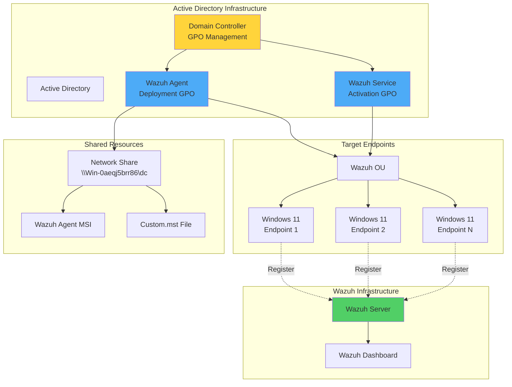
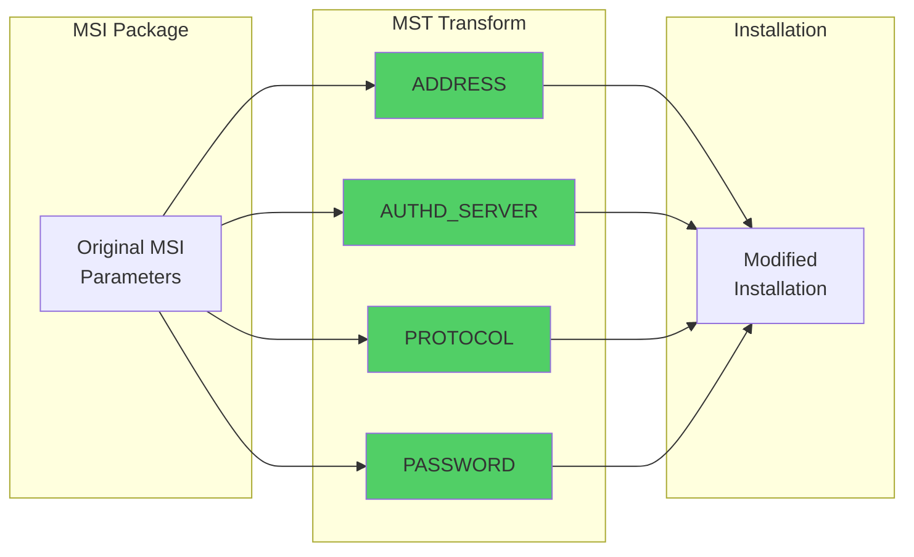
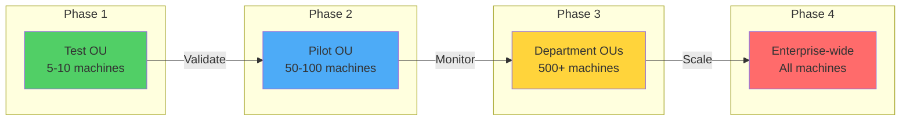

# Deploying Wazuh Agents Using Windows Group Policy Objects (GPO)

## Introduction

Managing security agent deployment across hundreds or thousands of Windows endpoints can be a daunting task. Manual installation is time-consuming, error-prone, and doesn't scale well. This is where Windows Group Policy Objects (GPO) come to the rescue, enabling centralized, automated deployment of the Wazuh agent across your entire Active Directory infrastructure.

By leveraging GPO for Wazuh agent deployment, organizations can achieve:
- 🚀 **Automated Deployment**: Push agents to all domain-joined machines
- 🎯 **Centralized Management**: Control deployments from a single location
- 🔧 **Consistent Configuration**: Ensure uniform agent settings
- 📊 **Scalable Operations**: Deploy to thousands of endpoints effortlessly
- 🔄 **Easy Updates**: Manage agent versions through policy updates

## Understanding the Components

### Group Policy Objects (GPO)

GPOs are collections of policy settings in Microsoft Windows that allow administrators to:
- Configure operating system settings
- Deploy software packages
- Enforce security policies
- Manage user and computer configurations

### MSI and MST Files

- **MSI (Microsoft Software Installer)**: Package format for Windows installations
- **MST (Microsoft Transform)**: Customization file that modifies MSI behavior
- **Orca**: Microsoft tool for creating and editing MSI/MST files

## Architecture Overview



## Infrastructure Requirements

- **Wazuh Server**: Pre-built OVA 4.7.3 with all core components
- **Domain Controller**: Windows Server 2019+ hosting Active Directory
- **Target Endpoints**: Windows 11 domain-joined machines
- **Administrative Account**: Domain admin privileges for GPO creation

## Implementation Guide

### Phase 1: Configure Wazuh Server

Enable password-based agent enrollment for automated deployment:

```bash
# Edit the Wazuh configuration
vi /var/ossec/etc/ossec.conf
```

Enable password authentication:
```xml
<auth>
  <use_password>yes</use_password>
</auth>
```

Create and secure the password file:
```bash
# Set enrollment password
echo "BlueWolf" > /var/ossec/etc/authd.pass

# Secure the password file
chmod 640 /var/ossec/etc/authd.pass
chown root:wazuh /var/ossec/etc/authd.pass

# Restart Wazuh manager
systemctl restart wazuh-manager
```

### Phase 2: Create MST File with Orca

#### Install Orca

1. Download Windows SDK Components for Windows Installer Developers
2. Install Orca from: `C:\Program Files (x86)\Windows Kits\10\bin\10.0.22621.0\x86\Orca-x86_en-us.msi`

#### Configure Wazuh Agent Installer

1. Launch Orca and open the Wazuh agent MSI file
2. Navigate to the **Property** table
3. Create a new transform: **Transform > New Transform**
4. Add deployment parameters:

```properties
ADDRESS = <WAZUH_SERVER_IP>
AUTHD_SERVER = <WAZUH_SERVER_IP>
PROTOCOL = TCP
PASSWORD = BlueWolf
```

5. Save as `custom.mst`: **Transform > Generate Transform**

#### MST Configuration Details



### Phase 3: Create Network Share

Set up a shared folder for GPO deployment:

```powershell
# Create shared folder
New-Item -Path "C:\Users\$env:USERNAME\Desktop\DC" -ItemType Directory

# Share with authenticated users
$sharePath = "C:\Users\$env:USERNAME\Desktop\DC"
New-SmbShare -Name "DC" -Path $sharePath -ReadAccess "Authenticated Users"
```

Copy the Wazuh MSI and custom.mst files to the shared folder.

### Phase 4: Configure Group Policy Objects

#### Create Organizational Unit

1. Open **Active Directory Users and Computers**
2. Right-click domain → **New** → **Organizational Unit**
3. Name it "Wazuh"
4. Move target computers to this OU

#### Create Deployment GPO

1. Open Group Policy Management (`gpmc.msc`)
2. Create new GPO: "Wazuh agent deployment"
3. Edit GPO:
   - Navigate to: **Computer Configuration** → **Policies** → **Software Settings** → **Software installation**
   - Right-click → **New** → **Package**
   - Select MSI from network share
   - Choose **Advanced** deployment
   - Add `custom.mst` in Modifications tab

#### Create Service Activation GPO

1. Create new GPO: "Wazuh agent activate"
2. Edit GPO:
   - Navigate to: **Computer Configuration** → **Preferences** → **Control Panel Settings** → **Services**
   - Create new service:
     - Service name: `WazuhSvc`
     - Service action: `Start service`
     - Recovery: Set all to `Restart the Service`

### Phase 5: Apply and Test Deployment

#### Link GPOs to OU

```powershell
# Link GPOs to Wazuh OU
New-GPLink -Name "Wazuh agent deployment" -Target "OU=Wazuh,DC=wazuhtests,DC=com"
New-GPLink -Name "Wazuh agent activate" -Target "OU=Wazuh,DC=wazuhtests,DC=com"
```

#### Force Policy Update

On target endpoints, run with administrative privileges:

```cmd
# Interactive update
gpupdate /force

# Non-interactive update
echo N | gpupdate /force
```

#### Verify Deployment

On Wazuh server:
```bash
# Check registered agents
/var/ossec/bin/agent_control -l
```

Expected output:
```
Wazuh agent_control. List of available agents:
   ID: 000, Name: wazuh-server (server), IP: 127.0.0.1, Active/Local
   ID: 001, Name: Windows11, IP: any, Active
```

## Advanced Configuration

### Customizing Deployment Parameters

Create different MST files for various scenarios:

```powershell
# Development environment MST
$devParams = @{
    ADDRESS = "10.0.1.100"
    AUTHD_SERVER = "10.0.1.100"
    PROTOCOL = "TCP"
    PASSWORD = "DevPassword"
    AGENT_NAME = "DEV-%COMPUTERNAME%"
}

# Production environment MST
$prodParams = @{
    ADDRESS = "10.0.2.100"
    AUTHD_SERVER = "10.0.2.100"
    PROTOCOL = "TCP"
    PASSWORD = "ProdPassword"
    AGENT_NAME = "PROD-%COMPUTERNAME%"
}
```

### Targeting Specific Computer Groups

Use WMI filters for granular deployment:

```sql
-- Deploy only to Windows 11 workstations
SELECT * FROM Win32_OperatingSystem
WHERE Version LIKE "10.0.22%"
AND ProductType = "1"

-- Deploy only to servers
SELECT * FROM Win32_OperatingSystem
WHERE ProductType != "1"
```

### Monitoring Deployment Progress

Create a PowerShell script for deployment monitoring:

```powershell
# check_wazuh_deployment.ps1
$computers = Get-ADComputer -Filter * -SearchBase "OU=Wazuh,DC=wazuhtests,DC=com"

foreach ($computer in $computers) {
    $result = Test-Connection -ComputerName $computer.Name -Count 1 -Quiet
    if ($result) {
        $service = Get-Service -Name "WazuhSvc" -ComputerName $computer.Name -ErrorAction SilentlyContinue
        if ($service) {
            Write-Host "$($computer.Name): Wazuh installed - Status: $($service.Status)" -ForegroundColor Green
        } else {
            Write-Host "$($computer.Name): Wazuh not installed" -ForegroundColor Red
        }
    } else {
        Write-Host "$($computer.Name): Offline" -ForegroundColor Yellow
    }
}
```

## Troubleshooting

### Common Issues and Solutions

#### Issue 1: GPO Not Applying

**Symptoms**: Agent not installing after gpupdate

**Solutions**:
```powershell
# Check GPO application
gpresult /h gpreport.html

# Verify computer is in correct OU
Get-ADComputer -Identity "ComputerName" | Select DistinguishedName

# Check GPO permissions
Get-GPPermission -Name "Wazuh agent deployment" -All
```

#### Issue 2: Installation Fails

**Check Windows Event Logs**:
```powershell
# Check application logs
Get-EventLog -LogName Application -Source MsiInstaller -Newest 20

# Check system logs
Get-EventLog -LogName System -Source GroupPolicy -Newest 20
```

#### Issue 3: Agent Not Connecting

**Verify network connectivity**:
```powershell
# Test Wazuh server connectivity
Test-NetConnection -ComputerName <WAZUH_SERVER_IP> -Port 1514
Test-NetConnection -ComputerName <WAZUH_SERVER_IP> -Port 1515
```

### Deployment Validation Script

```powershell
# validate_wazuh_deployment.ps1
param(
    [string]$WazuhServer = "192.168.1.100",
    [string]$ExpectedVersion = "4.7.3"
)

function Test-WazuhDeployment {
    $results = @()

    # Check if Wazuh is installed
    $installed = Get-WmiObject -Class Win32_Product | Where-Object {$_.Name -like "*Wazuh*"}

    if ($installed) {
        $results += "✓ Wazuh installed: $($installed.Version)"

        # Check service status
        $service = Get-Service -Name "WazuhSvc" -ErrorAction SilentlyContinue
        if ($service) {
            $results += "✓ Wazuh service status: $($service.Status)"
        } else {
            $results += "✗ Wazuh service not found"
        }

        # Check configuration
        $configPath = "C:\Program Files (x86)\ossec-agent\ossec.conf"
        if (Test-Path $configPath) {
            $config = Get-Content $configPath
            if ($config -match $WazuhServer) {
                $results += "✓ Correct server configured: $WazuhServer"
            } else {
                $results += "✗ Incorrect server configuration"
            }
        }

        # Check connectivity
        if (Test-NetConnection -ComputerName $WazuhServer -Port 1514 -InformationLevel Quiet) {
            $results += "✓ Can reach Wazuh server"
        } else {
            $results += "✗ Cannot reach Wazuh server"
        }
    } else {
        $results += "✗ Wazuh not installed"
    }

    return $results
}

# Run validation
$validation = Test-WazuhDeployment
$validation | ForEach-Object { Write-Host $_ }
```

## Best Practices

### 1. Phased Deployment



### 2. Security Considerations

- **Password Protection**: Use strong, unique passwords for agent enrollment
- **Network Security**: Restrict share access to authenticated users only
- **MST Security**: Protect MST files from unauthorized modification
- **GPO Permissions**: Limit who can modify deployment GPOs

### 3. Maintenance Strategy

```powershell
# Automated agent version check
$targetVersion = "4.7.3"
$outdatedComputers = @()

Get-ADComputer -Filter * -SearchBase "OU=Wazuh,DC=wazuhtests,DC=com" | ForEach-Object {
    $version = Invoke-Command -ComputerName $_.Name -ScriptBlock {
        (Get-ItemProperty "HKLM:\Software\Microsoft\Windows\CurrentVersion\Uninstall\*" |
         Where-Object {$_.DisplayName -like "*Wazuh*"}).DisplayVersion
    } -ErrorAction SilentlyContinue

    if ($version -ne $targetVersion) {
        $outdatedComputers += $_.Name
    }
}

# Report outdated installations
if ($outdatedComputers.Count -gt 0) {
    Write-Host "Computers needing update:" -ForegroundColor Yellow
    $outdatedComputers | ForEach-Object { Write-Host " - $_" }
}
```

## Scaling Considerations

### Large Enterprise Deployments

For organizations with thousands of endpoints:

1. **Stagger Deployments**: Use multiple GPOs with different schedules
2. **Regional Distribution**: Create regional file shares for MSI distribution
3. **Bandwidth Management**: Implement BITS for package distribution
4. **Load Balancing**: Deploy multiple Wazuh servers behind a load balancer

### Performance Optimization

```xml
<!-- Optimize GPO processing -->
<GPO>
  <Computer>
    <ExtensionSettings>
      <Extension>
        <CSE>{42B5FAAE-6536-11d2-AE5A-0000F87571E3}</CSE>
        <Mode>Replace</Mode>
        <Policy>
          <SlowLinkThreshold>500</SlowLinkThreshold>
          <BackgroundPriority>Low</BackgroundPriority>
        </Policy>
      </Extension>
    </ExtensionSettings>
  </Computer>
</GPO>
```

## Integration with SCCM/ConfigMgr

For organizations using System Center Configuration Manager:

```powershell
# Create SCCM application for Wazuh
$app = New-CMApplication `
    -Name "Wazuh Agent 4.7.3" `
    -Publisher "Wazuh Inc" `
    -SoftwareVersion "4.7.3"

# Add deployment type
Add-CMDeploymentType `
    -ApplicationName "Wazuh Agent 4.7.3" `
    -DeploymentTypeName "MSI Installer" `
    -InstallCommand "msiexec /i wazuh-agent.msi TRANSFORMS=custom.mst /qn" `
    -DetectionMethod {Get-Service -Name WazuhSvc}
```

## Conclusion

Deploying Wazuh agents through Group Policy Objects transforms a potentially complex, time-consuming task into an automated, scalable solution. This approach ensures:

- ✅ **Consistent deployment** across all domain-joined machines
- 🚀 **Rapid rollout** to thousands of endpoints
- 🔧 **Centralized management** of agent configurations
- 📊 **Easy monitoring** of deployment status
- 🔄 **Simplified updates** through policy modifications

By following this guide, organizations can achieve comprehensive endpoint security coverage while minimizing administrative overhead.

## Key Takeaways

1. **Plan Thoroughly**: Test MST configurations before mass deployment
2. **Phase Rollouts**: Start small and scale gradually
3. **Monitor Progress**: Use scripts to track deployment success
4. **Document Everything**: Maintain records of GPO configurations
5. **Regular Updates**: Plan for agent version management

## Resources

- [Wazuh Agent Installation Documentation](https://documentation.wazuh.com/current/installation-guide/wazuh-agent/index.html)
- [Group Policy Overview](https://docs.microsoft.com/en-us/previous-versions/windows/it-pro/windows-server-2012-r2-and-2012/hh831791(v=ws.11))
- [Orca.exe Documentation](https://docs.microsoft.com/en-us/windows/win32/msi/orca-exe)
- [Windows Installer Guide](https://docs.microsoft.com/en-us/windows/win32/msi/windows-installer-guide)

---

*Automate security at scale. Deploy once, protect everywhere! 🛡️*
