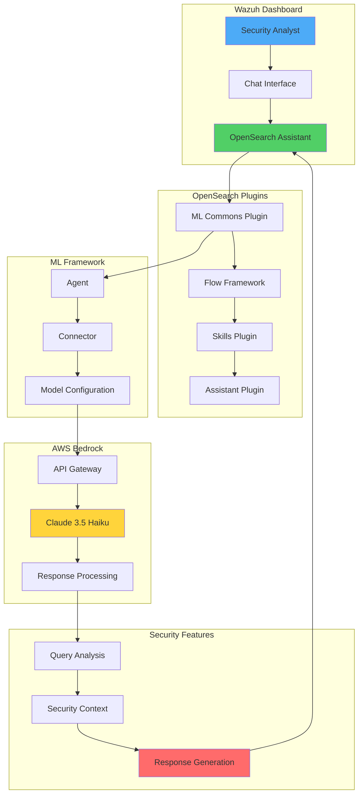
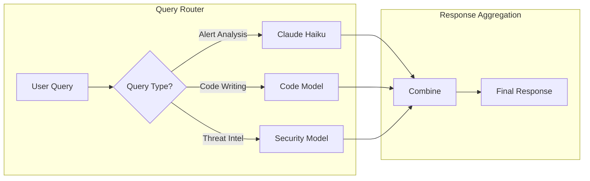

# Integrating Claude 3.5 Haiku LLM in Wazuh Dashboard for AI-Powered Security Insights

## Introduction

Imagine having an AI security analyst directly embedded in your Wazuh dashboard, ready to answer questions, explain alerts, and provide security guidance in natural language. By integrating Claude 3.5 Haiku - Anthropic's fast and efficient LLM - into Wazuh, we create an intelligent interface that transforms how security teams interact with their SIEM.

This integration provides:
- 💬 Natural language queries about security events
- 🧠 AI-powered analysis of alerts and vulnerabilities
- 📚 Instant security knowledge and best practices
- 🚀 Accelerated incident investigation
- 🤖 24/7 AI assistance within your dashboard

## Why Claude Haiku for Security Operations?

Claude 3.5 Haiku offers unique advantages for security use cases:
- **Speed**: Sub-second response times for real-time assistance
- **Accuracy**: Strong performance on technical and security tasks
- **Cost-Effective**: Efficient token usage for high-volume queries
- **Context Understanding**: Excellent at interpreting security logs and alerts
- **Safety**: Built-in safeguards against harmful outputs

## Architecture Overview



## Prerequisites

### Infrastructure Requirements

1. **Wazuh Server** (Ubuntu 24.04):
   - Wazuh 4.12.0 central components
   - Minimum 8GB RAM, 4 CPUs
   - Internet connectivity for AWS

2. **AWS Environment**:
   - AWS account with Bedrock access
   - IAM permissions for Claude 3.5 Haiku
   - Active AWS region (us-west-2 recommended)

## Implementation Guide

### Part 1: AWS Configuration

#### Enable Claude 3.5 Haiku Model

1. **Access Amazon Bedrock**:
   ```
   AWS Console → Amazon Bedrock → Model Access
   ```

2. **Enable Claude 3.5 Haiku**:
   - Click "Enable specific models"
   - Select "Claude 3.5 Haiku"
   - Submit request (may require support ticket)

3. **Verify Model Access**:
   - Status should show "Access granted"
   - Note the model ID: `anthropic.claude-3-5-haiku-20241022-v1:0`

#### Create IAM User and Credentials

1. **Create IAM User**:
   ```
   IAM → Users → Create User
   Name: wazuh-claude-integration
   ```

2. **Generate Access Keys**:
   ```
   Security Credentials → Create Access Key
   Use Case: Application running outside AWS
   ```

3. **Save Credentials**:
   ```
   Access Key ID: AKIA...
   Secret Access Key: wJal...
   ```

#### Configure IAM Policies

1. **Create Custom Policy** (`WazuhBedrockAccess`):
   ```json
   {
     "Version": "2012-10-17",
     "Statement": [
       {
         "Sid": "MarketplaceBedrock",
         "Effect": "Allow",
         "Action": [
           "aws-marketplace:ViewSubscriptions",
           "aws-marketplace:Unsubscribe",
           "aws-marketplace:Subscribe"
         ],
         "Resource": "*"
       }
     ]
   }
   ```

2. **Attach Policies**:
   - Custom: `WazuhBedrockAccess`
   - AWS Managed: `AmazonBedrockFullAccess`

### Part 2: Install OpenSearch Plugins

#### Download and Install Plugins

```bash
# Download OpenSearch Dashboard plugins
curl https://artifacts.opensearch.org/releases/bundle/opensearch-dashboards/2.13.0/opensearch-dashboards-2.13.0-linux-x64.tar.gz -o opensearch-dashboards.tar.gz

# Extract archive
tar -xvzf opensearch-dashboards.tar.gz

# Copy required plugins to Wazuh dashboard
cp -r opensearch-dashboards-2.13.0/plugins/observabilityDashboards/ /usr/share/wazuh-dashboard/plugins/
cp -r opensearch-dashboards-2.13.0/plugins/mlCommonsDashboards/ /usr/share/wazuh-dashboard/plugins/
cp -r opensearch-dashboards-2.13.0/plugins/assistantDashboards/ /usr/share/wazuh-dashboard/plugins/

# Set correct permissions
chown -R wazuh-dashboard:wazuh-dashboard /usr/share/wazuh-dashboard/plugins/observabilityDashboards/
chown -R wazuh-dashboard:wazuh-dashboard /usr/share/wazuh-dashboard/plugins/mlCommonsDashboards/
chown -R wazuh-dashboard:wazuh-dashboard /usr/share/wazuh-dashboard/plugins/assistantDashboards/

chmod -R 750 /usr/share/wazuh-dashboard/plugins/observabilityDashboards/
chmod -R 750 /usr/share/wazuh-dashboard/plugins/mlCommonsDashboards/
chmod -R 750 /usr/share/wazuh-dashboard/plugins/assistantDashboards/
```

#### Configure Dashboard Settings

Edit `/etc/wazuh-dashboard/opensearch_dashboards.yml`:

```yaml
# Enable AI Assistant features
assistant.chat.enabled: true
observability.query_assist.enabled: true
```

#### Install Indexer Plugins

```bash
# Navigate to Wazuh indexer directory
cd /usr/share/wazuh-indexer/

# Install required plugins
./bin/opensearch-plugin install org.opensearch.plugin:opensearch-flow-framework:2.13.0.0
./bin/opensearch-plugin install org.opensearch.plugin:opensearch-skills:2.13.0.0

# Restart Wazuh dashboard
systemctl restart wazuh-dashboard
```

### Part 3: Configure Claude Integration

Navigate to **Indexer Management → DevTools** in Wazuh dashboard.

#### 1. Enable ML Commons

```json
PUT /_cluster/settings
{
  "persistent": {
    "plugins.ml_commons.only_run_on_ml_node": "false"
  }
}
```

#### 2. Create Claude Connector

```json
POST /_plugins/_ml/connectors/_create
{
  "name": "Amazon Bedrock Claude Haiku",
  "description": "Connector for Claude 3.5 Haiku security analysis",
  "version": 1,
  "protocol": "aws_sigv4",
  "credential": {
    "access_key": "YOUR_ACCESS_KEY",
    "secret_key": "YOUR_SECRET_KEY"
  },
  "parameters": {
    "region": "us-west-2",
    "service_name": "bedrock",
    "auth": "Sig_V4",
    "response_filter": "$.content[0].text",
    "max_tokens_to_sample": "8000",
    "anthropic_version": "bedrock-2023-05-31",
    "model": "anthropic.claude-3-5-haiku-20241022-v1:0"
  },
  "actions": [
    {
      "action_type": "predict",
      "method": "POST",
      "headers": {
        "content-type": "application/json"
      },
      "url": "https://bedrock-runtime.us-west-2.amazonaws.com/model/${parameters.model}/invoke",
      "request_body": "{\"messages\":[{\"role\":\"user\",\"content\":[{\"type\":\"text\",\"text\":\"${parameters.prompt}\"}]}],\"anthropic_version\":\"${parameters.anthropic_version}\",\"max_tokens\":${parameters.max_tokens_to_sample}}"
    }
  ]
}
```

Save the `connector_id` from the response.

#### 3. Create Model Group

```json
POST /_plugins/_ml/model_groups/_register
{
  "name": "Wazuh Security AI",
  "description": "AI models for security analysis"
}
```

Save the `model_group_id`.

#### 4. Register and Deploy Model

```json
POST /_plugins/_ml/models/_register?deploy=true
{
  "name": "Claude Security Assistant",
  "function_name": "remote",
  "model_group_id": "YOUR_MODEL_GROUP_ID",
  "description": "Claude 3.5 Haiku for Wazuh security analysis",
  "connector_id": "YOUR_CONNECTOR_ID"
}
```

Save the `model_id`.

#### 5. Create Security-Focused Agent

```json
POST /_plugins/_ml/agents/_register
{
  "name": "Wazuh_Security_AI_Agent",
  "type": "conversational",
  "description": "AI agent specialized in Wazuh and security operations",
  "llm": {
    "model_id": "YOUR_MODEL_ID",
    "parameters": {
      "max_iteration": 5,
      "stop_when_no_tool_found": true
    }
  },
  "memory": {
    "type": "conversation_index"
  },
  "tools": [
    {
      "type": "MLModelTool",
      "name": "security_assistant",
      "description": "Security analysis and Wazuh expertise",
      "parameters": {
        "model_id": "YOUR_MODEL_ID",
        "prompt": "Human: You are a Wazuh security expert AI assistant. You help with:\n- Explaining Wazuh alerts and their severity\n- Providing security best practices\n- Analyzing vulnerabilities and suggesting remediation\n- Writing Wazuh rules and decoders\n- Incident response guidance\n- MITRE ATT&CK framework mapping\n\nAlways provide accurate, actionable security advice. If unsure, recommend consulting official Wazuh documentation.\n\n${parameters.chat_history:-}\n\nHuman: ${parameters.question}\n\nAssistant:"
      }
    }
  ]
}
```

Save the `agent_id`.

#### 6. Connect Agent to Dashboard

```json
PUT .plugins-ml-config/_doc/os_chat
{
  "type": "os_chat_root_agent",
  "configuration": {
    "agent_id": "YOUR_AGENT_ID"
  }
}
```

Refresh the Wazuh dashboard to see the AI assistant icon.

## Using Claude AI in Wazuh

### Example Security Queries

#### 1. Alert Analysis

**Query**: "What does rule ID 5716 mean and how serious is it?"

**Claude Response**:
```
Rule ID 5716 is a Wazuh SSH authentication failure alert with severity level 5 (medium).

This rule triggers when someone fails to authenticate via SSH. Key details:
- Indicates potential brute force attempts
- Monitor for multiple failures from same IP
- Check if source IP is known/authorized
- Consider implementing fail2ban or active response

Recommended actions:
1. Review source IP reputation
2. Check for pattern of attempts
3. Verify user exists
4. Enable rate limiting if frequent
```

#### 2. Vulnerability Guidance

**Query**: "I see a critical CVE-2024-1234 vulnerability alert. What should I do?"

**Claude Response**:
```
For critical vulnerability CVE-2024-1234:

Immediate Actions:
1. Identify affected systems using Wazuh vulnerability detector
2. Check if exploit is in the wild (check threat intel)
3. Assess exposure (internet-facing? critical data?)

Remediation Steps:
1. Apply vendor patches immediately if available
2. If no patch: implement compensating controls
3. Monitor for exploitation attempts
4. Update Wazuh rules to detect exploitation

Post-Remediation:
- Rescan to verify patch application
- Document remediation in ticket system
- Schedule follow-up vulnerability scan
```

#### 3. Rule Writing Assistance

**Query**: "Write a Wazuh rule to detect failed sudo attempts"

**Claude Response**:
```xml
<group name="sudo,">
  <rule id="100200" level="5">
    <if_sid>5402</if_sid>
    <match>authentication failure</match>
    <description>Failed sudo authentication attempt</description>
    <group>authentication_failed,</group>
  </rule>

  <rule id="100201" level="10" frequency="5" timeframe="300">
    <if_matched_sid>100200</if_matched_sid>
    <same_user />
    <description>Multiple failed sudo attempts by $(user)</description>
    <mitre>
      <id>T1548.003</id>
    </mitre>
    <group>authentication_failures,</group>
  </rule>
</group>
```

#### 4. Incident Response

**Query**: "Multiple servers showing ransomware alerts. What's the response plan?"

**Claude Response**:
```
CRITICAL: Ransomware Incident Response

Immediate Actions (0-15 minutes):
1. ISOLATE affected systems - disconnect network
2. ALERT incident response team
3. PRESERVE evidence - capture memory, logs
4. IDENTIFY patient zero and infection vector

Containment (15-60 minutes):
1. Block C2 communications at firewall
2. Disable affected user accounts
3. Reset credentials for privileged accounts
4. Check backups integrity (air-gapped?)

Investigation:
1. Timeline reconstruction using Wazuh logs
2. Search for IOCs across infrastructure
3. Identify lateral movement patterns
4. Check for data exfiltration

Recovery:
1. Restore from clean backups
2. Rebuild affected systems
3. Apply all security patches
4. Enhanced monitoring for reinfection
```

## Advanced Integration Features

### Custom Security Context

Enhance the agent with domain-specific knowledge:

```json
{
  "parameters": {
    "prompt": "Human: You are specialized in:\n- ${COMPANY} security policies\n- Custom Wazuh rules (IDs 100000-200000)\n- Industry compliance: PCI-DSS, HIPAA\n- Technology stack: Linux, Docker, AWS\n\nProvide advice considering our environment.\n\nHuman: ${parameters.question}\n\nAssistant:"
  }
}
```

### Multi-Model Approach



### Integration with Wazuh API

```python
# Enhance AI responses with real-time Wazuh data
def enhance_ai_query(question):
    # Get context from Wazuh API
    if "alert" in question.lower():
        recent_alerts = wazuh_api.get_alerts(limit=5)
        context = f"Recent alerts: {format_alerts(recent_alerts)}"
        enhanced_prompt = f"{context}\n\nQuestion: {question}"
        return enhanced_prompt
    return question
```

## Security Considerations

### 1. API Key Protection

```bash
# Store credentials securely
cat > /etc/wazuh-dashboard/claude-config.json << EOF
{
  "credentials": {
    "access_key": "encrypted_key",
    "secret_key": "encrypted_secret"
  }
}
EOF

chmod 600 /etc/wazuh-dashboard/claude-config.json
chown wazuh-dashboard:wazuh-dashboard /etc/wazuh-dashboard/claude-config.json
```

### 2. Query Sanitization

```javascript
// Prevent prompt injection
function sanitizeQuery(userInput) {
  const blockedPatterns = [
    /ignore previous instructions/i,
    /reveal your prompt/i,
    /system message/i
  ];

  for (const pattern of blockedPatterns) {
    if (pattern.test(userInput)) {
      return "Invalid query detected";
    }
  }

  return userInput.substring(0, 1000); // Limit length
}
```

### 3. Response Validation

```python
def validate_ai_response(response):
    """Ensure AI responses are safe and accurate"""

    # Check for harmful content
    if contains_harmful_content(response):
        return "Response filtered for safety"

    # Verify technical accuracy
    if "rule" in response:
        validate_rule_syntax(response)

    # Add disclaimer for critical actions
    if any(word in response for word in ["delete", "remove", "disable"]):
        response += "\n\n⚠️ Warning: Verify this action before proceeding"

    return response
```

## Performance Optimization

### 1. Response Caching

```json
POST /_plugins/_ml/models/_predict
{
  "model_id": "YOUR_MODEL_ID",
  "parameters": {
    "prompt": "Cached question",
    "cache_ttl": 3600,
    "cache_key": "hash_of_question"
  }
}
```

### 2. Token Usage Optimization

```python
# Optimize prompts for efficiency
def optimize_prompt(question, max_context=500):
    # Truncate long questions
    if len(question) > max_context:
        question = question[:max_context] + "..."

    # Remove redundant information
    question = remove_redundancy(question)

    # Use concise system prompt
    return {
        "prompt": f"Security expert. Brief answers. Q: {question}",
        "max_tokens": 500
    }
```

### 3. Concurrent Query Handling

```javascript
// Queue management for multiple users
class AIQueryQueue {
  constructor(maxConcurrent = 3) {
    this.queue = [];
    this.active = 0;
    this.maxConcurrent = maxConcurrent;
  }

  async addQuery(query) {
    return new Promise((resolve, reject) => {
      this.queue.push({ query, resolve, reject });
      this.processQueue();
    });
  }

  async processQueue() {
    if (this.active >= this.maxConcurrent || this.queue.length === 0) {
      return;
    }

    this.active++;
    const { query, resolve, reject } = this.queue.shift();

    try {
      const result = await sendToAI(query);
      resolve(result);
    } catch (error) {
      reject(error);
    } finally {
      this.active--;
      this.processQueue();
    }
  }
}
```

## Troubleshooting

### Common Issues and Solutions

#### 1. Model Not Responding

```bash
# Check model status
curl -X GET "localhost:9200/_plugins/_ml/models/YOUR_MODEL_ID"

# Restart model if needed
curl -X POST "localhost:9200/_plugins/_ml/models/YOUR_MODEL_ID/_undeploy"
curl -X POST "localhost:9200/_plugins/_ml/models/YOUR_MODEL_ID/_deploy"
```

#### 2. Authentication Errors

```json
// Verify AWS credentials
{
  "error": "The security token included in the request is invalid"
}

// Solution: Regenerate IAM credentials and update connector
```

#### 3. Region Issues

```bash
# Ensure model is available in your region
aws bedrock list-foundation-models --region us-west-2 | grep claude-3-5-haiku
```

## Best Practices

### 1. Query Guidelines

✅ **Good Queries**:
- "Explain this SSH brute force alert and remediation steps"
- "Write a Wazuh rule for detecting PowerShell encoded commands"
- "What's the MITRE technique for credential dumping?"

❌ **Poor Queries**:
- "Fix everything"
- "Hello" (too vague)
- "Write malicious code" (will be blocked)

### 2. Response Verification

Always verify AI responses against:
- Official Wazuh documentation
- Security best practices
- Your organization's policies
- Current threat intelligence

### 3. Continuous Improvement

```python
# Log queries for analysis
def log_ai_interaction(query, response, feedback=None):
    log_entry = {
        "timestamp": datetime.now().isoformat(),
        "query": query,
        "response_preview": response[:200],
        "useful": feedback,
        "model": "claude-3.5-haiku"
    }

    # Use for model fine-tuning
    with open("/var/log/wazuh-ai-interactions.jsonl", "a") as f:
        f.write(json.dumps(log_entry) + "\n")
```

## Cost Optimization

### Monitor Usage

```python
# Track token usage
def calculate_monthly_cost(daily_queries=100, avg_tokens=1000):
    # Claude 3.5 Haiku pricing (example)
    input_cost_per_1k = 0.00025
    output_cost_per_1k = 0.00125

    monthly_input_tokens = daily_queries * 30 * (avg_tokens * 0.3)
    monthly_output_tokens = daily_queries * 30 * (avg_tokens * 0.7)

    total_cost = (
        (monthly_input_tokens / 1000) * input_cost_per_1k +
        (monthly_output_tokens / 1000) * output_cost_per_1k
    )

    return f"Estimated monthly cost: ${total_cost:.2f}"
```

### Optimize Token Usage

1. **Use concise prompts**
2. **Implement response caching**
3. **Set appropriate max_tokens**
4. **Filter unnecessary queries**

## Future Enhancements

### 1. RAG Integration

```python
# Retrieval Augmented Generation with Wazuh docs
def enhance_with_rag(query):
    # Search Wazuh documentation
    relevant_docs = search_wazuh_docs(query)

    # Include in prompt
    context = f"Relevant documentation:\n{relevant_docs}\n"
    enhanced_query = f"{context}\nQuestion: {query}"

    return enhanced_query
```

### 2. Custom Fine-Tuning

```json
{
  "training_data": [
    {
      "prompt": "What is rule 5716?",
      "completion": "Rule 5716 detects SSH authentication failures..."
    },
    {
      "prompt": "How to remediate CVE-2024-1234?",
      "completion": "For CVE-2024-1234 remediation: 1) Apply patch..."
    }
  ]
}
```

### 3. Automated Actions

```python
# AI-driven automated response
async def ai_automated_response(alert):
    # Get AI recommendation
    query = f"Recommend automated response for: {alert}"
    recommendation = await query_ai(query)

    # Execute if confidence high
    if recommendation.confidence > 0.9:
        execute_response(recommendation.action)
    else:
        notify_analyst(recommendation)
```

## Conclusion

Integrating Claude 3.5 Haiku into the Wazuh dashboard transforms security operations by providing:

- 🤖 **Instant AI assistance** for security queries
- 📈 **Accelerated incident response** with expert guidance
- 📚 **On-demand security knowledge** without leaving the dashboard
- 🔍 **Enhanced threat analysis** with AI-powered insights

This integration bridges the gap between human expertise and AI capabilities, creating a more efficient and effective security operations center.

## Key Takeaways

1. **Easy Integration**: OpenSearch plugins enable seamless LLM integration
2. **Security-Focused**: Custom prompts ensure relevant security responses
3. **Cost-Effective**: Claude Haiku provides fast, affordable AI assistance
4. **Extensible**: Framework supports multiple models and use cases
5. **Production-Ready**: With proper security controls and monitoring

## Resources

- [Wazuh Documentation](https://documentation.wazuh.com/)
- [Claude API Documentation](https://docs.anthropic.com/claude/reference)
- [Amazon Bedrock Guide](https://docs.aws.amazon.com/bedrock/)
- [OpenSearch ML Commons](https://opensearch.org/docs/latest/ml-commons-plugin/index/)

---

*Empowering security teams with AI-driven insights, directly in the Wazuh dashboard. The future of SIEM is conversational! 🚀*
