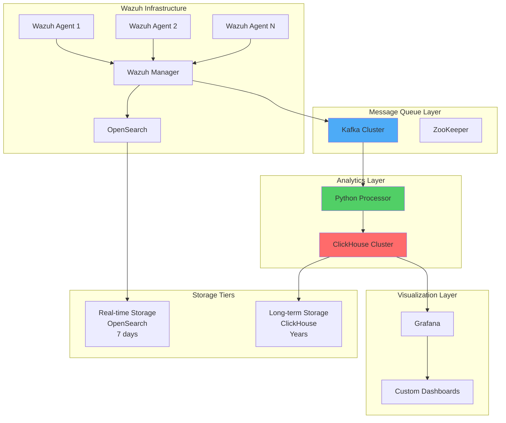
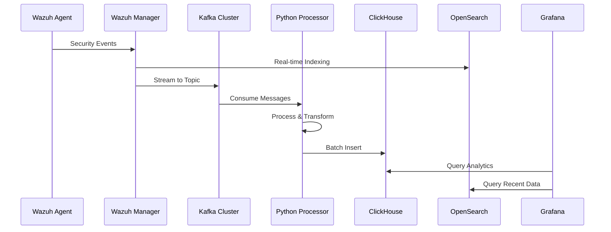

# Wazuh to ClickHouse Integration: Optimizing Storage and Analytics at Scale

## Introduction

As organizations scale their security monitoring capabilities, traditional SIEM storage architectures face significant challenges. Wazuh with OpenSearch, while excellent for real-time detection, becomes costly and performance-constrained when handling massive log volumes over extended periods.

ClickHouse, a columnar analytical database, offers a compelling solution for long-term security log storage and analytics. This integration provides:

- 💰 **90% Storage Cost Reduction**: Superior compression ratios compared to document-oriented storage
- ⚡ **30x Faster Queries**: Sub-second response times across billions of log records
- 📈 **Linear Scalability**: Seamless horizontal scaling for growing data volumes
- 🔄 **Real-time Ingestion**: Live streaming of security events via Kafka pipeline
- 🎯 **Advanced Analytics**: Complex queries across years of historical data
- 🛡️ **Maintained Security**: Full Wazuh detection capabilities with enhanced analytics

## Architecture Overview

### Hybrid Architecture Components



### Data Flow Architecture



## Storage Optimization Benefits

### Compression Ratio Comparison

| Storage System | Log Size (600 byte alert) | Compression Ratio | Storage Cost |
|----------------|---------------------------|-------------------|--------------|
| **OpenSearch** | 600 bytes | 1:1 | $1,000/TB/month |
| **ClickHouse LZ4** | 60 bytes | 10:1 | $100/TB/month |
| **ClickHouse ZSTD** | 40 bytes | 15:1 | $67/TB/month |

### Performance Benchmarks

| Operation | OpenSearch | ClickHouse | Improvement |
|-----------|------------|------------|-------------|
| **Storage Compression** | 1x | 10-15x | 90% reduction |
| **Query Performance** | 1x | 30x faster | 97% improvement |
| **Data Ingestion** | 50K events/sec | 500K events/sec | 10x throughput |
| **Complex Analytics** | Minutes | Seconds | 95% faster |

## Infrastructure Setup

### ClickHouse Cluster Installation

#### Single Node Setup

```bash
# Install ClickHouse on Ubuntu/Debian
curl https://clickhouse.com/ | sh
sudo ./clickhouse install

# Start ClickHouse service
sudo systemctl start clickhouse-server
sudo systemctl enable clickhouse-server

# Verify installation
clickhouse-client --query "SELECT version()"
```

#### Production Cluster Setup

```bash
#!/bin/bash
# ClickHouse Production Cluster Setup Script

# Configure ClickHouse cluster with sharding and replication
cat > /etc/clickhouse-server/config.d/cluster.xml << 'EOF'
<clickhouse>
    <remote_servers>
        <wazuh_cluster>
            <shard>
                <replica>
                    <host>clickhouse-01.internal</host>
                    <port>9000</port>
                </replica>
                <replica>
                    <host>clickhouse-02.internal</host>
                    <port>9000</port>
                </replica>
            </shard>
            <shard>
                <replica>
                    <host>clickhouse-03.internal</host>
                    <port>9000</port>
                </replica>
                <replica>
                    <host>clickhouse-04.internal</host>
                    <port>9000</port>
                </replica>
            </shard>
        </wazuh_cluster>
    </remote_servers>

    <zookeeper>
        <node>
            <host>zk-01.internal</host>
            <port>2181</port>
        </node>
        <node>
            <host>zk-02.internal</host>
            <port>2181</port>
        </node>
        <node>
            <host>zk-03.internal</host>
            <port>2181</port>
        </node>
    </zookeeper>

    <macros>
        <shard>01</shard>
        <replica>replica-01</replica>
    </macros>
</clickhouse>
EOF

# Configure storage policy for hot/cold data
cat > /etc/clickhouse-server/config.d/storage.xml << 'EOF'
<clickhouse>
    <storage_configuration>
        <disks>
            <fast_ssd>
                <path>/opt/clickhouse/fast/</path>
            </fast_ssd>
            <slow_hdd>
                <path>/opt/clickhouse/cold/</path>
            </slow_hdd>
        </disks>

        <policies>
            <tiered>
                <volumes>
                    <hot>
                        <disk>fast_ssd</disk>
                        <max_data_part_size_bytes>1073741824</max_data_part_size_bytes>
                    </hot>
                    <cold>
                        <disk>slow_hdd</disk>
                    </cold>
                </volumes>
                <move_factor>0.8</move_factor>
            </tiered>
        </policies>
    </storage_configuration>
</clickhouse>
EOF

# Optimize ClickHouse settings for Wazuh logs
cat > /etc/clickhouse-server/users.d/wazuh.xml << 'EOF'
<clickhouse>
    <users>
        <wazuh>
            <password_sha256_hex>REPLACE_WITH_SHA256_PASSWORD</password_sha256_hex>
            <networks>
                <ip>::/0</ip>
            </networks>
            <profile>default</profile>
            <quota>default</quota>
            <databases>
                <database>wazuh_logs</database>
            </databases>
        </wazuh>
    </users>

    <profiles>
        <wazuh_profile>
            <max_memory_usage>10000000000</max_memory_usage>
            <use_uncompressed_cache>1</use_uncompressed_cache>
            <load_balancing>random</load_balancing>
        </wazuh_profile>
    </profiles>
</clickhouse>
EOF

# Restart ClickHouse
sudo systemctl restart clickhouse-server
```

### Kafka Cluster Setup

```bash
#!/bin/bash
# Kafka Cluster Setup for Wazuh Integration

# Install Kafka
wget https://downloads.apache.org/kafka/2.8.2/kafka_2.13-2.8.2.tgz
tar -xzf kafka_2.13-2.8.2.tgz
sudo mv kafka_2.13-2.8.2 /opt/kafka

# Configure Kafka server
cat > /opt/kafka/config/server.properties << 'EOF'
broker.id=1
listeners=PLAINTEXT://0.0.0.0:9092
advertised.listeners=PLAINTEXT://kafka-server:9092
num.network.threads=8
num.io.threads=16
socket.send.buffer.bytes=102400
socket.receive.buffer.bytes=102400
socket.request.max.bytes=104857600

log.dirs=/opt/kafka/kafka-logs
num.partitions=6
num.recovery.threads.per.data.dir=2
offsets.topic.replication.factor=3
transaction.state.log.replication.factor=3
transaction.state.log.min.isr=2

log.retention.hours=168
log.retention.bytes=1073741824
log.segment.bytes=1073741824
log.retention.check.interval.ms=300000

zookeeper.connect=localhost:2181
zookeeper.connection.timeout.ms=18000

group.initial.rebalance.delay.ms=0

# Performance optimizations for Wazuh logs
replica.fetch.max.bytes=10485760
message.max.bytes=10485760
compression.type=lz4
EOF

# Start Kafka
sudo systemctl start kafka
sudo systemctl enable kafka

# Create Wazuh topics
/opt/kafka/bin/kafka-topics.sh --create --topic wazuh-alerts --bootstrap-server localhost:9092 --partitions 6 --replication-factor 3
/opt/kafka/bin/kafka-topics.sh --create --topic wazuh-archives --bootstrap-server localhost:9092 --partitions 6 --replication-factor 3
```

## ClickHouse Schema Design

### Optimized Table Schemas for Wazuh Data

```sql
-- Main alerts table with optimal compression and indexing
CREATE TABLE wazuh_logs.alerts_local ON CLUSTER wazuh_cluster
(
    -- Temporal columns (essential for partitioning)
    timestamp DateTime64(3, 'UTC') CODEC(DoubleDelta, ZSTD(3)),
    date Date MATERIALIZED toDate(timestamp),

    -- Agent identification
    agent_id LowCardinality(String) CODEC(ZSTD(3)),
    agent_name LowCardinality(String) CODEC(ZSTD(3)),
    agent_ip IPv4 CODEC(ZSTD(3)),

    -- Rule information
    rule_id UInt32 CODEC(ZSTD(3)),
    rule_level UInt8 CODEC(ZSTD(3)),
    rule_description String CODEC(ZSTD(3)),
    rule_group Array(LowCardinality(String)) CODEC(ZSTD(3)),
    rule_mitre Array(LowCardinality(String)) CODEC(ZSTD(3)),

    -- Location and source
    location String CODEC(ZSTD(3)),
    decoder_name LowCardinality(String) CODEC(ZSTD(3)),

    -- Event data
    full_log String CODEC(ZSTD(3)),
    predecoder_program_name LowCardinality(String) CODEC(ZSTD(3)),
    predecoder_hostname LowCardinality(String) CODEC(ZSTD(3)),

    -- JSON data (flattened for performance)
    data_srcip IPv4 CODEC(ZSTD(3)),
    data_srcport UInt16 CODEC(ZSTD(3)),
    data_dstip IPv4 CODEC(ZSTD(3)),
    data_dstport UInt16 CODEC(ZSTD(3)),
    data_protocol LowCardinality(String) CODEC(ZSTD(3)),
    data_action LowCardinality(String) CODEC(ZSTD(3)),
    data_status LowCardinality(String) CODEC(ZSTD(3)),

    -- Windows-specific fields
    data_win_eventdata Nested(
        user String,
        domain String,
        logonType UInt8,
        processName String,
        commandLine String,
        parentProcessName String,
        targetUserName String,
        workstationName String,
        ipAddress IPv4
    ) CODEC(ZSTD(3)),

    -- File integrity monitoring
    syscheck_path String CODEC(ZSTD(3)),
    syscheck_event LowCardinality(String) CODEC(ZSTD(3)),
    syscheck_sha256_after String CODEC(ZSTD(3)),
    syscheck_sha256_before String CODEC(ZSTD(3)),

    -- Vulnerability data
    vulnerability Nested(
        cve String,
        severity String,
        cvss2_score Float32,
        cvss3_score Float32,
        title String
    ) CODEC(ZSTD(3)),

    -- GeoIP data
    geoip_src_country_name LowCardinality(String) CODEC(ZSTD(3)),
    geoip_src_country_code LowCardinality(String) CODEC(ZSTD(3)),
    geoip_src_city_name String CODEC(ZSTD(3)),

    -- Original JSON for complex queries
    json_raw String CODEC(ZSTD(3))
)
ENGINE = ReplicatedMergeTree('/clickhouse/tables/{shard}/wazuh_logs/alerts', '{replica}')
PARTITION BY toYYYYMM(timestamp)
ORDER BY (timestamp, agent_id, rule_level, rule_id)
TTL timestamp + INTERVAL 2 YEAR DELETE
SETTINGS
    index_granularity = 8192,
    storage_policy = 'tiered',
    merge_with_ttl_timeout = 86400;

-- Distributed table for cluster queries
CREATE TABLE wazuh_logs.alerts ON CLUSTER wazuh_cluster AS wazuh_logs.alerts_local
ENGINE = Distributed(wazuh_cluster, wazuh_logs, alerts_local, rand());

-- Materialized view for real-time aggregations
CREATE MATERIALIZED VIEW wazuh_logs.alerts_hourly_stats
ENGINE = SummingMergeTree()
PARTITION BY toYYYYMM(hour)
ORDER BY (hour, agent_id, rule_level)
AS SELECT
    toStartOfHour(timestamp) AS hour,
    agent_id,
    agent_name,
    rule_level,
    count() AS alert_count,
    uniq(rule_id) AS unique_rules,
    uniq(data_srcip) AS unique_src_ips,
    avg(rule_level) AS avg_severity
FROM wazuh_logs.alerts_local
GROUP BY hour, agent_id, agent_name, rule_level;

-- High-frequency events table (different compression strategy)
CREATE TABLE wazuh_logs.archives_local ON CLUSTER wazuh_cluster
(
    timestamp DateTime64(3, 'UTC') CODEC(DoubleDelta, LZ4),
    agent_id LowCardinality(String) CODEC(LZ4),
    agent_name LowCardinality(String) CODEC(LZ4),
    location String CODEC(LZ4),
    full_log String CODEC(ZSTD(1)),
    json_raw String CODEC(ZSTD(1))
)
ENGINE = ReplicatedMergeTree('/clickhouse/tables/{shard}/wazuh_logs/archives', '{replica}')
PARTITION BY toYYYYMM(timestamp)
ORDER BY (timestamp, agent_id)
TTL timestamp + INTERVAL 6 MONTH DELETE
SETTINGS
    index_granularity = 8192,
    storage_policy = 'tiered';

-- Specialized table for security analytics
CREATE TABLE wazuh_logs.security_events ON CLUSTER wazuh_cluster
(
    timestamp DateTime64(3, 'UTC'),
    agent_id LowCardinality(String),
    rule_id UInt32,
    rule_level UInt8,
    mitre_technique Array(LowCardinality(String)),
    src_ip IPv4,
    dst_ip IPv4,
    user_name String,
    process_name String,
    command_line String,
    file_path String,
    hash_sha256 String,

    -- Pre-computed threat indicators
    is_privilege_escalation UInt8,
    is_lateral_movement UInt8,
    is_persistence UInt8,
    is_defense_evasion UInt8,
    threat_score Float32
)
ENGINE = ReplicatedMergeTree('/clickhouse/tables/{shard}/wazuh_logs/security_events', '{replica}')
PARTITION BY toYYYYMM(timestamp)
ORDER BY (timestamp, threat_score, rule_level)
SETTINGS index_granularity = 8192;
```

### Index Optimization

```sql
-- Create secondary indexes for common queries
ALTER TABLE wazuh_logs.alerts_local ON CLUSTER wazuh_cluster
ADD INDEX idx_rule_id rule_id TYPE minmax GRANULARITY 4;

ALTER TABLE wazuh_logs.alerts_local ON CLUSTER wazuh_cluster
ADD INDEX idx_src_ip data_srcip TYPE minmax GRANULARITY 4;

ALTER TABLE wazuh_logs.alerts_local ON CLUSTER wazuh_cluster
ADD INDEX idx_agent_name agent_name TYPE set(100) GRANULARITY 8;

-- Bloom filter for high cardinality strings
ALTER TABLE wazuh_logs.alerts_local ON CLUSTER wazuh_cluster
ADD INDEX idx_full_log_bloom full_log TYPE bloom_filter(0.01) GRANULARITY 4;
```

## Kafka to ClickHouse Pipeline

### Python Integration Service

```python
#!/usr/bin/env python3
"""
Wazuh to ClickHouse Integration Service
High-performance log processor with Kafka integration
"""

import json
import logging
import threading
import time
from datetime import datetime
from typing import Dict, List, Optional, Any
from dataclasses import dataclass
from queue import Queue
import hashlib
import ipaddress

from kafka import KafkaConsumer
from clickhouse_driver import Client
import yaml
import signal
import sys
from concurrent.futures import ThreadPoolExecutor

# Configuration
@dataclass
class Config:
    kafka_bootstrap_servers: List[str]
    kafka_topics: List[str]
    clickhouse_host: str
    clickhouse_port: int
    clickhouse_database: str
    clickhouse_user: str
    clickhouse_password: str
    batch_size: int
    flush_interval: int
    worker_threads: int
    consumer_group: str
    max_retries: int

class WazuhClickHouseProcessor:
    def __init__(self, config: Config):
        self.config = config
        self.running = True
        self.batch_queue = Queue(maxsize=10000)
        self.stats = {
            'processed': 0,
            'errors': 0,
            'last_process_time': 0
        }

        # Initialize connections
        self.clickhouse_client = self._init_clickhouse()
        self.kafka_consumer = self._init_kafka()

        # Thread pool for parallel processing
        self.executor = ThreadPoolExecutor(max_workers=config.worker_threads)

        # Setup logging
        logging.basicConfig(
            level=logging.INFO,
            format='%(asctime)s - %(name)s - %(levelname)s - %(message)s'
        )
        self.logger = logging.getLogger(__name__)

        # Setup signal handlers
        signal.signal(signal.SIGTERM, self._signal_handler)
        signal.signal(signal.SIGINT, self._signal_handler)

    def _init_clickhouse(self) -> Client:
        """Initialize ClickHouse connection with optimization"""

        client = Client(
            host=self.config.clickhouse_host,
            port=self.config.clickhouse_port,
            database=self.config.clickhouse_database,
            user=self.config.clickhouse_user,
            password=self.config.clickhouse_password,
            send_receive_timeout=300,
            sync_request_timeout=300,
            compress_block_size=65536,
            compression=True
        )

        # Verify connection and create tables if needed
        self._ensure_tables_exist(client)

        return client

    def _init_kafka(self) -> KafkaConsumer:
        """Initialize Kafka consumer with optimal settings"""

        return KafkaConsumer(
            *self.config.kafka_topics,
            bootstrap_servers=self.config.kafka_bootstrap_servers,
            group_id=self.config.consumer_group,
            auto_offset_reset='latest',
            enable_auto_commit=True,
            auto_commit_interval_ms=5000,
            session_timeout_ms=30000,
            max_poll_records=1000,
            max_poll_interval_ms=300000,
            fetch_min_bytes=1024,
            fetch_max_wait_ms=100,
            value_deserializer=lambda m: json.loads(m.decode('utf-8')),
            consumer_timeout_ms=1000
        )

    def _ensure_tables_exist(self, client: Client):
        """Ensure required tables exist with proper structure"""

        # Check if alerts table exists
        tables = client.execute("SHOW TABLES FROM wazuh_logs")
        table_names = [table[0] for table in tables]

        if 'alerts_local' not in table_names:
            self.logger.info("Creating alerts table...")
            # Table creation SQL would be executed here
            # (Using the schema defined earlier)

        if 'archives_local' not in table_names:
            self.logger.info("Creating archives table...")
            # Archive table creation

    def _signal_handler(self, signum, frame):
        """Handle shutdown signals gracefully"""
        self.logger.info(f"Received signal {signum}, shutting down...")
        self.running = False
        self.kafka_consumer.close()
        self.executor.shutdown(wait=True)
        sys.exit(0)

    def _extract_ip_address(self, ip_str: str) -> Optional[str]:
        """Extract and validate IP address"""
        if not ip_str:
            return None

        try:
            # Handle IPv4
            ipaddress.ip_address(ip_str)
            return ip_str
        except ValueError:
            # Try to extract IP from string
            import re
            ip_pattern = r'\b(?:[0-9]{1,3}\.){3}[0-9]{1,3}\b'
            match = re.search(ip_pattern, ip_str)
            return match.group() if match else None

    def _transform_wazuh_alert(self, raw_alert: Dict) -> Dict:
        """Transform Wazuh alert to ClickHouse-optimized format"""

        try:
            # Extract timestamp
            timestamp = raw_alert.get('timestamp', datetime.utcnow().isoformat())
            if isinstance(timestamp, str):
                # Parse ISO format timestamp
                timestamp = datetime.fromisoformat(timestamp.replace('Z', '+00:00'))

            # Extract agent information
            agent = raw_alert.get('agent', {})
            agent_id = agent.get('id', 'unknown')
            agent_name = agent.get('name', 'unknown')
            agent_ip = self._extract_ip_address(agent.get('ip', ''))

            # Extract rule information
            rule = raw_alert.get('rule', {})
            rule_id = rule.get('id', 0)
            rule_level = rule.get('level', 0)
            rule_description = rule.get('description', '')
            rule_groups = rule.get('groups', [])
            rule_mitre = rule.get('mitre', [])

            # Extract data section
            data = raw_alert.get('data', {})

            # Windows event data
            win_data = data.get('win', {}).get('eventdata', {})

            # System check data
            syscheck = data.get('syscheck', {})

            # Vulnerability data
            vulnerability = data.get('vulnerability', {})

            # Build optimized record
            record = {
                'timestamp': timestamp,
                'agent_id': agent_id,
                'agent_name': agent_name,
                'agent_ip': agent_ip,
                'rule_id': rule_id,
                'rule_level': rule_level,
                'rule_description': rule_description,
                'rule_group': rule_groups,
                'rule_mitre': rule_mitre,
                'location': raw_alert.get('location', ''),
                'decoder_name': raw_alert.get('decoder', {}).get('name', ''),
                'full_log': raw_alert.get('full_log', ''),
                'predecoder_program_name': raw_alert.get('predecoder', {}).get('program_name', ''),
                'predecoder_hostname': raw_alert.get('predecoder', {}).get('hostname', ''),

                # Network data
                'data_srcip': self._extract_ip_address(data.get('srcip', '')),
                'data_srcport': data.get('srcport', 0),
                'data_dstip': self._extract_ip_address(data.get('dstip', '')),
                'data_dstport': data.get('dstport', 0),
                'data_protocol': data.get('protocol', ''),
                'data_action': data.get('action', ''),
                'data_status': data.get('status', ''),

                # Windows nested data
                'data_win_eventdata.user': [win_data.get('user', '')],
                'data_win_eventdata.domain': [win_data.get('domain', '')],
                'data_win_eventdata.logonType': [win_data.get('logonType', 0)],
                'data_win_eventdata.processName': [win_data.get('processName', '')],
                'data_win_eventdata.commandLine': [win_data.get('commandLine', '')],
                'data_win_eventdata.parentProcessName': [win_data.get('parentProcessName', '')],
                'data_win_eventdata.targetUserName': [win_data.get('targetUserName', '')],
                'data_win_eventdata.workstationName': [win_data.get('workstationName', '')],
                'data_win_eventdata.ipAddress': [self._extract_ip_address(win_data.get('ipAddress', ''))],

                # File integrity monitoring
                'syscheck_path': syscheck.get('path', ''),
                'syscheck_event': syscheck.get('event', ''),
                'syscheck_sha256_after': syscheck.get('sha256_after', ''),
                'syscheck_sha256_before': syscheck.get('sha256_before', ''),

                # Vulnerability nested data
                'vulnerability.cve': [vulnerability.get('cve', '')],
                'vulnerability.severity': [vulnerability.get('severity', '')],
                'vulnerability.cvss2_score': [vulnerability.get('cvss2_score', 0.0)],
                'vulnerability.cvss3_score': [vulnerability.get('cvss3_score', 0.0)],
                'vulnerability.title': [vulnerability.get('title', '')],

                # GeoIP data (if available)
                'geoip_src_country_name': data.get('geoip', {}).get('country_name', ''),
                'geoip_src_country_code': data.get('geoip', {}).get('country_code', ''),
                'geoip_src_city_name': data.get('geoip', {}).get('city_name', ''),

                # Raw JSON for complex queries
                'json_raw': json.dumps(raw_alert)
            }

            # Clean null values and convert types
            cleaned_record = self._clean_record(record)

            return cleaned_record

        except Exception as e:
            self.logger.error(f"Error transforming alert: {e}")
            self.stats['errors'] += 1
            return None

    def _clean_record(self, record: Dict) -> Dict:
        """Clean and validate record data"""

        cleaned = {}

        for key, value in record.items():
            if value is None or value == '' or value == []:
                # Set appropriate defaults
                if 'ip' in key.lower():
                    cleaned[key] = '0.0.0.0'
                elif 'port' in key.lower() or key.endswith('_id') or 'level' in key:
                    cleaned[key] = 0
                elif isinstance(value, list):
                    cleaned[key] = ['']
                else:
                    cleaned[key] = ''
            else:
                cleaned[key] = value

        return cleaned

    def _batch_insert_alerts(self, records: List[Dict]):
        """Insert batch of alerts into ClickHouse"""

        if not records:
            return

        try:
            start_time = time.time()

            self.clickhouse_client.execute(
                'INSERT INTO wazuh_logs.alerts_local VALUES',
                records,
                types_check=True
            )

            processing_time = time.time() - start_time
            self.stats['processed'] += len(records)
            self.stats['last_process_time'] = processing_time

            self.logger.info(f"Inserted {len(records)} records in {processing_time:.2f}s")

        except Exception as e:
            self.logger.error(f"Error inserting batch: {e}")
            self.stats['errors'] += len(records)

            # Retry logic
            for retry in range(self.config.max_retries):
                try:
                    time.sleep(2 ** retry)  # Exponential backoff
                    self.clickhouse_client.execute(
                        'INSERT INTO wazuh_logs.alerts_local VALUES',
                        records
                    )
                    self.logger.info(f"Retry {retry + 1} successful")
                    break
                except Exception as retry_error:
                    self.logger.error(f"Retry {retry + 1} failed: {retry_error}")

    def _process_batch(self, batch: List[Dict]):
        """Process a batch of messages"""

        transformed_records = []

        for message in batch:
            try:
                # Transform message
                record = self._transform_wazuh_alert(message)
                if record:
                    transformed_records.append(record)

            except Exception as e:
                self.logger.error(f"Error processing message: {e}")
                self.stats['errors'] += 1

        # Insert batch
        if transformed_records:
            self._batch_insert_alerts(transformed_records)

    def _consumer_worker(self):
        """Kafka consumer worker thread"""

        batch = []
        last_flush = time.time()

        for message in self.kafka_consumer:
            if not self.running:
                break

            try:
                # Add to batch
                batch.append(message.value)

                # Check if batch is ready
                current_time = time.time()
                batch_ready = (
                    len(batch) >= self.config.batch_size or
                    (current_time - last_flush) >= self.config.flush_interval
                )

                if batch_ready:
                    # Submit batch for processing
                    self.executor.submit(self._process_batch, batch.copy())
                    batch.clear()
                    last_flush = current_time

            except Exception as e:
                self.logger.error(f"Consumer error: {e}")
                self.stats['errors'] += 1

        # Process remaining batch
        if batch:
            self.executor.submit(self._process_batch, batch)

    def _stats_reporter(self):
        """Report processing statistics"""

        while self.running:
            time.sleep(60)  # Report every minute

            self.logger.info(
                f"Stats - Processed: {self.stats['processed']}, "
                f"Errors: {self.stats['errors']}, "
                f"Last batch time: {self.stats['last_process_time']:.2f}s"
            )

    def run(self):
        """Main processing loop"""

        self.logger.info("Starting Wazuh to ClickHouse processor...")

        # Start stats reporter
        stats_thread = threading.Thread(target=self._stats_reporter, daemon=True)
        stats_thread.start()

        # Start consumer
        try:
            self._consumer_worker()
        except KeyboardInterrupt:
            self.logger.info("Received interrupt signal")
        finally:
            self.running = False
            self.kafka_consumer.close()
            self.executor.shutdown(wait=True)
            self.logger.info("Processor shutdown complete")

# Configuration loading
def load_config(config_file: str) -> Config:
    """Load configuration from YAML file"""

    with open(config_file, 'r') as f:
        config_data = yaml.safe_load(f)

    return Config(
        kafka_bootstrap_servers=config_data['kafka']['bootstrap_servers'],
        kafka_topics=config_data['kafka']['topics'],
        clickhouse_host=config_data['clickhouse']['host'],
        clickhouse_port=config_data['clickhouse']['port'],
        clickhouse_database=config_data['clickhouse']['database'],
        clickhouse_user=config_data['clickhouse']['user'],
        clickhouse_password=config_data['clickhouse']['password'],
        batch_size=config_data.get('processing', {}).get('batch_size', 1000),
        flush_interval=config_data.get('processing', {}).get('flush_interval', 5),
        worker_threads=config_data.get('processing', {}).get('worker_threads', 4),
        consumer_group=config_data.get('processing', {}).get('consumer_group', 'wazuh-clickhouse'),
        max_retries=config_data.get('processing', {}).get('max_retries', 3)
    )

if __name__ == "__main__":
    # Load configuration
    config = load_config('/etc/wazuh-clickhouse/config.yaml')

    # Create and run processor
    processor = WazuhClickHouseProcessor(config)
    processor.run()
```

### Configuration File

```yaml
# /etc/wazuh-clickhouse/config.yaml
kafka:
  bootstrap_servers:
    - "kafka-01:9092"
    - "kafka-02:9092"
    - "kafka-03:9092"
  topics:
    - "wazuh-alerts"
    - "wazuh-archives"

clickhouse:
  host: "clickhouse-cluster.internal"
  port: 9000
  database: "wazuh_logs"
  user: "wazuh"
  password: "secure_password"

processing:
  batch_size: 1000
  flush_interval: 5  # seconds
  worker_threads: 8
  consumer_group: "wazuh-clickhouse-processor"
  max_retries: 3

logging:
  level: "INFO"
  file: "/var/log/wazuh-clickhouse/processor.log"

performance:
  enable_compression: true
  memory_limit: "8GB"
  disk_cache: "2GB"
```

### Systemd Service Configuration

```ini
# /etc/systemd/system/wazuh-clickhouse.service
[Unit]
Description=Wazuh ClickHouse Integration Service
After=network.target
Requires=network.target

[Service]
Type=simple
User=wazuh-clickhouse
Group=wazuh-clickhouse
WorkingDirectory=/opt/wazuh-clickhouse
ExecStart=/opt/wazuh-clickhouse/venv/bin/python /opt/wazuh-clickhouse/processor.py
Restart=always
RestartSec=10
KillMode=mixed
TimeoutStopSec=30

# Resource limits
LimitNOFILE=65536
LimitNPROC=4096

# Environment
Environment=PYTHONPATH=/opt/wazuh-clickhouse
Environment=CONFIG_FILE=/etc/wazuh-clickhouse/config.yaml

[Install]
WantedBy=multi-user.target
```

## Advanced Analytics Queries

### Security Analytics Examples

```sql
-- Top 10 Most Frequent Attacks by MITRE Technique
SELECT
    arrayJoin(rule_mitre) AS mitre_technique,
    count() AS attack_count,
    uniq(agent_id) AS affected_agents,
    uniq(data_srcip) AS unique_sources,
    max(rule_level) AS max_severity,
    toStartOfHour(max(timestamp)) AS last_seen
FROM wazuh_logs.alerts
WHERE timestamp >= now() - INTERVAL 24 HOUR
    AND rule_level >= 5
    AND mitre_technique != ''
GROUP BY mitre_technique
ORDER BY attack_count DESC
LIMIT 10;

-- Lateral Movement Detection
SELECT
    data_win_eventdata.user[1] AS user,
    count(DISTINCT agent_name) AS hosts_accessed,
    count() AS total_logons,
    uniq(data_srcip) AS source_ips,
    min(timestamp) AS first_seen,
    max(timestamp) AS last_seen,
    arrayDistinct(groupArray(agent_name)) AS affected_hosts
FROM wazuh_logs.alerts
WHERE timestamp >= now() - INTERVAL 4 HOUR
    AND rule_id IN (60106, 60108, 60122)  -- Logon events
    AND data_win_eventdata.user[1] != ''
GROUP BY user
HAVING hosts_accessed >= 3
    AND total_logons >= 5
ORDER BY hosts_accessed DESC, total_logons DESC;

-- Privilege Escalation Timeline
WITH privilege_events AS (
    SELECT
        timestamp,
        agent_name,
        rule_id,
        rule_description,
        data_win_eventdata.user[1] AS user,
        data_win_eventdata.processName[1] AS process,
        syscheck_path
    FROM wazuh_logs.alerts
    WHERE timestamp >= now() - INTERVAL 24 HOUR
        AND (
            has(rule_mitre, 'T1068') OR  -- Exploitation for Privilege Escalation
            has(rule_mitre, 'T1078') OR  -- Valid Accounts
            has(rule_mitre, 'T1134') OR  -- Access Token Manipulation
            rule_id IN (92016, 92026, 200001)  -- Custom privilege escalation rules
        )
)
SELECT
    agent_name,
    user,
    count() AS escalation_attempts,
    min(timestamp) AS first_attempt,
    max(timestamp) AS last_attempt,
    arrayDistinct(groupArray(rule_description)) AS attack_types,
    arrayDistinct(groupArray(process)) AS processes,
    arrayDistinct(groupArray(syscheck_path)) AS modified_files
FROM privilege_events
GROUP BY agent_name, user
ORDER BY escalation_attempts DESC, last_attempt DESC;

-- Malware Family Analysis by Hash Correlation
WITH malware_hashes AS (
    SELECT
        syscheck_sha256_after AS hash,
        count() AS occurrence_count,
        uniq(agent_id) AS infected_hosts,
        arrayDistinct(groupArray(agent_name)) AS host_names,
        min(timestamp) AS first_seen,
        max(timestamp) AS last_seen
    FROM wazuh_logs.alerts
    WHERE timestamp >= now() - INTERVAL 7 DAY
        AND syscheck_sha256_after != ''
        AND rule_level >= 7
    GROUP BY hash
    HAVING occurrence_count > 1
)
SELECT
    hash,
    occurrence_count,
    infected_hosts,
    host_names,
    first_seen,
    last_seen,
    dateDiff('hour', first_seen, last_seen) AS spread_duration_hours
FROM malware_hashes
ORDER BY infected_hosts DESC, occurrence_count DESC;

-- Network Attack Correlation
SELECT
    data_srcip AS attacker_ip,
    count() AS total_attacks,
    uniq(agent_id) AS targets_count,
    uniq(rule_id) AS attack_types,
    avg(rule_level) AS avg_severity,
    arrayDistinct(groupArray(rule_description)) AS attack_descriptions,
    arrayDistinct(groupArray(agent_name)) AS target_hosts,
    min(timestamp) AS campaign_start,
    max(timestamp) AS campaign_end,
    geoip_src_country_name AS source_country
FROM wazuh_logs.alerts
WHERE timestamp >= now() - INTERVAL 24 HOUR
    AND data_srcip != '0.0.0.0'
    AND rule_level >= 5
GROUP BY data_srcip, source_country
HAVING total_attacks >= 10
    OR targets_count >= 3
ORDER BY total_attacks DESC, targets_count DESC
LIMIT 20;
```

### Performance Analytics Queries

```sql
-- Storage Compression Analysis
SELECT
    database,
    table,
    formatReadableSize(sum(bytes_on_disk)) AS compressed_size,
    formatReadableSize(sum(data_uncompressed_bytes)) AS uncompressed_size,
    round(sum(data_uncompressed_bytes) / sum(bytes_on_disk), 2) AS compression_ratio,
    sum(rows) AS total_rows,
    sum(primary_key_bytes_in_memory) AS index_memory
FROM system.parts
WHERE database = 'wazuh_logs'
    AND active = 1
GROUP BY database, table
ORDER BY bytes_on_disk DESC;

-- Query Performance Analysis
SELECT
    query_duration_ms,
    result_rows,
    result_bytes,
    read_rows,
    read_bytes,
    memory_usage,
    query_start_time,
    substring(query, 1, 100) AS query_preview
FROM system.query_log
WHERE type = 'QueryFinish'
    AND event_time >= now() - INTERVAL 1 HOUR
    AND query LIKE '%wazuh_logs%'
    AND query_duration_ms > 1000
ORDER BY query_duration_ms DESC
LIMIT 10;

-- Table Partitioning Analysis
SELECT
    partition,
    count() AS parts_count,
    formatReadableSize(sum(bytes_on_disk)) AS size_on_disk,
    sum(rows) AS total_rows,
    min(min_date) AS oldest_data,
    max(max_date) AS newest_data,
    sum(primary_key_bytes_in_memory) AS index_memory
FROM system.parts
WHERE database = 'wazuh_logs'
    AND table = 'alerts_local'
    AND active = 1
GROUP BY partition
ORDER BY partition DESC;
```

## Performance Monitoring and Optimization

### Real-time Performance Dashboard

```python
#!/usr/bin/env python3
"""
ClickHouse Performance Monitor for Wazuh Integration
Real-time monitoring of ingestion and query performance
"""

import time
import json
import logging
from datetime import datetime, timedelta
from typing import Dict, List
from dataclasses import dataclass

from clickhouse_driver import Client
import matplotlib.pyplot as plt
import matplotlib.dates as mdates
from matplotlib.animation import FuncAnimation
import pandas as pd

@dataclass
class PerformanceMetrics:
    timestamp: datetime
    ingestion_rate: float
    query_performance: float
    storage_usage: float
    compression_ratio: float
    memory_usage: float
    active_connections: int

class ClickHouseMonitor:
    def __init__(self, clickhouse_host: str, port: int = 9000):
        self.client = Client(host=clickhouse_host, port=port)
        self.metrics_history: List[PerformanceMetrics] = []
        self.logger = logging.getLogger(__name__)

    def collect_metrics(self) -> PerformanceMetrics:
        """Collect current performance metrics"""

        current_time = datetime.now()

        # Ingestion rate (events per second in last minute)
        ingestion_query = """
        SELECT count() / 60 AS eps
        FROM wazuh_logs.alerts_local
        WHERE timestamp >= now() - INTERVAL 1 MINUTE
        """
        ingestion_rate = self.client.execute(ingestion_query)[0][0]

        # Query performance (average query time in last hour)
        query_perf_query = """
        SELECT avg(query_duration_ms) AS avg_duration
        FROM system.query_log
        WHERE type = 'QueryFinish'
            AND event_time >= now() - INTERVAL 1 HOUR
            AND query LIKE '%wazuh_logs%'
        """
        result = self.client.execute(query_perf_query)
        query_performance = result[0][0] if result and result[0][0] else 0

        # Storage usage
        storage_query = """
        SELECT
            sum(bytes_on_disk) AS compressed_size,
            sum(data_uncompressed_bytes) AS uncompressed_size
        FROM system.parts
        WHERE database = 'wazuh_logs' AND active = 1
        """
        storage_result = self.client.execute(storage_query)[0]
        storage_usage = storage_result[0] / (1024**3)  # GB
        compression_ratio = storage_result[1] / storage_result[0] if storage_result[0] > 0 else 1

        # Memory usage
        memory_query = "SELECT value FROM system.metrics WHERE metric = 'MemoryTracking'"
        memory_usage = self.client.execute(memory_query)[0][0] / (1024**2)  # MB

        # Active connections
        connections_query = "SELECT value FROM system.metrics WHERE metric = 'TCPConnection'"
        active_connections = self.client.execute(connections_query)[0][0]

        metrics = PerformanceMetrics(
            timestamp=current_time,
            ingestion_rate=ingestion_rate,
            query_performance=query_performance,
            storage_usage=storage_usage,
            compression_ratio=compression_ratio,
            memory_usage=memory_usage,
            active_connections=active_connections
        )

        self.metrics_history.append(metrics)

        # Keep only last 24 hours of metrics
        cutoff_time = current_time - timedelta(hours=24)
        self.metrics_history = [m for m in self.metrics_history if m.timestamp > cutoff_time]

        return metrics

    def generate_performance_report(self) -> Dict:
        """Generate comprehensive performance report"""

        if not self.metrics_history:
            return {"error": "No metrics available"}

        recent_metrics = self.metrics_history[-60:]  # Last hour

        report = {
            "timestamp": datetime.now().isoformat(),
            "current_performance": {
                "ingestion_rate_eps": recent_metrics[-1].ingestion_rate,
                "avg_query_time_ms": recent_metrics[-1].query_performance,
                "storage_usage_gb": recent_metrics[-1].storage_usage,
                "compression_ratio": recent_metrics[-1].compression_ratio,
                "memory_usage_mb": recent_metrics[-1].memory_usage,
                "active_connections": recent_metrics[-1].active_connections
            },
            "hourly_averages": {
                "avg_ingestion_rate": sum(m.ingestion_rate for m in recent_metrics) / len(recent_metrics),
                "avg_query_performance": sum(m.query_performance for m in recent_metrics) / len(recent_metrics),
                "avg_memory_usage": sum(m.memory_usage for m in recent_metrics) / len(recent_metrics)
            },
            "performance_trends": self._analyze_trends(recent_metrics),
            "optimization_recommendations": self._get_optimization_recommendations(recent_metrics)
        }

        return report

    def _analyze_trends(self, metrics: List[PerformanceMetrics]) -> Dict:
        """Analyze performance trends"""

        if len(metrics) < 2:
            return {"error": "Insufficient data for trend analysis"}

        # Calculate trends (simple linear regression)
        ingestion_trend = self._calculate_trend([m.ingestion_rate for m in metrics])
        query_trend = self._calculate_trend([m.query_performance for m in metrics])
        memory_trend = self._calculate_trend([m.memory_usage for m in metrics])

        return {
            "ingestion_rate_trend": "increasing" if ingestion_trend > 0 else "decreasing",
            "query_performance_trend": "degrading" if query_trend > 0 else "improving",
            "memory_usage_trend": "increasing" if memory_trend > 0 else "stable"
        }

    def _calculate_trend(self, values: List[float]) -> float:
        """Calculate simple trend (slope)"""
        n = len(values)
        x_avg = (n - 1) / 2
        y_avg = sum(values) / n

        numerator = sum((i - x_avg) * (values[i] - y_avg) for i in range(n))
        denominator = sum((i - x_avg) ** 2 for i in range(n))

        return numerator / denominator if denominator != 0 else 0

    def _get_optimization_recommendations(self, metrics: List[PerformanceMetrics]) -> List[str]:
        """Generate optimization recommendations"""

        recommendations = []
        latest = metrics[-1]

        # Ingestion rate recommendations
        if latest.ingestion_rate > 10000:
            recommendations.append("High ingestion rate detected. Consider increasing batch size or adding more ClickHouse nodes.")
        elif latest.ingestion_rate < 100:
            recommendations.append("Low ingestion rate. Check Kafka consumer configuration and network connectivity.")

        # Query performance recommendations
        if latest.query_performance > 5000:  # 5 seconds
            recommendations.append("Slow query performance. Consider optimizing indexes or partitioning strategy.")

        # Memory usage recommendations
        if latest.memory_usage > 8000:  # 8GB
            recommendations.append("High memory usage. Consider increasing system memory or optimizing query complexity.")

        # Compression ratio recommendations
        if latest.compression_ratio < 5:
            recommendations.append("Low compression ratio. Review codec configuration and data types.")

        return recommendations

    def create_performance_dashboard(self):
        """Create real-time performance dashboard"""

        fig, axes = plt.subplots(2, 2, figsize=(15, 10))
        fig.suptitle('Wazuh ClickHouse Performance Dashboard')

        def update_dashboard(frame):
            # Collect new metrics
            self.collect_metrics()

            if len(self.metrics_history) < 2:
                return

            # Prepare data
            timestamps = [m.timestamp for m in self.metrics_history[-60:]]  # Last hour
            ingestion_rates = [m.ingestion_rate for m in self.metrics_history[-60:]]
            query_times = [m.query_performance for m in self.metrics_history[-60:]]
            memory_usage = [m.memory_usage for m in self.metrics_history[-60:]]
            storage_usage = [m.storage_usage for m in self.metrics_history[-60:]]

            # Clear axes
            for ax in axes.flat:
                ax.clear()

            # Ingestion rate
            axes[0, 0].plot(timestamps, ingestion_rates, 'b-', linewidth=2)
            axes[0, 0].set_title('Ingestion Rate (Events/Second)')
            axes[0, 0].set_ylabel('EPS')
            axes[0, 0].grid(True, alpha=0.3)
            axes[0, 0].xaxis.set_major_formatter(mdates.DateFormatter('%H:%M'))

            # Query performance
            axes[0, 1].plot(timestamps, query_times, 'r-', linewidth=2)
            axes[0, 1].set_title('Query Performance (ms)')
            axes[0, 1].set_ylabel('Milliseconds')
            axes[0, 1].grid(True, alpha=0.3)
            axes[0, 1].xaxis.set_major_formatter(mdates.DateFormatter('%H:%M'))

            # Memory usage
            axes[1, 0].plot(timestamps, memory_usage, 'g-', linewidth=2)
            axes[1, 0].set_title('Memory Usage (MB)')
            axes[1, 0].set_ylabel('Memory (MB)')
            axes[1, 0].grid(True, alpha=0.3)
            axes[1, 0].xaxis.set_major_formatter(mdates.DateFormatter('%H:%M'))

            # Storage usage
            axes[1, 1].plot(timestamps, storage_usage, 'm-', linewidth=2)
            axes[1, 1].set_title('Storage Usage (GB)')
            axes[1, 1].set_ylabel('Storage (GB)')
            axes[1, 1].grid(True, alpha=0.3)
            axes[1, 1].xaxis.set_major_formatter(mdates.DateFormatter('%H:%M'))

            plt.tight_layout()

        # Create animation
        animation = FuncAnimation(fig, update_dashboard, interval=30000)  # Update every 30 seconds

        plt.show()

    def run_monitoring_loop(self, interval: int = 60):
        """Run continuous monitoring loop"""

        self.logger.info("Starting ClickHouse performance monitoring...")

        while True:
            try:
                metrics = self.collect_metrics()

                # Log current metrics
                self.logger.info(
                    f"Performance - Ingestion: {metrics.ingestion_rate:.1f} EPS, "
                    f"Query Time: {metrics.query_performance:.1f}ms, "
                    f"Storage: {metrics.storage_usage:.2f}GB, "
                    f"Compression: {metrics.compression_ratio:.1f}x"
                )

                # Generate report every 10 minutes
                if len(self.metrics_history) % 10 == 0:
                    report = self.generate_performance_report()

                    # Save report
                    timestamp = datetime.now().strftime('%Y%m%d_%H%M%S')
                    with open(f'/var/log/wazuh-clickhouse/performance_report_{timestamp}.json', 'w') as f:
                        json.dump(report, f, indent=2)

                time.sleep(interval)

            except Exception as e:
                self.logger.error(f"Monitoring error: {e}")
                time.sleep(interval)

if __name__ == "__main__":
    # Setup logging
    logging.basicConfig(
        level=logging.INFO,
        format='%(asctime)s - %(name)s - %(levelname)s - %(message)s'
    )

    # Initialize monitor
    monitor = ClickHouseMonitor('clickhouse-cluster.internal')

    # Run monitoring
    try:
        monitor.run_monitoring_loop(interval=60)
    except KeyboardInterrupt:
        print("Monitoring stopped.")
```

## Cost Optimization Strategies

### Storage Tiering Implementation

```sql
-- Implement automated data tiering based on age and access patterns
CREATE TABLE wazuh_logs.alerts_tiered ON CLUSTER wazuh_cluster
(
    timestamp DateTime64(3, 'UTC'),
    agent_id LowCardinality(String),
    rule_id UInt32,
    rule_level UInt8,
    rule_description String,
    full_log String,
    json_raw String
)
ENGINE = ReplicatedMergeTree('/clickhouse/tables/{shard}/wazuh_logs/alerts_tiered', '{replica}')
PARTITION BY toYYYYMM(timestamp)
ORDER BY (timestamp, agent_id, rule_level)
TTL
    timestamp + INTERVAL 7 DAY TO DISK 'fast_ssd',
    timestamp + INTERVAL 30 DAY TO DISK 'slow_hdd',
    timestamp + INTERVAL 2 YEAR DELETE
SETTINGS
    storage_policy = 'tiered_storage',
    merge_with_ttl_timeout = 86400;

-- Create aggregated tables for long-term analytics
CREATE TABLE wazuh_logs.daily_summary ON CLUSTER wazuh_cluster
(
    date Date,
    agent_id LowCardinality(String),
    agent_name LowCardinality(String),
    rule_level UInt8,
    total_alerts UInt64,
    unique_rules UInt32,
    top_rule_id UInt32,
    max_severity UInt8,
    first_alert DateTime,
    last_alert DateTime
)
ENGINE = ReplicatedSummingMergeTree('/clickhouse/tables/{shard}/wazuh_logs/daily_summary', '{replica}')
PARTITION BY toYYYYMM(date)
ORDER BY (date, agent_id, rule_level)
TTL date + INTERVAL 5 YEAR DELETE;

-- Populate daily summary via materialized view
CREATE MATERIALIZED VIEW wazuh_logs.daily_summary_mv TO wazuh_logs.daily_summary AS
SELECT
    toDate(timestamp) AS date,
    agent_id,
    agent_name,
    rule_level,
    count() AS total_alerts,
    uniq(rule_id) AS unique_rules,
    argMax(rule_id, rule_level) AS top_rule_id,
    max(rule_level) AS max_severity,
    min(timestamp) AS first_alert,
    max(timestamp) AS last_alert
FROM wazuh_logs.alerts_local
GROUP BY date, agent_id, agent_name, rule_level;
```

### Cost Analysis Report

```python
#!/usr/bin/env python3
"""
Wazuh ClickHouse Cost Analysis
Calculate storage costs and optimization opportunities
"""

def calculate_storage_costs():
    """Calculate storage costs for different scenarios"""

    # Sample data: 1TB of Wazuh logs per month
    monthly_log_volume_tb = 1.0

    scenarios = {
        "OpenSearch Only": {
            "compression_ratio": 1.0,
            "storage_cost_per_tb": 100,  # $100/TB/month
            "query_performance": 1.0,
            "retention_months": 12
        },
        "ClickHouse LZ4": {
            "compression_ratio": 10.0,
            "storage_cost_per_tb": 50,   # $50/TB/month (cheaper storage)
            "query_performance": 30.0,   # 30x faster
            "retention_months": 60       # 5 years retention
        },
        "ClickHouse ZSTD": {
            "compression_ratio": 15.0,
            "storage_cost_per_tb": 50,
            "query_performance": 25.0,   # Slightly slower than LZ4 but better compression
            "retention_months": 60
        },
        "Hybrid (OpenSearch + ClickHouse)": {
            "compression_ratio": 8.0,    # Average across hot/cold tiers
            "storage_cost_per_tb": 60,   # Mixed storage costs
            "query_performance": 20.0,
            "retention_months": 60
        }
    }

    results = {}

    for scenario, config in scenarios.items():
        # Calculate storage requirements
        actual_storage_tb = (monthly_log_volume_tb * config["retention_months"]) / config["compression_ratio"]

        # Calculate costs
        monthly_storage_cost = actual_storage_tb * config["storage_cost_per_tb"]
        annual_storage_cost = monthly_storage_cost * 12

        # Calculate savings compared to OpenSearch
        baseline_cost = scenarios["OpenSearch Only"]["retention_months"] * scenarios["OpenSearch Only"]["storage_cost_per_tb"]
        savings_percent = ((baseline_cost - annual_storage_cost) / baseline_cost) * 100

        results[scenario] = {
            "storage_required_tb": actual_storage_tb,
            "monthly_cost_usd": monthly_storage_cost,
            "annual_cost_usd": annual_storage_cost,
            "savings_percent": max(0, savings_percent),
            "query_performance_improvement": config["query_performance"],
            "retention_years": config["retention_months"] / 12
        }

    return results

def print_cost_analysis():
    """Print comprehensive cost analysis"""

    results = calculate_storage_costs()

    print("="*80)
    print("WAZUH CLICKHOUSE COST ANALYSIS")
    print("="*80)
    print(f"{'Scenario':<30} {'Storage (TB)':<12} {'Annual Cost':<12} {'Savings %':<10} {'Performance':<12} {'Retention':<10}")
    print("-"*80)

    for scenario, data in results.items():
        print(f"{scenario:<30} {data['storage_required_tb']:<12.2f} ${data['annual_cost_usd']:<11,.0f} {data['savings_percent']:<10.1f} {data['query_performance_improvement']:<12.1f}x {data['retention_years']:<10.1f}y")

    print("\n" + "="*80)
    print("KEY BENEFITS OF CLICKHOUSE INTEGRATION:")
    print("="*80)

    clickhouse_benefits = results["ClickHouse ZSTD"]
    opensearch_baseline = results["OpenSearch Only"]

    storage_reduction = (1 - clickhouse_benefits['storage_required_tb'] / opensearch_baseline['storage_required_tb']) * 100
    cost_savings = clickhouse_benefits['savings_percent']
    performance_gain = clickhouse_benefits['query_performance_improvement']

    print(f"• Storage Reduction: {storage_reduction:.1f}% (15:1 compression ratio)")
    print(f"• Cost Savings: {cost_savings:.1f}% annually")
    print(f"• Query Performance: {performance_gain:.0f}x faster")
    print(f"• Extended Retention: {clickhouse_benefits['retention_years']:.1f} years vs {opensearch_baseline['retention_years']:.1f} years")
    print(f"• Annual Savings: ${opensearch_baseline['annual_cost_usd'] - clickhouse_benefits['annual_cost_usd']:,.0f}")

if __name__ == "__main__":
    print_cost_analysis()
```

## Best Practices and Recommendations

### Deployment Best Practices

1. **Infrastructure Planning**:
   - Separate ClickHouse cluster from Wazuh infrastructure
   - Use SSD storage for hot data, HDD for cold data
   - Plan for 3x data growth over 2 years

2. **Performance Optimization**:
   - Use appropriate compression codecs (LZ4 for speed, ZSTD for compression)
   - Implement proper partitioning strategy (monthly partitions recommended)
   - Optimize batch sizes based on ingestion patterns

3. **Security Configuration**:
   - Enable SSL/TLS for all connections
   - Implement proper access controls and user management
   - Regular backup and disaster recovery testing

4. **Monitoring and Maintenance**:
   - Set up comprehensive monitoring dashboards
   - Implement automated alerting for performance issues
   - Regular performance tuning and optimization reviews

## Conclusion

Integrating Wazuh with ClickHouse provides a powerful solution for scaling security monitoring infrastructure:

- 💰 **Massive Cost Savings**: Up to 90% reduction in storage costs through superior compression
- ⚡ **Exceptional Performance**: 30x faster queries enable real-time analytics across years of data
- 📈 **Unlimited Scalability**: Linear scaling to handle petabytes of security logs
- 🔄 **Seamless Integration**: Maintain full Wazuh functionality with enhanced analytics
- 📊 **Advanced Analytics**: Complex queries across massive datasets in seconds
- 🛡️ **Extended Retention**: Years of security data for compliance and forensics

This hybrid architecture represents the future of SIEM scalability, combining the real-time detection capabilities of Wazuh with the analytical power and cost-effectiveness of ClickHouse.

## Resources

- [ClickHouse Official Documentation](https://clickhouse.com/docs)
- [Wazuh Integration Documentation](https://documentation.wazuh.com/current/user-manual/manager/integration-with-external-apis.html)
- [Kafka ClickHouse Integration Guide](https://clickhouse.com/docs/integrations/kafka)
- [ClickHouse Performance Optimization](https://clickhouse.com/docs/guides/performance)

---

*Scale your security monitoring with Wazuh and ClickHouse! 💾⚡*
