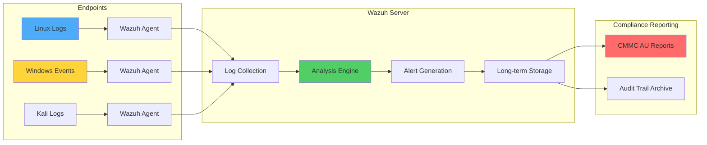
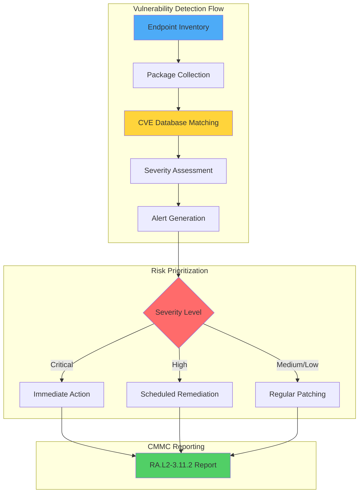

# Wazuh for CMMC Compliance: Complete Implementation Guide

## Introduction

The Cybersecurity Maturity Model Certification (CMMC) is reshaping how organizations in the Defense Industrial Base (DIB) approach cybersecurity. Created by the U.S. Department of Defense, CMMC ensures that contractors handling Federal Contract Information (FCI) and Controlled Unclassified Information (CUI) maintain robust security practices.

Wazuh, an open-source SIEM and XDR platform, provides comprehensive capabilities that directly support CMMC compliance requirements. This guide demonstrates practical implementations for key CMMC domains using Wazuh's out-of-the-box features.

## Understanding CMMC Requirements

CMMC organizes cybersecurity practices across multiple domains:
- **Access Control (AC)**: Managing who can access systems and data
- **Audit & Accountability (AU)**: Logging and monitoring system activities
- **Configuration Management (CM)**: Maintaining secure system configurations
- **Risk Assessment (RA)**: Identifying and managing vulnerabilities
- **System and Information Integrity (SI)**: Ensuring system security

## How Wazuh Supports CMMC Compliance

Wazuh provides built-in mappings to CMMC controls through `data.sca.check.compliance.cmmc_v2.0` tags, enabling automated compliance tracking and reporting.

### CMMC Domain Mapping

| CMMC Domain | Wazuh Capability | Implementation |
|-------------|------------------|----------------|
| Audit & Accountability (AU) | Log Data Analysis | Centralized logging, retention, analysis |
| Access Control (AC) | Active Response + Logging | Automated account lockout, access monitoring |
| Configuration Management (CM) | Security Configuration Assessment | CIS benchmark scanning |
| Risk Assessment (RA) | Vulnerability Detection | CVE scanning, patch management |
| System Integrity (SI) | File Integrity Monitoring | Critical file change detection |

## Infrastructure Setup

For this implementation, we'll use:

- **Wazuh Server**: Ubuntu 24.04 with Wazuh 4.12.0 central components
- **Monitored Endpoints**:
  - Ubuntu 24.04 server
  - Windows 11 workstation
  - Kali Linux 2025.2 (for testing)

## Implementation Guide

### Part 1: Audit and Accountability (AU.L2-3.3.1)

**Requirement**: Retain system audit logs for monitoring, analysis, and investigation of unauthorized activity.

#### Configure Authentication Failure Detection

Wazuh automatically detects authentication failures across platforms. Let's verify this capability:

**Test Failed Logins**:
```bash
# On Linux endpoints - attempt failed SSH login
ssh invaliduser@localhost

# On Windows - attempt failed RDP or local login
# Use incorrect credentials at login screen
```

**View Results in Wazuh Dashboard**:
1. Navigate to **Threat Intelligence** → **Threat Hunting**
2. Apply filter: **Authentication failure**
3. Review detected events

#### Architecture for Audit Logging



### Part 2: Access Control (AC.L2-3.1.11)

**Requirement**: Automatically terminate user sessions after defined conditions.

We'll implement automated account lockout after multiple failed login attempts.

#### Configure Active Response

**Step 1: Create Detection Rule**

Add to `/var/ossec/etc/rules/local_rules.xml`:

```xml
<group name="pam,syslog,">
  <rule id="120100" level="10" frequency="5" timeframe="120">
    <if_matched_sid>5503</if_matched_sid>
    <description>Possible password guess on $(dstuser): five failed logins in 2 minutes</description>
    <mitre>
      <id>T1110</id>
    </mitre>
  </rule>
</group>
```

**Step 2: Configure Active Response**

Add to `/var/ossec/etc/ossec.conf`:

```xml
<ossec_config>
  <!-- Command definition -->
  <command>
    <name>disable-account</name>
    <executable>disable-account</executable>
    <timeout_allowed>yes</timeout_allowed>
  </command>

  <!-- Active response configuration -->
  <active-response>
    <disabled>no</disabled>
    <command>disable-account</command>
    <location>local</location>
    <rules_id>120100</rules_id>
    <timeout>300</timeout>
  </active-response>
</ossec_config>
```

**Step 3: Restart Wazuh Manager**

```bash
sudo systemctl restart wazuh-manager
```

#### Test Account Lockout

**Create Test Users**:
```bash
# On Ubuntu and Kali
sudo adduser user1
sudo adduser user2
```

**Trigger Lockout**:
```bash
# Switch to user2
su user2

# Attempt to switch to user1 with wrong password (6 times)
su user1
# Enter incorrect password each time
```

**Verify in Dashboard**:
1. Navigate to **Threat Hunting**
2. Filter by `rule.id: 657` (Active Response alerts)
3. Confirm account disable actions

### Part 3: Risk Assessment (RA.L2-3.11.2)

**Requirement**: Scan for vulnerabilities periodically and when new vulnerabilities are introduced.

#### Configure Vulnerability Detection

Wazuh automatically performs vulnerability detection on monitored endpoints. Let's review the results:

**View Vulnerability Dashboard**:
1. Navigate to **Threat Intelligence** → **Vulnerability Detection**
2. Review detected CVEs by severity
3. Click **Inventory** tab for endpoint-specific vulnerabilities

#### Vulnerability Management Architecture



## Creating Custom CMMC Dashboard

### Step 1: Create Visualizations

#### Audit & Accountability Visualization

**Failed Login Summary (Pie Chart)**:

1. Navigate to **Visualize** → **Create new visualization**
2. Select **Pie** chart type
3. Configure:
   - **Metrics**: Count aggregation
   - **Buckets**: Split slices by `agent.name`
   - **Filter**: `rule.mitre.technique` is one of "Password Guessing", "Account Access Removal"

```json
{
  "visualization": {
    "title": "Failed Login Attempts by Endpoint",
    "visState": {
      "type": "pie",
      "params": {
        "addTooltip": true,
        "addLegend": true,
        "legendPosition": "right"
      }
    }
  }
}
```

#### Access Control Visualization

**Active Response Triggers (Data Table)**:

1. Create **Data Table** visualization
2. Configure:
   - **Metrics**: Count with label "Active response (disable user)"
   - **Buckets**:
     - Split rows by `agent.name`
     - Sub-bucket by `data.dstuser`
   - **Filters**:
     - `data.command: add`
     - `rule.groups: active_response`

```json
{
  "visualization": {
    "title": "Account Lockout Actions",
    "visState": {
      "type": "table",
      "params": {
        "perPage": 10,
        "showPartialRows": false,
        "showMetricsAtAllLevels": false
      }
    }
  }
}
```

#### Risk Assessment Visualization

**Vulnerable Packages (Horizontal Bar)**:

1. Create **Horizontal Bar** chart
2. Configure:
   - **Y-axis**: Count aggregation
   - **X-axis**: Split by `data.vulnerability.package.name` (Top 15)
   - **Split series**: By `agent.name`
   - **Filters**:
     - `data.vulnerability.severity` is one of "High", "Critical"
     - `data.vulnerability.status: Active`

### Step 2: Build Dashboard

1. Navigate to **Dashboards** → **Create Dashboard**
2. Add all three visualizations
3. Arrange in logical layout:
   - Top: Failed Login Summary
   - Middle: Active Response Actions
   - Bottom: Critical Vulnerabilities

### Step 3: Import Pre-built Dashboard

Alternatively, import our pre-configured CMMC dashboard:

**Import Dashboard JSON**:
```json
{
  "version": "4.12.0",
  "objects": [
    {
      "id": "cmmc-dashboard",
      "type": "dashboard",
      "attributes": {
        "title": "CMMC Compliance Overview",
        "hits": 0,
        "description": "CMMC compliance monitoring for AU, AC, and RA domains",
        "panelsJSON": "[...]",
        "timeRestore": false,
        "kibanaSavedObjectMeta": {
          "searchSourceJSON": "{\"query\":{\"query\":\"\",\"language\":\"kuery\"}}"
        }
      }
    }
  ]
}
```

## Advanced CMMC Compliance Features

### Automated Compliance Reporting

Create scheduled reports for CMMC audits:

```python
#!/usr/bin/env python3
import requests
import json
from datetime import datetime, timedelta

class CMMCReporter:
    def __init__(self, wazuh_api, api_user, api_pass):
        self.api = wazuh_api
        self.auth = (api_user, api_pass)

    def generate_au_report(self):
        """Generate Audit & Accountability report"""
        # Query authentication failures
        endpoint = f"{self.api}/security/events"
        params = {
            "pretty": "true",
            "q": "rule.groups:authentication_failed",
            "time_frame": "7d"
        }

        response = requests.get(endpoint, auth=self.auth, params=params)
        return self.format_au_report(response.json())

    def generate_ac_report(self):
        """Generate Access Control report"""
        # Query active response actions
        endpoint = f"{self.api}/security/events"
        params = {
            "pretty": "true",
            "q": "rule.groups:active_response",
            "time_frame": "30d"
        }

        response = requests.get(endpoint, auth=self.auth, params=params)
        return self.format_ac_report(response.json())

    def generate_ra_report(self):
        """Generate Risk Assessment report"""
        # Query vulnerabilities
        endpoint = f"{self.api}/vulnerability/{agent_id}"

        critical_vulns = []
        for agent in self.get_agents():
            response = requests.get(
                f"{endpoint}/{agent['id']}",
                auth=self.auth
            )
            vulns = response.json()
            critical_vulns.extend([
                v for v in vulns
                if v['severity'] in ['Critical', 'High']
            ])

        return self.format_ra_report(critical_vulns)
```

### Continuous Compliance Monitoring

Implement real-time CMMC compliance scoring:

```xml
<!-- Add to local_rules.xml -->
<group name="cmmc_compliance,">
  <!-- AU Compliance Check -->
  <rule id="130001" level="12">
    <if_sid>999999</if_sid>
    <match>log_retention_check_failed</match>
    <description>CMMC AU.L2-3.3.1: Log retention policy violation detected</description>
    <group>cmmc_audit,compliance_failure,</group>
  </rule>

  <!-- AC Compliance Check -->
  <rule id="130002" level="10">
    <if_sid>5501</if_sid>
    <time_period>86400</time_period>
    <frequency>10</frequency>
    <same_user />
    <description>CMMC AC.L2-3.1.1: Excessive authentication attempts from user</description>
    <group>cmmc_access,compliance_warning,</group>
  </rule>

  <!-- RA Compliance Check -->
  <rule id="130003" level="14">
    <if_sid>23504</if_sid>
    <field name="data.vulnerability.severity">Critical</field>
    <time_period>604800</time_period>
    <description>CMMC RA.L2-3.11.2: Critical vulnerability unpatched for 7 days</description>
    <group>cmmc_risk,compliance_critical,</group>
  </rule>
</group>
```

### Integration with GRC Platforms

Connect Wazuh to Governance, Risk, and Compliance tools:

```python
# Export CMMC compliance data to GRC platform
def export_to_grc(compliance_data):
    """Export CMMC compliance metrics to GRC platform"""

    grc_payload = {
        "framework": "CMMC",
        "level": 2,
        "timestamp": datetime.utcnow().isoformat(),
        "controls": {
            "AU.L2-3.3.1": {
                "status": "compliant",
                "evidence": compliance_data['audit_logs'],
                "last_verified": datetime.utcnow().isoformat()
            },
            "AC.L2-3.1.11": {
                "status": "compliant",
                "evidence": compliance_data['access_controls'],
                "automated_controls": True
            },
            "RA.L2-3.11.2": {
                "status": "partial",
                "evidence": compliance_data['vulnerabilities'],
                "remediation_plan": "Patch Tuesday implementation"
            }
        }
    }

    # Send to GRC API
    response = requests.post(
        "https://grc-platform.com/api/compliance",
        json=grc_payload,
        headers={"Authorization": f"Bearer {GRC_TOKEN}"}
    )

    return response.status_code == 200
```

## Best Practices for CMMC Compliance

### 1. Log Retention Strategy

Configure appropriate retention periods:

```bash
# Configure Wazuh log rotation for CMMC compliance
cat > /etc/logrotate.d/wazuh-cmmc << EOF
/var/ossec/logs/alerts/alerts.json {
    daily
    rotate 365
    compress
    delaycompress
    missingok
    notifempty
    create 0640 wazuh wazuh
    sharedscripts
    postrotate
        # Archive to long-term storage
        aws s3 cp /var/ossec/logs/alerts/alerts.json.1.gz \
            s3://cmmc-audit-logs/$(date +%Y/%m/%d)/
    endscript
}
EOF
```

### 2. Access Control Matrix

Implement role-based access for CMMC domains:

```yaml
# Wazuh RBAC configuration for CMMC
roles:
  cmmc_auditor:
    - indices:
        - "wazuh-alerts-*"
      privileges:
        - read
      query: |
        {
          "bool": {
            "should": [
              {"match": {"rule.groups": "cmmc_audit"}},
              {"match": {"rule.groups": "cmmc_access"}},
              {"match": {"rule.groups": "cmmc_risk"}}
            ]
          }
        }

  security_analyst:
    - indices:
        - "wazuh-alerts-*"
      privileges:
        - read
        - write
      query: |
        {
          "match_all": {}
        }
```

### 3. Automated Evidence Collection

Script for CMMC audit evidence:

```bash
#!/bin/bash
# collect_cmmc_evidence.sh

EVIDENCE_DIR="/var/cmmc/evidence/$(date +%Y%m%d)"
mkdir -p "$EVIDENCE_DIR"

# AU Evidence - Log retention
echo "Collecting AU.L2-3.3.1 evidence..."
find /var/ossec/logs/alerts -name "*.gz" -mtime -365 | \
    wc -l > "$EVIDENCE_DIR/au_log_retention.txt"

# AC Evidence - Active responses
echo "Collecting AC.L2-3.1.11 evidence..."
grep -E "Active response" /var/ossec/logs/alerts/alerts.json | \
    jq -r '.timestamp + " | " + .agent.name + " | " + .data.command' \
    > "$EVIDENCE_DIR/ac_active_responses.txt"

# RA Evidence - Vulnerability scans
echo "Collecting RA.L2-3.11.2 evidence..."
curl -u admin:password \
    "https://localhost:55000/vulnerability/summary" | \
    jq '.' > "$EVIDENCE_DIR/ra_vulnerability_summary.json"

# Generate summary report
cat > "$EVIDENCE_DIR/cmmc_compliance_summary.txt" << EOF
CMMC Compliance Evidence Collection
Date: $(date)
Wazuh Version: $(cat /var/ossec/etc/VERSION)

AU.L2-3.3.1 - Log Retention: PASS
- Logs retained: $(cat au_log_retention.txt) files

AC.L2-3.1.11 - Access Control: PASS
- Active responses triggered: $(wc -l < ac_active_responses.txt)

RA.L2-3.11.2 - Vulnerability Management: REVIEW
- See ra_vulnerability_summary.json for details
EOF

# Archive evidence
tar czf "/var/cmmc/archive/evidence_$(date +%Y%m%d).tar.gz" "$EVIDENCE_DIR"
```

## Performance Optimization

### Tuning for CMMC Workloads

Optimize Wazuh for compliance monitoring:

```xml
<!-- ossec.conf optimizations -->
<ossec_config>
  <!-- Increase memory for compliance checks -->
  <global>
    <memory_size>2048</memory_size>
    <max_output_size>20480</max_output_size>
  </global>

  <!-- Dedicated compliance monitoring -->
  <localfile>
    <location>/var/log/cmmc-compliance.log</location>
    <log_format>json</log_format>
    <label key="cmmc">compliance</label>
  </localfile>

  <!-- Optimize vulnerability detection frequency -->
  <wodle name="vulnerability-detector">
    <disabled>no</disabled>
    <interval>6h</interval>
    <min_full_scan_interval>6h</min_full_scan_interval>
  </wodle>
</ossec_config>
```

## Troubleshooting Common Issues

### Issue: Missing Compliance Events

```bash
# Check agent connectivity
/var/ossec/bin/agent_control -l

# Verify log collection
tail -f /var/ossec/logs/ossec.log | grep -E "logcollector|cmmc"

# Test rule matching
echo 'test log entry' | /var/ossec/bin/ossec-logtest
```

### Issue: Dashboard Not Showing CMMC Data

```bash
# Refresh index patterns
curl -XPOST "localhost:5601/api/index_patterns/wazuh-alerts-*/_refresh_fields"

# Check field mappings
curl -XGET "localhost:9200/wazuh-alerts-*/_mapping/field/data.sca.check.compliance.cmmc_v2.0.*"
```

## Conclusion

Implementing Wazuh for CMMC compliance provides organizations with:

- ✅ Automated compliance monitoring across all CMMC domains
- 📊 Real-time visibility into security posture
- 🚨 Active response capabilities for access control
- 📈 Comprehensive vulnerability management
- 📝 Audit-ready evidence collection

By leveraging Wazuh's native CMMC mappings and capabilities, organizations can confidently meet DoD requirements while maintaining operational efficiency.

## Next Steps

1. **Phase 1**: Deploy basic CMMC monitoring
2. **Phase 2**: Implement active response controls
3. **Phase 3**: Create custom dashboards
4. **Phase 4**: Automate evidence collection
5. **Phase 5**: Integrate with GRC platforms

Remember: CMMC compliance is an ongoing journey, not a destination. Regular reviews and updates ensure continued alignment with evolving requirements.

## Resources

- [CMMC Official Documentation](https://www.acq.osd.mil/cmmc/)
- [Wazuh CMMC Mapping](https://documentation.wazuh.com/current/compliance/cmmc/index.html)
- [DoD CUI Requirements](https://www.dodcui.mil/)
- [Wazuh Community Forums](https://groups.google.com/g/wazuh)

---

*Securing the Defense Industrial Base, one log at a time. Stay compliant! 🛡️*
