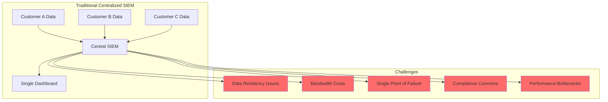
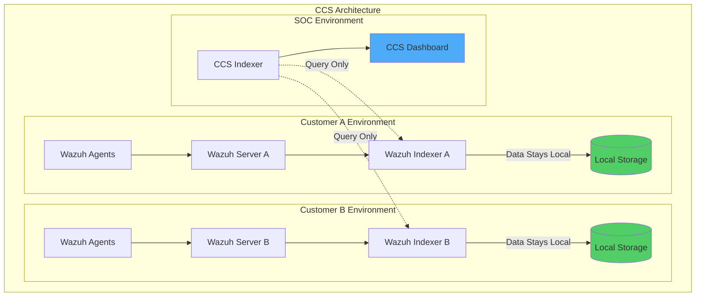
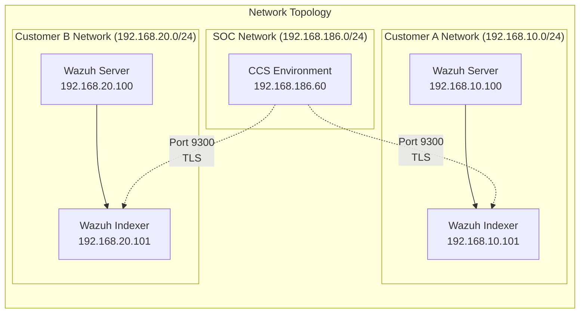
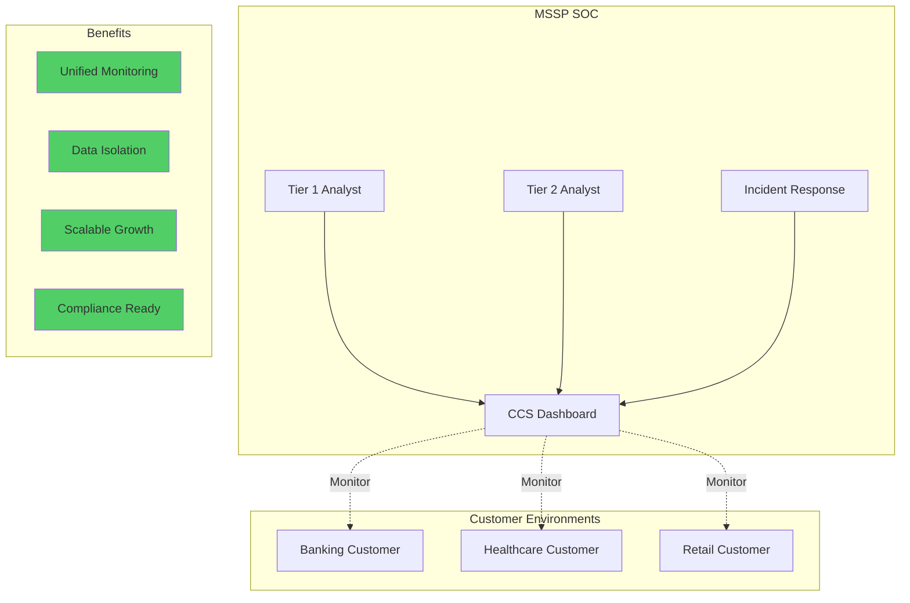

# Managing Multiple Wazuh Clusters with Cross-Cluster Search

## Introduction

Cross-Cluster Search (CCS) in Wazuh revolutionizes how organizations manage distributed security infrastructures. This capability allows security teams to query and view alerts from multiple remote Wazuh clusters through a single, centralized dashboard - all while maintaining data residency and sovereignty at each location.

For Managed Security Service Providers (MSSPs) and enterprises with distributed operations, CCS provides:
- 🌐 **Unified Visibility**: Single pane of glass across multiple clusters
- 🔒 **Data Sovereignty**: Logs remain within customer environments
- 🚀 **Scalable Architecture**: Add new clusters without data migration
- 🛡️ **Isolated Security**: Compromise of one cluster doesn't affect others
- 📊 **Centralized SOC Operations**: Remote monitoring without data replication

## Understanding the Challenge

### Traditional Approach Limitations



### Cross-Cluster Search Solution



## Real-World Scenario

### Problem Statement

A cybersecurity operations company providing managed SOC services needs to:
- Monitor multiple customer environments from a central location
- Keep each customer's data isolated and within their infrastructure
- Maintain strict access controls per customer
- Provide unified threat visibility across all customers

### Solution Architecture

We implement three distinct environments:

1. **CCS Environment (Central SOC)**
   - Wazuh indexer for cross-cluster queries
   - Wazuh dashboard for unified visualization
   - No local data storage - queries only

2. **Customer Clusters (A & B)**
   - Complete Wazuh deployment (server + indexer)
   - Local data retention
   - Trust relationship with CCS only

## Infrastructure Requirements

### Component Overview

| Environment | Component | Purpose | Specifications |
|------------|-----------|---------|----------------|
| **CCS** | Wazuh Indexer | Query coordinator | 8GB RAM, 4 CPUs |
| **CCS** | Wazuh Dashboard | Unified interface | Shared with indexer |
| **Cluster A** | Wazuh Server | Log collection/analysis | 8GB RAM, 4 CPUs |
| **Cluster A** | Wazuh Indexer | Alert storage | 16GB RAM, 4 CPUs |
| **Cluster B** | Wazuh Server | Log collection/analysis | 8GB RAM, 4 CPUs |
| **Cluster B** | Wazuh Indexer | Alert storage | 16GB RAM, 4 CPUs |

### Network Architecture



## Implementation Guide

### Phase 1: CCS Environment Setup

#### Generate Root CA and Certificates

```bash
# Download certificate generation tools
curl -sO https://packages.wazuh.com/4.8/wazuh-certs-tool.sh
curl -sO https://packages.wazuh.com/4.8/config.yml

# Configure CCS nodes
cat > config.yml << EOF
nodes:
  indexer:
    - name: ccs-wazuh-indexer-1
      ip: "192.168.186.60"
  dashboard:
    - name: ccs-wazuh-dashboard
      ip: "192.168.186.60"
EOF

# Generate certificates including root CA
bash ./wazuh-certs-tool.sh -A

# Package certificates
tar -cvf ./wazuh-certificates.tar -C ./wazuh-certificates/ .
```

#### Install CCS Wazuh Indexer

```bash
# Install dependencies and Wazuh repository
yum install -y coreutils
rpm --import https://packages.wazuh.com/key/GPG-KEY-WAZUH
echo -e '[wazuh]\ngpgcheck=1\ngpgkey=https://packages.wazuh.com/key/GPG-KEY-WAZUH\nenabled=1\nname=EL-$releasever - Wazuh\nbaseurl=https://packages.wazuh.com/4.x/yum/\nprotect=1' | tee /etc/yum.repos.d/wazuh.repo

# Install Wazuh indexer
yum -y install wazuh-indexer
```

Configure `/etc/wazuh-indexer/opensearch.yml`:

```yaml
network.host: "192.168.186.60"
node.name: "ccs-wazuh-indexer-1"
cluster.initial_master_nodes:
  - "ccs-wazuh-indexer-1"
cluster.name: "ccs-cluster"

# Security configuration
plugins.security.ssl.http.pemcert_filepath: /etc/wazuh-indexer/certs/indexer.pem
plugins.security.ssl.http.pemkey_filepath: /etc/wazuh-indexer/certs/indexer-key.pem
plugins.security.ssl.http.pemtrustedcas_filepath: /etc/wazuh-indexer/certs/root-ca.pem
plugins.security.ssl.transport.pemcert_filepath: /etc/wazuh-indexer/certs/indexer.pem
plugins.security.ssl.transport.pemkey_filepath: /etc/wazuh-indexer/certs/indexer-key.pem
plugins.security.ssl.transport.pemtrustedcas_filepath: /etc/wazuh-indexer/certs/root-ca.pem

# Trust configuration
plugins.security.authcz.admin_dn:
  - "CN=admin,OU=Wazuh,O=Wazuh,L=California,C=US"
plugins.security.nodes_dn:
  - "CN=ccs-wazuh-indexer-1,OU=Wazuh,O=Wazuh,L=California,C=US"
```

Deploy certificates and start service:

```bash
# Deploy certificates
NODE_NAME=ccs-wazuh-indexer-1
mkdir /etc/wazuh-indexer/certs
tar -xf ./wazuh-certificates.tar -C /etc/wazuh-indexer/certs/ \
    ./$NODE_NAME.pem ./$NODE_NAME-key.pem ./admin.pem ./admin-key.pem ./root-ca.pem
mv /etc/wazuh-indexer/certs/$NODE_NAME.pem /etc/wazuh-indexer/certs/indexer.pem
mv /etc/wazuh-indexer/certs/$NODE_NAME-key.pem /etc/wazuh-indexer/certs/indexer-key.pem
chmod 500 /etc/wazuh-indexer/certs
chmod 400 /etc/wazuh-indexer/certs/*
chown -R wazuh-indexer:wazuh-indexer /etc/wazuh-indexer/certs

# Start service
systemctl enable wazuh-indexer
systemctl start wazuh-indexer

# Initialize security
/usr/share/wazuh-indexer/bin/indexer-security-init.sh
```

#### Install CCS Wazuh Dashboard

```bash
# Install dependencies
yum install libcap

# Install Wazuh dashboard
yum -y install wazuh-dashboard
```

Configure `/etc/wazuh-dashboard/opensearch_dashboards.yml`:

```yaml
server.host: 0.0.0.0
server.port: 443
opensearch.hosts: "https://192.168.186.60:9200"
opensearch.ssl.verificationMode: certificate
```

Configure multi-cluster access in `/usr/share/wazuh-dashboard/data/wazuh/config/wazuh.yml`:

```yaml
hosts:
  - Cluster A:
      url: https://192.168.10.100
      port: 55000
      username: wazuh-wui
      password: wazuh-wui
      run_as: true
  - Cluster B:
      url: https://192.168.20.100
      port: 55000
      username: wazuh-wui
      password: wazuh-wui
      run_as: true
```

### Phase 2: Remote Cluster Setup (Customer A)

#### Generate Cluster Certificates Using Root CA

```bash
# Copy root CA from CCS environment
scp user@192.168.186.60:~/wazuh-certificates/root-ca.* .

# Create cluster A configuration
cat > config.yml << EOF
nodes:
  indexer:
    - name: ca-wazuh-indexer-1
      ip: "192.168.10.101"
  server:
    - name: ca-wazuh-server-1
      ip: "192.168.10.100"
EOF

# Generate certificates using existing root CA
bash ./wazuh-certs-tool.sh -A ./root-ca.pem ./root-ca.key
```

#### Configure Cluster A Indexer with CCS Trust

Edit `/etc/wazuh-indexer/opensearch.yml`:

```yaml
network.host: "192.168.10.101"
node.name: "ca-wazuh-indexer-1"
cluster.name: "ca-cluster"

# Critical: Add CCS indexer to trusted nodes
plugins.security.nodes_dn:
  - "CN=ca-wazuh-indexer-1,OU=Wazuh,O=Wazuh,L=California,C=US"
  - "CN=ccs-wazuh-indexer-1,OU=Wazuh,O=Wazuh,L=California,C=US"  # CCS trust
```

### Phase 3: Enable Cross-Cluster Search

Access the CCS Wazuh dashboard and configure remote clusters:

```json
PUT _cluster/settings
{
  "persistent": {
    "cluster.remote": {
      "ca-wazuh-indexer-1": {
        "seeds": ["192.168.10.101:9300"]
      },
      "cb-wazuh-indexer-1": {
        "seeds": ["192.168.20.101:9300"]
      }
    }
  }
}
```

Test connectivity:

```json
GET ca-wazuh-indexer-1:wazuh-alerts-*/_search
{
  "query": {
    "match_all": {}
  },
  "size": 1
}
```

### Phase 4: Configure Unified Index Patterns

#### Create CCS Alert Pattern

1. Navigate to **☰ > Dashboard management > Index patterns**
2. Create pattern: `*:wazuh-alerts-*`
3. Select `timestamp` as time field
4. Set as default in **App Settings**

#### Create CCS Vulnerability Pattern

1. Create pattern: `*:wazuh-states-vulnerabilities-*`
2. Select `package.installed` as time field
3. Configure in **App Settings > Vulnerabilities**

## Advanced Configuration

### Security Hardening

#### 1. Network Isolation

```bash
# Firewall rules for CCS indexer
firewall-cmd --permanent --add-rich-rule='
  rule family="ipv4"
  source address="192.168.10.101/32"
  port protocol="tcp" port="9300" accept'

firewall-cmd --permanent --add-rich-rule='
  rule family="ipv4"
  source address="192.168.20.101/32"
  port protocol="tcp" port="9300" accept'

firewall-cmd --reload
```

#### 2. Certificate Pinning

```yaml
# Enhanced security in opensearch.yml
plugins.security.ssl.transport.truststore_type: PKCS12
plugins.security.ssl.transport.truststore_filepath: /etc/wazuh-indexer/certs/truststore.p12
plugins.security.ssl.transport.truststore_password: ${TRUSTSTORE_PASSWORD}
plugins.security.ssl.transport.enforce_hostname_verification: true
```

### Performance Optimization

#### 1. Query Optimization

```json
# Limit CCS query scope
GET ca-wazuh-indexer-1:wazuh-alerts-*/_search
{
  "query": {
    "bool": {
      "filter": [
        {
          "range": {
            "timestamp": {
              "gte": "now-1h"
            }
          }
        },
        {
          "term": {
            "rule.level": {
              "value": 10
            }
          }
        }
      ]
    }
  },
  "size": 100,
  "_source": ["timestamp", "rule", "agent", "data"]
}
```

#### 2. Network Optimization

```yaml
# CCS connection pooling
cluster.remote.ca-wazuh-indexer-1:
  seeds: ["192.168.10.101:9300"]
  connections_per_cluster: 3
  socket_timeout: 60s
  ping_schedule: 30s
```

### Monitoring and Troubleshooting

#### Health Check Script

```bash
#!/bin/bash
# check_ccs_health.sh

echo "=== CCS Health Check ==="

# Check CCS indexer
echo -n "CCS Indexer: "
curl -s -k -u admin:admin https://192.168.186.60:9200/_cluster/health | \
  jq -r .status

# Check remote cluster connectivity
for cluster in "ca-wazuh-indexer-1" "cb-wazuh-indexer-1"; do
  echo -n "$cluster connectivity: "
  curl -s -k -u admin:admin \
    "https://192.168.186.60:9200/_remote/info" | \
    jq -r ".[\"$cluster\"].connected"
done

# Check index patterns
echo "Available indices:"
curl -s -k -u admin:admin \
  "https://192.168.186.60:9200/_cat/indices/*:wazuh-alerts-*?v"
```

#### Common Issues and Solutions

**Issue 1: Remote cluster not connected**

```bash
# Verify network connectivity
nc -zv 192.168.10.101 9300

# Check certificates
openssl s_client -connect 192.168.10.101:9300 -showcerts

# Review logs
tail -f /var/log/wazuh-indexer/wazuh-cluster.log
```

**Issue 2: Authentication failures**

```bash
# Verify DN in remote cluster
grep nodes_dn /etc/wazuh-indexer/opensearch.yml

# Test with admin certificate
curl -k --cert admin.pem --key admin-key.pem \
  https://192.168.10.101:9200/_cluster/health
```

## Best Practices

### 1. Certificate Management

```bash
# Automated certificate rotation script
#!/bin/bash
CERT_DIR="/etc/wazuh-indexer/certs"
DAYS_BEFORE_EXPIRY=30

# Check certificate expiration
for cert in $CERT_DIR/*.pem; do
  if openssl x509 -checkend $((DAYS_BEFORE_EXPIRY * 24 * 3600)) \
     -noout -in "$cert"; then
    echo "$cert is expiring soon"
    # Trigger certificate renewal process
  fi
done
```

### 2. Access Control Matrix

```yaml
# Role-based access per cluster
roles:
  cluster_a_analyst:
    cluster_permissions:
      - "cluster:monitor/remote/info"
    index_permissions:
      - index_patterns:
          - "ca-wazuh-indexer-1:wazuh-alerts-*"
        allowed_actions:
          - "read"
          - "search"

  cluster_b_analyst:
    cluster_permissions:
      - "cluster:monitor/remote/info"
    index_permissions:
      - index_patterns:
          - "cb-wazuh-indexer-1:wazuh-alerts-*"
        allowed_actions:
          - "read"
          - "search"
```

### 3. Monitoring Dashboard

Create visualizations for CCS operations:

```json
{
  "visualization": {
    "title": "Cross-Cluster Alert Distribution",
    "visState": {
      "type": "pie",
      "params": {
        "addTooltip": true,
        "addLegend": true,
        "legendPosition": "right"
      },
      "aggs": [
        {
          "id": "1",
          "type": "count",
          "schema": "metric"
        },
        {
          "id": "2",
          "type": "terms",
          "schema": "segment",
          "params": {
            "field": "_index",
            "size": 10,
            "order": "desc",
            "orderBy": "1"
          }
        }
      ]
    }
  }
}
```

## Use Cases and Benefits

### MSSP Operations



### Enterprise Multi-Region Deployment

```yaml
# Global CCS configuration
cluster.remote:
  us-east-cluster:
    seeds: ["10.0.1.100:9300"]
    skip_unavailable: true

  eu-west-cluster:
    seeds: ["10.1.1.100:9300"]
    skip_unavailable: true

  apac-cluster:
    seeds: ["10.2.1.100:9300"]
    skip_unavailable: true
```

## Scaling Considerations

### Adding New Clusters

```bash
# Automated cluster onboarding script
#!/bin/bash
CLUSTER_NAME=$1
CLUSTER_IP=$2

# Add to CCS configuration
curl -X PUT "https://192.168.186.60:9200/_cluster/settings" \
  -H "Content-Type: application/json" \
  -d '{
    "persistent": {
      "cluster.remote.'$CLUSTER_NAME'": {
        "seeds": ["'$CLUSTER_IP':9300"]
      }
    }
  }'

# Create index pattern
curl -X POST "https://192.168.186.60:5601/api/saved_objects/index-pattern" \
  -H "Content-Type: application/json" \
  -H "kbn-xsrf: true" \
  -d '{
    "attributes": {
      "title": "'$CLUSTER_NAME':wazuh-alerts-*",
      "timeFieldName": "timestamp"
    }
  }'
```

### Performance Metrics

Monitor CCS performance:

```json
GET _nodes/stats/transport
{
  "nodes": {
    "...": {
      "transport": {
        "remote": {
          "ca-wazuh-indexer-1": {
            "success_count": 15234,
            "failure_count": 2,
            "avg_response_time": "45ms"
          }
        }
      }
    }
  }
}
```

## Security Recommendations

### 1. Network Segmentation

- Use dedicated VLANs for CCS traffic
- Implement VPN tunnels for WAN connections
- Enable mTLS for all communications

### 2. Audit Trail

```json
# Enable CCS audit logging
PUT _cluster/settings
{
  "persistent": {
    "plugins.security.audit.type": "internal_opensearch",
    "plugins.security.audit.config.disabled_rest_categories": [],
    "plugins.security.audit.config.disabled_transport_categories": []
  }
}
```

### 3. Regular Security Reviews

- Monthly certificate rotation
- Quarterly access reviews
- Annual penetration testing

## Conclusion

Cross-Cluster Search transforms Wazuh into a powerful multi-tenant security platform, enabling:

- ✅ **Centralized monitoring** without data centralization
- 🏢 **Multi-organization support** with complete isolation
- 🌍 **Geographic distribution** with local data residency
- 📈 **Linear scalability** by adding clusters
- 🔐 **Enhanced security** through isolation

This architecture is ideal for MSSPs, large enterprises, and organizations with strict data residency requirements, providing the best of both worlds: unified visibility with distributed control.

## Key Takeaways

1. **Data Sovereignty**: Customer data never leaves their environment
2. **Scalable Architecture**: Add clusters without impacting existing ones
3. **Security First**: Each cluster maintains its own security boundary
4. **Operational Efficiency**: Single dashboard for multi-cluster operations
5. **Compliance Ready**: Meets data residency and isolation requirements

## Resources

- [Wazuh Cross-Cluster Search Documentation](https://documentation.wazuh.com/)
- [OpenSearch CCS Guide](https://opensearch.org/docs/latest/security/access-control/cross-cluster-search/)
- [Wazuh Certificate Management](https://documentation.wazuh.com/current/user-manual/certificates.html)
- [Network Security Best Practices](https://www.nist.gov/publications/)

---

*Unified security visibility across boundaries. Scale without limits! 🚀*
