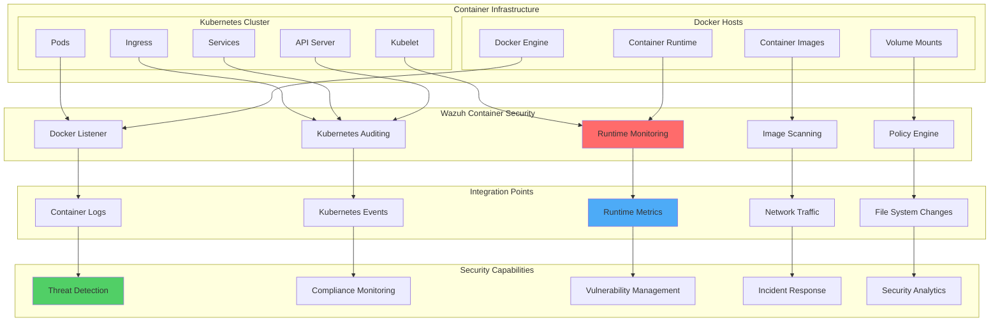

# Container Security Monitoring with Wazuh: Docker and Kubernetes Integration

## Introduction

Container technologies have revolutionized application deployment, but they also introduce unique security challenges. Traditional security monitoring approaches often fall short in containerized environments due to their ephemeral nature, shared resources, and complex orchestration layers.

Wazuh provides comprehensive container security monitoring by offering:

- 🐳 **Docker Runtime Monitoring**: Real-time container activity detection
- ⚙️ **Kubernetes Security Auditing**: Complete cluster security visibility
- 🛡️ **Runtime Threat Detection**: Dynamic threat identification and response  
- 📊 **Compliance Automation**: Automated security policy enforcement
- 🔍 **Vulnerability Assessment**: Continuous container image scanning
- ⚡ **Scalable Architecture**: Enterprise-ready container monitoring

## Container Security Architecture

### Comprehensive Monitoring Framework



### Security Monitoring Layers

| Layer | Component | Security Focus |
|-------|-----------|----------------|
| **Host** | Docker Engine, OS | Host-level security, daemon configuration |
| **Image** | Container Images | Vulnerability scanning, base image security |
| **Runtime** | Running Containers | Runtime behavior, resource usage |
| **Network** | Container Networking | Network segmentation, traffic monitoring |
| **Orchestration** | Kubernetes | API security, RBAC, cluster configuration |
| **Application** | Application Code | Application-level security events |

## Docker Security Integration

### Phase 1: Docker Host Preparation

#### Install and Configure Docker with Security Features

```bash
#!/bin/bash
# Docker Security Hardening Script for Wazuh Integration

set -euo pipefail

DOCKER_VERSION="24.0.7"
DOCKER_COMPOSE_VERSION="2.21.0"

# Function to log messages
log_message() {
    echo "[$(date '+%Y-%m-%d %H:%M:%S')] $1"
}

# Install Docker with security configurations
install_docker_security() {
    log_message "Installing Docker with security hardening..."
    
    # Remove old Docker versions
    sudo apt-get remove -y docker docker-engine docker.io containerd runc 2>/dev/null || true
    
    # Install prerequisites
    sudo apt-get update
    sudo apt-get install -y \
        apt-transport-https \
        ca-certificates \
        curl \
        gnupg \
        lsb-release \
        apparmor-utils \
        auditd
    
    # Add Docker GPG key and repository
    curl -fsSL https://download.docker.com/linux/ubuntu/gpg | sudo gpg --dearmor -o /usr/share/keyrings/docker-archive-keyring.gpg
    echo "deb [arch=$(dpkg --print-architecture) signed-by=/usr/share/keyrings/docker-archive-keyring.gpg] https://download.docker.com/linux/ubuntu $(lsb_release -cs) stable" | sudo tee /etc/apt/sources.list.d/docker.list > /dev/null
    
    # Install Docker
    sudo apt-get update
    sudo apt-get install -y docker-ce docker-ce-cli containerd.io docker-buildx-plugin docker-compose-plugin
    
    log_message "Docker installed successfully"
}

# Configure Docker daemon with security settings
configure_docker_security() {
    log_message "Configuring Docker daemon security settings..."
    
    # Create Docker daemon configuration
    sudo mkdir -p /etc/docker
    
    cat <<EOF | sudo tee /etc/docker/daemon.json
{
  "log-driver": "json-file",
  "log-opts": {
    "max-size": "10m",
    "max-file": "3"
  },
  "storage-driver": "overlay2",
  "exec-opts": ["native.cgroupdriver=systemd"],
  "live-restore": true,
  "userland-proxy": false,
  "no-new-privileges": true,
  "seccomp-profile": "/etc/docker/seccomp.json",
  "apparmor-profile": "docker-default",
  "selinux-enabled": false,
  "icc": false,
  "disable-legacy-registry": true,
  "default-ulimits": {
    "nofile": {
      "name": "nofile",
      "hard": 64000,
      "soft": 64000
    }
  },
  "audit-logs": true,
  "experimental": false,
  "metrics-addr": "127.0.0.1:9323",
  "hosts": ["fd://", "tcp://127.0.0.1:2376"],
  "tls": true,
  "tlscert": "/etc/docker/certs/server-cert.pem",
  "tlskey": "/etc/docker/certs/server-key.pem",
  "tlsverify": true,
  "tlscacert": "/etc/docker/certs/ca.pem"
}
EOF

    # Create custom seccomp profile
    cat <<EOF | sudo tee /etc/docker/seccomp.json
{
  "defaultAction": "SCMP_ACT_ERRNO",
  "archMap": [
    {
      "architecture": "SCMP_ARCH_X86_64",
      "subArchitectures": [
        "SCMP_ARCH_X86",
        "SCMP_ARCH_X32"
      ]
    }
  ],
  "syscalls": [
    {
      "names": [
        "accept",
        "accept4",
        "access",
        "alarm",
        "bind",
        "brk",
        "capget",
        "capset",
        "chdir",
        "chmod",
        "chown",
        "chroot",
        "clock_getres",
        "clock_gettime",
        "clock_nanosleep",
        "close",
        "connect",
        "dup",
        "dup2",
        "dup3",
        "epoll_create",
        "epoll_create1",
        "epoll_ctl",
        "epoll_wait",
        "eventfd",
        "eventfd2",
        "execve",
        "exit",
        "exit_group",
        "fcntl",
        "fchmod",
        "fchown",
        "fstat",
        "fsync",
        "futex",
        "getcwd",
        "getdents",
        "getpid",
        "getppid",
        "getrlimit",
        "getsockname",
        "getsockopt",
        "getuid",
        "listen",
        "lseek",
        "madvise",
        "mkdir",
        "mlock",
        "mmap",
        "mount",
        "mprotect",
        "mremap",
        "munmap",
        "nanosleep",
        "open",
        "openat",
        "pipe",
        "pipe2",
        "poll",
        "ppoll",
        "prctl",
        "read",
        "readlink",
        "recv",
        "recvfrom",
        "recvmsg",
        "rename",
        "rmdir",
        "select",
        "send",
        "sendmsg",
        "sendto",
        "setgid",
        "setgroups",
        "setrlimit",
        "setsid",
        "setsockopt",
        "setuid",
        "shutdown",
        "sigaltstack",
        "socket",
        "socketpair",
        "stat",
        "statfs",
        "symlink",
        "sysinfo",
        "tgkill",
        "time",
        "tkill",
        "umask",
        "unlink",
        "unlinkat",
        "wait4",
        "waitpid",
        "write"
      ],
      "action": "SCMP_ACT_ALLOW"
    }
  ]
}
EOF

    log_message "Docker daemon security configuration completed"
}

# Configure Docker TLS certificates
setup_docker_tls() {
    log_message "Setting up Docker TLS certificates..."
    
    sudo mkdir -p /etc/docker/certs
    
    # Generate CA private key
    sudo openssl genrsa -out /etc/docker/certs/ca-key.pem 4096
    
    # Generate CA certificate
    sudo openssl req -new -x509 -days 365 -key /etc/docker/certs/ca-key.pem -sha256 -out /etc/docker/certs/ca.pem -subj "/C=US/ST=CA/L=San Francisco/O=Docker/CN=Docker CA"
    
    # Generate server private key
    sudo openssl genrsa -out /etc/docker/certs/server-key.pem 4096
    
    # Generate server certificate signing request
    sudo openssl req -subj "/C=US/ST=CA/L=San Francisco/O=Docker/CN=docker-host" -sha256 -new -key /etc/docker/certs/server-key.pem -out /etc/docker/certs/server.csr
    
    # Generate server certificate
    echo "subjectAltName = DNS:docker-host,IP:127.0.0.1,IP:$(hostname -I | awk '{print $1}')" | sudo tee /etc/docker/certs/extfile.cnf
    echo "extendedKeyUsage = serverAuth" | sudo tee -a /etc/docker/certs/extfile.cnf
    
    sudo openssl x509 -req -days 365 -sha256 -in /etc/docker/certs/server.csr -CA /etc/docker/certs/ca.pem -CAkey /etc/docker/certs/ca-key.pem -out /etc/docker/certs/server-cert.pem -extfile /etc/docker/certs/extfile.cnf -CAcreateserial
    
    # Set proper permissions
    sudo chmod 400 /etc/docker/certs/ca-key.pem /etc/docker/certs/server-key.pem
    sudo chmod 444 /etc/docker/certs/ca.pem /etc/docker/certs/server-cert.pem
    
    log_message "Docker TLS certificates configured"
}

# Configure audit logging for Docker
setup_docker_audit() {
    log_message "Setting up Docker audit logging..."
    
    # Create audit rules for Docker
    cat <<EOF | sudo tee /etc/audit/rules.d/docker.rules
# Docker daemon
-w /usr/bin/docker -p wa -k docker
-w /usr/bin/dockerd -p wa -k docker
-w /usr/bin/docker-containerd -p wa -k docker
-w /usr/bin/docker-runc -p wa -k docker

# Docker configuration files
-w /etc/docker -p wa -k docker
-w /etc/default/docker -p wa -k docker
-w /etc/sysconfig/docker -p wa -k docker
-w /etc/systemd/system/docker.service.d -p wa -k docker
-w /usr/lib/systemd/system/docker.service -p wa -k docker
-w /usr/lib/systemd/system/docker.socket -p wa -k docker

# Docker runtime
-w /var/lib/docker -p wa -k docker
-w /var/run/docker.sock -p wa -k docker
-w /var/run/docker -p wa -k docker

# Container runtime
-a always,exit -F arch=b64 -S clone -F a0&0x7C00000 -k container_create
-a always,exit -F arch=b32 -S clone -F a0&0x7C00000 -k container_create
EOF

    # Restart auditd
    sudo systemctl restart auditd
    
    log_message "Docker audit logging configured"
}

# Configure Docker for Wazuh monitoring
configure_wazuh_docker_monitoring() {
    log_message "Configuring Docker for Wazuh monitoring..."
    
    # Create Docker monitoring configuration
    cat <<EOF | sudo tee /etc/docker/wazuh-monitor.json
{
  "docker_monitoring": {
    "enabled": true,
    "events": [
      "container:create",
      "container:start",
      "container:stop",
      "container:destroy",
      "container:die",
      "container:kill",
      "container:pause",
      "container:unpause",
      "container:attach",
      "container:detach",
      "container:copy",
      "container:export",
      "container:health_status",
      "container:oom",
      "container:update",
      "image:pull",
      "image:push",
      "image:delete",
      "image:build",
      "network:create",
      "network:destroy",
      "network:connect",
      "network:disconnect",
      "volume:create",
      "volume:destroy",
      "volume:mount",
      "volume:unmount"
    ],
    "resource_monitoring": {
      "cpu_threshold": 80,
      "memory_threshold": 90,
      "disk_threshold": 85,
      "network_threshold": 100
    },
    "security_scanning": {
      "vulnerability_scan": true,
      "secret_scan": true,
      "compliance_check": true
    }
  }
}
EOF

    log_message "Wazuh Docker monitoring configuration created"
}

# Main execution
main() {
    log_message "Starting Docker security setup for Wazuh integration..."
    
    # Check if running as root
    if [[ $EUID -ne 0 ]]; then
        echo "This script must be run as root or with sudo"
        exit 1
    fi
    
    install_docker_security
    configure_docker_security
    setup_docker_tls
    setup_docker_audit
    configure_wazuh_docker_monitoring
    
    # Start and enable Docker
    sudo systemctl daemon-reload
    sudo systemctl start docker
    sudo systemctl enable docker
    
    # Verify installation
    docker --version
    docker info
    
    log_message "Docker security setup completed successfully!"
    log_message "Please restart the system to ensure all security settings take effect."
}

# Execute main function
main "$@"
```

### Phase 2: Wazuh Agent Configuration for Docker

Configure the Wazuh agent to monitor Docker events:

```xml
<!-- Enhanced Wazuh Agent Configuration for Docker Monitoring -->
<ossec_config>
  
  <!-- Docker Daemon Monitoring -->
  <localfile>
    <log_format>json</log_format>
    <location>/var/lib/docker/containers/*/*-json.log</location>
  </localfile>
  
  <!-- Docker Events Monitoring -->
  <localfile>
    <log_format>command</log_format>
    <command>docker events --format "{{json .}}" --since 1m</command>
    <frequency>60</frequency>
  </localfile>
  
  <!-- Docker System Information -->
  <localfile>
    <log_format>command</log_format>
    <command>docker system info --format "{{json .}}"</command>
    <frequency>300</frequency>
  </localfile>
  
  <!-- Container Resource Usage -->
  <localfile>
    <log_format>command</log_format>
    <command>docker stats --no-stream --format "table {{.Container}}\t{{.Name}}\t{{.CPUPerc}}\t{{.MemUsage}}\t{{.NetIO}}\t{{.BlockIO}}\t{{.PIDs}}"</command>
    <frequency>120</frequency>
  </localfile>
  
  <!-- Docker Security Scanning -->
  <localfile>
    <log_format>command</log_format>
    <command>/var/ossec/bin/docker-security-scan.sh</command>
    <frequency>3600</frequency>
  </localfile>
  
  <!-- Monitor Docker configuration files -->
  <syscheck>
    <directories>/etc/docker</directories>
    <directories>/etc/default/docker</directories>
    <directories>/etc/systemd/system/docker.service.d</directories>
    <directories>/usr/lib/systemd/system/docker.service</directories>
    <directories>/var/lib/docker/containers</directories>
  </syscheck>
  
  <!-- Active Response for Docker -->
  <active-response>
    <command>docker-quarantine</command>
    <location>local</location>
    <level>12</level>
    <rules_group>docker_malware,docker_intrusion</rules_group>
    <timeout>3600</timeout>
  </active-response>
  
  <!-- Docker-specific wodle for enhanced monitoring -->
  <wodle name="docker-listener">
    <disabled>no</disabled>
    <interval>10s</interval>
    <run_on_start>yes</run_on_start>
    <skip_on_error>yes</skip_on_error>
    
    <!-- Attempts to connect to the Docker socket -->
    <socket>/var/run/docker.sock</socket>
    
    <!-- Docker API version -->
    <api_version>auto</api_version>
    
    <!-- Number of retries to connect to Docker -->
    <retries>5</retries>
    
    <!-- Time between retries (seconds) -->
    <retry_interval>10</retry_interval>
  </wodle>

</ossec_config>
```

### Phase 3: Docker Security Monitoring Scripts

Create comprehensive security monitoring scripts:

```bash
#!/bin/bash
# Docker Security Scanning Script for Wazuh Integration

SCRIPT_DIR="/var/ossec/bin"
LOG_FILE="/var/log/docker-security-scan.log"
TEMP_DIR="/tmp/docker-security-$$"

# Create temporary directory
mkdir -p "$TEMP_DIR"

# Logging function
log_security_event() {
    local level=$1
    local message=$2
    local timestamp=$(date '+%Y-%m-%d %H:%M:%S')
    
    echo "[$timestamp] [$level] $message" | tee -a "$LOG_FILE"
}

# Container security scanning function
scan_container_security() {
    local container_id=$1
    local container_name=$2
    local image_name=$3
    
    log_security_event "INFO" "Scanning container: $container_name ($container_id)"
    
    # Check if container is running as root
    local container_user=$(docker inspect "$container_id" --format '{{.Config.User}}')
    if [[ -z "$container_user" || "$container_user" == "root" || "$container_user" == "0" ]]; then
        log_security_event "WARNING" "Container $container_name running as root user"
        echo "{\"timestamp\":\"$(date -Iseconds)\",\"container_id\":\"$container_id\",\"container_name\":\"$container_name\",\"image\":\"$image_name\",\"security_issue\":\"root_user\",\"severity\":\"medium\",\"description\":\"Container running with root privileges\"}"
    fi
    
    # Check for privileged containers
    local privileged=$(docker inspect "$container_id" --format '{{.HostConfig.Privileged}}')
    if [[ "$privileged" == "true" ]]; then
        log_security_event "CRITICAL" "Privileged container detected: $container_name"
        echo "{\"timestamp\":\"$(date -Iseconds)\",\"container_id\":\"$container_id\",\"container_name\":\"$container_name\",\"image\":\"$image_name\",\"security_issue\":\"privileged_container\",\"severity\":\"high\",\"description\":\"Container running in privileged mode\"}"
    fi
    
    # Check for host network mode
    local network_mode=$(docker inspect "$container_id" --format '{{.HostConfig.NetworkMode}}')
    if [[ "$network_mode" == "host" ]]; then
        log_security_event "WARNING" "Container using host network: $container_name"
        echo "{\"timestamp\":\"$(date -Iseconds)\",\"container_id\":\"$container_id\",\"container_name\":\"$container_name\",\"image\":\"$image_name\",\"security_issue\":\"host_network\",\"severity\":\"medium\",\"description\":\"Container using host network mode\"}"
    fi
    
    # Check for volume mounts
    local mounts=$(docker inspect "$container_id" --format '{{range .Mounts}}{{.Type}}:{{.Source}}:{{.Destination}} {{end}}')
    if echo "$mounts" | grep -q "/:/"; then
        log_security_event "CRITICAL" "Root filesystem mounted in container: $container_name"
        echo "{\"timestamp\":\"$(date -Iseconds)\",\"container_id\":\"$container_id\",\"container_name\":\"$container_name\",\"image\":\"$image_name\",\"security_issue\":\"root_mount\",\"severity\":\"critical\",\"description\":\"Root filesystem mounted in container\"}"
    fi
    
    # Check for sensitive file mounts
    sensitive_paths=(
        "/etc/passwd"
        "/etc/shadow"
        "/etc/group"
        "/root"
        "/home"
        "/var/run/docker.sock"
        "/proc"
        "/sys"
    )
    
    for sensitive_path in "${sensitive_paths[@]}"; do
        if echo "$mounts" | grep -q "$sensitive_path"; then
            log_security_event "HIGH" "Sensitive path mounted in container: $container_name - $sensitive_path"
            echo "{\"timestamp\":\"$(date -Iseconds)\",\"container_id\":\"$container_id\",\"container_name\":\"$container_name\",\"image\":\"$image_name\",\"security_issue\":\"sensitive_mount\",\"severity\":\"high\",\"description\":\"Sensitive path $sensitive_path mounted in container\"}"
        fi
    done
    
    # Check container capabilities
    local capabilities=$(docker inspect "$container_id" --format '{{range .HostConfig.CapAdd}}{{.}} {{end}}')
    dangerous_capabilities=("SYS_ADMIN" "NET_ADMIN" "SYS_PTRACE" "SYS_MODULE" "DAC_OVERRIDE")
    
    for cap in $capabilities; do
        if [[ " ${dangerous_capabilities[@]} " =~ " ${cap} " ]]; then
            log_security_event "HIGH" "Dangerous capability added to container: $container_name - $cap"
            echo "{\"timestamp\":\"$(date -Iseconds)\",\"container_id\":\"$container_id\",\"container_name\":\"$container_name\",\"image\":\"$image_name\",\"security_issue\":\"dangerous_capability\",\"severity\":\"high\",\"description\":\"Dangerous capability $cap added to container\"}"
        fi
    done
    
    # Check for resource limits
    local memory_limit=$(docker inspect "$container_id" --format '{{.HostConfig.Memory}}')
    local cpu_limit=$(docker inspect "$container_id" --format '{{.HostConfig.CpuShares}}')
    
    if [[ "$memory_limit" == "0" ]]; then
        log_security_event "WARNING" "Container without memory limit: $container_name"
        echo "{\"timestamp\":\"$(date -Iseconds)\",\"container_id\":\"$container_id\",\"container_name\":\"$container_name\",\"image\":\"$image_name\",\"security_issue\":\"no_memory_limit\",\"severity\":\"low\",\"description\":\"Container running without memory limit\"}"
    fi
    
    # Check for secrets in environment variables
    local env_vars=$(docker inspect "$container_id" --format '{{range .Config.Env}}{{.}} {{end}}')
    secret_patterns=("PASSWORD" "SECRET" "KEY" "TOKEN" "API" "CREDENTIAL")
    
    for pattern in "${secret_patterns[@]}"; do
        if echo "$env_vars" | grep -qi "$pattern"; then
            log_security_event "HIGH" "Potential secret in environment variables: $container_name"
            echo "{\"timestamp\":\"$(date -Iseconds)\",\"container_id\":\"$container_id\",\"container_name\":\"$container_name\",\"image\":\"$image_name\",\"security_issue\":\"secret_in_env\",\"severity\":\"high\",\"description\":\"Potential secret detected in environment variables\"}"
            break
        fi
    done
}

# Image vulnerability scanning
scan_image_vulnerabilities() {
    local image_name=$1
    
    log_security_event "INFO" "Scanning image vulnerabilities: $image_name"
    
    # Use Trivy for vulnerability scanning if available
    if command -v trivy &> /dev/null; then
        local trivy_output="$TEMP_DIR/trivy_scan.json"
        trivy image --format json --output "$trivy_output" "$image_name" 2>/dev/null
        
        if [[ -f "$trivy_output" ]]; then
            local critical_vulns=$(jq '.Results[]?.Vulnerabilities[]? | select(.Severity=="CRITICAL") | length' "$trivy_output" 2>/dev/null | head -1)
            local high_vulns=$(jq '.Results[]?.Vulnerabilities[]? | select(.Severity=="HIGH") | length' "$trivy_output" 2>/dev/null | head -1)
            
            if [[ "$critical_vulns" -gt 0 ]]; then
                log_security_event "CRITICAL" "Critical vulnerabilities found in image: $image_name ($critical_vulns critical)"
                echo "{\"timestamp\":\"$(date -Iseconds)\",\"image\":\"$image_name\",\"security_issue\":\"critical_vulnerabilities\",\"severity\":\"critical\",\"count\":$critical_vulns,\"description\":\"Critical vulnerabilities detected in container image\"}"
            fi
            
            if [[ "$high_vulns" -gt 0 ]]; then
                log_security_event "HIGH" "High severity vulnerabilities found in image: $image_name ($high_vulns high)"
                echo "{\"timestamp\":\"$(date -Iseconds)\",\"image\":\"$image_name\",\"security_issue\":\"high_vulnerabilities\",\"severity\":\"high\",\"count\":$high_vulns,\"description\":\"High severity vulnerabilities detected in container image\"}"
            fi
        fi
    fi
    
    # Check for base image security
    local dockerfile_path=$(docker inspect "$image_name" --format '{{range .Config.Labels}}{{if eq .Key "dockerfile.path"}}{{.Value}}{{end}}{{end}}' 2>/dev/null)
    if [[ -n "$dockerfile_path" && -f "$dockerfile_path" ]]; then
        # Check for insecure base images
        if grep -qi "FROM.*:latest" "$dockerfile_path"; then
            log_security_event "WARNING" "Image uses latest tag: $image_name"
            echo "{\"timestamp\":\"$(date -Iseconds)\",\"image\":\"$image_name\",\"security_issue\":\"latest_tag\",\"severity\":\"medium\",\"description\":\"Image uses latest tag which may introduce unpredictable changes\"}"
        fi
        
        # Check for running as root in Dockerfile
        if ! grep -qi "USER" "$dockerfile_path"; then
            log_security_event "WARNING" "No non-root user specified in Dockerfile: $image_name"
            echo "{\"timestamp\":\"$(date -Iseconds)\",\"image\":\"$image_name\",\"security_issue\":\"no_user_specified\",\"severity\":\"medium\",\"description\":\"Dockerfile does not specify non-root user\"}"
        fi
    fi
}

# Network security scanning
scan_network_security() {
    local container_id=$1
    local container_name=$2
    
    log_security_event "INFO" "Scanning network security for container: $container_name"
    
    # Check for exposed ports
    local ports=$(docker port "$container_id" 2>/dev/null)
    if [[ -n "$ports" ]]; then
        while IFS= read -r port_mapping; do
            if echo "$port_mapping" | grep -q "0.0.0.0"; then
                local port=$(echo "$port_mapping" | cut -d':' -f2 | cut -d'-' -f1)
                log_security_event "WARNING" "Container exposing port to all interfaces: $container_name - $port"
                echo "{\"timestamp\":\"$(date -Iseconds)\",\"container_id\":\"$container_id\",\"container_name\":\"$container_name\",\"security_issue\":\"port_exposure\",\"severity\":\"medium\",\"port\":\"$port\",\"description\":\"Container port exposed to all network interfaces\"}"
            fi
        done <<< "$ports"
    fi
    
    # Check network connections
    local network_info=$(docker inspect "$container_id" --format '{{range $key, $value := .NetworkSettings.Networks}}{{$key}}: {{$value.IPAddress}} {{end}}')
    if echo "$network_info" | grep -q "bridge:"; then
        local bridge_ip=$(echo "$network_info" | grep "bridge:" | cut -d' ' -f2)
        if [[ "$bridge_ip" =~ ^172\.(1[6-9]|2[0-9]|3[0-1])\. ]]; then
            log_security_event "INFO" "Container using default Docker bridge network: $container_name"
        fi
    fi
}

# Main scanning function
run_security_scan() {
    log_security_event "INFO" "Starting Docker security scan"
    
    # Get all running containers
    local containers=$(docker ps --format "{{.ID}}\t{{.Names}}\t{{.Image}}")
    
    while IFS=$'\t' read -r container_id container_name image_name; do
        [[ -n "$container_id" ]] || continue
        
        scan_container_security "$container_id" "$container_name" "$image_name"
        scan_network_security "$container_id" "$container_name"
    done <<< "$containers"
    
    # Get unique images for vulnerability scanning
    local unique_images=$(docker ps --format "{{.Image}}" | sort | uniq)
    
    while IFS= read -r image_name; do
        [[ -n "$image_name" ]] || continue
        scan_image_vulnerabilities "$image_name"
    done <<< "$unique_images"
    
    log_security_event "INFO" "Docker security scan completed"
}

# Docker daemon configuration check
check_docker_daemon_security() {
    log_security_event "INFO" "Checking Docker daemon security configuration"
    
    # Check if Docker daemon is running with TLS
    if ! docker info 2>/dev/null | grep -q "Server:"; then
        log_security_event "ERROR" "Cannot connect to Docker daemon"
        echo "{\"timestamp\":\"$(date -Iseconds)\",\"security_issue\":\"docker_daemon_unreachable\",\"severity\":\"critical\",\"description\":\"Cannot connect to Docker daemon\"}"
        return 1
    fi
    
    # Check Docker daemon configuration
    local daemon_config="/etc/docker/daemon.json"
    if [[ -f "$daemon_config" ]]; then
        # Check for security-relevant configurations
        if ! jq -r '.["live-restore"]' "$daemon_config" 2>/dev/null | grep -q "true"; then
            log_security_event "WARNING" "Docker daemon live-restore not enabled"
            echo "{\"timestamp\":\"$(date -Iseconds)\",\"security_issue\":\"live_restore_disabled\",\"severity\":\"low\",\"description\":\"Docker daemon live-restore feature is not enabled\"}"
        fi
        
        if ! jq -r '.["userland-proxy"]' "$daemon_config" 2>/dev/null | grep -q "false"; then
            log_security_event "WARNING" "Docker userland-proxy not disabled"
            echo "{\"timestamp\":\"$(date -Iseconds)\",\"security_issue\":\"userland_proxy_enabled\",\"severity\":\"medium\",\"description\":\"Docker userland-proxy should be disabled for better security\"}"
        fi
        
        if ! jq -r '.icc' "$daemon_config" 2>/dev/null | grep -q "false"; then
            log_security_event "WARNING" "Inter-container communication not disabled"
            echo "{\"timestamp\":\"$(date -Iseconds)\",\"security_issue\":\"icc_enabled\",\"severity\":\"medium\",\"description\":\"Inter-container communication should be disabled by default\"}"
        fi
    else
        log_security_event "WARNING" "Docker daemon configuration file not found"
        echo "{\"timestamp\":\"$(date -Iseconds)\",\"security_issue\":\"no_daemon_config\",\"severity\":\"medium\",\"description\":\"Docker daemon configuration file not found\"}"
    fi
}

# Runtime behavior analysis
analyze_runtime_behavior() {
    log_security_event "INFO" "Analyzing container runtime behavior"
    
    # Check for containers with unusual resource usage
    local stats_output="$TEMP_DIR/docker_stats.txt"
    timeout 10s docker stats --no-stream --format "table {{.Container}}\t{{.Name}}\t{{.CPUPerc}}\t{{.MemUsage}}\t{{.NetIO}}\t{{.BlockIO}}" > "$stats_output" 2>/dev/null
    
    if [[ -f "$stats_output" ]]; then
        while IFS=$'\t' read -r container_id container_name cpu_perc mem_usage net_io block_io; do
            [[ "$container_id" != "CONTAINER" ]] || continue
            [[ -n "$container_id" ]] || continue
            
            # Parse CPU percentage
            cpu_value=$(echo "$cpu_perc" | sed 's/%//' | cut -d'.' -f1)
            if [[ "$cpu_value" -gt 80 ]]; then
                log_security_event "WARNING" "High CPU usage detected: $container_name ($cpu_perc)"
                echo "{\"timestamp\":\"$(date -Iseconds)\",\"container_id\":\"$container_id\",\"container_name\":\"$container_name\",\"security_issue\":\"high_cpu_usage\",\"severity\":\"medium\",\"cpu_percent\":\"$cpu_perc\",\"description\":\"Container showing unusually high CPU usage\"}"
            fi
            
            # Parse memory usage (simplified check)
            if echo "$mem_usage" | grep -qE '[0-9]+\.?[0-9]*GiB.*[89][0-9]%|[0-9]+\.?[0-9]*GiB.*100%'; then
                log_security_event "WARNING" "High memory usage detected: $container_name ($mem_usage)"
                echo "{\"timestamp\":\"$(date -Iseconds)\",\"container_id\":\"$container_id\",\"container_name\":\"$container_name\",\"security_issue\":\"high_memory_usage\",\"severity\":\"medium\",\"memory_usage\":\"$mem_usage\",\"description\":\"Container showing unusually high memory usage\"}"
            fi
            
        done < "$stats_output"
    fi
}

# Main execution
main() {
    # Ensure we have the necessary tools
    if ! command -v docker &> /dev/null; then
        log_security_event "ERROR" "Docker is not installed or not in PATH"
        exit 1
    fi
    
    if ! command -v jq &> /dev/null; then
        log_security_event "WARNING" "jq is not installed - some checks will be skipped"
    fi
    
    # Run security checks
    check_docker_daemon_security
    run_security_scan
    analyze_runtime_behavior
    
    # Cleanup
    rm -rf "$TEMP_DIR"
    
    log_security_event "INFO" "Docker security monitoring cycle completed"
}

# Execute main function
main "$@"
```

### Phase 4: Docker Security Rules

Create comprehensive Docker security rules for Wazuh:

```xml
<group name="docker,container,">
  
  <!-- Docker Container Lifecycle Events -->
  <rule id="800001" level="3">
    <decoded_as>json</decoded_as>
    <field name="Type">container</field>
    <field name="Action">create</field>
    <description>Docker: Container created - $(Actor.Attributes.name) ($(Actor.Attributes.image))</description>
    <group>docker_container_lifecycle,</group>
  </rule>

  <rule id="800002" level="4">
    <if_sid>800001</if_sid>
    <field name="Actor.Attributes.image" type="pcre2">:latest$</field>
    <description>Docker: Container created with latest tag - $(Actor.Attributes.name)</description>
    <group>docker_container_lifecycle,docker_insecure,</group>
  </rule>

  <rule id="800003" level="5">
    <decoded_as>json</decoded_as>
    <field name="Type">container</field>
    <field name="Action">start</field>
    <description>Docker: Container started - $(Actor.Attributes.name)</description>
    <group>docker_container_lifecycle,</group>
  </rule>

  <rule id="800004" level="6">
    <decoded_as>json</decoded_as>
    <field name="Type">container</field>
    <field name="Action">die</field>
    <description>Docker: Container died - $(Actor.Attributes.name) (Exit Code: $(Actor.Attributes.exitCode))</description>
    <group>docker_container_lifecycle,</group>
  </rule>

  <rule id="800005" level="8">
    <if_sid>800004</if_sid>
    <field name="Actor.Attributes.exitCode" type="pcre2">^(?!0$)\d+$</field>
    <description>Docker: Container failed with non-zero exit code - $(Actor.Attributes.name) (Exit Code: $(Actor.Attributes.exitCode))</description>
    <group>docker_container_failure,</group>
  </rule>

  <!-- Docker Security Violations -->
  <rule id="800010" level="10">
    <decoded_as>json</decoded_as>
    <field name="security_issue">privileged_container</field>
    <description>Docker Security: Privileged container detected - $(container_name)</description>
    <group>docker_security_violation,privilege_escalation,</group>
  </rule>

  <rule id="800011" level="12">
    <decoded_as>json</decoded_as>
    <field name="security_issue">root_mount</field>
    <description>Docker Security: Root filesystem mounted in container - $(container_name)</description>
    <group>docker_security_violation,dangerous_mount,</group>
  </rule>

  <rule id="800012" level="9">
    <decoded_as>json</decoded_as>
    <field name="security_issue">sensitive_mount</field>
    <description>Docker Security: Sensitive path mounted - $(container_name) ($(description))</description>
    <group>docker_security_violation,sensitive_mount,</group>
  </rule>

  <rule id="800013" level="8">
    <decoded_as>json</decoded_as>
    <field name="security_issue">dangerous_capability</field>
    <description>Docker Security: Dangerous capability added - $(container_name) ($(description))</description>
    <group>docker_security_violation,dangerous_capability,</group>
  </rule>

  <rule id="800014" level="9">
    <decoded_as>json</decoded_as>
    <field name="security_issue">secret_in_env</field>
    <description>Docker Security: Potential secret in environment variables - $(container_name)</description>
    <group>docker_security_violation,secret_exposure,</group>
  </rule>

  <rule id="800015" level="7">
    <decoded_as>json</decoded_as>
    <field name="security_issue">host_network</field>
    <description>Docker Security: Container using host network mode - $(container_name)</description>
    <group>docker_security_violation,network_security,</group>
  </rule>

  <!-- Docker Image Security -->
  <rule id="800020" level="12">
    <decoded_as>json</decoded_as>
    <field name="security_issue">critical_vulnerabilities</field>
    <description>Docker Image: Critical vulnerabilities detected - $(image) (Count: $(count))</description>
    <group>docker_image_vulnerability,critical_vulnerability,</group>
  </rule>

  <rule id="800021" level="8">
    <decoded_as>json</decoded_as>
    <field name="security_issue">high_vulnerabilities</field>
    <description>Docker Image: High severity vulnerabilities detected - $(image) (Count: $(count))</description>
    <group>docker_image_vulnerability,high_vulnerability,</group>
  </rule>

  <rule id="800022" level="6">
    <decoded_as>json</decoded_as>
    <field name="security_issue">latest_tag</field>
    <description>Docker Image: Using latest tag - $(image)</description>
    <group>docker_image_security,insecure_practice,</group>
  </rule>

  <rule id="800023" level="5">
    <decoded_as>json</decoded_as>
    <field name="security_issue">no_user_specified</field>
    <description>Docker Image: No non-root user specified - $(image)</description>
    <group>docker_image_security,configuration,</group>
  </rule>

  <!-- Docker Network Security -->
  <rule id="800030" level="6">
    <decoded_as>json</decoded_as>
    <field name="security_issue">port_exposure</field>
    <description>Docker Network: Port exposed to all interfaces - $(container_name) (Port: $(port))</description>
    <group>docker_network_security,port_exposure,</group>
  </rule>

  <rule id="800031" level="8">
    <if_sid>800030</if_sid>
    <field name="port">22|3389|1433|3306|5432|6379|11211|27017</field>
    <description>Docker Network: Sensitive service port exposed - $(container_name) (Port: $(port))</description>
    <group>docker_network_security,sensitive_port_exposure,</group>
  </rule>

  <!-- Docker Daemon Security -->
  <rule id="800040" level="12">
    <decoded_as>json</decoded_as>
    <field name="security_issue">docker_daemon_unreachable</field>
    <description>Docker Daemon: Cannot connect to Docker daemon</description>
    <group>docker_daemon,service_failure,</group>
  </rule>

  <rule id="800041" level="4">
    <decoded_as>json</decoded_as>
    <field name="security_issue">no_daemon_config</field>
    <description>Docker Daemon: Configuration file not found</description>
    <group>docker_daemon,configuration,</group>
  </rule>

  <rule id="800042" level="6">
    <decoded_as>json</decoded_as>
    <field name="security_issue">live_restore_disabled</field>
    <description>Docker Daemon: Live-restore feature not enabled</description>
    <group>docker_daemon,configuration,</group>
  </rule>

  <rule id="800043" level="5">
    <decoded_as>json</decoded_as>
    <field name="security_issue">userland_proxy_enabled</field>
    <description>Docker Daemon: Userland-proxy should be disabled</description>
    <group>docker_daemon,configuration,</group>
  </rule>

  <rule id="800044" level="5">
    <decoded_as>json</decoded_as>
    <field name="security_issue">icc_enabled</field>
    <description>Docker Daemon: Inter-container communication should be disabled</description>
    <group>docker_daemon,configuration,</group>
  </rule>

  <!-- Docker Runtime Behavior -->
  <rule id="800050" level="6">
    <decoded_as>json</decoded_as>
    <field name="security_issue">high_cpu_usage</field>
    <description>Docker Runtime: High CPU usage detected - $(container_name) ($(cpu_percent))</description>
    <group>docker_runtime,resource_abuse,</group>
  </rule>

  <rule id="800051" level="6">
    <decoded_as>json</decoded_as>
    <field name="security_issue">high_memory_usage</field>
    <description>Docker Runtime: High memory usage detected - $(container_name) ($(memory_usage))</description>
    <group>docker_runtime,resource_abuse,</group>
  </rule>

  <!-- Docker Escape Attempts -->
  <rule id="800060" level="12">
    <if_group>docker</if_group>
    <match>/proc/self/cgroup</match>
    <match>docker</match>
    <description>Docker: Potential container escape attempt - Process accessing container information</description>
    <group>docker_escape,container_breakout,</group>
  </rule>

  <rule id="800061" level="12">
    <if_group>docker</if_group>
    <match>/var/run/docker.sock</match>
    <description>Docker: Container accessing Docker socket - potential privilege escalation</description>
    <group>docker_escape,privilege_escalation,</group>
  </rule>

  <!-- Docker File System Events -->
  <rule id="800070" level="7">
    <if_group>docker</if_group>
    <field name="file">/etc/passwd|/etc/shadow|/etc/sudoers</field>
    <description>Docker: Critical system file modified in container - $(file)</description>
    <group>docker_filesystem,critical_file_change,</group>
  </rule>

  <!-- Docker Process Events -->
  <rule id="800080" level="8">
    <if_group>docker</if_group>
    <match>/bin/sh -c|/bin/bash -c</match>
    <match>curl|wget|nc |netcat|python|perl|ruby</match>
    <description>Docker: Suspicious command execution in container - $(command)</description>
    <group>docker_process,suspicious_command,</group>
  </rule>

  <rule id="800081" level="10">
    <if_group>docker</if_group>
    <match>chmod +x|chown root|sudo|su -</match>
    <description>Docker: Privilege escalation attempt in container - $(command)</description>
    <group>docker_process,privilege_escalation,</group>
  </rule>

  <!-- Docker Volume Events -->
  <rule id="800090" level="5">
    <decoded_as>json</decoded_as>
    <field name="Type">volume</field>
    <field name="Action">create</field>
    <description>Docker: Volume created - $(Actor.Attributes.name)</description>
    <group>docker_volume,</group>
  </rule>

  <rule id="800091" level="6">
    <decoded_as>json</decoded_as>
    <field name="Type">volume</field>
    <field name="Action">destroy</field>
    <description>Docker: Volume destroyed - $(Actor.Attributes.name)</description>
    <group>docker_volume,data_loss,</group>
  </rule>

  <!-- Docker Network Events -->
  <rule id="800100" level="5">
    <decoded_as>json</decoded_as>
    <field name="Type">network</field>
    <field name="Action">create</field>
    <description>Docker: Network created - $(Actor.Attributes.name)</description>
    <group>docker_network,</group>
  </rule>

  <rule id="800101" level="6">
    <decoded_as>json</decoded_as>
    <field name="Type">network</field>
    <field name="Action">destroy</field>
    <description>Docker: Network destroyed - $(Actor.Attributes.name)</description>
    <group>docker_network,</group>
  </rule>

  <!-- Correlation Rules -->
  <rule id="800200" level="10" frequency="5" timeframe="300">
    <if_matched_sid>800005</if_matched_sid>
    <same_field>Actor.Attributes.name</same_field>
    <description>Docker: Container repeatedly failing - $(Actor.Attributes.name)</description>
    <group>docker_correlation,container_instability,</group>
  </rule>

  <rule id="800201" level="12">
    <if_matched_sid>800010</if_matched_sid>
    <if_matched_sid>800011</if_matched_sid>
    <same_field>container_name</same_field>
    <timeframe>60</timeframe>
    <description>Docker: Multiple severe security violations - $(container_name)</description>
    <group>docker_correlation,multiple_violations,</group>
  </rule>

</group>
```

## Kubernetes Security Integration

### Phase 1: Kubernetes Audit Policy Configuration

Create a comprehensive audit policy for Kubernetes:

```yaml
# Kubernetes Audit Policy for Wazuh Integration
apiVersion: audit.k8s.io/v1
kind: Policy
rules:
  # Log all authentication and authorization failures
  - level: Metadata
    omitStages:
      - RequestReceived
    resources:
    - group: ""
      resources: ["*"]
    namespaces: ["kube-system", "kube-public", "default"]
    verbs: ["create", "update", "patch", "delete"]

  # Log all Pod security context changes
  - level: Request
    omitStages:
      - RequestReceived
    resources:
    - group: ""
      resources: ["pods"]
    verbs: ["create", "update", "patch"]

  # Log all RBAC changes
  - level: Request
    omitStages:
      - RequestReceived
    resources:
    - group: "rbac.authorization.k8s.io"
      resources: ["*"]
    verbs: ["create", "update", "patch", "delete"]

  # Log all secrets access
  - level: Metadata
    omitStages:
      - RequestReceived
    resources:
    - group: ""
      resources: ["secrets"]
    verbs: ["get", "list", "create", "update", "patch", "delete"]

  # Log all ConfigMap changes
  - level: Request
    omitStages:
      - RequestReceived
    resources:
    - group: ""
      resources: ["configmaps"]
    verbs: ["create", "update", "patch", "delete"]

  # Log all Service and Ingress changes
  - level: Request
    omitStages:
      - RequestReceived
    resources:
    - group: ""
      resources: ["services"]
    - group: "extensions"
      resources: ["ingresses"]
    - group: "networking.k8s.io"
      resources: ["ingresses"]
    verbs: ["create", "update", "patch", "delete"]

  # Log all PersistentVolume changes
  - level: Request
    omitStages:
      - RequestReceived
    resources:
    - group: ""
      resources: ["persistentvolumes", "persistentvolumeclaims"]
    verbs: ["create", "update", "patch", "delete"]

  # Log all ServiceAccount changes
  - level: Request
    omitStages:
      - RequestReceived
    resources:
    - group: ""
      resources: ["serviceaccounts"]
    verbs: ["create", "update", "patch", "delete"]

  # Log all Node changes
  - level: Request
    omitStages:
      - RequestReceived
    resources:
    - group: ""
      resources: ["nodes"]
    verbs: ["create", "update", "patch", "delete"]

  # Log all Deployment and ReplicaSet changes
  - level: Request
    omitStages:
      - RequestReceived
    resources:
    - group: "apps"
      resources: ["deployments", "replicasets", "daemonsets", "statefulsets"]
    verbs: ["create", "update", "patch", "delete"]

  # Log CronJob and Job changes
  - level: Request
    omitStages:
      - RequestReceived
    resources:
    - group: "batch"
      resources: ["jobs", "cronjobs"]
    verbs: ["create", "update", "patch", "delete"]

  # Log admission controller webhooks
  - level: Request
    omitStages:
      - RequestReceived
    resources:
    - group: "admissionregistration.k8s.io"
      resources: ["validatingadmissionwebhooks", "mutatingadmissionwebhooks"]
    verbs: ["create", "update", "patch", "delete"]

  # Log custom resource definitions
  - level: Request
    omitStages:
      - RequestReceived
    resources:
    - group: "apiextensions.k8s.io"
      resources: ["customresourcedefinitions"]
    verbs: ["create", "update", "patch", "delete"]

  # Log authentication failures
  - level: Metadata
    omitStages:
      - RequestReceived
    namespaces: ["*"]
    verbs: ["*"]
    resources:
    - group: ""
      resources: ["*"]
    omitManagedFields: true

  # Catch-all rule for everything else
  - level: Metadata
    omitStages:
      - RequestReceived
    omitManagedFields: true
```

### Phase 2: Kubernetes API Server Configuration

Modify the API server configuration to enable audit logging:

```bash
#!/bin/bash
# Kubernetes API Server Audit Configuration Script

AUDIT_POLICY_FILE="/etc/kubernetes/audit-policy.yaml"
AUDIT_LOG_PATH="/var/log/kubernetes/audit.log"
WEBHOOK_CONFIG_FILE="/etc/kubernetes/webhook-config.yaml"
WAZUH_WEBHOOK_URL="https://your-wazuh-server:55000/api/experimental/webhook"

# Create audit log directory
mkdir -p "$(dirname "$AUDIT_LOG_PATH")"

# Create webhook configuration for Wazuh
cat <<EOF > "$WEBHOOK_CONFIG_FILE"
apiVersion: v1
kind: Config
clusters:
- name: wazuh-webhook
  cluster:
    server: $WAZUH_WEBHOOK_URL
    insecure-skip-tls-verify: true
users:
- name: wazuh-webhook
  user:
    token: "your-webhook-token"
contexts:
- name: wazuh-webhook
  context:
    cluster: wazuh-webhook
    user: wazuh-webhook
current-context: wazuh-webhook
EOF

# Update API server manifest
APISERVER_MANIFEST="/etc/kubernetes/manifests/kube-apiserver.yaml"

if [[ -f "$APISERVER_MANIFEST" ]]; then
    # Backup original manifest
    cp "$APISERVER_MANIFEST" "${APISERVER_MANIFEST}.backup"
    
    # Add audit configuration to API server
    cat <<EOF > /tmp/audit-patch.yaml
spec:
  containers:
  - name: kube-apiserver
    command:
    - kube-apiserver
    - --audit-log-path=$AUDIT_LOG_PATH
    - --audit-log-maxage=30
    - --audit-log-maxbackup=10
    - --audit-log-maxsize=100
    - --audit-policy-file=$AUDIT_POLICY_FILE
    - --audit-webhook-config-file=$WEBHOOK_CONFIG_FILE
    - --audit-webhook-initial-backoff=10s
    - --audit-webhook-mode=batch
    volumeMounts:
    - name: audit-policy
      mountPath: $AUDIT_POLICY_FILE
      readOnly: true
    - name: webhook-config
      mountPath: $WEBHOOK_CONFIG_FILE
      readOnly: true
    - name: audit-logs
      mountPath: $(dirname "$AUDIT_LOG_PATH")
  volumes:
  - name: audit-policy
    hostPath:
      path: $AUDIT_POLICY_FILE
      type: File
  - name: webhook-config
    hostPath:
      path: $WEBHOOK_CONFIG_FILE
      type: File
  - name: audit-logs
    hostPath:
      path: $(dirname "$AUDIT_LOG_PATH")
      type: DirectoryOrCreate
EOF

    # Apply patch (this is a simplified example - in practice, use proper YAML merging)
    echo "API server manifest updated. Please manually merge the configuration."
    echo "Backup saved to: ${APISERVER_MANIFEST}.backup"
else
    echo "API server manifest not found at expected location: $APISERVER_MANIFEST"
    echo "Please manually configure audit logging in your API server configuration."
fi
```

### Phase 3: Kubernetes DaemonSet for Wazuh Agent

Deploy Wazuh agents as a DaemonSet across all Kubernetes nodes:

```yaml
apiVersion: apps/v1
kind: DaemonSet
metadata:
  name: wazuh-agent
  namespace: wazuh-system
  labels:
    app: wazuh-agent
    version: "4.8.0"
spec:
  selector:
    matchLabels:
      app: wazuh-agent
  template:
    metadata:
      labels:
        app: wazuh-agent
        version: "4.8.0"
    spec:
      serviceAccountName: wazuh-agent
      hostNetwork: true
      hostPID: true
      hostIPC: true
      dnsPolicy: ClusterFirstWithHostNet
      tolerations:
      - key: node-role.kubernetes.io/control-plane
        effect: NoSchedule
      - key: node-role.kubernetes.io/master
        effect: NoSchedule
      - operator: Exists
        effect: NoExecute
      - operator: Exists
        effect: NoSchedule
      securityContext:
        runAsUser: 0
        runAsGroup: 0
        fsGroup: 0
      containers:
      - name: wazuh-agent
        image: wazuh/wazuh-agent:4.8.0
        imagePullPolicy: IfNotPresent
        securityContext:
          privileged: true
          capabilities:
            add:
            - SYS_ADMIN
            - SYS_PTRACE
            - SYS_BOOT
            - AUDIT_CONTROL
            - AUDIT_READ
        env:
        - name: WAZUH_MANAGER
          value: "wazuh-manager.wazuh-system.svc.cluster.local"
        - name: WAZUH_PROTOCOL
          value: "tcp"
        - name: WAZUH_REGISTRATION_SERVER
          value: "wazuh-manager.wazuh-system.svc.cluster.local"
        - name: WAZUH_REGISTRATION_PASSWORD
          valueFrom:
            secretKeyRef:
              name: wazuh-api-cred
              key: password
        - name: WAZUH_AGENT_GROUP
          value: "kubernetes"
        - name: WAZUH_AGENT_NAME
          valueFrom:
            fieldRef:
              fieldPath: spec.nodeName
        - name: NODE_NAME
          valueFrom:
            fieldRef:
              fieldPath: spec.nodeName
        - name: HOST_IP
          valueFrom:
            fieldRef:
              fieldPath: status.hostIP
        resources:
          limits:
            memory: "512Mi"
            cpu: "500m"
          requests:
            memory: "256Mi"
            cpu: "200m"
        volumeMounts:
        - name: rootfs
          mountPath: /rootfs
          readOnly: true
        - name: varlog
          mountPath: /var/log
          readOnly: true
        - name: varlibdockercontainers
          mountPath: /var/lib/docker/containers
          readOnly: true
        - name: dockersock
          mountPath: /var/run/docker.sock
          readOnly: true
        - name: proc
          mountPath: /host/proc
          readOnly: true
        - name: sys
          mountPath: /host/sys
          readOnly: true
        - name: etc
          mountPath: /host/etc
          readOnly: true
        - name: kubernetes-audit-logs
          mountPath: /var/log/kubernetes
          readOnly: true
        - name: wazuh-agent-config
          mountPath: /wazuh-config-mount
          readOnly: true
        - name: wazuh-agent-logs
          mountPath: /var/ossec/logs
        livenessProbe:
          exec:
            command:
            - /bin/sh
            - -c
            - ps aux | grep -v grep | grep -q wazuh-agentd
          initialDelaySeconds: 30
          periodSeconds: 30
          timeoutSeconds: 10
        readinessProbe:
          exec:
            command:
            - /bin/sh
            - -c
            - /var/ossec/bin/wazuh-control status | grep -q "wazuh-agentd is running"
          initialDelaySeconds: 15
          periodSeconds: 10
          timeoutSeconds: 5
      volumes:
      - name: rootfs
        hostPath:
          path: /
      - name: varlog
        hostPath:
          path: /var/log
      - name: varlibdockercontainers
        hostPath:
          path: /var/lib/docker/containers
      - name: dockersock
        hostPath:
          path: /var/run/docker.sock
          type: Socket
      - name: proc
        hostPath:
          path: /proc
      - name: sys
        hostPath:
          path: /sys
      - name: etc
        hostPath:
          path: /etc
      - name: kubernetes-audit-logs
        hostPath:
          path: /var/log/kubernetes
          type: DirectoryOrCreate
      - name: wazuh-agent-config
        configMap:
          name: wazuh-agent-config
      - name: wazuh-agent-logs
        hostPath:
          path: /var/log/wazuh-agent
          type: DirectoryOrCreate
      terminationGracePeriodSeconds: 30

---
apiVersion: v1
kind: ServiceAccount
metadata:
  name: wazuh-agent
  namespace: wazuh-system

---
apiVersion: rbac.authorization.k8s.io/v1
kind: ClusterRole
metadata:
  name: wazuh-agent
rules:
- apiGroups: [""]
  resources: ["nodes", "nodes/stats", "services", "endpoints", "pods", "events"]
  verbs: ["get", "list", "watch"]
- apiGroups: ["apps"]
  resources: ["deployments", "daemonsets", "statefulsets", "replicasets"]
  verbs: ["get", "list", "watch"]
- apiGroups: ["batch"]
  resources: ["jobs", "cronjobs"]
  verbs: ["get", "list", "watch"]

---
apiVersion: rbac.authorization.k8s.io/v1
kind: ClusterRoleBinding
metadata:
  name: wazuh-agent
roleRef:
  apiGroup: rbac.authorization.k8s.io
  kind: ClusterRole
  name: wazuh-agent
subjects:
- kind: ServiceAccount
  name: wazuh-agent
  namespace: wazuh-system

---
apiVersion: v1
kind: ConfigMap
metadata:
  name: wazuh-agent-config
  namespace: wazuh-system
data:
  ossec.conf: |
    <ossec_config>
      <client>
        <server>
          <address>wazuh-manager.wazuh-system.svc.cluster.local</address>
          <port>1514</port>
          <protocol>tcp</protocol>
        </server>
        <config-profile>kubernetes</config-profile>
        <notify_time>10</notify_time>
        <time-reconnect>60</time-reconnect>
        <auto_restart>yes</auto_restart>
        <crypto_method>aes</crypto_method>
      </client>

      <client_buffer>
        <disabled>no</disabled>
        <queue_size>5000</queue_size>
        <events_per_second>500</events_per_second>
      </client_buffer>

      <!-- Kubernetes Audit Logs -->
      <localfile>
        <log_format>json</log_format>
        <location>/var/log/kubernetes/audit.log</location>
      </localfile>

      <!-- Container Logs -->
      <localfile>
        <log_format>json</log_format>
        <location>/var/lib/docker/containers/*/*-json.log</location>
      </localfile>

      <!-- System Logs -->
      <localfile>
        <log_format>syslog</log_format>
        <location>/var/log/syslog</location>
      </localfile>

      <localfile>
        <log_format>syslog</log_format>
        <location>/var/log/auth.log</location>
      </localfile>

      <localfile>
        <log_format>apache</log_format>
        <location>/var/log/dpkg.log</location>
      </localfile>

      <!-- Kubernetes Events -->
      <localfile>
        <log_format>command</log_format>
        <command>kubectl get events --all-namespaces -o json</command>
        <frequency>60</frequency>
      </localfile>

      <!-- Node Resource Usage -->
      <localfile>
        <log_format>command</log_format>
        <command>kubectl top nodes --no-headers</command>
        <frequency>120</frequency>
      </localfile>

      <!-- Pod Resource Usage -->
      <localfile>
        <log_format>command</log_format>
        <command>kubectl top pods --all-namespaces --no-headers</command>
        <frequency>120</frequency>
      </localfile>

      <!-- CIS Kubernetes Benchmark -->
      <localfile>
        <log_format>command</log_format>
        <command>/var/ossec/bin/kubernetes-cis-benchmark.sh</command>
        <frequency>3600</frequency>
      </localfile>

      <!-- File Integrity Monitoring -->
      <syscheck>
        <directories check_all="yes" realtime="yes">/etc/kubernetes</directories>
        <directories check_all="yes" realtime="yes">/var/lib/kubelet</directories>
        <directories check_all="yes" realtime="yes">/var/lib/etcd</directories>
        <directories check_all="yes" realtime="yes">/etc/docker</directories>
        <directories check_all="yes">/etc/systemd/system/kubelet.service.d</directories>
        
        <ignore>/etc/kubernetes/pki</ignore>
        <ignore>/var/lib/kubelet/pods</ignore>
        <ignore>/var/lib/etcd/member/wal</ignore>
        
        <nodiff>/etc/kubernetes/admin.conf</nodiff>
        <nodiff>/etc/kubernetes/kubelet.conf</nodiff>
        <nodiff>/etc/kubernetes/controller-manager.conf</nodiff>
        <nodiff>/etc/kubernetes/scheduler.conf</nodiff>
      </syscheck>

      <!-- Log Analysis -->
      <logging>
        <log_format>plain</log_format>
      </logging>

    </ossec_config>

---
apiVersion: v1
kind: Secret
metadata:
  name: wazuh-api-cred
  namespace: wazuh-system
type: Opaque
data:
  password: <base64-encoded-password>
```

### Phase 4: Kubernetes Security Rules

Create comprehensive Kubernetes security rules:

```xml
<group name="kubernetes,k8s,">
  
  <!-- Kubernetes API Server Events -->
  <rule id="900001" level="3">
    <decoded_as>json</decoded_as>
    <field name="kind">Event</field>
    <field name="apiVersion">audit.k8s.io/v1</field>
    <description>Kubernetes: API audit event - $(verb) $(objectRef.resource)</description>
    <group>kubernetes_audit,</group>
  </rule>

  <!-- Pod Security Context Violations -->
  <rule id="900010" level="8">
    <if_sid>900001</if_sid>
    <field name="objectRef.resource">pods</field>
    <field name="verb">create</field>
    <field name="requestObject.spec.securityContext.runAsUser">0</field>
    <description>Kubernetes: Pod created with root user - $(objectRef.name) in namespace $(objectRef.namespace)</description>
    <group>kubernetes_security,pod_security,root_user,</group>
  </rule>

  <rule id="900011" level="10">
    <if_sid>900001</if_sid>
    <field name="objectRef.resource">pods</field>
    <field name="verb">create</field>
    <field name="requestObject.spec.securityContext.privileged">true</field>
    <description>Kubernetes: Privileged pod created - $(objectRef.name) in namespace $(objectRef.namespace)</description>
    <group>kubernetes_security,pod_security,privileged_container,</group>
  </rule>

  <rule id="900012" level="9">
    <if_sid>900001</if_sid>
    <field name="objectRef.resource">pods</field>
    <field name="verb">create</field>
    <field name="requestObject.spec.hostNetwork">true</field>
    <description>Kubernetes: Pod using host network - $(objectRef.name) in namespace $(objectRef.namespace)</description>
    <group>kubernetes_security,pod_security,host_network,</group>
  </rule>

  <rule id="900013" level="9">
    <if_sid>900001</if_sid>
    <field name="objectRef.resource">pods</field>
    <field name="verb">create</field>
    <field name="requestObject.spec.hostPID">true</field>
    <description>Kubernetes: Pod using host PID - $(objectRef.name) in namespace $(objectRef.namespace)</description>
    <group>kubernetes_security,pod_security,host_pid,</group>
  </rule>

  <rule id="900014" level="9">
    <if_sid>900001</if_sid>
    <field name="objectRef.resource">pods</field>
    <field name="verb">create</field>
    <field name="requestObject.spec.hostIPC">true</field>
    <description>Kubernetes: Pod using host IPC - $(objectRef.name) in namespace $(objectRef.namespace)</description>
    <group>kubernetes_security,pod_security,host_ipc,</group>
  </rule>

  <!-- RBAC Changes -->
  <rule id="900020" level="8">
    <if_sid>900001</if_sid>
    <field name="objectRef.apiGroup">rbac.authorization.k8s.io</field>
    <field name="verb">create|update|patch</field>
    <description>Kubernetes: RBAC modification - $(verb) $(objectRef.resource)/$(objectRef.name)</description>
    <group>kubernetes_rbac,authorization,</group>
  </rule>

  <rule id="900021" level="10">
    <if_sid>900020</if_sid>
    <field name="objectRef.name">cluster-admin|system:masters</field>
    <description>Kubernetes: Critical RBAC role modified - $(objectRef.name)</description>
    <group>kubernetes_rbac,critical_role,privilege_escalation,</group>
  </rule>

  <rule id="900022" level="9">
    <if_sid>900020</if_sid>
    <field name="requestObject.rules.verbs">*</field>
    <field name="requestObject.rules.resources">*</field>
    <description>Kubernetes: RBAC rule with wildcard permissions - $(objectRef.name)</description>
    <group>kubernetes_rbac,wildcard_permissions,</group>
  </rule>

  <!-- Secrets Access -->
  <rule id="900030" level="6">
    <if_sid>900001</if_sid>
    <field name="objectRef.resource">secrets</field>
    <field name="verb">get|list</field>
    <description>Kubernetes: Secret accessed - $(objectRef.name) by $(user.username)</description>
    <group>kubernetes_secrets,secret_access,</group>
  </rule>

  <rule id="900031" level="8">
    <if_sid>900030</if_sid>
    <field name="objectRef.name">default-token|service-account-token</field>
    <description>Kubernetes: Service account token accessed - $(objectRef.name) by $(user.username)</description>
    <group>kubernetes_secrets,token_access,</group>
  </rule>

  <rule id="900032" level="7">
    <if_sid>900001</if_sid>
    <field name="objectRef.resource">secrets</field>
    <field name="verb">create|update|patch|delete</field>
    <description>Kubernetes: Secret modified - $(verb) $(objectRef.name) by $(user.username)</description>
    <group>kubernetes_secrets,secret_modification,</group>
  </rule>

  <!-- Service and Ingress Changes -->
  <rule id="900040" level="6">
    <if_sid>900001</if_sid>
    <field name="objectRef.resource">services</field>
    <field name="verb">create|update|patch</field>
    <field name="requestObject.spec.type">LoadBalancer|NodePort</field>
    <description>Kubernetes: External service created/modified - $(objectRef.name) type $(requestObject.spec.type)</description>
    <group>kubernetes_services,external_exposure,</group>
  </rule>

  <rule id="900041" level="7">
    <if_sid>900001</if_sid>
    <field name="objectRef.resource">ingresses</field>
    <field name="verb">create|update|patch</field>
    <description>Kubernetes: Ingress modified - $(verb) $(objectRef.name) in namespace $(objectRef.namespace)</description>
    <group>kubernetes_ingress,external_exposure,</group>
  </rule>

  <!-- Node Operations -->
  <rule id="900050" level="8">
    <if_sid>900001</if_sid>
    <field name="objectRef.resource">nodes</field>
    <field name="verb">create|update|patch|delete</field>
    <description>Kubernetes: Node operation - $(verb) $(objectRef.name) by $(user.username)</description>
    <group>kubernetes_nodes,infrastructure_change,</group>
  </rule>

  <!-- PersistentVolume Operations -->
  <rule id="900060" level="6">
    <if_sid>900001</if_sid>
    <field name="objectRef.resource">persistentvolumes|persistentvolumeclaims</field>
    <field name="verb">create|update|patch|delete</field>
    <description>Kubernetes: Volume operation - $(verb) $(objectRef.resource)/$(objectRef.name)</description>
    <group>kubernetes_volumes,storage,</group>
  </rule>

  <rule id="900061" level="8">
    <if_sid>900060</if_sid>
    <field name="requestObject.spec.hostPath">^/</field>
    <description>Kubernetes: Host path volume created - $(objectRef.name) path: $(requestObject.spec.hostPath.path)</description>
    <group>kubernetes_volumes,host_path,security_risk,</group>
  </rule>

  <!-- Authentication Failures -->
  <rule id="900070" level="8">
    <if_sid>900001</if_sid>
    <field name="responseStatus.code">401</field>
    <description>Kubernetes: Authentication failed - $(user.username) from $(sourceIPs)</description>
    <group>kubernetes_auth,authentication_failed,</group>
  </rule>

  <rule id="900071" level="7">
    <if_sid>900001</if_sid>
    <field name="responseStatus.code">403</field>
    <description>Kubernetes: Authorization denied - $(user.username) $(verb) $(objectRef.resource)</description>
    <group>kubernetes_auth,authorization_denied,</group>
  </rule>

  <!-- Anonymous Access -->
  <rule id="900072" level="9">
    <if_sid>900001</if_sid>
    <field name="user.username">system:anonymous</field>
    <field name="responseStatus.code">200</field>
    <description>Kubernetes: Successful anonymous access - $(verb) $(objectRef.resource)</description>
    <group>kubernetes_auth,anonymous_access,</group>
  </rule>

  <!-- Admission Controller Violations -->
  <rule id="900080" level="8">
    <if_sid>900001</if_sid>
    <field name="objectRef.resource">validatingadmissionwebhooks|mutatingadmissionwebhooks</field>
    <field name="verb">create|update|patch|delete</field>
    <description>Kubernetes: Admission webhook modified - $(verb) $(objectRef.name)</description>
    <group>kubernetes_admission,webhook_modification,</group>
  </rule>

  <!-- CronJob and Job Security -->
  <rule id="900090" level="6">
    <if_sid>900001</if_sid>
    <field name="objectRef.resource">cronjobs|jobs</field>
    <field name="verb">create</field>
    <description>Kubernetes: Scheduled job created - $(objectRef.resource)/$(objectRef.name)</description>
    <group>kubernetes_jobs,scheduled_execution,</group>
  </rule>

  <rule id="900091" level="8">
    <if_sid>900090</if_sid>
    <field name="requestObject.spec.jobTemplate.spec.template.spec.securityContext.runAsUser">0</field>
    <description>Kubernetes: Scheduled job with root user - $(objectRef.name)</description>
    <group>kubernetes_jobs,root_execution,</group>
  </rule>

  <!-- Resource Quotas -->
  <rule id="900100" level="6">
    <if_sid>900001</if_sid>
    <field name="objectRef.resource">resourcequotas</field>
    <field name="verb">create|update|patch|delete</field>
    <description>Kubernetes: Resource quota modified - $(verb) $(objectRef.name)</description>
    <group>kubernetes_resources,quota_modification,</group>
  </rule>

  <!-- Container Security Monitoring -->
  <rule id="900110" level="7">
    <decoded_as>json</decoded_as>
    <field name="kubernetes.container_name" type="pcre2">^(?!pause$)</field>
    <field name="log" type="pcre2">chmod \+x|wget|curl.*sh|bash.*base64</field>
    <description>Kubernetes: Suspicious command in container - $(kubernetes.container_name)</description>
    <group>kubernetes_container,suspicious_command,</group>
  </rule>

  <rule id="900111" level="9">
    <decoded_as>json</decoded_as>
    <field name="kubernetes.container_name" type="pcre2">^(?!pause$)</field>
    <field name="log" type="pcre2">/proc/self/cgroup|/var/run/secrets/kubernetes.io</field>
    <description>Kubernetes: Container escape attempt - $(kubernetes.container_name)</description>
    <group>kubernetes_container,escape_attempt,</group>
  </rule>

  <!-- Node Resource Monitoring -->
  <rule id="900120" level="6">
    <match>kubectl top nodes</match>
    <field name="CPU" type="pcre2">[89][0-9]%|100%</field>
    <description>Kubernetes: High CPU usage on node - $(NODE)</description>
    <group>kubernetes_resources,high_cpu,</group>
  </rule>

  <rule id="900121" level="6">
    <match>kubectl top nodes</match>
    <field name="MEMORY" type="pcre2">[89][0-9]%|100%</field>
    <description>Kubernetes: High memory usage on node - $(NODE)</description>
    <group>kubernetes_resources,high_memory,</group>
  </rule>

  <!-- Pod Resource Monitoring -->
  <rule id="900130" level="5">
    <match>kubectl top pods</match>
    <field name="CPU" type="pcre2">[5-9][0-9][0-9]m|[0-9]+[0-9][0-9][0-9]m</field>
    <description>Kubernetes: High CPU usage by pod - $(NAME) in $(NAMESPACE)</description>
    <group>kubernetes_pods,high_cpu,</group>
  </rule>

  <rule id="900131" level="5">
    <match>kubectl top pods</match>
    <field name="MEMORY" type="pcre2">[5-9][0-9][0-9]Mi|[0-9]Gi</field>
    <description>Kubernetes: High memory usage by pod - $(NAME) in $(NAMESPACE)</description>
    <group>kubernetes_pods,high_memory,</group>
  </rule>

  <!-- Correlation Rules -->
  <rule id="900200" level="10" frequency="5" timeframe="300">
    <if_matched_sid>900070</if_matched_sid>
    <same_field>sourceIPs</same_field>
    <description>Kubernetes: Multiple authentication failures from same IP - $(sourceIPs)</description>
    <group>kubernetes_correlation,brute_force,</group>
  </rule>

  <rule id="900201" level="12">
    <if_matched_sid>900011</if_matched_sid>
    <if_matched_sid>900012</if_matched_sid>
    <same_field>objectRef.name</same_field>
    <timeframe>60</timeframe>
    <description>Kubernetes: Multiple security violations for pod - $(objectRef.name)</description>
    <group>kubernetes_correlation,multiple_violations,</group>
  </rule>

  <rule id="900202" level="11">
    <if_matched_sid>900021</if_matched_sid>
    <if_matched_sid>900031</if_matched_sid>
    <same_field>user.username</same_field>
    <timeframe>300</timeframe>
    <description>Kubernetes: Privilege escalation attempt - $(user.username)</description>
    <group>kubernetes_correlation,privilege_escalation,</group>
  </rule>

</group>
```

## Advanced Container Security Features

### Runtime Security Monitoring

Create a comprehensive runtime security monitoring system:

```python
#!/usr/bin/env python3
"""
Container Runtime Security Monitor
Real-time monitoring of container behavior and security events
"""

import asyncio
import json
import logging
import time
from datetime import datetime
from pathlib import Path
import docker
import psutil
import requests
from kubernetes import client, config
from kubernetes.stream import stream

class ContainerRuntimeMonitor:
    def __init__(self):
        self.docker_client = docker.from_env()
        self.setup_kubernetes_client()
        self.wazuh_api_url = "https://wazuh-manager:55000"
        self.wazuh_headers = {
            "Content-Type": "application/json",
            "Authorization": "Bearer YOUR_API_TOKEN"
        }
        
        # Security thresholds
        self.thresholds = {
            'cpu_percent': 80,
            'memory_percent': 90,
            'network_connections': 100,
            'file_operations_per_minute': 1000,
            'process_spawns_per_minute': 50
        }
        
        # Behavioral baselines
        self.baselines = {}
        
        logging.basicConfig(
            level=logging.INFO,
            format='%(asctime)s - %(levelname)s - %(message)s'
        )
    
    def setup_kubernetes_client(self):
        """Initialize Kubernetes client"""
        try:
            config.load_incluster_config()
            self.k8s_v1 = client.CoreV1Api()
            self.k8s_apps_v1 = client.AppsV1Api()
            logging.info("Kubernetes client initialized (in-cluster)")
        except:
            try:
                config.load_kube_config()
                self.k8s_v1 = client.CoreV1Api()
                self.k8s_apps_v1 = client.AppsV1Api()
                logging.info("Kubernetes client initialized (local config)")
            except Exception as e:
                logging.warning(f"Failed to initialize Kubernetes client: {e}")
                self.k8s_v1 = None
                self.k8s_apps_v1 = None
    
    async def monitor_docker_runtime(self):
        """Monitor Docker container runtime behavior"""
        try:
            containers = self.docker_client.containers.list()
            
            for container in containers:
                await self.analyze_container_behavior(container)
                await self.check_container_network_activity(container)
                await self.monitor_container_file_operations(container)
                
        except Exception as e:
            logging.error(f"Docker runtime monitoring error: {e}")
    
    async def analyze_container_behavior(self, container):
        """Analyze individual container behavior patterns"""
        container_id = container.id[:12]
        container_name = container.name
        
        try:
            # Get container stats
            stats = container.stats(stream=False)
            
            # CPU usage calculation
            cpu_delta = stats['cpu_stats']['cpu_usage']['total_usage'] - \
                       stats['precpu_stats']['cpu_usage']['total_usage']
            system_cpu_delta = stats['cpu_stats']['system_cpu_usage'] - \
                              stats['precpu_stats']['system_cpu_usage']
            
            if system_cpu_delta > 0:
                cpu_percent = (cpu_delta / system_cpu_delta) * 100.0
            else:
                cpu_percent = 0.0
            
            # Memory usage calculation
            memory_usage = stats['memory_stats']['usage']
            memory_limit = stats['memory_stats']['limit']
            memory_percent = (memory_usage / memory_limit) * 100.0
            
            # Network I/O
            network_rx = stats['networks']['eth0']['rx_bytes'] if 'networks' in stats else 0
            network_tx = stats['networks']['eth0']['tx_bytes'] if 'networks' in stats else 0
            
            # Create baseline if not exists
            if container_id not in self.baselines:
                self.baselines[container_id] = {
                    'cpu_history': [],
                    'memory_history': [],
                    'network_history': [],
                    'process_count_history': [],
                    'created_time': time.time()
                }
            
            baseline = self.baselines[container_id]
            
            # Update baseline data
            baseline['cpu_history'].append(cpu_percent)
            baseline['memory_history'].append(memory_percent)
            baseline['network_history'].append(network_rx + network_tx)
            
            # Keep only last 100 data points
            for key in ['cpu_history', 'memory_history', 'network_history']:
                if len(baseline[key]) > 100:
                    baseline[key] = baseline[key][-100:]
            
            # Anomaly detection
            await self.detect_resource_anomalies(container_id, container_name, {
                'cpu_percent': cpu_percent,
                'memory_percent': memory_percent,
                'network_total': network_rx + network_tx
            })
            
            # Process monitoring
            await self.monitor_container_processes(container)
            
        except Exception as e:
            logging.error(f"Container behavior analysis error for {container_name}: {e}")
    
    async def detect_resource_anomalies(self, container_id, container_name, current_stats):
        """Detect resource usage anomalies"""
        baseline = self.baselines.get(container_id, {})
        
        # CPU anomaly detection
        if current_stats['cpu_percent'] > self.thresholds['cpu_percent']:
            await self.send_security_alert({
                'type': 'resource_anomaly',
                'severity': 'medium',
                'container_id': container_id,
                'container_name': container_name,
                'metric': 'cpu_usage',
                'value': current_stats['cpu_percent'],
                'threshold': self.thresholds['cpu_percent'],
                'description': f"Container {container_name} showing high CPU usage"
            })
        
        # Memory anomaly detection
        if current_stats['memory_percent'] > self.thresholds['memory_percent']:
            await self.send_security_alert({
                'type': 'resource_anomaly',
                'severity': 'medium',
                'container_id': container_id,
                'container_name': container_name,
                'metric': 'memory_usage',
                'value': current_stats['memory_percent'],
                'threshold': self.thresholds['memory_percent'],
                'description': f"Container {container_name} showing high memory usage"
            })
        
        # Statistical anomaly detection (if we have enough baseline data)
        if len(baseline.get('cpu_history', [])) > 20:
            cpu_mean = sum(baseline['cpu_history']) / len(baseline['cpu_history'])
            cpu_std = (sum((x - cpu_mean) ** 2 for x in baseline['cpu_history']) / len(baseline['cpu_history'])) ** 0.5
            
            # Check if current usage is more than 3 standard deviations from mean
            if abs(current_stats['cpu_percent'] - cpu_mean) > 3 * cpu_std:
                await self.send_security_alert({
                    'type': 'behavioral_anomaly',
                    'severity': 'high',
                    'container_id': container_id,
                    'container_name': container_name,
                    'metric': 'cpu_statistical_anomaly',
                    'value': current_stats['cpu_percent'],
                    'baseline_mean': cpu_mean,
                    'description': f"Container {container_name} showing statistical CPU anomaly"
                })
    
    async def monitor_container_processes(self, container):
        """Monitor process creation and execution within containers"""
        try:
            # Get process list inside container
            exec_result = container.exec_run("ps aux", stdout=True, stderr=True)
            if exec_result.exit_code == 0:
                processes = exec_result.output.decode('utf-8').split('\n')
                process_count = len([p for p in processes if p.strip()])
                
                container_id = container.id[:12]
                if container_id in self.baselines:
                    self.baselines[container_id]['process_count_history'].append(process_count)
                    
                    # Keep only last 100 data points
                    if len(self.baselines[container_id]['process_count_history']) > 100:
                        self.baselines[container_id]['process_count_history'] = \
                            self.baselines[container_id]['process_count_history'][-100:]
                
                # Check for suspicious processes
                for process_line in processes[1:]:  # Skip header
                    if process_line.strip():
                        await self.analyze_process_security(container, process_line)
                        
        except Exception as e:
            logging.debug(f"Process monitoring error for {container.name}: {e}")
    
    async def analyze_process_security(self, container, process_line):
        """Analyze individual processes for security threats"""
        suspicious_patterns = [
            r'wget.*http.*sh',
            r'curl.*\|.*sh',
            r'bash.*-c.*base64',
            r'nc.*-l.*-p',
            r'netcat.*-l',
            r'/bin/sh.*-i',
            r'python.*-c.*socket',
            r'perl.*socket',
            r'ruby.*socket',
            r'chmod.*\+x.*tmp',
            r'rm.*-rf.*/',
            r'dd.*if=.*of=',
            r'cat.*/proc/',
            r'mount.*-o.*bind',
        ]
        
        import re
        for pattern in suspicious_patterns:
            if re.search(pattern, process_line, re.IGNORECASE):
                await self.send_security_alert({
                    'type': 'suspicious_process',
                    'severity': 'high',
                    'container_id': container.id[:12],
                    'container_name': container.name,
                    'process': process_line.strip(),
                    'pattern': pattern,
                    'description': f"Suspicious process detected in container {container.name}"
                })
                break
    
    async def check_container_network_activity(self, container):
        """Monitor container network activity for suspicious behavior"""
        try:
            # Get network statistics
            stats = container.stats(stream=False)
            
            if 'networks' in stats and stats['networks']:
                for interface, net_stats in stats['networks'].items():
                    rx_packets = net_stats.get('rx_packets', 0)
                    tx_packets = net_stats.get('tx_packets', 0)
                    
                    # Check for high packet rates (potential DDoS or scanning)
                    total_packets = rx_packets + tx_packets
                    
                    container_id = container.id[:12]
                    baseline = self.baselines.get(container_id, {})
                    
                    if 'last_network_check' in baseline:
                        time_diff = time.time() - baseline['last_network_check']
                        last_packets = baseline.get('last_packet_count', 0)
                        
                        if time_diff > 0:
                            packet_rate = (total_packets - last_packets) / time_diff
                            
                            if packet_rate > 1000:  # High packet rate threshold
                                await self.send_security_alert({
                                    'type': 'network_anomaly',
                                    'severity': 'medium',
                                    'container_id': container_id,
                                    'container_name': container.name,
                                    'metric': 'packet_rate',
                                    'value': packet_rate,
                                    'description': f"High network packet rate detected in container {container.name}"
                                })
                    
                    baseline['last_network_check'] = time.time()
                    baseline['last_packet_count'] = total_packets
            
            # Check network connections
            exec_result = container.exec_run("netstat -tuln", stdout=True, stderr=True)
            if exec_result.exit_code == 0:
                connections = exec_result.output.decode('utf-8').split('\n')
                listening_ports = []
                
                for conn in connections:
                    if 'LISTEN' in conn:
                        parts = conn.split()
                        if len(parts) >= 4:
                            local_address = parts[3]
                            if ':' in local_address:
                                port = local_address.split(':')[-1]
                                listening_ports.append(port)
                
                # Check for suspicious ports
                suspicious_ports = ['4444', '6666', '8080', '9999', '31337', '54321']
                for port in listening_ports:
                    if port in suspicious_ports:
                        await self.send_security_alert({
                            'type': 'suspicious_port',
                            'severity': 'high',
                            'container_id': container.id[:12],
                            'container_name': container.name,
                            'port': port,
                            'description': f"Container {container.name} listening on suspicious port {port}"
                        })
                        
        except Exception as e:
            logging.debug(f"Network monitoring error for {container.name}: {e}")
    
    async def monitor_container_file_operations(self, container):
        """Monitor file system operations within containers"""
        try:
            # Check for suspicious file modifications
            exec_result = container.exec_run(
                "find /tmp /var/tmp -type f -name '*.sh' -o -name '*.py' -o -name '*.pl' -newer /proc/1/stat 2>/dev/null",
                stdout=True, stderr=True
            )
            
            if exec_result.exit_code == 0:
                recent_files = exec_result.output.decode('utf-8').strip().split('\n')
                for file_path in recent_files:
                    if file_path.strip():
                        await self.send_security_alert({
                            'type': 'suspicious_file',
                            'severity': 'medium',
                            'container_id': container.id[:12],
                            'container_name': container.name,
                            'file_path': file_path.strip(),
                            'description': f"Suspicious script file created in container {container.name}"
                        })
            
            # Check for modified system files
            system_files = ['/etc/passwd', '/etc/shadow', '/etc/sudoers', '/etc/hosts']
            for sys_file in system_files:
                exec_result = container.exec_run(
                    f"test -f {sys_file} && stat -c %Y {sys_file}",
                    stdout=True, stderr=True
                )
                
                if exec_result.exit_code == 0:
                    mod_time = int(exec_result.output.decode('utf-8').strip())
                    current_time = int(time.time())
                    
                    # Check if file was modified in the last hour
                    if current_time - mod_time < 3600:
                        await self.send_security_alert({
                            'type': 'system_file_modification',
                            'severity': 'high',
                            'container_id': container.id[:12],
                            'container_name': container.name,
                            'file_path': sys_file,
                            'modification_time': mod_time,
                            'description': f"System file {sys_file} modified in container {container.name}"
                        })
                        
        except Exception as e:
            logging.debug(f"File monitoring error for {container.name}: {e}")
    
    async def monitor_kubernetes_runtime(self):
        """Monitor Kubernetes runtime behavior"""
        if not self.k8s_v1:
            return
        
        try:
            # Monitor pod events
            events = self.k8s_v1.list_event_for_all_namespaces(watch=False)
            
            for event in events.items:
                await self.analyze_kubernetes_event(event)
            
            # Monitor resource usage
            await self.monitor_kubernetes_resources()
            
        except Exception as e:
            logging.error(f"Kubernetes runtime monitoring error: {e}")
    
    async def analyze_kubernetes_event(self, event):
        """Analyze Kubernetes events for security implications"""
        suspicious_reasons = [
            'FailedScheduling',
            'FailedMount',
            'FailedCreatePodSandBox',
            'NetworkNotReady',
            'Unhealthy',
            'FailedKillPod',
            'FailedSync'
        ]
        
        if event.reason in suspicious_reasons:
            await self.send_security_alert({
                'type': 'kubernetes_event',
                'severity': 'medium',
                'namespace': event.namespace,
                'object_name': event.involved_object.name,
                'reason': event.reason,
                'message': event.message,
                'description': f"Suspicious Kubernetes event: {event.reason} for {event.involved_object.name}"
            })
        
        # Check for privilege escalation events
        if 'privilege' in event.message.lower() or 'root' in event.message.lower():
            await self.send_security_alert({
                'type': 'privilege_escalation',
                'severity': 'high',
                'namespace': event.namespace,
                'object_name': event.involved_object.name,
                'message': event.message,
                'description': f"Potential privilege escalation in {event.involved_object.name}"
            })
    
    async def monitor_kubernetes_resources(self):
        """Monitor Kubernetes resource usage and quotas"""
        try:
            # Get all namespaces
            namespaces = self.k8s_v1.list_namespace()
            
            for ns in namespaces.items:
                namespace_name = ns.metadata.name
                
                # Get pods in namespace
                pods = self.k8s_v1.list_namespaced_pod(namespace_name)
                
                for pod in pods.items:
                    await self.analyze_pod_security_context(pod)
                    
        except Exception as e:
            logging.error(f"Kubernetes resource monitoring error: {e}")
    
    async def analyze_pod_security_context(self, pod):
        """Analyze pod security context for violations"""
        pod_name = pod.metadata.name
        namespace = pod.metadata.namespace
        
        # Check if pod spec exists
        if not pod.spec:
            return
        
        # Check security context
        security_context = pod.spec.security_context
        
        if security_context:
            # Check for privileged containers
            if hasattr(security_context, 'run_as_user') and security_context.run_as_user == 0:
                await self.send_security_alert({
                    'type': 'pod_security_violation',
                    'severity': 'high',
                    'pod_name': pod_name,
                    'namespace': namespace,
                    'violation': 'running_as_root',
                    'description': f"Pod {pod_name} in namespace {namespace} running as root user"
                })
            
            # Check for host network access
            if pod.spec.host_network:
                await self.send_security_alert({
                    'type': 'pod_security_violation',
                    'severity': 'high',
                    'pod_name': pod_name,
                    'namespace': namespace,
                    'violation': 'host_network_access',
                    'description': f"Pod {pod_name} in namespace {namespace} using host network"
                })
        
        # Check container security contexts
        if pod.spec.containers:
            for container in pod.spec.containers:
                await self.analyze_container_security_context(pod_name, namespace, container)
    
    async def analyze_container_security_context(self, pod_name, namespace, container):
        """Analyze individual container security context"""
        container_name = container.name
        
        if container.security_context:
            sc = container.security_context
            
            # Check for privileged containers
            if sc.privileged:
                await self.send_security_alert({
                    'type': 'container_security_violation',
                    'severity': 'critical',
                    'pod_name': pod_name,
                    'namespace': namespace,
                    'container_name': container_name,
                    'violation': 'privileged_container',
                    'description': f"Privileged container {container_name} in pod {pod_name}"
                })
            
            # Check for dangerous capabilities
            if sc.capabilities and sc.capabilities.add:
                dangerous_caps = ['SYS_ADMIN', 'NET_ADMIN', 'SYS_PTRACE', 'SYS_MODULE']
                for cap in sc.capabilities.add:
                    if cap in dangerous_caps:
                        await self.send_security_alert({
                            'type': 'container_security_violation',
                            'severity': 'high',
                            'pod_name': pod_name,
                            'namespace': namespace,
                            'container_name': container_name,
                            'violation': f'dangerous_capability_{cap}',
                            'description': f"Container {container_name} has dangerous capability {cap}"
                        })
    
    async def send_security_alert(self, alert_data):
        """Send security alert to Wazuh"""
        try:
            alert_payload = {
                'timestamp': datetime.now().isoformat(),
                'agent': {
                    'id': '000',
                    'name': 'container-runtime-monitor'
                },
                'rule': {
                    'id': 999999,
                    'level': self.get_alert_level(alert_data['severity']),
                    'description': alert_data['description']
                },
                'data': alert_data,
                'location': 'container-runtime-monitor'
            }
            
            # Send to Wazuh API
            response = requests.post(
                f"{self.wazuh_api_url}/events",
                headers=self.wazuh_headers,
                json=alert_payload,
                timeout=5,
                verify=False
            )
            
            if response.status_code == 200:
                logging.info(f"Security alert sent: {alert_data['type']} - {alert_data['description']}")
            else:
                logging.error(f"Failed to send alert: {response.status_code}")
                
        except Exception as e:
            logging.error(f"Failed to send security alert: {e}")
            # Fallback: log to file
            with open('/var/log/container-security-alerts.log', 'a') as f:
                f.write(f"{datetime.now().isoformat()} - {json.dumps(alert_data)}\n")
    
    def get_alert_level(self, severity):
        """Convert severity to Wazuh alert level"""
        severity_mapping = {
            'low': 4,
            'medium': 7,
            'high': 10,
            'critical': 13
        }
        return severity_mapping.get(severity, 5)
    
    async def start_monitoring(self):
        """Start the container runtime monitoring"""
        logging.info("Starting Container Runtime Security Monitor")
        
        while True:
            try:
                # Run monitoring tasks
                await asyncio.gather(
                    self.monitor_docker_runtime(),
                    self.monitor_kubernetes_runtime(),
                    return_exceptions=True
                )
                
                # Wait before next monitoring cycle
                await asyncio.sleep(30)
                
            except KeyboardInterrupt:
                logging.info("Monitoring stopped by user")
                break
            except Exception as e:
                logging.error(f"Monitoring cycle error: {e}")
                await asyncio.sleep(10)

async def main():
    monitor = ContainerRuntimeMonitor()
    await monitor.start_monitoring()

if __name__ == "__main__":
    asyncio.run(main())
```

## Conclusion

Container security monitoring with Wazuh provides comprehensive visibility and threat detection across Docker and Kubernetes environments. This integration enables organizations to:

- 🐳 **Monitor Container Lifecycle**: Track container creation, execution, and destruction
- 🛡️ **Detect Runtime Threats**: Identify suspicious behavior and security violations
- ⚙️ **Audit Kubernetes Operations**: Monitor cluster activities and configuration changes
- 📊 **Ensure Compliance**: Automate security policy enforcement and reporting
- 🔍 **Investigate Incidents**: Provide detailed forensic data for security analysis

## Key Takeaways

1. **Deploy Comprehensive Monitoring**: Monitor both Docker and Kubernetes layers
2. **Focus on Runtime Security**: Implement real-time behavioral analysis
3. **Automate Response Actions**: Create automated responses to security violations
4. **Regular Security Assessments**: Continuously scan images and configurations
5. **Maintain Security Baselines**: Establish and monitor normal behavior patterns

## Resources

- [Wazuh Container Security Documentation](https://documentation.wazuh.com/current/user-manual/capabilities/container-security/)
- [Docker Security Best Practices](https://docs.docker.com/engine/security/)
- [Kubernetes Security Documentation](https://kubernetes.io/docs/concepts/security/)
- [CIS Kubernetes Benchmark](https://www.cisecurity.org/benchmark/kubernetes)

---

*Secure your containerized infrastructure with comprehensive Wazuh monitoring! 🐳🛡️*