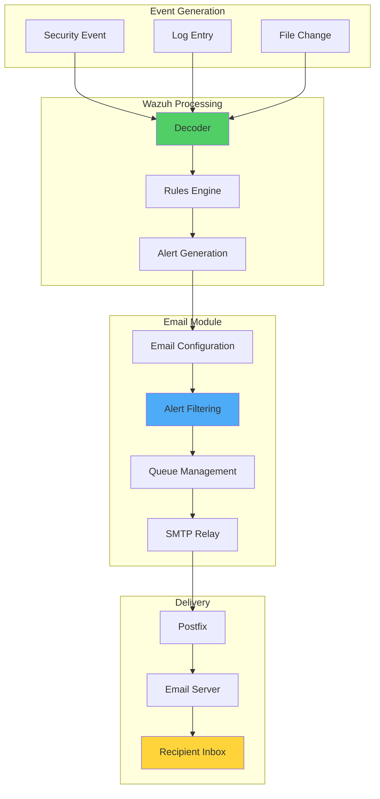

# How to Send Email Notifications with Wazuh

## Introduction

Email notifications are a crucial component of any security monitoring system, providing real-time alerts about important events occurring in your monitored infrastructure. Wazuh offers flexible email alerting capabilities that can be customized to meet specific organizational needs.

This comprehensive guide covers how to configure Wazuh for email notifications, from basic setup to advanced configurations. We'll explore:

- 📧 **SMTP Configuration**: Setting up mail relay with authentication
- 🎯 **Granular Alerting**: Filtering alerts by severity, rules, and agents
- ⚡ **Real-time Notifications**: Immediate alerts for critical events
- 🔧 **Custom Rules**: Tailoring alerts to specific use cases
- 📊 **Alert Management**: Controlling alert volume and frequency

## Email Alert Architecture

### How Wazuh Email Alerts Work



### Email Alert Options

Wazuh provides two types of email configuration:

1. **Generic Mail Options**: Global settings for all email alerts
2. **Granular Mail Options**: Specific configurations for targeted alerting

## Implementation Guide

### Prerequisites

- **Wazuh Manager**: Version 3.10+ installed and running
- **SMTP Server**: Access to mail server (Gmail, Outlook, etc.)
- **Network**: Outbound SMTP connectivity (port 25/465/587)
- **Postfix**: For SMTP authentication relay

### Phase 1: Configure SMTP Server Relay with Postfix

Most modern SMTP servers require authentication. We'll use Postfix as a relay to handle this.

#### Install Postfix

On Ubuntu 18.04:

```bash
# Install Postfix and dependencies
apt-get install postfix mailutils libsasl2-2 ca-certificates libsasl2-modules
```

During installation, select **"No configuration"** when prompted.

#### Configure Postfix

Copy the default configuration:

```bash
cp /usr/share/postfix/main.cf.debian /etc/postfix/main.cf
```

Edit `/etc/postfix/main.cf`:

```bash
relayhost = [smtp.gmail.com]:587
smtp_sasl_auth_enable = yes
smtp_sasl_password_maps = hash:/etc/postfix/sasl_passwd
smtp_sasl_security_options = noanonymous
smtp_tls_CAfile = /etc/ssl/certs/thawte_Primary_Root_CA.pem
smtp_use_tls = yes
compatibility_level = 2
```

#### Set Up Authentication

Create password file:

```bash
echo "[smtp.gmail.com]:587 wazuhtest@testserver.com:mypassword" > /etc/postfix/sasl_passwd
```

Secure the credentials:

```bash
postmap /etc/postfix/sasl_passwd
chmod 400 /etc/postfix/sasl_passwd
chown root:root /etc/postfix/sasl_passwd /etc/postfix/sasl_passwd.db
chmod 0600 /etc/postfix/sasl_passwd /etc/postfix/sasl_passwd.db
```

Restart Postfix:

```bash
systemctl restart postfix
```

#### Test Email Delivery

```bash
echo "Hi! We are testing Postfix!" | mail -s "Test Postfix" destinationmail@testserver1.com
```

### Phase 2: Configure Wazuh Generic Mail Options

Edit `/var/ossec/etc/ossec.conf`:

```xml
<ossec_config>
  <global>
    <email_notification>yes</email_notification>
    <smtp_server>localhost</smtp_server>
    <email_from>wazuhtest@testserver.com</email_from>
    <email_to>destinationMail@testserver1.com</email_to>
    <email_maxperhour>12</email_maxperhour>
  </global>
  
  <alerts>
    <email_alert_level>9</email_alert_level>
  </alerts>
</ossec_config>
```

Configuration explained:
- **email_notification**: Enable/disable email alerts
- **smtp_server**: Mail server (localhost for Postfix relay)
- **email_from**: Sender address (must match Postfix config)
- **email_to**: Default recipient
- **email_maxperhour**: Rate limiting to prevent spam
- **email_alert_level**: Minimum severity to trigger emails

### Phase 3: Configure Granular Mail Options

Add specific email configurations for targeted alerting:

```xml
<ossec_config>
  <!-- Apache-specific alerts -->
  <email_alerts>
    <email_to>security-team@company.com</email_to>
    <email_to>apache-admin@company.com</email_to>
    <rule_id>30309, 30310</rule_id>
    <do_not_delay />
  </email_alerts>

  <!-- Critical security alerts -->
  <email_alerts>
    <email_to>soc@company.com</email_to>
    <level>12</level>
    <do_not_delay />
    <do_not_group />
  </email_alerts>

  <!-- Specific agent alerts -->
  <email_alerts>
    <email_to>server-admin@company.com</email_to>
    <group>authentication_failed</group>
    <agent_id>005</agent_id>
  </email_alerts>
</ossec_config>
```

### Phase 4: Configure Alert Grouping

Control how alerts are batched:

```xml
<ossec_config>
  <alerts>
    <email_alert_level>7</email_alert_level>
    <email_alert_group>authentication_failures,web_scan</email_alert_group>
    <email_delay>300</email_delay>
    <email_delay_level>10</email_delay_level>
  </alerts>
</ossec_config>
```

## Use Case: Apache Real-time Monitoring

### Step 1: Monitor Apache Logs

Add to `/var/ossec/etc/ossec.conf`:

```xml
<ossec_config>
  <localfile>
    <log_format>apache</log_format>
    <location>/var/log/apache2/access.log</location>
  </localfile>
  
  <localfile>
    <log_format>apache</log_format>
    <location>/var/log/apache2/error.log</location>
  </localfile>
</ossec_config>
```

### Step 2: Create Custom Apache Rules

Edit `/var/ossec/etc/rules/local_rules.xml`:

```xml
<!-- Override existing rule to add email alerts -->
<rule id="30309" level="7" overwrite="yes">
  <if_sid>30301</if_sid>
  <id>AH01618|AH01808|AH01790</id>
  <options>alert_by_email</options>
  <description>Apache: Attempt to login using a non-existent user.</description>
  <group>invalid_login,pci_dss_11.4,pci_dss_10.2.4,pci_dss_10.2.5,gpg13_7.1,gdpr_IV_35.7.d,gdpr_IV_32.2,</group>
</rule>

<!-- Custom rule for multiple failures -->
<rule id="100001" level="12" frequency="8" timeframe="120">
  <if_matched_sid>30310</if_matched_sid>
  <description>Multiple user authentication failures</description>
  <group>authentication_failed,pci_dss_10.2.4,pci_dss_10.2.5,gpg13_7.1,gdpr_IV_35.7.d,gdpr_IV_32.2,hipaa_164.312.b,nist_800_53_AU.3.1,nist_800_53_IA.10,</group>
</rule>
```

### Step 3: Configure Email Alerts for Apache

```xml
<email_alerts>
  <email_to>webmaster@company.com</email_to>
  <email_to>security@company.com</email_to>
  <rule_id>30309, 100001</rule_id>
  <do_not_delay />
</email_alerts>
```

### Step 4: Test the Configuration

Restart Wazuh manager:

```bash
systemctl restart wazuh-manager
```

Trigger test alerts:

```bash
# Generate failed authentication attempts
curl -u wronguser:wrongpass http://localhost/secure/
```

## Advanced Email Configuration

### Email Templates

Customize email format in `/var/ossec/etc/shared/email_templates/`:

```html
<!-- custom_alert.html -->
<!DOCTYPE html>
<html>
<head>
    <style>
        .alert-high { color: #d9534f; }
        .alert-medium { color: #f0ad4e; }
        .alert-low { color: #5bc0de; }
    </style>
</head>
<body>
    <h2>Wazuh Security Alert</h2>
    <table border="1">
        <tr>
            <td><strong>Time:</strong></td>
            <td>_TIMESTAMP_</td>
        </tr>
        <tr>
            <td><strong>Agent:</strong></td>
            <td>_AGENT_NAME_ (_AGENT_ID_)</td>
        </tr>
        <tr>
            <td><strong>Rule:</strong></td>
            <td>_RULE_ID_ - _RULE_COMMENT_</td>
        </tr>
        <tr>
            <td><strong>Level:</strong></td>
            <td class="alert-_LEVEL_CLASS_">_LEVEL_</td>
        </tr>
        <tr>
            <td><strong>Description:</strong></td>
            <td>_FULL_LOG_</td>
        </tr>
    </table>
</body>
</html>
```

### Multiple SMTP Servers

Configure fallback SMTP servers:

```xml
<ossec_config>
  <global>
    <smtp_server>smtp1.company.com</smtp_server>
    <smtp_server>smtp2.company.com</smtp_server>
    <email_from>wazuh@company.com</email_from>
    <email_idsname>Wazuh Security Platform</email_idsname>
  </global>
</ossec_config>
```

### Conditional Email Alerts

```xml
<!-- Time-based alerts -->
<email_alerts>
  <email_to>oncall@company.com</email_to>
  <level>10</level>
  <time>6:00 pm - 8:00 am</time>
  <do_not_delay />
</email_alerts>

<!-- Weekday-specific alerts -->
<email_alerts>
  <email_to>weekend-team@company.com</email_to>
  <level>7</level>
  <weekday>saturday,sunday</weekday>
</email_alerts>

<!-- Location-based alerts -->
<email_alerts>
  <email_to>dmz-team@company.com</email_to>
  <group>dmz_hosts</group>
  <location>dmz-*</location>
</email_alerts>
```

## Email Alert Best Practices

### 1. Alert Fatigue Prevention

```xml
<!-- Aggregate similar alerts -->
<email_alerts>
  <email_to>security@company.com</email_to>
  <rule_id>5503</rule_id> <!-- Failed SSH login -->
  <format>full</format>
  <email_delay>600</email_delay> <!-- 10 minutes -->
  <email_delay_level>7</email_delay_level>
</email_alerts>

<!-- Summary reports for low-priority events -->
<email_alerts>
  <email_to>reports@company.com</email_to>
  <level>3</level>
  <format>sms</format> <!-- Compact format -->
  <email_delay>3600</email_delay> <!-- Hourly -->
</email_alerts>
```

### 2. Critical Alert Configuration

```xml
<!-- Immediate critical alerts -->
<email_alerts>
  <email_to>incident-response@company.com</email_to>
  <email_to>ciso@company.com</email_to>
  <rule_id>100200</rule_id> <!-- Data exfiltration -->
  <do_not_delay />
  <do_not_group />
  <format>full</format>
</email_alerts>

<!-- Active response triggered -->
<email_alerts>
  <email_to>security-ops@company.com</email_to>
  <group>active_response</group>
  <do_not_delay />
</email_alerts>
```

### 3. Email Rate Limiting

```xml
<ossec_config>
  <global>
    <!-- Global rate limit -->
    <email_maxperhour>100</email_maxperhour>
    
    <!-- Per-recipient limits -->
    <email_maxperhour>
      <email_to>user1@company.com</email_to>
      <maxperhour>20</maxperhour>
    </email_maxperhour>
    
    <email_maxperhour>
      <email_to>critical-alerts@company.com</email_to>
      <maxperhour>200</maxperhour>
    </email_maxperhour>
  </global>
</ossec_config>
```

## Integration Examples

### 1. Email to Ticketing System

```python
#!/usr/bin/env python3
# email_to_ticket.py - Convert Wazuh emails to tickets

import email
import imaplib
import json
import requests

def process_wazuh_emails():
    """Process Wazuh alert emails and create tickets"""
    
    # Connect to email
    mail = imaplib.IMAP4_SSL('imap.gmail.com')
    mail.login('wazuh-alerts@company.com', 'password')
    mail.select('inbox')
    
    # Search for Wazuh alerts
    _, search_data = mail.search(None, 'UNSEEN', 'FROM', 'wazuh@company.com')
    
    for num in search_data[0].split():
        _, data = mail.fetch(num, '(RFC822)')
        email_body = data[0][1]
        email_message = email.message_from_bytes(email_body)
        
        # Parse alert details
        alert_data = parse_wazuh_alert(email_message)
        
        # Create ticket
        create_ticket(alert_data)
        
        # Mark as read
        mail.store(num, '+FLAGS', '\\Seen')

def parse_wazuh_alert(email_message):
    """Extract alert information from email"""
    
    body = email_message.get_payload()
    
    # Extract key fields (customize based on your email format)
    alert = {
        'subject': email_message['Subject'],
        'timestamp': email_message['Date'],
        'body': body,
        'severity': extract_severity(body),
        'agent': extract_agent(body),
        'rule': extract_rule(body)
    }
    
    return alert

def create_ticket(alert_data):
    """Create ticket in ticketing system"""
    
    ticket = {
        'title': f"Wazuh Alert: {alert_data['subject']}",
        'description': alert_data['body'],
        'priority': map_severity_to_priority(alert_data['severity']),
        'tags': ['wazuh', 'security', alert_data['agent']],
        'custom_fields': {
            'alert_timestamp': alert_data['timestamp'],
            'wazuh_rule': alert_data['rule']
        }
    }
    
    # API call to ticketing system
    response = requests.post(
        'https://ticketing.company.com/api/tickets',
        json=ticket,
        headers={'Authorization': 'Bearer YOUR_API_TOKEN'}
    )
    
    return response.json()
```

### 2. Enhanced Email Notifications

```python
#!/usr/bin/env python3
# enhanced_email.py - Add context to Wazuh email alerts

import json
import smtplib
from email.mime.multipart import MIMEMultipart
from email.mime.text import MIMEText
from email.mime.image import MIMEImage
import matplotlib.pyplot as plt
import requests

def send_enhanced_alert(alert_file):
    """Send enhanced email with additional context"""
    
    with open(alert_file) as f:
        alert = json.load(f)
    
    # Get additional context
    context = gather_alert_context(alert)
    
    # Create enhanced email
    msg = MIMEMultipart('related')
    msg['Subject'] = f"[{alert['rule']['level']}] {alert['rule']['description']}"
    msg['From'] = 'wazuh-enhanced@company.com'
    msg['To'] = get_recipients(alert)
    
    # Create HTML body
    html = create_enhanced_html(alert, context)
    msg.attach(MIMEText(html, 'html'))
    
    # Add trend chart
    chart_data = generate_trend_chart(alert)
    msg.attach(MIMEImage(chart_data, 'png'))
    
    # Send email
    smtp = smtplib.SMTP('localhost')
    smtp.send_message(msg)
    smtp.quit()

def gather_alert_context(alert):
    """Gather additional context for the alert"""
    
    context = {}
    
    # Get agent details
    agent_id = alert['agent']['id']
    response = requests.get(
        f"https://localhost:55000/agents/{agent_id}",
        auth=('wazuh', 'wazuh'),
        verify=False
    )
    context['agent_details'] = response.json()['data']
    
    # Get similar recent alerts
    response = requests.get(
        f"https://localhost:55000/alerts",
        params={
            'rule.id': alert['rule']['id'],
            'agent.id': agent_id,
            'limit': 10
        },
        auth=('wazuh', 'wazuh'),
        verify=False
    )
    context['recent_alerts'] = response.json()['data']['items']
    
    return context

def create_enhanced_html(alert, context):
    """Create enhanced HTML email body"""
    
    html = f"""
    <html>
    <head>
        <style>
            body {{ font-family: Arial, sans-serif; }}
            .header {{ background-color: #f8f9fa; padding: 20px; }}
            .alert-critical {{ color: #dc3545; }}
            .alert-high {{ color: #fd7e14; }}
            .alert-medium {{ color: #ffc107; }}
            .alert-low {{ color: #28a745; }}
            .details {{ margin: 20px 0; }}
            table {{ border-collapse: collapse; width: 100%; }}
            th, td {{ border: 1px solid #ddd; padding: 8px; text-align: left; }}
            th {{ background-color: #f2f2f2; }}
        </style>
    </head>
    <body>
        <div class="header">
            <h2 class="alert-{get_level_class(alert['rule']['level'])}">
                Wazuh Security Alert - Level {alert['rule']['level']}
            </h2>
        </div>
        
        <div class="details">
            <h3>Alert Details</h3>
            <table>
                <tr>
                    <th>Timestamp</th>
                    <td>{alert['timestamp']}</td>
                </tr>
                <tr>
                    <th>Agent</th>
                    <td>{alert['agent']['name']} ({alert['agent']['id']})</td>
                </tr>
                <tr>
                    <th>IP Address</th>
                    <td>{context['agent_details'].get('ip', 'N/A')}</td>
                </tr>
                <tr>
                    <th>Rule</th>
                    <td>{alert['rule']['id']} - {alert['rule']['description']}</td>
                </tr>
                <tr>
                    <th>Groups</th>
                    <td>{', '.join(alert['rule'].get('groups', []))}</td>
                </tr>
                <tr>
                    <th>Full Log</th>
                    <td><pre>{alert.get('full_log', 'N/A')}</pre></td>
                </tr>
            </table>
        </div>
        
        <div class="details">
            <h3>Recent Similar Alerts (Last 24 Hours)</h3>
            <p>Found {len(context['recent_alerts'])} similar alerts</p>
            
        </div>
        
        <div class="details">
            <h3>Recommended Actions</h3>
            <ul>
                {generate_recommendations(alert)}
            </ul>
        </div>
        
        <hr>
        <p><small>This is an automated message from Wazuh Security Platform</small></p>
    </body>
    </html>
    """
    
    return html
```

### 3. Email Alert Dashboard

```python
#!/usr/bin/env python3
# email_metrics.py - Track email alert metrics

import sqlite3
import json
from datetime import datetime, timedelta
from collections import defaultdict

class EmailAlertMetrics:
    def __init__(self, db_path='/var/ossec/logs/email_metrics.db'):
        self.conn = sqlite3.connect(db_path)
        self.create_tables()
    
    def create_tables(self):
        """Create metrics tracking tables"""
        
        self.conn.execute('''
            CREATE TABLE IF NOT EXISTS email_alerts (
                id INTEGER PRIMARY KEY,
                timestamp DATETIME,
                recipient TEXT,
                rule_id INTEGER,
                level INTEGER,
                agent_id TEXT,
                delivered BOOLEAN,
                grouped BOOLEAN
            )
        ''')
        
        self.conn.execute('''
            CREATE TABLE IF NOT EXISTS email_stats (
                date DATE PRIMARY KEY,
                total_sent INTEGER,
                total_grouped INTEGER,
                total_delayed INTEGER,
                avg_level REAL
            )
        ''')
    
    def log_email_sent(self, alert_data):
        """Log email alert sent"""
        
        self.conn.execute('''
            INSERT INTO email_alerts 
            (timestamp, recipient, rule_id, level, agent_id, delivered, grouped)
            VALUES (?, ?, ?, ?, ?, ?, ?)
        ''', (
            datetime.now(),
            alert_data['recipient'],
            alert_data['rule_id'],
            alert_data['level'],
            alert_data['agent_id'],
            True,
            alert_data.get('grouped', False)
        ))
        self.conn.commit()
    
    def generate_daily_report(self):
        """Generate daily email metrics report"""
        
        yesterday = datetime.now() - timedelta(days=1)
        
        # Get metrics
        cursor = self.conn.execute('''
            SELECT 
                COUNT(*) as total,
                AVG(level) as avg_level,
                COUNT(DISTINCT recipient) as unique_recipients,
                COUNT(DISTINCT rule_id) as unique_rules
            FROM email_alerts
            WHERE DATE(timestamp) = DATE(?)
        ''', (yesterday,))
        
        metrics = cursor.fetchone()
        
        # Get top alerts
        cursor = self.conn.execute('''
            SELECT rule_id, COUNT(*) as count
            FROM email_alerts
            WHERE DATE(timestamp) = DATE(?)
            GROUP BY rule_id
            ORDER BY count DESC
            LIMIT 10
        ''', (yesterday,))
        
        top_alerts = cursor.fetchall()
        
        # Generate report
        report = {
            'date': yesterday.strftime('%Y-%m-%d'),
            'total_alerts': metrics[0],
            'average_level': round(metrics[1], 2),
            'unique_recipients': metrics[2],
            'unique_rules': metrics[3],
            'top_alerts': [
                {'rule_id': rule_id, 'count': count}
                for rule_id, count in top_alerts
            ]
        }
        
        return report
```

## Troubleshooting

### Common Issues and Solutions

#### Issue 1: Emails Not Being Sent

```bash
# Check Wazuh email configuration
grep -A 10 "email_notification" /var/ossec/etc/ossec.conf

# Verify Postfix is running
systemctl status postfix

# Check mail queue
mailq

# Review Wazuh logs
tail -f /var/ossec/logs/ossec.log | grep -i mail

# Test SMTP connectivity
telnet localhost 25
```

#### Issue 2: Authentication Failures

```bash
# Check Postfix logs
tail -f /var/log/mail.log

# Verify credentials
postmap -q "[smtp.gmail.com]:587" /etc/postfix/sasl_passwd

# Test authentication
echo "Test" | mail -s "Auth Test" -v test@example.com
```

#### Issue 3: Emails Being Delayed

```bash
# Check email queue status
/var/ossec/bin/ossec-control status

# Review email delay settings
grep -E "email_delay|email_maxperhour" /var/ossec/etc/ossec.conf

# Force email queue processing
/var/ossec/bin/ossec-maild -t
```

#### Issue 4: Specific Rules Not Triggering Emails

```bash
# Test rule matching
echo "Your test log" | /var/ossec/bin/ossec-logtest

# Verify rule has email option
grep -A 5 "rule_id" /var/ossec/rules/*.xml | grep -B 5 "alert_by_email"

# Check granular email configuration
grep -A 10 "<email_alerts>" /var/ossec/etc/ossec.conf
```

## Performance Optimization

### 1. Email Queue Management

```xml
<!-- Optimize for high-volume environments -->
<ossec_config>
  <global>
    <!-- Increase rate limit for critical systems -->
    <email_maxperhour>500</email_maxperhour>
    
    <!-- Separate queues for different priorities -->
    <email_queue>
      <priority>high</priority>
      <maxperhour>100</maxperhour>
      <delay>0</delay>
    </email_queue>
    
    <email_queue>
      <priority>medium</priority>
      <maxperhour>200</maxperhour>
      <delay>300</delay>
    </email_queue>
    
    <email_queue>
      <priority>low</priority>
      <maxperhour>200</maxperhour>
      <delay>3600</delay>
    </email_queue>
  </global>
</ossec_config>
```

### 2. Smart Alert Grouping

```python
#!/usr/bin/env python3
# smart_grouping.py - Intelligent alert grouping

def group_similar_alerts(alerts):
    """Group similar alerts to reduce email volume"""
    
    groups = defaultdict(list)
    
    for alert in alerts:
        # Create grouping key
        key = (
            alert['rule']['id'],
            alert['agent']['id'],
            alert['rule']['level'],
            # Group by hour
            datetime.fromisoformat(alert['timestamp']).strftime('%Y-%m-%d %H:00')
        )
        groups[key].append(alert)
    
    # Generate summary emails
    summaries = []
    for key, group_alerts in groups.items():
        if len(group_alerts) > 5:  # Only group if more than 5 similar alerts
            summary = {
                'rule_id': key[0],
                'agent_id': key[1],
                'level': key[2],
                'time_window': key[3],
                'count': len(group_alerts),
                'first_seen': min(a['timestamp'] for a in group_alerts),
                'last_seen': max(a['timestamp'] for a in group_alerts),
                'sample_logs': [a['full_log'] for a in group_alerts[:3]]
            }
            summaries.append(summary)
    
    return summaries
```

## Security Best Practices

### 1. Secure Email Configuration

```bash
# Encrypt stored passwords
openssl enc -aes-256-cbc -salt -in /etc/postfix/sasl_passwd \
    -out /etc/postfix/sasl_passwd.enc

# Restrict configuration file access
chmod 600 /var/ossec/etc/ossec.conf
chown root:ossec /var/ossec/etc/ossec.conf

# Use TLS for SMTP
postconf -e 'smtp_use_tls = yes'
postconf -e 'smtp_tls_security_level = encrypt'
postconf -e 'smtp_tls_note_starttls_offer = yes'
```

### 2. Email Content Security

```xml
<!-- Sanitize email content -->
<ossec_config>
  <global>
    <!-- Remove sensitive data from emails -->
    <email_log_source>no</email_log_source>
    <email_full_log>no</email_full_log>
    
    <!-- Use email allowlist -->
    <email_to_allowlist>/var/ossec/etc/email_allowlist.txt</email_to_allowlist>
  </global>
</ossec_config>
```

### 3. Monitoring Email Security

```python
#!/usr/bin/env python3
# monitor_email_security.py - Monitor for email security issues

def check_email_security():
    """Monitor for potential email security issues"""
    
    issues = []
    
    # Check for plaintext passwords
    if os.path.exists('/etc/postfix/sasl_passwd'):
        if not os.path.exists('/etc/postfix/sasl_passwd.enc'):
            issues.append("Plaintext password file detected")
    
    # Check for unauthorized recipients
    with open('/var/ossec/logs/ossec.log') as f:
        for line in f:
            if 'Sending email to' in line:
                recipient = extract_recipient(line)
                if not is_authorized_recipient(recipient):
                    issues.append(f"Unauthorized recipient: {recipient}")
    
    # Check for email loops
    email_counts = defaultdict(int)
    # ... analyze logs for loops
    
    return issues
```

## Conclusion

Email notifications are a powerful feature of Wazuh that enable real-time awareness of security events across your infrastructure. By properly configuring SMTP relay, implementing granular alert rules, and following best practices, organizations can:

- 📧 **Receive Timely Alerts**: Get notified of critical events immediately
- 🎯 **Reduce Alert Fatigue**: Filter and group alerts intelligently
- 🔧 **Customize Notifications**: Tailor alerts to specific teams and use cases
- 📊 **Track Alert Metrics**: Monitor and optimize alert performance
- 🛡️ **Maintain Security**: Ensure secure handling of sensitive alert data

The flexibility of Wazuh's email alerting system allows organizations to create sophisticated notification workflows that meet their specific security monitoring needs.

## Key Takeaways

1. **Start Simple**: Begin with basic email configuration and expand gradually
2. **Use Granular Rules**: Target specific alerts to appropriate recipients
3. **Prevent Alert Fatigue**: Implement smart grouping and rate limiting
4. **Monitor Performance**: Track email metrics to optimize configuration
5. **Maintain Security**: Protect email credentials and sensitive data

## Resources

- [Wazuh Email Configuration Documentation](https://documentation.wazuh.com/current/user-manual/manager/manual-email-report/index.html)
- [Postfix Configuration Guide](http://www.postfix.org/documentation.html)
- [SMTP Authentication Tutorial](https://www.smtp2go.com/docs/smtp-authentication/)
- [Wazuh Rules Documentation](https://documentation.wazuh.com/current/user-manual/ruleset/index.html)

---

*Stay informed with Wazuh email notifications - Real-time security awareness! 📧🚨*