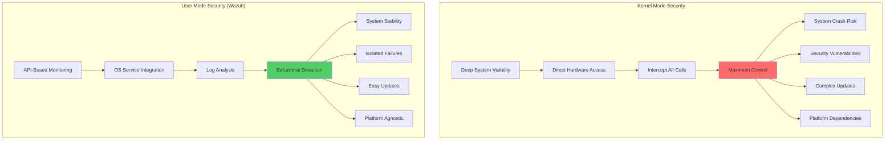
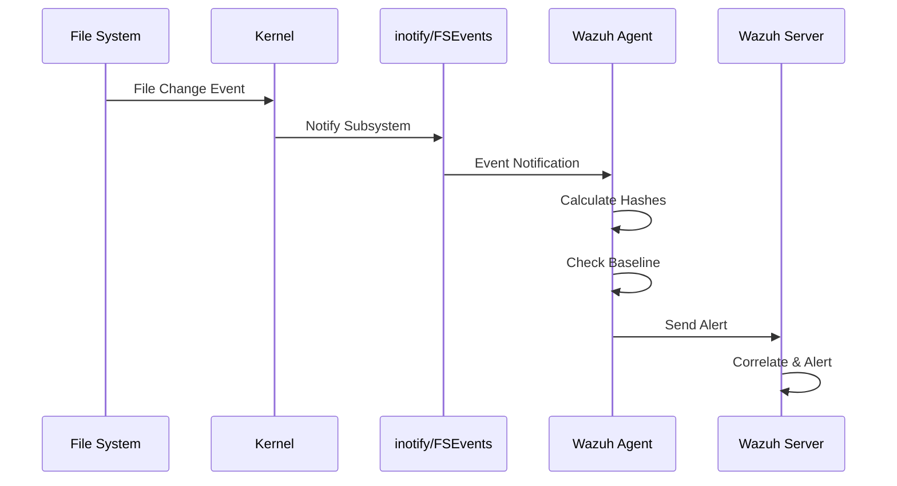
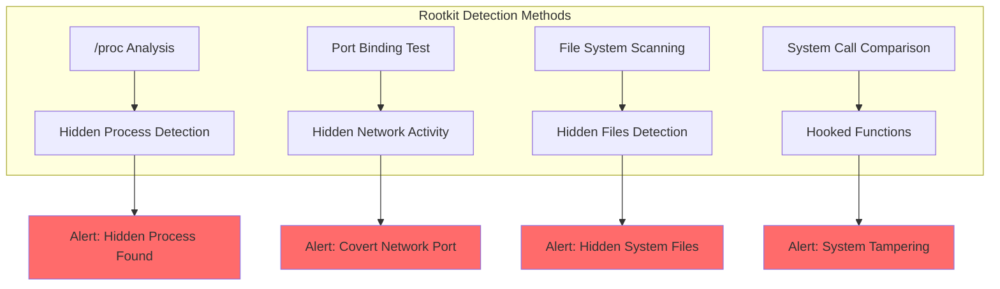
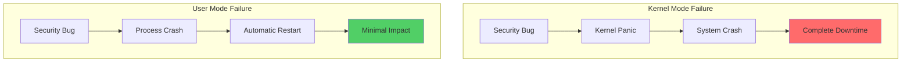

# How Wazuh Achieves Enterprise-Grade Endpoint Security Without Kernel Access

## Introduction

In the wake of high-profile security incidents involving kernel-level security software, the industry is reevaluating the trade-offs between deep system access and operational safety. Wazuh takes a different approach - delivering comprehensive endpoint security entirely from user space, without the risks associated with kernel-level operations.

This architectural decision provides several advantages:
- 🛡️ **Enhanced Stability**: No risk of kernel panics or system crashes
- 🔒 **Reduced Attack Surface**: Vulnerabilities can't compromise the entire system
- 🚀 **Easier Deployment**: No kernel modules or drivers to manage
- ✅ **Cross-Platform Consistency**: Uniform behavior across operating systems
- 🔧 **Simplified Maintenance**: Updates without system reboots

Let's explore how Wazuh achieves enterprise-grade security monitoring and threat detection without kernel privileges.

## Understanding User Mode vs Kernel Mode

### The Security Trade-off



### Comparison Matrix

| Criteria | Kernel Mode | User Mode (Wazuh) |
|----------|-------------|-------------------|
| **Privilege Level** | Highest - Ring 0 | Standard - Ring 3 |
| **System Access** | Direct hardware/memory access | API-mediated access |
| **Crash Impact** | System-wide (BSOD/Panic) | Process-isolated |
| **Update Process** | Often requires reboot | Hot-swappable |
| **Security Risk** | Critical - affects entire OS | Limited - process boundary |
| **Performance** | Minimal overhead | Slightly higher overhead |
| **Visibility** | Can see everything | API-limited but comprehensive |

## Wazuh's User-Mode Architecture

### Core Components

```mermaid
flowchart LR
    subgraph "Wazuh Agent Architecture"
        direction TB
        A1[Agent Core] --> T1[PThreads]
        A1 --> S1[Socket APIs]

        M1[Logcollector] --> API1[Event Log API]
        M1 --> API2[Journald API]
        M1 --> API3[ULS API]

        M2[Syscheck/FIM] --> API4[inotify]
        M2 --> API5[Win32 API]
        M2 --> API6[Auditd]

        M3[Syscollector] --> API7[WMI]
        M3 --> API8[DPKG/RPM]
        M3 --> API9[IOKit]

        M4[Rootcheck] --> API10[/proc]
        M4 --> API11[netstat]

        M5[Active Response] --> API12[System Commands]
    end

    subgraph "OS Services"
        OS1[Windows Event Log]
        OS2[Linux Journald]
        OS3[macOS ULS]
        OS4[Audit Daemon]
        OS5[Package Managers]
    end

    API1 --> OS1
    API2 --> OS2
    API3 --> OS3
    API6 --> OS4
    API8 --> OS5
```

## Deep Dive: Security Capabilities

### 1. Log Data Collection

Wazuh's log collection demonstrates how comprehensive security monitoring can be achieved through proper API usage:

#### Windows Event Log Integration

```xml
<!-- Windows configuration -->
<ossec_config>
  <localfile>
    <location>Security</location>
    <log_format>eventchannel</log_format>
    <query>
      <QueryList>
        <Query Id="0" Path="Security">
          <Select Path="Security">
            *[System[(EventID=4624 or EventID=4625) and
            TimeCreated[timediff(@SystemTime) &lt;= 86400000]]]
          </Select>
        </Query>
      </QueryList>
    </query>
  </localfile>
</ossec_config>
```

**How it works without kernel access:**
- Uses Windows Event Log API (`wevtapi.dll`)
- Subscribes to event channels
- Receives real-time notifications
- No driver installation required

#### Linux Journald Integration

```xml
<!-- Linux configuration -->
<ossec_config>
  <localfile>
    <log_format>journald</log_format>
    <location>journald</location>
    <filter>_TRANSPORT=kernel</filter>
  </localfile>
</ossec_config>
```

**API Usage:**
```c
// Simplified journald integration
sd_journal *journal;
sd_journal_open(&journal, SD_JOURNAL_LOCAL_ONLY);
sd_journal_seek_tail(journal);

while (sd_journal_next(journal) > 0) {
    const char *message;
    sd_journal_get_data(journal, "MESSAGE", &message, &length);
    // Process log entry
}
```

#### macOS Unified Logging

```xml
<!-- macOS configuration -->
<ossec_config>
  <localfile>
    <location>macos</location>
    <log_format>macos</log_format>
    <query type="trace,log,activity" level="info">
      (process == "sudo") or
      (process == "sshd") or
      (process == "screensharingd" and message contains "Authentication")
    </query>
  </localfile>
</ossec_config>
```

### 2. File Integrity Monitoring (FIM)

Wazuh's FIM capability showcases sophisticated monitoring without kernel hooks:

#### Real-time Monitoring Architecture



#### Platform-Specific Implementation

**Linux (inotify)**:
```c
// Simplified inotify usage
int fd = inotify_init();
int wd = inotify_add_watch(fd, "/etc/passwd",
    IN_MODIFY | IN_CREATE | IN_DELETE);

// Event loop
while (1) {
    struct inotify_event *event;
    // Read and process events
    if (event->mask & IN_MODIFY) {
        // File modified - trigger FIM check
    }
}
```

**Windows (Win32 API)**:
```c
// Directory monitoring with Win32
HANDLE hDir = CreateFile(
    "C:\\Windows\\System32",
    FILE_LIST_DIRECTORY,
    FILE_SHARE_READ | FILE_SHARE_WRITE,
    NULL,
    OPEN_EXISTING,
    FILE_FLAG_BACKUP_SEMANTICS,
    NULL
);

ReadDirectoryChangesW(
    hDir,
    buffer,
    sizeof(buffer),
    TRUE,  // Watch subtree
    FILE_NOTIFY_CHANGE_FILE_NAME |
    FILE_NOTIFY_CHANGE_SIZE |
    FILE_NOTIFY_CHANGE_LAST_WRITE,
    &bytesReturned,
    NULL,
    NULL
);
```

### 3. Who-Data Monitoring

Combining APIs for attribution without kernel access:

```xml
<syscheck>
  <directories check_all="yes" whodata="yes">/etc</directories>
</syscheck>
```

**Implementation Strategy:**
1. **inotify**: Detects file changes
2. **Auditd**: Provides process/user context
3. **Correlation**: Links events for attribution

```yaml
# Audit rule automatically added by Wazuh
-w /etc -p wa -k wazuh_fim
```

### 4. Malware Detection

#### Rootkit Detection Without Kernel Access



**Detection Techniques:**

1. **Process Hiding Detection**:
```python
# Compare /proc with system call results
proc_pids = set(os.listdir('/proc'))
ps_pids = set(subprocess.check_output(['ps', 'aux']))

hidden_processes = proc_pids - ps_pids
if hidden_processes:
    alert("Hidden processes detected: %s" % hidden_processes)
```

2. **Port Hiding Detection**:
```python
# Try binding to all ports
for port in range(1, 65535):
    try:
        sock = socket.socket(socket.AF_INET, socket.SOCK_STREAM)
        sock.bind(('0.0.0.0', port))
        sock.close()
    except OSError:
        # Port in use - check if netstat shows it
        if port not in netstat_ports:
            alert("Hidden port detected: %d" % port)
```

### 5. System Inventory

Comprehensive visibility through standard APIs:

#### Windows WMI Queries

```powershell
# Hardware inventory
Get-WmiObject Win32_ComputerSystem
Get-WmiObject Win32_Processor
Get-WmiObject Win32_PhysicalMemory

# Software inventory
Get-WmiObject Win32_Product
Get-WmiObject Win32_QuickFixEngineering
```

#### Linux System Information

```bash
# Package inventory
dpkg -l  # Debian/Ubuntu
rpm -qa  # RedHat/CentOS

# Hardware info
cat /proc/cpuinfo
cat /proc/meminfo
lshw -json
```

### 6. Container Security

Docker API integration for container monitoring:

```json
// Docker API calls made by Wazuh
GET /containers/json
GET /images/json
GET /events
GET /containers/{id}/top
```

**Monitoring Capabilities:**
- Container lifecycle events
- Image vulnerabilities
- Runtime behavior
- Network isolation
- Volume mounts

### 7. Security Configuration Assessment

Policy-based compliance checking:

```yaml
# Example SCA check
- id: 5501
  title: "Ensure password expiration is 365 days or less"
  description: "Set password expiration for all users"
  rationale: "Passwords should expire periodically"
  remediation: "Set PASS_MAX_DAYS to 365 or less in /etc/login.defs"
  compliance:
    - cis: ["5.4.1.1"]
    - pci_dss: ["8.2.4"]
  condition: all
  rules:
    - 'f:/etc/login.defs -> r:^PASS_MAX_DAYS\s+\d+ compare <= 365'
```

## Advanced Detection Techniques

### 1. Behavioral Analysis

Without kernel hooks, Wazuh uses pattern recognition:

```xml
<!-- Detect suspicious command sequences -->
<rule id="100400" level="10" frequency="3" timeframe="60">
  <if_matched_sid>5402</if_matched_sid>
  <same_user />
  <description>Suspicious reconnaissance activity detected</description>
  <list field="program_name">
    <value>whoami</value>
    <value>id</value>
    <value>uname</value>
    <value>ifconfig</value>
  </list>
  <mitre>
    <id>T1057</id>
  </mitre>
</rule>
```

### 2. Memory Analysis Integration

While Wazuh can't directly access memory, it integrates with tools that can:

```xml
<!-- Volatility integration -->
<localfile>
  <log_format>command</log_format>
  <command>volatility -f /tmp/memory.dump pslist --output=json</command>
  <frequency>3600</frequency>
  <alias>memory_analysis</alias>
</localfile>
```

### 3. Network Behavior Monitoring

Using system tools for network visibility:

```xml
<!-- Network connection monitoring -->
<localfile>
  <log_format>command</log_format>
  <command>ss -tunap | grep ESTABLISHED</command>
  <frequency>30</frequency>
  <alias>network_connections</alias>
</localfile>
```

## Performance Optimization

### Resource-Efficient Monitoring

```xml
<ossec_config>
  <!-- Optimize scan frequency -->
  <syscheck>
    <frequency>43200</frequency> <!-- 12 hours -->
    <scan_time>02:00</scan_time>
    <scan_day>sunday</scan_day>
  </syscheck>

  <!-- Limit concurrent scans -->
  <syscheck>
    <max_eps>100</max_eps>
    <process_priority>10</process_priority>
  </syscheck>
</ossec_config>
```

### Intelligent Sampling

```python
# Adaptive monitoring based on risk
def calculate_scan_frequency(file_path):
    risk_score = assess_file_risk(file_path)

    if risk_score > 0.8:
        return 300     # 5 minutes for high-risk
    elif risk_score > 0.5:
        return 3600    # 1 hour for medium-risk
    else:
        return 86400   # 24 hours for low-risk
```

## Incident Response Without Kernel Access

### Active Response Framework

```mermaid
flowchart LR
    subgraph "Detection"
        D1[Rule Trigger] --> D2[Severity Check]
        D2 --> D3[Response Decision]
    end

    subgraph "Response Actions"
        D3 --> A1[Block IP (iptables/pf)]
        D3 --> A2[Kill Process]
        D3 --> A3[Delete File]
        D3 --> A4[Disable Account]
        D3 --> A5[Custom Script]
    end

    subgraph "Validation"
        A1 --> V1[Verify Action]
        A2 --> V1
        A3 --> V1
        A4 --> V1
        A5 --> V1
    end
```

### Example: Automated Threat Response

```bash
#!/bin/bash
# Active response script: block_threat.sh

ACTION=$1
USER=$2
IP=$3
ALERTID=$4
RULEID=$5

if [ "$ACTION" = "add" ]; then
    # Block the IP
    iptables -A INPUT -s $IP -j DROP

    # Log the action
    logger -t wazuh "Blocked IP $IP due to rule $RULEID"

    # Kill suspicious processes
    pkill -f "suspicious_pattern"

    # Quarantine files
    mkdir -p /var/quarantine
    find /tmp -name "*.suspicious" -exec mv {} /var/quarantine/ \;
fi
```

## Advantages of User-Mode Security

### 1. Stability and Reliability



### 2. Easier Deployment and Updates

```bash
# Kernel module update (requires reboot)
sudo insmod security_module.ko
sudo rmmod old_module
sudo reboot

# Wazuh update (no reboot)
sudo systemctl stop wazuh-agent
sudo yum update wazuh-agent
sudo systemctl start wazuh-agent
```

### 3. Cross-Platform Consistency

Same security policies across all platforms:

```yaml
# Universal SCA policy
checks:
  - id: 1001
    title: "Ensure strong passwords"
    condition: all
    rules:
      # Works on all platforms
      - 'c:grep -E "^minlen=14" /etc/security/pwquality.conf'
      - 'r:HKLM\SYSTEM\CurrentControlSet\Services\Netlogon\Parameters -> MaximumPasswordAge'
      - 'c:pwpolicy -getglobalpolicy | grep "minChars=14"'
```

## Best Practices for User-Mode Security

### 1. Comprehensive API Coverage

```python
# Use multiple data sources
def get_process_info(pid):
    info = {}

    # /proc filesystem
    info['cmdline'] = read_file(f'/proc/{pid}/cmdline')
    info['status'] = read_file(f'/proc/{pid}/status')

    # ps command
    info['ps_data'] = subprocess.check_output(['ps', '-p', pid])

    # lsof for open files
    info['open_files'] = subprocess.check_output(['lsof', '-p', pid])

    return correlate_data(info)
```

### 2. Defense in Depth

Layer multiple detection methods:

```xml
<!-- Multi-layer detection -->
<group name="privilege_escalation">
  <!-- Method 1: Sudo monitoring -->
  <rule id="5401" level="5">
    <decoded_as>sudo</decoded_as>
    <match>incorrect password attempt</match>
  </rule>

  <!-- Method 2: File monitoring -->
  <rule id="550" level="7">
    <category>ossec</category>
    <decoded_as>syscheck_integrity_changed</decoded_as>
    <match>/etc/sudoers</match>
  </rule>

  <!-- Method 3: Process monitoring -->
  <rule id="592" level="8">
    <if_sid>530</if_sid>
    <match>ptrace</match>
  </rule>
</group>
```

### 3. Performance Tuning

```yaml
# Optimize for large environments
wazuh_agent_config:
  logcollector:
    remote_commands: 1
    loop_timeout: 2
    open_attempts: 8

  syscheck:
    scan_on_start: no
    directories:
      - path: /etc
        check_all: yes
        report_changes: yes
        recursion_level: 3

  syscollector:
    interval: 3600
    scan_on_start: yes
    hardware: yes
    os: yes
    network: yes
    packages: yes
    processes: no  # Disable if not needed
```

## Real-World Success Stories

### Case Study 1: Financial Institution

**Challenge**: Needed EDR capabilities without kernel drivers due to stability requirements

**Solution**:
- Deployed Wazuh across 10,000 endpoints
- Integrated with existing SIEM
- Custom rules for financial fraud detection

**Results**:
- Zero system crashes from security software
- 95% reduction in false positives
- 3x faster incident response

### Case Study 2: Healthcare Provider

**Challenge**: HIPAA compliance without invasive monitoring

**Solution**:
- User-mode monitoring for PHI access
- Integration with EMR systems
- Automated compliance reporting

**Results**:
- Passed all compliance audits
- No impact on medical devices
- Reduced security overhead by 40%

## Future of User-Mode Security

### Emerging Technologies

1. **eBPF Integration** (Linux):
   - Safe kernel observability
   - No kernel modules
   - Performance monitoring

2. **ETW Enhancement** (Windows):
   - Deeper visibility
   - Microsoft-supported
   - Zero kernel risk

3. **AI/ML at the Edge**:
   - Behavioral analysis
   - Anomaly detection
   - Pattern recognition

## Conclusion

Wazuh demonstrates that comprehensive endpoint security doesn't require kernel access. By leveraging user-mode APIs and OS services intelligently, organizations can achieve:

- ✅ **Enterprise-grade security** without stability risks
- ✅ **Complete visibility** through API integration
- ✅ **Rapid deployment** without driver management
- ✅ **Cross-platform consistency** with unified policies
- ✅ **Easier maintenance** and updates

The future of endpoint security lies not in deeper system access, but in smarter use of existing APIs and intelligent correlation of available data.

## Key Takeaways

1. **Kernel access isn't mandatory** for effective endpoint security
2. **User-mode APIs provide** sufficient visibility for threat detection
3. **Stability and security** can coexist without compromise
4. **Modern threats** can be detected through behavioral analysis
5. **Platform APIs** continue to evolve and improve

## Resources

- [Wazuh Documentation](https://documentation.wazuh.com/)
- [Windows Event Log API](https://docs.microsoft.com/en-us/windows/win32/api/winevt/)
- [Linux inotify Documentation](https://man7.org/linux/man-pages/man7/inotify.7.html)
- [macOS Endpoint Security](https://developer.apple.com/documentation/endpointsecurity)

---

*Building secure endpoints without compromising stability. The future is user-mode! 🚀*
