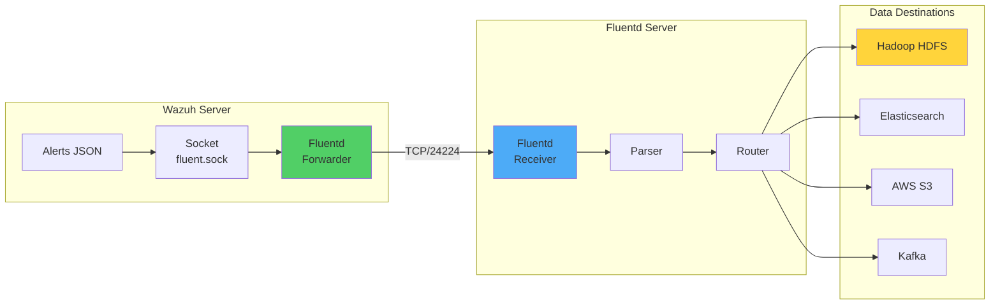

# Integrating Wazuh with Fluentd for Unified Logging and Big Data Analytics

## Introduction

In today's data-driven landscape, organizations generate logs from countless sources at an unprecedented rate. Managing this deluge of data across diverse systems and applications without a centralized approach is like trying to drink from a fire hose. This is where the powerful combination of Wazuh and Fluentd comes into play.

By integrating Wazuh with Fluentd, organizations can:
- 📊 **Unify log collection** from diverse security sources
- 🚀 **Scale log processing** for big data workloads
- 🔄 **Stream security events** to multiple destinations
- 💾 **Build data lakes** for advanced analytics
- 🤖 **Enable ML workflows** on security data

## Understanding the Architecture

### How Wazuh Fluentd Forwarder Works



### Why Fluentd?

Fluentd provides several advantages for log management:

1. **Unified Logging Layer**: Collects logs from 500+ data sources
2. **Flexible Routing**: Route logs based on tags and patterns
3. **Buffering**: Handles network failures gracefully
4. **Plugin Ecosystem**: Extensive output plugins for various destinations
5. **Performance**: Processes millions of events per second

## Infrastructure Setup

For this implementation, we'll need:

- **Wazuh Server**: OVA 4.7.3 with all core components
- **Ubuntu 22.04**: Hosting Fluentd and Hadoop
- **Network**: Connectivity between Wazuh and Fluentd servers

## Implementation Guide

### Phase 1: Configure Wazuh Fluentd Forwarder

#### Enable Fluentd Forwarding

Edit `/var/ossec/etc/ossec.conf` on the Wazuh server:

```xml
<ossec_config>
  <!-- Define UDP socket for Fluentd -->
  <socket>
    <name>fluent_socket</name>
    <location>/var/run/fluent.sock</location>
    <mode>udp</mode>
  </socket>

  <!-- Configure alerts as input -->
  <localfile>
    <log_format>json</log_format>
    <location>/var/ossec/logs/alerts/alerts.json</location>
    <target>fluent_socket</target>
  </localfile>

  <!-- Fluentd forwarder configuration -->
  <fluent-forward>
    <enabled>yes</enabled>
    <tag>wazuh</tag>
    <socket_path>/var/run/fluent.sock</socket_path>
    <address>FLUENTD_SERVER_IP</address>
    <port>24224</port>
  </fluent-forward>
</ossec_config>
```

Restart Wazuh manager:
```bash
systemctl restart wazuh-manager
```

#### Secure Mode Configuration (Optional)

For production environments, enable TLS:

```xml
<fluent-forward>
  <enabled>yes</enabled>
  <tag>wazuh.secure</tag>
  <socket_path>/var/run/fluent.sock</socket_path>
  <address>FLUENTD_SERVER_IP</address>
  <port>24224</port>
  <shared_key>YOUR_SHARED_KEY</shared_key>
  <ca_cert>/path/to/ca.pem</ca_cert>
  <user_cert>/path/to/cert.pem</user_cert>
  <user_key>/path/to/key.pem</user_key>
</fluent-forward>
```

### Phase 2: Install and Configure Fluentd

#### Installation Options

Fluentd offers multiple installation methods:

```bash
# Option 1: fluent-package (Recommended)
curl -fsSL https://toolbelt.treasuredata.com/sh/install-ubuntu-jammy-fluent-package5-lts.sh | sh

# Option 2: td-agent
curl -L https://toolbelt.treasuredata.com/sh/install-ubuntu-jammy-td-agent4.sh | sh

# Option 3: calyptia-fluentd
curl -sSL https://toolbelt.treasuredata.com/sh/install-ubuntu-jammy-calyptia-fluentd.sh | sh
```

#### Configure Fluentd

Edit `/etc/fluent/fluentd.conf`:

```ruby
# Input from Wazuh
<source>
  @type forward
  port 24224
  bind 0.0.0.0
</source>

# Match Wazuh events
<match wazuh>
  @type copy

  # Store to Hadoop HDFS
  <store>
    @type webhdfs
    host localhost
    port 9870
    append yes
    path "/Wazuh/%Y%m%d/alerts.json"
    <buffer>
      flush_mode immediate
    </buffer>
    <format>
      @type json
    </format>
  </store>

  # Also output to stdout for debugging
  <store>
    @type stdout
  </store>
</match>
```

Start Fluentd service:
```bash
systemctl start fluentd
systemctl enable fluentd
```

### Phase 3: Deploy Hadoop as Data Lake

#### Install Prerequisites

```bash
# Update system
apt update && apt upgrade -y

# Install Java and SSH
apt install openssh-server openssh-client openjdk-11-jdk -y
```

#### Create Hadoop User

```bash
# Create dedicated user
adduser hdoop
usermod -aG sudo hdoop

# Switch to hdoop user
su hdoop

# Setup passwordless SSH
ssh-keygen -t rsa -P '' -f ~/.ssh/id_rsa
cat ~/.ssh/id_rsa.pub >> ~/.ssh/authorized_keys
chmod 600 ~/.ssh/authorized_keys
chmod 700 ~/.ssh
```

#### Install Hadoop

```bash
# Download and install
sudo wget https://downloads.apache.org/hadoop/common/hadoop-3.3.6/hadoop-3.3.6.tar.gz
sudo tar xzf hadoop-3.3.6.tar.gz
sudo mv hadoop-3.3.6 /usr/local/hadoop
sudo chown -R hdoop:hdoop /usr/local/hadoop

# Set Java home
echo 'export JAVA_HOME=$(readlink -f /usr/bin/java | sed "s:bin/java::")' | \
  sudo tee -a /usr/local/hadoop/etc/hadoop/hadoop-env.sh
```

#### Configure Hadoop

Edit `/usr/local/hadoop/etc/hadoop/core-site.xml`:

```xml
<configuration>
    <property>
        <name>fs.defaultFS</name>
        <value>hdfs://localhost:9000</value>
    </property>
</configuration>
```

Enable HDFS append operations in `/usr/local/hadoop/etc/hadoop/hdfs-site.xml`:

```xml
<configuration>
    <property>
        <name>dfs.webhdfs.enabled</name>
        <value>true</value>
    </property>
    <property>
        <name>dfs.support.append</name>
        <value>true</value>
    </property>
    <property>
        <name>dfs.support.broken.append</name>
        <value>true</value>
    </property>
</configuration>
```

#### Initialize and Start Hadoop

```bash
# Format namenode
/usr/local/hadoop/bin/hdfs namenode -format

# Start services
/usr/local/hadoop/sbin/start-dfs.sh
/usr/local/hadoop/sbin/start-yarn.sh

# Create Wazuh directory
/usr/local/hadoop/bin/hadoop fs -mkdir /Wazuh
/usr/local/hadoop/bin/hadoop fs -chmod -R 777 /Wazuh
```

Access Hadoop interfaces:
- **NameNode**: http://localhost:9870
- **ResourceManager**: http://localhost:8088

## Advanced Fluentd Configurations

### Multi-Destination Routing

```ruby
<match wazuh.**>
  @type copy

  # Hadoop for long-term storage
  <store>
    @type webhdfs
    host hadoop-server
    port 9870
    path "/security/wazuh/%Y/%m/%d/#{Socket.gethostname}.json"
    <buffer time>
      timekey 1h
      timekey_wait 10m
    </buffer>
  </store>

  # Elasticsearch for real-time search
  <store>
    @type elasticsearch
    host elasticsearch-server
    port 9200
    index_name wazuh-alerts-%Y.%m
    type_name _doc
  </store>

  # S3 for backup
  <store>
    @type s3
    aws_key_id YOUR_AWS_KEY
    aws_sec_key YOUR_AWS_SECRET
    s3_bucket wazuh-backup
    s3_region us-east-1
    path logs/wazuh/%Y/%m/%d/
    <buffer time>
      timekey 3600
      timekey_wait 10m
    </buffer>
  </store>
</match>
```

### Event Filtering and Transformation

```ruby
# Filter high-severity alerts
<filter wazuh.**>
  @type grep
  <regexp>
    key rule.level
    pattern /^(9|10|11|12|13|14|15)$/
  </regexp>
</filter>

# Add metadata
<filter wazuh.**>
  @type record_transformer
  <record>
    fluentd_hostname "#{Socket.gethostname}"
    fluentd_timestamp ${time}
    environment "production"
  </record>
</filter>

# Parse and enrich
<filter wazuh.**>
  @type parser
  key_name full_log
  <parse>
    @type regexp
    expression /^(?<time>[^ ]+) (?<host>[^ ]+) (?<process>[^:]+): (?<message>.*)$/
  </parse>
</filter>
```

### Performance Optimization

```ruby
# Optimize buffer settings
<match wazuh.**>
  @type webhdfs
  host hadoop-server
  port 9870
  path "/wazuh/optimized/%Y%m%d/alerts.json"

  <buffer time,tag>
    @type file
    path /var/log/fluent/buffer/wazuh
    timekey 300  # 5 minutes
    timekey_wait 60
    chunk_limit_size 256m
    total_limit_size 2g
    overflow_action drop_oldest_chunk
    compress gzip
  </buffer>

  <format>
    @type json
  </format>

  # Retry settings
  retry_forever false
  retry_max_times 3
  retry_wait 10s
  retry_exponential_backoff_base 2
</match>
```

## Testing and Validation

### Verify Integration

1. **Check Fluentd Connection**:
```bash
# On Wazuh server
tail -f /var/ossec/logs/ossec.log | grep fluent

# On Fluentd server
tail -f /var/log/fluent/fluentd.log
```

2. **Generate Test Alerts**:
```bash
# Trigger authentication failure
ssh invalid@localhost

# Check if alert reached Hadoop
/usr/local/hadoop/bin/hadoop fs -tail /Wazuh/$(date +%Y%m%d)/alerts.json
```

3. **Monitor Through Web UI**:
   - Navigate to Hadoop NameNode UI
   - Browse to `/Wazuh` directory
   - Verify alert files are being created

### Troubleshooting Common Issues

#### Issue 1: Connection Refused

```bash
# Check Fluentd is listening
netstat -tuln | grep 24224

# Test connectivity
telnet FLUENTD_IP 24224

# Check firewall
ufw status
```

#### Issue 2: No Data in Hadoop

```bash
# Verify HDFS permissions
/usr/local/hadoop/bin/hadoop fs -ls -la /Wazuh

# Check Fluentd logs
grep ERROR /var/log/fluent/fluentd.log

# Test WebHDFS
curl -i "http://localhost:9870/webhdfs/v1/Wazuh?op=LISTSTATUS"
```

## Use Cases and Analytics

### 1. Security Data Lake

```python
# PySpark analysis example
from pyspark.sql import SparkSession

spark = SparkSession.builder \
    .appName("WazuhSecurityAnalytics") \
    .getOrCreate()

# Read Wazuh alerts from HDFS
alerts_df = spark.read.json("hdfs://localhost:9000/Wazuh/*/alerts.json")

# Analyze top threats
threats = alerts_df.groupBy("rule.description") \
    .count() \
    .orderBy("count", ascending=False) \
    .limit(10)

threats.show()
```

### 2. Machine Learning Pipeline

```python
# Anomaly detection on authentication patterns
from pyspark.ml.feature import VectorAssembler
from pyspark.ml.clustering import KMeans

# Feature engineering
features = alerts_df.filter(alerts_df.rule.groups.contains("authentication")) \
    .select("hour", "agent.id", "data.srcip")

# ML pipeline
assembler = VectorAssembler(inputCols=["hour", "agent_id_encoded"],
                           outputCol="features")
kmeans = KMeans(k=5, seed=1)

# Detect anomalous authentication patterns
model = kmeans.fit(assembled_data)
predictions = model.transform(assembled_data)
```

### 3. Compliance Reporting

```sql
-- Hive query for compliance reports
CREATE EXTERNAL TABLE wazuh_alerts (
    timestamp STRING,
    rule STRUCT<
        level: INT,
        description: STRING,
        pci_dss: ARRAY<STRING>,
        gdpr: ARRAY<STRING>
    >,
    agent STRUCT<
        id: STRING,
        name: STRING
    >
)
STORED AS JSON
LOCATION '/Wazuh/';

-- PCI DSS compliance query
SELECT
    rule.pci_dss[0] as requirement,
    COUNT(*) as violation_count,
    collect_list(DISTINCT agent.name) as affected_systems
FROM wazuh_alerts
WHERE size(rule.pci_dss) > 0
GROUP BY rule.pci_dss[0]
ORDER BY violation_count DESC;
```

## Best Practices

### 1. Buffer Management

```ruby
# Prevent data loss during outages
<match wazuh.**>
  @type forward
  <server>
    name primary
    host primary-fluentd
    port 24224
  </server>
  <server>
    name secondary
    host secondary-fluentd
    port 24224
    standby
  </server>

  <buffer>
    @type file
    path /var/log/fluent/buffer/
    flush_mode interval
    flush_interval 10s
    retry_type exponential_backoff
    retry_forever true
  </buffer>
</match>
```

### 2. Security Hardening

```ruby
# Enable TLS and authentication
<source>
  @type forward
  port 24224
  bind 0.0.0.0

  <transport tls>
    cert_path /etc/fluent/certs/server.crt
    private_key_path /etc/fluent/certs/server.key
    client_cert_auth true
    ca_path /etc/fluent/certs/ca.crt
  </transport>

  <security>
    self_hostname fluentd-server
    shared_key YOUR_SHARED_KEY
  </security>
</source>
```

### 3. Monitoring and Alerting

```ruby
# Monitor Fluentd health
<source>
  @type monitor_agent
  bind 127.0.0.1
  port 24220
</source>

# Prometheus metrics
<source>
  @type prometheus
  bind 0.0.0.0
  port 24231
  metrics_path /metrics
</source>

# Alert on errors
<match fluent.**>
  @type mail
  host smtp.example.com
  port 587
  from fluentd@example.com
  to ops@example.com
  subject "Fluentd Error Alert"
  <filter>
    @type grep
    <regexp>
      key message
      pattern /error|Error|ERROR/
    </regexp>
  </filter>
</match>
```

## Integration with Other Systems

### Kafka Integration

```ruby
<match wazuh.**>
  @type kafka2
  brokers kafka1:9092,kafka2:9092,kafka3:9092
  default_topic wazuh-alerts

  <format>
    @type json
  </format>

  <buffer>
    @type file
    path /var/log/fluent/buffer/kafka
    flush_interval 3s
  </buffer>

  # Partition by agent ID
  partition_key_key agent.id
  max_send_retries 3
  required_acks -1
</match>
```

### Splunk Integration

```ruby
<match wazuh.**>
  @type splunk_hec
  hec_host splunk.example.com
  hec_port 8088
  hec_token YOUR_HEC_TOKEN

  source wazuh
  sourcetype _json

  <format>
    @type json
  </format>
</match>
```

## Conclusion

Integrating Wazuh with Fluentd opens up a world of possibilities for security data management and analytics. This setup provides:

- ✅ **Unified logging pipeline** for all security events
- 📊 **Scalable data storage** with Hadoop HDFS
- 🔄 **Flexible routing** to multiple destinations
- 🤖 **Big data analytics** capabilities
- 📈 **Machine learning** readiness

By leveraging this integration, organizations can build sophisticated security analytics platforms that scale with their needs.

## Key Takeaways

1. **Start Simple**: Begin with basic forwarding, then add complexity
2. **Buffer Wisely**: Configure buffers to prevent data loss
3. **Monitor Everything**: Track Fluentd performance and errors
4. **Plan Storage**: Design your HDFS structure for efficient querying
5. **Secure Transport**: Always use TLS in production

## Resources

- [Fluentd Official Documentation](https://docs.fluentd.org/)
- [Wazuh Fluentd Forwarder Guide](https://documentation.wazuh.com/current/user-manual/reference/ossec-conf/fluent-forward.html)
- [Hadoop Documentation](https://hadoop.apache.org/docs/stable/)
- [Fluentd Plugin Directory](https://www.fluentd.org/plugins)

---

*Unite your logs, amplify your security insights! 🚀*
