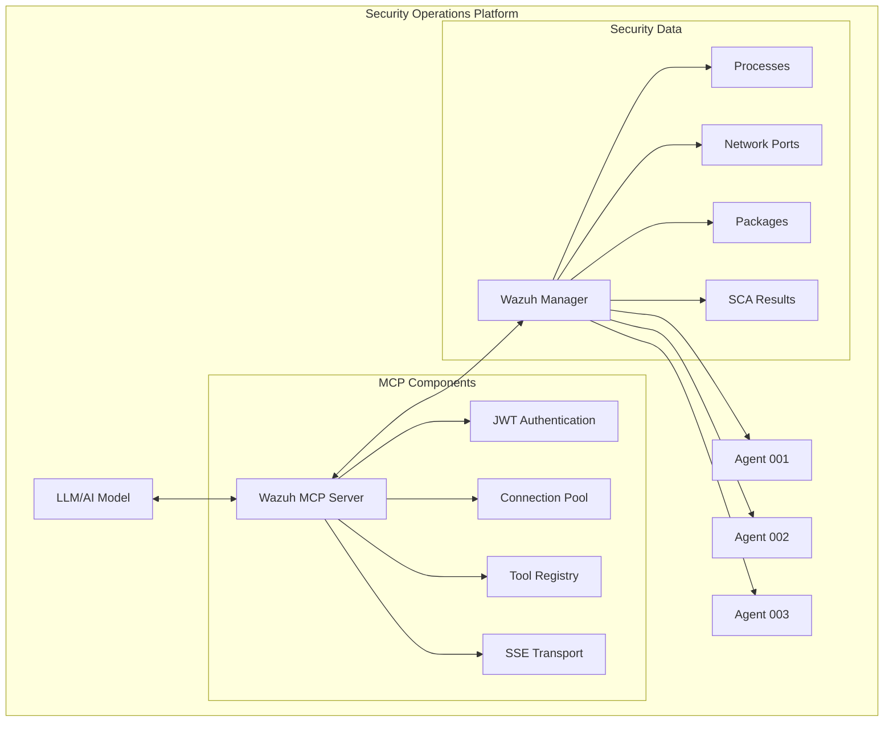
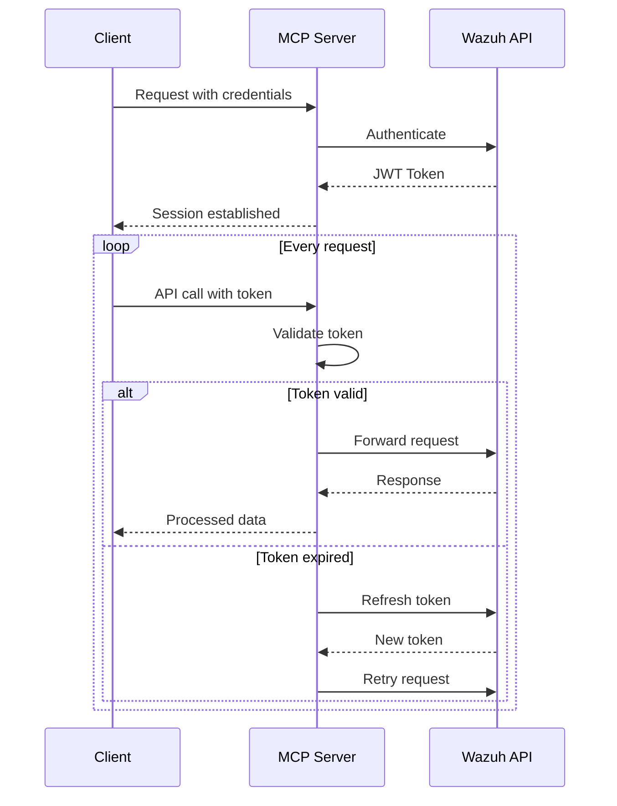

# Wazuh MCP Server: Bridging SIEM and AI for Next-Generation Security Operations

## Executive Summary

The Wazuh MCP Server represents a paradigm shift in security operations, seamlessly bridging the gap between traditional SIEM capabilities and modern AI-powered analysis. By implementing the Model Context Protocol (MCP), this solution enables security teams to leverage natural language interactions with their security data, dramatically reducing the time from detection to response.

## The Challenge in Modern SOCs

Security Operations Centers (SOCs) face unprecedented challenges:

- **Data Overload**: Processing millions of daily security events
- **Complex Queries**: Writing intricate API calls and custom scripts
- **Skill Gap**: Requiring deep platform expertise for effective analysis
- **Response Time**: Manual investigation processes slowing incident response
- **Alert Fatigue**: Struggling to identify critical threats among noise

## What is the Wazuh MCP Server?

The Wazuh MCP Server is a production-ready Python server that acts as an intelligent bridge between Wazuh SIEM and Large Language Models (LLMs). It exposes Wazuh's comprehensive API capabilities as standardized "tools" that AI models can call, enabling natural language interactions with security data.

### Core Architecture



## Key Features & Capabilities

### 1. Production-Ready Infrastructure
- **Enterprise Security**: JWT token management with automatic refresh
- **High Performance**: HTTP/2 support with connection pooling
- **Reliability**: Comprehensive error handling and retry mechanisms
- **Scalability**: Asynchronous architecture supporting concurrent requests

### 2. Comprehensive Tool Suite

```python
# Available Security Tools
WAZUH_MCP_TOOLS = {
    'AuthenticateTool': 'Secure authentication with Wazuh API',
    'GetAgentsTool': 'Retrieve and analyze agent status',
    'GetAgentPortsTool': 'Network port analysis',
    'GetAgentPackagesTool': 'Installed software inventory',
    'GetAgentProcessesTool': 'Running process analysis',
    'ListRulesTool': 'Security rule exploration',
    'GetRuleFileContentTool': 'Rule content inspection',
    'GetRuleFilesTool': 'Rule file management',
    'GetAgentSCATool': 'Security Configuration Assessment'
}
```

### 3. Flexible Configuration

```yaml
# Configuration Options
wazuh:
  url: "https://wazuh-manager:55000"
  username: "admin"
  password: "${WAZUH_PASSWORD}"
  ssl_verify: true
  timeout: 30
  max_retries: 3

server:
  host: "0.0.0.0"
  port: 8000
  log_level: "INFO"
  
security:
  read_only_mode: false
  allowed_tools: ["GetAgents", "GetAgentPorts"]
  disabled_tools: []
```

## Real-World Implementation

### Installation & Setup

```bash
# Python 3.11+ required
python -m venv wazuh-mcp-env
source wazuh-mcp-env/bin/activate

# Install from GitHub
pip install git+https://github.com/socfortress/wazuh-mcp-server.git

# Configure environment
cat > .env << EOF
WAZUH_PROD_URL=https://wazuh.company.com:55000
WAZUH_PROD_USERNAME=admin
WAZUH_PROD_PASSWORD=SecurePassword123!
WAZUH_PROD_SSL_VERIFY=true
EOF

# Launch server
python -m wazuh_mcp_server
```

### Integration with LangChain

```python
from langchain_openai import ChatOpenAI
from langchain.agents import create_openai_tools_agent
from mcp_langchain import MultiServerMCPClient

# Initialize MCP client
mcp_client = MultiServerMCPClient({
    "wazuh-mcp-server": {
        "transport": "sse",
        "url": "http://127.0.0.1:8000/sse/",
        "headers": {
            "Authorization": f"Bearer {JWT_TOKEN}"
        }
    }
})

# Create AI agent with Wazuh tools
llm = ChatOpenAI(model="gpt-4", temperature=0)
tools = await mcp_client.get_tools()
agent = create_openai_tools_agent(llm, tools)

# Natural language security queries
async def analyze_security():
    response = await agent.ainvoke({
        "input": "Show me all Windows agents with suspicious PowerShell processes"
    })
    return response
```

## Transformative Use Cases

### 1. Threat Hunting Automation

```python
# Traditional approach: Complex API calls
response = requests.get(
    f"{WAZUH_URL}/agents",
    headers={"Authorization": f"Bearer {token}"}
)
agents = response.json()["data"]["items"]
for agent in agents:
    if agent["os"]["platform"] == "windows":
        processes = requests.get(
            f"{WAZUH_URL}/syscollector/{agent['id']}/processes",
            headers=headers
        )
        # Complex filtering logic...

# MCP approach: Natural language
"Find all Windows agents running processes with encoded PowerShell commands"
```

### 2. Incident Investigation

```python
# AI-powered investigation workflow
investigation_queries = [
    "List all agents that communicated with IP 192.168.1.100 in the last 24 hours",
    "Show me processes spawned by those agents during that timeframe",
    "Check if any of those processes have unusual network connections",
    "Identify any persistence mechanisms established"
]

for query in investigation_queries:
    result = await agent.ainvoke({"input": query})
    analyze_findings(result)
```

### 3. Compliance Auditing

```python
# Automated compliance checks
compliance_check = """
For all production servers:
1. Verify antivirus is installed and running
2. Check if all critical patches are applied
3. Ensure logging is enabled and functional
4. Validate firewall configurations
Generate a compliance report with any deviations
"""

report = await agent.ainvoke({"input": compliance_check})
```

## Security Architecture

### Authentication Flow



### Security Best Practices

1. **Network Segmentation**
   - Deploy MCP server in DMZ or security zone
   - Use TLS/SSL for all communications
   - Implement firewall rules restricting access

2. **Access Control**
   - Enable read-only mode for analysis tasks
   - Implement tool-level permissions
   - Use service accounts with minimal privileges

3. **Audit & Monitoring**
   - Log all MCP server interactions
   - Monitor for anomalous query patterns
   - Set up alerts for authentication failures

## Performance Optimization

### Connection Pooling Strategy

```python
# Optimized connection configuration
CONNECTION_POOL = {
    'max_connections': 20,
    'max_keepalive_connections': 10,
    'keepalive_expiry': 300,  # 5 minutes
    'http2': True,
    'retries': {
        'max_attempts': 3,
        'backoff_factor': 0.5
    }
}
```

### Query Optimization

```python
# Batch operations for efficiency
async def batch_agent_analysis(agent_ids):
    tasks = []
    for agent_id in agent_ids:
        tasks.append(
            agent.ainvoke({
                "input": f"Analyze security posture of agent {agent_id}"
            })
        )
    results = await asyncio.gather(*tasks)
    return consolidate_results(results)
```

## Advanced Integration Patterns

### 1. SOAR Platform Integration

```python
# Integrate with security orchestration
class WazuhMCPConnector:
    def __init__(self, mcp_url):
        self.client = MultiServerMCPClient({
            "wazuh": {"url": mcp_url, "transport": "sse"}
        })
        
    async def investigate_alert(self, alert_data):
        # AI-driven investigation
        context = f"Investigate alert: {alert_data}"
        findings = await self.client.query(context)
        
        # Automated response
        if findings['severity'] == 'critical':
            await self.isolate_host(findings['agent_id'])
            await self.create_incident_ticket(findings)
        
        return findings
```

### 2. Continuous Threat Hunting

```python
# Automated threat hunting workflow
class ThreatHunter:
    def __init__(self, mcp_client):
        self.mcp = mcp_client
        self.hunting_queries = self.load_hunting_playbook()
    
    async def hunt(self):
        while True:
            for query in self.hunting_queries:
                result = await self.mcp.query(query)
                if self.is_suspicious(result):
                    await self.deep_dive_investigation(result)
            
            await asyncio.sleep(3600)  # Hunt every hour
```

### 3. Intelligent Alert Enrichment

```python
# AI-powered alert enrichment
async def enrich_alert(alert):
    enrichment_prompt = f"""
    Alert: {alert['rule']['description']}
    Agent: {alert['agent']['name']}
    
    Please provide:
    1. Threat context and potential impact
    2. Related IOCs to investigate
    3. Recommended response actions
    4. Similar historical incidents
    """
    
    enriched_data = await mcp_agent.ainvoke({
        "input": enrichment_prompt
    })
    
    return merge_enrichment(alert, enriched_data)
```

## Monitoring & Observability

### Metrics Collection

```python
# Prometheus metrics for MCP server
from prometheus_client import Counter, Histogram, Gauge

mcp_requests_total = Counter(
    'mcp_requests_total', 
    'Total MCP requests',
    ['method', 'tool', 'status']
)

mcp_request_duration = Histogram(
    'mcp_request_duration_seconds',
    'MCP request duration',
    ['method', 'tool']
)

wazuh_agents_active = Gauge(
    'wazuh_agents_active',
    'Number of active Wazuh agents'
)
```

### Logging Configuration

```python
# Structured logging setup
import structlog

logger = structlog.get_logger()

logger.info(
    "mcp_request",
    tool="GetAgentProcesses",
    agent_id="001",
    user="analyst1",
    duration=0.234,
    status="success"
)
```

## Troubleshooting Guide

### Common Issues & Solutions

1. **Connection Timeout**
```bash
# Increase timeout settings
export WAZUH_TIMEOUT=60
python -m wazuh_mcp_server --timeout 60
```

2. **SSL Certificate Verification**
```bash
# For self-signed certificates (dev only)
export WAZUH_PROD_SSL_VERIFY=false

# For custom CA certificates
export SSL_CERT_FILE=/path/to/ca-bundle.crt
```

3. **Rate Limiting**
```python
# Implement rate limiting
from aiohttp import ClientSession
from aiolimiter import AsyncLimiter

rate_limiter = AsyncLimiter(10, 1)  # 10 requests per second

async def rate_limited_request(url):
    async with rate_limiter:
        async with ClientSession() as session:
            return await session.get(url)
```

## Future Roadmap

### Upcoming Features
- **Vector Database Integration**: Store and search security events semantically
- **Multi-tenancy Support**: Isolate data between different organizations
- **Custom Tool Development**: SDK for creating domain-specific tools
- **ML Model Integration**: Direct integration with security-focused ML models
- **Streaming Support**: Real-time event streaming with WebSockets

### Community Contributions
The project welcomes contributions in:
- Additional tool implementations
- LLM framework integrations
- Performance optimizations
- Documentation improvements
- Security enhancements

## Conclusion

The Wazuh MCP Server fundamentally transforms how security teams interact with their SIEM data. By bridging the gap between traditional security tools and modern AI capabilities, it enables:

- **Faster Investigation**: Natural language queries eliminate complex scripting
- **Democratized Access**: Junior analysts can perform advanced analysis
- **Automated Workflows**: AI-driven investigation and response
- **Reduced MTTR**: Accelerated threat detection and response
- **Enhanced Coverage**: Continuous, intelligent threat hunting

As security threats evolve, the combination of Wazuh's comprehensive monitoring and AI's analytical capabilities positions organizations to stay ahead of adversaries while optimizing their security operations.

## Resources

- [GitHub Repository](https://github.com/socfortress/wazuh-mcp-server)
- [Wazuh Documentation](https://documentation.wazuh.com)
- [MCP Specification](https://modelcontextprotocol.io)
- [SOCFortress Platform](https://www.socfortress.co/)
- [LangChain Integration Guide](https://python.langchain.com)

## Get Started

Ready to revolutionize your security operations? Deploy the Wazuh MCP Server today and experience the future of AI-powered security analysis.

```bash
# Quick start
pip install git+https://github.com/socfortress/wazuh-mcp-server.git
python -m wazuh_mcp_server
```

Join the community and contribute to the evolution of intelligent security operations.