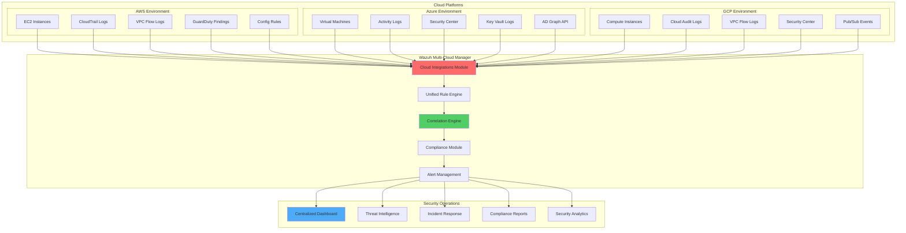

# Multi-Cloud Security Monitoring with Wazuh: AWS, Azure, and GCP Integration

## Introduction

As organizations increasingly adopt multi-cloud strategies, securing distributed cloud environments becomes a critical challenge. Managing security across Amazon Web Services (AWS), Microsoft Azure, and Google Cloud Platform (GCP) requires unified visibility and consistent monitoring capabilities.

Wazuh provides a comprehensive solution for multi-cloud security monitoring by offering:

- 🌐 **Unified Security Dashboard**: Centralized monitoring across all cloud platforms
- 🔍 **Real-time Threat Detection**: Immediate identification of security threats
- 📊 **Compliance Management**: Automated compliance reporting across clouds
- ⚡ **Scalable Architecture**: Support for enterprise-scale cloud deployments
- 🛡️ **Native Cloud Integration**: Deep integration with cloud-native security services

## Multi-Cloud Security Architecture

### Unified Monitoring Framework



### Key Integration Benefits

| Feature | Single Cloud | Multi-Cloud with Wazuh |
|---------|--------------|------------------------|
| **Visibility** | Platform-specific | Unified across all clouds |
| **Alerting** | Separate consoles | Centralized alert management |
| **Compliance** | Manual correlation | Automated cross-cloud compliance |
| **Threat Detection** | Platform-native only | Enhanced with correlation |
| **Cost** | Multiple tools | Single platform solution |

## AWS Integration Implementation

### Phase 1: AWS Service Configuration

#### CloudTrail Integration

CloudTrail provides audit logging for AWS API calls, which is essential for security monitoring:

```json
{
  "cloudtrail_config": {
    "trail_name": "wazuh-security-trail",
    "s3_bucket": "wazuh-cloudtrail-logs-bucket",
    "include_global_service_events": true,
    "is_multi_region_trail": true,
    "enable_log_file_validation": true,
    "event_selectors": [
      {
        "read_write_type": "All",
        "include_management_events": true,
        "data_resources": [
          {
            "type": "AWS::S3::Object",
            "values": ["arn:aws:s3:::sensitive-data-bucket/*"]
          },
          {
            "type": "AWS::Lambda::Function",
            "values": ["*"]
          }
        ]
      }
    ]
  }
}
```

#### Terraform Configuration for AWS Integration

```hcl
# AWS CloudTrail for Wazuh Integration
resource "aws_cloudtrail" "wazuh_trail" {
  name                         = "wazuh-security-trail"
  s3_bucket_name              = aws_s3_bucket.wazuh_logs.bucket
  include_global_service_events = true
  is_multi_region_trail       = true
  enable_log_file_validation  = true

  event_selector {
    read_write_type                 = "All"
    include_management_events       = true

    data_resource {
      type   = "AWS::S3::Object"
      values = ["arn:aws:s3:::${aws_s3_bucket.sensitive_data.bucket}/*"]
    }

    data_resource {
      type   = "AWS::Lambda::Function"  
      values = ["*"]
    }
  }

  tags = {
    Environment = "production"
    Purpose     = "security-monitoring"
    ManagedBy   = "wazuh"
  }
}

# S3 Bucket for CloudTrail logs
resource "aws_s3_bucket" "wazuh_logs" {
  bucket        = "wazuh-cloudtrail-logs-${random_id.bucket_suffix.hex}"
  force_destroy = false

  tags = {
    Name        = "Wazuh CloudTrail Logs"
    Environment = "production"
  }
}

# S3 Bucket policy for CloudTrail
resource "aws_s3_bucket_policy" "wazuh_logs_policy" {
  bucket = aws_s3_bucket.wazuh_logs.id

  policy = jsonencode({
    Version = "2012-10-17"
    Statement = [
      {
        Sid    = "AWSCloudTrailAclCheck"
        Effect = "Allow"
        Principal = {
          Service = "cloudtrail.amazonaws.com"
        }
        Action   = "s3:GetBucketAcl"
        Resource = aws_s3_bucket.wazuh_logs.arn
        Condition = {
          StringEquals = {
            "AWS:SourceArn" = aws_cloudtrail.wazuh_trail.arn
          }
        }
      },
      {
        Sid    = "AWSCloudTrailWrite"
        Effect = "Allow"
        Principal = {
          Service = "cloudtrail.amazonaws.com"
        }
        Action   = "s3:PutObject"
        Resource = "${aws_s3_bucket.wazuh_logs.arn}/*"
        Condition = {
          StringEquals = {
            "s3:x-amz-acl" = "bucket-owner-full-control"
            "AWS:SourceArn" = aws_cloudtrail.wazuh_trail.arn
          }
        }
      }
    ]
  })
}

# IAM Role for Wazuh AWS Integration
resource "aws_iam_role" "wazuh_integration_role" {
  name = "WazuhIntegrationRole"

  assume_role_policy = jsonencode({
    Version = "2012-10-17"
    Statement = [
      {
        Action = "sts:AssumeRole"
        Effect = "Allow"
        Principal = {
          AWS = "arn:aws:iam::${data.aws_caller_identity.current.account_id}:root"
        }
        Condition = {
          StringEquals = {
            "sts:ExternalId" = var.wazuh_external_id
          }
        }
      }
    ]
  })
}

# IAM Policy for Wazuh integration
resource "aws_iam_policy" "wazuh_integration_policy" {
  name        = "WazuhIntegrationPolicy"
  description = "Policy for Wazuh AWS integration"

  policy = jsonencode({
    Version = "2012-10-17"
    Statement = [
      {
        Effect = "Allow"
        Action = [
          "s3:GetObject",
          "s3:ListBucket",
          "s3:GetBucketLocation"
        ]
        Resource = [
          aws_s3_bucket.wazuh_logs.arn,
          "${aws_s3_bucket.wazuh_logs.arn}/*"
        ]
      },
      {
        Effect = "Allow"
        Action = [
          "guardduty:GetDetector",
          "guardduty:ListDetectors",
          "guardduty:GetFindings",
          "guardduty:ListFindings"
        ]
        Resource = "*"
      },
      {
        Effect = "Allow"
        Action = [
          "config:GetComplianceDetailsByConfigRule",
          "config:GetConfigRuleEvaluationStatus",
          "config:DescribeConfigRules"
        ]
        Resource = "*"
      },
      {
        Effect = "Allow"
        Action = [
          "inspector:DescribeFindings",
          "inspector:ListFindings",
          "inspector:DescribeAssessmentRuns"
        ]
        Resource = "*"
      }
    ]
  })
}

# Attach policy to role
resource "aws_iam_role_policy_attachment" "wazuh_integration_attachment" {
  role       = aws_iam_role.wazuh_integration_role.name
  policy_arn = aws_iam_policy.wazuh_integration_policy.arn
}

# VPC Flow Logs for network monitoring
resource "aws_flow_log" "wazuh_vpc_flow_logs" {
  iam_role_arn    = aws_iam_role.flow_log.arn
  log_destination = aws_cloudwatch_log_group.vpc_flow_logs.arn
  traffic_type    = "ALL"
  vpc_id          = aws_vpc.main.id
}
```

### Phase 2: Wazuh AWS Module Configuration

Configure the AWS integration module in `/var/ossec/etc/ossec.conf`:

```xml
<ossec_config>
  <!-- AWS CloudTrail Integration -->
  <wodle name="aws-s3">
    <disabled>no</disabled>
    <interval>10m</interval>
    <run_on_start>yes</run_on_start>
    <skip_on_error>yes</skip_on_error>
    
    <!-- CloudTrail Configuration -->
    <bucket type="cloudtrail">
      <name>wazuh-cloudtrail-logs-bucket</name>
      <access_key>AKIA...</access_key>
      <secret_key>SECRET_KEY</secret_key>
      <aws_profile>wazuh</aws_profile>
      <iam_role_arn>arn:aws:iam::123456789012:role/WazuhIntegrationRole</iam_role_arn>
      <iam_role_duration>3600</iam_role_duration>
      <region>us-east-1</region>
      <path>AWSLogs/123456789012/CloudTrail/</path>
      <only_logs_after>2025-01-01</only_logs_after>
    </bucket>
    
    <!-- VPC Flow Logs Configuration -->
    <bucket type="vpcflowlogs">
      <name>wazuh-vpc-flow-logs-bucket</name>
      <aws_profile>wazuh</aws_profile>
      <iam_role_arn>arn:aws:iam::123456789012:role/WazuhIntegrationRole</iam_role_arn>
      <region>us-east-1</region>
      <path>vpc-flow-logs/</path>
    </bucket>
    
    <!-- Config Rules -->
    <bucket type="config">
      <name>wazuh-config-bucket</name>
      <aws_profile>wazuh</aws_profile>
      <iam_role_arn>arn:aws:iam::123456789012:role/WazuhIntegrationRole</iam_role_arn>
      <region>us-east-1</region>
      <path>AWSLogs/123456789012/Config/</path>
    </bucket>
  </wodle>
  
  <!-- AWS GuardDuty Integration -->
  <wodle name="aws-guardduty">
    <disabled>no</disabled>
    <interval>10m</interval>
    <run_on_start>yes</run_on_start>
    <skip_on_error>yes</skip_on_error>
    
    <detector>
      <aws_profile>wazuh</aws_profile>
      <iam_role_arn>arn:aws:iam::123456789012:role/WazuhIntegrationRole</iam_role_arn>
      <region>us-east-1</region>
      <detector_id>1ab23c4d5e6f7890g1h23i4j56k7l8m9</detector_id>
      <only_logs_after>2025-01-01</only_logs_after>
    </detector>
  </wodle>
  
  <!-- AWS Inspector Integration -->
  <wodle name="aws-inspector">
    <disabled>no</disabled>
    <interval>12h</interval>
    <run_on_start>yes</run_on_start>
    <skip_on_error>yes</skip_on_error>
    
    <assessment>
      <aws_profile>wazuh</aws_profile>
      <iam_role_arn>arn:aws:iam::123456789012:role/WazuhIntegrationRole</iam_role_arn>
      <region>us-east-1</region>
    </assessment>
  </wodle>
</ossec_config>
```

### Phase 3: Advanced AWS Security Rules

Create comprehensive AWS-specific security rules in `/var/ossec/etc/rules/local_rules.xml`:

```xml
<group name="aws,cloud,">
  
  <!-- AWS Root Account Usage -->
  <rule id="400001" level="12">
    <if_group>amazon</if_group>
    <field name="userIdentity.type">Root</field>
    <description>AWS Root account used: $(userIdentity.arn) from $(sourceIPAddress)</description>
    <group>aws_root_usage,policy_violation,</group>
    <options>no_full_log</options>
  </rule>

  <!-- Suspicious Console Logins -->
  <rule id="400002" level="8">
    <if_group>amazon</if_group>
    <field name="eventName">ConsoleLogin</field>
    <field name="responseElements.ConsoleLogin">Success</field>
    <field name="sourceIPAddress" type="pcre2">^(?!10\.|172\.1[6-9]\.|172\.2[0-9]\.|172\.3[0-1]\.|192\.168\.)</field>
    <description>AWS Console login from external IP: $(userIdentity.userName) from $(sourceIPAddress)</description>
    <group>aws_console_login,authentication,</group>
  </rule>

  <!-- Failed Console Login Attempts -->
  <rule id="400003" level="6" frequency="3" timeframe="300">
    <if_group>amazon</if_group>
    <field name="eventName">ConsoleLogin</field>
    <field name="responseElements.ConsoleLogin">Failure</field>
    <same_field>sourceIPAddress</same_field>
    <description>AWS Multiple failed console login attempts from $(sourceIPAddress)</description>
    <group>aws_console_login,authentication_failed,</group>
  </rule>

  <!-- Privilege Escalation Detection -->
  <rule id="400010" level="10">
    <if_group>amazon</if_group>
    <field name="eventName">AttachUserPolicy|AttachRolePolicy|PutUserPolicy|PutRolePolicy</field>
    <field name="responseElements" type="pcre2">(Admin|Root|PowerUser)</field>
    <description>AWS Privilege escalation attempt: $(eventName) for $(responseElements.user.userName)</description>
    <group>aws_privilege_escalation,policy_violation,</group>
  </rule>

  <!-- Unauthorized IAM User Creation -->
  <rule id="400011" level="8">
    <if_group>amazon</if_group>
    <field name="eventName">CreateUser</field>
    <field name="sourceIPAddress" type="pcre2">^(?!10\.|172\.1[6-9]\.|172\.2[0-9]\.|172\.3[0-1]\.|192\.168\.)</field>
    <description>AWS IAM user created from external IP: $(responseElements.user.userName) from $(sourceIPAddress)</description>
    <group>aws_iam_user_creation,</group>
  </rule>

  <!-- EC2 Security Group Changes -->
  <rule id="400020" level="6">
    <if_group>amazon</if_group>
    <field name="eventName">AuthorizeSecurityGroupIngress|RevokeSecurityGroupIngress</field>
    <description>AWS Security Group modified: $(eventName) for $(requestParameters.groupId) by $(userIdentity.userName)</description>
    <group>aws_security_group,network_change,</group>
  </rule>

  <!-- Dangerous Security Group Rules -->
  <rule id="400021" level="10">
    <if_sid>400020</if_sid>
    <field name="requestParameters.ipPermissions.items.ipRanges.items.cidrIp">0.0.0.0/0</field>
    <field name="requestParameters.ipPermissions.items.fromPort">22|3389</field>
    <description>AWS Dangerous security group rule: SSH/RDP open to 0.0.0.0/0 for $(requestParameters.groupId)</description>
    <group>aws_security_group,dangerous_rule,</group>
  </rule>

  <!-- S3 Bucket Policy Changes -->
  <rule id="400030" level="7">
    <if_group>amazon</if_group>
    <field name="eventName">PutBucketPolicy|DeleteBucketPolicy|PutBucketAcl</field>
    <description>AWS S3 bucket policy changed: $(eventName) for $(requestParameters.bucketName)</description>
    <group>aws_s3_policy,</group>
  </rule>

  <!-- S3 Public Access Block Disabled -->
  <rule id="400031" level="10">
    <if_group>amazon</if_group>
    <field name="eventName">DeletePublicAccessBlock</field>
    <description>AWS S3 Public Access Block disabled for bucket: $(requestParameters.bucketName)</description>
    <group>aws_s3_public,data_exposure,</group>
  </rule>

  <!-- CloudTrail Tampering -->
  <rule id="400040" level="12">
    <if_group>amazon</if_group>
    <field name="eventName">StopLogging|DeleteTrail|PutEventSelectors</field>
    <description>AWS CloudTrail tampering detected: $(eventName) by $(userIdentity.userName)</description>
    <group>aws_cloudtrail_tampering,log_tampering,</group>
  </rule>

  <!-- GuardDuty Findings -->
  <rule id="400050" level="8">
    <if_group>amazon-guardduty</if_group>
    <field name="severity" type="pcre2">[5-9]\.|10\.0</field>
    <description>AWS GuardDuty High Severity Finding: $(title) - $(type)</description>
    <group>aws_guardduty,threat_detection,</group>
  </rule>

  <!-- Critical GuardDuty Findings -->
  <rule id="400051" level="12">
    <if_group>amazon-guardduty</if_group>
    <field name="severity" type="pcre2">[8-9]\.|10\.0</field>
    <field name="type">Backdoor|CryptoCurrency|Malware|Persistence|Trojan</field>
    <description>AWS GuardDuty Critical Finding: $(title) - Instance: $(service.resourceRole)</description>
    <group>aws_guardduty,critical_threat,</group>
  </rule>

  <!-- VPC Flow Log Analysis -->
  <rule id="400060" level="5">
    <if_group>amazon-vpcflowlogs</if_group>
    <field name="action">REJECT</field>
    <field name="dstport">22|3389|445|135|139</field>
    <description>AWS VPC Flow: Blocked connection attempt to $(dstaddr):$(dstport) from $(srcaddr)</description>
    <group>aws_vpc_flow,blocked_connection,</group>
  </rule>

  <!-- DDoS Attack Detection -->
  <rule id="400061" level="8" frequency="100" timeframe="60">
    <if_group>amazon-vpcflowlogs</if_group>
    <field name="action">REJECT</field>
    <same_field>srcaddr</same_field>
    <description>AWS VPC Flow: Possible DDoS attack from $(srcaddr)</description>
    <group>aws_vpc_flow,ddos_attack,</group>
  </rule>

  <!-- Config Compliance Violations -->
  <rule id="400070" level="6">
    <if_group>amazon-config</if_group>
    <field name="configurationItem.complianceType">NON_COMPLIANT</field>
    <description>AWS Config Compliance Violation: $(configRuleName) - $(configurationItem.resourceType)</description>
    <group>aws_config,compliance_violation,</group>
  </rule>

  <!-- Critical Compliance Violations -->
  <rule id="400071" level="10">
    <if_sid>400070</if_sid>
    <field name="configRuleName">encrypted|public|security-group|iam</field>
    <description>AWS Config Critical Compliance Violation: $(configRuleName)</description>
    <group>aws_config,critical_compliance,</group>
  </rule>

</group>
```

## Azure Integration Implementation

### Phase 1: Azure Service Configuration

#### Log Analytics Workspace Setup

```bash
#!/bin/bash
# Azure Log Analytics Workspace Setup for Wazuh Integration

# Variables
RESOURCE_GROUP="wazuh-monitoring-rg"
WORKSPACE_NAME="wazuh-log-analytics"
LOCATION="eastus"
STORAGE_ACCOUNT="wazuhlogsstorage"

# Create Resource Group
az group create --name $RESOURCE_GROUP --location $LOCATION

# Create Log Analytics Workspace
az monitor log-analytics workspace create \
  --resource-group $RESOURCE_GROUP \
  --workspace-name $WORKSPACE_NAME \
  --location $LOCATION \
  --sku PerGB2018 \
  --retention-time 90

# Get Workspace ID and Key
WORKSPACE_ID=$(az monitor log-analytics workspace show \
  --resource-group $RESOURCE_GROUP \
  --workspace-name $WORKSPACE_NAME \
  --query customerId -o tsv)

WORKSPACE_KEY=$(az monitor log-analytics workspace get-shared-keys \
  --resource-group $RESOURCE_GROUP \
  --workspace-name $WORKSPACE_NAME \
  --query primarySharedKey -o tsv)

# Create Storage Account for Activity Logs
az storage account create \
  --name $STORAGE_ACCOUNT \
  --resource-group $RESOURCE_GROUP \
  --location $LOCATION \
  --sku Standard_LRS \
  --kind StorageV2

# Enable Activity Log export to Log Analytics
az monitor diagnostic-settings create \
  --resource-group $RESOURCE_GROUP \
  --name "wazuh-activity-logs" \
  --resource "/subscriptions/$(az account show --query id -o tsv)" \
  --workspace $WORKSPACE_ID \
  --logs '[{"category": "Administrative", "enabled": true}, 
          {"category": "Security", "enabled": true}, 
          {"category": "Alert", "enabled": true}]'

echo "Workspace ID: $WORKSPACE_ID"
echo "Workspace Key: $WORKSPACE_KEY"
```

### Phase 2: Azure AD Application Registration

Create a service principal for Wazuh Azure integration:

```bash
#!/bin/bash
# Create Azure AD Application for Wazuh Integration

APP_NAME="WazuhAzureIntegration"
SUBSCRIPTION_ID=$(az account show --query id -o tsv)
TENANT_ID=$(az account show --query tenantId -o tsv)

# Create Azure AD Application
APP_ID=$(az ad app create \
  --display-name $APP_NAME \
  --query appId -o tsv)

# Create Service Principal
az ad sp create --id $APP_ID

# Get Application Secret
CLIENT_SECRET=$(az ad app credential reset \
  --id $APP_ID \
  --query password -o tsv)

# Assign Reader role to subscription
az role assignment create \
  --assignee $APP_ID \
  --role "Reader" \
  --scope "/subscriptions/$SUBSCRIPTION_ID"

# Assign Security Reader role
az role assignment create \
  --assignee $APP_ID \
  --role "Security Reader" \
  --scope "/subscriptions/$SUBSCRIPTION_ID"

# Create custom role for Log Analytics
az role definition create --role-definition '{
  "Name": "Wazuh Log Analytics Reader",
  "Description": "Can read Log Analytics data for Wazuh integration",
  "Actions": [
    "Microsoft.OperationalInsights/workspaces/read",
    "Microsoft.OperationalInsights/workspaces/query/action",
    "Microsoft.OperationalInsights/workspaces/query/*/read",
    "Microsoft.OperationalInsights/workspaces/analytics/query/action"
  ],
  "AssignableScopes": ["/subscriptions/'$SUBSCRIPTION_ID'"]
}'

# Assign custom role
az role assignment create \
  --assignee $APP_ID \
  --role "Wazuh Log Analytics Reader" \
  --scope "/subscriptions/$SUBSCRIPTION_ID"

echo "Application ID: $APP_ID"
echo "Client Secret: $CLIENT_SECRET"
echo "Tenant ID: $TENANT_ID"
echo "Subscription ID: $SUBSCRIPTION_ID"
```

### Phase 3: Wazuh Azure Module Configuration

Configure Azure integration in `/var/ossec/etc/ossec.conf`:

```xml
<ossec_config>
  <!-- Azure Log Analytics Integration -->
  <wodle name="azure-logs">
    <disabled>no</disabled>
    <interval>5m</interval>
    <run_on_start>yes</run_on_start>
    <skip_on_error>yes</skip_on_error>
    
    <!-- Log Analytics Configuration -->
    <log_analytics>
      <auth_path>/var/ossec/wodles/azure/credentials</auth_path>
      <tenantdomain>your-tenant.onmicrosoft.com</tenantdomain>
      <request>
        <tag>azure-activity</tag>
        <query>AzureActivity | where TimeGenerated > ago(5m)</query>
        <workspace>12345678-1234-1234-1234-123456789012</workspace>
        <time_offset>5m</time_offset>
      </request>
      <request>
        <tag>azure-signin</tag>
        <query>SigninLogs | where TimeGenerated > ago(5m)</query>
        <workspace>12345678-1234-1234-1234-123456789012</workspace>
        <time_offset>5m</time_offset>
      </request>
      <request>
        <tag>azure-audit</tag>
        <query>AuditLogs | where TimeGenerated > ago(5m)</query>
        <workspace>12345678-1234-1234-1234-123456789012</workspace>
        <time_offset>5m</time_offset>
      </request>
      <request>
        <tag>azure-security</tag>
        <query>SecurityAlert | where TimeGenerated > ago(5m)</query>
        <workspace>12345678-1234-1234-1234-123456789012</workspace>
        <time_offset>5m</time_offset>
      </request>
    </log_analytics>
    
    <!-- Storage Configuration -->
    <storage>
      <auth_path>/var/ossec/wodles/azure/credentials</auth_path>
      <container name="insights-logs-audit">
        <blobs>.json</blobs>
        <content_type>json_inline</content_type>
        <path>resourceId=/SUBSCRIPTIONS/12345678-1234-1234-1234-123456789012</path>
      </container>
    </storage>
  </wodle>
</ossec_config>
```

### Phase 4: Azure Credentials Configuration

Create the Azure credentials file at `/var/ossec/wodles/azure/credentials`:

```ini
[azure-logs]
client_id = APPLICATION_ID
secret = CLIENT_SECRET
domain = TENANT_ID
auth_path = /var/ossec/wodles/azure/credentials
```

### Phase 5: Azure Security Rules

Create Azure-specific security rules:

```xml
<group name="azure,cloud,">
  
  <!-- Successful Admin Login from External IP -->
  <rule id="500001" level="8">
    <if_group>azure</if_group>
    <field name="Category">SignInLogs</field>
    <field name="properties.status.errorCode">0</field>
    <field name="properties.userPrincipalName" type="pcre2">.*admin.*|.*root.*</field>
    <field name="properties.ipAddress" type="pcre2">^(?!10\.|172\.1[6-9]\.|172\.2[0-9]\.|172\.3[0-1]\.|192\.168\.)</field>
    <description>Azure: Admin login from external IP $(properties.userPrincipalName) from $(properties.ipAddress)</description>
    <group>azure_admin_login,authentication,</group>
  </rule>

  <!-- Failed Login Attempts -->
  <rule id="500002" level="6" frequency="5" timeframe="300">
    <if_group>azure</if_group>
    <field name="Category">SignInLogs</field>
    <field name="properties.status.errorCode" type="pcre2">^(?!0$)</field>
    <same_field>properties.ipAddress</same_field>
    <description>Azure: Multiple failed login attempts from $(properties.ipAddress)</description>
    <group>azure_failed_login,brute_force,</group>
  </rule>

  <!-- Suspicious Application Consent -->
  <rule id="500010" level="9">
    <if_group>azure</if_group>
    <field name="Category">AuditLogs</field>
    <field name="properties.activityDisplayName">Consent to application</field>
    <field name="properties.targetResources.type">Application</field>
    <description>Azure: Suspicious application consent by $(properties.initiatedBy.user.userPrincipalName)</description>
    <group>azure_app_consent,privilege_escalation,</group>
  </rule>

  <!-- Role Assignment Changes -->
  <rule id="500011" level="7">
    <if_group>azure</if_group>
    <field name="Category">AuditLogs</field>
    <field name="properties.activityDisplayName">Add member to role</field>
    <field name="properties.targetResources.modifiedProperties.newValue" type="pcre2">(Admin|Owner|Contributor)</field>
    <description>Azure: Privileged role assignment - $(properties.targetResources.modifiedProperties.newValue)</description>
    <group>azure_role_assignment,privilege_escalation,</group>
  </rule>

  <!-- Resource Group Deletion -->
  <rule id="500020" level="10">
    <if_group>azure</if_group>
    <field name="Category">AzureActivity</field>
    <field name="properties.eventName.value">Microsoft.Resources/subscriptions/resourcegroups/delete</field>
    <field name="properties.status.value">Succeeded</field>
    <description>Azure: Resource group deleted - $(properties.resourceGroupName) by $(properties.caller)</description>
    <group>azure_resource_deletion,</group>
  </rule>

  <!-- Virtual Machine Deletion -->
  <rule id="500021" level="9">
    <if_group>azure</if_group>
    <field name="Category">AzureActivity</field>
    <field name="properties.eventName.value">Microsoft.Compute/virtualMachines/delete</field>
    <field name="properties.status.value">Succeeded</field>
    <description>Azure: Virtual machine deleted - $(properties.resourceId) by $(properties.caller)</description>
    <group>azure_vm_deletion,</group>
  </rule>

  <!-- Security Center Alerts -->
  <rule id="500030" level="8">
    <if_group>azure</if_group>
    <field name="Category">SecurityAlert</field>
    <field name="properties.severity">High|Medium</field>
    <description>Azure Security Center Alert: $(properties.alertDisplayName) - $(properties.description)</description>
    <group>azure_security_alert,</group>
  </rule>

  <!-- Critical Security Alerts -->
  <rule id="500031" level="12">
    <if_sid>500030</if_sid>
    <field name="properties.severity">High</field>
    <field name="properties.alertDisplayName" type="pcre2">(Malware|Ransomware|Suspicious|Attack)</field>
    <description>Azure Critical Security Alert: $(properties.alertDisplayName)</description>
    <group>azure_critical_alert,</group>
  </rule>

  <!-- Key Vault Access -->
  <rule id="500040" level="6">
    <if_group>azure</if_group>
    <field name="Category">AzureActivity</field>
    <field name="properties.resourceProvider.value">Microsoft.KeyVault</field>
    <field name="properties.eventName.value" type="pcre2">(get|list|delete)</field>
    <description>Azure: Key Vault access - $(properties.eventName.value) by $(properties.caller)</description>
    <group>azure_key_vault,</group>
  </rule>

  <!-- Suspicious Key Vault Activity -->
  <rule id="500041" level="9">
    <if_sid>500040</if_sid>
    <field name="properties.caller" type="pcre2">^(?!.*@yourdomain\.com$)</field>
    <description>Azure: Suspicious Key Vault access from external user $(properties.caller)</description>
    <group>azure_key_vault,suspicious_access,</group>
  </rule>

</group>
```

## GCP Integration Implementation

### Phase 1: GCP Service Account and Permissions

Create a service account for Wazuh integration:

```bash
#!/bin/bash
# GCP Service Account Setup for Wazuh Integration

PROJECT_ID="your-project-id"
SERVICE_ACCOUNT="wazuh-integration"
SERVICE_ACCOUNT_EMAIL="$SERVICE_ACCOUNT@$PROJECT_ID.iam.gserviceaccount.com"
KEY_FILE="/var/ossec/wodles/gcp/credentials.json"

# Create service account
gcloud iam service-accounts create $SERVICE_ACCOUNT \
    --description="Wazuh GCP Integration Service Account" \
    --display-name="Wazuh Integration"

# Grant necessary roles
gcloud projects add-iam-policy-binding $PROJECT_ID \
    --member="serviceAccount:$SERVICE_ACCOUNT_EMAIL" \
    --role="roles/logging.viewer"

gcloud projects add-iam-policy-binding $PROJECT_ID \
    --member="serviceAccount:$SERVICE_ACCOUNT_EMAIL" \
    --role="roles/monitoring.viewer"

gcloud projects add-iam-policy-binding $PROJECT_ID \
    --member="serviceAccount:$SERVICE_ACCOUNT_EMAIL" \
    --role="roles/securitycenter.findingsViewer"

gcloud projects add-iam-policy-binding $PROJECT_ID \
    --member="serviceAccount:$SERVICE_ACCOUNT_EMAIL" \
    --role="roles/compute.viewer"

gcloud projects add-iam-policy-binding $PROJECT_ID \
    --member="serviceAccount:$SERVICE_ACCOUNT_EMAIL" \
    --role="roles/cloudsql.viewer"

# Generate and download service account key
gcloud iam service-accounts keys create $KEY_FILE \
    --iam-account=$SERVICE_ACCOUNT_EMAIL

# Set proper permissions
chmod 600 $KEY_FILE
chown ossec:ossec $KEY_FILE

echo "Service account created: $SERVICE_ACCOUNT_EMAIL"
echo "Key file saved to: $KEY_FILE"
```

### Phase 2: GCP Pub/Sub Configuration

Set up Pub/Sub for log forwarding:

```bash
#!/bin/bash
# GCP Pub/Sub Setup for Wazuh Integration

PROJECT_ID="your-project-id"
TOPIC_NAME="wazuh-security-logs"
SUBSCRIPTION_NAME="wazuh-subscription"
SERVICE_ACCOUNT_EMAIL="wazuh-integration@$PROJECT_ID.iam.gserviceaccount.com"

# Create Pub/Sub topic
gcloud pubsub topics create $TOPIC_NAME

# Create subscription
gcloud pubsub subscriptions create $SUBSCRIPTION_NAME \
    --topic=$TOPIC_NAME \
    --ack-deadline=300

# Grant Pub/Sub permissions to service account
gcloud pubsub topics add-iam-policy-binding $TOPIC_NAME \
    --member="serviceAccount:$SERVICE_ACCOUNT_EMAIL" \
    --role="roles/pubsub.subscriber"

gcloud pubsub subscriptions add-iam-policy-binding $SUBSCRIPTION_NAME \
    --member="serviceAccount:$SERVICE_ACCOUNT_EMAIL" \
    --role="roles/pubsub.subscriber"

# Create log sink to Pub/Sub
gcloud logging sinks create wazuh-security-sink \
    pubsub.googleapis.com/projects/$PROJECT_ID/topics/$TOPIC_NAME \
    --log-filter='protoPayload.serviceName="compute.googleapis.com" OR 
                  protoPayload.serviceName="cloudsql.googleapis.com" OR
                  protoPayload.serviceName="iam.googleapis.com" OR
                  protoPayload.serviceName="container.googleapis.com" OR
                  severity>=ERROR'

# Get sink service account
SINK_SA=$(gcloud logging sinks describe wazuh-security-sink --format="value(writerIdentity)")

# Grant Pub/Sub publisher role to sink service account
gcloud pubsub topics add-iam-policy-binding $TOPIC_NAME \
    --member="$SINK_SA" \
    --role="roles/pubsub.publisher"

echo "Pub/Sub topic created: $TOPIC_NAME"
echo "Subscription created: $SUBSCRIPTION_NAME"
echo "Log sink created: wazuh-security-sink"
```

### Phase 3: Wazuh GCP Module Configuration

Configure GCP integration in `/var/ossec/etc/ossec.conf`:

```xml
<ossec_config>
  <!-- Google Cloud Pub/Sub Integration -->
  <wodle name="gcp-pubsub">
    <disabled>no</disabled>
    <interval>5m</interval>
    <run_on_start>yes</run_on_start>
    <skip_on_error>yes</skip_on_error>
    
    <!-- Pub/Sub Configuration -->
    <pull>
      <project_id>your-project-id</project_id>
      <subscription_name>wazuh-subscription</subscription_name>
      <credentials_file>/var/ossec/wodles/gcp/credentials.json</credentials_file>
      <max_messages>100</max_messages>
      <logging>debug</logging>
    </pull>
  </wodle>
  
  <!-- Google Cloud Storage Bucket Integration -->
  <wodle name="gcp-bucket">
    <disabled>no</disabled>
    <interval>10m</interval>
    <run_on_start>yes</run_on_start>
    <skip_on_error>yes</skip_on_error>
    
    <bucket>
      <name>wazuh-gcp-logs-bucket</name>
      <credentials_file>/var/ossec/wodles/gcp/credentials.json</credentials_file>
      <prefix>security-logs/</prefix>
      <only_logs_after>2025-01-01</only_logs_after>
      <remove_from_bucket>no</remove_from_bucket>
    </bucket>
  </wodle>
</ossec_config>
```

### Phase 4: GCP Security Rules

Create GCP-specific security rules:

```xml
<group name="gcp,cloud,">
  
  <!-- VM Instance Creation -->
  <rule id="600001" level="6">
    <if_group>gcp</if_group>
    <field name="protoPayload.serviceName">compute.googleapis.com</field>
    <field name="protoPayload.methodName">v1.compute.instances.insert</field>
    <field name="severity">NOTICE</field>
    <description>GCP: VM instance created - $(protoPayload.resourceName) by $(protoPayload.authenticationInfo.principalEmail)</description>
    <group>gcp_vm_creation,</group>
  </rule>

  <!-- Suspicious VM Creation -->
  <rule id="600002" level="8">
    <if_sid>600001</if_sid>
    <field name="protoPayload.authenticationInfo.principalEmail" type="pcre2">^(?!.*@yourdomain\.com$)</field>
    <description>GCP: Suspicious VM creation by external user $(protoPayload.authenticationInfo.principalEmail)</description>
    <group>gcp_vm_creation,suspicious,</group>
  </rule>

  <!-- IAM Policy Changes -->
  <rule id="600010" level="7">
    <if_group>gcp</if_group>
    <field name="protoPayload.serviceName">iam.googleapis.com</field>
    <field name="protoPayload.methodName">SetIamPolicy</field>
    <description>GCP: IAM policy changed for $(protoPayload.resourceName) by $(protoPayload.authenticationInfo.principalEmail)</description>
    <group>gcp_iam_policy,</group>
  </rule>

  <!-- Privilege Escalation -->
  <rule id="600011" level="10">
    <if_sid>600010</if_sid>
    <field name="protoPayload.request.policy.bindings.role" type="pcre2">(owner|editor|admin)</field>
    <description>GCP: Privileged role assignment - $(protoPayload.request.policy.bindings.role)</description>
    <group>gcp_privilege_escalation,</group>
  </rule>

  <!-- Service Account Key Creation -->
  <rule id="600020" level="8">
    <if_group>gcp</if_group>
    <field name="protoPayload.serviceName">iam.googleapis.com</field>
    <field name="protoPayload.methodName">google.iam.admin.v1.IAM.CreateServiceAccountKey</field>
    <description>GCP: Service account key created for $(protoPayload.request.name) by $(protoPayload.authenticationInfo.principalEmail)</description>
    <group>gcp_service_account_key,</group>
  </rule>

  <!-- Firewall Rule Changes -->
  <rule id="600030" level="6">
    <if_group>gcp</if_group>
    <field name="protoPayload.serviceName">compute.googleapis.com</field>
    <field name="protoPayload.methodName">v1.compute.firewalls.insert|v1.compute.firewalls.patch</field>
    <description>GCP: Firewall rule modified - $(protoPayload.resourceName) by $(protoPayload.authenticationInfo.principalEmail)</description>
    <group>gcp_firewall,</group>
  </rule>

  <!-- Dangerous Firewall Rule -->
  <rule id="600031" level="10">
    <if_sid>600030</if_sid>
    <field name="protoPayload.request.body.sourceRanges">0.0.0.0/0</field>
    <field name="protoPayload.request.body.allowed.ports">22|3389</field>
    <description>GCP: Dangerous firewall rule created - SSH/RDP open to 0.0.0.0/0</description>
    <group>gcp_firewall,dangerous_rule,</group>
  </rule>

  <!-- Storage Bucket Access -->
  <rule id="600040" level="5">
    <if_group>gcp</if_group>
    <field name="protoPayload.serviceName">storage.googleapis.com</field>
    <field name="protoPayload.methodName">storage.objects.get|storage.objects.list</field>
    <description>GCP: Storage bucket accessed - $(protoPayload.resourceName) by $(protoPayload.authenticationInfo.principalEmail)</description>
    <group>gcp_storage_access,</group>
  </rule>

  <!-- Public Bucket Access -->
  <rule id="600041" level="8">
    <if_group>gcp</if_group>
    <field name="protoPayload.serviceName">storage.googleapis.com</field>
    <field name="protoPayload.methodName">storage.buckets.setIamPolicy</field>
    <field name="protoPayload.request.policy.bindings.members">allUsers|allAuthenticatedUsers</field>
    <description>GCP: Storage bucket made public - $(protoPayload.resourceName)</description>
    <group>gcp_storage_public,data_exposure,</group>
  </rule>

  <!-- Cloud SQL Instance Changes -->
  <rule id="600050" level="7">
    <if_group>gcp</if_group>
    <field name="protoPayload.serviceName">cloudsql.googleapis.com</field>
    <field name="protoPayload.methodName">cloudsql.instances.create|cloudsql.instances.patch</field>
    <description>GCP: Cloud SQL instance modified - $(protoPayload.resourceName) by $(protoPayload.authenticationInfo.principalEmail)</description>
    <group>gcp_cloudsql,</group>
  </rule>

  <!-- Kubernetes Cluster Operations -->
  <rule id="600060" level="6">
    <if_group>gcp</if_group>
    <field name="protoPayload.serviceName">container.googleapis.com</field>
    <field name="protoPayload.methodName">google.container.v1.ClusterManager.CreateCluster</field>
    <description>GCP: Kubernetes cluster created - $(protoPayload.resourceName) by $(protoPayload.authenticationInfo.principalEmail)</description>
    <group>gcp_kubernetes,</group>
  </rule>

  <!-- Security Center Findings -->
  <rule id="600070" level="8">
    <if_group>gcp</if_group>
    <field name="jsonPayload.finding.category">MALWARE|PERSISTENCE|PRIVILEGE_ESCALATION</field>
    <description>GCP Security Center Finding: $(jsonPayload.finding.category) - $(jsonPayload.finding.name)</description>
    <group>gcp_security_center,</group>
  </rule>

</group>
```

## Multi-Cloud Correlation Rules

Create correlation rules that work across all cloud platforms:

```xml
<group name="multi-cloud,correlation,">
  
  <!-- Cross-Cloud Admin Activity -->
  <rule id="700001" level="10">
    <if_matched_group>aws_root_usage</if_matched_group>
    <if_matched_group>azure_admin_login</if_matched_group>
    <timeframe>1800</timeframe>
    <description>Multi-Cloud: Administrator activity detected across AWS and Azure within 30 minutes</description>
    <group>multi_cloud_admin,correlation,</group>
  </rule>

  <!-- Suspicious Cross-Cloud Access Pattern -->
  <rule id="700002" level="12">
    <if_matched_group>aws_console_login</if_matched_group>
    <if_matched_group>gcp_vm_creation</if_matched_group>
    <same_field>sourceIPAddress</same_field>
    <timeframe>3600</timeframe>
    <description>Multi-Cloud: Same IP accessing AWS and creating GCP resources - $(sourceIPAddress)</description>
    <group>multi_cloud_suspicious,correlation,</group>
  </rule>

  <!-- Data Exfiltration Pattern -->
  <rule id="700010" level="12">
    <if_matched_group>aws_s3_public</if_matched_group>
    <if_matched_group>azure_key_vault</if_matched_group>
    <if_matched_group>gcp_storage_public</if_matched_group>
    <timeframe>7200</timeframe>
    <description>Multi-Cloud: Potential data exfiltration pattern across AWS, Azure, and GCP</description>
    <group>multi_cloud_exfiltration,correlation,</group>
  </rule>

  <!-- Infrastructure Destruction Pattern -->
  <rule id="700020" level="12">
    <if_matched_group>aws_cloudtrail_tampering</if_matched_group>
    <if_matched_group>azure_resource_deletion</if_matched_group>
    <timeframe>1800</timeframe>
    <description>Multi-Cloud: Infrastructure destruction detected across AWS and Azure</description>
    <group>multi_cloud_destruction,correlation,</group>
  </rule>

</group>
```

## Unified Dashboard Configuration

### Phase 1: OpenSearch Dashboard Setup

Create custom visualizations for multi-cloud monitoring:

```json
{
  "multi_cloud_dashboard": {
    "version": "2.0",
    "objects": [
      {
        "id": "multi-cloud-overview",
        "type": "dashboard",
        "attributes": {
          "title": "Multi-Cloud Security Overview",
          "hits": 0,
          "description": "Unified security monitoring across AWS, Azure, and GCP",
          "panelsJSON": "[{\"version\":\"2.0\",\"gridData\":{\"x\":0,\"y\":0,\"w\":24,\"h\":8},\"panelIndex\":\"1\",\"embeddableConfig\":{},\"panelRefName\":\"panel_1\"},{\"version\":\"2.0\",\"gridData\":{\"x\":24,\"y\":0,\"w\":24,\"h\":8},\"panelIndex\":\"2\",\"embeddableConfig\":{},\"panelRefName\":\"panel_2\"}]",
          "optionsJSON": "{\"useMargins\":true,\"syncColors\":false,\"hidePanelTitles\":false}",
          "timeRestore": true,
          "timeTo": "now",
          "timeFrom": "now-24h",
          "refreshInterval": {
            "pause": false,
            "value": 300000
          }
        }
      },
      {
        "id": "cloud-events-by-platform",
        "type": "visualization",
        "attributes": {
          "title": "Security Events by Cloud Platform",
          "visState": "{\"title\":\"Security Events by Cloud Platform\",\"type\":\"pie\",\"params\":{\"addTooltip\":true,\"addLegend\":true,\"legendPosition\":\"right\"},\"aggs\":[{\"id\":\"1\",\"enabled\":true,\"type\":\"count\",\"schema\":\"metric\",\"params\":{}},{\"id\":\"2\",\"enabled\":true,\"type\":\"terms\",\"schema\":\"segment\",\"params\":{\"field\":\"data.integration\",\"size\":5,\"order\":\"desc\",\"orderBy\":\"1\"}}]}",
          "uiStateJSON": "{}",
          "description": "",
          "kibanaSavedObjectMeta": {
            "searchSourceJSON": "{\"index\":\"wazuh-alerts-*\",\"query\":{\"match\":{\"data.integration\":{\"query\":\"aws azure gcp\",\"type\":\"phrase\"}}}}"
          }
        }
      },
      {
        "id": "top-cloud-threats",
        "type": "visualization",
        "attributes": {
          "title": "Top Cloud Threats",
          "visState": "{\"title\":\"Top Cloud Threats\",\"type\":\"histogram\",\"params\":{\"grid\":{\"categoryLines\":false,\"style\":{\"color\":\"#eee\"}},\"categoryAxes\":[{\"id\":\"CategoryAxis-1\",\"type\":\"category\",\"position\":\"bottom\",\"show\":true,\"style\":{},\"scale\":{\"type\":\"linear\"},\"labels\":{\"show\":true,\"truncate\":100},\"title\":{}}],\"valueAxes\":[{\"id\":\"ValueAxis-1\",\"name\":\"LeftAxis-1\",\"type\":\"value\",\"position\":\"left\",\"show\":true,\"style\":{},\"scale\":{\"type\":\"linear\",\"mode\":\"normal\"},\"labels\":{\"show\":true,\"rotate\":0,\"filter\":false,\"truncate\":100},\"title\":{\"text\":\"Count\"}}],\"seriesParams\":[{\"show\":true,\"type\":\"histogram\",\"mode\":\"stacked\",\"data\":{\"label\":\"Count\",\"id\":\"1\"},\"valueAxis\":\"ValueAxis-1\",\"drawLinesBetweenPoints\":true,\"showCircles\":true}],\"addTooltip\":true,\"addLegend\":true,\"legendPosition\":\"right\",\"times\":[],\"addTimeMarker\":false},\"aggs\":[{\"id\":\"1\",\"enabled\":true,\"type\":\"count\",\"schema\":\"metric\",\"params\":{}},{\"id\":\"2\",\"enabled\":true,\"type\":\"terms\",\"schema\":\"segment\",\"params\":{\"field\":\"rule.description\",\"size\":10,\"order\":\"desc\",\"orderBy\":\"1\"}}]}",
          "uiStateJSON": "{}",
          "description": "",
          "kibanaSavedObjectMeta": {
            "searchSourceJSON": "{\"index\":\"wazuh-alerts-*\",\"query\":{\"bool\":{\"must\":[{\"terms\":{\"data.integration\":[\"aws\",\"azure\",\"gcp\"]}},{\"range\":{\"rule.level\":{\"gte\":8}}}]}}}"
          }
        }
      }
    ]
  }
}
```

### Phase 2: Custom Monitoring Script

Create a comprehensive monitoring script that tracks multi-cloud metrics:

```python
#!/usr/bin/env python3
"""
Multi-Cloud Security Monitoring Dashboard
Real-time monitoring across AWS, Azure, and GCP
"""

import asyncio
import json
import logging
from datetime import datetime, timedelta
from pathlib import Path
import aiohttp
from elasticsearch import AsyncElasticsearch
import boto3
from azure.identity import DefaultAzureCredential
from azure.mgmt.monitor import MonitorManagementClient
from google.cloud import logging as gcp_logging

class MultiCloudMonitor:
    def __init__(self):
        self.es_client = AsyncElasticsearch([
            {'host': 'localhost', 'port': 9200}
        ])
        self.metrics = {
            'aws': {'events': 0, 'threats': 0, 'compliance': 0},
            'azure': {'events': 0, 'threats': 0, 'compliance': 0},
            'gcp': {'events': 0, 'threats': 0, 'compliance': 0},
            'total': {'events': 0, 'threats': 0, 'compliance': 0}
        }
        
        logging.basicConfig(
            level=logging.INFO,
            format='%(asctime)s - %(levelname)s - %(message)s'
        )
    
    async def collect_aws_metrics(self):
        """Collect AWS security metrics from Elasticsearch"""
        query = {
            "query": {
                "bool": {
                    "must": [
                        {"term": {"data.integration": "aws"}},
                        {"range": {"@timestamp": {"gte": "now-1h"}}}
                    ]
                }
            },
            "aggs": {
                "threat_levels": {
                    "range": {
                        "field": "rule.level",
                        "ranges": [
                            {"from": 1, "to": 7, "key": "low"},
                            {"from": 8, "to": 10, "key": "medium"},
                            {"from": 11, "to": 15, "key": "high"}
                        ]
                    }
                },
                "service_breakdown": {
                    "terms": {
                        "field": "data.aws.source",
                        "size": 10
                    }
                }
            }
        }
        
        try:
            response = await self.es_client.search(
                index="wazuh-alerts-*",
                body=query
            )
            
            total_events = response['hits']['total']['value']
            threat_events = 0
            
            for bucket in response['aggregations']['threat_levels']['buckets']:
                if bucket['key'] in ['medium', 'high']:
                    threat_events += bucket['doc_count']
            
            self.metrics['aws']['events'] = total_events
            self.metrics['aws']['threats'] = threat_events
            
            logging.info(f"AWS Metrics - Events: {total_events}, Threats: {threat_events}")
            
        except Exception as e:
            logging.error(f"Failed to collect AWS metrics: {e}")
    
    async def collect_azure_metrics(self):
        """Collect Azure security metrics from Elasticsearch"""
        query = {
            "query": {
                "bool": {
                    "must": [
                        {"term": {"data.integration": "azure"}},
                        {"range": {"@timestamp": {"gte": "now-1h"}}}
                    ]
                }
            },
            "aggs": {
                "threat_levels": {
                    "range": {
                        "field": "rule.level",
                        "ranges": [
                            {"from": 1, "to": 7, "key": "low"},
                            {"from": 8, "to": 10, "key": "medium"},
                            {"from": 11, "to": 15, "key": "high"}
                        ]
                    }
                },
                "activity_types": {
                    "terms": {
                        "field": "data.azure.Category",
                        "size": 10
                    }
                }
            }
        }
        
        try:
            response = await self.es_client.search(
                index="wazuh-alerts-*",
                body=query
            )
            
            total_events = response['hits']['total']['value']
            threat_events = 0
            
            for bucket in response['aggregations']['threat_levels']['buckets']:
                if bucket['key'] in ['medium', 'high']:
                    threat_events += bucket['doc_count']
            
            self.metrics['azure']['events'] = total_events
            self.metrics['azure']['threats'] = threat_events
            
            logging.info(f"Azure Metrics - Events: {total_events}, Threats: {threat_events}")
            
        except Exception as e:
            logging.error(f"Failed to collect Azure metrics: {e}")
    
    async def collect_gcp_metrics(self):
        """Collect GCP security metrics from Elasticsearch"""
        query = {
            "query": {
                "bool": {
                    "must": [
                        {"term": {"data.integration": "gcp"}},
                        {"range": {"@timestamp": {"gte": "now-1h"}}}
                    ]
                }
            },
            "aggs": {
                "threat_levels": {
                    "range": {
                        "field": "rule.level",
                        "ranges": [
                            {"from": 1, "to": 7, "key": "low"},
                            {"from": 8, "to": 10, "key": "medium"},
                            {"from": 11, "to": 15, "key": "high"}
                        ]
                    }
                },
                "service_breakdown": {
                    "terms": {
                        "field": "data.gcp.serviceName",
                        "size": 10
                    }
                }
            }
        }
        
        try:
            response = await self.es_client.search(
                index="wazuh-alerts-*",
                body=query
            )
            
            total_events = response['hits']['total']['value']
            threat_events = 0
            
            for bucket in response['aggregations']['threat_levels']['buckets']:
                if bucket['key'] in ['medium', 'high']:
                    threat_events += bucket['doc_count']
            
            self.metrics['gcp']['events'] = total_events
            self.metrics['gcp']['threats'] = threat_events
            
            logging.info(f"GCP Metrics - Events: {total_events}, Threats: {threat_events}")
            
        except Exception as e:
            logging.error(f"Failed to collect GCP metrics: {e}")
    
    async def check_compliance_status(self):
        """Check compliance status across all clouds"""
        compliance_query = {
            "query": {
                "bool": {
                    "must": [
                        {"terms": {"data.integration": ["aws", "azure", "gcp"]}},
                        {"terms": {"rule.groups": ["compliance", "pci_dss", "gdpr", "hipaa"]}},
                        {"range": {"@timestamp": {"gte": "now-24h"}}}
                    ]
                }
            },
            "aggs": {
                "compliance_by_cloud": {
                    "terms": {
                        "field": "data.integration",
                        "size": 3
                    },
                    "aggs": {
                        "compliance_status": {
                            "terms": {
                                "field": "rule.groups",
                                "size": 10
                            }
                        }
                    }
                }
            }
        }
        
        try:
            response = await self.es_client.search(
                index="wazuh-alerts-*",
                body=compliance_query
            )
            
            for bucket in response['aggregations']['compliance_by_cloud']['buckets']:
                cloud = bucket['key']
                compliance_violations = bucket['doc_count']
                self.metrics[cloud]['compliance'] = compliance_violations
                
            logging.info("Compliance status updated for all clouds")
            
        except Exception as e:
            logging.error(f"Failed to check compliance status: {e}")
    
    async def generate_threat_intelligence_report(self):
        """Generate threat intelligence report across clouds"""
        threat_query = {
            "query": {
                "bool": {
                    "must": [
                        {"terms": {"data.integration": ["aws", "azure", "gcp"]}},
                        {"range": {"rule.level": {"gte": 8}}},
                        {"range": {"@timestamp": {"gte": "now-24h"}}}
                    ]
                }
            },
            "aggs": {
                "threat_patterns": {
                    "terms": {
                        "field": "rule.description",
                        "size": 20
                    }
                },
                "attack_sources": {
                    "terms": {
                        "field": "data.srcip",
                        "size": 20
                    }
                },
                "timeline": {
                    "date_histogram": {
                        "field": "@timestamp",
                        "calendar_interval": "1h"
                    }
                }
            }
        }
        
        try:
            response = await self.es_client.search(
                index="wazuh-alerts-*",
                body=threat_query
            )
            
            report = {
                'timestamp': datetime.now().isoformat(),
                'total_threats': response['hits']['total']['value'],
                'top_threats': [
                    {'pattern': bucket['key'], 'count': bucket['doc_count']}
                    for bucket in response['aggregations']['threat_patterns']['buckets'][:10]
                ],
                'attack_sources': [
                    {'ip': bucket['key'], 'count': bucket['doc_count']}
                    for bucket in response['aggregations']['attack_sources']['buckets'][:10]
                ],
                'timeline': [
                    {'time': bucket['key_as_string'], 'count': bucket['doc_count']}
                    for bucket in response['aggregations']['timeline']['buckets']
                ]
            }
            
            # Save report to file
            report_file = Path(f"/var/ossec/logs/multi-cloud-threat-report-{datetime.now().strftime('%Y%m%d-%H%M')}.json")
            with open(report_file, 'w') as f:
                json.dump(report, f, indent=2)
            
            logging.info(f"Threat intelligence report generated: {report_file}")
            return report
            
        except Exception as e:
            logging.error(f"Failed to generate threat intelligence report: {e}")
            return None
    
    async def calculate_security_score(self):
        """Calculate overall security score across clouds"""
        total_events = sum(cloud['events'] for cloud in self.metrics.values() if isinstance(cloud, dict))
        total_threats = sum(cloud['threats'] for cloud in self.metrics.values() if isinstance(cloud, dict))
        total_compliance = sum(cloud['compliance'] for cloud in self.metrics.values() if isinstance(cloud, dict))
        
        # Calculate score based on threat ratio and compliance violations
        if total_events > 0:
            threat_ratio = total_threats / total_events
        else:
            threat_ratio = 0
        
        # Base score of 100, subtract points for threats and compliance violations
        security_score = 100 - (threat_ratio * 50) - (total_compliance * 0.1)
        security_score = max(0, min(100, security_score))  # Clamp between 0-100
        
        self.metrics['total'] = {
            'events': total_events,
            'threats': total_threats,
            'compliance': total_compliance,
            'security_score': round(security_score, 2)
        }
        
        logging.info(f"Overall Security Score: {security_score:.2f}")
        return security_score
    
    async def send_alerts(self):
        """Send alerts for critical security events"""
        critical_query = {
            "query": {
                "bool": {
                    "must": [
                        {"terms": {"data.integration": ["aws", "azure", "gcp"]}},
                        {"range": {"rule.level": {"gte": 12}}},
                        {"range": {"@timestamp": {"gte": "now-5m"}}}
                    ]
                }
            }
        }
        
        try:
            response = await self.es_client.search(
                index="wazuh-alerts-*",
                body=critical_query,
                size=50
            )
            
            critical_alerts = response['hits']['hits']
            
            if critical_alerts:
                alert_summary = {
                    'timestamp': datetime.now().isoformat(),
                    'critical_alerts_count': len(critical_alerts),
                    'alerts': [
                        {
                            'cloud': alert['_source']['data']['integration'],
                            'rule_id': alert['_source']['rule']['id'],
                            'description': alert['_source']['rule']['description'],
                            'level': alert['_source']['rule']['level'],
                            'timestamp': alert['_source']['@timestamp']
                        }
                        for alert in critical_alerts
                    ]
                }
                
                # Save critical alerts
                alert_file = Path(f"/var/ossec/logs/critical-alerts-{datetime.now().strftime('%Y%m%d-%H%M')}.json")
                with open(alert_file, 'w') as f:
                    json.dump(alert_summary, f, indent=2)
                
                logging.warning(f"CRITICAL: {len(critical_alerts)} critical alerts detected!")
                return alert_summary
                
        except Exception as e:
            logging.error(f"Failed to check for critical alerts: {e}")
        
        return None
    
    async def run_monitoring_cycle(self):
        """Run a complete monitoring cycle"""
        try:
            # Collect metrics from all clouds
            await asyncio.gather(
                self.collect_aws_metrics(),
                self.collect_azure_metrics(),
                self.collect_gcp_metrics()
            )
            
            # Check compliance and calculate scores
            await self.check_compliance_status()
            await self.calculate_security_score()
            
            # Generate reports and check for critical alerts
            threat_report = await self.generate_threat_intelligence_report()
            critical_alerts = await self.send_alerts()
            
            # Log summary
            logging.info("=== Multi-Cloud Security Summary ===")
            for cloud, metrics in self.metrics.items():
                if isinstance(metrics, dict) and cloud != 'total':
                    logging.info(f"{cloud.upper()}: Events={metrics['events']}, Threats={metrics['threats']}, Compliance={metrics['compliance']}")
            
            logging.info(f"OVERALL SECURITY SCORE: {self.metrics['total']['security_score']}")
            
            if critical_alerts:
                logging.warning(f"CRITICAL ALERTS: {critical_alerts['critical_alerts_count']}")
            
            return {
                'metrics': self.metrics,
                'threat_report': threat_report,
                'critical_alerts': critical_alerts
            }
            
        except Exception as e:
            logging.error(f"Monitoring cycle failed: {e}")
            return None
    
    async def start_continuous_monitoring(self):
        """Start continuous monitoring loop"""
        logging.info("Starting Multi-Cloud Security Monitoring...")
        
        while True:
            try:
                await self.run_monitoring_cycle()
                await asyncio.sleep(300)  # Run every 5 minutes
                
            except KeyboardInterrupt:
                logging.info("Monitoring stopped by user")
                break
            except Exception as e:
                logging.error(f"Unexpected error in monitoring loop: {e}")
                await asyncio.sleep(60)  # Wait 1 minute before retrying

async def main():
    monitor = MultiCloudMonitor()
    await monitor.start_continuous_monitoring()

if __name__ == "__main__":
    asyncio.run(main())
```

## Best Practices and Optimization

### Performance Optimization Tips

1. **Event Filtering**: Configure appropriate log levels and filters to reduce noise
2. **Regional Deployment**: Deploy Wazuh managers in each cloud region for better performance  
3. **Batch Processing**: Use batch processing for high-volume log ingestion
4. **Resource Monitoring**: Monitor Wazuh manager resources and scale appropriately

### Security Hardening

1. **Encryption**: Enable encryption for all data in transit and at rest
2. **Access Controls**: Implement least privilege access for cloud service accounts
3. **Network Segmentation**: Isolate Wazuh infrastructure in secure network segments
4. **Regular Updates**: Keep Wazuh and cloud integrations updated

### Cost Optimization

1. **Log Retention**: Implement appropriate log retention policies
2. **Data Compression**: Enable compression for log storage and transmission
3. **Alert Tuning**: Fine-tune alert rules to reduce false positives
4. **Resource Scheduling**: Use auto-scaling for cost-effective resource management

## Conclusion

Multi-cloud security monitoring with Wazuh provides organizations with unified visibility and threat detection across AWS, Azure, and GCP environments. This comprehensive approach enables:

- 🌐 **Unified Security Operations**: Single pane of glass for all cloud security events
- 🔍 **Enhanced Threat Detection**: Correlation and analysis across multiple cloud platforms
- 📊 **Comprehensive Compliance**: Automated compliance monitoring and reporting
- ⚡ **Rapid Incident Response**: Centralized alerting and response capabilities
- 💰 **Cost Effectiveness**: Single solution for multi-cloud security monitoring

## Key Takeaways

1. **Start with Core Services**: Begin monitoring critical cloud services first
2. **Implement Gradually**: Roll out integration platform by platform
3. **Focus on High-Value Events**: Prioritize security-relevant events over noise
4. **Test Thoroughly**: Validate all integrations in non-production environments
5. **Monitor Performance**: Continuously optimize for performance and cost

## Resources

- [Wazuh Cloud Security Documentation](https://documentation.wazuh.com/current/cloud-security/)
- [AWS CloudTrail User Guide](https://docs.aws.amazon.com/awscloudtrail/latest/userguide/)
- [Azure Activity Log Documentation](https://docs.microsoft.com/en-us/azure/azure-monitor/platform/activity-log)
- [GCP Cloud Audit Logs](https://cloud.google.com/logging/docs/audit)

---

*Secure your multi-cloud environment with unified Wazuh monitoring! 🌐🛡️*