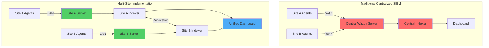
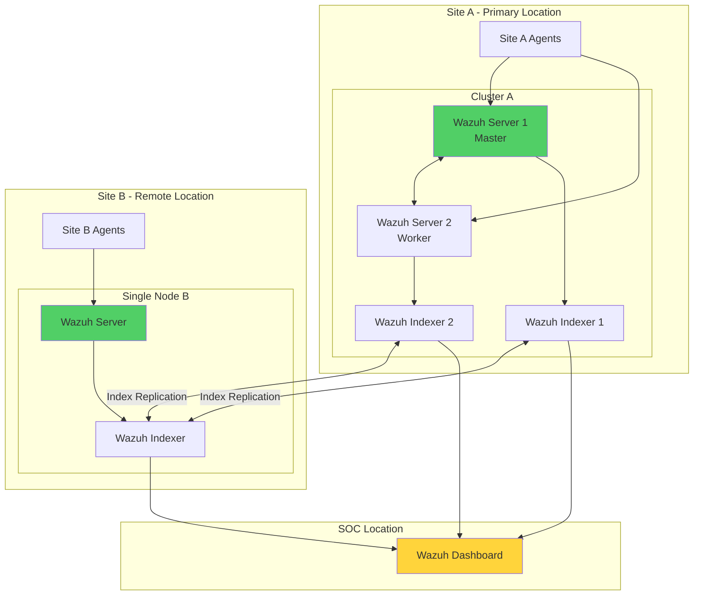
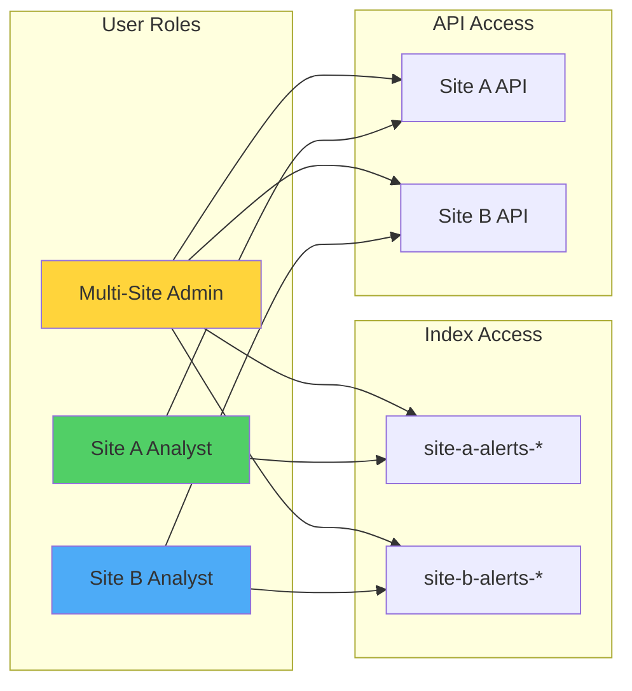
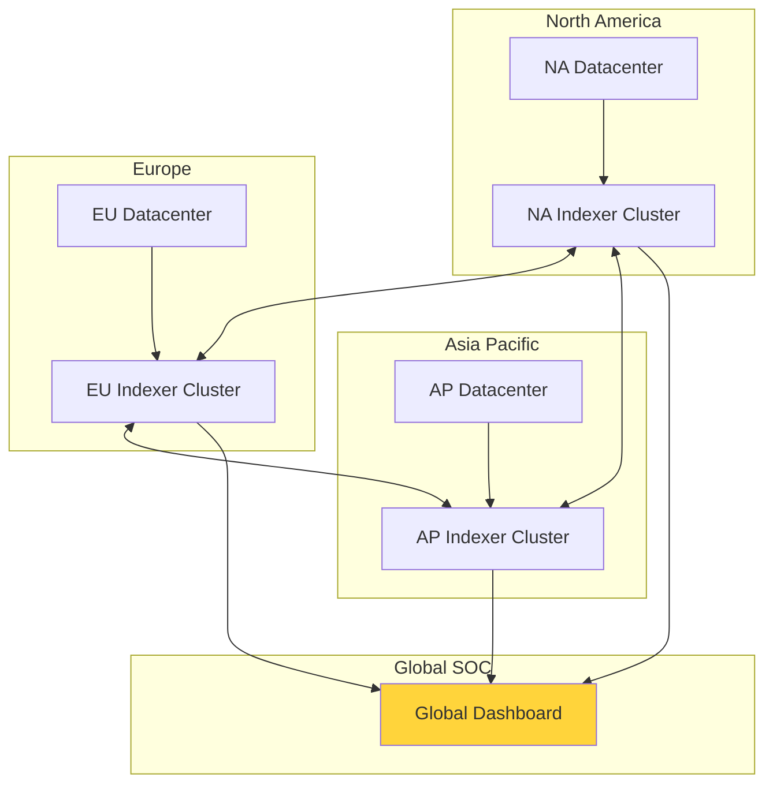

# Wazuh Multi-Site Implementation: Unified Security Across Distributed Infrastructure

## Introduction

Organizations with operations spanning multiple geographic locations face unique security challenges. How do you maintain unified security visibility while respecting network boundaries, minimizing latency, and ensuring fault tolerance? Wazuh multi-site implementation provides an elegant solution that unifies security monitoring capabilities across distributed infrastructure without compromising performance or resilience.

This architecture enables:
- 🌍 **Geographic Distribution**: Deploy Wazuh components close to data sources
- 🎯 **Local Processing**: Analyze logs within each site to reduce network traffic
- 📊 **Unified Visibility**: View all security events from a single dashboard
- 🔄 **Data Replication**: Automatic backup across sites for disaster recovery
- 🏢 **Site Independence**: Each location operates autonomously if others fail

## Understanding Multi-Site Architecture

### Traditional vs Multi-Site Approach



### Key Benefits

1. **Reduced Network Congestion**: Agents connect to local servers, minimizing WAN traffic
2. **Improved Performance**: Local log processing reduces latency
3. **Enhanced Resilience**: Site failures don't impact other locations
4. **Simplified Compliance**: Data residency requirements easily met
5. **Scalable Architecture**: Add sites without redesigning infrastructure

## Real-World Scenario

### Problem Statement

XYZ Corporation operates in two geographic locations and requires:
- Independent log collection per site
- Local agent connections to minimize bandwidth
- Backup of each site's security data
- Unified security visibility across all locations
- Site-specific alert segregation

### Proposed Solution



## Infrastructure Overview

### Component Distribution

| Site | Component | Node Name | IP Address | Purpose |
|------|-----------|-----------|------------|---------|
| **SOC** | Wazuh Dashboard | wazuh-dashboard-1 | 192.168.100.100 | Unified interface |
| **Site A** | Wazuh Server 1 | sa-wazuh-server-1 | 192.168.186.151 | Master node |
| **Site A** | Wazuh Server 2 | sa-wazuh-server-2 | 192.168.186.152 | Worker node |
| **Site A** | Wazuh Indexer 1 | sa-wazuh-indexer-1 | 192.168.186.151 | Data storage |
| **Site A** | Wazuh Indexer 2 | sa-wazuh-indexer-2 | 192.168.186.152 | Data storage |
| **Site B** | Wazuh Server | sb-wazuh-server-1 | 192.168.10.11 | Single node |
| **Site B** | Wazuh Indexer | sb-wazuh-indexer-1 | 192.168.10.11 | Data storage |

### Index Pattern Strategy

- **Site A**: `site-a-alerts-*`
- **Site B**: `site-b-alerts-*`
- **Archives**: `wazuh-archives-4.x-*`

## Implementation Guide

### Phase 1: Certificate Generation

#### Generate Root CA and Dashboard Certificates

```bash
# On dashboard node
curl -sO https://packages.wazuh.com/4.7/wazuh-certs-tool.sh
curl -sO https://packages.wazuh.com/4.7/config.yml

# Configure dashboard node
cat > config.yml << EOF
nodes:
  dashboard:
    - name: wazuh-dashboard-1
      ip: "192.168.100.100"
EOF

# Generate root CA and dashboard certs
bash ./wazuh-certs-tool.sh -A

# Distribute root CA to sites
scp -r wazuh-certificates/root-ca.* user@site-a-server:~/
scp -r wazuh-certificates/root-ca.* user@site-b-server:~/
```

#### Generate Site-Specific Certificates

**Site A Configuration:**
```bash
# On Site A node with root CA
cat > config.yml << EOF
nodes:
  indexer:
    - name: sa-wazuh-indexer-1
      ip: "192.168.186.151"
    - name: sa-wazuh-indexer-2
      ip: "192.168.186.152"
  server:
    - name: sa-wazuh-server-1
      ip: "192.168.186.151"
      node_type: master
    - name: sa-wazuh-server-2
      ip: "192.168.186.152"
      node_type: worker
EOF

# Generate using existing root CA
bash ./wazuh-certs-tool.sh -A ./root-ca.pem ./root-ca.key
```

**Site B Configuration:**
```bash
# On Site B node with root CA
cat > config.yml << EOF
nodes:
  indexer:
    - name: sb-wazuh-indexer-1
      ip: "192.168.10.11"
  server:
    - name: sb-wazuh-server-1
      ip: "192.168.10.11"
EOF

# Generate using existing root CA
bash ./wazuh-certs-tool.sh -A ./root-ca.pem ./root-ca.key
```

### Phase 2: Wazuh Indexer Multi-Site Configuration

#### Critical Multi-Site Settings

Edit `/etc/wazuh-indexer/opensearch.yml` on each indexer:

**Site A Indexer 1:**
```yaml
network.host: "192.168.186.151"
node.name: "sa-wazuh-indexer-1"
cluster.name: "wazuh-cluster"

# Multi-site cluster configuration
cluster.initial_master_nodes:
  - "sa-wazuh-indexer-1"
  - "sa-wazuh-indexer-2"
  - "sb-wazuh-indexer-1"

discovery.seed_hosts:
  - "192.168.186.151"
  - "192.168.186.152"
  - "192.168.10.11"

# Trust all indexer nodes across sites
plugins.security.nodes_dn:
  - "CN=sa-wazuh-indexer-1,OU=Wazuh,O=Wazuh,L=California,C=US"
  - "CN=sa-wazuh-indexer-2,OU=Wazuh,O=Wazuh,L=California,C=US"
  - "CN=sb-wazuh-indexer-1,OU=Wazuh,O=Wazuh,L=California,C=US"

# Allow multiple nodes per host
node.max_local_storage_nodes: "10"
```

#### Initialize Multi-Site Cluster

```bash
# After configuring all indexers, run on any node
/usr/share/wazuh-indexer/bin/indexer-security-init.sh

# Verify cluster health
curl -k -u admin:admin https://192.168.186.151:9200/_cat/nodes?v
```

### Phase 3: Site-Specific Wazuh Server Configuration

#### Configure Filebeat for Custom Index Patterns

**Site A Configuration:**
```bash
# Edit /etc/filebeat/filebeat.yml
output.elasticsearch:
  hosts: ["192.168.186.151:9200", "192.168.186.152:9200"]
  protocol: https
  username: ${username}
  password: ${password}
```

**Modify Alert Template:**
```json
# Edit /etc/filebeat/wazuh-template.json
{
  "order": 0,
  "index_patterns": [
    "site-a-alerts-*",
    "wazuh-archives-4.x-*"
  ],
  ...
}
```

**Update Wazuh Module:**
```yaml
# Edit /usr/share/filebeat/module/wazuh/alerts/manifest.yml
module_version: 0.1
var:
  - name: index_prefix
    default: site-a-alerts-
```

#### Configure Wazuh Server Clustering

**Master Node (Site A):**
```xml
<!-- /var/ossec/etc/ossec.conf -->
<cluster>
  <name>wazuh</name>
  <node_name>sa-wazuh-server-1</node_name>
  <node_type>master</node_type>
  <key>42977f78f55b2c0eef78a91b44a77532</key>
  <port>1516</port>
  <bind_addr>0.0.0.0</bind_addr>
  <nodes>
    <node>192.168.186.151</node>
  </nodes>
  <hidden>no</hidden>
  <disabled>no</disabled>
</cluster>
```

### Phase 4: Unified Dashboard Configuration

#### Configure Multi-Site Access

Edit `/usr/share/wazuh-dashboard/data/wazuh/config/wazuh.yml`:

```yaml
ip.ignore: wazuh-alerts-*
ip.selector: true
hosts:
  - SITE A:
      url: https://192.168.186.151
      port: 55000
      username: wazuh-wui
      password: wazuh-wui
      run_as: true
  - SITE B:
      url: https://192.168.10.11
      port: 55000
      username: wazuh-wui
      password: wazuh-wui
      run_as: true
```

#### Create Site-Specific Index Patterns

1. Navigate to **Stack Management > Index Patterns**
2. Create `site-a-alerts-*` pattern
3. Create `site-b-alerts-*` pattern
4. Set timestamp as primary time field

### Phase 5: Role-Based Access Control

#### Multi-Site Admin Configuration



#### Create Site-Specific Read-Only Role

```json
{
  "name": "site_a_readonly",
  "cluster_permissions": ["cluster_composite_ops_ro"],
  "index_permissions": [{
    "index_patterns": ["site-a-alerts-*"],
    "allowed_actions": ["read"]
  }],
  "tenant_permissions": [{
    "tenant_patterns": ["global_tenant"],
    "allowed_actions": ["kibana_all_read"]
  }]
}
```

## Advanced Configuration

### Data Replication Strategy

#### Configure Shard Allocation

```json
PUT _cluster/settings
{
  "persistent": {
    "cluster.routing.allocation.awareness.attributes": "site",
    "cluster.routing.allocation.awareness.force.site.values": "site-a,site-b"
  }
}
```

#### Set Node Attributes

```yaml
# Site A indexers
node.attr.site: site-a

# Site B indexers
node.attr.site: site-b
```

### Cross-Site Failover

```bash
#!/bin/bash
# check_site_health.sh

SITE_A_INDEXER="192.168.186.151"
SITE_B_INDEXER="192.168.10.11"

# Check Site A health
if ! curl -s -k -u admin:admin https://$SITE_A_INDEXER:9200/_cluster/health | grep -q "green\|yellow"; then
    echo "Site A unhealthy - redirecting agents to Site B"
    # Update agent configuration
    ansible agents_site_a -m shell -a "sed -i 's/$SITE_A_INDEXER/$SITE_B_INDEXER/g' /var/ossec/etc/ossec.conf && systemctl restart wazuh-agent"
fi
```

### Performance Optimization

#### Index Lifecycle Management

```json
PUT _ilm/policy/wazuh-alerts-policy
{
  "policy": {
    "phases": {
      "hot": {
        "actions": {
          "rollover": {
            "max_size": "50GB",
            "max_age": "7d"
          }
        }
      },
      "warm": {
        "min_age": "7d",
        "actions": {
          "shrink": {
            "number_of_shards": 1
          },
          "forcemerge": {
            "max_num_segments": 1
          }
        }
      },
      "delete": {
        "min_age": "90d",
        "actions": {
          "delete": {}
        }
      }
    }
  }
}
```

### Network Optimization

```yaml
# Optimize cluster communication
cluster.remote.node.attr: transport
transport.tcp.compress: true
transport.ping_schedule: "5s"

# Tune replication settings
indices.recovery.max_bytes_per_sec: "100mb"
cluster.routing.allocation.node_concurrent_recoveries: 2
```

## Monitoring and Troubleshooting

### Health Check Dashboard

Create visualizations for multi-site monitoring:

```json
{
  "visualization": {
    "title": "Multi-Site Alert Distribution",
    "visState": {
      "type": "line",
      "params": {
        "grid": {
          "categoryLines": false,
          "style": {
            "color": "#eee"
          }
        },
        "categoryAxes": [{
          "id": "CategoryAxis-1",
          "type": "category",
          "position": "bottom",
          "show": true,
          "style": {},
          "scale": {
            "type": "linear"
          },
          "labels": {
            "show": true,
            "truncate": 100
          },
          "title": {}
        }],
        "valueAxes": [{
          "id": "ValueAxis-1",
          "name": "LeftAxis-1",
          "type": "value",
          "position": "left",
          "show": true,
          "style": {},
          "scale": {
            "type": "linear",
            "mode": "normal"
          },
          "labels": {
            "show": true,
            "rotate": 0,
            "filter": false,
            "truncate": 100
          },
          "title": {
            "text": "Alert Count"
          }
        }]
      },
      "aggs": [{
        "id": "1",
        "enabled": true,
        "type": "count",
        "schema": "metric",
        "params": {}
      }, {
        "id": "2",
        "enabled": true,
        "type": "date_histogram",
        "schema": "segment",
        "params": {
          "field": "timestamp",
          "interval": "auto"
        }
      }, {
        "id": "3",
        "enabled": true,
        "type": "terms",
        "schema": "group",
        "params": {
          "field": "_index",
          "size": 5
        }
      }]
    }
  }
}
```

### Common Issues and Solutions

#### Issue 1: Cross-Site Replication Lag

```bash
# Check replication status
curl -X GET "localhost:9200/_cat/recovery?v&active_only=true"

# Increase replication speed temporarily
curl -X PUT "localhost:9200/_cluster/settings" -H 'Content-Type: application/json' -d'
{
  "transient": {
    "indices.recovery.max_bytes_per_sec": "200mb"
  }
}'
```

#### Issue 2: Site Isolation During Network Partition

```yaml
# Configure split-brain protection
discovery.zen.minimum_master_nodes: 2
cluster.fault_detection.leader_check.interval: "5s"
cluster.fault_detection.leader_check.timeout: "25s"
cluster.fault_detection.leader_check.retry_count: 3
```

## Best Practices

### 1. Security Hardening

```bash
# Secure certificate storage
chmod 600 /etc/wazuh-*/certs/*
chown -R wazuh:wazuh /etc/wazuh-*/certs/

# Enable audit logging
echo 'plugins.security.audit.type: internal_opensearch' >> /etc/wazuh-indexer/opensearch.yml
```

### 2. Backup Strategy

```bash
#!/bin/bash
# backup_multi_site.sh

# Register snapshot repository
curl -X PUT "localhost:9200/_snapshot/multi_site_backup" -H 'Content-Type: application/json' -d'
{
  "type": "fs",
  "settings": {
    "location": "/mnt/backups/wazuh",
    "compress": true
  }
}'

# Create snapshot for each site
for site in "site-a" "site-b"; do
  curl -X PUT "localhost:9200/_snapshot/multi_site_backup/${site}_$(date +%Y%m%d)" -H 'Content-Type: application/json' -d'
  {
    "indices": "'${site}'-alerts-*",
    "ignore_unavailable": true,
    "include_global_state": false
  }'
done
```

### 3. Capacity Planning

```python
#!/usr/bin/env python3
# capacity_calculator.py

def calculate_storage_requirements(agents_per_site, events_per_agent_per_day, avg_event_size_kb, retention_days, replication_factor=2):
    """Calculate storage requirements for multi-site deployment"""

    daily_volume_gb = (agents_per_site * events_per_agent_per_day * avg_event_size_kb) / (1024 * 1024)
    total_storage_gb = daily_volume_gb * retention_days * replication_factor

    return {
        "daily_volume_gb": round(daily_volume_gb, 2),
        "total_storage_gb": round(total_storage_gb, 2),
        "recommended_disk_gb": round(total_storage_gb * 1.5, 2)  # 50% overhead
    }

# Example calculation
site_a = calculate_storage_requirements(
    agents_per_site=500,
    events_per_agent_per_day=10000,
    avg_event_size_kb=2,
    retention_days=90
)

print(f"Site A Storage Requirements: {site_a}")
```

## Scaling Considerations

### Adding New Sites

```bash
#!/bin/bash
# add_new_site.sh

NEW_SITE="site-c"
NEW_SITE_IP="192.168.30.11"

# 1. Generate certificates for new site
echo "Generating certificates for $NEW_SITE..."

# 2. Update all indexer configurations
for indexer in $(cat indexer_list.txt); do
    ssh $indexer "echo '  - \"CN=${NEW_SITE}-wazuh-indexer-1,OU=Wazuh,O=Wazuh,L=California,C=US\"' >> /etc/wazuh-indexer/opensearch.yml"
    ssh $indexer "echo '  - \"${NEW_SITE_IP}\"' >> /etc/wazuh-indexer/opensearch.yml"
    ssh $indexer "systemctl restart wazuh-indexer"
done

# 3. Update dashboard configuration
echo "  - ${NEW_SITE^^}:" >> /usr/share/wazuh-dashboard/data/wazuh/config/wazuh.yml
echo "      url: https://${NEW_SITE_IP}" >> /usr/share/wazuh-dashboard/data/wazuh/config/wazuh.yml
echo "      port: 55000" >> /usr/share/wazuh-dashboard/data/wazuh/config/wazuh.yml
```

### Horizontal Scaling Within Sites

```yaml
# Add indexer node to existing site
node.name: "sa-wazuh-indexer-3"
node.attr.site: site-a
cluster.initial_master_nodes:
  - "sa-wazuh-indexer-1"
  - "sa-wazuh-indexer-2"
  - "sa-wazuh-indexer-3"  # New node
```

## Use Cases

### Global Enterprise Security



### Managed Security Service Provider

```yaml
# Customer isolation configuration
Customer_A:
  index_pattern: "customer-a-*"
  api_access: ["customer-a-server"]
  data_retention: 365d

Customer_B:
  index_pattern: "customer-b-*"
  api_access: ["customer-b-server"]
  data_retention: 90d
```

## Conclusion

Wazuh multi-site implementation delivers a robust solution for organizations requiring:

- ✅ **Unified security visibility** across distributed infrastructure
- 🌐 **Geographic scalability** without architectural redesign
- 💾 **Automated data backup** through cross-site replication
- 🚀 **Optimized performance** via local log processing
- 🔐 **Granular access control** with site-specific RBAC

This architecture proves invaluable for global enterprises, managed security service providers, and any organization with distributed operations requiring centralized security oversight.

## Key Takeaways

1. **Plan Network Topology**: Ensure reliable connectivity between sites
2. **Certificate Management**: Use consistent root CA across all sites
3. **Index Naming Convention**: Implement clear site identification
4. **Monitor Replication**: Track cross-site data synchronization
5. **Test Failover Scenarios**: Validate site independence regularly

## Resources

- [Wazuh Multi-Node Cluster Documentation](https://documentation.wazuh.com/current/deployment-options/wazuh-multi-node-cluster.html)
- [OpenSearch Cross-Cluster Replication](https://opensearch.org/docs/latest/replication-plugin/index/)
- [Wazuh Certificate Management](https://documentation.wazuh.com/current/user-manual/certificates.html)
- [Wazuh RBAC Configuration](https://documentation.wazuh.com/current/user-manual/api/rbac/index.html)

---

*Unified security across boundaries. Scale globally, protect locally! 🌍🛡️*
