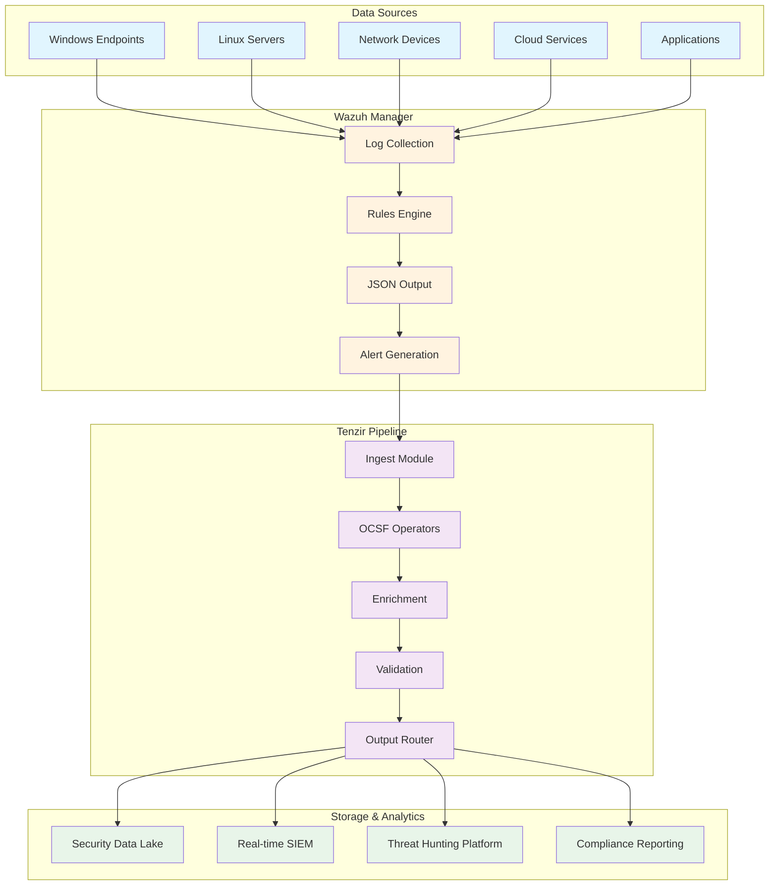

# Building a Production-Ready OCSF Security Data Pipeline: Wazuh to Tenzir Integration Guide

## Table of Contents

In the modern security landscape, organizations struggle with disparate data formats from various security tools, making correlation and analysis challenging. The Open Cybersecurity Schema Framework (OCSF) emerges as the solution, providing a vendor-agnostic standard for security telemetry. This comprehensive guide demonstrates how to build a production-ready pipeline that transforms Wazuh logs into OCSF-compliant format using Tenzir, creating a unified security data architecture.

## Executive Summary

Organizations today face three critical challenges in security operations:
- **Data Silos**: Security tools produce incompatible data formats
- **Integration Complexity**: Custom parsers and mappings for each tool
- **Scalability Issues**: Growing data volumes strain traditional SIEM architectures

This guide presents a modern solution using:
- **Wazuh** for comprehensive log collection
- **Tenzir** for intelligent data transformation
- **OCSF** for standardized security schemas

## Understanding OCSF: The Foundation

### What is OCSF?

The Open Cybersecurity Schema Framework (OCSF) is an open-source project delivering an extensible framework for developing schemas, along with a vendor-agnostic core security schema. Founded through collaboration between AWS, Splunk, IBM, and 15+ other industry leaders, OCSF is now governed by the Linux Foundation.

### Key Benefits

1. **Vendor Independence**: Break free from proprietary data formats
2. **Cost Reduction**: Store all security telemetry in a unified format
3. **Enhanced Analytics**: Correlate data across all security tools
4. **Future-Proof Architecture**: Adapt to new threats and tools easily

### OCSF Schema Structure

```json
{
  "metadata": {
    "version": "1.0.0",
    "product": {
      "name": "Wazuh",
      "vendor_name": "Wazuh Inc.",
      "version": "4.8.0"
    },
    "profiles": ["host", "security_control"],
    "event_code": "authentication"
  },
  "authentication": {
    "activity_id": 1,
    "activity_name": "Logon",
    "actor": {
      "user": {
        "name": "john.doe",
        "uid": "S-1-5-21-123456",
        "type": "User",
        "type_id": 1
      }
    },
    "device": {
      "hostname": "WORKSTATION-01",
      "ip": "192.168.1.100",
      "os": {
        "name": "Windows",
        "version": "10.0.19044"
      }
    },
    "time": 1704538800000,
    "severity_id": 1,
    "status": "Success",
    "status_id": 1
  }
}
```

## Architecture Overview



## Step 1: Configuring Wazuh for JSON Output

### Enable JSON Logging

Edit `/var/ossec/etc/ossec.conf` to enable JSON output:

```xml
<ossec_config>
  <logging>
    <log_format>json</log_format>
    <jsonout_output>yes</jsonout_output>
  </logging>
  
  <global>
    <jsonout_output>yes</jsonout_output>
    <alerts_log>yes</alerts_log>
    <logall>yes</logall>
    <logall_json>yes</logall_json>
  </global>
</ossec_config>
```

### Configure Alert Forwarding

Set up syslog forwarding to Tenzir:

```xml
<ossec_config>
  <syslog_output>
    <server>tenzir-host</server>
    <port>514</port>
    <format>json</format>
    <level>1</level>
  </syslog_output>
</ossec_config>
```

### Optimize Wazuh Rules for OCSF

Create custom rules that include OCSF-relevant metadata:

```xml
<group name="authentication,ocsf">
  <rule id="100001" level="5">
    <if_sid>5715</if_sid>
    <field name="win.eventdata.logonType">^3$</field>
    <description>Windows Network Logon - OCSF Class 3002</description>
    <options>no_full_log</options>
    <group>authentication_success,ocsf_3002</group>
  </rule>
  
  <rule id="100002" level="10">
    <if_sid>5716</if_sid>
    <field name="win.eventdata.status">^0xC000006D$</field>
    <description>Windows Logon Failed - Bad Username - OCSF Class 3002</description>
    <group>authentication_failed,ocsf_3002</group>
  </rule>
</group>
```

### Verify JSON Output

Check that Wazuh is producing JSON logs:

```bash
# View real-time alerts in JSON format
tail -f /var/ossec/logs/alerts/alerts.json | jq '.'

# Example output
{
  "timestamp": "2025-01-06T10:00:00.000+0000",
  "rule": {
    "level": 5,
    "description": "Windows Network Logon - OCSF Class 3002",
    "id": "100001",
    "firedtimes": 1,
    "groups": ["authentication", "authentication_success", "ocsf_3002"]
  },
  "agent": {
    "id": "001",
    "name": "WORKSTATION-01",
    "ip": "192.168.1.100"
  },
  "data": {
    "win": {
      "eventdata": {
        "logonType": "3",
        "targetUserName": "john.doe",
        "targetDomainName": "CORP",
        "ipAddress": "192.168.1.200"
      }
    }
  }
}
```

## Step 2: Setting Up Tenzir

### Installation

```bash
# Install Tenzir on Ubuntu/Debian
curl -L https://get.tenzir.app | sh

# Or using Docker
docker run -d \
  --name tenzir \
  -p 5158:5158 \
  -v tenzir-data:/var/lib/tenzir \
  tenzir/tenzir:latest
```

### Basic Configuration

Create `/etc/tenzir/tenzir.yaml`:

```yaml
tenzir:
  # Data directory
  state-directory: /var/lib/tenzir
  
  # Network settings
  endpoint: 0.0.0.0:5158
  
  # Performance tuning
  max-partition-size: 1048576
  max-resident-partitions: 10
  max-taste-partitions: 5
  
  # Plugins
  plugins:
    - ocsf
    - wazuh
    - parquet
```

### Start Tenzir Service

```bash
# Start Tenzir
systemctl start tenzir
systemctl enable tenzir

# Verify it's running
tenzir status
```

## Step 3: Building the OCSF Transformation Pipeline

### Understanding Tenzir's OCSF Operators

Tenzir provides three main OCSF operators:

1. **`ocsf::derive`** - Enriches events with OCSF metadata
2. **`ocsf::apply`** - Validates and enforces OCSF schema
3. **`ocsf::trim`** - Removes optional fields to optimize storage

### Creating the Base Pipeline

Create `/etc/tenzir/pipelines/wazuh-ocsf.tql`:

```sql
// Wazuh to OCSF Pipeline
// This pipeline transforms Wazuh alerts to OCSF format

// Stage 1: Ingest Wazuh JSON
read_json file=/var/ossec/logs/alerts/alerts.json
| where rule.groups has "ocsf_3002"  // Filter authentication events

// Stage 2: Map Wazuh fields to OCSF
| put ocsf = {
    metadata: {
      version: "1.0.0",
      product: {
        name: "Wazuh",
        vendor_name: "Wazuh Inc.",
        version: "4.8.0"
      },
      profiles: ["host"],
      logged_time: timestamp,
      original_time: timestamp
    },
    class_uid: 3002,
    class_name: "Authentication",
    category_uid: 3,
    category_name: "Identity & Access Management",
    severity_id: if (rule.level <= 3) {1} 
                 else if (rule.level <= 6) {2}
                 else if (rule.level <= 9) {3}
                 else {4},
    activity_id: if (rule.groups has "authentication_success") {1} else {2},
    activity_name: if (rule.groups has "authentication_success") {"Logon"} else {"Logon Failed"},
    time: timestamp,
    actor: {
      user: {
        name: data.win.eventdata.targetUserName,
        domain: data.win.eventdata.targetDomainName,
        type: "User",
        type_id: 1
      },
      session: {
        uid: data.win.eventdata.logonGuid
      }
    },
    device: {
      hostname: agent.name,
      ip: agent.ip,
      os: {
        name: "Windows",
        type: "Windows",
        type_id: 100
      }
    },
    logon_type: data.win.eventdata.logonType,
    status: if (rule.groups has "authentication_success") {"Success"} else {"Failure"},
    status_id: if (rule.groups has "authentication_success") {1} else {2}
  }

// Stage 3: Apply OCSF validation
| ocsf::derive
| ocsf::apply
| ocsf::trim profile=standard

// Stage 4: Output to multiple destinations
| publish "ocsf-events"
```

### Advanced Pipeline with Enrichment

Create `/etc/tenzir/pipelines/wazuh-ocsf-enriched.tql`:

```sql
// Advanced Wazuh to OCSF Pipeline with Enrichment

// Define lookup tables
let threat_intel = read_csv file=/etc/tenzir/threat_intel.csv
let asset_inventory = read_parquet file=/etc/tenzir/assets.parquet

// Main pipeline
subscribe "wazuh-raw"
| read_json

// Enrich with threat intelligence
| enrich threat_intel on ip = src_ip
| put threat_score = if (threat_intel.reputation == "malicious") {100} 
                     else if (threat_intel.reputation == "suspicious") {50}
                     else {0}

// Enrich with asset information
| enrich asset_inventory on hostname = agent.name
| put asset_criticality = asset_inventory.criticality ?? "medium"

// Transform to OCSF with enrichments
| put ocsf = {
    // ... base OCSF fields ...
    enrichments: [
      {
        name: "threat_intelligence",
        type: "reputation",
        value: threat_intel.reputation,
        provider: "internal_ti"
      },
      {
        name: "asset_context", 
        type: "criticality",
        value: asset_criticality,
        provider: "cmdb"
      }
    ],
    risk_score: threat_score,
    observables: [
      {
        name: "source_ip",
        type: "ip_address",
        type_id: 2,
        value: src_ip,
        reputation: {
          score: threat_score,
          provider: "internal_ti"
        }
      }
    ]
  }

// Validate and optimize
| ocsf::derive
| ocsf::apply
| ocsf::trim profile=detection

// Route based on severity
| where ocsf.severity_id >= 3
| publish "ocsf-high-priority"

// Archive all events
| write_parquet file=/data/ocsf/archive/authentication.parquet
```

## Step 4: Implementing Event Class Mappings

### Authentication Events (Class 3002)

```sql
// OCSF Class 3002: Authentication Activity
export auth_mapper = function(event) {
  return {
    class_uid: 3002,
    class_name: "Authentication",
    activity_id: switch {
      event.action == "login_success" => 1,  // Logon
      event.action == "logout" => 2,         // Logoff  
      event.action == "login_failed" => 3,   // Authentication Failed
      default => 0                           // Unknown
    },
    actor: {
      user: {
        name: event.username,
        uid: event.user_id,
        type: "User",
        type_id: 1,
        credential_uid: event.session_id
      },
      process: if (event.process_name != null) {{
        name: event.process_name,
        pid: event.process_id
      }} else {null}
    },
    auth_protocol: event.auth_method,
    auth_protocol_id: switch {
      event.auth_method == "NTLM" => 1,
      event.auth_method == "Kerberos" => 2,
      event.auth_method == "LDAP" => 3,
      event.auth_method == "OAuth2" => 4,
      default => 99
    },
    dst_endpoint: {
      hostname: event.target_host,
      ip: event.target_ip,
      port: event.target_port
    },
    logon_type: event.logon_type,
    logon_type_id: event.logon_type_id,
    response_time: event.duration_ms,
    session: {
      uid: event.session_id,
      created_time: event.session_start,
      is_remote: event.is_remote
    },
    src_endpoint: {
      hostname: event.source_host,
      ip: event.source_ip,
      location: {
        city: event.geo_city,
        country: event.geo_country,
        coordinates: [event.geo_lon, event.geo_lat]
      }
    },
    status: event.status,
    status_code: event.status_code,
    status_detail: event.error_message,
    status_id: if (event.success) {1} else {2}
  }
}
```

### Network Activity Events (Class 4001)

```sql
// OCSF Class 4001: Network Activity
export network_mapper = function(event) {
  return {
    class_uid: 4001,
    class_name: "Network Activity",
    activity_id: switch {
      event.action == "allowed" => 1,    // Allowed
      event.action == "denied" => 2,     // Denied
      event.action == "dropped" => 3,    // Dropped
      default => 0                       // Unknown
    },
    connection_info: {
      direction: event.direction,
      direction_id: switch {
        event.direction == "inbound" => 1,
        event.direction == "outbound" => 2,
        event.direction == "lateral" => 3,
        default => 0
      },
      protocol_num: event.protocol_number,
      protocol_name: event.protocol,
      tcp_flags: event.tcp_flags
    },
    dst_endpoint: {
      hostname: event.dst_hostname,
      ip: event.dst_ip,
      port: event.dst_port,
      mac: event.dst_mac,
      interface_name: event.dst_interface
    },
    src_endpoint: {
      hostname: event.src_hostname,
      ip: event.src_ip,
      port: event.src_port,
      mac: event.src_mac,
      interface_name: event.src_interface
    },
    traffic: {
      bytes: event.bytes_total,
      bytes_in: event.bytes_received,
      bytes_out: event.bytes_sent,
      packets: event.packets_total,
      packets_in: event.packets_received,
      packets_out: event.packets_sent
    },
    duration: event.duration_ms,
    start_time: event.flow_start,
    end_time: event.flow_end
  }
}
```

### File Activity Events (Class 1001)

```sql
// OCSF Class 1001: File Activity
export file_mapper = function(event) {
  return {
    class_uid: 1001,
    class_name: "File Activity",
    activity_id: switch {
      event.action == "create" => 1,
      event.action == "read" => 2,
      event.action == "update" => 3,
      event.action == "delete" => 4,
      event.action == "rename" => 5,
      event.action == "attributes_modified" => 6,
      event.action == "permissions_modified" => 7,
      default => 0
    },
    actor: {
      process: {
        name: event.process_name,
        pid: event.process_id,
        file: {
          path: event.process_path,
          hash: {
            algorithm: "SHA256",
            value: event.process_hash
          }
        }
      },
      user: {
        name: event.username,
        uid: event.user_id
      }
    },
    file: {
      path: event.file_path,
      name: event.file_name,
      parent_folder: event.file_directory,
      type: event.file_type,
      type_id: map_file_type(event.file_type),
      size: event.file_size,
      hash: if (event.file_hash != null) {{
        algorithm: "SHA256",
        value: event.file_hash
      }} else {null},
      modified_time: event.file_mtime,
      accessed_time: event.file_atime,
      created_time: event.file_ctime,
      is_system: event.is_system_file,
      security_descriptor: event.file_acl
    },
    device: {
      hostname: event.hostname,
      os: {
        name: event.os_name,
        version: event.os_version
      }
    }
  }
}
```

## Step 5: Production Deployment

### High Availability Setup

```yaml
# docker-compose.yml for HA Tenzir deployment
version: '3.8'

services:
  tenzir-node1:
    image: tenzir/tenzir:latest
    container_name: tenzir-node1
    environment:
      - TENZIR_ENDPOINT=0.0.0.0:5158
      - TENZIR_NODE_ID=node1
      - TENZIR_CLUSTER_ENDPOINTS=tenzir-node2:5158,tenzir-node3:5158
    volumes:
      - tenzir-data1:/var/lib/tenzir
      - ./pipelines:/etc/tenzir/pipelines
    ports:
      - "5158:5158"
    networks:
      - tenzir-cluster
    deploy:
      resources:
        limits:
          cpus: '4'
          memory: 8G
        reservations:
          cpus: '2'
          memory: 4G

  tenzir-node2:
    image: tenzir/tenzir:latest
    container_name: tenzir-node2
    environment:
      - TENZIR_ENDPOINT=0.0.0.0:5158
      - TENZIR_NODE_ID=node2
      - TENZIR_CLUSTER_ENDPOINTS=tenzir-node1:5158,tenzir-node3:5158
    volumes:
      - tenzir-data2:/var/lib/tenzir
      - ./pipelines:/etc/tenzir/pipelines
    networks:
      - tenzir-cluster
    deploy:
      resources:
        limits:
          cpus: '4'
          memory: 8G

  tenzir-node3:
    image: tenzir/tenzir:latest
    container_name: tenzir-node3
    environment:
      - TENZIR_ENDPOINT=0.0.0.0:5158
      - TENZIR_NODE_ID=node3
      - TENZIR_CLUSTER_ENDPOINTS=tenzir-node1:5158,tenzir-node2:5158
    volumes:
      - tenzir-data3:/var/lib/tenzir
      - ./pipelines:/etc/tenzir/pipelines
    networks:
      - tenzir-cluster
    deploy:
      resources:
        limits:
          cpus: '4'
          memory: 8G

  haproxy:
    image: haproxy:2.9-alpine
    container_name: tenzir-lb
    volumes:
      - ./haproxy.cfg:/usr/local/etc/haproxy/haproxy.cfg:ro
    ports:
      - "80:80"
      - "443:443"
      - "5158:5158"
    networks:
      - tenzir-cluster
    depends_on:
      - tenzir-node1
      - tenzir-node2
      - tenzir-node3

volumes:
  tenzir-data1:
  tenzir-data2:
  tenzir-data3:

networks:
  tenzir-cluster:
    driver: bridge
```

### Performance Optimization

```sql
// Optimized pipeline with parallel processing
export optimized_pipeline = (
  // Use parallel processing for high-volume streams
  read_json file=/var/ossec/logs/alerts/alerts.json
  | batch 1000
  | parallel apply=transform_to_ocsf
  
  // Implement smart caching
  | cache key=hash(rule.id, agent.id) ttl=300s
  
  // Compress before storage
  | compress algorithm=zstd level=3
  
  // Partition by time for efficient queries
  | partition by=floor(time, 1h)
  | write_parquet file="/data/ocsf/{partition}/events.parquet"
)

// Resource-aware processing
export adaptive_pipeline = (
  read_json
  | measure cpu_usage
  | if (cpu_usage > 0.8) {
      // Reduce processing when under load
      sample rate=0.5
      | ocsf::trim profile=minimal
    } else {
      // Full processing when resources available
      ocsf::derive
      | ocsf::apply
      | enrich_all
    }
  | write
)
```

### Monitoring and Alerting

```yaml
# prometheus.yml configuration
global:
  scrape_interval: 15s

scrape_configs:
  - job_name: 'tenzir'
    static_configs:
      - targets: 
        - 'tenzir-node1:9090'
        - 'tenzir-node2:9090'
        - 'tenzir-node3:9090'

  - job_name: 'wazuh'
    static_configs:
      - targets: ['wazuh-manager:55000']

# Alert rules
groups:
  - name: pipeline_health
    rules:
      - alert: PipelineBacklog
        expr: tenzir_pipeline_backlog_events > 10000
        for: 5m
        annotations:
          summary: "Pipeline backlog growing"
          
      - alert: TransformationErrors
        expr: rate(tenzir_ocsf_transform_errors[5m]) > 0.01
        annotations:
          summary: "OCSF transformation errors detected"
          
      - alert: HighMemoryUsage
        expr: tenzir_memory_usage_bytes / tenzir_memory_limit_bytes > 0.9
        for: 10m
        annotations:
          summary: "Tenzir memory usage critical"
```

## Step 6: Integration with Security Tools

### Amazon Security Lake Integration

```sql
// Direct integration with Amazon Security Lake
export asl_publisher = (
  subscribe "ocsf-events"
  | where ocsf.severity_id >= 2  // Only send medium+ severity
  
  // Add Security Lake required fields
  | put ocsf.metadata.product.feature = {
      name: "Wazuh SIEM",
      version: "4.8.0"
    }
  | put ocsf.metadata.labels = ["wazuh", "production", "regulated"]
  
  // Write to S3 in Parquet format
  | to_s3 
      bucket="my-security-lake-bucket"
      prefix="ext/wazuh-ocsf/{year}/{month}/{day}/"
      format="parquet"
      compression="snappy"
      partition_by=["year", "month", "day"]
)
```

### Splunk Integration

```sql
// Send OCSF events to Splunk
export splunk_forwarder = (
  subscribe "ocsf-events"
  | to_splunk
      url="https://splunk-hec.company.com:8088"
      token=env("SPLUNK_HEC_TOKEN")
      index="security_ocsf"
      sourcetype="ocsf:json"
)
```

### OpenSearch Integration

```sql
// Index OCSF events in OpenSearch
export opensearch_indexer = (
  subscribe "ocsf-events"
  
  // Create time-based indices
  | put _index = strftime("ocsf-wazuh-%Y.%m.%d", ocsf.time)
  
  // Send to OpenSearch
  | to_opensearch
      nodes=["https://opensearch-node1:9200", "https://opensearch-node2:9200"]
      username=env("OPENSEARCH_USER")
      password=env("OPENSEARCH_PASS")
      ssl_verify=true
      bulk_size=1000
      flush_interval=5s
)
```

## Best Practices and Lessons Learned

### 1. Schema Evolution Management

```python
# Version management for OCSF schemas
class OCSFSchemaManager:
    def __init__(self):
        self.schema_versions = {
            "1.0.0": self.load_schema_v1_0_0(),
            "1.1.0": self.load_schema_v1_1_0()
        }
        
    def migrate_event(self, event, from_version, to_version):
        """Migrate events between OCSF versions"""
        if from_version == "1.0.0" and to_version == "1.1.0":
            # Add new required fields
            event['type_uid'] = self.calculate_type_uid(event)
            event['metadata']['processed_time'] = int(time.time() * 1000)
            
        return event
        
    def validate_event(self, event, version="1.1.0"):
        """Validate event against OCSF schema"""
        schema = self.schema_versions[version]
        return jsonschema.validate(event, schema)
```

### 2. Performance Tuning Guidelines

```yaml
# Tenzir performance configuration
performance_settings:
  # Buffer sizes for different event volumes
  low_volume:  # < 1K events/sec
    batch_size: 100
    buffer_size: 10000
    parallelism: 2
    
  medium_volume:  # 1K-10K events/sec
    batch_size: 1000
    buffer_size: 100000
    parallelism: 8
    
  high_volume:  # > 10K events/sec
    batch_size: 5000
    buffer_size: 500000
    parallelism: 16
    compression: true
    
  # Memory management
  memory_limits:
    heap_size: "8g"
    off_heap_size: "4g"
    direct_memory: "2g"
```

### 3. Error Handling and Recovery

```sql
// Robust pipeline with error handling
export resilient_pipeline = (
  read_json file=/var/ossec/logs/alerts/alerts.json
  
  // Validate input
  | where timestamp != null && rule != null
  
  // Transform with error catching
  | try {
      transform_to_ocsf
      | ocsf::validate
    } catch {
      // Send failed events to error queue
      put error = {
        original_event: this,
        error_message: error.message,
        error_time: now()
      }
      | publish "ocsf-errors"
    }
  
  // Continue with valid events
  | where ocsf != null
  | publish "ocsf-valid"
)

// Error recovery pipeline
export error_recovery = (
  subscribe "ocsf-errors"
  | limit 1000  // Process in batches
  
  // Attempt to fix common issues
  | put fixed_event = fix_common_errors(error.original_event)
  
  // Retry transformation
  | try {
      select fixed_event
      | transform_to_ocsf
      | publish "ocsf-recovered"
    } catch {
      // Log permanently failed events
      write_json file="/var/log/tenzir/permanent_errors.json"
    }
)
```

### 4. Data Quality Monitoring

```sql
-- SQL queries for OCSF data quality monitoring
-- Run these against your data lake

-- Check event distribution by class
SELECT 
    class_name,
    class_uid,
    COUNT(*) as event_count,
    COUNT(*) * 100.0 / SUM(COUNT(*)) OVER() as percentage
FROM ocsf_events
WHERE date = CURRENT_DATE
GROUP BY class_name, class_uid
ORDER BY event_count DESC;

-- Monitor schema compliance
SELECT 
    DATE_TRUNC('hour', time) as hour,
    COUNT(*) as total_events,
    SUM(CASE WHEN severity_id IS NULL THEN 1 ELSE 0 END) as missing_severity,
    SUM(CASE WHEN activity_id = 0 THEN 1 ELSE 0 END) as unknown_activity,
    SUM(CASE WHEN metadata.version != '1.1.0' THEN 1 ELSE 0 END) as wrong_version
FROM ocsf_events
WHERE date >= CURRENT_DATE - INTERVAL '7 days'
GROUP BY hour
ORDER BY hour DESC;

-- Identify enrichment gaps
SELECT 
    class_name,
    COUNT(*) as total_events,
    SUM(CASE WHEN enrichments IS NULL THEN 1 ELSE 0 END) as not_enriched,
    SUM(CASE WHEN risk_score = 0 THEN 1 ELSE 0 END) as no_risk_score
FROM ocsf_events
WHERE date = CURRENT_DATE
GROUP BY class_name;
```

## Troubleshooting Guide

### Common Issues and Solutions

#### 1. Pipeline Backlog Growing

**Symptoms:**
- Increasing lag between Wazuh alerts and OCSF output
- Memory usage climbing
- Events taking longer to process

**Solutions:**
```sql
// Diagnose bottlenecks
show pipeline metrics
| where name == "wazuh-ocsf"
| select throughput, backlog, errors

// Increase parallelism
alter pipeline "wazuh-ocsf" 
  set parallelism = 16

// Add sampling for high-volume periods
read_json
| sample adaptive  // Automatically adjust sampling rate
| continue_normal_processing
```

#### 2. OCSF Validation Failures

**Symptoms:**
- Events rejected by ocsf::apply
- Errors in transformation logs

**Solutions:**
```sql
// Debug validation issues
read_json
| transform_to_ocsf
| ocsf::validate verbose=true
| where validation.valid == false
| select original_event, validation.errors
| write_json file="/tmp/validation_failures.json"

// Common fixes
fix_validation_errors = function(event) {
  // Ensure required fields
  event.time = event.time ?? now()
  event.severity_id = event.severity_id ?? 1
  
  // Fix data types
  event.class_uid = int(event.class_uid)
  
  // Add missing metadata
  if (event.metadata == null) {
    event.metadata = {
      version: "1.1.0",
      product: {name: "Unknown", vendor_name: "Unknown"}
    }
  }
  
  return event
}
```

#### 3. Memory Issues

**Symptoms:**
- OutOfMemoryError in logs
- Process crashes
- Slow performance

**Solutions:**
```bash
# Tune JVM settings
export TENZIR_HEAP_SIZE=16g
export TENZIR_DIRECT_SIZE=8g

# Enable memory profiling
tenzir start --memory-profiler

# Monitor memory usage
watch -n 1 'tenzir show system | grep memory'
```

## Security Considerations

### 1. Data Privacy and Compliance

```sql
// Implement data masking for PII
export privacy_pipeline = (
  read_json
  | transform_to_ocsf
  
  // Mask sensitive fields
  | put ocsf.actor.user.email = mask_email(ocsf.actor.user.email)
  | put ocsf.src_endpoint.ip = mask_ip(ocsf.src_endpoint.ip, preserve_subnet=true)
  
  // Remove unnecessary PII
  | remove ocsf.actor.user.phone
  | remove ocsf.actor.user.address
  
  // Add compliance tags
  | put ocsf.metadata.labels = append(ocsf.metadata.labels, "gdpr_compliant")
  
  | write
)
```

### 2. Access Control

```yaml
# Tenzir RBAC configuration
rbac:
  roles:
    - name: ocsf_reader
      permissions:
        - read:ocsf-events
        - read:ocsf-archive
        
    - name: ocsf_admin
      permissions:
        - "*:ocsf-*"
        - manage:pipelines
        
  users:
    - name: wazuh_service
      roles: [ocsf_writer]
      
    - name: analyst_team
      roles: [ocsf_reader]
      
    - name: security_admin
      roles: [ocsf_admin]
```

### 3. Encryption

```sql
// Enable encryption for sensitive pipelines
export encrypted_pipeline = (
  read_json
  | transform_to_ocsf
  
  // Encrypt sensitive fields
  | put ocsf.actor.user.credential = encrypt(
      ocsf.actor.user.credential,
      algorithm="AES-256-GCM",
      key=env("ENCRYPTION_KEY")
    )
  
  // Sign events for integrity
  | put ocsf.metadata.signature = sign(
      serialize(ocsf),
      algorithm="HMAC-SHA256",
      key=env("SIGNING_KEY")
    )
  
  | write_encrypted
      file="/secure/ocsf/events.enc"
      key=env("STORAGE_KEY")
)
```

## Cost Optimization Strategies

### 1. Intelligent Sampling

```sql
// Adaptive sampling based on event value
export cost_optimized_pipeline = (
  read_json
  
  // Full fidelity for high-value events
  | if (rule.level >= 10 || rule.groups has "critical") {
      // Process everything
      transform_to_ocsf
      | enrich_full
    } else if (rule.level >= 5) {
      // Sample medium priority
      sample rate=0.5
      | transform_to_ocsf
      | enrich_basic
    } else {
      // Aggressive sampling for low priority
      sample rate=0.1
      | transform_to_ocsf
      | ocsf::trim profile=minimal
    }
  
  | write
)
```

### 2. Storage Tiering

```sql
// Implement storage tiering
export tiered_storage = (
  subscribe "ocsf-events"
  
  // Hot tier: Last 7 days
  | if (age(ocsf.time) < 7d) {
      write_parquet 
        file="/hot/ocsf/{date}/events.parquet"
        compression="lz4"  // Fast compression
    }
  
  // Warm tier: 7-30 days  
  else if (age(ocsf.time) < 30d) {
      write_parquet
        file="/warm/ocsf/{date}/events.parquet"
        compression="zstd"  // Balanced compression
    }
  
  // Cold tier: Archive
  else {
      // Aggressive compression and aggregation
      | aggregate
          by=[class_uid, severity_id, actor.user.name]
          window=1h
          count=count()
      | write_parquet
          file="/cold/ocsf/{year}/{month}/summary.parquet"
          compression="zstd:9"  // Maximum compression
    }
)
```

## Future Enhancements

### 1. Machine Learning Integration

```python
# ML-powered event enrichment
class OCSFMLEnricher:
    def __init__(self):
        self.anomaly_detector = IsolationForest()
        self.risk_predictor = RandomForestClassifier()
        
    def enrich_with_ml(self, event):
        # Anomaly detection
        features = self.extract_features(event)
        anomaly_score = self.anomaly_detector.predict_proba([features])[0][1]
        
        # Risk prediction
        risk_score = self.risk_predictor.predict_proba([features])[0][1]
        
        # Add ML insights to OCSF event
        event['enrichments'].append({
            'name': 'ml_analysis',
            'type': 'anomaly_detection',
            'value': {
                'anomaly_score': float(anomaly_score),
                'risk_score': float(risk_score),
                'confidence': 0.85
            },
            'provider': 'internal_ml'
        })
        
        return event
```

### 2. Advanced Correlation

```sql
// Cross-event correlation pipeline
export correlation_pipeline = (
  subscribe "ocsf-events"
  
  // Maintain sliding window of events
  | window size=1000 slide=100
  
  // Detect attack patterns
  | detect_pattern 
      name="brute_force"
      condition=(
        count(class_uid == 3002 && status_id == 2) > 5
        && unique(src_endpoint.ip) == 1
        && time_span() < 60s
      )
  
  | detect_pattern
      name="lateral_movement"
      condition=(
        has(class_uid == 3002 && status_id == 1)
        && has(class_uid == 4001 && dst_endpoint.port in [445, 3389])
        && same(actor.user.name)
      )
  
  // Generate meta-events for patterns
  | on_pattern_match create_alert
  | publish "ocsf-correlations"
)
```

### 3. Automated Response

```sql
// SOAR integration pipeline
export soar_pipeline = (
  subscribe "ocsf-correlations"
  | where risk_score > 80
  
  // Trigger automated responses
  | call_webhook
      url="https://soar.company.com/api/v1/playbooks/execute"
      headers={"Authorization": "Bearer " + env("SOAR_TOKEN")}
      body={
        "playbook": determine_playbook(this),
        "event": this,
        "priority": map_severity_to_priority(severity_id)
      }
  
  // Track response actions
  | put response_metadata = {
      action_taken: response.playbook_name,
      ticket_id: response.ticket_id,
      status: response.status
    }
  
  | write_json file="/var/log/tenzir/soar_actions.json"
)
```

## Conclusion

Building a production-ready OCSF pipeline with Wazuh and Tenzir provides organizations with a powerful, standardized approach to security data management. This implementation offers:

1. **Vendor Independence**: No lock-in to proprietary formats
2. **Scalability**: Handle millions of events per second
3. **Cost Efficiency**: Optimize storage and processing costs
4. **Enhanced Security**: Standardized correlation and detection
5. **Future-Proof Architecture**: Ready for new tools and threats

The combination of Wazuh's comprehensive collection capabilities, Tenzir's powerful transformation engine, and OCSF's standardized schema creates a modern security data platform that can adapt to evolving threats and requirements.

## Additional Resources

### Official Documentation
- [OCSF Schema Browser](https://schema.ocsf.io/)
- [Tenzir Documentation](https://docs.tenzir.com/)
- [Wazuh Documentation](https://documentation.wazuh.com/)

### Community Resources
- [OCSF Slack Community](https://ocsf.slack.com/)
- [Tenzir GitHub Repository](https://github.com/tenzir/tenzir)
- [Wazuh GitHub Repository](https://github.com/wazuh/wazuh)

### Sample Code Repository
All code examples from this guide are available at:
[https://github.com/yourusername/wazuh-ocsf-tenzir-pipeline](https://github.com/yourusername/wazuh-ocsf-tenzir-pipeline)

---

*Have questions or improvements? Feel free to reach out or contribute to the project!*