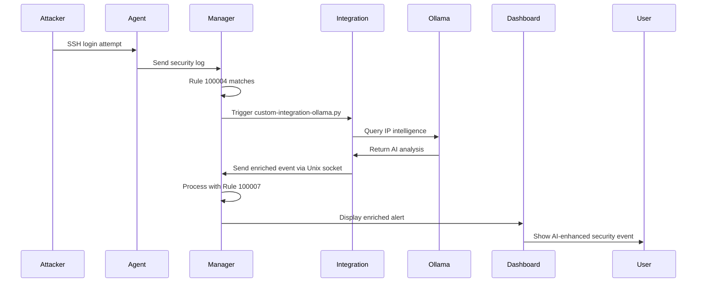

# Complete Guide to Enhancing Wazuh with Ollama: AI-Powered Cybersecurity Integration

## Introduction

Welcome to the complete guide on enhancing Wazuh with Ollama! This comprehensive tutorial will walk you through integrating Wazuh — a powerful open-source security platform — with Ollama, a tool for running large language models (LLMs) locally.

This combination brings together machine learning and security monitoring for smarter, faster protection. By the end of this guide, you'll have a fully functional AI-enhanced SIEM system capable of intelligent threat analysis and automated incident response.

## Table of Contents

## Part 1: Understanding the Integration

### What is Wazuh?

Wazuh is an open-source security information and event management (SIEM) system designed to collect, monitor, and analyze security-related data from various sources such as logs, network devices, and applications. It provides:

- Real-time monitoring and alerting
- Log collection and management
- File integrity monitoring
- Vulnerability detection
- Compliance management (PCI-DSS, HIPAA, GDPR)
- Incident response capabilities

### What is Ollama?

Ollama is an open-source tool that simplifies running large language models (LLMs) right on your machine. It's perfect for enhancing Wazuh with machine learning and AI without the complexity of cloud-based solutions or external dependencies.

Key features:
- Local model deployment
- Multiple model support
- REST API access
- Easy model management
- Privacy-focused (no data leaves your infrastructure)

### Why Integrate Ollama with Wazuh?

Combining Ollama with Wazuh offers numerous advantages:

#### 1. Smart Threat Intelligence and Anomaly Detection

- **Threat Prioritization**: Machine learning helps evaluate threats based on severity, filtering out false positives
- **Automated Incident Summaries**: Get concise and actionable incident summaries within seconds
- **Context-Aware Analysis**: LLMs provide additional context about IP addresses, attack patterns, and threat actors
- **Pattern Recognition**: Identify complex attack patterns that traditional rules might miss

#### 2. Optimizing Security Operations

- **Automated Response Playbooks**: Ollama generates playbooks for Wazuh's active response system based on detected threats
- **Enhanced SIEM and SOAR Integration**: Integrating with SIEM and SOAR systems becomes more efficient with AI-powered data
- **Reduced Alert Fatigue**: Intelligent filtering and prioritization of security events
- **Faster Incident Response**: Automated analysis reduces time from detection to response

#### 3. Simplified Compliance and Reporting

- **Policy Recommendations**: AI suggests optimal Wazuh settings to better align with compliance requirements
- **Automated Documentation**: Generate compliance reports and incident documentation automatically
- **Audit Trail Enhancement**: Enrich security events with contextual information for audits

#### 4. Cost-Effective AI Integration

- **No Cloud Costs**: Run models locally without expensive API calls
- **Data Privacy**: Sensitive security data never leaves your infrastructure
- **Customization**: Fine-tune models for your specific security environment

## Part 2: Setting Up Ollama

### Installation Options

You can install Ollama either locally or via Docker — the choice depends on your infrastructure and preferences.

### Option 1: Local Installation (Without Docker)

**For Linux and macOS:**

```bash
curl -fsSL https://ollama.com/install.sh | sh
```

**For Windows:**

1. Visit the [Ollama website](https://ollama.com)
2. Download the installer for Windows
3. Run the installer and follow the prompts

**Verify Installation:**

```bash
ollama --version
```

**Run Your First Model:**

```bash
ollama run llama3.2
```

### Option 2: Installation via Docker

**Quick Start:**

```bash
docker run -d -v ollama:/root/.ollama -p 11434:11434 --name ollama ollama/ollama
```

**Docker Compose Configuration:**

Create a `docker-compose.yml` file:

```yaml
services:
  ollama:
    image: ollama/ollama:latest
    ports:
      - "11434:11434"
    volumes:
      - ./ollama:/root/.ollama
    restart: always
    environment:
      - OLLAMA_KEEP_ALIVE=24h
      - OLLAMA_HOST=0.0.0.0
```

**Start the Service:**

```bash
docker-compose up -d
```

### Available Ollama Models

Ollama supports several LLMs optimized for different tasks:

| Model | Parameters | Size | Command | Best For |
|-------|-----------|------|---------|----------|
| Llama 3.2 | 3B | 2.0GB | `ollama run llama3.2` | General tasks, fast responses |
| Llama 3.1 | 8B | 4.7GB | `ollama run llama3.1` | Complex analysis, better reasoning |
| Gemma 2 | 9B | 5.5GB | `ollama run gemma2` | Advanced reasoning |
| Mistral | 7B | 4.1GB | `ollama run mistral` | Balanced performance |

**Downloading Models:**

```bash
# Download a specific model
ollama pull llama3.2

# List installed models
ollama list

# Remove a model
ollama rm llama3.2
```

### Building Custom Models with Modelfile

To create an AI expert specifically for Wazuh analysis:

**Create a Modelfile:**

```dockerfile
FROM llama3.2
PARAMETER temperature 0.7
PARAMETER top_p 0.9
SYSTEM """You are an AI assistant and Wazuh security expert.
Your role is to analyze security events, provide threat intelligence,
and recommend incident response actions. Always respond as a security
professional with expertise in:
- SIEM and log analysis
- Threat detection and classification
- MITRE ATT&CK framework
- Incident response procedures
- Network security
- Compliance requirements (PCI-DSS, HIPAA, GDPR)

Provide concise, actionable responses focused on security operations."""
```

**Build and Run the Custom Model:**

```bash
# Create the model
ollama create wazuh-expert -f ./Modelfile

# Run the custom model
ollama run wazuh-expert

# Test it
>>> Analyze this IP address: 203.0.113.5 attempting SSH login
```

### Using the Ollama REST API

Ollama provides a REST API for programmatic access.

**Basic Chat Request:**

```bash
curl http://localhost:11434/api/chat -d '{
  "model": "llama3.2",
  "messages": [
    {
      "role": "user",
      "content": "What is Wazuh and how does it help with security?"
    }
  ],
  "stream": false
}'
```

**Example Response:**

```json
{
  "model": "llama3.2",
  "created_at": "2025-02-24T10:00:00Z",
  "message": {
    "role": "assistant",
    "content": "Wazuh is an open-source security information and event management (SIEM) system..."
  },
  "done": true
}
```

**API Endpoints:**

- `/api/generate` - Generate text completion
- `/api/chat` - Chat interface
- `/api/tags` - List available models
- `/api/pull` - Download models
- `/api/push` - Upload custom models

**Python Example:**

```python
import requests
import json

def query_ollama(prompt, model="llama3.2"):
    response = requests.post(
        'http://localhost:11434/api/chat',
        json={
            'model': model,
            'messages': [{'role': 'user', 'content': prompt}],
            'stream': False
        }
    )
    return response.json()['message']['content']

# Use it
result = query_ollama("Explain SSH brute force attacks")
print(result)
```

## Part 3: Deploying Wazuh Cluster

### Why Docker Compose for Wazuh?

The fastest and easiest way to deploy a Wazuh cluster is by using Docker Compose. This approach provides:

- **Quick Deployment**: Minutes vs hours of manual setup
- **Consistent Environment**: Same configuration across different systems
- **Easy Scaling**: Add agents and components as needed
- **Simplified Updates**: Version control and easy rollbacks
- **Integrated Components**: Manager, indexer, and dashboard in one setup

### Cloning the Wazuh Docker Repository

```bash
# Clone the official repository (version 4.11.0)
git clone -b v4.11.0 https://github.com/wazuh/wazuh-docker

# Navigate to multi-node setup
cd wazuh-docker/multi-node
```

### Generating Security Certificates

Security certificates are required for encrypted communication between Wazuh components.

```bash
# Generate certificates
docker compose -f generate-indexer-certs.yml run --rm generator
```

This creates certificates for:
- Wazuh indexer nodes
- Wazuh dashboard
- Manager-to-indexer communication

### Configuring Wazuh Agent

Before starting the cluster, add an agent to the configuration.

**Edit `docker-compose.yml` and add:**

```yaml
services:
  # ... existing services ...

  wazuh-agent:
    image: wazuh/wazuh-agent:4.11.0
    hostname: wazuh-agent
    restart: always
    environment:
      - JOIN_MANAGER_MASTER_HOST=wazuh.manager
      - JOIN_MANAGER_WORKER_HOST=wazuh.manager
      - JOIN_MANAGER_USER=wazuh-wui
      - JOIN_MANAGER_PASSWORD=MyS3cr37P450r.*-
    depends_on:
      wazuh.manager:
        condition: service_healthy
    networks:
      - wazuh_network
```

**Environment Variables Explained:**

- `JOIN_MANAGER_MASTER_HOST`: Primary manager hostname
- `JOIN_MANAGER_WORKER_HOST`: Worker manager hostname
- `JOIN_MANAGER_USER`: API user for agent enrollment
- `JOIN_MANAGER_PASSWORD`: API password (change this!)

### Integrating Ollama with Wazuh Cluster

Add Ollama to the same Docker Compose configuration:

```yaml
services:
  # ... existing services ...

  ollama:
    image: ollama/ollama:latest
    ports:
      - "127.0.0.1:11434:11434"
    volumes:
      - ./ollama:/root/.ollama
    restart: always
    environment:
      - OLLAMA_KEEP_ALIVE=24h
      - OLLAMA_HOST=0.0.0.0
    networks:
      - wazuh_network
```

### Deploying the Complete Stack

**Start all services:**

```bash
docker compose up -d
```

**Monitor deployment progress:**

```bash
# Watch container status
docker compose ps

# Follow logs
docker compose logs -f

# Check specific service
docker compose logs -f wazuh.manager
```

**Expected output:**

```
NAME                    STATUS              PORTS
wazuh.manager           Up (healthy)        1514-1515/tcp, 55000/tcp
wazuh.indexer           Up (healthy)        9200/tcp
wazuh.dashboard         Up (healthy)        5601/tcp
wazuh-agent             Up
ollama                  Up                  11434/tcp
```

### Verifying Deployment

**Check all containers are healthy:**

```bash
docker compose ps
```

All containers should show `Up (healthy)` or `Up` status.

**Access the Wazuh Dashboard:**

1. Open browser to: `https://localhost`
2. Accept self-signed certificate warning
3. Login with default credentials:
   - **Username**: `admin`
   - **Password**: `SecretPassword`

**⚠️ IMPORTANT**: Change the default password immediately!

```bash
# Access the manager container
docker compose exec wazuh.manager bash

# Change password
/var/ossec/bin/wazuh-keystore -f indexer -k admin_password -v NewSecurePassword

# Restart manager
docker compose restart wazuh.manager
```

### Downloading Ollama Model

```bash
# Pull the model into the Ollama container
docker compose exec ollama ollama pull llama3.2

# Verify model is available
docker compose exec ollama ollama list
```

### Testing Ollama Connectivity

**Test from host machine:**

```bash
curl http://localhost:11434/api/chat -d '{
  "model": "llama3.2",
  "messages": [
    {
      "role": "user",
      "content": "What is Wazuh?"
    }
  ],
  "stream": false
}'
```

**Expected response:**

```json
{
  "model": "llama3.2",
  "created_at": "2025-02-24T10:00:00Z",
  "message": {
    "role": "assistant",
    "content": "Wazuh is an open-source security information and event management (SIEM) system. It's designed to collect, monitor, and analyze security-related data from various sources, such as logs, network devices, and applications..."
  },
  "done": true
}
```

### Troubleshooting Deployment

**If deployment fails:**

```bash
# Check logs for errors
docker compose logs

# Rebuild containers
docker compose down
docker compose up -d --force-recreate

# Clear volumes and restart (WARNING: deletes data)
docker compose down -v
docker compose up -d
```

**Common issues:**

1. **Port conflicts**: Ensure ports 443, 1514, 1515, 55000, 9200, 11434 are available
2. **Insufficient memory**: Allocate at least 8GB RAM to Docker
3. **Certificate errors**: Regenerate certificates if needed
4. **Network connectivity**: Check Docker network configuration

## Part 4: Creating the Integration

### Understanding Wazuh Integration Methods

Wazuh offers vast and nearly limitless possibilities for integration with various systems. External integrations can be implemented in two primary ways:

#### 1. External API Integrations

- [Official Documentation](https://documentation.wazuh.com/current/user-manual/manager/manual-integration.html)
- Enables interaction with external systems via APIs
- Data obtained can create events in Wazuh or trigger automated actions
- Enhances efficiency of threat monitoring and response
- Best for: Real-time external data enrichment

#### 2. Command-Based Integrations

- [Official Documentation](https://documentation.wazuh.com/current/user-manual/manager/manual-integration.html)
- Schedule commands or scripts for automatic event creation
- Useful for gathering data from non-standard sources
- Expands monitoring capabilities for custom systems
- Best for: Periodic data collection and custom workflows

### Choosing the Integration Method

For Ollama integration, we'll use the **External API integrations** method because:

1. Real-time analysis of security events
2. Direct API communication with Ollama
3. Immediate enrichment of alerts with AI insights
4. Automated response based on LLM analysis

### External API Integration Overview

The setup process involves these steps:

1. Create a Python script in `/var/ossec/integrations/`
2. Script name must begin with `custom-`
3. Add the integration to `ossec.conf`
4. Configure rules and decoders to process the data
5. Restart Wazuh to apply changes

### Working with the Ollama API

First, let's understand how to interact with Ollama programmatically.

#### Installing the Ollama Python Library

Wazuh includes its own Python environment. Install the library:

```bash
# From within Wazuh manager container or host
/var/ossec/framework/python/bin/pip3 install ollama
```

#### Basic Ollama API Usage

**Simple Example:**

```python
from ollama import chat

response = chat(
    model='llama3.2',
    messages=[{
        'role': 'user',
        'content': 'What is Wazuh?'
    }]
)
print(response['message']['content'])
```

**Parameters Explained:**

- `model='llama3.2'`: LLM model name
- `messages`: Conversation history and current prompt
- `response`: Full response object from Ollama
- `response['message']['content']`: Actual text response

**Using Custom Ollama Host:**

```python
from ollama import Client

client = Client(host='http://ollama:11434')

response = client.chat(
    model='llama3.2',
    messages=[{
        'role': 'user',
        'content': 'Analyze this IP: 203.0.113.5'
    }]
)
print(response['message']['content'])
```

### Integrating with Wazuh via Python

#### Understanding Wazuh's Unix Socket

Wazuh uses a Unix socket for fast, local inter-process communication. This is the most efficient way to send custom events to the Wazuh manager.

**Socket Location:**

```python
import os

# Get Wazuh installation path
wazuh_path = os.path.dirname(os.path.dirname(os.path.realpath(__file__)))

# Socket address
socket_addr = f"{wazuh_path}/queue/sockets/queue"
# Typically: /var/ossec/queue/sockets/queue
```

#### Sending Events to Wazuh

**Basic Event Function:**

```python
from socket import socket, AF_UNIX, SOCK_DGRAM
import json

def send_event(msg, agent=None):
    """
    Send custom event to Wazuh via Unix socket

    Args:
        msg: Event data (dict)
        agent: Agent information (dict with id, name, ip)
    """
    wazuh_path = os.path.dirname(os.path.dirname(os.path.realpath(__file__)))
    socket_addr = f"{wazuh_path}/queue/sockets/queue"

    if not agent or agent["id"] == "000":
        # Manager-level event
        string = f"1:ollama:{json.dumps(msg)}"
    else:
        # Agent-level event
        string = f"1:[{agent['id']}] ({agent['name']}) {agent.get('ip', 'any')}->ollama:{json.dumps(msg)}"

    # Create and connect socket
    sock = socket(AF_UNIX, SOCK_DGRAM)
    sock.connect(socket_addr)

    # Send event
    sock.send(string.encode())

    # Close socket
    sock.close()
```

**Event String Format:**

```
1:source_name:{"key": "value"}
```

- `1:` - Priority level (1 = manager)
- `source_name:` - Integration name (e.g., "ollama")
- `{...}` - JSON event data

**For Agent Events:**

```
1:[agent_id] (agent_name) agent_ip->source_name:{"key": "value"}
```

#### How Events Flow Through Wazuh


## Part 5: Building the Complete Integration

### Prerequisites and Dependencies

Before implementing the integration, ensure your environment is ready.

#### Installing Required Dependencies

```bash
# Access the Wazuh manager container
docker compose exec wazuh.manager bash

# Install Ollama library
/var/ossec/framework/python/bin/pip3 install ollama

# Verify installation
/var/ossec/framework/python/bin/pip3 list | grep ollama
```

### Creating the Integration Script

Create the main integration file: `/var/ossec/integrations/custom-integration-ollama.py`

#### Complete Integration Script

```python
#!/var/ossec/framework/python/bin/python3
"""
Wazuh-Ollama Integration Script
Author: Anubhav Gain
Description: Enriches Wazuh security events with AI-powered analysis from Ollama
"""

import json
import sys
import time
import os
from socket import socket, AF_UNIX, SOCK_DGRAM
from ollama import Client

# ============================================================================
# GLOBAL CONFIGURATION
# ============================================================================

# Enable/disable debug logging
debug_enabled = True

# Get Wazuh installation path
pwd = os.path.dirname(os.path.dirname(os.path.realpath(__file__)))

# Empty alert dictionary
alert = {}

# Current timestamp
now = time.strftime("%a %b %d %H:%M:%S %Z %Y")

# Log file for integration logging
log_file = f"{pwd}/logs/integrations.log"

# Wazuh Unix socket address
socket_addr = f"{pwd}/queue/sockets/queue"


# ============================================================================
# HELPER FUNCTIONS
# ============================================================================

def debug(msg):
    """
    Write debug messages to integration log file

    Args:
        msg: Message to log
    """
    if debug_enabled:
        msg = f"{now}: {msg}\n"

    with open(log_file, "a") as integration_logs:
        integration_logs.write(str(msg))


def send_event(msg, agent=None):
    """
    Send custom event to Wazuh via Unix socket

    Args:
        msg: Event data dictionary
        agent: Agent information (optional)
    """
    if not agent or agent["id"] == "000":
        # Manager-level event
        string = f"1:ollama:{json.dumps(msg)}"
    else:
        # Agent-level event with full context
        string = "1:[{0}] ({1}) {2}->ollama:{3}".format(
            agent["id"],
            agent["name"],
            agent.get("ip", "any"),
            json.dumps(msg)
        )

    debug(f"Sending event: {string}")

    # Create Unix socket
    sock = socket(AF_UNIX, SOCK_DGRAM)
    sock.connect(socket_addr)
    sock.send(string.encode())
    sock.close()


# ============================================================================
# OLLAMA API INTEGRATION
# ============================================================================

def query_ollama_api(src_ip, ollama_host='http://ollama:11434',
                     ollama_model='llama3.2'):
    """
    Query Ollama API for IP address intelligence

    Args:
        src_ip: Source IP address to analyze
        ollama_host: Ollama server URL
        ollama_model: Model to use for analysis

    Returns:
        str: AI-generated analysis of the IP address
    """
    try:
        # Create Ollama client
        client = Client(host=ollama_host)

        # Prepare prompt for IP analysis
        prompt = f"""Analyze this IP address from a cybersecurity perspective: {src_ip}

Provide:
1. Geolocation information if known
2. Known threat intelligence (if this is a known malicious IP)
3. Typical attack patterns from this region
4. Recommended security actions

Keep the response concise (2-3 sentences)."""

        # Send request to Ollama
        response = client.chat(
            model=ollama_model,
            messages=[{
                'role': 'user',
                'content': prompt
            }]
        )

        # Extract response content
        return response.model_dump().get('message').get('content')

    except Exception as e:
        debug(f"Error querying Ollama: {str(e)}")
        return f"Error analyzing IP address: {str(e)}"


# ============================================================================
# EVENT PROCESSING
# ============================================================================

def get_ollama_info(alert):
    """
    Process alert and create enriched event with Ollama analysis

    Args:
        alert: Original Wazuh alert dictionary

    Returns:
        dict: Enriched alert with Ollama analysis, or 0 if no source IP
    """
    alert_output = {}

    # Exit if alert doesn't contain source IP
    if "srcip" not in alert.get("data", {}):
        debug("No source IP found in alert, skipping Ollama analysis")
        return 0

    src_ip = alert["data"]["srcip"]
    debug(f"Analyzing source IP: {src_ip}")

    # Query Ollama for IP intelligence
    ollama_analysis = query_ollama_api(src_ip)

    # Build enriched alert structure
    alert_output["ollama"] = {
        "found": 1,
        "source": {
            "alert_id": alert.get("id", "unknown"),
            "rule": alert.get("rule", {}).get("id", "unknown"),
            "description": alert.get("rule", {}).get("description", "unknown"),
            "full_log": alert.get("full_log", ""),
            "srcip": src_ip
        },
        "info": ollama_analysis,
        "srcip": src_ip,
        "timestamp": alert.get("timestamp", now)
    }

    alert_output["integration"] = "custom-ollama"

    debug(f"Created enriched event: {json.dumps(alert_output, indent=2)}")

    return alert_output


# ============================================================================
# MAIN EXECUTION
# ============================================================================

if __name__ == "__main__":
    try:
        debug("=" * 80)
        debug("Starting Ollama integration")

        # Get alert file location from command line
        alert_file_location = sys.argv[1]
        debug(f"Alert file location: {alert_file_location}")

        # Get Ollama domain from command line (optional)
        ollama_domain = sys.argv[3] if len(sys.argv) > 3 else "http://ollama:11434"
        debug(f"Ollama domain: {ollama_domain}")

        # Load alert JSON file
        with open(alert_file_location) as alert_file:
            alert = json.load(alert_file)

        debug(f"Processing alert: {json.dumps(alert, indent=2)}")

        # Get Ollama analysis
        enriched_event = get_ollama_info(alert)

        # Send enriched event to Wazuh if analysis was successful
        if enriched_event:
            send_event(enriched_event, alert.get("agent"))
            debug("Successfully sent enriched event to Wazuh")
        else:
            debug("No enriched event to send")

        debug("Ollama integration completed successfully")
        debug("=" * 80)

    except Exception as e:
        debug(f"ERROR in main execution: {str(e)}")
        import traceback
        debug(traceback.format_exc())
        sys.exit(1)
```

#### Setting Proper Permissions

```bash
# Create the script file
# (Paste the code above into /var/ossec/integrations/custom-integration-ollama.py)

# Set executable permissions
chmod 750 /var/ossec/integrations/custom-integration-ollama.py

# Set ownership
chown root:wazuh /var/ossec/integrations/custom-integration-ollama.py

# Verify permissions
ls -la /var/ossec/integrations/custom-integration-ollama.py
```

Expected output:
```
-rwxr-x--- 1 root wazuh 8192 Feb 24 10:00 custom-integration-ollama.py
```

### Configuring Wazuh for Ollama Integration

#### Step 1: Configure ossec.conf

Edit `/var/ossec/etc/ossec.conf` and add the integration configuration:

```xml
<!-- Ollama Integration Configuration -->
<integration>
  <name>custom-integration-ollama.py</name>
  <hook_url>http://ollama:11434</hook_url>
  <level>10</level>
  <rule_id>100004,100005</rule_id>
  <alert_format>json</alert_format>
</integration>
```

**Configuration Parameters:**

- `<name>`: Integration script filename
- `<hook_url>`: Ollama server URL (passed as sys.argv[3])
- `<level>`: Minimum alert level to trigger integration (10 = high severity)
- `<rule_id>`: Specific rules that trigger this integration
- `<alert_format>`: Format of alert data (json recommended)

#### Step 2: Configure Custom Rules

Edit `/var/ossec/etc/rules/local_rules.xml` and add custom rules:

```xml
<!-- SSH Authentication Rules for Public IPs -->
<group name="local,syslog,sshd,">

  <!-- Rule 100004: SSH authentication failed from public IP -->
  <rule id="100004" level="10">
    <if_sid>5760</if_sid>
    <match type="pcre2">\b(?!(10)|192\.168|172\.(2[0-9]|1[6-9]|3[0-1])|(25[6-9]|2[6-9][0-9]|[3-9][0-9][0-9]|99[1-9]))[0-9]{1,3}\.(25[0-5]|2[0-4][0-9]|[01]?[0-9][0-9]?)\.(25[0-5]|2[0-4][0-9]|[01]?[0-9][0-9]?)\.(25[0-5]|2[0-4][0-9]|[01]?[0-9][0-9]?)</match>
    <description>sshd: Authentication failed from public IP address $(srcip)</description>
    <group>authentication_failed,pci_dss_10.2.4,pci_dss_10.2.5,</group>
  </rule>

  <!-- Rule 100005: SSH invalid user from public IP -->
  <rule id="100005" level="10">
    <if_sid>5710</if_sid>
    <match type="pcre2">\b(?!(10)|192\.168|172\.(2[0-9]|1[6-9]|3[0-1])|(25[6-9]|2[6-9][0-9]|[3-9][0-9][0-9]|99[1-9]))[0-9]{1,3}\.(25[0-5]|2[0-4][0-9]|[01]?[0-9][0-9]?)\.(25[0-5]|2[0-4][0-9]|[01]?[0-9][0-9]?)\.(25[0-5]|2[0-4][0-9]|[01]?[0-9][0-9]?)</match>
    <description>sshd: Invalid user login attempt from public IP address $(srcip)</description>
    <group>authentication_failed,pci_dss_10.2.4,pci_dss_10.2.5,</group>
  </rule>

</group>

<!-- Ollama Enrichment Alert Rule -->
<group name="local,ollama,">

  <!-- Rule 100007: Display Ollama analysis results -->
  <rule id="100007" level="10">
    <field name="ollama.srcip">\.+</field>
    <description>[OLLAMA AI ANALYSIS] IP address $(ollama.srcip) attempting network access - AI threat intelligence added</description>
    <group>ollama_analysis,threat_intelligence,</group>
  </rule>

</group>
```

**Rules Explained:**

**Rule 100004**: Triggers on SSH authentication failures from public IPs
- Parent rule: 5760 (SSH authentication failure)
- Regex: Matches public IP addresses (excludes private ranges)
- Level 10: High severity
- Groups: Links to PCI-DSS compliance requirements

**Rule 100005**: Triggers on invalid user login attempts
- Parent rule: 5710 (Invalid user attempt)
- Same public IP regex matching
- Tracks brute force attempts with non-existent users

**Rule 100007**: Displays Ollama enrichment results
- Triggers when `ollama.srcip` field is present
- Shows AI analysis in dashboard
- Tagged for easy filtering

#### Understanding the Regex Pattern

The regex pattern filters for public IP addresses:

```regex
\b(?!(10)|192\.168|172\.(2[0-9]|1[6-9]|3[0-1])|(25[6-9]|2[6-9][0-9]|[3-9][0-9][0-9]|99[1-9]))[0-9]{1,3}\.(25[0-5]|2[0-4][0-9]|[01]?[0-9][0-9]?)\.(25[0-5]|2[0-4][0-9]|[01]?[0-9][0-9]?)\.(25[0-5]|2[0-4][0-9]|[01]?[0-9][0-9]?)
```

**Excluded ranges (private networks):**
- `10.0.0.0/8` - Class A private
- `192.168.0.0/16` - Class C private
- `172.16.0.0/12` - Class B private
- `127.0.0.0/8` - Loopback
- `224.0.0.0+` - Multicast

### Restarting Wazuh Services

After configuration changes, restart the Wazuh manager:

**If using Docker Compose:**

```bash
# Stop all services
docker compose stop

# Start with force recreate
docker compose up -d --force-recreate

# Verify services are healthy
docker compose ps

# Check manager logs
docker compose logs -f wazuh.manager
```

**If using traditional installation:**

```bash
# Restart Wazuh manager
systemctl restart wazuh-manager.service

# Check status
systemctl status wazuh-manager.service

# Follow logs
tail -f /var/ossec/logs/ossec.log
```

### Verifying the Integration

#### Test the Integration Script Manually

```bash
# Create a test alert JSON file
cat > /tmp/test-alert.json << 'EOF'
{
  "id": "1234567890",
  "timestamp": "2025-02-24T10:00:00.000+0000",
  "rule": {
    "id": "100004",
    "description": "sshd: Authentication failed from public IP",
    "level": 10
  },
  "agent": {
    "id": "001",
    "name": "test-agent",
    "ip": "10.0.0.100"
  },
  "data": {
    "srcip": "203.0.113.5"
  },
  "full_log": "Failed password for invalid user admin from 203.0.113.5"
}
EOF

# Run the integration script manually
/var/ossec/framework/python/bin/python3 \
  /var/ossec/integrations/custom-integration-ollama.py \
  /tmp/test-alert.json \
  100004 \
  http://ollama:11434

# Check integration logs
tail -f /var/ossec/logs/integrations.log
```

#### Generate Real Test Events

**Trigger SSH authentication failure from external IP:**

```bash
# From another machine, attempt SSH login
ssh nonexistentuser@your-wazuh-agent-ip

# Or simulate locally (for testing only)
# This will generate failed authentication logs
```

#### Monitor Wazuh Dashboard

1. Open Wazuh dashboard: `https://localhost`
2. Navigate to **Security Events**
3. Filter for:
   - Rule ID: `100007`
   - Integration: `ollama`
4. Click on an event to see Ollama analysis in the details

### Integration Workflow



## Part 6: Advanced Configuration and Use Cases

### Fine-Tuning Ollama Prompts

Customize the AI analysis by modifying the prompt in `query_ollama_api()`:

```python
def query_ollama_api(src_ip, ollama_host='http://ollama:11434',
                     ollama_model='llama3.2'):
    """Enhanced IP analysis with MITRE ATT&CK mapping"""

    client = Client(host=ollama_host)

    # Advanced security-focused prompt
    prompt = f"""As a cybersecurity expert, analyze this IP address: {src_ip}

Provide:
1. Geographic location and ISP information
2. Known threat intelligence (check for presence in threat feeds)
3. Typical attack patterns from this region/ASN
4. MITRE ATT&CK techniques commonly used
5. Recommended security actions and priority level
6. Indicators of Compromise (IOCs) to monitor

Format as:
LOCATION: [location info]
THREAT LEVEL: [low/medium/high/critical]
ATTACK PATTERNS: [common patterns]
MITRE TECHNIQUES: [T-codes]
ACTIONS: [numbered list]

Keep concise but comprehensive."""

    response = client.chat(
        model=ollama_model,
        messages=[{
            'role': 'system',
            'content': 'You are a security analyst specializing in threat intelligence and incident response.'
        }, {
            'role': 'user',
            'content': prompt
        }]
    )

    return response.model_dump().get('message').get('content')
```

### Multiple Integration Scenarios

#### Scenario 1: File Integrity Monitoring

Analyze file changes with Ollama:

```python
def analyze_file_change(alert):
    """Analyze FIM alerts for potential threats"""

    if "syscheck" not in alert:
        return 0

    file_path = alert["syscheck"]["path"]
    file_change = alert["syscheck"]["event"]

    prompt = f"""Analyze this file integrity change:
File: {file_path}
Change: {file_change}

Is this suspicious? What could it indicate?
Provide risk assessment and recommended actions."""

    client = Client(host='http://ollama:11434')
    response = client.chat(
        model='llama3.2',
        messages=[{'role': 'user', 'content': prompt}]
    )

    return response.model_dump().get('message').get('content')
```

#### Scenario 2: Vulnerability Assessment

Enrich vulnerability alerts:

```python
def analyze_vulnerability(alert):
    """Enhance vulnerability data with remediation advice"""

    if "vulnerability" not in alert["data"]:
        return 0

    cve_id = alert["data"]["vulnerability"]["cve"]
    severity = alert["data"]["vulnerability"]["severity"]

    prompt = f"""Provide remediation guidance for:
CVE: {cve_id}
Severity: {severity}

Include:
1. Exploit likelihood
2. Patch priority
3. Temporary mitigations
4. Related vulnerabilities"""

    # ... query Ollama and return
```

#### Scenario 3: Log Anomaly Analysis

Detect unusual patterns:

```python
def analyze_log_anomaly(alert):
    """Use LLM to detect anomalous log patterns"""

    log_content = alert["full_log"]

    prompt = f"""Analyze this log entry for anomalies:
{log_content}

Identify:
1. Unusual patterns
2. Potential security implications
3. False positive likelihood
4. Investigation steps"""

    # ... query Ollama and return
```

### Performance Optimization

#### Caching Ollama Responses

```python
import hashlib
import pickle
from pathlib import Path

CACHE_DIR = "/var/ossec/tmp/ollama_cache"

def get_cached_response(src_ip):
    """Check if we have a recent cached response"""

    cache_file = Path(CACHE_DIR) / f"{hashlib.md5(src_ip.encode()).hexdigest()}.pkl"

    if cache_file.exists():
        # Check if cache is less than 24 hours old
        if time.time() - cache_file.stat().st_mtime < 86400:
            with open(cache_file, 'rb') as f:
                return pickle.load(f)

    return None

def cache_response(src_ip, response):
    """Cache Ollama response for future use"""

    Path(CACHE_DIR).mkdir(exist_ok=True)
    cache_file = Path(CACHE_DIR) / f"{hashlib.md5(src_ip.encode()).hexdigest()}.pkl"

    with open(cache_file, 'wb') as f:
        pickle.dump(response, f)

def query_ollama_api(src_ip, ollama_host='http://ollama:11434',
                     ollama_model='llama3.2'):
    """Query with caching"""

    # Check cache first
    cached = get_cached_response(src_ip)
    if cached:
        debug(f"Using cached response for {src_ip}")
        return cached

    # Query Ollama
    client = Client(host=ollama_host)
    response = client.chat(
        model=ollama_model,
        messages=[{
            'role': 'user',
            'content': f'Analyze IP: {src_ip}'
        }]
    )

    result = response.model_dump().get('message').get('content')

    # Cache the response
    cache_response(src_ip, result)

    return result
```

#### Rate Limiting

```python
import threading
from collections import deque
from time import time, sleep

class RateLimiter:
    """Simple rate limiter for Ollama queries"""

    def __init__(self, max_requests=10, time_window=60):
        self.max_requests = max_requests
        self.time_window = time_window
        self.requests = deque()
        self.lock = threading.Lock()

    def acquire(self):
        """Wait if necessary to maintain rate limit"""
        with self.lock:
            now = time()

            # Remove old requests outside time window
            while self.requests and self.requests[0] < now - self.time_window:
                self.requests.popleft()

            # If at limit, wait
            if len(self.requests) >= self.max_requests:
                sleep_time = self.time_window - (now - self.requests[0])
                if sleep_time > 0:
                    debug(f"Rate limit reached, sleeping {sleep_time}s")
                    sleep(sleep_time)

            self.requests.append(now)

# Global rate limiter
ollama_limiter = RateLimiter(max_requests=10, time_window=60)

def query_ollama_api(src_ip, ollama_host='http://ollama:11434',
                     ollama_model='llama3.2'):
    """Query with rate limiting"""

    # Wait for rate limiter
    ollama_limiter.acquire()

    # Proceed with query
    client = Client(host=ollama_host)
    # ... rest of function
```

### Error Handling and Resilience

```python
from functools import wraps
import traceback

def retry_on_failure(max_retries=3, delay=5):
    """Decorator for automatic retry on failure"""

    def decorator(func):
        @wraps(func)
        def wrapper(*args, **kwargs):
            for attempt in range(max_retries):
                try:
                    return func(*args, **kwargs)
                except Exception as e:
                    debug(f"Attempt {attempt + 1} failed: {str(e)}")
                    if attempt < max_retries - 1:
                        sleep(delay)
                    else:
                        debug(f"All {max_retries} attempts failed")
                        raise
        return wrapper
    return decorator

@retry_on_failure(max_retries=3, delay=5)
def query_ollama_api(src_ip, ollama_host='http://ollama:11434',
                     ollama_model='llama3.2'):
    """Query with automatic retry"""

    client = Client(host=ollama_host)

    response = client.chat(
        model=ollama_model,
        messages=[{
            'role': 'user',
            'content': f'Analyze IP: {src_ip}'
        }],
        options={
            'timeout': 30  # 30 second timeout
        }
    )

    return response.model_dump().get('message').get('content')
```

### Monitoring Integration Health

Create a health check script:

```python
#!/var/ossec/framework/python/bin/python3
"""
Health check for Ollama integration
"""

import requests
import json
from datetime import datetime, timedelta
import sys

def check_ollama_service():
    """Check if Ollama is responding"""
    try:
        response = requests.get('http://ollama:11434/api/tags', timeout=5)
        return response.status_code == 200
    except:
        return False

def check_integration_logs():
    """Check for recent integration activity"""
    log_file = "/var/ossec/logs/integrations.log"

    try:
        with open(log_file, 'r') as f:
            lines = f.readlines()

        if not lines:
            return False, "No log entries found"

        # Check for recent activity (last 1 hour)
        recent_entries = [l for l in lines if 'ollama' in l.lower()]

        return len(recent_entries) > 0, f"Found {len(recent_entries)} recent entries"
    except:
        return False, "Error reading log file"

def check_alert_generation():
    """Check if enriched alerts are being created"""
    # Query Wazuh API for recent ollama alerts
    # This is a simplified example
    return True, "Alert generation check passed"

def main():
    """Run all health checks"""
    print("Ollama Integration Health Check")
    print("=" * 50)

    # Check Ollama service
    print("\n1. Ollama Service:", end=" ")
    if check_ollama_service():
        print("✓ HEALTHY")
    else:
        print("✗ UNHEALTHY")
        sys.exit(1)

    # Check integration logs
    print("\n2. Integration Logs:", end=" ")
    status, message = check_integration_logs()
    if status:
        print(f"✓ HEALTHY - {message}")
    else:
        print(f"✗ UNHEALTHY - {message}")

    # Check alert generation
    print("\n3. Alert Generation:", end=" ")
    status, message = check_alert_generation()
    if status:
        print(f"✓ HEALTHY - {message}")
    else:
        print(f"✗ UNHEALTHY - {message}")

    print("\n" + "=" * 50)
    print("Overall Status: ✓ HEALTHY")

if __name__ == "__main__":
    main()
```

### Dashboard Customization

Create custom visualizations for Ollama-enriched events:

**Custom Dashboard JSON:**

```json
{
  "title": "Ollama AI Security Analysis",
  "description": "AI-enhanced threat intelligence dashboard",
  "visualizations": [
    {
      "id": "ollama-alerts-timeline",
      "type": "line",
      "title": "AI-Analyzed Threats Over Time",
      "query": {
        "match": {
          "rule.id": "100007"
        }
      }
    },
    {
      "id": "top-analyzed-ips",
      "type": "table",
      "title": "Top Analyzed Source IPs",
      "query": {
        "aggregation": {
          "field": "ollama.srcip"
        }
      }
    },
    {
      "id": "threat-distribution",
      "type": "pie",
      "title": "Threat Type Distribution",
      "query": {
        "aggregation": {
          "field": "rule.description"
        }
      }
    }
  ]
}
```

## Part 7: Production Best Practices

### Security Considerations

#### 1. Secure Ollama Communication

**Use TLS for Ollama:**

```yaml
# docker-compose.yml
services:
  ollama:
    image: ollama/ollama:latest
    environment:
      - OLLAMA_HOST=0.0.0.0
    volumes:
      - ./ollama:/root/.ollama
      - ./certs:/certs
    command: serve --tls-cert /certs/server.crt --tls-key /certs/server.key
```

#### 2. Authentication and Authorization

```python
def query_ollama_api(src_ip, ollama_host='http://ollama:11434',
                     ollama_model='llama3.2', api_key=None):
    """Query with API key authentication"""

    headers = {}
    if api_key:
        headers['Authorization'] = f'Bearer {api_key}'

    client = Client(host=ollama_host, headers=headers)
    # ... rest of function
```

#### 3. Input Validation

```python
import ipaddress

def validate_ip(ip_str):
    """Validate IP address format"""
    try:
        ipaddress.ip_address(ip_str)
        return True
    except ValueError:
        return False

def get_ollama_info(alert):
    """Process with input validation"""

    if "srcip" not in alert.get("data", {}):
        return 0

    src_ip = alert["data"]["srcip"]

    # Validate IP address
    if not validate_ip(src_ip):
        debug(f"Invalid IP address format: {src_ip}")
        return 0

    # Proceed with analysis
    # ...
```

### Scaling Considerations

#### Horizontal Scaling

```yaml
# docker-compose.yml - Multiple Ollama instances
services:
  ollama-1:
    image: ollama/ollama:latest
    ports:
      - "11434:11434"
    volumes:
      - ./ollama-1:/root/.ollama

  ollama-2:
    image: ollama/ollama:latest
    ports:
      - "11435:11434"
    volumes:
      - ./ollama-2:/root/.ollama

  ollama-3:
    image: ollama/ollama:latest
    ports:
      - "11436:11434"
    volumes:
      - ./ollama-3:/root/.ollama
```

**Load Balancing:**

```python
import random

OLLAMA_HOSTS = [
    'http://ollama-1:11434',
    'http://ollama-2:11434',
    'http://ollama-3:11434'
]

def query_ollama_api(src_ip, ollama_model='llama3.2'):
    """Query with load balancing"""

    # Round-robin or random selection
    ollama_host = random.choice(OLLAMA_HOSTS)

    debug(f"Using Ollama instance: {ollama_host}")

    client = Client(host=ollama_host)
    # ... rest of function
```

### Monitoring and Alerting

#### Metrics Collection

```python
import json
from collections import defaultdict
from datetime import datetime

class IntegrationMetrics:
    """Track integration performance metrics"""

    def __init__(self):
        self.metrics = {
            'total_queries': 0,
            'successful_queries': 0,
            'failed_queries': 0,
            'total_response_time': 0,
            'queries_by_hour': defaultdict(int),
            'errors': []
        }

    def record_query(self, success=True, response_time=0, error=None):
        """Record query metrics"""
        self.metrics['total_queries'] += 1

        if success:
            self.metrics['successful_queries'] += 1
        else:
            self.metrics['failed_queries'] += 1
            if error:
                self.metrics['errors'].append({
                    'timestamp': datetime.now().isoformat(),
                    'error': str(error)
                })

        self.metrics['total_response_time'] += response_time

        hour = datetime.now().strftime('%Y-%m-%d %H:00')
        self.metrics['queries_by_hour'][hour] += 1

    def get_stats(self):
        """Get current statistics"""
        total = self.metrics['total_queries']
        if total == 0:
            return {}

        return {
            'total_queries': total,
            'success_rate': (self.metrics['successful_queries'] / total) * 100,
            'average_response_time': self.metrics['total_response_time'] / total,
            'recent_errors': self.metrics['errors'][-10:]  # Last 10 errors
        }

    def save_to_file(self, filepath='/var/ossec/logs/ollama_metrics.json'):
        """Save metrics to file"""
        with open(filepath, 'w') as f:
            json.dump(self.metrics, f, indent=2)

# Global metrics instance
metrics = IntegrationMetrics()

def query_ollama_api(src_ip, ollama_host='http://ollama:11434',
                     ollama_model='llama3.2'):
    """Query with metrics tracking"""

    start_time = time.time()

    try:
        client = Client(host=ollama_host)
        response = client.chat(
            model=ollama_model,
            messages=[{'role': 'user', 'content': f'Analyze IP: {src_ip}'}]
        )

        response_time = time.time() - start_time
        metrics.record_query(success=True, response_time=response_time)

        return response.model_dump().get('message').get('content')

    except Exception as e:
        response_time = time.time() - start_time
        metrics.record_query(success=False, response_time=response_time, error=e)
        raise
```

### Backup and Recovery

#### Configuration Backup

```bash
#!/bin/bash
# backup-ollama-integration.sh

BACKUP_DIR="/var/backups/wazuh-ollama"
TIMESTAMP=$(date +%Y%m%d_%H%M%S)

# Create backup directory
mkdir -p "$BACKUP_DIR"

# Backup integration script
cp /var/ossec/integrations/custom-integration-ollama.py \
   "$BACKUP_DIR/custom-integration-ollama.py.$TIMESTAMP"

# Backup configuration
cp /var/ossec/etc/ossec.conf \
   "$BACKUP_DIR/ossec.conf.$TIMESTAMP"

# Backup custom rules
cp /var/ossec/etc/rules/local_rules.xml \
   "$BACKUP_DIR/local_rules.xml.$TIMESTAMP"

# Backup Ollama models
tar -czf "$BACKUP_DIR/ollama-models.$TIMESTAMP.tar.gz" \
   ./ollama/

echo "Backup completed: $BACKUP_DIR"
```

#### Restore Procedure

```bash
#!/bin/bash
# restore-ollama-integration.sh

BACKUP_FILE=$1

if [ -z "$BACKUP_FILE" ]; then
    echo "Usage: $0 <backup_timestamp>"
    exit 1
fi

# Restore files
cp "/var/backups/wazuh-ollama/custom-integration-ollama.py.$BACKUP_FILE" \
   /var/ossec/integrations/custom-integration-ollama.py

cp "/var/backups/wazuh-ollama/ossec.conf.$BACKUP_FILE" \
   /var/ossec/etc/ossec.conf

cp "/var/backups/wazuh-ollama/local_rules.xml.$BACKUP_FILE" \
   /var/ossec/etc/rules/local_rules.xml

# Restore Ollama models
tar -xzf "/var/backups/wazuh-ollama/ollama-models.$BACKUP_FILE.tar.gz" \
   -C ./

# Restart services
docker compose restart wazuh.manager
docker compose restart ollama

echo "Restore completed"
```

## Part 8: Troubleshooting Guide

### Common Issues and Solutions

#### Issue 1: Integration Script Not Triggering

**Symptoms:**
- No enriched events appearing in dashboard
- No entries in integration logs

**Diagnosis:**

```bash
# Check if integration is enabled
grep -A 10 "custom-integration-ollama" /var/ossec/etc/ossec.conf

# Check script permissions
ls -la /var/ossec/integrations/custom-integration-ollama.py

# Test script manually
/var/ossec/framework/python/bin/python3 \
  /var/ossec/integrations/custom-integration-ollama.py \
  /tmp/test-alert.json 100004 http://ollama:11434
```

**Solutions:**

1. Verify integration configuration in ossec.conf
2. Check script has executable permissions (chmod 750)
3. Ensure proper ownership (chown root:wazuh)
4. Verify rule IDs match configured triggers
5. Restart Wazuh manager

#### Issue 2: Ollama Connection Errors

**Symptoms:**
- "Connection refused" errors in logs
- Timeouts when querying Ollama

**Diagnosis:**

```bash
# Check if Ollama is running
docker compose ps ollama

# Test Ollama API directly
curl http://ollama:11434/api/tags

# Check network connectivity
docker compose exec wazuh.manager ping ollama
```

**Solutions:**

1. Verify Ollama container is running and healthy
2. Check firewall rules aren't blocking port 11434
3. Ensure containers are on same Docker network
4. Verify OLLAMA_HOST environment variable
5. Check Ollama logs for errors:
   ```bash
   docker compose logs ollama
   ```

#### Issue 3: Model Not Found

**Symptoms:**
- "model 'llama3.2' not found" errors

**Diagnosis:**

```bash
# List available models
docker compose exec ollama ollama list
```

**Solutions:**

```bash
# Pull the required model
docker compose exec ollama ollama pull llama3.2

# Or pull from host
ollama pull llama3.2

# Verify model is available
docker compose exec ollama ollama list | grep llama3.2
```

#### Issue 4: Slow Response Times

**Symptoms:**
- Integration taking > 30 seconds per query
- Timeouts in integration logs

**Diagnosis:**

```bash
# Check Ollama resource usage
docker stats ollama

# Check model size and system resources
free -h
```

**Solutions:**

1. **Use smaller models:**
   ```bash
   # Switch to smaller, faster model
   docker compose exec ollama ollama pull llama3.2:1b
   ```

2. **Implement caching** (see Performance Optimization section)

3. **Add GPU support:**
   ```yaml
   # docker-compose.yml
   services:
     ollama:
       image: ollama/ollama:latest
       deploy:
         resources:
           reservations:
             devices:
               - driver: nvidia
                 count: 1
                 capabilities: [gpu]
   ```

4. **Increase timeout:**
   ```python
   response = client.chat(
       model=ollama_model,
       messages=[...],
       options={'timeout': 60}  # Increase to 60 seconds
   )
   ```

#### Issue 5: Memory Issues

**Symptoms:**
- OOM (Out of Memory) errors
- Container crashes

**Diagnosis:**

```bash
# Check memory usage
docker stats

# Check system memory
free -h

# Check Ollama logs
docker compose logs ollama | grep -i "memory\|oom"
```

**Solutions:**

1. **Increase Docker memory limit:**
   ```yaml
   # docker-compose.yml
   services:
     ollama:
       image: ollama/ollama:latest
       deploy:
         resources:
           limits:
             memory: 8G
   ```

2. **Use quantized models:**
   ```bash
   # Use Q4 quantized model (smaller)
   ollama pull llama3.2:q4_0
   ```

3. **Limit concurrent requests** (implement rate limiting)

4. **Clear unused models:**
   ```bash
   docker compose exec ollama ollama rm unused-model
   ```

### Debug Mode

Enable detailed debugging:

```python
# In custom-integration-ollama.py
debug_enabled = True  # Set to True

# Add more verbose logging
def query_ollama_api(src_ip, ollama_host='http://ollama:11434',
                     ollama_model='llama3.2'):
    debug(f"Starting Ollama query for IP: {src_ip}")
    debug(f"Ollama host: {ollama_host}")
    debug(f"Model: {ollama_model}")

    try:
        client = Client(host=ollama_host)
        debug("Client created successfully")

        debug(f"Sending chat request...")
        response = client.chat(
            model=ollama_model,
            messages=[{'role': 'user', 'content': f'Analyze IP: {src_ip}'}]
        )
        debug("Received response from Ollama")

        result = response.model_dump().get('message').get('content')
        debug(f"Extracted content: {result[:100]}...")  # First 100 chars

        return result

    except Exception as e:
        debug(f"ERROR in query_ollama_api: {str(e)}")
        debug(f"Traceback: {traceback.format_exc()}")
        raise
```

### Log Analysis

```bash
# Watch integration logs in real-time
tail -f /var/ossec/logs/integrations.log

# Search for errors
grep -i error /var/ossec/logs/integrations.log

# Check for specific IP analysis
grep "203.0.113.5" /var/ossec/logs/integrations.log

# Count successful vs failed queries
grep -c "Successfully sent" /var/ossec/logs/integrations.log
grep -c "ERROR" /var/ossec/logs/integrations.log
```

## Part 9: Real-World Use Cases

### Use Case 1: Automated Threat Hunting

**Scenario:** Detect and analyze potential APT (Advanced Persistent Threat) indicators

**Implementation:**

```python
def hunt_apt_indicators(alert):
    """Analyze events for APT indicators"""

    suspicious_patterns = []

    # Check for indicators
    if "data" in alert:
        # Unusual ports
        if "dstport" in alert["data"]:
            port = int(alert["data"]["dstport"])
            if port in [4444, 31337, 1337]:  # Common backdoor ports
                suspicious_patterns.append(f"Suspicious port: {port}")

        # Unusual times
        hour = datetime.now().hour
        if hour < 6 or hour > 22:  # Outside business hours
            suspicious_patterns.append("Activity outside business hours")

    if not suspicious_patterns:
        return None

    # Query Ollama for APT analysis
    prompt = f"""Analyze these suspicious patterns for APT indicators:
{', '.join(suspicious_patterns)}

Alert details: {json.dumps(alert, indent=2)}

Provide:
1. APT likelihood (low/medium/high)
2. Potential threat actor TTPs
3. MITRE ATT&CK techniques
4. Recommended immediate actions"""

    client = Client(host='http://ollama:11434')
    response = client.chat(
        model='llama3.2',
        messages=[{'role': 'user', 'content': prompt}]
    )

    return response.model_dump().get('message').get('content')
```

### Use Case 2: Compliance Automation

**Scenario:** Automatically assess compliance violations and generate remediation steps

**Implementation:**

```python
def assess_compliance_violation(alert):
    """Analyze compliance-related events"""

    compliance_frameworks = {
        'pci_dss': 'PCI-DSS',
        'hipaa': 'HIPAA',
        'gdpr': 'GDPR',
        'sox': 'SOX'
    }

    # Detect which frameworks are affected
    affected_frameworks = []
    if "rule" in alert and "groups" in alert["rule"]:
        for group in alert["rule"]["groups"]:
            for key, name in compliance_frameworks.items():
                if key in group.lower():
                    affected_frameworks.append(name)

    if not affected_frameworks:
        return None

    prompt = f"""Compliance violation detected:
Frameworks: {', '.join(affected_frameworks)}
Rule: {alert['rule']['description']}
Event: {alert.get('full_log', 'N/A')}

Provide:
1. Specific compliance requirement violated
2. Risk severity for each framework
3. Required remediation steps
4. Documentation requirements
5. Timeline for remediation"""

    client = Client(host='http://ollama:11434')
    response = client.chat(
        model='llama3.2',
        messages=[{'role': 'user', 'content': prompt}]
    )

    return response.model_dump().get('message').get('content')
```

### Use Case 3: Automated Incident Response

**Scenario:** Generate and execute response playbooks based on threat type

**Implementation:**

```python
def generate_response_playbook(alert):
    """Create incident response playbook"""

    attack_type = classify_attack(alert)

    prompt = f"""Generate an incident response playbook for:
Attack Type: {attack_type}
Source IP: {alert['data'].get('srcip', 'N/A')}
Target: {alert['agent']['name']}

Include:
1. Immediate containment steps
2. Evidence collection procedures
3. Analysis and investigation tasks
4. Eradication steps
5. Recovery procedures
6. Post-incident activities

Format as numbered steps with priority levels."""

    client = Client(host='http://ollama:11434')
    response = client.chat(
        model='llama3.2',
        messages=[{'role': 'user', 'content': prompt}]
    )

    playbook = response.model_dump().get('message').get('content')

    # Store playbook
    save_playbook(alert['id'], playbook)

    # Trigger automated responses
    execute_automated_steps(playbook, alert)

    return playbook

def execute_automated_steps(playbook, alert):
    """Execute automatable playbook steps"""

    # Example: Block IP if playbook recommends it
    if "block ip" in playbook.lower():
        block_ip_address(alert['data']['srcip'])

    # Example: Isolate host if critical
    if "isolate" in playbook.lower() and "critical" in playbook.lower():
        isolate_host(alert['agent']['id'])

    # Example: Collect forensics
    if "collect" in playbook.lower() and "evidence" in playbook.lower():
        trigger_forensic_collection(alert['agent']['id'])
```

## Conclusion

Congratulations! You've successfully built a complete AI-enhanced Wazuh SIEM system with Ollama integration. This comprehensive setup provides:

### Key Achievements

✅ **AI-Powered Threat Analysis** - Automatic enrichment of security events with LLM intelligence

✅ **Automated Incident Response** - Generated playbooks and recommended actions

✅ **Local AI Deployment** - Privacy-focused with no external dependencies

✅ **Cost-Effective** - Zero cloud API costs, unlimited queries

✅ **Scalable Architecture** - Ready for production with performance optimizations

✅ **Compliance Support** - Automated compliance assessment and documentation

### Architecture Summary

```
┌─────────────┐
│   Attacker  │
└──────┬──────┘
       │
       ▼
┌─────────────┐     ┌──────────────┐     ┌──────────────┐
│ Wazuh Agent │────▶│Wazuh Manager │────▶│    Ollama    │
└─────────────┘     └──────┬───────┘     └──────┬───────┘
                           │                     │
                           │◀────────────────────┘
                           │  AI Analysis
                           ▼
                    ┌──────────────┐
                    │   Dashboard  │
                    └──────────────┘
                    Enriched Alerts
```

### What You've Learned

1. **Ollama Setup** - Installation, configuration, and model management
2. **Wazuh Deployment** - Docker Compose cluster with agents
3. **Custom Integration** - Python-based external API integration
4. **Rule Configuration** - Custom rules and event processing
5. **Performance Optimization** - Caching, rate limiting, scaling
6. **Production Best Practices** - Security, monitoring, backup/recovery
7. **Troubleshooting** - Common issues and solutions
8. **Real-World Applications** - Threat hunting, compliance, incident response

### Next Steps

#### Immediate Actions

1. **Test in Production** - Deploy to production environment with monitoring
2. **Fine-Tune Models** - Create custom Modelfiles for your environment
3. **Expand Rules** - Add more trigger rules for different attack types
4. **Build Dashboards** - Create custom visualizations
5. **Document Procedures** - Create runbooks for your team

#### Future Enhancements

1. **Advanced Features**
   - Multi-model ensemble analysis
   - Automated threat hunting workflows
   - Custom fine-tuned models for your environment
   - Integration with SOAR platforms

2. **Scalability**
   - Kubernetes deployment
   - Multi-region setup
   - High availability configuration
   - Load balancing across Ollama instances

3. **Intelligence Feeds**
   - Integration with threat intelligence platforms
   - Automated IOC enrichment
   - Real-time threat feed updates

4. **Automation**
   - Automated response playbooks
   - Self-healing security controls
   - Adaptive security policies

### Resources and Support

#### Documentation

- [Wazuh Official Documentation](https://documentation.wazuh.com)
- [Ollama Documentation](https://ollama.com/docs)
- [LangChain Documentation](https://python.langchain.com/)
- [Docker Compose Documentation](https://docs.docker.com/compose/)

#### Community

- [Wazuh Community Forum](https://groups.google.com/g/wazuh)
- [Ollama GitHub](https://github.com/ollama/ollama)
- [Wazuh GitHub](https://github.com/wazuh/wazuh)

#### Quick Reference Commands

```bash
# Ollama Management
docker compose exec ollama ollama list
docker compose exec ollama ollama pull llama3.2
docker compose exec ollama ollama rm model-name

# Wazuh Management
docker compose restart wazuh.manager
docker compose logs -f wazuh.manager
docker compose exec wazuh.manager /var/ossec/bin/wazuh-control status

# Integration Testing
tail -f /var/ossec/logs/integrations.log
tail -f /var/ossec/logs/ossec.log

# Health Checks
docker compose ps
curl http://localhost:11434/api/tags
```

### Final Thoughts

You've built a powerful, AI-enhanced SIEM system that combines the robust security monitoring capabilities of Wazuh with the intelligent analysis of modern LLMs through Ollama. This integration represents the future of security operations — where automation and artificial intelligence work together to protect your infrastructure more effectively than traditional approaches alone.

The key to success is continuous improvement: keep refining your rules, updating your models, and adapting to new threats. Security is an ongoing journey, and you now have the tools to stay ahead.

**Happy securing!** 🛡️🤖

---

**Author**: Anubhav Gain
**Last Updated**: October 4, 2025
**Version**: 1.0
**License**: MIT

**Disclaimer**: This integration is provided as-is for educational and production use. Always test thoroughly in a staging environment before deploying to production. Ensure compliance with your organization's security policies and regulatory requirements.
