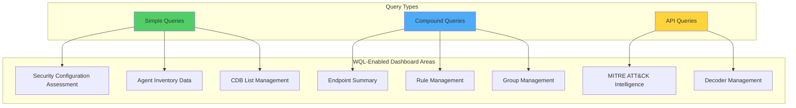
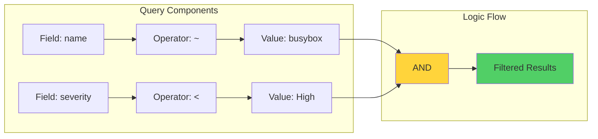
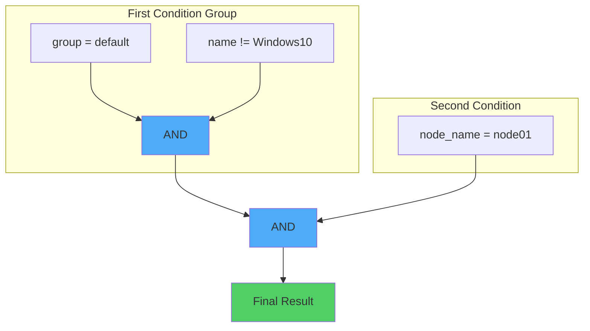
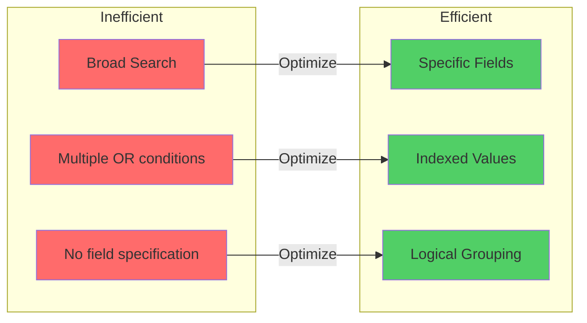

# Filtering Security Data with the Wazuh Query Language (WQL)

## Introduction

In the world of security monitoring, the ability to quickly find relevant information within vast amounts of data can mean the difference between preventing a breach and cleaning up after one. The Wazuh Query Language (WQL) transforms how security analysts interact with Wazuh, providing a powerful yet intuitive way to filter and analyze security data.

WQL brings several advantages:
- 🔍 **Precise Filtering**: Target exactly the data you need
- ⚡ **Quick Analysis**: Reduce time spent searching through logs
- 🎯 **Focused Threat Hunting**: Build complex queries for specific threats
- 📊 **Better Visibility**: Extract meaningful insights from raw data
- 🤝 **User-Friendly Syntax**: Easy to learn and use

## Understanding WQL Fundamentals

### Basic Syntax Structure

At its core, WQL follows a simple pattern:

```
fieldname operator value
```

### Core Components

1. **Field Names**: The data type you want to filter
2. **Operators**: How to compare the data
   - Equality: `=`
   - Inequality: `!=`
   - Greater than: `>`
   - Less than: `<`
   - Like/Contains: `~`
3. **Values**: The specific data you're looking for
4. **Separators**: Combine queries with `and`, `or`
5. **Grouping**: Use parentheses `()` for complex logic

### Where Can You Use WQL?



## Infrastructure Setup

For our demonstrations, we'll use:

- **Wazuh Server**: Pre-built OVA 4.7.3 with all core components
- **Monitored Endpoints**:
  - Ubuntu 22.04.3 with Wazuh agent 4.7.3
  - Windows 10 with Wazuh agent 4.7.3 (for multi-agent scenarios)

## Practical Use Cases

### Use Case 1: Hunting Critical Vulnerabilities

**Scenario**: Find all BusyBox vulnerabilities with severity greater than High.

#### Configuration

Enable vulnerability detection on the Wazuh server:

```xml
<!-- /var/ossec/etc/ossec.conf -->
<vulnerability-detector>
    <enabled>yes</enabled>
    <interval>5m</interval>
    <min_full_scan_interval>6h</min_full_scan_interval>
    <run_on_start>yes</run_on_start>
    <!-- Ubuntu OS vulnerabilities -->
    <provider name="canonical">
        <enabled>yes</enabled>
        <os>trusty</os>
        <os>xenial</os>
        <os>bionic</os>
        <os>focal</os>
        <os>jammy</os>
        <update_interval>1h</update_interval>
    </provider>
</vulnerability-detector>
```

Restart the Wazuh manager:
```bash
systemctl restart wazuh-manager
```

#### WQL Query

Navigate to **Modules > Vulnerabilities** and use:

```wql
name ~ busybox and severity < High
```

**Query Breakdown**:
- `name ~ busybox`: Find packages containing "busybox"
- `and`: Combine conditions
- `severity < High`: Only show Critical severity (less than High means more severe)

#### Understanding the Results



### Use Case 2: Multi-Criteria Agent Filtering

**Scenario**: Find agents in the default group, exclude Windows10, and ensure they're connected to node01.

#### Complex Query Construction

```wql
( group = default and name != Windows10 ) and node_name = node01
```

**Query Breakdown**:
- Parentheses group related conditions
- First group: Agents in default group excluding Windows10
- Second condition: Must be on node01

#### Query Logic Visualization



### Use Case 3: MITRE ATT&CK Threat Intelligence

**Scenario**: Find command-line tools used for Active Directory attacks.

#### Targeted Threat Hunting

Navigate to **Modules > MITRE ATT&CK > Intelligence > Software**:

```wql
description ~ "Active Directory" and description ~ "command-line"
```

This query reveals tools like:
- **Mimikatz**: Credential dumping
- **PsExec**: Remote execution
- **BloodHound**: AD reconnaissance
- **PowerSploit**: PowerShell exploitation

### Use Case 4: System Inventory Analysis

**Scenario**: Monitor a Python 3 web server running on port 8888.

#### Setup Python Web Server

Configure rapid inventory updates (for testing only):

```xml
<!-- /var/ossec/etc/ossec.conf on agent -->
<wodle name="syscollector">
    <disabled>no</disabled>
    <interval>1m</interval>
    <scan_on_start>yes</scan_on_start>
    <hardware>yes</hardware>
    <os>yes</os>
    <network>yes</network>
    <packages>yes</packages>
    <ports all="no">yes</ports>
    <processes>yes</processes>
</wodle>
```

Start the test server:
```bash
python3 -m http.server 8888
```

#### Multi-Aspect Queries

**1. Find Python 3 Packages**:
```wql
name ~ python3 and version > 3.10
```

**2. Locate Open Ports**:
```wql
(local.port > 8000 and local.port < 9000) and state=listening
```

**3. Identify Python Processes (via API)**:
```
GET /syscollector/001/processes?euser=root&name=python3
```

### Use Case 5: Security Rules and Decoders

**Scenario**: Find all Docker-related security rules and decoders.

#### API Console Queries

Access **Tools > API Console** and run:

**Find Docker Decoders**:
```
GET /decoders/files?search=docker&status=enabled
```

**Find Docker Rules**:
```
GET /rules/files?search=docker&status=enabled
```

## Advanced WQL Techniques

### Combining Multiple Conditions

```wql
# Find high-severity vulnerabilities in web packages
(name ~ apache or name ~ nginx) and severity < Medium and status = Active

# Find agents offline for more than 24 hours
status = disconnected and last_keepalive < 24h and os.platform = linux
```

### Using Wildcards and Patterns

```wql
# Find all log4j related packages
name ~ log4j*

# Find IP addresses in specific range
ip ~ 192.168.1.*
```

### Time-Based Queries

```wql
# Find recent authentication failures
rule.id = 5503 and timestamp > now-1h

# Find vulnerabilities discovered this week
detection_time > now-7d and severity = Critical
```

## WQL Best Practices

### 1. Query Optimization



### 2. Query Templates

Create reusable query templates for common scenarios:

```wql
# Template: Find authentication anomalies
rule.groups ~ authentication and rule.level > 10 and agent.name = $AGENT_NAME

# Template: Compliance violations
rule.groups ~ compliance and (rule.gdpr = * or rule.pci_dss = *)

# Template: Network security events
rule.groups ~ network and (data.dstport < 1024 or data.srcip ~ 10.*)
```

### 3. Progressive Filtering

Start broad and narrow down:

```wql
# Step 1: All vulnerabilities
severity = Critical

# Step 2: Add package filter
severity = Critical and name ~ kernel

# Step 3: Add time constraint
severity = Critical and name ~ kernel and detection_time > now-24h
```

## Troubleshooting WQL Queries

### Common Issues and Solutions

#### Issue 1: No Results Returned

```wql
# Problem: Using wrong operator
name = *python*  # Won't work

# Solution: Use ~ for pattern matching
name ~ python
```

#### Issue 2: Case Sensitivity

```wql
# Problem: Case mismatch
status = Active  # May not match "active"

# Solution: Check exact field values in suggestions
status = active
```

#### Issue 3: Complex Logic Errors

```wql
# Problem: Incorrect grouping
group = default and name != Windows or node = node01

# Solution: Use parentheses
(group = default and name != Windows) or node = node01
```

## Performance Considerations

### Query Efficiency Tips

1. **Use Indexed Fields**: Queries on indexed fields are faster
2. **Limit Time Ranges**: Add time constraints when possible
3. **Avoid Wildcards at Start**: `*pattern` is slower than `pattern*`
4. **Use Specific Values**: Exact matches are faster than patterns

### Query Performance Comparison

| Query Type | Performance | Example |
|------------|-------------|---------|
| Exact Match | ⚡ Fastest | `agent.id = 001` |
| Prefix Match | 🚀 Fast | `name ~ python*` |
| Contains | 🏃 Moderate | `description ~ Active` |
| Complex Logic | 🐢 Slower | Multiple nested conditions |

## Integration with Automation

### Scripted WQL Queries

```python
#!/usr/bin/env python3
import requests
import json

# Wazuh API configuration
API_URL = "https://wazuh-server:55000"
API_USER = "wazuh"
API_PASS = "wazuh"

def run_wql_query(endpoint, query):
    """Execute WQL query via Wazuh API"""

    response = requests.get(
        f"{API_URL}/{endpoint}?{query}",
        auth=(API_USER, API_PASS),
        verify=False
    )

    return response.json()

# Example: Find critical vulnerabilities
vulns = run_wql_query(
    "vulnerability/001",
    "severity=Critical&status=Active"
)

# Example: Find specific processes
processes = run_wql_query(
    "syscollector/001/processes",
    "name=python3&state=running"
)
```

### Scheduled Query Reports

```bash
#!/bin/bash
# daily_security_report.sh

# Critical vulnerabilities check
echo "=== Critical Vulnerabilities ==="
curl -u wazuh:wazuh -k \
  "https://localhost:55000/vulnerability?severity=Critical&status=Active"

# Disconnected agents check
echo "=== Disconnected Agents ==="
curl -u wazuh:wazuh -k \
  "https://localhost:55000/agents?status=disconnected"

# Failed authentication summary
echo "=== Authentication Failures ==="
curl -u wazuh:wazuh -k \
  "https://localhost:55000/security/events?rule.id=5503&time_frame=24h"
```

## Real-World Scenarios

### Incident Response Query Set

```wql
# 1. Find compromised user accounts
rule.groups ~ authentication_failed and data.srcuser = $SUSPECTED_USER

# 2. Track lateral movement
rule.mitre.technique ~ T1021 and agent.ip ~ 192.168.*

# 3. Identify data exfiltration
rule.groups ~ network and data.bytes_out > 1000000

# 4. Detect privilege escalation
rule.groups ~ privilege_escalation or rule.mitre.technique ~ T1548
```

### Compliance Monitoring

```wql
# PCI DSS violations
rule.pci_dss ~ 10.* and rule.level > 7

# GDPR compliance checks
rule.gdpr ~ * and rule.groups ~ compliance

# HIPAA related events
rule.hipaa ~ 164.* and timestamp > now-24h
```

## Future of WQL

### Upcoming Features

1. **Machine Learning Integration**: Anomaly detection in queries
2. **Natural Language Processing**: Convert plain English to WQL
3. **Query Optimization Engine**: Automatic query performance tuning
4. **Visual Query Builder**: Drag-and-drop interface

## Conclusion

The Wazuh Query Language transforms security data analysis from a tedious task into an efficient, precise operation. By mastering WQL, security teams can:

- 🎯 **Quickly identify threats** in large datasets
- 📊 **Generate meaningful reports** with targeted queries
- 🔍 **Perform deep investigations** using complex filters
- ⚡ **Reduce response times** through efficient data retrieval
- 🤝 **Collaborate better** with shareable query templates

Start with simple queries and gradually build complexity as you become comfortable with the syntax. Remember, effective security monitoring isn't about querying everything—it's about querying the right things.

## Key Takeaways

1. **Start Simple**: Master basic syntax before complex queries
2. **Use Suggestions**: WQL provides helpful field suggestions
3. **Leverage Operators**: Choose the right operator for your need
4. **Group Logically**: Use parentheses for clear logic
5. **Test Incrementally**: Build complex queries step by step

## Resources

- [Wazuh Query Language Documentation](https://documentation.wazuh.com/current/user-manual/wazuh-dashboard/queries.html)
- [WQL API Reference](https://documentation.wazuh.com/current/user-manual/api/queries.html)
- [Wazuh Dashboard Guide](https://documentation.wazuh.com/current/user-manual/wazuh-dashboard/index.html)
- [MITRE ATT&CK in Wazuh](https://documentation.wazuh.com/current/user-manual/ruleset/mitre.html)

---

*Master your security data with WQL. Query smarter, respond faster! 🚀*
