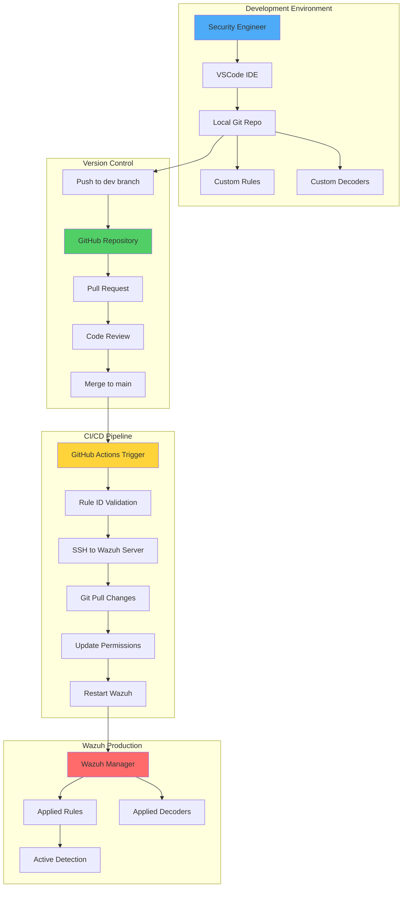

# Wazuh Ruleset as Code (RaC): DevOps-Driven Security Detection Engineering

## Introduction

Security operations are evolving. Gone are the days of manually updating detection rules on production SIEM systems. Enter **Wazuh Ruleset as Code (RaC)** – a game-changing approach that brings DevOps principles to security detection engineering.

By treating security rules as code, we can:
- 🔄 Version control all detection logic
- 👥 Enable collaborative rule development
- 🚀 Automate testing and deployment
- 📝 Track every change with audit trails
- ↩️ Rollback problematic rules instantly

This guide demonstrates how to implement a complete RaC pipeline for Wazuh, transforming how your security team manages detection rules.

## Why Ruleset as Code Matters

Traditional SIEM rule management suffers from:
- **Manual errors** during rule updates
- **No change tracking** or rollback capability
- **Limited collaboration** between team members
- **Inconsistent testing** before production deployment
- **Direct production access** requirements

RaC solves these challenges by applying proven software development practices to security operations.

## Architecture Overview



## Prerequisites

Before implementing RaC, ensure you have:

1. **Wazuh Infrastructure**
   - Wazuh 4.12.0+ installed (server, indexer, dashboard)
   - Public IP or NAT configuration for GitHub Actions access
   - SSH access configured

2. **Development Tools**
   - Git installed on Wazuh server
   - VSCode or preferred IDE
   - GitHub account

3. **Network Requirements**
   - Port 22 (SSH) accessible from GitHub Actions
   - Outbound HTTPS for Git operations

## Step 1: Prepare Your Wazuh Server

### Configure SSH Access

```bash
# Generate SSH key pair if not exists
ssh-keygen -t rsa -b 4096 -f ~/.ssh/wazuh_rac_key

# Ensure SSH service is running
sudo systemctl enable ssh
sudo systemctl start ssh

# Configure firewall
sudo ufw allow 22/tcp
```

### Install Git

```bash
# Install Git
sudo apt update
sudo apt install git -y

# Verify installation
git --version
```

## Step 2: Set Up Version Control

### Create Local Repository

Navigate to Wazuh configuration directory and initialize Git:

```bash
# Navigate to Wazuh config directory
cd /var/ossec/etc

# Create .gitignore to exclude non-ruleset files
cat > .gitignore << 'EOF'
# Ignore configuration files
client.keys
internal_options.conf
local_internal_options.conf
ossec.conf
sslmanager.cert
sslmanager.key
localtime

# Ignore directories
lists/
rootcheck/
shared/
EOF

# Mark directory as safe for Git
git config --global --add safe.directory /var/ossec/etc

# Initialize repository
git init

# Configure Git identity
git config --global user.name "Your Name"
git config --global user.email "your.email@example.com"
```

### Set Up GitHub Repository

1. Fork the [Detection-Engineering as Code repository](https://github.com/example/DaC) or create new repository
2. Import the workflow files and scripts
3. Configure repository settings

```bash
# Add remote repository
git remote add origin https://<PERSONAL_ACCESS_TOKEN>@github.com/<USERNAME>/<REPO_NAME>

# Create main branch
git checkout -b main

# Initial commit
git add .
git commit -m "Initial commit: Wazuh ruleset baseline"

# Push to GitHub
git push -u origin main
```

## Step 3: Configure GitHub Actions

### Create Repository Secrets

Navigate to your GitHub repository → Settings → Secrets and variables → Actions

Create these secrets:
- `USERNAME`: Ubuntu/server username
- `HOST`: Public IP address of Wazuh server
- `SSH_KEY`: Private SSH key content
- `PORT`: SSH port (default: 22)

### Workflow Configuration

Create `.github/workflows/integrate_rulesets.yml`:

```yaml
name: Update Rulesets on SIEM

on:
  push:
    branches: [ "main" ]
    paths: ["**.xml"]
  workflow_dispatch:

jobs:
  DaaC:
    runs-on: ubuntu-latest

    steps:
      - name: Apply modified or new decoders and rules to SIEM
        uses: appleboy/ssh-action@v1.0.0
        with:
          host: ${{ secrets.HOST }}
          username: ${{ secrets.USERNAME }}
          key: ${{ secrets.SSH_KEY }}
          port: ${{ secrets.PORT }}
          script: |
            sudo bash -c '
            cd /var/ossec/etc/

            # Pull latest changes
            git pull origin main

            # Update permissions
            chown wazuh:wazuh /var/ossec/etc/decoders/* && chmod 660 /var/ossec/etc/decoders/*
            chown wazuh:wazuh /var/ossec/etc/rules/* && chmod 660 /var/ossec/etc/rules/*

            # Restart Wazuh Manager
            sudo systemctl restart wazuh-manager \
            && echo "✅ Ruleset apply SUCCESS! Wazuh manager restarted successfully." \
            || echo "❌ Ruleset apply FAILURE! Check ruleset for errors..."

            # Show status
            sudo systemctl status wazuh-manager -l --no-pager
            '
```

## Step 4: Implement Rule ID Conflict Detection

### Create Validation Workflow

Create `.github/workflows/check_rule_ids.yml`:

```yaml
name: Check Rule ID Conflicts

on:
  pull_request:
    branches: [ "main" ]

jobs:
  check-rule-ids:
    runs-on: ubuntu-latest

    steps:
      - name: Checkout PR branch
        uses: actions/checkout@v3
        with:
          fetch-depth: 0

      - name: Set up Python
        uses: actions/setup-python@v4
        with:
          python-version: '3.10'

      - name: Fetch main branch
        run: git fetch origin main

      - name: Run rule ID conflict checker
        run: python check_rule_ids.py
```

### Create Validation Script

Create `check_rule_ids.py`:

```python
import subprocess
import xml.etree.ElementTree as ET
from pathlib import Path
import sys
from collections import defaultdict, Counter

def run_git_command(args):
    """Execute git command and return output"""
    result = subprocess.run(args, capture_output=True, text=True, check=True)
    return result.stdout

def get_changed_rule_files():
    """Get list of changed XML rule files"""
    try:
        output = run_git_command(["git", "diff", "--name-status", "origin/main...HEAD"])
        changed_files = []

        for line in output.strip().splitlines():
            parts = line.strip().split(maxsplit=1)
            if len(parts) != 2:
                continue

            status, file_path = parts
            if file_path.startswith("rules/") and file_path.endswith(".xml"):
                changed_files.append((status, Path(file_path)))

        return changed_files
    except subprocess.CalledProcessError as e:
        print("❌ Failed to get changed files:", e)
        sys.exit(1)

def extract_rule_ids_from_xml(content):
    """Extract rule IDs from XML content"""
    ids = []
    try:
        # Wrap content to handle multiple root elements
        wrapped = f"<root>{content}</root>"
        root = ET.fromstring(wrapped)

        for rule in root.findall(".//rule"):
            rule_id = rule.get("id")
            if rule_id and rule_id.isdigit():
                ids.append(int(rule_id))

    except ET.ParseError as e:
        print(f"⚠️ XML Parse Error: {e}")

    return ids

def detect_duplicates(rule_ids):
    """Find duplicate rule IDs"""
    counter = Counter(rule_ids)
    return [rule_id for rule_id, count in counter.items() if count > 1]

def main():
    """Main validation logic"""
    changed_files = get_changed_rule_files()

    if not changed_files:
        print("✅ No rule files were changed in this PR.")
        return

    # Get existing rule IDs from main branch
    rule_id_to_files_main = get_rule_ids_per_file_in_main()

    print(f"🔍 Checking rule ID conflicts for: {[f.name for _, f in changed_files]}")

    for status, path in changed_files:
        print(f"\n🔎 Checking file: {path.name}")

        try:
            # Read file content
            dev_content = path.read_text()
            dev_ids = extract_rule_ids_from_xml(dev_content)
        except Exception as e:
            print(f"⚠️ Could not read {path.name}: {e}")
            continue

        # Check for internal duplicates
        duplicates = detect_duplicates(dev_ids)
        if duplicates:
            print(f"❌ Duplicate rule IDs in {path.name}: {sorted(duplicates)}")
            sys.exit(1)

        # Check for conflicts with existing rules
        if status == "A":  # New file
            conflicting_ids = set(dev_ids) & set(rule_id_to_files_main.keys())
            if conflicting_ids:
                print(f"❌ Conflicts detected: {sorted(conflicting_ids)}")
                sys.exit(1)

    print("\n✅ All rule file changes passed conflict checks.")

if __name__ == "__main__":
    main()
```

## Step 5: Set Up Development Environment

### Configure VSCode

1. Install Remote Repositories extension
2. Open your GitHub repository remotely
3. Create development branch structure

### Branch Protection Rules

Protect your main branch by creating `protect_main.json`:

```json
{
  "name": "Protect Main Branch",
  "target": "branch",
  "enforcement": "active",
  "conditions": {
    "ref_name": {
      "include": ["~DEFAULT_BRANCH"],
      "exclude": []
    }
  },
  "rules": [
    {
      "type": "pull_request",
      "parameters": {
        "required_approving_review_count": 1,
        "required_status_checks": ["Check Rule ID Conflicts"],
        "dismiss_stale_reviews_on_push": true,
        "require_code_owner_review": false
      }
    }
  ]
}
```

## Step 6: Using Wazuh RaC in Practice

### Creating New Rules

1. **Switch to dev branch**:
```bash
git checkout -b dev
```

2. **Create custom decoder** (`decoders/custom_app_decoder.xml`):
```xml
<decoder name="custom-app">
  <program_name>custom-app</program_name>
</decoder>

<decoder name="custom-app-login">
  <parent>custom-app</parent>
  <regex>User (\S+) login (\S+) from (\S+)</regex>
  <order>user, status, srcip</order>
</decoder>
```

3. **Create custom rule** (`rules/custom_app_rules.xml`):
```xml
<group name="custom_app,">
  <!-- Successful login -->
  <rule id="100100" level="3">
    <decoded_as>custom-app-login</decoded_as>
    <field name="status">success</field>
    <description>Custom app: Successful login for $(user) from $(srcip)</description>
    <group>authentication_success,</group>
  </rule>

  <!-- Failed login -->
  <rule id="100101" level="5">
    <decoded_as>custom-app-login</decoded_as>
    <field name="status">failed</field>
    <description>Custom app: Failed login for $(user) from $(srcip)</description>
    <group>authentication_failed,</group>
  </rule>

  <!-- Multiple failed logins -->
  <rule id="100102" level="10" frequency="5" timeframe="300">
    <if_matched_sid>100101</if_matched_sid>
    <same_source_ip />
    <description>Custom app: Multiple failed logins from $(srcip) - possible brute force</description>
    <group>authentication_failures,attack,</group>
    <mitre>
      <id>T1110</id>
    </mitre>
  </rule>
</group>
```

### Deployment Workflow

1. **Commit and push to dev**:
```bash
git add decoders/custom_app_decoder.xml rules/custom_app_rules.xml
git commit -m "Add custom app authentication monitoring"
git push origin dev
```

2. **Create pull request**:
   - Navigate to GitHub repository
   - Create PR from `dev` → `main`
   - Add description of changes

3. **Automated validation**:
   - Rule ID conflict check runs automatically
   - Reviewers can see validation results

4. **Merge and deploy**:
   - After approval, merge PR
   - GitHub Actions automatically deploys to Wazuh
   - Monitor workflow execution

## Step 7: Advanced RaC Patterns

### Multi-Environment Support

Create environment-specific branches:
```bash
# Development environment
git checkout -b env/dev

# Staging environment
git checkout -b env/staging

# Production environment
git checkout -b env/prod
```

### Rule Templates

Create reusable rule templates:

```xml
<!-- templates/authentication_template.xml -->
<group name="TEMPLATE_auth,">
  <!-- Basic auth failure -->
  <rule id="TEMPLATE_ID" level="5">
    <decoded_as>TEMPLATE_DECODER</decoded_as>
    <field name="action">failed</field>
    <description>TEMPLATE_APP: Authentication failure</description>
    <group>authentication_failed,</group>
  </rule>

  <!-- Brute force detection -->
  <rule id="TEMPLATE_ID_PLUS_1" level="10" frequency="5" timeframe="300">
    <if_matched_sid>TEMPLATE_ID</if_matched_sid>
    <same_source_ip />
    <description>TEMPLATE_APP: Brute force attack detected</description>
    <group>authentication_failures,attack,</group>
  </rule>
</group>
```

### Automated Testing

Add rule testing to CI/CD:

```yaml
- name: Test Rules Syntax
  run: |
    # Validate XML syntax
    for file in rules/*.xml decoders/*.xml; do
      xmllint --noout "$file" || exit 1
    done

- name: Test Rule Logic
  run: |
    # Use ossec-logtest to validate rules
    echo "Test log entry" | /var/ossec/bin/ossec-logtest
```

## Monitoring and Troubleshooting

### Check Deployment Status

Monitor GitHub Actions for deployment status:
- ✅ Green check: Successful deployment
- ❌ Red X: Deployment failed
- 🔄 Yellow circle: In progress

### Common Issues and Solutions

#### SSH Connection Failed
```bash
# Check SSH connectivity
ssh -i private_key.pem username@host -p 22

# Verify firewall rules
sudo ufw status
```

#### Git Pull Conflicts
```bash
# Reset to remote state
cd /var/ossec/etc
git fetch origin
git reset --hard origin/main
```

#### Rule Syntax Errors
```bash
# Validate rules locally
/var/ossec/bin/ossec-analysisd -t

# Check specific rule file
xmllint --noout /var/ossec/etc/rules/custom_rules.xml
```

## Best Practices

### 1. Rule ID Management
- Use 100000-120000 range for custom rules
- Document ID assignments in README
- Never reuse rule IDs

### 2. Git Workflow
- Always work in feature branches
- Write descriptive commit messages
- Review changes before merging

### 3. Testing Strategy
- Test rules in dev environment first
- Use ossec-logtest for validation
- Monitor false positive rates

### 4. Documentation
- Document rule purpose and logic
- Include example log entries
- Maintain change logs

### 5. Security
- Rotate SSH keys regularly
- Use GitHub secrets for sensitive data
- Limit repository access

## Performance Considerations

### Repository Size Management
```bash
# Clean up old rule versions
git gc --aggressive --prune=now

# Archive old rules
mkdir -p archived_rules/2024
mv rules/deprecated_*.xml archived_rules/2024/
```

### Deployment Optimization
- Batch rule changes together
- Schedule deployments during low-traffic periods
- Monitor Wazuh manager performance post-deployment

## Integration Examples

### Slack Notifications

Add to GitHub Actions workflow:
```yaml
- name: Notify Slack
  if: always()
  uses: 8398a7/action-slack@v3
  with:
    status: ${{ job.status }}
    text: 'Wazuh rules deployment ${{ job.status }}'
    webhook_url: ${{ secrets.SLACK_WEBHOOK }}
```

### JIRA Integration

Link rule changes to JIRA tickets:
```yaml
- name: Update JIRA
  uses: atlassian/gajira-transition@master
  with:
    issue: ${{ github.event.pull_request.title }}
    transition: "Deploy"
```

## Metrics and Monitoring

Track RaC effectiveness:

1. **Deployment Frequency**
   - Rules deployed per week
   - Average time from commit to production

2. **Quality Metrics**
   - Failed deployments rate
   - Rule syntax errors caught
   - Rollback frequency

3. **Team Metrics**
   - Contributors per month
   - PR review time
   - Rule coverage growth

## Future Enhancements

### Machine Learning Integration
```python
# Analyze rule effectiveness
from sklearn.metrics import precision_recall_fscore_support

def analyze_rule_performance(rule_id, alerts, false_positives):
    precision = len(alerts) / (len(alerts) + len(false_positives))
    return {
        'rule_id': rule_id,
        'precision': precision,
        'recommendation': 'tune' if precision < 0.8 else 'keep'
    }
```

### Automated Rule Generation
```python
# Generate rules from patterns
def generate_auth_rules(app_name, base_id):
    template = load_template('authentication_template.xml')
    return template.replace('TEMPLATE_APP', app_name)\
                  .replace('TEMPLATE_ID', str(base_id))
```

## Conclusion

Wazuh Ruleset as Code transforms security operations by bringing software engineering best practices to detection engineering. By implementing RaC, teams can:

- 🚀 Deploy rules faster and more reliably
- 🛡️ Reduce production errors through testing
- 👥 Enable team collaboration on detection logic
- 📊 Track and audit all changes
- 🔄 Quickly rollback problematic rules

The investment in setting up RaC pays dividends through improved security posture, reduced operational overhead, and enhanced team productivity.

## Next Steps

1. Start with a pilot implementation
2. Train team on Git workflows
3. Gradually migrate existing rules
4. Establish review processes
5. Monitor and optimize the pipeline

Remember: Security detection is now code. Treat it with the same rigor, testing, and automation as any critical software component.

## Resources

- [Wazuh Documentation](https://documentation.wazuh.com/)
- [GitHub Actions Documentation](https://docs.github.com/en/actions)
- [Git Best Practices for Security Teams](https://git-scm.com/book)
- [Detection Engineering Community](https://github.com/detection-engineering)

---

*Bringing DevOps to SecOps, one rule at a time. Happy detecting! 🔍*
