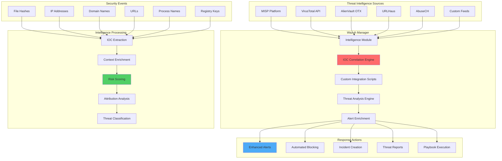

# Advanced Threat Intelligence Integration with Wazuh: MISP and VirusTotal

## Introduction

Modern cybersecurity requires proactive threat detection capabilities that extend beyond signature-based detection. Threat intelligence integration enables security teams to leverage global knowledge about emerging threats, indicators of compromise (IOCs), and attack patterns to enhance their defensive posture.

Wazuh's threat intelligence integration capabilities provide:

- 🔍 **Automated IOC Detection**: Real-time correlation with threat intelligence feeds
- 🌐 **Global Threat Context**: Leverage worldwide security intelligence
- ⚡ **Real-time Enrichment**: Enhance security events with threat context
- 🎯 **Proactive Hunting**: Enable proactive threat hunting capabilities
- 📊 **Comprehensive Analysis**: Deep threat analysis and attribution
- 🔄 **Automated Response**: Trigger automated responses to known threats

## Threat Intelligence Architecture

### Comprehensive Intelligence Framework



### Integration Benefits

| Traditional SIEM | With Threat Intelligence |
|------------------|--------------------------|
| **Detection**: Signature-based only | **Detection**: IOC + behavior + intelligence |
| **Context**: Limited local context | **Context**: Global threat landscape |
| **Response**: Generic responses | **Response**: Intelligence-driven actions |
| **Analysis**: Reactive investigation | **Analysis**: Proactive threat hunting |
| **Attribution**: Unknown threat actors | **Attribution**: Known campaigns and actors |

## MISP Integration Implementation

### Phase 1: MISP Platform Setup

#### Docker-based MISP Deployment

```bash
#!/bin/bash
# MISP Platform Setup Script for Wazuh Integration

set -euo pipefail

MISP_VERSION="2.4.177"
MYSQL_ROOT_PASSWORD="$(openssl rand -base64 32)"
MISP_ADMIN_EMAIL="admin@yourdomain.com"
MISP_ADMIN_PASSWORD="$(openssl rand -base64 24)"
MISP_ENCRYPTION_KEY="$(openssl rand -base64 32)"

# Function to log messages
log_message() {
    echo "[$(date '+%Y-%m-%d %H:%M:%S')] $1"
}

# Create directory structure
setup_directories() {
    log_message "Setting up MISP directories..."
    
    mkdir -p /opt/misp-docker/{mysql,redis,misp-modules,misp-web,nginx}
    mkdir -p /var/log/misp
    
    # Set proper permissions
    chmod 755 /opt/misp-docker
    chmod 755 /var/log/misp
}

# Create MISP Docker Compose configuration
create_docker_compose() {
    log_message "Creating MISP Docker Compose configuration..."
    
    cat <<EOF > /opt/misp-docker/docker-compose.yml
version: '3.8'

services:
  # Redis service for caching
  redis:
    image: redis:7-alpine
    container_name: misp-redis
    restart: unless-stopped
    command: redis-server --appendonly yes
    volumes:
      - redis_data:/data
    networks:
      - misp-network
    
  # MySQL database
  mysql:
    image: mysql:8.0
    container_name: misp-mysql
    restart: unless-stopped
    environment:
      MYSQL_ROOT_PASSWORD: ${MYSQL_ROOT_PASSWORD}
      MYSQL_DATABASE: misp
      MYSQL_USER: misp
      MYSQL_PASSWORD: ${MYSQL_ROOT_PASSWORD}
    volumes:
      - mysql_data:/var/lib/mysql
      - ./mysql/misp.sql:/docker-entrypoint-initdb.d/misp.sql:ro
    command: --default-authentication-plugin=mysql_native_password
    networks:
      - misp-network
    
  # MISP Web Application
  misp-web:
    image: coolacid/misp-docker:core-v${MISP_VERSION}
    container_name: misp-web
    restart: unless-stopped
    depends_on:
      - mysql
      - redis
    ports:
      - "80:80"
      - "443:443"
    volumes:
      - misp_data:/var/www/MISP
      - misp_logs:/var/www/MISP/app/tmp/logs
      - misp_files:/var/www/MISP/app/files
      - misp_ssl:/etc/nginx/certs
      - ./misp-web/config:/var/www/MISP/app/Config:ro
    environment:
      MYSQL_HOST: mysql
      MYSQL_DATABASE: misp
      MYSQL_USER: misp
      MYSQL_PASSWORD: ${MYSQL_ROOT_PASSWORD}
      REDIS_FQDN: redis
      HOSTNAME: https://misp.yourdomain.com
      MISP_ADMIN_EMAIL: ${MISP_ADMIN_EMAIL}
      MISP_ADMIN_PASSPHRASE: ${MISP_ADMIN_PASSWORD}
      MISP_ENCRYPTION_KEY: ${MISP_ENCRYPTION_KEY}
      MISP_MODULES_FQDN: http://misp-modules
      WORKERS: 1
      CRON_USER_ID: 1
      CHANGE_UID: 0
      INIT: true
      NOREDIR: true
      DISIPV6: true
      SECURESSL: true
    networks:
      - misp-network
    
  # MISP Modules
  misp-modules:
    image: coolacid/misp-docker:modules-v${MISP_VERSION}
    container_name: misp-modules
    restart: unless-stopped
    environment:
      REDIS_BACKEND: redis
    depends_on:
      - redis
    networks:
      - misp-network
    
  # MISP Workers
  misp-workers:
    image: coolacid/misp-docker:core-v${MISP_VERSION}
    container_name: misp-workers
    restart: unless-stopped
    depends_on:
      - mysql
      - redis
      - misp-web
    volumes:
      - misp_data:/var/www/MISP
      - misp_logs:/var/www/MISP/app/tmp/logs
      - misp_files:/var/www/MISP/app/files
    environment:
      MYSQL_HOST: mysql
      MYSQL_DATABASE: misp
      MYSQL_USER: misp
      MYSQL_PASSWORD: ${MYSQL_ROOT_PASSWORD}
      REDIS_FQDN: redis
      MISP_ENCRYPTION_KEY: ${MISP_ENCRYPTION_KEY}
    command: ["bash", "-c", "/var/www/MISP/app/Console/worker/start.sh"]
    networks:
      - misp-network

volumes:
  mysql_data:
    driver: local
  redis_data:
    driver: local
  misp_data:
    driver: local
  misp_logs:
    driver: local
  misp_files:
    driver: local
  misp_ssl:
    driver: local

networks:
  misp-network:
    driver: bridge
    ipam:
      config:
        - subnet: 172.20.0.0/16
EOF

    # Save sensitive credentials
    cat <<EOF > /opt/misp-docker/.env
MYSQL_ROOT_PASSWORD=${MYSQL_ROOT_PASSWORD}
MISP_ADMIN_EMAIL=${MISP_ADMIN_EMAIL}
MISP_ADMIN_PASSWORD=${MISP_ADMIN_PASSWORD}
MISP_ENCRYPTION_KEY=${MISP_ENCRYPTION_KEY}
EOF

    chmod 600 /opt/misp-docker/.env
    
    log_message "Docker Compose configuration created"
}

# Create MISP configuration files
create_misp_config() {
    log_message "Creating MISP configuration files..."
    
    mkdir -p /opt/misp-docker/misp-web/config
    
    # Database configuration
    cat <<EOF > /opt/misp-docker/misp-web/config/database.php
<?php
class DATABASE_CONFIG {
    public \$default = array(
        'datasource' => 'Database/Mysql',
        'persistent' => false,
        'host' => 'mysql',
        'login' => 'misp',
        'password' => '${MYSQL_ROOT_PASSWORD}',
        'database' => 'misp',
        'prefix' => '',
        'encoding' => 'utf8',
        'port' => 3306,
    );
}
EOF

    # Core configuration
    cat <<EOF > /opt/misp-docker/misp-web/config/config.php
<?php
\$config = array();

// MISP Configuration
\$config['MISP']['baseurl'] = 'https://misp.yourdomain.com';
\$config['MISP']['live'] = true;
\$config['MISP']['language'] = 'en';
\$config['MISP']['default_event_distribution'] = '1';
\$config['MISP']['default_attribute_distribution'] = 'event';
\$config['MISP']['tagging'] = true;
\$config['MISP']['full_tags_on_event_index'] = '2';
\$config['MISP']['welcome_text_top'] = 'MISP Threat Intelligence Platform';
\$config['MISP']['welcome_text_bottom'] = 'Sharing threat intelligence for enhanced security';

// Security settings
\$config['Security']['auth_enforced'] = false;
\$config['Security']['log_each_individual_auth_fail'] = false;
\$config['Security']['password_policy_length'] = 12;
\$config['Security']['password_policy_complexity'] = '/^((?=.*\d)|(?=.*\W+))(?![\n])(?=.*[A-Z])(?=.*[a-z]).*\$/';
\$config['Security']['self_registration_message'] = 'Registration is disabled. Please contact administrator.';

// Redis configuration
\$config['MISP']['redis_host'] = 'redis';
\$config['MISP']['redis_port'] = 6379;
\$config['MISP']['redis_database'] = 13;
\$config['MISP']['redis_password'] = '';

// Email configuration
\$config['MISP']['email'] = '${MISP_ADMIN_EMAIL}';
\$config['MISP']['contact'] = '${MISP_ADMIN_EMAIL}';
\$config['MISP']['disable_emailing'] = false;

// Feed settings
\$config['MISP']['background_jobs'] = true;
\$config['MISP']['cached_attachments'] = false;
\$config['MISP']['download_attachments_on_load'] = true;

// API settings
\$config['MISP']['rest_client_baseurl'] = '';
\$config['MISP']['rest_client_timeout'] = 60;
\$config['MISP']['rest_client_enable_arbitrary_ssl_cert'] = false;

// Wazuh integration settings
\$config['MISP']['correlation_threshold'] = 20;
\$config['MISP']['enrichment_hover_enable'] = true;
\$config['MISP']['enrichment_hover_timeout'] = 5;
\$config['MISP']['enrichment_services_enable'] = true;
\$config['MISP']['enrichment_services_url'] = 'http://misp-modules';
\$config['MISP']['enrichment_services_port'] = 6666;
\$config['MISP']['enrichment_timeout'] = 10;

?>
EOF

    log_message "MISP configuration files created"
}

# Deploy MISP platform
deploy_misp() {
    log_message "Deploying MISP platform..."
    
    cd /opt/misp-docker
    
    # Pull images
    docker-compose pull
    
    # Start services
    docker-compose up -d
    
    # Wait for services to start
    log_message "Waiting for services to start..."
    sleep 60
    
    # Check service status
    docker-compose ps
    
    log_message "MISP platform deployed successfully"
}

# Configure MISP for Wazuh integration
configure_misp_wazuh_integration() {
    log_message "Configuring MISP for Wazuh integration..."
    
    # Create API key for Wazuh
    API_KEY=$(docker exec misp-web /var/www/MISP/app/Console/cake Admin setSetting "MISP.python_bin" "/usr/bin/python3")
    
    # Enable required modules
    docker exec misp-web /var/www/MISP/app/Console/cake Admin setSetting "Plugin.Enrichment_services_enable" true
    docker exec misp-web /var/www/MISP/app/Console/cake Admin setSetting "Plugin.Import_services_enable" true
    docker exec misp-web /var/www/MISP/app/Console/cake Admin setSetting "Plugin.Export_services_enable" true
    
    # Configure correlation settings
    docker exec misp-web /var/www/MISP/app/Console/cake Admin setSetting "MISP.correlation_threshold" 20
    docker exec misp-web /var/www/MISP/app/Console/cake Admin setSetting "MISP.disable_correlation" false
    
    # Set up feeds
    docker exec misp-web /var/www/MISP/app/Console/cake Admin setSetting "Plugin.Feed_enable" true
    
    log_message "MISP configured for Wazuh integration"
}

# Main execution
main() {
    log_message "Starting MISP setup for Wazuh integration..."
    
    # Check if running as root
    if [[ $EUID -ne 0 ]]; then
        echo "This script must be run as root or with sudo"
        exit 1
    fi
    
    # Check Docker installation
    if ! command -v docker &> /dev/null; then
        log_message "ERROR: Docker is not installed"
        exit 1
    fi
    
    if ! command -v docker-compose &> /dev/null; then
        log_message "ERROR: Docker Compose is not installed"
        exit 1
    fi
    
    setup_directories
    create_docker_compose
    create_misp_config
    deploy_misp
    configure_misp_wazuh_integration
    
    log_message "MISP setup completed successfully!"
    log_message "MISP is accessible at: https://misp.yourdomain.com"
    log_message "Admin credentials are stored in: /opt/misp-docker/.env"
    
    # Display credentials
    echo "================================================="
    echo "MISP Admin Credentials:"
    echo "Email: ${MISP_ADMIN_EMAIL}"
    echo "Password: ${MISP_ADMIN_PASSWORD}"
    echo "================================================="
}

# Execute main function
main "$@"
```

### Phase 2: MISP-Wazuh Integration Script

Create a comprehensive integration script for MISP-Wazuh communication:

```python
#!/usr/bin/env python3
"""
MISP-Wazuh Integration Script
Automated threat intelligence correlation and enrichment
"""

import sys
import os
import json
import time
import hashlib
import logging
import requests
import argparse
from datetime import datetime, timedelta
from pathlib import Path
from typing import Dict, List, Optional, Any
import urllib3

# Disable SSL warnings for self-signed certificates
urllib3.disable_warnings(urllib3.exceptions.InsecureRequestWarning)

class MISPWazuhIntegrator:
    def __init__(self, config_file: str = '/var/ossec/integrations/misp_config.json'):
        self.config = self.load_config(config_file)
        self.setup_logging()
        
        # MISP Configuration
        self.misp_url = self.config['misp']['url']
        self.misp_key = self.config['misp']['api_key']
        self.misp_verifycert = self.config['misp'].get('verify_cert', False)
        
        # Wazuh Configuration
        self.wazuh_url = self.config['wazuh']['url']
        self.wazuh_user = self.config['wazuh']['user']
        self.wazuh_password = self.config['wazuh']['password']
        self.wazuh_token = None
        
        # Integration settings
        self.correlation_threshold = self.config.get('correlation_threshold', 70)
        self.max_age_days = self.config.get('max_age_days', 30)
        self.batch_size = self.config.get('batch_size', 100)
        
        # IOC types mapping
        self.ioc_types = {
            'ip-src': ['srcip', 'src_ip', 'source_ip'],
            'ip-dst': ['dstip', 'dst_ip', 'destination_ip'],
            'domain': ['domain', 'hostname', 'fqdn'],
            'hostname': ['hostname', 'domain', 'fqdn'],
            'url': ['url', 'uri'],
            'filename': ['filename', 'file', 'name'],
            'md5': ['md5', 'hash', 'file_hash'],
            'sha1': ['sha1', 'hash', 'file_hash'],
            'sha256': ['sha256', 'hash', 'file_hash'],
            'email-src': ['email', 'from_email', 'sender'],
            'email-dst': ['email', 'to_email', 'recipient'],
            'user-agent': ['user_agent', 'useragent'],
            'mutex': ['mutex'],
            'registry-key': ['registry_key', 'reg_key']
        }
        
        # Cache for MISP attributes
        self.misp_cache = {}
        self.cache_ttl = 3600  # 1 hour
        
    def load_config(self, config_file: str) -> Dict:
        """Load configuration from JSON file"""
        try:
            with open(config_file, 'r') as f:
                return json.load(f)
        except FileNotFoundError:
            # Create default configuration
            default_config = {
                "misp": {
                    "url": "https://misp.yourdomain.com",
                    "api_key": "YOUR_MISP_API_KEY",
                    "verify_cert": False
                },
                "wazuh": {
                    "url": "https://wazuh-manager:55000",
                    "user": "wazuh",
                    "password": "wazuh"
                },
                "correlation_threshold": 70,
                "max_age_days": 30,
                "batch_size": 100,
                "log_level": "INFO"
            }
            
            # Create directory if it doesn't exist
            os.makedirs(os.path.dirname(config_file), exist_ok=True)
            
            with open(config_file, 'w') as f:
                json.dump(default_config, f, indent=2)
            
            print(f"Created default configuration at {config_file}")
            print("Please update the configuration with your MISP and Wazuh details")
            sys.exit(1)
    
    def setup_logging(self):
        """Setup logging configuration"""
        log_level = getattr(logging, self.config.get('log_level', 'INFO'))
        log_file = self.config.get('log_file', '/var/ossec/logs/misp_integration.log')
        
        # Create log directory if it doesn't exist
        os.makedirs(os.path.dirname(log_file), exist_ok=True)
        
        logging.basicConfig(
            level=log_level,
            format='%(asctime)s - %(levelname)s - %(message)s',
            handlers=[
                logging.FileHandler(log_file),
                logging.StreamHandler()
            ]
        )
        self.logger = logging.getLogger(__name__)
    
    def get_wazuh_token(self) -> Optional[str]:
        """Authenticate with Wazuh API and get token"""
        try:
            auth_url = f"{self.wazuh_url}/security/user/authenticate"
            
            response = requests.post(
                auth_url,
                json={'user': self.wazuh_user, 'password': self.wazuh_password},
                headers={'Content-Type': 'application/json'},
                verify=False,
                timeout=10
            )
            
            if response.status_code == 200:
                token = response.json()['data']['token']
                self.wazuh_token = token
                self.logger.info("Successfully authenticated with Wazuh")
                return token
            else:
                self.logger.error(f"Wazuh authentication failed: {response.status_code}")
                return None
                
        except Exception as e:
            self.logger.error(f"Error authenticating with Wazuh: {e}")
            return None
    
    def query_misp_attributes(self, ioc_value: str, ioc_type: str) -> List[Dict]:
        """Query MISP for attributes matching the IOC"""
        # Check cache first
        cache_key = f"{ioc_type}:{ioc_value}"
        if cache_key in self.misp_cache:
            cache_entry = self.misp_cache[cache_key]
            if time.time() - cache_entry['timestamp'] < self.cache_ttl:
                self.logger.debug(f"Cache hit for {cache_key}")
                return cache_entry['data']
        
        try:
            search_url = f"{self.misp_url}/attributes/restSearch"
            headers = {
                'Authorization': self.misp_key,
                'Accept': 'application/json',
                'Content-Type': 'application/json'
            }
            
            # Calculate date range for recent attributes
            date_from = (datetime.now() - timedelta(days=self.max_age_days)).strftime('%Y-%m-%d')
            
            search_params = {
                'returnFormat': 'json',
                'value': ioc_value,
                'type': ioc_type,
                'dateFrom': date_from,
                'includeEventTags': True,
                'includeGalaxy': True,
                'limit': 1000
            }
            
            response = requests.post(
                search_url,
                headers=headers,
                json=search_params,
                verify=self.misp_verifycert,
                timeout=30
            )
            
            if response.status_code == 200:
                result = response.json()
                attributes = result.get('response', {}).get('Attribute', [])
                
                # Cache the result
                self.misp_cache[cache_key] = {
                    'data': attributes,
                    'timestamp': time.time()
                }
                
                self.logger.debug(f"Found {len(attributes)} attributes for {ioc_value}")
                return attributes
            else:
                self.logger.warning(f"MISP query failed for {ioc_value}: {response.status_code}")
                return []
                
        except Exception as e:
            self.logger.error(f"Error querying MISP for {ioc_value}: {e}")
            return []
    
    def enrich_with_misp_context(self, attributes: List[Dict]) -> Dict:
        """Enrich attributes with additional context from MISP"""
        if not attributes:
            return {}
        
        enrichment = {
            'misp_events': [],
            'threat_level': 'Unknown',
            'categories': set(),
            'tags': set(),
            'galaxy_clusters': set(),
            'confidence': 0,
            'first_seen': None,
            'last_seen': None,
            'threat_actor': None,
            'malware_family': None,
            'campaign': None
        }
        
        for attr in attributes:
            # Event information
            event_info = {
                'event_id': attr.get('event_id'),
                'event_info': attr.get('Event', {}).get('info', ''),
                'event_date': attr.get('Event', {}).get('date', ''),
                'threat_level': attr.get('Event', {}).get('threat_level_id', 4)
            }
            enrichment['misp_events'].append(event_info)
            
            # Categories
            if 'category' in attr:
                enrichment['categories'].add(attr['category'])
            
            # Tags
            event_tags = attr.get('Event', {}).get('Tag', [])
            for tag in event_tags:
                enrichment['tags'].add(tag.get('name', ''))
            
            # Galaxy clusters
            event_galaxies = attr.get('Event', {}).get('Galaxy', [])
            for galaxy in event_galaxies:
                for cluster in galaxy.get('GalaxyCluster', []):
                    cluster_value = cluster.get('value', '')
                    enrichment['galaxy_clusters'].add(cluster_value)
                    
                    # Extract threat actor information
                    if 'threat-actor' in galaxy.get('type', '').lower():
                        enrichment['threat_actor'] = cluster_value
                    
                    # Extract malware family information
                    if 'malware' in galaxy.get('type', '').lower():
                        enrichment['malware_family'] = cluster_value
                    
                    # Extract campaign information
                    if 'campaign' in galaxy.get('type', '').lower():
                        enrichment['campaign'] = cluster_value
            
            # Timestamps
            timestamp = attr.get('timestamp')
            if timestamp:
                if not enrichment['first_seen'] or timestamp < enrichment['first_seen']:
                    enrichment['first_seen'] = timestamp
                if not enrichment['last_seen'] or timestamp > enrichment['last_seen']:
                    enrichment['last_seen'] = timestamp
        
        # Convert sets to lists for JSON serialization
        enrichment['categories'] = list(enrichment['categories'])
        enrichment['tags'] = list(enrichment['tags'])
        enrichment['galaxy_clusters'] = list(enrichment['galaxy_clusters'])
        
        # Calculate threat level
        if enrichment['misp_events']:
            threat_levels = [event['threat_level'] for event in enrichment['misp_events']]
            enrichment['threat_level'] = min(threat_levels)  # Lower number = higher threat
        
        # Calculate confidence based on number of events and recency
        num_events = len(enrichment['misp_events'])
        if num_events > 0:
            base_confidence = min(num_events * 20, 80)  # Max 80 from count
            
            # Boost confidence for recent sightings
            if enrichment['last_seen']:
                days_old = (time.time() - int(enrichment['last_seen'])) / 86400
                if days_old < 7:
                    base_confidence += 20
                elif days_old < 30:
                    base_confidence += 10
            
            enrichment['confidence'] = min(base_confidence, 100)
        
        return enrichment
    
    def extract_iocs_from_alert(self, alert: Dict) -> List[Dict]:
        """Extract IOCs from Wazuh alert"""
        iocs = []
        
        # Get alert data
        data = alert.get('data', {})
        rule = alert.get('rule', {})
        
        # Extract IOCs based on rule groups and data fields
        for misp_type, wazuh_fields in self.ioc_types.items():
            for field in wazuh_fields:
                value = self.get_nested_field(data, field)
                if value and self.is_valid_ioc(value, misp_type):
                    iocs.append({
                        'value': value,
                        'type': misp_type,
                        'field': field,
                        'confidence': self.calculate_initial_confidence(field, rule)
                    })
        
        # Remove duplicates
        seen = set()
        unique_iocs = []
        for ioc in iocs:
            key = f"{ioc['type']}:{ioc['value']}"
            if key not in seen:
                seen.add(key)
                unique_iocs.append(ioc)
        
        return unique_iocs
    
    def get_nested_field(self, data: Dict, field: str) -> Optional[str]:
        """Get nested field value from data dictionary"""
        if '.' in field:
            keys = field.split('.')
            current = data
            for key in keys:
                if isinstance(current, dict) and key in current:
                    current = current[key]
                else:
                    return None
            return str(current) if current is not None else None
        else:
            return data.get(field)
    
    def is_valid_ioc(self, value: str, ioc_type: str) -> bool:
        """Validate if value is a valid IOC of the specified type"""
        import re
        
        if not value or len(value) < 3:
            return False
        
        # Remove quotes and whitespace
        value = value.strip('"\'').strip()
        
        validators = {
            'ip-src': lambda x: self.is_valid_ip(x),
            'ip-dst': lambda x: self.is_valid_ip(x),
            'domain': lambda x: self.is_valid_domain(x),
            'hostname': lambda x: self.is_valid_domain(x),
            'url': lambda x: self.is_valid_url(x),
            'filename': lambda x: len(x) > 3 and '/' not in x,
            'md5': lambda x: re.match(r'^[a-f0-9]{32}$', x.lower()),
            'sha1': lambda x: re.match(r'^[a-f0-9]{40}$', x.lower()),
            'sha256': lambda x: re.match(r'^[a-f0-9]{64}$', x.lower()),
            'email-src': lambda x: '@' in x and '.' in x,
            'email-dst': lambda x: '@' in x and '.' in x,
            'user-agent': lambda x: len(x) > 10,
            'mutex': lambda x: len(x) > 5,
            'registry-key': lambda x: 'HKEY' in x.upper() or '\\' in x
        }
        
        validator = validators.get(ioc_type)
        return validator(value) if validator else True
    
    def is_valid_ip(self, ip: str) -> bool:
        """Validate IP address"""
        import ipaddress
        try:
            addr = ipaddress.ip_address(ip)
            # Exclude private and reserved addresses
            return not (addr.is_private or addr.is_loopback or addr.is_multicast or addr.is_reserved)
        except:
            return False
    
    def is_valid_domain(self, domain: str) -> bool:
        """Validate domain name"""
        import re
        pattern = r'^([a-zA-Z0-9]([a-zA-Z0-9\-]{0,61}[a-zA-Z0-9])?\.)+[a-zA-Z]{2,}$'
        return re.match(pattern, domain) is not None
    
    def is_valid_url(self, url: str) -> bool:
        """Validate URL"""
        import re
        pattern = r'^https?://[^\s/$.?#].[^\s]*$'
        return re.match(pattern, url) is not None
    
    def calculate_initial_confidence(self, field: str, rule: Dict) -> int:
        """Calculate initial confidence for IOC based on context"""
        base_confidence = 50
        
        # Adjust based on rule level
        rule_level = rule.get('level', 1)
        if rule_level >= 10:
            base_confidence += 30
        elif rule_level >= 7:
            base_confidence += 20
        elif rule_level >= 5:
            base_confidence += 10
        
        # Adjust based on field type
        high_confidence_fields = ['srcip', 'dstip', 'md5', 'sha1', 'sha256']
        if field in high_confidence_fields:
            base_confidence += 10
        
        return min(base_confidence, 80)  # Max 80 for initial confidence
    
    def process_alert(self, alert: Dict) -> Dict:
        """Process a single Wazuh alert for threat intelligence"""
        result = {
            'alert_id': alert.get('id'),
            'timestamp': alert.get('timestamp'),
            'rule_id': alert.get('rule', {}).get('id'),
            'enrichments': [],
            'total_matches': 0,
            'highest_confidence': 0,
            'threat_level': 'Unknown'
        }
        
        # Extract IOCs from alert
        iocs = self.extract_iocs_from_alert(alert)
        
        if not iocs:
            self.logger.debug(f"No IOCs extracted from alert {result['alert_id']}")
            return result
        
        self.logger.info(f"Extracted {len(iocs)} IOCs from alert {result['alert_id']}")
        
        # Query MISP for each IOC
        for ioc in iocs:
            self.logger.debug(f"Querying MISP for {ioc['type']}: {ioc['value']}")
            
            misp_attributes = self.query_misp_attributes(ioc['value'], ioc['type'])
            
            if misp_attributes:
                enrichment = self.enrich_with_misp_context(misp_attributes)
                enrichment.update({
                    'ioc_value': ioc['value'],
                    'ioc_type': ioc['type'],
                    'ioc_field': ioc['field'],
                    'misp_matches': len(misp_attributes),
                    'initial_confidence': ioc['confidence']
                })
                
                # Calculate final confidence
                final_confidence = min(ioc['confidence'] + enrichment['confidence'], 100)
                enrichment['final_confidence'] = final_confidence
                
                result['enrichments'].append(enrichment)
                result['total_matches'] += len(misp_attributes)
                result['highest_confidence'] = max(result['highest_confidence'], final_confidence)
                
                # Update threat level
                if enrichment['threat_level'] != 'Unknown':
                    if result['threat_level'] == 'Unknown' or enrichment['threat_level'] < result['threat_level']:
                        result['threat_level'] = enrichment['threat_level']
                
                self.logger.info(f"IOC {ioc['value']} matched {len(misp_attributes)} MISP attributes (confidence: {final_confidence})")
        
        return result
    
    def create_enriched_alert(self, original_alert: Dict, enrichment_result: Dict) -> Dict:
        """Create enriched alert with MISP intelligence"""
        enriched_alert = original_alert.copy()
        
        # Add MISP intelligence data
        misp_data = {
            'misp_integration': {
                'processed_at': datetime.now().isoformat(),
                'total_iocs_checked': len(enrichment_result['enrichments']),
                'total_misp_matches': enrichment_result['total_matches'],
                'highest_confidence': enrichment_result['highest_confidence'],
                'threat_level': enrichment_result['threat_level'],
                'enrichments': enrichment_result['enrichments']
            }
        }
        
        # Update alert data
        if 'data' not in enriched_alert:
            enriched_alert['data'] = {}
        
        enriched_alert['data'].update(misp_data)
        
        # Update rule level if high confidence threats found
        if enrichment_result['highest_confidence'] >= self.correlation_threshold:
            original_level = enriched_alert.get('rule', {}).get('level', 1)
            new_level = min(original_level + 3, 15)  # Increase by 3, max 15
            
            if 'rule' not in enriched_alert:
                enriched_alert['rule'] = {}
            
            enriched_alert['rule']['level'] = new_level
            enriched_alert['rule']['description'] = f"{enriched_alert['rule'].get('description', '')} [MISP Intelligence Match]"
        
        return enriched_alert
    
    def send_enriched_alert(self, enriched_alert: Dict) -> bool:
        """Send enriched alert back to Wazuh"""
        try:
            if not self.wazuh_token:
                if not self.get_wazuh_token():
                    return False
            
            # Send to Wazuh events API
            events_url = f"{self.wazuh_url}/events"
            headers = {
                'Authorization': f'Bearer {self.wazuh_token}',
                'Content-Type': 'application/json'
            }
            
            response = requests.post(
                events_url,
                headers=headers,
                json=enriched_alert,
                verify=False,
                timeout=10
            )
            
            if response.status_code in [200, 201]:
                self.logger.info(f"Successfully sent enriched alert {enriched_alert.get('id')}")
                return True
            else:
                self.logger.error(f"Failed to send enriched alert: {response.status_code}")
                return False
                
        except Exception as e:
            self.logger.error(f"Error sending enriched alert: {e}")
            return False
    
    def run_integration(self, alert_data: str = None):
        """Main integration function"""
        try:
            if alert_data:
                # Process single alert from stdin
                alert = json.loads(alert_data)
                self.process_single_alert(alert)
            else:
                # Continuous mode - monitor Wazuh alerts
                self.run_continuous_mode()
                
        except Exception as e:
            self.logger.error(f"Integration error: {e}")
            sys.exit(1)
    
    def process_single_alert(self, alert: Dict):
        """Process a single alert"""
        self.logger.info(f"Processing alert {alert.get('id')} from rule {alert.get('rule', {}).get('id')}")
        
        # Process alert for threat intelligence
        enrichment_result = self.process_alert(alert)
        
        # Only enrich if we found matches above threshold
        if enrichment_result['highest_confidence'] >= self.correlation_threshold:
            self.logger.info(f"Alert {alert.get('id')} exceeded correlation threshold ({enrichment_result['highest_confidence']})")
            
            # Create enriched alert
            enriched_alert = self.create_enriched_alert(alert, enrichment_result)
            
            # Send enriched alert
            if self.send_enriched_alert(enriched_alert):
                self.logger.info(f"Successfully enriched alert {alert.get('id')}")
            else:
                self.logger.error(f"Failed to send enriched alert {alert.get('id')}")
        else:
            self.logger.debug(f"Alert {alert.get('id')} below correlation threshold ({enrichment_result['highest_confidence']})")
    
    def run_continuous_mode(self):
        """Run in continuous mode monitoring Wazuh alerts"""
        self.logger.info("Starting MISP-Wazuh integration in continuous mode")
        
        # This would typically connect to Wazuh's real-time alert stream
        # For now, we'll simulate by reading from a file or API
        self.logger.info("Continuous mode not implemented - use single alert mode")

def main():
    parser = argparse.ArgumentParser(description='MISP-Wazuh Threat Intelligence Integration')
    parser.add_argument('--config', default='/var/ossec/integrations/misp_config.json',
                       help='Configuration file path')
    parser.add_argument('--alert', help='Process single alert (JSON string)')
    parser.add_argument('--continuous', action='store_true',
                       help='Run in continuous mode')
    
    args = parser.parse_args()
    
    # Initialize integrator
    integrator = MISPWazuhIntegrator(args.config)
    
    if args.alert:
        # Process single alert
        integrator.process_single_alert(json.loads(args.alert))
    elif args.continuous:
        # Run continuous mode
        integrator.run_continuous_mode()
    else:
        # Read from stdin
        alert_data = sys.stdin.read()
        if alert_data.strip():
            integrator.run_integration(alert_data)
        else:
            parser.print_help()

if __name__ == "__main__":
    main()
```

### Phase 3: Wazuh MISP Integration Configuration

Configure Wazuh to use the MISP integration:

```xml
<!-- Wazuh Manager Configuration for MISP Integration -->
<ossec_config>
  
  <!-- Custom MISP Integration -->
  <integration>
    <name>custom-misp</name>
    <hook_url>/var/ossec/integrations/misp_integration.py</hook_url>
    <level>7</level>
    <group>misp_enabled</group>
    <alert_format>json</alert_format>
    <max_log>1MB</max_log>
  </integration>
  
  <!-- High-priority events for immediate MISP correlation -->
  <integration>
    <name>custom-misp-priority</name>
    <hook_url>/var/ossec/integrations/misp_integration.py --priority</hook_url>
    <level>10</level>
    <alert_format>json</alert_format>
    <max_log>1MB</max_log>
  </integration>
  
  <!-- MISP integration for specific rule groups -->
  <integration>
    <name>custom-misp-malware</name>
    <hook_url>/var/ossec/integrations/misp_integration.py</hook_url>
    <group>malware,trojan,virus</group>
    <alert_format>json</alert_format>
    <max_log>1MB</max_log>
  </integration>
  
  <integration>
    <name>custom-misp-network</name>
    <hook_url>/var/ossec/integrations/misp_integration.py</hook_url>
    <group>network,intrusion_detection</group>
    <alert_format>json</alert_format>
    <max_log>1MB</max_log>
  </integration>

</ossec_config>
```

Create the integration wrapper script:

```bash
#!/bin/bash
# MISP Integration Wrapper Script
# /var/ossec/integrations/misp_integration.py

SCRIPT_DIR="/var/ossec/integrations"
PYTHON_SCRIPT="$SCRIPT_DIR/misp_wazuh_integration.py"
LOG_FILE="/var/ossec/logs/misp_integration.log"
CONFIG_FILE="$SCRIPT_DIR/misp_config.json"

# Ensure the Python script exists
if [[ ! -f "$PYTHON_SCRIPT" ]]; then
    echo "$(date): ERROR - MISP integration script not found: $PYTHON_SCRIPT" >> "$LOG_FILE"
    exit 1
fi

# Ensure the configuration exists
if [[ ! -f "$CONFIG_FILE" ]]; then
    echo "$(date): ERROR - MISP configuration not found: $CONFIG_FILE" >> "$LOG_FILE"
    exit 1
fi

# Set environment variables
export PYTHONPATH="/var/ossec/integrations:$PYTHONPATH"

# Read alert data from stdin and process it
alert_data=$(cat)

if [[ -n "$alert_data" ]]; then
    echo "$(date): Processing MISP integration for alert" >> "$LOG_FILE"
    
    # Run the Python integration script
    echo "$alert_data" | python3 "$PYTHON_SCRIPT" --config "$CONFIG_FILE" 2>> "$LOG_FILE"
    
    exit_code=$?
    if [[ $exit_code -eq 0 ]]; then
        echo "$(date): MISP integration completed successfully" >> "$LOG_FILE"
    else
        echo "$(date): MISP integration failed with exit code $exit_code" >> "$LOG_FILE"
    fi
else
    echo "$(date): No alert data received" >> "$LOG_FILE"
fi
```

## VirusTotal Integration Implementation

### Phase 1: VirusTotal API Integration Script

```python
#!/usr/bin/env python3
"""
VirusTotal-Wazuh Integration Script
Automated file and URL reputation checking
"""

import sys
import json
import time
import hashlib
import logging
import requests
import argparse
from datetime import datetime
from pathlib import Path
from typing import Dict, List, Optional, Any

class VirusTotalWazuhIntegrator:
    def __init__(self, config_file: str = '/var/ossec/integrations/virustotal_config.json'):
        self.config = self.load_config(config_file)
        self.setup_logging()
        
        # VirusTotal Configuration
        self.vt_api_key = self.config['virustotal']['api_key']
        self.vt_base_url = 'https://www.virustotal.com/vtapi/v2'
        self.vt_v3_url = 'https://www.virustotal.com/api/v3'
        
        # Rate limiting
        self.requests_per_minute = self.config['virustotal'].get('requests_per_minute', 4)
        self.last_request_time = 0
        self.request_interval = 60 / self.requests_per_minute
        
        # Thresholds
        self.malicious_threshold = self.config.get('malicious_threshold', 5)
        self.suspicious_threshold = self.config.get('suspicious_threshold', 2)
        
        # Cache for VirusTotal results
        self.vt_cache = {}
        self.cache_ttl = 3600  # 1 hour
        
    def load_config(self, config_file: str) -> Dict:
        """Load configuration from JSON file"""
        try:
            with open(config_file, 'r') as f:
                return json.load(f)
        except FileNotFoundError:
            # Create default configuration
            default_config = {
                "virustotal": {
                    "api_key": "YOUR_VIRUSTOTAL_API_KEY",
                    "requests_per_minute": 4
                },
                "malicious_threshold": 5,
                "suspicious_threshold": 2,
                "log_level": "INFO"
            }
            
            # Create directory if it doesn't exist
            os.makedirs(os.path.dirname(config_file), exist_ok=True)
            
            with open(config_file, 'w') as f:
                json.dump(default_config, f, indent=2)
            
            print(f"Created default configuration at {config_file}")
            print("Please update the configuration with your VirusTotal API key")
            sys.exit(1)
    
    def setup_logging(self):
        """Setup logging configuration"""
        log_level = getattr(logging, self.config.get('log_level', 'INFO'))
        log_file = self.config.get('log_file', '/var/ossec/logs/virustotal_integration.log')
        
        # Create log directory if it doesn't exist
        os.makedirs(os.path.dirname(log_file), exist_ok=True)
        
        logging.basicConfig(
            level=log_level,
            format='%(asctime)s - %(levelname)s - %(message)s',
            handlers=[
                logging.FileHandler(log_file),
                logging.StreamHandler()
            ]
        )
        self.logger = logging.getLogger(__name__)
    
    def rate_limit(self):
        """Implement rate limiting for VirusTotal API"""
        current_time = time.time()
        time_since_last = current_time - self.last_request_time
        
        if time_since_last < self.request_interval:
            sleep_time = self.request_interval - time_since_last
            self.logger.debug(f"Rate limiting: sleeping for {sleep_time:.2f} seconds")
            time.sleep(sleep_time)
        
        self.last_request_time = time.time()
    
    def query_virustotal_file(self, file_hash: str) -> Optional[Dict]:
        """Query VirusTotal for file reputation"""
        # Check cache first
        cache_key = f"file:{file_hash}"
        if cache_key in self.vt_cache:
            cache_entry = self.vt_cache[cache_key]
            if time.time() - cache_entry['timestamp'] < self.cache_ttl:
                self.logger.debug(f"Cache hit for {cache_key}")
                return cache_entry['data']
        
        self.rate_limit()
        
        try:
            # Use v3 API for better results
            headers = {'x-apikey': self.vt_api_key}
            url = f"{self.vt_v3_url}/files/{file_hash}"
            
            response = requests.get(url, headers=headers, timeout=30)
            
            if response.status_code == 200:
                result = response.json()
                
                # Cache the result
                self.vt_cache[cache_key] = {
                    'data': result,
                    'timestamp': time.time()
                }
                
                self.logger.debug(f"VirusTotal file query successful for {file_hash}")
                return result
            elif response.status_code == 404:
                self.logger.debug(f"File not found in VirusTotal: {file_hash}")
                return None
            else:
                self.logger.warning(f"VirusTotal file query failed: {response.status_code}")
                return None
                
        except Exception as e:
            self.logger.error(f"Error querying VirusTotal for file {file_hash}: {e}")
            return None
    
    def query_virustotal_url(self, url: str) -> Optional[Dict]:
        """Query VirusTotal for URL reputation"""
        # Check cache first
        cache_key = f"url:{hashlib.sha256(url.encode()).hexdigest()}"
        if cache_key in self.vt_cache:
            cache_entry = self.vt_cache[cache_key]
            if time.time() - cache_entry['timestamp'] < self.cache_ttl:
                self.logger.debug(f"Cache hit for {cache_key}")
                return cache_entry['data']
        
        self.rate_limit()
        
        try:
            # First, get URL ID
            headers = {'x-apikey': self.vt_api_key}
            url_id = self.get_url_id(url)
            
            if not url_id:
                return None
            
            response = requests.get(
                f"{self.vt_v3_url}/urls/{url_id}",
                headers=headers,
                timeout=30
            )
            
            if response.status_code == 200:
                result = response.json()
                
                # Cache the result
                self.vt_cache[cache_key] = {
                    'data': result,
                    'timestamp': time.time()
                }
                
                self.logger.debug(f"VirusTotal URL query successful for {url}")
                return result
            elif response.status_code == 404:
                self.logger.debug(f"URL not found in VirusTotal: {url}")
                return None
            else:
                self.logger.warning(f"VirusTotal URL query failed: {response.status_code}")
                return None
                
        except Exception as e:
            self.logger.error(f"Error querying VirusTotal for URL {url}: {e}")
            return None
    
    def get_url_id(self, url: str) -> Optional[str]:
        """Get VirusTotal URL ID"""
        import base64
        try:
            url_id = base64.urlsafe_b64encode(url.encode()).decode().strip('=')
            return url_id
        except Exception as e:
            self.logger.error(f"Error creating URL ID: {e}")
            return None
    
    def query_virustotal_domain(self, domain: str) -> Optional[Dict]:
        """Query VirusTotal for domain reputation"""
        # Check cache first
        cache_key = f"domain:{domain}"
        if cache_key in self.vt_cache:
            cache_entry = self.vt_cache[cache_key]
            if time.time() - cache_entry['timestamp'] < self.cache_ttl:
                self.logger.debug(f"Cache hit for {cache_key}")
                return cache_entry['data']
        
        self.rate_limit()
        
        try:
            headers = {'x-apikey': self.vt_api_key}
            response = requests.get(
                f"{self.vt_v3_url}/domains/{domain}",
                headers=headers,
                timeout=30
            )
            
            if response.status_code == 200:
                result = response.json()
                
                # Cache the result
                self.vt_cache[cache_key] = {
                    'data': result,
                    'timestamp': time.time()
                }
                
                self.logger.debug(f"VirusTotal domain query successful for {domain}")
                return result
            elif response.status_code == 404:
                self.logger.debug(f"Domain not found in VirusTotal: {domain}")
                return None
            else:
                self.logger.warning(f"VirusTotal domain query failed: {response.status_code}")
                return None
                
        except Exception as e:
            self.logger.error(f"Error querying VirusTotal for domain {domain}: {e}")
            return None
    
    def query_virustotal_ip(self, ip_address: str) -> Optional[Dict]:
        """Query VirusTotal for IP reputation"""
        # Check cache first
        cache_key = f"ip:{ip_address}"
        if cache_key in self.vt_cache:
            cache_entry = self.vt_cache[cache_key]
            if time.time() - cache_entry['timestamp'] < self.cache_ttl:
                self.logger.debug(f"Cache hit for {cache_key}")
                return cache_entry['data']
        
        self.rate_limit()
        
        try:
            headers = {'x-apikey': self.vt_api_key}
            response = requests.get(
                f"{self.vt_v3_url}/ip_addresses/{ip_address}",
                headers=headers,
                timeout=30
            )
            
            if response.status_code == 200:
                result = response.json()
                
                # Cache the result
                self.vt_cache[cache_key] = {
                    'data': result,
                    'timestamp': time.time()
                }
                
                self.logger.debug(f"VirusTotal IP query successful for {ip_address}")
                return result
            elif response.status_code == 404:
                self.logger.debug(f"IP not found in VirusTotal: {ip_address}")
                return None
            else:
                self.logger.warning(f"VirusTotal IP query failed: {response.status_code}")
                return None
                
        except Exception as e:
            self.logger.error(f"Error querying VirusTotal for IP {ip_address}: {e}")
            return None
    
    def analyze_virustotal_response(self, vt_response: Dict, ioc_type: str) -> Dict:
        """Analyze VirusTotal response and extract threat intelligence"""
        if not vt_response or 'data' not in vt_response:
            return {}
        
        data = vt_response['data']
        attributes = data.get('attributes', {})
        
        analysis = {
            'virustotal_id': data.get('id'),
            'type': data.get('type'),
            'first_submission_date': attributes.get('first_submission_date'),
            'last_analysis_date': attributes.get('last_analysis_date'),
            'last_modification_date': attributes.get('last_modification_date'),
            'reputation': 0,
            'malicious_detections': 0,
            'suspicious_detections': 0,
            'clean_detections': 0,
            'total_engines': 0,
            'detection_ratio': '0/0',
            'threat_classification': 'Unknown',
            'detected_families': [],
            'threat_names': [],
            'vendors_flagged': [],
            'confidence_score': 0
        }
        
        # Analyze last analysis stats
        if 'last_analysis_stats' in attributes:
            stats = attributes['last_analysis_stats']
            analysis['malicious_detections'] = stats.get('malicious', 0)
            analysis['suspicious_detections'] = stats.get('suspicious', 0)
            analysis['clean_detections'] = stats.get('harmless', 0) + stats.get('undetected', 0)
            analysis['total_engines'] = sum(stats.values())
            
            if analysis['total_engines'] > 0:
                malicious_ratio = analysis['malicious_detections'] / analysis['total_engines']
                analysis['detection_ratio'] = f"{analysis['malicious_detections']}/{analysis['total_engines']}"
                analysis['confidence_score'] = int(malicious_ratio * 100)
        
        # Analyze last analysis results
        if 'last_analysis_results' in attributes:
            results = attributes['last_analysis_results']
            threat_names = set()
            families = set()
            flagged_vendors = []
            
            for vendor, result in results.items():
                category = result.get('category', 'undetected')
                if category in ['malicious', 'suspicious']:
                    flagged_vendors.append(vendor)
                    
                    result_text = result.get('result', '')
                    if result_text and result_text != 'None':
                        threat_names.add(result_text)
                        
                        # Extract malware families
                        common_families = ['trojan', 'adware', 'spyware', 'ransomware', 'backdoor', 'worm', 'virus']
                        for family in common_families:
                            if family.lower() in result_text.lower():
                                families.add(family.title())
            
            analysis['threat_names'] = list(threat_names)[:10]  # Limit to top 10
            analysis['detected_families'] = list(families)
            analysis['vendors_flagged'] = flagged_vendors
        
        # Calculate reputation score
        if analysis['malicious_detections'] >= self.malicious_threshold:
            analysis['reputation'] = -1  # Malicious
            analysis['threat_classification'] = 'Malicious'
        elif analysis['suspicious_detections'] >= self.suspicious_threshold:
            analysis['reputation'] = 0   # Suspicious
            analysis['threat_classification'] = 'Suspicious'
        elif analysis['total_engines'] > 0:
            analysis['reputation'] = 1   # Clean
            analysis['threat_classification'] = 'Clean'
        
        # Add additional metadata based on IOC type
        if ioc_type == 'file':
            self.add_file_metadata(analysis, attributes)
        elif ioc_type == 'url':
            self.add_url_metadata(analysis, attributes)
        elif ioc_type == 'domain':
            self.add_domain_metadata(analysis, attributes)
        elif ioc_type == 'ip':
            self.add_ip_metadata(analysis, attributes)
        
        return analysis
    
    def add_file_metadata(self, analysis: Dict, attributes: Dict):
        """Add file-specific metadata"""
        analysis.update({
            'file_size': attributes.get('size'),
            'file_type': attributes.get('type_description'),
            'mime_type': attributes.get('mime_type'),
            'magic': attributes.get('magic'),
            'md5': attributes.get('md5'),
            'sha1': attributes.get('sha1'),
            'sha256': attributes.get('sha256'),
            'ssdeep': attributes.get('ssdeep'),
            'meaningful_name': attributes.get('meaningful_name'),
            'signature_info': attributes.get('signature_info')
        })
    
    def add_url_metadata(self, analysis: Dict, attributes: Dict):
        """Add URL-specific metadata"""
        analysis.update({
            'url': attributes.get('url'),
            'final_url': attributes.get('last_final_url'),
            'title': attributes.get('title'),
            'categories': attributes.get('categories', {}),
            'threat_types': attributes.get('threat_types', {}),
            'redirections': attributes.get('redirection_chain', [])
        })
    
    def add_domain_metadata(self, analysis: Dict, attributes: Dict):
        """Add domain-specific metadata"""
        analysis.update({
            'registrar': attributes.get('registrar'),
            'creation_date': attributes.get('creation_date'),
            'whois': attributes.get('whois'),
            'dns_records': attributes.get('last_dns_records', []),
            'categories': attributes.get('categories', {}),
            'popularity_ranks': attributes.get('popularity_ranks', {})
        })
    
    def add_ip_metadata(self, analysis: Dict, attributes: Dict):
        """Add IP-specific metadata"""
        analysis.update({
            'as_owner': attributes.get('as_owner'),
            'asn': attributes.get('asn'),
            'country': attributes.get('country'),
            'continent': attributes.get('continent'),
            'network': attributes.get('network'),
            'whois': attributes.get('whois'),
            'regional_internet_registry': attributes.get('regional_internet_registry')
        })
    
    def extract_iocs_from_alert(self, alert: Dict) -> List[Dict]:
        """Extract IOCs from Wazuh alert for VirusTotal analysis"""
        iocs = []
        data = alert.get('data', {})
        
        # Extract file hashes
        hash_fields = ['md5', 'sha1', 'sha256', 'hash', 'file_hash', 'checksum']
        for field in hash_fields:
            hash_value = self.get_nested_field(data, field)
            if hash_value and self.is_valid_hash(hash_value):
                iocs.append({
                    'value': hash_value.lower(),
                    'type': 'file',
                    'field': field
                })
        
        # Extract URLs
        url_fields = ['url', 'uri', 'request_uri', 'referer']
        for field in url_fields:
            url_value = self.get_nested_field(data, field)
            if url_value and self.is_valid_url(url_value):
                iocs.append({
                    'value': url_value,
                    'type': 'url',
                    'field': field
                })
        
        # Extract domains
        domain_fields = ['domain', 'hostname', 'host', 'server_name']
        for field in domain_fields:
            domain_value = self.get_nested_field(data, field)
            if domain_value and self.is_valid_domain(domain_value):
                iocs.append({
                    'value': domain_value,
                    'type': 'domain',
                    'field': field
                })
        
        # Extract IP addresses
        ip_fields = ['srcip', 'dstip', 'src_ip', 'dst_ip', 'remote_ip', 'client_ip']
        for field in ip_fields:
            ip_value = self.get_nested_field(data, field)
            if ip_value and self.is_valid_ip(ip_value):
                iocs.append({
                    'value': ip_value,
                    'type': 'ip',
                    'field': field
                })
        
        # Remove duplicates
        seen = set()
        unique_iocs = []
        for ioc in iocs:
            key = f"{ioc['type']}:{ioc['value']}"
            if key not in seen:
                seen.add(key)
                unique_iocs.append(ioc)
        
        return unique_iocs
    
    def get_nested_field(self, data: Dict, field: str) -> Optional[str]:
        """Get nested field value from data dictionary"""
        if '.' in field:
            keys = field.split('.')
            current = data
            for key in keys:
                if isinstance(current, dict) and key in current:
                    current = current[key]
                else:
                    return None
            return str(current) if current is not None else None
        else:
            return data.get(field)
    
    def is_valid_hash(self, value: str) -> bool:
        """Validate hash value"""
        import re
        value = value.strip().lower()
        
        # MD5: 32 hex characters
        if re.match(r'^[a-f0-9]{32}$', value):
            return True
        
        # SHA1: 40 hex characters
        if re.match(r'^[a-f0-9]{40}$', value):
            return True
        
        # SHA256: 64 hex characters
        if re.match(r'^[a-f0-9]{64}$', value):
            return True
        
        return False
    
    def is_valid_url(self, value: str) -> bool:
        """Validate URL"""
        import re
        pattern = r'^https?://[^\s/$.?#].[^\s]*$'
        return re.match(pattern, value) is not None
    
    def is_valid_domain(self, value: str) -> bool:
        """Validate domain name"""
        import re
        # Basic domain validation
        if not value or len(value) > 253:
            return False
        
        pattern = r'^([a-zA-Z0-9]([a-zA-Z0-9\-]{0,61}[a-zA-Z0-9])?\.)+[a-zA-Z]{2,}$'
        return re.match(pattern, value) is not None
    
    def is_valid_ip(self, value: str) -> bool:
        """Validate IP address"""
        import ipaddress
        try:
            addr = ipaddress.ip_address(value)
            # Exclude private and reserved addresses for reputation checking
            return not (addr.is_private or addr.is_loopback or addr.is_multicast)
        except:
            return False
    
    def process_alert(self, alert: Dict) -> Dict:
        """Process Wazuh alert for VirusTotal analysis"""
        result = {
            'alert_id': alert.get('id'),
            'timestamp': alert.get('timestamp'),
            'rule_id': alert.get('rule', {}).get('id'),
            'virustotal_results': [],
            'total_malicious': 0,
            'total_suspicious': 0,
            'highest_confidence': 0,
            'threat_classification': 'Clean'
        }
        
        # Extract IOCs
        iocs = self.extract_iocs_from_alert(alert)
        
        if not iocs:
            self.logger.debug(f"No IOCs extracted from alert {result['alert_id']}")
            return result
        
        self.logger.info(f"Extracted {len(iocs)} IOCs from alert {result['alert_id']}")
        
        # Query VirusTotal for each IOC
        for ioc in iocs:
            self.logger.debug(f"Querying VirusTotal for {ioc['type']}: {ioc['value']}")
            
            # Query based on IOC type
            if ioc['type'] == 'file':
                vt_response = self.query_virustotal_file(ioc['value'])
            elif ioc['type'] == 'url':
                vt_response = self.query_virustotal_url(ioc['value'])
            elif ioc['type'] == 'domain':
                vt_response = self.query_virustotal_domain(ioc['value'])
            elif ioc['type'] == 'ip':
                vt_response = self.query_virustotal_ip(ioc['value'])
            else:
                continue
            
            if vt_response:
                analysis = self.analyze_virustotal_response(vt_response, ioc['type'])
                analysis.update({
                    'ioc_value': ioc['value'],
                    'ioc_type': ioc['type'],
                    'ioc_field': ioc['field']
                })
                
                result['virustotal_results'].append(analysis)
                
                # Update counters
                if analysis['reputation'] == -1:  # Malicious
                    result['total_malicious'] += 1
                elif analysis['reputation'] == 0:  # Suspicious
                    result['total_suspicious'] += 1
                
                # Update confidence and classification
                if analysis['confidence_score'] > result['highest_confidence']:
                    result['highest_confidence'] = analysis['confidence_score']
                    result['threat_classification'] = analysis['threat_classification']
                
                self.logger.info(f"IOC {ioc['value']} analyzed: {analysis['threat_classification']} (confidence: {analysis['confidence_score']})")
        
        return result
    
    def create_enriched_alert(self, original_alert: Dict, vt_result: Dict) -> Dict:
        """Create enriched alert with VirusTotal intelligence"""
        enriched_alert = original_alert.copy()
        
        # Add VirusTotal data
        vt_data = {
            'virustotal_integration': {
                'processed_at': datetime.now().isoformat(),
                'total_iocs_checked': len(vt_result['virustotal_results']),
                'total_malicious': vt_result['total_malicious'],
                'total_suspicious': vt_result['total_suspicious'],
                'highest_confidence': vt_result['highest_confidence'],
                'threat_classification': vt_result['threat_classification'],
                'results': vt_result['virustotal_results']
            }
        }
        
        # Update alert data
        if 'data' not in enriched_alert:
            enriched_alert['data'] = {}
        
        enriched_alert['data'].update(vt_data)
        
        # Update rule level for malicious detections
        if vt_result['total_malicious'] > 0:
            original_level = enriched_alert.get('rule', {}).get('level', 1)
            new_level = min(original_level + 4, 15)  # Increase by 4, max 15
            
            if 'rule' not in enriched_alert:
                enriched_alert['rule'] = {}
            
            enriched_alert['rule']['level'] = new_level
            enriched_alert['rule']['description'] = f"{enriched_alert['rule'].get('description', '')} [VirusTotal: {vt_result['threat_classification']}]"
        
        return enriched_alert
    
    def process_single_alert(self, alert: Dict):
        """Process a single alert"""
        self.logger.info(f"Processing alert {alert.get('id')} from rule {alert.get('rule', {}).get('id')}")
        
        # Process alert for VirusTotal analysis
        vt_result = self.process_alert(alert)
        
        # Enrich if we found threats or suspicious activity
        if vt_result['total_malicious'] > 0 or vt_result['total_suspicious'] > 0:
            self.logger.info(f"Alert {alert.get('id')} contains threats: {vt_result['total_malicious']} malicious, {vt_result['total_suspicious']} suspicious")
            
            # Create enriched alert
            enriched_alert = self.create_enriched_alert(alert, vt_result)
            
            # Output enriched alert (to stdout for Wazuh integration)
            print(json.dumps(enriched_alert))
            self.logger.info(f"Successfully enriched alert {alert.get('id')}")
        else:
            self.logger.debug(f"Alert {alert.get('id')} contains no detected threats")

def main():
    parser = argparse.ArgumentParser(description='VirusTotal-Wazuh Integration')
    parser.add_argument('--config', default='/var/ossec/integrations/virustotal_config.json',
                       help='Configuration file path')
    parser.add_argument('--alert', help='Process single alert (JSON string)')
    
    args = parser.parse_args()
    
    # Initialize integrator
    integrator = VirusTotalWazuhIntegrator(args.config)
    
    if args.alert:
        # Process single alert
        integrator.process_single_alert(json.loads(args.alert))
    else:
        # Read from stdin
        alert_data = sys.stdin.read()
        if alert_data.strip():
            try:
                alert = json.loads(alert_data)
                integrator.process_single_alert(alert)
            except json.JSONDecodeError as e:
                logging.error(f"Invalid JSON input: {e}")
                sys.exit(1)
        else:
            parser.print_help()

if __name__ == "__main__":
    main()
```

### Phase 2: VirusTotal Integration Rules

Create specific rules for VirusTotal enrichment:

```xml
<group name="virustotal,threat_intelligence,">
  
  <!-- VirusTotal Malicious File Detection -->
  <rule id="950001" level="12">
    <decoded_as>json</decoded_as>
    <field name="data.virustotal_integration.total_malicious" type="pcre2">^[1-9]\d*$</field>
    <description>VirusTotal: Malicious file detected - $(data.virustotal_integration.threat_classification) ($(data.virustotal_integration.total_malicious) engines)</description>
    <group>virustotal_malicious,malware_detected,</group>
  </rule>

  <!-- VirusTotal Suspicious Activity -->
  <rule id="950002" level="8">
    <decoded_as>json</decoded_as>
    <field name="data.virustotal_integration.total_suspicious" type="pcre2">^[1-9]\d*$</field>
    <description>VirusTotal: Suspicious activity detected - $(data.virustotal_integration.threat_classification) ($(data.virustotal_integration.total_suspicious) engines)</description>
    <group>virustotal_suspicious,suspicious_activity,</group>
  </rule>

  <!-- High Confidence Threats -->
  <rule id="950003" level="14">
    <if_sid>950001</if_sid>
    <field name="data.virustotal_integration.highest_confidence" type="pcre2">^[8-9][0-9]$|^100$</field>
    <description>VirusTotal: High confidence malware detection - $(data.virustotal_integration.threat_classification) (confidence: $(data.virustotal_integration.highest_confidence)%)</description>
    <group>virustotal_high_confidence,critical_malware,</group>
  </rule>

  <!-- Ransomware Detection -->
  <rule id="950010" level="15">
    <if_sid>950001</if_sid>
    <field name="data.virustotal_integration.results.detected_families">ransomware</field>
    <description>VirusTotal: Ransomware detected - $(data.virustotal_integration.results.ioc_value)</description>
    <group>virustotal_ransomware,ransomware_detected,</group>
  </rule>

  <!-- Trojan Detection -->
  <rule id="950011" level="12">
    <if_sid>950001</if_sid>
    <field name="data.virustotal_integration.results.detected_families">trojan</field>
    <description>VirusTotal: Trojan detected - $(data.virustotal_integration.results.ioc_value)</description>
    <group>virustotal_trojan,trojan_detected,</group>
  </rule>

  <!-- Backdoor Detection -->
  <rule id="950012" level="13">
    <if_sid>950001</if_sid>
    <field name="data.virustotal_integration.results.detected_families">backdoor</field>
    <description>VirusTotal: Backdoor detected - $(data.virustotal_integration.results.ioc_value)</description>
    <group>virustotal_backdoor,backdoor_detected,</group>
  </rule>

  <!-- Adware/Spyware Detection -->
  <rule id="950013" level="8">
    <if_sid>950001,950002</if_sid>
    <field name="data.virustotal_integration.results.detected_families">adware|spyware</field>
    <description>VirusTotal: Adware/Spyware detected - $(data.virustotal_integration.results.ioc_value)</description>
    <group>virustotal_adware,adware_detected,</group>
  </rule>

  <!-- Malicious URL Detection -->
  <rule id="950020" level="10">
    <if_sid>950001</if_sid>
    <field name="data.virustotal_integration.results.ioc_type">url</field>
    <description>VirusTotal: Malicious URL detected - $(data.virustotal_integration.results.ioc_value)</description>
    <group>virustotal_malicious_url,malicious_url,</group>
  </rule>

  <!-- Malicious Domain Detection -->
  <rule id="950021" level="10">
    <if_sid>950001</if_sid>
    <field name="data.virustotal_integration.results.ioc_type">domain</field>
    <description>VirusTotal: Malicious domain detected - $(data.virustotal_integration.results.ioc_value)</description>
    <group>virustotal_malicious_domain,malicious_domain,</group>
  </rule>

  <!-- Malicious IP Detection -->
  <rule id="950022" level="10">
    <if_sid>950001</if_sid>
    <field name="data.virustotal_integration.results.ioc_type">ip</field>
    <description>VirusTotal: Malicious IP detected - $(data.virustotal_integration.results.ioc_value)</description>
    <group>virustotal_malicious_ip,malicious_ip,</group>
  </rule>

  <!-- Multiple Threat Types -->
  <rule id="950030" level="13">
    <if_sid>950001</if_sid>
    <field name="data.virustotal_integration.total_iocs_checked" type="pcre2">^[3-9]$|^[1-9]\d+$</field>
    <description>VirusTotal: Multiple threats detected in single alert - $(data.virustotal_integration.total_malicious) malicious IOCs</description>
    <group>virustotal_multiple_threats,coordinated_attack,</group>
  </rule>

  <!-- Recently Submitted Files -->
  <rule id="950040" level="6">
    <decoded_as>json</decoded_as>
    <field name="data.virustotal_integration.results.first_submission_date" type="pcre2">^[1-9]\d{9}$</field>
    <description>VirusTotal: Recently submitted file - $(data.virustotal_integration.results.ioc_value)</description>
    <group>virustotal_new_file,new_threat,</group>
  </rule>

  <!-- Zero-day Potential -->
  <rule id="950041" level="11">
    <if_sid>950040</if_sid>
    <field name="data.virustotal_integration.results.total_engines" type="pcre2">^[1-5]$</field>
    <description>VirusTotal: Potential zero-day threat - low detection count for recent file $(data.virustotal_integration.results.ioc_value)</description>
    <group>virustotal_zero_day,potential_zero_day,</group>
  </rule>

  <!-- Correlation Rules -->
  <rule id="950100" level="14" frequency="3" timeframe="300">
    <if_matched_sid>950001</if_matched_sid>
    <description>VirusTotal: Multiple malware detections within 5 minutes</description>
    <group>virustotal_correlation,malware_campaign,</group>
  </rule>

  <rule id="950101" level="12">
    <if_matched_sid>950020</if_matched_sid>
    <if_matched_sid>950021</if_matched_sid>
    <timeframe>300</timeframe>
    <description>VirusTotal: Malicious URL and domain correlation detected</description>
    <group>virustotal_correlation,web_threat_correlation,</group>
  </rule>

</group>
```

## Advanced Threat Intelligence Features

### Automated Threat Hunting Queries

Create automated threat hunting capabilities:

```python
#!/usr/bin/env python3
"""
Automated Threat Hunting with MISP and VirusTotal
Proactive threat detection using intelligence feeds
"""

import asyncio
import json
import logging
from datetime import datetime, timedelta
from typing import Dict, List
import aiohttp
from elasticsearch import AsyncElasticsearch

class ThreatHunter:
    def __init__(self):
        self.es_client = AsyncElasticsearch([
            {'host': 'localhost', 'port': 9200}
        ])
        
        # Load hunting rules
        self.hunting_rules = self.load_hunting_rules()
        
        logging.basicConfig(level=logging.INFO)
        self.logger = logging.getLogger(__name__)
    
    def load_hunting_rules(self) -> List[Dict]:
        """Load threat hunting rules"""
        return [
            {
                'name': 'Suspicious File Downloads',
                'description': 'Hunt for suspicious file downloads based on threat intelligence',
                'query': {
                    'bool': {
                        'must': [
                            {'terms': {'rule.groups': ['web', 'download']}},
                            {'range': {'@timestamp': {'gte': 'now-24h'}}},
                            {'wildcard': {'data.url': '*.exe'}},
                            {'range': {'rule.level': {'gte': 5}}}
                        ]
                    }
                },
                'enrichment': ['virustotal_file', 'misp_url']
            },
            {
                'name': 'Known Malicious IPs Communication',
                'description': 'Hunt for communication with known malicious IPs',
                'query': {
                    'bool': {
                        'must': [
                            {'terms': {'rule.groups': ['network', 'connection']}},
                            {'range': {'@timestamp': {'gte': 'now-1h'}}},
                            {'exists': {'field': 'data.srcip'}}
                        ],
                        'must_not': [
                            {'terms': {'data.srcip': ['127.0.0.1', '::1']}}
                        ]
                    }
                },
                'enrichment': ['virustotal_ip', 'misp_ip']
            },
            {
                'name': 'Suspicious Domain Queries',
                'description': 'Hunt for DNS queries to suspicious domains',
                'query': {
                    'bool': {
                        'must': [
                            {'term': {'rule.groups': 'dns'}},
                            {'range': {'@timestamp': {'gte': 'now-6h'}}},
                            {'wildcard': {'data.query': '*'}},
                            {'range': {'rule.level': {'gte': 3}}}
                        ]
                    }
                },
                'enrichment': ['virustotal_domain', 'misp_domain']
            }
        ]
    
    async def execute_hunt(self, hunt_rule: Dict) -> List[Dict]:
        """Execute a threat hunting rule"""
        try:
            self.logger.info(f"Executing hunt: {hunt_rule['name']}")
            
            response = await self.es_client.search(
                index='wazuh-alerts-*',
                body={'query': hunt_rule['query']},
                size=1000
            )
            
            hits = response['hits']['hits']
            self.logger.info(f"Hunt {hunt_rule['name']} found {len(hits)} potential matches")
            
            # Process and enrich results
            enriched_results = []
            for hit in hits:
                alert = hit['_source']
                enriched_alert = await self.enrich_alert(alert, hunt_rule['enrichment'])
                enriched_results.append(enriched_alert)
            
            return enriched_results
            
        except Exception as e:
            self.logger.error(f"Error executing hunt {hunt_rule['name']}: {e}")
            return []
    
    async def enrich_alert(self, alert: Dict, enrichment_types: List[str]) -> Dict:
        """Enrich alert with threat intelligence"""
        enriched = alert.copy()
        
        # Add hunting metadata
        enriched['threat_hunting'] = {
            'hunted_at': datetime.now().isoformat(),
            'enrichments_applied': enrichment_types,
            'intelligence_sources': []
        }
        
        # Apply enrichments based on types
        for enrichment_type in enrichment_types:
            if enrichment_type.startswith('misp_'):
                await self.apply_misp_enrichment(enriched, enrichment_type)
            elif enrichment_type.startswith('virustotal_'):
                await self.apply_virustotal_enrichment(enriched, enrichment_type)
        
        return enriched
    
    async def apply_misp_enrichment(self, alert: Dict, enrichment_type: str):
        """Apply MISP enrichment to alert"""
        # This would call the MISP integration
        self.logger.debug(f"Applying MISP enrichment: {enrichment_type}")
        
        # Placeholder for MISP enrichment logic
        alert['threat_hunting']['intelligence_sources'].append('MISP')
    
    async def apply_virustotal_enrichment(self, alert: Dict, enrichment_type: str):
        """Apply VirusTotal enrichment to alert"""
        # This would call the VirusTotal integration
        self.logger.debug(f"Applying VirusTotal enrichment: {enrichment_type}")
        
        # Placeholder for VirusTotal enrichment logic
        alert['threat_hunting']['intelligence_sources'].append('VirusTotal')
    
    async def run_continuous_hunting(self):
        """Run continuous threat hunting"""
        self.logger.info("Starting continuous threat hunting...")
        
        while True:
            try:
                hunt_results = []
                
                # Execute all hunting rules
                for hunt_rule in self.hunting_rules:
                    results = await self.execute_hunt(hunt_rule)
                    hunt_results.extend(results)
                
                # Process results
                if hunt_results:
                    await self.process_hunt_results(hunt_results)
                
                # Wait before next hunting cycle
                await asyncio.sleep(300)  # 5 minutes
                
            except Exception as e:
                self.logger.error(f"Error in hunting cycle: {e}")
                await asyncio.sleep(60)
    
    async def process_hunt_results(self, results: List[Dict]):
        """Process threat hunting results"""
        self.logger.info(f"Processing {len(results)} hunting results")
        
        # Group results by threat type
        threat_summary = {}
        for result in results:
            hunting_info = result.get('threat_hunting', {})
            sources = hunting_info.get('intelligence_sources', [])
            
            for source in sources:
                if source not in threat_summary:
                    threat_summary[source] = 0
                threat_summary[source] += 1
        
        # Log summary
        for source, count in threat_summary.items():
            self.logger.info(f"Found {count} potential threats from {source}")
        
        # Save results for further analysis
        await self.save_hunt_results(results)
    
    async def save_hunt_results(self, results: List[Dict]):
        """Save hunting results for analysis"""
        try:
            # Index results back to Elasticsearch with hunting tag
            for result in results:
                await self.es_client.index(
                    index='wazuh-threat-hunting',
                    body=result
                )
            
            self.logger.info(f"Saved {len(results)} hunting results")
            
        except Exception as e:
            self.logger.error(f"Error saving hunting results: {e}")

async def main():
    hunter = ThreatHunter()
    await hunter.run_continuous_hunting()

if __name__ == "__main__":
    asyncio.run(main())
```

## Conclusion

Advanced threat intelligence integration with Wazuh through MISP and VirusTotal transforms security monitoring from reactive to proactive. This comprehensive approach enables organizations to:

- 🔍 **Enhance Detection Capabilities**: Leverage global threat intelligence for improved detection accuracy
- ⚡ **Accelerate Response Times**: Automated enrichment provides immediate threat context
- 🎯 **Enable Proactive Hunting**: Hunt for threats using intelligence-driven queries
- 📊 **Improve Threat Analysis**: Deep threat attribution and campaign tracking
- 🔄 **Automate Intelligence Workflows**: Reduce manual analysis overhead

## Key Takeaways

1. **Start with High-Value IOCs**: Focus on file hashes, IPs, and domains first
2. **Implement Rate Limiting**: Respect API limits to maintain service availability  
3. **Cache Intelligence Data**: Reduce API calls and improve response times
4. **Monitor Integration Health**: Track integration performance and success rates
5. **Regular Updates**: Keep threat intelligence feeds current and relevant

## Resources

- [MISP Documentation](https://www.misp-project.org/documentation/)
- [VirusTotal API Documentation](https://developers.virustotal.com/reference)
- [Wazuh Integration Guide](https://documentation.wazuh.com/current/user-manual/manager/integration.html)
- [STIX/TAXII Standards](https://oasis-open.github.io/cti-documentation/)

---

*Empower your security operations with intelligent threat detection! 🔍🛡️*