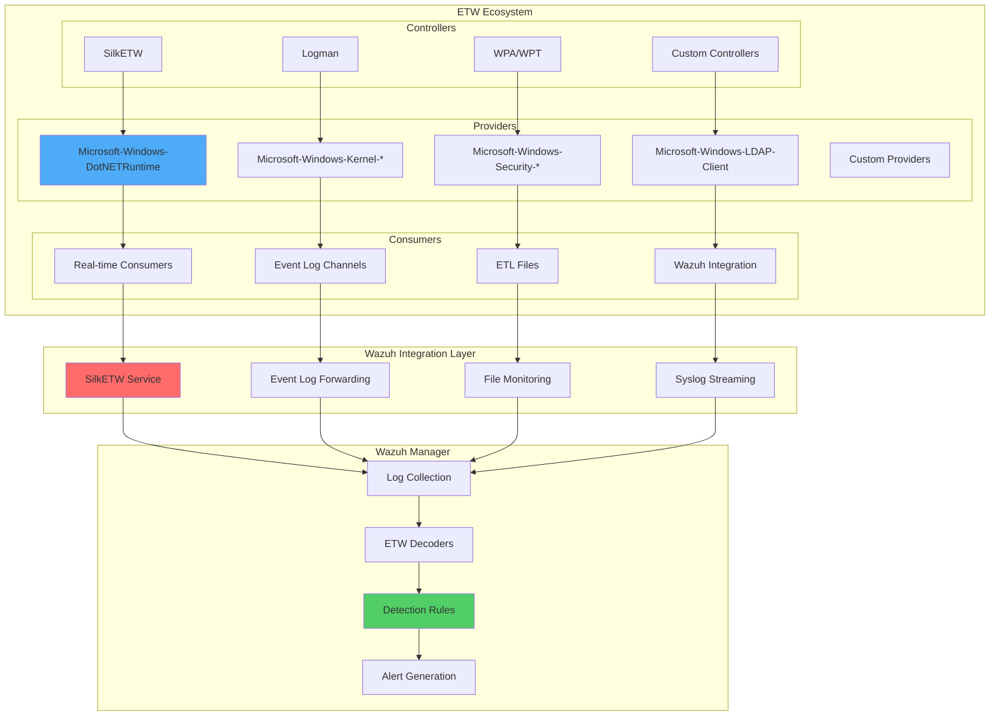

# Windows ETW Integration with Wazuh: A Comprehensive Production-Ready Guide

## Introduction

Event Tracing for Windows (ETW) provides access to granular system and application telemetry that goes far beyond traditional Windows Event Logs. While Wazuh excels at analyzing standard Windows logs, ETW integration unlocks deep visibility into system behaviors, process activities, network communications, and security events that are otherwise invisible.

This comprehensive guide provides production-ready methods to integrate ETW with Wazuh, enabling organizations to:

- 🔍 **Deep System Visibility**: Access kernel-level and application-specific events
- ⚡ **Real-time Monitoring**: Stream ETW events directly to Wazuh
- 🎯 **Advanced Threat Detection**: Detect sophisticated attacks using low-level telemetry
- 📊 **Enhanced Analytics**: Correlate ETW events with traditional log sources
- 🛡️ **Proactive Security**: Identify threats before they appear in standard logs

## Understanding ETW Architecture

### ETW Components Overview



### ETW vs Traditional Event Logs

| Aspect | Traditional Event Logs | ETW |
|--------|----------------------|-----|
| **Granularity** | High-level system events | Kernel and application-level details |
| **Performance** | Moderate overhead | Optimized, low overhead |
| **Real-time** | Yes (via Event Channels) | Yes (via real-time consumers) |
| **Coverage** | Limited to configured sources | Comprehensive system coverage |
| **Flexibility** | Fixed event schemas | Customizable providers and consumers |
| **Analysis** | Standard Windows tools | Requires specialized tools |

## Current State of ETW Support in Wazuh

### Official Support Status

As of 2025, **Wazuh does not provide native ETW support**. According to GitHub discussions and feature requests:

- **Feature Request #16668**: ETW hooks for Windows marked as "not planned"
- **Community Interest**: High demand for ETW integration capabilities
- **Workaround Solutions**: External tools required for ETW collection

### Wazuh's Current Windows Log Capabilities

Wazuh currently supports:

```xml
<!-- Event Channel Collection -->
<localfile>
  <location>Microsoft-Windows-Sysmon/Operational</location>
  <log_format>eventchannel</log_format>
</localfile>

<!-- Traditional Event Logs -->
<localfile>
  <location>System</location>
  <log_format>eventlog</log_format>
</localfile>

<!-- Event Channel with XPath Filtering -->
<localfile>
  <location>Security</location>
  <log_format>eventchannel</log_format>
  <query>Event/System[EventID=4624 or EventID=4625]</query>
</localfile>
```

## Production-Ready ETW Integration Methods

### Method 1: SilkETW Real-time Integration

SilkETW, developed by FireEye (now Mandiant), provides the most robust solution for ETW-to-Wazuh integration.

#### Phase 1: SilkETW Installation and Setup

**Prerequisites Installation**:

```powershell
# Download and install dependencies
# 1. VC++ 2015 x86 Redistributable
Invoke-WebRequest -Uri "https://www.microsoft.com/en-us/download/details.aspx?id=48145" -OutFile "vc2015_redist.x86.exe"
.\vc2015_redist.x86.exe /quiet

# 2. .NET Framework 4.5+
Invoke-WebRequest -Uri "https://www.microsoft.com/en-us/download/details.aspx?id=30653" -OutFile "dotNetFx45_Full_setup.exe"  
.\dotNetFx45_Full_setup.exe /quiet

# 3. Download SilkETW
Invoke-WebRequest -Uri "https://github.com/mandiant/SilkETW/releases/latest/download/SilkETW_SilkService_v8.zip" -OutFile "SilkETW.zip"
Expand-Archive -Path "SilkETW.zip" -DestinationPath "C:\SilkETW"
```

#### Phase 2: SilkService Configuration

**Service Installation**:

```powershell
# Install SilkService
sc create SilkService binPath= "C:\SilkETW\SilkService\SilkService.exe" start= auto
```

**Advanced SilkService Configuration**:

Create `C:\SilkETW\SilkService\SilkServiceConfig.xml`:

```xml
<?xml version="1.0" encoding="utf-8"?>
<SilkServiceConfig>
  <!-- .NET Runtime Monitoring -->
  <ETWCollector>
    <Guid>12345678-1234-1234-1234-123456789012</Guid>
    <CollectorType>user</CollectorType>
    <ProviderName>Microsoft-Windows-DotNETRuntime</ProviderName>
    <UserTraceEventLevel>informational</UserTraceEventLevel>
    <UserKeywords>0x2038</UserKeywords>
    <OutputType>eventlog</OutputType>
    <FilterOption>None</FilterOption>
    <FilterValue></FilterValue>
  </ETWCollector>

  <!-- LDAP Client Monitoring -->
  <ETWCollector>
    <Guid>87654321-4321-4321-4321-210987654321</Guid>
    <CollectorType>user</CollectorType>
    <ProviderName>Microsoft-Windows-LDAP-Client</ProviderName>
    <UserTraceEventLevel>verbose</UserTraceEventLevel>
    <UserKeywords>0xFFFFFFFFFFFFFFFF</UserKeywords>
    <OutputType>eventlog</OutputType>
    <FilterOption>None</FilterOption>
    <FilterValue></FilterValue>
  </ETWCollector>

  <!-- Kernel Process Monitoring -->
  <ETWCollector>
    <Guid>11111111-2222-3333-4444-555555555555</Guid>
    <CollectorType>kernel</CollectorType>
    <KernelKeywords>0x100</KernelKeywords>
    <OutputType>eventlog</OutputType>
    <FilterOption>None</FilterOption>
    <FilterValue></FilterValue>
  </ETWCollector>

  <!-- DNS Client Monitoring -->
  <ETWCollector>
    <Guid>66666666-7777-8888-9999-000000000000</Guid>
    <CollectorType>user</CollectorType>
    <ProviderName>Microsoft-Windows-DNS-Client</ProviderName>
    <UserTraceEventLevel>verbose</UserTraceEventLevel>
    <UserKeywords>0xFFFFFFFFFFFFFFFF</UserKeywords>
    <OutputType>eventlog</OutputType>
    <FilterOption>EventName</FilterOption>
    <FilterValue>DNS_TYPE_A|DNS_TYPE_AAAA</FilterValue>
  </ETWCollector>

  <!-- PowerShell ETW Provider -->
  <ETWCollector>
    <Guid>AAAAAAAA-BBBB-CCCC-DDDD-EEEEEEEEEEEE</Guid>
    <CollectorType>user</CollectorType>
    <ProviderName>Microsoft-Windows-PowerShell</ProviderName>
    <UserTraceEventLevel>verbose</UserTraceEventLevel>
    <UserKeywords>0xFFFFFFFFFFFFFFFF</UserKeywords>
    <OutputType>eventlog</OutputType>
    <FilterOption>None</FilterOption>
    <FilterValue></FilterValue>
  </ETWCollector>

  <!-- WinINet HTTP Monitoring -->
  <ETWCollector>
    <Guid>FFFFFFFF-EEEE-DDDD-CCCC-BBBBBBBBBBBB</Guid>
    <CollectorType>user</CollectorType>
    <ProviderName>Microsoft-Windows-WinINet</ProviderName>
    <UserTraceEventLevel>verbose</UserTraceEventLevel>
    <UserKeywords>0xFFFFFFFFFFFFFFFF</UserKeywords>
    <OutputType>eventlog</OutputType>
    <FilterOption>None</FilterOption>
    <FilterValue></FilterValue>
  </ETWCollector>
</SilkServiceConfig>
```

**Start SilkService**:

```powershell
Start-Service -Name SilkService
Get-Service SilkService  # Verify running status
```

#### Phase 3: Wazuh Agent Configuration for SilkETW

Add to `C:\Program Files (x86)\ossec-agent\ossec.conf`:

```xml
<ossec_config>
  <!-- SilkService ETW Events -->
  <localfile>
    <location>SilkService-Log</location>
    <log_format>eventchannel</log_format>
    <query>Event/System[EventID=3]</query>
  </localfile>

  <!-- Alternative: Monitor all SilkService events -->
  <localfile>
    <location>SilkService-Log</location>
    <log_format>eventchannel</log_format>
  </localfile>

  <!-- Monitor SilkETW-Log for CLI usage -->
  <localfile>
    <location>SilkETW-Log</location>
    <log_format>eventchannel</log_format>
    <query>Event/System[EventID=3]</query>
  </localfile>
</ossec_config>
```

### Method 2: ETW File-Based Integration

For environments where real-time streaming isn't feasible:

#### Phase 1: ETW Collection to Files

**PowerShell ETW Collection Script**:

```powershell
# etw-collector.ps1 - Collect ETW events to files

param(
    [string]$OutputPath = "C:\ETW_Logs",
    [int]$MaxFileSizeMB = 100,
    [int]$CollectionDurationMinutes = 60
)

# Create output directory
if (!(Test-Path $OutputPath)) {
    New-Item -ItemType Directory -Path $OutputPath -Force
}

# Define ETW providers to collect
$ETWProviders = @{
    "DotNETRuntime" = @{
        "Provider" = "Microsoft-Windows-DotNETRuntime"
        "Keywords" = "0x2038"
        "Level" = "5"
    }
    "LDAP" = @{
        "Provider" = "Microsoft-Windows-LDAP-Client" 
        "Keywords" = "0xFFFFFFFFFFFFFFFF"
        "Level" = "5"
    }
    "DNS" = @{
        "Provider" = "Microsoft-Windows-DNS-Client"
        "Keywords" = "0xFFFFFFFFFFFFFFFF"
        "Level" = "5"
    }
    "PowerShell" = @{
        "Provider" = "Microsoft-Windows-PowerShell"
        "Keywords" = "0xFFFFFFFFFFFFFFFF"
        "Level" = "5"
    }
}

# Start ETW traces
$TraceSessions = @()
foreach ($ProviderName in $ETWProviders.Keys) {
    $Provider = $ETWProviders[$ProviderName]
    $SessionName = "WazuhETW_$ProviderName"
    $ETLFile = "$OutputPath\$ProviderName.etl"
    
    Write-Host "Starting ETW trace for $ProviderName..."
    
    # Create trace session
    $Command = "logman create trace `"$SessionName`" -p `"$($Provider.Provider)`" $($Provider.Keywords) $($Provider.Level) -o `"$ETLFile`" -ets -f bincirc -max $MaxFileSizeMB"
    Invoke-Expression $Command
    
    # Start trace
    $Command = "logman start `"$SessionName`" -ets"
    Invoke-Expression $Command
    
    $TraceSessions += $SessionName
}

Write-Host "ETW collection started for $($TraceSessions.Count) providers"
Write-Host "Collection will run for $CollectionDurationMinutes minutes"

# Wait for collection period
Start-Sleep -Seconds ($CollectionDurationMinutes * 60)

# Stop all trace sessions
foreach ($SessionName in $TraceSessions) {
    Write-Host "Stopping ETW trace: $SessionName"
    logman stop $SessionName -ets
    logman delete $SessionName -ets
}

Write-Host "ETW collection completed. Files saved to: $OutputPath"
```

#### Phase 2: ETW to JSON Conversion

**ETL to JSON Converter Script**:

```powershell
# etl-to-json.ps1 - Convert ETL files to JSON for Wazuh ingestion

param(
    [string]$InputPath = "C:\ETW_Logs",
    [string]$OutputPath = "C:\ETW_JSON"
)

# Create output directory
if (!(Test-Path $OutputPath)) {
    New-Item -ItemType Directory -Path $OutputPath -Force
}

# Function to convert ETL to JSON using WPA
function Convert-ETLToJSON {
    param(
        [string]$ETLFile,
        [string]$JSONFile
    )
    
    Write-Host "Converting $ETLFile to JSON..."
    
    # WPA command to convert ETL to structured format
    $WPACommand = "wpa.exe -i `"$ETLFile`" -profile `"etw_to_json.wpaProfile`" -o `"$JSONFile`""
    
    try {
        Invoke-Expression $WPACommand
        Write-Host "Successfully converted: $ETLFile"
    }
    catch {
        Write-Warning "Failed to convert $ETLFile : $_"
    }
}

# Process all ETL files
Get-ChildItem -Path $InputPath -Filter "*.etl" | ForEach-Object {
    $ETLFile = $_.FullName
    $JSONFile = "$OutputPath\$($_.BaseName).json"
    Convert-ETLToJSON -ETLFile $ETLFile -JSONFile $JSONFile
}
```

#### Phase 3: Wazuh File Monitoring Configuration

```xml
<ossec_config>
  <!-- Monitor ETW JSON files -->
  <localfile>
    <location>C:\ETW_JSON\*.json</location>
    <log_format>json</log_format>
  </localfile>

  <!-- Monitor individual provider outputs -->
  <localfile>
    <location>C:\ETW_JSON\DotNETRuntime.json</location>
    <log_format>json</log_format>
  </localfile>

  <localfile>
    <location>C:\ETW_JSON\LDAP.json</location>
    <log_format>json</log_format>
  </localfile>

  <localfile>
    <location>C:\ETW_JSON\DNS.json</location>
    <log_format>json</log_format>
  </localfile>
</ossec_config>
```

### Method 3: Advanced ETL File Analysis Integration

For forensic analysis and historical ETW data:

#### Phase 1: Automated ETL Processing

**Advanced ETL Processor**:

```python
#!/usr/bin/env python3
# etw_processor.py - Advanced ETW log processor for Wazuh

import json
import os
import subprocess
import xml.etree.ElementTree as ET
from datetime import datetime
import logging

class ETWProcessor:
    def __init__(self, input_dir, output_dir, wazuh_log_dir):
        self.input_dir = input_dir
        self.output_dir = output_dir
        self.wazuh_log_dir = wazuh_log_dir
        self.setup_logging()
        
    def setup_logging(self):
        """Setup logging configuration"""
        logging.basicConfig(
            level=logging.INFO,
            format='%(asctime)s - %(levelname)s - %(message)s',
            handlers=[
                logging.FileHandler('etw_processor.log'),
                logging.StreamHandler()
            ]
        )
        self.logger = logging.getLogger(__name__)
    
    def parse_etl_with_tracerpt(self, etl_file):
        """Convert ETL to XML using tracerpt"""
        try:
            xml_output = etl_file.replace('.etl', '.xml')
            cmd = f'tracerpt "{etl_file}" -o "{xml_output}" -of XML'
            
            result = subprocess.run(cmd, shell=True, capture_output=True, text=True)
            
            if result.returncode == 0:
                self.logger.info(f"Successfully converted {etl_file} to XML")
                return xml_output
            else:
                self.logger.error(f"Failed to convert {etl_file}: {result.stderr}")
                return None
                
        except Exception as e:
            self.logger.error(f"Error processing {etl_file}: {str(e)}")
            return None
    
    def xml_to_wazuh_format(self, xml_file):
        """Convert XML events to Wazuh-friendly JSON format"""
        try:
            tree = ET.parse(xml_file)
            root = tree.getroot()
            
            events = []
            for event in root.findall('.//Event'):
                wazuh_event = self.transform_event_to_wazuh(event)
                if wazuh_event:
                    events.append(wazuh_event)
            
            return events
            
        except Exception as e:
            self.logger.error(f"Error parsing XML {xml_file}: {str(e)}")
            return []
    
    def transform_event_to_wazuh(self, event):
        """Transform ETW event to Wazuh format"""
        try:
            # Extract system information
            system = event.find('.//{http://schemas.microsoft.com/win/2004/08/events/event}System')
            event_data = event.find('.//{http://schemas.microsoft.com/win/2004/08/events/event}EventData')
            
            wazuh_event = {
                "timestamp": datetime.now().isoformat(),
                "event_source": "etw",
                "log_type": "windows_etw"
            }
            
            # System data
            if system is not None:
                provider = system.find('.//{http://schemas.microsoft.com/win/2004/08/events/event}Provider')
                if provider is not None:
                    wazuh_event["etw"] = {
                        "provider_name": provider.get('Name'),
                        "provider_guid": provider.get('Guid'),
                        "event_id": system.find('.//{http://schemas.microsoft.com/win/2004/08/events/event}EventID').text,
                        "level": system.find('.//{http://schemas.microsoft.com/win/2004/08/events/event}Level').text,
                        "task": system.find('.//{http://schemas.microsoft.com/win/2004/08/events/event}Task').text,
                        "opcode": system.find('.//{http://schemas.microsoft.com/win/2004/08/events/event}Opcode').text,
                        "keywords": system.find('.//{http://schemas.microsoft.com/win/2004/08/events/event}Keywords').text
                    }
                    
                    # Time information
                    time_created = system.find('.//{http://schemas.microsoft.com/win/2004/08/events/event}TimeCreated')
                    if time_created is not None:
                        wazuh_event["etw"]["system_time"] = time_created.get('SystemTime')
                    
                    # Process information
                    execution = system.find('.//{http://schemas.microsoft.com/win/2004/08/events/event}Execution')
                    if execution is not None:
                        wazuh_event["etw"]["process_id"] = execution.get('ProcessID')
                        wazuh_event["etw"]["thread_id"] = execution.get('ThreadID')
            
            # Event data
            if event_data is not None:
                data_fields = {}
                for data in event_data.findall('.//{http://schemas.microsoft.com/win/2004/08/events/event}Data'):
                    name = data.get('Name')
                    value = data.text
                    if name and value:
                        data_fields[name] = value
                
                if data_fields:
                    wazuh_event["etw"]["data"] = data_fields
            
            return wazuh_event
            
        except Exception as e:
            self.logger.error(f"Error transforming event: {str(e)}")
            return None
    
    def write_wazuh_logs(self, events, provider_name):
        """Write events in Wazuh log format"""
        try:
            output_file = os.path.join(self.wazuh_log_dir, f"etw_{provider_name}.log")
            
            with open(output_file, 'w') as f:
                for event in events:
                    json_line = json.dumps(event, separators=(',', ':'))
                    f.write(json_line + '\n')
            
            self.logger.info(f"Written {len(events)} events to {output_file}")
            return output_file
            
        except Exception as e:
            self.logger.error(f"Error writing events: {str(e)}")
            return None
    
    def process_all_etl_files(self):
        """Process all ETL files in input directory"""
        etl_files = [f for f in os.listdir(self.input_dir) if f.endswith('.etl')]
        
        for etl_file in etl_files:
            etl_path = os.path.join(self.input_dir, etl_file)
            provider_name = os.path.splitext(etl_file)[0]
            
            self.logger.info(f"Processing ETL file: {etl_file}")
            
            # Convert ETL to XML
            xml_file = self.parse_etl_with_tracerpt(etl_path)
            if not xml_file:
                continue
            
            # Parse XML to Wazuh events
            events = self.xml_to_wazuh_format(xml_file)
            if not events:
                continue
            
            # Write to Wazuh log format
            log_file = self.write_wazuh_logs(events, provider_name)
            if log_file:
                self.logger.info(f"Successfully processed {etl_file}")
            
            # Clean up temporary XML
            try:
                os.remove(xml_file)
            except:
                pass

def main():
    processor = ETWProcessor(
        input_dir="C:/ETW_Logs",
        output_dir="C:/ETW_Processed", 
        wazuh_log_dir="C:/Wazuh_ETW_Logs"
    )
    
    processor.process_all_etl_files()

if __name__ == "__main__":
    main()
```

## Wazuh Server Configuration for ETW Events

### Phase 1: ETW Decoders

Add to `/var/ossec/etc/decoders/local_decoder.xml`:

```xml
<!-- SilkETW Decoders -->
<decoder name="silketw">
  <prematch>"Collector":</prematch>
</decoder>

<decoder name="silketw-event">
  <parent>silketw</parent>
  <regex>"ProviderName":"([^"]+)"</regex>
  <order>etw_provider</order>
</decoder>

<!-- ETW Provider-Specific Decoders -->

<!-- .NET Runtime Events -->
<decoder name="etw-dotnet">
  <parent>silketw-event</parent>
  <prematch>Microsoft-Windows-DotNETRuntime</prematch>
  <regex>"EventID":(\d+).*"ProcessID":(\d+).*"ThreadID":(\d+)</regex>
  <order>event_id, process_id, thread_id</order>
</decoder>

<!-- LDAP Client Events -->
<decoder name="etw-ldap">
  <parent>silketw-event</parent>
  <prematch>Microsoft-Windows-LDAP-Client</prematch>
  <regex>"SearchFilter":"([^"]+)".*"BaseDN":"([^"]+)"</regex>
  <order>ldap_filter, base_dn</order>
</decoder>

<!-- DNS Client Events -->
<decoder name="etw-dns">
  <parent>silketw-event</parent>
  <prematch>Microsoft-Windows-DNS-Client</prematch>
  <regex>"QueryName":"([^"]+)".*"QueryType":"([^"]+)"</regex>
  <order>dns_query, query_type</order>
</decoder>

<!-- PowerShell Events -->
<decoder name="etw-powershell">
  <parent>silketw-event</parent>
  <prematch>Microsoft-Windows-PowerShell</prematch>
  <regex>"ScriptBlockText":"([^"]+)"</regex>
  <order>powershell_script</order>
</decoder>

<!-- WinINet HTTP Events -->
<decoder name="etw-wininet">
  <parent>silketw-event</parent>
  <prematch>Microsoft-Windows-WinINet</prematch>
  <regex>"URL":"([^"]+)".*"Method":"([^"]+)"</regex>
  <order>http_url, http_method</order>
</decoder>

<!-- Process and Thread Events -->
<decoder name="etw-process">
  <parent>silketw-event</parent>
  <prematch>Microsoft-Windows-Kernel-Process</prematch>
  <regex>"ProcessName":"([^"]+)".*"CommandLine":"([^"]+)"</regex>
  <order>process_name, command_line</order>
</decoder>
```

### Phase 2: ETW Detection Rules

Add to `/var/ossec/etc/rules/local_rules.xml`:

```xml
<group name="etw,windows,">
  <!-- Base ETW Rules -->
  <rule id="200000" level="0">
    <decoded_as>silketw</decoded_as>
    <description>SilkETW events grouped</description>
    <group>etw,</group>
  </rule>

  <!-- .NET Runtime Security Rules -->
  <rule id="200001" level="5">
    <if_sid>200000</if_sid>
    <field name="etw_provider">Microsoft-Windows-DotNETRuntime</field>
    <field name="event_id">200</field>
    <description>ETW: .NET assembly loaded - $(process_name)</description>
    <group>dotnet,assembly_load,</group>
  </rule>

  <rule id="200002" level="7">
    <if_sid>200001</if_sid>
    <match>System.Reflection|PowerShellRunner|Invoke-</match>
    <description>ETW: Suspicious .NET assembly load - potential PowerShell injection</description>
    <group>dotnet,powershell_injection,</group>
  </rule>

  <!-- LDAP Query Monitoring -->
  <rule id="200010" level="4">
    <if_sid>200000</if_sid>
    <field name="etw_provider">Microsoft-Windows-LDAP-Client</field>
    <description>ETW: LDAP query executed - $(ldap_filter)</description>
    <group>ldap,reconnaissance,</group>
  </rule>

  <rule id="200011" level="8">
    <if_sid>200010</if_sid>
    <field name="ldap_filter" type="pcre2">objectClass=\*|adminCount=1|\(memberOf=</field>
    <description>ETW: Suspicious LDAP query - $(ldap_filter)</description>
    <group>ldap,privilege_escalation,</group>
  </rule>

  <!-- DNS Monitoring -->
  <rule id="200020" level="3">
    <if_sid>200000</if_sid>
    <field name="etw_provider">Microsoft-Windows-DNS-Client</field>
    <description>ETW: DNS query - $(dns_query)</description>
    <group>dns,</group>
  </rule>

  <rule id="200021" level="6">
    <if_sid>200020</if_sid>
    <list field="dns_query" lookup="address_match_key">etc/lists/suspicious_domains</list>
    <description>ETW: DNS query to suspicious domain - $(dns_query)</description>
    <group>dns,suspicious_domain,</group>
  </rule>

  <!-- PowerShell Script Block Logging -->
  <rule id="200030" level="5">
    <if_sid>200000</if_sid>
    <field name="etw_provider">Microsoft-Windows-PowerShell</field>
    <description>ETW: PowerShell script execution detected</description>
    <group>powershell,script_execution,</group>
  </rule>

  <rule id="200031" level="10">
    <if_sid>200030</if_sid>
    <field name="powershell_script" type="pcre2">Invoke-Expression|IEX|DownloadString|WebClient|System\.Net</field>
    <description>ETW: Suspicious PowerShell script - potential malware</description>
    <group>powershell,malicious_script,</group>
  </rule>

  <!-- HTTP Traffic Monitoring -->
  <rule id="200040" level="4">
    <if_sid>200000</if_sid>
    <field name="etw_provider">Microsoft-Windows-WinINet</field>
    <description>ETW: HTTP request - $(http_method) $(http_url)</description>
    <group>http,network,</group>
  </rule>

  <rule id="200041" level="7">
    <if_sid>200040</if_sid>
    <field name="http_url" type="pcre2">\.exe$|\.dll$|\.bat$|\.ps1$</field>
    <description>ETW: HTTP request for executable file - $(http_url)</description>
    <group>http,malware_download,</group>
  </rule>

  <!-- Process Creation via ETW -->
  <rule id="200050" level="3">
    <if_sid>200000</if_sid>
    <field name="etw_provider">Microsoft-Windows-Kernel-Process</field>
    <description>ETW: Process created - $(process_name)</description>
    <group>process_creation,</group>
  </rule>

  <rule id="200051" level="8">
    <if_sid>200050</if_sid>
    <field name="process_name" type="pcre2">powershell\.exe|cmd\.exe|rundll32\.exe</field>
    <field name="command_line" type="pcre2">-enc|-encoded|-e |bypass|unrestricted</field>
    <description>ETW: Suspicious process execution - $(process_name) $(command_line)</description>
    <group>process_creation,suspicious_execution,</group>
  </rule>

  <!-- Correlation Rules -->
  <rule id="200100" level="12" frequency="3" timeframe="300">
    <if_matched_group>dotnet,powershell_injection</if_matched_group>
    <same_field>process_id</same_field>
    <description>ETW: Multiple suspicious .NET activities in same process</description>
    <group>correlation,multi_stage_attack,</group>
  </rule>

  <rule id="200101" level="10">
    <if_matched_sid>200011</if_matched_sid>
    <if_matched_sid>200031</if_matched_sid>
    <same_field>process_id</same_field>
    <description>ETW: LDAP enumeration followed by PowerShell execution</description>
    <group>correlation,reconnaissance_and_execution,</group>
  </rule>
</group>
```

### Phase 3: Threat Intelligence Integration

Create `/var/ossec/etc/lists/suspicious_domains`:

```
# Suspicious domains for DNS monitoring
# Format: domain:description
evil.com:Known malicious domain
c2server.net:Command and control server
malware-download.org:Malware hosting
phishing-site.com:Phishing domain
```

## Advanced ETW Monitoring Use Cases

### 1. .NET Assembly Loading and Injection Detection

**ETW Provider**: `Microsoft-Windows-DotNETRuntime`
**Key Events**: 
- Event ID 152: Assembly Load
- Event ID 154: Module Load

**SilkETW Configuration**:
```xml
<ETWCollector>
  <Guid>12345678-1234-1234-1234-123456789ABC</Guid>
  <CollectorType>user</CollectorType>
  <ProviderName>Microsoft-Windows-DotNETRuntime</ProviderName>
  <UserTraceEventLevel>informational</UserTraceEventLevel>
  <UserKeywords>0x8</UserKeywords>
  <OutputType>eventlog</OutputType>
  <FilterOption>EventName</FilterOption>
  <FilterValue>AssemblyDCStart|AssemblyLoad</FilterValue>
</ETWCollector>
```

### 2. Advanced PowerShell Monitoring

**ETW Provider**: `Microsoft-Windows-PowerShell`
**Key Features**:
- Script block logging
- Command execution tracking
- Module loading events

**Detection Rule Example**:
```xml
<rule id="200200" level="12">
  <if_sid>200030</if_sid>
  <field name="powershell_script" type="pcre2">Add-Type.*DllImport|VirtualAlloc|WriteProcessMemory</field>
  <description>ETW: PowerShell process injection detected</description>
  <group>powershell,process_injection,</group>
</rule>
```

### 3. LDAP Query Analysis

**ETW Provider**: `Microsoft-Windows-LDAP-Client`
**Use Cases**:
- AD enumeration detection
- Privilege escalation attempts
- Lateral movement tracking

**Advanced Rule**:
```xml
<rule id="200210" level="9" frequency="10" timeframe="60">
  <if_sid>200010</if_sid>
  <same_field>process_id</same_field>
  <description>ETW: Rapid LDAP enumeration detected</description>
  <group>ldap,enumeration,</group>
</rule>
```

### 4. Network Activity Monitoring

**ETW Providers**: 
- `Microsoft-Windows-WinINet`
- `Microsoft-Windows-DNS-Client`
- `Microsoft-Windows-Winsock-AFD`

**Monitoring Capabilities**:
- HTTP/HTTPS requests
- DNS queries
- Socket operations

### 5. Kernel-Level Process Monitoring

**ETW Provider**: `Microsoft-Windows-Kernel-Process`
**Kernel Keywords**: `0x100` (Process and Thread)

**Benefits over Sysmon**:
- Lower overhead
- More granular control
- Additional process details

## Performance Optimization and Best Practices

### 1. Resource Management

**ETW Collection Guidelines**:

```yaml
Performance Recommendations:
  CPU Usage:
    - Limit concurrent providers: 5-10 maximum
    - Use targeted keyword filtering
    - Monitor CPU impact regularly
    
  Memory Usage:
    - Set appropriate buffer sizes
    - Implement log rotation
    - Monitor memory consumption
    
  Disk I/O:
    - Use fast storage for ETL files
    - Implement compression where possible
    - Regular cleanup of old files
    
  Network:
    - Batch event forwarding
    - Use compression for log shipping
    - Consider local buffering
```

### 2. SilkETW Production Configuration

**Service Management Script**:

```powershell
# silk-etw-manager.ps1 - Production SilkETW management

param(
    [Parameter(Mandatory=$true)]
    [ValidateSet("Start", "Stop", "Restart", "Status", "Configure")]
    [string]$Action,
    
    [string]$ConfigPath = "C:\SilkETW\SilkService\SilkServiceConfig.xml"
)

function Test-SilkETWHealth {
    """Check SilkETW service health"""
    
    $service = Get-Service -Name "SilkService" -ErrorAction SilentlyContinue
    if (!$service) {
        Write-Warning "SilkService not found"
        return $false
    }
    
    # Check service status
    $status = $service.Status
    Write-Host "SilkService Status: $status"
    
    # Check log file growth
    $logPath = "C:\SilkETW\SilkService\Logs"
    if (Test-Path $logPath) {
        $logFiles = Get-ChildItem $logPath -Filter "*.log"
        $latestLog = $logFiles | Sort-Object LastWriteTime -Descending | Select-Object -First 1
        
        if ($latestLog -and $latestLog.LastWriteTime -gt (Get-Date).AddMinutes(-5)) {
            Write-Host "Log files are being updated (Last: $($latestLog.LastWriteTime))"
            return $true
        } else {
            Write-Warning "Log files not being updated recently"
            return $false
        }
    }
    
    return $status -eq "Running"
}

function Start-SilkETWService {
    """Start SilkETW service with health checks"""
    
    Write-Host "Starting SilkETW service..."
    Start-Service -Name "SilkService"
    
    # Wait and verify
    Start-Sleep -Seconds 10
    if (Test-SilkETWHealth) {
        Write-Host "SilkETW service started successfully"
    } else {
        Write-Error "SilkETW service failed to start properly"
    }
}

function Stop-SilkETWService {
    """Stop SilkETW service gracefully"""
    
    Write-Host "Stopping SilkETW service..."
    Stop-Service -Name "SilkService" -Force
    
    # Clean up resources
    Get-Process | Where-Object {$_.ProcessName -like "*SilkService*"} | Stop-Process -Force -ErrorAction SilentlyContinue
    
    Write-Host "SilkETW service stopped"
}

function Update-SilkETWConfig {
    """Update SilkETW configuration"""
    
    if (!(Test-Path $ConfigPath)) {
        Write-Error "Configuration file not found: $ConfigPath"
        return
    }
    
    Write-Host "Updating SilkETW configuration..."
    
    # Backup current config
    $backupPath = "$ConfigPath.backup.$(Get-Date -Format 'yyyyMMdd-HHmmss')"
    Copy-Item $ConfigPath $backupPath
    
    # Restart service to apply changes
    Stop-SilkETWService
    Start-Sleep -Seconds 5
    Start-SilkETWService
    
    Write-Host "Configuration updated and service restarted"
}

# Main execution
switch ($Action) {
    "Start" { Start-SilkETWService }
    "Stop" { Stop-SilkETWService }
    "Restart" { 
        Stop-SilkETWService
        Start-Sleep -Seconds 5
        Start-SilkETWService
    }
    "Status" { Test-SilkETWHealth }
    "Configure" { Update-SilkETWConfig }
}
```

### 3. Monitoring and Alerting

**ETW Health Monitoring Script**:

```python
#!/usr/bin/env python3
# etw_health_monitor.py - Monitor ETW collection health

import json
import time
import requests
import win32evtlog
import win32con
from datetime import datetime, timedelta

class ETWHealthMonitor:
    def __init__(self, config_file="etw_monitor_config.json"):
        self.config = self.load_config(config_file)
        self.metrics = {
            "events_per_minute": {},
            "provider_health": {},
            "error_count": 0,
            "last_check": None
        }
    
    def load_config(self, config_file):
        """Load monitoring configuration"""
        try:
            with open(config_file, 'r') as f:
                return json.load(f)
        except FileNotFoundError:
            return {
                "providers": [
                    "Microsoft-Windows-DotNETRuntime",
                    "Microsoft-Windows-LDAP-Client",
                    "Microsoft-Windows-DNS-Client"
                ],
                "alert_thresholds": {
                    "events_per_minute_min": 1,
                    "events_per_minute_max": 1000,
                    "error_rate_max": 0.1
                },
                "webhook_url": None
            }
    
    def check_silketw_service(self):
        """Check SilkETW service status"""
        try:
            # Check Windows service
            import win32service
            import win32serviceutil
            
            status = win32serviceutil.QueryServiceStatus("SilkService")
            return status[1] == win32service.SERVICE_RUNNING
        except:
            return False
    
    def check_event_volume(self):
        """Monitor ETW event volume"""
        try:
            # Check SilkService-Log event log
            hand = win32evtlog.OpenEventLog(None, "SilkService-Log")
            
            # Get events from last 5 minutes
            flags = win32evtlog.EVENTLOG_BACKWARDS_READ | win32evtlog.EVENTLOG_SEQUENTIAL_READ
            events = win32evtlog.ReadEventLog(hand, flags, 0)
            
            recent_events = 0
            five_minutes_ago = datetime.now() - timedelta(minutes=5)
            
            for event in events:
                if datetime.fromtimestamp(event.TimeGenerated) > five_minutes_ago:
                    recent_events += 1
            
            win32evtlog.CloseEventLog(hand)
            
            events_per_minute = recent_events / 5
            self.metrics["events_per_minute"]["current"] = events_per_minute
            
            return events_per_minute
            
        except Exception as e:
            self.metrics["error_count"] += 1
            print(f"Error checking event volume: {e}")
            return 0
    
    def check_provider_health(self):
        """Check health of individual ETW providers"""
        healthy_providers = 0
        
        for provider in self.config["providers"]:
            # Check if provider is generating events
            try:
                # Implementation would check recent events from each provider
                # For brevity, using placeholder logic
                is_healthy = self.check_provider_activity(provider)
                self.metrics["provider_health"][provider] = is_healthy
                
                if is_healthy:
                    healthy_providers += 1
                    
            except Exception as e:
                print(f"Error checking provider {provider}: {e}")
                self.metrics["provider_health"][provider] = False
        
        return healthy_providers / len(self.config["providers"])
    
    def check_provider_activity(self, provider_name):
        """Check if specific provider is active"""
        # Placeholder - would implement actual provider activity check
        return True
    
    def send_alert(self, alert_message):
        """Send alert notification"""
        if self.config.get("webhook_url"):
            try:
                payload = {
                    "text": f"ETW Monitoring Alert: {alert_message}",
                    "timestamp": datetime.now().isoformat(),
                    "metrics": self.metrics
                }
                
                response = requests.post(
                    self.config["webhook_url"],
                    json=payload,
                    timeout=10
                )
                
                print(f"Alert sent: {response.status_code}")
            except Exception as e:
                print(f"Failed to send alert: {e}")
        else:
            print(f"ALERT: {alert_message}")
    
    def run_health_check(self):
        """Run comprehensive health check"""
        print(f"Running ETW health check at {datetime.now()}")
        
        # Check service status
        service_running = self.check_silketw_service()
        if not service_running:
            self.send_alert("SilkETW service is not running")
            return False
        
        # Check event volume
        events_per_minute = self.check_event_volume()
        min_threshold = self.config["alert_thresholds"]["events_per_minute_min"]
        max_threshold = self.config["alert_thresholds"]["events_per_minute_max"]
        
        if events_per_minute < min_threshold:
            self.send_alert(f"Low ETW event volume: {events_per_minute}/min (threshold: {min_threshold})")
        elif events_per_minute > max_threshold:
            self.send_alert(f"High ETW event volume: {events_per_minute}/min (threshold: {max_threshold})")
        
        # Check provider health
        provider_health_ratio = self.check_provider_health()
        if provider_health_ratio < 0.8:
            self.send_alert(f"ETW provider health degraded: {provider_health_ratio:.1%} healthy")
        
        self.metrics["last_check"] = datetime.now().isoformat()
        
        print(f"Health check completed - Events/min: {events_per_minute}, Provider health: {provider_health_ratio:.1%}")
        return True
    
    def continuous_monitoring(self, interval_minutes=5):
        """Run continuous health monitoring"""
        print(f"Starting continuous ETW monitoring (interval: {interval_minutes} minutes)")
        
        while True:
            try:
                self.run_health_check()
                time.sleep(interval_minutes * 60)
            except KeyboardInterrupt:
                print("Monitoring stopped by user")
                break
            except Exception as e:
                print(f"Monitoring error: {e}")
                time.sleep(60)  # Wait 1 minute on error

def main():
    monitor = ETWHealthMonitor()
    monitor.continuous_monitoring()

if __name__ == "__main__":
    main()
```

## Security Considerations and Hardening

### 1. ETW Collection Security

**Principle of Least Privilege**:
```powershell
# Grant minimal permissions for SilkETW service account
$serviceName = "SilkService"
$serviceAccount = "DOMAIN\SilkETW-Service"

# Set service to run as specific account
sc config $serviceName obj= $serviceAccount password= "SecurePassword123!"

# Grant only necessary privileges
secedit /configure /db secedit.sdb /cfg service_rights.inf
```

**Service Rights Configuration** (`service_rights.inf`):
```ini
[Unicode]
Unicode=yes

[System Access]

[Event Audit]

[Registry Values]

[Privilege Rights]
SeServiceLogonRight = DOMAIN\SilkETW-Service
SeDebugPrivilege = DOMAIN\SilkETW-Service
SeSecurityPrivilege = DOMAIN\SilkETW-Service

[Version]
signature="$CHICAGO$"
Revision=1
```

### 2. Data Protection

**ETW Log Encryption**:
```powershell
# Encrypt ETW log directories using EFS
cipher /e /s:C:\SilkETW\SilkService\Logs

# Set secure permissions
icacls "C:\SilkETW\SilkService\Logs" /inheritance:d
icacls "C:\SilkETW\SilkService\Logs" /grant:r "SYSTEM:F"
icacls "C:\SilkETW\SilkService\Logs" /grant:r "Administrators:F"
icacls "C:\SilkETW\SilkService\Logs" /grant:r "DOMAIN\SilkETW-Service:F"
```

### 3. Network Security

**Secure Log Forwarding**:
```xml
<ossec_config>
  <!-- Use secure syslog forwarding -->
  <client>
    <server>
      <address>wazuh-manager.company.com</address>
      <port>1514</port>
      <protocol>secure</protocol>
    </server>
  </client>
  
  <!-- Enable agent verification -->
  <client_buffer>
    <disabled>no</disabled>
    <length>5000</length>
    <events_per_second>100</events_per_second>
  </client_buffer>
</ossec_config>
```

## Troubleshooting and Common Issues

### 1. SilkETW Service Issues

**Service Won't Start**:
```powershell
# Check service dependencies
sc qc SilkService

# Verify configuration file
Test-Path "C:\SilkETW\SilkService\SilkServiceConfig.xml"
Get-Content "C:\SilkETW\SilkService\SilkServiceConfig.xml" | Select-Xml -XPath "//ETWCollector"

# Check service logs
Get-EventLog -LogName Application -Source "SilkService" -Newest 10
```

**No Events in Event Log**:
```powershell
# Verify ETW providers exist
logman query providers | findstr "Microsoft-Windows-DotNETRuntime"

# Test manual ETW collection
SilkETW.exe -t user -pn Microsoft-Windows-DotNETRuntime -uk 0x2038 -ot eventlog

# Check event log permissions
wevtutil gl SilkService-Log
```

### 2. Performance Issues

**High CPU Usage**:
```powershell
# Monitor SilkETW resource usage
Get-Process | Where-Object {$_.ProcessName -like "*Silk*"} | Select-Object ProcessName, CPU, WorkingSet

# Reduce provider keyword filters
# Update SilkServiceConfig.xml with more specific keywords

# Check for ETW session conflicts
logman query -ets
```

**Memory Consumption**:
```powershell
# Configure buffer sizes in SilkETW
# Add to SilkServiceConfig.xml:
# <BufferSize>64</BufferSize>
# <NumberOfBuffers>20</NumberOfBuffers>

# Implement log rotation
Get-ChildItem "C:\SilkETW\SilkService\Logs" | Where-Object {$_.LastWriteTime -lt (Get-Date).AddDays(-7)} | Remove-Item
```

### 3. Wazuh Integration Issues

**Events Not Reaching Wazuh**:
```bash
# Check Wazuh agent logs
tail -f /var/ossec/logs/ossec.log

# Verify eventchannel configuration
grep -A5 -B5 "SilkService" /var/ossec/etc/ossec.conf

# Test decoder with sample event
echo '{"Collector":"Event","Data":{"ProviderName":"Microsoft-Windows-DotNETRuntime"}}' | /var/ossec/bin/ossec-logtest
```

**Decoder Issues**:
```bash
# Validate decoder syntax
/var/ossec/bin/ossec-logtest -t

# Check for parsing errors
grep "ERROR" /var/ossec/logs/ossec.log | grep -i decoder
```

## Conclusion

Integrating Windows ETW with Wazuh provides unprecedented visibility into system behaviors and security events. While Wazuh doesn't natively support ETW, the combination of SilkETW and custom configurations creates a powerful, production-ready monitoring solution.

Key benefits of this integration include:

- 🔍 **Enhanced Visibility**: Access to low-level system and application events
- 🎯 **Advanced Threat Detection**: Detect sophisticated attacks using ETW telemetry
- ⚡ **Real-time Monitoring**: Stream events directly to Wazuh for immediate analysis
- 📊 **Rich Context**: Correlate ETW events with traditional log sources
- 🛡️ **Proactive Defense**: Identify threats before they appear in standard logs

This comprehensive approach enables organizations to leverage the full power of Windows telemetry within their Wazuh SIEM deployment.

## Key Takeaways

1. **Use SilkETW for Production**: Most reliable method for ETW-to-Wazuh integration
2. **Focus on High-Value Providers**: Target providers that provide security-relevant data
3. **Implement Performance Monitoring**: ETW can generate high volumes of data
4. **Security Hardening**: Protect ETW collection infrastructure appropriately
5. **Test Thoroughly**: Validate all configurations in non-production environments

## Resources

- [SilkETW GitHub Repository](https://github.com/mandiant/SilkETW)
- [Microsoft ETW Documentation](https://docs.microsoft.com/en-us/windows/win32/etw/event-tracing-portal)
- [Wazuh Windows Agent Configuration](https://documentation.wazuh.com/current/user-manual/agent/wazuh-agent-package-windows.html)
- [Windows Event Providers Explorer](https://github.com/lallousx86/WinAPIOverride)

---

*Unlock the full potential of Windows telemetry with ETW and Wazuh integration! 🔍🛡️*