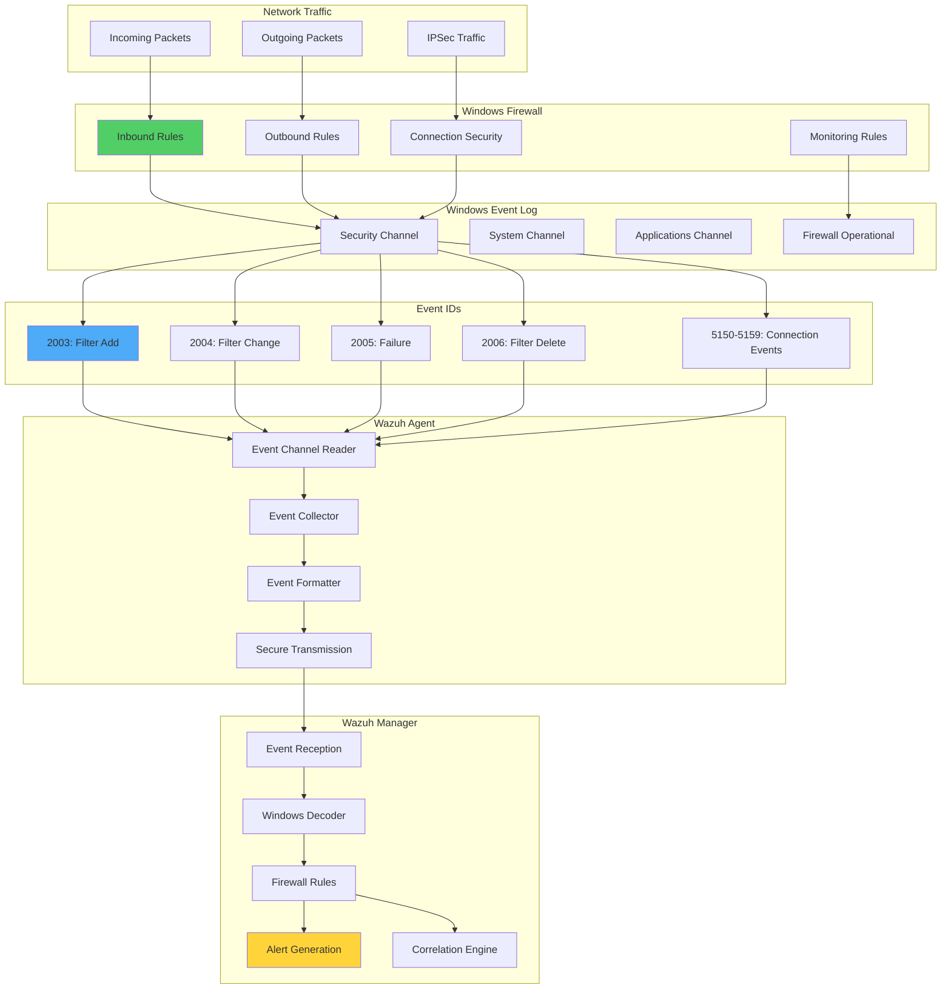

# Report Windows Firewall Events Through Event Channel in Wazuh

## Introduction

Windows Firewall with Advanced Security is a crucial component of Windows security architecture, providing network-level protection against unauthorized access and malicious traffic. By monitoring Windows Firewall events through Event Channel and forwarding them to Wazuh, organizations can gain deep visibility into network security events, connection patterns, and potential threats.

Windows Firewall generates detailed events for:

- 🛡️ **Blocked Connections**: Track dropped packets and denied access attempts
- ✅ **Allowed Connections**: Monitor permitted network traffic
- 🚨 **Rule Changes**: Detect firewall configuration modifications
- 📊 **Connection Patterns**: Analyze network behavior and trends
- 🔍 **Security Incidents**: Identify potential attacks and policy violations

## Windows Firewall Event Architecture

### Understanding Event Channel Integration



### Key Windows Firewall Events

| Event ID | Description | Severity | Use Case |
|----------|-------------|----------|----------|
| 2003 | Windows Filtering Platform filter added | Info | Rule creation monitoring |
| 2004 | Windows Filtering Platform filter changed | Warning | Configuration changes |
| 2005 | Windows Filtering Platform filter operation failed | Error | Security failures |
| 2006 | Windows Filtering Platform filter deleted | Warning | Rule removal tracking |
| 5150 | The Windows Filtering Platform blocked a packet | Info | Blocked connection analysis |
| 5151 | A more restrictive filter blocked a packet | Info | Rule effectiveness |
| 5152 | The Windows Filtering Platform blocked a packet | Info | Detailed block info |
| 5154 | Permitted an application to listen on a port | Info | Service monitoring |
| 5156 | Connection permitted | Info | Allowed traffic tracking |
| 5157 | Connection blocked | Warning | Security enforcement |
| 5158 | Permitted bind to local port | Info | Port usage monitoring |
| 5159 | Blocked bind to local port | Warning | Security violations |

## Implementation Guide

### Phase 1: Enable Windows Firewall Logging

#### Enable Advanced Audit Policy

Run as Administrator:

```powershell
# Enable detailed Windows Filtering Platform auditing
auditpol /set /subcategory:"Filtering Platform Packet Drop" /success:enable /failure:enable
auditpol /set /subcategory:"Filtering Platform Connection" /success:enable /failure:enable
auditpol /set /subcategory:"Other Object Access Events" /success:enable /failure:enable
auditpol /set /subcategory:"Filtering Platform Policy Change" /success:enable /failure:enable

# Verify settings
auditpol /get /category:"Object Access"
```

#### Configure Windows Firewall Logging

```powershell
# Enable firewall logging
netsh advfirewall set allprofiles logging filename %systemroot%\system32\LogFiles\Firewall\pfirewall.log
netsh advfirewall set allprofiles logging maxfilesize 4096
netsh advfirewall set allprofiles logging droppedconnections enable
netsh advfirewall set allprofiles logging allowedconnections enable

# Enable Windows Filtering Platform events
wevtutil set-log Microsoft-Windows-Windows-Firewall-With-Advanced-Security/Firewall /enabled:true
wevtutil set-log Security /enabled:true /ms:524288000
```

### Phase 2: Configure Wazuh Agent

Edit `C:\Program Files (x86)\ossec-agent\ossec.conf`:

```xml
<ossec_config>
  <!-- Windows Event Channel for Security logs -->
  <localfile>
    <location>Security</location>
    <log_format>eventchannel</log_format>
    <query>
      <QueryList>
        <Query Id="0" Path="Security">
          <!-- Windows Filtering Platform Events -->
          <Select Path="Security">
            *[System[(EventID &gt;= 2003 and EventID &lt;= 2006) or
                     (EventID &gt;= 5150 and EventID &lt;= 5159)]]
          </Select>
        </Query>
      </QueryList>
    </query>
  </localfile>

  <!-- Windows Firewall Operational Log -->
  <localfile>
    <location>Microsoft-Windows-Windows Firewall With Advanced Security/Firewall</location>
    <log_format>eventchannel</log_format>
  </localfile>

  <!-- Optional: Monitor firewall text log -->
  <localfile>
    <location>C:\Windows\System32\LogFiles\Firewall\pfirewall.log</location>
    <log_format>syslog</log_format>
  </localfile>
</ossec_config>
```

Restart Wazuh agent:

```powershell
net stop wazuh
net start wazuh
```

### Phase 3: Configure Wazuh Manager

#### Create Custom Decoders

Add to `/var/ossec/etc/decoders/local_decoder.xml`:

```xml
<!-- Windows Firewall Event Channel Decoders -->

<!-- Event ID 2003: Filter Add -->
<decoder name="windows-firewall-2003">
  <parent>windows</parent>
  <regex>EventID: 2003.*FilterOrigin: (\S+).*LayerName: (\S+).*FilterName: (.*?)\..*ActionType: (\S+)</regex>
  <order>filter_origin, layer_name, filter_name, action_type</order>
</decoder>

<!-- Event ID 2004: Filter Change -->
<decoder name="windows-firewall-2004">
  <parent>windows</parent>
  <regex>EventID: 2004.*FilterOrigin: (\S+).*ModifyingUser: (.*?)\..*FilterName: (.*?)\..*ChangeType: (\S+)</regex>
  <order>filter_origin, modifying_user, filter_name, change_type</order>
</decoder>

<!-- Event ID 2005: Operation Failure -->
<decoder name="windows-firewall-2005">
  <parent>windows</parent>
  <regex>EventID: 2005.*ErrorCode: (\S+).*Operation: (.*?)\..*Provider: (.*?)\..*Filter: (.*?)\.</regex>
  <order>error_code, operation, provider, filter</order>
</decoder>

<!-- Event ID 2006: Filter Delete -->
<decoder name="windows-firewall-2006">
  <parent>windows</parent>
  <regex>EventID: 2006.*FilterOrigin: (\S+).*DeletingUser: (.*?)\..*FilterName: (.*?)\..*LayerName: (\S+)</regex>
  <order>filter_origin, deleting_user, filter_name, layer_name</order>
</decoder>

<!-- Event ID 5156: Connection Allowed -->
<decoder name="windows-firewall-5156">
  <parent>windows</parent>
  <regex>EventID: 5156.*Direction: (\S+).*SourceAddress: (\S+).*SourcePort: (\d+).*DestAddress: (\S+).*DestPort: (\d+).*Protocol: (\d+).*Application: (.*?)\.</regex>
  <order>direction, src_ip, src_port, dst_ip, dst_port, protocol, application</order>
</decoder>

<!-- Event ID 5157: Connection Blocked -->
<decoder name="windows-firewall-5157">
  <parent>windows</parent>
  <regex>EventID: 5157.*Direction: (\S+).*SourceAddress: (\S+).*SourcePort: (\d+).*DestAddress: (\S+).*DestPort: (\d+).*Protocol: (\d+).*Application: (.*?)\.</regex>
  <order>direction, src_ip, src_port, dst_ip, dst_port, protocol, application</order>
</decoder>

<!-- Enhanced decoder for detailed parsing -->
<decoder name="windows-firewall-detailed">
  <parent>windows</parent>
  <regex>EventID: (5\d{3}).*Application Name: (.*?)[\r\n].*Direction: (\S+).*Source Address: (\S+).*Source Port: (\d+).*Destination Address: (\S+).*Destination Port: (\d+).*Protocol: (\d+)</regex>
  <order>event_id, application, direction, src_ip, src_port, dst_ip, dst_port, protocol</order>
</decoder>
```

#### Create Detection Rules

Add to `/var/ossec/etc/rules/local_rules.xml`:

```xml
<group name="windows_firewall,">
  <!-- Base Rules -->
  
  <!-- Rule: Firewall filter added -->
  <rule id="100300" level="3">
    <if_sid>18104</if_sid>
    <field name="win.system.eventID">^2003$</field>
    <description>Windows Firewall: Filter added - $(filter_name)</description>
    <group>firewall_configuration,</group>
  </rule>

  <!-- Rule: Firewall filter changed -->
  <rule id="100301" level="5">
    <if_sid>18104</if_sid>
    <field name="win.system.eventID">^2004$</field>
    <description>Windows Firewall: Filter modified by $(modifying_user) - $(filter_name)</description>
    <group>firewall_configuration,config_changed,</group>
  </rule>

  <!-- Rule: Firewall operation failed -->
  <rule id="100302" level="7">
    <if_sid>18104</if_sid>
    <field name="win.system.eventID">^2005$</field>
    <description>Windows Firewall: Operation failed - $(operation) Error: $(error_code)</description>
    <group>firewall_error,</group>
  </rule>

  <!-- Rule: Firewall filter deleted -->
  <rule id="100303" level="6">
    <if_sid>18104</if_sid>
    <field name="win.system.eventID">^2006$</field>
    <description>Windows Firewall: Filter deleted by $(deleting_user) - $(filter_name)</description>
    <group>firewall_configuration,</group>
  </rule>

  <!-- Connection Events -->
  
  <!-- Rule: Connection allowed -->
  <rule id="100310" level="3">
    <if_sid>18104</if_sid>
    <field name="win.system.eventID">^5156$</field>
    <description>Windows Firewall: Connection allowed - $(application) to $(dst_ip):$(dst_port)</description>
    <group>firewall_allowed,</group>
  </rule>

  <!-- Rule: Connection blocked -->
  <rule id="100311" level="5">
    <if_sid>18104</if_sid>
    <field name="win.system.eventID">^5157$</field>
    <description>Windows Firewall: Connection blocked - $(application) to $(dst_ip):$(dst_port)</description>
    <group>firewall_blocked,</group>
  </rule>

  <!-- Rule: Packet dropped -->
  <rule id="100312" level="4">
    <if_sid>18104</if_sid>
    <field name="win.system.eventID">^5150$|^5151$|^5152$</field>
    <description>Windows Firewall: Packet dropped from $(src_ip)</description>
    <group>firewall_dropped,</group>
  </rule>

  <!-- Advanced Detection Rules -->
  
  <!-- Rule: Multiple blocked connections -->
  <rule id="100320" level="8" frequency="10" timeframe="60">
    <if_sid>100311</if_sid>
    <same_field>win.eventdata.application</same_field>
    <description>Windows Firewall: Multiple blocked connections from $(application)</description>
    <group>firewall_blocked,multiple_blocked,</group>
  </rule>

  <!-- Rule: Port scan detection -->
  <rule id="100321" level="10" frequency="20" timeframe="30">
    <if_sid>100312</if_sid>
    <same_field>src_ip</same_field>
    <description>Windows Firewall: Possible port scan from $(src_ip)</description>
    <group>firewall_blocked,port_scan,attack,</group>
  </rule>

  <!-- Rule: Suspicious outbound connection -->
  <rule id="100322" level="7">
    <if_sid>100310</if_sid>
    <field name="dst_port">^(22|23|445|3389|4444|5900)$</field>
    <field name="direction">%%14593</field> <!-- Outbound -->
    <description>Windows Firewall: Suspicious outbound connection to $(dst_ip):$(dst_port)</description>
    <group>firewall_allowed,suspicious_connection,</group>
  </rule>

  <!-- Rule: Configuration tampering -->
  <rule id="100323" level="12" frequency="3" timeframe="300">
    <if_matched_group>firewall_configuration</if_matched_group>
    <description>Windows Firewall: Multiple configuration changes detected</description>
    <group>firewall_configuration,possible_tampering,</group>
  </rule>

  <!-- Rule: Known malicious IP -->
  <rule id="100324" level="10">
    <if_sid>100311,100312</if_sid>
    <list field="src_ip" lookup="address_match_key">etc/lists/malicious_ips</list>
    <description>Windows Firewall: Blocked connection from known malicious IP $(src_ip)</description>
    <group>firewall_blocked,malicious_ip,</group>
  </rule>
</group>
```

### Phase 4: Create Threat Intelligence Integration

#### IP Reputation Lists

Create `/var/ossec/etc/lists/malicious_ips`:

```
# Known malicious IPs
# Format: IP:Description
192.168.1.100:TestMaliciousIP
10.0.0.50:InternalThreat
# Add real threat intelligence feeds here
```

Create update script `/var/ossec/scripts/update_threat_intel.sh`:

```bash
#!/bin/bash
# update_threat_intel.sh - Update threat intelligence feeds

LISTS_DIR="/var/ossec/etc/lists"
TEMP_DIR="/tmp/wazuh_lists"

# Create temp directory
mkdir -p "$TEMP_DIR"

# Download threat intelligence feeds
echo "Downloading threat intelligence feeds..."

# Example: Emerging Threats
wget -q -O "$TEMP_DIR/emerging_threats.txt" \
    "https://rules.emergingthreats.net/blockrules/compromised-ips.txt"

# Example: Abuse.ch Feodo Tracker
wget -q -O "$TEMP_DIR/feodo.txt" \
    "https://feodotracker.abuse.ch/downloads/ipblocklist.txt"

# Process and merge lists
echo "Processing threat intelligence..."
cat "$TEMP_DIR"/*.txt | \
    grep -E '^[0-9]{1,3}\.[0-9]{1,3}\.[0-9]{1,3}\.[0-9]{1,3}' | \
    sort -u | \
    awk '{print $1":ThreatIntel"}' > "$LISTS_DIR/malicious_ips.new"

# Update if changed
if ! cmp -s "$LISTS_DIR/malicious_ips" "$LISTS_DIR/malicious_ips.new"; then
    mv "$LISTS_DIR/malicious_ips.new" "$LISTS_DIR/malicious_ips"
    echo "Updated malicious IPs list"
    # Restart Wazuh to reload lists
    systemctl restart wazuh-manager
else
    rm "$LISTS_DIR/malicious_ips.new"
    echo "No changes to malicious IPs list"
fi

# Cleanup
rm -rf "$TEMP_DIR"
```

Add to crontab:
```bash
# Update threat intel every 6 hours
0 */6 * * * /var/ossec/scripts/update_threat_intel.sh
```

## Advanced Monitoring Scenarios

### 1. Application Firewall Monitoring

```xml
<!-- Application-specific rules -->
<group name="windows_firewall_apps,">
  <!-- Web browser monitoring -->
  <rule id="100330" level="4">
    <if_sid>100310</if_sid>
    <field name="application">chrome.exe|firefox.exe|msedge.exe</field>
    <field name="dst_port">^(?!80|443).*$</field>
    <description>Browser connected to non-standard port $(dst_port)</description>
    <group>suspicious_browser,</group>
  </rule>

  <!-- PowerShell network activity -->
  <rule id="100331" level="8">
    <if_sid>100310</if_sid>
    <field name="application">powershell.exe</field>
    <description>PowerShell network connection to $(dst_ip):$(dst_port)</description>
    <group>powershell_network,</group>
  </rule>

  <!-- Suspicious process network activity -->
  <rule id="100332" level="9">
    <if_sid>100310</if_sid>
    <field name="application">cmd.exe|wscript.exe|cscript.exe|mshta.exe</field>
    <description>Suspicious process $(application) connected to $(dst_ip)</description>
    <group>suspicious_process,</group>
  </rule>

  <!-- Database connections -->
  <rule id="100333" level="6">
    <if_sid>100311</if_sid>
    <field name="dst_port">^(1433|3306|5432|1521)$</field>
    <field name="src_ip">!^(192\.168\.|10\.|172\.16\.)</field>
    <description>External database connection blocked to port $(dst_port)</description>
    <group>database_security,</group>
  </rule>
</group>
```

### 2. Lateral Movement Detection

```xml
<!-- Lateral movement detection rules -->
<group name="windows_firewall_lateral,">
  <!-- SMB lateral movement -->
  <rule id="100340" level="8">
    <if_sid>100310</if_sid>
    <field name="dst_port">^445$</field>
    <field name="src_ip">^(192\.168\.|10\.|172\.16\.)</field>
    <field name="application">!^System$</field>
    <description>Potential SMB lateral movement from $(src_ip)</description>
    <group>lateral_movement,</group>
  </rule>

  <!-- RDP brute force -->
  <rule id="100341" level="10" frequency="5" timeframe="60">
    <if_sid>100311</if_sid>
    <field name="dst_port">^3389$</field>
    <same_field>src_ip</same_field>
    <description>RDP brute force attempt from $(src_ip)</description>
    <group>brute_force,rdp_attack,</group>
  </rule>

  <!-- WMI/RPC activity -->
  <rule id="100342" level="7">
    <if_sid>100310</if_sid>
    <field name="dst_port">^(135|139|445)$</field>
    <field name="application">wmiprvse.exe|svchost.exe</field>
    <description>WMI/RPC network activity detected</description>
    <group>wmi_activity,</group>
  </rule>
</group>
```

### 3. Data Exfiltration Detection

```xml
<!-- Data exfiltration detection -->
<group name="windows_firewall_exfil,">
  <!-- Large outbound transfer -->
  <rule id="100350" level="8" frequency="50" timeframe="300">
    <if_sid>100310</if_sid>
    <field name="direction">%%14593</field> <!-- Outbound -->
    <same_field>application</same_field>
    <description>Possible data exfiltration by $(application)</description>
    <group>data_exfiltration,</group>
  </rule>

  <!-- Unusual outbound ports -->
  <rule id="100351" level="7">
    <if_sid>100310</if_sid>
    <field name="dst_port">^(6666|6667|7000|8080|8443|9000)$</field>
    <field name="direction">%%14593</field>
    <field name="dst_ip">!^(192\.168\.|10\.|172\.16\.)</field>
    <description>Outbound connection to suspicious port $(dst_port)</description>
    <group>suspicious_port,</group>
  </rule>

  <!-- DNS tunneling indicator -->
  <rule id="100352" level="9" frequency="100" timeframe="60">
    <if_sid>100310</if_sid>
    <field name="dst_port">^53$</field>
    <field name="application">!^(svchost\.exe|dns\.exe)$</field>
    <description>Possible DNS tunneling by $(application)</description>
    <group>dns_tunneling,</group>
  </rule>
</group>
```

## PowerShell Monitoring Scripts

### Real-time Firewall Event Monitor

```powershell
# Monitor-FirewallEvents.ps1
# Real-time Windows Firewall event monitoring

param(
    [int]$MonitorDuration = 3600,  # Monitor for 1 hour by default
    [string]$OutputPath = "C:\temp\firewall_events.csv"
)

# Create output directory if needed
$outputDir = Split-Path $OutputPath -Parent
if (!(Test-Path $outputDir)) {
    New-Item -ItemType Directory -Path $outputDir -Force
}

# Define event IDs to monitor
$eventIDs = @(2003, 2004, 2005, 2006, 5150, 5151, 5152, 5154, 5156, 5157, 5158, 5159)

# Create event watcher
$query = @"
<QueryList>
  <Query Id="0" Path="Security">
    <Select Path="Security">
      *[System[(EventID=2003 or EventID=2004 or EventID=2005 or EventID=2006 or 
                EventID=5150 or EventID=5151 or EventID=5152 or EventID=5154 or 
                EventID=5156 or EventID=5157 or EventID=5158 or EventID=5159)]]
    </Select>
  </Query>
</QueryList>
"@

# Start monitoring
Write-Host "Starting Windows Firewall event monitoring..."
Write-Host "Output will be saved to: $OutputPath"
Write-Host "Monitoring for $MonitorDuration seconds..."

$startTime = Get-Date
$events = @()

# Monitor events
while ((Get-Date) -lt $startTime.AddSeconds($MonitorDuration)) {
    $newEvents = Get-WinEvent -FilterXml $query -MaxEvents 100 -ErrorAction SilentlyContinue
    
    foreach ($event in $newEvents) {
        if ($event.TimeCreated -gt $startTime) {
            $eventData = @{
                TimeCreated = $event.TimeCreated
                EventID = $event.Id
                Message = $event.Message
                Level = $event.LevelDisplayName
                Source = $event.ProviderName
            }
            
            # Parse specific fields based on event ID
            switch ($event.Id) {
                5156 { # Connection allowed
                    if ($event.Message -match "Application Name:\s*(.+?)\r?\n") {
                        $eventData.Application = $matches[1]
                    }
                    if ($event.Message -match "Source Address:\s*(.+?)\r?\n") {
                        $eventData.SourceIP = $matches[1]
                    }
                    if ($event.Message -match "Destination Address:\s*(.+?)\r?\n") {
                        $eventData.DestIP = $matches[1]
                    }
                    if ($event.Message -match "Destination Port:\s*(.+?)\r?\n") {
                        $eventData.DestPort = $matches[1]
                    }
                }
                5157 { # Connection blocked
                    if ($event.Message -match "Application Name:\s*(.+?)\r?\n") {
                        $eventData.Application = $matches[1]
                    }
                    if ($event.Message -match "Source Address:\s*(.+?)\r?\n") {
                        $eventData.SourceIP = $matches[1]
                    }
                }
            }
            
            $events += New-Object PSObject -Property $eventData
            
            # Display real-time
            Write-Host "[$($event.TimeCreated)] Event $($event.Id): $($eventData.Application) - $($eventData.DestIP):$($eventData.DestPort)"
        }
    }
    
    Start-Sleep -Seconds 1
}

# Export results
$events | Export-Csv -Path $OutputPath -NoTypeInformation
Write-Host "`nMonitoring complete. $($events.Count) events captured."
Write-Host "Results saved to: $OutputPath"

# Generate summary
$summary = $events | Group-Object EventID | Sort-Object Count -Descending
Write-Host "`nEvent Summary:"
$summary | ForEach-Object {
    Write-Host "  Event ID $($_.Name): $($_.Count) occurrences"
}
```

### Firewall Rule Analyzer

```powershell
# Analyze-FirewallRules.ps1
# Analyze Windows Firewall rules and generate report

param(
    [string]$ReportPath = "C:\temp\firewall_analysis.html"
)

# Get all firewall rules
Write-Host "Analyzing Windows Firewall rules..."

$inboundRules = Get-NetFirewallRule -Direction Inbound | Where-Object {$_.Enabled -eq 'True'}
$outboundRules = Get-NetFirewallRule -Direction Outbound | Where-Object {$_.Enabled -eq 'True'}

# Analyze rules
$analysis = @{
    TotalInbound = $inboundRules.Count
    TotalOutbound = $outboundRules.Count
    RiskyRules = @()
    OpenPorts = @()
    Applications = @()
}

# Check for risky rules
foreach ($rule in $inboundRules) {
    $filter = Get-NetFirewallPortFilter -AssociatedNetFirewallRule $rule
    $appFilter = Get-NetFirewallApplicationFilter -AssociatedNetFirewallRule $rule
    
    # Check for any-any rules
    if ($filter.LocalPort -eq 'Any' -and $filter.RemotePort -eq 'Any') {
        $analysis.RiskyRules += @{
            Name = $rule.DisplayName
            Risk = "Any-to-Any ports allowed"
            Direction = "Inbound"
        }
    }
    
    # Collect open ports
    if ($filter.LocalPort -ne 'Any') {
        $analysis.OpenPorts += @{
            Port = $filter.LocalPort
            Protocol = $filter.Protocol
            RuleName = $rule.DisplayName
        }
    }
    
    # Collect applications
    if ($appFilter.Program) {
        $analysis.Applications += @{
            Program = $appFilter.Program
            RuleName = $rule.DisplayName
            Direction = "Inbound"
        }
    }
}

# Generate HTML report
$html = @"
<!DOCTYPE html>
<html>
<head>
    <title>Windows Firewall Analysis Report</title>
    <style>
        body { font-family: Arial, sans-serif; margin: 20px; }
        h1, h2 { color: #333; }
        table { border-collapse: collapse; width: 100%; margin: 20px 0; }
        th, td { border: 1px solid #ddd; padding: 8px; text-align: left; }
        th { background-color: #4CAF50; color: white; }
        tr:nth-child(even) { background-color: #f2f2f2; }
        .risk { background-color: #ffcccc; }
        .summary { background-color: #e6f3ff; padding: 10px; border-radius: 5px; }
    </style>
</head>
<body>
    <h1>Windows Firewall Analysis Report</h1>
    <p>Generated: $(Get-Date)</p>
    
    <div class="summary">
        <h2>Summary</h2>
        <p>Total Inbound Rules: $($analysis.TotalInbound)</p>
        <p>Total Outbound Rules: $($analysis.TotalOutbound)</p>
        <p>Risky Rules Found: $($analysis.RiskyRules.Count)</p>
        <p>Open Ports: $($analysis.OpenPorts.Count)</p>
    </div>
    
    <h2>Risky Rules</h2>
    <table>
        <tr><th>Rule Name</th><th>Risk</th><th>Direction</th></tr>
"@

foreach ($risk in $analysis.RiskyRules) {
    $html += "<tr class='risk'><td>$($risk.Name)</td><td>$($risk.Risk)</td><td>$($risk.Direction)</td></tr>"
}

$html += @"
    </table>
    
    <h2>Open Ports</h2>
    <table>
        <tr><th>Port</th><th>Protocol</th><th>Rule Name</th></tr>
"@

foreach ($port in $analysis.OpenPorts | Sort-Object Port) {
    $html += "<tr><td>$($port.Port)</td><td>$($port.Protocol)</td><td>$($port.RuleName)</td></tr>"
}

$html += @"
    </table>
    
    <h2>Application Rules</h2>
    <table>
        <tr><th>Application</th><th>Rule Name</th><th>Direction</th></tr>
"@

foreach ($app in $analysis.Applications | Sort-Object Program) {
    $html += "<tr><td>$($app.Program)</td><td>$($app.RuleName)</td><td>$($app.Direction)</td></tr>"
}

$html += @"
    </table>
</body>
</html>
"@

# Save report
$html | Out-File -FilePath $ReportPath -Encoding UTF8
Write-Host "Analysis complete. Report saved to: $ReportPath"

# Open report in browser
Start-Process $ReportPath
```

## Dashboard and Visualization

### Kibana Dashboard Configuration

```json
{
  "version": "7.14.0",
  "objects": [
    {
      "id": "windows-firewall-dashboard",
      "type": "dashboard",
      "attributes": {
        "title": "Windows Firewall Security Dashboard",
        "panels": [
          {
            "id": "firewall-events-timeline",
            "type": "visualization",
            "gridData": {
              "x": 0,
              "y": 0,
              "w": 48,
              "h": 15
            }
          },
          {
            "id": "blocked-connections-map",
            "type": "visualization",
            "gridData": {
              "x": 0,
              "y": 15,
              "w": 24,
              "h": 20
            }
          },
          {
            "id": "top-blocked-apps",
            "type": "visualization",
            "gridData": {
              "x": 24,
              "y": 15,
              "w": 24,
              "h": 20
            }
          },
          {
            "id": "port-activity-heatmap",
            "type": "visualization",
            "gridData": {
              "x": 0,
              "y": 35,
              "w": 48,
              "h": 15
            }
          }
        ]
      }
    }
  ]
}
```

### Custom Visualizations

```python
#!/usr/bin/env python3
# firewall_visualizations.py - Create custom Wazuh visualizations

import json
import requests
from datetime import datetime, timedelta

class FirewallVisualizer:
    def __init__(self, kibana_url, api_key):
        self.kibana_url = kibana_url
        self.headers = {
            'Authorization': f'ApiKey {api_key}',
            'Content-Type': 'application/json',
            'kbn-xsrf': 'true'
        }
    
    def create_blocked_connections_map(self):
        """Create geographic map of blocked connections"""
        
        visualization = {
            "version": "7.14.0",
            "type": "visualization",
            "attributes": {
                "title": "Blocked Connections Geographic Map",
                "visState": {
                    "title": "Blocked Connections Map",
                    "type": "tile_map",
                    "params": {
                        "mapType": "Scaled Circle Markers",
                        "isDesaturated": True,
                        "addTooltip": True,
                        "heatClusterSize": 1.5,
                        "legendPosition": "bottomright",
                        "mapZoom": 2,
                        "mapCenter": [0, 0],
                        "wms": {
                            "enabled": False
                        }
                    },
                    "aggs": [
                        {
                            "id": "1",
                            "enabled": True,
                            "type": "count",
                            "schema": "metric",
                            "params": {}
                        },
                        {
                            "id": "2",
                            "enabled": True,
                            "type": "geohash_grid",
                            "schema": "segment",
                            "params": {
                                "field": "GeoLocation.location",
                                "autoPrecision": True,
                                "precision": 2
                            }
                        }
                    ]
                },
                "uiStateJSON": "{}",
                "kibanaSavedObjectMeta": {
                    "searchSourceJSON": json.dumps({
                        "index": "wazuh-alerts-*",
                        "query": {
                            "bool": {
                                "must": [
                                    {"match": {"rule.groups": "firewall_blocked"}}
                                ],
                                "filter": [
                                    {
                                        "range": {
                                            "@timestamp": {
                                                "gte": "now-24h"
                                            }
                                        }
                                    }
                                ]
                            }
                        }
                    })
                }
            }
        }
        
        # Create visualization
        response = requests.post(
            f"{self.kibana_url}/api/saved_objects/visualization",
            headers=self.headers,
            json=visualization
        )
        
        return response.json()
    
    def create_port_activity_heatmap(self):
        """Create heatmap of port activity"""
        
        visualization = {
            "version": "7.14.0",
            "type": "visualization",
            "attributes": {
                "title": "Port Activity Heatmap",
                "visState": {
                    "title": "Port Activity Heatmap",
                    "type": "heatmap",
                    "params": {
                        "type": "heatmap",
                        "addTooltip": True,
                        "addLegend": True,
                        "enableHover": False,
                        "legendPosition": "right",
                        "times": [],
                        "colorsNumber": 8,
                        "colorSchema": "Reds",
                        "setColorRange": False,
                        "colorsRange": [],
                        "invertColors": False,
                        "percentageMode": False,
                        "valueAxes": [
                            {
                                "show": True,
                                "id": "ValueAxis-1",
                                "type": "value",
                                "scale": {
                                    "type": "linear",
                                    "defaultYExtents": False
                                },
                                "labels": {
                                    "show": True,
                                    "rotate": 0,
                                    "overwriteColor": False,
                                    "color": "#000"
                                }
                            }
                        ]
                    },
                    "aggs": [
                        {
                            "id": "1",
                            "enabled": True,
                            "type": "count",
                            "schema": "metric",
                            "params": {}
                        },
                        {
                            "id": "2",
                            "enabled": True,
                            "type": "terms",
                            "schema": "segment",
                            "params": {
                                "field": "data.win.eventdata.destinationPort",
                                "orderBy": "1",
                                "order": "desc",
                                "size": 20,
                                "otherBucket": False,
                                "otherBucketLabel": "Other",
                                "missingBucket": False,
                                "missingBucketLabel": "Missing"
                            }
                        },
                        {
                            "id": "3",
                            "enabled": True,
                            "type": "date_histogram",
                            "schema": "segment",
                            "params": {
                                "field": "@timestamp",
                                "timeRange": {
                                    "from": "now-24h",
                                    "to": "now"
                                },
                                "useNormalizedEsInterval": True,
                                "scaleMetricValues": False,
                                "interval": "auto",
                                "drop_partials": False,
                                "min_doc_count": 1,
                                "extended_bounds": {}
                            }
                        }
                    ]
                }
            }
        }
        
        # Create visualization
        response = requests.post(
            f"{self.kibana_url}/api/saved_objects/visualization",
            headers=self.headers,
            json=visualization
        )
        
        return response.json()
```

## Alerting and Response

### Email Alert Configuration

Add to `/var/ossec/etc/ossec.conf`:

```xml
<ossec_config>
  <global>
    <email_notification>yes</email_notification>
    <email_to>security@example.com</email_to>
    <smtp_server>smtp.example.com</smtp_server>
    <email_from>wazuh@example.com</email_from>
    <email_maxperhour>50</email_maxperhour>
  </global>

  <!-- Alert on critical firewall events -->
  <email_alerts>
    <email_to>security@example.com</email_to>
    <level>10</level>
    <group>firewall_blocked,attack</group>
    <format>full</format>
  </email_alerts>

  <!-- Alert on configuration changes -->
  <email_alerts>
    <email_to>admin@example.com</email_to>
    <rule_id>100301,100303,100323</rule_id>
    <format>full</format>
  </email_alerts>
</ossec_config>
```

### Active Response Configuration

```xml
<ossec_config>
  <!-- Block attacking IPs -->
  <active-response>
    <command>netsh-block</command>
    <location>local</location>
    <rules_id>100321,100341</rules_id>
    <timeout>3600</timeout>
  </active-response>

  <!-- Custom response script -->
  <command>
    <name>netsh-block</name>
    <executable>netsh-block.cmd</executable>
    <expect>srcip</expect>
    <timeout_allowed>yes</timeout_allowed>
  </command>
</ossec_config>
```

Create `C:\Program Files (x86)\ossec-agent\active-response\bin\netsh-block.cmd`:

```batch
@echo off
setlocal EnableDelayedExpansion

set ACTION=%1
set IP=%3
set RULE_NAME=Wazuh_Block_%IP%

if "%ACTION%"=="add" (
    netsh advfirewall firewall add rule name="%RULE_NAME%" ^
        dir=in action=block remoteip=%IP% ^
        description="Blocked by Wazuh - Suspicious activity"
    
    echo %DATE% %TIME% - Blocked IP %IP% >> C:\ProgramData\ossec\logs\active-response.log
)

if "%ACTION%"=="delete" (
    netsh advfirewall firewall delete rule name="%RULE_NAME%"
    
    echo %DATE% %TIME% - Unblocked IP %IP% >> C:\ProgramData\ossec\logs\active-response.log
)
```

## Troubleshooting

### Common Issues and Solutions

#### Issue 1: Events Not Appearing

```powershell
# Check if auditing is enabled
auditpol /get /category:*

# Verify event log size
wevtutil get-log Security

# Check for events manually
Get-WinEvent -FilterHashtable @{LogName='Security'; ID=5156} -MaxEvents 10

# Test Wazuh agent connection
& "C:\Program Files (x86)\ossec-agent\agent-auth.exe" -m <manager_ip>
```

#### Issue 2: High Event Volume

```powershell
# Analyze event frequency
$events = Get-WinEvent -FilterHashtable @{LogName='Security'; ID=5156} -MaxEvents 1000
$events | Group-Object -Property {$_.Properties[5].Value} | Sort-Object Count -Descending | Select-Object -First 10

# Create noise reduction rules
@"
# Ignore common system traffic
<rule id="100400" level="0">
  <if_sid>100310</if_sid>
  <field name="application">System|svchost.exe</field>
  <field name="dst_port">^(135|445|139)$</field>
  <description>Ignored: Normal system traffic</description>
</rule>
"@ | Out-File -Append "noise_reduction_rules.xml"
```

#### Issue 3: Missing Event Details

```powershell
# Enable detailed logging
netsh wfp capture start file=wfp.etl

# Stop after capturing events
netsh wfp capture stop

# Analyze capture
netsh wfp show state file=wfp.etl
```

## Best Practices

### 1. Security Hardening

```powershell
# Harden Windows Firewall configuration
# Set default actions
netsh advfirewall set allprofiles firewallpolicy blockinbound,allowoutbound

# Enable stealth mode
netsh advfirewall set allprofiles settings unicastresponsetomulticast disable

# Log dropped packets
netsh advfirewall set allprofiles logging droppedconnections enable

# Set log size
netsh advfirewall set allprofiles logging maxfilesize 32768
```

### 2. Performance Optimization

```yaml
Optimization Strategy:
  Event Filtering:
    - Filter at source using Event Channel queries
    - Use specific event IDs only
    - Implement time-based filtering
  
  Rule Efficiency:
    - Group similar rules
    - Use field matching over regex
    - Implement proper rule hierarchy
  
  Storage Management:
    - Archive old firewall logs
    - Compress log files
    - Rotate logs regularly
```

### 3. Compliance and Reporting

```python
#!/usr/bin/env python3
# firewall_compliance_report.py - Generate compliance reports

import json
from datetime import datetime, timedelta
import pandas as pd

def generate_compliance_report(start_date, end_date):
    """Generate Windows Firewall compliance report"""
    
    report = {
        'report_date': datetime.now().isoformat(),
        'period': {
            'start': start_date.isoformat(),
            'end': end_date.isoformat()
        },
        'metrics': {
            'total_events': 0,
            'blocked_connections': 0,
            'allowed_connections': 0,
            'configuration_changes': 0,
            'security_incidents': 0
        },
        'compliance': {
            'firewall_enabled': True,
            'logging_enabled': True,
            'rules_compliant': True,
            'unauthorized_changes': 0
        },
        'top_threats': [],
        'recommendations': []
    }
    
    # Query Wazuh data
    # ... implementation ...
    
    return report
```

## Integration with SIEM Workflows

### 1. Correlation Rules

```xml
<!-- Cross-system correlation -->
<rule id="100500" level="12" frequency="2" timeframe="300">
  <if_matched_group>firewall_blocked</if_matched_group>
  <same_field>src_ip</same_field>
  <if_matched_group>authentication_failed</if_matched_group>
  <description>Firewall block followed by authentication failure from $(src_ip)</description>
  <group>correlation,attack_pattern,</group>
</rule>

<!-- Multi-stage attack detection -->
<rule id="100501" level="14">
  <if_sid>100500</if_sid>
  <if_matched_group>malware</if_matched_group>
  <same_field>agent.id</same_field>
  <description>Multi-stage attack detected: Firewall + Auth + Malware</description>
  <group>multi_stage_attack,critical,</group>
</rule>
```

### 2. Automated Investigations

```python
#!/usr/bin/env python3
# investigate_firewall_alert.py - Automated alert investigation

import requests
import json
from datetime import datetime, timedelta

class FirewallInvestigator:
    def __init__(self, wazuh_api_url, api_user, api_pass):
        self.api_url = wazuh_api_url
        self.auth = (api_user, api_pass)
    
    def investigate_blocked_connection(self, alert_id):
        """Investigate a blocked connection alert"""
        
        investigation = {
            'alert_id': alert_id,
            'timestamp': datetime.now().isoformat(),
            'findings': [],
            'risk_score': 0,
            'recommendations': []
        }
        
        # Get alert details
        alert = self.get_alert_details(alert_id)
        src_ip = alert['data']['src_ip']
        
        # Check IP reputation
        reputation = self.check_ip_reputation(src_ip)
        if reputation['malicious']:
            investigation['findings'].append(f"IP {src_ip} is known malicious")
            investigation['risk_score'] += 50
        
        # Check for patterns
        patterns = self.check_attack_patterns(src_ip, alert['timestamp'])
        if patterns['port_scan']:
            investigation['findings'].append("Port scanning detected")
            investigation['risk_score'] += 30
        
        # Check for lateral movement
        if patterns['lateral_movement']:
            investigation['findings'].append("Possible lateral movement")
            investigation['risk_score'] += 40
        
        # Generate recommendations
        if investigation['risk_score'] >= 70:
            investigation['recommendations'].append("Block IP permanently")
            investigation['recommendations'].append("Investigate affected systems")
            investigation['recommendations'].append("Review security policies")
        
        return investigation
```

## Conclusion

Monitoring Windows Firewall events through Event Channel provides organizations with critical visibility into network security events. This integration enables:

- 🛡️ **Real-time Protection**: Detect and respond to threats as they occur
- 📊 **Comprehensive Analysis**: Understand network traffic patterns and behaviors
- 🔍 **Threat Detection**: Identify attacks, scans, and suspicious activities
- 📈 **Compliance**: Meet regulatory requirements for network monitoring
- 🚨 **Rapid Response**: Automate responses to security incidents

By implementing proper event collection, custom rules, and correlation logic, organizations can transform Windows Firewall from a simple packet filter into a powerful security sensor integrated with their SIEM infrastructure.

## Key Takeaways

1. **Enable Comprehensive Auditing**: Configure Windows to log all relevant firewall events
2. **Filter Intelligently**: Balance visibility with performance through smart filtering
3. **Correlate Events**: Combine firewall events with other security data
4. **Automate Response**: Implement active responses for critical threats
5. **Monitor Continuously**: Regular review and tuning of rules and alerts

## Resources

- [Windows Filtering Platform Documentation](https://docs.microsoft.com/en-us/windows/win32/fwp/windows-filtering-platform-start-page)
- [Wazuh Windows Agent Documentation](https://documentation.wazuh.com/current/installation-guide/wazuh-agent/wazuh-agent-package-windows.html)
- [Windows Security Event Log Reference](https://docs.microsoft.com/en-us/windows/security/threat-protection/auditing/security-auditing-overview)
- [Network Security Monitoring Best Practices](https://docs.microsoft.com/en-us/windows/security/threat-protection/windows-firewall/best-practices-configuring)

---

*Enhance your network security with Windows Firewall event monitoring in Wazuh! 🛡️🔍*